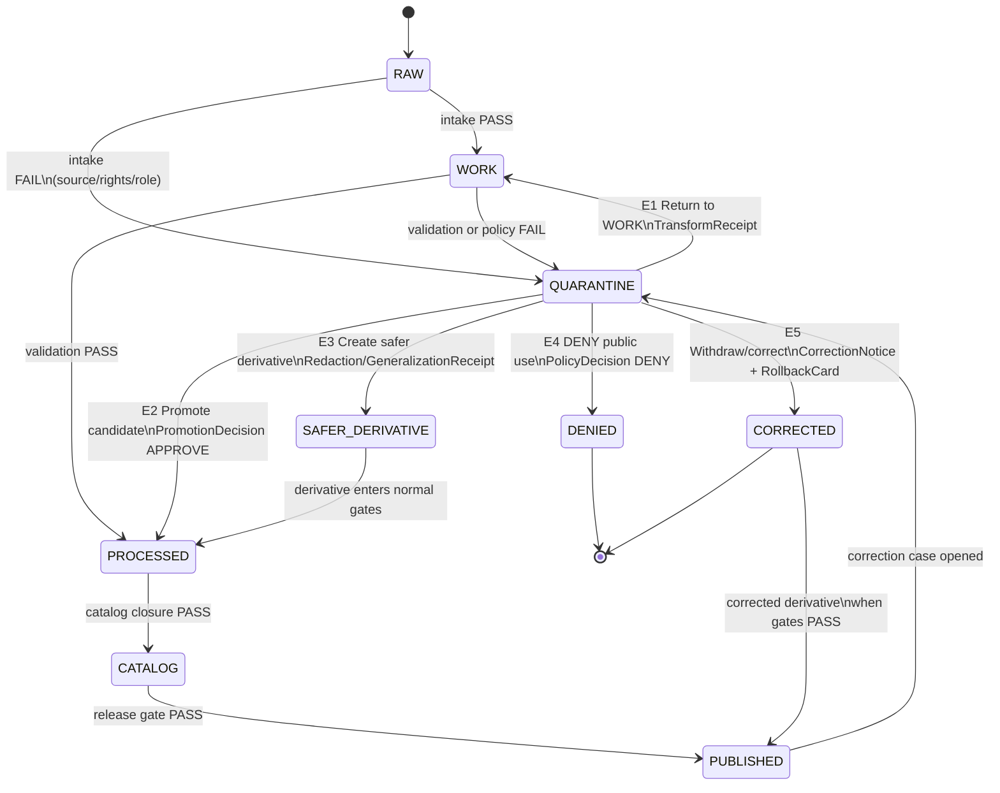

<!-- [KFM_META_BLOCK_V2]
doc_id: kfm://doc/adr-0021
title: ADR-0021 — Quarantine has structured exit paths
type: standard
version: v1.2
status: proposed
owners:
  - architecture-steward # PROPOSED
  - data-steward # PROPOSED
  - policy-steward # PROPOSED
created: 2026-05-09
updated: 2026-07-24
policy_label: public
canonical_path: docs/adr/ADR-0021-quarantine-has-structured-exit-paths.md
path_status: CONFIRMED
related:
  - docs/adr/INDEX.md
  - docs/doctrine/directory-rules.md
  - docs/doctrine/lifecycle-law.md
  - docs/adr/ADR-0001-schema-home--schemas-contracts-v1-is-canonical.md
  - docs/adr/ADR-0012-connector-outputs-to-data-raw-or-data-quarantine-only.md
  - docs/adr/ADR-0018-promotion-gate-sequence.md
  - docs/adr/ADR-0019-ai-adapter-contract-and-finite-envelopes.md
  - docs/adr/ADR-0020-abstain-is-a-first-class-decision.md
  - docs/adr/ADR-0025-public-client-never-reads-canonical-internal-stores.md
  - contracts/runtime/decision_envelope.md
  - contracts/policy/policy_decision.md
  - contracts/release/promotion_decision.md
  - contracts/evidence/evidence_bundle.md
  - contracts/correction/correction_notice.md
  - contracts/release/rollback_card.md
  - docs/runbooks/QUARANTINE_HANDLING.md
tags: [kfm, adr, quarantine, lifecycle, governance, promotion, rollback]
notes:
  - Operationalizes the quarantine lane inside the lifecycle invariant.
  - Codifies five structured quarantine exits as a proposed governed-transition contract.
  - v1.1 fixed metadata-comment safety, path wording, E3/E5 state-machine ambiguity, and evidence boundaries.
  - v1.2 confirms same-path repository identity, repairs related references, aligns current contract vocabulary, and surfaces implementation conflicts without changing decision status.
[/KFM_META_BLOCK_V2] -->

<a id="top"></a>

# ADR-0021 — Quarantine has structured exit paths

> **Proposed decision.** If accepted, every artifact placed in quarantine MUST close through exactly one of five named, governed exits. Each exit must remain auditable; no silent release, unrecorded deletion, or file-move shortcut is permitted.


| Field | Value |
| --- | --- |
| **ID** | `ADR-0021` |
| **Source status** | `proposed` |
| **Effective decision status** | `proposed` — confirmed by the [canonical ADR index](./INDEX.md#numbered-records) |
| **Version** | `v1.2` |
| **Created** | 2026-05-09 |
| **Updated** | 2026-07-24 |
| **Canonical path** | `docs/adr/ADR-0021-quarantine-has-structured-exit-paths.md` |
| **Path evidence** | **CONFIRMED** at `main@fa74cbdc60e1f925d9f7e22024078386bd82e47d` and indexed as `ADR-0021` |
| **Implementation posture** | **PROPOSED**; the exact quarantine-case schema, exit validator, and exit policy named below were not present at the pinned base |
| **Supersedes / superseded by** | — / — |
| **Directory Rules relationship** | Does not amend the rules; applies the canonical `docs/adr/` and `data/quarantine/` responsibilities |
| **Proposed owners** | Architecture steward · Data steward · Policy steward |
| **Proposed review route** | Architecture steward + Policy steward + at least one affected domain steward |
| **Lifecycle invariant touched** | RAW → WORK / **QUARANTINE** → PROCESSED → CATALOG / TRIPLET → PUBLISHED |

> [!IMPORTANT]
> This file records a **proposed** architecture decision. Repository presence, an indexed path, a pull request, a passing documentation check, or a merge does not accept the decision, implement the five exits, authorize release, or make any artifact KFM `PUBLISHED`.

**Quick navigation:** [Status and evidence](#status-and-evidence-boundary) · [Context](#1-context) · [Decision](#2-decision) · [Exit catalog](#exit-catalog) · [State machine](#4-state-machine) · [Required artifacts](#5-required-receipts-and-artifacts) · [Consequences](#6-consequences) · [Alternatives](#7-alternatives-considered) · [Validation](#8-validation-and-enforcement) · [Rollback](#9-rollback-path-for-this-adr) · [Open questions](#10-open-questions) · [References](#11-related-adrs-and-doctrine) · [Quick reference](#quick-reference) · [History](#13-revision-history)

---

## Status and evidence boundary

The modernization baseline is pinned to `main@fa74cbdc60e1f925d9f7e22024078386bd82e47d`. The table separates repository evidence from the future state this ADR proposes.

| Surface | CONFIRMED at the pinned base | What remains PROPOSED or NEEDS VERIFICATION |
| --- | --- | --- |
| Identity and placement | [`INDEX.md`](./INDEX.md#numbered-records) maps `ADR-0021` to this exact file; [Directory Rules](../doctrine/directory-rules.md) place ADRs under `docs/adr/` | Decision acceptance, owner approval, and implementation |
| Lifecycle boundary | [`data/quarantine/README.md`](../../data/quarantine/README.md) is the canonical lane contract and allows governed return, advance, restriction, or denial; [Lifecycle Law](../doctrine/lifecycle-law.md) preserves the trust membrane | A closed five-exit machine and end-to-end enforcement |
| Current decision vocabularies | The proposed [`DecisionEnvelope`](../../contracts/runtime/decision_envelope.md) and schema use `ANSWER`, `ABSTAIN`, `DENY`, and `ERROR`; the proposed [`PromotionDecision`](../../contracts/release/promotion_decision.md) and schema use `APPROVE`, `DENY`, and `ABSTAIN` | Acceptance, runtime wiring, and cross-object composition |
| Operational companions | The [quarantine runbook](../runbooks/QUARANTINE_HANDLING.md) and [review-worker boundary](../../apps/workers/src/quarantine_review_worker/README.md) exist as draft/proposed documentation | Worker source, queue contracts, exit execution, receipts, fixtures, tests, deployment, and observed runs |
| Exit enforcement | Exact reads for `schemas/contracts/v1/governance/quarantine_case_record.schema.json` and `policy/governance/quarantine_exits.rego` returned not found; repository search found `validate_quarantine_exit.py` only in this ADR | Schema, validator, policy, fixtures, CI enforcement, and emitted proof |

> [!WARNING]
> The current quarantine runbook clears remediated material back to `WORK` and separately describes retirement or escalation. This ADR additionally proposes E2–E5 as a closed exit grammar. Until an accepted decision, aligned schema, runbook revision, validators, fixtures, policy, and tests resolve that difference, the five exits are **PROPOSED**, not current executable behavior.

---

## 1. Context

The KFM lifecycle invariant — **RAW → WORK / QUARANTINE → PROCESSED → CATALOG / TRIPLET → PUBLISHED** — names `quarantine` as a first-class lane, but the invariant alone does not say what it means to leave one. Without explicit exits, three failure modes are predictable:

1. **Quarantine as junk drawer.** Records pile up unreviewed. Reviewers cannot tell what is blocked, why, or by whom.
2. **Silent shadow-publishing.** Artifacts move from quarantine into PROCESSED, CATALOG, or PUBLISHED via file copy, label flip, or pipeline shortcut, bypassing validators, policy gates, evidence-bundle creation, catalog closure, and release-decision recording.
3. **Lost correction lineage.** A withdrawal or rollback that originates in quarantine produces no `CorrectionNotice`, no `RollbackCard`, and no durable link between prior and successor `EvidenceBundle`s, so downstream consumers see the change but cannot audit it.

> [!IMPORTANT]
> Promotion is a **governed state transition, not a file move.** A path-level move that bypasses validators, policy gates, evidence-bundle creation, catalog closure, and release-decision recording is a violation of the lifecycle invariant regardless of where the bytes ended up.

Repository and project doctrine provide the basis for this proposal:

- **KFM Build Companion §9** supplies the quarantine triggers, minimum case-record concepts, and candidate exit set. **CONFIRMED doctrine; repository implementation UNKNOWN**.
- **[Directory Rules](../doctrine/directory-rules.md)** define `data/quarantine/` as a lifecycle lane and forbid parallel homes for proofs, receipts, releases, and rollbacks without an ADR. **CONFIRMED placement doctrine**.
- **[`DecisionEnvelope`](../../contracts/runtime/decision_envelope.md)** and its [paired schema](../../schemas/contracts/v1/runtime/decision_envelope.schema.json) define the current proposed runtime vocabulary `ANSWER | ABSTAIN | DENY | ERROR`. **CONFIRMED repository shape; contract status PROPOSED**.
- **[`PromotionDecision`](../../contracts/release/promotion_decision.md)** and its [paired schema](../../schemas/contracts/v1/release/promotion_decision.schema.json) define the current proposed transition vocabulary `APPROVE | DENY | ABSTAIN`. **CONFIRMED repository shape; contract status PROPOSED**.
- **[`PolicyDecision`](../../contracts/policy/policy_decision.md)** and its [paired schema](../../schemas/contracts/v1/policy/policy_decision.schema.json) use `ANSWER | ABSTAIN | DENY | ERROR` with reasons and obligations. **CONFIRMED repository shape; contract status PROPOSED**.

What remains missing is an accepted decision and an enforceable quarantine-exit contract that closes the exit set, names the evidence required for each transition, and forbids every unrecorded alternative.

---

## 2. Decision

**This ADR proposes exactly five structured exit paths.** If accepted, every quarantine case under `data/quarantine/<domain>/<reason>/<run_id>/` MUST close through one, and only one, of these transitions:

| # | Exit | Quarantine-case transition | Proposed decision posture |
|---|---|---|---|
| **E1** | **Return to WORK** | Quarantine case closes; successor re-enters `data/work/` | Remediation and revalidation; no release `PromotionDecision` |
| **E2** | **Promote to PROCESSED candidate** | Quarantine case closes; successor enters the `data/processed/` candidate lane | `PromotionDecision.decision = APPROVE` after required gates |
| **E3** | **Release safer derivative** | Original remains non-public or restricted; a public-safe derivative traverses the normal release path | Policy obligations satisfied and `PromotionDecision.decision = APPROVE` for the derivative |
| **E4** | **DENY public use** | Quarantine case closes as a terminal public-use denial | `PolicyDecision.outcome = DENY`; any evaluated transition remains denied |
| **E5** | **Withdraw / correct release** | Correction case closes through release correction and rollback artifacts | Prior transition denied or withdrawn; corrected successor requires a new `APPROVE` decision |

If this ADR is accepted, the five exits, their preconditions, and their emitted artifacts become normative. Adding, removing, or remapping an exit would then require a superseding ADR.

> [!CAUTION]
> **No path-only exit.** Moving a file out of `data/quarantine/` without the receipt and proof artifacts named in §5 violates the lifecycle invariant and, if accepted, this ADR—regardless of where the bytes end up.

### 2.1 Conformance language

The RFC 2119 terms below describe the proposed accepted state; they are not claims about current executable behavior.

- A pipeline, validator, connector, watcher, reviewer, model adapter, or human action that emits an outbound transition from `data/quarantine/` **MUST** produce the artifacts in §5 for the chosen exit.
- A governed API or public UI surface **MUST NOT** read directly from `data/quarantine/` per the trust membrane. Quarantine state surfaces through reviewer tooling and through governed finite-outcome payloads, never through a normal public route.
- A connector, watcher, or model adapter **MUST NOT** be the actor that promotes a quarantined artifact. Watchers may detect, record, and request review; they do not publish.
- A correction or rollback exit (E5) **MUST NOT** delete prior receipts, proofs, `EvidenceBundle`s, release manifests, or catalog records. It must link prior and successor state through accepted correction and supersession artifacts.
- A safer derivative exit (E3) **MUST NOT** imply that the derivative is evidence-equivalent to the original. Public surfaces must disclose the transform and its bounds without exposing restricted detail.

---

<a id="exit-catalog"></a>

## 3. Exit catalog — the five paths

Each exit is documented with its **allowed-when** rule, the decision vocabulary it uses (`PromotionDecision: APPROVE/DENY/ABSTAIN` or `PolicyDecision` / `DecisionEnvelope: ANSWER/ABSTAIN/DENY/ERROR`), the **artifacts emitted**, and the **forbidden outputs**.

### E1 — Return to WORK

| Field | Value |
|---|---|
| **Direction** | `data/quarantine/<domain>/<reason>/<run_id>/` → `data/work/<domain>/<run_id>/` |
| **Allowed when** | The block is fixable without changing source authority, source role, rights posture, or sensitivity posture. Examples: schema repair, CRS correction, geometry fix, identity disambiguation, `EvidenceRef` rebind, parser drift remediation. |
| **Governance outcome** | Promotion gate not invoked; quarantine is exited through remediation. |
| **Runtime outcome** | Not applicable. The artifact is not yet release-eligible. |
| **Required emissions** | `TransformReceipt`, updated `ValidationReport`, updated quarantine case record (`status: closed`, `closure_reason: returned_to_work`, `successor_ref`). |
| **Forbidden** | Any change to source role, rights posture, or sensitivity class without re-entering source admission. Promotion to PROCESSED in the same step. |

### E2 — Promote to PROCESSED candidate

| Field | Value |
|---|---|
| **Direction** | `data/quarantine/<domain>/<reason>/<run_id>/` → `data/processed/<domain>/<dataset_id>/<version>/` |
| **Allowed when** | Schema, semantic, source-role, identity, and required-review gates pass. Identity is content-addressed where practical (`spec_hash` or equivalent). Source role is compatible with the claim burden. |
| **Governance outcome** | `PromotionDecision.decision = APPROVE` after evidence, policy, review, and rollback prerequisites pass. Any obligations remain explicit in the applicable policy and review artifacts. |
| **Runtime outcome** | Not applicable until the artifact reaches PUBLISHED through the normal promotion gate sequence. |
| **Required emissions** | `DatasetVersion` candidate, `ValidationReport(PASS)`, `PromotionDecision`, `TransformReceipt`, updated quarantine case record (`closure_reason: promoted_to_processed`). |
| **Forbidden** | Direct write to `data/published/`, catalog, triplet, or release manifests. The candidate must traverse normal Promotion Gates A–G or their accepted domain-specific equivalent. |

### E3 — Release safer derivative

| Field | Value |
|---|---|
| **Direction** | Original artifact remains non-public, restricted, or quarantined for public roles. A redacted or generalized derivative is created and traverses the normal release path before any public exposure. |
| **Allowed when** | The original cannot be exposed (precise location, restricted rights, sensitive class), but a public-safe transform exists, the transform is recorded, and required reviewers approve the derivative. |
| **Governance outcome** | Applicable `PolicyDecision` obligations require redaction/generalization; `PromotionDecision.decision = APPROVE` may permit only the derivative after all release gates pass. The original remains denied or restricted for public roles. |
| **Runtime outcome** | The derivative may surface `ANSWER` with public-safe geometry/redaction obligations in the `DecisionEnvelope`. The original surfaces `DENY` for public roles. |
| **Required emissions** | `RedactionReceipt` or `GeneralizationReceipt`, derivative `EvidenceBundle` with schema-supported `transforms`, `rights`, `sensitivity`, `claim_scope`, and citations populated, `ReleaseManifest`, `ReviewRecord`, and an updated quarantine case record (`closure_reason: safer_derivative_released`, `successor_ref`). |
| **Forbidden** | Treating the derivative as evidence-equivalent to the original. Removing fields without recording the transform. Surfacing the original through any public DTO, tile, layer, export, graph projection, AI answer, or dashboard. |

> [!WARNING]
> A jitter, blur, aggregation, suppression, or generalization is a **public-safety transform**, not evidentiary truth. The current proposed `EvidenceBundle` schema records `transforms`, rights, sensitivity, and claim scope; it does not define `limitations` or `excluded_evidence`. Any richer limitation fields require a coordinated contract/schema change. Public projections must still disclose the transform in a governed, non-sensitive form.

### E4 — DENY public use

| Field | Value |
|---|---|
| **Direction** | `data/quarantine/<domain>/<reason>/<run_id>/` → terminal public-use denial; the artifact does not leave quarantine for any public-bound lane. |
| **Allowed when** | Rights are unresolved or refused; sensitivity policy fails closed (rare species, archaeology, infrastructure, cultural material, living-person data, DNA/genomic data, exact-location exposure); source role is invalid for the requested claim; or correction policy forbids re-exposure. |
| **Governance outcome** | `PolicyDecision.outcome = DENY` and, where a lifecycle transition is evaluated, `PromotionDecision.decision = DENY`, with safe reasons recorded in the owning artifacts. |
| **Runtime outcome** | `DecisionEnvelope.outcome = DENY` for a consuming surface that requests prohibited public use. `QUARANTINE` remains lifecycle state, not a value added to the runtime outcome enum. |
| **Required emissions** | `PolicyDecision(DENY)`, source registry status update (`access_class`, `rights_posture`, `deactivation_reason` where applicable), quarantine case record closed with `closure_reason: deny_public_use`. |
| **Forbidden** | Silent withdrawal without `PolicyDecision`. Re-attempting the same exit without a new evidence basis. Re-attempts with new evidence MUST open or link a fresh case record. |

### E5 — Withdraw / correct release

| Field | Value |
|---|---|
| **Direction** | A correction case is opened against an already-PUBLISHED artifact. Quarantine is the originating lane for the correction or rollback; public aliases are withdrawn, corrected, or superseded only through governed release artifacts. |
| **Allowed when** | A published artifact is materially affected by an error, new evidence that supersedes prior evidence, a rights or sensitivity reclassification, or a downstream legal, cultural, source-authority, or steward objection. |
| **Governance outcome** | `PromotionDecision.decision = DENY` for the affected prior transition and, where applicable, a new `PromotionDecision.decision = APPROVE` for a corrected derivative or supersession. |
| **Runtime outcome** | Runtime resolution returns the corrected released bundle or `ABSTAIN` / `DENY` according to policy and release state, while exposing public-safe correction lineage. The current `EvidenceBundle` schema has no status field. |
| **Required emissions** | `CorrectionNotice`, `RollbackCard`, affected-release list, updated `ReleaseManifest`, a new or corrected `EvidenceBundle`, `ReviewRecord`, and an updated quarantine case record (`closure_reason: withdraw_correct_release`). Prior bundles, receipts, and proofs remain immutable; the exact cross-object supersession fields are **NEEDS VERIFICATION** because the current proposed `EvidenceBundle` schema does not define them. |
| **Forbidden** | Deletion of any prior receipt, proof, `EvidenceBundle`, catalog record, or release manifest. Silent alias replacement without `RollbackCard`. Treating a correction as `Return to WORK` (E1). Corrections traverse this exit, not E1. |

---

## 4. State machine

The five exits collapse cleanly into a state machine. Quarantine is the only state with five outbound exit classes; every public-facing transition still uses its own validation, catalog, policy, review, and release gates.


```mermaid
stateDiagram-v2
    [*] --> RAW
    RAW --> WORK : intake PASS
    RAW --> QUARANTINE : intake FAIL\n(source/rights/role)
    WORK --> QUARANTINE : validation or policy FAIL
    WORK --> PROCESSED : validation PASS
    PROCESSED --> CATALOG : catalog closure PASS
    CATALOG --> PUBLISHED : release gate PASS

    QUARANTINE --> WORK : E1 Return to WORK\nTransformReceipt
    QUARANTINE --> PROCESSED : E2 Promote candidate\nPromotionDecision APPROVE
    QUARANTINE --> SAFER_DERIVATIVE : E3 Create safer derivative\nRedaction/GeneralizationReceipt
    SAFER_DERIVATIVE --> PROCESSED : derivative enters normal gates
    QUARANTINE --> DENIED : E4 DENY public use\nPolicyDecision DENY

    PUBLISHED --> QUARANTINE : correction case opened
    QUARANTINE --> CORRECTED : E5 Withdraw/correct\nCorrectionNotice + RollbackCard
    CORRECTED --> PUBLISHED : corrected derivative\nwhen gates PASS
    DENIED --> [*]
    CORRECTED --> [*]
```

> [!NOTE]
> The `PUBLISHED → QUARANTINE → CORRECTED` path is intentional. Corrections originate as quarantine cases so that the same exit grammar (case record, reason codes, reviewer queue, audit refs) applies to corrections as to first-time blocks.

---

## 5. Required receipts and artifacts

If accepted, each exit MUST emit the artifacts named below. Receipts and proofs are emitted *alongside* lifecycle directories, not in place of them. The responsibility roots are repository-confirmed; unlinked domain subpaths and the quarantine case shape remain `PROPOSED`.

| Exit | Required artifact families | Proposed home |
|---|---|---|
| **E1** | `TransformReceipt`, updated `ValidationReport`, updated quarantine case record | `data/receipts/<domain>/transform/`; `data/receipts/<domain>/validation/`; `data/quarantine/<domain>/<reason>/<run_id>/case.json` |
| **E2** | `DatasetVersion` candidate, `ValidationReport(PASS)`, `PromotionDecision`, `TransformReceipt` | `data/processed/<domain>/<dataset_id>/<version>/`; `data/receipts/<domain>/promotion/`; `data/receipts/<domain>/transform/` |
| **E3** | `RedactionReceipt` or `GeneralizationReceipt`, derivative `EvidenceBundle`, `ReleaseManifest`, `ReviewRecord` | Proposed domain subpaths under [`data/receipts/`](../../data/receipts/), [`data/proofs/`](../../data/proofs/), and `release/manifests/` |
| **E4** | `PolicyDecision.outcome = DENY`, source registry status update, closed quarantine case record | `data/receipts/<domain>/policy/`; `data/registry/sources/<domain>/`; `data/quarantine/<domain>/<reason>/<run_id>/case.json` |
| **E5** | `CorrectionNotice`, `RollbackCard`, affected-release list, updated `ReleaseManifest`, corrected or successor `EvidenceBundle`, `ReviewRecord` | Confirmed roots [`release/correction_notices/`](../../release/correction_notices/), [`release/rollback_cards/`](../../release/rollback_cards/), [`data/proofs/`](../../data/proofs/), and [`data/receipts/`](../../data/receipts/); exact domain subpaths remain proposed |

Every emission MUST carry a stable join key (`decision_id`, `case_id`, or a successor accepted by schema ADR) so audit replays can reconstruct the chain across receipts, policy decisions, release artifacts, and public DTOs.

### 5.1 Quarantine case-record minimum content

The quarantine case record is the proposed structural anchor for every exit. If this ADR is accepted, its schema MUST cover at least the semantics below and closure MUST append or update auditable state rather than erase the open-case history.

> [!NOTE]
> The JSON below is an illustrative target shape. No matching repository schema exists at the pinned base, so field names and enum placement are not current machine authority.

```json
{
  "case_id": "qcase:...",
  "decision_id": "decision:...",
  "subject_ref": "evidence://... | source://... | release://...",
  "reason_codes": [
    "rights.unknown",
    "sensitivity.exact_location",
    "evidence.unresolved",
    "source_role.invalid"
  ],
  "plain_language_reason": "Reviewer-readable explanation.",
  "blocked_stage": "RAW | WORK | PROCESSED_CANDIDATE | RELEASE_CANDIDATE | UI_PAYLOAD | CORRECTION_CANDIDATE",
  "required_review": [
    "steward",
    "policy",
    "domain",
    "source_rights",
    "security",
    "cultural",
    "release"
  ],
  "candidate_safer_representation": "generalization | redaction | delayed_release | restricted_access | abstention | none",
  "exit_criteria": [
    "Specific facts, receipts, approvals, or transforms required to leave quarantine."
  ],
  "audit_refs": [
    "validation_report://...",
    "policy_decision://...",
    "review_record://..."
  ],
  "created_time": "2026-05-09T00:00:00Z",
  "updated_time": "2026-05-15T00:00:00Z",
  "status": "open | closed",
  "closure_reason": "returned_to_work | promoted_to_processed | safer_derivative_released | deny_public_use | withdraw_correct_release",
  "closure_time": "2026-05-15T00:00:00Z",
  "successor_ref": "evidence://... | release://... | dataset://... | none",
  "restricted_ref": "evidence://... | source://... | none"
}
```

> [!NOTE]
> The Directory Rules confirm `schemas/contracts/v1/` as the default machine-shape root. The exact proposed file `schemas/contracts/v1/governance/quarantine_case_record.schema.json` was not present at the pinned base; its subfolder, fields, and compatibility plan remain **NEEDS VERIFICATION**.

### 5.2 Closure reason enum

The proposed closed-set enum is:

| Exit | `closure_reason` |
|---|---|
| E1 | `returned_to_work` |
| E2 | `promoted_to_processed` |
| E3 | `safer_derivative_released` |
| E4 | `deny_public_use` |
| E5 | `withdraw_correct_release` |

After acceptance and schema publication, changing this enum would require a superseding ADR or an accepted compatible schema-version decision.

---

## 6. Consequences

<details>
<summary><strong>Positive</strong></summary>

- **Auditable.** A reviewer can replay the entire life of a quarantined artifact from one `case_id` through a finite set of receipt families.
- **Finite.** Five exits is a closed set; every governance subsystem can compose against it without per-domain status proliferation.
- **Composable with distinct decisions.** Exits map to the proposed runtime/policy outcome set (`ANSWER | ABSTAIN | DENY | ERROR`) and promotion decision set (`APPROVE | DENY | ABSTAIN`) without flattening lifecycle state into either vocabulary.
- **Protects the trust membrane.** A public route never reads quarantine; quarantine surfaces only through reviewer tooling and through governed finite-outcome envelopes.
- **Preserves correction lineage.** Corrections originate as quarantine cases and exit through E5, which guarantees `CorrectionNotice` + `RollbackCard` emission. No silent supersession.
- **Supports rollback drills.** Exit E5 is replayable; a stable join key links every artifact in the correction chain.

</details>

<details>
<summary><strong>Negative</strong></summary>

- **Operational overhead.** Every quarantine departure now produces named receipts. Pipelines, validators, and reviewer tools must emit them.
- **More receipt and decision integration.** Proposed semantic contracts and paired schemas exist for `PolicyDecision`, `PromotionDecision`, `EvidenceBundle`, `CorrectionNotice`, and `RollbackCard`, but the quarantine-case schema, exit validator, exit policy, cross-object lineage fields, fixtures, and end-to-end tests remain absent or **NEEDS VERIFICATION**.
- **Reviewer load.** Long-lived cases must be revisited; `created_time` and `updated_time` make limbo visible but do not resolve it on their own.
- **Test surface growth.** Resolver, policy, and promotion tests gain one scenario per exit plus negative fixtures for missing receipts, path-only moves, and false verification.

</details>

<details>
<summary><strong>Mitigations</strong></summary>

- A single quarantine-case schema covers all five exits; only `closure_reason`, `successor_ref`, `restricted_ref`, and emitted artifact refs differ at closure.
- Receipt families stay under existing responsibility roots; this ADR adds no new repo root.
- A reviewer dashboard (PROPOSED) can pivot on `reason_codes`, `blocked_stage`, `required_review`, `updated_time`, and `candidate_safer_representation` to surface stuck cases.
- A compatibility receipt can preserve old enum values during future supersession without deleting historical receipts.

</details>

---

## 7. Alternatives considered

| Alternative | Why rejected |
|---|---|
| **Quarantine as informal holding pen.** Records sit until a steward decides; no enumerated exits. | Recreates the "junk drawer" failure mode (§1). Reviewers cannot tell what is blocked, why, or under what condition it could leave. Defeats audit. |
| **Two exits only — `release` and `deny`.** | Erases the distinction between fixable defects (E1), policy-permanent denials (E4), safer-derivative releases (E3), and corrections (E5). Forces correction lineage to be reconstructed from receipts after the fact. |
| **Direct WORK → PUBLISHED with a `quarantine: true` flag.** | Violates the lifecycle invariant — promotion would no longer be a governed state transition. The flag would become the new shadow-publishing surface. |
| **Folding quarantine into the runtime envelope (`ABSTAIN`).** | Conflates operational state with finite outcome. A surface can be `ANSWER` at runtime while an internal source, exact geometry, or upstream candidate remains operationally `QUARANTINE`; a single-vocabulary collapse loses that distinction. |
| **Per-domain exit sets.** Hydrology has its own exits; archaeology has others. | Causes status proliferation. Domain-specific *reason codes* are correct (`sens.exact_location`, `taxon.unresolved`); domain-specific *exits* are not. Five exits compose across all domains. |
| **Quarantine emits no receipts on E1 (Return to WORK).** | Loses the audit trail for the most common exit. The `TransformReceipt` is what proves the fix happened and what changed. |

---

## 8. Validation and enforcement

This ADR becomes enforceable only when the required artifacts exist and pass. The repository-grounded status below is pinned to `main@fa74cbdc60e1f925d9f7e22024078386bd82e47d`.

| Enforcement surface | Required check | Repository-grounded status |
| --- | --- | --- |
| Schema | A quarantine-case schema requires one of the five closure reasons, closure time, stable join references, and exit-specific evidence. | **CONFIRMED absent at the named path / PROPOSED** |
| Validator | `validate_quarantine_exit.py` (or an accepted equivalent) fails any closure missing the required evidence for its declared exit. | **CONFIRMED not found outside this ADR / PROPOSED** |
| Policy | Quarantine-exit policy rejects non-canonical exits, missing evidence, and public reads from quarantine. | **CONFIRMED absent at the named path / PROPOSED** |
| Worker or pipeline | A bounded worker may prepare review candidates and receipts but cannot decide, promote, publish, or mutate lifecycle state independently. | [Boundary README present](../../apps/workers/src/quarantine_review_worker/README.md); source and runtime **NEEDS VERIFICATION** |
| Tests and fixtures | At least one positive case per exit plus negative cases for missing evidence, path-only moves, undisclosed transforms, stale references, and false verification. | **CONFIRMED not found for this five-exit contract / PROPOSED** |
| Documentation CI | ADR index validation checks unique IDs and filename/H1/index coherence. | [Workflow present](../../.github/workflows/docs-control-plane.yml); it does **not** enforce quarantine behavior |

> [!IMPORTANT]
> No `verified: true` boolean may be trusted on a quarantine exit unless the validator named above emits PASS for that case. Verification is an emitted result, not a hand-written assertion.

---

## 9. Rollback path for this ADR

This ADR itself can be rolled back — but the change is governed.

1. Open a superseding ADR (`ADR-NNNN-quarantine-exit-revision.md`) with `status: proposed` and `supersedes: ADR-0021`.
2. Mark this ADR `status: superseded` and add a forward link in the KFM Meta Block and in the header table.
3. Migrate any quarantine cases whose `closure_reason` enum value is removed by the new ADR through a one-pass compatibility receipt (`closure_reason_legacy: <old>`, `closure_reason: <new>`).
4. Do not delete past receipts, proofs, release manifests, case records, or EvidenceBundles. Supersession is append-only.
5. Run the quarantine-exit validator over historical fixtures to prove the supersession does not strand prior cases.

---

## 10. Open questions

- **OPEN.** Should the five `closure_reason` values be frozen exactly as `returned_to_work | promoted_to_processed | safer_derivative_released | deny_public_use | withdraw_correct_release`? The exact quarantine-case schema is absent, so this remains a proposed enum.
- **OPEN.** Should E3 (safer derivative) require a `ReviewRecord` for **every** domain, or only for sensitivity-bearing domains (archaeology, fauna sensitive species, infrastructure, cultural material, living-person data)? Default in this ADR: required for all; a domain-specific carve-out would need its own ADR.
- **NEEDS VERIFICATION.** Whether the exact schema home should be `schemas/contracts/v1/governance/`, `schemas/contracts/v1/quarantine/`, or another accepted subfolder under the confirmed `schemas/contracts/v1/` root.
- **CONFIRMED path presence / NEEDS VERIFICATION behavior.** [`release/correction_notices/`](../../release/correction_notices/) and [`release/rollback_cards/`](../../release/rollback_cards/) exist at the pinned base. Their runtime writers, review bindings, schema completeness, emitted objects, and rollback execution remain unverified.
- **OPEN.** Reviewer-queue routing: which `required_review` value drives the SLA clock? This ADR does not specify SLAs; a separate ops ADR is anticipated.
- **CONFIRMED local shape / NEEDS VERIFICATION end to end.** The proposed `PolicyDecision` and `DecisionEnvelope` schemas require `decision_id`; `PromotionDecision` uses `id` and `EvidenceBundle` uses `bundle_id`. A cross-object quarantine join contract is not yet verified.
- **OPEN.** Whether E4 terminal denials should keep the case physically under `data/quarantine/` indefinitely, or move to a restricted denial archive after a closed-case retention policy is accepted.

---

## 11. Related ADRs and doctrine

Every numbered ADR below remains effectively `proposed` in the canonical index. Links prove repository presence and relationship, not acceptance or implementation.

| Reference | Repository state | Relationship |
| --- | --- | --- |
| [ADR index](./INDEX.md#numbered-records) | CONFIRMED | Maps `ADR-0021` to this file and keeps its effective status `proposed`. |
| [Directory Rules](../doctrine/directory-rules.md) | CONFIRMED placement doctrine | Places ADRs under `docs/adr/`, schemas under `schemas/`, and lifecycle material under `data/`. |
| [Lifecycle Law](../doctrine/lifecycle-law.md) | Draft doctrine | Defines the lifecycle invariant and publication boundary this ADR applies. |
| [ADR-0001](./ADR-0001-schema-home--schemas-contracts-v1-is-canonical.md) | Effective status `proposed` | Proposes `schemas/contracts/v1/` as the schema home. |
| [ADR-0012](./ADR-0012-connector-outputs-to-data-raw-or-data-quarantine-only.md) | Effective status `proposed` | Constrains connector output to RAW or QUARANTINE. |
| [ADR-0018](./ADR-0018-promotion-gate-sequence.md) | Effective status `proposed` | Defines the proposed promotion-gate sequence and links back to this ADR. |
| [ADR-0019](./ADR-0019-ai-adapter-contract-and-finite-envelopes.md) | Effective status `proposed` | Separates model adapters from governed finite envelopes. |
| [ADR-0020](./ADR-0020-abstain-is-a-first-class-decision.md) | Effective status `proposed` | Defines `ABSTAIN` within the proposed runtime outcome set. |
| [ADR-0025](./ADR-0025-public-client-never-reads-canonical-internal-stores.md) | Effective status `proposed` | Denies ordinary public-client reads from quarantine and other internal stores. |
| [`DecisionEnvelope`](../../contracts/runtime/decision_envelope.md) + [schema](../../schemas/contracts/v1/runtime/decision_envelope.schema.json) | PROPOSED contract/schema | Runtime outcomes: `ANSWER`, `ABSTAIN`, `DENY`, and `ERROR`. |
| [`PolicyDecision`](../../contracts/policy/policy_decision.md) + [schema](../../schemas/contracts/v1/policy/policy_decision.schema.json) | PROPOSED contract/schema | Policy outcomes, reasons, and obligations. |
| [`PromotionDecision`](../../contracts/release/promotion_decision.md) + [schema](../../schemas/contracts/v1/release/promotion_decision.schema.json) | PROPOSED contract/schema | Transition decisions: `APPROVE`, `DENY`, and `ABSTAIN`. |
| [`EvidenceBundle`](../../contracts/evidence/evidence_bundle.md) + [schema](../../schemas/contracts/v1/evidence/evidence_bundle.schema.json) | PROPOSED contract/schema | Evidence closure; current schema has no `limitations`, `excluded_evidence`, or supersession fields. |
| [`CorrectionNotice`](../../contracts/correction/correction_notice.md) and [`RollbackCard`](../../contracts/release/rollback_card.md) | PROPOSED contracts | Correction explanation and rollback target remain distinct from execution proof. |
| [Quarantine lane README](../../data/quarantine/README.md) | Repository-grounded draft | Confirms the canonical lane and broad governed exit posture, not the closed five-exit implementation. |
| [Quarantine handling runbook](../runbooks/QUARANTINE_HANDLING.md) | Draft | Operational companion that currently clears remediated cases to WORK; requires reconciliation if this ADR is accepted. |

---

<a id="quick-reference"></a>

## 12. Appendix — quick reference card

<details>
<summary><strong>Five exits at a glance</strong></summary>

```text
QUARANTINE
  ├─ E1  Return to WORK
  │       when:  fixable defect, no source/sensitivity change
  │       emits: TransformReceipt, ValidationReport (updated)
  │
  ├─ E2  Promote to PROCESSED candidate
  │       when:  schema + semantic + source-role + identity gates PASS
  │       emits: DatasetVersion, PromotionDecision (APPROVE), TransformReceipt
  │
  ├─ E3  Release safer derivative
  │       when:  original restricted; redacted/generalized derivative reviewed
  │       emits: RedactionReceipt or GeneralizationReceipt,
  │              EvidenceBundle (transforms, rights, sensitivity, and claim scope),
  │              ReleaseManifest, ReviewRecord
  │
  ├─ E4  DENY public use
  │       when:  rights/sensitivity/source-role permanently block exposure
  │       emits: PolicyDecision (DENY), source registry status update
  │
  └─ E5  Withdraw / correct release
          when:  published artifact affected by error, new evidence, rights, or sensitivity
          emits: CorrectionNotice, RollbackCard, affected-release list,
                 updated ReleaseManifest, corrected/successor EvidenceBundle, ReviewRecord
```

</details>

---

## 13. Revision history

| Version | Date | Change | Decision effect |
| --- | --- | --- | --- |
| `v1.1` | 2026-05-15 | Clarified metadata safety, path wording, E3/E5 state-machine intent, and evidence boundaries. | None; remained `proposed`. |
| `v1.2` | 2026-07-24 | Confirmed same-path repository identity; repaired references and removed the unverified badge strip; aligned current proposed contract vocabularies; removed unsupported EvidenceBundle field claims; recorded runbook and enforcement gaps. | None; remains `proposed`. |

<p align="right"><a href="#top">Back to top</a></p>
