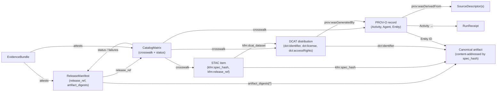

<!-- [KFM_META_BLOCK_V2]
doc_id: kfm://doc/adr-0022-catalog-matrix-stac-dcat-prov-must-agree
title: ADR-0022 — Catalog Matrix · STAC + DCAT + PROV Must Agree
type: standard
version: v1.1
status: proposed
owners: TODO — Catalog steward, Release steward, Docs steward
created: 2026-05-09
updated: 2026-05-15
policy_label: public
related:
  - docs/adr/ADR-0001-schema-home.md
  - docs/adr/README.md
  - docs/architecture/contract-schema-policy-split.md
  - docs/doctrine/directory-rules.md
  - docs/standards/                            # STAC, DCAT, PROV-O conformance pages
  - docs/registers/CANONICAL_LINEAGE_EXPLORATORY.md
  - docs/registers/VERIFICATION_BACKLOG.md
  - schemas/contracts/v1/catalog/catalog_matrix.schema.json   # PROPOSED
  - tools/validators/catalog/                                  # PROPOSED
  - policy/promotion/catalog_matrix.rego                       # PROPOSED
  - tools/resolvers/release/resolve_release_manifest.py        # PROPOSED
  - data/catalog/matrix/                                       # PROPOSED
tags: [kfm, adr, catalog, stac, dcat, prov, governance, promotion, closure]
notes:
  - Codifies the "must agree" rule as a release-level invariant.
  - v1.1 clarifies evidence boundary, Directory Rules placement basis, minimum matrix shape, and verification checklist.
  - Authority for paths is PROPOSED until verified against the mounted repo.
[/KFM_META_BLOCK_V2] -->

# ADR-0022 — Catalog Matrix · STAC + DCAT + PROV Must Agree

> **One-line decision.** Every promoted KFM release MUST emit a `CatalogMatrix`
> that crosswalks STAC, DCAT, and PROV-O records by **identifier, digest, and
> release reference**, and the closure resolver MUST deny promotion when the
> three vocabularies do not agree.

| Field | Value |
|---|---|
| **ADR ID** | ADR-0022 |
| **Title** | Catalog Matrix · STAC + DCAT + PROV Must Agree |
| **Status** | `proposed` *(doctrinal rule supported by the corpus; implementation paths remain PROPOSED until verified against a mounted repo)* |
| **Date** | 2026-05-09; revised 2026-05-15 |
| **Authors** | TODO — Catalog steward, Release steward |
| **Reviewers** | TODO — Docs steward + Promotion-gate owner + at least one domain steward |
| **Supersedes** | — |
| **Superseded by** | — |
| **Related** | ADR-0001 (schema home); Directory Rules §2.4 / §2.5 / §9.1; contract-schema-policy split; Habitat, Hydrology, Archaeology, Transport, Settlements, Fauna domain blueprints (catalog-closure rule) |
| **Truth posture** | Doctrine **CONFIRMED** by supplied corpus; concrete repo paths, current implementation, CI behavior, and route names **PROPOSED / UNKNOWN / NEEDS VERIFICATION** until repo evidence is inspected |

---

## Quick Jump

[Evidence Boundary](#0-evidence-boundary-and-directory-rules-basis) ·
[Context](#1-context) ·
[Decision](#2-decision) ·
[Agreement Matrix](#3-the-agreement-matrix-what-must-agree) ·
[Closure Diagram](#4-closure-graph) ·
[Schema · Validator · Policy](#5-schema-validator-policy-fixtures) ·
[Promotion Gate](#6-promotion-gating) ·
[Consequences](#7-consequences) ·
[Alternatives](#8-alternatives-considered) ·
[Migration](#9-migration-plan) ·
[Verification Checklist](#94-verification-checklist) ·
[Rollback](#10-rollback-plan) ·
[Open Questions](#11-open-questions) ·
[References](#12-references)

---

## 0. Evidence boundary and Directory Rules basis

> [!NOTE]
> This ADR states KFM doctrine where supported by the supplied corpus and the
> existing ADR text. It does **not** prove that any referenced repository path,
> workflow, validator, resolver, CI job, route, dashboard, package, or emitted
> proof object exists in the current repo. Current implementation depth remains
> **UNKNOWN** until a mounted repo, tests, workflows, manifests, logs, or emitted
> artifacts are inspected.

Directory Rules are treated as placement doctrine for this update: root folders
encode responsibility, not topic; schema field shape defaults to
`schemas/contracts/v1/<...>`; and lifecycle data remains under the governed
`data/` phases. If mounted repo evidence contradicts these homes, reviewers MUST
raise a drift entry rather than silently treating the repo shape as new canon.

| File family | Directory Rules basis | Status in this ADR |
|---|---|---|
| `schemas/contracts/v1/catalog/catalog_matrix.schema.json` | Field-level machine schema home under the ADR-0001 default | **PROPOSED** until verified |
| `contracts/catalog/catalog_matrix.md` | Object-family meaning / semantic contract | **PROPOSED** until verified |
| `policy/promotion/catalog_matrix.rego` | Admissibility and promotion decision logic | **PROPOSED** until verified |
| `data/catalog/matrix/<domain>/<release_id>.json` | CATALOG-phase emitted closure artifact | **PROPOSED** until verified |
| `tools/validators/catalog/catalog_matrix.py` | Validation utility under implementation tooling | **PROPOSED** until verified |
| `tools/release/build_catalog_matrix.py` and release resolver paths | Release tooling; exact resolver home remains unsettled | **NEEDS VERIFICATION** |

**No parallel authority.** If the mounted repo already uses `contracts/catalog/`
as a machine-schema home, this ADR does not authorize silently maintaining both
`contracts/catalog/...` and `schemas/contracts/v1/catalog/...` as competing
schema authorities. Resolve the conflict through ADR-0001 / Directory Rules drift
handling before landing machine files.

---

## 1. Context

KFM publishes spatiotemporal artifacts to the open web through three
overlapping but non-redundant catalog vocabularies:

- **STAC** — describes spatiotemporal assets so pipelines and clients can
  *discover* them.
- **DCAT (v3)** — describes datasets and distributions so external standards
  bodies and aggregators can *interoperate* with them.
- **PROV-O** — describes activities, agents, and entities so downstream
  consumers can *trace* the lineage that produced them.

The corpus is unambiguous that these three are **concentric layers of catalog
closure, not alternatives**. Each vocabulary carries a share of the trust
burden, and each is linked to the others by stable identifiers and KFM
extension fields:

> *"STAC item → DCAT distribution → PROV record → canonical artifact via
> `spec_hash`; the EvidenceBundle covers the whole closure with attestations."*
> — KFM Catalog Closure doctrine (Pass 11/12 corpus)

The recurring failure mode named in the corpus is **catalog drift**: STAC says
one digest, DCAT carries a different checksum, PROV references an upstream
entity that no longer matches, and a release ships with three "truths" that
disagree. Per-record validators catch shape problems but cannot catch
*cross-record* disagreement; that requires an explicit closure proof.

> [!IMPORTANT]
> **Catalog drift is the stealthiest failure mode in a distributed publication
> system.** Per-vocabulary validators prove each record is internally
> well-formed; only a cross-vocabulary closure check proves the corpus is
> *mutually* well-formed.

Multiple domain blueprints (Habitat, Hydrology, Archaeology, Transport,
Settlements, Fauna, Hazards) already specify a per-domain
`<domain>CatalogMatrix` artifact and a `validate_catalog_matrix.py`-style
validator. This ADR promotes that recurring pattern into a repo-wide rule and
fixes its agreement contract.

### 1.1 Forces

| Force | Pressure |
|---|---|
| **Trust** | Public consumers, external auditors, and downstream federators must be able to verify that STAC, DCAT, and PROV records describe the *same* artifact at the same digest under the same release. |
| **Standards reuse** | KFM rides existing tooling (STAC Browser, pystac, stac-fastapi, pgstac, DCAT aggregators, PROV-O processors). Forking these standards is not on the table; closure must be additive. |
| **Promotion determinism** | Promotion must fail closed when closure breaks. Manual review cannot scale to per-release cross-record checks. |
| **Auditability** | Reviewers need a single inspectable surface that answers *"is this artifact fully governed?"* without traversing three separate catalog graphs. |
| **Cost** | A matrix per release is small storage but adds an artifact, a schema, a validator, a policy module, and a CI step. |

---

## 2. Decision

KFM adopts the following rules for the **release-level** catalog plane.

### 2.1 The "must agree" invariant

> **MUST.** For every promoted release, the STAC item(s), DCAT
> distribution(s), and PROV-O record(s) describing the released artifact(s)
> MUST agree on:
>
> 1. **Identifier** — `kfm:spec_hash` on the STAC item, `dct:identifier` on
>    the DCAT distribution, and the PROV-O `Entity` ID for the same artifact
>    MUST resolve to the same canonical artifact identity.
> 2. **Digest / checksum** — STAC asset checksum, DCAT distribution checksum
>    (e.g., `spdx:checksum` or equivalent), and the digest recorded in the
>    `ReleaseManifest` MUST match byte-for-byte.
> 3. **Release reference** — STAC, DCAT, and PROV records MUST carry the same
>    `release_ref` (or KFM-extension equivalent) pointing at the immutable
>    `ReleaseManifest`.
>
> Disagreement on any of (1)–(3) is a **DENY** at the promotion gate.

### 2.2 The Catalog Matrix is the explicit closure object

> **MUST.** Every promoted release MUST emit a `CatalogMatrix` artifact that
> records the STAC ↔ DCAT ↔ PROV crosswalk, the agreed identifiers and
> digests, the `ReleaseManifest` reference, the `EvidenceBundle` reference,
> and the source-descriptor references used. The matrix is generated
> **alongside** closure resolution, not instead of it.

> **SHOULD.** At intermediate stages (PROCESSED, candidate-catalog), a
> `CatalogMatrix` MAY be emitted for debugging and review surfaces but is
> **not** a release proof.

### 2.3 The closure resolver is the live enforcement

> **MUST.** A `ReleaseManifest` closure resolver MUST verify, at promotion
> time, that every reference (`artifact_ref`, `provenance_ref`,
> `evidence_ref`, `stac_ref`, `dcat_ref`, `run_receipt_ref`,
> `attestation_ref`) actually resolves and that the `CatalogMatrix`
> agreement holds. The resolver returns a finite outcome
> `{ PUBLISHABLE | ABSTAIN | DENY | ERROR }` with `failures[]` and
> `warnings[]`.

### 2.4 The cross-linkage convention

> **MUST.** Cross-vocabulary links use the conventional fields:
>
> - STAC → DCAT via `kfm:dcat_dataset`
> - DCAT → PROV via `prov:wasGeneratedBy`
> - PROV → upstream entities via `prov:wasDerivedFrom`
> - Every leaf carries `kfm:spec_hash` so the graph is stable under
>   content-addressed identity.

### 2.5 Scope

This ADR governs the **release-level** catalog plane. It does **not** decide:

- Per-domain object meaning. Domain-specific semantics belong under the
  appropriate `contracts/` lane and remain subject to Directory Rules.
- Per-domain field shape. Machine schemas use `schemas/contracts/v1/<domain>/`
  by default per ADR-0001 unless an accepted ADR says otherwise.
- Sensitivity, rights, or publication-class policy. Those decisions live under
  the appropriate `policy/`, `data/registry/`, review, and release surfaces.

Per-domain blueprints MAY add additional fields to a domain-scoped matrix
(e.g., `HabitatCatalogMatrix` at `data/catalog/matrix/habitat/*.json`) but
MUST satisfy the agreement contract in §2.1.

### 2.6 Public-interface rule

> **MUST.** Public clients, reviewer UIs, Focus Mode, exports, and dashboards
> consume the matrix only through governed APIs, released artifacts, proof packs,
> or catalog records. The `CatalogMatrix` is a release artifact and inspection
> surface; it is not permission for a public client to read canonical stores,
> unpublished candidate records, RAW, WORK, or QUARANTINE directly.

---

## 3. The Agreement Matrix — what must agree

The three vocabularies carry overlapping facts about the same artifact. This
ADR pins the *exact* fields that MUST agree across all three.

| Fact | STAC field | DCAT field | PROV-O field | Source of truth |
|---|---|---|---|---|
| **Canonical artifact identity** | `properties.kfm:spec_hash` | `dct:identifier` *(MUST embed `kfm:spec_hash`)* | `Entity` ID *(MUST encode `kfm:spec_hash`)* | Canonical artifact identity / content hash recorded in the `ReleaseManifest` |
| **Bytewise digest** | `assets.<role>.checksum:*` (multihash) | Distribution `spdx:checksum` *(or equivalent)* | `Entity` `prov:value` digest property | `ReleaseManifest.artifact_digests[*]` |
| **Release reference** | `properties.kfm:release_ref` | `kfm:release_ref` (extension) | `Activity.scope` / `kfm:release_ref` | `ReleaseManifest.release_ref` |
| **Producing activity** | `links[rel=prov]` | `prov:wasGeneratedBy` | `Activity` (this record) | PROV-O `Activity` ID |
| **Upstream sources** | `links[rel=derived_from]` | `prov:hadPrimarySource` *(where applicable)* | `prov:wasDerivedFrom` (Entity → Entity) | Source-descriptor canonical IDs |
| **License** | inherited from STAC Collection | `dct:license` *(controlled SPDX-aligned vocabulary)* | recorded as agent attribution where relevant | DCAT distribution (authoritative) |
| **Access rights** | `properties.kfm:rights_status` | `dct:accessRights` *(controlled enum)* | recorded as policy label on `Activity` | DCAT distribution (authoritative) |
| **Run receipt pointer** | `properties.kfm:run_receipt_url` | `kfm:run_receipt_url` (extension) | `Activity` ID linked to `RunReceipt` | `data/receipts/<domain>/<run_id>/run_receipt.json` |
| **EvidenceBundle pointer** | `links[rel=evidence]` | `kfm:evidence_bundle_ref` (extension) | linked from generated `Entity` | `data/proofs/<domain>/releases/<release_id>/evidence_bundle.json` |

**Authoritative sources** when fields disagree:

- **License + access rights** — DCAT is authoritative; STAC and PROV inherit.
- **Lineage** — PROV-O is authoritative; STAC and DCAT carry summary links.
- **Identity and digest** — `ReleaseManifest` is authoritative; all three
  catalogs MUST match it.
- **Evidence support** — `EvidenceBundle` is authoritative for claim support; the
  matrix points to it but does not replace it.

### 3.1 Minimum `CatalogMatrix` record shape

The schema MAY add fields, but the release-level object MUST expose at least
these inspection fields so validators, reviewers, and auditors can reproduce the
closure decision without guessing. Field names are PROPOSED until the schema is
landed.

| Field | Required | Meaning |
|---|---:|---|
| `schema_version` | yes | Matrix schema version, starting at `v1`. |
| `matrix_id` | yes | Stable matrix identifier, preferably derived from `release_ref` + artifact hash. |
| `release_ref` | yes | Immutable `ReleaseManifest` reference. |
| `release_state` | yes | Candidate / released / rolled_back / withdrawn state used by policy. |
| `artifact_ref` | yes | Canonical artifact pointer. |
| `spec_hash` | yes | Canonical artifact identity that must agree across STAC, DCAT, and PROV-O. |
| `artifact_digest` | yes | Bytewise digest from the `ReleaseManifest`. |
| `stac_ref` | yes | STAC item or collection reference for this artifact. |
| `dcat_ref` | yes | DCAT dataset / distribution reference for this artifact. |
| `prov_ref` | yes | PROV-O activity/entity record reference. |
| `evidence_bundle_ref` | yes | EvidenceBundle used for release-significant claims. |
| `run_receipt_ref` | yes | RunReceipt for the generation or transform that produced the artifact. |
| `source_descriptor_refs[]` | yes | Admitted sources that must close through lineage. |
| `agreement_status` | yes | `PUBLISHABLE`, `ABSTAIN`, `DENY`, or `ERROR`. |
| `failures[]` / `warnings[]` | yes | Machine-readable reason codes and reviewer-readable summaries. |

> [!IMPORTANT]
> The matrix contains refs plus agreed fields. It MAY cache a small pinned subset
> of STAC/DCAT/PROV values for O(1) review, but it MUST NOT become a forked
> replacement for the underlying catalog records.

---

## 4. Closure graph

The closure is a small directed graph rooted at the `ReleaseManifest`. The
`CatalogMatrix` is the explicit projection of this graph into a single
inspectable record; the closure resolver is the live verifier.

> **Read this diagram as a rule, not just a picture:** every arrow that ends
> at `ART` MUST resolve to the same `spec_hash`; every arrow that ends at
> `RM` MUST resolve to the same `release_ref`; every arrow that ends at `EB`
> MUST resolve to a real, signed bundle. The closure resolver checks each
> edge.

---

## 5. Schema · validator · policy · fixtures

The implementation lanes follow the **contract / schema / policy split** and
the schema-home rule from ADR-0001.

| Lane | Path family | Status | Notes |
|---|---|---|---|
| **Schema** | `schemas/contracts/v1/catalog/catalog_matrix.schema.json` | PROPOSED | Per ADR-0001 default home. If mounted repo evidence conflicts, raise drift and resolve before landing; do **not** maintain a parallel schema authority. |
| **Object meaning** | `contracts/catalog/catalog_matrix.md` | PROPOSED | Markdown contract describing semantics, required fields, reason codes, and agreement rule. |
| **Per-domain matrix** | `data/catalog/matrix/<domain>/<release_id>.json` | PROPOSED | Per Habitat / Hydrology / Archaeology / Settlements / Transport / Fauna / Hazards blueprints. |
| **Generator** | `tools/release/build_catalog_matrix.py` | PROPOSED / NEEDS VERIFICATION | Runs alongside the closure resolver at promotion; deterministic output; exact release-tool home must be checked. |
| **Validator** | `tools/validators/catalog/catalog_matrix.py` | PROPOSED | Schema + agreement + cross-link checks. Aggregated by `tools/validators/validate_all.py`. |
| **Closure resolver** | `tools/resolvers/release/resolve_release_manifest.py` | PROPOSED / NEEDS VERIFICATION | Live reference resolution; emits `{ PUBLISHABLE \| ABSTAIN \| DENY \| ERROR }`; resolver-vs-validator home remains open. |
| **Policy module** | `policy/promotion/catalog_matrix.rego` | PROPOSED | OPA/Conftest rules enforcing §2.1 and §2.4. |
| **Positive fixtures** | `fixtures/catalog/valid/catalog_matrix/` | PROPOSED | At least one per domain. |
| **Negative fixtures** | `fixtures/catalog/invalid/catalog_matrix/` | PROPOSED — required set below | Each fixture is valid-shape-but-policy-violating, named by failure mode. |
| **Tests** | `tests/catalog/test_catalog_matrix.py` | PROPOSED | Asserts validator + policy DENY each negative fixture with the expected reason code. |
| **CI workflow step** | `.github/workflows/promotion.yml` (Gate F / closure step) | PROPOSED | Closure resolver is a hard-fail step. |

### 5.1 Required negative fixtures

Per the negative-fixtures discipline, the following fixtures MUST exist and
MUST be DENIED with the named reason code:

| Fixture | Failure mode | Expected reason code |
|---|---|---|
| `digest_mismatch_stac_vs_dcat/` | STAC asset checksum ≠ DCAT distribution checksum | `digest_mismatch` |
| `digest_mismatch_dcat_vs_release_manifest/` | DCAT checksum ≠ `ReleaseManifest.artifact_digests` | `digest_mismatch` |
| `release_ref_mismatch/` | STAC, DCAT, and PROV carry different `release_ref` values | `release_ref_mismatch` |
| `missing_prov_link_from_dcat/` | DCAT distribution has no `prov:wasGeneratedBy` | `missing_prov_link` |
| `missing_dcat_link_from_stac/` | STAC item has no `kfm:dcat_dataset` | `missing_dcat_link` |
| `unresolved_evidence_ref/` | `kfm:evidence_bundle_ref` does not resolve | `unresolved_evidence` |
| `unresolved_run_receipt/` | `kfm:run_receipt_url` does not resolve | `unresolved_run_receipt` |
| `prov_entity_id_mismatch/` | PROV `Entity` ID does not encode the artifact `spec_hash` | `identity_mismatch` |
| `controlled_vocab_violation/` | DCAT `dct:license` or `dct:accessRights` not in the controlled vocabulary | `vocab_violation` |
| `restricted_released/` | DCAT `dct:accessRights == "restricted-precise"` while `release_state == "released"` in the public matrix | `restricted_released` |

> [!NOTE]
> Reason codes are stable strings. Adding, renaming, or removing a reason
> code is itself a minor ADR-eligible change so downstream dashboards, proof
> pack readers, and release review tools do not break.

---

## 6. Promotion gating

The agreement rule is wired into the existing Promotion Gate matrix. **All
gates fire; this ADR adds enforcement at the closure step.**

| Gate | Role w.r.t. this ADR |
|---|---|
| **A — Schema** | `CatalogMatrix` validates against `catalog_matrix.schema.json`. |
| **B — Inputs pinned** | All catalog records reference pinned source descriptors. |
| **C — Checks pass** | Per-vocabulary validators (STAC, DCAT, PROV) all PASS. |
| **D — Signatures valid** | Where required (DSSE/cosign), catalog records' attestations verify. |
| **E — Provenance complete** | PROV-O lineage closes back to admitted source descriptors. |
| **F — No policy violations** | `policy/promotion/catalog_matrix.rego` evaluates DENY-free. |
| **G — Release ready** | Closure resolver returns `PUBLISHABLE`; `CatalogMatrix` is sealed into the proof pack. |

> **Default-deny.** A missing `CatalogMatrix`, an unresolved reference, or any
> §2.1 disagreement DENIES promotion. There is no warn-only path for
> identity, digest, or release-ref disagreement.

### 6.1 Resolver outcome semantics

| Outcome | Meaning | Promotion effect |
|---|---|---|
| `PUBLISHABLE` | All required refs resolve; identity, digest, release reference, policy, and proof-pack requirements pass. | Gate G may pass. |
| `ABSTAIN` | The resolver cannot establish release readiness because supporting evidence is incomplete but not proven unsafe. | Promotion stops; reviewer gets missing-support details. |
| `DENY` | A required agreement, policy, rights, sensitivity, or release invariant is violated. | Promotion fails closed. |
| `ERROR` | Tooling, network, parser, registry, or environment failure prevents a reliable decision. | Promotion fails closed; rerun only after receipted repair. |

Retry/backoff belongs in the path to `ERROR`, not as a way to soften a verified
`DENY`. A true identity, digest, release-ref, or policy violation remains `DENY`
regardless of retry count.

---

## 7. Consequences

### 7.1 Positive

- **Catalog drift becomes detectable at promotion time**, not after publication.
- **Reviewer dashboards and external auditors** get one inspectable record
  per release that answers *"is this artifact fully governed?"*.
- **Federation safety:** STAC Browser, DCAT aggregators, and PROV-O
  consumers see a consistent crosswalk; broken links surface before they
  reach the public.
- **Per-domain reuse:** Habitat, Hydrology, Archaeology, Transport,
  Settlements, Fauna, and Hazards blueprints already named the artifact;
  this ADR retroactively unifies them under one schema and validator.
- **Promotion determinism:** the `{ PUBLISHABLE | ABSTAIN | DENY | ERROR }`
  outcome is finite and auditable.
- **Compatible with existing standards** — no fork of STAC, DCAT, or PROV-O.
  KFM extensions are additive.

### 7.2 Negative / costs

- **Storage cost** — one additional artifact per release. The corpus assesses
  this as small; it grows linearly with releases.
- **Operational complexity** — generator, validator, policy module, and CI
  step add maintenance surface. Negative fixtures must be kept current.
- **Field duplication** — license, access rights, identifier, and digest
  appear in more than one place. Section 3 names DCAT as authoritative for
  license/access; PROV for lineage; `ReleaseManifest` for identity/digest.
- **Resolver flakiness** — live reference resolution can fail on transient
  network issues. Resolver SHOULD implement explicit retry/backoff before
  emitting `ERROR`; verified agreement, rights, or policy violations still emit
  `DENY`. *(Open question — see §11.)*
- **Vocabulary churn** — DCAT v3 and STAC 1.0 evolve. Schema versioning
  follows ADR-0001 conventions; breaking changes get v2.

### 7.3 Risks

| Risk | Mitigation |
|---|---|
| Per-domain matrices drift from the central schema | One canonical schema; per-domain matrices are profiles, not parallel definitions. CI runs schema validation against all of them. |
| Validator runtime grows nonlinearly with catalog size | Author an incremental version that validates only the touched subgraph per PR. *(Future work.)* |
| Reason codes drift across domains | Reason codes are repo-wide constants documented alongside the policy module. |
| Standards bodies update STAC / DCAT / PROV | Track in `docs/standards/` and version the KFM extension; bump matrix schema when controlled vocabularies change. |
| Public surfaces bypass the resolver | Governed APIs and released artifacts only; no direct public RAW/WORK/QUARANTINE/candidate/canonical-store reads. |
| Schema-home drift between `contracts/` and `schemas/` | Raise `docs/registers/DRIFT_REGISTER.md` entry; resolve with ADR-0001 / Directory Rules before creating machine files. |

---

## 8. Alternatives considered

### 8.1 Embedded cross-references only (no centralized matrix)

Each vocabulary embeds links to the others (`kfm:dcat_dataset`,
`prov:wasGeneratedBy`, `prov:wasDerivedFrom`). No centralized record.

**Rejected, partially.** Embedded links remain (§2.4) for portability and
federation. But audit-by-graph-traversal at every check is expensive and
non-deterministic; reviewers and auditors cannot answer the closure question
in O(1). The matrix complements — does not replace — embedded links.

### 8.2 A single unified catalog vocabulary

Merge STAC + DCAT + PROV into one KFM-native catalog format.

**Rejected.** Forking external standards forfeits ecosystem tooling
(STAC Browser, pgstac, DCAT aggregators, PROV-O processors). The corpus
explicitly chooses to *ride* existing tooling and add a small KFM extension
profile. Closure is achieved by agreement, not unification.

### 8.3 Manual reviewer-driven closure

Reviewers eyeball the three records before sign-off.

**Rejected.** Cannot scale; non-deterministic; turns the trust membrane into
human attention. Also conflicts with the watcher-as-non-publisher invariant
and finite-decision-outcomes doctrine.

### 8.4 Closure resolver only (no `CatalogMatrix` artifact)

Run the live resolver at promotion; never persist the crosswalk.

**Rejected.** The resolver proves linkage *at promotion time*. The matrix
records *what* the linkage is, in a standard shape, so that:

- Auditors can re-verify post-publication without re-running the resolver.
- Reviewer UIs can render a compact, shareable closure summary.
- Supersession and rollback can compare matrices across releases.

The two are complements, not substitutes.

### 8.5 Make `CatalogMatrix` optional at the release level

The corpus left the question open. We adopt **mandatory at release,
optional at intermediate stages** (§2.2). Optional-at-release was rejected
because the cost is small relative to the audit value, and several domain
blueprints already treat it as required.

---

## 9. Migration plan

This ADR is **additive**. It does not remove existing STAC/DCAT/PROV
emitters; it requires they emit consistent fields and that a new artifact
join them.

### 9.1 Steps

1. **Run the placement check.** Verify target homes against Directory Rules,
   ADR-0001, adjacent READMEs, and the mounted repo. If a conflict appears,
   open a drift entry before landing files.
2. **Land the schema.** Create
   `schemas/contracts/v1/catalog/catalog_matrix.schema.json` with `$id`,
   version `v1`, required fields, examples, and the controlled-vocab links.
3. **Land the semantic contract.** Create `contracts/catalog/catalog_matrix.md`
   with object meaning, reason codes, resolver expectations, and compatibility
   notes.
4. **Land the validator.** Implement
   `tools/validators/catalog/catalog_matrix.py` with both shape and
   cross-record agreement checks. Register it in the repo-native validator
   aggregate after verifying the aggregate path.
5. **Land the policy module.** Implement
   `policy/promotion/catalog_matrix.rego` with allow/deny rules
   corresponding to §2.1 and §5.1 reason codes.
6. **Author fixtures.** All positive fixtures under
   `fixtures/catalog/valid/catalog_matrix/`; all required negative fixtures
   under `fixtures/catalog/invalid/catalog_matrix/` with names matching the
   reason codes.
7. **Wire CI.** Add the validator to the catalog-closure CI job; add a
   release-closure job that runs the resolver against the matrix; both
   hard-fail on `DENY` and `ERROR`.
8. **Land the generator.** Implement
   `tools/release/build_catalog_matrix.py`; run it alongside the closure
   resolver at promotion after confirming the release-tool home.
9. **Per-domain rollout.** For each domain that already names a matrix
   (Habitat, Hydrology, Archaeology, Transport, Settlements, Fauna,
   Hazards), profile the central schema; do not maintain divergent
   definitions.
10. **Documentation.** Update `docs/standards/{stac,dcat,prov}.md` to point
    at this ADR for the agreement contract; update each domain's
    `CATALOG_AND_PROOF_OBJECTS.md` to reference the central matrix.

### 9.2 Compatibility window

For releases that predate this ADR, generate `CatalogMatrix` retroactively
where practical. Where retroactive generation is impossible, mark the
release as "pre-matrix" in `docs/registers/CANONICAL_LINEAGE_EXPLORATORY.md`
and treat absence as expected. New releases MUST include the matrix.

### 9.3 Drift handling

If the mounted repo currently uses `contracts/catalog/...` rather than
`schemas/contracts/v1/catalog/...` for catalog schemas, raise a drift entry
under `docs/registers/DRIFT_REGISTER.md` per Directory Rules §2.5 and
resolve via ADR-0001 conventions before this ADR's schema lands.

### 9.4 Verification checklist

Before this ADR is treated as implementation-ready, reviewers should confirm:

- [ ] Target ADR path and adjacent ADR index are verified in a mounted repo.
- [ ] `schemas/contracts/v1/catalog/` exists or is created under ADR-0001 / Directory Rules.
- [ ] No parallel machine-schema authority is created under `contracts/catalog/` without an accepted ADR.
- [ ] `contracts/catalog/catalog_matrix.md` or equivalent semantic contract home is verified.
- [ ] `data/catalog/matrix/` is compatible with the lifecycle layout and has a per-root README if newly created.
- [ ] Resolver home is verified: `tools/resolvers/release/` versus `tools/validators/release/` or another repo-native home.
- [ ] Policy home and OPA/Conftest execution path are verified.
- [ ] Positive and negative fixtures cover every §5.1 reason code.
- [ ] CI treats `DENY` and `ERROR` as hard failures.
- [ ] Proof pack or release manifest includes the matrix digest and rollback target.
- [ ] Public UI/API surfaces resolve through governed release artifacts, not canonical/internal stores.

---

## 10. Rollback plan

This ADR's enforcement is rollback-safe because the matrix is **additive**
and the underlying STAC / DCAT / PROV records are unchanged.

| Rollback level | Action |
|---|---|
| **Disable enforcement for newly introduced non-critical checks** | Mark only the new non-critical check as `warn-only` with reviewer approval. Identity, digest, release-ref, unresolved evidence, and public-safety violations MUST remain blocking. |
| **Disable generation** | Remove the `build_catalog_matrix` step from CI only as an emergency rollback; new releases lacking a matrix are not promotable while this ADR is active. Mark the ADR `superseded` or `suspended` with an explicit forward decision. |
| **Revert a faulty release** | Issue a `RollbackReceipt` per the standard rollback discipline; the rolled-back release's matrix remains discoverable with `release_state = "rolled_back"`. Old releases are never deleted. |
| **Schema breakage** | Bump matrix schema to v2 per ADR-0001; keep v1 fixtures as compatibility tests; add a compatibility map under `migrations/schema/` after verifying migration-home convention. |

> **The matrix never overwrites canonical truth.** It is a projection. If
> the matrix is wrong, the `ReleaseManifest`, the underlying catalog
> records, and the `EvidenceBundle` remain authoritative. Rollback removes
> or corrects the matrix; it never silently rewrites canon.

---

## 11. Open questions

> Tracked in `docs/registers/VERIFICATION_BACKLOG.md`.

- **NEEDS VERIFICATION** — Whether the mounted repo currently has any
  `data/catalog/matrix/` or `schemas/contracts/v1/catalog/` paths. The
  corpus describes both as PROPOSED. *Action:* verify against the mounted
  repo before the schema lands; otherwise create them in the same change
  with a per-root README.
- **NEEDS VERIFICATION** — Whether `tools/resolvers/release/` is the live
  resolver home, or whether it lives under `tools/validators/release/`.
  *Action:* check the mounted repo; the corpus uses both phrasings.
- **OPEN** — Resolver retry/backoff semantics on transient network failures.
  Default proposal: retry up to 3 times with exponential backoff before
  emitting `ERROR`; emit `DENY` only for verified agreement, rights, sensitivity,
  or policy violations. Confirm in a follow-up ADR if needed.
- **OPEN** — Whether the matrix MUST embed full STAC/DCAT/PROV records or
  MAY embed only refs + agreed-fields. Default proposal: refs + a small
  pinned subset of fields needed to verify §2.1 without re-fetching the
  underlying records. Larger embedding inflates storage; smaller embedding
  risks drift between the matrix and the records.
- **OPEN** — Whether placeholder DCAT distributions for restricted-precise
  data appear in the public matrix at all. Default proposal: list with
  metadata-only distribution and `dct:accessRights = "restricted-precise"`;
  policy denies any matrix where `release_state = "released"` AND
  `accessRights = "restricted-precise"`.
- **OPEN** — Whether the matrix is signed (DSSE) independently of the
  proof pack. Default proposal: no separate signature; the proof pack's
  signature covers the matrix as a member artifact.

---

## 12. References

### 12.1 Internal (corpus)

- KFM Components Pass 11 / Pass 12 — Category D (Catalog Closure: STAC,
  DCAT, PROV); §C.4.1 (closure resolver), §C.4.2 (CatalogMatrix as the
  explicit linkage object); §D.1 (STAC + KFM extensions), §D.2 (DCAT +
  controlled vocabularies), §D.3 (PROV-O lineage spine).
- KFM Governed AI Extended Pro Source Ledger — `CatalogMatrix` schema
  pointer (`schemas/contracts/v1/catalog/catalog_matrix.schema.json`);
  upstream/downstream contract.
- Domain blueprints — Habitat ("HabitatCatalogMatrix"), Hydrology
  ("validate_catalog_matrix.py"), Archaeology, Transport (Roads/Rail/Trade
  Routes), Settlements/Infrastructure, Fauna, Hazards. Each names a
  per-domain matrix and a closure rule consistent with §2.1.
- Habitat Architecture Blueprint — *"STAC/DCAT/PROV must agree on
  identifiers/checksums/release refs."* The phrase that anchors this ADR.
- Directory Rules — §0 (schema-home convention and lifecycle invariant), §2.4
  (changes that require an ADR), §2.5 (drift handling), §9.1 (`data/`
  lifecycle), §13 (anti-patterns and fixes).
- ADR-0001 — Schema home (canonical schemas under
  `schemas/contracts/v1/...`).

### 12.2 External standards

> [!NOTE]
> External links below identify standards families used by this ADR. Current
> version-specific adoption, tool compatibility, and package behavior remain
> **NEEDS VERIFICATION** before implementation.

- STAC 1.0 specification — <https://github.com/radiantearth/stac-spec>
- OGC SpatioTemporal Asset Catalog — <https://www.ogc.org/standards/stac/>
- W3C DCAT v3 — <https://www.w3.org/TR/vocab-dcat-3/>
- W3C PROV-O — <https://www.w3.org/TR/prov-o/>
- SPDX licenses — <https://spdx.org/licenses/>

---

[Back to top](#adr-0022--catalog-matrix--stac--dcat--prov-must-agree)
