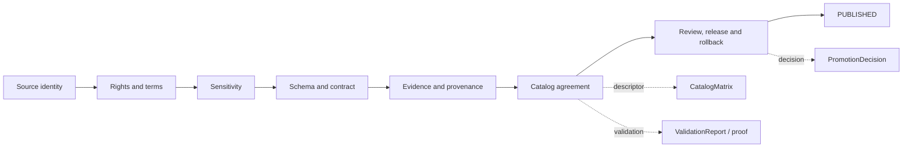

<!-- [KFM_META_BLOCK_V2]
doc_id: kfm://doc/adr-0022-catalog-matrix-stac-dcat-prov-must-agree
title: ADR-0022 — Catalog Matrix · STAC + DCAT + PROV Must Agree
type: adr
adr_id: ADR-0022
version: v1.3
status: proposed
effective_decision_status: proposed
owners:
  - "NEEDS VERIFICATION — catalog steward"
  - "NEEDS VERIFICATION — release steward"
  - "NEEDS VERIFICATION — evidence/proof steward"
  - "NEEDS VERIFICATION — schema and contract stewards"
  - "NEEDS VERIFICATION — policy and validation stewards"
owner_status: "CODEOWNERS routes docs/adr review to @bartytime4life; accepted stewardship assignments, decision quorum, required-review rules, and independent release approval were not verified"
reviewers_required:
  - Architecture steward
  - Docs steward
  - Catalog steward
  - Release and rollback steward
  - Evidence/proof steward
  - Contracts and schemas stewards
  - Policy and validation stewards
  - At least one affected domain steward
created: 2026-05-09
updated: 2026-08-13
policy_label: public
truth_posture: cite-or-abstain
responsibility_root: docs/
owning_root: docs/
responsibility: proposed cross-vocabulary catalog-closure decision record without independent evidence, validation, policy, review, promotion, release, or publication authority
current_path: docs/adr/ADR-0022-catalog-matrix--stac-+-dcat-+-prov-must-agree.md
supersedes: []
superseded_by: []
evidence_snapshot:
  repository: bartytime4life/Kansas-Frontier-Matrix
  base_ref: main
  base_commit: 160938b3f4717b6f2551b3430ab5c08f9b33cecb
  base_tree: 0a24e934e17d00b3cf8062bce65a4b59c07d65c1
  target_prior_blob: 1fba0d90c1bf3992b7df865b4ef774b6a93068d7
  adr_index_blob: 938c5894c36b99e14810918e2c550ab0e92d53b1
  adr_0001_blob: ed6f258f8d9ea152996570768a31666953e4a809
  adr_0011_blob: d67c5c5d4cc70f51ca172651d28aad9a60fa4d41
  adr_0029_blob: 3ba5f902ffe20a65a259cb0a7dab07f1725d204b
  codeowners_blob: dd2a84aa514d8ecd9208bc347f90f9a2ed37dd61
  catalog_matrix_contract_blob: c67923beb505aa39e7c0c768c16e75a00826ff31
  catalog_matrix_schema_blob: 75a927376066226d8a0f89a630d7bb3693143c41
  catalog_matrix_closure_contract_blob: fa78e2f0050c16941daf98f3d9355c5817499485
  catalog_matrix_closure_schema_blob: c3cc96cf7f13721aa4743abf7ccfd976c5c5925e
  catalog_matrix_closure_validator_blob: 2dc376e928a4fffdf4061828d830cc4072dfbdc5
  catalog_matrix_closure_workflow_blob: c440f6f2e9aba8eb8c74a9debb1f8dfd3e992abc
  catalog_matrix_claim_closure_contract_blob: f8907301fcfd8e8c874a43f2575a8016732d4f08
  catalog_matrix_claim_closure_schema_blob: 365fd7c203d30756db75d2b90766a9a756179bfb
  catalog_matrix_claim_closure_validator_blob: 30f71b796cae41fed503dd2f82b2b0c676e0a206
  catalog_matrix_claim_closure_workflow_blob: 6286d1823572816ae8d87dafdbc0a497a95f5174
  catalog_closure_packet_contract_blob: 3583c2ba6934a6d9c76189e9605e3fc7637f355e
  catalog_closure_packet_schema_blob: 574fd4677d5a03669965544d848fda1388ca1a48
  catalog_closure_packet_validator_blob: c567dfac33181141ef258625ec045d5c6a0c6c17
  catalog_closure_packet_workflow_blob: 2dc21288fbeea07056979b4bcd8a080fbbbd61ba
  catalog_distribution_mapping_contract_blob: 673eb7fb5a2e8d11ef0987ec48016fc97adf960a
  catalog_distribution_mapping_schema_blob: 24aad672a673a3ad489cfb1419a1d78f3be6c930
  catalog_distribution_mapping_validator_blob: d816ecb6cc910f342dad3bfe0b8232dc65ab0f10
  catalog_distribution_mapping_workflow_blob: b6b429af10b28be12622df01f7cbb0fd5e7c6094
  validator_registry_blob: c65c1c2b27b85be4bdc3c42d0555c6e8e44698e2
related:
  - docs/adr/README.md
  - docs/adr/INDEX.md
  - docs/adr/ADR-0001-schema-home--schemas-contracts-v1-is-canonical.md
  - docs/adr/ADR-0002-contracts-vs-schemas-split.md
  - docs/adr/ADR-0011-receipts-vs-proofs-vs-manifests-vs-catalog-separation.md
  - docs/adr/ADR-0018-promotion-gate-sequence.md
  - docs/adr/ADR-0023-geo-manifest-signs-every-pmtiles-cog-release.md
  - docs/adr/ADR-0024-steward-separation-of-duties-for-release.md
  - docs/adr/ADR-0025-public-client-never-reads-canonical-internal-stores.md
  - docs/adr/ADR-0029-adopt-directory-governance-standard-v2.md
  - docs/doctrine/directory-rules.md
  - contracts/data/catalog_matrix.md
  - contracts/data/catalog_matrix_closure_profile.md
  - contracts/data/catalog_matrix_claim_closure_profile.md
  - contracts/data/catalog_closure_packet.md
  - contracts/data/catalog_distribution_mapping_profile.md
  - schemas/contracts/v1/data/catalog_matrix.schema.json
  - schemas/contracts/v1/data/catalog_matrix_closure_profile.schema.json
  - schemas/contracts/v1/data/catalog_matrix_claim_closure_profile.schema.json
  - schemas/contracts/v1/data/catalog_closure_packet.schema.json
  - schemas/contracts/v1/data/catalog_distribution_mapping_profile.schema.json
  - fixtures/data/catalog_matrix/closure/
  - fixtures/data/catalog_matrix/claim_closure/
  - fixtures/data/catalog_closure_packet/
  - fixtures/contracts/v1/data/catalog_distribution_mapping_profile/
  - tools/validators/catalog_closure/README.md
  - tools/validators/catalog/README.md
  - tools/validators/validate_catalog_matrix.py
  - tools/validators/validate_catalog_matrix_closure.py
  - tools/validators/validate_catalog_matrix_claim_closure.py
  - tools/validators/catalog_closure/validate_catalog_closure.py
  - tools/validators/catalog_closure/validate_catalog_distribution_mapping_profile.py
  - tools/validators/validator_registry.json
  - tests/validators/test_validate_catalog_matrix_closure.py
  - tests/validators/test_validate_catalog_matrix_claim_closure.py
  - tests/validators/test_validate_catalog_closure.py
  - tests/validators/catalog_closure/test_catalog_distribution_mapping_profile.py
  - .github/workflows/catalog-matrix-closure.yml
  - .github/workflows/catalog-matrix-claim-closure.yml
  - .github/workflows/catalog-closure-packet.yml
  - .github/workflows/catalog-distribution-mapping-profile.yml
  - data/catalog/README.md
  - data/catalog/stac/README.md
  - data/catalog/dcat/README.md
  - data/catalog/prov/README.md
  - data/proofs/README.md
  - release/README.md
  - docs/registers/DRIFT_REGISTER.md
tags: [kfm, adr, catalog, catalog-matrix, stac, dcat, prov, provenance, evidence, promotion, closure, profiles, rollback]
notes:
  - "v1.3 is a same-path repository-grounded reconciliation. It preserves effective status proposed and does not accept ADR-0022, activate a profile, promote a candidate, release, deploy, publish, or change repository settings."
  - "The broad CatalogMatrix schema remains a permissive placeholder and its declared validator path remains absent; the top-level compatibility entrypoint remains a NotImplementedError stub."
  - "Four additive proposed implementation slices now provide closed profile schemas, deterministic validators, synthetic fixtures, focused tests, and path-scoped workflows. Their bounded PASS results do not prove system-wide catalog closure or release authority."
  - "The latest observed main runs for those four workflows failed receipt-integrity validation after their focused tests and fixture replay passed; hosted enforcement therefore remains on hold."
  - "The central validator registry does not include the catalog-closure validators in focused, release-dry-run, or full profiles, and the Makefile catalog target remains a TODO marker."
  - "ADR-0011 and ADR-0022 preserve CatalogMatrix as a catalog descriptor while validation reports/proofs, policy decisions, review records, promotion decisions, and release manifests remain distinct authority families."
[/KFM_META_BLOCK_V2] -->

<a id="top"></a>

# ADR-0022 — Catalog Matrix · STAC + DCAT + PROV Must Agree

> **Proposed decision.** Every KFM release candidate that claims catalog closure across STAC, DCAT, and PROV MUST provide one explicit, immutable agreement packet that binds those records to the same artifact identity, byte digest, and release reference. Any unresolved or contradictory closure result blocks promotion.

[](#status)
[](#current-repository-evidence)
[](#current-enforcement-maturity)
[](#implementation-slice-ledger)
[](#current-enforcement-maturity)
[](#hosted-workflow-observation)
[](#promotion-gating)
[](#catalogmatrix-object-boundary)

> [!IMPORTANT]
> **Decision text and implementation slices are not acceptance.** This file remains `proposed`. The repository now contains four bounded, additive catalog-closure profile slices with schemas, validators, synthetic fixtures, focused tests, and path-scoped workflows. The broad schema is still permissive, the generic entrypoint is still a stub, the latest observed hosted runs are failing receipt-integrity checks, and no reviewed evidence establishes one canonical end-to-end resolver, required aggregate gate, promotion integration, release assembly, or operational rollback.

> [!CAUTION]
> **A `CatalogMatrix` is not proof, policy, approval, or publication.** It is a catalog-facing descriptor and crosswalk. A separate validation report or proof object records that the matrix was checked; a separate `PolicyDecision` decides admissibility; a separate release decision authorizes promotion.

**Quick navigation:** [Status](#status) · [Evidence](#evidence-boundary) · [Context](#context) · [Decision](#decision) · [Agreement](#agreement-contract) · [Object boundary](#catalogmatrix-object-boundary) · [Repository evidence](#current-repository-evidence) · [Slices](#implementation-slice-ledger) · [Maturity](#current-enforcement-maturity) · [Implementation](#implementation-contract) · [Promotion](#promotion-gating) · [Consequences](#consequences) · [Alternatives](#alternatives-considered) · [Migration](#migration-and-compatibility) · [Acceptance](#acceptance-gates) · [Risks](#risk-ledger) · [Rollback](#rollback-and-supersession) · [No-loss ledger](#no-loss-change-ledger) · [Verification](#verification-checklist) · [References](#references)

---

<a id="status"></a>

## Status

| Field | Current value |
|---|---|
| **ADR ID** | `ADR-0022` |
| **Tracked path** | `docs/adr/ADR-0022-catalog-matrix--stac-+-dcat-+-prov-must-agree.md` |
| **Source metadata** | `proposed` |
| **Effective decision status** | `proposed` |
| **Decision class** | Cross-vocabulary catalog-closure invariant and promotion prerequisite |
| **Current repository posture** | Broad contract and placeholder schema coexist with four proposed, executable profile slices; the generic entrypoint and aggregate enforcement remain incomplete, and latest observed hosted slice runs are red on receipt integrity |
| **Implementation effect of this revision** | Documentation only |
| **Publication effect** | None |
| **Supersedes / superseded by** | None / none |

### Decision scope

This ADR decides the proposed **release-level agreement rule** between:

1. STAC catalog records;
2. DCAT datasets/distributions;
3. PROV activities/entities/agents;
4. the canonical artifact and its digest;
5. the release reference that governs exposure.

It does not decide domain semantics, replace source descriptors or evidence bundles, authorize a release, define every field of the shared schema, choose a public API route, or make a validator pass equivalent to publication.

### Acceptance and enforcement are separate

1. **ADR acceptance** approves the agreement rule and authority boundaries.
2. **Profile implementation** can supply bounded review evidence without accepting this decision.
3. **Enforcement graduation** requires production-grade shared contracts/schemas, deterministic generation, meaningful fixtures, executable validation, policy wiring, aggregate CI admission, release assembly, accountable review, correction, rollback, and observed behavior.

An accepted ADR without enforcement is doctrine, not runtime proof. An implemented proposed profile without ADR acceptance is evidence for review, not authority to promote or publish.

[Back to top](#top)

---

<a id="evidence-boundary"></a>

## Evidence boundary

This revision uses exact repository bytes from `main@160938b3f4717b6f2551b3430ab5c08f9b33cecb` (tree `0a24e934e17d00b3cf8062bce65a4b59c07d65c1`), hosted workflow observations, and the supplied KFM build/source topology material. Repository bytes establish what exists; workflow runs establish only what executed at their named revision; accepted Directory Rules and accepted ADRs govern responsibility and placement. Supplied architecture material informs intent but does not override the live repository or accept this ADR.

| Evidence level | CONFIRMED | Not established |
|---|---|---|
| **ADR identity** | This exact tracked path and prior blob exist. | Acceptance, quorum, or enforcement. |
| **Semantic contract** | `contracts/data/catalog_matrix.md` exists and defines `CatalogMatrix` as an inspectability aid, not sovereign truth or release authority. | Final field semantics or accepted ownership. |
| **Broad machine schema** | `schemas/contracts/v1/data/catalog_matrix.schema.json` exists, points to the semantic contract, requires only `id`, and permits arbitrary additional properties. | Production-grade broad shape or enforcement of this ADR. |
| **Additive profile schemas** | Closed proposed schemas exist for STAC/DCAT/PROV tuple closure, ClaimEnvelope non-overstatement, closure-readiness packets, and fixture-only distribution mapping. | Acceptance of the profiles, convergence of the broad schema, or universal domain coverage. |
| **Executable validation** | Four profile-specific deterministic validators, synthetic fixture corpora, focused tests, and path-scoped workflows exist. | One canonical generic resolver, aggregate-registry admission, required branch/ruleset status, release assembly, or end-to-end promotion enforcement. |
| **Generic validator** | `tools/validators/validate_catalog_matrix.py` still raises `NotImplementedError`; the broad schema still declares an absent `tools/validators/data/validate_catalog_matrix.py` path. | A functional generic entrypoint or completed compatibility migration. |
| **Hosted workflow state** | The latest observed main runs for the four profile workflows completed with failure at generated-receipt integrity; their focused tests and fixture replay steps passed. | A green exact-base run, a required gate, or a release-eligible result. |
| **Catalog lanes** | STAC, DCAT, PROV, domain, evidence/proof, and release documentation/data surfaces exist. | Mutually consistent emitted release records or end-to-end promotion closure for a real release candidate. |
| **Operational release** | No admissible evidence reviewed here establishes publication. | Production deployment, public route behavior, signing, approval, rollback execution, or current release state. |

> [!NOTE]
> A configured workflow proves intent. A completed run proves only the named revision and steps. Neither proves that GitHub rulesets require the check, that a real catalog candidate was admitted, or that release/publication authority was exercised.

### Truth labels

| Label | Use in this ADR |
|---|---|
| **CONFIRMED** | Verified from current repository bytes or governing doctrine. |
| **PROPOSED** | Decision, field, path role, migration, validator, policy, or workflow not accepted and verified. |
| **UNKNOWN** | No sufficient evidence establishes the state. |
| **NEEDS VERIFICATION** | A concrete repository, workflow, review, or operational check remains. |
| **CONFLICTED** | Current repository documents or proposed ADRs disagree and need coordinated resolution. |

### Directory Rules basis

- `docs/adr/` owns architecture decisions.
- `contracts/` owns object meaning.
- `schemas/` owns machine shape.
- `tools/validators/` owns deterministic checking.
- `policy/` owns admissibility decisions.
- `data/catalog/` owns catalog-stage records.
- `data/proofs/` owns proof/support records.
- `release/` owns release decisions, manifests, correction, and rollback.

The currently verified shared homes are `contracts/data/catalog_matrix.md` and `schemas/contracts/v1/data/catalog_matrix.schema.json`. Earlier proposed paths under `contracts/catalog/` or `schemas/contracts/v1/catalog/` are not treated as current repository facts.

[Back to top](#top)

---

<a id="context"></a>

## Context

KFM uses three standards-facing catalog views because they answer different questions:

| Surface | Primary question | Must not become |
|---|---|---|
| **STAC** | What spatiotemporal asset can be discovered and accessed? | Release authority or provenance proof. |
| **DCAT** | What dataset/distribution can interoperate with external catalogs, and under what rights/access posture? | Canonical artifact store or lineage authority. |
| **PROV** | Which activity, agent, and source entities produced this artifact? | Policy decision or public-access grant. |

Each record can be individually valid while the set is mutually contradictory. A STAC asset can name one checksum, DCAT another, and PROV a different generated entity. Per-record schema validation cannot prove cross-record agreement.

```text
record validity != cross-record agreement != policy permission != release approval
```

The failure mode is **catalog drift**: three standards-compliant records describe different effective artifacts or releases while presenting one apparent catalog surface.

> [!WARNING]
> Catalog drift is hard to detect after publication because each individual record may still parse, validate, and render. KFM therefore needs a deterministic closure check before promotion.

### Forces

| Force | Pressure |
|---|---|
| **Trust** | Consumers must be able to establish that STAC, DCAT, and PROV refer to the same released artifact. |
| **Standards reuse** | KFM should profile established standards rather than fork them. |
| **Determinism** | Identity, digest, and release-reference disagreement must fail closed. |
| **Auditability** | Reviewers need a compact, inspectable crosswalk plus the underlying records and validation evidence. |
| **Separation** | The matrix descriptor, validation proof, policy decision, and release authorization must remain distinct. |
| **Cost** | Closure adds schema, generator, validator, fixtures, tests, reports, and review burden. |

[Back to top](#top)

---

<a id="decision"></a>

## Decision

KFM proposes the following release-level rules.

### 1. Agreement is mandatory for promotion

For each release artifact represented across STAC, DCAT, and PROV, the records MUST agree on:

1. **Canonical artifact identity** — the same stable artifact identifier or `spec_hash` lineage.
2. **Byte digest** — the same algorithm-qualified digest for the exact released bytes.
3. **Release reference** — the same immutable release-governance reference.

A verified disagreement is `DENY`. Missing support that prevents a reliable determination is `ABSTAIN` or `ERROR`, never an implicit pass.

### 2. One explicit agreement descriptor is required

A release candidate MUST provide a `CatalogMatrix` or accepted equivalent that:

- names the closure scope;
- identifies the STAC, DCAT, and PROV records checked;
- records the canonical identity, digest, and release reference expected;
- records source, evidence, validation, policy, review, correction, and rollback references where applicable;
- exposes finite agreement outcomes and reason codes;
- remains content-addressed or otherwise immutably identifiable.

### 3. Validation proof is separate

The matrix descriptor MUST NOT claim that it validated itself. A separate `ValidationReport`, proof record, or accepted equivalent records:

- validator identity and version;
- exact input digests;
- checks executed;
- outcomes and reason codes;
- generated time;
- environment/tool failures;
- report digest.

### 4. Promotion remains a separate decision

A passing closure report is necessary but not sufficient. Policy, rights, sensitivity, review, release assembly, correction, and rollback gates still decide promotion.

### 5. Public clients use governed projections

Public clients, review UIs, Focus Mode, dashboards, and exports consume released, policy-safe representations through governed interfaces. This ADR does not authorize direct reads from canonical/internal stores, RAW, WORK, QUARANTINE, or unreviewed catalog candidates.

[Back to top](#top)

---

<a id="agreement-contract"></a>

## Agreement contract

### Required agreement dimensions

| Dimension | STAC projection | DCAT projection | PROV projection | Authority used for comparison |
|---|---|---|---|---|
| **Artifact identity** | KFM extension property or asset identifier | `dct:identifier` or profiled equivalent | Generated `prov:Entity` identifier | Canonical artifact identity contract / release object |
| **Byte digest** | Asset checksum extension/profile | Distribution checksum such as SPDX checksum or accepted profile | Generated entity digest attribute/profile | Digest recorded by release assembly for the exact bytes |
| **Release reference** | KFM release link/property | KFM release extension/link | Activity/entity release association | Immutable release-governance record |
| **Producing activity** | Provenance link | `prov:wasGeneratedBy` or profile mapping | `prov:Activity` | PROV activity identity |
| **Upstream sources** | Derived/source links | Primary-source/provenance mapping | `prov:wasDerivedFrom` | Admitted `SourceDescriptor` identities |
| **Rights/access** | Summary/profile fields | DCAT rights/access fields | Activity/entity policy annotations | Applicable source and policy decisions |
| **Evidence support** | Evidence link | KFM evidence extension/link | Entity/activity relation | Resolved `EvidenceBundle` or accepted support object |

> [!NOTE]
> Exact extension names remain profile-level implementation details. The invariant is semantic agreement, not attachment to one provisional field spelling.

### Finite outcomes

| Outcome | Meaning | Promotion effect |
|---|---|---|
| `PASS` | Required records resolve and all configured agreement checks pass. | Closure prerequisite may pass; other gates still run. |
| `ABSTAIN` | Support is incomplete, stale, conflicted, or insufficient to establish agreement safely. | Hold promotion and return missing-support details. |
| `DENY` | A verified identity, digest, release, policy, rights, sensitivity, or public-safety invariant is violated. | Fail closed. |
| `ERROR` | Tool, parser, registry, dependency, or environment failure prevents a reliable decision. | Fail closed; repair and rerun with a new report. |

Current implementation slices use narrower, profile-local state machines. They are evidence that finite behavior can be implemented, not authority to replace this proposed ADR vocabulary. Acceptance must define a lossless normalization between descriptor disposition, validator execution outcome, policy/review posture, and promotion effect.

### Stable reason-code families

| Family | Examples |
|---|---|
| Identity | `identity_mismatch`, `unresolved_artifact`, `duplicate_artifact_identity` |
| Digest | `digest_missing`, `digest_algorithm_mismatch`, `digest_mismatch` |
| Release | `release_ref_missing`, `release_ref_mismatch`, `release_state_invalid` |
| Linkage | `missing_stac_dcat_link`, `missing_dcat_prov_link`, `unresolved_prov_entity` |
| Evidence/source | `unresolved_evidence`, `unresolved_source_descriptor`, `source_not_admitted` |
| Rights/policy | `rights_unknown`, `access_class_conflict`, `restricted_public_projection` |
| Tooling | `schema_error`, `parse_error`, `dependency_error`, `internal_error` |

Renaming or removing stable reason codes requires compatibility review because dashboards, proof readers, CI summaries, and release tooling may depend on them.

[Back to top](#top)

---

<a id="catalogmatrix-object-boundary"></a>

## CatalogMatrix object boundary

ADR-0011 and the current semantic contract establish the anti-collapse rule:

```text
CatalogMatrix descriptor
  != ValidationReport / proof
  != PolicyDecision
  != PromotionDecision
  != ReleaseManifest
  != published artifact
```

| Object | Owns | Does not own |
|---|---|---|
| `CatalogMatrix` | Crosswalk scope, referenced records, expected shared values, finite agreement status, reason summaries | Evidence truth, validator execution, policy permission, release approval |
| `ValidationReport` | Exact validation inputs, checks, tool version, results, reason codes, report digest | Catalog meaning, policy permission, release approval |
| `EvidenceBundle` | Claim support and citation closure | Catalog interchange shape or release decision |
| `PolicyDecision` | Allow, deny, restrict, hold, abstain, obligations | Schema validity or catalog identity |
| `PromotionDecision` / receipt | Governed transition decision and gate outcomes | Source truth or artifact bytes |
| `ReleaseManifest` | Released artifact set, digests, public scope, rollback target | Underlying evidence or catalog record semantics |

### Minimum descriptor fields proposed for schema hardening

| Field | Purpose |
|---|---|
| `id` | Stable matrix descriptor identity. |
| `version` | Contract/profile version. |
| `scope` | Domain, release candidate, artifact family, or explicit record set. |
| `release_ref` | Immutable release candidate or release-governance reference. |
| `artifact_ref` | Canonical artifact reference. |
| `artifact_identity` | Expected stable identity/spec hash. |
| `artifact_digest` | Algorithm-qualified expected byte digest. |
| `stac_refs[]` | Exact STAC records/assets checked. |
| `dcat_refs[]` | Exact DCAT datasets/distributions checked. |
| `prov_refs[]` | Exact PROV activities/entities checked. |
| `source_refs[]` | Admitted source descriptors needed for lineage closure. |
| `evidence_refs[]` | Evidence/support references needed for consequential claims. |
| `validation_report_ref` | Separate report proving checks ran. |
| `policy_decision_refs[]` | Applicable rights/sensitivity/admissibility decisions. |
| `agreement_outcome` | `PASS`, `ABSTAIN`, `DENY`, or `ERROR`. |
| `reason_codes[]` | Stable machine-readable findings. |
| `correction_refs[]` | Correction/supersession/withdrawal lineage. |
| `rollback_ref` | Rollback target when release-significant. |
| `spec_hash` | Deterministic descriptor hash where adopted. |

The broad shared schema does not enforce this shape. Additive profiles enforce bounded subsets and relationships, but no reviewed compatibility rule makes those profiles a complete substitute for the proposed broad descriptor.

[Back to top](#top)

---

<a id="current-repository-evidence"></a>

## Current repository evidence

| Surface | Status | Evidence-backed consequence |
|---|---|---|
| `docs/adr/INDEX.md` | **CONFIRMED effective `proposed`** | Index registration does not accept ADR-0022. |
| ADR-0029 / Directory Rules | **CONFIRMED accepted placement authority** | `docs/`, `contracts/`, `schemas/`, `fixtures/`, `tools/validators/`, `policy/`, catalog data, proof, and release responsibilities remain separate. |
| `contracts/data/catalog_matrix.md` | **CONFIRMED draft semantic contract** | Current object meaning lives under the `data` contract family. |
| `schemas/contracts/v1/data/catalog_matrix.schema.json` | **CONFIRMED placeholder schema** | Requires only `id`; `additionalProperties: true`; cannot enforce this ADR. |
| Broad-schema validator declaration | **CONFIRMED stale** | Schema metadata names absent `tools/validators/data/validate_catalog_matrix.py`. |
| `tools/validators/validate_catalog_matrix.py` | **CONFIRMED generic stub** | Raises `NotImplementedError("Greenfield placeholder")`; not a promotion gate. |
| Additive closure profiles | **CONFIRMED four proposed slices** | Tuple closure, claim non-overstatement, closure-readiness packet, and distribution mapping each have bounded contract/schema/validator evidence. |
| Synthetic fixtures | **CONFIRMED slice corpora** | Tuple closure has two valid and ten negative candidates; claim closure has three valid and thirteen negative candidates; closure packet has four valid and eleven invalid packets; distribution mapping has a manifest-driven fixture set. |
| Focused tests | **CONFIRMED four dedicated suites** | Tests exercise the four slices; they do not prove a production release or universal domain compatibility. |
| Profile workflows | **CONFIRMED path-scoped orchestration** | Each slice has a read-only workflow; those files are not evidence of required-check configuration. |
| Central validator registry | **CONFIRMED catalog slices absent** | `focused`, `release-dry-run`, and `full` profiles do not invoke these catalog-closure validators. |
| Makefile `catalog` target | **CONFIRMED TODO marker** | It prints a catalog-builder TODO; zero exit status is not catalog validation evidence. |
| Domain schemas and stubs | **CONFIRMED 13 domain schemas and 13 tiny validator stubs** | Domain surfaces exist, but convergence on the broad contract and executable shared-core reuse are not proven. |
| Release closure resolver | **PARTIAL / proposed** | `CatalogClosurePacket` supplies a bounded readiness check but explicitly does not settle persistence, approve promotion, or release. |
| Catalog/release operation | **UNKNOWN** | No emitted matrix, signed proof, promotion result, public route, or rollback drill was verified here. |

### Current conflicts

1. **Descriptor versus proof.** ADR-0011 and this ADR now agree that `CatalogMatrix` is a descriptor; validation report/proof, policy, review, promotion, manifest, and publication authority remain separate. Both records are still proposed.
2. **Broad schema versus closed profiles.** The permissive broad schema coexists with stricter additive profiles. A profile PASS cannot be generalized to every `CatalogMatrix`.
3. **Generic entrypoint drift.** The broad schema declares an absent validator while the top-level generic validator remains a stub and real validators live at profile-specific paths.
4. **Outcome grammar drift.** This ADR proposes `PASS | ABSTAIN | DENY | ERROR`; current slices use profile-local combinations such as `READY | HOLD | DENY`, `PASS | FAIL | ERROR`, and `REVIEW_REQUIRED`. Acceptance must reconcile these layers without silently renaming semantics.
5. **Shared versus domain-specific matrices.** Thirteen domain schemas exist, but inheritance, compatibility, and shared-core reuse remain NEEDS VERIFICATION.
6. **Path-scoped CI versus aggregate admission.** Dedicated workflows exist, but the central validator registry excludes these slices and no reviewed ruleset evidence proves they are required.
7. **Focused validator health versus receipt integrity.** The latest observed hosted runs passed focused tests and fixture replay but failed generated-receipt integrity. That is still a red workflow and therefore a hold.
8. **Closure readiness versus release authority.** The packet/profile contracts correctly deny release authority, but the accepted handoff from closure evidence to promotion is not established.

[Back to top](#top)

---

<a id="implementation-slice-ledger"></a>

## Implementation slice ledger

The following slices are repository facts at the pinned base. Their contracts and schemas all declare a proposed or bounded authority posture.

| Slice | Contract and schema | Validator, fixtures, and tests | Bounded result |
|---|---|---|---|
| STAC/DCAT/PROV tuple closure | `catalog_matrix_closure_profile.md` + closed Draft 2020-12 profile schema | `validate_catalog_matrix_closure.py`; `fixtures/data/catalog_matrix/closure/`; focused pytest suite | Checks artifact identity, digest, release reference, reference hygiene, and local decision/reason consistency. |
| Claim-to-catalog non-overstatement | `catalog_matrix_claim_closure_profile.md` + closed wrapper schema | `validate_catalog_matrix_claim_closure.py`; claim-closure fixtures; focused pytest suite | Prevents catalog projection from strengthening evidence, source, policy, review, release, correction, rollback, or publication posture. |
| Closure-readiness packet | `catalog_closure_packet.md` + closed packet schema | `catalog_closure/validate_catalog_closure.py`; packet fixtures; focused unittest suite | Checks internal packet readiness and finite outcomes for the next named review gate. |
| Distribution mapping | `catalog_distribution_mapping_profile.md` + closed candidate schema | profile validator; manifest-driven synthetic fixtures; focused unittest plus adjacent closure test | Checks locator, checksum, media type, role, and PROV generation identity; returns review-required posture, not release readiness. |

All four validators are local and deterministic over bounded inputs. None writes a catalog, dereferences production records, authenticates a reviewer, changes policy, promotes a candidate, creates a release manifest, publishes data, or authorizes public use.

### Hosted workflow observation

The latest observed `main` run for each slice occurred at `3911c519d9bc134c3ab0662fed6577ebd966813b`:

| Workflow | Run | Focused validation | Receipt integrity | Overall |
|---|---|---|---|---|
| `catalog-matrix-closure` | [31654971846](https://github.com/bartytime4life/Kansas-Frontier-Matrix/actions/runs/31654971846) | Tests and exact fixture replay passed | `ARTIFACT_DIGEST_MISMATCH` | **failure** |
| `catalog-matrix-claim-closure` | [31654972972](https://github.com/bartytime4life/Kansas-Frontier-Matrix/actions/runs/31654972972) | Tests and exact fixture replay passed | `ARTIFACT_DIGEST_MISMATCH` | **failure** |
| `catalog-closure-packet` | [31654971294](https://github.com/bartytime4life/Kansas-Frontier-Matrix/actions/runs/31654971294) | No-network tests and exact fixture replay passed | `ARTIFACT_DIGEST_MISMATCH` | **failure** |
| `catalog-distribution-mapping-profile` | [31654971671](https://github.com/bartytime4life/Kansas-Frontier-Matrix/actions/runs/31654971671) | Focused, adjacent, and fixture validation passed | `ARTIFACT_DIGEST_MISMATCH` | **failure** |

Earlier green runs exist for each workflow, but they do not override the latest observed red state. No run was observed for the pinned documentation base because path filters do not trigger these workflows for this ADR-only edit.

> [!CAUTION]
> The red receipt step does not erase the successful focused validator evidence, and the successful validator steps do not erase the red workflow. Until receipt drift is repaired and the exact revision is green, hosted slice status is **HOLD**.

[Back to top](#top)

---

<a id="current-enforcement-maturity"></a>

## Current enforcement maturity

| Capability | Current status | Graduation requirement |
|---|---|---|
| Broad semantic meaning | **Draft contract exists** | Accepted contract, verified owners, stable terms, compatibility policy. |
| Profile semantics | **Four proposed additive contracts** | Coordinated acceptance, shared vocabulary, compatibility and deprecation rules. |
| Broad machine shape | **Placeholder** | Required fields, profiles, enums, formats, references, and negative constraints. |
| Profile machine shape | **Four closed proposed schemas** | Accepted relationship to the broad schema and domain profiles. |
| Deterministic generator | **UNKNOWN / not established** | Idempotent generation with pinned inputs and output digest. |
| Generic validator | **Stub / path-conflicted** | One canonical executable or documented dispatcher with compatibility tests. |
| Profile validators | **Executable bounded slices** | Accepted coverage map, stable cross-profile outcomes, shared-core reuse, and production inputs. |
| Domain validators | **Thirteen tiny stubs** | Shared-core reuse plus explicit domain extensions and polarity tests. |
| Fixtures | **Meaningful for four slices; incomplete for the full ADR** | Coverage of every accepted outcome/reason family, policy edge, correction, rollback, and domain profile. |
| Tests | **Focused slice suites exist** | Aggregate integration, mutation/negative, replay, resolver, release-handoff, and rollback tests. |
| Policy | **Reference and non-overstatement checks only** | Authoritative rights, sensitivity, restricted-public, stale, and release-state decisions. |
| CI admission | **Path-scoped workflows; latest observed runs red; absent from registry profiles** | Green exact-revision jobs, aggregate registration, and verified required-check/ruleset configuration. |
| Release resolver | **Bounded readiness packet only** | Immutable production resolution, separate validation report, and governed promotion handoff. |
| Review and separation of duties | **NEEDS VERIFICATION** | Named role requirements and independent release approval where material. |
| Correction and rollback | **Documented doctrine; operation UNKNOWN** | Tested correction cascade and rollback drill. |
| Publication | **None established** | Separate accepted release authority and observed governed publication. |

> [!WARNING]
> A broad `CatalogMatrix` instance can still appear structurally valid while omitting every consequential agreement field. A stricter profile PASS proves only that profile's local invariants. Neither may be used as release proof or publication authority.

[Back to top](#top)

---

<a id="implementation-contract"></a>

## Implementation contract

Implementation should be split into reviewable, reversible increments.

### Target responsibility lanes

| Responsibility | Current or proposed lane | Posture |
|---|---|---|
| Broad semantic contract | `contracts/data/catalog_matrix.md` | **CONFIRMED current home; coordinate with additive profiles** |
| Broad machine schema | `schemas/contracts/v1/data/catalog_matrix.schema.json` | **CONFIRMED placeholder; harden or version through reviewed compatibility migration** |
| Additive profile contracts/schemas | `contracts/data/` + `schemas/contracts/v1/data/` | **CONFIRMED four proposed slices; do not imply ADR acceptance** |
| Profile validators | top-level and `tools/validators/catalog_closure/` entrypoints | **CONFIRMED executable bounded slices** |
| Generic validator stub | `tools/validators/validate_catalog_matrix.py` | **CONFIRMED stub; replace, delegate, or deprecate through reviewed migration** |
| Stale declared validator | `tools/validators/data/validate_catalog_matrix.py` | **CONFIRMED absent; repair metadata without creating parallel authority** |
| Record-local validation | `tools/validators/catalog/` | **CONFIRMED sibling responsibility** |
| Fixtures | `fixtures/data/catalog_matrix/`, `fixtures/data/catalog_closure_packet/`, and profile fixture lane | **CONFIRMED synthetic slice evidence; full coverage incomplete** |
| Tests | `tests/validators/` and `tests/validators/catalog_closure/` | **CONFIRMED focused slice evidence; aggregate and release integration incomplete** |
| Hosted orchestration | four path-scoped workflows | **CONFIRMED configured; latest observed runs fail receipt integrity** |
| Aggregate orchestration | `tools/validators/validator_registry.json` | **CONFIRMED catalog slices absent; explicit admission review required** |
| Policy | `policy/data/` plus release/promotion policy as applicable | **NEEDS VERIFICATION; avoid parallel policy authority** |
| Catalog instances | Under governed `data/catalog/` lanes | **CONFIRMED root; exact matrix instance home NEEDS VERIFICATION** |
| Validation reports/proofs | Under governed proof/report lanes | **NEEDS VERIFICATION; must remain distinct from descriptor** |
| Release decisions | `release/` | **CONFIRMED responsibility root; exact integration NEEDS VERIFICATION** |

### Required negative fixtures

At minimum, the shared suite should cover:

- STAC versus DCAT digest mismatch;
- DCAT versus release-assembly digest mismatch;
- release-reference mismatch;
- missing STAC-to-DCAT relation;
- missing DCAT-to-PROV relation;
- unresolved generated PROV entity;
- canonical artifact identity mismatch;
- unresolved evidence reference;
- unresolved or unadmitted source descriptor;
- unknown rights or conflicting access class;
- restricted-precise distribution in a public projection;
- stale/superseded record without correction lineage;
- parser/tool failure producing `ERROR` rather than pass;
- matrix descriptor claiming validation without a separate report;
- validator report whose input digest does not match the matrix digest.

The current slice corpora already exercise artifact/digest/release-reference drift, non-canonical references, decision/reason inconsistencies, non-overstatement failures, malformed or extra fields, unsafe input, and receipt-bound fixture replay. They do not yet prove the full policy, resolver, domain, correction, rollback, or release-handoff set above.

### Determinism and replay

A closure run should be reproducible from:

1. immutable matrix descriptor bytes;
2. immutable STAC/DCAT/PROV record bytes or digests;
3. source/evidence/policy/release references;
4. validator version/spec hash;
5. profile/configuration version;
6. no-network fixture mode for CI;
7. an emitted report digest.

Network resolution belongs in a separately controlled integration path. Default CI should use pinned fixtures and fail closed when required remote state cannot be represented safely.

[Back to top](#top)

---

<a id="promotion-gating"></a>

## Promotion gating

Catalog closure participates in the promotion sequence; it does not replace it.


```mermaid
flowchart LR
    A[Source identity] --> B[Rights and terms]
    B --> C[Sensitivity]
    C --> D[Schema and contract]
    D --> E[Evidence and provenance]
    E --> F[Catalog agreement]
    F --> G[Review, release and rollback]
    G --> P[PUBLISHED]

    F -. descriptor .-> CM[CatalogMatrix]
    F -. validation .-> VR[ValidationReport / proof]
    G -. decision .-> PD[PromotionDecision]
```

| Gate concern | Required closure evidence | Failure posture |
|---|---|---|
| Shape/profile | Matrix and records match accepted schemas/profiles. | `DENY` or `ERROR`. |
| Inputs pinned | Exact records and digests are fixed. | `ABSTAIN` / `DENY`. |
| Record checks | STAC, DCAT, and PROV validate individually. | `DENY`. |
| Cross-record agreement | Identity, digest, and release reference agree. | `DENY`. |
| Evidence/source closure | Required evidence and admitted sources resolve. | `ABSTAIN` / `DENY`. |
| Rights/sensitivity | Access and public projection are allowed. | `DENY` / `HOLD`. |
| Review/release | Accountable review, release manifest, correction, rollback exist. | `HOLD` / `DENY`. |

**No warn-only path** is permitted for identity, digest, release-reference, unresolved evidence/source, rights, sensitivity, or restricted-public disagreement when the candidate is intended for public release.

[Back to top](#top)

---

<a id="consequences"></a>

## Consequences

### Positive

- Catalog drift becomes a pre-promotion failure rather than a post-publication discovery.
- Reviewers gain a compact crosswalk without collapsing underlying records or proof families.
- Domain lanes can extend one shared agreement contract rather than inventing incompatible matrix meanings.
- STAC, DCAT, and PROV retain their standards-native roles.
- Correction and rollback can compare closure packets across releases.
- Public clients remain downstream of governed release and evidence resolution.

### Costs and tradeoffs

- A production-grade schema and validator add maintenance surface.
- Duplicate projection fields require clear source-of-authority rules.
- Domain schemas may require migration or profile convergence.
- Network-backed resolution can be flaky; deterministic fixture-mode validation and explicit `ERROR` handling are required.
- Stable reason codes and profile versions create compatibility obligations.
- Additional review burden is intentional because the matrix affects release trust.

### What this decision does not prove

- that any current matrix instance is valid;
- that a release has passed closure;
- that all domains use the shared schema;
- that rights or sensitivity are resolved;
- that CI blocks release;
- that public endpoints expose correct records;
- that rollback has been tested.

[Back to top](#top)

---

<a id="alternatives-considered"></a>

## Alternatives considered

### Validate STAC, DCAT, and PROV independently

**Rejected.** Independent validity cannot detect mutual disagreement.

### Make one vocabulary authoritative for everything

**Rejected.** STAC, DCAT, and PROV have different bounded responsibilities. Collapsing them would weaken interoperability and provenance clarity.

### Put all records into one giant matrix document

**Rejected.** It creates a second catalog authority, increases drift risk, and weakens standards-native tooling.

### Treat the matrix itself as proof

**Rejected.** A descriptor cannot prove that its own assertions were checked. Validation evidence remains a separate object family.

### Make catalog agreement advisory

**Rejected for promotion.** Identity, digest, release-reference, evidence, rights, sensitivity, and public-access contradictions must fail closed.

### Require the matrix only after publication

**Rejected.** Post-publication auditing is useful but too late to protect the release boundary.

[Back to top](#top)

---

<a id="migration-and-compatibility"></a>

## Migration and compatibility

This decision is additive at the standards level but requires convergence of existing KFM surfaces.

1. **Coordinate ADR-0011 and ADR-0022.** Preserve descriptor/proof/release separation and record any remaining conflict explicitly.
2. **Reconcile the broad contract and schema with the additive profiles.** Keep canonical homes under `contracts/data/` and `schemas/contracts/v1/data/`; choose explicit versioning and compatibility rather than silently broadening a profile or creating parallel authority.
3. **Normalize the state machines.** Map profile-local `READY/HOLD/DENY`, validator `PASS/FAIL/ERROR`, policy/review posture, and this ADR's proposed `PASS/ABSTAIN/DENY/ERROR` without semantic loss.
4. **Inventory domain schemas.** Classify all thirteen as compatible profile, divergent extension, duplicate, or migration candidate.
5. **Choose one generic executable entrypoint.** Replace, delegate, or deprecate the current top-level stub and repair the absent path declared by the broad schema.
6. **Extend existing fixtures and tests.** Preserve the four slice corpora and add full finite-outcome, reason-code, policy, domain, stale-state, correction, rollback, and resolver coverage.
7. **Repair generated-receipt drift.** Regenerate or supersede affected authoring receipts through reviewed changes, then require green exact-revision workflow evidence.
8. **Emit a separate validation report.** Bind it to exact input, profile, tool, output, and report digests.
9. **Integrate policy and promotion.** A passing validator hands off; it never approves release.
10. **Add aggregate deterministic CI admission.** Register the accepted checks, run no-network by default, verify required-check configuration separately, and isolate controlled integration checks.
11. **Roll out domain profiles.** Domain matrices extend the shared core without redefining identity/digest/release agreement.
12. **Backfill selectively.** Older releases may be marked `pre-matrix` where safe reconstruction is impossible; do not fabricate closure.

### Compatibility rule

A domain profile MAY add domain-specific fields and checks, but it MUST preserve the shared agreement dimensions and finite outcomes. A profile MUST NOT weaken a shared `DENY` condition for public release.

[Back to top](#top)

---

<a id="acceptance-gates"></a>

## Acceptance gates

ADR acceptance should require:

- [ ] ADR-0011 and ADR-0022 language is coordinated and no object-family collapse remains.
- [ ] Directory Rules and ADR-0001 support the current shared contract/schema homes.
- [ ] Decision owners and required review roles are recorded without placeholders presented as fact.
- [ ] Shared identity, digest, release-reference, finite-outcome, and descriptor/proof separation rules are approved.
- [ ] Domain-profile compatibility requirements are approved.
- [ ] Migration and rollback posture is judged reversible.

Enforcement graduation should additionally require:

- [ ] `contracts/data/catalog_matrix.md` is accepted and versioned.
- [ ] The broad schema is no longer permissive, or an accepted version/profile discriminator closes the compatibility boundary.
- [ ] One generic validator entrypoint or dispatcher is executable, deterministic, and compatibility-tested.
- [ ] The absent path in broad-schema metadata and the top-level stub are repaired, delegated, or explicitly deprecated.
- [ ] Profile-local states normalize losslessly to accepted descriptor, validation, policy/review, and promotion vocabularies.
- [ ] Existing positive and negative corpora plus new fixtures exercise every accepted stable reason-code family.
- [ ] Tests prove accepted `PASS`, `ABSTAIN`, `DENY`, and `ERROR` behavior without conflating local `READY/HOLD/DENY` dispositions.
- [ ] Validation reports bind exact inputs, tool/profile versions, outcomes, and report digests.
- [ ] Policy tests cover rights, sensitivity, restricted-public, stale, correction, and rollback cases.
- [ ] Generated-receipt drift is repaired and the exact candidate revision has green hosted evidence.
- [ ] The aggregate validator registry runs the accepted closure suite in no-network mode and treats blocking outcomes correctly.
- [ ] Required-check/ruleset configuration is verified independently of workflow-file presence.
- [ ] Promotion consumes the separate validation report and still runs independent policy/review/release gates.
- [ ] Correction and rollback drills preserve prior matrices and reports as lineage.
- [ ] At least one proof-bearing domain slice passes end to end.

[Back to top](#top)

---

<a id="risk-ledger"></a>

## Risk ledger

| Risk | Impact | Mitigation |
|---|---|---|
| Matrix becomes a second catalog authority | Conflicting records and hidden drift | Store refs plus pinned agreement fields; underlying standards records remain authoritative for their own roles. |
| Matrix is mistaken for proof | False confidence and release bypass | Require a separate validation report/proof and explicit UI labels. |
| Placeholder schema appears production-ready | Invalid release packets pass shape checks | Keep enforcement on hold until schema hardening and negative tests land. |
| Profile PASS is generalized to the broad object | Partial local evidence is presented as system-wide closure | Require an explicit profile discriminator, compatibility map, and scope label on every report. |
| Validator path drift persists | CI invokes wrong or missing executable | Select one entrypoint, update metadata, add path tests, deprecate aliases. |
| Profile outcome grammars diverge | Automation interprets `READY`, `PASS`, `HOLD`, or `DENY` inconsistently | Adopt a lossless state-layer mapping and test every transition. |
| Domain schemas diverge | Inconsistent agreement semantics | Shared core + profiled extensions + compatibility tests. |
| Network resolution is flaky | Non-deterministic CI and false failures | Pinned fixtures by default; controlled integration checks; `ERROR` never pass. |
| Receipt integrity remains red | Hosted checks stay non-admissible despite green focused tests | Repair receipt lineage, rerun exact revision, and preserve the failing evidence. |
| Catalog slices remain outside aggregate registry | Full-profile runs omit catalog closure | Add only through reviewed registry admission with no-network and polarity tests. |
| Rights/access fields disagree | Restricted data leaks | Policy-authoritative comparison and fail-closed public-projection tests. |
| Release rollback removes history | Audit lineage is lost | Retain prior descriptor/report/release records with correction state. |
| Badge/document polish overstates maturity | Reviewers infer implementation | Keep status text and badges tied to current repository evidence. |

[Back to top](#top)

---

<a id="rollback-and-supersession"></a>

## Rollback and supersession

### Documentation rollback

Before merge, close or abandon the draft PR. After merge, revert the documentation commit. Neither action changes runtime state because this revision is documentation-only.

### Enforcement rollback

If future enforcement is faulty:

1. preserve the failed matrix, report, inputs, and reason codes;
2. stop new promotions rather than silently bypassing closure;
3. revert or disable only the faulty implementation through a reviewed change;
4. retain identity, digest, release-reference, evidence, rights, sensitivity, and restricted-public checks as blocking;
5. issue correction/rollback records for any affected released artifact;
6. keep previous matrix/report versions discoverable as lineage;
7. supersede this ADR explicitly if the decision itself changes.

A rollback MUST NOT rewrite STAC, DCAT, PROV, evidence, or release history to hide a failure.

[Back to top](#top)

---

<a id="no-loss-change-ledger"></a>

## No-loss change ledger

v1.3 preserves the v1.2 decision and all of its control families while correcting repository-state claims that became stale.

| v1.2 content family | v1.3 disposition |
|---|---|
| Identity, tracked path, H1, ADR ID, and proposed status | Preserved exactly; edition advanced to v1.3. |
| Decision scope and acceptance/enforcement separation | Preserved; profile implementation is now named as a third, non-authoritative layer. |
| STAC/DCAT/PROV agreement rule | Preserved without weakening identity, digest, or release-reference closure. |
| Descriptor/proof/policy/review/promotion/release separation | Preserved and aligned with current ADR-0011 language. |
| Finite outcomes and stable reason families | Preserved; current profile-local vocabularies are recorded as an unresolved normalization duty. |
| Minimum descriptor fields | Preserved; additive schemas are recognized as bounded subsets, not broad completion. |
| Current evidence and conflict register | Re-pinned and expanded with exact profile, fixture, test, workflow, registry, Makefile, and hosted-run evidence. |
| Implementation responsibilities and negative fixtures | Preserved; existing slice assets are mapped into the original target lanes and remaining gaps are explicit. |
| Promotion gate and no-warn rule | Preserved; no slice PASS can bypass separate policy, review, release, correction, or rollback gates. |
| Consequences and alternatives | Preserved. |
| Migration and compatibility | Preserved and made incremental around existing slices, receipt repair, generic-entrypoint migration, state normalization, and aggregate admission. |
| Acceptance and enforcement gates | Preserved and strengthened with exact-revision green CI, registry, and ruleset evidence requirements. |
| Risk, rollback, supersession, and history-retention rules | Preserved; receipt, profile-generalization, outcome, and aggregate-coverage risks added. |
| Internal and external references | Preserved and expanded to current implementation evidence. |

### Corrected stale assertions

| v1.2 assertion | v1.3 evidence-backed correction |
|---|---|
| `tools/validators/catalog_closure/` was README-only | The lane now contains executable closure-packet and distribution-mapping validators; two additional executable profile validators exist at top level. |
| No meaningful dedicated fixtures or tests were established | Four synthetic fixture/test families are present and their focused hosted steps have executed. |
| No closure workflow existed | Four path-scoped workflows exist, but latest observed runs are red on generated-receipt integrity and are not aggregate/required-gate proof. |
| No resolver-like packet existed | `CatalogClosurePacket` supplies bounded readiness evaluation only; it is not a production resolver or release decision. |
| Supersession metadata used `null` | Normalized to an empty list without changing the “none” meaning. |

No object was migrated, no schema or validator was activated, no status was promoted, and no release/publication surface was changed by this documentation-only edition.

[Back to top](#top)

---

<a id="verification-checklist"></a>

## Verification checklist

- [x] Target exists at the same tracked path.
- [x] Current broad contract plus four additive profile contracts were inspected.
- [x] Current broad placeholder schema plus four closed profile schemas were inspected.
- [x] Generic stub, profile validators, synthetic fixtures, and focused tests were inventoried.
- [x] Path-scoped workflows, latest main run conclusions, step results, and receipt-integrity findings were inspected.
- [x] Validator registry and Makefile catalog marker were inspected.
- [x] ADR-0011 separation language, ADR-0029 placement authority, CODEOWNERS boundary, and ADR index status were inspected.
- [x] Supplied implementation and repository-structure source material was checked for catalog intent without treating it as live-state authority.
- [x] Open pull-request search found no matching open ADR-0022/catalog-matrix PR before mutation.
- [ ] Current branch diff contains only this file.
- [x] Markdown source structure, links, anchors, tables, alerts, fences, and Mermaid are validated.
- [ ] Remote bytes match the prepared content.
- [ ] Draft PR base/head and changed paths are verified.
- [ ] CI/check status is observed without claiming completion while pending.

[Back to top](#top)

---

<a id="references"></a>

## References

### Internal

- [ADR-0001 — Schema home](./ADR-0001-schema-home--schemas-contracts-v1-is-canonical.md)
- [ADR-0002 — Contracts vs schemas split](./ADR-0002-contracts-vs-schemas-split.md)
- [ADR-0011 — Receipts vs proofs vs manifests vs catalog separation](./ADR-0011-receipts-vs-proofs-vs-manifests-vs-catalog-separation.md)
- [ADR-0018 — Promotion gate sequence](./ADR-0018-promotion-gate-sequence.md)
- [ADR-0023 — Geo manifest signs every PMTiles/COG release](./ADR-0023-geo-manifest-signs-every-pmtiles-cog-release.md)
- [ADR-0024 — Steward separation of duties](./ADR-0024-steward-separation-of-duties-for-release.md)
- [ADR-0025 — Public client never reads canonical/internal stores](./ADR-0025-public-client-never-reads-canonical-internal-stores.md)
- [ADR-0029 — Adopt Directory Governance Standard v2](./ADR-0029-adopt-directory-governance-standard-v2.md)
- [Directory Rules](../doctrine/directory-rules.md)
- [CatalogMatrix semantic contract](../../contracts/data/catalog_matrix.md)
- [CatalogMatrix broad placeholder schema](../../schemas/contracts/v1/data/catalog_matrix.schema.json)
- [STAC/DCAT/PROV closure profile](../../contracts/data/catalog_matrix_closure_profile.md)
- [STAC/DCAT/PROV closure profile schema](../../schemas/contracts/v1/data/catalog_matrix_closure_profile.schema.json)
- [ClaimEnvelope-to-CatalogMatrix closure profile](../../contracts/data/catalog_matrix_claim_closure_profile.md)
- [ClaimEnvelope-to-CatalogMatrix closure schema](../../schemas/contracts/v1/data/catalog_matrix_claim_closure_profile.schema.json)
- [CatalogClosurePacket contract](../../contracts/data/catalog_closure_packet.md)
- [CatalogClosurePacket schema](../../schemas/contracts/v1/data/catalog_closure_packet.schema.json)
- [Catalog distribution mapping profile](../../contracts/data/catalog_distribution_mapping_profile.md)
- [Catalog distribution mapping profile schema](../../schemas/contracts/v1/data/catalog_distribution_mapping_profile.schema.json)
- [Catalog closure validator boundary](../../tools/validators/catalog_closure/README.md)
- [Catalog record validator boundary](../../tools/validators/catalog/README.md)
- [Generic CatalogMatrix validator stub](../../tools/validators/validate_catalog_matrix.py)
- [STAC/DCAT/PROV closure validator](../../tools/validators/validate_catalog_matrix_closure.py)
- [Claim-to-catalog closure validator](../../tools/validators/validate_catalog_matrix_claim_closure.py)
- [CatalogClosurePacket validator](../../tools/validators/catalog_closure/validate_catalog_closure.py)
- [Distribution mapping validator](../../tools/validators/catalog_closure/validate_catalog_distribution_mapping_profile.py)
- [Validator registry](../../tools/validators/validator_registry.json)
- [STAC/DCAT/PROV closure fixtures](../../fixtures/data/catalog_matrix/closure/README.md)
- [Claim-to-catalog closure fixtures](../../fixtures/data/catalog_matrix/claim_closure/README.md)
- [CatalogClosurePacket fixtures](../../fixtures/data/catalog_closure_packet/README.md)
- [STAC/DCAT/PROV closure tests](../../tests/validators/test_validate_catalog_matrix_closure.py)
- [Claim-to-catalog closure tests](../../tests/validators/test_validate_catalog_matrix_claim_closure.py)
- [CatalogClosurePacket tests](../../tests/validators/test_validate_catalog_closure.py)
- [Distribution mapping tests](../../tests/validators/catalog_closure/test_catalog_distribution_mapping_profile.py)
- [STAC/DCAT/PROV closure workflow](../../.github/workflows/catalog-matrix-closure.yml)
- [Claim-to-catalog closure workflow](../../.github/workflows/catalog-matrix-claim-closure.yml)
- [CatalogClosurePacket workflow](../../.github/workflows/catalog-closure-packet.yml)
- [Distribution mapping workflow](../../.github/workflows/catalog-distribution-mapping-profile.yml)
- [Catalog root](../../data/catalog/README.md)
- [STAC catalog lane](../../data/catalog/stac/README.md)
- [DCAT catalog lane](../../data/catalog/dcat/README.md)
- [PROV catalog lane](../../data/catalog/prov/README.md)
- [Proof root](../../data/proofs/README.md)
- [Release root](../../release/README.md)

### External standards

> [!NOTE]
> Version-specific adoption, extensions, package behavior, and compatibility remain NEEDS VERIFICATION during implementation.

- [OGC STAC](https://www.ogc.org/standards/stac/)
- [STAC specification](https://github.com/radiantearth/stac-spec)
- [W3C DCAT 3](https://www.w3.org/TR/vocab-dcat-3/)
- [W3C PROV-O](https://www.w3.org/TR/prov-o/)
- [SPDX specifications](https://spdx.dev/specifications/)

---

[Back to top](#top)
