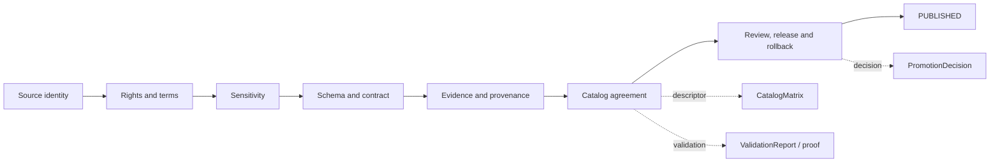

<!-- [KFM_META_BLOCK_V2]
doc_id: kfm://doc/adr-0022-catalog-matrix-stac-dcat-prov-must-agree
title: ADR-0022 — Catalog Matrix · STAC + DCAT + PROV Must Agree
type: adr
adr_id: ADR-0022
version: v1.2
status: proposed
owners:
  - "NEEDS VERIFICATION — catalog steward"
  - "NEEDS VERIFICATION — release steward"
  - "NEEDS VERIFICATION — evidence/proof steward"
  - "NEEDS VERIFICATION — schema and contract stewards"
  - "NEEDS VERIFICATION — policy and validation stewards"
reviewers_required:
  - Architecture steward
  - Docs steward
  - Catalog steward
  - Release and rollback steward
  - Evidence/proof steward
  - Contracts and schemas stewards
  - Policy and validation stewards
  - At least one affected domain steward
created: 2026-05-09
updated: 2026-07-24
policy_label: public
truth_posture: cite-or-abstain
responsibility_root: docs/
current_path: docs/adr/ADR-0022-catalog-matrix--stac-+-dcat-+-prov-must-agree.md
supersedes: []
superseded_by: null
evidence_snapshot:
  repository: bartytime4life/Kansas-Frontier-Matrix
  base_ref: main
  target_prior_blob: b09c1d7aaa39f3030afdcec419c58236fd324f17
  catalog_matrix_contract_blob: c67923beb505aa39e7c0c768c16e75a00826ff31
  catalog_matrix_schema_blob: 75a927376066226d8a0f89a630d7bb3693143c41
  catalog_closure_readme_blob: a6001d58d20c4f1c078281661f6cba17a488f293
  adr_0011_blob: 40b0f47b87d584040803ed76aa6b31f5204b7fca
related:
  - docs/adr/README.md
  - docs/adr/INDEX.md
  - docs/adr/ADR-0001-schema-home--schemas-contracts-v1-is-canonical.md
  - docs/adr/ADR-0002-contracts-vs-schemas-split.md
  - docs/adr/ADR-0011-receipts-vs-proofs-vs-manifests-vs-catalog-separation.md
  - docs/adr/ADR-0018-promotion-gate-sequence.md
  - docs/adr/ADR-0023-geo-manifest-signs-every-pmtiles-cog-release.md
  - docs/adr/ADR-0024-steward-separation-of-duties-for-release.md
  - docs/adr/ADR-0025-public-client-never-reads-canonical-internal-stores.md
  - docs/doctrine/directory-rules.md
  - contracts/data/catalog_matrix.md
  - schemas/contracts/v1/data/catalog_matrix.schema.json
  - tools/validators/catalog_closure/README.md
  - tools/validators/catalog/README.md
  - tools/validators/validate_catalog_matrix.py
  - data/catalog/README.md
  - data/catalog/stac/README.md
  - data/catalog/dcat/README.md
  - data/catalog/prov/README.md
  - data/proofs/README.md
  - release/README.md
  - docs/registers/DRIFT_REGISTER.md
tags: [kfm, adr, catalog, catalog-matrix, stac, dcat, prov, provenance, evidence, promotion, closure, rollback]
notes:
  - "v1.2 is a same-path repository-grounded modernization. It preserves proposed status and does not accept the ADR or create enforcement."
  - "Current repository evidence places the shared semantic contract under contracts/data/ and the paired placeholder schema under schemas/contracts/v1/data/."
  - "The current shared schema is permissive and requires only id; it does not enforce this ADR's release-level agreement contract."
  - "The catalog_closure validator lane is README-only; the observed top-level CatalogMatrix validator is a NotImplementedError stub; no release resolver or dedicated closure suite is established."
  - "ADR-0011 and ADR-0022 must be coordinated so CatalogMatrix remains a catalog descriptor while its validation report/proof remains a distinct proof object."
[/KFM_META_BLOCK_V2] -->

<a id="top"></a>

# ADR-0022 — Catalog Matrix · STAC + DCAT + PROV Must Agree

> **Proposed decision.** Every KFM release candidate that claims catalog closure across STAC, DCAT, and PROV MUST provide one explicit, immutable agreement packet that binds those records to the same artifact identity, byte digest, and release reference. Any unresolved or contradictory closure result blocks promotion.

[](#status)
[](#current-repository-evidence)
[](#current-repository-evidence)
[](#current-enforcement-maturity)
[](#current-enforcement-maturity)
[](#current-enforcement-maturity)
[](#authority-and-publication-boundary)

> [!IMPORTANT]
> **Decision text is not enforcement.** This file remains `proposed`. The repository contains a semantic contract, a permissive placeholder schema, catalog documentation, validator documentation, and a non-functional validator stub. No current evidence establishes a complete closure resolver, dedicated fixtures/tests, required CI gate, promotion integration, release assembly, or operational rollback.

> [!CAUTION]
> **A `CatalogMatrix` is not proof, policy, approval, or publication.** It is a catalog-facing descriptor and crosswalk. A separate validation report or proof object records that the matrix was checked; a separate `PolicyDecision` decides admissibility; a separate release decision authorizes promotion.

**Quick navigation:** [Status](#status) · [Evidence](#evidence-boundary) · [Context](#context) · [Decision](#decision) · [Agreement](#agreement-contract) · [Object boundary](#catalogmatrix-object-boundary) · [Repository evidence](#current-repository-evidence) · [Maturity](#current-enforcement-maturity) · [Implementation](#implementation-contract) · [Promotion](#promotion-gating) · [Consequences](#consequences) · [Alternatives](#alternatives-considered) · [Migration](#migration-and-compatibility) · [Acceptance](#acceptance-gates) · [Risks](#risk-ledger) · [Rollback](#rollback-and-supersession) · [Verification](#verification-checklist) · [References](#references)

---

<a id="status"></a>

## Status

| Field | Current value |
|---|---|
| **ADR ID** | `ADR-0022` |
| **Tracked path** | `docs/adr/ADR-0022-catalog-matrix--stac-+-dcat-+-prov-must-agree.md` |
| **Source metadata** | `proposed` |
| **Effective decision status** | `proposed` |
| **Decision class** | Cross-vocabulary catalog-closure invariant and promotion prerequisite |
| **Current repository posture** | Contract exists; schema is placeholder; validator path is conflicted/stubbed; closure enforcement is not established |
| **Implementation effect of this revision** | Documentation only |
| **Publication effect** | None |
| **Supersedes / superseded by** | None / none |

### Decision scope

This ADR decides the proposed **release-level agreement rule** between:

1. STAC catalog records;
2. DCAT datasets/distributions;
3. PROV activities/entities/agents;
4. the canonical artifact and its digest;
5. the release reference that governs exposure.

It does not decide domain semantics, replace source descriptors or evidence bundles, authorize a release, define every field of the shared schema, choose a public API route, or make a validator pass equivalent to publication.

### Acceptance and enforcement are separate

1. **ADR acceptance** approves the agreement rule and authority boundaries.
2. **Enforcement graduation** requires production-grade contracts/schemas, deterministic generation, meaningful fixtures, executable validation, policy wiring, CI admission, release assembly, accountable review, correction, rollback, and observed behavior.

An accepted ADR without enforcement is doctrine, not runtime proof.

[Back to top](#top)

---

<a id="evidence-boundary"></a>

## Evidence boundary

This revision uses current repository bytes from `main` plus KFM doctrine. Repository evidence is authoritative for what exists now; Directory Rules and accepted ADRs govern responsibility and placement.

| Evidence level | CONFIRMED | Not established |
|---|---|---|
| **ADR identity** | This exact tracked path and prior blob exist. | Acceptance, quorum, or enforcement. |
| **Semantic contract** | `contracts/data/catalog_matrix.md` exists and defines `CatalogMatrix` as an inspectability aid, not sovereign truth or release authority. | Final field semantics or accepted ownership. |
| **Machine schema** | `schemas/contracts/v1/data/catalog_matrix.schema.json` exists and points to the semantic contract. | Production-grade shape; it requires only `id` and permits arbitrary additional properties. |
| **Validator lane** | `tools/validators/catalog_closure/README.md` exists; `tools/validators/validate_catalog_matrix.py` is documented as a stub. | Working closure executable, resolver, dedicated fixture/test family, or required CI gate. |
| **Catalog lanes** | STAC, DCAT, PROV, domain, evidence/proof, and release documentation surfaces exist. | Mutually consistent emitted release records or end-to-end promotion closure. |
| **Operational release** | No admissible evidence reviewed here establishes publication. | Production deployment, public route behavior, signing, approval, rollback execution, or current release state. |

### Truth labels

| Label | Use in this ADR |
|---|---|
| **CONFIRMED** | Verified from current repository bytes or governing doctrine. |
| **PROPOSED** | Decision, field, path role, migration, validator, policy, or workflow not accepted and verified. |
| **UNKNOWN** | No sufficient evidence establishes the state. |
| **NEEDS VERIFICATION** | A concrete repository, workflow, review, or operational check remains. |
| **CONFLICTED** | Current repository documents or proposed ADRs disagree and need coordinated resolution. |

### Directory Rules basis

- `docs/adr/` owns architecture decisions.
- `contracts/` owns object meaning.
- `schemas/` owns machine shape.
- `tools/validators/` owns deterministic checking.
- `policy/` owns admissibility decisions.
- `data/catalog/` owns catalog-stage records.
- `data/proofs/` owns proof/support records.
- `release/` owns release decisions, manifests, correction, and rollback.

The currently verified shared homes are `contracts/data/catalog_matrix.md` and `schemas/contracts/v1/data/catalog_matrix.schema.json`. Earlier proposed paths under `contracts/catalog/` or `schemas/contracts/v1/catalog/` are not treated as current repository facts.

[Back to top](#top)

---

<a id="context"></a>

## Context

KFM uses three standards-facing catalog views because they answer different questions:

| Surface | Primary question | Must not become |
|---|---|---|
| **STAC** | What spatiotemporal asset can be discovered and accessed? | Release authority or provenance proof. |
| **DCAT** | What dataset/distribution can interoperate with external catalogs, and under what rights/access posture? | Canonical artifact store or lineage authority. |
| **PROV** | Which activity, agent, and source entities produced this artifact? | Policy decision or public-access grant. |

Each record can be individually valid while the set is mutually contradictory. A STAC asset can name one checksum, DCAT another, and PROV a different generated entity. Per-record schema validation cannot prove cross-record agreement.

```text
record validity != cross-record agreement != policy permission != release approval
```

The failure mode is **catalog drift**: three standards-compliant records describe different effective artifacts or releases while presenting one apparent catalog surface.

> [!WARNING]
> Catalog drift is hard to detect after publication because each individual record may still parse, validate, and render. KFM therefore needs a deterministic closure check before promotion.

### Forces

| Force | Pressure |
|---|---|
| **Trust** | Consumers must be able to establish that STAC, DCAT, and PROV refer to the same released artifact. |
| **Standards reuse** | KFM should profile established standards rather than fork them. |
| **Determinism** | Identity, digest, and release-reference disagreement must fail closed. |
| **Auditability** | Reviewers need a compact, inspectable crosswalk plus the underlying records and validation evidence. |
| **Separation** | The matrix descriptor, validation proof, policy decision, and release authorization must remain distinct. |
| **Cost** | Closure adds schema, generator, validator, fixtures, tests, reports, and review burden. |

[Back to top](#top)

---

<a id="decision"></a>

## Decision

KFM proposes the following release-level rules.

### 1. Agreement is mandatory for promotion

For each release artifact represented across STAC, DCAT, and PROV, the records MUST agree on:

1. **Canonical artifact identity** — the same stable artifact identifier or `spec_hash` lineage.
2. **Byte digest** — the same algorithm-qualified digest for the exact released bytes.
3. **Release reference** — the same immutable release-governance reference.

A verified disagreement is `DENY`. Missing support that prevents a reliable determination is `ABSTAIN` or `ERROR`, never an implicit pass.

### 2. One explicit agreement descriptor is required

A release candidate MUST provide a `CatalogMatrix` or accepted equivalent that:

- names the closure scope;
- identifies the STAC, DCAT, and PROV records checked;
- records the canonical identity, digest, and release reference expected;
- records source, evidence, validation, policy, review, correction, and rollback references where applicable;
- exposes finite agreement outcomes and reason codes;
- remains content-addressed or otherwise immutably identifiable.

### 3. Validation proof is separate

The matrix descriptor MUST NOT claim that it validated itself. A separate `ValidationReport`, proof record, or accepted equivalent records:

- validator identity and version;
- exact input digests;
- checks executed;
- outcomes and reason codes;
- generated time;
- environment/tool failures;
- report digest.

### 4. Promotion remains a separate decision

A passing closure report is necessary but not sufficient. Policy, rights, sensitivity, review, release assembly, correction, and rollback gates still decide promotion.

### 5. Public clients use governed projections

Public clients, review UIs, Focus Mode, dashboards, and exports consume released, policy-safe representations through governed interfaces. This ADR does not authorize direct reads from canonical/internal stores, RAW, WORK, QUARANTINE, or unreviewed catalog candidates.

[Back to top](#top)

---

<a id="agreement-contract"></a>

## Agreement contract

### Required agreement dimensions

| Dimension | STAC projection | DCAT projection | PROV projection | Authority used for comparison |
|---|---|---|---|---|
| **Artifact identity** | KFM extension property or asset identifier | `dct:identifier` or profiled equivalent | Generated `prov:Entity` identifier | Canonical artifact identity contract / release object |
| **Byte digest** | Asset checksum extension/profile | Distribution checksum such as SPDX checksum or accepted profile | Generated entity digest attribute/profile | Digest recorded by release assembly for the exact bytes |
| **Release reference** | KFM release link/property | KFM release extension/link | Activity/entity release association | Immutable release-governance record |
| **Producing activity** | Provenance link | `prov:wasGeneratedBy` or profile mapping | `prov:Activity` | PROV activity identity |
| **Upstream sources** | Derived/source links | Primary-source/provenance mapping | `prov:wasDerivedFrom` | Admitted `SourceDescriptor` identities |
| **Rights/access** | Summary/profile fields | DCAT rights/access fields | Activity/entity policy annotations | Applicable source and policy decisions |
| **Evidence support** | Evidence link | KFM evidence extension/link | Entity/activity relation | Resolved `EvidenceBundle` or accepted support object |

> [!NOTE]
> Exact extension names remain profile-level implementation details. The invariant is semantic agreement, not attachment to one provisional field spelling.

### Finite outcomes

| Outcome | Meaning | Promotion effect |
|---|---|---|
| `PASS` | Required records resolve and all configured agreement checks pass. | Closure prerequisite may pass; other gates still run. |
| `ABSTAIN` | Support is incomplete, stale, conflicted, or insufficient to establish agreement safely. | Hold promotion and return missing-support details. |
| `DENY` | A verified identity, digest, release, policy, rights, sensitivity, or public-safety invariant is violated. | Fail closed. |
| `ERROR` | Tool, parser, registry, dependency, or environment failure prevents a reliable decision. | Fail closed; repair and rerun with a new report. |

### Stable reason-code families

| Family | Examples |
|---|---|
| Identity | `identity_mismatch`, `unresolved_artifact`, `duplicate_artifact_identity` |
| Digest | `digest_missing`, `digest_algorithm_mismatch`, `digest_mismatch` |
| Release | `release_ref_missing`, `release_ref_mismatch`, `release_state_invalid` |
| Linkage | `missing_stac_dcat_link`, `missing_dcat_prov_link`, `unresolved_prov_entity` |
| Evidence/source | `unresolved_evidence`, `unresolved_source_descriptor`, `source_not_admitted` |
| Rights/policy | `rights_unknown`, `access_class_conflict`, `restricted_public_projection` |
| Tooling | `schema_error`, `parse_error`, `dependency_error`, `internal_error` |

Renaming or removing stable reason codes requires compatibility review because dashboards, proof readers, CI summaries, and release tooling may depend on them.

[Back to top](#top)

---

<a id="catalogmatrix-object-boundary"></a>

## CatalogMatrix object boundary

ADR-0011 and the current semantic contract establish the anti-collapse rule:

```text
CatalogMatrix descriptor
  != ValidationReport / proof
  != PolicyDecision
  != PromotionDecision
  != ReleaseManifest
  != published artifact
```

| Object | Owns | Does not own |
|---|---|---|
| `CatalogMatrix` | Crosswalk scope, referenced records, expected shared values, finite agreement status, reason summaries | Evidence truth, validator execution, policy permission, release approval |
| `ValidationReport` | Exact validation inputs, checks, tool version, results, reason codes, report digest | Catalog meaning, policy permission, release approval |
| `EvidenceBundle` | Claim support and citation closure | Catalog interchange shape or release decision |
| `PolicyDecision` | Allow, deny, restrict, hold, abstain, obligations | Schema validity or catalog identity |
| `PromotionDecision` / receipt | Governed transition decision and gate outcomes | Source truth or artifact bytes |
| `ReleaseManifest` | Released artifact set, digests, public scope, rollback target | Underlying evidence or catalog record semantics |

### Minimum descriptor fields proposed for schema hardening

| Field | Purpose |
|---|---|
| `id` | Stable matrix descriptor identity. |
| `version` | Contract/profile version. |
| `scope` | Domain, release candidate, artifact family, or explicit record set. |
| `release_ref` | Immutable release candidate or release-governance reference. |
| `artifact_ref` | Canonical artifact reference. |
| `artifact_identity` | Expected stable identity/spec hash. |
| `artifact_digest` | Algorithm-qualified expected byte digest. |
| `stac_refs[]` | Exact STAC records/assets checked. |
| `dcat_refs[]` | Exact DCAT datasets/distributions checked. |
| `prov_refs[]` | Exact PROV activities/entities checked. |
| `source_refs[]` | Admitted source descriptors needed for lineage closure. |
| `evidence_refs[]` | Evidence/support references needed for consequential claims. |
| `validation_report_ref` | Separate report proving checks ran. |
| `policy_decision_refs[]` | Applicable rights/sensitivity/admissibility decisions. |
| `agreement_outcome` | `PASS`, `ABSTAIN`, `DENY`, or `ERROR`. |
| `reason_codes[]` | Stable machine-readable findings. |
| `correction_refs[]` | Correction/supersession/withdrawal lineage. |
| `rollback_ref` | Rollback target when release-significant. |
| `spec_hash` | Deterministic descriptor hash where adopted. |

The current shared schema does not enforce this shape. These fields remain PROPOSED until the schema, fixtures, validator, and compatibility policy are updated together.

[Back to top](#top)

---

<a id="current-repository-evidence"></a>

## Current repository evidence

| Surface | Status | Evidence-backed consequence |
|---|---|---|
| `contracts/data/catalog_matrix.md` | **CONFIRMED draft semantic contract** | Current object meaning lives under the `data` contract family. |
| `schemas/contracts/v1/data/catalog_matrix.schema.json` | **CONFIRMED placeholder schema** | Requires only `id`; `additionalProperties: true`; cannot enforce this ADR. |
| `tools/validators/catalog_closure/README.md` | **CONFIRMED README-only boundary** | Documents intended closure readiness but does not establish executable behavior. |
| `tools/validators/validate_catalog_matrix.py` | **CONFIRMED stub per repository documentation** | Raises `NotImplementedError`; not a usable promotion gate. |
| Schema-declared `tools/validators/data/validate_catalog_matrix.py` | **CONFIRMED absent in bounded repository evidence** | Schema metadata points to an unestablished path. |
| `fixtures/data/catalog_matrix/` | **Not established by reviewed evidence** | No meaningful shared fixture suite is claimed. |
| Release closure resolver | **Not established** | ADR v1.1's proposed resolver path is not current implementation evidence. |
| Domain schemas | **CONFIRMED examples exist for multiple domains** | Domain specializations exist, but convergence on the shared contract and schema is not proven. |
| Catalog/release operation | **UNKNOWN** | No emitted matrix, signed proof, promotion result, public route, or rollback drill was verified here. |

### Current conflicts

1. **ADR-0011 versus ADR-0022 framing.** ADR-0011 separates catalog descriptors from proofs; the older ADR-0022 text could be read as making the matrix itself a closure proof. This revision resolves the prose in favor of separation, while both ADRs remain proposed.
2. **Schema path drift.** Current verified schema is under `schemas/contracts/v1/data/`, not the earlier proposed `schemas/contracts/v1/catalog/` path.
3. **Validator path drift.** Schema metadata names `tools/validators/data/validate_catalog_matrix.py`; repository documentation identifies that exact path as absent and a top-level stub elsewhere.
4. **Shared versus domain-specific matrices.** Domain schemas exist, but their inheritance, compatibility, or profile relationship to the shared schema remains NEEDS VERIFICATION.
5. **Closure readiness versus release authority.** Validator documentation correctly denies release authority, but the accepted handoff contract to promotion is not established.

[Back to top](#top)

---

<a id="current-enforcement-maturity"></a>

## Current enforcement maturity

| Capability | Current status | Graduation requirement |
|---|---|---|
| Semantic meaning | **Draft contract exists** | Accepted contract, owners, stable terms, compatibility policy. |
| Machine shape | **Placeholder** | Required fields, profiles, enums, formats, references, negative constraints. |
| Deterministic generator | **UNKNOWN / not established** | Idempotent generation with pinned inputs and output digest. |
| Shared validator | **Stub / not established** | Executable, deterministic, finite outcomes, stable reason codes. |
| Domain validators | **README/schema examples; runtime NEEDS VERIFICATION** | Shared-core reuse plus explicit domain extensions. |
| Fixtures | **Not established** | Positive, invalid-shape, mismatch, unresolved, denied, stale, correction, rollback cases. |
| Tests | **Not established** | Unit, integration, mutation/negative, replay, and no-network tests. |
| Policy | **NEEDS VERIFICATION** | Rights, sensitivity, restricted-public, stale, and release-state rules. |
| CI admission | **Not established** | Required job tied to exact validator/report profile. |
| Release resolver | **Not established** | Immutable packet resolution and promotion handoff. |
| Review and separation of duties | **NEEDS VERIFICATION** | Named role requirements and independent release approval where material. |
| Correction and rollback | **Documented doctrine; operation UNKNOWN** | Tested correction cascade and rollback drill. |

> [!WARNING]
> Until the schema and validator graduate, a `CatalogMatrix` instance can appear structurally valid while omitting every consequential agreement field. It must not be used as release proof.

[Back to top](#top)

---

<a id="implementation-contract"></a>

## Implementation contract

Implementation should be split into reviewable, reversible increments.

### Target responsibility lanes

| Responsibility | Current or proposed lane | Posture |
|---|---|---|
| Semantic contract | `contracts/data/catalog_matrix.md` | **CONFIRMED current home; update in place** |
| Shared machine schema | `schemas/contracts/v1/data/catalog_matrix.schema.json` | **CONFIRMED current home; harden in place** |
| Shared closure boundary | `tools/validators/catalog_closure/` | **CONFIRMED documentation lane; executable placement NEEDS VERIFICATION** |
| Existing validator stub | `tools/validators/validate_catalog_matrix.py` | **CONFIRMED stub; replace, delegate, or deprecate through reviewed migration** |
| Record-local validation | `tools/validators/catalog/` | **CONFIRMED sibling responsibility** |
| Fixtures | `fixtures/data/catalog_matrix/` or verified repo-native equivalent | **PROPOSED; placement/creation preflight required** |
| Tests | `tests/validators/catalog_closure/` or verified repo-native equivalent | **PROPOSED; verify test conventions** |
| Policy | `policy/data/` plus release/promotion policy as applicable | **NEEDS VERIFICATION; avoid parallel policy authority** |
| Catalog instances | Under governed `data/catalog/` lanes | **CONFIRMED root; exact matrix instance home NEEDS VERIFICATION** |
| Validation reports/proofs | Under governed proof/report lanes | **NEEDS VERIFICATION; must remain distinct from descriptor** |
| Release decisions | `release/` | **CONFIRMED responsibility root; exact integration NEEDS VERIFICATION** |

### Required negative fixtures

At minimum, the shared suite should cover:

- STAC versus DCAT digest mismatch;
- DCAT versus release-assembly digest mismatch;
- release-reference mismatch;
- missing STAC-to-DCAT relation;
- missing DCAT-to-PROV relation;
- unresolved generated PROV entity;
- canonical artifact identity mismatch;
- unresolved evidence reference;
- unresolved or unadmitted source descriptor;
- unknown rights or conflicting access class;
- restricted-precise distribution in a public projection;
- stale/superseded record without correction lineage;
- parser/tool failure producing `ERROR` rather than pass;
- matrix descriptor claiming validation without a separate report;
- validator report whose input digest does not match the matrix digest.

### Determinism and replay

A closure run should be reproducible from:

1. immutable matrix descriptor bytes;
2. immutable STAC/DCAT/PROV record bytes or digests;
3. source/evidence/policy/release references;
4. validator version/spec hash;
5. profile/configuration version;
6. no-network fixture mode for CI;
7. an emitted report digest.

Network resolution belongs in a separately controlled integration path. Default CI should use pinned fixtures and fail closed when required remote state cannot be represented safely.

[Back to top](#top)

---

<a id="promotion-gating"></a>

## Promotion gating

Catalog closure participates in the promotion sequence; it does not replace it.


```mermaid
flowchart LR
    A[Source identity] --> B[Rights and terms]
    B --> C[Sensitivity]
    C --> D[Schema and contract]
    D --> E[Evidence and provenance]
    E --> F[Catalog agreement]
    F --> G[Review, release and rollback]
    G --> P[PUBLISHED]

    F -. descriptor .-> CM[CatalogMatrix]
    F -. validation .-> VR[ValidationReport / proof]
    G -. decision .-> PD[PromotionDecision]
```

| Gate concern | Required closure evidence | Failure posture |
|---|---|---|
| Shape/profile | Matrix and records match accepted schemas/profiles. | `DENY` or `ERROR`. |
| Inputs pinned | Exact records and digests are fixed. | `ABSTAIN` / `DENY`. |
| Record checks | STAC, DCAT, and PROV validate individually. | `DENY`. |
| Cross-record agreement | Identity, digest, and release reference agree. | `DENY`. |
| Evidence/source closure | Required evidence and admitted sources resolve. | `ABSTAIN` / `DENY`. |
| Rights/sensitivity | Access and public projection are allowed. | `DENY` / `HOLD`. |
| Review/release | Accountable review, release manifest, correction, rollback exist. | `HOLD` / `DENY`. |

**No warn-only path** is permitted for identity, digest, release-reference, unresolved evidence/source, rights, sensitivity, or restricted-public disagreement when the candidate is intended for public release.

[Back to top](#top)

---

<a id="consequences"></a>

## Consequences

### Positive

- Catalog drift becomes a pre-promotion failure rather than a post-publication discovery.
- Reviewers gain a compact crosswalk without collapsing underlying records or proof families.
- Domain lanes can extend one shared agreement contract rather than inventing incompatible matrix meanings.
- STAC, DCAT, and PROV retain their standards-native roles.
- Correction and rollback can compare closure packets across releases.
- Public clients remain downstream of governed release and evidence resolution.

### Costs and tradeoffs

- A production-grade schema and validator add maintenance surface.
- Duplicate projection fields require clear source-of-authority rules.
- Domain schemas may require migration or profile convergence.
- Network-backed resolution can be flaky; deterministic fixture-mode validation and explicit `ERROR` handling are required.
- Stable reason codes and profile versions create compatibility obligations.
- Additional review burden is intentional because the matrix affects release trust.

### What this decision does not prove

- that any current matrix instance is valid;
- that a release has passed closure;
- that all domains use the shared schema;
- that rights or sensitivity are resolved;
- that CI blocks release;
- that public endpoints expose correct records;
- that rollback has been tested.

[Back to top](#top)

---

<a id="alternatives-considered"></a>

## Alternatives considered

### Validate STAC, DCAT, and PROV independently

**Rejected.** Independent validity cannot detect mutual disagreement.

### Make one vocabulary authoritative for everything

**Rejected.** STAC, DCAT, and PROV have different bounded responsibilities. Collapsing them would weaken interoperability and provenance clarity.

### Put all records into one giant matrix document

**Rejected.** It creates a second catalog authority, increases drift risk, and weakens standards-native tooling.

### Treat the matrix itself as proof

**Rejected.** A descriptor cannot prove that its own assertions were checked. Validation evidence remains a separate object family.

### Make catalog agreement advisory

**Rejected for promotion.** Identity, digest, release-reference, evidence, rights, sensitivity, and public-access contradictions must fail closed.

### Require the matrix only after publication

**Rejected.** Post-publication auditing is useful but too late to protect the release boundary.

[Back to top](#top)

---

<a id="migration-and-compatibility"></a>

## Migration and compatibility

This decision is additive at the standards level but requires convergence of existing KFM surfaces.

1. **Coordinate ADR-0011 and ADR-0022.** Preserve descriptor/proof/release separation and record any remaining conflict explicitly.
2. **Harden the current shared contract and schema in place.** Do not create parallel `catalog/` schema or contract homes.
3. **Inventory domain schemas.** Classify each as compatible profile, divergent extension, duplicate, or migration candidate.
4. **Choose one executable entrypoint.** Replace, delegate, or deprecate the current top-level stub and repair stale schema metadata.
5. **Create meaningful fixtures and tests.** Cover finite outcomes, reason codes, rights/sensitivity, stale state, correction, and rollback.
6. **Emit a separate validation report.** Bind it to exact input and output digests.
7. **Integrate policy and promotion.** A passing validator hands off; it never approves release.
8. **Add deterministic CI admission.** No-network by default; separately controlled integration checks where needed.
9. **Roll out domain profiles.** Domain matrices extend the shared core without redefining identity/digest/release agreement.
10. **Backfill selectively.** Older releases may be marked `pre-matrix` where safe reconstruction is impossible; do not fabricate closure.

### Compatibility rule

A domain profile MAY add domain-specific fields and checks, but it MUST preserve the shared agreement dimensions and finite outcomes. A profile MUST NOT weaken a shared `DENY` condition for public release.

[Back to top](#top)

---

<a id="acceptance-gates"></a>

## Acceptance gates

ADR acceptance should require:

- [ ] ADR-0011 and ADR-0022 language is coordinated and no object-family collapse remains.
- [ ] Directory Rules and ADR-0001 support the current shared contract/schema homes.
- [ ] Decision owners and required review roles are recorded without placeholders presented as fact.
- [ ] Shared identity, digest, release-reference, finite-outcome, and descriptor/proof separation rules are approved.
- [ ] Domain-profile compatibility requirements are approved.
- [ ] Migration and rollback posture is judged reversible.

Enforcement graduation should additionally require:

- [ ] `contracts/data/catalog_matrix.md` is accepted and versioned.
- [ ] `schemas/contracts/v1/data/catalog_matrix.schema.json` is no longer a permissive placeholder.
- [ ] One canonical validator entrypoint is executable and deterministic.
- [ ] The stale validator path in schema metadata is repaired.
- [ ] Positive and negative fixtures exercise every stable reason-code family.
- [ ] Tests prove `PASS`, `ABSTAIN`, `DENY`, and `ERROR` behavior.
- [ ] Validation reports bind exact inputs, tool/profile versions, outcomes, and report digests.
- [ ] Policy tests cover rights, sensitivity, restricted-public, stale, correction, and rollback cases.
- [ ] CI runs the closure suite in no-network mode and treats blocking outcomes correctly.
- [ ] Promotion consumes the separate validation report and still runs independent policy/review/release gates.
- [ ] Correction and rollback drills preserve prior matrices and reports as lineage.
- [ ] At least one proof-bearing domain slice passes end to end.

[Back to top](#top)

---

<a id="risk-ledger"></a>

## Risk ledger

| Risk | Impact | Mitigation |
|---|---|---|
| Matrix becomes a second catalog authority | Conflicting records and hidden drift | Store refs plus pinned agreement fields; underlying standards records remain authoritative for their own roles. |
| Matrix is mistaken for proof | False confidence and release bypass | Require a separate validation report/proof and explicit UI labels. |
| Placeholder schema appears production-ready | Invalid release packets pass shape checks | Keep enforcement on hold until schema hardening and negative tests land. |
| Validator path drift persists | CI invokes wrong or missing executable | Select one entrypoint, update metadata, add path tests, deprecate aliases. |
| Domain schemas diverge | Inconsistent agreement semantics | Shared core + profiled extensions + compatibility tests. |
| Network resolution is flaky | Non-deterministic CI and false failures | Pinned fixtures by default; controlled integration checks; `ERROR` never pass. |
| Rights/access fields disagree | Restricted data leaks | Policy-authoritative comparison and fail-closed public-projection tests. |
| Release rollback removes history | Audit lineage is lost | Retain prior descriptor/report/release records with correction state. |
| Badge/document polish overstates maturity | Reviewers infer implementation | Keep status text and badges tied to current repository evidence. |

[Back to top](#top)

---

<a id="rollback-and-supersession"></a>

## Rollback and supersession

### Documentation rollback

Before merge, close or abandon the draft PR. After merge, revert the documentation commit. Neither action changes runtime state because this revision is documentation-only.

### Enforcement rollback

If future enforcement is faulty:

1. preserve the failed matrix, report, inputs, and reason codes;
2. stop new promotions rather than silently bypassing closure;
3. revert or disable only the faulty implementation through a reviewed change;
4. retain identity, digest, release-reference, evidence, rights, sensitivity, and restricted-public checks as blocking;
5. issue correction/rollback records for any affected released artifact;
6. keep previous matrix/report versions discoverable as lineage;
7. supersede this ADR explicitly if the decision itself changes.

A rollback MUST NOT rewrite STAC, DCAT, PROV, evidence, or release history to hide a failure.

[Back to top](#top)

---

<a id="verification-checklist"></a>

## Verification checklist

- [x] Target exists at the same tracked path.
- [x] Current semantic contract path was inspected.
- [x] Current shared schema path and placeholder shape were inspected.
- [x] Current catalog-closure validator documentation was inspected.
- [x] ADR-0011 conflict/separation language was inspected.
- [x] Open pull-request search found no matching open ADR-0022/catalog-matrix PR before mutation.
- [ ] `docs/adr/INDEX.md` row and effective status are re-read on the feature branch.
- [ ] Current branch diff contains only this file.
- [ ] Markdown source structure, links, anchors, tables, alerts, fences, and Mermaid are validated.
- [ ] Remote bytes match the prepared content.
- [ ] Draft PR base/head and changed paths are verified.
- [ ] CI/check status is observed without claiming completion while pending.

[Back to top](#top)

---

<a id="references"></a>

## References

### Internal

- [ADR-0001 — Schema home](./ADR-0001-schema-home--schemas-contracts-v1-is-canonical.md)
- [ADR-0002 — Contracts vs schemas split](./ADR-0002-contracts-vs-schemas-split.md)
- [ADR-0011 — Receipts vs proofs vs manifests vs catalog separation](./ADR-0011-receipts-vs-proofs-vs-manifests-vs-catalog-separation.md)
- [ADR-0018 — Promotion gate sequence](./ADR-0018-promotion-gate-sequence.md)
- [ADR-0023 — Geo manifest signs every PMTiles/COG release](./ADR-0023-geo-manifest-signs-every-pmtiles-cog-release.md)
- [ADR-0024 — Steward separation of duties](./ADR-0024-steward-separation-of-duties-for-release.md)
- [ADR-0025 — Public client never reads canonical/internal stores](./ADR-0025-public-client-never-reads-canonical-internal-stores.md)
- [Directory Rules](../doctrine/directory-rules.md)
- [CatalogMatrix semantic contract](../../contracts/data/catalog_matrix.md)
- [CatalogMatrix shared schema](../../schemas/contracts/v1/data/catalog_matrix.schema.json)
- [Catalog closure validator boundary](../../tools/validators/catalog_closure/README.md)
- [Catalog record validator boundary](../../tools/validators/catalog/README.md)
- [Catalog root](../../data/catalog/README.md)
- [STAC catalog lane](../../data/catalog/stac/README.md)
- [DCAT catalog lane](../../data/catalog/dcat/README.md)
- [PROV catalog lane](../../data/catalog/prov/README.md)
- [Proof root](../../data/proofs/README.md)
- [Release root](../../release/README.md)

### External standards

> [!NOTE]
> Version-specific adoption, extensions, package behavior, and compatibility remain NEEDS VERIFICATION during implementation.

- [OGC STAC](https://www.ogc.org/standards/stac/)
- [STAC specification](https://github.com/radiantearth/stac-spec)
- [W3C DCAT 3](https://www.w3.org/TR/vocab-dcat-3/)
- [W3C PROV-O](https://www.w3.org/TR/prov-o/)
- [SPDX specifications](https://spdx.dev/specifications/)

---

[Back to top](#top)
