<!-- [KFM_META_BLOCK_V2]
doc_id: kfm://doc/adr-0023-geo-manifest-signs-every-pmtiles-cog-release
title: ADR-0023 — Geo Manifest Signs Every PMTiles & COG Release
type: adr
version: v1
status: proposed
owners: <release-stewards>, <tile-stewards>, <trust-membrane-stewards>  # placeholder — confirm against CODEOWNERS
created: 2026-05-09
updated: 2026-05-09
policy_label: public
related:
  - kfm://doc/directory-rules
  - kfm://doc/adr-0001-schema-home
  - schemas/contracts/v1/evidence/kfm_geo_manifest.schema.json   # PROPOSED home
  - docs/tiles/PIPELINE.md                                       # PROPOSED home
  - schemas/contracts/v1/evidence/promotion_receipt.schema.json  # PROPOSED home
  - schemas/contracts/v1/run_receipt.schema.json                 # PROPOSED home
tags: [kfm, adr, tiles, pmtiles, cog, manifest, dsse, cosign, rekor, blake3, trust-membrane, release]
notes:
  - "ADR number 0023 is PROPOSED until verified against the live ADR index in docs/adr/."
  - "All file paths inside this ADR are PROPOSED until verified against the mounted repository."
[/KFM_META_BLOCK_V2] -->

# ADR-0023 — Geo Manifest Signs Every PMTiles & COG Release

| Field | Value |
|---|---|
| **ADR ID** | ADR-0023 *(NEEDS VERIFICATION against the ADR index)* |
| **Status** | **PROPOSED** |
| **Date proposed** | 2026-05-09 |
| **Decision class** | Trust membrane · Release governance · Schema authority |
| **Authority** | This ADR amends release publication policy and creates the canonical home for `KFMGeoManifest`. It does **not** amend Directory Rules or the schema-home rule established in ADR-0001. |
| **Supersedes** | None. |
| **Superseded by** | None. |
| **Owners** | Release stewards · Tile-stack stewards · Trust-membrane stewards *(placeholder — confirm against CODEOWNERS)* |

> [!IMPORTANT]
> KFM treats tile artifacts as **derived carriers, not canonical truth**. Public clients MUST consume released artifacts only; `RAW`, `WORK`, and `QUARANTINE` paths MUST remain non-public; generated visualization layers do **not** supersede `EvidenceBundle`. This ADR exists because the trust contract has to extend to the bytes a browser actually fetches — not stop at the catalog.

---

## Table of contents

1. [Context](#1-context)
2. [Decision](#2-decision)
3. [Scope](#3-scope)
4. [The KFMGeoManifest object](#4-the-kfmgeomanifest-object)
5. [Pipeline (signing path)](#5-pipeline-signing-path)
6. [Verification (consumer path)](#6-verification-consumer-path)
7. [Gates this ADR creates or strengthens](#7-gates-this-adr-creates-or-strengthens)
8. [Consequences](#8-consequences)
9. [Alternatives considered](#9-alternatives-considered)
10. [Open questions and NEEDS VERIFICATION](#10-open-questions-and-needs-verification)
11. [Related ADRs and documents](#11-related-adrs-and-documents)

---

## 1. Context

### 1.1 The problem this ADR addresses

KFM publishes **vector tile data as PMTiles v3** and **raster data as Cloud-Optimized GeoTIFF (COG)**. Both formats are designed for byte-range fetches over a CDN, which is what makes the serverless map-first delivery model viable.

A consequence of byte-range delivery is that **the bytes the user actually consumes never pass through a server that could vouch for them**. Without an out-of-band integrity binding, every property KFM otherwise enforces — `spec_hash` identity, EvidenceBundle linkage, license posture, sensitivity transforms, release-state — terminates at the **catalog record**, while the **tile bytes** ride a CDN unsupervised.

This ADR closes that gap.

### 1.2 What KFM doctrine already commits to

The corpus already commits to the supporting machinery:

- **Identity over canonical content.** Every artifact carries a `spec_hash` computed over canonical JSON (RFC 8785 / JCS, NFC, finite floats, sorted keys, transient fields excluded). [CONFIRMED at corpus level]
- **Crypto stack.** BLAKE3 + BAO + DSSE + cosign + Rekor are the canonical signing/verification primitives (KFM-IDX-F-001). [CONFIRMED at corpus level]
- **Promotion is a governed state transition, not a file move.** Publication requires validation, policy, review, proof, release manifest, correction path, and rollback target. [CONFIRMED doctrine]
- **Receipt ≠ proof ≠ catalog ≠ publication.** A signed manifest is the release-grade trust evidence; a run receipt is process memory; a catalog object is for discoverability. They must not be conflated. [CONFIRMED doctrine]
- **A `KFMGeoManifest` schema is already named** as the PMTiles/COG release-candidate manifest for asset digest and signature validation, with proposed home `schemas/contracts/v1/evidence/kfm_geo_manifest.schema.json`. [PROPOSED, per Whole-UI + Governed AI Expansion Report]
- **A PMTiles + signed-sidecar pipeline is already documented** end-to-end (KFM-IDX-E-001) but has not been pinned to a specific signing envelope, file layout, gate list, or rollback discipline. [PROPOSED at corpus level]

### 1.3 Why an ADR now

The doctrine and the schema name already exist; what is missing is a **single, citable decision** that:

1. Names the manifest as the **only** acceptable proof posture for a PMTiles or COG release.
2. **Pins** the sidecar shape to **DSSE-only** (resolving the `signature_b64`-inline vs DSSE-envelope drift in the corpus).
3. Makes the **signed manifest a hard precondition** of the publish gate, with explicit fail-closed reasons.
4. **Distinguishes** descriptor identity (`spec_hash`) from package-as-written identity (`bundle_digest`) and requires both.
5. Provides the **rollback discipline** for revoking an unsafe release.

---

## 2. Decision

> **Every PMTiles and every COG release artifact MUST be accompanied by a signed `KFMGeoManifest` sidecar before it may be promoted to `data/published/`. The manifest binds the artifact's bytes to KFM identity and provenance, is wrapped in a DSSE envelope, is signed with cosign, and (subject to sensitivity posture) is anchored in a transparency log. Publication of an unsigned, mismatched, or unverifiable PMTiles/COG artifact is denied — fail-closed, no exceptions outside an explicit ADR-amending review.**

Concretely:

1. **Authority** — `KFMGeoManifest` is the **single authoritative release-trust binding** for PMTiles and COG. STAC, DCAT, and PROV records reference the manifest; they do not replace it.
2. **Schema home** — `schemas/contracts/v1/evidence/kfm_geo_manifest.schema.json`. **[PROPOSED]** — consistent with ADR-0001 (schema home) and Directory Rules §7.4.
3. **Envelope** — **DSSE only**. The legacy inline-`signature_b64` form referenced in some corpus drafts is **not accepted** by the validator after this ADR.
4. **Signing tool** — `cosign sign-blob` (keyed Ed25519 or keyless via OIDC + Sigstore). Keyless is preferred for public artifacts; keyed is acceptable for restricted artifacts where the public Rekor instance is unsuitable (see §10).
5. **Hashing** — Manifest payload hashes use **BLAKE3** for tile bodies (`root_hash`) and **SHA-256** for the canonical manifest descriptor (`spec_hash`). Both MUST be present and both MUST validate.
6. **Layout** — Sidecar files sit next to the artifact: `<artifact>.kfm-geo-manifest.json`. Public CDN paths follow `tiles/{collection}/{version}/{layer}.pmtiles` plus `{layer}.pmtiles.kfm-geo-manifest.json`. **[PROPOSED — pinning the layout in this ADR closes a corpus open question.]**
7. **Gate wiring** — The `KFMGeoManifest` is consumed by **Promotion Gate D (signatures valid)** and **Promotion Gate E/G (release ready)**, and is enumerated in the `PromotionReceipt` and the run-level `RunReceipt`.
8. **Rollback** — Revocation of a published artifact requires a new manifest carrying a `supersedes` reference and a matching rollback card. The prior manifest is **never deleted**; revocation works by supersession, not by removal.

### 2.1 Conformance

- **MUST** — Every PMTiles or COG entering `data/published/` carries a valid, signed `KFMGeoManifest`.
- **MUST** — The validator runs in CI (Promotion workflow) and on any release-serving node.
- **MUST NOT** — A PMTiles or COG appears at a public URL whose sidecar is missing, expired, or unverified.
- **SHOULD** — Public artifacts anchor a signing event in Rekor; restricted artifacts use a private transparency log if and when one exists.
- **MAY** — Internal review-only artifacts under `data/processed/` carry an unsigned draft manifest, clearly labeled `status: candidate`, never reachable from a public path.

---

## 3. Scope

### 3.1 In scope

| Artifact class | Coverage |
|---|---|
| Vector PMTiles v3 (`*.pmtiles`) | **Required** sidecar |
| Cloud-Optimized GeoTIFF (`*.tif` / `*.tiff` published as COG) | **Required** sidecar |
| Time-sliced PMTiles deltas (`*.delta.pmtiles`) | **Required** sidecar with `delta_base_hash` |
| MapLibre style files referencing the artifact | Out of scope here; covered by the style-validator (separate concern) |

### 3.2 Out of scope

- **Per-tile** signing (signing every chunk individually). Verified streaming is achieved by anchoring chunk-level BLAKE3 leaves into a BAO root recorded in this manifest; per-tile DSSE is rejected as overkill (see §9).
- **3D Tiles, glTF, terrain quantized-mesh.** These will be governed under a sibling ADR if and when KFM ships a Cesium runtime path with attestation; this ADR does not bind them.
- **Source-side raw artifacts** (`data/raw/`). Those are governed by `event_run_receipt` and source-descriptor signing, not by `KFMGeoManifest`.
- **STAC / DCAT / PROV records.** Those reference the manifest; they are not sovereign over it.

### 3.3 Schema-home note (Directory Rules conformance)

| Path | Status | Basis |
|---|---|---|
| `schemas/contracts/v1/evidence/kfm_geo_manifest.schema.json` | **PROPOSED** | Per ADR-0001 (schema home) and Directory Rules §7.4. The Whole-UI Expansion Report names this exact path. |
| `docs/adr/ADR-0023-geo-manifest-signs-every-pmtiles-cog-release.md` | **CONFIRMED at doctrine level / PROPOSED at repo level** | Per Directory Rules §17 and the per-domain dossiers (`docs/adr/` is the canonical ADR home). |
| `policy/publication/pmtiles_release.rego` | **PROPOSED** | Per the corpus pipeline draft. May be split into `policy/opa/release/` per the v1.1 OPA bootstrap if a different convention is verified. |
| `tools/attest/sign_manifest.sh`, `tools/attest/verify_manifest.sh` | **PROPOSED** | Per the corpus pipeline draft and `tools/` Directory Rules. |
| `tools/validators/validate_pmtiles_manifest.py`, `validate_bao_root.py` | **PROPOSED** | Per the corpus pipeline draft. |
| `fixtures/invalid/manifest/*.json` | **PROPOSED** | Per Directory Rules §16 (negative-fixture parity). |

> [!NOTE]
> No new canonical or compatibility root is created by this ADR. All paths sit inside existing canonical roots (`docs/`, `schemas/`, `policy/`, `tools/`, `fixtures/`, `data/`). Per Directory Rules §2.4, this ADR therefore does **not** trigger the new-root review path.

---

## 4. The `KFMGeoManifest` object

The manifest is the single object KFM signs to bind tile bytes to KFM identity. The fields below are **PROPOSED** at field-shape level — the authoritative shape is defined by the schema. Field names follow the corpus.

### 4.1 Field map

| Group | Field | Required | Purpose |
|---|---|---|---|
| `identity` | `spec_hash` | yes | SHA-256 over canonical descriptor JSON (RFC 8785). Descriptor identity. |
| `identity` | `manifest_version` | yes | Schema version of the manifest itself (e.g. `"1"`). **Distinct** from `pmtiles_version`. |
| `identity` | `kfm_release_id` | yes | KFM release identifier this artifact belongs to. |
| `artifact` | `kind` | yes | `"pmtiles"` \| `"cog"` \| `"pmtiles-delta"`. |
| `artifact` | `pmtiles_version` | conditional | `"v3"` for PMTiles. Tracks the PMTiles spec, **not** the KFM schema. |
| `artifact` | `tile_format` | conditional | `"mvt"`, `"png"`, `"webp"`, `"avif"`, etc. |
| `artifact` | `tiling_scheme` | conditional | `"xyz"` for PMTiles. |
| `artifact` | `minzoom` / `maxzoom` | conditional | Zoom range. |
| `artifact` | `cog_internal_tiling` | conditional | `256` or `512` per E.1.3. |
| `integrity` | `bundle_digest` | yes | BLAKE3 hash of the artifact file as written. **Distinct from `spec_hash`.** Both must validate. |
| `integrity` | `root_hash` | yes | BLAKE3 BAO root over the artifact bytes (enables verified streaming). |
| `integrity` | `root_hash_algo` | yes | `"blake3"`. Algorithm pin. |
| `integrity` | `byte_ranges_manifest` | optional | Per-chunk leaf hashes for verified streaming. |
| `delta` | `delta_base_hash` | conditional | Required when `kind == "pmtiles-delta"`. The `bundle_digest` of the prior full archive. |
| `provenance` | `evidence_bundle_ref` | yes | URI of the EvidenceBundle this artifact derives from. |
| `provenance` | `run_receipt_ref` | yes | URI of the RunReceipt that produced this artifact. |
| `provenance` | `source_descriptors` | yes | Source descriptor references (id, role, version). |
| `provenance` | `policy_label` | yes | `public` \| `open` \| `controlled` \| `restricted`. |
| `provenance` | `sensitivity` | yes | `public` \| `generalize` \| `restricted` \| `review_required`. |
| `provenance` | `transforms` | conditional | If sensitivity-driven generalization or redaction was applied. |
| `lifecycle` | `release_state` | yes | `candidate` \| `released` \| `superseded` \| `revoked`. |
| `lifecycle` | `supersedes` | optional | Prior manifest URI when this release replaces another. |
| `lifecycle` | `rollback_target` | optional | Manifest URI to revert to on revocation. |
| `signing` | `generation_tool` | yes | Tool name + version (e.g. `tippecanoe@x.y.z`, `gdal@x.y.z`). |
| `signing` | `timestamp` | yes | RFC 3339 UTC. |
| `signing` | `signature_algo` | yes | `"ed25519"` (default). |
| `signing` | `signature_kid` | yes | Key identifier. |
| `signing` | `transparency_log` | conditional | `{ "kind": "rekor", "instance": "...", "index": ..., "inclusion_proof": ... }` for keyless / public. |
| `signing` | `dsse_envelope` | yes | The DSSE envelope wrapping the manifest payload. |

### 4.2 What this manifest **does not** carry

- Public bounding boxes, layer ordering, or style information. Those live in catalog records and style files.
- Raw access tokens, signing secrets, or device identities.
- Aggregate user telemetry or query history.

### 4.3 Canonicalization

The manifest descriptor (the payload inside the DSSE envelope) is canonicalized using **RFC 8785 (JCS)**: sorted keys, NFC Unicode normalization, no insignificant whitespace, finite floats, explicit zero handling. The T1–T8 round-trip determinism tests defined elsewhere in the corpus apply unmodified. **[PROPOSED.]**

---

## 5. Pipeline (signing path)

```mermaid
flowchart LR
    A["Source canonicalize<br/>(spec_hash)"] --> B["Build PMTiles v3<br/>or COG"]
    B --> C["Compute<br/>bundle_digest<br/>(BLAKE3)"]
    C --> D["Compute<br/>BAO root_hash<br/>(BLAKE3)"]
    D --> E["Emit KFMGeoManifest<br/>descriptor"]
    E --> F["Wrap in<br/>DSSE envelope"]
    F --> G["cosign sign-blob<br/>(keyed or keyless)"]
    G --> H{"transparency<br/>log?"}
    H -- public --> I["Anchor in Rekor"]
    H -- restricted --> J["Skip / private log"]
    I --> K["Validate manifest<br/>(Gate D)"]
    J --> K
    K --> L["Range-verify smoke test"]
    L --> M["Promotion Gates A–G<br/>(see §7)"]
    M --> N["Publish to immutable<br/>CDN-fronted storage"]
    N --> O["Emit RunReceipt +<br/>PromotionReceipt"]
    O --> P["release_state = released"]
```

> [!NOTE]
> The pipeline is the corpus's documented sequence (KFM-IDX-E-001) with this ADR pinning the envelope (DSSE-only) and the gate wiring (manifest is a Gate D precondition).

### 5.1 Per-stage requirements (selected)

| Stage | Must produce | Failure mode |
|---|---|---|
| Build | Artifact file + canonical descriptor | DENY if `spec_hash` non-deterministic across two runs of the same input |
| Bundle digest | `bundle_digest` (BLAKE3 of the file as written) | DENY if `bundle_digest != recomputed` at any later stage |
| BAO root | `root_hash` + optional per-chunk leaves | DENY if BAO root does not verify a sample chunk fetch |
| Sign | DSSE envelope | DENY if signature does not verify under the declared `signature_kid` |
| Transparency log | `transparency_log.inclusion_proof` (for public) | DENY publish-public when keyless and inclusion proof absent |
| Validate | `validate_pmtiles_manifest.py` exit code 0 | DENY on schema, hash, or signature mismatch |
| Promote | `PromotionReceipt` with all gate statuses | DENY if any gate ≠ `pass` |

---

## 6. Verification (consumer path)

Three consumers verify the manifest, each with the **same** semantic outcome but at different layers.

### 6.1 CI / publication validator

- Recomputes `spec_hash` from the canonical descriptor.
- Recomputes `bundle_digest` from the artifact file.
- Verifies the DSSE signature under the published cosign public key.
- Verifies Rekor inclusion when `transparency_log` is present.
- Confirms `evidence_bundle_ref` and `run_receipt_ref` resolve.
- Emits a structured report. Exit code 0 = all pass; non-zero = fail with reason codes.

### 6.2 Release-serving node (server-side)

- Refuses to serve any PMTiles/COG whose sidecar fails verification, even if the bytes are present.
- Rejects requests for paths where `release_state ∈ { candidate, superseded, revoked }` from public clients.

### 6.3 Service Worker / WASM verifier (client-side, optional)

- Fetches the sidecar before the artifact (or in parallel).
- Verifies signature, then streams chunks through the WASM BAO/BLAKE3 verifier.
- On chunk failure, drops the chunk and emits a structured `VerifyReceipt`.
- Per KFM-IDX-F-010. **[PROPOSED — implementation independent of this ADR.]**

---

## 7. Gates this ADR creates or strengthens

| Gate | Source | Effect of this ADR |
|---|---|---|
| `invalid_spec_hash` | corpus | **Strengthened** — covers manifest descriptor spec_hash drift |
| `unsigned_release_manifest` | corpus | **Strengthened** — fail-closed; no exception path for PMTiles/COG |
| `unverified_tile_chunk` | corpus | Unchanged — BAO chunk failure stays a DENY |
| `public_unsigned_delta` | corpus | **Strengthened** — delta sidecar must declare `delta_base_hash` and verify |
| `rollback_root_mismatch` | corpus | **Strengthened** — rollback target manifest must be retrievable and verifiable |
| `missing_run_receipt` | corpus | Unchanged — still a DENY |
| `bundle_digest_mismatch` | **NEW** | DENY when artifact file BLAKE3 ≠ manifest `bundle_digest` |
| `dsse_envelope_required` | **NEW** | DENY any non-DSSE legacy `signature_b64` form |
| `transparency_log_required_public` | **NEW** | DENY public release where `policy_label == public` and Rekor inclusion is absent |

These map onto the **Promotion Gate** sequence:

| Promotion Gate | Bound concern in this ADR |
|---|---|
| A — schema_valid | Manifest validates against `kfm_geo_manifest.schema.json` |
| B — inputs_pinned | `evidence_bundle_ref`, `run_receipt_ref`, `source_descriptors` all resolve |
| C — checks_pass | `bundle_digest`, `root_hash` recomputed and equal |
| D — signatures_valid | DSSE signature verifies; Rekor inclusion verified when required |
| E — provenance_complete | Receipts / proofs reachable; lineage closed |
| F — no_policy_violations | `policy_label`, `sensitivity`, transforms align with sensitivity policy |
| G — release_ready | `release_state` transitions `candidate → released` only after A–F pass |

---

## 8. Consequences

### 8.1 Positive

- The trust contract reaches **the bytes the user fetches**, not just the catalog record.
- Tile artifacts are **independently verifiable** offline, on a CDN, on mobile, or behind a Service Worker.
- Receipt vs proof vs catalog vs publication remain **distinct** and machine-checked, eliminating the most common KFM doctrine drift.
- Rollback is **deterministic** — supersede a manifest, never delete one — preserving audit history.
- DSSE-only consolidation eliminates a real corpus drift between inline `signature_b64` and DSSE envelopes, which would otherwise create two parallel verification paths.

### 8.2 Negative / costs

- **Signing infrastructure complexity.** Cosign + Rekor adds CI integration, key rotation, and OIDC plumbing. The cost is real but is already accepted at the doctrine level (KFM-IDX-F-001).
- **Sidecar fetch overhead.** One extra HTTP request per artifact; small but non-zero on cold-start mobile. Verified streaming amortizes this across chunks.
- **Schema discipline burden.** The producer must populate every required field; tooling must mirror it. Negative fixtures are mandatory for parity.

### 8.3 Risks and mitigations

| Risk | Mitigation |
|---|---|
| Producer ships an artifact whose `bundle_digest` no longer matches the file (e.g. CDN-side mutation) | Range-verify smoke test in CI; periodic re-verification on serving nodes |
| Cosign key compromise | Key rotation plan; supersede all manifests signed under the compromised `signature_kid` |
| Rekor public-instance leakage of restricted artifact metadata | Restricted artifacts MUST NOT use the public Rekor; use keyed signing or a private log (see §10) |
| Schema drift between sidecar shapes deployed before and after this ADR | Migration window with mirror reads; deprecation register entry per Directory Rules §14 |
| Validator absent or skipped | Validator is a Promotion Gate, not advisory; build is denied without it |

---

## 9. Alternatives considered

| Option | Rejected because |
|---|---|
| **Sign the artifact bytes directly** (no sidecar) | Signature would either need to live inside the file (breaks PMTiles/COG byte layout and CDN range fetches) or alongside it (which is exactly the sidecar). Direct byte signing also forecloses on the descriptor-vs-bytes split that the corpus relies on. |
| **Per-chunk DSSE signing** | DSSE-per-chunk multiplies signing events by the number of tiles. BAO over BLAKE3 leaves provides the same per-chunk verification with one signing event over the root. Operational cost dominates the security benefit. |
| **Inline `signature_b64` in a generic JSON sidecar** (legacy form) | Diverges from the rest of KFM's receipt/proof infrastructure, which uses DSSE. Two parallel paths means two parallel validators and two parallel failure modes. |
| **Sign only the `ReleaseManifest`, not the geo manifest** | The release manifest covers the *file set*; the geo manifest covers the *bytes*. The release manifest cannot answer "did this exact PMTiles file change since publish?" without recomputing per-file digests — which is what the geo manifest already does. They are complementary, not redundant. |
| **No signing for restricted artifacts** | Restricted ≠ unverified. Restricted artifacts still need integrity, provenance, and rollback discipline; they only need a **non-public** transparency surface. Keyed signing without Rekor handles this. |
| **Defer to STAC / DCAT extensions for trust binding** | STAC and DCAT carry references to digests but do not define a signing envelope. They reference this manifest; they do not replace it. |

---

## 10. Open questions and NEEDS VERIFICATION

> [!WARNING]
> This ADR is **PROPOSED** until the items below are addressed or explicitly deferred.

- **NEEDS VERIFICATION** — That ADR-0023 is not already claimed in `docs/adr/`. If it is, renumber.
- **NEEDS VERIFICATION** — That `schemas/contracts/v1/evidence/` is the correct evidence-schema home in the mounted repo (default per ADR-0001, but the repo state has not been inspected in this session).
- **NEEDS VERIFICATION** — That `policy/publication/pmtiles_release.rego` is the correct policy home, vs `policy/opa/release/` per the v1.1 Greenfield Plan.
- **OPEN** — **Public Rekor vs private Rekor.** The corpus does not decide. This ADR proposes: public Rekor for `policy_label == public`; keyed signing for `policy_label ∈ { controlled, restricted }` until a private log is operational.
- **OPEN** — **PMTiles raster pyramids.** The corpus prefers COG for raster (E.1.3) but allows PMTiles raster pyramids for specific use cases. This ADR treats both under the same manifest schema. A future ADR may split them.
- **OPEN** — **Tile-ID renumbering across deltas.** Delta semantics under tile-ID renumbering are unspecified in the corpus. This ADR requires `delta_base_hash` but does not enumerate renumbering rules.
- **OPEN** — **Signing key rotation cadence.** Not pinned here; track in a sibling operations runbook.
- **OPEN** — **Multi-collection PMTiles**. If a single `.pmtiles` ever bundles multiple KFM collections, the manifest field shape may need a `collections[]` array. The corpus currently assumes one-collection-per-archive.

---

## 11. Related ADRs and documents

| Reference | Relationship |
|---|---|
| ADR-0001 — Schema home (canonicalization / hash-and-id v1) | This ADR depends on ADR-0001's canonicalization rules. |
| `docs/doctrine/directory-rules.md` | Justifies all PROPOSED paths; no new root is created. |
| `docs/tiles/PIPELINE.md` *(PROPOSED)* | Operational runbook for the pipeline this ADR governs. |
| `schemas/contracts/v1/evidence/kfm_geo_manifest.schema.json` *(PROPOSED)* | Authoritative shape of `KFMGeoManifest`. |
| `schemas/contracts/v1/evidence/promotion_receipt.schema.json` *(PROPOSED)* | Carries the Gate-A-through-G outcomes referencing this manifest. |
| `schemas/contracts/v1/run_receipt.schema.json` *(PROPOSED)* | Pins the artifact's run-level provenance to this manifest. |
| `policy/publication/pmtiles_release.rego` *(PROPOSED)* | Encodes the fail-closed rules in §7. |
| KFM-IDX-E-001 — End-to-end PMTiles + signed sidecar pipeline | Doctrinal source. |
| KFM-IDX-F-001 — Crypto stack (BLAKE3 + BAO + DSSE + cosign + Rekor) | Doctrinal source. |
| KFM-IDX-F-010 — Service Worker / WASM verifier | Downstream consumer. |
| Whole-UI + Governed AI Expansion Report — `KFMGeoManifest` schema entry | Doctrinal source for the schema name and home. |

---

This ADR is governed by KFM doctrine: receipt ≠ proof ≠ catalog ≠ publication; tile artifacts are derived carriers, not canonical truth; promotion is a governed state transition, not a file move.
