<!-- [KFM_META_BLOCK_V2]
doc_id: kfm://doc/adr-0023-geo-manifest-signs-every-pmtiles-cog-release
title: ADR-0023 — Geo Manifest Signs Every PMTiles & COG Release
type: adr
version: v1.1
status: proposed
owners: <release-stewards>, <tile-stewards>, <trust-membrane-stewards>  # placeholder — confirm against CODEOWNERS
created: 2026-05-09
updated: 2026-05-15
policy_label: public
target_path: docs/adr/ADR-0023-geo-manifest-signs-every-pmtiles-cog-release.md  # PROPOSED until repo inspection
truth_posture: CONFIRMED input markdown and KFM doctrine; PROPOSED implementation paths and field shapes; UNKNOWN mounted-repo depth
related:
  - kfm://doc/directory-rules
  - kfm://doc/adr-0001-schema-home
  - schemas/contracts/v1/evidence/kfm_geo_manifest.schema.json   # PROPOSED home
  - docs/tiles/PIPELINE.md                                       # PROPOSED home
  - schemas/contracts/v1/evidence/promotion_receipt.schema.json  # PROPOSED home
  - schemas/contracts/v1/run_receipt.schema.json                 # PROPOSED home
  - release/manifests/                                           # PROPOSED home for release decisions
  - data/published/pmtiles/                                      # PROPOSED home for released PMTiles artifacts
  - data/published/layers/                                       # PROPOSED home for released COG/raster artifacts
tags: [kfm, adr, tiles, pmtiles, cog, manifest, dsse, cosign, rekor, blake3, trust-membrane, release]
notes:
  - "ADR number 0023 is PROPOSED until verified against the live ADR index in docs/adr/."
  - "All file paths inside this ADR are PROPOSED until verified against the mounted repository."
  - "This revision clarifies that the DSSE envelope is the sidecar wrapper and is not embedded inside the canonical manifest payload it signs."
[/KFM_META_BLOCK_V2] -->

# ADR-0023 — Geo Manifest Signs Every PMTiles & COG Release

| Field | Value |
|---|---|
| **ADR ID** | ADR-0023 *(NEEDS VERIFICATION against the ADR index)* |
| **Status** | **PROPOSED** |
| **Version** | v1.1 |
| **Date proposed** | 2026-05-09 |
| **Last updated** | 2026-05-15 |
| **Decision class** | Trust membrane · Release governance · Schema authority |
| **Target path** | `docs/adr/ADR-0023-geo-manifest-signs-every-pmtiles-cog-release.md` *(PROPOSED until repo inspection)* |
| **Authority** | If accepted, this ADR amends release publication policy for PMTiles/COG artifacts and proposes the canonical schema home for `KFMGeoManifest`. It does **not** amend Directory Rules or the schema-home rule established in ADR-0001. |
| **Truth posture** | **CONFIRMED** input document and KFM doctrine; **PROPOSED** implementation placement, field shapes, validators, and policy files; **UNKNOWN** mounted-repo implementation depth. |
| **Supersedes** | None. |
| **Superseded by** | None. |
| **Owners** | Release stewards · Tile-stack stewards · Trust-membrane stewards *(placeholder — confirm against CODEOWNERS)* |

> [!IMPORTANT]
> KFM treats tile artifacts as **derived carriers, not canonical truth**. Public clients MUST consume released artifacts only; `RAW`, `WORK`, and `QUARANTINE` paths MUST remain non-public; generated visualization layers do **not** supersede `EvidenceBundle`. This ADR exists because the trust contract has to extend to the bytes a browser actually fetches — not stop at the catalog.

> [!NOTE]
> This document is an ADR proposal. It states intended governance for PMTiles/COG release artifacts, but it does not prove that the target repository already contains the schema, validator, policy, workflow, release-serving behavior, or CDN-side checks described here.

---

## Table of contents

0. [Status and evidence boundary](#0-status-and-evidence-boundary)
1. [Context](#1-context)
2. [Decision](#2-decision)
3. [Scope](#3-scope)
4. [The KFMGeoManifest object](#4-the-kfmgeomanifest-object)
5. [Pipeline (signing path)](#5-pipeline-signing-path)
6. [Verification (consumer path)](#6-verification-consumer-path)
7. [Gates this ADR creates or strengthens](#7-gates-this-adr-creates-or-strengthens)
8. [Consequences](#8-consequences)
9. [Alternatives considered](#9-alternatives-considered)
10. [Open questions and NEEDS VERIFICATION](#10-open-questions-and-needs-verification)
11. [Related ADRs and documents](#11-related-adrs-and-documents)
12. [Implementation handoff](#12-implementation-handoff)
13. [Acceptance checklist](#13-acceptance-checklist)
14. [Revision history](#14-revision-history)

---

## 0. Status and evidence boundary

### 0.1 Truth posture

| Claim type | Label | Basis |
|---|---|---|
| Current ADR text exists as an attached Markdown baseline | **CONFIRMED** | Current attached Markdown file. |
| KFM trust posture: released artifacts, EvidenceBundle resolution, cite-or-abstain, policy gates, correction, and rollback | **CONFIRMED doctrine** | KFM doctrine and attached governing materials. |
| Target repo contains this ADR at the proposed path | **UNKNOWN** | No mounted repo inspection was available in this editing pass. |
| `KFMGeoManifest` schema, validator, policy, workflow, and release-serving behavior already exist | **UNKNOWN** | No schemas, source tree, tests, workflows, dashboards, or runtime logs were inspected. |
| Paths in this ADR are correct homes for future files | **PROPOSED / NEEDS VERIFICATION** | Directory Rules-compatible placement, pending mounted-repo evidence and ADR index check. |

### 0.2 Directory Rules basis

This ADR creates no new root folder and does not create parallel schema, contract, policy, release, proof, or receipt homes. The proposed homes stay inside existing responsibility roots:

| Responsibility | Proposed root | Why |
|---|---|---|
| ADR and doctrine | `docs/` | ADRs are governance documentation. |
| Machine-readable field shape | `schemas/contracts/v1/` | Default schema-home convention; field-level shape belongs under `schemas/`. |
| Policy gate | `policy/` | Admissibility and publication decisions belong under policy roots. |
| Validators and attest tools | `tools/` | Operational verification tooling belongs under tools. |
| Released artifact bytes | `data/published/` | Public-safe released artifacts belong under the published lifecycle phase; exact PMTiles/COG subpaths remain NEEDS VERIFICATION. |
| Release decisions and signatures | `release/` | Release manifests, promotion decisions, rollback cards, and signatures belong with release governance, not artifact storage. |

If the mounted repository contradicts one of these homes, the conflict MUST be treated as a drift or ADR issue, not silently normalized as canon.

### 0.3 Non-goals of this ADR

This ADR does **not**:

- define the full `ReleaseManifest` object;
- define MapLibre style validation;
- authorize public release of any artifact without rights, sensitivity, review, and provenance checks;
- change the lifecycle invariant;
- create a new schema-home rule;
- make STAC, DCAT, PROV, tiles, maps, dashboards, or generated language sovereign truth.

---

## 1. Context

### 1.1 The problem this ADR addresses

KFM's map-first publication model uses, or plans to use, **vector tile data as PMTiles v3** and **raster data as Cloud-Optimized GeoTIFF (COG)**. Both formats are designed for byte-range fetches over a CDN, which is what makes serverless map-first delivery viable.

A consequence of byte-range delivery is that **the bytes the user actually consumes may never pass through a server that can vouch for them at request time**. Without an out-of-band integrity binding, every property KFM otherwise enforces — `spec_hash` identity, EvidenceBundle linkage, license posture, sensitivity transforms, release state — can terminate at the **catalog record**, while the **tile bytes** ride a CDN unsupervised.

This ADR closes that gap by making signed geo manifests a release precondition for PMTiles and COG artifacts.

### 1.2 What KFM doctrine already commits to

The corpus already commits to the supporting machinery:

- **Identity over canonical content.** Every artifact carries a `spec_hash` computed over canonical JSON (RFC 8785 / JCS, NFC, finite floats, sorted keys, transient fields excluded). **[CONFIRMED doctrine]**
- **Crypto stack.** BLAKE3 + BAO + DSSE + cosign + Rekor are the named signing/verification primitives in the KFM corpus. **[CONFIRMED doctrine / NEEDS VERIFICATION for current tool versions]**
- **Promotion is a governed state transition, not a file move.** Publication requires validation, policy, review, proof, release manifest, correction path, and rollback target. **[CONFIRMED doctrine]**
- **Receipt ≠ proof ≠ catalog ≠ publication.** A signed manifest is release-grade trust evidence; a run receipt is process memory; a catalog object is for discoverability. They must not be conflated. **[CONFIRMED doctrine]**
- **A `KFMGeoManifest` schema is already named** as the PMTiles/COG release-candidate manifest for asset digest and signature validation, with proposed home `schemas/contracts/v1/evidence/kfm_geo_manifest.schema.json`. **[PROPOSED implementation]**
- **A PMTiles + signed-sidecar pipeline is already documented** end-to-end at the doctrine/design level, but has not been pinned in this ADR to a single signing envelope, file layout, gate list, or rollback discipline. **[PROPOSED implementation]**

### 1.3 Why an ADR now

The doctrine and the schema name already exist; what is missing is a **single, citable decision** that:

1. names the manifest as the **only** acceptable proof posture for a PMTiles or COG release;
2. **pins** the sidecar shape to **DSSE-only** and rejects legacy inline `signature_b64` as the release path;
3. makes the **signed manifest a hard precondition** of the publish gate, with explicit fail-closed reasons;
4. **distinguishes** descriptor identity (`spec_hash`) from package-as-written identity (`bundle_digest`) and requires both;
5. clarifies that the **DSSE envelope wraps the manifest payload** and is not embedded in the canonical payload it signs;
6. provides the **rollback discipline** for revoking or superseding an unsafe release.

---

## 2. Decision

If accepted, this ADR decides:

> **Every PMTiles and every COG release artifact MUST be accompanied by a signed `KFMGeoManifest` sidecar before it may be promoted to `data/published/`. The sidecar binds the artifact's bytes to KFM identity and provenance, is represented as a DSSE envelope whose decoded payload validates as `KFMGeoManifest`, is signed with cosign, and — subject to sensitivity posture — is anchored in a transparency log. Publication of an unsigned, mismatched, or unverifiable PMTiles/COG artifact is denied: fail-closed, with no exception outside an explicit ADR-amending review.**

Concretely:

1. **Authority** — `KFMGeoManifest` is the **single authoritative release-trust binding** for PMTiles and COG bytes. STAC, DCAT, and PROV records reference the manifest; they do not replace it.
2. **Schema home** — `schemas/contracts/v1/evidence/kfm_geo_manifest.schema.json`. **[PROPOSED]** This is consistent with the default schema-home rule and remains **NEEDS VERIFICATION** against the mounted repo and ADR-0001.
3. **Envelope** — **DSSE only.** The sidecar file is a DSSE envelope whose payload is the canonical `KFMGeoManifest` JSON. Legacy inline-`signature_b64` forms are not accepted by the release validator after this ADR's migration window closes.
4. **No circular payload** — the canonical `KFMGeoManifest` payload MUST NOT contain the DSSE envelope that signs it. `spec_hash` is computed over the canonical payload, not over the envelope wrapper.
5. **Signing tool** — `cosign sign-blob` or the repo-approved cosign DSSE/attestation workflow. Keyless signing is preferred for public artifacts; keyed signing is acceptable for controlled or restricted artifacts where public Rekor metadata is unsuitable.
6. **Hashing** — manifest payload identity uses **SHA-256** over canonical JSON (`spec_hash`). Artifact byte integrity uses **BLAKE3** (`bundle_digest`) and **BLAKE3/BAO** (`root_hash`) for verified streaming. All required hashes MUST be present and MUST validate.
7. **Layout** — sidecar files sit next to the artifact: `<artifact>.kfm-geo-manifest.json`. The filename is kept stable for compatibility; the top-level JSON object is the DSSE envelope. Public CDN aliases may follow `tiles/{collection}/{version}/{layer}.pmtiles` plus `{layer}.pmtiles.kfm-geo-manifest.json`, but the canonical lifecycle storage home remains **PROPOSED** until repo inspection.
8. **Gate wiring** — `KFMGeoManifest` is consumed by **Promotion Gate D (signatures valid)** and **Promotion Gate E/G (provenance complete / release ready)**, and is enumerated in the `PromotionReceipt` and run-level `RunReceipt`.
9. **Rollback** — revocation or replacement of a published artifact requires a new manifest carrying `supersedes` and a matching rollback card. The prior manifest is **never deleted**; revocation works by supersession, withdrawal, or alias change, not by history removal.

### 2.1 Conformance

- **MUST** — Every PMTiles or COG entering `data/published/` carries a valid, signed `KFMGeoManifest` sidecar.
- **MUST** — The sidecar's DSSE payload validates against `kfm_geo_manifest.schema.json`.
- **MUST** — The validator runs in CI during the Promotion workflow and on any release-serving node or release-serving adapter.
- **MUST NOT** — A PMTiles or COG appears at a public URL whose sidecar is missing, expired, revoked, superseded, mismatched, or unverified.
- **MUST NOT** — A manifest payload embeds the DSSE envelope that signs it.
- **SHOULD** — Public artifacts anchor a signing event in Rekor or the repo-approved public transparency surface.
- **SHOULD** — Controlled or restricted artifacts use keyed signing or a private transparency surface until private log governance is operational.
- **MAY** — Internal review-only artifacts under `data/processed/` carry an unsigned draft manifest clearly labeled `release_state: candidate`, but they MUST NOT be reachable from a public path.

---

## 3. Scope

### 3.1 In scope

| Artifact class | Coverage |
|---|---|
| Vector PMTiles v3 (`*.pmtiles`) | **Required** signed sidecar before public release |
| Cloud-Optimized GeoTIFF (`*.tif` / `*.tiff` published as COG) | **Required** signed sidecar before public release |
| Time-sliced PMTiles deltas (`*.delta.pmtiles`) | **Required** signed sidecar with `delta_base_hash` |
| PMTiles raster pyramids, if admitted by a later layer policy | **Required** signed sidecar; still treated as a tile artifact |
| MapLibre style files referencing the artifact | Out of scope here; covered by style/source-layer validators |

### 3.2 Out of scope

- **Per-tile DSSE signing** (signing every chunk individually). Verified streaming is achieved by anchoring chunk-level BLAKE3 leaves into a BAO root recorded in this manifest; per-tile DSSE is rejected as overkill (see §9).
- **3D Tiles, glTF, terrain quantized-mesh.** These will be governed under a sibling ADR if and when KFM ships a 3D runtime path with attestation; this ADR does not bind them.
- **Source-side raw artifacts** (`data/raw/`). Those are governed by source descriptors, event receipts, and source-edge signing, not by `KFMGeoManifest`.
- **STAC / DCAT / PROV records.** Those reference the manifest; they are not sovereign over it.
- **Map styling, layer order, symbology, and legend semantics.** Those belong to style and layer manifests, not this artifact-integrity ADR.

### 3.3 Schema-home note (Directory Rules conformance)

| Path | Status | Basis |
|---|---|---|
| `docs/adr/ADR-0023-geo-manifest-signs-every-pmtiles-cog-release.md` | **PROPOSED** | ADR home under `docs/`; ADR number and live index require verification. |
| `schemas/contracts/v1/evidence/kfm_geo_manifest.schema.json` | **PROPOSED** | Default schema-home convention. Field-level shape belongs under `schemas/`; confirm against ADR-0001 and mounted repo. |
| `schemas/contracts/v1/evidence/promotion_receipt.schema.json` | **PROPOSED** | PromotionReceipt shape used to record Gate A–G results that reference this manifest. |
| `schemas/contracts/v1/run_receipt.schema.json` | **PROPOSED** | RunReceipt shape used to pin build provenance for artifact production. |
| `policy/publication/pmtiles_release.rego` | **PROPOSED / CONFLICT-POSSIBLE** | Publication policy home; may need `policy/opa/release/` if repo convention or accepted ADR says so. |
| `tools/attest/sign_manifest.sh`, `tools/attest/verify_manifest.sh` | **PROPOSED** | Attestation helpers; exact language/script form depends on repo conventions. |
| `tools/validators/validate_pmtiles_manifest.py`, `tools/validators/validate_bao_root.py` | **PROPOSED** | Validation helpers; exact language depends on repo stack. |
| `fixtures/valid/manifest/*.json`, `fixtures/invalid/manifest/*.json` | **PROPOSED** | Positive and negative fixture parity for schema and policy tests. |
| `data/published/pmtiles/`, `data/published/layers/` | **PROPOSED / NEEDS VERIFICATION** | Lifecycle storage for released PMTiles and COG/raster artifacts. Public CDN aliases may map here. Exact COG subpath requires mounted-repo verification. |
| `release/manifests/`, `release/signatures/`, `release/rollback_cards/` | **PROPOSED** | Release decisions, signatures, and rollback cards remain separate from artifact bytes. |

> [!NOTE]
> No new canonical or compatibility root is created by this ADR. All paths sit inside existing responsibility roots (`docs/`, `schemas/`, `policy/`, `tools/`, `fixtures/`, `data/`, `release/`). Per Directory Rules, if a mounted repo proves a conflicting convention, raise a drift entry or ADR rather than creating a divergent sibling home.

---

## 4. The `KFMGeoManifest` object

The manifest is the object KFM signs to bind tile bytes to KFM identity. The fields below are **PROPOSED** at field-shape level; the authoritative field shape is the eventual JSON Schema.

### 4.1 Field map

#### 4.1.1 Sidecar layering

The sidecar has two layers:

| Layer | Role | Hash / validation rule |
|---|---|---|
| **DSSE envelope** | Top-level sidecar JSON object stored at `<artifact>.kfm-geo-manifest.json`. Carries payload, signature(s), and optional transparency-log bundle/reference. | Verifies signer identity and envelope integrity. Not included in `spec_hash`. |
| **`KFMGeoManifest` payload** | Canonical JSON payload embedded in the DSSE envelope. Carries artifact identity, integrity, provenance, lifecycle, and signing-policy requirements. | Canonicalized with RFC 8785 / JCS; SHA-256 over the canonical payload becomes `spec_hash`. |
| **Artifact bytes** | PMTiles/COG file being released. | BLAKE3 file digest becomes `bundle_digest`; BAO/BLAKE3 root becomes `root_hash`. |

This split prevents a circular signature field: the payload cannot contain the envelope that signs it.

#### 4.1.2 Manifest payload fields

| Group | Field | Required | Purpose |
|---|---|---|---|
| `identity` | `spec_hash` | yes | SHA-256 over canonical descriptor JSON (RFC 8785). Descriptor identity. |
| `identity` | `manifest_version` | yes | Schema version of the manifest payload itself (e.g. `"1"`). **Distinct** from `pmtiles_version`. |
| `identity` | `kfm_release_id` | yes | KFM release identifier this artifact belongs to. |
| `identity` | `manifest_uri` | yes | Stable URI of this manifest sidecar after release. |
| `artifact` | `kind` | yes | `"pmtiles"` \| `"cog"` \| `"pmtiles-delta"`. |
| `artifact` | `artifact_uri` | yes | Stable URI of the artifact bytes after release. |
| `artifact` | `pmtiles_version` | conditional | `"v3"` for PMTiles. Tracks the PMTiles spec, **not** the KFM schema. |
| `artifact` | `tile_format` | conditional | `"mvt"`, `"png"`, `"webp"`, `"avif"`, etc. |
| `artifact` | `tiling_scheme` | conditional | `"xyz"` for PMTiles unless another scheme is explicitly admitted. |
| `artifact` | `minzoom` / `maxzoom` | conditional | Zoom range. |
| `artifact` | `cog_internal_tiling` | conditional | `256`, `512`, or explicit COG tiling metadata. |
| `integrity` | `bundle_digest` | yes | BLAKE3 hash of the artifact file as written. **Distinct from `spec_hash`.** |
| `integrity` | `root_hash` | yes | BLAKE3/BAO root over the artifact bytes for verified streaming. |
| `integrity` | `root_hash_algo` | yes | Algorithm pin; default `"blake3"`. |
| `integrity` | `byte_ranges_manifest` | optional | Per-chunk leaf hashes or byte-range hash manifest for verified streaming. |
| `delta` | `delta_base_hash` | conditional | Required when `kind == "pmtiles-delta"`; references the base archive's `bundle_digest`. |
| `provenance` | `evidence_bundle_ref` | yes | URI of the EvidenceBundle this artifact derives from. |
| `provenance` | `run_receipt_ref` | yes | URI of the RunReceipt that produced this artifact. |
| `provenance` | `source_descriptors` | yes | Source descriptor references (`id`, `role`, `version`). |
| `provenance` | `catalog_refs` | yes | STAC/DCAT/PROV records that reference this manifest. |
| `provenance` | `policy_label` | yes | `public` \| `open` \| `controlled` \| `restricted`. |
| `provenance` | `sensitivity` | yes | `public` \| `generalize` \| `restricted` \| `review_required`. |
| `provenance` | `transforms` | conditional | Required if sensitivity-driven generalization, redaction, or aggregation was applied. |
| `lifecycle` | `release_state` | yes | `candidate` \| `released` \| `superseded` \| `revoked`. |
| `lifecycle` | `supersedes` | optional | Prior manifest URI when this release replaces another. |
| `lifecycle` | `rollback_target` | optional | Manifest URI to revert to on revocation or withdrawal. |
| `build` | `generation_tool` | yes | Tool name + version (e.g. `tippecanoe@x.y.z`, `gdal@x.y.z`). |
| `build` | `generated_at` | yes | RFC 3339 UTC timestamp. |
| `build` | `build_config_hash` | yes | Hash of the build config, style inputs, tile-generation flags, or COG build options where applicable. |
| `signing_requirements` | `signature_algo` | yes | Expected signature algorithm; default `ed25519` unless repo policy changes. |
| `signing_requirements` | `signature_kid` | yes | Key identifier or signer identity expected for verification. |
| `signing_requirements` | `transparency_log_required` | yes | Boolean derived from `policy_label` and sensitivity posture. |
| `signing_requirements` | `transparency_log` | conditional | Rekor/private-log bundle or reference when required. |

#### 4.1.3 DSSE envelope fields

| Envelope field | Required | Purpose |
|---|---|---|
| `payloadType` | yes | SHOULD be `application/vnd.kfm.geo-manifest.v1+json` or the repo-approved equivalent. |
| `payload` | yes | Base64url-encoded canonical `KFMGeoManifest` payload. |
| `signatures[]` | yes | DSSE signature entries. |
| `signatures[].keyid` | yes | Signer key identifier or OIDC/keyless identity reference. |
| `rekor_bundle` / `transparency_log` | conditional | Transparency-log proof for public artifacts when required by policy. |

### 4.2 What this manifest **does not** carry

- Public bounding boxes, layer ordering, legend labels, or style information. Those live in catalog records, layer manifests, and style files.
- Raw access tokens, signing secrets, private device identities, or credential material.
- Aggregate user telemetry, query history, or Focus Mode conversation state.
- Source data from `RAW`, `WORK`, or `QUARANTINE`.

### 4.3 Canonicalization

The manifest payload is canonicalized using **RFC 8785 (JCS)**: sorted keys, NFC Unicode normalization, no insignificant whitespace, finite floats, and deterministic numeric representation. The T1–T8 round-trip determinism tests defined elsewhere in the corpus apply unmodified. **[PROPOSED; test fixtures required.]**

---

## 5. Pipeline (signing path)

```mermaid
flowchart LR
    A["Resolve admissible evidence<br/>& source descriptors"] --> B["Build PMTiles v3<br/>or COG"]
    B --> C["Compute bundle_digest<br/>(BLAKE3 file digest)"]
    C --> D["Compute root_hash<br/>(BAO/BLAKE3)"]
    D --> E["Emit canonical<br/>KFMGeoManifest payload"]
    E --> F["Compute spec_hash<br/>(SHA-256 over JCS payload)"]
    F --> G["Wrap payload in<br/>DSSE sidecar"]
    G --> H["Sign via cosign<br/>(keyed or keyless)"]
    H --> I{"Transparency<br/>proof required?"}
    I -- public --> J["Anchor in Rekor<br/>or approved public log"]
    I -- controlled/restricted --> K["Private log or keyed<br/>non-public proof"]
    J --> L["Validate manifest<br/>(Gate D)"]
    K --> L
    L --> M["Range-verify smoke test"]
    M --> N["Promotion Gates A-G"]
    N --> O["Emit RunReceipt +<br/>PromotionReceipt"]
    O --> P["Publish artifact + sidecar<br/>to immutable released storage"]
    P --> Q["release_state = released"]
```

> [!NOTE]
> The pipeline is the corpus's documented sequence with this ADR pinning the envelope (DSSE-only), the payload/envelope split, and the gate wiring (manifest verification is a Gate D precondition).

### 5.1 Per-stage requirements (selected)

| Stage | Must produce | Failure mode |
|---|---|---|
| Evidence resolution | `evidence_bundle_ref`, `source_descriptors`, rights/sensitivity posture | **ABSTAIN** or **DENY** if admissible evidence or rights posture is unresolved |
| Build | Artifact file + canonical build inputs | **DENY** if `spec_hash` is non-deterministic across two runs of the same input |
| Bundle digest | `bundle_digest` (BLAKE3 of the file as written) | **DENY** if `bundle_digest != recomputed` at any later stage |
| BAO root | `root_hash` + optional per-chunk leaves | **DENY** if BAO root does not verify a sample chunk fetch |
| Payload | Canonical `KFMGeoManifest` payload | **DENY** if payload schema fails or embeds the DSSE envelope |
| Envelope | DSSE envelope containing the payload | **DENY** if envelope payload does not decode to the canonical payload |
| Sign | DSSE signature | **DENY** if signature does not verify under the declared `signature_kid` or signer policy |
| Transparency log | Inclusion proof or approved private-log record when required | **DENY** public release when required transparency proof is absent |
| Validate | Structured validation report | **DENY** on schema, hash, signature, provenance, or release-state mismatch |
| Promote | `PromotionReceipt` with all gate statuses | **DENY** if any gate ≠ `pass` |

---

## 6. Verification (consumer path)

Three consumers verify the manifest, each with the **same** semantic outcome but at different layers.

### 6.1 CI / publication validator

- Decodes the DSSE payload and validates it against `kfm_geo_manifest.schema.json`.
- Recomputes `spec_hash` from the canonical payload.
- Recomputes `bundle_digest` from the artifact file.
- Verifies `root_hash` and, where present, byte-range leaf hashes.
- Verifies the DSSE signature under the repo-approved cosign public key, keyless identity, or signer policy.
- Verifies Rekor/private-log inclusion when `transparency_log_required == true`.
- Confirms `evidence_bundle_ref`, `run_receipt_ref`, source descriptors, catalog references, and rollback targets resolve.
- Emits a structured validation report. Exit code `0` means all required checks pass; non-zero means fail-closed with reason codes.

### 6.2 Validator report minimum shape

| Field | Required | Purpose |
|---|---|---|
| `artifact_uri` | yes | Artifact being validated. |
| `manifest_uri` | yes | Sidecar being validated. |
| `release_id` | yes | Release scope. |
| `result` | yes | `pass` \| `deny` \| `error`. |
| `reason_codes[]` | yes | Machine-readable failures such as `invalid_spec_hash`, `bundle_digest_mismatch`, `dsse_envelope_required`. |
| `checked_at` | yes | RFC 3339 UTC. |
| `validator_version` | yes | Tool name + version. |
| `receipt_ref` | conditional | Validation receipt emitted by CI or release-serving node. |

### 6.3 Release-serving node (server-side)

- Refuses to serve any PMTiles/COG whose sidecar fails verification, even if the bytes are present.
- Rejects requests for paths where `release_state ∈ { candidate, superseded, revoked }` from public clients.
- Emits a `VerifyReceipt` or equivalent audit event when a previously valid artifact begins failing verification.

### 6.4 Service Worker / WASM verifier (client-side, optional)

- Fetches the sidecar before the artifact or in parallel.
- Verifies the signature and streams chunks through the WASM BAO/BLAKE3 verifier.
- On chunk failure, drops the chunk, refuses to render the layer, and emits a structured `VerifyReceipt`.
- Remains optional and implementation-independent; server-side validation is still mandatory for public release.

---

## 7. Gates this ADR creates or strengthens

| Gate | Source | Effect of this ADR |
|---|---|---|
| `invalid_spec_hash` | corpus | **Strengthened** — covers manifest payload `spec_hash` drift. |
| `unsigned_release_manifest` | corpus | **Strengthened** — fail-closed; no exception path for PMTiles/COG. |
| `unverified_tile_chunk` | corpus | Unchanged — BAO chunk failure stays a **DENY**. |
| `public_unsigned_delta` | corpus | **Strengthened** — delta sidecar must declare `delta_base_hash` and verify. |
| `rollback_root_mismatch` | corpus | **Strengthened** — rollback target manifest must be retrievable and verifiable. |
| `missing_run_receipt` | corpus | Unchanged — still a **DENY**. |
| `bundle_digest_mismatch` | **NEW** | **DENY** when artifact-file BLAKE3 ≠ manifest `bundle_digest`. |
| `dsse_envelope_required` | **NEW** | **DENY** any non-DSSE legacy inline `signature_b64` release form. |
| `payload_envelope_circularity` | **NEW** | **DENY** if the canonical manifest payload embeds the DSSE envelope that signs it. |
| `payload_type_mismatch` | **NEW** | **DENY** if the DSSE `payloadType` is not the repo-approved KFM geo-manifest payload type. |
| `transparency_log_required_public` | **NEW** | **DENY** public release where `policy_label == public` and required transparency proof is absent. |
| `public_alias_bypasses_sidecar` | **NEW** | **DENY** if CDN or public route exposes artifact bytes without sidecar verification. |

These map onto the **Promotion Gate** sequence:

| Promotion Gate | Bound concern in this ADR |
|---|---|
| A — schema_valid | Manifest payload validates against `kfm_geo_manifest.schema.json`; DSSE envelope shape validates. |
| B — inputs_pinned | `evidence_bundle_ref`, `run_receipt_ref`, `source_descriptors`, build config, and catalog refs all resolve. |
| C — checks_pass | `bundle_digest`, `root_hash`, and optional byte-range hashes recompute and equal. |
| D — signatures_valid | DSSE signature verifies; Rekor/private-log inclusion verifies when required. |
| E — provenance_complete | Receipts, proofs, catalog records, rollback targets, and lineage are reachable. |
| F — no_policy_violations | `policy_label`, sensitivity, rights, transforms, and public path exposure align with policy. |
| G — release_ready | `release_state` transitions `candidate → released` only after A–F pass. |

---

## 8. Consequences

### 8.1 Positive

- The trust contract reaches **the bytes the user fetches**, not just the catalog record.
- Tile artifacts are **independently verifiable** offline, on a CDN, on mobile, or behind a Service Worker.
- Receipt vs proof vs catalog vs publication remain **distinct** and machine-checked, reducing the most common KFM doctrine drift.
- Rollback is **deterministic** — supersede a manifest, never delete one — preserving audit history.
- DSSE-only consolidation eliminates a real corpus drift between inline `signature_b64` and DSSE envelopes, which would otherwise create two parallel verification paths.
- The payload/envelope split prevents circular signing semantics and makes `spec_hash` reproducible.

### 8.2 Negative / costs

- **Signing infrastructure complexity.** Cosign + transparency-log handling adds CI integration, key rotation, and identity plumbing. The cost is real but consistent with the KFM trust posture.
- **Sidecar fetch overhead.** One extra HTTP request per artifact; small but non-zero on cold-start mobile. Verified streaming amortizes this across chunks.
- **Schema discipline burden.** Producers must populate every required field; tooling must mirror it. Negative fixtures are mandatory for parity.
- **Release-serving complexity.** Public aliases and CDN routes must be configured so artifact fetches cannot bypass sidecar verification.

### 8.3 Risks and mitigations

| Risk | Mitigation |
|---|---|
| Producer ships an artifact whose `bundle_digest` no longer matches the file (e.g. CDN-side mutation) | Range-verify smoke test in CI; periodic re-verification on serving nodes. |
| Cosign key compromise | Key rotation plan; supersede all manifests signed under the compromised `signature_kid`; emit correction/withdrawal notices as needed. |
| Rekor public-instance leakage of restricted artifact metadata | Controlled/restricted artifacts MUST NOT use public Rekor unless sensitivity review allows it; use keyed signing or private transparency surface. |
| Schema drift between sidecar shapes deployed before and after this ADR | Migration window with mirror reads; deprecation register entry; negative fixture for legacy inline signatures. |
| Validator absent or skipped | Validator is a Promotion Gate, not advisory; release is denied without it. |
| Payload/envelope circularity reintroduced by implementation | Schema forbids `dsse_envelope` inside payload; validator emits `payload_envelope_circularity`. |
| Public CDN alias bypasses sidecar verification | Release-serving and route validation emit `public_alias_bypasses_sidecar`; smoke tests fetch through the public alias. |

---

## 9. Alternatives considered

| Option | Rejected because |
|---|---|
| **Sign the artifact bytes directly** (no sidecar) | Signature would either need to live inside the file (breaking PMTiles/COG byte layout and CDN range fetches) or alongside it, which is the sidecar pattern. Direct byte signing alone also forecloses on the descriptor-vs-bytes split KFM relies on. |
| **Per-chunk DSSE signing** | DSSE-per-chunk multiplies signing events by tile count. BAO over BLAKE3 leaves provides per-chunk verification with one signing event over the root. Operational cost dominates the security benefit. |
| **Inline `signature_b64` in a generic JSON sidecar** (legacy form) | Diverges from the rest of KFM's receipt/proof infrastructure, which uses DSSE. Two parallel paths mean two parallel validators and two parallel failure modes. |
| **Embed the DSSE envelope inside the manifest payload** | Creates circular signing semantics and makes `spec_hash` unstable or ambiguous. The envelope must wrap the payload, not appear inside it. |
| **Sign only the `ReleaseManifest`, not the geo manifest** | The release manifest covers the *file set*; the geo manifest covers the *bytes*. The release manifest cannot answer "did this exact PMTiles/COG file change since publish?" without recomputing per-file digests — which is what the geo manifest already does. They are complementary, not redundant. |
| **No signing for restricted artifacts** | Restricted ≠ unverified. Restricted artifacts still need integrity, provenance, and rollback discipline; they only need a **non-public** transparency surface. Keyed signing without public Rekor handles this. |
| **Defer to STAC / DCAT extensions for trust binding** | STAC and DCAT carry references to digests but do not define the KFM signing envelope or promotion gates. They reference this manifest; they do not replace it. |

---

## 10. Open questions and NEEDS VERIFICATION

> [!WARNING]
> This ADR is **PROPOSED** until the items below are addressed or explicitly deferred.

- **NEEDS VERIFICATION** — That ADR-0023 is not already claimed in `docs/adr/`. If it is, renumber before merge.
- **NEEDS VERIFICATION** — That `schemas/contracts/v1/evidence/` is the correct evidence-schema home in the mounted repo.
- **NEEDS VERIFICATION** — That `policy/publication/pmtiles_release.rego` is the correct policy home, vs `policy/opa/release/` or another accepted policy convention.
- **NEEDS VERIFICATION** — Current cosign, DSSE, Rekor, BLAKE3, BAO, PMTiles, and COG tooling versions and command syntax before implementation.
- **NEEDS VERIFICATION** — Exact public artifact storage paths and CDN alias rules, including whether `tiles/{collection}/{version}/...` is a public alias over `data/published/pmtiles/...`.
- **NEEDS VERIFICATION** — Whether the repo prefers sidecar extension `.kfm-geo-manifest.json`, `.kfm-geo-manifest.dsse.json`, or a media-type-specific convention. This ADR keeps the original filename while requiring DSSE top-level content.
- **OPEN** — **Public Rekor vs private Rekor.** The corpus does not decide. This ADR proposes public transparency for `policy_label == public`; keyed signing or private log for `policy_label ∈ { controlled, restricted }` until private-log governance is operational.
- **OPEN** — **PMTiles raster pyramids.** The corpus prefers COG for raster but allows PMTiles raster pyramids for specific use cases. This ADR treats both under the same manifest schema. A future ADR may split them.
- **OPEN** — **Tile-ID renumbering across deltas.** Delta semantics under tile-ID renumbering are unspecified. This ADR requires `delta_base_hash` but does not enumerate renumbering rules.
- **OPEN** — **Signing key rotation cadence.** Not pinned here; track in a sibling operations runbook.
- **OPEN** — **Multi-collection PMTiles.** If a single `.pmtiles` ever bundles multiple KFM collections, the manifest field shape may need `collections[]`. The current ADR assumes one collection per archive.

---

## 11. Related ADRs and documents

| Reference | Relationship |
|---|---|
| ADR-0001 — Schema home (canonicalization / hash-and-id v1) | This ADR depends on ADR-0001's canonicalization and schema-home rules. |
| `docs/doctrine/directory-rules.md` | Justifies responsibility-root placement; no new root is created. |
| `docs/tiles/PIPELINE.md` *(PROPOSED)* | Operational runbook for the pipeline this ADR governs. |
| `schemas/contracts/v1/evidence/kfm_geo_manifest.schema.json` *(PROPOSED)* | Authoritative shape of the `KFMGeoManifest` payload. |
| `schemas/contracts/v1/evidence/promotion_receipt.schema.json` *(PROPOSED)* | Carries Gate A–G outcomes referencing this manifest. |
| `schemas/contracts/v1/run_receipt.schema.json` *(PROPOSED)* | Pins the artifact's run-level provenance to this manifest. |
| `policy/publication/pmtiles_release.rego` *(PROPOSED)* | Encodes the fail-closed rules in §7 if repo policy-home verification agrees. |
| `release/manifests/` *(PROPOSED)* | Release decision objects that reference geo manifests. |
| `release/signatures/` *(PROPOSED)* | Release-signature objects when not carried inline in DSSE sidecars. |
| `release/rollback_cards/` *(PROPOSED)* | Rollback discipline for revoked or superseded artifacts. |
| KFM-IDX-E-001 — End-to-end PMTiles + signed sidecar pipeline | Doctrinal/design source. |
| KFM-IDX-F-001 — Crypto stack (BLAKE3 + BAO + DSSE + cosign + Rekor) | Doctrinal/design source. |
| KFM-IDX-F-010 — Service Worker / WASM verifier | Downstream optional consumer. |
| Whole-UI + Governed AI Expansion Report — `KFMGeoManifest` schema entry | Doctrinal/design source for the schema name and proposed home. |

---

## 12. Implementation handoff

### 12.1 Minimum future PR contents

All files below are **PROPOSED** until the mounted repo is inspected:

| File or family | Purpose | Notes |
|---|---|---|
| `docs/adr/ADR-0023-geo-manifest-signs-every-pmtiles-cog-release.md` | ADR text | Confirm ADR number and neighboring ADR links first. |
| `schemas/contracts/v1/evidence/kfm_geo_manifest.schema.json` | Payload schema | MUST forbid `dsse_envelope` inside payload. |
| `schemas/contracts/v1/evidence/promotion_receipt.schema.json` | Gate result schema | Should reference manifest URI and validation report. |
| `schemas/contracts/v1/run_receipt.schema.json` | Run provenance schema | Should reference artifact digest, build config hash, and source descriptors. |
| `tools/validators/validate_pmtiles_manifest.py` or repo-native equivalent | Manifest validator | Exact language depends on repo stack. |
| `tools/validators/validate_bao_root.py` or repo-native equivalent | Streaming-integrity validator | Must verify `root_hash` and optional leaf hashes. |
| `tools/attest/sign_manifest.sh` / `verify_manifest.sh` or repo-native equivalent | Signing helpers | Must align with cosign/DSSE version actually adopted. |
| `policy/publication/pmtiles_release.rego` or accepted policy-home equivalent | Fail-closed release gate | Path remains `NEEDS VERIFICATION`. |
| `fixtures/valid/manifest/*.json` | Positive fixtures | Include PMTiles, COG, and delta cases. |
| `fixtures/invalid/manifest/*.json` | Negative fixtures | Include legacy inline signature, circular envelope, digest mismatch, missing evidence, revoked state. |
| `docs/tiles/PIPELINE.md` | Operator runbook | Should explain build, sign, verify, promote, revoke, and rollback. |

### 12.2 Required negative fixtures

At minimum, tests should cover:

- missing sidecar;
- non-DSSE sidecar;
- inline `signature_b64` legacy sidecar;
- DSSE payload that does not validate against schema;
- manifest payload that embeds its own DSSE envelope;
- `spec_hash` mismatch;
- `bundle_digest` mismatch;
- `root_hash` mismatch;
- missing `run_receipt_ref`;
- missing `evidence_bundle_ref`;
- public artifact without required transparency proof;
- public URL exposing `release_state: candidate`;
- superseded/revoked artifact still reachable from public alias;
- rollback target not found or digest mismatch.

### 12.3 Rollback path

Rollback is not deletion. A rollback must:

1. emit a new manifest with `release_state: released` for the rollback target or restore a prior released manifest alias;
2. mark the unsafe manifest `revoked` or `superseded`;
3. publish a rollback card under the accepted release rollback home;
4. preserve prior manifest, receipt, proof, and catalog records;
5. update public aliases only after validation and policy gates pass;
6. emit correction or withdrawal notices when public users may have consumed the unsafe artifact.

---

## 13. Acceptance checklist

This ADR is ready for acceptance only after:

- [ ] ADR number is verified against `docs/adr/`.
- [ ] Target ADR path is verified against the mounted repo and Directory Rules.
- [ ] Owners are replaced with real CODEOWNERS or steward names.
- [ ] Schema home is confirmed by ADR-0001 and mounted-repo convention.
- [ ] Policy home is confirmed or a policy-home ADR/drift entry is opened.
- [ ] DSSE payload/envelope split is represented in schema and validators.
- [ ] Legacy inline `signature_b64` behavior has a migration/deprecation note.
- [ ] PMTiles, COG, and PMTiles-delta positive fixtures exist.
- [ ] Negative fixtures listed in §12.2 exist.
- [ ] Validator emits stable reason codes for §7 gates.
- [ ] PromotionReceipt records Gate A–G outcomes for this manifest.
- [ ] RunReceipt records artifact build inputs, tool versions, and build config hash.
- [ ] Release-serving path refuses missing, invalid, superseded, revoked, or candidate sidecars.
- [ ] Public aliases cannot bypass sidecar verification.
- [ ] Rollback card path and correction/withdrawal path are verified.

---

## 14. Revision history

| Version | Date | Summary |
|---|---|---|
| v1 | 2026-05-09 | Initial proposed ADR draft for PMTiles/COG signed geo manifest release gating. |
| v1.1 | 2026-05-15 | Clarified proposed/unknown repo posture, added status/evidence boundary, corrected DSSE payload/envelope layering, expanded Directory Rules basis, added validator report shape, implementation handoff, negative fixtures, rollback discipline, and acceptance checklist. |

---

This ADR is governed by KFM doctrine: receipt ≠ proof ≠ catalog ≠ publication; tile artifacts are derived carriers, not canonical truth; promotion is a governed state transition, not a file move.
