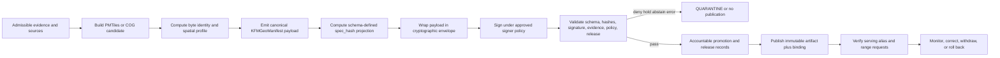

<!-- [KFM_META_BLOCK_V2]
doc_id: kfm://doc/adr-0023-geo-manifest-signs-every-pmtiles-cog-release
title: ADR-0023 — Geo Manifest Signs Every PMTiles and COG Release
type: adr
adr_id: ADR-0023
version: v1.2
status: proposed
effective_decision_status: proposed
owners:
  - "NEEDS VERIFICATION — architecture decision owner"
  - "NEEDS VERIFICATION — geospatial artifact and tile steward"
  - "NEEDS VERIFICATION — release and publication steward"
  - "NEEDS VERIFICATION — evidence, contracts, schemas, policy, validation, security, correction, and rollback stewards"
reviewers_required:
  - Architecture steward
  - Docs steward
  - Geospatial artifact and tile steward
  - Release and publication steward
  - Evidence and proof steward
  - Contracts and schemas stewards
  - Policy and sensitivity steward
  - Security and signing reviewer
  - Validation and CI steward
  - Correction and rollback steward
created: 2026-05-09
updated: 2026-07-24
policy_label: public
truth_posture: cite-or-abstain
responsibility_root: docs/
current_path: docs/adr/ADR-0023-geo-manifest-signs-every-pmtiles-cog-release.md
supersedes: []
superseded_by: null
evidence_snapshot:
  repository: bartytime4life/Kansas-Frontier-Matrix
  base_ref: main
  base_commit: b50daeb62a9331d314f33ded79b85ccbda5650c4
  target_prior_blob: 99a984ddde3f5569ef54443bce7798e5ac2f89d4
  adr_index_blob: cf08fae322ac53426f7394d97897fdb942253049
  adr_readme_blob: f1b5d34a53b6c717832d587de54989ce8192bcaa
  directory_rules_blob: 2affb080e6f0043867c64c7f06c1ca52030fbd55
  geo_manifest_contract_blob: cf8e467cf32323718e38ad1510da3e5f60bef884
  geo_manifest_schema_blob: 931a0de24e45af4bc237c596c69bcaf305fb811f
  release_manifest_schema_blob: 727db0a781900aa3816dcdce723fe355fec2e786
  published_pmtiles_readme_blob: 1b40b18badf10d57ec2cce363770784bae21649e
  published_layers_readme_blob: dec9fe683d49be194c46a46cd50bee9a2675cb28
  release_manifest_singular_readme_blob: 6014cfc0f8394a44167f4226975b74f94f3b2a03
  release_manifests_plural_readme_blob: c699a527ff11bebad6a874ed1a37aa3a8213b86c
  release_signatures_readme_blob: e25a62e73762af96d15fbb6c32c8d03fbac66e30
  attest_tools_readme_blob: 877b881183558cc21627b16163b130a9123f85ee
  promotion_workflow_blob: c22941d5e1fad3317f46591705091ef2b6e7d265
  codeowners_blob: dd2a84aa514d8ecd9208bc347f90f9a2ed37dd61
inspection_boundary: >
  Current-session GitHub reads of the ADR inventory and operating contract, Directory Rules,
  this ADR, the KFMGeoManifest contract and schema stub, published PMTiles and layer lane
  documentation, release manifest and signature lanes, attestation-tool documentation,
  promotion workflow source, identity and rollback ADRs, and bounded repository searches for
  the declared validator, fixtures, policy, and tile runbook. No signer, key store, transparency
  log, PMTiles or COG payload, CDN, public alias, deployment, runtime verifier, production
  release, correction, withdrawal, or rollback was exercised.
related:
  - docs/adr/README.md
  - docs/adr/INDEX.md
  - docs/adr/ADR-0001-schema-home--schemas-contracts-v1-is-canonical.md
  - docs/adr/ADR-0011-receipts-vs-proofs-vs-manifests-vs-catalog-separation.md
  - docs/adr/ADR-0013-spec_hash-and-run_id-identity-grammar.md
  - docs/adr/ADR-0015-data-published-_domain_-current-alias-is-governed-by-rollback_card.md
  - docs/adr/ADR-0018-promotion-gate-sequence.md
  - docs/adr/ADR-0022-catalog-matrix--stac-+-dcat-+-prov-must-agree.md
  - docs/adr/ADR-0024-steward-separation-of-duties-for-release.md
  - docs/adr/ADR-0025-public-client-never-reads-canonical-internal-stores.md
  - docs/doctrine/directory-rules.md
  - contracts/evidence/kfm_geo_manifest.md
  - schemas/contracts/v1/evidence/kfm_geo_manifest.schema.json
  - data/published/pmtiles/README.md
  - data/published/layers/README.md
  - release/manifest/README.md
  - release/manifests/README.md
  - release/signatures/README.md
  - tools/attest/README.md
  - .github/workflows/promotion-gate.yml
tags: [kfm, adr, geospatial, pmtiles, cog, geo-manifest, dsse, signature, integrity, release, evidence, rollback, trust-membrane]
notes:
  - "v1.2 is a same-path repository-grounded modernization. It preserves source metadata and effective decision status proposed; it does not accept ADR-0023 or implement signing."
  - "The canonical ADR index uniquely assigns ADR-0023 to this exact path."
  - "The KFMGeoManifest semantic contract and paired schema exist, but the schema remains a permissive greenfield stub requiring only id."
  - "No repository file was found at the schema-declared geo-manifest validator path, fixture README path, proposed PMTiles release policy path, or historical docs/tiles/PIPELINE.md path."
  - "The promotion workflow is read-only readiness/hold evidence and explicitly does not verify bundle digests or signatures or emit manifests, releases, or public artifacts."
  - "release/signatures/ currently documents reviewer signoff packets; this ADR's cryptographic artifact sidecar is a different object and must not be conflated with human review."
[/KFM_META_BLOCK_V2] -->

<a id="top"></a>

# ADR-0023 — Geo Manifest Signs Every PMTiles and COG Release

> **Proposed decision.** Before any PMTiles or Cloud-Optimized GeoTIFF artifact becomes a released public-safe carrier, KFM must bind the immutable artifact bytes to identity, evidence, provenance, policy, release, correction, and rollback state through a cryptographically signed `KFMGeoManifest` sidecar. Missing, mismatched, unverifiable, superseded, revoked, or policy-inadmissible bindings fail closed.

[](#status)
[](#current-repository-evidence)
[](#current-implementation-maturity)
[](#current-implementation-maturity)
[](#current-implementation-maturity)
[](#authority-and-publication-boundary)

> [!IMPORTANT]
> **Identity is confirmed; acceptance is not.** [`docs/adr/INDEX.md`](./INDEX.md) uniquely assigns `ADR-0023` to this exact file and records both source metadata and effective status as `proposed`. Editing, merging, linking, or validating this Markdown does not accept the decision.

> [!CAUTION]
> **The repository does not currently implement the decision.** The semantic contract exists, but its paired schema is a permissive stub. The declared validator and fixtures were not found at their referenced paths, the proposed PMTiles release policy was not found, attestation tooling is documentation-only, and the promotion workflow intentionally records readiness holds.

> [!WARNING]
> **Human signoff is not artifact cryptography.** [`release/signatures/`](../../release/signatures/README.md) currently documents reviewer signature packets and release handoffs. A DSSE or equivalent cryptographic sidecar over artifact-binding data is a separate machine-verifiable object. Neither object alone is a `ReleaseManifest`, `PromotionDecision`, EvidenceBundle, proof of public safety, or publication authority.

**Quick navigation:** [Status](#status) · [Evidence](#evidence-boundary) · [Context](#context) · [Decision](#proposed-decision) · [Binding](#proposed-binding-model) · [Scope](#scope) · [Authority](#authority-and-publication-boundary) · [Validation](#proposed-validation-and-finite-outcomes) · [Flow](#proposed-release-flow) · [Current evidence](#current-repository-evidence) · [Maturity](#current-implementation-maturity) · [Convergence](#implementation-and-convergence-plan) · [Acceptance](#acceptance-gates) · [Consequences](#consequences) · [Alternatives](#alternatives-considered) · [Risks](#risk-and-open-question-ledger) · [Rollback](#rollback-and-supersession) · [Checklist](#verification-checklist) · [References](#references) · [History](#revision-history)

---

<a id="status"></a>

## Status

| Field | Current value |
|---|---|
| **ADR ID** | `ADR-0023` — unique and confirmed in [`INDEX.md`](./INDEX.md) |
| **Tracked path** | `docs/adr/ADR-0023-geo-manifest-signs-every-pmtiles-cog-release.md` |
| **Source metadata** | `proposed` |
| **Effective decision status** | `proposed` |
| **Decision class** | Geospatial artifact integrity, release binding, serving boundary, correction, and rollback |
| **Current repository posture** | Contract and schema stub present; validator/fixtures/policy absent at checked paths; attestation lane documentation-only; promotion held |
| **Implementation effect of this revision** | Documentation only |
| **Release/publication effect** | None |
| **Supersedes / superseded by** | None / none |

### Acceptance versus implementation graduation

Two states remain independent:

1. **ADR acceptance** would approve the required artifact-binding model and responsibility boundaries.
2. **Implementation graduation** would require accepted contracts and schemas, deterministic canonicalization, cryptographic tooling, fixtures, validators, policy, accountable review, promotion integration, release assembly, serving enforcement, correction, rollback, and observed failure-closed behavior.

An accepted ADR without those controls would be doctrine, not proof that artifacts are signed. A sidecar-shaped JSON file, signature packet, green schema check, or merge cannot accept this ADR or authorize publication.

[Back to top](#top)

---

<a id="evidence-boundary"></a>

## Evidence boundary

This revision is grounded in repository bytes at `main@b50daeb62a9331d314f33ded79b85ccbda5650c4`.

| Evidence surface | CONFIRMED current state | What remains unproved |
|---|---|---|
| ADR inventory | ADR-0023 uniquely maps to this file; source/effective status `proposed` | Acceptance or implementation |
| Semantic contract | `contracts/evidence/kfm_geo_manifest.md` exists and defines meaning/boundaries | Accepted field profile or executable behavior |
| Machine schema | Paired JSON Schema exists | Production-grade shape; it requires only `id` and allows extra properties |
| Validator/fixtures | Schema metadata names paths | Validator and fixture README were not found at checked paths |
| Published lanes | PMTiles and layer/COG-capable published lanes exist as documentation | Actual released bytes, sidecars, approvals, or hosting |
| Release manifests | Singular and plural draft lanes exist | Canonical path and conforming records |
| Release signatures | Reviewer signoff-packet lane exists | Cryptographic artifact-signature profile or artifact binding |
| Attestation tooling | Documentation-only lane exists | Sign/verify implementation, trust roots, tests, CI |
| Promotion workflow | Read-only readiness and hold checks exist | Digest/signature verification, promotion, release, or publication |
| CODEOWNERS | Review routes point to `@bartytime4life` | Stewardship, quorum, separation of duties, or approval |

### Truth labels

- **CONFIRMED** — verified from repository bytes or governing doctrine.
- **PROPOSED** — decision, profile, shape, path role, or enforcement target not accepted and proved.
- **CONFLICTED** — repository surfaces assign incompatible shapes, names, or homes.
- **NEEDS VERIFICATION** — a concrete check remains open.
- **UNKNOWN** — available evidence cannot support a stronger claim.
- **HOLD** — current readiness surfaces intentionally refuse graduation.

[Back to top](#top)

---

<a id="context"></a>

## Context

PMTiles and COG are byte-range-friendly derived carriers. Public or semi-public clients may fetch immutable byte ranges directly from static hosting or a CDN, without a trusted application server evaluating every request. A catalog record can describe an artifact, but it cannot prove that the bytes served later are the same bytes reviewed and released.

KFM therefore needs a binding from the artifact bytes to:

- deterministic artifact and manifest identity;
- EvidenceRef/EvidenceBundle support and source roles;
- build/run provenance and transforms;
- rights, sensitivity, and policy decisions;
- accountable release scope and review;
- correction, withdrawal, supersession, and rollback targets.

The lifecycle remains:

```text
RAW -> WORK / QUARANTINE -> PROCESSED -> CATALOG / TRIPLET -> PUBLISHED
```

A tile build, sidecar, signature, merge, upload, or public URL is not promotion. Published carriers remain downstream of evidence, policy, review, release, correction, and rollback.

### Existing drift this ADR must not hide

1. The `KFMGeoManifest` schema is a stub and does not encode the rich field map proposed here.
2. ADR-0013 records a content-identity grammar conflict; this ADR must consume the accepted identity profile rather than create another grammar.
3. `release/manifest/` and `release/manifests/` are both tracked draft lanes with unresolved distinction.
4. `release/signatures/` describes human reviewer signoff, not machine artifact signatures.
5. The current promotion workflow explicitly does not verify artifact digests or signatures.

[Back to top](#top)

---

<a id="proposed-decision"></a>

## Proposed decision

Upon acceptance and implementation graduation:

1. Every released PMTiles or COG artifact must have one immutable, version-bound `KFMGeoManifest` payload and one cryptographic envelope binding that payload.
2. Public release must be denied when the binding is missing, invalid, mismatched, expired where policy defines expiry, superseded, revoked, withdrawn, or policy-inadmissible.
3. Catalog records, layer manifests, release manifests, receipts, proofs, and reviewer signoffs must reference the binding; none replaces it.
4. The canonical payload must not embed the envelope or signature that signs it.
5. The content-identity hash must be computed over a schema-defined hash projection that excludes `spec_hash` itself, the envelope, signatures, transparency proofs, and transport-only fields. This prevents self-reference and preserves deterministic identity.
6. Artifact-byte identity must be distinct from manifest identity. The released file digest binds the bytes as written; an optional accepted range-verification root may support chunk/range verification.
7. Signing and verification must use an accepted, version-pinned DSSE/cosign or successor profile with declared signer policy, trust roots, rotation, revocation, and offline verification behavior.
8. A release transition still requires independent evidence, policy, review, `PromotionDecision`, `ReleaseManifest`, correction, and rollback closure.
9. Artifact and binding history must be append-only under retention and sensitivity policy. Unsafe releases are superseded, withdrawn, corrected, or revoked—not silently overwritten.

### Normative language boundary

`MUST`, `MUST NOT`, `SHOULD`, and `MAY` below describe the proposed accepted state. They do not describe current repository enforcement.

[Back to top](#top)

---

<a id="proposed-binding-model"></a>

## Proposed binding model

### Object separation

| Object | Responsibility | Must not be treated as |
|---|---|---|
| PMTiles/COG bytes | Released delivery carrier | Source truth, proof, release decision |
| `KFMGeoManifest` payload | Artifact identity, integrity, provenance, policy/release references | EvidenceBundle, ReleaseManifest, signature envelope |
| Cryptographic envelope | Machine-verifiable binding over the payload | Human review or release approval |
| EvidenceBundle/proof | Claim support and evidence closure | Artifact bytes or release decision |
| RunReceipt/build receipt | Process memory and execution provenance | Proof or publication |
| `PromotionDecision` | Accountable promotion outcome | Signature or execution receipt |
| `ReleaseManifest` | Release scope and included artifacts | Per-artifact byte binding |
| Reviewer signature packet | Human review/signoff trail | Cryptographic artifact signature |
| Rollback/correction records | Governed repair and transition intent | Proof that execution occurred |

### Sidecar layering

The preferred target is a DSSE envelope whose decoded payload is canonical `KFMGeoManifest` JSON.

```text
<artifact>.kfm-geo-manifest.dsse.json
└── DSSE envelope
    ├── payloadType
    ├── payload      # encoded canonical KFMGeoManifest payload
    └── signatures[]
```

The exact filename and media types remain profile decisions. Existing `.kfm-geo-manifest.json` names may require a migration window; the payload/envelope distinction is not optional.

### Minimum payload profile

The accepted schema should close unknown properties and define at least:

| Group | Required information |
|---|---|
| Identity | manifest `id`, schema/profile version, deterministic `spec_hash`, release ID |
| Artifact | stable artifact URI/ref, kind (`pmtiles`, `cog`, accepted delta profile), byte length, format/profile version |
| Integrity | algorithm-tagged artifact digest; optional accepted byte-range/range-root profile |
| Spatial | CRS, extent/bbox, geometry/raster/tiling profile, zoom or resolution where applicable |
| Provenance | RunReceipt/build receipt, source descriptors and roles, EvidenceRef/EvidenceBundle refs, catalog refs, transforms, tool/config identities |
| Governance | rights, sensitivity, policy decision, review record, release manifest, promotion decision |
| Lifecycle | candidate/released/superseded/revoked/withdrawn state, supersedes, rollback target, correction/withdrawal refs |
| Verification | signer policy/profile, expected trust root or identity class, transparency/offline bundle requirements |

### Hash domains

Three identities must remain separate:

| Identity | Proposed purpose | Boundary |
|---|---|---|
| `spec_hash` | Deterministic identity of a declared hash projection of the manifest payload | Must follow the accepted ADR-0013 profile; must exclude itself and signature/envelope fields |
| Artifact digest | Digest of the complete PMTiles/COG file as written | Does not prove evidence, rights, policy, or release |
| Range-verification root | Optional accepted chunk/range integrity profile | Must be versioned and independently testable; does not replace full-file digest |

The earlier ADR language naming SHA-256, BLAKE3, BAO, DSSE, cosign, and Rekor remains a proposed technology profile, not current implementation fact. Final algorithms, encodings, media types, and trust roots require security review and compatibility tests.

[Back to top](#top)

---

<a id="scope"></a>

## Scope

### In scope

- PMTiles v3 release artifacts;
- released COG files under governed published layer lanes;
- accepted PMTiles delta artifacts when a delta profile exists;
- sidecar identity, integrity, provenance, policy, release, correction, and rollback binding;
- build-time, promotion-time, serving-time, offline, and periodic verification requirements;
- public and restricted release profiles, with sensitivity-appropriate transparency behavior.

### Out of scope

- per-tile DSSE signatures;
- raw/source-side signing under `data/raw/`;
- MapLibre style, legend, layer-order, or UI semantics;
- 3D Tiles, glTF, terrain, and scene formats unless a successor/profile explicitly includes them;
- accepting ADR-0013 identity grammar or the release-manifest singular/plural path conflict;
- selecting production keys, signer identities, transparency service, HSM/KMS, or hosting provider;
- authorizing any current artifact for release.

### Directory Rules basis

This ADR creates no new root. Responsibilities remain under:

| Responsibility | Root/home |
|---|---|
| Decision record | `docs/adr/` |
| Semantic meaning | `contracts/evidence/kfm_geo_manifest.md` |
| Machine shape | `schemas/contracts/v1/evidence/kfm_geo_manifest.schema.json` |
| Policy | accepted `policy/` lane; exact profile path requires verification |
| Validation/attestation code | `tools/`, packages, tests, and fixtures under accepted homes |
| Released bytes | `data/published/pmtiles/` and COG-capable published layer lanes |
| Receipts/proofs | `data/receipts/` and `data/proofs/` |
| Release decisions/manifests/signoff/rollback | `release/`, without resolving singular/plural manifest conflict here |

[Back to top](#top)

---

<a id="authority-and-publication-boundary"></a>

## Authority and publication boundary

A valid cryptographic binding proves only that a verifier accepted the declared payload and signature under a particular profile and that the referenced bytes matched the declared integrity values at verification time. It does not independently prove:

- that source claims are true;
- that evidence is sufficient;
- that rights permit publication;
- that sensitive detail is safe;
- that review was accountable;
- that promotion/release was authorized;
- that a public alias points to the right artifact;
- that caches were invalidated after correction or rollback.

Public clients must consume release-resolved artifacts through governed interfaces or approved static-delivery profiles. They must not read RAW, WORK, QUARANTINE, internal catalog/proof/receipt stores, or candidate artifacts directly.

No change to this ADR, schema, sidecar, signature, workflow, or file placement creates `PUBLISHED` state.

[Back to top](#top)

---

<a id="proposed-validation-and-finite-outcomes"></a>

## Proposed validation and finite outcomes

A future validator must be deterministic, machine-readable, local/offline-capable for the core checks, and fail closed.

| Check family | Required checks |
|---|---|
| Envelope | media type/profile, payload decode, signature structure, signer policy |
| Payload | closed schema, profile/version, conditional PMTiles/COG fields |
| Identity | hash projection, canonicalization, algorithm tags, no circular fields |
| Bytes | byte length, full artifact digest, optional range-root/sample checks |
| Provenance | build/run receipts, source roles, evidence refs, transforms, tools/config |
| Governance | rights, sensitivity, policy, review, promotion, release, correction, rollback |
| Serving | immutable/versioned URI, public alias binding, no candidate/revoked exposure |
| History | supersession/withdrawal/revocation and retained audit references |

### Stable outcome classes

| Outcome | Meaning |
|---|---|
| `PASS` | All checks required by the selected profile passed |
| `DENY` | Known invalid, prohibited, revoked, mismatched, or unauthorized state |
| `HOLD` | Review, ownership, signer policy, rights, sensitivity, or release prerequisite unresolved |
| `ABSTAIN` | Evidence/provenance resolution insufficient for a substantive release claim |
| `ERROR` | Tooling, schema, verifier, storage, or infrastructure failure prevented a valid determination |

`ERROR` is never converted into `PASS`. A missing verifier, unavailable trust root, or unsupported profile must not silently permit release.

### Minimum reason-code families

- `geo_manifest_missing`
- `geo_manifest_schema_invalid`
- `geo_manifest_hash_projection_invalid`
- `artifact_digest_mismatch`
- `range_root_mismatch`
- `signature_missing_or_invalid`
- `signer_not_authorized`
- `transparency_or_offline_proof_missing`
- `evidence_or_receipt_unresolved`
- `policy_or_sensitivity_denied`
- `release_manifest_unresolved`
- `promotion_decision_unresolved`
- `release_state_not_public`
- `superseded_revoked_or_withdrawn`
- `public_alias_binding_mismatch`
- `rollback_target_unverifiable`

[Back to top](#top)

---

<a id="proposed-release-flow"></a>

## Proposed release flow


```mermaid
flowchart LR
    A[Admissible evidence and sources] --> B[Build PMTiles or COG candidate]
    B --> C[Compute byte identity and spatial profile]
    C --> D[Emit canonical KFMGeoManifest payload]
    D --> E[Compute schema-defined spec_hash projection]
    E --> F[Wrap payload in cryptographic envelope]
    F --> G[Sign under approved signer policy]
    G --> H[Validate schema, hashes, signature, evidence, policy, release]
    H -->|deny hold abstain error| Q[QUARANTINE or no publication]
    H -->|pass| R[Accountable promotion and release records]
    R --> P[Publish immutable artifact plus binding]
    P --> S[Verify serving alias and range requests]
    S --> M[Monitor, correct, withdraw, or roll back]
```

### Gate placement

The geo-manifest check is a prerequisite within—not a replacement for—the proposed promotion sequence:

| Promotion concern | Geo-manifest contribution |
|---|---|
| Schema valid | Payload/envelope/profile validate |
| Inputs pinned | Evidence, source, run/build, config, and catalog refs resolve |
| Checks pass | Artifact digest and optional range profile verify |
| Signatures valid | Cryptographic binding and signer policy verify |
| Provenance complete | Receipts, evidence, transforms, lineage, release refs resolve |
| No policy violations | Rights, sensitivity, policy, review, and serving posture allow |
| Release ready | Accountable release/promotion/rollback records close |

The current `.github/workflows/promotion-gate.yml` does not perform these checks; it intentionally proves readiness holds.

[Back to top](#top)

---

<a id="current-repository-evidence"></a>

## Current repository evidence

| Surface | Current verified state | Safe conclusion |
|---|---|---|
| ADR identity | Unique ADR-0023 row points to this file | Identity confirmed; decision still proposed |
| Geo-manifest contract | Draft semantic contract exists | Meaning/boundaries documented |
| Geo-manifest schema | Draft 2020-12 stub; only `id` required; extra properties allowed | Not release-grade validation |
| Validator path | Referenced by schema, file not found | No validator implementation established |
| Fixture path | Referenced by schema, fixture README not found | Fixture/test closure not established |
| Policy path | Contract names `policy/evidence/`; prior ADR proposed a publication file that was not found | Exact policy home/profile unresolved |
| PMTiles published lane | README and child lanes exist | Payload and release inventory unknown |
| Published layers/COG | Parent lane permits COG after release | COG payload/profile/validator maturity unknown |
| Release manifest paths | Singular and plural draft lanes both exist | Path meaning/canonicality conflicted |
| Release signatures | Human signoff packet lane exists | Not cryptographic artifact binding |
| Attestation tools | README-only proposed lane | Sign/verify implementation unproved |
| Promotion workflow | Read-only four-job readiness/hold workflow | No digest/signature/release/publication action |
| CODEOWNERS | Target and affected roots route to one verified GitHub account | Routing only; no independent review proof |

### Confirmed absent at checked paths

- `tools/validators/evidence/validate_kfm_geo_manifest.py`
- `fixtures/evidence/kfm_geo_manifest/README.md`
- `policy/publication/pmtiles_release.rego`
- `docs/tiles/PIPELINE.md`

Absence at these checked paths does not prove no equivalent implementation exists elsewhere; bounded search surfaced no accepted equivalent during this revision.

[Back to top](#top)

---

<a id="current-implementation-maturity"></a>

## Current implementation maturity

| Capability | Current state |
|---|---|
| ADR identity/status | `CONFIRMED / proposed` |
| Semantic contract | Draft, repository-grounded |
| Machine schema | `HOLD` — permissive stub |
| Canonicalization/hash projection | `CONFLICTED / PROPOSED` |
| Artifact digest/range profile | `PROPOSED` |
| DSSE/cosign profile | `PROPOSED` |
| Signer/trust-root governance | `UNKNOWN` |
| Validator | Not found at declared path |
| Fixtures/tests | Not established |
| Policy enforcement | Not established |
| Promotion integration | `WORKFLOW_HOLD` |
| Release manifest closure | Draft and path-conflicted |
| Public serving verification | `UNKNOWN` |
| Correction/withdrawal/rollback drill | Not established |
| Production release or publication | None proved |

**Overall maturity: `HOLD`.** The repository has architecture and scaffolds, not an operational signed-artifact release system.

[Back to top](#top)

---

<a id="implementation-and-convergence-plan"></a>

## Implementation and convergence plan

Use small dependency-ordered changes; do not combine generation and approval in one unreviewed path.

1. **Accept or revise ADR-0023** with accountable cross-root review.
2. **Resolve dependencies/conflicts**: ADR-0013 identity profile and release-manifest singular/plural meaning.
3. **Version semantic contract and closed schema** together; define hash projection and conditional PMTiles/COG profiles.
4. **Add deterministic fixtures and vectors** for valid, invalid, superseded, revoked, restricted, and rollback cases.
5. **Implement offline validator** with stable reason codes and no release side effects.
6. **Implement signing/verification tooling** with no secrets in the repository; pin dependencies and signer policy.
7. **Implement policy profile** for rights, sensitivity, public/private transparency, signer authorization, and serving restrictions.
8. **Wire build and promotion checks** without granting CI publication credentials prematurely.
9. **Assemble release packet** linking EvidenceBundle, receipts, review, PromotionDecision, ReleaseManifest, signed binding, correction, and rollback.
10. **Enforce serving boundary** for CDN/static/API/MapLibre/service-worker consumers and test bypass denial.
11. **Run correction and rollback drills** including cache invalidation and public alias verification.
12. **Graduate implementation** only after observed failure-closed results and accountable review.

### Required negative fixtures

At minimum:

- missing sidecar;
- malformed/non-approved envelope;
- payload embeds envelope or signature;
- self-referential/incorrect hash projection;
- artifact digest mismatch;
- range-root mismatch;
- wrong signer or revoked key;
- missing required transparency/offline proof;
- unresolved EvidenceBundle or RunReceipt;
- rights/sensitivity/policy denial;
- unresolved release manifest or promotion decision;
- candidate/superseded/revoked/withdrawn artifact at public alias;
- rollback target missing or mismatched;
- public URL bypassing the selected binding.

[Back to top](#top)

---

<a id="acceptance-gates"></a>

## Acceptance gates

ADR acceptance requires reviewed agreement on the decision and boundaries. It does not require implementation to already exist, but every implementation dependency must be explicit.

- [ ] Architecture, release, geospatial, evidence, security, policy, validation, correction, rollback, and docs reviewers approve.
- [ ] ADR-0013 identity/hash dependency is accepted or explicitly isolated through a versioned profile.
- [ ] Release-manifest singular/plural conflict has an accepted resolution or bounded distinction.
- [ ] Payload/envelope, reviewer-signoff, release-manifest, proof, receipt, and decision objects remain separate.
- [ ] Hash projection excludes `spec_hash`, envelope, signatures, and transport-only fields.
- [ ] Algorithms, encodings, media types, filename compatibility, and signer policy are versioned.
- [ ] Public/restricted transparency posture and metadata-leak risks are resolved.
- [ ] Correction, withdrawal, revocation, supersession, and rollback behavior is specified.
- [ ] No claim states or implies current implementation, signing, release, or publication.

Implementation graduation additionally requires:

- [ ] closed schema and semantic contract alignment;
- [ ] non-empty deterministic valid/invalid fixtures;
- [ ] real validator and attestation tooling with tests;
- [ ] policy and signer trust-root enforcement;
- [ ] promotion and release integration;
- [ ] public serving anti-bypass tests;
- [ ] key rotation/revocation and offline verification profile;
- [ ] correction/rollback/cache-invalidation drill;
- [ ] observed no-public-write behavior on failure.

[Back to top](#top)

---

<a id="consequences"></a>

## Consequences

### Positive

- Integrity reaches the exact bytes clients fetch rather than stopping at catalog metadata.
- Artifact, manifest, proof, receipt, human review, release decision, and publication remain distinguishable.
- Offline and CDN verification become possible under a declared profile.
- Supersession and rollback can bind exact immutable artifacts.
- A single envelope profile avoids parallel signature formats.
- The hash-projection rule removes circular `spec_hash` semantics.

### Costs

- Signing identities, key custody, rotation, revocation, and transparency governance add operational burden.
- Sidecars and verification add build, storage, network, and client complexity.
- Producers and consumers must migrate together when schemas/profiles change.
- Serving systems must prevent aliases from bypassing validation.
- Historical unsigned artifacts require inventory and disposition.

[Back to top](#top)

---

<a id="alternatives-considered"></a>

## Alternatives considered

| Alternative | Disposition |
|---|---|
| Sign only `ReleaseManifest` | Rejected: release scope does not replace a per-artifact byte binding |
| Rely on STAC/DCAT/PROV digests | Rejected: catalog projections reference trust objects; they do not define signer/envelope/release policy |
| Sign artifact bytes without a manifest | Rejected: loses structured evidence, policy, provenance, correction, and rollback linkage |
| Embed signature/envelope in payload | Rejected: circular identity and unstable canonicalization |
| Per-tile/per-range DSSE signatures | Rejected as default: excessive operational cost; use accepted range-root profile if needed |
| Reuse human `release/signatures/` packets | Rejected: reviewer signoff and machine cryptographic binding have different semantics |
| No signing for restricted artifacts | Rejected: restricted does not mean unverifiable; use sensitivity-appropriate trust and transparency |
| Advisory validation only | Rejected: an invalid or unavailable verifier must block public release |

[Back to top](#top)

---

<a id="risk-and-open-question-ledger"></a>

## Risk and open-question ledger

| Item | Status | Required resolution |
|---|---|---|
| `spec_hash` lexical/canonical profile | `CONFLICTED` | Accepted ADR-0013 profile and migration |
| Self-referential `spec_hash` | `PROPOSED FIX` | Schema-defined hash projection and test vectors |
| Artifact digest algorithm/encoding | `PROPOSED` | Accepted profile, implementation, fixtures, performance evidence |
| Range-verification profile | `OPEN` | Versioned format, tooling, cross-platform tests |
| Envelope and payload media types | `OPEN` | Accepted schema/profile |
| Exact sidecar filename | `OPEN` | Compatibility and consumer migration decision |
| Cosign/DSSE implementation and versions | `NEEDS VERIFICATION` | Security/tooling review and pinned dependencies |
| Signer identities and trust roots | `UNKNOWN` | Policy, ownership, key custody, rotation, revocation |
| Public vs private transparency | `OPEN` | Sensitivity/privacy policy and offline bundle profile |
| Release manifest singular/plural path | `CONFLICTED` | Accepted responsibility distinction or migration |
| Cryptographic sidecar archival | `OPEN` | Decide whether release lane stores envelope, immutable ref, or digest |
| PMTiles delta semantics | `OPEN` | Base identity, tile-ID behavior, invalidation, rollback |
| Multi-collection artifacts | `OPEN` | One-artifact/one-collection or accepted collection profile |
| COG profile and sublane | `NEEDS VERIFICATION` | Published path, COG validation, overviews/tiling checks |
| CDN/public alias bypass | `UNKNOWN` | Serving config, integration tests, monitoring, incident response |
| Existing unsigned artifacts | `UNKNOWN` | Inventory, hold/quarantine, migration, withdrawal, or grandfathering decision |
| Compromised signer | `OPEN` | Key revocation, withdrawal, alias rollback, correction notice, cache purge |
| Implementation ownership | `NEEDS VERIFICATION` | Steward assignments and separation-of-duties controls |

Fail-safe posture: unresolved signer, evidence, rights, sensitivity, release, or binding state blocks public release or narrows the response. It is never repaired by optimistic prose.

[Back to top](#top)

---

<a id="rollback-and-supersession"></a>

## Rollback and supersession

### ADR rollback

Restore prior blob:

```text
99a984ddde3f5569ef54443bce7798e5ac2f89d4
```

Reverting documentation does not revert an implementation or release. Any later implementation must carry its own schema, policy, migration, release, correction, and rollback plan.

### Artifact rollback target

A future conforming rollback must:

1. identify the unsafe artifact and signed binding;
2. record accountable denial, withdrawal, revocation, correction, or rollback decision;
3. preserve prior artifact, binding, receipts, proofs, catalog, and release records under policy;
4. validate the rollback target’s binding and independent release gates;
5. update public aliases atomically;
6. invalidate or rebuild CDN, service-worker, search, catalog, tile, and API caches;
7. verify public range requests resolve to the selected immutable artifact;
8. issue correction/withdrawal notices when users may have consumed unsafe bytes;
9. record append-only execution and post-rollback verification receipts.

Rollback is not “delete the bad file.” Deletion can destroy the evidence needed to explain and correct a release.

### Supersession of this ADR

An accepted successor must retain this record, mark it `superseded`, link both ADRs reciprocally, and migrate contracts, schemas, fixtures, validators, policies, producers, consumers, releases, and verification support through a reviewed plan.

[Back to top](#top)

---

<a id="verification-checklist"></a>

## Verification checklist

### Current revision

- [x] ADR ID, filename, H1, and index row verified.
- [x] Source/effective status preserved as `proposed`.
- [x] Directory Rules and responsibility roots reviewed.
- [x] Current contract, schema, published, release, signing, tooling, and workflow surfaces inspected.
- [x] Validator, fixtures, policy, and runbook checked at declared/proposed paths.
- [x] Human reviewer signoff separated from artifact cryptography.
- [x] Self-referential hash semantics corrected through a proposed hash projection.
- [x] No implementation, release, or publication claim introduced.
- [ ] Human review completed.
- [ ] ADR accepted.
- [ ] Implementation graduated.
- [ ] Public release observed.

### Future implementation

- [ ] Closed schema and semantic contract agree.
- [ ] Payload and envelope are separate.
- [ ] Hash projection and algorithm-tagged digests are defined.
- [ ] Validator has stable finite outcomes and reason codes.
- [ ] Attestation helper contains no secrets and supports offline verification.
- [ ] Valid/invalid fixtures and cross-runtime vectors pass.
- [ ] Policy, signer authorization, rotation, revocation, and transparency rules enforce.
- [ ] Promotion and release records resolve with accountable review.
- [ ] Public aliases and clients cannot bypass verification.
- [ ] Candidate, superseded, revoked, withdrawn, or mismatched artifacts are not served.
- [ ] Correction, withdrawal, cache invalidation, and rollback drills pass.

[Back to top](#top)

---

<a id="references"></a>

## References

| Reference | Relationship and current boundary |
|---|---|
| [`docs/adr/README.md`](./README.md) | ADR operating contract; presence or merge does not accept a decision |
| [`docs/adr/INDEX.md`](./INDEX.md) | Confirms unique ADR-0023 identity and proposed status |
| [ADR-0001](./ADR-0001-schema-home--schemas-contracts-v1-is-canonical.md) | Schema-home boundary |
| [ADR-0011](./ADR-0011-receipts-vs-proofs-vs-manifests-vs-catalog-separation.md) | Artifact-family separation; remains proposed |
| [ADR-0013](./ADR-0013-spec_hash-and-run_id-identity-grammar.md) | Owns content-identity grammar; current conflict must be resolved |
| [ADR-0015](./ADR-0015-data-published-_domain_-current-alias-is-governed-by-rollback_card.md) | Logical published alias and rollback transition model |
| [ADR-0018](./ADR-0018-promotion-gate-sequence.md) | Proposed promotion sequence; current workflow is a hold |
| [ADR-0022](./ADR-0022-catalog-matrix--stac-+-dcat-+-prov-must-agree.md) | Catalog projections reference, but do not replace, artifact binding |
| [ADR-0024](./ADR-0024-steward-separation-of-duties-for-release.md) | Accountable release review and separation of duties |
| [ADR-0025](./ADR-0025-public-client-never-reads-canonical-internal-stores.md) | Public clients use governed/released surfaces |
| [Directory Rules](../doctrine/directory-rules.md) | Responsibility-root and migration discipline |
| [`KFMGeoManifest` contract](../../contracts/evidence/kfm_geo_manifest.md) | Draft semantic meaning |
| [`KFMGeoManifest` schema](../../schemas/contracts/v1/evidence/kfm_geo_manifest.schema.json) | Confirmed permissive stub |
| [Published PMTiles](../../data/published/pmtiles/README.md) | Released carrier lane; payload/release inventory unknown |
| [Published layers](../../data/published/layers/README.md) | Released layer/COG-capable carrier lane |
| [Singular release manifest lane](../../release/manifest/README.md) | Draft and path-conflicted |
| [Plural release manifests lane](../../release/manifests/README.md) | Draft collection lane and path-conflicted |
| [Release signatures](../../release/signatures/README.md) | Human review/signoff packets, not artifact cryptographic binding |
| [Attestation tools](../../tools/attest/README.md) | Proposed tooling lane; executable inventory unverified |
| [Promotion workflow](../../.github/workflows/promotion-gate.yml) | Read-only readiness/hold workflow |

[Back to top](#top)

---

<a id="revision-history"></a>

## Revision history

| Version | Date | Summary |
|---|---|---|
| v1 | 2026-05-09 | Initial proposed ADR for signed PMTiles/COG geo-manifest release gating. |
| v1.1 | 2026-05-15 | Added proposed/unknown posture, DSSE payload/envelope layering, field map, gate mapping, negative fixtures, rollback discipline, and acceptance checklist. |
| v1.2 | 2026-07-24 | Re-grounded the ADR in current repository evidence; confirmed ADR identity, contract, schema stub, published and release lanes; separated reviewer signoff from artifact cryptography; surfaced identity and manifest-path conflicts; corrected self-referential hash projection; bounded implementation as `HOLD`; added convergence, acceptance, serving, correction, and rollback requirements. |

---

<sub>This ADR is governed by KFM doctrine: receipt ≠ proof ≠ catalog ≠ publication; tile artifacts are derived carriers, not canonical truth; promotion is a governed state transition, not a file move.</sub>
