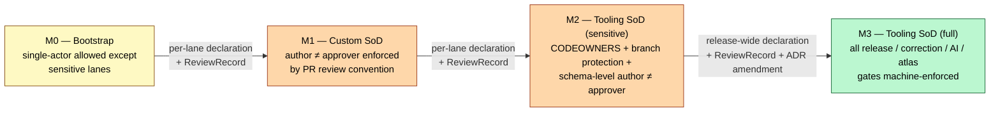
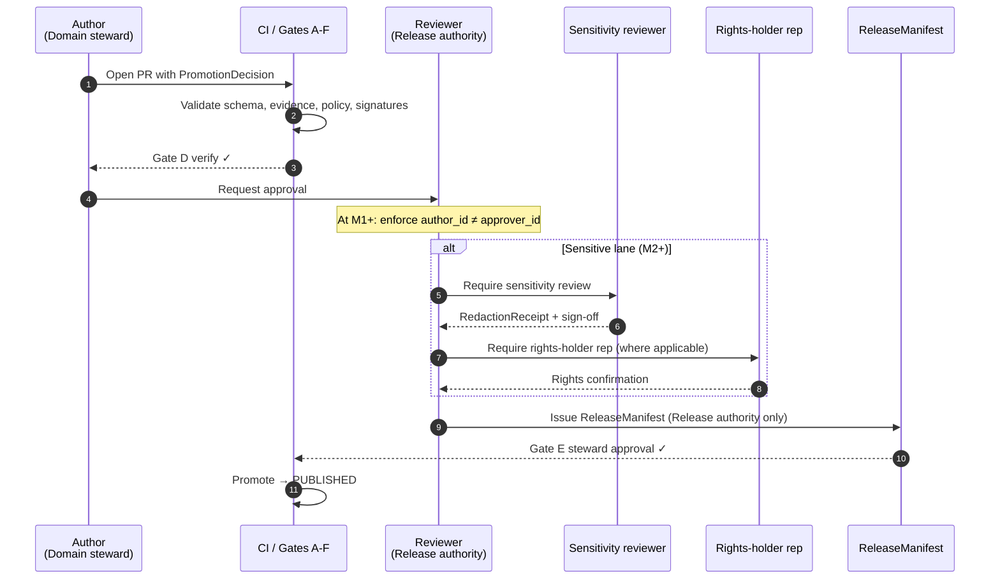

<!-- [KFM_META_BLOCK_V2]
doc_id: kfm://doc/adr-0024-steward-separation-of-duties-for-release
title: ADR-0024 — Steward Separation of Duties for Release
type: standard
version: v1
status: draft
owners: Docs steward; Release authority (TODO confirm CODEOWNERS)
created: 2026-05-15
updated: 2026-05-15
policy_label: public
related:
  - docs/adr/ADR-0001-schema-home.md
  - docs/doctrine/directory-rules.md
  - docs/governance/README.md
  - docs/architecture/governed-api.md
  - schemas/contracts/v1/release/promotion_decision.schema.json
  - schemas/contracts/v1/release/release_manifest.schema.json
  - schemas/contracts/v1/governance/review_record.schema.json
  - policy/release/
tags: [kfm, adr, governance, separation-of-duties, release, sod]
notes:
  - "Closes Atlas v1.1 §24.12 backlog item ADR-S-09 (Reviewer separation-of-duties threshold)."
  - "Doctrinal content tracks Atlas v1.1 §24.7 (Master Reviewer Role and SoD Matrix)."
  - "Status is `proposed` until the release authority, docs steward, and at least one domain steward sign the ReviewRecord."
[/KFM_META_BLOCK_V2] -->

# ADR-0024 — Steward Separation of Duties for Release

> _Lock the role vocabulary, freeze the separation-of-duties matrix, and stage the custom-to-tooling enforcement ladder for KFM release decisions._

| Field | Value |
|---|---|
| **ID** | `ADR-0024` |
| **Title** | Steward Separation of Duties for Release |
| **Status** | `proposed` |
| **Date** | 2026-05-15 |
| **Owners** | Docs steward · Release authority _(TODO confirm `CODEOWNERS`)_ |
| **Closes** | Atlas v1.1 §24.12 backlog item **ADR-S-09** — "Reviewer separation-of-duties threshold" |
| **Pairs with** | `ADR-0001-schema-home.md` (schema home for `PromotionDecision`, `ReleaseManifest`, `ReviewRecord`) |
| **Supersedes** | — |
| **Superseded by** | — |
| **Directory Rules §2.4 trigger** | _(none — this ADR does not change a canonical root, lifecycle phase, schema home, or invariant; it formalizes role and review discipline.)_ |
| **Authority of role names** | CONFIRMED — tracks Atlas v1.1 §24.7.1 vocabulary verbatim |
| **Authority of matrix rows** | CONFIRMED at doctrine layer (Atlas v1.1 §24.7.2 + Encyclopedia §10 Action Matrix); PROPOSED at enforcement layer |
| **Authority of file paths** | PROPOSED — no live repo mounted in this session |

---

## Quick navigation

- [1. Context](#1-context)
- [2. Forces](#2-forces)
- [3. Decision](#3-decision)
- [4. Role definitions (canonical)](#4-role-definitions-canonical)
- [5. Separation-of-duties matrix (canonical)](#5-separation-of-duties-matrix-canonical)
- [6. Maturity ladder — custom → tooling](#6-maturity-ladder--custom--tooling)
- [7. Enforcement plan](#7-enforcement-plan)
- [8. Consequences](#8-consequences)
- [9. Alternatives considered](#9-alternatives-considered)
- [10. Validation plan](#10-validation-plan)
- [11. Rollback plan](#11-rollback-plan)
- [12. Open questions / NEEDS VERIFICATION](#12-open-questions--needs-verification)
- [Related docs](#related-docs)
- [Appendix A — Required object additions](#appendix-a--required-object-additions)
- [Appendix B — Reviewer checklist](#appendix-b--reviewer-checklist)

---

## 1. Context

KFM treats release as a **governed state transition**, not a file move. The lifecycle invariant
`RAW → WORK/QUARANTINE → PROCESSED → CATALOG/TRIPLET → PUBLISHED` is enforced by gates,
receipts, and signed manifests rather than by author trust. The corresponding operating-law
invariant — that **policy-significant release duties are separated when maturity justifies it**
— is doctrine, but the project has not yet:

1. Frozen the canonical **role vocabulary** (Source steward, Domain steward, Sensitivity
   reviewer, Rights-holder representative, Release authority, Correction reviewer, AI surface
   steward, Docs steward).
2. Frozen the **matrix of which actions require separation** (release to `PUBLISHED`,
   sensitive-lane release, correction / rollback, AI surface change, Atlas / supplement
   publication, …).
3. Specified **at what maturity** separation must shift from _custom_ (PR review by convention)
   to _tooling_ (`CODEOWNERS`, branch protection, OPA fixtures, schema-level
   `author_id ≠ approver_id` assertions, signed-receipt requirements).

The doctrinal anchor — Atlas v1.1 §24.7 — explicitly states it is "PROPOSED for ADR discussion."
The backlog entry **ADR-S-09** in Atlas v1.1 §24.12 names this gap. This ADR closes it.

> [!IMPORTANT]
> **Without a frozen role vocabulary and matrix, the trust membrane is one careful actor
> away from collapse on any sensitive-lane release.** The maturity note in Atlas v1.1
> §24.7.2 is candid: "the supplement does not pretend the enforcement exists yet." This
> ADR does not invent enforcement; it freezes the rules so enforcement can be built.

[↑ Back to top](#quick-navigation)

---

## 2. Forces

| Force | Direction |
|---|---|
| Operating-law invariant 9 (separate policy-significant release duties when maturity justifies it). | **Pushes toward separation.** |
| Cite-or-abstain default truth posture; AI cannot be its own reviewer. | **Pushes toward separation.** |
| Public exposure of sensitive lanes (archaeology coords, sensitive fauna/flora, living-person, DNA, infrastructure). | **Pushes toward strict separation.** |
| Early-stage project with a small set of contributors; some routine work needs to ship. | **Pushes toward maturity-gated separation, not blanket separation.** |
| Tooling burden — `CODEOWNERS`, branch protection, schema-level author-approver assertions, signed-receipt verification — must be earned, not assumed. | **Pushes toward staged enforcement.** |
| Drift risk — a doctrinally separated duty enforced only "by convention" silently collapses under deadline pressure. | **Pushes toward tooling enforcement as soon as maturity supports it.** |
| Directory Rules §17 — reversing a previously canonical rule requires ADR + supersession + drift entry. | **Pushes toward putting the canonical rule in an ADR so future change is auditable.** |

[↑ Back to top](#quick-navigation)

---

## 3. Decision

This ADR makes four binding decisions and one staged commitment.

**D1. Adopt Atlas v1.1 §24.7.1 role vocabulary as canonical (§4 below).** _CONFIRMED at
doctrine layer; this ADR promotes from PROPOSED to canonical._ Subsequent docs, registers,
contracts, and policy bundles **MUST** use these role names exactly.

**D2. Adopt the Atlas v1.1 §24.7.2 separation-of-duties matrix as canonical (§5 below)**,
with one clarification: the matrix is read against the **maturity ladder** in §6, not as a
single global posture.

**D3. Adopt the maturity ladder M0 → M3 (§6 below)** as the **threshold rule** for when
separation shifts from _custom_ (PR review by convention) to _tooling_ (machine-enforced).
The maturity level of each lane is declared and tracked explicitly; it does not float.

**D4. Author and approver identity MUST be representable on the release decision path.**
`PromotionDecision`, `ReleaseManifest`, `ReviewRecord`, `CorrectionNotice`, `RollbackCard`,
and `AIReceipt` **MUST** carry the fields needed to assert `author_id ≠ approver_id` (and,
where applicable, `rights_holder_rep_id`, `sensitivity_reviewer_id`) when the matrix in §5
requires separation at the lane's current maturity. _Schema-level changes are PROPOSED in
§7 and Appendix A; they belong under `schemas/contracts/v1/...` per ADR-0001._

**D5 (staged commitment).** The release authority and docs steward will **declare a starting
maturity per lane** within one review cycle of this ADR's acceptance, and will not advance
any lane's maturity without an explicit `ReviewRecord` entry. The default starting maturity
for new lanes is **M0**, except sensitive lanes (archaeology, sensitive fauna/flora,
living-person, DNA, critical infrastructure, KFM-as-alert-authority surfaces) which start
at **M2** by deny-by-default doctrine.

[↑ Back to top](#quick-navigation)

---

## 4. Role definitions (canonical)

> **Authority:** these names track Atlas v1.1 §24.7.1 verbatim. Renaming any of them is a
> **MUST NOT** without a superseding ADR.

| Role | Owns | Required for |
|---|---|---|
| **Source steward** | `SourceDescriptor` lifecycle; admission gate; rights confirmation; sensitivity tag for a named source family. | Source admission (`— → RAW`). |
| **Domain steward** | Meaning, contracts, validators of a domain's object families. | Domain-internal promotions; validator authorship. |
| **Sensitivity reviewer** | Redaction, generalization, withholding, and tier decisions for sensitive content. | Sensitive-lane promotion; `RedactionReceipt`; T1+ tier transitions. |
| **Rights-holder representative** | Sovereignty, cultural-heritage, or consent-based release decisions. | Archaeology, sovereign data, living-person data, DNA data release. |
| **Release authority** | Issues `ReleaseManifest`s; authorizes `PUBLISHED` transitions; authorizes rollback. | `→ PUBLISHED` transitions; rollback. |
| **Correction reviewer** | Reviews `CorrectionNotice` / `RollbackCard` before they amend a `PUBLISHED` claim. | Post-publication corrections; supersession entries. |
| **AI surface steward** | Focus Mode templates, `AIReceipt`s, policy bindings, cite-or-abstain audits. | AI surface change (template / policy binding). |
| **Docs steward** | Governance docs; ADR index; drift register; Atlas / supplement integrity. | Atlas / supplement publication; ADR acceptance; drift triage. |

> [!NOTE]
> A single person **MAY** hold multiple roles at low maturity, but the **decision record
> MUST list the role acting on each gate**, not the person. A person who is both Domain
> steward and Release authority cannot satisfy `author_id ≠ approver_id` on a gate that
> requires it; a second actor in one of the two roles is required.

[↑ Back to top](#quick-navigation)

---

## 5. Separation-of-duties matrix (canonical)

> **Authority:** tracks Atlas v1.1 §24.7.2 verbatim, modulo the maturity ladder in §6.
> "May the author also approve?" reads as: at the **lane's current maturity level**, is
> single-actor authorship-plus-approval permitted?

| Action | May the author also approve? | Required separation when SoD applies | Citation |
|---|---|---|---|
| **Source admission** (`— → RAW`) | Yes for routine; **No** when source has unresolved rights / sovereignty. | Source steward **+** Rights-holder representative (where applicable). | Atlas §24.7.2; ENCY |
| **Normalization receipts** | Yes for routine; **No** when transforms are sensitivity-relevant. | Domain steward **+** Sensitivity reviewer (if sensitivity-relevant). | Atlas §24.7.2; ENCY |
| **Validator authorship and run** | Yes (validators are deterministic). | Domain steward authorship; **periodic audit by Docs steward**. | Atlas §24.7.2; DIRRULES |
| **Promotion to `PROCESSED` / `CATALOG`** | Yes for non-sensitive routine; **No** for sensitive lanes. | Domain steward **+** Sensitivity reviewer (sensitive lanes). | Atlas §24.7.2 |
| **Release to `PUBLISHED`** | **No** when materiality applies. | Author **≠** Release authority; **+** Rights-holder representative (where applicable). | Atlas §24.7.2; ENCY |
| **Sensitive-lane release** | **No.** | Author **+** Sensitivity reviewer **+** Release authority **+** Rights-holder representative. | Atlas §24.7.2; DOM-ARCH; DOM-FAUNA; DOM-PEOPLE |
| **Correction / rollback** | **No** when correction is steward-significant. | Author / detector **+** Correction reviewer **+** Release authority. | Atlas §24.7.2; ENCY |
| **AI surface change** (template / policy binding) | **No.** | AI surface steward **+** Docs steward (for policy binding). | Atlas §24.7.2; GAI; UIAI |
| **Atlas / supplement publication** | **No.** | Docs steward **+** at least one subsystem owner. | Atlas §24.7.2; DIRRULES §15 |

> [!CAUTION]
> The "**No.**" rows are deny-by-default at **every** maturity level. At M0–M1 they are
> enforced by review custom; at M2+ they **MUST** be enforced by tooling. There is no
> maturity level at which a single actor may unilaterally publish a sensitive-lane release.

[↑ Back to top](#quick-navigation)

---

## 6. Maturity ladder — custom → tooling

This ladder operationalizes the Atlas v1.1 §24.7.2 closing note ("separation must be
enforced through tooling, not custom" as maturity rises). Each lane carries a declared
maturity level. Promotion up the ladder requires an explicit `ReviewRecord` entry.

| Level | Posture | Enforcement | Applies to | Permitted lanes |
|---|---|---|---|---|
| **M0** | Bootstrap. | Honor-system; reviewer reads matrix and applies it. | Non-sensitive routine work pre-PUBLISHED. | All non-sensitive lanes during initial buildout. |
| **M1** | Custom SoD. | PR review with author ≠ approver enforced by convention; `ReviewRecord` filed. | Non-sensitive `→ PUBLISHED`, non-sensitive corrections. | Non-sensitive lanes after first public release. |
| **M2** | Tooling SoD for sensitive lanes. | `CODEOWNERS` + branch protection on `release/manifests/<sensitive-lane>/`; `PromotionDecision` schema asserts `author_id ≠ approver_id`; OPA fixture denies collapsed-actor releases. | All sensitive-lane `→ PUBLISHED`, corrections, rollbacks. | Sensitive lanes — **starts here by default.** |
| **M3** | Tooling SoD for all release-significant gates. | All matrix "No." rows machine-enforced; AI surface changes require `AIReceipt` with `surface_steward_id ≠ docs_steward_id` of the policy binding commit; Atlas / supplement publication enforced by `CODEOWNERS` + branch protection on `docs/atlases/`. | Every release-significant gate in §5. | Goal state for KFM v1+. |

> [!IMPORTANT]
> **Sensitive lanes start at M2.** They never operate at M0 or M1. This includes:
> archaeology coordinates, sensitive fauna / flora locations (nests, dens, roosts,
> hibernacula, spawning sites, rare-species locations), living-person data, DNA / genomic
> data, critical infrastructure precise locations, and any surface KFM might be read as an
> alert authority for (hazards, air, hydrology life-safety).

[↑ Back to top](#quick-navigation)

---

## 7. Enforcement plan

> **Status:** every path, file, and schema field in this section is **PROPOSED** until
> verified against mounted-repo evidence. The plan is staged so each step is independently
> reversible.

### 7.1 Schema additions (Appendix A details)

`PromotionDecision`, `ReleaseManifest`, `ReviewRecord`, `CorrectionNotice`, `RollbackCard`,
and `AIReceipt` gain identity fields sufficient to assert separation. Schema home is
`schemas/contracts/v1/...` per ADR-0001.

### 7.2 Policy bundles

PROPOSED: a `policy/release/sod.rego` (or equivalent) bundle that:

- Denies a `ReleaseManifest` whose lane is at M1+ and whose `author_id == approver_id`.
- Denies a sensitive-lane `ReleaseManifest` missing `sensitivity_reviewer_id` or
  `rights_holder_rep_id` (where applicable).
- Denies a `CorrectionNotice` at M1+ whose `detector_id == correction_reviewer_id`.
- Denies an AI surface change at M3 whose `surface_steward_id == policy_binding_commit_author`.

Fail-closed default: if the lane's maturity level is unresolved, the policy denies.

### 7.3 `CODEOWNERS` and branch protection

PROPOSED: at M2, `release/manifests/<sensitive-lane>/` and `policy/sensitivity/` carry
`CODEOWNERS` lines requiring approval from a sensitivity reviewer disjoint from the PR
author. At M3, the same protection extends to `release/manifests/`, `release/correction_notices/`,
`release/rollback_cards/`, `policy/runtime/focus_mode/`, and `docs/atlases/`.

### 7.4 Receipt requirements

PROPOSED: every release-significant decision emits a `ReviewRecord` (governance contract)
that names the role acting on the gate, not just the person. `RunReceipt` already carries
`actor`; this ADR proposes a `role` companion field on `ReviewRecord` to make role
collapse auditable.

### 7.5 Maturity declaration

PROPOSED: a per-lane maturity declaration lives in `control_plane/release_state_register.yaml`
(or equivalent — Directory Rules §6.2 lists this file). Each lane row carries
`maturity_level: M0 | M1 | M2 | M3` and a `last_review_record_ref`. Advancing maturity
requires a `ReviewRecord` signed by the Release authority and Docs steward.

[↑ Back to top](#quick-navigation)

---

## 8. Consequences

### 8.1 Positive

- **Closes ADR-S-09** (Atlas v1.1 §24.12) and locks the canonical role vocabulary so
  downstream docs stop drifting in naming.
- **Makes role collapse auditable.** Every release-significant gate is forced to record
  the acting role; collapsed-actor releases become detectable rather than invisible.
- **Aligns with operating-law invariant 9** and the cite-or-abstain default truth posture.
- **Stages enforcement** so the project does not pay tooling cost ahead of maturity.
- **Preserves reversibility** — every maturity step is bounded by a `ReviewRecord`, and
  this ADR carries an explicit rollback plan (§11).

### 8.2 Negative / cost

- **Schema surface grows.** Six contracts pick up new optional-then-required identity
  fields. Migration is described in Appendix A but is non-trivial.
- **Review burden rises** for non-sensitive lanes as they cross M0 → M1. The first
  public release of a non-sensitive lane is the moment that burden lands.
- **Tooling debt** — `CODEOWNERS`, branch protection, OPA fixtures, schema-level
  assertions, and signed-receipt verification are not free. The ladder defers but
  does not eliminate the cost.
- **Operational dependency on Release authority availability.** A bus-factor of one on
  Release authority blocks every M1+ release. Mitigation: appoint a backup Release
  authority in the same review cycle that this ADR is accepted.

### 8.3 Neutral / invariants preserved

- **No canonical root changes.** Directory Rules §2.4 trigger does not fire.
- **No lifecycle phase changes.** Promotion remains a governed state transition.
- **No invariant bent.** The trust membrane, watcher-as-non-publisher rule, and
  cite-or-abstain posture are unchanged.

[↑ Back to top](#quick-navigation)

---

## 9. Alternatives considered

### A. Status quo — informal SoD, no canonical ADR

**Rejected.** Operating-law invariant 9 is doctrine, and the project cannot ship
sensitive-lane releases (archaeology, DNA, living-person) at any maturity without
separated duties. Atlas v1.1 §24.7 already calls this out as a PROPOSED ADR; leaving it
PROPOSED is drift.

### B. Single combined "Release manager" role with no further separation

**Rejected.** Concentrates rights, sensitivity, AI surface, and docs governance into
one actor and collapses the cite-or-abstain posture into role-internal review. Fails the
master action matrix in Encyclopedia §10 which already names distinct Steward, Reviewer,
Policy admin, and Release manager roles.

### C. Tooling-only enforcement from M0 (skip the ladder)

**Rejected.** Pays tooling cost before maturity warrants it; blocks routine bootstrap
work; risks fragile enforcement (CI gates without policy fixtures, `CODEOWNERS` without
backup approvers) that fails open in practice.

### D. Custom-only enforcement forever (skip M2 / M3)

**Rejected.** Atlas v1.1 §24.7.2 closing note is explicit — "as maturity rises and the
public trust surface expands, separation must be enforced through tooling, not custom."
Custom enforcement under deadline pressure is the canonical failure mode.

### E. Per-domain SoD policies instead of a global matrix

**Rejected.** Multiplies the surface area, breaks the consolidated audit story, and
re-creates the very fragmentation Atlas v1.1 §24.7 was written to consolidate. Per-domain
nuance is captured in the matrix's sensitive-lane rows and in the rights-holder
representative requirement, not in parallel policies.

[↑ Back to top](#quick-navigation)

---

## 10. Validation plan

> All test paths are **PROPOSED**.

| Test | Fixture | Expected outcome |
|---|---|---|
| `PromotionDecision` with `author_id == approver_id`, lane at M0. | non-sensitive lane M0 fixture | `ALLOW` (single-actor permitted at M0). |
| Same, lane at M1. | non-sensitive lane M1 fixture | `DENY` reason `AUTHOR_APPROVER_COLLAPSE`. |
| Sensitive-lane `ReleaseManifest` missing `sensitivity_reviewer_id`. | sensitive lane M2 fixture | `DENY` reason `SENSITIVITY_REVIEWER_MISSING`. |
| Sensitive-lane `ReleaseManifest` missing `rights_holder_rep_id` (archaeology). | archaeology fixture | `DENY` reason `RIGHTS_HOLDER_REP_MISSING`. |
| `CorrectionNotice` at M1+ with `detector_id == correction_reviewer_id`. | correction fixture | `DENY` reason `CORRECTION_REVIEWER_COLLAPSE`. |
| AI surface change at M3 with `surface_steward_id == policy_binding_commit_author`. | AI surface fixture | `DENY` reason `AI_SURFACE_STEWARD_COLLAPSE`. |
| `ReleaseManifest` with lane maturity unresolved. | unresolved-maturity fixture | `DENY` reason `LANE_MATURITY_UNRESOLVED` (fail-closed). |
| `ReleaseManifest` at M0 non-sensitive, all roles distinct. | green-path fixture | `ALLOW`. |

> [!TIP]
> Negative tests (the `DENY` rows above) are the load-bearing ones. Per Encyclopedia §10
> and the Unified Manual §4.6, **a proof slice is incomplete if it only demonstrates
> happy-path publication.** This ADR follows that posture explicitly.

[↑ Back to top](#quick-navigation)

---

## 11. Rollback plan

If this ADR is found to over-rotate the project — for example, if the schema additions
prove too costly, or the ladder turns out to misclassify a lane — rollback is staged.

1. **Status flip.** This ADR's `status` moves from `accepted` (when reached) back to
   `proposed`, with a `superseded_by` link to the replacing ADR. The role vocabulary in §4
   **MUST NOT** be silently abandoned; it survives the rollback as documentary lineage.
2. **Schema fields kept optional.** If schema additions roll back, the fields stay in the
   contracts as deprecated/optional, with a drift entry in `docs/registers/DRIFT_REGISTER.md`
   per Directory Rules §13.
3. **Policy bundle disable.** `policy/release/sod.rego` is moved to `policy/release/_disabled/`
   (or equivalent) with a rollback note. The bundle is not deleted; deletion is a separate
   ADR.
4. **`CODEOWNERS` revert.** The `CODEOWNERS` and branch-protection lines added by this ADR
   are reverted in a single PR with the rollback ADR cited.
5. **Maturity downgrade is forbidden by default.** A lane that has reached M2 or M3 is not
   downgraded by this rollback; downgrading any lane requires its own `ReviewRecord` and
   ADR.

> [!WARNING]
> Rolling back this ADR **does not** loosen the doctrinal requirement that sensitive-lane
> releases use separated duties. That requirement is operating-law invariant 9, which sits
> above any individual ADR. The rollback only retracts the specific role vocabulary, matrix,
> ladder, and enforcement plan; another ADR must take their place.

[↑ Back to top](#quick-navigation)

---

## 12. Open questions / NEEDS VERIFICATION

These items are explicitly **not resolved** by this ADR and SHOULD be tracked in
`docs/registers/VERIFICATION_BACKLOG.md`:

- **NEEDS VERIFICATION.** Whether `release/manifests/`, `release/correction_notices/`, and
  `release/rollback_cards/` exist in the mounted repo, and whether `CODEOWNERS` lives at
  repo root or under `.github/`.
- **NEEDS VERIFICATION.** Whether `PromotionDecision`, `ReleaseManifest`, `ReviewRecord`,
  `CorrectionNotice`, `RollbackCard`, and `AIReceipt` JSON Schemas currently exist under
  `schemas/contracts/v1/...` and what identity fields they already carry.
- **NEEDS VERIFICATION.** Whether `control_plane/release_state_register.yaml` exists and
  what its current shape is.
- **NEEDS VERIFICATION.** Whether `policy/release/` exists as a canonical home, and
  whether a `policy/release/sod.rego` (or equivalent name) already exists.
- **NEEDS VERIFICATION.** The acceptable backup-Release-authority count for the project at
  this stage (one is too few; two is the proposed minimum).
- **OPEN.** Operational definition of "Rights-holder representative" for sovereign data —
  does the project accept a designated representative role, an external attestation, or
  both?
- **OPEN.** Whether the AI surface change matrix row should require a third actor
  (a sensitivity reviewer) for any Focus Mode template that touches sensitive lanes.
- **OPEN.** Whether `ReviewRecord` should be promoted from `schemas/contracts/v1/governance/`
  (per current Whole-UI report) into `schemas/contracts/v1/release/` for release-relevant
  rows. Defer to a paired ADR.
- **OPEN.** Whether the maturity ladder should support per-domain overrides at M2 (e.g.,
  fauna at M2 while flora is still at M1) or whether M2 is always project-wide for the
  matching lane class.

[↑ Back to top](#quick-navigation)

---

## Related docs

- [`ADR-0001-schema-home.md`](./ADR-0001-schema-home.md) — schema home; this ADR's
  `PromotionDecision` / `ReleaseManifest` / `ReviewRecord` field additions land under it.
- [`../doctrine/directory-rules.md`](../doctrine/directory-rules.md) — §2.4 ADR template,
  §2.1 authority order, §6.2 `control_plane/` (where `release_state_register.yaml` lives),
  §15 README contract.
- [`../governance/README.md`](../governance/README.md) — roles, review burden, separation
  of duties (per Directory Rules §5). _PROPOSED — verify presence._
- [`../architecture/governed-api.md`](../architecture/governed-api.md) — trust-membrane
  context for the release path. _PROPOSED — verify presence._
- [`../registers/VERIFICATION_BACKLOG.md`](../registers/VERIFICATION_BACKLOG.md) — open
  items from §12 land here.
- [`../registers/DRIFT_REGISTER.md`](../registers/DRIFT_REGISTER.md) — destination for any
  drift surfaced during the staged enforcement work.
- **Atlas v1.1 §24.7** (Master Reviewer Role and Separation-of-Duties Matrix) — doctrinal
  source for §4 and §5 of this ADR. _CONFIRMED in attached project documents._
- **Atlas v1.1 §24.12** — backlog item **ADR-S-09** closed by this ADR.
- **KFM Encyclopedia §10** (Master Action Matrix) — companion role-by-action view.

[↑ Back to top](#quick-navigation)

---

## Appendix A — Required object additions

<strong>Schema-level identity fields (PROPOSED)</strong>

> All field placements assume **ADR-0001** (`schemas/contracts/v1/...` as canonical
> machine-schema home). All paths PROPOSED until repo-verified. Names are illustrative
> JSON Schema field names; final naming is subject to schema-steward review.

| Object | Existing identity fields (CONFIRMED at doctrine layer) | Proposed additions | Rationale |
|---|---|---|---|
| `PromotionDecision` | `decision_id`, `candidate_ref`, `reviewer`, `outcome`, `rollback_target`, `reasons` | `author_id`, `approver_id`, `approver_role`, `lane_maturity_level` | Allows `author_id ≠ approver_id` assertion at M1+; allows lane-aware policy fixtures. |
| `ReleaseManifest` | `release_state`, `spec_hash`, `policy_label`, `rights_status`, `sensitivity`, `evidence_refs`, `artifacts`, `rollback` | `author_id`, `release_authority_id`, `sensitivity_reviewer_id` (sensitive lanes), `rights_holder_rep_id` (where applicable), `lane_maturity_level` | Required for sensitive-lane release; required for M1+ on all `→ PUBLISHED`. |
| `ReviewRecord` | _(governance contract — exact fields NEEDS VERIFICATION)_ | `role` (canonical role from §4), `lane_id`, `maturity_level_observed` | Makes role collapse detectable; pairs each record with the lane's declared maturity. |
| `CorrectionNotice` | _(release contract — exact fields NEEDS VERIFICATION)_ | `detector_id`, `correction_reviewer_id`, `release_authority_id` | Required for M1+ corrections; required always for steward-significant corrections. |
| `RollbackCard` | _(release contract — exact fields NEEDS VERIFICATION)_ | `requestor_id`, `release_authority_id` | `release_authority_id ≠ requestor_id` for M1+ rollback. |
| `AIReceipt` | _(runtime contract — carries focus-mode template, evidence refs, outcome)_ | `surface_steward_id` (for AI surface change receipts), `policy_binding_commit_author_id` | At M3, asserts `surface_steward_id ≠ policy_binding_commit_author_id`. |

**Migration discipline.** Per Directory Rules §14.3, adding identity fields is a
content-bearing change; schema version bumps and compatibility-map fixtures are required.
The proposed sequence:

1. Land the new fields as **optional** with a default of `null` at the same schema version.
2. Add the policy bundle in **observe-only** mode (warn, don't deny) and let it run for one
   full release cycle.
3. Promote the fields to **required at M1+** in a schema minor version bump.
4. Flip the policy bundle to **deny** mode in a paired PR with `CODEOWNERS` and branch
   protection updates.

[↑ Back to top](#quick-navigation)

---

## Appendix B — Reviewer checklist

<strong>Pre-merge checklist for this ADR</strong>

- [ ] **Role vocabulary unchanged from Atlas v1.1 §24.7.1.** No silent renames into generic
      industry language.
- [ ] **Matrix rows unchanged from Atlas v1.1 §24.7.2.** Any nuance lives in the maturity
      ladder, not in row edits.
- [ ] **Sensitive-lane deny-by-default preserved.** No matrix row makes a sensitive-lane
      release loosely available.
- [ ] **Maturity ladder anchored to `ReviewRecord` for every promotion.** No silent
      maturity advancement.
- [ ] **Trust-membrane invariant preserved.** Public clients still consume governed
      interfaces; this ADR does not bend Directory Rules §3.
- [ ] **Lifecycle invariant preserved.** Promotion is still a governed state transition.
- [ ] **No new canonical or compatibility root introduced.** Directory Rules §2.4 not
      triggered.
- [ ] **Schema home respected.** All proposed schema changes under
      `schemas/contracts/v1/...` per ADR-0001.
- [ ] **ADR template fields complete** (id, title, status, date, context, decision,
      consequences, alternatives). _Status currently `proposed`._
- [ ] **Closes ADR-S-09** in Atlas v1.1 §24.12; backlog entry will be marked closed on
      acceptance.
- [ ] **Rollback plan filed.** §11 covers status, schemas, policy, `CODEOWNERS`,
      maturity.
- [ ] **CODEOWNERS line for `docs/adr/` exists** (or this ADR's acceptance flags its
      absence in `DRIFT_REGISTER.md`).
- [ ] **Reviewers required for acceptance:** Release authority **+** Docs steward
      **+** at least one Domain steward; **MUST** include a Sensitivity reviewer if any
      sensitive lane is moved to M2 in the same review cycle.

[↑ Back to top](#quick-navigation)

---

_Last updated: 2026-05-15 · Status: `proposed` · Closes [ADR-S-09](../doctrine/directory-rules.md) (Atlas v1.1 §24.12) · Pairs with [ADR-0001](./ADR-0001-schema-home.md) · [↑ Back to top](#quick-navigation)_
