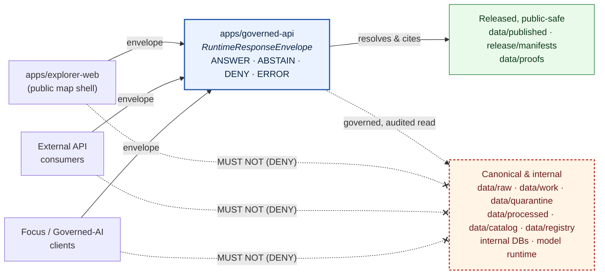

<!-- [KFM_META_BLOCK_V2]
doc_id: kfm://doc/TODO-assign-uuid-for-ADR-0025
title: ADR-0025 — Public Client Never Reads Canonical or Internal Stores
type: standard
version: v1
status: draft
owners: Architecture stewards (docs steward + governed-api owner)
created: 2026-05-09
updated: 2026-05-09
policy_label: public
related:
  - docs/doctrine/trust-membrane.md
  - docs/doctrine/directory-rules.md
  - docs/architecture/governed-api.md
  - docs/adr/ADR-0001-schema-home.md
tags: [kfm, adr, trust-membrane, governance, governed-api, security]
notes:
  - "ADR number 0025 is PROPOSED; canonical index position NEEDS VERIFICATION against accepted ADR list."
  - "Repo not mounted this session; all repo-shape claims are PROPOSED."
[/KFM_META_BLOCK_V2] -->

# ADR-0025 — Public Client Never Reads Canonical or Internal Stores

> **Status:** Proposed · **Type:** Architectural invariant · **Class:** Trust-membrane enforcement
>
> Codifies the long-standing KFM invariant that the public trust path is **`apps/governed-api/`**, and that public clients — including `apps/explorer-web/`, external API consumers, and Focus Mode / AI clients — **MUST NOT** read directly from canonical lifecycle stores, internal databases, model runtimes, or any data plane that has not been governed-released.

---

## 0. Status & Authority

| Field | Value |
|---|---|
| **ADR id** | `ADR-0025` *(PROPOSED — index position NEEDS VERIFICATION against accepted ADR list)* |
| **Title** | Public Client Never Reads Canonical or Internal Stores |
| **Status** | `proposed` |
| **Date** | 2026-05-09 |
| **Authors / proposers** | Architecture stewards |
| **Reviewers required** | Governed-API owner · Docs steward · Security reviewer · at least one domain steward |
| **Supersedes** | — |
| **Superseded by** | — |
| **Amends Directory Rules?** | **No.** This ADR **codifies** an invariant already named in `docs/doctrine/directory-rules.md` §2.1 (authority order) and §6/§7 (root authority). It does not change a canonical root, schema-home rule, or lifecycle phase, so it is not a §2.4 amendment. |
| **Related doctrine** | Trust membrane · Lifecycle law · Authority ladder · Truth posture (cite-or-abstain) · Watcher-as-non-publisher |
| **Truth label of doctrine** | **CONFIRMED** in attached project corpus |
| **Truth label of repo enforcement** | **PROPOSED / NEEDS VERIFICATION** — repo not mounted this session |

> [!IMPORTANT]
> The rule itself is **not new**. It is the operational form of the **Trust Membrane** law in *KFM Operating Law*: *"Public clients use governed APIs, released artifacts, catalog records, tile services, and EvidenceBundle resolution, not canonical internal stores."* This ADR raises that doctrine to **MUST/MUST NOT**-grade enforcement, names the deny tests, and pins the scope so future drift can be detected and refused.

---

## 1. Context

### 1.1 Why this rule exists

KFM is a governed, evidence-first, map-first, time-aware spatial knowledge system. Its lifecycle invariant is:

> **RAW → WORK / QUARANTINE → PROCESSED → CATALOG / TRIPLET → PUBLISHED**
>
> *Promotion is a governed state transition, not a file move.*

Each transition emits receipts, validation reports, evidence bundles, review records, and — at release — a `ReleaseManifest`. Trust accrues through that pipeline; it does not exist before it.

A public client that bypasses the pipeline and reads canonical or internal stores directly:

- exposes raw, unvalidated, or rights-/sensitivity-restricted material as if it were trustworthy,
- breaks the **cite-or-abstain** posture by surfacing data without an `EvidenceBundle` it can cite,
- collapses the watcher-as-non-publisher invariant by letting fetch-state reach users,
- silently retires the publication gate (release, correction, rollback),
- and turns the renderer or client into the system of record.

The trust membrane exists precisely to refuse all five.

### 1.2 What we have today (PROPOSED until repo verification)

The doctrine corpus consistently names this rule across multiple authoritative documents (see §10). The directory rules name `apps/governed-api/` as the public trust path and explicitly state that `apps/explorer-web/` "Reads via `governed-api/`; never directly from `data/raw|work|quarantine`." Domain architecture reports across hydrology, soil, fauna, archaeology, geology, and roads/rail/trade repeat the same posture in their respective contexts.

The corpus also flags two points the repo, when mounted, will need to settle:

1. Whether `apps/api/` and `apps/governed-api/` co-exist, and what the boundary between them is.
2. The full schema of the `Public-DTO` projection — referenced repeatedly but not enumerated in the corpus.

These do **not** block this ADR. They are tracked in §11 (Open Questions).

### 1.3 Forces and tensions

| Force | Pulls toward | Counter-pull |
|---|---|---|
| Developer convenience | "Just read the file / DB directly" | Cost of every bypass is invisible until release |
| Performance / latency | Bypass governed envelope | Envelope is small; RFC 9530 + DSSE + EvidenceBundle resolution are bounded |
| Map renderer ergonomics | Tile attribute = source of truth | Renderer is downstream of trust, never equal to it |
| Internal tooling | Same client for admin and public | Admin lives in `apps/admin/` and `apps/review-console/`, audited and role-gated |
| External consumers | Direct access to "released" buckets | Even released artifacts get `Content-Digest` + signed metadata via the governed surface |

---

## 2. Decision

> **Public clients MUST reach KFM data only through `apps/governed-api/`, which MUST return a `RuntimeResponseEnvelope` with a finite outcome (`ANSWER` · `ABSTAIN` · `DENY` · `ERROR`). Any read path from a public client to a canonical, internal, or unreleased store MUST fail closed — at the policy gate, the network boundary, or both.**

The decision applies the conformance language in `directory-rules.md` §2.2 (RFC 2119-style: `MUST`, `MUST NOT`, `SHOULD`, `MAY`).

### 2.1 In-scope clients (the rule binds)

| Client | Binding |
|---|---|
| `apps/explorer-web/` (map shell) | **MUST** read only via `apps/governed-api/`. |
| External API consumers | **MUST** be served by `apps/governed-api/`; no other route is public. |
| Focus Mode / governed-AI clients | **MUST** resolve `EvidenceRef → EvidenceBundle` through the governed surface; never call model runtime directly. |
| Static delivery clients (PMTiles, COGs, JSON sidecars) | **MUST** be served from `data/published/` only, with RFC 9530 `Content-Digest` and signed decision metadata; clients verify before trusting. |
| Third-party redistributors | **MUST** receive responses with signed decision metadata that propagates the trust contract downstream. |

### 2.2 In-scope stores (the rule forbids direct public read)

| Store | Why it is forbidden as a public read target |
|---|---|
| `data/raw/**` | Source-edge captures; not validated, not rights-checked, not sensitivity-resolved. |
| `data/work/**` | Normalized intermediates and candidate assertions; **not promoted**. |
| `data/quarantine/**` | Failed validation, unresolved rights/sensitivity, schema drift. |
| `data/processed/**` | Validated canonical records; **not yet released**. |
| `data/catalog/**` | STAC / DCAT / PROV records; reachable through governed catalog endpoints, not raw filesystem. |
| `data/triplets/**`, `data/registry/**` | Internal projections / registries; reachable only via governed projections. |
| Internal databases / graph stores | All canonical-truth backing stores. |
| Local model runtimes | Bound privately; only the governed-API adapter calls them. |
| Per-domain restricted lanes | `policy/sensitivity/` and per-domain restricted geometry tables. |

`data/published/**` and `release/manifests/**` are **public-safe artifacts**, but even they reach the public **through** the governed surface (or via static delivery with the integrity headers in §2.4). The membrane is operational, not just lexical.

### 2.3 Required public-surface behavior

The governed API **MUST**:

1. Wrap every response in a `RuntimeResponseEnvelope` with `status ∈ {ANSWER, ABSTAIN, DENY, ERROR}`.
2. Carry `evidence_bundle_refs`, `policy_decision_ref`, `release_manifest_refs`, `stale_state`, `review_state`, `correction_notice_refs`, `citations`, `limitations`, and `reason_codes` as defined in `RuntimeResponseEnvelope` *(schema home PROPOSED: `schemas/contracts/v1/runtime/runtime_response_envelope.schema.json` per ADR-0001)*.
3. **DENY** every public request that targets `data/raw/**`, `data/work/**`, `data/quarantine/**`, `data/processed/**`, candidate paths, internal DB tables, or model runtime endpoints. The denial **MUST** be a policy decision, **not** a filesystem error.
4. **DENY** public requests for unreleased layers with `release.unpublished` reason.
5. **DENY** or return generalized derivatives only for exact archaeology sites, rare-species occurrences, restricted living-person data, restricted DNA/genomic data, and exact critical-infrastructure geometry.
6. **ABSTAIN** when a Focus / claim request cannot resolve an `EvidenceBundle`.
7. Return `ERROR` for adapter / model failures **without leaking** prompt, secret, or internal context.

### 2.4 Required static-delivery posture

Public-safe static artifacts (`data/published/api_payloads/`, `pmtiles/`, `geoparquet/`, `layers/`, `reports/`, `stories/`) **MUST** be served with:

- RFC 9530 `Content-Digest` (and `Repr-Digest` where appropriate) on every artifact,
- DSSE-signed release metadata referencing the governing `ReleaseManifest`,
- Rekor / transparency-log inclusion proof where the release class requires it.

Clients **MUST** verify these before trusting the bytes. The verifier is not optional.

### 2.5 Forbidden patterns (drift)

The following patterns **MUST NOT** appear, regardless of how convenient:

- Public UI fetching from a `data/...` filesystem path or an internal DB endpoint.
- A public route added under `apps/admin/`, `apps/review-console/`, or `apps/cli/`.
- A "fast path" reverse-proxy that exposes `apps/api/` (if it exists) to public origins without going through governed-API gates.
- Tile attributes treated as evidence — tiles are presentation; evidence resolves through the governed API.
- A model adapter callable from a public origin (CORS / CSP must refuse this).
- A `published` artifact reference that points to an unreleased layer.
- Decision metadata stripped, unsigned, or rewritten in transit.

### 2.6 Trust-membrane diagram

> [!NOTE]
> The diagram reflects responsibility boundaries from `docs/doctrine/directory-rules.md` §7.1 and the *Governed API* chapter of the KFM Build Companion. Concrete route names, package names, and DTO schemas remain **PROPOSED** until verified against the mounted repo.

---

## 3. Scope and Definitions

| Term | Definition (for this ADR) |
|---|---|
| **Public client** | Any process or origin not authenticated as a steward, reviewer, operator, or maintainer. Includes `apps/explorer-web/`, third-party API consumers, and Focus / AI clients invoked from public origins. |
| **Canonical store** | The lifecycle stages where canonical truth is recorded prior to release: `data/raw/`, `data/work/`, `data/quarantine/`, `data/processed/`, `data/catalog/`, `data/triplets/`, `data/registry/`. |
| **Internal store** | Backing databases, graph stores, search indexes, model-runtime caches, prompt stores, secret stores, and any store not explicitly classified as `published`. |
| **Released artifact** | A bytes-level artifact under `data/published/**` whose release is recorded by a `ReleaseManifest` in `release/manifests/` and proven by an `EvidenceBundle` / `ProofPack` in `data/proofs/`. |
| **Governed API** | The deployable in `apps/governed-api/` (per `directory-rules.md` §7.1). It is the **only** public trust path. |
| **Envelope** | `RuntimeResponseEnvelope` — the response object returned by the governed API. |
| **Public-DTO** | The public projection schema enforced by the envelope. *Full schema enumeration is **NEEDS VERIFICATION** — see §11.* |

### 3.1 Out of scope

- **Steward and operator clients** (`apps/review-console/`, `apps/cli/`, `apps/admin/`, `apps/workers/`) — role-gated and audited. They MAY read canonical and internal stores within their chartered scope, but MUST emit audit receipts and MUST NOT become the normal public path.
- **Workers** — covered by the watcher-as-non-publisher invariant; out of scope here, but consistent with this ADR.
- **The `Public-DTO` field set** — out of scope for this ADR; addressed by a separate ADR *(PROPOSED, see §11)*.

---

## 4. Verification — How the rule is enforced

> [!IMPORTANT]
> Without enforcement, the rule is aspirational. Enforcement lives in policy, tests, CI, network posture, and review.

### 4.1 Policy-gate deny tests

The following deny tests **MUST** exist as policy fixtures (`policy/runtime/`) and as runtime-proof tests (`tests/runtime_proof/`). *Paths PROPOSED per `directory-rules.md` §6.5–§6.6.*

| # | Test | Expected outcome |
|---|---|---|
| T1 | Public request resolves to a `data/raw/**` path | `DENY` with `reason_codes: [path.canonical_internal]` |
| T2 | Public request resolves to a `data/work/**` path | `DENY` with `reason_codes: [path.canonical_internal]` |
| T3 | Public request resolves to a `data/quarantine/**` path | `DENY` with `reason_codes: [path.quarantined]` |
| T4 | Public request resolves to a `data/processed/**` candidate (no `ReleaseManifest`) | `DENY` with `reason_codes: [release.unpublished]` |
| T5 | Public request for unreleased layer | `DENY` with `reason_codes: [release.unpublished]` |
| T6 | Public request for exact archaeology site | `DENY` or generalized derivative with `obligations: [{type: redact, op: generalize_geometry, level: coarse}]` |
| T7 | Public request for rare-species occurrence | `DENY` or generalized derivative |
| T8 | Public Focus request without resolvable `EvidenceBundle` | `ABSTAIN` with `reason_codes: [evidence.unresolved]` |
| T9 | Public request reaches model runtime directly | `DENY` at network/CSP/CORS layer **and** at policy layer |
| T10 | Source stale beyond policy | `STALE` / `ABSTAIN` per endpoint contract |
| T11 | Adapter / model failure | `ERROR` envelope with no prompt/secret/internal-context leakage |

> Test names are illustrative; the canonical names are set by the policy and runtime-proof packages when this ADR lands.

### 4.2 CI gates

A PR that introduces any of the following **MUST** fail CI:

- A public-origin route declared outside `apps/governed-api/` (lint over `apps/*/routes` and OpenAPI / route registries).
- An `apps/explorer-web/` import or fetch that targets `data/...`, an internal DB DSN, or a model-runtime URL.
- A `Public-DTO` projection that includes a forbidden field class (raw geometry, restricted attribute, internal id) — schema-level lint.
- A static `data/published/**` artifact without `Content-Digest` and signed release metadata in its publish receipt.

*CI workflow names PROPOSED — they will be defined when the ADR is accepted and the package layout is verified.*

### 4.3 Network and runtime posture (`infra/`, `runtime/`)

- Deny-by-default CORS and CSP on public origins.
- Reverse proxy denies public routing to `data/`, model runtimes, internal admin paths, and `apps/admin/` / `apps/review-console/` / `apps/cli/`.
- Local model runtimes bind privately; only `apps/governed-api/`'s adapter can reach them.
- Audit log records actor, request id, policy decision, evidence refs, release refs, and any correction / rollback action — per `kfm_build_companion.pdf` §23.

### 4.4 Review burden

Any PR touching `apps/governed-api/`, `apps/explorer-web/`, `policy/runtime/`, `infra/` exposure posture, or any store classified as canonical / internal **MUST** be reviewed by:

- the **governed-API owner**,
- the **security reviewer**,
- and at least one **domain steward** when domain-restricted data is in play.

---

## 5. Consequences

### 5.1 Positive

- The trust membrane becomes **executable**, not merely doctrinal.
- Public claims are inspectable: every public byte traces to a release, an evidence bundle, and a policy decision.
- Sensitivity, rights, and review posture cannot be silently bypassed.
- Drift is detectable: a forbidden import, a forbidden route, or a forbidden network read is a CI failure, not a runtime regret.
- Downstream consumers can re-govern KFM data, because signed decision metadata travels with each response.
- Correction and rollback remain effective — corrections propagate through the same surface that issued the original claim.

### 5.2 Negative / costs

- Latency overhead from envelope construction, evidence resolution, and signed metadata. Bounded but real; not yet measured against Kansas-scale data on real hardware (**NEEDS VERIFICATION** — see *Pass 11* §10.1, weakly supported performance numbers).
- Implementation effort: every public surface must be auditable; this is a non-trivial discipline for a small team.
- Friction during ingestion and review (the cost of fail-closed). The corpus accepts this cost explicitly.
- Some legitimate use cases (e.g., bulk academic redistribution) require additional governed routes rather than ad-hoc filesystem access.

### 5.3 Reversibility

This ADR is reversible by superseding it with a future ADR that names a different boundary. Until that supersession lands, the membrane is the rule.

---

## 6. Alternatives Considered

### 6.1 Alternative A — Membrane by *convention*, not enforcement

> *Document the rule; rely on developer discipline.*

**Rejected.** The corpus repeatedly observes that without policy + CI + network enforcement, the rule erodes the moment a deadline arrives. Convention is the state KFM is leaving, not entering.

### 6.2 Alternative B — Read-only `data/published/**` as an additional public path

> *Treat `data/published/**` as itself public, served directly by a CDN, with the governed API only for dynamic queries.*

**Partially adopted.** Static delivery of `data/published/**` is permitted **only** with RFC 9530 `Content-Digest`, signed decision metadata, and (where the release class requires) Rekor inclusion proofs (§2.4). Without those, static delivery becomes an unverified back-door.

### 6.3 Alternative C — Multiple membranes (per-domain governed APIs)

> *Each domain runs its own governed-API surface.*

**Rejected.** Domain segmentation lives **inside** `apps/governed-api/` (and within `packages/domains/`); the public-facing trust path is a single, auditable surface. Multiple membranes multiply the failure modes.

### 6.4 Alternative D — Allow `apps/api/` as a parallel public surface

> *Keep an existing `apps/api/` as an additional public route alongside `apps/governed-api/`.*

**Rejected as a public surface.** Per `directory-rules.md` §7.1, if both `apps/api/` and `apps/governed-api/` exist, **the public trust path is `apps/governed-api/`**. `apps/api/` is either deprecated, internal-only, or a narrowly documented service. The boundary **MUST** be explicit and audited.

### 6.5 Alternative E — Allow public clients to call the model runtime directly with prompt-level constraints

> *Push governance into the model adapter at the client boundary.*

**Rejected.** The corpus is unambiguous: governed AI is interpretive only; the model never owns truth, never reads internal stores directly, and never speaks to public clients without an envelope. Putting governance "at the model" returns the system to the failure mode the membrane exists to prevent.

---

## 7. Migration

### 7.1 Inventory step (NEEDS VERIFICATION on mounted repo)

- [ ] Enumerate every public-origin route across `apps/`. Confirm none live outside `apps/governed-api/`.
- [ ] Enumerate every fetch / import in `apps/explorer-web/` (and `web/`, `ui/` compatibility roots). Confirm no `data/`, internal-DB, or model-runtime targets.
- [ ] Enumerate static-delivery surfaces. Confirm `Content-Digest` and signed decision metadata.
- [ ] Inventory CORS / CSP / reverse-proxy rules in `infra/` for deny-by-default coverage.
- [ ] Inventory model-runtime binds; confirm none are publicly reachable.

### 7.2 Migration when violations exist

For each violation, choose one:

1. **Move the route** behind `apps/governed-api/` and wrap it in `RuntimeResponseEnvelope`.
2. **Demote the route** to an internal-only or steward-only origin in `apps/review-console/` or `apps/admin/`.
3. **Withdraw the route** if it is unjustified.

Each migration **MUST** record:

- a brief note in `docs/registers/DRIFT_REGISTER.md`,
- a `CorrectionNotice` if any public claim was previously surfaced through the violating path,
- a `RollbackCard` reference in `release/rollback_cards/` for any release affected.

### 7.3 Acceptance criteria

This ADR moves to `accepted` when:

- All §4.1 deny tests exist and pass.
- All §4.2 CI gates exist and run on PRs touching public surfaces.
- A scan of `apps/explorer-web/` shows no forbidden read paths.
- A scan of `infra/` shows deny-by-default network posture.
- Reviewer sign-off from governed-API owner, security reviewer, and at least one domain steward.

---

## 8. Related Doctrine

| Doctrine | Where |
|---|---|
| Trust membrane (operating law) | `docs/doctrine/trust-membrane.md` *(PROPOSED home per `directory-rules.md` §6.1)* |
| Lifecycle law (RAW → … → PUBLISHED) | `docs/doctrine/lifecycle-law.md` |
| Authority ladder | `docs/doctrine/authority-ladder.md` |
| Truth posture (cite-or-abstain) | `docs/doctrine/truth-posture.md` |
| Watcher-as-non-publisher | Cross-referenced in `docs/doctrine/lifecycle-law.md` and a separate ADR *(PROPOSED, see §9)* |
| Directory Rules | `docs/doctrine/directory-rules.md` §6.1, §7.1, §9.1, §16 |
| Governed API spec | `docs/architecture/governed-api.md` |

---

## 9. Related ADRs

> [!NOTE]
> All ADR numbers below other than `ADR-0001` are **PROPOSED**. The current accepted-ADR index is **NEEDS VERIFICATION** until the repo is inspected. Where a referenced ADR does not yet exist, treat the reference as a forward link.

| ADR | Subject | Relationship |
|---|---|---|
| `ADR-0001-schema-home.md` | Default schema home is `schemas/contracts/v1/...` | **CONFIRMED** in corpus; this ADR references envelope schemas living there. |
| `ADR-0002-finite-decision-outcomes` *(PROPOSED)* | Pins `ANSWER` · `ABSTAIN` · `DENY` · `ERROR` vocabulary | This ADR depends on the finite-outcome enum. |
| `ADR-0003-watcher-as-non-publisher` *(PROPOSED)* | Workers emit receipts and candidates only | Companion invariant on the ingestion side. |
| `ADR-NN-public-dto` *(PROPOSED, number unknown)* | Enumerates the `Public-DTO` field set | Dependency for full enforceability of §2.5. |
| `ADR-NN-static-delivery-integrity` *(PROPOSED)* | RFC 9530, DSSE, Rekor for `data/published/**` | Dependency for §2.4. |
| `ADR-NN-decision-envelope-schema` *(PROPOSED)* | `DecisionEnvelope` schema and obligation vocabulary | Dependency for §4.1 obligation tests. |

---

## 10. Evidence Basis

| Source (attached corpus) | What it supports |
|---|---|
| `kfm_encyclopedia.pdf` — *KFM Operating Law* table | Trust membrane invariant verbatim ("Public clients use governed APIs, released artifacts, catalog records, tile services and EvidenceBundle resolution, not canonical internal stores"). |
| `kfm_build_companion.pdf` §14 (*Governed API: the trust membrane in executable form*) | `RuntimeResponseEnvelope` field set, public endpoint categories, deny tests. |
| `kfm_build_companion.pdf` §23 (*Security, secrets, and local exposure*) | Internal lifecycle data MUST NOT be reachable from public UI/API; deny-by-default posture; deny tests for the public boundary. |
| `directory-rules.md` §6.1, §7.1, §9.1, §16 | `apps/governed-api/` is the public trust path; `apps/explorer-web/` reads via governed-API; lifecycle phase rules forbid public clients in `raw/`, `work/`, `quarantine/`. |
| Domain architecture reports (geology, soil, hydrology, fauna, archaeology, roads/rail/trade) | Domain-by-domain restatement of the same posture. |
| `KFM_Components_Pass_11_Part_2` §F (Trust Membrane), §8 (cross-cutting themes) | Tiles / generated text are not sovereign truth; client-as-policy-node; signed decision metadata at the API boundary. |
| `KFM_Governed_AI_Extended_Pro_Source_Ledger` | `RuntimeResponseEnvelope`, `DecisionEnvelope`, and `EvidenceBundle` flow. |
| `KFM_Whole_UI_Governed_AI_Expansion_Report` | UI shell binds to governed envelopes; no forbidden browser calls. |

---

## 11. Open Questions / NEEDS VERIFICATION

- [ ] **`apps/api/` boundary** — does `apps/api/` co-exist with `apps/governed-api/` in the mounted repo, and what is the documented boundary? *(directory-rules.md §18 flags this as open.)*
- [ ] **Full `Public-DTO` schema** — the corpus references `Public-DTO` repeatedly without enumerating fields. A separate ADR should pin the schema before §2.5 can be fully enforced.
- [ ] **Performance budgets** — concrete latency budgets for envelope construction, evidence resolution, and signed metadata are stated as targets, not measured behavior. Need measurement on a real Kansas dataset before they harden into commitments.
- [ ] **CDN selection for static delivery** — some CDNs strip RFC 9530 headers; a CDN posture review is required.
- [ ] **MLT / PMTiles / Cosign / Sigstore Rekor / OPA version pins** — corpus references are version-sensitive and may have moved; re-check at adoption.
- [ ] **Existing violations** — until the repo is mounted, the count and shape of any current violations are **UNKNOWN**.
- [ ] **`docs/registers/DRIFT_REGISTER.md` presence** — required for the migration discipline in §7.2; presence is **NEEDS VERIFICATION**.

---

## 12. Glossary (placement-relevant terms)

| Term | Short definition |
|---|---|
| **Trust membrane** | The boundary that prevents raw / unreviewed / model-generated / internal state from becoming public truth. Operational form: `apps/governed-api/`. |
| **`RuntimeResponseEnvelope`** | Public response object with finite outcomes (`ANSWER` · `ABSTAIN` · `DENY` · `ERROR`). |
| **`DecisionEnvelope`** | Normalized policy-output object emitted by every policy module. |
| **`EvidenceBundle` / `EvidenceRef`** | Resolved support package for claims; lives in `data/proofs/`. |
| **`ReleaseManifest`** | The release decision artifact; lives in `release/manifests/`. |
| **Watcher-as-non-publisher** | Workers emit receipts and candidates only; never publish, mutate canonical records, or bypass review. |

---

## 13. Change History

| Date | Change | Author |
|---|---|---|
| 2026-05-09 | Initial draft, status `proposed`. | Architecture stewards |

---

[⬆ Back to top](#adr-0025--public-client-never-reads-canonical-or-internal-stores)
