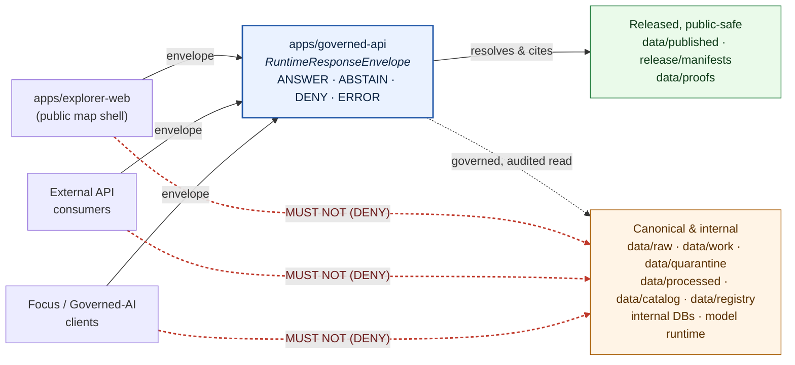

<!-- [KFM_META_BLOCK_V2]
doc_id: kfm://doc/TODO-assign-uuid-for-ADR-0025
title: ADR-0025 — Public Client Never Reads Canonical or Internal Stores
type: standard
version: v1.1
status: draft
owners: Architecture stewards (docs steward + governed-api owner)
created: 2026-05-09
updated: 2026-05-15
policy_label: public
related:
  - docs/doctrine/trust-membrane.md
  - docs/doctrine/lifecycle-law.md
  - docs/doctrine/truth-posture.md
  - docs/doctrine/directory-rules.md
  - docs/architecture/governed-api.md
  - docs/adr/ADR-0001-schema-home.md
  - release/manifests/
  - data/proofs/
tags: [kfm, adr, trust-membrane, governance, governed-api, security, public-client]
notes:
  - "ADR number 0025 is PROPOSED; canonical index position NEEDS VERIFICATION against accepted ADR list."
  - "Repo not mounted in this revision session; current repo-shape and enforcement claims remain PROPOSED / NEEDS VERIFICATION."
  - "Target path is PROPOSED until verified in the mounted repository."
[/KFM_META_BLOCK_V2] -->

# ADR-0025 — Public Client Never Reads Canonical or Internal Stores

> **Status:** Proposed · **Type:** Architectural invariant · **Class:** Trust-membrane enforcement
>
> Codifies the KFM invariant that the public trust path is **`apps/governed-api/`**, and that public clients — including `apps/explorer-web/`, external API consumers, Focus Mode, and governed-AI clients — **MUST NOT** read directly from canonical lifecycle stores, internal databases, model runtimes, or any data plane that has not been governed-released.

---

## 0. Status & Authority

| Field | Value |
|---|---|
| **ADR id** | `ADR-0025` *(PROPOSED — index position NEEDS VERIFICATION against accepted ADR list)* |
| **Title** | Public Client Never Reads Canonical or Internal Stores |
| **Status** | `proposed` |
| **Date** | 2026-05-09 |
| **Updated** | 2026-05-15 |
| **Authors / proposers** | Architecture stewards |
| **Reviewers required** | Governed-API owner · Docs steward · Security reviewer · at least one domain steward |
| **Proposed target path** | `docs/adr/ADR-0025-public-client-never-reads-canonical-internal-stores.md` *(PROPOSED / NEEDS VERIFICATION)* |
| **Supersedes** | — |
| **Superseded by** | — |
| **Amends Directory Rules?** | **No.** This ADR codifies an invariant already named in Directory Rules and KFM operating law. It does not change a canonical root, schema-home rule, lifecycle phase, or compatibility-root status. |
| **Related doctrine** | Trust membrane · Lifecycle law · Authority ladder · Truth posture (cite-or-abstain) · Watcher-as-non-publisher |
| **Truth label of doctrine** | **CONFIRMED** in attached KFM doctrine corpus |
| **Truth label of repo enforcement** | **PROPOSED / NEEDS VERIFICATION** — repo not mounted this revision session |

> [!IMPORTANT]
> The rule itself is **not new**. It is the operational form of the **Trust Membrane** law: public clients use governed APIs, released artifacts, catalog records, tile services, and `EvidenceBundle` resolution — **not** canonical internal stores. This ADR raises that doctrine to **MUST/MUST NOT**-grade enforcement, names the deny tests, and pins the scope so drift can be detected and refused.

> [!NOTE]
> **Evidence boundary:** This revision used the attached Markdown baseline, Directory Rules, KFM operating-law sources, governed-AI doctrine, MapLibre/UI doctrine, and domain-lane lineage. No mounted repository, tests, workflows, logs, dashboards, or emitted release artifacts were available. Therefore route names, package names, exact DTO fields, CI workflow names, and current violations remain **UNKNOWN** until repo inspection.

---

## 1. Context

### 1.1 Why this rule exists

KFM is a governed, evidence-first, map-first, time-aware spatial knowledge system. Its lifecycle invariant is:

> **RAW → WORK / QUARANTINE → PROCESSED → CATALOG / TRIPLET → PUBLISHED**
>
> *Promotion is a governed state transition, not a file move.*

Each transition emits receipts, validation reports, evidence bundles, review records, and — at release — a `ReleaseManifest`. Trust accrues through that pipeline; it does not exist before it.

A public client that bypasses the pipeline and reads canonical or internal stores directly:

- exposes raw, unvalidated, stale, or rights-/sensitivity-restricted material as if it were trustworthy,
- breaks the **cite-or-abstain** posture by surfacing data without an `EvidenceBundle` it can cite,
- collapses the watcher-as-non-publisher invariant by letting fetch-state reach users,
- silently retires the publication gate (release, correction, rollback),
- can leak prompt, model-runtime, graph, or internal-index state,
- and turns the renderer or client into the system of record.

The trust membrane exists to refuse those failure modes.

### 1.2 What we have today (PROPOSED until repo verification)

The doctrine corpus consistently names this rule across multiple authoritative documents (see §10). Directory Rules names `apps/governed-api/` as the public trust path and states that `apps/explorer-web/` reads via governed API rather than directly from `data/raw|work|quarantine`. Domain architecture reports across hydrology, soil, fauna, archaeology, geology, roads/rail/trade, settlements/infrastructure, and atmosphere repeat the same posture in their own contexts.

The corpus also flags two points the repo, when mounted, will need to settle:

1. Whether `apps/api/` and `apps/governed-api/` co-exist, and what the boundary between them is.
2. The full schema of the `Public-DTO` projection — referenced repeatedly but not enumerated in the available corpus.

These do **not** block this ADR. They are tracked in §11.

### 1.3 Forces and tensions

| Force | Pulls toward | Counter-pull |
|---|---|---|
| Developer convenience | "Just read the file / DB directly" | Cost of every bypass is invisible until release |
| Performance / latency | Bypass governed envelope | Envelope cost is real, but it is the cost of inspectability; budgets remain **NEEDS VERIFICATION** |
| Map renderer ergonomics | Tile attribute = source of truth | Renderer is downstream of trust, never equal to it |
| Static delivery | CDN / object store serves bytes directly | Static delivery is allowed only as a governed static edge with digest, release metadata, and verification |
| Internal tooling | Same client for admin and public | Admin/review surfaces are role-gated, audited, and outside the normal public path |
| External consumers | Direct access to "released" buckets | Even public-safe artifacts carry release, digest, citation, and policy metadata |

---

## 2. Decision

> **Public clients MUST reach KFM data only through `apps/governed-api/` or through a governed static-delivery edge for already released public-safe artifacts. Dynamic public responses MUST return a `RuntimeResponseEnvelope` with a finite outcome (`ANSWER` · `ABSTAIN` · `DENY` · `ERROR`). Any read path from a public client to a canonical, internal, model-runtime, candidate, or unreleased store MUST fail closed — at the policy gate, the network boundary, or both.**

The decision applies the conformance language used by Directory Rules: `MUST`, `MUST NOT`, `SHOULD`, and `MAY` are normative.

### 2.1 In-scope clients (the rule binds)

| Client | Binding |
|---|---|
| `apps/explorer-web/` (map shell) | **MUST** read only via `apps/governed-api/` or verified released static artifacts declared by a release manifest. |
| External API consumers | **MUST** be served by `apps/governed-api/`; no other dynamic route is public unless a future accepted ADR says otherwise. |
| Focus Mode / governed-AI clients | **MUST** resolve `EvidenceRef → EvidenceBundle` through the governed surface; never call a model runtime directly. |
| Static delivery clients (PMTiles, COGs, GeoParquet, JSON sidecars, reports, stories) | **MUST** consume only released public-safe artifacts with digest and signed release metadata; clients or edge verifiers MUST verify before trusting. |
| Third-party redistributors | **MUST** receive responses or release objects with signed decision metadata that propagates the trust contract downstream. |

### 2.2 In-scope stores (the rule forbids direct public read)

| Store | Why it is forbidden as a direct public read target |
|---|---|
| `data/raw/**` | Source-edge captures; not validated, not rights-checked, not sensitivity-resolved. |
| `data/work/**` | Normalized intermediates and candidate assertions; **not promoted**. |
| `data/quarantine/**` | Failed validation, unresolved rights/sensitivity, schema drift, or other hold state. |
| `data/processed/**` | Validated canonical records; **not yet released**. |
| `data/catalog/**` | Catalog records are trust-bearing; public access is through governed catalog endpoints or released catalog distributions, not raw filesystem reads. |
| `data/triplets/**`, `data/registry/**` | Internal projections / registries; public views must use governed projections. |
| Internal databases / graph stores / search indexes | Backing stores and rebuildable derivatives; never the public truth surface. |
| Local model runtimes and model caches | Bound privately; only governed adapters may call them. |
| Per-domain restricted lanes | Sensitive geometry, living-person/DNA/land/title material, cultural/archaeological controls, and rare-species controls fail closed unless reviewed and transformed. |

`data/published/**` and `release/manifests/**` can contain **public-safe artifacts**, but they become public only through either:

1. `apps/governed-api/`, or
2. a governed static-delivery edge that preserves `Content-Digest`, signed release metadata, and release/correction/rollback references.

The membrane is operational, not lexical.

### 2.3 Required public-surface behavior

The governed API **MUST**:

1. Wrap every dynamic public response in a `RuntimeResponseEnvelope` with `status ∈ {ANSWER, ABSTAIN, DENY, ERROR}`.
2. Carry, where applicable, `evidence_bundle_refs`, `policy_decision_ref`, `release_manifest_refs`, `stale_state`, `review_state`, `correction_notice_refs`, `citations`, `limitations`, and `reason_codes`.
3. **DENY** every public request that targets `data/raw/**`, `data/work/**`, `data/quarantine/**`, `data/processed/**`, candidate paths, internal DB tables, internal graph/search indexes, or model-runtime endpoints. The denial **MUST** be an explicit policy decision, not an accidental filesystem error.
4. **DENY** public requests for unreleased layers with a release-state reason such as `release.unpublished`.
5. **DENY** or return reviewed generalized derivatives only for exact archaeology sites, rare-species occurrences, restricted living-person data, restricted DNA/genomic data, culturally sensitive locations, and exact critical-infrastructure geometry.
6. **ABSTAIN** when a Focus / claim request cannot resolve an `EvidenceBundle` or cannot validate citations.
7. Return `ERROR` for adapter / model / resolver failures **without leaking** prompts, secrets, stack traces, private chain-of-thought, or internal context.

> [!NOTE]
> Schema home for `RuntimeResponseEnvelope` is **PROPOSED** as `schemas/contracts/v1/runtime/runtime_response_envelope.schema.json` per the schema-home convention. The full field set is **NEEDS VERIFICATION** against accepted schemas.

### 2.4 Required static-delivery posture

Public-safe static artifacts (`data/published/api_payloads/`, `pmtiles/`, `geoparquet/`, `layers/`, `reports/`, `stories/`) **MUST** be served with:

- RFC 9530 `Content-Digest` and `Repr-Digest` where appropriate,
- release metadata that names the governing `ReleaseManifest`,
- DSSE-signed release metadata where the release class requires signing,
- transparency-log inclusion proof where the release class requires it,
- correction and rollback references when the artifact supersedes or corrects earlier public material.

Clients, edge verifiers, or downstream consumers **MUST** verify these before treating the bytes as KFM-published truth. Verification is part of the public contract.

### 2.5 Forbidden patterns (drift)

The following patterns **MUST NOT** appear, regardless of convenience:

- Public UI fetching from a `data/...` filesystem path, internal DB endpoint, graph endpoint, search-index endpoint, or model-runtime URL.
- A public route added under `apps/admin/`, `apps/review-console/`, `apps/cli/`, or any compatibility root such as `web/` or `ui/` without governed-API mediation.
- A "fast path" reverse proxy that exposes `apps/api/` (if it exists) to public origins without governed-API gates.
- Tile attributes, popup text, screenshots, dashboards, graph edges, summaries, vector indexes, or AI responses treated as evidence. They are carriers; evidence resolves through the governed API and `EvidenceBundle`.
- A model adapter callable from a public origin; CORS, CSP, auth, and network posture must refuse it.
- A `published` artifact reference that points to an unreleased layer or to a stale artifact without stale-state disclosure.
- Decision metadata stripped, unsigned, rewritten, or dropped in transit.

### 2.6 Trust-membrane diagram

> [!NOTE]
> The diagram reflects responsibility boundaries from Directory Rules and governed-API doctrine. Concrete route names, package names, edge-verifier names, and DTO schemas remain **PROPOSED** until verified against the mounted repo.

---

## 3. Scope and Definitions

| Term | Definition (for this ADR) |
|---|---|
| **Public client** | Any process or origin not authenticated as a steward, reviewer, operator, or maintainer. Includes `apps/explorer-web/`, third-party API consumers, public Focus Mode clients, and AI clients invoked from public origins. |
| **Canonical store** | Lifecycle stages and stores where KFM records truth before release: `data/raw/`, `data/work/`, `data/quarantine/`, `data/processed/`, `data/catalog/`, `data/triplets/`, `data/registry/`, and backing stores that represent those phases. |
| **Internal store** | Backing databases, graph stores, search indexes, model-runtime caches, prompt stores, secret stores, admin-only stores, and any store not explicitly classified as released public-safe. |
| **Released artifact** | A bytes-level artifact under `data/published/**` whose release is recorded by a `ReleaseManifest` in `release/manifests/` and supported by `EvidenceBundle` / proof objects in `data/proofs/`. |
| **Governed API** | The deployable in `apps/governed-api/`. It is the public trust path for dynamic public claims and evidence resolution. |
| **Governed static-delivery edge** | Static delivery of released artifacts with digest, signed release metadata, correction/rollback references, and verification. It is not a shortcut around promotion. |
| **Envelope** | `RuntimeResponseEnvelope` — the finite-outcome response object returned by the governed API. |
| **Public-DTO** | The public projection schema enforced by the envelope. Full schema enumeration is **NEEDS VERIFICATION**; see §11. |

### 3.1 Out of scope

- **Steward and operator clients** (`apps/review-console/`, `apps/cli/`, `apps/admin/`, `apps/workers/`) — role-gated and audited. They MAY read canonical and internal stores within their chartered scope, but MUST emit audit receipts and MUST NOT become the normal public path.
- **Workers and connectors** — covered by watcher-as-non-publisher and source-admission doctrine. They are out of scope here except where their output would otherwise leak to public clients.
- **The `Public-DTO` field set** — addressed by a separate ADR or schema acceptance decision.
- **Emergency alerting, legal/title advice, medical advice, and life-safety action** — KFM may cite official sources, but this ADR does not authorize direct operational advice or bypass official alerting systems.

---

## 4. Verification — How the rule is enforced

> [!IMPORTANT]
> Without enforcement, the rule is aspirational. Enforcement lives in policy, tests, CI, network posture, release manifests, and review.

### 4.1 Policy-gate deny tests

The following deny tests **MUST** exist as policy fixtures and runtime-proof tests. Proposed homes are `policy/runtime/` and `tests/runtime_proof/`, subject to mounted-repo placement verification.

| # | Test | Expected outcome |
|---|---|---|
| T1 | Public request resolves to a `data/raw/**` path | `DENY` with `reason_codes: [path.canonical_internal]` |
| T2 | Public request resolves to a `data/work/**` path | `DENY` with `reason_codes: [path.canonical_internal]` |
| T3 | Public request resolves to a `data/quarantine/**` path | `DENY` with `reason_codes: [path.quarantined]` |
| T4 | Public request resolves to a `data/processed/**` candidate without release | `DENY` with `reason_codes: [release.unpublished]` |
| T5 | Public request for unreleased layer | `DENY` with `reason_codes: [release.unpublished]` |
| T6 | Public request for exact archaeology / culturally sensitive site | `DENY` or reviewed generalized derivative with redaction obligations |
| T7 | Public request for rare-species occurrence or restricted ecological geometry | `DENY` or reviewed generalized derivative |
| T8 | Public Focus request without resolvable `EvidenceBundle` | `ABSTAIN` with `reason_codes: [evidence.unresolved]` |
| T9 | Public request reaches model runtime directly | `DENY` at network/CSP/CORS layer **and** at policy layer |
| T10 | Source stale beyond policy | `ABSTAIN` or `DENY` with `stale_state` disclosed; never silent success |
| T11 | Adapter / model / resolver failure | `ERROR` envelope with no prompt, secret, stack trace, private reasoning, or internal-context leakage |
| T12 | Static artifact lacks digest or release metadata | `DENY` / publish gate fail with `reason_codes: [artifact.integrity_missing]` |

> Test names are illustrative; canonical names are set by the policy and runtime-proof packages when this ADR lands.

### 4.2 CI gates

A PR that introduces any of the following **MUST** fail CI:

- A public-origin dynamic route declared outside `apps/governed-api/`.
- An `apps/explorer-web/` import or fetch that targets `data/...`, an internal DB DSN, a graph/search endpoint, or a model-runtime URL.
- A compatibility-root route (`web/`, `ui/`, `styles/`, `viewer_templates/`) that behaves as a public trust path without a README class declaration and migration posture.
- A `Public-DTO` projection that includes a forbidden field class: raw geometry, restricted attribute, internal id, unresolved source id, prompt text, private reasoning, or unreviewed candidate state.
- A static `data/published/**` artifact without digest, release manifest reference, and signed release metadata where required.
- A tile/style/layer manifest that loads an unreleased or restricted artifact into a normal public map.

*CI workflow names remain PROPOSED. They will be defined when package layout, schema home, and policy tooling are verified.*

### 4.3 Network and runtime posture (`infra/`, `runtime/`)

- Deny-by-default CORS and CSP on public origins.
- Reverse proxy denies public routing to `data/`, model runtimes, internal admin paths, and `apps/admin/` / `apps/review-console/` / `apps/cli/`.
- Local model runtimes bind privately; only the governed-API adapter can reach them.
- Static hosting preserves digest headers, release metadata, and immutable artifact references; a CDN that strips required headers is not acceptable for governed static delivery.
- Audit log records actor, request id, endpoint, policy decision, evidence refs, release refs, correction refs, and rollback refs where applicable.

### 4.4 Review burden

Any PR touching `apps/governed-api/`, `apps/explorer-web/`, compatibility UI/web roots, `policy/runtime/`, `infra/` exposure posture, model-runtime binding, public static delivery, or any store classified as canonical / internal **MUST** be reviewed by:

- the **governed-API owner**,
- the **security reviewer**,
- and at least one **domain steward** when domain-restricted data is in play.

### 4.5 Minimum acceptance evidence

This ADR cannot move to `accepted` on prose alone. The acceptance packet **SHOULD** include:

- a route inventory showing all public dynamic routes resolve through `apps/governed-api/`,
- a browser-fetch/import scan for `apps/explorer-web/` and compatibility roots,
- policy fixture results for §4.1,
- CI results for §4.2,
- static-delivery verification for at least one released public-safe artifact,
- network posture evidence for CORS, CSP, reverse proxy, and model-runtime binding,
- reviewer sign-off from required roles.

---

## 5. Consequences

### 5.1 Positive

- The trust membrane becomes **executable**, not merely doctrinal.
- Public claims are inspectable: every public claim-bearing response traces to a release, evidence, policy decision, and review state.
- Sensitivity, rights, cultural controls, living-person controls, and source-role limits cannot be silently bypassed.
- Drift is detectable: forbidden imports, routes, network reads, and artifact loads become CI failures.
- Downstream consumers can re-govern KFM data because signed decision metadata travels with responses and releases.
- Correction and rollback remain effective because corrections propagate through the same surface that issued or served the original claim.

### 5.2 Negative / costs

- Latency overhead from envelope construction, evidence resolution, citation validation, and signed metadata. This is bounded by design but not yet measured against a real Kansas dataset (**NEEDS VERIFICATION**).
- Implementation effort: every public surface must be auditable; this is a non-trivial discipline for a small team.
- Friction during ingestion and review: fail-closed paths require additional source, rights, sensitivity, and release work.
- Some legitimate use cases, such as bulk academic redistribution, require governed export routes or signed static releases rather than ad-hoc filesystem access.

### 5.3 Reversibility

This ADR is reversible only by a later accepted ADR that names a different public boundary and provides equivalent or stronger guarantees for evidence, policy, review, release, correction, rollback, and static-delivery verification.

### 5.4 Rollback if enforcement breaks production

If enforcement causes unacceptable public-surface breakage during rollout:

1. Disable affected public routes or features via feature flag.
2. Keep deny-by-default posture in place; do **not** open a raw/canonical bypass.
3. Repoint public clients to the last verified `MapReleaseManifest` / release alias where applicable.
4. Record a `RollbackCard` for the affected release or route.
5. Record a `CorrectionNotice` if unsupported public claims were exposed.
6. Resume only after policy, CI, and reviewer sign-off are restored.

---

## 6. Alternatives Considered

### 6.1 Alternative A — Membrane by *convention*, not enforcement

> *Document the rule; rely on developer discipline.*

**Rejected.** Without policy, CI, runtime, and network enforcement, the rule erodes the moment a deadline arrives. Convention is the state KFM is leaving, not entering.

### 6.2 Alternative B — Read-only `data/published/**` as an additional public path

> *Treat `data/published/**` as itself public, served directly by a CDN, with the governed API only for dynamic queries.*

**Partially adopted.** Static delivery of `data/published/**` is permitted only as a governed static-delivery edge with digest, release metadata, and verification. Without that, static delivery becomes an unverified back door.

### 6.3 Alternative C — Multiple membranes (per-domain governed APIs)

> *Each domain runs its own governed-API surface.*

**Rejected.** Domain segmentation lives **inside** `apps/governed-api/` and domain packages. The public-facing trust path is a single auditable surface. Multiple membranes multiply failure modes.

### 6.4 Alternative D — Allow `apps/api/` as a parallel public surface

> *Keep an existing `apps/api/` as an additional public route alongside `apps/governed-api/`.*

**Rejected as a public surface.** Directory Rules states that if both `apps/api/` and `apps/governed-api/` exist, the canonical boundary must be explicit and `apps/governed-api/` is the public trust path. `apps/api/` is either deprecated, internal-only, or a narrowly documented service.

### 6.5 Alternative E — Allow public clients to call the model runtime directly with prompt-level constraints

> *Push governance into the model adapter at the client boundary.*

**Rejected.** Governed AI is interpretive only; the model never owns truth, never reads internal stores directly, and never speaks to public clients without an envelope. Putting governance "at the model" returns the system to the failure mode the membrane exists to prevent.

---

## 7. Migration

### 7.1 Inventory step (NEEDS VERIFICATION on mounted repo)

- [ ] Enumerate every public-origin dynamic route across `apps/`. Confirm none live outside `apps/governed-api/` unless an accepted ADR authorizes them.
- [ ] Enumerate every fetch / import in `apps/explorer-web/` and compatibility roots (`web/`, `ui/`, `styles/`, `viewer_templates/`). Confirm no `data/`, internal-DB, graph/search, or model-runtime targets.
- [ ] Enumerate static-delivery surfaces. Confirm digest headers, signed release metadata, release manifest references, and correction/rollback references.
- [ ] Inventory CORS / CSP / reverse-proxy rules in `infra/` for deny-by-default coverage.
- [ ] Inventory model-runtime binds; confirm none are publicly reachable.
- [ ] Inventory `apps/api/`, if present, and classify it as deprecated, internal-only, or narrowly documented service.

### 7.2 Migration when violations exist

For each violation, choose one:

1. **Move the route** behind `apps/governed-api/` and wrap it in `RuntimeResponseEnvelope`.
2. **Demote the route** to an internal-only or steward-only origin in `apps/review-console/` or `apps/admin/`.
3. **Convert it to governed static delivery** only if it serves released public-safe artifacts with digest and release metadata.
4. **Withdraw the route** if it is unjustified.

Each migration **MUST** record:

- a drift entry or equivalent lineage note in `docs/registers/DRIFT_REGISTER.md` *(presence NEEDS VERIFICATION)*,
- a `CorrectionNotice` if any public claim was previously surfaced through the violating path,
- a `RollbackCard` reference in `release/rollback_cards/` for any release affected,
- a route/link compatibility note if public clients need redirect or deprecation handling.

### 7.3 Acceptance criteria

This ADR moves to `accepted` when:

- All §4.1 deny tests exist and pass.
- All §4.2 CI gates exist and run on PRs touching public surfaces.
- A scan of `apps/explorer-web/` and compatibility roots shows no forbidden read paths.
- A scan of `infra/` shows deny-by-default network posture.
- At least one static-delivery artifact proves digest + release metadata verification.
- Reviewer sign-off from governed-API owner, security reviewer, and at least one domain steward is recorded.

### 7.4 Smallest safe first implementation slice (PROPOSED)

1. Add or verify schemas for `RuntimeResponseEnvelope`, `DecisionEnvelope`, `EvidenceRef`, `EvidenceBundle`, `ReleaseManifest`, and static artifact digest metadata.
2. Add policy fixtures for §4.1.
3. Add browser-fetch/import lint for `apps/explorer-web/` and compatibility roots.
4. Add a no-network runtime-proof fixture showing `DENY`, `ABSTAIN`, and `ERROR` envelopes.
5. Add one released public-safe static fixture with digest and manifest metadata.
6. Record the route inventory and open questions before accepting the ADR.

---

## 8. Related Doctrine

| Doctrine | Where |
|---|---|
| Trust membrane (operating law) | `docs/doctrine/trust-membrane.md` *(PROPOSED home)* |
| Lifecycle law (RAW → … → PUBLISHED) | `docs/doctrine/lifecycle-law.md` |
| Authority ladder | `docs/doctrine/authority-ladder.md` |
| Truth posture (cite-or-abstain) | `docs/doctrine/truth-posture.md` |
| Watcher-as-non-publisher | Cross-referenced in lifecycle doctrine and companion ADR *(PROPOSED)* |
| Directory Rules | `docs/doctrine/directory-rules.md` |
| Governed API spec | `docs/architecture/governed-api.md` *(PROPOSED / NEEDS VERIFICATION as mounted repo path)* |

---

## 9. Related ADRs

> [!NOTE]
> All ADR numbers below other than `ADR-0001` are **PROPOSED** until the accepted-ADR index is verified. Where a referenced ADR does not yet exist, treat the reference as a forward link.

| ADR | Subject | Relationship |
|---|---|---|
| `ADR-0001-schema-home.md` | Default schema home is `schemas/contracts/v1/...` | This ADR references envelope schemas living there. |
| `ADR-0002-finite-decision-outcomes` *(PROPOSED)* | Pins `ANSWER` · `ABSTAIN` · `DENY` · `ERROR` vocabulary | This ADR depends on the finite-outcome enum. |
| `ADR-0003-watcher-as-non-publisher` *(PROPOSED)* | Workers emit receipts and candidates only | Companion invariant on the ingestion side. |
| `ADR-NN-public-dto` *(PROPOSED, number unknown)* | Enumerates the `Public-DTO` field set | Dependency for full enforceability of §2.3 and §4.2. |
| `ADR-NN-static-delivery-integrity` *(PROPOSED)* | RFC 9530, DSSE, transparency-log, and static-artifact integrity | Dependency for §2.4. |
| `ADR-NN-decision-envelope-schema` *(PROPOSED)* | `DecisionEnvelope` schema and obligation vocabulary | Dependency for §4.1 obligation tests. |

---

## 10. Evidence Basis

| Source (attached corpus) | Truth role in this ADR | What it supports |
|---|---|---|
| `Pasted markdown (2).md` | **CONFIRMED baseline** | Current ADR text, headings, status, decision, deny tests, migration, and open questions. |
| `Pasted markdown.md` | **CONFIRMED editing contract** | Revision mode, no-loss preservation, truth labels, output expectations, and no-overclaiming posture. |
| `Directory Rules.pdf` | **CONFIRMED placement doctrine** | Root responsibility law, `apps/governed-api/` as public trust path, `apps/explorer-web/` via governed API, schema-home convention, `runtime/` not public, release/proof/receipt split. |
| `kfm_encyclopedia.pdf` | **CONFIRMED operating-law doctrine** | Inspectable claim, lifecycle law, trust membrane, publication gate, AI boundary, map-renderer boundary, sensitivity/rights fail-closed posture. |
| `KFM_Governed_AI_Extended_Pro_Source_Ledger_PDF_Only_Architecture_Report_2026-04-20.pdf` | **CONFIRMED doctrine / PROPOSED implementation** | `RuntimeResponseEnvelope`, `DecisionEnvelope`, `EvidenceBundle`, finite outcomes, no raw model output, policy pre/postcheck, rollback posture. |
| `KFM_MapLibre_Operating_Architecture_Governed_UI_AI_Interaction_Manual_REVISED.pdf` and `Master MapLibre Components-Functions-Features.pdf` | **CONFIRMED UI/map doctrine / PROPOSED implementation** | MapLibre as downstream renderer, Evidence Drawer / Focus Mode trust surfaces, no unreleased tile load, no popup-as-evidence substitute. |
| Domain architecture reports | **LINEAGE / PROPOSED implementation** | Domain-by-domain restatement of sensitivity, rights, release, and no-direct-public-read posture. |

> [!NOTE]
> References that appeared in prior drafts but were not present in this revision session are not used as current evidence. Prior document names may remain as lineage only until reattached or verified in the mounted repository.

---

## 11. Open Questions / NEEDS VERIFICATION

- [ ] **`apps/api/` boundary** — does `apps/api/` co-exist with `apps/governed-api/` in the mounted repo, and what is the documented boundary?
- [ ] **Full `Public-DTO` schema** — the corpus references `Public-DTO` repeatedly without enumerating fields. A separate ADR should pin the schema before §2.3 and §4.2 can be fully enforced.
- [ ] **`RuntimeResponseEnvelope` field set** — confirm accepted schema path and exact required fields.
- [ ] **Performance budgets** — measure envelope construction, evidence resolution, policy checks, citation validation, and signed metadata on a real Kansas dataset before hardening targets.
- [ ] **CDN / object-store selection for static delivery** — confirm required digest headers, immutable references, CORS, cache behavior, and metadata preservation.
- [ ] **MLT / PMTiles / Cosign / Sigstore Rekor / OPA / Conftest version pins** — re-check before adoption; version-sensitive claims are not accepted here.
- [ ] **Existing violations** — until the repo is mounted, the count and shape of current violations are **UNKNOWN**.
- [ ] **`docs/registers/DRIFT_REGISTER.md` presence** — required for migration discipline; presence is **NEEDS VERIFICATION**.
- [ ] **Reviewer roster** — governed-API owner, security reviewer, docs steward, and domain stewards need repo-confirmed identities.

---

## 12. Glossary (placement-relevant terms)

| Term | Short definition |
|---|---|
| **Trust membrane** | Boundary that prevents raw / unreviewed / model-generated / internal state from becoming public truth. Operational form: `apps/governed-api/` plus governed static-delivery verification for released artifacts. |
| **`RuntimeResponseEnvelope`** | Public response object with finite outcomes (`ANSWER` · `ABSTAIN` · `DENY` · `ERROR`). |
| **`DecisionEnvelope`** | Normalized policy-output object emitted by policy modules. |
| **`EvidenceBundle` / `EvidenceRef`** | Resolved support package for claims; expected home is `data/proofs/` for proof-bearing objects, subject to mounted-repo verification. |
| **`ReleaseManifest`** | Release decision artifact; expected home is `release/manifests/`. |
| **`CorrectionNotice`** | Public notice of corrected or withdrawn claim; expected home is `release/correction_notices/`. |
| **`RollbackCard`** | Rollback decision artifact; expected home is `release/rollback_cards/`. |
| **Watcher-as-non-publisher** | Workers emit receipts and candidates only; they never publish, mutate canonical records, or bypass review. |
| **Governed static-delivery edge** | Static public delivery of released bytes with digest, release metadata, correction/rollback references, and verification. |

---

## 13. Change History

| Date | Change | Author |
|---|---|---|
| 2026-05-09 | Initial draft, status `proposed`. | Architecture stewards |
| 2026-05-15 | Revision v1.1: refreshed metadata, clarified static-delivery edge, normalized stale handling under finite outcomes, added acceptance evidence, added rollback, updated evidence basis to current attachments, and made repo gaps more explicit. | ChatGPT-assisted revision for Architecture stewards |

---

[⬆ Back to top](#adr-0025--public-client-never-reads-canonical-or-internal-stores)
