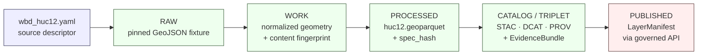

<!-- [KFM_META_BLOCK_V2]
doc_id: kfm://doc/adr-0026-hydrology-source-spine-starts-with-wbd-huc12
title: ADR-0026 — Hydrology source spine starts with WBD HUC12
type: standard
version: v1
status: draft
owners: TBD — hydrology lane steward + architecture steward
created: 2026-05-09
updated: 2026-05-09
policy_label: public
related:
  - docs/adr/ADR-0001-schema-home.md
  - docs/doctrine/lifecycle-law.md
  - docs/doctrine/truth-posture.md
  - docs/domains/hydrology/ARCHITECTURE.md
  - docs/domains/hydrology/SOURCE_REGISTRY.md
  - data/registry/hydrology/sources/wbd_huc12.yaml
  - schemas/contracts/v1/hydrology/huc12.schema.json
tags: [kfm, adr, hydrology, source-registry, wbd, huc12, lane-sequencing]
notes:
  - Authored without a mounted repo; all repo-shaped paths are PROPOSED.
  - ADR number 0026 is PROPOSED until verified against the repo's next-available ADR index.
  - Supersedes any earlier hydrology-local "ADR-0001-hydrology-source-spine" lineage if it surfaces in the repo.
[/KFM_META_BLOCK_V2] -->

# ADR-0026 — Hydrology source spine starts with WBD HUC12

> **One-liner.** Within the Kansas Frontier Matrix hydrology lane, **USGS WBD HUC12 is the first source descriptor, the first machine schema, the first raw fixture, and the first published layer of the source spine.** Other hydrology sources — NHDPlus HR, USGS Water Data, FEMA NFHL, 3DEP, observed flood evidence — follow this anchor and resolve identity against it.

| Field | Value |
|---|---|
| **ADR** | `ADR-0026` *(PROPOSED — verify next-available number against repo)* |
| **Status** | `proposed` |
| **Decision date** | _TBD on acceptance_ |
| **Authors** | _TBD — hydrology lane steward + architecture steward_ |
| **Reviewers** | _TBD — docs steward + at least one source-authority reviewer_ |
| **Supersedes** | — |
| **Superseded by** | — |
| **Related ADRs** | `ADR-0001` schema home; PROPOSED `ADR-00xx` hydrologic identity & ABSTAIN; PROPOSED `ADR-00xx` flood source-role separation; PROPOSED `ADR-00xx` hydrology public surface boundary |
| **Affected roots** | `docs/adr/`, `docs/domains/hydrology/`, `data/registry/hydrology/sources/`, `schemas/contracts/v1/hydrology/`, `data/raw/hydrology/fixtures/wbd_huc12/`, `policy/domains/hydrology/`, `tests/domains/hydrology/` |

> [!IMPORTANT]
> This ADR records a **lane-internal source-sequencing rule**, not a new schema or new policy. It is consequential because every other hydrology source descriptor, schema, fixture, validator order, and promotion gate depends on which source heads the spine.

---

## Quick links

- [Context](#context)
- [Forces](#forces)
- [Decision](#decision)
- [Lifecycle walk](#lifecycle-walk)
- [Consequences](#consequences)
- [Alternatives considered](#alternatives-considered)
- [Compliance & enforcement](#compliance--enforcement)
- [Verification](#verification)
- [Related decisions and documents](#related-decisions-and-documents)
- [Open questions](#open-questions)

---

## Context

**CONFIRMED — KFM doctrine.** The corpus repeatedly treats hydrology as the **first proof-bearing lane** because it is public-relevant, spatially rich, time-aware, and source-authority-heavy without starting in the most sensitive domains (cf. *KFM Build Companion* §20). The same documents preserve "hydrology-first" as a strong, repeated lane-sequencing rule whose rollback requires an ADR citing stronger evidence (cf. *Hydrology Extended Pro* §7).

**Open within the lane.** Multiple credible spine heads exist, and they are *not* equivalent: each carries a different cost profile and different exposure to the risks the trust membrane is designed to prevent.

| Candidate spine head | Source class | Why it could lead | Why it complicates a first slice |
|---|---|---|---|
| **WBD HUC12** *(USGS Watershed Boundary Dataset, layer 6)* | Watershed boundary context | Small, public-safe, deterministic polygons; clean fixture; no time-series qualifiers; geometry-hash testable | Doesn't directly exercise observation handling or regulatory-context separation — but those belong in later slices |
| **NHDPlus HR** | Network / identity | Anchors COMID and Permanent Identifier topology | Identity drift across releases; ambiguity classes (split / merge / retired / no_legacy) need ABSTAIN handling before a public publish |
| **USGS Water Data / NWIS** | Observation | Time-series; motivates the full envelope including qualifiers and provisional state | Exercises units, parameter codes, qualifiers, provisional / final, no-data — many moving parts in one slice |
| **FEMA NFHL** | Regulatory flood context | Recognizable; user-visible | Easy to confuse with observed inundation; sensitivity and source-role separation must already be decided |
| **USGS 3DEP** | Terrain derivative input | Useful for catchment derivatives | Derivative product, not an authoritative water entity; depends on a DEM derivative manifest |

**Convergent guidance from the corpus.** The safe first slice is a **HUC12 boundary/context fixture with a minimal `EvidenceBundle` and `LayerManifest`** (CONFIRMED — *Build Companion* §20.1; *Hydrology Extended Pro* §25 Phase 1; *Encyclopedia* §N "Domain thin-slice plan"). Two associated rulings already exist in the corpus and matter here:

1. **HUC12 metadata dates are not proof of change.** `LoadDate` / `lastEditDate` are *signals*, not change proof; geometry/content fingerprints + reviewer diff are required (CONFIRMED — *Hydrology Extended Pro* §7).
2. **Hydrology-first lane sequencing** is preserved as-is; the third ruling — that the **spine head within hydrology is WBD HUC12** — is what this ADR pins.

---

## Forces

- **Trust membrane.** The first slice should walk `RAW → WORK / QUARANTINE → PROCESSED → CATALOG / TRIPLET → PUBLISHED` cleanly, without bending invariants in the same PR. HUC12 fits in a single small fixture.
- **Cite-or-abstain default.** Identity-ambiguity handling (split / merge / retired) and role-separation (regulatory vs observed) belong in later, ADR-gated slices — not the first one.
- **Public sensitivity.** HUC12 polygons are public-safe; NFHL imagery and observed-flood evidence carry risks the lane has not yet decided.
- **Reversibility.** A small canonical fixture pinned by geometry hash is easy to roll back or supersede.
- **Lane sequencing.** Other sources (NHDPlus, gages, NFHL, DEM) join *to* HUC12 in EPSG:5070 area-correct overlays; without HUC12, they have no spatial spine (CONFIRMED — *Components Pass 11* H.2.1, H.3.1).
- **Geometry-fingerprint discipline.** Forcing this discipline on the first slice prevents a less tractable source from becoming the place where it is first invented.

---

## Decision

**The hydrology lane's source spine begins at WBD HUC12.** Concretely:

1. **First source descriptor** authored under `data/registry/hydrology/sources/` is `wbd_huc12.yaml` *(PROPOSED path; lane role: `watershed_boundary_context`)*.
2. **First lane-specific machine schema** authored under `schemas/contracts/v1/hydrology/` for a domain entity is `huc12.schema.json` *(PROPOSED path; required fields per* Hydrology Extended Pro *§19:* `huc12`*,* `name`*,* `areasqkm`*,* `states`*,* `source_version`*,* `geometry_hash`*,* `bbox`*,* `valid_time`*)*.
3. **First raw fixture** is a pinned Kansas-area HUC12 GeoJSON, e.g. `data/raw/hydrology/fixtures/wbd_huc12/ks_huc12_<HUC12>.geojson`.
4. **First end-to-end fixture proof** (proposed `tests/domains/hydrology/test_e2e_fixture_proof.py`) walks `wbd_huc12.yaml` → normalized HUC12 → `huc12.geoparquet` → STAC + DCAT + PROV record → `EvidenceBundle` → `DecisionEnvelope` → `LayerManifest`.
5. **Change detection for HUC12** uses a normalized geometry/content fingerprint (canonical EWKB → SHA-256 per ADR-0001 hashing conventions). `LoadDate` / `lastEditDate` are recorded as *signals only*, not as change proof.
6. **Source-role discipline.** WBD HUC12 is admitted under the source role `watershed_boundary_context`. It MUST NOT be presented as observation, regulatory ruling, or derivative product.
7. **Spatial reference for crosswalks.** Subsequent crosswalks involving HUC12 (HUC12 ↔ admin, HUC12 ↔ COMID) are computed in **EPSG:5070** with deterministic geometry hashing (CONFIRMED — *Components Pass 11* H.2.1).
8. **Lane-internal ordering after WBD HUC12** *(INFERRED from corpus Phase 1 list; deviations require an ADR amending this section)*:
   1. **WBD HUC12** — boundary context *(this ADR)*.
   2. **NHDPlus HR** — network identity, with COMID / Permanent Identifier crosswalk.
   3. **USGS Water Data / NWIS** — observation; parameter codes `00060` / `00065` first.
   4. **FEMA NFHL** — regulatory flood context, role-separated from observed flood.
   5. **USGS 3DEP** — terrain-derivative input.
   6. **Observed flood evidence** — historical / event evidence, admitted later with explicit confidence and correction lineage.

### Conformance language *(RFC 2119, per `directory-rules.md` §2.2)*

- The hydrology lane **MUST** ship the WBD HUC12 source descriptor, schema, fixture, and end-to-end fixture proof before any other hydrology source descriptor is promoted past `active_fixture_only`.
- The hydrology lane **MUST NOT** publish a non-HUC12 hydrology source as the public anchor for spatial joins until WBD HUC12 itself is `published`.
- The lane **SHOULD** keep WBD HUC12 the first row in `docs/domains/hydrology/SOURCE_REGISTRY.md` and the first row in any human-facing source-family table.
- A PR that bends this ordering **MUST** cite a superseding ADR.

---

## Lifecycle walk

The HUC12 first slice walks the standard KFM lifecycle exactly once. The diagram below reflects the trust spine, not decoration.

> [!NOTE]
> Promotion between phases is a **governed state transition**, not a file move (cf. `directory-rules.md` §0 lifecycle invariant). Each arrow above corresponds to a receipt-emitting validator, not a `mv`.

---

## Consequences

### Positive

- The first proof slice is **small, deterministic, public-safe**, and exercises every governance object (`SourceDescriptor`, `EvidenceRef`, `EvidenceBundle`, `RunReceipt`, `DecisionEnvelope`, `LayerManifest`, `CatalogMatrix`, `ReleaseManifest`, `RollbackCard`) without inheriting time-series qualifier or regulatory-vs-observed complexity.
- HUC12 polygon geometry is small enough for a no-network fixture, which keeps the first slice CI-stable from day one.
- Subsequent sources (NHDPlus, gages, NFHL, DEM) inherit a stable spatial spine, so their first slices are also smaller.
- Forces the **geometry-fingerprint discipline** early, before less tractable sources demand it.
- Stakeholders see a working watershed drilldown earlier than they would under any alternative spine head.

### Negative / trade-offs

- The first slice does **not** exercise time-series concerns (qualifier / provisional / no-data state); these slip to slice 3 (USGS Water Data).
- The first slice does **not** exercise regulatory-context vs observed-event separation; this slips to a later slice gated by a separate ADR (PROPOSED: hydrology flood source-role separation).
- A WBD endpoint outage or schema change blocks the spine until the pinned fixture or descriptor is updated; rollback path is *pin previous fixture + correction note*.

### Neutral

- The lane's first publishable layer is a watershed boundary, not a gauge or flood layer. This is the conservative choice the corpus already endorses.

---

## Alternatives considered

### A — Start with NHDPlus HR (network identity first)

> **Rejected.** Network-identity ingestion exposes COMID / Permanent Identifier ambiguity (split / merge / retired / no_legacy / ambiguous) before the lane has settled an ABSTAIN-on-ambiguity policy. The slice would have to ship that policy in the same PR, increasing scope. NHDPlus HR releases occasionally restructure COMIDs, which is a poor first-slice failure mode.

### B — Start with USGS Water Data observations

> **Rejected.** Observation slices need site metadata, parameter codes (e.g., `00060` / `00065`), units, qualifiers, approval/provisional state, timestamps, time zone, and no-data reasons handled correctly *before* the slice can claim it exercises the trust spine. It is an excellent slice — just not the first one.

### C — Start with FEMA NFHL

> **Rejected.** NFHL is **regulatory flood context**, not observed inundation. Leading with it risks (a) collapsing regulatory and observed truth classes in the first public artifact, and (b) shipping public flood imagery before the lane has a role-separation ADR. Both are explicit anti-patterns in the corpus (cf. *Hydrology Extended Pro* §7).

### D — Start with USGS 3DEP / terrain-derived hydrology

> **Rejected.** DEM-derived hydrology is a **derivative**, not an authoritative water entity. It depends on a `dem_derivative_manifest` and a documented conditioning algorithm. Starting here inverts the authority order: the spine should be authoritative-first, derived-second.

### E — No designated spine head; admit any hydrology source first

> **Rejected.** Without a pinned spine head, every downstream source picks its own spatial join key. The corpus is explicit that this is the failure mode that produces silent identity drift (cf. *Components Pass 13* Chapter F).

---

## Compliance & enforcement

| Surface | Enforcement | Status |
|---|---|---|
| `docs/domains/hydrology/SOURCE_REGISTRY.md` | Lists WBD HUC12 as row 1 and back-references this ADR | PROPOSED |
| `tools/validators/hydrology/validate_source_descriptor.py` | DENY on missing source role, URL, rights, cadence, or steward for `wbd_huc12.yaml` | PROPOSED |
| `tools/validators/hydrology/validate_huc12_fingerprint.py` | Pass only if normalized geometry/content hash is stable; metadata dates alone are insufficient | PROPOSED |
| `tools/validators/hydrology/validate_promotion_gate.py` | Promotion of any non-HUC12 hydrology source past `active_fixture_only` requires WBD HUC12 already at `published` | PROPOSED |
| `tests/domains/hydrology/test_e2e_fixture_proof.py` | Asserts the slice walks `wbd_huc12.yaml` → published HUC12 layer end-to-end | PROPOSED |
| `docs/registers/DRIFT_REGISTER.md` | Any deviation from spine ordering opens an entry | PROPOSED |

> [!WARNING]
> All paths above are PROPOSED. Repo evidence has not been inspected in this authoring session (no mounted repo). Names and homes track the proposed trees in `directory-rules.md` and *Hydrology Extended Pro*; they may be normalized during landing. Reviewers should re-check each path against current repo state before merge.

---

## Verification

Acceptance signals (proof that this ADR is in force):

- [ ] `data/registry/hydrology/sources/wbd_huc12.yaml` exists and validates against the source-descriptor schema.
- [ ] `schemas/contracts/v1/hydrology/huc12.schema.json` exists with required fields (`huc12`, `name`, `areasqkm`, `states`, `source_version`, `geometry_hash`, `bbox`, `valid_time`).
- [ ] A pinned Kansas-area HUC12 GeoJSON fixture exists under `data/raw/hydrology/fixtures/wbd_huc12/`.
- [ ] `validate_huc12_fingerprint.py` passes on the pinned fixture and produces a deterministic geometry hash.
- [ ] `test_e2e_fixture_proof.py` walks the trust spine end-to-end with HUC12 as the only source.
- [ ] `docs/domains/hydrology/SOURCE_REGISTRY.md` opens with WBD HUC12 and links to this ADR.
- [ ] No promoted hydrology source descriptor outside WBD HUC12 reaches `published` before HUC12 itself does.
- [ ] An `EvidenceBundle` for at least one HUC12 record resolves all `EvidenceRef`s.

---

## Related decisions and documents

| Reference | Role |
|---|---|
| [`docs/adr/ADR-0001-schema-home.md`](./ADR-0001-schema-home.md) | Schema-home convention (`schemas/contracts/v1/...`); this ADR places `huc12.schema.json` accordingly |
| [`docs/doctrine/lifecycle-law.md`](../doctrine/lifecycle-law.md) | RAW → WORK / QUARANTINE → PROCESSED → CATALOG / TRIPLET → PUBLISHED — the spine the slice walks |
| [`docs/doctrine/truth-posture.md`](../doctrine/truth-posture.md) | Cite-or-abstain default — informs why ambiguity-heavy sources are deferred |
| [`docs/domains/hydrology/ARCHITECTURE.md`](../domains/hydrology/ARCHITECTURE.md) | Hydrology lane architecture; should reference this ADR |
| [`docs/domains/hydrology/SOURCE_REGISTRY.md`](../domains/hydrology/SOURCE_REGISTRY.md) | Per-lane source registry; row 1 is WBD HUC12 |
| `data/registry/hydrology/sources/wbd_huc12.yaml` | The first source descriptor itself |
| `schemas/contracts/v1/hydrology/huc12.schema.json` | The first lane-specific machine schema |
| PROPOSED `ADR-00xx` *Hydrologic identity & ABSTAIN* | Governs Permanent Identifier / COMID handling needed by source #2 (NHDPlus HR) |
| PROPOSED `ADR-00xx` *Flood source-role separation* | Governs NFHL vs observed flood; gates source #4 |
| PROPOSED `ADR-00xx` *Hydrology public surface boundary* | Governs governed API as the only public path |

External authorities supporting the source-role description (CONFIRMED at the time of authoring; behavior in repo CI is `NEEDS VERIFICATION`):

- USGS Watershed Boundary Dataset — <https://www.usgs.gov/national-hydrography/watershed-boundary-dataset>
- The National Map WBD MapServer, HUC12 layer — <https://hydro.nationalmap.gov/arcgis/rest/services/wbd/MapServer/6>

---

## Open questions

- **OPEN.** Default Kansas HUC12 chosen for the pinned fixture — pick a small, hydrologically simple watershed, or one that exposes braided / coastal / non-CONUS flags for negative-test value? *NEEDS VERIFICATION against the chosen Kansas thin-slice.*
- **OPEN.** Should this ADR also pin a default WBD release / `source_version` cadence (e.g., monthly)? Probably yes; deferred to a hydrology source-refresh runbook ADR.
- **OPEN.** Geometry-hash precision for HUC12 polygons (vertex rounding) — defer to ADR-0001 canonicalization or set a lane-specific precision? *NEEDS VERIFICATION.*
- **NEEDS VERIFICATION.** Whether the unified repo-wide ADR numbering reaches `0026` cleanly, or whether repo evidence shows a different next-available number. The number assigned here is PROPOSED.
- **NEEDS VERIFICATION.** Whether the repo currently uses `docs/adr/` as canonical or `docs/decisions/` (corpus mentions both possibilities); per `directory-rules.md` §6.1 the canonical home is `docs/adr/`.

---

↥ <a href="#adr-0026--hydrology-source-spine-starts-with-wbd-huc12">Back to top</a>
