<!-- [KFM_META_BLOCK_V2]
doc_id: kfm://doc/adr-0026-hydrology-source-spine-starts-with-wbd-huc12
title: ADR-0026 — Hydrology source spine starts with WBD HUC12
type: adr
version: v1.1
status: draft
owners: TBD — hydrology lane steward + architecture steward
created: 2026-05-09
updated: 2026-05-15
policy_label: public
related:
  - docs/adr/ADR-0001-schema-home.md
  - docs/doctrine/lifecycle-law.md
  - docs/doctrine/truth-posture.md
  - docs/doctrine/directory-rules.md
  - docs/domains/hydrology/ARCHITECTURE.md
  - docs/domains/hydrology/SOURCE_REGISTRY.md
  - data/registry/sources/hydrology/wbd_huc12.yaml
  - schemas/contracts/v1/domains/hydrology/huc12.schema.json
  - fixtures/domains/hydrology/wbd_huc12/
  - docs/registers/DRIFT_REGISTER.md
  - docs/registers/VERIFICATION_BACKLOG.md
tags: [kfm, adr, hydrology, source-registry, wbd, huc12, lane-sequencing]
notes:
  - Authored without a mounted repo; all repo-shaped paths are PROPOSED until verified against the target checkout.
  - ADR number 0026 is PROPOSED until verified against the repo's next-available ADR index.
  - Path placement was normalized against Directory Rules. Do not create both old and normalized schema/source/fixture homes.
  - Supersedes any earlier hydrology-local "ADR-0001-hydrology-source-spine" lineage if it surfaces in the repo, but only after repo inspection confirms the lineage and accepted ADR numbering.
[/KFM_META_BLOCK_V2] -->

# ADR-0026 — Hydrology source spine starts with WBD HUC12

> **One-liner.** Within the Kansas Frontier Matrix hydrology lane, **USGS WBD HUC12 is the first source descriptor, the first machine schema, the first pinned fixture, and the first published layer of the source spine.** Other hydrology sources — NHDPlus HR, USGS Water Data / NWIS, FEMA NFHL, USGS 3DEP, and observed flood evidence — follow this anchor and resolve identity against it.

| Field | Value |
|---|---|
| **ADR** | `ADR-0026` *(PROPOSED — verify next-available number against repo)* |
| **Status** | `proposed` / draft text ready for review |
| **Decision date** | _TBD on acceptance_ |
| **Target path** | `docs/adr/ADR-0026-hydrology-source-spine-starts-with-wbd-huc12.md` *(PROPOSED; Directory Rules §6.1)* |
| **Authors** | _TBD — hydrology lane steward + architecture steward_ |
| **Reviewers** | _TBD — docs steward + at least one source-authority reviewer_ |
| **Supersedes** | — |
| **Superseded by** | — |
| **Related ADRs** | `ADR-0001` schema home; PROPOSED `ADR-00xx` hydrologic identity & ABSTAIN; PROPOSED `ADR-00xx` flood source-role separation; PROPOSED `ADR-00xx` hydrology public surface boundary |
| **Affected roots** | `docs/adr/`, `docs/domains/hydrology/`, `data/registry/sources/hydrology/`, `schemas/contracts/v1/domains/hydrology/`, `fixtures/domains/hydrology/`, `data/raw/hydrology/`, `policy/domains/hydrology/`, `tests/domains/hydrology/`, `release/` |

> [!IMPORTANT]
> This ADR records a **lane-internal source-sequencing rule**, not a new schema, not a new source-rights policy, and not a live connector decision. It is consequential because every other hydrology source descriptor, schema, fixture, validator order, and promotion gate depends on which source heads the spine.

> [!NOTE]
> **Evidence boundary.** This document states KFM doctrine and proposed implementation order using the attached project corpus and Directory Rules. Current repo implementation depth remains **UNKNOWN** because no mounted repository, tests, workflows, manifests, dashboards, logs, source registries, or emitted proof objects were inspected in this authoring pass.

---

## Quick links

- [Context](#context)
- [Scope and non-decisions](#scope-and-non-decisions)
- [Forces](#forces)
- [Decision](#decision)
- [Directory Rules placement basis](#directory-rules-placement-basis)
- [Lifecycle walk](#lifecycle-walk)
- [Consequences](#consequences)
- [Alternatives considered](#alternatives-considered)
- [Compliance & enforcement](#compliance--enforcement)
- [Verification](#verification)
- [Rollback](#rollback)
- [Related decisions and documents](#related-decisions-and-documents)
- [Open questions](#open-questions)

---

## Context

**CONFIRMED — KFM doctrine.** The corpus repeatedly treats hydrology as the **first proof-bearing lane** because it is public-relevant, spatially rich, time-aware, and source-authority-heavy without starting in the most sensitive domains. The same documents preserve "hydrology-first" as a strong lane-sequencing rule whose rollback requires an ADR citing stronger evidence.

**Open within the lane.** Multiple credible spine heads exist, and they are *not* equivalent: each carries a different cost profile and different exposure to the risks the trust membrane is designed to prevent.

| Candidate spine head | Source class | Why it could lead | Why it complicates a first slice |
|---|---|---|---|
| **WBD HUC12** *(USGS Watershed Boundary Dataset, layer 6)* | Watershed boundary context | Small, public-safe, deterministic polygons; clean fixture; no time-series qualifiers; geometry-hash testable | Does not directly exercise observation handling or regulatory-context separation — but those belong in later slices |
| **NHDPlus HR** | Network / identity | Anchors COMID and Permanent Identifier topology | Identity drift across releases; ambiguity classes (`split`, `merge`, `retired`, `no_legacy`, `ambiguous`) need ABSTAIN handling before a public publish |
| **USGS Water Data / NWIS** | Observation | Time series; motivates the full envelope including qualifiers and provisional state | Exercises units, parameter codes, qualifiers, provisional / final, no-data, timestamps, and time zones — many moving parts in one slice |
| **FEMA NFHL** | Regulatory flood context | Recognizable; user-visible | Easy to confuse with observed inundation; sensitivity and source-role separation must already be decided |
| **USGS 3DEP** | Terrain derivative input | Useful for catchment derivatives | Derivative product, not an authoritative water entity; depends on a DEM derivative manifest |

**Convergent guidance from the corpus.** The safe first slice is a **HUC12 boundary/context fixture with a minimal `EvidenceBundle` and `LayerManifest`**. Two associated rulings already exist in the corpus and matter here:

1. **HUC12 metadata dates are not proof of change.** `LoadDate` / `lastEditDate` are *signals*, not change proof; geometry/content fingerprints + reviewer diff are required.
2. **Hydrology-first lane sequencing** is preserved as-is; the third ruling — that the **spine head within hydrology is WBD HUC12** — is what this ADR pins.

---

## Scope and non-decisions

This ADR decides one thing: **WBD HUC12 leads the hydrology source spine.**

It does **not** decide:

- the final accepted ADR number;
- the final production HUC12 fixture identifier;
- the exact WBD refresh cadence;
- the final canonicalization precision for HUC12 geometry hashes;
- the policy for NHDPlus HR COMID / Permanent Identifier ambiguity;
- the policy for FEMA NFHL versus observed flood evidence;
- the public API route names, UI component names, or runtime DTO names;
- live connector activation, endpoint polling, or source terms;
- current repo implementation status.

Those remain **PROPOSED** or **NEEDS VERIFICATION** until settled by repo inspection, accepted ADRs, source descriptors, policy gates, tests, and promotion receipts.

---

## Forces

- **Trust membrane.** The first slice should walk `RAW → WORK / QUARANTINE → PROCESSED → CATALOG / TRIPLET → PUBLISHED` cleanly, without bending invariants in the same PR. HUC12 fits in a single small fixture.
- **Cite-or-abstain default.** Identity-ambiguity handling (`split`, `merge`, `retired`, `no_legacy`, `ambiguous`) and role separation (regulatory vs observed) belong in later, ADR-gated slices — not the first one.
- **Public sensitivity.** HUC12 polygons are public-safe as watershed boundary context; NFHL imagery and observed-flood evidence carry risks the lane has not yet decided.
- **Reversibility.** A small pinned fixture and deterministic geometry hash are easier to roll back, supersede, or correct.
- **Lane sequencing.** Other sources (NHDPlus HR, gages, NFHL, DEMs) join *to* HUC12 in area-correct overlays; without HUC12, they lack a spatial spine.
- **Geometry-fingerprint discipline.** Forcing this discipline on the first slice prevents a less tractable source from becoming the place where it is first invented.
- **Directory governance.** Paths must encode responsibility root, lifecycle phase, and domain segment; hydrology must not become a root folder.

---

## Decision

**The hydrology lane's source spine begins at WBD HUC12.** Concretely:

1. **First source descriptor** authored under the source-registry home is `wbd_huc12.yaml`.
   - PROPOSED normalized path: `data/registry/sources/hydrology/wbd_huc12.yaml`.
   - Lane role: `watershed_boundary_context`.
   - Legacy draft path to avoid unless the repo has already accepted it: `data/registry/hydrology/sources/wbd_huc12.yaml`.
2. **First lane-specific machine schema** authored under the schema home is `huc12.schema.json`.
   - PROPOSED normalized path: `schemas/contracts/v1/domains/hydrology/huc12.schema.json`.
   - Legacy draft path to avoid unless the repo has already accepted it: `schemas/contracts/v1/hydrology/huc12.schema.json`.
   - Required fields remain: `huc12`, `name`, `areasqkm`, `states`, `source_version`, `geometry_hash`, `bbox`, `valid_time`.
3. **First pinned no-network fixture** is a Kansas-area HUC12 GeoJSON.
   - PROPOSED fixture path: `fixtures/domains/hydrology/wbd_huc12/ks_huc12_<HUC12>.geojson`.
   - The fixture simulates a source-edge capture for tests; it does not itself prove publication.
4. **First lifecycle raw capture** created by a real or dry-run connector/pipeline uses the data lifecycle path.
   - PROPOSED raw-capture path shape: `data/raw/hydrology/wbd_huc12/<run_id>/ks_huc12_<HUC12>.geojson`.
   - This is distinct from the test fixture home above.
5. **First end-to-end fixture proof** walks `wbd_huc12.yaml` → pinned fixture → RAW capture → normalized HUC12 → processed `huc12.geoparquet` → STAC + DCAT + PROV records → `EvidenceBundle` → `DecisionEnvelope` → `LayerManifest` → `ReleaseManifest` candidate.
6. **Change detection for HUC12** uses a normalized geometry/content fingerprint. `LoadDate` / `lastEditDate` are recorded as *signals only*, not as change proof.
7. **Source-role discipline.** WBD HUC12 is admitted under source role `watershed_boundary_context`. It **MUST NOT** be presented as an observation, regulatory ruling, flood occurrence, terrain derivative, or model output.
8. **Spatial reference for crosswalks.** Subsequent crosswalks involving HUC12 (HUC12 ↔ admin, HUC12 ↔ COMID) are computed with an area-correct projection and deterministic geometry hashing. EPSG:5070 remains the PROPOSED default unless a stronger projection rule is accepted.
9. **Lane-internal ordering after WBD HUC12** *(INFERRED from corpus phase plans; deviations require an ADR amending this section)*:
   1. **WBD HUC12** — watershed boundary context *(this ADR)*.
   2. **NHDPlus HR** — network identity, with COMID / Permanent Identifier crosswalk.
   3. **USGS Water Data / NWIS** — observation; parameter codes `00060` / `00065` first.
   4. **FEMA NFHL** — regulatory flood context, role-separated from observed flood.
   5. **USGS 3DEP** — terrain-derivative input.
   6. **Observed flood evidence** — historical / event evidence, admitted later with explicit confidence, correction lineage, and source-role separation.

### Conformance language *(RFC 2119)*

- The hydrology lane **MUST** ship the WBD HUC12 source descriptor, schema, pinned fixture, and end-to-end fixture proof before any other hydrology source descriptor is promoted past `active_fixture_only`.
- The hydrology lane **MUST NOT** publish a non-HUC12 hydrology source as the public anchor for spatial joins until WBD HUC12 itself is `published`.
- The lane **MUST NOT** create parallel source-registry or schema homes for WBD HUC12. If legacy and normalized paths both appear in the repo, reviewers **MUST** open a drift entry and choose one canonical path by ADR or accepted migration note.
- The lane **SHOULD** keep WBD HUC12 as row 1 in `docs/domains/hydrology/SOURCE_REGISTRY.md` and the first row in any human-facing hydrology source-family table.
- A PR that bends this ordering **MUST** cite a superseding ADR.

---

## Directory Rules placement basis

Directory Rules control path placement by responsibility root, lifecycle phase, and domain segment. The table below normalizes the original draft paths without changing the ADR's substantive decision.

| Object / file family | Responsibility | PROPOSED normalized home | Basis | Notes |
|---|---|---|---|---|
| ADR markdown | Human-facing decision record | `docs/adr/ADR-0026-hydrology-source-spine-starts-with-wbd-huc12.md` | `docs/` explains; `docs/adr/` is the ADR home | ADR number and target filename remain **NEEDS VERIFICATION** |
| Hydrology architecture links | Human-facing domain docs | `docs/domains/hydrology/` | Domain segment under `docs/` | Existing links preserved |
| Source descriptor | Source identity / registry | `data/registry/sources/hydrology/wbd_huc12.yaml` | `data/registry/sources/<domain>/` | Avoid also using `data/registry/hydrology/sources/` unless repo ADR says so |
| HUC12 JSON Schema | Machine-checkable shape | `schemas/contracts/v1/domains/hydrology/huc12.schema.json` | `schemas/contracts/v1/domains/<domain>/` | Avoid also using `schemas/contracts/v1/hydrology/` |
| Pinned no-network fixture | Golden/synthetic test input | `fixtures/domains/hydrology/wbd_huc12/` | `fixtures/domains/<domain>/` | Keeps fixtures distinct from lifecycle data |
| Raw capture | Lifecycle data | `data/raw/hydrology/wbd_huc12/<run_id>/` | `data/<phase>/<domain>/...` | Raw captures are immutable source-edge records, not public artifacts |
| Policy | Admissibility / release decisions | `policy/domains/hydrology/` | `policy/domains/<domain>/` | Singular `policy/` remains canonical |
| Tests | Enforcement proof | `tests/domains/hydrology/` | `tests/domains/<domain>/` | Fixture tests must not claim live connector behavior |
| Release decision objects | Release decision, rollback, correction | `release/manifests/`, `release/promotion_decisions/`, `release/rollback_cards/` | `release/` owns release decisions | Distinct from `data/published/` artifacts |

> [!WARNING]
> Path normalization is **PROPOSED** until checked against the mounted repo and accepted ADRs. If the target repo has already adopted a different convention, do not create siblings. Open `docs/registers/DRIFT_REGISTER.md` and resolve by ADR or migration note.

---

## Lifecycle walk

The HUC12 first slice walks the standard KFM lifecycle exactly once. The diagram reflects the trust spine, not decoration.

```mermaid
flowchart LR
    DESC[wbd_huc12.yaml<br/>SourceDescriptor]
    FIX[fixtures/domains/hydrology<br/>pinned HUC12 GeoJSON]
    RAW[RAW<br/>data/raw/hydrology/wbd_huc12/run_id]
    WORK[WORK<br/>normalized geometry<br/>+ content fingerprint]
    PROC[PROCESSED<br/>huc12.geoparquet<br/>+ spec_hash]
    CAT[CATALOG / TRIPLET<br/>STAC · DCAT · PROV<br/>+ EvidenceBundle]
    REL[RELEASE<br/>PromotionDecision<br/>ReleaseManifest<br/>RollbackCard]
    PUB[PUBLISHED<br/>LayerManifest<br/>via governed API]

    DESC --> FIX --> RAW --> WORK --> PROC --> CAT --> REL --> PUB

    classDef gov fill:#eef,stroke:#446,stroke-width:1px;
    classDef fixture fill:#f8f8ff,stroke:#667,stroke-width:1px;
    classDef lifecycle fill:#efe,stroke:#464,stroke-width:1px;
    classDef release fill:#fff4e6,stroke:#946200,stroke-width:1px;
    classDef public fill:#fee,stroke:#644,stroke-width:1px;
    class DESC gov
    class FIX fixture
    class RAW,WORK,PROC,CAT lifecycle
    class REL release
    class PUB public
```

> [!NOTE]
> Promotion between phases is a **governed state transition**, not a file move. Each arrow above corresponds to a receipt-emitting validator or release gate, not a `mv` command.

---

## Consequences

### Positive

- The first proof slice is **small, deterministic, public-safe**, and exercises the core governance object family (`SourceDescriptor`, `EvidenceRef`, `EvidenceBundle`, `RunReceipt`, `DecisionEnvelope`, `LayerManifest`, `CatalogMatrix`, `ReleaseManifest`, `RollbackCard`) without inheriting time-series qualifier or regulatory-vs-observed complexity.
- HUC12 polygon geometry is small enough for a no-network fixture, which keeps the first slice CI-stable from day one.
- Subsequent sources (NHDPlus HR, gages, NFHL, DEMs) inherit a stable spatial spine, so their first slices are also smaller.
- The decision forces **geometry-fingerprint discipline** early, before less tractable sources demand it.
- Stakeholders see a working watershed drilldown earlier than they would under any alternative spine head.
- Directory placement is cleaner: source descriptors, schemas, fixtures, lifecycle data, policies, tests, and release decisions do not collapse into one folder family.

### Negative / trade-offs

- The first slice does **not** exercise time-series concerns (qualifier / provisional / no-data state); these slip to slice 3 (USGS Water Data / NWIS).
- The first slice does **not** exercise regulatory-context vs observed-event separation; this slips to a later slice gated by a separate ADR (PROPOSED: hydrology flood source-role separation).
- A WBD endpoint outage or schema change blocks spine refresh until the pinned fixture, source descriptor, or refresh runbook is updated.
- Path normalization may require a small migration if the repo already has source descriptors under a legacy path.

### Neutral

- The lane's first publishable layer is a watershed boundary, not a gauge or flood layer. This is the conservative choice the corpus already endorses.

---

## Alternatives considered

### A — Start with NHDPlus HR (network identity first)

> **Rejected.** Network-identity ingestion exposes COMID / Permanent Identifier ambiguity (`split`, `merge`, `retired`, `no_legacy`, `ambiguous`) before the lane has settled an ABSTAIN-on-ambiguity policy. The slice would have to ship that policy in the same PR, increasing scope. NHDPlus HR release drift is a poor first-slice failure mode.

### B — Start with USGS Water Data / NWIS observations

> **Rejected.** Observation slices need site metadata, parameter codes (for example, `00060` / `00065`), units, qualifiers, approval/provisional state, timestamps, time zone, and no-data reasons handled correctly *before* the slice can claim it exercises the trust spine. It is an excellent slice — just not the first one.

### C — Start with FEMA NFHL

> **Rejected.** NFHL is **regulatory flood context**, not observed inundation. Leading with it risks collapsing regulatory and observed truth classes in the first public artifact and shipping public flood-context material before the lane has a role-separation ADR.

### D — Start with USGS 3DEP / terrain-derived hydrology

> **Rejected.** DEM-derived hydrology is a **derivative**, not an authoritative water entity. It depends on a `dem_derivative_manifest` and a documented conditioning algorithm. Starting here inverts the authority order: the spine should be authoritative-first, derived-second.

### E — No designated spine head; admit any hydrology source first

> **Rejected.** Without a pinned spine head, every downstream source picks its own spatial join key. That is the failure mode that produces silent identity drift.

---

## Compliance & enforcement

| Surface | Enforcement | Status |
|---|---|---|
| `docs/domains/hydrology/SOURCE_REGISTRY.md` | Lists WBD HUC12 as row 1 and back-references this ADR | PROPOSED |
| `data/registry/sources/hydrology/wbd_huc12.yaml` | Carries source role, rights posture, cadence, steward, endpoints, and source_version handling | PROPOSED |
| `schemas/contracts/v1/domains/hydrology/huc12.schema.json` | Defines the lane-specific HUC12 record shape | PROPOSED |
| `fixtures/domains/hydrology/wbd_huc12/` | Holds the no-network pinned fixture; does not claim live source behavior | PROPOSED |
| `tools/validators/hydrology/validate_source_descriptor.py` | DENY on missing source role, URL, rights, cadence, source_version handling, or steward for `wbd_huc12.yaml` | PROPOSED |
| `tools/validators/hydrology/validate_huc12_fingerprint.py` | Pass only if normalized geometry/content hash is stable; metadata dates alone are insufficient | PROPOSED |
| `tools/validators/hydrology/validate_promotion_gate.py` | Promotion of any non-HUC12 hydrology source past `active_fixture_only` requires WBD HUC12 already at `published` | PROPOSED |
| `tests/domains/hydrology/test_e2e_fixture_proof.py` | Asserts the slice walks `wbd_huc12.yaml` → published HUC12 layer end-to-end using fixture-only inputs | PROPOSED |
| `docs/registers/DRIFT_REGISTER.md` | Records any path or sequencing deviation | PROPOSED |
| `docs/registers/VERIFICATION_BACKLOG.md` | Records ADR number, fixture ID, source_version cadence, and geometry precision checks | PROPOSED |

> [!WARNING]
> All paths above are **PROPOSED**. Names and homes must be checked against current repo state before merge. If repo evidence conflicts with this ADR's path proposals, record the conflict rather than creating divergent siblings.

---

## Verification

Acceptance signals (proof that this ADR is in force):

- [ ] ADR number and target path are confirmed against the accepted ADR index.
- [ ] Directory Rules placement check is recorded in the PR description.
- [ ] `docs/domains/hydrology/SOURCE_REGISTRY.md` opens with WBD HUC12 and links to this ADR.
- [ ] `data/registry/sources/hydrology/wbd_huc12.yaml` exists and validates against the source-descriptor schema.
- [ ] No duplicate WBD HUC12 source descriptor exists under `data/registry/hydrology/sources/` unless it is a documented compatibility mirror.
- [ ] `schemas/contracts/v1/domains/hydrology/huc12.schema.json` exists with required fields (`huc12`, `name`, `areasqkm`, `states`, `source_version`, `geometry_hash`, `bbox`, `valid_time`).
- [ ] No duplicate HUC12 machine schema exists under `schemas/contracts/v1/hydrology/` unless it is a documented compatibility mirror.
- [ ] A pinned Kansas-area HUC12 GeoJSON fixture exists under `fixtures/domains/hydrology/wbd_huc12/`.
- [ ] If a lifecycle raw fixture/capture is used, it is created under `data/raw/hydrology/wbd_huc12/<run_id>/` and carries retrieval/checksum metadata.
- [ ] `validate_huc12_fingerprint.py` passes on the pinned fixture and produces a deterministic geometry hash.
- [ ] `test_e2e_fixture_proof.py` walks the trust spine end-to-end with HUC12 as the only hydrology source.
- [ ] No promoted hydrology source descriptor outside WBD HUC12 reaches `published` before HUC12 itself does.
- [ ] An `EvidenceBundle` for at least one HUC12 record resolves all `EvidenceRef`s.
- [ ] A release candidate records `PromotionDecision`, `ReleaseManifest`, and `RollbackCard` before public publication.

---

## Rollback

Rollback is required if this ADR causes path drift, weakens source integrity, breaks source-role separation, publishes non-HUC12 hydrology first, or creates duplicate schema/source homes.

| Failure condition | Rollback action | Evidence to retain |
|---|---|---|
| ADR number conflicts with accepted ADR index | Rename/re-number in `docs/adr/`; update backlinks; retain supersession note | ADR index diff; correction note |
| Source descriptor lands in both normalized and legacy homes | Freeze one as compatibility or remove duplicate via migration PR | Drift entry; migration note; checksum of retained descriptor |
| HUC12 schema lands in both normalized and legacy homes | Keep canonical `schemas/contracts/v1/...` home unless accepted ADR says otherwise; mirror only if documented | Drift entry; schema hash; compatibility README |
| Non-HUC12 hydrology source promoted first | Revert release candidate; mark downstream artifacts stale; open correction/withdrawal if public | PromotionDecision; ReleaseManifest; RollbackCard |
| Geometry hash is unstable | Quarantine fixture; pin prior fixture; record precision/canonicalization defect | Validation report; fixture checksum; reviewer diff |
| WBD source role is misused as observation/regulatory truth | Withdraw affected claim or layer; issue correction notice if public | EvidenceBundle diff; correction notice |

Rollback target: previous accepted hydrology source-registry state + prior release manifest, or `ROLLBACK_TARGET_TBD` until the first accepted hydrology release exists.

---

## Related decisions and documents

| Reference | Role |
|---|---|
| [`docs/adr/ADR-0001-schema-home.md`](./ADR-0001-schema-home.md) | Schema-home convention; this ADR places HUC12 machine shape under `schemas/contracts/v1/...` |
| [`docs/doctrine/directory-rules.md`](../doctrine/directory-rules.md) | Responsibility-root placement law; this revision normalizes schema/source/fixture homes against it |
| [`docs/doctrine/lifecycle-law.md`](../doctrine/lifecycle-law.md) | RAW → WORK / QUARANTINE → PROCESSED → CATALOG / TRIPLET → PUBLISHED — the spine the slice walks |
| [`docs/doctrine/truth-posture.md`](../doctrine/truth-posture.md) | Cite-or-abstain default — informs why ambiguity-heavy sources are deferred |
| [`docs/domains/hydrology/ARCHITECTURE.md`](../domains/hydrology/ARCHITECTURE.md) | Hydrology lane architecture; should reference this ADR |
| [`docs/domains/hydrology/SOURCE_REGISTRY.md`](../domains/hydrology/SOURCE_REGISTRY.md) | Per-lane source registry; row 1 is WBD HUC12 |
| `data/registry/sources/hydrology/wbd_huc12.yaml` | PROPOSED first source descriptor |
| `schemas/contracts/v1/domains/hydrology/huc12.schema.json` | PROPOSED first lane-specific machine schema |
| `fixtures/domains/hydrology/wbd_huc12/` | PROPOSED first pinned no-network fixture home |
| `data/raw/hydrology/wbd_huc12/<run_id>/` | PROPOSED lifecycle raw-capture path for real or dry-run captures |
| PROPOSED `ADR-00xx` *Hydrologic identity & ABSTAIN* | Governs Permanent Identifier / COMID handling needed by source #2 (NHDPlus HR) |
| PROPOSED `ADR-00xx` *Flood source-role separation* | Governs NFHL vs observed flood; gates source #4 |
| PROPOSED `ADR-00xx` *Hydrology public surface boundary* | Governs governed API as the only public path |

External authorities supporting the source-role description remain **NEEDS VERIFICATION at landing** for current endpoint behavior, terms, and service metadata:

- USGS Watershed Boundary Dataset — <https://www.usgs.gov/national-hydrography/watershed-boundary-dataset>
- The National Map WBD MapServer, HUC12 layer — <https://hydro.nationalmap.gov/arcgis/rest/services/wbd/MapServer/6>

---

## Open questions

- **OPEN.** Default Kansas HUC12 chosen for the pinned fixture — pick a small, hydrologically simple watershed, or one that exposes useful negative-test geometry? *NEEDS VERIFICATION against the chosen Kansas thin slice.*
- **OPEN.** Should this ADR pin a default WBD release / `source_version` cadence? Probably yes; deferred to a hydrology source-refresh runbook ADR.
- **OPEN.** Geometry-hash precision for HUC12 polygons — defer to ADR-0001 canonicalization or set a lane-specific precision? *NEEDS VERIFICATION.*
- **OPEN.** Should the HUC12 fixture be a single polygon, a multi-feature county clip, or a minimal Kansas statewide sample? *NEEDS VERIFICATION against CI runtime and proof burden.*
- **NEEDS VERIFICATION.** Whether the unified repo-wide ADR numbering reaches `0026` cleanly, or whether repo evidence shows a different next-available number.
- **NEEDS VERIFICATION.** Whether the repo currently uses `docs/adr/` as canonical or has accepted a different ADR home.
- **NEEDS VERIFICATION.** Whether existing repo conventions already use `data/registry/hydrology/sources/` or `schemas/contracts/v1/hydrology/`; if so, open drift/migration rather than creating parallel homes.
- **NEEDS VERIFICATION.** Current WBD endpoint behavior, source terms, attribution expectations, and HUC12 layer metadata.

---

↥ <a href="#adr-0026--hydrology-source-spine-starts-with-wbd-huc12">Back to top</a>
