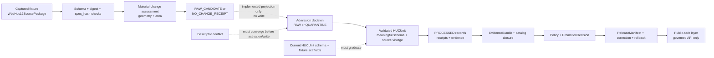

<!-- [KFM_META_BLOCK_V2]
doc_id: kfm://doc/adr-0026-hydrology-source-spine-starts-with-wbd-huc12
title: "ADR-0026 — Hydrology Source Spine Starts with WBD HUC12"
type: adr
adr_id: ADR-0026
version: v1.3
status: draft
owners:
  - "NEEDS VERIFICATION — architecture decision owner"
  - "NEEDS VERIFICATION — Hydrology lane steward"
  - "NEEDS VERIFICATION — source and evidence steward"
owner_status: "CODEOWNERS routes docs/adr/ and the affected trust-bearing roots to @bartytime4life; accepted stewardship, required-review rules, decision quorum, and independent approval controls were not verified"
reviewers_required:
  - Architecture steward
  - Docs steward
  - Hydrology lane steward
  - Source and evidence steward
  - Contract and schema steward
  - Policy reviewer
  - Release and rollback steward
created: 2026-05-09
updated: 2026-08-14
policy_label: public
truth_posture: cite-or-abstain
responsibility_root: docs/
current_path: docs/adr/ADR-0026-hydrology-source-spine-starts-with-wbd-huc12.md
supersedes: []
superseded_by: null
evidence_snapshot:
  repository: bartytime4life/Kansas-Frontier-Matrix
  base_ref: main
  base_commit: d64823aceca27858bdfb07483d7da4709a3717fa
  target_prior_blob: bc0d47a8beb0be6d1ff0b73b2731934cd7520c76
  adr_index_blob: 938c5894c36b99e14810918e2c550ab0e92d53b1
  directory_rules_adr_blob: a4de0d7a96b78da59cfc499d1025e1508afd8dd9
  canonical_wbd_placeholder_blob: fc0ee3ffb2c426cb560f41d6091d17d8d7213e5d
  legacy_wbd_descriptor_blob: e6164c255333be2d365cc1b292e5d88fff55df1a
  wbd_pipeline_spec_blob: a78c584ebb3d01c71a8f884e326945e7bda2309a
  wbd_ingest_contract_blob: dcde3825a18825a86439c484de417588ceee1256
  wbd_source_package_schema_blob: 7d699cb61384ecde5440cb93e221d2960e98621b
  wbd_ingest_candidate_schema_blob: 7f2eac7e87fcc98262dd674149d2316bf4f3b131
  wbd_ingest_workflow_blob: d087e5af0b7fe0a22f3b91c1ea2c9dd6df4ffd02
  wbd_material_change_contract_blob: 17dab94f35e519f11e850156a296821ff8178a47
  wbd_material_change_workflow_blob: e3edd2c98b708c170df84cef10d883d2c42b2b61
  wbd_material_change_receipt_blob: 7750b93197d13cd9a3235f69b128caf4201b7ce5
  wbd_ingest_candidate_receipt_blob: 08a57c15885360d2988a6dfc196a43c5ed007fce
related:
  - docs/adr/README.md
  - docs/adr/INDEX.md
  - docs/adr/ADR-0001-schema-home--schemas-contracts-v1-is-canonical.md
  - docs/adr/ADR-0009-hydrology-is-the-first-proof-bearing-lane.md
  - docs/adr/ADR-0011-receipts-vs-proofs-vs-manifests-vs-catalog-separation.md
  - docs/adr/ADR-0012-connector-outputs-to-data-raw-or-data-quarantine-only.md
  - docs/adr/ADR-0017-source-descriptor-admission-process.md
  - docs/adr/ADR-0018-promotion-gate-sequence.md
  - docs/adr/ADR-0020-abstain-is-a-first-class-decision.md
  - docs/adr/ADR-0025-public-client-never-reads-canonical-internal-stores.md
  - docs/adr/ADR-0029-adopt-directory-governance-standard-v2.md
  - docs/doctrine/directory-rules.md
  - docs/doctrine/lifecycle-law.md
  - docs/doctrine/truth-posture.md
  - docs/domains/hydrology/ARCHITECTURE.md
  - docs/domains/hydrology/SOURCE_REGISTRY.md
  - contracts/domains/hydrology/huc_unit.md
  - contracts/domains/hydrology/wbd_huc12_ingest_candidate.md
  - contracts/domains/hydrology/wbd_huc12_material_change_assessment.md
  - schemas/contracts/v1/domains/hydrology/huc_unit.schema.json
  - schemas/contracts/v1/domains/hydrology/wbd_huc12_source_package.schema.json
  - schemas/contracts/v1/domains/hydrology/wbd_huc12_ingest_candidate.schema.json
  - schemas/contracts/v1/domains/hydrology/wbd_huc12_material_change_assessment.schema.json
  - data/registry/sources/hydrology/wbd.source.yaml
  - data/registry/hydrology/sources/wbd_huc12.yaml
  - fixtures/domains/hydrology/valid/huc12_kansas_sample.json
  - fixtures/domains/hydrology/wbd_huc12_ingest/
  - fixtures/domains/hydrology/wbd_huc12_material_change/
  - pipeline_specs/hydrology/wbd_huc12_ingest.yaml
  - pipelines/domains/hydrology/ingest_wbd_huc/README.md
  - pipelines/domains/hydrology/ingest_wbd_huc/produce_wbd_huc12_candidate.py
  - tools/validators/domains/hydrology/wbd_huc12_material_change/
  - tests/pipelines/domains/hydrology/test_wbd_huc12_ingest_candidate.py
  - tests/validators/domains/hydrology/wbd_huc12_material_change/
  - .github/workflows/domain-hydrology.yml
  - .github/workflows/hydrology-wbd-huc12-ingest-candidate.yml
  - .github/workflows/hydrology-wbd-huc12-material-change.yml
  - data/receipts/generated/genrec-hydrology-wbd-huc12-ingest-candidate-20260807.json
  - data/receipts/generated/genrec-hydrology-wbd-huc12-material-change-20260806.json
  - docs/registers/DRIFT_REGISTER.md
  - docs/registers/VERIFICATION_BACKLOG.md
tags: [kfm, adr, hydrology, source-spine, source-registry, wbd, huc12, huc-unit, source-admission, material-change, evidence-first]
notes:
  - "v1.3 is a same-path repository-evidence refresh. It preserves draft source metadata and proposed effective decision status; it does not accept ADR-0026 or declare WBD HUC12 released or published."
  - "Since v1.2, deterministic no-network WBD HUC12 source-package, material-change, and ingest-candidate slices have been implemented with fixtures, schemas, validators, focused tests, workflows, and generated authoring receipts."
  - "Those slices stop at RAW_CANDIDATE or NO_CHANGE_RECEIPT projections. They perform no live WBD retrieval, source activation, lifecycle write, EvidenceBundle closure, promotion, release, deployment, or publication."
  - "The source-registry conflict remains: the implemented schemas and pipeline spec currently reference the richer legacy descriptor path while the Directory Rules-aligned source-registry family still contains a placeholder."
  - "The HUCUnit semantic contract remains substantive, while its paired machine schema and the general HUC12 fixture remain scaffolds. Source-edge candidate implementation therefore does not equal HUCUnit or source graduation."
[/KFM_META_BLOCK_V2] -->

<a id="top"></a>

# ADR-0026 — Hydrology Source Spine Starts with WBD HUC12

> **Proposed decision.** Within the Hydrology lane, the first source family to graduate into a governed, proof-capable source spine is the **USGS Watershed Boundary Dataset at HUC12 granularity**. WBD HUC12 supplies watershed accounting and boundary context; it does not supply flow observations, flood regulation, observed inundation, terrain truth, emergency guidance, or publication authority.

[](#status)
[](#implemented-fixture-first-slices)
[](#source-descriptor-path-conflict)
[](#hucunit-graduation-gaps)
[](#current-gate-status)
[](#authority-and-publication-boundary)

> [!IMPORTANT]
> **The ADR identity is confirmed; the decision remains proposed.** The canonical ADR index assigns `ADR-0026` to this exact file with source metadata `draft` and effective status `proposed`. Editing this record, opening a pull request, passing checks, or merging a documentation change does not accept the decision.

> [!NOTE]
> **Implementation has advanced since v1.2.** The repository now contains deterministic, fixture-first WBD HUC12 source-package validation, geometry-and-area material-change assessment, and ingest-candidate projection. The finite outputs are `RAW_CANDIDATE` or `NO_CHANGE_RECEIPT`; the implementation explicitly denies network access, source activation, lifecycle persistence, promotion, release, and publication.

> [!CAUTION]
> **Source authority remains conflicted.** `data/registry/sources/hydrology/wbd.source.yaml` is still a Directory Rules-aligned placeholder, while `data/registry/hydrology/sources/wbd_huc12.yaml` is the richer legacy-path descriptor referenced by the implemented source-package and candidate schemas. This ADR does not choose “both.” A separate reviewed migration must converge them without losing fields, identifiers, fixtures, hashes, or history.

> [!WARNING]
> **A source-edge candidate is not a graduated HUCUnit or released source.** The HUCUnit semantic contract remains substantive, but its paired schema and the general Kansas HUC12 fixture remain scaffolds. No verified run writes RAW, QUARANTINE, PROCESSED, CATALOG/TRIPLET, or PUBLISHED state, resolves an EvidenceBundle, produces release proof, or serves a public layer.

**Quick navigation:** [Status](#status) · [Evidence boundary](#evidence-boundary) · [Current evidence](#current-repository-evidence) · [Context](#context) · [Decision](#decision) · [Trust path](#wbd-huc12-trust-path) · [Current gates](#current-gate-status) · [Consequences](#consequences) · [Alternatives](#alternatives-considered) · [Acceptance](#acceptance-gates) · [Migration](#migration-plan) · [Rollback](#rollback) · [Validation](#validation) · [Open work](#open-questions) · [References](#references)

---

<a id="status"></a>

## Status

| Field | Current value |
|---|---|
| **ADR ID** | `ADR-0026` — unique and confirmed in the canonical [`INDEX.md`](./INDEX.md) |
| **Tracked path** | `docs/adr/ADR-0026-hydrology-source-spine-starts-with-wbd-huc12.md` |
| **Source metadata** | `draft` |
| **Effective decision status** | `proposed` — not binding until the record and index carry matching reviewed `accepted` status |
| **Decision class** | Hydrology lane-internal source ordering and first-source graduation |
| **Proposed spine head** | USGS WBD HUC12 |
| **Current implementation posture** | **PARTIAL / fixture-first:** source-package and candidate schemas, material-change validation, a candidate producer, synthetic fixtures, focused tests, dedicated workflows, and generated authoring receipts are implemented |
| **Current source-graduation posture** | **HOLD:** descriptor authority, current rights and endpoint review, HUCUnit shape, lifecycle writes, EvidenceBundle/catalog/proof closure, release, and rollback remain unresolved or unproven |
| **Publication effect** | None. This ADR, a pull request, a merge, a test, a generated authoring receipt, or a candidate projection is not KFM publication evidence |
| **Supersedes / superseded by** | None / none |
| **Evidence snapshot** | `main@d64823aceca27858bdfb07483d7da4709a3717fa` |

### Governance acceptance versus implementation states

This ADR separates three states:

1. **ADR acceptance** approves the architectural sequence: WBD HUC12 is the first Hydrology source family expected to graduate.
2. **Fixture-first source-edge implementation** validates captured packages and emits bounded candidate or no-change projections without network or lifecycle writes.
3. **Source graduation and release** require the complete evidence packet in [Implementation graduation gates](#implementation-graduation-gates).

A state at one layer does not confer a stronger state at another. A green candidate workflow cannot accept the ADR, activate a source, write lifecycle state, prove an EvidenceBundle, or publish a layer.

[Back to top](#top)

---

<a id="evidence-boundary"></a>

## Evidence Boundary

This revision is grounded in a pinned repository snapshot. It distinguishes tracked decision identity, configured surfaces, semantic meaning, machine enforcement, deterministic candidate execution, lifecycle proof, and released operation.

| Level | Meaning | Current WBD/HUC12 posture |
|---|---|---|
| **1. Tracked** | ADR identity, path, and proposed status are indexed | **CONFIRMED** |
| **2. Configured** | Relevant contracts, schemas, descriptors, fixtures, pipeline spec, producer, tests, receipts, and workflows exist | **CONFIRMED**, with source-registry conflict |
| **3. Semantically specified** | Source-edge objects and HUCUnit/source roles are bounded in prose | **PARTIAL**; source-edge contracts are explicit, HUCUnit contract is substantive, descriptor role vocabulary is not converged |
| **4. Source-edge shape-checked** | Captured packages, material-change assessments, and candidate outputs have machine schemas and negative fixtures | **CONFIRMED for the fixture-first slice** |
| **5. Deterministic candidate execution** | No-network execution emits `RAW_CANDIDATE` or `NO_CHANGE_RECEIPT` with stable reason codes | **CONFIRMED for supplied fixtures** |
| **6. Canonical HUCUnit shape and lifecycle proof** | A real HUCUnit fixture is enforced and governed runs write validated lifecycle artifacts and evidence | **HOLD** |
| **7. Released / operated** | Governed release and public-safe serving are demonstrated with correction and rollback | **UNKNOWN / not evidenced** |

### Truth labels used in this ADR

- **CONFIRMED** — verified at the pinned repository snapshot.
- **PROPOSED** — the architectural decision or implementation target under review.
- **CONFLICTED** — repository surfaces compete or disagree and require explicit reconciliation.
- **NEEDS VERIFICATION** — a concrete check remains before reliance.
- **UNKNOWN** — current evidence cannot establish the claim.
- **HOLD** — a stronger state is blocked by known missing or conflicted evidence.

[Back to top](#top)

---

<a id="current-repository-evidence"></a>

## Current Repository Evidence

### Decision and placement controls

- [`docs/adr/INDEX.md`](./INDEX.md) assigns `ADR-0026` to this exact path with effective status `proposed` and source metadata `draft`.
- [`ADR-0029`](./ADR-0029-adopt-directory-governance-standard-v2.md) is the accepted Directory Rules v2 decision. The same-path ADR update remains under the established `docs/adr/` responsibility root and creates no new authority surface.
- [`docs/doctrine/directory-rules.md`](../doctrine/directory-rules.md) separates human decisions, semantic contracts, machine schemas, source registry entries, fixtures, executable pipelines, declarative specs, lifecycle data, and release decisions by responsibility root.
- [`.github/CODEOWNERS`](../../.github/CODEOWNERS) is a review-routing mechanism. It does not prove accepted stewardship, decision quorum, independent review, or release authority.

<a id="source-descriptor-path-conflict"></a>

### Source descriptor path conflict

| Surface | Verified state | Consequence |
|---|---|---|
| `data/registry/sources/hydrology/wbd.source.yaml` | `PROPOSED` placeholder in the Directory Rules-aligned source-registry family | Confirms the intended responsibility family but is not a usable WBD HUC12 descriptor |
| `data/registry/hydrology/sources/wbd_huc12.yaml` | Richer proposed descriptor with authority, rights, cadence, access, citation, and receipt-template fields | Supplies current fixture-first `source_descriptor_ref`, but lives in the legacy path and uses non-converged `role: primary` vocabulary |
| WBD source-package and candidate schemas | Both require `data/registry/hydrology/sources/wbd_huc12.yaml` | The implemented slice now has an explicit migration dependency; descriptor convergence must update schema constants, fixtures, producer expectations, tests, receipts, and docs atomically |
| `docs/domains/hydrology/SOURCE_REGISTRY.md` | Human source-role and registry guidance | Supports one source authority; does not itself migrate files or settle the machine enum |

**Required posture:** do not create a third descriptor, do not treat both current files as co-canonical, and do not delete or redirect either surface without a dependency-closed migration and rollback record.

<a id="implemented-fixture-first-slices"></a>

### Implemented fixture-first slices

| Surface | Verified state | What it proves | What it does not prove |
|---|---|---|---|
| `contracts/domains/hydrology/wbd_huc12_ingest_candidate.md` | Implemented fixture-first semantic contract | Captured-package and candidate meanings, finite dispositions, and non-authority boundary | Live retrieval, lifecycle write, source admission, or release |
| `wbd_huc12_source_package.schema.json` | Draft 2020-12 object schema with closed properties and governance constants | Captured request/response package shape, HUC12 string, digest, HTTP 200/304 constraints, and no-network/no-write declarations | Authenticity of captured bytes or current service behavior |
| `wbd_huc12_ingest_candidate.schema.json` | Closed candidate-output schema | Stable candidate identity, request evidence, allowed finite dispositions, reason codes, and declared possible RAW/QUARANTINE targets while `writes_targets: false` | That either lifecycle target was selected or written |
| `wbd_huc12_material_change_assessment.md` and paired schema | Fixture-only material-change contract and machine shape | Geometry normalization, geometry-plus-area fingerprinting, metadata-churn suppression, and `NO_CHANGE`/`MATERIAL_CHANGE`/`ADD`/`REMOVE` outcomes | Full WBD semantic change, source rights, or downstream impact analysis |
| `produce_wbd_huc12_candidate.py` | Executable no-network producer | Deterministic projection from one bounded captured package to one candidate/no-change object | Connector behavior, source activation, persistence, promotion, or publication |
| Fixture matrices | Synthetic valid and invalid packages and material-change cases | Metadata churn, add, remove, geometry change, HTTP 304, duplicate-HUC failure, and fail-closed input handling | A rights-reviewed canonical Kansas HUCUnit release fixture |
| Focused tests | Executable producer and material-change validation tests | Deterministic output, digest/spec-hash binding, finite outcomes, no overwrite, and failure polarity | Repository-wide source graduation or release readiness |
| Dedicated workflows | Read-only, no-network CI for candidate and material-change slices | The focused commands and generated-receipt bindings are reproducibly checked when their path filters trigger | ADR acceptance, live-source currentness, lifecycle proof, or publication |
| Generated authoring receipts | Artifact-path and hash bindings for the two implementation slices | Which repository bytes comprised each authored slice | Evidence truth, policy approval, proof closure, PromotionDecision, or ReleaseManifest |

<a id="hucunit-graduation-gaps"></a>

### HUCUnit and source-graduation gaps

| Surface | Current state | Blocking consequence |
|---|---|---|
| `contracts/domains/hydrology/huc_unit.md` | Substantive draft semantic contract | Meaning is available for review, but not accepted machine enforcement |
| `schemas/contracts/v1/domains/hydrology/huc_unit.schema.json` | Scaffold with empty `properties` and permissive additional properties | Cannot reject invalid canonical HUCUnit records or enforce source-vintage/evidence/release fields |
| `fixtures/domains/hydrology/valid/huc12_kansas_sample.json` | Placeholder | Does not prove a valid HUCUnit, geometry, WBD snapshot, provenance, or schema conformance |
| Live WBD retrieval | Not implemented in the candidate slice | Endpoint, layer, conditional-request behavior, terms, cadence, and captured-byte authenticity remain unverified |
| Lifecycle orchestration | Denied by current spec | No RAW or QUARANTINE object is written, so no governed promotion path is exercised |
| Evidence and catalog | Not emitted by the candidate slice | No EvidenceRef-to-EvidenceBundle closure or STAC/DCAT/PROV agreement is demonstrated |
| Release and rollback | Not emitted by the candidate slice | No PromotionDecision, ReleaseManifest, CorrectionNotice, RollbackCard, or public-safe artifact exists |

<a id="authority-and-publication-boundary"></a>

### Authority and publication boundary

WBD HUC12 remains watershed accounting and boundary context. It is not automatically:

- an observed flow, stage, water-quality, or flood record;
- a FEMA regulatory flood determination;
- observed inundation;
- a terrain-derived hydrology model;
- emergency, engineering, insurance, navigation, or life-safety guidance;
- an accepted source descriptor, canonical HUCUnit dataset, released layer, or KFM-published claim.

[Back to top](#top)

---

<a id="context"></a>

## Context

KFM designates Hydrology as the proposed first proof-bearing lane in [`ADR-0009`](./ADR-0009-hydrology-is-the-first-proof-bearing-lane.md). The lane needs a first source family whose identity, geometry, fixtures, validation, evidence, and release path are small enough to close without simultaneously solving time-series qualifiers, regulatory/observed flood separation, or network-identity ambiguity.

| Candidate spine head | Source class | Why it could lead | Why it increases first-slice burden |
|---|---|---|---|
| **WBD HUC12** | Watershed boundary authority/context | Deterministic public boundary units, compact fixture potential, stable aggregation context, geometry-fingerprint testability | Does not exercise observation qualifiers; descriptor and canonical HUCUnit authority still require convergence |
| **NHDPlus HR** | Network identity and model/context | Anchors reach identity and flow topology | COMID/Permanent Identifier splits, merges, retirement, and ambiguity require explicit ABSTAIN behavior |
| **USGS Water Data / NWIS** | Observation | Exercises time series and monitoring locations | Requires parameter codes, units, qualifiers, provisional/final status, timestamps, time zones, and no-data semantics |
| **FEMA NFHL** | Regulatory flood context | Recognizable and user-relevant | Easy to collapse into observed inundation or predictive truth without a separate source-role decision |
| **USGS 3DEP** | Terrain/model input | Enables catchment and terrain derivatives | Derived input, not authoritative water-entity identity |
| **Observed flood evidence** | Historical/event evidence | Supports event reconstruction | Confidence, correction lineage, location exposure, and source-role separation materially increase risk |

The fixture-first candidate slice strengthens the case that WBD HUC12 is buildable, but it does not satisfy the source-graduation or release burden.

---

## Scope and Non-Decisions

This ADR decides one architectural question:

> **When the Hydrology lane graduates its first source family, WBD HUC12 leads the source spine.**

It does **not** decide or perform:

- acceptance of ADR-0026;
- connector activation or live source retrieval;
- current WBD endpoint behavior, terms, attribution, layer identity, or cadence;
- the final machine enum for WBD source role;
- the final canonical descriptor leaf filename;
- schema field names beyond the reviewed HUCUnit contract;
- the canonical HUCUnit release fixture, watershed, extent, or source snapshot;
- lifecycle target selection or persistence for `RAW_CANDIDATE`;
- NHDPlus identity ambiguity policy;
- NFHL versus observed-flood source-role policy;
- governed API routes, UI components, or runtime DTO names;
- EvidenceBundle, proof, catalog, release, deployment, or publication;
- migration of the two existing descriptor surfaces in this documentation-only change.

---

## Forces

- **Trust membrane.** Public clients must not read canonical or internal stores.
- **Cite-or-abstain.** Ambiguous identity and unresolved source-role claims must abstain rather than guess.
- **Source-role separation.** WBD boundary context must not collapse into observation, regulation, model output, or emergency guidance.
- **Determinism.** HUC12 identity, source package, geometry normalization, content digest, and replay inputs must be inspectable.
- **Small no-network proof.** Synthetic fixtures must exercise deterministic behavior without live-source dependence.
- **Directory governance.** One source-registry authority and one HUCUnit machine-schema authority must be preserved.
- **Reversibility.** Descriptor migration, fixture updates, source refreshes, candidate writes, and releases need correction and rollback paths.
- **Evidence before polish.** A badge, map layer, document, workflow, generated authoring receipt, or candidate object cannot substitute for source, evidence, policy, review, proof, and release closure.

---

<a id="decision"></a>

## Decision

If accepted, KFM will apply the following rules.

### 1. WBD HUC12 leads Hydrology source graduation

WBD HUC12 is the first Hydrology source family permitted to advance toward a proof-bearing spatial spine. Other source families may retain planning or fixture scaffolds, but they must not be presented as the lane's published spatial anchor before WBD HUC12 satisfies the implementation graduation gates.

### 2. Reuse the existing HUCUnit authority

- Human object meaning remains in [`contracts/domains/hydrology/huc_unit.md`](../../contracts/domains/hydrology/huc_unit.md).
- Machine shape remains in [`schemas/contracts/v1/domains/hydrology/huc_unit.schema.json`](../../schemas/contracts/v1/domains/hydrology/huc_unit.schema.json).
- This ADR **does not authorize** a competing `huc12.schema.json`.
- HUC12 is a level of `HUCUnit`, not a parallel canonical object family, unless a later accepted ADR proves a distinct bounded type is necessary.

The implemented `WbdHuc12SourcePackage`, `WbdHuc12MaterialChangeAssessment`, and `WbdHuc12IngestCandidate` are source-edge/control objects. They do not replace `HUCUnit`.

### 3. Converge WBD descriptor authority before activation or lifecycle writes

The accepted Directory Rules establish the source-registry responsibility under `data/registry/`; current repo evidence still contains two competing WBD surfaces. A separate migration must:

1. preserve useful fields, source identity, and commit lineage;
2. select one canonical descriptor under the verified source-registry family;
3. update hard-coded schema constants, pipeline spec references, fixtures, producer expectations, tests, receipts, and docs in one dependency-closed change;
4. classify any temporary compatibility path explicitly and prohibit independent evolution;
5. record validation, drift resolution, correction behavior, and rollback target.

The leaf `wbd_huc12.yaml` under the canonical source-registry family remains **PROPOSED** until the migration verifies naming and the SourceDescriptor contract.

### 4. Keep WBD's source role bounded

The semantic role is **watershed boundary authority/context for accounting and aggregation**. The exact machine vocabulary remains **NEEDS VERIFICATION** because current surfaces use non-converged terms such as `primary`, authority, and context.

Whatever enum is adopted, WBD HUC12 must not be promoted as:

- an observation;
- regulatory flood authority;
- observed inundation;
- a terrain/model output;
- emergency or life-safety authority.

### 5. Treat the implemented candidate slice as admission input only

The current no-network producer may emit:

- `NO_CHANGE_RECEIPT / HTTP_NOT_MODIFIED`;
- `NO_CHANGE_RECEIPT / CONTENT_UNCHANGED`;
- `RAW_CANDIDATE / FEATURE_ADDED`;
- `RAW_CANDIDATE / FEATURE_REMOVED`; or
- `RAW_CANDIDATE / FEATURE_MATERIAL_CHANGE`.

A `RAW_CANDIDATE` is only a candidate for a separately governed choice between the declared RAW and QUARANTINE lanes. The producer must not select or write either target, and no downstream stage may infer source admission merely from candidate validity.

### 6. Detect material change through normalized content

Material-change decisions use reviewed normalized geometry and area rather than source metadata churn. The current fixture profile canonicalizes Polygon/MultiPolygon geometry, validates bounds and ring structure, rounds geometry and area, and excludes retrieval metadata from feature identity.

Before live-source use, maintainers must confirm that the normalization profile is sufficient for the actual WBD representation, source-vintage behavior, and downstream invalidation burden.

### 7. Preserve downstream source order

After WBD HUC12 graduates, the proposed lane sequence is:

1. **NHDPlus HR** — reach/network identity with explicit ambiguity and ABSTAIN behavior.
2. **USGS Water Data / NWIS** — observations with parameter, unit, qualifier, approval, time, and no-data semantics.
3. **FEMA NFHL** — regulatory flood context, explicitly separated from observed inundation.
4. **USGS 3DEP** — terrain/model input with derivative manifests.
5. **Observed flood evidence** — historical/event evidence with confidence and correction lineage.

A deviation requires an amending or superseding ADR with stronger evidence.

### Conformance language

- The Hydrology lane **MUST NOT** maintain parallel canonical WBD descriptors.
- The Hydrology lane **MUST NOT** create a parallel HUC12 machine schema while `huc_unit.schema.json` is the tracked HUCUnit schema authority.
- Source-edge package, assessment, candidate, receipt, fixture, and workflow objects **MUST NOT** be represented as HUCUnit evidence, source admission, proof, release, or publication.
- WBD HUC12 **MUST NOT** be represented as observation, regulation, observed inundation, terrain/model output, or life-safety authority.
- A real HUCUnit fixture **MUST** validate against a meaningful schema and carry source snapshot, digest, provenance, and temporal scope.
- A promotion candidate **MUST** close source identity, rights, source role, schema, evidence, policy, catalog, review, release, correction, and rollback gates.
- A gate that did not run **MUST NOT** be reported as passed.
- Watchers, readiness workflows, generated authoring receipts, documentation, commits, pull requests, and candidate projections **MUST NOT** publish.

[Back to top](#top)

---

## Directory Rules Placement Basis

ADR-0029 accepts Directory Rules v2 and confirms this same-path document's owning root. This update changes no path or authority boundary.

| Surface | Responsibility | Verified or intended home | Current posture |
|---|---|---|---|
| ADR | Human decision record | `docs/adr/ADR-0026-hydrology-source-spine-starts-with-wbd-huc12.md` | **CONFIRMED path** |
| Hydrology source registry guide | Human source-role and admission reference | `docs/domains/hydrology/SOURCE_REGISTRY.md` | **CONFIRMED path** |
| WBD source descriptor | Source identity, rights, cadence, role, activation posture | One canonical leaf under the verified `data/registry/` source family | **CONFLICTED**; placeholder and legacy-path descriptor coexist |
| HUCUnit meaning | Semantic contract | `contracts/domains/hydrology/huc_unit.md` | **CONFIRMED draft path** |
| HUCUnit shape | Machine schema | `schemas/contracts/v1/domains/hydrology/huc_unit.schema.json` | **CONFIRMED scaffold path** |
| Source-edge meanings | Package, assessment, and candidate contracts | `contracts/domains/hydrology/` | **CONFIRMED implemented paths** |
| Source-edge shapes | Package, assessment, and candidate schemas | `schemas/contracts/v1/domains/hydrology/` | **CONFIRMED implemented paths** |
| Executable candidate projection | Deterministic transformation of captured fixtures | `pipelines/domains/hydrology/ingest_wbd_huc/` | **CONFIRMED implemented fixture-first path** |
| Declarative candidate spec | No-network inputs, outputs, boundaries, and test command | `pipeline_specs/hydrology/wbd_huc12_ingest.yaml` | **CONFIRMED fixture-first implementation; live orchestration remains proposed** |
| Reusable fixture inputs | Synthetic positive and negative cases | `fixtures/domains/hydrology/wbd_huc12_*` | **CONFIRMED for source-edge slices** |
| Canonical HUCUnit fixture | Representative domain object | `fixtures/domains/hydrology/valid/huc12_kansas_sample.json` or a reviewed successor under fixture conventions | **HOLD / placeholder** |
| Validation | Focused validators and tests | `tools/validators/domains/hydrology/` and `tests/` | **CONFIRMED for material-change and candidate slices; broader graduation checks missing** |
| Lifecycle material | RAW, WORK/QUARANTINE, PROCESSED, CATALOG/TRIPLET, PUBLISHED | `data/<phase>/hydrology/` | **NOT EMITTED by current slice** |
| Release decisions | Promotion, manifest, correction, rollback | `release/` | **NOT EMITTED** |

> [!NOTE]
> A verified responsibility root does not make every proposed leaf real. New, moved, or renamed paths require their own scoped dependency review, validation, and rollback.

---

<a id="wbd-huc12-trust-path"></a>

## WBD HUC12 Trust Path


```mermaid
flowchart LR
    A["Captured fixture<br/>WbdHuc12SourcePackage"] --> B["Schema + digest + spec_hash checks"]
    B --> C["Material-change assessment<br/>geometry + area"]
    C --> D["RAW_CANDIDATE or<br/>NO_CHANGE_RECEIPT"]

    D -. "implemented projection only;<br/>no write" .-> E["Admission decision<br/>RAW or QUARANTINE"]
    E --> F["Validated HUCUnit<br/>meaningful schema + source vintage"]
    F --> G["PROCESSED records<br/>receipts + evidence"]
    G --> H["EvidenceBundle + catalog closure"]
    H --> I["Policy + PromotionDecision"]
    I --> J["ReleaseManifest + correction + rollback"]
    J --> K["Public-safe layer<br/>governed API only"]

    X["Descriptor conflict"] -. "must converge before activation/write" .-> E
    Y["Current HUCUnit schema + fixture scaffolds"] -. "must graduate" .-> F
```

The solid A-to-D path is implemented for synthetic fixtures. The D-to-K path remains separately governed and unproven. No arrow is a file move, UI toggle, documentation claim, generated receipt, or AI conclusion.

---

<a id="current-gate-status"></a>

## Current Gate Status

| Gate | Current status | Evidence |
|---|---|---|
| ADR identity and numbering | **PASS** | Canonical index uniquely assigns ADR-0026 |
| ADR acceptance | **PENDING / proposed** | Source metadata remains `draft`; effective status remains `proposed` |
| ADR path placement | **PASS** | Existing file remains under `docs/adr/`; ADR-0029 accepts Directory Rules v2 |
| Source descriptor authority | **CONFLICTED** | Placeholder canonical-family file and richer legacy-path descriptor coexist; implemented schemas reference the legacy path |
| Current rights, terms, endpoint, layer, and cadence | **NEEDS VERIFICATION** | Descriptor assertions and captured fixtures are not a current official-source activation review |
| Source-package schema and fixtures | **PASS for fixture-first scope** | Closed schema, HTTP 200/304 constraints, digest/spec-hash checks, positive and negative fixtures |
| Material-change assessment | **PASS for fixture-first scope** | Deterministic geometry-plus-area profile, validator, tests, workflow, generated authoring receipt |
| Ingest-candidate projection | **PASS for fixture-first scope** | Producer, schema, finite dispositions/reason codes, tests, workflow, generated authoring receipt |
| Live WBD retrieval and source activation | **HOLD / not implemented** | Current implementation explicitly denies network access and source activation |
| Lifecycle target decision and persistence | **HOLD / not implemented** | Candidate declares possible RAW/QUARANTINE targets but writes neither |
| HUCUnit semantic contract | **PARTIAL** | Substantive draft contract exists |
| HUCUnit machine schema | **HOLD** | Empty properties and permissive additional properties |
| Canonical Kansas HUC12 HUCUnit fixture | **HOLD** | General fixture remains a placeholder |
| EvidenceBundle and catalog closure | **HOLD / UNKNOWN** | No representative HUC12 proof packet verified |
| Policy, promotion, release, correction, rollback | **HOLD / UNKNOWN** | No governed WBD HUC12 release packet verified |
| Public serving | **NONE** | No KFM publication evidence |

A dedicated workflow or authoring-receipt validation proves only the bounded fixture-first implementation it names. It does not upgrade any source-admission, lifecycle, evidence, policy, release, or publication gate.

---

<a id="consequences"></a>

## Consequences

### Positive

- Establishes one conservative spatial anchor for later Hydrology sources.
- Reuses the existing HUCUnit domain model instead of creating a competing canonical HUC12 schema family.
- Converts the first source-edge slice from placeholder-only planning into deterministic no-network implementation.
- Exercises bounded request evidence, body digest, `spec_hash`, finite outcomes, geometry normalization, metadata-churn suppression, and fail-closed validation.
- Makes the descriptor migration blast radius visible before live retrieval or lifecycle consumers depend on it.
- Keeps NFHL regulatory context, NWIS observations, network identity, terrain derivatives, and observed flood evidence semantically separate.
- Gives later MapLibre and API work a possible accounting layer without making the renderer or candidate projection a truth source.

### Negative and trade-offs

- The implemented slice does not exercise observation qualifiers, provisional/final states, or time-series no-data behavior.
- The schemas currently bind to the legacy descriptor path, so convergence now requires coordinated schema, fixture, producer, test, receipt, and documentation changes.
- The material-change profile intentionally ignores metadata-only churn and compares geometry plus area; broader semantic or service-level change detection remains unproven.
- A source-edge candidate adds useful implementation surface without proving source authenticity, HUCUnit shape, evidence closure, or release readiness.
- A real HUCUnit fixture may expose source-snapshot, hierarchy, geometry, and canonicalization questions not represented by the candidate fixtures.
- Live WBD use remains blocked until endpoint, terms, attribution, cadence, and activation controls are verified.

### Neutral

- The first public candidate would be watershed accounting/context, not a gauge, flood, or terrain layer.
- Accepting this ADR would approve sequencing only; implementation, source graduation, and release remain separately gated.

---

<a id="alternatives-considered"></a>

## Alternatives Considered

### A — Start with NHDPlus HR

**Rejected for the first slice.** It introduces reach-identity splits, merges, retirement, and ambiguous crosswalks before the lane has executable ABSTAIN policy.

### B — Start with USGS Water Data / NWIS

**Rejected for the first slice.** It requires observation semantics, parameter codes, units, qualifiers, approval state, timestamps, time zones, and no-data outcomes in the same proof packet.

### C — Start with FEMA NFHL

**Rejected for the first slice.** NFHL is regulatory flood context, not observed inundation or prediction. Leading with it increases source-role collapse risk.

### D — Start with USGS 3DEP or terrain-derived hydrology

**Rejected.** Terrain is a derivative/model input, not the authoritative Hydrology accounting identity.

### E — Admit any Hydrology source first

**Rejected.** Without a designated spatial spine, downstream sources choose incompatible join keys and silently accumulate identity drift.

### F — Treat `WbdHuc12IngestCandidate` as the canonical HUCUnit

**Rejected.** The candidate is a source-admission projection with explicit no-write and no-publish boundaries. It is not the canonical domain object.

### G — Create a new HUC12-specific canonical schema beside HUCUnit

**Rejected by current repository evidence.** The repository already has a HUCUnit semantic contract and tracked machine schema. A second canonical HUC12 authority would create parallel machine meaning unless a later ADR proves a separate bounded type is necessary.

---

<a id="acceptance-gates"></a>

## Acceptance Gates

### Governance acceptance gates

ADR-0026 may move from `proposed` to `accepted` only when:

- [ ] The record and canonical index are updated together with matching reviewed status.
- [ ] Named decision owners and reviewers are verified; CODEOWNERS routing is not treated as approval.
- [ ] The WBD-first sequence and its non-decisions are explicitly reviewed.
- [ ] The descriptor-path conflict has an approved migration disposition or a bounded blocking plan.
- [ ] The decision confirms reuse of the HUCUnit contract/schema family or records a reviewed alternative.
- [ ] The source-role semantic boundary is approved without pretending the machine enum is already settled.
- [ ] Alternatives, consequences, migration impact, and rollback remain complete.
- [ ] No source activation, lifecycle write, proof, release, or publication claim is bundled into the acceptance transition without separate evidence.

<a id="implementation-graduation-gates"></a>

### Implementation graduation gates

Repository evidence currently closes only the checked fixture-first gates. WBD HUC12 may graduate beyond source-edge candidate status only when all remaining gates close.

- [x] Captured source packages have a bounded schema with deterministic digest and `spec_hash` validation.
- [x] Synthetic positive and negative packages exercise HTTP 200/304, add, remove, material change, metadata churn, and duplicate-HUC failure.
- [x] Geometry-plus-area material-change assessment is deterministic for the reviewed fixture profile.
- [x] Candidate projection has finite dispositions and reason codes and performs no lifecycle write.
- [x] Focused tests and no-network workflows validate the two fixture-first slices.
- [ ] Exactly one canonical WBD descriptor exists under the verified source-registry authority; any compatibility path is explicit and non-evolving.
- [ ] Current source rights, terms, attribution, endpoint, service layer, cadence, steward, and activation posture are verified.
- [ ] `huc_unit.schema.json` enforces reviewed HUC identity, level, source snapshot, temporal scope, hierarchy, geometry/digest, evidence, policy, release, correction, and rollback fields.
- [ ] Invalid HUCUnit fixtures are rejected and a pinned Kansas HUC12 HUCUnit fixture passes.
- [ ] Live or manually governed retrieval authenticates and captures source bytes with a SourceDescriptor and retrieval receipt.
- [ ] A separate admission decision writes only to RAW or QUARANTINE and records its reason and rollback target.
- [ ] Deterministic no-network replay emits validated RAW, WORK/QUARANTINE, and PROCESSED artifacts with receipts.
- [ ] EvidenceRef resolves to EvidenceBundle for representative HUC12 claims.
- [ ] STAC, DCAT, PROV, and any CatalogMatrix surface agree.
- [ ] Policy and PromotionDecision gates run fail closed.
- [ ] ReleaseManifest, correction path, and RollbackCard exist before public serving.
- [ ] Public clients use governed APIs or released artifacts, never canonical/internal stores.
- [ ] Hosted exact-head checks and any required-check coupling are verified for the graduated capability.

---

<a id="migration-plan"></a>

## Migration Plan

This ADR update changes only Markdown. Source registry and machine surfaces require separate dependency-closed work.

### 1. Descriptor convergence

1. Pin both descriptor blobs and inventory every inbound reference.
2. Compare fields against the current SourceDescriptor contract, Hydrology source-role matrix, rights policy, and activation workflow.
3. Select one canonical descriptor under the verified source-registry family.
4. Update hard-coded `source_descriptor_ref` constants in source-package/candidate schemas, the pipeline spec, fixtures, producer/test expectations, generated-receipt bindings, and docs in one change.
5. Preserve a compatibility file only when a concrete consumer requires it; declare canonical target, non-evolution rule, and retirement condition.
6. Run path, schema, fixture, test, receipt, link, and workflow validation and record rollback.

### 2. HUCUnit graduation

1. Reconcile the semantic contract's proposed fields with the current schema authority.
2. Add valid and invalid HUCUnit fixtures independent of source-edge package fixtures.
3. Implement validators for identity, level, source snapshot, hierarchy, temporal scope, geometry/digest, source role, evidence, policy, and release references.
4. Keep candidate and canonical HUCUnit object families distinct.

### 3. Governed source and lifecycle slice

1. Verify current official source endpoint, service layer, terms, attribution, cadence, and conditional-request behavior.
2. Add or admit a retrieval mechanism without bypassing source activation.
3. Implement an explicit admission decision that writes only to RAW or QUARANTINE.
4. Close evidence, catalog, policy, review, release, correction, and rollback in separate bounded increments.

No migration, source activation, lifecycle write, or release is authorized by this one-file documentation pull request.

---

<a id="rollback"></a>

## Rollback

### Documentation update rollback

Before merge, close or abandon the draft PR and branch. After merge, revert the documentation commit through a transparent revert PR. Do not rewrite shared history. The prior target blob is recorded in the meta block.

### Decision and implementation rollback

| Failure condition | Rollback action | Evidence to retain |
|---|---|---|
| ADR status changes without reviewed acceptance | Restore `proposed`; reconcile index and record | Review history, index diff, correction note |
| Descriptor migration loses fields or breaks consumers | Restore pinned descriptors and prior constants; reopen conflict | Blob hashes, reference inventory, migration report |
| Two descriptors continue evolving | Freeze both; keep source inactive; return to HOLD | Drift entry, activation decisions |
| Candidate is mistaken for source admission or HUCUnit | Quarantine or discard downstream objects; correct docs and consumers | Candidate/spec hashes, decision records, correction note |
| HUCUnit schema rejects valid records incorrectly | Revert schema and fixtures together; retain failing cases | Schema hash, fixture hashes, validation report |
| Geometry fingerprint is unstable or incomplete | Hold candidate use; restore prior normalization profile | Canonicalization config, hashes, reviewer diff |
| WBD role is used as observation, regulation, or event truth | Withdraw affected claims/layers; issue correction if exposed | EvidenceBundle diff, PolicyDecision, CorrectionNotice |
| Non-HUC12 source is promoted as the lane anchor first | Revert candidate and dependent artifacts; mark them stale | PromotionDecision, ReleaseManifest, RollbackCard |
| Public client reads canonical/internal WBD stores | Disable route or layer; restore governed boundary | Access logs where permitted, incident/correction record |

A future source release must identify the preceding reviewed descriptor, source snapshot, processed artifact, ReleaseManifest, correction state, and cache invalidation target.

---

<a id="validation"></a>

## Validation

### Documentation validation

- One H1 and matching `ADR-0026` filename/H1 identity.
- Stable `doc_id`, created date, path, and ADR number preserved.
- Source metadata remains `draft`; effective decision status remains `proposed`.
- Current implementation claims are pinned to repository paths and bounded to fixture-first behavior.
- Candidate, HUCUnit, receipt, proof, catalog, promotion, release, and publication object families remain distinct.
- Related ADR and repository links use tracked paths.
- Badge claims are repeated in text and supported by current repository evidence.
- Mermaid shows implemented and unproven segments separately.
- No placeholder owner is converted into a verified steward.
- No volatile external endpoint, terms, cadence, or rights claim is presented as current operational truth.

### Repository-native validation

Run from repository root:

```bash
python tools/validators/validate_adr_index.py
python -m pytest tests/validators/test_validate_adr_index.py -q --strict-config --strict-markers
```

The implementation slices have their own focused commands:

```bash
python -m pytest \
  tests/pipelines/domains/hydrology/test_wbd_huc12_ingest_candidate.py \
  tests/validators/domains/hydrology/wbd_huc12_material_change/test_validate_wbd_huc12_material_change.py \
  -q --strict-config --strict-markers
```

This docs-only change does not modify those implementation surfaces, and their path-filtered workflows may not run for this ADR path. Any hosted check must be reported by exact head SHA and exact scope; a green result does not accept the ADR or prove source graduation.

---

## Risks

| Risk | Current control | Remaining action |
|---|---|---|
| Fixture-first slice is mistaken for source graduation | Explicit finite outputs and non-effects in contracts/spec/workflows | Enforce admission and lifecycle boundaries in downstream orchestrators |
| Parallel WBD descriptor authority | Conflict and hard-coded legacy references are explicit | Dependency-closed migration with compatibility and rollback plan |
| Generated authoring receipt is mistaken for proof | ADR-0011 separation and workflow summaries | Keep proof, policy, promotion, and release object families separate |
| HUCUnit schema appears stronger than it is | Scaffold status is visible | Add reviewed fields and invalid fixtures |
| Candidate fixtures are mistaken for canonical HUCUnit data | Object-family boundary is explicit | Add separate HUCUnit fixture family and validators |
| Metadata-only or service-level change is missed | Geometry-plus-area fingerprint scope is explicit | Add source-head/service-profile checks before live activation |
| Geometry hash changes across tools | Current normalization profile is deterministic for fixtures | Verify actual WBD encoding, precision, topology, and cross-tool test vectors |
| External facts become stale | Endpoint/terms/cadence remain NEEDS VERIFICATION | Current official-source review before activation |
| Acceptance is confused with implementation | Separate governance and graduation gates | Keep human review and implementation evidence distinct |
| Map layer becomes truth authority | Governed API and EvidenceBundle boundary | Add click-to-evidence and release-manifest tests before serving |

---

<a id="open-questions"></a>

## Open Questions

- **NEEDS VERIFICATION:** Which SourceDescriptor semantic contract and machine schema govern the descriptor migration?
- **NEEDS VERIFICATION:** What canonical leaf filename and identifier should replace the two current WBD surfaces?
- **NEEDS VERIFICATION:** Which machine source-role enum represents watershed boundary authority/context without collapsing into observation, regulation, or model output?
- **NEEDS VERIFICATION:** Which current official WBD endpoint, service layer, terms, attribution posture, update cadence, and conditional-request behavior are valid at activation time?
- **NEEDS VERIFICATION:** What reviewed field set turns `huc_unit.schema.json` from scaffold into enforceable canonical shape?
- **NEEDS VERIFICATION:** Which Kansas HUC12 source snapshot and extent form the smallest meaningful canonical HUCUnit positive/negative fixture set?
- **NEEDS VERIFICATION:** Is the current six-decimal geometry-and-area normalization sufficient for actual WBD source representation and downstream invalidation?
- **NEEDS VERIFICATION:** Which orchestrator owns the explicit RAW-versus-QUARANTINE admission decision and associated receipt?
- **NEEDS VERIFICATION:** Which additional validators close HUCUnit identity, hierarchy, temporal, evidence, catalog, policy, and release gates?
- **UNKNOWN:** Which independent reviewers will satisfy decision acceptance and release separation of duties?
- **UNKNOWN:** Whether any governed WBD HUC12 lifecycle, proof, or release packet exists outside the inspected repository surfaces.

---

## Changelog

| Version | Date | Change |
|---|---|---|
| `v1.3` | 2026-08-14 | Reconciles the ADR with current main: records implemented no-network source-package, material-change, and ingest-candidate slices; preserves proposed decision status; separates candidate implementation from HUCUnit/source graduation; expands descriptor-migration dependencies, gates, risks, validation, and rollback. |
| `v1.2` | 2026-07-24 | Same-path repository-grounded modernization; identified descriptor conflict and HUCUnit/schema/fixture/pipeline placeholder posture. |
| Earlier | 2026-05-09 to 2026-07-23 | Initial proposed WBD HUC12 source-spine decision and subsequent documentation refinements. |

---

<a id="references"></a>

## References

| Reference | Role |
|---|---|
| [`docs/adr/INDEX.md`](./INDEX.md) | Confirms ADR-0026 identity, draft source metadata, and proposed effective status |
| [`docs/adr/README.md`](./README.md) | ADR operating contract, lifecycle, review, and validation |
| [`ADR-0001`](./ADR-0001-schema-home--schemas-contracts-v1-is-canonical.md) | Proposed canonical machine-schema home |
| [`ADR-0009`](./ADR-0009-hydrology-is-the-first-proof-bearing-lane.md) | Proposed Hydrology-first proof sequencing |
| [`ADR-0011`](./ADR-0011-receipts-vs-proofs-vs-manifests-vs-catalog-separation.md) | Receipt, proof, manifest, and catalog separation |
| [`ADR-0012`](./ADR-0012-connector-outputs-to-data-raw-or-data-quarantine-only.md) | Proposed source-edge lifecycle boundary |
| [`ADR-0017`](./ADR-0017-source-descriptor-admission-process.md) | Proposed source-descriptor admission process |
| [`ADR-0018`](./ADR-0018-promotion-gate-sequence.md) | Proposed promotion-gate sequence |
| [`ADR-0020`](./ADR-0020-abstain-is-a-first-class-decision.md) | Proposed first-class ABSTAIN posture |
| [`ADR-0025`](./ADR-0025-public-client-never-reads-canonical-internal-stores.md) | Proposed public-client trust membrane |
| [`ADR-0029`](./ADR-0029-adopt-directory-governance-standard-v2.md) | Accepted Directory Rules v2 decision and same-path placement authority |
| [`Directory Rules`](../doctrine/directory-rules.md) | Responsibility-root and path governance |
| [`Hydrology Source Registry`](../domains/hydrology/SOURCE_REGISTRY.md) | Human source-family, source-role, rights, and admission reference |
| [`HUCUnit semantic contract`](../../contracts/domains/hydrology/huc_unit.md) | Draft semantic authority for HUC units |
| [`HUCUnit schema`](../../schemas/contracts/v1/domains/hydrology/huc_unit.schema.json) | Current canonical machine-schema scaffold |
| [`Canonical-family WBD placeholder`](../../data/registry/sources/hydrology/wbd.source.yaml) | Placeholder under the Directory Rules-aligned registry family |
| [`Legacy-path WBD descriptor`](../../data/registry/hydrology/sources/wbd_huc12.yaml) | Richer descriptor currently referenced by the fixture-first implementation |
| [`WBD source-package and candidate contract`](../../contracts/domains/hydrology/wbd_huc12_ingest_candidate.md) | Implemented source-edge meaning and non-effects |
| [`WBD material-change contract`](../../contracts/domains/hydrology/wbd_huc12_material_change_assessment.md) | Fixture profile for deterministic geometry-and-area change classification |
| [`WBD source-package schema`](../../schemas/contracts/v1/domains/hydrology/wbd_huc12_source_package.schema.json) | Captured package shape and governance constants |
| [`WBD ingest-candidate schema`](../../schemas/contracts/v1/domains/hydrology/wbd_huc12_ingest_candidate.schema.json) | Candidate/no-change finite output shape |
| [`WBD material-change schema`](../../schemas/contracts/v1/domains/hydrology/wbd_huc12_material_change_assessment.schema.json) | Material-change assessment shape |
| [`WBD ingest spec`](../../pipeline_specs/hydrology/wbd_huc12_ingest.yaml) | Fixture-first declarative execution and non-effects |
| [`WBD ingest pipeline`](../../pipelines/domains/hydrology/ingest_wbd_huc/README.md) | Executable producer boundary and focused commands |
| [`WBD ingest-candidate workflow`](../../.github/workflows/hydrology-wbd-huc12-ingest-candidate.yml) | Read-only no-network candidate validation |
| [`WBD material-change workflow`](../../.github/workflows/hydrology-wbd-huc12-material-change.yml) | Read-only no-network material-change validation |
| [`Ingest-candidate generated receipt`](../../data/receipts/generated/genrec-hydrology-wbd-huc12-ingest-candidate-20260807.json) | Authored-slice path and hash binding; not proof or release |
| [`Material-change generated receipt`](../../data/receipts/generated/genrec-hydrology-wbd-huc12-material-change-20260806.json) | Authored-slice path and hash binding; not proof or release |
| [`Hydrology readiness workflow`](../../.github/workflows/domain-hydrology.yml) | Broader read-only readiness checks and holds |
| [`Drift Register`](../registers/DRIFT_REGISTER.md) | Placement and authority conflict record |
| [`Verification Backlog`](../registers/VERIFICATION_BACKLOG.md) | Concrete unresolved checks |

External WBD endpoints, terms, attribution, service metadata, and cadence remain **NEEDS VERIFICATION** before source activation. This ADR intentionally does not pin volatile external facts as current operational truth.

---

## Self-Check

- [x] Same target path and stable ADR identity preserved.
- [x] Draft source metadata and proposed effective status preserved.
- [x] Current fixture-first implementation is described from pinned repository evidence.
- [x] Source-edge candidate, canonical HUCUnit, receipt, evidence, proof, catalog, promotion, release, and publication states remain distinct.
- [x] Descriptor conflict and hard-coded migration dependencies are visible.
- [x] Directory Rules basis cites the accepted ADR-0029 without using this edit to create new authority.
- [x] No live source, runtime, release, deployment, or publication claim is made.
- [x] Validation and rollback are bounded to the actual one-file change.

<sub>↥ <a href="#top">Back to top</a></sub>
