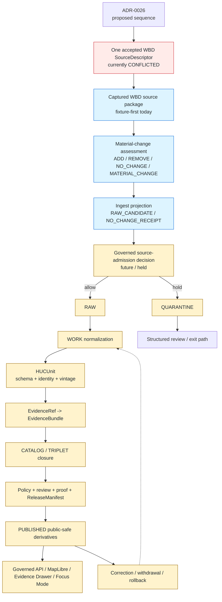

<!-- [KFM_META_BLOCK_V2]
doc_id: kfm://doc/adr-0026-hydrology-source-spine-starts-with-wbd-huc12
title: "ADR-0026 — Hydrology Source Spine Starts with WBD HUC12"
type: adr
adr_id: ADR-0026
version: v1.3
status: draft
effective_decision_status: proposed
owners:
  - "OWNER_TBD — architecture decision owner"
  - "OWNER_TBD — Hydrology lane steward"
  - "OWNER_TBD — source and evidence steward"
owner_status: "CODEOWNERS routes docs/adr/ and the affected trust-bearing roots to @bartytime4life; accepted stewardship assignments, decision quorum, independent review, source-admission authority, and release authority remain unverified"
reviewers_required:
  - Architecture steward
  - Docs steward
  - Hydrology lane steward
  - Source and evidence steward
  - Contract and schema steward
  - Policy reviewer
  - Pipeline and validation steward
  - Release and rollback steward
created: 2026-05-09
updated: 2026-08-14
policy_label: public
truth_posture: cite-or-abstain
responsibility_root: docs/
owning_root: docs/
responsibility: "Records the proposed Hydrology lane-internal source ordering and the bounded graduation criteria for beginning the source spine with USGS WBD HUC12 without granting source activation, lifecycle-write, release, deployment, publication, or public-use authority."
current_path: docs/adr/ADR-0026-hydrology-source-spine-starts-with-wbd-huc12.md
supersedes: []
superseded_by: []
evidence_snapshot:
  repository: bartytime4life/Kansas-Frontier-Matrix
  base_ref: main
  base_commit: c9ccb11ded141edbd79763982056a1e6f90b8866
  target_prior_blob: bc0d47a8beb0be6d1ff0b73b2731934cd7520c76
  adr_index_blob: 938c5894c36b99e14810918e2c550ab0e92d53b1
  adr_readme_blob: 793015c38f4066c2c23753d4e3dd26bcc890279d
  adr_0029_blob: a4de0d7a96b78da59cfc499d1025e1508afd8dd9
  directory_rules_blob: fd49a0b83e55cef52c1124281f093e263526898d
  canonical_wbd_placeholder_blob: fc0ee3ffb2c426cb560f41d6091d17d8d7213e5d
  legacy_wbd_descriptor_blob: e6164c255333be2d365cc1b292e5d88fff55df1a
  huc_unit_contract_blob: 180a87abef03c1990484c27931c7e52e6131a451
  huc_unit_schema_blob: 321c69f4686bfb7ecbb2a8f44a228405cdbcf9ce
  huc12_anchor_fixture_blob: 18ce8f53f4c5a614bb78e89d4caf931b2b0112bf
  material_change_contract_blob: 17dab94f35e519f11e850156a296821ff8178a47
  material_change_schema_blob: 44634543ce164013f55b5f023c76706086119b2e
  material_change_workflow_blob: e3edd2c98b708c170df84cef10d883d2c42b2b61
  material_change_receipt_blob: 7750b93197d13cd9a3235f69b128caf4201b7ce5
  ingest_contract_blob: dcde3825a18825a86439c484de417588ceee1256
  source_package_schema_blob: 7d699cb61384ecde5440cb93e221d2960e98621b
  ingest_candidate_schema_blob: 7f2eac7e87fcc98262dd674149d2316bf4f3b131
  ingest_pipeline_spec_blob: a78c584ebb3d01c71a8f884e326945e7bda2309a
  ingest_producer_blob: fd24c85691e610f29d917600fd93ed3342de3bbe
  ingest_workflow_blob: d087e5af0b7fe0a22f3b91c1ea2c9dd6df4ffd02
  ingest_receipt_blob: 08a57c15885360d2988a6dfc196a43c5ed007fce
  ingest_success_run: 31225777159
  later_material_change_run: 31654972120
  later_ingest_run: 31654972524
  later_workflow_head: 3911c519d9bc134c3ab0662fed6577ebd966813b
related:
  - docs/adr/README.md
  - docs/adr/INDEX.md
  - docs/adr/ADR-0001-schema-home--schemas-contracts-v1-is-canonical.md
  - docs/adr/ADR-0009-hydrology-is-the-first-proof-bearing-lane.md
  - docs/adr/ADR-0011-receipts-vs-proofs-vs-manifests-vs-catalog-separation.md
  - docs/adr/ADR-0012-connector-outputs-to-data-raw-or-data-quarantine-only.md
  - docs/adr/ADR-0017-source-descriptor-admission-process.md
  - docs/adr/ADR-0018-promotion-gate-sequence.md
  - docs/adr/ADR-0020-abstain-is-a-first-class-decision.md
  - docs/adr/ADR-0025-public-client-never-reads-canonical-internal-stores.md
  - docs/adr/ADR-0029-adopt-directory-governance-standard-v2.md
  - docs/doctrine/directory-rules.md
  - docs/doctrine/lifecycle-law.md
  - docs/doctrine/truth-posture.md
  - docs/domains/hydrology/ARCHITECTURE.md
  - docs/domains/hydrology/SOURCE_REGISTRY.md
  - contracts/domains/hydrology/huc_unit.md
  - contracts/domains/hydrology/wbd_huc12_material_change_assessment.md
  - contracts/domains/hydrology/wbd_huc12_ingest_candidate.md
  - schemas/contracts/v1/domains/hydrology/huc_unit.schema.json
  - schemas/contracts/v1/domains/hydrology/wbd_huc12_material_change_assessment.schema.json
  - schemas/contracts/v1/domains/hydrology/wbd_huc12_source_package.schema.json
  - schemas/contracts/v1/domains/hydrology/wbd_huc12_ingest_candidate.schema.json
  - data/registry/sources/hydrology/wbd.source.yaml
  - data/registry/hydrology/sources/wbd_huc12.yaml
  - fixtures/domains/hydrology/valid/huc12_kansas_sample.json
  - fixtures/domains/hydrology/wbd_huc12_material_change/
  - fixtures/domains/hydrology/wbd_huc12_ingest/
  - pipeline_specs/hydrology/wbd_huc12_ingest.yaml
  - pipelines/domains/hydrology/ingest_wbd_huc/
  - tools/validators/domains/hydrology/wbd_huc12_material_change/
  - tests/validators/domains/hydrology/wbd_huc12_material_change/
  - tests/pipelines/domains/hydrology/test_wbd_huc12_ingest_candidate.py
  - .github/workflows/hydrology-wbd-huc12-material-change.yml
  - .github/workflows/hydrology-wbd-huc12-ingest-candidate.yml
  - .github/workflows/domain-hydrology.yml
  - data/receipts/generated/genrec-hydrology-wbd-huc12-material-change-20260806.json
  - data/receipts/generated/genrec-hydrology-wbd-huc12-ingest-candidate-20260807.json
  - docs/registers/DRIFT_REGISTER.md
  - docs/registers/VERIFICATION_BACKLOG.md
tags: [kfm, adr, hydrology, source-spine, source-registry, wbd, huc12, huc-unit, material-change, ingest-candidate, fixture-first, evidence-first, non-publisher]
notes:
  - "v1.3 is a same-path documentation-only repository reconciliation. It preserves source status draft and effective decision status proposed; it does not accept ADR-0026, activate WBD, write lifecycle state, or declare a released source spine."
  - "ADR-0029 separately accepted the exact pinned Directory Rules v2 bytes. That confirms docs/adr/ as the owning lane but does not accept this decision."
  - "The source-descriptor conflict remains: the Directory-Rules-aligned path is a placeholder while the richer descriptor remains in a legacy path and is referenced by bounded executable profiles."
  - "The generic HUCUnit semantic contract remains substantive, but its paired schema and legacy HUC12 anchor fixture remain permissive or placeholder surfaces."
  - "Repository implementation advanced materially after v1.2: fixture-only material-change assessment and fixture-first ingest-candidate projection now have contracts, schemas, validators/producers, fixtures, tests, workflows, and generated receipts."
  - "Those bounded profiles perform no live WBD request, source activation, lifecycle persistence, EvidenceBundle closure, promotion, release, deployment, or publication."
  - "At the latest observed WBD workflow head, focused tests passed while both dedicated workflows failed generated-receipt byte closure after workflow dependency-install bytes changed. This is receipt drift, not proof of source or domain failure, and it remains a HOLD until repaired and revalidated."
[/KFM_META_BLOCK_V2] -->

<a id="top"></a>

# ADR-0026 — Hydrology Source Spine Starts with WBD HUC12

> **Proposed decision.** Within the Hydrology lane, the first source family to graduate from planning into a governed, proof-capable source spine is the **U.S. Geological Survey Watershed Boundary Dataset at HUC12 granularity**. WBD HUC12 provides watershed accounting and boundary context. It does not provide flow observations, flood regulation, observed inundation, terrain truth, emergency guidance, or publication authority.

[](#status)
[](#governing-placement-authority)
[](#source-descriptor-path-conflict)
[](#bounded-executable-source-edge)
[](#workflow-and-receipt-evidence)
[](#authority-and-publication-boundary)

> [!IMPORTANT]
> **ADR identity, placement authority, and implementation maturity are separate facts.** The canonical ADR index uniquely assigns `ADR-0026` to this file and records source metadata `draft` with effective decision status `proposed`. ADR-0029 separately accepted Directory Rules v2 and confirms `docs/adr/` as the correct human decision-record lane. Neither fact accepts this decision or grants source-admission, release, or publication authority.

> [!CAUTION]
> **The source registry remains conflicted.** `data/registry/sources/hydrology/wbd.source.yaml` is a Directory-Rules-aligned placeholder, while `data/registry/hydrology/sources/wbd_huc12.yaml` is a richer proposed descriptor in a legacy path. The implemented fixture-first schemas and producer currently reference the legacy path. This ADR does not choose both as co-canonical and does not authorize deleting either surface.

> [!WARNING]
> **Bounded implementation is not source graduation.** KFM now has a deterministic no-network material-change classifier and a fixture-first ingest-candidate projection. They operate on synthetic or already captured packages, emit only finite candidate/no-change objects, and write no lifecycle state. The generic `HUCUnit` schema and legacy HUC12 anchor fixture remain scaffolds; live source retrieval, authenticity, source admission, EvidenceBundle resolution, catalog closure, release, correction, rollback, and public operation remain held or unverified.

> [!NOTE]
> **Current workflow evidence includes receipt drift.** At `main@3911c519d9bc134c3ab0662fed6577ebd966813b`, both dedicated WBD workflows completed their focused test steps successfully—12 tests for material change and 21 combined tests for ingest plus material change—but failed generated-receipt integrity because the first listed workflow artifact no longer matched the stored digest. The last clean hosted ingest-candidate run remains `31225777159` at merge `0d2d86724a767a8cc15a0518fd5f673fe42043a0`. These facts support bounded executable progress and a current receipt-rebinding HOLD; they do not support source activation or publication.

**Quick navigation:** [Status](#status) · [Evidence](#evidence-boundary) · [Repository evidence](#current-repository-evidence) · [Context](#context) · [Decision](#decision) · [Trust path](#wbd-huc12-trust-path) · [Gates](#current-gate-status) · [Consequences](#consequences) · [Alternatives](#alternatives-considered) · [Graduation](#implementation-graduation-gates) · [Migration](#migration-plan) · [Rollback](#rollback) · [Validation](#validation-plan) · [Risks](#risk-ledger) · [Open work](#open-questions) · [References](#references) · [No-loss ledger](#appendix-a--no-loss-reconciliation-ledger)

---

<a id="status"></a>

## Status

| Field | Current value |
|---|---|
| **ADR ID** | `ADR-0026` — unique and confirmed in the canonical [`INDEX.md`](./INDEX.md) |
| **Tracked path** | `docs/adr/ADR-0026-hydrology-source-spine-starts-with-wbd-huc12.md` |
| **Source metadata** | `draft` |
| **Effective decision status** | `proposed` — not binding until the record and index carry matching reviewed `accepted` status |
| **Decision class** | Hydrology lane-internal source ordering and first-source graduation criteria |
| **Proposed spine head** | USGS WBD HUC12 |
| **Governing placement authority** | Accepted [`ADR-0029`](./ADR-0029-adopt-directory-governance-standard-v2.md) and its pinned Directory Rules v2 bytes |
| **Current implementation posture** | Mixed: descriptor authority is conflicted; generic HUCUnit shape remains scaffolded; material-change and ingest-candidate profiles are implemented fixture-first; current generated-receipt closure is stale; shared evidence, catalog, release, and public-operation closure remain held |
| **Evidence checkpoint** | `main@c9ccb11ded141edbd79763982056a1e6f90b8866`; latest observed dedicated WBD workflow head `3911c519d9bc134c3ab0662fed6577ebd966813b` |
| **Publication effect** | None. This ADR, a schema or test pass, workflow result, receipt, commit, pull request, merge, deployment, or map layer is not KFM publication evidence |
| **Supersedes / superseded by** | None / none |

### Governance acceptance versus source graduation

This ADR deliberately separates two states:

1. **ADR acceptance** approves the architectural sequence: WBD HUC12 is the first Hydrology source family expected to graduate.
2. **Source graduation** is an implementation claim requiring the complete evidence packet in [Implementation Graduation Gates](#implementation-graduation-gates).

Accepting this ADR would not activate a connector, authenticate source bytes, persist RAW or QUARANTINE records, validate every `HUCUnit`, produce an `EvidenceBundle`, release a layer, or publish a claim. Conversely, a script, receipt, green workflow, pull request, or merge cannot grant architectural acceptance.

<a id="governing-placement-authority"></a>

### Governing placement authority

ADR-0029 is the only accepted numbered ADR in the canonical index. It adopts the exact pinned Directory Rules v2 bytes at [`docs/doctrine/directory-rules.md`](../doctrine/directory-rules.md). That accepted decision:

- confirms this same-path update belongs under `docs/adr/`;
- assigns object meaning to `contracts/`, machine shape to `schemas/`, source identity to `data/registry/`, executable transformation to `pipelines/`, validation to `tools/` and `tests/`, and release authority to `release/`;
- prohibits new parallel source, schema, evidence, proof, receipt, or release authorities without governed migration;
- does **not** accept ADR-0026, activate WBD HUC12, or promote any Hydrology artifact.

The Directory Rules document retains its historical internal `PROPOSED_FOR_ADOPTION` label because ADR-0029 adopted exact bytes; the accepted ADR supplies the adoption effect.

[Back to top](#top)

---

<a id="evidence-boundary"></a>

## Evidence Boundary

This revision distinguishes tracked governance, configured surfaces, bounded executable validation, shared semantic closure, proof-bearing execution, and released operation. Evidence at an earlier level does not imply a later level.

### Maturity ladder

| Level | Meaning | Current WBD/HUC12 posture |
|---|---|---|
| **1. Tracked decision** | ADR identity, path, source status, and effective status are indexed | **CONFIRMED** |
| **2. Configured surfaces** | Relevant docs, contracts, schemas, descriptors, fixtures, specs, pipelines, tests, workflows, and receipts exist | **CONFIRMED**, with descriptor-path conflict |
| **3. Bounded executable source edge** | Closed no-network profiles validate synthetic/captured packages and emit finite source-admission candidates | **PARTIAL BUT MATERIAL** |
| **4. Shared semantic and lifecycle closure** | Canonical source admission, `HUCUnit` shape, evidence resolution, policy, and lifecycle transitions execute together | **HELD** |
| **5. Proof-capable source spine** | One deterministic governed flow emits validated domain records, receipts, evidence support, catalog agreement, correction support, and rollback targets | **HELD** |
| **6. Released / operated** | Public-safe release, serving, observability, correction propagation, rollback, and incident evidence exist | **UNKNOWN / not asserted** |

### Truth labels used in this ADR

- **CONFIRMED** — verified at the pinned repository or workflow evidence checkpoint.
- **PROPOSED** — the architectural decision or future implementation target under review.
- **CONFLICTED** — repository surfaces compete or disagree and require explicit reconciliation.
- **NEEDS VERIFICATION** — a concrete check remains before reliance.
- **UNKNOWN** — current evidence cannot establish the claim.
- **HOLD** — a governed gate remains intentionally incomplete or currently failing closed.

[Back to top](#top)

---

<a id="current-repository-evidence"></a>

## Current Repository Evidence

### Decision and placement controls

- [`docs/adr/INDEX.md`](./INDEX.md) assigns `ADR-0026` to this exact path with source metadata `draft` and effective status `proposed`.
- [`docs/adr/README.md`](./README.md) states that file presence and index registration do not accept a decision.
- [`ADR-0029`](./ADR-0029-adopt-directory-governance-standard-v2.md) is accepted and adopts the pinned Directory Rules v2 bytes.
- [`.github/CODEOWNERS`](../../.github/CODEOWNERS) provides a repository review route. It does not prove independent stewardship, source-admission authority, or release authority.

<a id="source-descriptor-path-conflict"></a>

### Source descriptor path conflict

| Surface | Verified state | Consequence |
|---|---|---|
| [`data/registry/sources/hydrology/wbd.source.yaml`](../../data/registry/sources/hydrology/wbd.source.yaml) | Explicit `PROPOSED` placeholder in the Directory-Rules-aligned source-registry family | Confirms the intended responsibility and domain lane, but does not supply an operational WBD HUC12 descriptor |
| [`data/registry/hydrology/sources/wbd_huc12.yaml`](../../data/registry/hydrology/sources/wbd_huc12.yaml) | Richer proposed descriptor with authority, rights, cadence, access, citation, and receipt-template fields | Useful lineage exists, but the path conflicts with the canonical family; its `role: primary` and rights fields remain proposed rather than accepted policy |
| [`docs/domains/hydrology/SOURCE_REGISTRY.md`](../domains/hydrology/SOURCE_REGISTRY.md) | Human source-role guidance points toward `data/registry/sources/hydrology/` | Supports a convergence target; does not migrate bytes or validate the richer descriptor |

**Required posture:** do not create a third descriptor, do not treat both files as co-canonical, and do not delete either surface without a reviewed migration that preserves useful fields, identifiers, inbound references, and history.

### Generic HUCUnit anchor remains scaffolded

| Surface | Verified state | What it proves | What it does not prove |
|---|---|---|---|
| [`contracts/domains/hydrology/huc_unit.md`](../../contracts/domains/hydrology/huc_unit.md) | Substantive semantic contract | `HUCUnit` is WBD-derived accounting/context geometry with source-vintage, evidence, release, correction, and rollback boundaries | Field-level machine enforcement or runtime behavior |
| [`schemas/contracts/v1/domains/hydrology/huc_unit.schema.json`](../../schemas/contracts/v1/domains/hydrology/huc_unit.schema.json) | `PROPOSED` scaffold with empty `properties` and `additionalProperties: true` | The canonical schema path exists | Required HUC fields, invalid-case rejection, source-role enforcement, geometry validity, or evidence closure |
| [`fixtures/domains/hydrology/valid/huc12_kansas_sample.json`](../../fixtures/domains/hydrology/valid/huc12_kansas_sample.json) | Explicit placeholder record | The intended historical anchor path exists and parses as JSON | A real HUC12 fixture, WBD identity, geometry, vintage, or schema conformance |

<a id="bounded-executable-source-edge"></a>

### Bounded executable source edge

| Surface | Verified state | Finite capability | Explicit non-effects |
|---|---|---|---|
| [`WbdHuc12MaterialChangeAssessment`](../../contracts/domains/hydrology/wbd_huc12_material_change_assessment.md) contract and [schema](../../schemas/contracts/v1/domains/hydrology/wbd_huc12_material_change_assessment.schema.json) | Implemented fixture profile | Deterministic Polygon/MultiPolygon normalization, geometry-plus-area fingerprinting, metadata-churn suppression, and `ADD` / `REMOVE` / `NO_CHANGE` / `MATERIAL_CHANGE` | No WBD request, source activation, lifecycle write, promotion, release, or publication |
| [Material-change validator](../../tools/validators/domains/hydrology/wbd_huc12_material_change/validate_wbd_huc12_material_change.py), fixtures, and tests | Executable no-network validation exists | Recomputes fingerprints, decisions, and assessment hash; rejects invalid geometry, identity, and decision claims | Does not authenticate source bytes or create a canonical `HUCUnit` |
| [`WbdHuc12SourcePackage` and `WbdHuc12IngestCandidate`](../../contracts/domains/hydrology/wbd_huc12_ingest_candidate.md) contract and paired schemas | Implemented fixture-first profile | Validates a captured package and emits `RAW_CANDIDATE` or `NO_CHANGE_RECEIPT` with stable reason codes | Does not fetch, activate, persist, admit, promote, release, or publish |
| [Candidate producer](../../pipelines/domains/hydrology/ingest_wbd_huc/produce_wbd_huc12_candidate.py) and [pipeline spec](../../pipeline_specs/hydrology/wbd_huc12_ingest.yaml) | `IMPLEMENTED_FIXTURE_FIRST`; live orchestration remains `PROPOSED` | Enforces no-network, no-overwrite, deterministic output, and declared possible RAW/QUARANTINE targets without writing them | Does not choose a lifecycle target or perform the state transition |
| Synthetic ingest fixtures and focused tests | Positive and negative profiles exist | Cover add, remove, metadata-only no-change, material change, HTTP `304`, and duplicate-HUC failure | Synthetic coverage is not current-source or public-release evidence |

<a id="workflow-and-receipt-evidence"></a>

### Workflow and receipt evidence

| Evidence | Observed result | Interpretation |
|---|---|---|
| Ingest-candidate run [`31225777159`](https://github.com/bartytime4life/Kansas-Frontier-Matrix/actions/runs/31225777159) at `0d2d86724a767a8cc15a0518fd5f673fe42043a0` | **SUCCESS** | Confirms the bounded ingest workflow and then-current generated receipt closed on that merge |
| Material-change run [`31654972120`](https://github.com/bartytime4life/Kansas-Frontier-Matrix/actions/runs/31654972120) at `3911c519d9bc134c3ab0662fed6577ebd966813b` | **FAILURE after 12 focused tests passed** | Generated receipt rejected artifact path 0 with `ARTIFACT_DIGEST_MISMATCH`; current workflow bytes no longer match the stored authoring digest |
| Ingest-candidate run [`31654972524`](https://github.com/bartytime4life/Kansas-Frontier-Matrix/actions/runs/31654972524) at the same head | **FAILURE after 21 combined tests passed** | Network/write boundary greps passed; generated receipt rejected artifact path 0 with `ARTIFACT_DIGEST_MISMATCH` |
| Current WBD generated receipts | Tracked but byte-stale against later workflow changes | Receipts preserve authoring lineage but cannot currently serve as exact-byte closure until regenerated through the legitimate producer and revalidated |

The later failures are not evidence that the material-change logic or ingest-candidate tests failed. They are evidence that trust-bearing generated receipts drifted after workflow bytes changed and that the workflows correctly failed closed. Exact-head closure on current `main` remains **NEEDS VERIFICATION** after repair.

<a id="authority-and-publication-boundary"></a>

### Authority and publication boundary

WBD HUC12 is a source and accounting-geometry proposal. It is not automatically:

- an observed flow, stage, water-quality, or flood record;
- a FEMA regulatory flood determination;
- observed inundation;
- terrain-derived hydrology truth;
- emergency, engineering, insurance, navigation, or life-safety guidance;
- an accepted source descriptor or source activation;
- a persisted RAW, QUARANTINE, PROCESSED, CATALOG, TRIPLET, or PUBLISHED record;
- an `EvidenceBundle`, proof pack, release decision, released layer, or KFM-published claim.

[Back to top](#top)

---

<a id="context"></a>

## Context

KFM proposes Hydrology as the first proof-bearing lane in [`ADR-0009`](./ADR-0009-hydrology-is-the-first-proof-bearing-lane.md). The lane needs a first source family whose identity, geometry, fixtures, validation, evidence, policy, and rollback burden can be closed without simultaneously solving every time-series qualifier, regulatory/observed flood distinction, or network-identity problem.

| Candidate spine head | Source class | Why it could lead | Why it increases first-slice burden |
|---|---|---|---|
| **WBD HUC12** | Watershed boundary and accounting geometry | Stable 12-digit unit identity, bounded geometry, aggregation context, deterministic snapshots and diffs | Boundary vintage, descriptor authority, geometry validity, and source-role limits still require governance |
| **USGS observation feeds** | Time-series observations | High public value and strong station identity | Qualifiers, provisional/revised state, parameter semantics, missingness, and freshness add first-slice complexity |
| **NHDPlus / network products** | Hydrographic network and crosswalk support | Enables reaches, upstream/downstream relations, and joins | COMID/reach identity, vintage, topology, and crosswalk integrity expand the proof burden |
| **NFHL and flood-context products** | Regulatory or modeled flood context | Important for public interpretation | Regulatory status, observed-versus-modeled distinctions, local adoption, and high-consequence messaging raise policy burden |

WBD HUC12 is therefore a disciplined first source **only when its role is bounded**: watershed accounting and context, not universal hydrology truth.

### Scope

This ADR decides only:

- the proposed first source family within the Hydrology source spine;
- the intended canonical source-registry responsibility;
- use of the existing `HUCUnit` family rather than a competing HUC12 authority;
- how current fixture-first material-change and ingest-candidate components fit into the future source spine;
- the graduation gates required before the source can be called governed or proof-capable.

### Non-decisions

This ADR does **not** decide or authorize:

- source activation, credentials, live polling, endpoint availability, cadence, or conditional-request behavior;
- final source rights, terms, attribution, or redistribution posture;
- direct connector writes to lifecycle stores;
- automatic admission of a `RAW_CANDIDATE`;
- HUC boundary publication or a public map layer;
- `EvidenceBundle`, policy, catalog, proof, release, correction, or rollback closure;
- promotion, release, deployment, publication, or repository-setting changes;
- replacing NWIS, NHDPlus, NFHL, terrain, or other Hydrology source families.

[Back to top](#top)

---

## Forces

1. **A small identity anchor is needed.** HUC12 provides a bounded 12-digit watershed accounting unit suitable for deterministic fixtures and joins.
2. **Source roles must not collapse.** Boundary/context geometry cannot stand in for observations, regulation, modeled flood extents, terrain, or emergency guidance.
3. **Repository evidence advanced.** Material-change and ingest-candidate profiles now provide real bounded executable behavior; the ADR must no longer call the entire pipeline a placeholder.
4. **Source authority remains conflicted.** The richer descriptor is not in the accepted Directory Rules family and the canonical-home file is not operational.
5. **The domain object remains incomplete.** Generic `HUCUnit` machine shape and the historical HUC12 anchor fixture are still scaffolds.
6. **Trust artifacts must remain exact.** Both dedicated workflows correctly failed when generated-receipt hashes no longer matched changed workflow bytes.
7. **Candidate output is not lifecycle state.** `RAW_CANDIDATE` is a proposed next-step envelope, not a write, admission decision, or release.
8. **Public clients remain downstream of trust.** Maps, APIs, tiles, and AI surfaces may consume only governed released derivatives.
9. **Correction and rollback must be designed before public use.** WBD vintage or geometry changes can invalidate aggregates, joins, tiles, and explanations.
10. **The smallest safe change is reversible.** This ADR update records current truth without changing source, schema, runtime, policy, release, or publication behavior.

[Back to top](#top)

---

<a id="decision"></a>

## Decision

If ADR-0026 is accepted, KFM will apply the following sequence:

1. **WBD HUC12 leads the Hydrology source spine.** It is the first source family targeted for full source-admission, identity, evidence, catalog, and release closure.
2. **One source descriptor becomes authoritative.** The convergence target is the accepted source-registry family under `data/registry/sources/hydrology/`, subject to a reviewed migration that preserves the richer descriptor's useful fields and resolves role, rights, cadence, citation, receipt, and identifier semantics.
3. **The existing `HUCUnit` family remains the domain authority.** `contracts/domains/hydrology/huc_unit.md` defines meaning; `schemas/contracts/v1/domains/hydrology/huc_unit.schema.json` must be hardened rather than bypassed by a competing `huc12.schema.json`.
4. **The fixture-first material-change profile is a reusable source-edge dependency.** It determines whether normalized geometry or area materially changed while ignoring non-authoritative metadata churn.
5. **The fixture-first ingest-candidate profile is a bounded adapter, not a publisher.** It may emit `RAW_CANDIDATE` or `NO_CHANGE_RECEIPT` from an already captured package; it may not fetch, activate, persist, admit, promote, release, or publish.
6. **A separate governed admission transition is required.** Only a future source-admission decision may route a validated candidate to `data/raw/hydrology/wbd_huc12/` or `data/quarantine/hydrology/wbd_huc12/`.
7. **The lifecycle remains explicit.**

   ```text
   source descriptor and captured source package
     -> deterministic material-change assessment
     -> RAW_CANDIDATE or NO_CHANGE_RECEIPT
     -> governed admission decision
     -> RAW or QUARANTINE
     -> normalized HUCUnit
     -> EvidenceRef -> EvidenceBundle
     -> CATALOG / TRIPLET projections
     -> review, proof, ReleaseManifest, correction, rollback
     -> PUBLISHED public-safe derivatives
   ```

8. **No renderer or client receives canonical or candidate state directly.** Public maps and APIs may use only governed released derivatives with evidence and release metadata.
9. **Source graduation is conjunctive.** Every gate in [Implementation Graduation Gates](#implementation-graduation-gates) must close; bounded fixture passes cannot substitute for missing source, evidence, policy, catalog, release, correction, or rollback evidence.

### Source-role contract

| WBD HUC12 may support | WBD HUC12 must not be used to prove |
|---|---|
| HUC code, level, hierarchy, source vintage, boundary geometry, area, and watershed accounting context | Streamflow, stage, discharge, water quality, groundwater level, or other observations |
| Aggregation, map filtering, cross-domain joins, and public-safe watershed context | FEMA regulation, observed inundation, terrain, channel condition, or emergency status |
| Deterministic snapshot comparison and boundary-change candidates | Source authenticity, source admission, policy approval, release, or publication by itself |
| Evidence-supported explanations of watershed context | Per-place truth inferred from an aggregate HUC unit |

[Back to top](#top)

---

## Directory Rules Basis

This is an existing tracked ADR. Its same-path update remains under `docs/adr/` because the artifact records a human architecture decision. No new root or parallel authority is created.

| Responsibility | Governed home or existing lane | Role in this decision |
|---|---|---|
| Human decision record | `docs/adr/` | This ADR |
| Source identity | `data/registry/sources/hydrology/` | Intended convergence target for the WBD descriptor |
| Semantic object meaning | `contracts/domains/hydrology/` | `HUCUnit`, material-change, and ingest-candidate meanings |
| Machine shape | `schemas/contracts/v1/domains/hydrology/` | Generic HUCUnit and bounded source-edge schemas |
| Executable source-edge transformation | `pipelines/domains/hydrology/ingest_wbd_huc/` | Candidate producer |
| Declarative orchestration | `pipeline_specs/hydrology/` | No-network fixture-first execution profile and future live-orchestration placeholder |
| Reusable synthetic evidence | `fixtures/domains/hydrology/` | Positive and negative profiles |
| Validation logic | `tools/validators/domains/hydrology/` | Material-change enforcement |
| Executable conformance | `tests/` | Focused validator and pipeline tests |
| Generated authoring lineage | `data/receipts/generated/` | Byte-binding receipts, currently requiring rebinding |
| Lifecycle data | `data/raw/`, `data/quarantine/`, `data/processed/`, `data/catalog/`, `data/triplets/`, `data/published/` | Future governed transitions; not written by current profiles |
| Release decisions and rollback | `release/` | Future promotion, manifest, correction, and rollback authority |

[Back to top](#top)

---

<a id="wbd-huc12-trust-path"></a>

## WBD HUC12 Trust Path


```mermaid
flowchart TD
  ADR["ADR-0026<br/>proposed sequence"] --> SD["One accepted WBD SourceDescriptor<br/>currently CONFLICTED"]
  SD --> CAP["Captured WBD source package<br/>fixture-first today"]
  CAP --> MC["Material-change assessment<br/>ADD / REMOVE / NO_CHANGE / MATERIAL_CHANGE"]
  MC --> CAND["Ingest projection<br/>RAW_CANDIDATE / NO_CHANGE_RECEIPT"]
  CAND --> ADMIT["Governed source-admission decision<br/>future / held"]
  ADMIT -->|allow| RAW["RAW"]
  ADMIT -->|hold| Q["QUARANTINE"]
  RAW --> WORK["WORK normalization"]
  Q --> REVIEW["Structured review / exit path"]
  WORK --> HUC["HUCUnit<br/>schema + identity + vintage"]
  HUC --> EV["EvidenceRef -> EvidenceBundle"]
  EV --> CAT["CATALOG / TRIPLET closure"]
  CAT --> REL["Policy + review + proof + ReleaseManifest"]
  REL --> PUB["PUBLISHED public-safe derivatives"]
  PUB --> API["Governed API / MapLibre / Evidence Drawer / Focus Mode"]
  PUB --> CORR["Correction / withdrawal / rollback"]
  CORR -.-> WORK

  classDef held fill:#fff3cd,stroke:#9a6700,color:#24292f;
  classDef conflict fill:#ffebe9,stroke:#cf222e,color:#24292f;
  classDef bounded fill:#ddf4ff,stroke:#0969da,color:#24292f;
  class SD conflict;
  class CAP,MC,CAND bounded;
  class ADMIT,RAW,Q,WORK,HUC,EV,CAT,REL,PUB,API,CORR held;
```

The blue nodes are bounded fixture-first implementation. The red node is unresolved source authority. The yellow nodes are future or held lifecycle, evidence, release, and public-operation work. The diagram does not represent publication state.

[Back to top](#top)

---

<a id="current-gate-status"></a>

## Current Gate Status

| Gate | Current evidence | Outcome |
|---|---|---|
| ADR identity and unique numbering | Canonical index assigns this exact file to `ADR-0026` | **PASS** |
| ADR acceptance | Source metadata `draft`; effective status `proposed` | **HOLD** |
| ADR placement | ADR-0029 accepted Directory Rules v2; `docs/adr/` owns human decision records | **PASS** |
| Descriptor authority | Canonical-home placeholder and richer legacy-home descriptor coexist | **CONFLICTED** |
| Source rights, terms, endpoint, and currentness | Legacy descriptor contains proposed rights/access claims; no current source-admission packet was verified | **NEEDS VERIFICATION** |
| Generic HUCUnit semantics | Substantive contract exists | **PARTIAL** |
| Generic HUCUnit machine shape | Schema has empty properties and allows arbitrary fields | **HOLD** |
| Historical HUC12 anchor fixture | Explicit placeholder | **HOLD** |
| Material-change semantics and tests | Contract/schema/validator/fixtures exist; 12 focused tests passed in latest observed run | **BOUNDED PASS** |
| Material-change generated receipt | Latest observed workflow failed `ARTIFACT_DIGEST_MISMATCH` after tests passed | **FAIL / HOLD** |
| Ingest-candidate schemas, producer, fixtures, and tests | Implemented fixture-first; successful hosted run at `0d2d867...`; 21 tests passed in later run | **BOUNDED PASS** |
| Ingest-candidate generated receipt | Later workflow failed `ARTIFACT_DIGEST_MISMATCH` after tests and boundary checks passed | **FAIL / HOLD** |
| Live WBD retrieval and authenticity | Not implemented by the bounded profiles | **NOT IMPLEMENTED** |
| Source activation and admission | Explicitly denied in current schemas/spec | **HOLD** |
| RAW / QUARANTINE persistence | Producer declares targets but writes neither | **HOLD** |
| EvidenceRef-to-EvidenceBundle closure | Not demonstrated for a real HUCUnit | **HOLD** |
| Policy, catalog, proof, release, correction, and rollback closure | Not demonstrated end to end | **HOLD** |
| Public API, map, export, or AI use | No released WBD HUC12 product established by this evidence | **NONE / UNKNOWN** |

A gate marked **BOUNDED PASS** proves only the named fixture-first behavior. It cannot be reused as evidence for source activation, canonical HUCUnit readiness, release, or publication.

[Back to top](#top)

---

<a id="consequences"></a>

## Consequences

### Positive

- Gives Hydrology a clear first source family without treating all Hydrology sources as interchangeable.
- Reuses the existing `HUCUnit` family and avoids a competing HUC12 schema authority.
- Preserves bounded implementation already delivered through the material-change and ingest-candidate slices.
- Makes metadata-churn suppression, geometry/area change detection, and finite source-edge outcomes explicit.
- Keeps source admission and lifecycle persistence separate from candidate generation.
- Makes current receipt drift visible instead of allowing stale authoring receipts to imply byte closure.
- Provides a reversible path from source identity through evidence, catalog, release, correction, and rollback.
- Keeps public clients downstream of governed released derivatives.

### Negative and cost

- Descriptor convergence requires migration work and reference repair.
- The generic `HUCUnit` schema and historical anchor fixture still require substantive design and negative tests.
- Existing source-edge schemas hard-code the legacy descriptor path, so canonical-path convergence has a real compatibility blast radius.
- Generated authoring receipts must be regenerated whenever bound workflow or artifact bytes change.
- Live-source currentness, rights, cadence, conditional-request behavior, and authenticity remain separate verification work.
- WBD geometry changes can invalidate aggregates, crosswalks, map products, caches, and explanations.
- Accepting the sequence does not reduce the later burden for observations, networks, flood context, or public-safety disclaimers.

### Operational invariants

- `RAW -> WORK / QUARANTINE -> PROCESSED -> CATALOG / TRIPLETS -> PUBLISHED` remains the lifecycle.
- Promotion is a governed state transition, not a file move, candidate envelope, workflow success, receipt, pull request, or merge.
- `EvidenceBundle` outranks tiles, map pixels, graph projections, summaries, and generated language.
- Watchers and candidate producers may propose work; they do not publish.
- Unknown source role, rights, authenticity, sensitivity, or release state fails closed.

[Back to top](#top)

---

<a id="alternatives-considered"></a>

## Alternatives Considered

### 1. Begin with observation feeds

**Rejected as the first source-spine anchor.** Observation feeds provide strong public value but add parameter semantics, qualifiers, provisional/revised state, missingness, station identity, and freshness before the lane has closed its first source-governance path.

### 2. Begin with NHDPlus or another network product

**Deferred.** Network sources are essential, but reach identity, topology, versioned crosswalks, and upstream/downstream relations increase the first proof burden.

### 3. Begin with NFHL or flood-context products

**Deferred.** Regulatory/model/observed distinctions and high-consequence public interpretation require stronger policy and release controls than a first accounting-boundary slice.

### 4. Treat the implemented ingest candidate as source graduation

**Rejected.** `RAW_CANDIDATE` is an input to a future admission decision. It is not source activation, persistence, evidence closure, or release authority.

### 5. Keep both source descriptors indefinitely

**Rejected.** Parallel descriptors create competing identity, role, rights, and receipt authority. Compatibility may be temporary; co-canonical status is not allowed.

### 6. Create a new HUC12-specific canonical object family

**Rejected.** The repository already has the `HUCUnit` semantic family. A new competing schema would split meaning and shape authority.

### 7. Ignore generated-receipt drift because tests pass

**Rejected.** KFM treats receipts as separate trust objects. Test success cannot substitute for exact-byte authoring closure, and a stale receipt must fail closed.

### 8. Publish a boundary layer directly from captured or candidate bytes

**Rejected.** Public delivery requires admitted source identity, normalized domain records, evidence, policy, review, catalog/proof closure, release manifest, correction, and rollback.

[Back to top](#top)

---

<a id="implementation-graduation-gates"></a>

## Implementation Graduation Gates

Source graduation requires all gates below. They are conjunctive and do not replace the repository-wide promotion sequence in ADR-0018.

### G1 — Decision and owner authority

- ADR-0026 carries matching reviewed `accepted` status in the record and canonical index.
- Architecture, Hydrology, source/evidence, validation, policy, and release responsibilities are assigned.
- Any bootstrap exception is explicit and bounded.

### G2 — One admitted source descriptor

- The placeholder and legacy descriptor are reconciled into one canonical source record.
- Stable source ID, authority role, endpoint/product identity, rights, terms, attribution, cadence, access, geography, time, sensitivity, citation, and activation state are reviewed.
- Compatibility references and schema constants migrate through a documented window.
- A rollback target preserves the prior descriptor state and identifiers.

### G3 — Generic HUCUnit shape and fixtures

- `huc_unit.schema.json` rejects incomplete, malformed, or role-confused records.
- A substantive Kansas HUC12 fixture replaces the historical placeholder through a legitimate producer or reviewed fixture process.
- HUC code, level, hierarchy, vintage, source descriptor, geometry, area, CRS, evidence, release, correction, and rollback references are enforced as appropriate.
- Invalid fixtures cover bad length, hierarchy mismatch, geometry failure, vintage conflict, unsupported source role, and missing evidence.

### G4 — Source-edge integrity

- Material-change and ingest-candidate generated receipts are regenerated through the legitimate receipt producer after bound-byte changes.
- Dedicated workflows pass on the exact branch/head under no-network conditions.
- Determinism, duplicate-key denial, non-finite denial, input-size limits, no-overwrite behavior, and stable reason codes remain tested.
- Receipt drift remains a hard failure.

### G5 — Governed source admission

- A source-admission decision validates captured request/response evidence, source activation state, authenticity posture, rights, sensitivity, and expected HUC identity.
- Finite outcomes include admit-to-RAW, route-to-QUARANTINE, no-change, deny/reject, and error without implicit allow.
- Candidate generation and admission remain separate duties or auditable stages.
- No public route can read candidates or internal admission reasons.

### G6 — Lifecycle and evidence closure

- Admitted source material follows RAW or QUARANTINE, then deterministic WORK normalization.
- A valid `HUCUnit` resolves to source and evidence objects.
- EvidenceRef-to-EvidenceBundle resolution, temporal/vintage scope, geometry lineage, policy posture, review state, and correction lineage are executed together.
- Missing or conflicted support returns HOLD, ABSTAIN, DENY, or ERROR.

### G7 — Catalog, proof, and release closure

- STAC, DCAT, and PROV projections agree where applicable.
- Receipts, proofs, catalog records, decisions, release manifests, and published artifacts remain separate object families.
- Release dry-run proves identity, integrity, policy, review, public-safe geometry, correction path, and rollback target.
- Public clients use only governed APIs or released artifacts.

### G8 — Correction, rollback, and operation

- A WBD boundary/vintage correction invalidates and rebuilds affected aggregates, crosswalks, tiles, caches, catalog records, and explanations.
- Withdrawal and rollback are exercised through a deterministic drill.
- Operational telemetry avoids raw source payloads and sensitive policy detail.
- Public surfaces expose release ID, source/vintage, evidence, stale/correction state, and limitations.

[Back to top](#top)

---

<a id="migration-plan"></a>

## Migration Plan

Each phase is a separate reversible review boundary. This ADR update does not execute later phases.

### Phase 0 — Reconcile the decision record

**This change.**

- Preserve `draft` / `proposed` status.
- Record accepted Directory Rules placement authority.
- Replace stale “entire pipeline is placeholder” claims with current bounded implementation evidence.
- Record unresolved descriptor, generic HUCUnit, receipt, evidence, and release holds.
- Leave the ADR index unchanged because ID, title, path, source status, effective status, and supersession relationships do not change.

### Phase 1 — Converge source descriptor authority

- Inventory every consumer of both descriptor paths and any source-ID aliases.
- Select one canonical record under the accepted source-registry family.
- Preserve useful legacy fields and identify which values are verified, proposed, or denied.
- Migrate constants, schemas, fixtures, docs, and code through one compatibility plan.
- Emit migration evidence and retain rollback to the previous two-surface state until consumers close.

### Phase 2 — Harden the generic HUCUnit family

- Finalize contract-to-schema fields.
- Replace the historical placeholder fixture.
- Add valid/invalid schemas, identity checks, geometry/vintage validation, and contract tests.
- Avoid embedding source-edge transport fields into the domain object.

### Phase 3 — Restore exact authoring receipt closure

- Determine the legitimate generated-receipt producer and regenerate both WBD receipts against current bytes.
- Verify that only intended workflow/install changes caused the drift.
- Run both dedicated no-network workflows at exact head.
- Record the successful run IDs without rewriting historical failures.

### Phase 4 — Add governed admission and lifecycle persistence

- Implement a separate admission decision that consumes the candidate envelope.
- Keep network access out of default unit tests; use captured packages and explicitly governed probes.
- Route only through RAW or QUARANTINE and emit admission/ingest receipts.
- Prove idempotency, replay, duplicate suppression, and failure isolation.

### Phase 5 — Close evidence, catalog, release, and rollback

- Produce evidence-bound HUCUnit records.
- Close catalog agreement and release dry-run.
- Build public-safe derivative artifacts only after review.
- Exercise correction, cache invalidation, withdrawal, and rollback before public operation.

[Back to top](#top)

---

<a id="rollback"></a>

## Rollback

### Documentation-only change

Before merge, close the draft pull request and delete the scoped branch through normal repository controls. After merge, revert the single ADR documentation commit. The prior ADR bytes remain recoverable from blob `bc0d47a8beb0be6d1ff0b73b2731934cd7520c76`.

This documentation rollback:

- restores the prior narrative;
- does not alter the accepted Directory Rules decision;
- does not modify WBD contracts, schemas, fixtures, producer, validator, workflows, receipts, source descriptors, lifecycle data, releases, deployments, or published artifacts.

### Future implementation rollback requirements

Any later descriptor or source-spine migration must preserve:

- old and new source IDs and path aliases for the approved compatibility window;
- prior schema and fixture versions;
- previous receipts and run evidence;
- correction and supersession relationships;
- a tested return path that does not recreate two writable authorities.

[Back to top](#top)

---

<a id="validation-plan"></a>

## Validation Plan

### Required for this ADR-only change

```bash
python tools/validators/validate_adr_index.py
python -m pytest tests/validators/test_validate_adr_index.py -q --strict-config --strict-markers
```

Also verify:

- one H1 and unique explicit anchors;
- every quick-navigation anchor resolves;
- relative repository links point to tracked paths;
- `adr_id`, H1 ID, filename, source status, effective status, and canonical index remain coherent;
- no index update is introduced because decision status and identity are unchanged;
- Markdown renders as GitHub Flavored Markdown without using badges as evidence.

### Existing bounded WBD checks

These commands validate existing implementation; they are not required to prove a documentation-only change correct.

```bash
python -m pytest \
  tests/validators/domains/hydrology/wbd_huc12_material_change/test_validate_wbd_huc12_material_change.py \
  -q --strict-config --strict-markers

python -m pytest \
  tests/pipelines/domains/hydrology/test_wbd_huc12_ingest_candidate.py \
  tests/validators/domains/hydrology/wbd_huc12_material_change/test_validate_wbd_huc12_material_change.py \
  -q --strict-config --strict-markers
```

The current repair backlog must additionally validate both generated receipts against exact checked-out bytes. A test pass with a receipt mismatch remains a failed trust-bearing workflow.

[Back to top](#top)

---

<a id="risk-ledger"></a>

## Risk Ledger

| Risk | Current evidence | Required control |
|---|---|---|
| ADR prose implies acceptance | ADR remains `draft` / `proposed` | Keep status visible in metadata, badges, status table, and index |
| Bounded fixture profile is mistaken for source activation | Schemas/spec explicitly deny network, activation, and writes | Preserve non-effects and separate admission stage |
| Legacy descriptor becomes de facto canon through code constants | Source-edge schemas and producer reference the legacy path | Governed descriptor migration with compatibility tests |
| Canonical placeholder loses useful legacy fields | Two descriptors differ materially | Field-by-field convergence and no-loss migration ledger |
| Generic HUCUnit stays permissive while source-edge types mature | HUCUnit schema still accepts arbitrary objects | Harden domain schema before proof-capable claims |
| Metadata churn creates false boundary updates | Upstream metadata excluded from feature fingerprint | Keep deterministic geometry-plus-area assessment and tests |
| Receipt drift is ignored | Both latest observed workflows failed exact-byte closure | Regenerate through legitimate producer and retain fail-closed checks |
| Candidate writes bypass admission | Producer declares targets but writes none | Keep admission as a separate finite decision |
| Boundary vintage silently mixes with derived products | Generic schema does not yet enforce vintage | Add vintage identity and invalidation rules |
| WBD context is treated as observed or regulatory truth | Source-role boundary is documentary today | Enforce role in schema, policy, evidence, and UI copy |
| Public clients read internal state | Candidate and lifecycle stores are not public products | Governed API and released-artifact boundary |
| Correction does not propagate | No end-to-end correction drill established | Dependency inventory, recompile manifest, cache invalidation, rollback drill |

[Back to top](#top)

---

<a id="open-questions"></a>

## Open Questions

1. Who holds accepted architecture, Hydrology, source-admission, evidence, policy, and release authority for this decision?
2. Which exact source descriptor path and ID become canonical after migration?
3. Which legacy descriptor rights, attribution, cadence, endpoint, and role fields are supported by current authoritative source review?
4. Should a compatibility alias preserve `wbd_huc12` while the canonical record adopts a different source ID grammar?
5. How will source-edge schemas stop hard-coding the legacy descriptor path without breaking deterministic fixtures?
6. What minimum field set turns the generic `HUCUnit` schema from scaffold into substantive enforcement?
7. Which Kansas HUC12 sample may be retained as a stable, public-safe, source-vintage-pinned fixture?
8. What is the canonical geometry normalization and fingerprint policy for generic HUCUnit identity versus source-edge material-change detection?
9. What legitimate producer regenerates `GENERATED_RECEIPT` objects after bound workflow bytes change?
10. Which later commit changed the two workflow digests, and should receipt rebinding be isolated from any unrelated behavior change?
11. What finite source-admission outcomes and reason codes are canonical?
12. How are conditional request evidence, source authenticity, ETag/Last-Modified behavior, and no-change receipts represented without treating headers as feature truth?
13. Which HUC aggregates, crosswalks, layers, catalogs, caches, and AI explanations must be invalidated after a boundary/vintage correction?
14. What exact acceptance evidence is required before a public HUC12 layer, API payload, or Evidence Drawer surface is permitted?
15. How will KFM prove that public users cannot reach source packages, candidates, RAW, QUARANTINE, or internal policy reasons?

[Back to top](#top)

---

<a id="references"></a>

## References

### Governing decisions and doctrine

- [ADR operating contract](./README.md)
- [Canonical ADR index](./INDEX.md)
- [ADR-0009 — Hydrology Is the First Proof-Bearing Lane](./ADR-0009-hydrology-is-the-first-proof-bearing-lane.md)
- [ADR-0011 — Receipts vs Proofs vs Manifests vs Catalog Separation](./ADR-0011-receipts-vs-proofs-vs-manifests-vs-catalog-separation.md)
- [ADR-0012 — Connector Outputs Land in RAW or QUARANTINE Only](./ADR-0012-connector-outputs-to-data-raw-or-data-quarantine-only.md)
- [ADR-0017 — Source Descriptor Admission Process](./ADR-0017-source-descriptor-admission-process.md)
- [ADR-0018 — Promotion Gate Sequence](./ADR-0018-promotion-gate-sequence.md)
- [ADR-0020 — Abstain Is a First-Class Decision](./ADR-0020-abstain-is-a-first-class-decision.md)
- [ADR-0025 — Public Client Never Reads Canonical or Internal Stores](./ADR-0025-public-client-never-reads-canonical-internal-stores.md)
- [ADR-0029 — Adopt Directory Governance Standard v2](./ADR-0029-adopt-directory-governance-standard-v2.md)
- [Directory Rules v2](../doctrine/directory-rules.md)
- [Lifecycle law](../doctrine/lifecycle-law.md)
- [Truth posture](../doctrine/truth-posture.md)

### Hydrology source and domain surfaces

- [Hydrology architecture](../domains/hydrology/ARCHITECTURE.md)
- [Hydrology source registry guidance](../domains/hydrology/SOURCE_REGISTRY.md)
- [HUCUnit semantic contract](../../contracts/domains/hydrology/huc_unit.md)
- [HUCUnit schema scaffold](../../schemas/contracts/v1/domains/hydrology/huc_unit.schema.json)
- [Canonical-home WBD placeholder](../../data/registry/sources/hydrology/wbd.source.yaml)
- [Legacy-home richer WBD HUC12 descriptor](../../data/registry/hydrology/sources/wbd_huc12.yaml)
- [Historical HUC12 anchor fixture](../../fixtures/domains/hydrology/valid/huc12_kansas_sample.json)

### Bounded source-edge implementation

- [Material-change contract](../../contracts/domains/hydrology/wbd_huc12_material_change_assessment.md)
- [Material-change schema](../../schemas/contracts/v1/domains/hydrology/wbd_huc12_material_change_assessment.schema.json)
- [Material-change validator](../../tools/validators/domains/hydrology/wbd_huc12_material_change/validate_wbd_huc12_material_change.py)
- [Ingest-candidate contract](../../contracts/domains/hydrology/wbd_huc12_ingest_candidate.md)
- [Captured source-package schema](../../schemas/contracts/v1/domains/hydrology/wbd_huc12_source_package.schema.json)
- [Ingest-candidate schema](../../schemas/contracts/v1/domains/hydrology/wbd_huc12_ingest_candidate.schema.json)
- [Candidate producer](../../pipelines/domains/hydrology/ingest_wbd_huc/produce_wbd_huc12_candidate.py)
- [Pipeline spec](../../pipeline_specs/hydrology/wbd_huc12_ingest.yaml)
- [Material-change workflow](../../.github/workflows/hydrology-wbd-huc12-material-change.yml)
- [Ingest-candidate workflow](../../.github/workflows/hydrology-wbd-huc12-ingest-candidate.yml)
- [Material-change generated receipt](../../data/receipts/generated/genrec-hydrology-wbd-huc12-material-change-20260806.json)
- [Ingest-candidate generated receipt](../../data/receipts/generated/genrec-hydrology-wbd-huc12-ingest-candidate-20260807.json)

### Hosted run evidence

- [Successful ingest-candidate run 31225777159](https://github.com/bartytime4life/Kansas-Frontier-Matrix/actions/runs/31225777159)
- [Later material-change run 31654972120](https://github.com/bartytime4life/Kansas-Frontier-Matrix/actions/runs/31654972120)
- [Later ingest-candidate run 31654972524](https://github.com/bartytime4life/Kansas-Frontier-Matrix/actions/runs/31654972524)

[Back to top](#top)

---

<a id="appendix-a--no-loss-reconciliation-ledger"></a>

## Appendix A — No-Loss Reconciliation Ledger

| v1.2 content or decision surface | v1.3 disposition |
|---|---|
| ADR identity, title, created date, tracked path, and proposed status | **RETAINED** |
| Decision that WBD HUC12 should lead the Hydrology source spine | **RETAINED** |
| WBD as accounting/context geometry rather than observation, regulation, inundation, terrain, or emergency truth | **RETAINED and strengthened** |
| Source descriptor path conflict | **RETAINED as current conflict** |
| Existing `HUCUnit` family rather than competing HUC12 schema | **RETAINED** |
| Generic HUCUnit schema and historical fixture described as scaffolds | **RETAINED as current evidence** |
| Pipeline spec described as an undifferentiated placeholder | **CORRECTED** — live orchestration/lifecycle writes remain proposed, while the fixture-first candidate profile is implemented |
| Lack of executable material-change behavior | **SUPERSEDED by current repository evidence** |
| Lack of fixture-first ingest-candidate behavior | **SUPERSEDED by current repository evidence** |
| No source activation, lifecycle persistence, evidence closure, release, or publication | **RETAINED** |
| Acceptance and graduation kept separate | **RETAINED and expanded** |
| Directory Rules referenced as proposed doctrine | **RECONCILED** — exact bytes are accepted separately through ADR-0029 |
| Hydrology CI described only as broad hold | **REFINED** — bounded tests have hosted evidence; generated-receipt closure is currently held after later byte drift |
| Migration and rollback requirements | **RETAINED and decomposed into reversible phases** |
| Consequences, alternatives, risks, and open questions | **RETAINED, updated, and expanded** |
| Index update | **NOT REQUIRED** because ID, path, title, source status, effective status, and supersession remain unchanged |

This ledger records documentation reconciliation only. It is not a migration receipt, source-admission decision, proof object, release manifest, or publication record.

[Back to top](#top)
