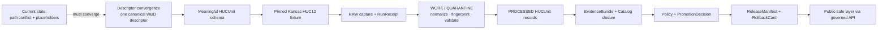

<!-- [KFM_META_BLOCK_V2]
doc_id: kfm://doc/adr-0026-hydrology-source-spine-starts-with-wbd-huc12
title: "ADR-0026 — Hydrology Source Spine Starts with WBD HUC12"
type: adr
adr_id: ADR-0026
version: v1.2
status: draft
owners:
  - "NEEDS VERIFICATION — architecture decision owner"
  - "NEEDS VERIFICATION — Hydrology lane steward"
  - "NEEDS VERIFICATION — source and evidence steward"
owner_status: "CODEOWNERS routes docs/adr/ and the affected trust-bearing roots to @bartytime4life; accepted stewardship, required-review rules, decision quorum, and independent approval controls were not verified"
reviewers_required:
  - Architecture steward
  - Docs steward
  - Hydrology lane steward
  - Source and evidence steward
  - Contract and schema steward
  - Policy reviewer
  - Release and rollback steward
created: 2026-05-09
updated: 2026-07-24
policy_label: public
truth_posture: cite-or-abstain
responsibility_root: docs/
current_path: docs/adr/ADR-0026-hydrology-source-spine-starts-with-wbd-huc12.md
supersedes: []
superseded_by: null
evidence_snapshot:
  repository: bartytime4life/Kansas-Frontier-Matrix
  base_ref: main
  base_commit: 8df9bd2b723c0d4cf88a32d357ea8c70895f1177
  target_prior_blob: 0678ac143d3a70d96b8ae5fba8ddaefdba18ca59
  adr_index_blob: cf08fae322ac53426f7394d97897fdb942253049
  adr_readme_blob: f1b5d34a53b6c717832d587de54989ce8192bcaa
  directory_rules_doctrine_blob: 2affb080e6f0043867c64c7f06c1ca52030fbd55
  codeowners_blob: dd2a84aa514d8ecd9208bc347f90f9a2ed37dd61
  hydrology_source_registry_blob: bae48e1ff332f217df151cd5dabf8b8d44d5c83b
  huc_unit_contract_blob: 180a87abef03c1990484c27931c7e52e6131a451
  huc_unit_schema_blob: 321c69f4686bfb7ecbb2a8f44a228405cdbcf9ce
  canonical_wbd_placeholder_blob: fc0ee3ffb2c426cb560f41d6091d17d8d7213e5d
  legacy_wbd_descriptor_blob: e6164c255333be2d365cc1b292e5d88fff55df1a
  huc12_fixture_blob: 18ce8f53f4c5a614bb78e89d4caf931b2b0112bf
  wbd_pipeline_spec_blob: fa0a527b2de824fffccb164bc485fa596d6c41f2
  hydrology_workflow_blob: f29f69bd5291d2f1bd20d4aefd49603abfa19807
related:
  - docs/adr/README.md
  - docs/adr/INDEX.md
  - docs/adr/ADR-0001-schema-home--schemas-contracts-v1-is-canonical.md
  - docs/adr/ADR-0009-hydrology-is-the-first-proof-bearing-lane.md
  - docs/adr/ADR-0017-source-descriptor-admission-process.md
  - docs/adr/ADR-0018-promotion-gate-sequence.md
  - docs/adr/ADR-0020-abstain-is-a-first-class-decision.md
  - docs/adr/ADR-0025-public-client-never-reads-canonical-internal-stores.md
  - docs/doctrine/directory-rules.md
  - docs/doctrine/lifecycle-law.md
  - docs/doctrine/truth-posture.md
  - docs/domains/hydrology/ARCHITECTURE.md
  - docs/domains/hydrology/SOURCE_REGISTRY.md
  - contracts/domains/hydrology/huc_unit.md
  - schemas/contracts/v1/domains/hydrology/huc_unit.schema.json
  - data/registry/sources/hydrology/wbd.source.yaml
  - data/registry/hydrology/sources/wbd_huc12.yaml
  - fixtures/domains/hydrology/valid/huc12_kansas_sample.json
  - pipeline_specs/hydrology/wbd_huc12_ingest.yaml
  - .github/workflows/domain-hydrology.yml
  - docs/registers/DRIFT_REGISTER.md
  - docs/registers/VERIFICATION_BACKLOG.md
tags: [kfm, adr, hydrology, source-spine, source-registry, wbd, huc12, huc-unit, lane-sequencing, evidence-first]
notes:
  - "v1.2 is a same-path repository-grounded modernization. It preserves source metadata draft and effective decision status proposed; it does not accept ADR-0026 or declare WBD HUC12 implemented or published."
  - "The canonical ADR index uniquely assigns ADR-0026 to this exact path."
  - "Current repository evidence contains two WBD descriptor surfaces: a canonical-home placeholder and a richer legacy-home descriptor. This is a path and authority conflict to resolve, not permission to maintain parallel descriptors."
  - "The existing HUCUnit semantic contract is substantive, while its paired machine schema remains permissive, the HUC12 fixture and ingest spec remain placeholders, and Hydrology CI deliberately holds executable validation, proof production, catalog closure, and release readiness."
  - "This ADR now targets the existing HUCUnit contract/schema family instead of proposing a competing huc12.schema.json authority."
[/KFM_META_BLOCK_V2] -->

<a id="top"></a>

# ADR-0026 — Hydrology Source Spine Starts with WBD HUC12

> **Proposed decision.** Within the Hydrology lane, the first source family to graduate from placeholder planning into a governed, proof-capable source spine is the **USGS Watershed Boundary Dataset at HUC12 granularity**. WBD HUC12 supplies watershed accounting and boundary context; it does not supply flow observations, flood regulation, observed inundation, terrain truth, emergency guidance, or publication authority.

[](#status)
[](#current-repository-evidence)
[](#source-descriptor-path-conflict)
[](#contract-schema-fixture-and-pipeline-posture)
[](#current-gate-status)
[](#authority-and-publication-boundary)

> [!IMPORTANT]
> **The ADR identity is confirmed; the decision is not accepted.** The canonical ADR index assigns `ADR-0026` to this exact file and normalizes its `draft` source metadata to effective status `proposed`. Editing this record, opening a pull request, passing documentation checks, or merging the change does not accept the decision.

> [!CAUTION]
> **The repository currently contains source-registry drift.** `data/registry/sources/hydrology/wbd.source.yaml` is a canonical-home placeholder, while `data/registry/hydrology/sources/wbd_huc12.yaml` is a richer proposed descriptor in a legacy path. This ADR does not choose “both.” A separate, reviewed migration must converge them into one canonical descriptor without losing useful fields or history.

> [!WARNING]
> **Current Hydrology readiness is not proof-bearing maturity.** The HUCUnit semantic contract is substantive, but the paired schema accepts any object, the HUC12 fixture and ingest spec are explicit placeholders, and the native Hydrology workflow deliberately holds executable validation, proof generation, catalog closure, and release readiness.

**Quick navigation:** [Status](#status) · [Evidence](#evidence-boundary) · [Current repository evidence](#current-repository-evidence) · [Context](#context) · [Decision](#decision) · [Trust path](#wbd-huc12-trust-path) · [Current gates](#current-gate-status) · [Consequences](#consequences) · [Alternatives](#alternatives-considered) · [Acceptance](#acceptance-gates) · [Migration](#migration-plan) · [Rollback](#rollback) · [Open work](#open-questions) · [References](#references)

---

<a id="status"></a>

## Status

| Field | Current value |
|---|---|
| **ADR ID** | `ADR-0026` — unique and confirmed in the canonical [`INDEX.md`](./INDEX.md) |
| **Tracked path** | `docs/adr/ADR-0026-hydrology-source-spine-starts-with-wbd-huc12.md` |
| **Source metadata** | `draft` |
| **Effective decision status** | `proposed` — not binding until the record and index carry matching reviewed `accepted` status |
| **Decision class** | Hydrology lane-internal source ordering and first-source graduation |
| **Proposed spine head** | USGS WBD HUC12 |
| **Current implementation posture** | Repository surfaces exist, but descriptor placement is conflicted and schema, fixture, pipeline, validation, proof, catalog, and release closure remain partial, placeholder, held, or unverified |
| **Publication effect** | None. This ADR, its pull request, a merge, a workflow result, or a placeholder artifact is not KFM publication evidence |
| **Supersedes / superseded by** | None / none |

### Governance acceptance versus source graduation

This ADR separates two states:

1. **ADR acceptance** approves the architectural sequence: WBD HUC12 is the first Hydrology source family expected to graduate.
2. **Source graduation** is an implementation claim requiring the complete evidence packet in [Implementation graduation gates](#implementation-graduation-gates).

Accepting the ADR would not activate a connector, validate a HUCUnit, produce an EvidenceBundle, release a layer, or publish data. Conversely, a script or green workflow cannot grant architectural acceptance.

[Back to top](#top)

---

<a id="evidence-boundary"></a>

## Evidence Boundary

This revision is grounded in a pinned repository snapshot. It distinguishes **tracked decision identity**, **configured surfaces**, **semantic meaning**, **machine enforcement**, **proof-bearing execution**, and **released operation**.

| Level | Meaning | Current WBD/HUC12 posture |
|---|---|---|
| **1. Tracked** | ADR identity, path, and proposed status are indexed | **CONFIRMED** |
| **2. Configured** | Relevant docs, contract, schema, descriptors, fixture, pipeline spec, and workflow paths exist | **CONFIRMED**, with source-registry path conflict |
| **3. Semantically specified** | Object and source roles are meaningfully bounded in prose | **PARTIAL**; HUCUnit contract is substantive, descriptor role vocabulary is not converged |
| **4. Shape-checked** | Machine schema rejects invalid HUCUnit records and validates a real fixture | **HELD**; current schema is permissive and fixture is a placeholder |
| **5. Proof-capable** | Deterministic no-network execution emits validated evidence, catalog, decision, and receipt objects | **HELD** |
| **6. Released / operated** | Governed release and public-safe serving are demonstrated with correction and rollback | **UNKNOWN / not evidenced** |

### Truth labels used in this ADR

- **CONFIRMED** — verified at the pinned repository snapshot.
- **PROPOSED** — the architectural decision or implementation target under review.
- **CONFLICTED** — repository surfaces compete or disagree and require explicit reconciliation.
- **NEEDS VERIFICATION** — a concrete check remains before reliance.
- **UNKNOWN** — current evidence cannot establish the claim.

[Back to top](#top)

---

<a id="current-repository-evidence"></a>

## Current Repository Evidence

### Decision and placement controls

- [`docs/adr/INDEX.md`](./INDEX.md) records a unique, contiguous ADR sequence and assigns `ADR-0026` to this exact path with effective status `proposed`.
- [`docs/adr/README.md`](./README.md) states that ADR presence does not grant acceptance and requires source metadata and effective status to remain separate.
- [`docs/doctrine/directory-rules.md`](../doctrine/directory-rules.md) assigns human decision records to `docs/adr/`, machine shape to `schemas/`, source registry entries to `data/registry/`, fixtures to `fixtures/`, executable pipeline logic to `pipelines/`, declarative specs to `pipeline_specs/`, and release decisions to `release/`.
- [`.github/CODEOWNERS`](../../.github/CODEOWNERS) routes `docs/adr/` and the affected trust-bearing roots to `@bartytime4life`. That is a GitHub review route, not accepted stewardship, independent approval, or decision authority.

<a id="source-descriptor-path-conflict"></a>

### Source descriptor path conflict

| Surface | Verified state | Consequence |
|---|---|---|
| `data/registry/sources/hydrology/wbd.source.yaml` | Explicit `PROPOSED` placeholder in the Directory Rules-aligned source-registry family | Confirms the intended responsibility root, but does not yet provide a usable WBD HUC12 descriptor |
| `data/registry/hydrology/sources/wbd_huc12.yaml` | Richer proposed descriptor with authority, rights, cadence, access, citation, and receipt-template fields | Useful lineage exists, but the path conflicts with the canonical family and its `role: primary` value is not yet reconciled with Hydrology source-role doctrine |
| `docs/domains/hydrology/SOURCE_REGISTRY.md` | Declares `data/registry/sources/hydrology/` as the registry data home and describes WBD as watershed-boundary authority/context | Supports convergence into the canonical family; does not by itself migrate files or settle the machine enum |

**Required posture:** do not create a third descriptor, do not treat both existing files as co-canonical, and do not delete either surface without a reviewed migration that preserves useful content and lineage.

<a id="contract-schema-fixture-and-pipeline-posture"></a>

### Contract, schema, fixture, and pipeline posture

| Surface | Verified state | What it proves | What it does not prove |
|---|---|---|---|
| `contracts/domains/hydrology/huc_unit.md` | Substantive semantic contract | HUCUnit is WBD-derived accounting/context geometry with source-vintage, evidence, release, correction, and rollback boundaries | Field-level enforcement or runtime behavior |
| `schemas/contracts/v1/domains/hydrology/huc_unit.schema.json` | `PROPOSED` scaffold with empty `properties` and `additionalProperties: true` | The canonical schema path exists | Required HUC fields, invalid-case rejection, or source-role enforcement |
| `fixtures/domains/hydrology/valid/huc12_kansas_sample.json` | Explicit placeholder record | The intended fixture path exists and parses as JSON | A real HUC12 fixture, geometry validity, source identity, or schema conformance |
| `pipeline_specs/hydrology/wbd_huc12_ingest.yaml` | Explicit placeholder created from docs inventory | The intended declarative pipeline-spec path exists | Accepted input contract, stage logic, idempotency, receipts, quarantine, or replay |
| `.github/workflows/domain-hydrology.yml` | Read-only readiness workflow on pull requests, `main` pushes, and manual dispatch | Required boundary paths and placeholder posture are checked | Hydrology truth, source admission, EvidenceBundle closure, proof production, release approval, or publication |

### Authority and publication boundary

WBD HUC12 is a source and accounting-geometry proposal. It is not automatically:

- an observed flow, stage, water-quality, or flood record;
- a FEMA regulatory flood determination;
- observed inundation;
- a terrain-derived hydrology model;
- emergency, engineering, insurance, navigation, or life-safety guidance;
- an accepted source descriptor, released layer, or KFM-published claim.

[Back to top](#top)

---

## Context

KFM designates Hydrology as the proposed first proof-bearing lane in [`ADR-0009`](./ADR-0009-hydrology-is-the-first-proof-bearing-lane.md). The lane still needs a first source family whose semantics, geometry, fixtures, validation, evidence, and release path are small enough to close without simultaneously solving time-series qualifiers, regulatory/observed flood separation, or network-identity ambiguity.

| Candidate spine head | Source class | Why it could lead | Why it increases first-slice burden |
|---|---|---|---|
| **WBD HUC12** | Watershed boundary authority/context | Deterministic public boundary units, compact fixture potential, stable aggregation context, geometry-fingerprint testability | Does not exercise observation qualifiers; descriptor and schema still require convergence |
| **NHDPlus HR** | Network identity and model/context | Anchors reach identity and flow topology | COMID/Permanent Identifier splits, merges, retirement, and ambiguity require explicit ABSTAIN behavior |
| **USGS Water Data / NWIS** | Observation | Exercises time series and monitoring locations | Requires parameter codes, units, qualifiers, provisional/final status, timestamps, time zones, and no-data semantics |
| **FEMA NFHL** | Regulatory flood context | Recognizable and user-relevant | Easy to collapse into observed inundation or predictive truth without a separate source-role decision |
| **USGS 3DEP** | Terrain/model input | Enables catchment and terrain derivatives | Derived input, not authoritative water-entity identity |
| **Observed flood evidence** | Historical/event evidence | Supports event reconstruction | Confidence, correction lineage, location exposure, and source-role separation materially increase risk |

WBD HUC12 remains the smallest credible spine head, but the current repository proves only that its supporting surfaces are planned and partially specified—not that the source has graduated.

---

## Scope and Non-Decisions

This ADR decides one architectural question:

> **When the Hydrology lane graduates its first source family, WBD HUC12 leads the source spine.**

It does **not** decide or perform:

- acceptance of ADR-0026;
- connector activation or live source retrieval;
- current WBD endpoint behavior, terms, attribution, or cadence;
- the final machine enum for WBD source role;
- the final canonical descriptor leaf filename;
- schema field names beyond the reviewed HUCUnit contract;
- geometry canonicalization precision or projection rules;
- the fixture watershed, extent, or source snapshot;
- NHDPlus identity ambiguity policy;
- NFHL versus observed-flood source-role policy;
- governed API routes, UI components, or runtime DTO names;
- proof generation, release approval, deployment, or publication;
- migration of the two existing descriptor surfaces in this documentation-only change.

---

## Forces

- **Trust membrane.** The first source must walk the governed lifecycle without public clients reading canonical or internal stores.
- **Cite-or-abstain.** Ambiguous network identity and unresolved source-role claims must abstain rather than guess.
- **Source-role separation.** WBD boundary context must not collapse into observation, regulation, model output, or emergency guidance.
- **Determinism.** HUC12 identity, source snapshot, normalized geometry, content digest, and replay inputs must be inspectable.
- **Small no-network proof.** A bounded Kansas fixture should permit deterministic CI without live-source dependence.
- **Directory governance.** One source-registry home and one HUCUnit schema authority must be preserved.
- **Reversibility.** Descriptor convergence, fixture updates, source refreshes, and release candidates need correction and rollback paths.
- **Evidence before polish.** A badge, map layer, documentation claim, or green readiness check cannot substitute for source, schema, proof, policy, and release closure.

---

## Decision

If accepted, KFM will apply the following rules.

### 1. WBD HUC12 leads Hydrology source graduation

WBD HUC12 is the first Hydrology source family permitted to move beyond placeholder/readiness state. Other Hydrology source families may retain planning scaffolds, but they must not be presented as the lane's published spatial anchor before WBD HUC12 itself satisfies the implementation graduation gates.

### 2. Use the existing HUCUnit semantic and schema authority

- Human object meaning remains in [`contracts/domains/hydrology/huc_unit.md`](../../contracts/domains/hydrology/huc_unit.md).
- Machine shape remains in [`schemas/contracts/v1/domains/hydrology/huc_unit.schema.json`](../../schemas/contracts/v1/domains/hydrology/huc_unit.schema.json).
- This ADR **does not authorize** a competing `huc12.schema.json`.
- HUC12 is a level/granularity of `HUCUnit`, not a parallel object family, unless a later accepted ADR demonstrates that the domain model requires a separate type.

### 3. Converge WBD descriptor authority before source activation

The canonical responsibility family is `data/registry/sources/hydrology/`. The two current WBD surfaces must be reconciled through a separate migration:

1. preserve useful descriptor fields and commit lineage;
2. choose one canonical descriptor under `data/registry/sources/hydrology/`;
3. mark any temporary compatibility file explicitly and prohibit independent evolution;
4. update references, validators, tests, and receipts atomically;
5. record the drift resolution and rollback target.

The preferred canonical leaf `wbd_huc12.yaml` is **PROPOSED**. The migration must verify repository conventions and the source-descriptor contract before adopting it.

### 4. Keep the source role bounded

The semantic source role is **watershed boundary authority/context used for accounting and aggregation**. The exact machine vocabulary remains **NEEDS VERIFICATION** because current repository surfaces use non-converged terms such as `primary`, `authority`, and `context`.

Whatever enum is adopted, WBD HUC12 must not be promoted as:

- `observed`;
- `regulatory`;
- observed-flood evidence;
- a terrain/model output;
- emergency or life-safety authority.

### 5. Graduate the existing fixture and pipeline paths

- Replace the placeholder at `fixtures/domains/hydrology/valid/huc12_kansas_sample.json` with a pinned, rights-reviewed, no-network HUC12 fixture only after the HUCUnit schema can validate it.
- Graduate `pipeline_specs/hydrology/wbd_huc12_ingest.yaml` from placeholder to an accepted declarative spec that names input contract, outputs, lifecycle stages, receipts, quarantine reasons, idempotency, replay, and rollback.
- Do not let fixture or pipeline-spec presence imply source activation or publication.

### 6. Detect material change through normalized content

Source metadata dates may be retained as signals, but material change requires deterministic comparison over the reviewed source snapshot and normalized content. Geometry fingerprinting must define CRS, coordinate precision, ring orientation, feature ordering, and hash input before it can gate promotion.

### 7. Preserve downstream source order

After WBD HUC12 graduates, the proposed lane sequence is:

1. **NHDPlus HR** — reach/network identity with explicit ambiguity and ABSTAIN behavior.
2. **USGS Water Data / NWIS** — observations with parameter, unit, qualifier, approval, time, and no-data semantics.
3. **FEMA NFHL** — regulatory flood context, explicitly separated from observed inundation.
4. **USGS 3DEP** — terrain/model input with derivative manifests.
5. **Observed flood evidence** — historical/event evidence with confidence and correction lineage.

A deviation requires a superseding or amending ADR with stronger evidence.

### Conformance language

- The Hydrology lane **MUST NOT** maintain parallel canonical WBD descriptors.
- The Hydrology lane **MUST NOT** create a parallel HUC12 machine schema while `huc_unit.schema.json` is the tracked HUCUnit schema authority.
- WBD HUC12 **MUST NOT** be represented as observation, regulation, observed inundation, terrain/model output, or life-safety authority.
- A real fixture **MUST** validate against a meaningful schema and carry source snapshot, digest, and provenance.
- A promotion candidate **MUST** close source identity, rights, source role, schema, evidence, policy, catalog, review, release, correction, and rollback gates.
- A gate that did not run **MUST NOT** be reported as passed.
- Watchers, readiness workflows, placeholders, documentation, commits, and pull requests **MUST NOT** publish.

[Back to top](#top)

---

## Directory Rules Placement Basis

| Surface | Responsibility | Verified or intended home | Current posture |
|---|---|---|---|
| ADR | Human decision record | `docs/adr/ADR-0026-hydrology-source-spine-starts-with-wbd-huc12.md` | **CONFIRMED path** |
| Hydrology source registry guide | Human source-role and admission reference | `docs/domains/hydrology/SOURCE_REGISTRY.md` | **CONFIRMED path** |
| WBD source descriptor | Source identity, rights, cadence, role, activation posture | `data/registry/sources/hydrology/<descriptor>.yaml` | **CONFLICTED**; canonical placeholder and legacy richer descriptor exist |
| HUCUnit meaning | Semantic contract | `contracts/domains/hydrology/huc_unit.md` | **CONFIRMED path** |
| HUCUnit shape | Machine schema | `schemas/contracts/v1/domains/hydrology/huc_unit.schema.json` | **CONFIRMED scaffold path** |
| HUC12 fixture | No-network test input | `fixtures/domains/hydrology/valid/huc12_kansas_sample.json` | **CONFIRMED placeholder path** |
| WBD ingest spec | Declarative pipeline configuration | `pipeline_specs/hydrology/wbd_huc12_ingest.yaml` | **CONFIRMED placeholder path** |
| Connector / executable pipeline | Source retrieval and lifecycle execution | `connectors/` and `pipelines/` under verified source/domain conventions | **NEEDS VERIFICATION**; not authorized by this ADR edit |
| Validation | Repository-wide validators and domain tests | `tools/validators/` and `tests/domains/hydrology/` | **HELD / NEEDS VERIFICATION** |
| Lifecycle material | RAW, WORK/QUARANTINE, PROCESSED, CATALOG/TRIPLET, PUBLISHED | `data/<phase>/hydrology/` | **PROPOSED until emitted by governed runs** |
| Release decisions | Promotion, manifest, correction, rollback | `release/` | **PROPOSED until emitted and reviewed** |

> [!NOTE]
> The owning roots are verified repository responsibilities. A specific missing leaf is not made real by this table. Any new, moved, or renamed path requires its own scoped change, inbound-reference review, validation, and rollback.

---

<a id="wbd-huc12-trust-path"></a>

## WBD HUC12 Trust Path


```mermaid
flowchart LR
    A["Descriptor convergence<br/>one canonical WBD descriptor"] --> B["Meaningful HUCUnit schema"]
    B --> C["Pinned Kansas HUC12 fixture"]
    C --> D["RAW capture + RunReceipt"]
    D --> E["WORK / QUARANTINE<br/>normalize · fingerprint · validate"]
    E --> F["PROCESSED HUCUnit records"]
    F --> G["EvidenceBundle + Catalog closure"]
    G --> H["Policy + PromotionDecision"]
    H --> I["ReleaseManifest + RollbackCard"]
    I --> J["Public-safe layer via governed API"]

    X["Current state:<br/>path conflict + placeholders"] -. "must converge" .-> A
```

Each arrow is a governed transition with an inspectable output. None is a file move, map toggle, documentation assertion, or AI-generated conclusion.

---

<a id="current-gate-status"></a>

## Current Gate Status

| Gate | Current status | Evidence |
|---|---|---|
| ADR identity and numbering | **PASS** | Canonical index uniquely assigns ADR-0026 |
| ADR acceptance | **PENDING / proposed** | No reviewed `accepted` status |
| Directory placement | **PARTIAL** | Owning roots are clear; descriptor leaf authority is conflicted |
| Source identity and role | **CONFLICTED** | Canonical placeholder and legacy richer descriptor use different paths and non-converged role vocabulary |
| Rights and terms | **NEEDS VERIFICATION** | Legacy descriptor asserts public-domain posture; current source review and activation evidence were not verified |
| HUCUnit semantic contract | **PARTIAL** | Substantive contract exists |
| HUCUnit machine schema | **HOLD** | Empty properties and `additionalProperties: true` |
| Pinned HUC12 fixture | **HOLD** | Current fixture is an explicit placeholder |
| Ingest pipeline spec | **HOLD** | Current spec is an explicit placeholder |
| Executable validators and tests | **HOLD** | Hydrology workflow deliberately detects and rejects uncoordinated executable graduation |
| EvidenceBundle and catalog closure | **HOLD / UNKNOWN** | No deterministic HUC12 proof packet verified |
| Release and rollback closure | **HOLD / UNKNOWN** | No governed HUC12 release packet verified |
| Public publication | **NONE** | No KFM publication evidence |

A green `domain-hydrology` readiness result proves only the bounded checks stated by that workflow. It does not upgrade any held gate.

---

## Consequences

### Positive

- Establishes one conservative, public-safe spatial anchor for later Hydrology sources.
- Reuses the existing HUCUnit domain model instead of creating a competing HUC12 schema family.
- Surfaces the current descriptor-path conflict before more consumers depend on it.
- Makes the first implementation slice small enough for deterministic no-network proof.
- Forces geometry canonicalization, source-vintage, evidence, and rollback discipline early.
- Keeps NFHL regulatory context, NWIS observations, network identity, terrain derivatives, and observed flood evidence semantically separate.
- Gives MapLibre and downstream clients a future public-safe accounting layer without making the renderer a truth source.

### Negative and trade-offs

- The first slice does not exercise observation qualifiers, provisional/final states, or time-series no-data behavior.
- Descriptor convergence requires a separate multi-reference migration rather than a one-file documentation change.
- The source-role enum cannot be finalized until the source-descriptor contract and Hydrology registry vocabulary converge.
- A real HUC12 fixture may expose geometry canonicalization and source-snapshot questions that the current scaffold avoids.
- WBD refresh remains blocked until endpoint, terms, attribution, cadence, and material-change rules are verified.

### Neutral

- The first public candidate would be watershed accounting/context, not a gauge, flood, or terrain layer.
- Accepting this ADR would approve sequencing only; proof-bearing and release states remain separately gated.

---

## Alternatives Considered

### A — Start with NHDPlus HR

**Rejected for the first slice.** It introduces reach-identity splits, merges, retirement, and ambiguous crosswalks before the lane has executable ABSTAIN policy.

### B — Start with USGS Water Data / NWIS

**Rejected for the first slice.** It requires observation semantics, parameter codes, units, qualifiers, approval state, timestamps, time zones, and no-data outcomes in the same proof packet.

### C — Start with FEMA NFHL

**Rejected for the first slice.** NFHL is regulatory flood context, not observed inundation or prediction. Leading with it increases source-role collapse risk.

### D — Start with USGS 3DEP or terrain-derived hydrology

**Rejected.** Terrain is a derivative/model input, not the authoritative Hydrology accounting identity.

### E — Admit any Hydrology source first

**Rejected.** Without a designated spatial spine, downstream sources choose incompatible join keys and silently accumulate identity drift.

### F — Create a new HUC12-specific schema beside HUCUnit

**Rejected by current repository evidence.** The repository already has a HUCUnit semantic contract and tracked machine schema. A second HUC12 authority would create parallel machine meaning unless a later ADR proves a distinct bounded type is necessary.

---

<a id="acceptance-gates"></a>

## Acceptance Gates

### Governance acceptance gates

ADR-0026 may move from `proposed` to `accepted` only when:

- [ ] The record and canonical index are updated together with matching reviewed status.
- [ ] Named decision owners and reviewers are verified; CODEOWNERS routing is not treated as approval.
- [ ] The WBD-first sequence and its non-decisions are explicitly reviewed.
- [ ] The descriptor-path conflict has an approved migration disposition or a bounded blocking plan.
- [ ] The decision confirms reuse of the HUCUnit contract/schema family or records a reviewed alternative.
- [ ] The source-role semantic boundary is approved without pretending the machine enum is already settled.
- [ ] Alternatives, consequences, migration impact, and rollback remain complete.
- [ ] No non-Markdown implementation or publication claim is bundled into the acceptance transition without its own evidence.

### Implementation graduation gates

WBD HUC12 may graduate beyond placeholder/readiness state only when:

- [ ] Exactly one canonical WBD descriptor exists in the `data/registry/sources/hydrology/` authority family; any compatibility path is explicit and non-evolving.
- [ ] Current source rights, terms, attribution, endpoint, cadence, steward, and activation posture are verified.
- [ ] `huc_unit.schema.json` enforces reviewed HUC identity, level, source snapshot, temporal scope, geometry/digest, evidence, and release fields.
- [ ] Invalid HUCUnit fixtures are rejected and a pinned Kansas HUC12 fixture passes.
- [ ] Geometry canonicalization and content fingerprinting are deterministic and tested.
- [ ] The WBD ingest spec defines accepted inputs, lifecycle outputs, quarantine reasons, receipts, idempotency, replay, and rollback.
- [ ] A no-network run emits validated RAW/WORK/PROCESSED artifacts and receipts.
- [ ] EvidenceRef resolves to EvidenceBundle for representative HUC12 claims.
- [ ] STAC, DCAT, PROV, and any CatalogMatrix surface agree.
- [ ] Policy and PromotionDecision gates run fail closed.
- [ ] ReleaseManifest, correction path, and RollbackCard exist before public serving.
- [ ] Public clients use governed APIs or released artifacts, never canonical/internal stores.
- [ ] The workflow no longer reports readiness hold for the graduated capability and its replacement checks are reviewed.

---

<a id="migration-plan"></a>

## Migration Plan

This ADR edit changes only Markdown. The source-registry and machine surfaces require a separate scoped migration.

1. **Inventory and freeze**
   - Pin both existing WBD descriptor blobs and all inbound references.
   - Prevent either descriptor from being independently upgraded while the conflict is open.
2. **Reconcile meaning**
   - Compare fields against the source-descriptor contract, Hydrology source registry, rights policy, and activation workflow.
   - Resolve `primary` versus authority/context role vocabulary without silently promoting a source role.
3. **Select one canonical descriptor**
   - Place the canonical descriptor under `data/registry/sources/hydrology/`.
   - Prefer `wbd_huc12.yaml` only after leaf naming and schema validation are reviewed.
4. **Preserve compatibility only when required**
   - A temporary legacy file must declare compatibility class, canonical target, deprecation condition, and non-evolution rule.
5. **Update consumers atomically**
   - Pipeline specs, validators, tests, docs, receipts, and source references move in one bounded migration.
6. **Validate and record**
   - Run source-descriptor, path, link, test, and workflow checks.
   - Record the drift resolution, implementation commit, and rollback target.

No migration is authorized by this one-file documentation pull request.

---

<a id="rollback"></a>

## Rollback

### Documentation change rollback

Before merge, close or abandon the draft PR and branch. After merge, revert the implementation commit through a transparent revert PR. Do not rewrite shared history.

### Decision and implementation rollback

| Failure condition | Rollback action | Evidence to retain |
|---|---|---|
| ADR status changed without reviewed acceptance | Restore `proposed`; reconcile index and record | Review history; index diff; correction note |
| Descriptor migration loses fields or breaks consumers | Restore pinned pre-migration descriptors; mark conflict open | Blob hashes; inbound-reference inventory; migration report |
| Two descriptors continue evolving | Freeze both; designate no source active; return to quarantine/readiness | Drift entry; source activation decisions |
| HUCUnit schema rejects valid source data incorrectly | Revert schema and fixture together; retain failing cases | Schema hash; fixture hashes; validation report |
| Geometry fingerprint is unstable | Quarantine outputs; restore prior fixture/snapshot | Canonicalization config; hashes; reviewer diff |
| WBD role is used as observation, regulation, or event truth | Withdraw affected claims/layers; issue correction if exposed | EvidenceBundle diff; PolicyDecision; CorrectionNotice |
| Non-HUC12 source is promoted as the lane anchor first | Revert candidate and dependent artifacts; mark them stale | PromotionDecision; ReleaseManifest; RollbackCard |
| Public client reads canonical/internal WBD stores | Disable route or layer; restore governed boundary | Access logs where permitted; incident/correction record |

Rollback target for this documentation update: the prior blob recorded in the meta block. Rollback target for a future source release: the preceding reviewed source descriptor, fixture, processed artifact, and ReleaseManifest set.

---

## Validation

### Documentation validation

- One H1 and matching `ADR-0026` filename/H1 identity.
- Source metadata remains `draft`; effective decision status remains `proposed`.
- Stable `doc_id`, created date, path, and ADR number are preserved.
- Related ADR links use current tracked filenames.
- Repository-relative links point to verified paths.
- Badge claims are repeated in text and backed by pinned repository evidence.
- Mermaid uses a single grounded flow with a text explanation.
- No placeholder owner is converted into a verified steward.
- No source, schema, fixture, proof, release, or publication maturity is overstated.

### Repository-native validation

Run from repository root:

```bash
python tools/validators/validate_adr_index.py
python -m pytest tests/validators/test_validate_adr_index.py -q --strict-config --strict-markers
```

Observe the read-only documentation and Hydrology workflows. A green result proves only what each workflow states. It does not accept ADR-0026, activate WBD, prove Hydrology truth, or authorize publication.

---

## Risks

| Risk | Current control | Remaining action |
|---|---|---|
| Parallel WBD descriptor authority | Conflict is explicit in this ADR | Governed migration and compatibility disposition |
| HUCUnit schema appears stronger than it is | Scaffold status is visible | Add reviewed fields and invalid fixtures |
| Placeholder fixture is treated as data | Placeholder status is explicit | Replace only after schema/source review |
| Green readiness workflow is treated as proof | Workflow and ADR repeat the hold boundary | Graduate checks deliberately with real producers |
| WBD context is treated as observation/regulation | Source-role anti-collapse language | Enforce with schema, policy, tests, and UI labels |
| Geometry hash changes across tools | No accepted canonicalization yet | Pin CRS, precision, ordering, normalization, and test vectors |
| External facts become stale | Endpoint/terms/cadence remain NEEDS VERIFICATION | Current source review before activation |
| Acceptance is confused with implementation | Separate gate sets | Keep review and proof evidence distinct |
| Map layer becomes truth authority | Governed API and EvidenceBundle boundary | Click-to-evidence and release-manifest tests |

---

<a id="open-questions"></a>

## Open Questions

- **NEEDS VERIFICATION:** Which exact SourceDescriptor schema and contract are accepted for the migration?
- **NEEDS VERIFICATION:** What canonical leaf filename should replace the two current WBD surfaces?
- **NEEDS VERIFICATION:** Which machine source-role enum represents watershed boundary authority/context without collapsing into `observed`, `regulatory`, or `modeled`?
- **NEEDS VERIFICATION:** Which Kansas HUC12, source snapshot, and geometry extent provide the smallest meaningful positive and negative test set?
- **NEEDS VERIFICATION:** What CRS, coordinate precision, ring orientation, feature ordering, and canonical serialization define the geometry fingerprint?
- **NEEDS VERIFICATION:** What WBD endpoint, service layer, rights/attribution posture, and refresh cadence are current at activation time?
- **NEEDS VERIFICATION:** Which validators and tests become the accepted executable Hydrology suite?
- **UNKNOWN:** Which independent reviewers will satisfy decision acceptance and release separation of duties?
- **UNKNOWN:** Whether any governed HUC12 proof packet or release exists outside the inspected repository surfaces.

---

<a id="references"></a>

## References

| Reference | Role |
|---|---|
| [`docs/adr/INDEX.md`](./INDEX.md) | Confirms ADR-0026 identity and proposed effective status |
| [`docs/adr/README.md`](./README.md) | ADR operating contract, lifecycle, review, and validation |
| [`ADR-0001`](./ADR-0001-schema-home--schemas-contracts-v1-is-canonical.md) | Canonical machine-schema home |
| [`ADR-0009`](./ADR-0009-hydrology-is-the-first-proof-bearing-lane.md) | Proposed Hydrology-first proof sequencing and graduation burden |
| [`ADR-0017`](./ADR-0017-source-descriptor-admission-process.md) | Proposed source-descriptor admission process |
| [`ADR-0018`](./ADR-0018-promotion-gate-sequence.md) | Proposed promotion-gate sequence |
| [`ADR-0020`](./ADR-0020-abstain-is-a-first-class-decision.md) | Proposed first-class ABSTAIN posture |
| [`ADR-0025`](./ADR-0025-public-client-never-reads-canonical-internal-stores.md) | Proposed public-client trust membrane |
| [`Directory Rules`](../doctrine/directory-rules.md) | Placement and responsibility-root doctrine |
| [`Hydrology Source Registry`](../domains/hydrology/SOURCE_REGISTRY.md) | Human source-family, source-role, rights, and admission reference |
| [`HUCUnit semantic contract`](../../contracts/domains/hydrology/huc_unit.md) | Current semantic authority for HUC units |
| [`HUCUnit schema`](../../schemas/contracts/v1/domains/hydrology/huc_unit.schema.json) | Current machine-schema scaffold |
| [`Canonical WBD placeholder`](../../data/registry/sources/hydrology/wbd.source.yaml) | Current placeholder in canonical source-registry family |
| [`Legacy WBD descriptor`](../../data/registry/hydrology/sources/wbd_huc12.yaml) | Current richer descriptor in conflicting legacy path |
| [`HUC12 fixture placeholder`](../../fixtures/domains/hydrology/valid/huc12_kansas_sample.json) | Current planned fixture path |
| [`WBD ingest-spec placeholder`](../../pipeline_specs/hydrology/wbd_huc12_ingest.yaml) | Current planned declarative pipeline path |
| [`Hydrology readiness workflow`](../../.github/workflows/domain-hydrology.yml) | Read-only checks and explicit readiness/proof/release holds |
| [`Drift Register`](../registers/DRIFT_REGISTER.md) | Placement and authority conflict record |
| [`Verification Backlog`](../registers/VERIFICATION_BACKLOG.md) | Concrete unresolved checks |

External WBD endpoints, source terms, attribution, and service metadata remain **NEEDS VERIFICATION** before source activation. This ADR intentionally does not pin volatile URLs as current operational truth.

---

<sub>↥ <a href="#top">Back to top</a></sub>
