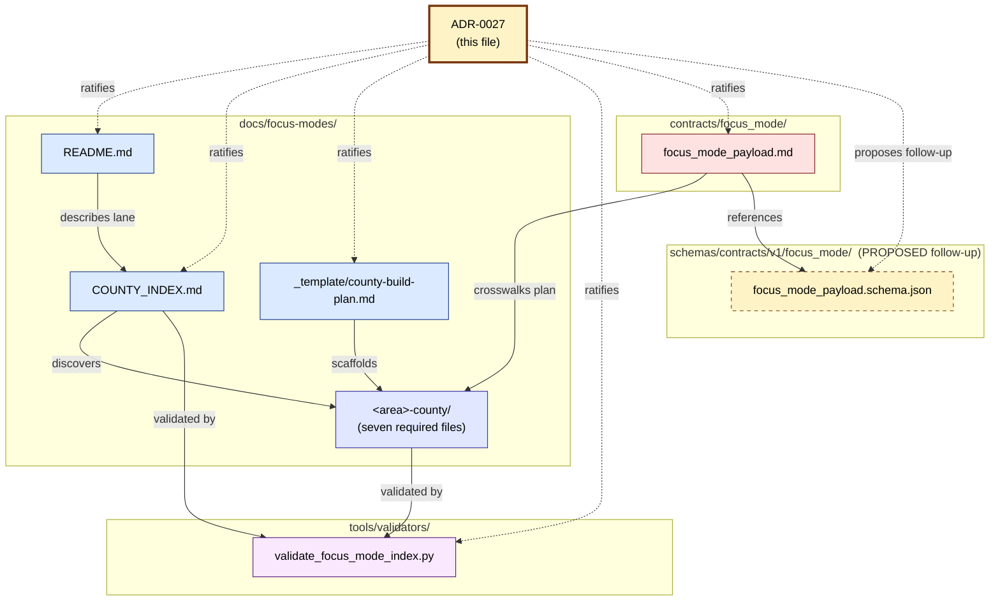

<!-- [KFM_META_BLOCK_V2]
doc_id: kfm://adr/0027                                                        # NEEDS_VERIFICATION until registered
title: ADR-0027 — County Focus Mode Control Plane
type: standard
adr_number: "0027"                                                            # NEEDS_VERIFICATION against live docs/adr/
version: v0.2
status: PROPOSED
owners:
  - <OWNER:focus-mode-steward>
  - <OWNER:directory-rules-steward>
deciders:
  - <DECIDER:repo-steward>
  - <DECIDER:directory-rules-steward>
created: 2026-05-22
updated: 2026-05-22
policy_label: public
supersedes: []
superseded_by: []
related:
  - docs/doctrine/directory-rules.md
  - docs/focus-modes/README.md
  - docs/focus-modes/COUNTY_INDEX.md
  - docs/focus-modes/_template/county-build-plan.md
  - tools/validators/validate_focus_mode_index.py
  - contracts/focus_mode/focus_mode_payload.md
  - schemas/contracts/v1/focus_mode/focus_mode_payload.schema.json            # NEEDS_VERIFICATION (PROPOSED follow-up)
  - docs/adr/ADR-0001-schema-home.md                                          # NEEDS_VERIFICATION
  - docs/adr/ADR-0003-policy-singular-is-canonical.md                         # NEEDS_VERIFICATION (informal conflict)
tags:
  - kfm
  - adr
  - focus-mode
  - control-plane
  - directory-rules
  - county
  - proof-slice
notes:
  - ADR number is PROPOSED as 0027; assign next available from live docs/adr/ at acceptance.
  - Resolves singular/plural naming question for docs/focus-modes/.
  - No live repository was mounted in the authoring session; every emitted file path is PROPOSED.
[/KFM_META_BLOCK_V2] -->

<a id="top"></a>

# ADR-0027 — County Focus Mode Control Plane

> Ratify the six-artifact governance subsystem for `docs/focus-modes/` and resolve the singular-vs-plural naming question before producing more per-county build plans.


**Status:** PROPOSED · **Class:** structural-move ADR (`directory-rules.md` §2.4, §14.2) · **Owners:** `<OWNER:focus-mode-steward>`, `<OWNER:directory-rules-steward>` · **Deciders:** `<DECIDER:repo-steward>`, `<DECIDER:directory-rules-steward>` · **Created:** 2026-05-22 · **Last reviewed:** 2026-05-22

> [!IMPORTANT]
> **ADR number is `0027` (PROPOSED).** Several corpus documents informally reserve `ADR-0003` for different topics, and a prior session emitted `docs/adr/ADR-0003-policy-singular-is-canonical.md` (NEEDS_VERIFICATION against the live tree). Assign the next available ID from `docs/adr/` at acceptance.

---

## Contents

- [1. Status](#1-status)
- [2. Context](#2-context)
- [3. Decision](#3-decision)
- [4. Control plane at a glance](#4-control-plane-at-a-glance)
- [5. Evidence basis](#5-evidence-basis)
- [6. Directory Rules basis](#6-directory-rules-basis)
- [7. Consequences](#7-consequences)
- [8. Migration plan](#8-migration-plan)
- [9. Alternatives considered](#9-alternatives-considered)
- [10. Validation](#10-validation)
- [11. Rollback](#11-rollback)
- [12. Open questions](#12-open-questions)
- [13. Cross-references](#13-cross-references)
- [14. Acceptance criteria](#14-acceptance-criteria)

---

## 1. Status

**PROPOSED — not yet accepted.** This ADR ratifies the county Focus Mode control plane as a governed subsystem of `docs/focus-modes/` and resolves the singular/plural naming question.

| Field | Value |
|---|---|
| ADR number | `0027` (PROPOSED; **OPEN-FM-08** pending live `docs/adr/` inspection) |
| Class | Structural-move ADR per `directory-rules.md` §2.4 + §14.2 |
| Scope | Six in-repo artifacts + one naming decision |
| Reversibility | Fully reversible (no released payloads, no superseded contracts) |
| Truth posture | Doctrine CONFIRMED; every emitted path PROPOSED |

[↑ Back to top](#top)

---

## 2. Context

**CONFIRMED corpus state.** Eleven county Focus Mode Build Plans are at `status: draft` per `directory-rules.md` v1.2 §0, and the actual enumeration in `Master_MapLibre_Components-Functions-Features_v2_1_FULL.md` Appendix C (dated 2026-05-21) reaches **34**. Without a control plane the work is becoming a growing collection of Markdown files: there is **no master index, no standardized metadata, no validator, and no documented bridge from a county plan to a `FocusModePayload`**.

Three specific problems motivate this ADR:

1. **No navigability.** New collaborators cannot tell which counties are in flight, planned, or untouched. Duplicate selection is possible because no lookup gate exists. Cost grows linearly with each new county.
2. **No standard metadata.** Each county build plan can drift in shape, making cross-county reasoning, validation, and plan-to-payload generation impossible.
3. **No payload bridge.** The doctrine repeatedly states *"a Focus Mode is not a publication target by itself"* (`directory-rules.md` §6.7; `kfm_repository_structure_guiding_document.md` §8.3), but no document in the corpus declares the **path** by which a county plan becomes a governed UI payload. The slice can become an indefinite-residence Markdown collection by default.

> [!WARNING]
> **Compounding drift.** The user's incoming prompt referenced `docs/focus-mode/` (singular hyphen). `directory-rules.md` v1.2 §6.7.2 specifies `docs/focus-modes/` (plural hyphen) as canonical, and §13.5 lists singular variants as drift candidates. The live-repo state of these folders is **NEEDS VERIFICATION**.

[↑ Back to top](#top)

---

## 3. Decision

Establish a **six-artifact control plane** that gates further per-county work, and **resolve the naming question** in favor of the plural canonical.

### 3.1 The six artifacts

| # | Artifact | Role |
|---|---|---|
| 1 | `docs/focus-modes/README.md` | Lane doctrine, lifecycle (`not-started → planned → draft → validated → payload-ready → released → rolled-back/deprecated`), the add-a-county procedure, and the per-area required-file set. |
| 2 | `docs/focus-modes/COUNTY_INDEX.md` | The master index of all 105 Kansas counties: status, lane path, owner, priority, sensitivity hot lanes, validation state. |
| 3 | `docs/focus-modes/_template/county-build-plan.md` | The standardized build-plan template, including a YAML front-matter spec that the validator parses. Leading-underscore folder name signals "not a county lane" to the validator. |
| 4 | `tools/validators/validate_focus_mode_index.py` | Lightweight stdlib-only Python validator running **twelve checks** (parsing, 105-county presence, no duplicates, lane folder presence, required-file presence, front-matter shape, `ui_shell` correctness, no schema-home violation, no `apps/web/` drift, lane naming, acceptance items, link resolution). |
| 5 | `contracts/focus_mode/focus_mode_payload.md` | Semantic contract that crosswalks a county plan into a `FocusModePayload`, gates the finite outcome envelope (`ANSWER \| ABSTAIN \| DENY \| ERROR`), and lists required companion objects. |
| 6 | This ADR — `docs/adr/ADR-0027-county-focus-mode-control-plane.md` | Formalizes the control plane. |

### 3.2 Naming resolution

- **Canonical name is `docs/focus-modes/`** (plural, hyphen). This matches `directory-rules.md` v1.2 §6.7.2 and the rest of the corpus's cross-host-root placement table.
- If the live tree contains `docs/focus-mode/` (singular), it is **drift** and must be migrated to `docs/focus-modes/` under this ADR. Migration discipline follows §8 below.

### 3.3 Out of scope (deferred to follow-ups)

- The machine schema `schemas/contracts/v1/focus_mode/focus_mode_payload.schema.json` is **PROPOSED** by this ADR but not authored in this PR. Emission belongs to a follow-up **PR-1b** with its own ADR-cited Directory-Rules basis.
- Per-county `policy/sensitivity/<area>/` override files. Authored only when a county justifies a default override; deny-fixture required.
- Per-area validators referenced in `contracts/focus_mode/focus_mode_payload.md` §3 (`validate_layer_manifest.py`, `validate_evidence_bundle.py`, `validate_promotion_decision.py`, `validate_run_receipt.py`) — emit in subsequent PRs.

[↑ Back to top](#top)

---

## 4. Control plane at a glance



> [!NOTE]
> The dashed border on `schemas/contracts/v1/focus_mode/` reflects that the machine schema is **PROPOSED** by this ADR but emitted in PR-1b, not this PR.

[↑ Back to top](#top)

---

## 5. Evidence basis

### 5.1 CONFIRMED doctrine

- `directory-rules.md` v1.2 §6.7 (Focus Modes placement contract); §6.7.2 (per-host-root casing); §6.7.6 (four-PR sequence); §13.5 (drift register, anti-patterns #8–#10); §15 (per-root README contract); §2.4 (ADR triggers); §14.2 (structural-move discipline).
- `kfm_repository_structure_guiding_document.md` §3 (root-stays-boring); §8 (Focus Mode placement contract); §8.4 (recommended first-PR sequence); §8.5 (eleven counties in flight).
- `kfm_unified_doctrine_synthesis.md` Part III (cite-or-abstain); Part V (finite outcome envelope); Part VI (promotion gates A–G); Part VII (publication / sensitivity); Part XI (validator worked example).
- `ai-build-operating-contract.md` §10 (AI is interpretive); §26 (governed loop); §27 (PR discipline); §28 (ADR triggers); §29 (object-family guardrails).
- `Master_MapLibre_Components-Functions-Features_v2_1_FULL.md` §16.3 (COUNTY-01..04 family); Appendix C (county Build Plan index — 34 enumerated).

### 5.2 PROPOSED

Every file path emitted by this ADR. No live repo was mounted in the authoring session, so every path is `PROPOSED` pending verification. The first run of `validate_focus_mode_index.py` against the live tree will produce a verification snapshot at `artifacts/focus_mode_index.json` (path also PROPOSED).

### 5.3 Truth-label index

| Symbol | Meaning | Where used |
|---|---|---|
| CONFIRMED | Verified in this session from attached doctrine | §5.1, the placement contract restatements |
| INFERRED | Derivable from visible evidence but not directly stated | §3.2 (the singular path is drift if present) |
| PROPOSED | Design/path not yet verified in implementation | Every file path emitted by this ADR; the ADR number `0027` |
| NEEDS VERIFICATION | Checkable, not yet checked | Live-repo state of `docs/focus-mode/` vs `docs/focus-modes/`; ADR-0001 / ADR-0003 path |
| UNKNOWN | Not resolvable without more evidence | Whether any existing county lane already populates the seven-required-file set |

[↑ Back to top](#top)

---

## 6. Directory Rules basis

| Artifact | Host root | Casing | Authority cited |
|---|---|---|---|
| `docs/focus-modes/README.md` | `docs/` | kebab-case plural | §6.1, §6.7, §15 |
| `docs/focus-modes/COUNTY_INDEX.md` | `docs/` | kebab-case lane + SCREAMING_SNAKE filename (matches existing register conventions, e.g., `docs/registers/DRIFT_REGISTER.md`) | §6.1, §6.7.2 |
| `docs/focus-modes/_template/county-build-plan.md` | `docs/` | `_template/` leading-underscore folder name is **PROPOSED**; alternative is `template/` without underscore. Decided here: leading underscore signals "not a county lane; skip during lane discovery." | §6.7.2 |
| `tools/validators/validate_focus_mode_index.py` | `tools/` | flat naming under `tools/validators/`; orchestrated by `tools/validate_all.py` (live) per OPEN-DR-07 | §7.5, §7.5.a |
| `contracts/focus_mode/focus_mode_payload.md` | `contracts/` | singular snake_case for the focus-mode family; matches `contracts/{source,evidence,data,runtime,release,…}/` | §6.3, §6.7.2 |
| `docs/adr/ADR-0027-county-focus-mode-control-plane.md` | `docs/adr/` | ADR naming convention; four-digit ID + kebab-case title | §6.1, §2.4 |

> [!IMPORTANT]
> The casing-per-host-root mix is **intentional**. Each root follows its own established convention rather than imposing a Focus-Mode-wide style. See `directory-rules.md` §6.7.2 and `docs/focus-modes/README.md` §9 for the full rationale, and **OPEN-DR-08** for ADR-level reconsideration.

[↑ Back to top](#top)

---

## 7. Consequences

### 7.1 Positive

- The county subsystem becomes navigable in **O(1)** (the index) instead of **O(N)** (grep the corpus).
- Duplicate county claims are caught **before merge** by validator check 9.
- Build plans **must declare** their front-matter; non-conforming plans fail validation at check 4.
- The plan-to-payload bridge has a **citable contract** at `contracts/focus_mode/focus_mode_payload.md`.
- The validator becomes a single discoverable artifact (`tools/validators/validate_focus_mode_index.py`) orchestrated by canonical `tools/validate_all.py`.
- The lane README declares authority class (semantic, not machine truth) per §15 README contract.
- Future county plans round-trip the validator from PR-1.

### 7.2 Negative / cost

- Existing markdowns under `docs/focus-mode/` (if any) must be **migrated** to `docs/focus-modes/`.
- Existing 34 corpus draft plans must be **normalized** to the front-matter spec; un-normalized plans fail validation until updated.
- Existing 11/34 county plans referencing `apps/web/` (OPEN-DR-06) must be **revised** to `apps/explorer-web/` on next iteration; validator check 5 + 7 catches new instances.
- Adding a new scope suffix beyond `-county`, `-region`, `-corridor` now requires its own ADR.

### 7.3 Reversibility

> [!NOTE]
> **Fully reversible.** Removing the six artifacts and the validator returns the repo to pre-control-plane state. No lifecycle data is touched. No published payloads exist yet to roll back. No schemas are versioned by this ADR. See [§11. Rollback](#11-rollback).

[↑ Back to top](#top)

---

## 8. Migration plan

Migration applies only if **OPEN-FM-01** resolves to "singular drift present." If `docs/focus-modes/` (plural) is already the live state, no migration is required.

### 8.1 Migration manifest (PROPOSED)

Per `directory-rules.md` §14.2, a structural move requires a migration manifest under `migrations/`. Proposed manifest:

| Field | Value |
|---|---|
| Manifest path | `migrations/data/2026-05-22-focus-mode-singular-to-plural.yaml` (PROPOSED) |
| Migration script | `migrations/data/2026-05-22-focus-mode-singular-to-plural.py` (PROPOSED) |
| `git_sha_before` | `<TBD at execution>` |
| `git_sha_after` | `<TBD at execution>` |
| Old → new mapping | `docs/focus-mode/**` → `docs/focus-modes/**` |
| Mirror window | 30 days |
| Mirror form | symlink or pointer-README at `docs/focus-mode/README.md` redirecting to plural lane |
| Deprecation entry | `control_plane/deprecation_register.yaml` with sunset = `git_sha_after + 30 days` (PROPOSED) |
| Reference-update scan | Required across `apps/`, `tools/`, `contracts/`, `schemas/`, `docs/`, `release/`, `data/` |
| Rollback method | `migrations/data/2026-05-22-focus-mode-singular-to-plural.py --rollback` |

### 8.2 Migration steps

1. **Inspect** the live tree for both `docs/focus-mode/` and `docs/focus-modes/`. Record result in a verification snapshot.
2. If both exist → escalate as silent fork; pause this ADR pending reconciliation review.
3. If only singular exists → execute `git mv docs/focus-mode docs/focus-modes` under the migration script.
4. Update all references in code, docs, schemas, fixtures, tests, workflows, configs.
5. Add a pointer-README at `docs/focus-mode/README.md` (mirror) redirecting to the plural lane for the 30-day window.
6. Add entry to `docs/registers/CANONICAL_LINEAGE_EXPLORATORY.md` (NEEDS_VERIFICATION of file existence) noting the move.
7. Add a `mirror` marker per Directory Rules §8.
8. Run the validator suite; verify no new drift entries.
9. Close the migration by removing the mirror only after the 30-day verification window passes.

[↑ Back to top](#top)

---

## 9. Alternatives considered

Each alternative is recorded with its rejection rationale. Expand for detail.

<details>
<summary><strong>Alt. 1 — Do nothing; keep producing per-county build plans.</strong></summary>

**Rejected.** The user explicitly asked for the control plane before more plans, and the doctrine warns against "a Focus Mode … remaining only a document" (`kfm_repository_structure_guiding_document.md` §8.3). The cost of the no-action path scales linearly with each new county: each plan duplicates structural decisions, drifts independently, and lacks a payload bridge. The marginal cost of the control plane (six artifacts) is paid once.

</details>

<details>
<summary><strong>Alt. 2 — Put everything in <code>contracts/focus_mode/</code> and let <code>docs/focus-modes/</code> be human-facing only.</strong></summary>

**Rejected.** Planning and acceptance documents are **not contracts**; they are **control-plane carriers**. A contract describes a stable agreement between subsystems; a build plan describes a *trajectory* through stages and is intentionally mutable. They must remain in `docs/` per the §6.3 boundary. Conflating them would either freeze build plans (locking the trajectory) or destabilize the contracts root (admitting mutable documents).

</details>

<details>
<summary><strong>Alt. 3 — Use the singular <code>docs/focus-mode/</code> to match the user's prompt phrasing.</strong></summary>

**Rejected.** Contradicts `directory-rules.md` v1.2 §6.7.2 canonical pattern and the rest of the corpus's cross-host-root placement table (which uses `focus-modes/` plural under `docs/`, `focus_modes/` plural under `fixtures/`, etc.). Matching transient prompt phrasing against settled doctrine would invert the source hierarchy. The prompt phrasing is INFERRED to be shorthand; the canonical name wins.

</details>

<details>
<summary><strong>Alt. 4 — Make the validator require PyYAML.</strong></summary>

**Rejected.** Adding a third-party YAML parser makes CI bootstrap brittle (requires a pip install step before the validator can run) and conflicts with the spirit of `directory-rules.md` §7.5.a (validators should be discoverable and runnable without prerequisite installation). The stdlib-only validator handles ≥90% of cases via line-based front-matter extraction; deep YAML parsing is a separate, ADR-class follow-up if needed.

</details>

<details>
<summary><strong>Alt. 5 — Emit per-county schema files at <code>schemas/contracts/v1/focus_mode/&lt;area&gt;/</code>.</strong></summary>

**Rejected.** Violates the schema-home convention (ADR-0001 — `NEEDS_VERIFICATION`): schemas are area-agnostic; per-area variation is a payload-instance concern, not a schema concern. Per-county schemas would also defeat cross-county validation (each county would need its own validator invocation with the right schema path).

</details>

<details>
<summary><strong>Alt. 6 — Co-locate validator alongside the docs at <code>docs/focus-modes/validate.py</code>.</strong></summary>

**Rejected.** `docs/` is semantic / human-facing; executable validators belong under `tools/validators/` per `directory-rules.md` §6.4 and §7.5. Co-location would create a parallel validator home and defeat orchestration by `tools/validate_all.py`.

</details>

[↑ Back to top](#top)

---

## 10. Validation

The control plane is itself validatable.

```bash
# Run all twelve checks against the lane
python tools/validators/validate_focus_mode_index.py docs/focus-modes/

# Produce a machine-readable validation snapshot
python tools/validators/validate_focus_mode_index.py docs/focus-modes/ \
  --emit-json artifacts/focus_mode_index.json

# Strict mode (treat warnings as failures)
python tools/validators/validate_focus_mode_index.py docs/focus-modes/ --strict
```

| Exit code | Meaning |
|---|---|
| `0` | All checks pass |
| `1` | At least one check failed |
| `2` | System error (file not found, IO error, etc.) |

CI MUST invoke via `tools/validate_all.py` (per `directory-rules.md` §7.5.a — note **OPEN-DR-07** on live vs doctrine path).

The plan-to-payload contract is validated **indirectly** via the schema and the per-area validators listed in `contracts/focus_mode/focus_mode_payload.md` §3; most of those are PROPOSED follow-ups.

> [!TIP]
> A pre-commit hook is OPTIONAL but recommended. Authors can copy `tools/hooks/pre-commit-focus-modes.sh` (PROPOSED) into `.git/hooks/` once it lands.

[↑ Back to top](#top)

---

## 11. Rollback

1. **Delete the six artifacts:**
   - `docs/focus-modes/README.md`
   - `docs/focus-modes/COUNTY_INDEX.md`
   - `docs/focus-modes/_template/` (entire folder)
   - `tools/validators/validate_focus_mode_index.py`
   - `contracts/focus_mode/focus_mode_payload.md`
   - This ADR
2. If the §8 migration from `docs/focus-mode/` to `docs/focus-modes/` was performed, reverse it via the migration script's `--rollback` flag.
3. Remove the validator entry from `tools/validators/registry.yaml` (PROPOSED; NEEDS_VERIFICATION of file existence).
4. No `git_sha_after` artifacts to invalidate; no released payloads to rescind; no schemas to version-revert.
5. Add a `RollbackCard` to `release/rollback_cards/` (PROPOSED path) documenting the rollback, even though no release was made — for audit-trail continuity.

[↑ Back to top](#top)

---

## 12. Open questions

| ID | Question | Status | Action |
|---|---|---|---|
| **OPEN-FM-01** | Live state of `docs/focus-mode/` (singular) vs `docs/focus-modes/` (plural) | NEEDS VERIFICATION | Inspect; if singular present, run §8 migration. Resolves before ADR acceptance. |
| **OPEN-FM-02** | Reconciliation of `eleven` (Directory Rules v1.2 §0) vs `≥30` (MapLibre v2.1 Appendix C, 34 enumerated) county counts | CONFIRMED corpus state | Resolved in `COUNTY_INDEX.md` by using the larger Appendix C set as `draft` and marking the eleven as P1. |
| **OPEN-FM-03** *(= OPEN-DR-06)* | Existing build plans referencing `apps/web/src/focus-modes/` | CONFIRMED drift | Revise on next plan iteration; validator catches new instances at checks 5 + 7. |
| **OPEN-FM-04** *(= OPEN-DR-07)* | `tools/validate_all.py` (live) vs `tools/validators/validate_all.py` (doctrine) | CONFIRMED variance | This ADR keeps the live path; separate ADR for permanent reconciliation. |
| **OPEN-FM-05** | Live presence of `contracts/focus_mode/focus_mode_payload.md` and `schemas/contracts/v1/focus_mode/focus_mode_payload.schema.json` | NEEDS VERIFICATION | Inspect; emit absent artifacts in PR-1b. |
| **OPEN-FM-06** | ADR-S-05 sensitivity tier scheme (T0–T4) status | NEEDS VERIFICATION | This ADR references but does not author; separate ADR pending per the master ADR backlog. |
| **OPEN-FM-07** | `ai_permitted_templates[]` field PROPOSED in front-matter; mirror in payload contract | PROPOSED | Resolve in PR-1b alongside the AI Focus Mode template registry. |
| **OPEN-FM-08** | ADR number assignment | NEEDS VERIFICATION | Inspect live `docs/adr/` for next available number; corpus has informal `ADR-0003` reservations for several topics (including a prior `ADR-0003-policy-singular-is-canonical.md`). |
| **OPEN-DR-08** | Three casings per area across roots | OPEN | ADR-level resolution pending; pending ADR, the per-root convention in `docs/focus-modes/README.md` §9 stands. |

[↑ Back to top](#top)

---

## 13. Cross-references

- `docs/focus-modes/README.md`
- `docs/focus-modes/COUNTY_INDEX.md`
- `docs/focus-modes/_template/county-build-plan.md`
- `tools/validators/validate_focus_mode_index.py`
- `contracts/focus_mode/focus_mode_payload.md`
- `schemas/contracts/v1/focus_mode/focus_mode_payload.schema.json` *(PROPOSED follow-up)*
- `docs/doctrine/directory-rules.md` §0, §2.4, §6.7, §13.5, §14.2, §15, §18
- `docs/adr/ADR-0001-schema-home.md` *(NEEDS_VERIFICATION)*
- `docs/adr/ADR-0003-policy-singular-is-canonical.md` *(NEEDS_VERIFICATION; informal conflict — see OPEN-FM-08)*
- `kfm_repository_structure_guiding_document.md` §3, §8
- `kfm_unified_doctrine_synthesis.md` Parts III, V, VI, VII, XI
- `ai-build-operating-contract.md` §§10, 26, 27, 28, 29
- `Master_MapLibre_Components-Functions-Features_v2_1_FULL.md` §16.3, Appendix C
- `KFM_Domains_v1_1_plus_Pass23_Pass32_Consolidated_Atlas` §24.12 (Master Open-ADR Backlog)
- `docs/registers/DRIFT_REGISTER.md` *(NEEDS_VERIFICATION of existence; OPEN-DR-09)*

[↑ Back to top](#top)

---

## 14. Acceptance criteria

This ADR is **ACCEPTED** when all of the following are true:

- [ ] **OPEN-FM-01** resolved: singular vs plural state confirmed against live tree; migration executed if required.
- [ ] **OPEN-FM-08** resolved: ADR number reassigned from `0027` to the next available live `docs/adr/` ID (if `0027` is taken).
- [ ] All six artifacts present at their canonical paths.
- [ ] `python tools/validators/validate_focus_mode_index.py docs/focus-modes/` exits `0`.
- [ ] The validator is registered with `tools/validators/registry.yaml` (or live-equivalent) and discovered by `tools/validate_all.py`.
- [ ] At least one ratified deciders' sign-off (`<DECIDER:repo-steward>`, `<DECIDER:directory-rules-steward>`) on this ADR.
- [ ] `docs/focus-modes/README.md` §10 lifecycle table is internally consistent with `docs/focus-modes/_template/county-build-plan.md` front-matter.
- [ ] `contracts/focus_mode/focus_mode_payload.md` §3 crosswalk references the front-matter keys actually present in the template (no orphan crosswalk rows).

[↑ Back to top](#top)

---

> **Doctrine reconciliation invariant.** When this ADR and `directory-rules.md` disagree, `directory-rules.md` is authoritative. Open a follow-up ADR to update *this* file; do not edit `directory-rules.md` to match a stale ADR.

---

**ADR number:** `0027` (PROPOSED) · **Version:** v0.2 · **Last reviewed:** 2026-05-22 · **Class:** structural-move · [↑ Back to top](#top)
