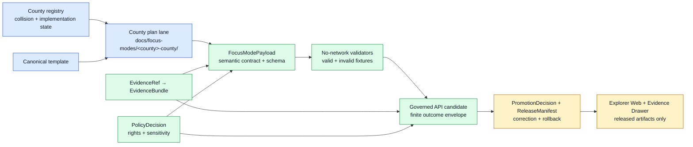

<!-- [KFM_META_BLOCK_V2]
doc_id: kfm://adr/0027
title: ADR-0027 — County Focus Mode Control Plane
type: adr
adr_id: ADR-0027
version: v0.3
status: proposed
effective_decision_status: proposed
owners:
  - "NEEDS VERIFICATION — architecture decision owner"
  - "NEEDS VERIFICATION — Focus Mode and control-plane steward"
  - "NEEDS VERIFICATION — Directory Rules steward"
reviewers_required:
  - Architecture steward
  - Docs steward
  - Focus Mode and control-plane steward
  - Directory Rules steward
  - Contracts and schemas stewards
  - Validation and CI steward
  - Governed API and Explorer Web maintainers
  - At least one county-lane or domain steward
created: 2026-05-22
updated: 2026-07-24
policy_label: public
truth_posture: cite-or-abstain
responsibility_root: docs/
current_path: docs/adr/ADR-0027-county-focus-mode-control-plane.md
supersedes: []
superseded_by: null
evidence_snapshot:
  repository: bartytime4life/Kansas-Frontier-Matrix
  base_ref: main
  base_commit: 22adc4839709349af67f5636b77936990f8289ce
  target_prior_blob: b1894474f8dc402f5d47abea8dd2d0cf1d0571b8
  adr_index_blob: cf08fae322ac53426f7394d97897fdb942253049
  directory_rules_blob: 2affb080e6f0043867c64c7f06c1ca52030fbd55
  legacy_focus_control_readme_blob: 008cf7b3496fdfe56ff3a23b12cb470c27dcf76e
  legacy_county_index_blob: ba888a806148866501bf1f6c730a7b411ca67277
  legacy_county_template_blob: 327c6304cd5301a38c9e086610be12725f3fabf7
  focus_mode_payload_contract_blob: 7fe687d587cd60dafd6e3fa34306cd58fd125c73
  focus_mode_index_validator_blob: 89391d75680e859dddf3696b9b782369f364c73e
  validate_all_blob: 5f01ac208c46f4ee98750af4fc1032604b670e9b
  canonical_focus_modes_readme_at_base: absent
  canonical_county_index_at_base: absent
  canonical_county_template_at_base: absent
  focus_mode_payload_schema_at_base: absent
  focus_mode_payload_validator_at_base: absent
inspection_boundary: >
  Current-session GitHub reads and bounded repository search covering the ADR inventory,
  Directory Rules, ADR-0028, the actual singular Focus Mode README, county index and
  county template, the FocusModePayload semantic contract, the county index validator,
  the validator orchestrator placeholder, exact absence checks for the canonical plural
  control-plane files and FocusModePayload schema/payload validator, and open pull-request
  overlap for this target. No complete clone, validator execution, structural migration,
  schema or policy execution, governed API Focus request, map render, release manifest,
  correction, rollback drill, deployment, or KFM publication was exercised.
related:
  - docs/adr/README.md
  - docs/adr/INDEX.md
  - docs/adr/ADR-0001-schema-home--schemas-contracts-v1-is-canonical.md
  - docs/adr/ADR-0004-apps-governed-api-is-the-trust-membrane.md
  - docs/adr/ADR-0005-apps-explorer-web-is-the-canonical-map-first-shell.md
  - docs/adr/ADR-0010-deny-by-default-for-dna-rare-species-archaeology-infrastructure.md
  - docs/adr/ADR-0018-promotion-gate-sequence.md
  - docs/adr/ADR-0019-ai-adapter-contract-and-finite-envelopes.md
  - docs/adr/ADR-0020-abstain-is-a-first-class-decision.md
  - docs/adr/ADR-0024-steward-separation-of-duties-for-release.md
  - docs/adr/ADR-0025-public-client-never-reads-canonical-internal-stores.md
  - "docs/adr/ADR-0028 — State-scale Focus Mode scope.md"
  - docs/doctrine/directory-rules.md
  - docs/focus-mode/README.md
  - docs/focus-mode/counties/COUNTY_INDEX.md
  - docs/focus-mode/counties/_template/county-build-plan.md
  - contracts/focus_mode/focus_mode_payload.md
  - tools/validators/validate_focus_mode_index.py
  - tools/validate_all.py
  - docs/registers/DRIFT_REGISTER.md
tags: [kfm, adr, focus-mode, county-scale, control-plane, directory-rules, migration, evidence, validation, release, rollback, cite-or-abstain]
notes:
  - "v0.3 is a same-path, repository-grounded modernization. It preserves source and effective status proposed; it does not accept ADR-0027 or authorize migration by itself."
  - "ADR-0027 identity is confirmed by docs/adr/INDEX.md; the original numbering uncertainty is resolved."
  - "Directory Rules names docs/focus-modes/<area>-<scope>/ as canonical, while current Focus materials remain under legacy singular docs/focus-mode/."
  - "The current six-artifact concept is only partially implemented and internally inconsistent: the semantic contract and index validator exist, but the canonical plural docs, machine schema, payload validator, and working orchestration do not."
  - "No repository path outside this ADR is changed by this revision."
[/KFM_META_BLOCK_V2] -->

<a id="top"></a>

# ADR-0027 — County Focus Mode Control Plane

> **Proposed decision.** Converge county Focus Mode planning into one governed control plane with canonical plural placement, a single 105-county registry, one reusable county template, semantic and machine contracts, deterministic validators, and an explicit plan-to-release path. Preserve legacy materials during migration, but do not let the current singular lane, collision-prevention register, validator assumptions, or county Markdown files independently become canonical truth or publication authority.

[](#status)
[](#current-repository-evidence)
[](#placement-and-naming-contract)
[](#current-enforcement-maturity)
[](#current-enforcement-maturity)
[](#authority-and-publication-boundary)
[](#authority-and-publication-boundary)

> [!IMPORTANT]
> **Identity is confirmed; acceptance is not.** [`docs/adr/INDEX.md`](./INDEX.md) uniquely assigns `ADR-0027` to this file and records both source and effective status as `proposed`. Editing, validating, merging, or citing this Markdown does not accept the decision.

> [!CAUTION]
> **The repository currently contains two incompatible models of the county control plane.** Directory Rules declares canonical `docs/focus-modes/<area>-<scope>/`, but the tracked materials live under legacy singular `docs/focus-mode/`, with a `counties/` grouping and snake_case county folders. The validator is written for the plural lane and a different index/template grammar. Until those surfaces converge, implementation remains **HOLD**.

> [!WARNING]
> **A county build plan is not a public payload.** A plan, index row, validator pass, map layer, model response, or merged pull request cannot by itself create `PUBLISHED` state. A public Focus Mode requires evidence closure, policy decisions, a finite runtime envelope, release and promotion records, correction lineage, and a rollback target.

**Quick navigation:** [Status](#status) · [Evidence](#evidence-boundary) · [Context](#context) · [Decision](#proposed-decision) · [Current evidence](#current-repository-evidence) · [Maturity](#current-enforcement-maturity) · [Control plane](#control-plane-contract) · [Placement](#placement-and-naming-contract) · [Authority](#authority-and-publication-boundary) · [Migration](#migration-and-convergence-plan) · [Validation](#validation-and-negative-tests) · [Acceptance](#acceptance-gates) · [Consequences](#consequences) · [Alternatives](#alternatives-considered) · [Risks](#risk-and-open-question-ledger) · [Rollback](#rollback-and-supersession) · [References](#references) · [History](#revision-history)

---

<a id="status"></a>

## Status

| Field | Current value |
|---|---|
| **ADR ID** | `ADR-0027` — unique and confirmed in [`INDEX.md`](./INDEX.md) |
| **Tracked path** | `docs/adr/ADR-0027-county-focus-mode-control-plane.md` |
| **Source metadata** | `proposed` |
| **Effective decision status** | `proposed` |
| **Decision class** | Cross-root control-plane architecture, canonical lane naming, index/template grammar, validation, migration, release boundary, and rollback |
| **Current canonical docs pattern** | `docs/focus-modes/<area>-<scope>/` per Directory Rules §6.7 |
| **Current tracked Focus materials** | Legacy singular `docs/focus-mode/` |
| **Current repository posture** | Partial scaffolds, incompatible index/validator grammar, missing machine schema and payload validator, placeholder validator orchestration, no verified county release |
| **Implementation effect of this revision** | Documentation only |
| **Release or publication effect** | None |
| **Supersedes / superseded by** | None / none |
| **Relationship to ADR-0028** | ADR-0027 governs the control plane and county convergence. ADR-0028 proposes a new `state` scope and cross-scale coverage rule. Both remain proposed. |

### Acceptance versus implementation graduation

Three states must remain distinct:

1. **ADR acceptance** would approve the control-plane contract, plural canonical placement, migration obligations, index grammar, validation boundary, and release prerequisites.
2. **Repository convergence** would migrate or mirror legacy singular materials, normalize the county registry and template, close machine contracts, and make validators runnable through a real orchestrator.
3. **Implementation graduation** would require populated canonical county lanes, valid and invalid fixtures, governed API integration, finite runtime outcomes, release evidence, correction handling, and a rollback drill.

This one-file revision performs none of those transitions.

[Back to top](#top)

---

<a id="evidence-boundary"></a>

## Evidence boundary

This revision is grounded in repository bytes at `main@22adc4839709349af67f5636b77936990f8289ce`.

| Evidence surface | CONFIRMED current state | What remains unproved |
|---|---|---|
| ADR inventory | ADR-0027 uniquely maps to this exact file; source and effective status are `proposed` | Acceptance or implementation |
| Directory Rules §6.7 | Canonical docs pattern is `docs/focus-modes/<area>-<scope>/`; Focus Modes are proof slices, not roots or domains | Completed migration or accepted casing reconciliation |
| Canonical plural README | `docs/focus-modes/README.md` is absent | Future canonical bytes and review |
| Legacy control-plane README | [`docs/focus-mode/README.md`](../focus-mode/README.md) exists and internally describes the plural lane | Whether it should be migrated, rewritten, or retained temporarily as a mirror |
| Legacy county index | [`docs/focus-mode/counties/COUNTY_INDEX.md`](../focus-mode/counties/COUNTY_INDEX.md) exists and enumerates 105 counties | Validator compatibility, lane completeness, payload readiness, release |
| Legacy county template | [`docs/focus-mode/counties/_template/county-build-plan.md`](../focus-mode/counties/_template/county-build-plan.md) exists | Compatibility with current validator and canonical target layout |
| County plan corpus | Repository search finds numerous plans under `docs/focus-mode/counties/<snake_case>/` with inconsistent filenames | Complete inventory, semantic equivalence, or migration safety |
| Semantic contract | [`contracts/focus_mode/focus_mode_payload.md`](../../contracts/focus_mode/focus_mode_payload.md) exists | Machine-shape closure and runtime implementation |
| County index validator | [`tools/validators/validate_focus_mode_index.py`](../../tools/validators/validate_focus_mode_index.py) exists | A successful run against current bytes |
| Machine schema | `schemas/contracts/v1/focus_mode/focus_mode_payload.schema.json` is absent | Field types, compatibility, negative fixtures |
| Payload validator | `tools/validators/validate_focus_mode_payload.py` is absent | Executable payload admission |
| Validator orchestration | [`tools/validate_all.py`](../../tools/validate_all.py) is a placeholder module, not an operational orchestrator | CI discovery and aggregate validation |
| Publication evidence | No county `ReleaseManifest`, `PromotionDecision`, correction record, or rollback drill was inspected | Any county Focus Mode release or KFM publication |

### Evidence exclusions

This revision does not claim:

- that every county folder or plan was recursively inventoried;
- that the validator was executed;
- that the legacy index and template can be migrated without conflict;
- that schemas, policies, fixtures, release objects, or governed runtime surfaces are complete;
- that a county Focus Mode is released or public-safe;
- that ADR-0027 or ADR-0028 is accepted.

[Back to top](#top)

---

<a id="context"></a>

## Context

KFM uses a Focus Mode in two related senses:

1. an evidence-bounded AI and map interaction surface returning finite `ANSWER | ABSTAIN | DENY | ERROR` outcomes; and
2. a cross-root proof-slice composition binding docs, contracts, schemas, fixtures, validators, governed API behavior, published artifacts, release decisions, correction, and rollback for one bounded area.

The county series grew faster than its control plane. The repository now contains substantial county planning material, but the current surfaces do not form one coherent system.

### Current problems

1. **Canonical-path conflict.** Directory Rules says `docs/focus-modes/`; tracked materials use `docs/focus-mode/`.
2. **Layout conflict.** Directory Rules expects area lanes such as `docs/focus-modes/ellsworth-county/`; tracked materials group counties beneath `docs/focus-mode/counties/` and commonly use snake_case directories and variable filenames.
3. **Registry grammar conflict.** The tracked county index is a collision-prevention register with `Series state` and `Repo implementation status`. The validator expects a table containing `County`, `Lane`, `Status`, `Owner`, `Priority`, `Sensitivity hot lanes`, `Source-seed family`, and `Validation`.
4. **Template grammar conflict.** The tracked template documents a canonical `build-plan.md` layout and a fenced YAML data block, while the validator source describes front-matter requirements and searches for seven exact lane filenames.
5. **Machine-contract gap.** The semantic `FocusModePayload` contract exists, but its machine schema and payload validator do not.
6. **Orchestration gap.** The index validator claims discovery through `tools/validate_all.py`, but the tracked orchestrator is only a placeholder.
7. **Truth-state risk.** Collision coverage, plan existence, validator success, payload readiness, and governed release are separate states, yet current documents can be read as if they were one maturity ladder.
8. **Publication-boundary risk.** A large Markdown corpus can look complete while no evidence bundle, policy gate, release manifest, correction record, or rollback target exists.

### Why an ADR is warranted

The decision crosses `docs/`, `contracts/`, `schemas/`, `tools/`, `fixtures/`, `apps/`, `data/`, and `release/`. It defines one canonical vocabulary and migration boundary across responsibility roots. Code, schema, or a README alone cannot preserve the rationale or constrain future divergence.

The ADR does **not** amend the root tree. Directory Rules already owns placement and declares the plural pattern. This ADR records the coordinated repository decision needed to converge implementation without treating current drift as canon.

[Back to top](#top)

---

<a id="proposed-decision"></a>

## Proposed decision

Adopt the following county Focus Mode control-plane contract.

### Decision summary

1. **Canonical human lane:** `docs/focus-modes/`.
2. **One county = one area composition:** canonical county lane key `<county>-county`.
3. **One 105-county registry:** the county registry must separately track collision state, implementation state, validation state, and release state.
4. **One reusable county template:** the canonical template must produce the exact structured data consumed by validators and the semantic payload crosswalk.
5. **One semantic contract plus one machine schema:** prose meaning remains under `contracts/focus_mode/`; machine shape remains under `schemas/contracts/v1/focus_mode/`.
6. **Deterministic validation:** validators must test the actual canonical registry and template grammar, run without network access, emit machine-readable reports, and include negative fixtures.
7. **Governed runtime boundary:** public clients use `apps/governed-api/` and released artifacts; Explorer Web never reads RAW, WORK, or QUARANTINE.
8. **Finite outcomes:** runtime Focus Mode interactions return `ANSWER`, `ABSTAIN`, `DENY`, or `ERROR`.
9. **No publication by documentation:** plans, indexes, pull requests, commits, badges, and validator results are not release authority.
10. **Reversible migration:** legacy singular paths remain readable during a bounded compatibility period, with explicit mapping and rollback.

### County control-plane lifecycle


```mermaid
flowchart LR
    I["County registry<br/>collision + implementation state"] --> P["County plan lane<br/>docs/focus-modes/&lt;county&gt;-county/"]
    T["Canonical template"] --> P
    P --> C["FocusModePayload<br/>semantic contract + schema"]
    C --> V["No-network validators<br/>valid + invalid fixtures"]
    V --> G["Governed API candidate<br/>finite outcome envelope"]
    G --> R["PromotionDecision + ReleaseManifest<br/>correction + rollback"]
    R --> U["Explorer Web + Evidence Drawer<br/>released artifacts only"]

    E["EvidenceRef → EvidenceBundle"] --> C
    Q["PolicyDecision<br/>rights + sensitivity"] --> C
    E --> G
    Q --> G

    classDef docs fill:#dbeafe,stroke:#1d4ed8,color:#111827
    classDef trust fill:#dcfce7,stroke:#15803d,color:#111827
    classDef release fill:#fef3c7,stroke:#a16207,color:#111827
    class I,P,T docs
    class C,V,G,E,Q trust
    class R,U release
```

### Required control-plane surfaces

| Surface | Canonical responsibility | Required behavior |
|---|---|---|
| `docs/focus-modes/README.md` | Human orientation and lane contract | Restates Directory Rules without overriding it; explains lifecycle and add-a-county workflow |
| `docs/focus-modes/COUNTY_INDEX.md` | County registry | Exactly 105 unique counties; separate fields for collision, implementation, validation, and release |
| `docs/focus-modes/_template/county-build-plan.md` | Reusable plan template | Structured keys exactly match validator and semantic crosswalk |
| `docs/focus-modes/<county>-county/` | Per-county planning and acceptance lane | One canonical lane per county; no duplicate aliases |
| `contracts/focus_mode/focus_mode_payload.md` | Object meaning | Defines plan-to-payload semantics and finite outcomes |
| `schemas/contracts/v1/focus_mode/focus_mode_payload.schema.json` | Machine shape | Validates payload structure and version |
| `tools/validators/validate_focus_mode_index.py` | Registry and lane validation | Tests canonical paths, index grammar, lane identity, required files, and links |
| `tools/validators/validate_focus_mode_payload.py` | Payload admission | Validates schema, evidence closure, policy references, release references, and forbidden lifecycle paths |
| `fixtures/focus_modes/<county>/{valid,invalid}/` | Enforceability proof | Includes positive and negative examples for every finite outcome and public-safety boundary |
| `tools/validate_all.py` or accepted successor | Aggregate orchestration | Discovers and runs Focus validators in CI |
| Release objects under `release/` | Promotion, correction, rollback | Required before any public or semi-public county payload |
| This ADR | Rationale and migration boundary | Records why the system converges and what cannot be inferred |

### Explicit non-decisions

This ADR does not:

- accept a state-scale Focus Mode; ADR-0028 owns that proposal;
- assign human owners or deciders;
- define the final `FocusModePayload` field types;
- accept any sensitivity-tier scheme not already governed elsewhere;
- promote any county to `validated`, `payload-ready`, `released`, or `PUBLISHED`;
- authorize a bulk migration without a reviewed path manifest and read-back;
- create a new root or parallel schema, contract, policy, registry, release, proof, or receipt home.

[Back to top](#top)

---

<a id="current-repository-evidence"></a>

## Current repository evidence

### Verified artifact map

| Intended surface | Current repository state | Assessment |
|---|---|---|
| ADR identity | Present and uniquely indexed as ADR-0027 | **PASS — identity only** |
| Canonical `docs/focus-modes/README.md` | Absent | **FAIL — canonical lane not materialized** |
| Legacy `docs/focus-mode/README.md` | Present | **CONFLICTED — useful lineage at non-canonical path** |
| Canonical `docs/focus-modes/COUNTY_INDEX.md` | Absent | **FAIL** |
| Legacy county index | Present at `docs/focus-mode/counties/COUNTY_INDEX.md` | **PARTIAL — 105-county collision register, not validator-compatible implementation registry** |
| Canonical county template | Absent | **FAIL** |
| Legacy county template | Present at `docs/focus-mode/counties/_template/county-build-plan.md` | **PARTIAL — useful content, incompatible path and unresolved parser contract** |
| County plan lanes | Numerous artifacts under singular `counties/<snake_case>/` paths | **CONFLICTED — substantial lineage, non-canonical and inconsistent naming** |
| Semantic payload contract | Present | **PARTIAL — meaning exists** |
| Machine payload schema | Absent | **FAIL** |
| County index validator | Present | **PARTIAL — code exists, current target grammar/path do not align** |
| Payload validator | Absent | **FAIL** |
| Aggregate validator orchestrator | Placeholder only | **FAIL — orchestration not operational** |
| Valid/invalid county payload fixtures | Not established in this inspection | **UNKNOWN / NEEDS VERIFICATION** |
| Governed API county runtime | Not exercised | **UNKNOWN** |
| Release, correction, rollback | Not inspected or demonstrated | **UNKNOWN / NOT RUN** |

### Repository-grounded corrections to v0.2

The following v0.2 statements are no longer supportable:

- ADR number `0027` is not uncertain; the canonical index confirms it.
- The live repository is not unavailable; this revision inspected current GitHub bytes.
- The six-artifact family is not wholly absent; several pieces exist.
- The migration trigger is not hypothetical; the singular legacy lane is confirmed present and the plural lane is confirmed absent.
- The county index is not merely missing; it exists with a different purpose and grammar.
- The validator is not merely proposed; it exists, but its claimed target and parser contract do not match current repository materials.
- `tools/validate_all.py` cannot currently be described as an operational orchestrator.

[Back to top](#top)

---

<a id="current-enforcement-maturity"></a>

## Current enforcement maturity

| Gate | Current state | Evidence | Required next proof |
|---|---|---|---|
| ADR identity and inventory | **PASS** | Canonical ADR index | Preserve ID/path/status |
| Canonical docs placement | **FAIL** | Plural README/index/template absent; singular lane present | Reviewed migration or bounded mirror |
| County uniqueness | **PARTIAL** | Index enumerates 105 counties and blocks duplicate generation | Machine-checked exact county/lane identity |
| Registry grammar | **FAIL** | Legacy columns differ from validator contract | One versioned registry schema |
| Template grammar | **FAIL** | Template and validator describe different parsing models | One authoritative structured block and tests |
| Semantic contract | **PARTIAL** | `focus_mode_payload.md` exists | Reconcile paths and fields with template |
| Machine schema | **FAIL** | Schema absent | Versioned schema + fixtures |
| Index validator | **PARTIAL** | Validator exists | Passing run against canonical bytes |
| Payload validator | **FAIL** | Validator absent | Evidence/policy/release-aware validator |
| Aggregate orchestration | **FAIL** | `tools/validate_all.py` is a placeholder | Working orchestrator + CI |
| Public-client trust path | **UNKNOWN** | Not exercised | Governed API integration test |
| Finite outcomes | **UNKNOWN** | Doctrine and semantic contract only | Runtime tests for all four outcomes |
| Promotion and release | **NOT RUN** | No inspected release objects | PromotionDecision + ReleaseManifest |
| Correction and rollback | **NOT RUN** | No drill inspected | Correction and rollback exercise |

> [!IMPORTANT]
> **Current decision:** `HOLD` implementation graduation. Existing county documents may be repaired and inventoried, but no county should be called validated, payload-ready, released, or published until the failed and unknown gates above are closed with repository evidence.

[Back to top](#top)

---

<a id="control-plane-contract"></a>

## Control-plane contract

### Registry state model

The county registry must not compress unrelated meanings into one status column.

| State family | Allowed values | What it proves |
|---|---|---|
| **Collision state** | `available`, `claimed`, `duplicate-blocked`, `superseded` | Whether another county artifact may be created |
| **Implementation state** | `not-started`, `planned`, `draft`, `normalized`, `validated` | Repository maturity of the county lane |
| **Payload state** | `not-built`, `candidate`, `payload-ready`, `denied`, `error` | Machine payload maturity |
| **Release state** | `not-released`, `candidate`, `released`, `withdrawn`, `rolled-back`, `deprecated` | Governed publication state |
| **Validation state** | `not-run`, `pass`, `fail`, `error` | Result of a named validator at a pinned revision |

A registry row may be `duplicate-blocked` while implementation remains `not-started` or `NEEDS VERIFICATION`. Collision prevention must never be presented as implementation or release proof.

### Canonical county identity

- County display name uses the official Kansas county name.
- County lane key is deterministic kebab-case `<county>-county`.
- Exactly one canonical lane may claim a county.
- Legacy snake_case directories and variable filenames are aliases to reconcile, not new county identities.
- County identity is separate from source geography vintage, boundary geometry, and temporal validity.

### Required lane files

The canonical county lane is expected to include:

```text
docs/focus-modes/<county>-county/
├── README.md
├── build-plan.md
├── layer-registry.md
├── evidence-model.md
├── acceptance-checklist.md
├── source-seed-list.md
└── public-safety-notes.md
```

These files are planning and acceptance surfaces. They must not contain machine schemas, executable policy, released payload bytes, secrets, precise denied geometry, or unreviewed living-person data.

### Trust and outcome invariants

1. `EvidenceRef` must resolve to `EvidenceBundle` before a consequential county claim returns `ANSWER`.
2. Missing, stale, conflicted, or out-of-scope evidence returns `ABSTAIN`.
3. Rights, sensitivity, sovereignty, living-person, DNA, rare-species, archaeology, or critical-infrastructure policy may return `DENY`.
4. Resolver, validator, policy-engine, or runtime failure returns `ERROR`; it must not silently fall back to `ANSWER`.
5. Explorer Web uses governed API responses and released artifacts only.
6. A county plan cannot approve its own release.
7. Watchers and generators may propose updates; they do not publish.
8. Public-safe transformations must carry reason and lineage.
9. Every release needs correction and rollback references.
10. AI-generated language is interpretive and cannot replace evidence or review.

[Back to top](#top)

---

<a id="placement-and-naming-contract"></a>

## Placement and naming contract

Directory Rules remains authoritative. This ADR coordinates the county control plane without creating new authority roots.

| Responsibility | Canonical home | County-specific rule |
|---|---|---|
| Human planning and acceptance | `docs/focus-modes/<county>-county/` | Kebab-case county plus `-county` suffix |
| Semantic object meaning | `contracts/focus_mode/` | Area-agnostic; no per-county contract forks |
| Machine shape | `schemas/contracts/v1/focus_mode/` | Area-agnostic; no schemas under `docs/` or `contracts/` |
| Test fixtures | `fixtures/focus_modes/<county>/{valid,invalid}/` | Both positive and negative fixtures |
| Public UI | `apps/explorer-web/src/focus-modes/<county>/` | Governed API consumer; not truth authority |
| Validators | `tools/validators/` | Flat, discoverable validator names |
| Published payloads | `data/published/api_payloads/focus-modes/<county>.json` | Released artifact only |
| Release decisions | `release/` families | Promotion, correction, withdrawal, rollback |
| Area source slices | `data/registry/sources/<county>/` when justified | Optional view; does not replace global source registry |

### Canonical versus compatibility paths

- `docs/focus-modes/` is canonical.
- `docs/focus-mode/` is legacy drift and may exist only as a bounded compatibility surface during migration.
- A compatibility surface must declare itself as `mirror`, `legacy`, `deprecated`, or `transitional`.
- A pointer README may preserve discoverability, but duplicate evolving content is prohibited.
- A compatibility path must have an owner, canonical target, migration status, and removal or retention decision.

### Naming consistency

The host root controls casing:

- human docs: kebab-case, such as `ellsworth-county`;
- contracts and schemas: singular snake_case family `focus_mode`;
- fixtures: plural snake_case family `focus_modes`;
- apps, data, and release: repository-native kebab-case area slugs where applicable.

This ADR does not resolve all cross-root casing questions. It requires deterministic crosswalks and forbids unregistered aliases.

[Back to top](#top)

---

<a id="authority-and-publication-boundary"></a>

## Authority and publication boundary

### What this ADR would authorize if accepted

- one canonical county control-plane model;
- migration from singular legacy docs to plural canonical docs;
- one registry grammar and county identity rule;
- synchronization of template, semantic contract, machine schema, validators, and fixtures;
- fail-closed runtime and release prerequisites;
- bounded compatibility handling and rollback.

### What it would not authorize

- automatic acceptance of ADR-0028;
- direct writes to the default branch;
- source activation;
- public access to canonical or internal stores;
- release of county data or payloads;
- precise exposure of denied locations or living-person information;
- AI-generated evidence;
- self-approval by a validator, model, watcher, author, or pull request.

### Publication rule

A county Focus Mode becomes release-eligible only when:

```text
canonical lane
  + valid registry identity
  + semantic contract
  + machine schema
  + positive and negative fixtures
  + index and payload validator PASS
  + EvidenceBundle closure
  + rights and sensitivity PolicyDecision
  + governed API finite-outcome tests
  + PromotionDecision
  + ReleaseManifest
  + correction path
  + rollback target
```

Missing any required element means `HOLD`, `ABSTAIN`, `DENY`, or `ERROR` according to the applicable surface—not `PUBLISHED`.

[Back to top](#top)

---

<a id="migration-and-convergence-plan"></a>

## Migration and convergence plan

Migration must be a separately reviewed, bounded change or atomic change series. This ADR revision does not perform it.

### Phase 0 — freeze and inventory

1. Pin the default-branch commit.
2. Produce a complete manifest of files under `docs/focus-mode/` and any `docs/focus-modes/` paths.
3. Record hashes, inbound links, county identities, filenames, metadata, and duplicate or near-duplicate plans.
4. Freeze new county-plan creation except repairs and explicitly reviewed additions.
5. Record the path conflict in the drift register.

### Phase 1 — define canonical machine-readable contracts

1. Version the county registry grammar.
2. Choose one structured template data representation.
3. Reconcile the semantic `FocusModePayload` crosswalk with the template.
4. Add the machine schema.
5. Add positive and negative fixtures.
6. Update validators and tests before moving the corpus.

### Phase 2 — prepare canonical plural lane

1. Create `docs/focus-modes/README.md`.
2. Create the canonical county index and template from reconciled contracts.
3. Make the plural lane complete enough for read-only validation.
4. Do not yet delete singular materials.

### Phase 3 — county-by-county mapping

For every legacy county artifact, record:

| Field | Required value |
|---|---|
| Legacy path | Exact tracked path |
| Canonical county ID | `<county>-county` |
| Canonical target | Exact plural lane file |
| Disposition | `move`, `merge`, `retain-as-lineage`, `quarantine`, or `conflict` |
| Content hash | Before and prepared after |
| Inbound references | All affected files |
| Semantic conflicts | Preserved and surfaced |
| Validation | Result at prepared revision |
| Rollback | Exact old path and commit |

Do not use last-writer-wins. A county with multiple materially different plans is `CONFLICTED` until reviewed.

### Phase 4 — move with compatibility

1. Use history-preserving moves where content is unchanged.
2. Update authorized references atomically.
3. Replace the singular root with one explicit compatibility pointer only when safe.
4. Mark compatibility class and canonical target.
5. Keep the compatibility period bounded by review criteria, not an invented date.
6. Verify remote bytes and changed paths.

### Phase 5 — enforcement and removal decision

1. Run registry, template, payload, link, schema, policy, and negative-fixture tests.
2. Add working aggregate orchestration and read-only CI.
3. Confirm the governed API trust path.
4. Decide whether the singular pointer is removed or retained permanently for external-link compatibility.
5. Record correction and rollback paths for any released outputs affected later.

### Migration stop conditions

Stop and return `CONFLICTED` or `BLOCKED` when:

- both singular and plural paths contain independently evolving content;
- one county maps to multiple canonical identities;
- a move would overwrite unique material;
- schema, contract, and template disagree materially;
- a path exposes sensitive data;
- open pull requests touch the same county or authority surface;
- validator failures reveal unrelated repository defects that exceed scope.

[Back to top](#top)

---

<a id="validation-and-negative-tests"></a>

## Validation and negative tests

### Required pre-acceptance validation

| Check | Expected result |
|---|---|
| ADR index coherence | ADR-0027 remains unique, exact-path matched, effective status `proposed` until reviewed transition |
| Markdown source | One H1, complete fences, valid tables and alerts, unique explicit anchors |
| Relative links | Every introduced repository-relative link resolves at the prepared commit |
| Badge manifest | Every badge reflects text in the ADR and links to a supporting section |
| Canonical path scan | Plural/singular state is reported without guessing |
| Registry parser | Exactly 105 unique counties and deterministic lane IDs |
| Registry semantics | Collision, implementation, validation, payload, and release states are separate |
| Template parser | One structured grammar; required keys and county identity validated |
| Schema tests | Valid fixture passes; malformed, missing-evidence, and forbidden-path fixtures fail |
| Payload policy tests | `ANSWER`, `ABSTAIN`, `DENY`, and `ERROR` each have representative cases |
| Lifecycle leak test | Public payloads reject RAW, WORK, and QUARANTINE paths |
| UI trust-path test | Explorer Web receives county payloads through governed API only |
| Release gate test | No release without PromotionDecision, ReleaseManifest, correction, and rollback |
| Migration dry run | Every old-to-new mapping is collision-checked and reversible |

### Minimum negative fixtures

A complete county Focus Mode validator suite must reject:

- duplicate county identity;
- unknown county or malformed lane slug;
- county plan with unresolved placeholders;
- missing or stale evidence for an `ANSWER`;
- AI-generated text used as evidence;
- missing `PolicyDecision`;
- unknown rights or sensitivity posture;
- exact archaeology, rare-species, living-person, DNA, or critical-infrastructure exposure without an allowed public-safe transform;
- public payload containing RAW, WORK, or QUARANTINE references;
- `apps/web/` as a new public shell path;
- missing rollback target;
- release state inferred from commit, pull request, merge, badge, or map visibility;
- county payload built from a state or another county Focus Mode output as sovereign evidence;
- validator or policy-engine failure silently converted to allow.

### What a green result does not prove

A green documentation or validator check proves only the checked contract at the checked revision. It does not:

- accept this ADR;
- prove source rights;
- approve sensitive publication;
- establish separation of duties;
- authorize release;
- make a county Focus Mode KFM-published.

[Back to top](#top)

---

<a id="acceptance-gates"></a>

## Acceptance gates

ADR-0027 may move from `proposed` to `accepted` only when all required reviewers explicitly accept the decision and the record and index are updated together.

### Decision acceptance

- [ ] ADR ID, path, status, owners, and required reviewers are reviewed.
- [ ] Directory Rules basis and canonical plural placement are affirmed.
- [ ] Relationship to ADR-0028 is reviewed and non-overlapping.
- [ ] Registry state model and county identity grammar are approved.
- [ ] Migration, compatibility, correction, and rollback responsibilities are approved.
- [ ] The ADR index records matching accepted status in the same reviewed change.

### Repository convergence readiness

- [ ] Complete singular and plural inventory exists with hashes.
- [ ] Every county artifact has a reviewed disposition.
- [ ] Canonical plural README, registry, and template are prepared.
- [ ] Semantic contract, schema, and template keys agree.
- [ ] Index and payload validators have positive and negative fixtures.
- [ ] Aggregate orchestration is operational.
- [ ] Migration dry run reports no destructive overwrite or unresolved duplicate.

### Implementation graduation

- [ ] At least one canonical county lane passes all required validators.
- [ ] Governed API returns all four finite outcomes in tests.
- [ ] Explorer Web reads only governed responses and released artifacts.
- [ ] Evidence, rights, sensitivity, correction, and rollback objects are inspectable.
- [ ] A release dry run passes without publishing.
- [ ] A rollback drill restores the prior county release state.
- [ ] No required gate remains `NOT RUN`, `UNKNOWN`, `PARTIAL`, or `FAIL`.

[Back to top](#top)

---

<a id="consequences"></a>

## Consequences

### Positive

- County selection, identity, and maturity become inspectable.
- Duplicate-plan prevention is separated from implementation and release truth.
- The template, contract, schema, and validators can evolve as one governed interface.
- The public trust path becomes testable from plan to finite runtime outcome.
- Singular/plural drift gets an explicit migration and compatibility boundary.
- County plans remain useful without being mistaken for payloads or publication.
- Correction and rollback become requirements rather than afterthoughts.

### Costs and tradeoffs

- A substantial legacy county corpus requires inventory and review.
- County filenames and folder names cannot be normalized safely by bulk string replacement.
- The current 105-county index must be reconciled with the validator rather than simply moved.
- The semantic contract may need compatibility revisions when the schema is authored.
- CI must distinguish documentation coherence from runtime, policy, and release proof.
- A bounded mirror may temporarily preserve two paths, increasing maintenance burden.
- Some county plans may be retained only as lineage instead of becoming canonical lanes.

### Operational implication

Until convergence finishes, maintainers should treat the legacy county corpus as **planning lineage with collision-prevention value**, not as a validated county control plane.

[Back to top](#top)

---

<a id="alternatives-considered"></a>

## Alternatives considered

<details>
<summary><strong>Alternative 1 — Keep the singular lane as canonical because it contains the existing work.</strong></summary>

**Rejected.** Repository convention is evidence of current implementation, but Directory Rules is the placement authority. Calling drift canonical without an accepted amendment would invert the authority order and create conflict with every new plural-path reference.

</details>

<details>
<summary><strong>Alternative 2 — Move the directory immediately and fix issues afterward.</strong></summary>

**Rejected.** The current index, template, validator, and plan filenames disagree. A blind move would preserve path drift inside the new location, break links, and risk overwriting unique county material.

</details>

<details>
<summary><strong>Alternative 3 — Treat the collision-prevention index as the validator-ready implementation registry.</strong></summary>

**Rejected.** Collision state and implementation maturity are different facts. The current table does not provide the grammar expected by the validator and explicitly says repository implementation remains unverified.

</details>

<details>
<summary><strong>Alternative 4 — Put schemas beside the semantic contract.</strong></summary>

**Rejected.** `contracts/` owns meaning; `schemas/contracts/v1/` owns machine shape. Co-location would recreate the schema-home ambiguity that ADR-0001 is intended to prevent.

</details>

<details>
<summary><strong>Alternative 5 — Use one status enum for collision, plan, payload, validation, and release.</strong></summary>

**Rejected.** A single enum creates false maturity transitions—for example, treating “duplicate blocked” or “draft exists” as “validated” or “released.” Separate state families preserve truth.

</details>

<details>
<summary><strong>Alternative 6 — Let each county define its own schema and validator.</strong></summary>

**Rejected.** County variation belongs in data and policy instances, not in 105 competing schemas. Per-county schemas would defeat cross-county validation and create parallel authority.

</details>

<details>
<summary><strong>Alternative 7 — Use documentation-only checks and defer runtime/release proof indefinitely.</strong></summary>

**Rejected.** KFM’s unit of value is the inspectable claim. A county Markdown system that never closes evidence, policy, governed API, release, correction, and rollback remains planning—not a proof slice.

</details>

[Back to top](#top)

---

<a id="risk-and-open-question-ledger"></a>

## Risk and open-question ledger

| ID | Item | Current status | Required action |
|---|---|---|---|
| `FM-27-01` | Singular legacy lane versus plural canonical lane | **CONFIRMED conflict** | Inventory and reviewed migration |
| `FM-27-02` | County index versus validator grammar | **CONFIRMED conflict** | Version one registry contract and tests |
| `FM-27-03` | Template structured block versus validator parser assumptions | **CONFIRMED conflict** | Choose one grammar and test both valid and invalid cases |
| `FM-27-04` | Numerous county paths and variable filenames | **CONFIRMED drift pattern** | County-by-county mapping; no blind rename |
| `FM-27-05` | Machine payload schema | **CONFIRMED absent** | Author under canonical schema home |
| `FM-27-06` | Payload validator | **CONFIRMED absent** | Implement evidence/policy/release-aware validation |
| `FM-27-07` | Aggregate validator orchestration | **CONFIRMED placeholder** | Replace through separately scoped implementation |
| `FM-27-08` | Valid and invalid Focus fixtures | **NEEDS VERIFICATION** | Inventory and close negative-path coverage |
| `FM-27-09` | County registry authority versus collision-prevention lineage | **OPEN** | Define canonical registry source and migration lineage |
| `FM-27-10` | Casing crosswalk across docs, fixtures, apps, data, and release | **OPEN / Directory Rules OPEN-DR-08** | Deterministic crosswalk; ADR amendment only if doctrine changes |
| `FM-27-11` | State-scale relationship | **PROPOSED in ADR-0028** | Keep separate until ADR-0028 review |
| `FM-27-12` | Human ownership and separation of duties | **NEEDS VERIFICATION** | Assign reviewers without inventing acceptance |
| `FM-27-13` | External links to singular paths | **UNKNOWN** | Inbound-link analysis before mirror removal |
| `FM-27-14` | County release evidence | **UNKNOWN / NOT RUN** | Release dry run and rollback drill |
| `FM-27-15` | Sensitive county source material | **NEEDS VERIFICATION** | Fail-closed rights and sensitivity review before migration/publication |

### Highest-risk failure modes

1. moving files before understanding duplicates;
2. treating the 105-county register as release proof;
3. allowing validator assumptions to define doctrine silently;
4. exposing canonical or sensitive data through a county UI;
5. using AI or county summaries as evidence;
6. removing the singular path without inbound-link analysis;
7. merging ADR documentation and inferring acceptance;
8. adding a state-scale lane through county migration work without ADR-0028 acceptance.

[Back to top](#top)

---

<a id="rollback-and-supersession"></a>

## Rollback and supersession

### This documentation revision

Before merge, rollback is to close the draft pull request and abandon the branch. After merge, rollback is a transparent revert of the implementation commit. Reverting this Markdown restores the prior ADR text; it does not change the status of any county plan, schema, validator, or release.

### Future control-plane migration

A migration rollback must:

1. restore every old path from the pinned pre-migration commit;
2. restore inbound references or compatibility pointers;
3. preserve any unique content created after migration as quarantined candidate material;
4. revert registry and validator grammar atomically;
5. keep correction and rollback records;
6. invalidate no release silently;
7. re-run the same validation suite against the restored state.

### Supersession rule

If a later decision changes the canonical Focus Mode control-plane model, ADR-0027 remains as history and moves to `superseded` only when an accepted successor provides reciprocal links and a reviewed transition plan.

[Back to top](#top)

---

<a id="references"></a>

## References

### Current repository authority and inventory

- [ADR operating contract](./README.md)
- [Canonical ADR index](./INDEX.md)
- [Directory Rules](../doctrine/directory-rules.md)
- [ADR-0028 — State-scale Focus Mode scope](<./ADR-0028 — State-scale Focus Mode scope.md>)
- [Drift Register](../registers/DRIFT_REGISTER.md)

### Current Focus Mode surfaces

- [Legacy Focus Mode control-plane README](../focus-mode/README.md)
- [Legacy 105-county index](../focus-mode/counties/COUNTY_INDEX.md)
- [Legacy county template](../focus-mode/counties/_template/county-build-plan.md)
- [FocusModePayload semantic contract](../../contracts/focus_mode/focus_mode_payload.md)
- [County index validator](../../tools/validators/validate_focus_mode_index.py)
- [Validator orchestrator placeholder](../../tools/validate_all.py)

### Related architectural decisions

- [ADR-0001 — Schema Home](./ADR-0001-schema-home--schemas-contracts-v1-is-canonical.md)
- [ADR-0004 — Governed API trust membrane](./ADR-0004-apps-governed-api-is-the-trust-membrane.md)
- [ADR-0005 — Explorer Web canonical shell](./ADR-0005-apps-explorer-web-is-the-canonical-map-first-shell.md)
- [ADR-0010 — Deny-by-default sensitive domains](./ADR-0010-deny-by-default-for-dna-rare-species-archaeology-infrastructure.md)
- [ADR-0018 — Promotion gate sequence](./ADR-0018-promotion-gate-sequence.md)
- [ADR-0019 — AI adapter and finite envelopes](./ADR-0019-ai-adapter-contract-and-finite-envelopes.md)
- [ADR-0020 — Abstain is first-class](./ADR-0020-abstain-is-a-first-class-decision.md)
- [ADR-0024 — Steward separation of duties](./ADR-0024-steward-separation-of-duties-for-release.md)
- [ADR-0025 — Public client never reads canonical stores](./ADR-0025-public-client-never-reads-canonical-internal-stores.md)

### Intentionally unresolved paths

The following are named as required future surfaces but are not linked because they are absent at the inspected commit:

- `docs/focus-modes/README.md`
- `docs/focus-modes/COUNTY_INDEX.md`
- `docs/focus-modes/_template/county-build-plan.md`
- `schemas/contracts/v1/focus_mode/focus_mode_payload.schema.json`
- `tools/validators/validate_focus_mode_payload.py`

[Back to top](#top)

---

<a id="revision-history"></a>

## Revision history

| Version | Date | Status | Material change |
|---|---|---|---|
| `v0.2` | 2026-05-22 | proposed | Initial six-artifact proposal based on doctrine and an unmounted-repository assumption |
| `v0.3` | 2026-07-24 | proposed | Same-path repository-grounded modernization: confirms ADR identity, records singular/plural conflict, inventories partial artifacts, separates registry state families, defines convergence and migration gates, strengthens validation, release, correction, and rollback boundaries |

> [!NOTE]
> This revision deliberately preserves `proposed` status. It improves the record’s evidence and decision precision; it does not create acceptance, implementation, release, or publication authority.

[Back to top](#top)

---

> **Doctrine reconciliation invariant.** If this ADR conflicts with Directory Rules, Directory Rules controls placement until an accepted ADR explicitly amends it. Record the conflict; do not silently make repository drift authoritative.

**ADR:** `ADR-0027` · **Version:** `v0.3` · **Effective status:** `proposed` · **Updated:** `2026-07-24` · [Back to top](#top)
