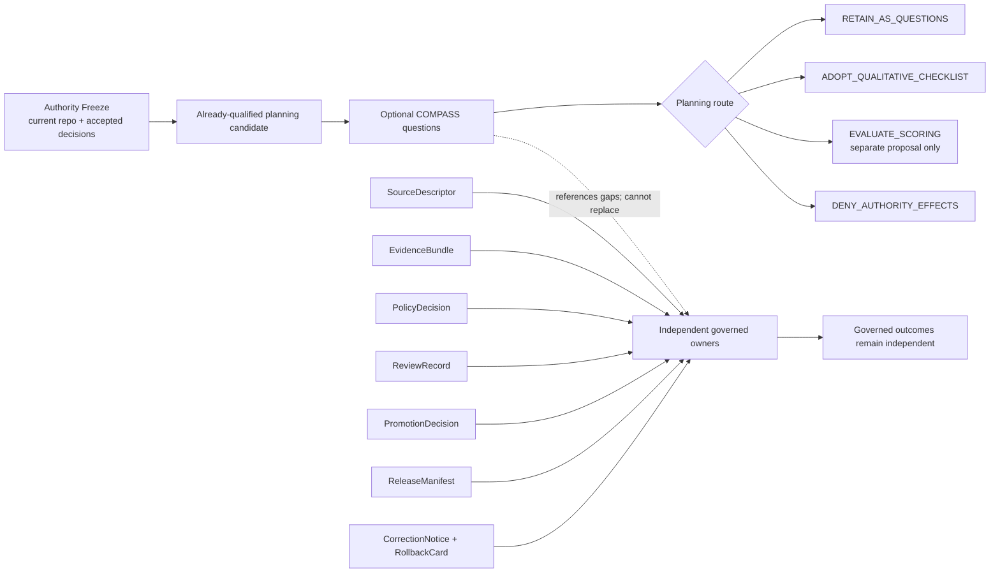

<!-- [KFM_META_BLOCK_V2]
doc_id: kfm://adr/ADR-0034
title: Keep COMPASS qualitative and subordinate to KFM authority gates
type: adr
adr_id: ADR-0034
version: v1.1
status: proposed
effective_decision_status: proposed
owners:
  - "OWNER_TBD — architecture stewardship assignment is not verified"
reviewers_required:
  - Architecture steward
  - Evidence steward
  - Policy steward
  - Release and correction steward
  - Docs steward
created: 2026-08-10
updated: 2026-08-13
policy_label: public
truth_posture: cite-or-abstain
owning_root: docs/
responsibility_root: docs/
current_path: docs/adr/ADR-0034-compass-qualitative-checklist-boundary.md
responsibility: "Record the proposed boundary for using the Living Compass COMPASS dimensions as optional qualitative planning questions without creating a score, threshold, workflow, policy result, review decision, promotion, release, deployment, publication, or public-use authority."
supersedes: []
superseded_by: []
evidence_snapshot:
  repository: bartytime4life/Kansas-Frontier-Matrix
  base_ref: main
  base_commit: 160938b3f4717b6f2551b3430ab5c08f9b33cecb
  base_tree: 0a24e934e17d00b3cf8062bce65a4b59c07d65c1
  tracked_entries: 17001
  tree_truncated: false
  docs_adr_tree: 0a70df26d7f030da35bbf7795a900eb8858773bb
  target_prior_blob: 2ce964b04ce0b16e4f61c3981a62ee7f3f53aa6d
  adr_index_blob: 938c5894c36b99e14810918e2c550ab0e92d53b1
  adr_readme_blob: b497be1714b88550d2f1eb151bc20a6351e99dec
  living_compass_source_map_blob: fb29e351909eb62030a0780edcabde6ee913675e
  original_authoring_receipt_blob: 8aad877bc43c4901088be26f6c2143a79c0179fd
  adr_0029_blob: 3ba5f902ffe20a65a259cb0a7dab07f1725d204b
  directory_rules_blob: fd49a0b83e55cef52c1124281f093e263526898d
  source_descriptor_contract_blob: b57ae5ccc042c1423b75c168438800384c9b6713
  evidence_bundle_contract_blob: 731c348832add23cddd14e796aa56ce2b9268259
  policy_decision_contract_blob: ebfe97f98263e6309db6d2772cb2c5e548819650
  promotion_decision_contract_blob: 42295bfc83a621cf125d33aa821912b426f70bd2
  release_manifest_contract_blob: ce7dc89ff447d76d974afdd802b85a38538d8f48
  rollback_card_contract_blob: 72ab9e148491243cc8a374556350ab94c2557ab4
  correction_notice_contract_blob: 4716f2bc6e714ad2ab873d95144417d7855f5beb
  review_record_schema_blob: fe2f2223af46481e7fb19b0baa94f62ce9c6c855
  codeowners_blob: dd2a84aa514d8ecd9208bc347f90f9a2ed37dd61
  source_search_index_commit: 695748928f254c2c234b9058bf41cdb23f27e3c6
  source_search_freshness: "The only changes from the indexed search commit to the pinned base are ADR-0006 plus its generated receipt from merged PR #2760 and ADR-0001 from merged PR #2759; all three paths are disjoint from ADR-0034 and its governing evidence."
related:
  - docs/adr/README.md
  - docs/adr/INDEX.md
  - docs/adr/ADR-0029-adopt-directory-governance-standard-v2.md
  - docs/doctrine/directory-rules.md
  - docs/intake/exploratory/kfm-living-compass-working-edition-1-0-source-map.md
  - contracts/governance/proof_session_handoff.md
  - contracts/source/source_descriptor.md
  - contracts/evidence/evidence_bundle.md
  - contracts/policy/policy_decision.md
  - contracts/release/promotion_decision.md
  - contracts/release/release_manifest.md
  - contracts/release/rollback_card.md
  - contracts/correction/correction_notice.md
  - schemas/contracts/v1/governance/review_record.schema.json
  - data/receipts/generated/genrec-compass-qualitative-checklist-boundary-20260810.json
tags: [adr, kfm, compass, qualitative-checklist, planning, evidence, policy, review, release, rollback, governance, non-compensable]
notes:
  - "v1.1 is a same-path, documentation-only reconciliation. It preserves source and effective status as proposed and grants no implementation or authority effect."
  - "The governed source map and original authoring receipt preserve the private Living Compass review boundary; this revision does not publish private provider identity, direct links, timestamps, fingerprints, or source bytes."
  - "The COMPASS 0–4 scale and aggregate total remain source lineage only. This proposed decision authorizes neither."
  - "No exact COMPASS score object, threshold, schema, evaluator, workflow, or adopted consumer is established at the pinned repository snapshot."
  - "Generic county-plan references to a compass are map-orientation controls; the proof-session handoff is a separate planning candidate. Neither is a COMPASS scoring implementation."
[/KFM_META_BLOCK_V2] -->

<a id="top"></a>

# ADR-0034: Keep COMPASS qualitative and subordinate to KFM authority gates

> **Proposed decision.** KFM may use the Living Compass `COMPASS` dimensions as optional qualitative planning questions for an already-qualified candidate. KFM must not calculate an aggregate total, set a threshold, or let a favorable planning answer compensate for unresolved authority, source, evidence, rights, sensitivity, policy, review, promotion, release, correction, rollback, deployment, publication, or public-use requirements.

[](#1-context)
[](#2-decision)
[](#24-non-compensable-rule)
[](#293-prohibited-effects)

> [!IMPORTANT]
> **A planning checklist is not a gate result.** Completing COMPASS proves only that someone recorded planning answers. It does not prove those answers, satisfy the artifact or reviewer that owns a dependency, change lifecycle state, or authorize a source, claim, policy result, merge, promotion, release, deployment, publication, or public response.

**Quick navigation:** [Header](#0-adr-header) · [Context and status](#1-context) · [Decision](#2-decision) · [Consequences](#3-consequences) · [Alternatives](#4-alternatives-considered) · [Evidence](#5-evidence-and-references) · [Migration](#6-migration-plan) · [Rollback](#7-rollback-plan) · [Open questions](#8-open-questions) · [Change history](#9-change-history)

---

## 0. ADR Header

| Field | Current value |
|---|---|
| **ID** | `ADR-0034` — unique and confirmed in the canonical human [`INDEX.md`](./INDEX.md) |
| **Title** | Keep COMPASS qualitative and subordinate to KFM authority gates |
| **Source metadata** | `proposed` |
| **Effective decision status** | `proposed` — tracked but not binding |
| **Created** | 2026-08-10 |
| **Updated** | 2026-08-13 |
| **Current tracked path** | `docs/adr/ADR-0034-compass-qualitative-checklist-boundary.md` |
| **Decision subject** | Optional qualitative planning use of the seven Living Compass COMPASS dimensions |
| **Source-lineage posture** | Preserved through the governed [Living Compass source map](../intake/exploratory/kfm-living-compass-working-edition-1-0-source-map.md); private provider identity remains omitted |
| **Current implementation posture** | No accepted COMPASS object, score, threshold, schema, fixture, validator, workflow, evaluator, dashboard, or consumer is established |
| **Accepted placement authority** | [ADR-0029](./ADR-0029-adopt-directory-governance-standard-v2.md) and the adopted [Directory Rules](../doctrine/directory-rules.md) |
| **Directory Rules trigger** | No new root or responsibility home; this record preserves separation among existing owners |
| **Migration required now** | No |
| **Rollback required** | Documentation and provenance only |
| **Release/publication effect** | None |

> [!NOTE]
> **Template conformance.** This revision preserves the record's ID, filename, H1, source status, decision, consequences, alternatives, migration, rollback, open questions, and change history. It expands current-state evidence, acceptance gates, misuse controls, validation posture, and no-loss traceability without accepting the decision.

[Back to top](#top)

---

## 1. Context

### 1.1 Current decision and implementation posture

| Concern | Status | Safe conclusion |
|---|---|---|
| ADR inventory | **CONFIRMED** | ADR-0034 is uniquely indexed among 34 numbered records. ADR-0029 alone is accepted; the other 33 remain effectively proposed. |
| Decision authority | **PROPOSED** | File presence and index registration do not accept this decision. |
| Living Compass lineage | **CONFIRMED, bounded** | The tracked source map records a complete private-DOCX review and intentionally withholds provider metadata and direct access details. |
| Source rubric | **CONFIRMED as source proposal** | The source map records seven COMPASS dimensions plus a 0–4 scale and total. That proves proposal lineage, not KFM adoption. |
| Qualitative boundary | **PROPOSED** | This ADR proposes optional question-based use after the Authority Freeze and candidate qualification. |
| Numeric score or threshold | **NOT AUTHORIZED** | No aggregate, weighting, cutoff, ranking rule, or compensating calculation is permitted by this ADR. |
| Adopted consumer | **UNKNOWN / not established** | No named team, task class, or governed decision is confirmed to need a structured COMPASS checklist. |
| Structured checklist artifact | **ABSENT by design** | This revision creates no form, worksheet, issue template, schema, fixture, or persisted COMPASS object. |
| Evaluator or automation | **NOT ESTABLISHED** | No exact COMPASS evaluator, validator, workflow, dashboard, or runtime binding is established in the bounded repository evidence. |
| Adjacent Living Compass adaptation | **SEPARATE / PROPOSED** | `ProofSessionHandoff` is a distinct optional planning candidate; it does not implement COMPASS or scoring. |
| Generic county “compass” references | **UNRELATED** | Inspected county plans use “compass” for map orientation/navigation, not the Living Compass rubric. |
| Existing trust objects | **CONFIRMED, mixed maturity** | `SourceDescriptor`, `EvidenceBundle`, `PolicyDecision`, `ReviewRecord`, `PromotionDecision`, `ReleaseManifest`, `CorrectionNotice`, and `RollbackCard` remain separate owners; some implementation maturity is still unresolved. |
| Human review | **PENDING** | CODEOWNERS routes review to `@bartytime4life` but does not prove independent review, approval, or acceptance. |
| Runtime/release/public effect | **NONE** | No lifecycle, release, deployment, publication, map, API, AI, export, or public-client behavior changes. |

### 1.2 Acceptance gates

ADR-0034 should remain `proposed` until equivalent evidence closes every applicable gate below.

| Gate | Required evidence | Fail-closed result when missing |
|---|---|---|
| **A — Named planning need** | One identified consumer, task class, and planning decision for which the current task/PR contract is insufficient | Use `RETAIN_AS_QUESTIONS` informally; do not require a checklist |
| **B — Owner and review route** | Verified owner for the checklist boundary plus evidence, policy, rights/sensitivity, release/correction, and docs review | Remain proposed |
| **C — Current owner crosswalk** | Reconcile every dimension with current contracts, schemas, policies, reviewers, and accepted ADRs without copying their authority | Hold acceptance |
| **D — Non-compensation proof** | Negative cases show that missing evidence, rights, sensitivity, policy, review, or rollback cannot be offset by other answers | Deny structured adoption |
| **E — Vocabulary separation** | Planning routes remain distinct from placement, policy, runtime, promotion, release, correction, and public-answer outcomes | Deny any canonical-state translation |
| **F — Sensitive-data posture** | Instructions and examples use public-safe or synthetic references and prevent raw restricted content from entering planning prose | Deny use on sensitive material |
| **G — No duplicate paperwork** | Evidence that the checklist adds value beyond current issue/PR/task contracts for the named consumer | Retain questions only |
| **H — Evaluation boundary** | Any proposed scoring study has a separate accepted decision, pinned rubric, cases, calibration, gaming analysis, stop condition, and no-authority design | Scoring remains denied |
| **I — Reviewed transition** | ADR and index transition together with explicit review evidence and a current generated receipt | Remain proposed |

Acceptance would govern only the qualitative planning boundary. It would not accept a score, threshold, evaluator, workflow, mandatory template, or authority effect.

[Back to top](#top)

---

### 1.3 Summary

The Living Compass contributes a memorable planning mnemonic:

- **C — Claim clarity**
- **O — Observable value**
- **M — Material evidence**
- **P — Policy readiness**
- **A — Architecture leverage**
- **S — Smallness**
- **S — Safe reversal**

Those questions can reveal why an idea is attractive, incomplete, or unsafe. The danger begins when the answers are collapsed into one number or status. KFM responsibilities are deliberately non-fungible: excellent user value cannot repair missing rights; strong architecture reuse cannot create evidence; small scope cannot override policy; and an easy code revert cannot substitute for correction or rollback of released public state.

This proposed decision therefore keeps the mnemonic while rejecting authority inflation:

> **Questions may guide planning. Independent owners still decide their own gates.**

The boundary protects five separations:

| Separation | Boundary effect |
|---|---|
| Planning versus truth | A COMPASS answer is a planning statement, not an EvidenceBundle or factual proof. |
| Planning versus policy | “Policy readiness” identifies a dependency; it is not a PolicyDecision outcome. |
| Planning versus review | The author may expose gaps but cannot approve their own evidence, rights, policy, or release posture. |
| Planning versus lifecycle | A favorable comparison does not promote, release, deploy, publish, correct, withdraw, or roll back anything. |
| Source lineage versus repository authority | The private source may inspire questions; accepted KFM artifacts control repository behavior. |

[Back to top](#top)

---

### 1.4 Source lineage and current repository context

#### 1.4.1 Source lineage and disclosure boundary

The governed source map for *KFM Living Compass Working Edition 1.0* records the source review and the repository-safe disposition of its ideas. It identifies COMPASS as novel decision candidate material and recommends a decision-only crosswalk before adding a score, workflow, template, or automation.

The original source map and generated receipt establish historical review lineage:

| Evidence | What it establishes | What it does not establish |
|---|---|---|
| [Living Compass source map](../intake/exploratory/kfm-living-compass-working-edition-1-0-source-map.md) | The private DOCX was reviewed; COMPASS, the scale, and risks were reconciled to then-current KFM | Current repository acceptance, implementation, or source correctness |
| [Original authoring receipt](../../data/receipts/generated/genrec-compass-qualitative-checklist-boundary-20260810.json) | The first ADR/index packet's inputs, hashes, validation claims, and pending-review state | Current ADR byte integrity, human approval, or factual proof |
| This v1.1 revision | Current repository reconciliation at the pinned base and a stricter qualitative/no-authority contract | Re-review of private source bytes or permission to disclose withheld metadata |

Private provider identity, direct links, timestamps, fingerprints, byte counts, and source bytes remain outside this public ADR. Reviewers should not reconstruct or publish them here.

#### 1.4.2 Current repository evidence

| Surface | Confirmed repository state | Boundary consequence |
|---|---|---|
| [ADR index](./INDEX.md) | 34 unique numbered records; ADR-0029 accepted; ADR-0034 effective/source status proposed | Inventory does not grant authority |
| [ADR operating contract](./README.md) | ADRs preserve decisions and remain proposed until explicit reviewed transition | This revision cannot self-accept |
| [ADR-0029](./ADR-0029-adopt-directory-governance-standard-v2.md) / [Directory Rules](../doctrine/directory-rules.md) | Accepted responsibility and placement authority | COMPASS cannot create a parallel responsibility home |
| [SourceDescriptor](../../contracts/source/source_descriptor.md) | Records source identity, role, rights, sensitivity, access, citation, review, and release posture | “Material evidence” cannot admit or upgrade a source |
| [EvidenceBundle](../../contracts/evidence/evidence_bundle.md) | Claim-scope evidence closure | A COMPASS answer cannot resolve evidence or turn synthetic support into real-world truth |
| [PolicyDecision](../../contracts/policy/policy_decision.md) | Current semantic outcomes are `ANSWER \| ABSTAIN \| DENY \| ERROR` | “Policy readiness” is not `ANSWER`, `ALLOW`, or publication approval |
| [ReviewRecord schema](../../schemas/contracts/v1/governance/review_record.schema.json) | Machine shape exists for review records | A checklist is not authenticated review |
| [PromotionDecision](../../contracts/release/promotion_decision.md) | Transition outcomes are `APPROVE \| DENY \| ABSTAIN` | Planning priority cannot change lifecycle state |
| [ReleaseManifest](../../contracts/release/release_manifest.md) | Binds a governed release artifact set | Planning cannot publish or create a release |
| [CorrectionNotice](../../contracts/correction/correction_notice.md) | Names post-release correction, dispute, supersession, withdrawal, or trust-significant repair | “Safe reversal” is not correction execution |
| [RollbackCard](../../contracts/release/rollback_card.md) | Binds rollback target, rationale, checks, invalidation, and restoration posture | Easy source-code revert is not public-state rollback |
| [ProofSessionHandoff](../../contracts/governance/proof_session_handoff.md) | Separate optional planning candidate derived from Living Compass | It neither adopts COMPASS nor supplies a scoring consumer |
| [PR template](../../.github/PULL_REQUEST_TEMPLATE.md) | Already asks for scope, evidence, policy, validation, risk, review, release, and rollback information | COMPASS should not duplicate required paperwork without evidence |
| [CODEOWNERS](../../.github/CODEOWNERS) | Routes `docs/adr/` review to `@bartytime4life` | Routing is not independent review or acceptance |

#### 1.4.3 Bounded consumer and implementation search

The repository code-search index used for the COMPASS inventory was pinned at `695748928f254c2c234b9058bf41cdb23f27e3c6`. The exact current base is four commits ahead: merged PR #2760 modified ADR-0006 and added its generated receipt, while merged PR #2759 modified ADR-0001. Those three paths are disjoint from ADR-0034 and the governing evidence used here.

The bounded result is:

- the exact planning route `ADOPT_QUALITATIVE_CHECKLIST` occurs only in the Living Compass source map and this ADR;
- the original generated receipt records the same decision packet;
- `ProofSessionHandoff` is separate and does not implement the COMPASS dimensions or total;
- inspected county “compass” references mean a map orientation control;
- no accepted COMPASS schema, fixture, validator, workflow, evaluator, threshold, dashboard, or production consumer is established.

This is a repository-grounded absence claim within the pinned tree and search coverage, not proof that no person has ever used the questions informally.

#### 1.4.4 Operational problem

Planning rubrics are attractive because they compress discussion. That compression is unsafe when:

1. unlike responsibilities are reduced to a shared scale;
2. a total hides a failed hard dependency;
3. the author supplies both the answer and approval;
4. ambiguous labels such as “ready” leak into policy or release decisions;
5. a completed form becomes proxy evidence;
6. generated language sounds more authoritative than its sources; or
7. a public PR collects restricted source, location, rights, or personal details.

KFM needs a narrow answer: retain the questions, keep every dependency visible, and deny any authority effect.

#### 1.4.5 Truth and decision vocabulary

This ADR uses the repository's four evidence labels:

| Label | Meaning here |
|---|---|
| **CONFIRMED** | Directly supported by pinned tracked repository evidence |
| **PROPOSED** | A decision under review, not binding |
| **UNKNOWN** | Evidence does not establish the answer |
| **NEEDS VERIFICATION** | A named review, test, or artifact must close the question |

The COMPASS planning routes in `2.2` do not replace canonical vocabularies:

| Responsibility | Current vocabulary or owner |
|---|---|
| Directory placement | `PLACE \| SPLIT \| MIGRATE \| MIRROR \| HOLD \| DENY` under Directory Rules |
| Runtime-facing policy | `ANSWER \| ABSTAIN \| DENY \| ERROR` in `PolicyDecision` |
| Promotion | `APPROVE \| DENY \| ABSTAIN` in `PromotionDecision` |
| ADR lifecycle | `proposed \| accepted \| superseded \| rejected` |
| Evidence posture | `CONFIRMED \| PROPOSED \| UNKNOWN \| NEEDS VERIFICATION` |

Identical words in different families do not imply identical semantics.

#### 1.4.6 Decision drivers

- Preserve useful questions without importing a second authority system.
- Keep hard dependencies non-compensable and reviewable.
- Prefer the current task/PR contract when it already captures the same information.
- Prevent AI, automation, or visual polish from self-authorizing work.
- Avoid storing sensitive detail in planning prose.
- Keep the current change reversible and documentation-only.

[Back to top](#top)

---

## 2. Decision

> **Decision:** Use `ADOPT_QUALITATIVE_CHECKLIST` only as a proposed planning route for a named, already-qualified use case. Preserve `RETAIN_AS_QUESTIONS` for informal discovery, defer `EVALUATE_SCORING` to a separate evidence-bearing decision, and apply `DENY_AUTHORITY_EFFECTS` whenever COMPASS is used to grant, override, or imply source, evidence, rights, sensitivity, policy, review, promotion, release, correction, rollback, deployment, publication, or public-use authority.

### 2.1 Authority order

COMPASS is evaluated only after the Authority Freeze. The following order controls:

1. explicit user and repository authorization for the task;
2. current repository bytes and effective controls;
3. accepted ADRs and adopted Directory Rules;
4. owning contracts, schemas, policies, reviewers, and release/correction artifacts;
5. this proposed planning boundary;
6. source-lineage heuristics and informal planning prose.

A lower item cannot override a higher item. If authority is unclear, the planning result is hold, split, or route-to-owner—not a favorable COMPASS answer.

### 2.2 Finite planning routes

| Route | Meaning | Permitted effect | Forbidden translation |
|---|---|---|---|
| `RETAIN_AS_QUESTIONS` | The dimensions help discussion, but no named need justifies structured capture. | Ask the questions in ordinary planning prose. | No new object, status, score, gate, or required template. |
| `ADOPT_QUALITATIVE_CHECKLIST` | One bounded planning context benefits from recording each answer and unresolved dependency. | Record human-readable answers, owner refs, and gaps without a total. | Not validation, approval, promotion, release, or publication. |
| `EVALUATE_SCORING` | A named consumer and testable research question might justify studying a numeric rubric. | Propose a separate no-authority study with synthetic/historical cases and stop conditions. | This ADR does not authorize the study, score, or threshold. |
| `DENY_AUTHORITY_EFFECTS` | Someone uses COMPASS to grant or override a governed outcome. | Stop the use, preserve the independent gate result, and route the missing responsibility to its owner. | Never coerce the result into allow, answer, approve, accepted, released, or published. |

These are planning routes, not runtime values, policy results, lifecycle states, or release decisions.

### 2.3 Dimension-to-owner crosswalk

| Dimension | Qualitative question | Current owner surface | Posture | Non-claim |
|---|---|---|---|---|
| **C — Claim clarity** | What exact claim, question, place, time, audience, and limitation are in scope? | Semantic contract or decision record; domain and evidence reviewers | Unresolved scope routes to hold or split. | Does not establish truth, evidence, or permission. |
| **O — Observable value** | What can a named user understand, inspect, or decide at an identified governed surface? | Product/domain owner and the relevant governed API, Evidence Drawer, map, export, or Focus Mode documentation | Comparative planning signal. | Does not prove demand, accessibility, usability, or release fitness. |
| **M — Material evidence** | Which admitted source roles and EvidenceBundle inputs support the bounded claim? | `SourceDescriptor` and `EvidenceBundle` owners; source/evidence reviewers | Hard dependency for consequential claims. | Does not admit a source, resolve evidence, or upgrade synthetic data. |
| **P — Policy readiness** | Which rights, sensitivity, audience, transform, and policy evaluation apply? | Rights/sensitivity and policy owners; `PolicyDecision` | Hard dependency before consequential use. | “Ready” is not `ANSWER`, `ALLOW`, or publication approval. |
| **A — Architecture leverage** | Which existing trust object or governed interface becomes more reusable? | Architecture steward; accepted ADRs and Directory Rules | Comparative planning signal. | Does not create a root, parallel object, exception, or invariant change. |
| **S₁ — Smallness** | Is the slice bounded, dependency-closed, fixtureable, testable, and reversible within its change budget? | Implementation owner and validation reviewer | May route to hold or split. | Short duration does not excuse missing ownership, evidence, tests, policy, or review. |
| **S₂ — Safe reversal** | What correction, supersession, withdrawal, rollback, cache/export propagation, and owner exist? | Correction and release stewards; `CorrectionNotice`, `ReleaseManifest`, and `RollbackCard` | Hard dependency before promotion/release. | A proposed revert is not a rehearsed rollback or public correction. |

### 2.4 Non-compensable rule

COMPASS **MUST NOT** produce an aggregate total under this decision. The historical 0–4 scale remains source lineage only.

The following cannot be averaged, weighted, rounded, waived, or offset:

- unresolved task or repository authority;
- conflict with an accepted ADR or Directory Rules;
- missing source identity, role, rights, access, citation, or sensitivity posture;
- unresolved EvidenceBundle support for a consequential claim;
- policy `ABSTAIN`, `DENY`, `ERROR`, or missing evaluation;
- missing required human review or separation of duties;
- missing promotion evidence or release manifest;
- missing correction, withdrawal, invalidation, or rollback readiness;
- restricted detail that is unsafe for the intended audience; or
- a public-client path that bypasses governed interfaces.

No label such as “strong,” “high value,” “material,” “ready,” “high leverage,” “small,” or “reversible” may be translated into permission outside planning.

### 2.5 Hard-dependency response matrix

| Observed condition | Qualitative note | Independent response |
|---|---|---|
| Scope is ambiguous | Record the ambiguity under Claim clarity | Hold or split the candidate before comparison |
| Source rights or sensitivity unresolved | Record the owner and missing artifact under Policy readiness | Fail closed; do not copy restricted details into the checklist |
| Evidence is synthetic-only | State that limitation under Material evidence | Permit fixture planning only; deny real-world truth claims |
| Policy has not run | Mark Policy readiness unresolved | No consequential use, answer, release, or publication |
| Review is missing | Record the required reviewer | No approval or acceptance inference |
| Rollback covers code but not released state | Distinguish code revert from public correction | Hold promotion/release |
| Existing task contract already answers the questions | Cite the existing fields | Use `RETAIN_AS_QUESTIONS`; create no duplicate checklist |
| Someone requests a total or threshold | Record the attempted authority expansion | Use `DENY_AUTHORITY_EFFECTS` and require a separate ADR/evaluation |

### 2.6 Synthetic no-network example

Consider a wholly synthetic proposal: one public-safe HUC12 fixture should open an Evidence Drawer that demonstrates a cited answer plus abstain, deny, and error states.

| Dimension | Illustrative answer | Independent consequence |
|---|---|---|
| Claim clarity | One fixture, one watershed identifier, one synthetic statement, and one inspection interaction. | Narrow planning scope; no real Kansas claim. |
| Observable value | A user can inspect why the synthetic statement answered or failed. | Plausible value; no user research or accessibility proof. |
| Material evidence | Synthetic SourceDescriptor- and EvidenceBundle-shaped references only. | Sufficient for fixture design; not real-world support. |
| Policy readiness | No evaluated production PolicyDecision. | Public or operational use remains blocked. |
| Architecture leverage | Reuses EvidenceBundle, governed-interface, and Evidence Drawer boundaries. | Useful comparison signal; no placement authority. |
| Smallness | One no-network fixture with finite positive and negative states. | Appropriate experiment size only if dependencies close. |
| Safe reversal | Ordinary fixture revert is clear; no release rollback exists. | Experiment rollback is bounded; promotion/release remains blocked. |

The planning route is `ADOPT_QUALITATIVE_CHECKLIST` for this synthetic experiment. There is no total, threshold, truth claim, policy allow, review approval, promotion, release, deployment, or publication.

### 2.7 Requirements for any later scoring evaluation

A future `EVALUATE_SCORING` proposal must be a separate reviewed decision and identify:

1. one named planning consumer and decision whose quality might improve;
2. why qualitative questions and the current task/PR contract are insufficient;
3. a pinned rubric version with independently enforced hard gates;
4. historical or synthetic cases that contain no restricted or private content;
5. missing-answer handling and a rule that no total is computed for incomplete cases;
6. inter-rater reliability and disagreement reporting without hiding variance in an average;
7. calibration, gaming, bias, false-confidence, Goodhart, and high-total/failed-gate tests;
8. proof that the score cannot change canonical statuses or authority;
9. retention, correction, versioning, supersession, and rollback behavior; and
10. an explicit stop condition if the score adds noise, burden, bias, or unsafe incentives.

The study must remain outside production policy, merge protection, promotion, release, deployment, publication, and public use until a later accepted decision explicitly closes those boundaries.

[Back to top](#top)

---

### 2.8 Scope

#### 2.8.1 In scope

- the qualitative meaning of the seven COMPASS dimensions;
- mapping each question to the current KFM artifact or reviewer that owns the dependency;
- four finite planning routes;
- non-compensable hard dependencies;
- public-safe and synthetic planning examples;
- AI, sensitive-data, review, correction, and rollback limits;
- acceptance evidence required before this ADR can become binding; and
- requirements for proposing, not authorizing, a later scoring evaluation.

#### 2.8.2 Out of scope

This ADR does not:

- add a checklist file, form, issue template, PR field, schema, fixture, validator, workflow, automation, bot, dashboard, database table, API field, or UI;
- adopt a 0–4 scale, total, threshold, weight, ranking formula, grade, traffic light, or readiness label;
- admit a source, resolve evidence, evaluate policy, authenticate review, promote, release, deploy, publish, correct, withdraw, or roll back;
- redefine `SourceDescriptor`, `EvidenceBundle`, `PolicyDecision`, `ReviewRecord`, `PromotionDecision`, `ReleaseManifest`, `CorrectionNotice`, or `RollbackCard`;
- unify placement, runtime, policy, promotion, ADR, and planning vocabularies;
- make `ProofSessionHandoff` a COMPASS consumer;
- adopt the Living Compass timeboxes, mission portfolio, five-session rhythm, or proof vocabulary as KFM lifecycle law;
- expose private source identifiers or content; or
- change repository settings, branch protection, required checks, CODEOWNERS, merge authority, release authority, or public access.

#### 2.8.3 Boundary diagram



[Back to top](#top)

---

### 2.9 Boundary contract

#### 2.9.1 Preconditions

Before structured COMPASS use, the author must:

1. perform the Authority Freeze against current repository state and active work;
2. identify the exact requested action and authority;
3. confirm that the candidate is already qualified for planning rather than blocked by an obvious hard dependency;
4. identify the named consumer and why ordinary task/PR fields are insufficient;
5. use synthetic or public-safe content in public artifacts; and
6. preserve each unresolved dependency and its owner.

If those conditions are not met, use `RETAIN_AS_QUESTIONS` or stop.

#### 2.9.2 Permitted effects

A qualitative COMPASS use may:

- improve a planning conversation;
- expose an ambiguous claim;
- name a user and governed surface;
- identify missing source, evidence, rights, sensitivity, policy, review, validation, correction, or rollback work;
- compare two otherwise qualified candidates without assigning a total;
- recommend splitting an over-broad candidate;
- point to the artifact or reviewer that owns a dependency; and
- record why a scoring evaluation is not justified.

The output remains planning prose.

#### 2.9.3 Prohibited effects

A qualitative COMPASS use must not:

- calculate, persist, display, sort by, or gate on an aggregate total;
- invent default values for unanswered dimensions;
- coerce `UNKNOWN` or `NEEDS VERIFICATION` into a favorable answer;
- claim that “material evidence” resolves an EvidenceBundle;
- claim that “policy readiness” is a PolicyDecision;
- claim that “smallness” proves completeness or safety;
- claim that “safe reversal” executes correction or rollback;
- translate planning routes into canonical status fields;
- become a required repository control without a later accepted decision;
- contain secrets, credentials, raw restricted coordinates, protected ecological or cultural details, living-person data, private-land details, or source content barred from disclosure;
- let an AI system rate, approve, or authorize its own output; or
- let visual polish, narrative quality, popularity, novelty, or architecture leverage outrank evidence and policy.

#### 2.9.4 Inputs

| Input | Minimum posture | If absent |
|---|---|---|
| Exact candidate scope | Named claim/question, audience, place/time where relevant, non-goals | Hold or split |
| Repository snapshot | Current base and affected owner surfaces | Re-run Authority Freeze |
| Requested authority | Explicitly bounded action | Stop; do not infer |
| Existing task/PR contract | Checked for overlap | Prefer it when sufficient |
| Source/evidence refs | Governed refs, not copied payloads | Mark unresolved |
| Rights/sensitivity posture | Safe reference to owning artifact or reviewer | Fail closed |
| Validation and review plan | Named checks and reviewer capabilities | Hold acceptance/promotion |
| Correction/rollback posture | Distinguish code revert from released-state repair | Hold release use |

#### 2.9.5 Output

A permitted output contains:

- qualitative answers or `UNKNOWN`;
- the evidence or repository reference supporting each answer;
- unresolved dependencies;
- each dependency's owner;
- the selected planning route;
- explicit non-effects; and
- a next bounded action or stop condition.

It contains no total, average, percentile, readiness grade, pass/fail authority, policy outcome, review approval, lifecycle transition, or release/publication status.

#### 2.9.6 AI and generated-language boundary

AI may help organize cited planning evidence, but:

- generated language is untrusted input until reviewed;
- the model must not invent missing answers, owners, evidence, or approvals;
- hidden reasoning, prompt text, secrets, and restricted payloads do not belong in a checklist or receipt;
- an AI-authored answer cannot review or approve itself;
- EvidenceBundle and the owning artifacts outrank generated prose;
- an AI-generated total remains prohibited; and
- a generated authoring receipt records provenance only.

#### 2.9.7 Sensitive and private information

COMPASS should reference governed identifiers or public-safe summaries, not duplicate sensitive payloads.

| Risk | Required handling |
|---|---|
| Private source identity | Preserve the governed source-map disclosure boundary |
| Rights or license restriction | Cite the responsible descriptor/reviewer; do not paste barred terms or source content |
| Rare species, archaeology, cultural, private-land, infrastructure, or living-person detail | Use generalized/public-safe language and route to the sensitivity owner |
| Exact-harm coordinate | Do not include it in planning prose or public PRs |
| Secret or credential | Stop, remove from public material, and use the repository security process |
| Public-safe transform needed | Treat transform and downstream enforcement as independent hard dependencies |

Style-layer hiding, a private-looking UI, a draft label, or an informal worksheet is not a security control.

#### 2.9.8 Review and separation of duties

The planning author may assemble answers but may not be treated as the sole approver for:

- evidence closure;
- source rights or sensitivity;
- policy evaluation;
- architecture exceptions;
- review acceptance;
- promotion or release;
- correction, withdrawal, or rollback; or
- public-use fitness.

CODEOWNERS routing is a review request mechanism only. Effective required review, ruleset enforcement, bypass actors, and merge authority require platform evidence.

#### 2.9.9 Conflict resolution

When COMPASS conflicts with another surface:

| Conflict | Controlling surface |
|---|---|
| Path or responsibility | Accepted ADRs and Directory Rules |
| Object meaning | Canonical semantic contract |
| Machine shape | Canonical schema |
| Access/admissibility | Current policy evaluation and obligations |
| Evidence sufficiency | EvidenceBundle and evidence review |
| Human approval | ReviewRecord or governed review process |
| Lifecycle transition | PromotionDecision and release gate |
| Published artifact identity | ReleaseManifest |
| Correction/rollback | CorrectionNotice, RollbackCard, and release controls |

Do not “balance” the conflict through a better answer in another COMPASS dimension.

[Back to top](#top)

---

### 2.10 Validation and enforcement

#### 2.10.1 Current enforcement snapshot

| Control | Current state | What it proves |
|---|---|---|
| ADR index validator | Repository-present | ADR identity/status coherence only |
| Documentation metadata/link/graph checks | Repository-present | Document structure and references within their declared scope |
| Generated receipt validator | Repository-present and hash-aware | Receipt shape and declared artifact digest only |
| COMPASS schema | Not established | No machine object is authorized |
| COMPASS fixtures/tests | Not established | No behavioral claim is proven |
| COMPASS validator/evaluator | Not established | No automated qualitative or numeric decision exists |
| COMPASS workflow/required check | Not established | No merge or lifecycle gate exists |
| Human acceptance | Pending | ADR remains proposed |

The absence of a COMPASS evaluator is consistent with this documentation-only proposal. It must not be filled casually by a script, spreadsheet, bot, prompt, or issue-template formula.

#### 2.10.2 Document revision validation

This revision is complete only if validation confirms:

- one H1 and stable ADR identity;
- source and effective status remain `proposed`;
- original decision, sections, alternatives, rollback, open questions, and change history remain represented;
- metadata parses;
- heading levels, fences, tables, anchors, and local links are coherent;
- every linked repository path exists at the pinned untruncated tree;
- the seven dimensions and four planning routes are present;
- no aggregate score, threshold, or authority effect is authorized;
- private source identity and sensitive payloads are absent;
- the diff is limited to this ADR plus its generated authoring receipt; and
- remote exact-head checks are attributed only to the final commit.

#### 2.10.3 Negative cases

Reviewers should reject or route `DENY_AUTHORITY_EFFECTS` when:

- a field called `total`, `score`, `weighted_score`, `readiness`, or `threshold` is introduced for COMPASS;
- missing answers are treated as zero, neutral, or favorable;
- a high answer changes a policy, review, promotion, or release result;
- synthetic evidence is described as material support for a real claim;
- the checklist contains restricted details instead of safe references;
- the same person or model authors and “approves” all gate answers;
- the planning route is copied into a canonical status field;
- a workflow treats completed prose as proof; or
- a checklist becomes mandatory without accepted governance.

#### 2.10.4 Validation commands for an implementation checkout

The exact repository commands and their dependencies must be re-read from current `main` before execution. The relevant current entry points include:

```bash
python tools/validators/validate_adr_index.py
python -m pytest -q tests/validators/test_validate_adr_index.py
python tools/validators/validate_generated_receipt.py \
  data/receipts/generated/<current-receipt>.json
python tools/validators/validate_generated_receipt.py --fixtures
```

These commands do not accept the ADR, prove COMPASS usefulness, authenticate review, execute policy, or authorize merge/release.

#### 2.10.5 Acceptance review

An acceptance review must answer:

1. Is there a named planning consumer?
2. Does a structured checklist add value beyond current task/PR fields?
3. Are all owner references current?
4. Are hard dependencies visibly non-compensable?
5. Are sensitive-data and AI boundaries explicit?
6. Are negative cases reproducible?
7. Does acceptance still create no score or authority effect?
8. Are ADR/index status and generated receipt synchronized?

Until the answer to all required questions is evidence-backed, the decision remains proposed.

[Back to top](#top)

---

## 3. Consequences

### 3.1 Positive consequences

- Preserves a memorable set of planning questions.
- Makes missing dependencies and owners easier to see.
- Prevents favorable features from masking evidence, policy, or rollback failure.
- Avoids premature schema, workflow, dashboard, and template maintenance.
- Keeps existing KFM vocabularies and responsibility roots intact.
- Gives AI-assisted planning an explicit non-authority and no-self-approval boundary.
- Keeps sensitive details out of public planning prose.

### 3.2 Costs and tradeoffs

- Provides no single ranking number.
- Qualitative answers may differ across reviewers.
- Contributors must consult multiple owner artifacts.
- The distinction between the two `S` dimensions needs explicit labels.
- Teams may prefer a simple score even when it would create false precision.
- A useful checklist remains optional until a real consumer and review design are proven.

### 3.3 Current operational effect

This revision changes documentation and provenance only. It does not:

- alter any contract, schema, policy, test, fixture, validator, workflow, package, runtime, data, release, or setting;
- introduce a dependency;
- require contributors to complete COMPASS;
- accept ADR-0034;
- update ADR index status;
- release, deploy, publish, or expose KFM data; or
- authorize scoring.

### 3.4 Risk register

| Risk | Failure mode | Mitigation |
|---|---|---|
| Score reintroduction | Teams calculate totals outside the ADR | Explicit denial; require separate accepted evaluation decision |
| Checklist theater | Completed prose is treated as proof | Owner refs, citations, and non-claims are mandatory |
| Vocabulary collision | Planning route becomes policy or release state | Separation table and forbidden translations |
| Duplicate bureaucracy | COMPASS repeats the PR/task contract | `RETAIN_AS_QUESTIONS` default when existing fields suffice |
| AI self-authorization | Model writes and approves favorable answers | Human review separation; generated language remains untrusted |
| Sensitive-data leakage | Raw coordinates, rights terms, or private source data enter public prose | Reference governed artifacts; use public-safe summaries |
| Goodhart/gaming | Work is shaped to maximize a rubric rather than close dependencies | No score; hard gates remain independent |
| Stale owner mapping | Contract or status changes after the snapshot | Re-run Authority Freeze and current-owner reconciliation |
| Mandatory scope creep | Optional questions become a required workflow | Later accepted ADR and implementation packet required |
| Reversal ambiguity | Easy code revert is confused with public rollback | Separate code, correction, invalidation, and release rollback |
| Source authority inflation | Private design document is treated as doctrine | Tracked source map is lineage; accepted KFM artifacts control |
| Receipt overclaim | Provenance is treated as review or proof | Receipt remains pending and non-authoritative |

[Back to top](#top)

---

## 4. Alternatives considered

### 4.1 Adopt the 0–4 scores and total now

- **Summary:** Implement the source rubric and rank qualified ideas by the aggregate.
- **Why rejected:** No consumer study, calibration, inter-rater evidence, gaming analysis, missing-answer rule, or failure-mode proof exists. A total can conceal non-compensable gaps.

### 4.2 Reject COMPASS entirely

- **Summary:** Use only existing task contracts and authority gates.
- **Why not selected:** The questions provide a useful synthesis for early planning and can expose missing owners without changing authority.

### 4.3 Make COMPASS a required PR template

- **Summary:** Add required fields and a workflow check to every pull request.
- **Why rejected:** No evidence shows all PR classes need it. Current template fields already cover much of the same ground, and mandatory use would turn a planning aid into process policy.

### 4.4 Let teams choose local scores and thresholds

- **Summary:** Permit uncoordinated adaptations.
- **Why rejected:** Multiple scales create drift, incomparable results, gaming opportunities, and accidental authority.

### 4.5 Keep the idea only in exploratory intake

- **Summary:** Preserve the source map and create no decision boundary.
- **Why not selected:** The rubric is implementation-shaped enough that an explicit no-score/no-authority crosswalk reduces accidental transfer.

### 4.6 Add a generic readiness object

- **Summary:** Create `CompassAssessment` with a schema and stored status.
- **Why rejected:** No stable consumer or semantic need exists, and a new object would overlap current task, review, evidence, policy, promotion, and release responsibilities.

### 4.7 Use AI to score candidates

- **Summary:** Ask a model to produce consistent scores and rankings.
- **Why rejected:** Generated language cannot authenticate evidence, rights, sensitivity, policy, review, or release. Model consistency would not create authority and could amplify hidden bias or false confidence.

### 4.8 Treat hard gates as separate multipliers

- **Summary:** Compute a score but multiply by zero when a hard gate fails.
- **Why rejected:** The result still encourages optimizing a misleading total, hides which owner must act, and converts independent decisions into arithmetic.

[Back to top](#top)

---

## 5. Evidence and references

### 5.1 Decision, placement, and source lineage

- [ADR operating contract](./README.md)
- [Canonical ADR index](./INDEX.md)
- [ADR-0029 — Adopt Directory Governance Standard v2](./ADR-0029-adopt-directory-governance-standard-v2.md)
- [Directory Rules](../doctrine/directory-rules.md)
- [Living Compass governed source map](../intake/exploratory/kfm-living-compass-working-edition-1-0-source-map.md)
- [Original ADR-0034 generated authoring receipt](../../data/receipts/generated/genrec-compass-qualitative-checklist-boundary-20260810.json)
- [AI build operating contract](../doctrine/ai-build-operating-contract.md)
- [Generated receipt lane contract](../../data/receipts/generated/README.md)

### 5.2 Current responsibility owners

- [SourceDescriptor contract](../../contracts/source/source_descriptor.md)
- [EvidenceBundle contract](../../contracts/evidence/evidence_bundle.md)
- [PolicyDecision contract](../../contracts/policy/policy_decision.md)
- [ReviewRecord schema](../../schemas/contracts/v1/governance/review_record.schema.json)
- [PromotionDecision contract](../../contracts/release/promotion_decision.md)
- [ReleaseManifest contract](../../contracts/release/release_manifest.md)
- [CorrectionNotice contract](../../contracts/correction/correction_notice.md)
- [RollbackCard contract](../../contracts/release/rollback_card.md)
- [ProofSessionHandoff contract](../../contracts/governance/proof_session_handoff.md) — adjacent Living Compass adaptation, not a COMPASS implementation

### 5.3 Contributor and review controls

- [Contribution contract](../../CONTRIBUTING.md)
- [Pull-request template](../../.github/PULL_REQUEST_TEMPLATE.md)
- [CODEOWNERS](../../.github/CODEOWNERS) — review routing only
- [ADR index validator](../../tools/validators/validate_adr_index.py)
- [ADR index tests](../../tests/validators/test_validate_adr_index.py)
- [Generated receipt validator](../../tools/validators/validate_generated_receipt.py)
- [Generated receipt tests](../../tests/validators/test_validate_generated_receipt.py)

### 5.4 Pinned repository evidence ledger

| Evidence | Identity | Bounded use |
|---|---|---|
| Default branch / root tree | `160938b3f4717b6f2551b3430ab5c08f9b33cecb` / `0a24e934e17d00b3cf8062bce65a4b59c07d65c1` | Exact repository snapshot; recursive tree has 17,001 entries and is not truncated |
| ADR directory / prior target | `0a70df26d7f030da35bbf7795a900eb8858773bb` / `2ce964b04ce0b16e4f61c3981a62ee7f3f53aa6d` | Concurrency and rollback baseline |
| ADR index / adjacent README | `938c5894c36b99e14810918e2c550ab0e92d53b1` / `b497be1714b88550d2f1eb151bc20a6351e99dec` | Current 34-record identity/status inventory and adjacent operating rules |
| Living Compass source map / original receipt | `fb29e351909eb62030a0780edcabde6ee913675e` / `8aad877bc43c4901088be26f6c2143a79c0179fd` | Governed source-review lineage and original packet provenance |
| ADR-0029 / Directory Rules | `3ba5f902ffe20a65a259cb0a7dab07f1725d204b` / `fd49a0b83e55cef52c1124281f093e263526898d` | Accepted responsibility and placement authority |
| SourceDescriptor / EvidenceBundle | `b57ae5ccc042c1423b75c168438800384c9b6713` / `731c348832add23cddd14e796aa56ce2b9268259` | Source-admission and evidence-closure boundaries |
| PolicyDecision / ReviewRecord schema | `ebfe97f98263e6309db6d2772cb2c5e548819650` / `fe2f2223af46481e7fb19b0baa94f62ce9c6c855` | Policy vocabulary and review-shape separation |
| PromotionDecision / ReleaseManifest | `42295bfc83a621cf125d33aa821912b426f70bd2` / `ce7dc89ff447d76d974afdd802b85a38538d8f48` | Promotion and release boundaries |
| CorrectionNotice / RollbackCard | `4716f2bc6e714ad2ab873d95144417d7855f5beb` / `72ab9e148491243cc8a374556350ab94c2557ab4` | Correction and rollback separation |
| CODEOWNERS | `dd2a84aa514d8ecd9208bc347f90f9a2ed37dd61` | Current review route only |
| Search index / freshness comparison | `695748928f254c2c234b9058bf41cdb23f27e3c6` → `160938b3f4717b6f2551b3430ab5c08f9b33cecb` | Four commits and only disjoint ADR-0006, its receipt, and ADR-0001 paths changed, preserving bounded COMPASS-search relevance |

Blob identities, counts, and bounded absence findings are snapshot evidence. They do not prove a deployed consumer, accepted decision, human review, effective branch protection, production policy, release, or public behavior.

[Back to top](#top)

---

## 6. Migration plan

### 6.1 No current migration

No data, schema, contract, policy, workflow, runtime, release, or consumer migration is authorized.

If ADR-0034 is later accepted as a qualitative boundary:

1. re-pin current repository and active-work evidence;
2. identify the named consumer and why existing task/PR fields are insufficient;
3. update the dimension-to-owner crosswalk;
4. define a public-safe, human-readable location for the answers without creating a trust object;
5. add synthetic positive and negative examples;
6. document that no total or threshold is stored;
7. review AI and sensitive-data behavior;
8. synchronize ADR and index status;
9. emit current generated provenance; and
10. monitor whether the checklist reduces missed dependencies or merely adds burden.

Any schema, evaluator, workflow, required check, dashboard, or score requires a separate dependency-closed proposal.

### 6.2 Definition of done for this revision

- [x] ADR identity, path, title, and proposed status preserved.
- [x] Current main, tree, prior target blob, ADR tree, index, source map, owner contracts, receipt, and review route pinned.
- [x] No open exact-path/topic PR or matching branch found at preflight.
- [x] Source lineage separated from current repository authority.
- [x] No current score, threshold, schema, evaluator, workflow, or adopted consumer claimed.
- [x] Seven dimensions map to current owners and non-claims.
- [x] Four planning routes remain non-canonical.
- [x] Hard dependencies cannot compensate.
- [x] AI, sensitive-data, review, release, correction, and rollback boundaries are explicit.
- [x] Original alternatives, migration, rollback, open questions, and change history preserved.
- [ ] Final local document and receipt validation pass.
- [ ] Remote branch, compare, PR metadata, and exact-head checks are observed.
- [ ] Human review accepts or requests changes.

The last three items cannot be satisfied by prose written before the final bytes and PR exist.

## 7. Rollback plan

### 7.1 Rollback of this document revision

Restore the immediate prior ADR blob:

```text
2ce964b04ce0b16e4f61c3981a62ee7f3f53aa6d
```

Revert the new generated authoring receipt in the same reviewed rollback. Preserve the original 2026-08-10 receipt as historical process memory; do not rewrite it to claim the v1.1 bytes.

This rollback changes documentation/provenance only. It does not alter any score, workflow, data, policy, runtime, release, deployment, or public artifact because none is added.

### 7.2 Rejection or supersession

If the decision is rejected:

1. preserve ADR-0034 as decision history;
2. set source and index status to `rejected` in one reviewed change;
3. state whether the questions remain informal lineage; and
4. remove any later structured consumer through its own rollback.

If the decision is superseded:

1. accept a successor ADR;
2. link both records in both directions;
3. identify exactly whether the successor changes qualitative use, scoring, enforcement, or authority;
4. migrate any consumer and retained planning records;
5. preserve sensitive-data and provenance boundaries; and
6. prove rollback.

Do not silently rewrite this historical proposal into a scoring decision.

### 7.3 Backward compatibility

This revision changes no public schema, API, map, AI envelope, source identity, evidence object, policy result, review object, lifecycle stage, release manifest, correction notice, rollback card, or published artifact. Existing planning prose requires no migration.

[Back to top](#top)

---

## 8. Open questions

| Question | Status | Required evidence or decision |
|---|---|---|
| Which contributor or review context needs structured COMPASS beyond the current task/PR contract? | **UNKNOWN** | Named consumer, sample decisions, duplication analysis |
| What planning failure is the checklist expected to reduce? | **UNKNOWN** | Baseline cases and measurable evaluation question |
| Who owns the qualitative boundary? | **NEEDS VERIFICATION** | Stewardship assignment; CODEOWNERS is insufficient |
| Should the two `S` dimensions be labeled `S₁` and `S₂` wherever structured? | **OPEN** | Usability review without altering source lineage |
| Which owner references are mandatory in a future worksheet? | **OPEN** | Consumer-specific dependency analysis |
| How should `UNKNOWN` answers be represented without becoming a score default? | **OPEN** | Qualitative format and negative cases |
| Can reviewer disagreement be useful planning evidence instead of something to average away? | **NEEDS VERIFICATION** | Inter-rater study and retention rules |
| What burden or failure threshold should end a qualitative experiment? | **OPEN** | Stop condition and owner |
| Would any scoring study improve decisions more than it incentivizes gaming? | **UNKNOWN** | Separate evaluation under `2.7` |
| How are restricted planning details referenced without entering a public PR? | **NEEDS VERIFICATION** | Sensitivity and rights review for the named consumer |
| Does `ProofSessionHandoff` ever need an explicit relationship to COMPASS? | **OPEN** | Separate owner/consumer review; no relationship is assumed |
| Which exact hosted checks or repository controls would apply to acceptance? | **NEEDS VERIFICATION** | Current workflow, ruleset, and branch-protection evidence |

Record confirmed structural conflicts in the [Drift Register](../registers/DRIFT_REGISTER.md) and unresolved evidence work in the [Verification Backlog](../registers/VERIFICATION_BACKLOG.md) only through a separately authorized change. This revision does not modify either register.

[Back to top](#top)

---

## 9. Change history

| Date | Version | Effective status | Change | PR |
|---|---|---|---|---|
| 2026-08-10 | v1 | proposed | Initial decision-only crosswalk from the governed Living Compass source and then-current KFM responsibility inventory. | Historical packet; original receipt retained |
| 2026-08-13 | v1.1 | proposed | Same-path current-state reconciliation; adds pinned evidence, acceptance gates, source/search freshness, AI and sensitivity controls, validation posture, risk register, rollback target, and no-loss traceability without authorizing scoring or implementation. | pending |

[Back to top](#top)

---

<details>
<summary><strong>Appendix A — No-loss modernization ledger</strong></summary>

| v1 element | v1.1 disposition |
|---|---|
| Metadata identity, title, type, source status, owners, dates, policy label, responsibility, truth posture, relationships, tags, and non-authority notes | Preserved and expanded with effective status, current path, reviewer capabilities, and pinned evidence |
| H1 and summary decision | Preserved; no-score and no-compensation language strengthened |
| Header fields | Preserved in `0` with current source/effective status separation |
| Context and decision drivers | Preserved; source lineage, current repository evidence, bounded consumer search, vocabulary, and operational risks added |
| Existing responsibility-owner table | Preserved and reconciled to current contract semantics |
| Evidence boundary and out-of-scope list | Preserved and expanded with disclosure, AI, sensitivity, workflow, and settings limits |
| Decision statement | Preserved exactly in substance |
| Four finite planning outcomes | Preserved as planning routes and explicitly separated from canonical vocabularies |
| Seven-dimension crosswalk | Preserved; two `S` dimensions disambiguated and current object meanings clarified |
| Authority Freeze sentence | Preserved and expanded into an authority order |
| Non-compensable rule | Preserved and expanded with task authority, public-safe transforms, and public-client paths |
| Synthetic no-network example | Preserved with explicit limitation and planning-only result |
| Later scoring requirements | Preserved and expanded with missing-answer, Goodhart, sensitive-data, and stop-condition controls |
| Placement basis and conformance language | Preserved across Header, Scope, Decision, and Boundary Contract |
| Positive, negative, accepted tradeoffs, and affected surfaces | Preserved and expanded in Consequences |
| Five alternatives | Preserved; generic object, AI scoring, and multiplier alternatives added |
| Evidence and references | Preserved and expanded with current hashes, owner contracts, contributor controls, and source/search freshness |
| Migration plan | Preserved as no current migration; later qualitative adoption steps clarified |
| Rollback plan | Preserved and corrected to the immediate prior blob plus new-receipt rollback |
| Five open questions | Preserved and expanded into a verification table |
| Change history | Preserved with a v1.1 row |

</details>

<details>
<summary><strong>Appendix B — Before/after upgrade matrix</strong></summary>

| Area | v1 | v1.1 |
|---|---|---|
| Repository snapshot | General current-repository claims | Exact base, tree, ADR tree, prior blob, owner blobs, and untruncated count |
| Status | Proposed in metadata/header | Source and effective proposed status separated; acceptance gates explicit |
| Search posture | No exact rubric found | Search index pinned, freshness comparison recorded, adjacent false positives classified |
| Source disclosure | Private Drive boundary stated | Historical review lineage separated from this revision; original receipt classified as prior-byte provenance |
| Consumer | Unknown | Named-consumer requirement and no-duplicate-paperwork test |
| Scoring | Total forbidden | Scale, total, thresholds, defaults, multipliers, automation, and AI scoring all denied |
| Responsibility map | Seven owner mappings | Current object semantics, outcome vocabularies, hard-dependency response matrix, and conflict order |
| Sensitive data | Implicit policy dependency | Explicit public-safe reference, coordinate, rights, private-source, and secret handling |
| AI | Not explicit | Generated language is untrusted, no self-rating/approval, provenance-only receipt |
| Enforcement | Future scoring requirements | Current no-evaluator snapshot, negative cases, document validation, acceptance review |
| Rollback | Generic PR/revert and index update | Immediate prior blob, new receipt rollback, old receipt retention, rejection/supersession paths |

</details>

<details>
<summary><strong>Appendix C — Planning-route separation matrix</strong></summary>

| COMPASS planning route | May become directory outcome? | May become PolicyDecision? | May become PromotionDecision? | May become ADR status? | May become release/public status? |
|---|---:|---:|---:|---:|---:|
| `RETAIN_AS_QUESTIONS` | No | No | No | No | No |
| `ADOPT_QUALITATIVE_CHECKLIST` | No | No | No | No | No |
| `EVALUATE_SCORING` | No | No | No | No | No |
| `DENY_AUTHORITY_EFFECTS` | No; route the actual conflict to its owner | No; preserve the actual policy result | No; preserve prior lifecycle state | No; ADR review decides status | No |

The same English word can appear in several lanes without making their values interchangeable.

</details>

<details>
<summary><strong>Appendix D — Evidence boundary</strong></summary>

This revision is grounded in the tracked repository at `main@160938b3f4717b6f2551b3430ab5c08f9b33cecb`, the untruncated tree and blobs recorded above, the governed Living Compass source map, and the original historical receipt. It does not claim:

- direct re-review of the private source bytes during this revision;
- exhaustive informal use outside tracked repository evidence;
- an accepted owner, consumer, checklist, evaluator, score, threshold, or workflow;
- that every referenced contract is fully implemented or enforced;
- authenticated human review, ruleset enforcement, or branch protection;
- policy, promotion, release, deployment, publication, or public-use permission; or
- that this proposed ADR is binding.

Re-run the Authority Freeze, overlap search, current-owner reconciliation, validation, and receipt binding before any later status or implementation change.

</details>

---

*Last updated 2026-08-13 · Document version: v1.1 · Source metadata: `proposed` · Effective decision status: `proposed` · COMPASS use: qualitative questions only · Aggregate score: denied · Authority effect: none · [Back to top](#top)*
