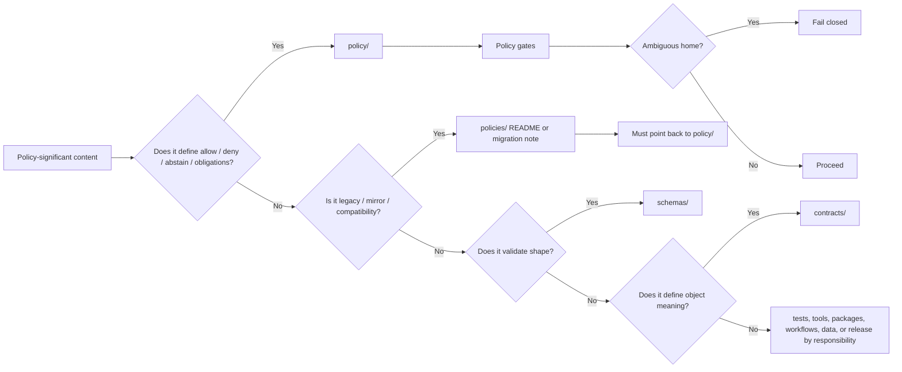

<!-- [KFM_META_BLOCK_V2]
doc_id: kfm://adr/ADR-0201-policy-home
title: ADR-0201: Policy Home
type: architecture-decision-record
version: v1.1
status: accepted-with-numbering-cleanup-needed
owners: @bartytime4life
created: 2026-05-05
updated: 2026-05-06
policy_label: public
related: [../../README.md, ./README.md, ./ADR-0001-schema-home.md, ./ADR-0002-responsibility-root-monorepo.md, ../../policy/README.md, ../../policies/README.md, ../../contracts/README.md, ../../schemas/README.md, ../../tests/README.md, ../../tools/validators/README.md, ../../packages/policy/README.md]
tags: [kfm, adr, policy-home, policy, policies, governance, fail-closed, compatibility-root, responsibility-root]
notes: [
  Revises the existing accepted ADR-0202 policy-home file into a fuller repo-ready decision record.
  The policy-home decision is accepted: policy/ is the canonical home for policy semantics.
  Repository evidence shows a second ADR-0202 file for responsibility-root monorepo layout; ADR numbering and index alignment require follow-up cleanup.
  policy/ currently has a minimal README in main; policies/ currently declares transitional compatibility status.
  This ADR decides policy-home authority only; it does not claim current policy bundle, fixture, test, OPA, Conftest, CI, runtime, or release-gate enforcement depth.
]
[/KFM_META_BLOCK_V2] -->

<a id="top"></a>

# ADR-0201: Policy Home

<p align="center">
  <strong>Make <code>policy/</code> the canonical home for KFM policy semantics, while treating <code>policies/</code> as compatibility-only unless a later ADR says otherwise.</strong>
</p>

<p align="center">
  
  
  
  
</p>

<p align="center">
  <a href="#decision">Decision</a> ·
  <a href="#why-this-adr-exists">Why</a> ·
  <a href="#what-belongs-where">What belongs where</a> ·
  <a href="#enforcement-model">Enforcement</a> ·
  <a href="#acceptance-and-cleanup-criteria">Acceptance</a> ·
  <a href="#rollback-or-supersession">Rollback</a>
</p>

> [!IMPORTANT]
> **Decision status:** accepted for policy-home authority.  
> **Cleanup status:** this ADR shares the `ADR-0002` number with `ADR-0002-responsibility-root-monorepo.md` in the current repository. Keep the policy-home decision, but update the ADR index and numbering plan in a follow-up housekeeping change.

> [!NOTE]
> This ADR decides **where policy semantics live**. It does not prove that all policy bundles, fixtures, tests, workflows, validators, or runtime policy gates are fully implemented on the active branch.

---

## Decision

`policy/` is the canonical home for KFM policy semantics.

`policies/`, when present, is a **compatibility / transitional / migration** root only. It may explain history, mirroring, or migration status, but it must not become a second canonical policy authority.

### Normative rules

1. **Single policy authority:** new canonical policy rules, policy data, policy bundle docs, policy fixtures, and policy-local tests belong under `policy/` unless a later accepted ADR creates a narrower exception.
2. **Compatibility-only plural root:** `policies/` may contain README-level compatibility notes, migration notes, generated mirrors, or blocked legacy references. It must not receive new canonical policy law.
3. **Fail closed on ambiguity:** if tooling or review cannot tell whether `policy/` or `policies/` governs a decision, the decision must fail closed until the authority is resolved.
4. **Policy stays decision-sovereign:** schemas validate shape, validators verify linkage, workflows orchestrate, and packages load helpers; policy decides admissibility, denial, obligations, redaction, review needs, and release posture.
5. **Policy is not storage:** receipts, proofs, catalogs, release manifests, and published artifacts remain in their lifecycle homes. `policy/` may reference them, but it does not store emitted instances.
6. **Policy is not schema authority:** policy inputs should reference canonical schemas and contracts rather than redefine trust-bearing object shape.
7. **Compatibility bridges are explicit:** any bridge from `policies/` to `policy/` must declare purpose, status, target, owner/steward, review date, and test coverage.

<p align="right"><a href="#top">Back to top ↑</a></p>

---

## Why this ADR exists

KFM has two nearby path signals:

- `policy/` — the singular root named by Directory Rules and current repository policy documentation.
- `policies/` — a plural root that may exist in a checkout as a legacy, compatibility, generated, or transitional surface.

Without this ADR, maintainers could accidentally split policy law across both roots. That would weaken KFM’s most important safety posture: rights, sensitivity, review, release, correction, and runtime exposure decisions must be inspectable and fail closed.

### Failure modes prevented

| Drift pressure | What can go wrong |
|---|---|
| Split policy roots | A rule passes under one root and fails under another. |
| Hidden workflow policy | CI or scripts become the real policy home without reviewable rule files. |
| Helper-code sovereignty | `packages/policy/` loaders or adapters quietly become policy law. |
| Schema-policy collapse | Schema validation is mistaken for allow/deny meaning. |
| Untracked compatibility mirrors | `policies/` contains stale copies that still influence decisions. |
| Publication ambiguity | release or runtime gates cannot prove which policy rule was enforced. |

<p align="right"><a href="#top">Back to top ↑</a></p>

---

## Scope and non-goals

### In scope

- Canonical home for KFM policy semantics.
- Compatibility status of `policies/`.
- Relationship between policy, schemas, contracts, validators, tests, packages, workflows, and emitted artifacts.
- Minimum review and enforcement expectations for policy-home hygiene.
- Cleanup criteria for duplicate ADR numbering and ADR index alignment.

### Out of scope

- Deciding the canonical machine-schema home. See `ADR-0001-schema-home.md`.
- Defining every policy bundle, Rego module, fixture, or runtime input schema.
- Proving OPA, Conftest, CI, branch protection, runtime policy enforcement, dashboards, or release gates.
- Moving existing files without an inventory, migration note, and rollback path.
- Deciding package-manager, test-runner, workflow, or deployment details.

<p align="right"><a href="#top">Back to top ↑</a></p>

---

## Evidence basis

| Evidence | Status | What it supports | Limits |
|---|---|---|---|
| Directory Rules | CONFIRMED doctrine | `policy/` is a responsibility root; compatibility roots such as `policies/` should explain canonical/legacy/generated/mirrored status. | Does not prove every policy rule is implemented. |
| Existing `docs/adr/ADR-0201-policy-home.md` | CONFIRMED repository file | The policy-home ADR already exists and marks the decision accepted. | Existing file is minimal and does not address duplicate ADR numbering or enforcement details. |
| Existing `docs/adr/ADR-0002-responsibility-root-monorepo.md` | CONFIRMED repository file | A second accepted ADR currently uses the same ADR number. | Numbering conflict requires cleanup; it does not invalidate the policy-home decision. |
| Existing `policy/README.md` | CONFIRMED repository file | `policy/` exists as the singular policy root in the current repository. | Current README is minimal and does not prove bundle/test/runtime maturity. |
| Existing `policies/README.md` | CONFIRMED repository file | `policies/` already declares transitional compatibility status and points to `policy/`. | Does not prove no other files exist under `policies/` without inventory. |
| KFM doctrine corpus | CONFIRMED doctrine / implementation depth varies | KFM requires fail-closed, cite-or-abstain, reviewable, auditable, rollback-capable governance. | Doctrine does not replace current tests, workflow output, or runtime evidence. |

### Truth posture used here

| Label | Meaning in this ADR |
|---|---|
| CONFIRMED | Verified from current repository file evidence, Directory Rules, or KFM doctrine available to this revision. |
| ACCEPTED | The policy-home decision is adopted as architecture law. |
| NEEDS VERIFICATION | Checkable item not yet proven by inventory, tests, CI output, or runtime evidence. |
| UNKNOWN | Not verified strongly enough to claim. |
| PROPOSED | Recommended implementation or cleanup action not yet proven as implemented. |

<p align="right"><a href="#top">Back to top ↑</a></p>

---

## What belongs where

| Surface | Role | Canonical policy authority? | Notes |
|---|---|---:|---|
| `policy/` | Policy semantics, policy bundles, policy data, policy-local fixtures, policy-local tests, policy runtime notes. | Yes | Canonical policy root. |
| `policies/` | Legacy, compatibility, mirror, migration, or generated status notes. | No | Must point to `policy/` and must not receive new canonical policy content. |
| `schemas/` | Machine-checkable shape of policy inputs and outputs. | No | Schemas validate structure; they do not decide admissibility. |
| `contracts/` | Semantic meaning of trust-bearing objects consumed by policy. | No | Contracts define meaning; policy decides allow/deny/obligations. |
| `tests/policy/` | Repo-wide proof that policy behavior survives into validators, runtime, release, correction, and public surfaces. | No | Tests prove behavior; they do not author policy. |
| `policy/tests/` | Policy-local tests close to policy bundles. | No | Good for bundle-local assertions. |
| `policy/fixtures/` | Positive and negative policy examples. | No | Fixtures must be public-safe and deterministic. |
| `packages/policy/` | Loaders, adapters, helper code, runtime mediation support. | No | Support code remains subordinate to policy files. |
| `.github/workflows/` | CI orchestration, permissions, artifacts, merge gates. | No | Workflows run policy checks; they do not become policy law. |
| `data/receipts/`, `data/proofs/`, `release/` | Emitted process memory, proof, release, and rollback objects. | No | Policy consumes or references these surfaces; it does not store them. |

### Accepted inputs for `policy/`

- policy-as-code bundles;
- policy data files with schema validation;
- allow/deny/abstain/obligation rule families;
- rights, sensitivity, geoprivacy, review, release, correction, withdrawal, rollback, runtime, and domain gate rules;
- positive and negative fixtures proving fail-closed behavior;
- policy-local test READMEs and narrow assertions;
- runtime-policy coordination notes that explain consumption without relocating authority.

### Exclusions from `policy/`

| Does not belong | Better home | Reason |
|---|---|---|
| Canonical object schemas | `schemas/` | Policy consumes schemas; it does not own schema authority. |
| Object meaning docs | `contracts/` | Contract semantics belong in contract lane. |
| Emitted receipts and proof packs | `data/receipts/`, `data/proofs/`, `release/` | Emitted artifacts are lifecycle data, not policy source. |
| Application code | `apps/` or `packages/` | Runtime code applies policy; it does not define policy law. |
| Workflow YAML | `.github/workflows/` | Orchestration is not policy authorship. |
| Domain root shortcuts | `policy/domains/<domain>/` or equivalent | Domain policy belongs under the policy responsibility root, not root-level domain folders. |

<p align="right"><a href="#top">Back to top ↑</a></p>

---

## Decision flow



<p align="right"><a href="#top">Back to top ↑</a></p>

---

## Consequences

### Positive consequences

- Policy law has one canonical home.
- Compatibility roots can exist without splitting authority.
- Reviewers know where to inspect allow/deny/obligation changes.
- Runtime, release, Evidence Drawer, Focus Mode, and promotion gates can name one policy root.
- `packages/policy/` remains support code rather than hidden law.
- `schemas/` and `contracts/` stay adjacent but not sovereign over policy decisions.
- Policy-home drift can be tested with path hygiene checks.

### Costs and required follow-up

- ADR numbering needs cleanup because two accepted ADR files currently use `ADR-0202`.
- `docs/adr/README.md` should list the policy-home ADR or renumber the conflicting ADRs.
- `policy/README.md` should expand beyond its current minimal scaffold note.
- Any content under `policies/` should be inventoried and labeled as compatibility, generated, mirror, migration, blocked, or retired.
- Validators and CI should add negative tests for new canonical policy content under `policies/`.

<p align="right"><a href="#top">Back to top ↑</a></p>

---

## Enforcement model

This ADR should be enforced with small, transparent checks before it becomes an invisible convention.

| Gate | Expected behavior |
|---|---|
| Policy-home path scan | New canonical policy files under `policies/` fail unless explicitly marked compatibility/migration/generated mirror. |
| Compatibility README check | `policies/README.md` must point to `policy/` and state non-canonical status. |
| Policy data schema check | Checked-in policy data must be schema-valid before policy or validators consume it. |
| Bundle-local tests | Policy bundles should have positive and negative fixtures. |
| Repo-wide tests | Runtime, promotion, release, correction, and public-surface policy behavior should be proven outside `policy/` when behavior crosses lanes. |
| Workflow check | CI may orchestrate policy checks, but all policy meaning must remain inspectable under `policy/`. |
| ADR index check | ADR index should not silently hide duplicate numbering or missing policy-home decision records. |

### Minimal path-hygiene rule

A future validator should fail when a PR adds policy-significant files under `policies/` unless they are explicitly classified as compatibility-only.

```text
allow:
  policies/README.md
  policies/MIGRATION.md
  policies/**/README.md when status is compatibility, mirror, generated, migration, blocked, or retired

fail unless explicitly excepted:
  policies/**/*.rego
  policies/**/*.json
  policies/**/*.yaml
  policies/**/*.yml
  policies/**/fixtures/**
  policies/**/tests/**
```

> [!NOTE]
> The rule above is a design target. Implement it in the repository’s actual validator language and CI convention after branch inventory.

<p align="right"><a href="#top">Back to top ↑</a></p>

---

## Compatibility and migration rules

`policies/` may remain in the repository only when its status is visible and bounded.

| Compatibility state | Meaning | Allowed contents |
|---|---|---|
| `compatibility` | Existing path retained for old links or tooling. | README and crosswalk notes. |
| `mirror` | Generated copy of canonical `policy/` content. | Generated files only if source, generation command, and non-canonical status are explicit. |
| `migration` | Temporary bridge while consumers move to `policy/`. | Migration plan, alias/crosswalk, deadline or review date. |
| `blocked` | Unsafe path that should not be consumed. | README explaining why it fails closed. |
| `retired` | Historical path no longer used. | Historical note; no active rule consumption. |

A compatibility bridge must name:

- canonical target under `policy/`,
- reason for the bridge,
- owner/steward or `NEEDS VERIFICATION`,
- creation date,
- review or removal date,
- tests or checks proving the bridge is non-canonical,
- rollback / retirement note.

<p align="right"><a href="#top">Back to top ↑</a></p>

---

## Acceptance and cleanup criteria

The policy-home decision is accepted. The cleanup work is not complete until:

- [ ] `docs/adr/README.md` lists `ADR-0201-policy-home.md` or a renumbered successor.
- [ ] The duplicate `ADR-0202` numbering is resolved by renumbering, ADR index note, or accepted numbering exception.
- [ ] `policy/README.md` states the canonical policy-home decision and links this ADR.
- [ ] `policies/README.md` remains clear that `policies/` is compatibility/transitional only.
- [ ] Any additional files under `policies/` are inventoried and classified.
- [ ] Validators or CI detect new canonical policy content under `policies/`.
- [ ] Policy data files, if present, are schema-validated before policy gates consume them.
- [ ] Bundle-local and repo-wide policy tests are separated in docs.
- [ ] Runtime/release/correction policy behavior is proven outside `policy/` when public exposure is affected.

### Definition of done for a follow-up PR

- [ ] ADR index updated.
- [ ] Numbering conflict handled visibly.
- [ ] `policy/README.md` expanded or cross-linked.
- [ ] `policies/README.md` preserved as compatibility note.
- [ ] Path-hygiene check added or documented as `NEEDS VERIFICATION`.
- [ ] No in-repo claim overstates OPA/Conftest/CI/runtime maturity without proof.

<p align="right"><a href="#top">Back to top ↑</a></p>

---

## Risks and mitigations

| Risk | Impact | Mitigation |
|---|---|---|
| Duplicate ADR number hides this decision. | Reviewers miss policy-home authority. | Update ADR index and numbering plan. |
| `policies/` receives active policy rules. | Split authority and hidden drift. | Path-hygiene validator and compatibility labels. |
| `packages/policy/` becomes de facto policy law. | Helper code bypasses policy review. | Require loaders/adapters to consume `policy/` files. |
| Schema validation is mistaken for policy decision. | Invalid allow/deny semantics. | Keep schemas, validators, and policy roles separated. |
| Workflow YAML embeds policy logic. | Hidden rule changes and weak review. | Workflows orchestrate policy checks only. |
| Public runtime consumes stale compatibility root. | Wrong release or exposure outcome. | Runtime policy resolver must target `policy/` or an approved compatibility bridge. |
| Policy data lacks schema validation. | Review classifications drift into magic constants. | Validate policy data before consumption. |

<p align="right"><a href="#top">Back to top ↑</a></p>

---

## Documentation updates required

| Document | Required update |
|---|---|
| `docs/adr/README.md` | Add this ADR or renumber conflicting ADRs. |
| `policy/README.md` | State `policy/` as canonical home; define accepted inputs, exclusions, and adjacent proof surfaces. |
| `policies/README.md` | Keep compatibility/transitional status explicit. |
| `contracts/README.md` | Link this ADR where policy adjacency is discussed. |
| `schemas/README.md` | State that schemas validate policy inputs/outputs but do not own policy meaning. |
| `tests/README.md` or `tests/policy/README.md` | Distinguish policy-local tests from repo-wide policy proof. |
| `packages/policy/README.md` | State loader/helper subordination to `policy/`. |

<p align="right"><a href="#top">Back to top ↑</a></p>

---

## Alternatives considered

| Alternative | Decision | Reason |
|---|---|---|
| Make `policies/` canonical. | Rejected | Conflicts with Directory Rules compatibility-root posture and current singular `policy/` root. |
| Treat both roots as canonical. | Rejected | Creates unavoidable policy drift. |
| Let workflows decide. | Rejected | CI is orchestration, not policy authority. |
| Put policy meaning in helper packages. | Rejected | Support code would become hidden governance law. |
| Leave both roots unexplained. | Rejected | Ambiguity weakens fail-closed behavior and reviewability. |
| Accept `policy/` but delete `policies/` immediately. | Deferred | Deletion requires inventory, compatibility review, and rollback path. |

<p align="right"><a href="#top">Back to top ↑</a></p>

---

## Rollback or supersession

If this decision is superseded:

1. Create a new ADR that names the replacement canonical policy home.
2. Preserve this ADR as lineage; do not delete it.
3. Inventory all policy consumers before moving files.
4. Add compatibility bridges with explicit states and review dates.
5. Update `policy/`, `policies/`, `contracts/`, `schemas/`, `tests/`, `packages/policy/`, and workflow docs together.
6. Run negative-path tests proving ambiguous policy resolution fails closed.
7. Preserve receipts, validation reports, migration notes, and rollback references.

Rollback must not hide prior policy authority. A rollback that leaves both roots active without an accepted decision is invalid.

<p align="right"><a href="#top">Back to top ↑</a></p>

---

## Open verification items

- Exact final ADR numbering strategy.
- Whether `docs/adr/ADR-0201-policy-home.md` should remain `ADR-0201` (already renumbered).
- Current full inventory under `policy/` and `policies/`.
- Whether policy bundles use OPA/Rego, JSON policy data, Python validators, or mixed tooling in the active branch.
- Whether `policy/fixtures/`, `policy/tests/`, `tests/policy/`, and `packages/policy/` exist and how mature they are.
- Whether CI currently blocks canonical policy content under `policies/`.
- Whether runtime policy resolvers target `policy/` only.
- Whether release and promotion gates record which policy version was enforced.

<p align="right"><a href="#top">Back to top ↑</a></p>
