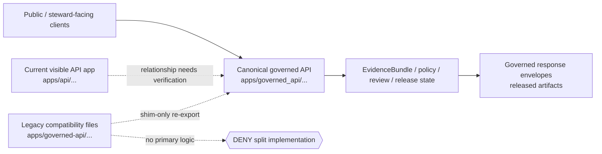

<!-- [KFM_META_BLOCK_V2]
doc_id: kfm://doc/NEEDS-VERIFICATION-adr-0202-governed-api-path-canonicalization
title: ADR-0202: Governed API Path Canonicalization
type: standard
version: v1
status: review
owners: governed API maintainer (role carried forward from existing ADR; named owner NEEDS VERIFICATION)
created: NEEDS_VERIFICATION-YYYY-MM-DD
updated: 2026-05-06
policy_label: NEEDS_VERIFICATION
related: [docs/adr/README.md, docs/architecture/governed-api.md, apps/api/README.md, apps/api/server.py, tools/ci/check_governed_api_path_policy.py, tools/ci/python_syntax_targets.txt, tools/ci/run_repo_baseline_local.sh]
tags: [kfm, adr, governed-api, repository-structure, compatibility, trust-membrane, ci, rollback]
notes: [Decision status is accepted from existing ADR text. This revision adds KFM Meta Block V2, preserves stable ADR anchors where practical, distinguishes decision status from enforcement proof, and records that active-branch canonical/legacy mapped file presence still requires verification.]
[/KFM_META_BLOCK_V2] -->

<a id="top"></a>

# ADR-0202: Governed API Path Canonicalization

One governed API implementation home; one legacy compatibility surface; no split-brain trust boundary.

<p align="center">
  
  
  
  
  
  
</p>

> [!IMPORTANT]
> **Decision status:** `accepted`  
> **Canonical implementation path:** `apps/governed_api/...`  
> **Legacy compatibility path:** `apps/governed-api/...`  
> **Compatibility rule:** legacy files may point back to canonical modules; they must not contain primary implementation logic.  
> **Enforcement posture:** `NEEDS VERIFICATION` until the checker is run on the active branch and the mapped canonical/legacy files are confirmed present.

---

## Quick navigation

| Decision | Enforcement | Operations |
|---|---|---|
| [1. Decision summary](#1-decision-summary) | [8. Enforced mapping](#8-enforced-mapping) | [16. Validation](#16-validation) |
| [2. Context](#2-context) | [9. Current checker behavior](#9-current-checker-behavior) | [17. Rollback](#17-rollback) |
| [3. Problem statement](#3-problem-statement) | [10. CI enforcement requirements](#10-ci-enforcement-requirements) | [18. Documentation impact](#18-documentation-impact) |
| [4. Decision](#4-decision) | [11. Recommended checker hardening](#11-recommended-checker-hardening) | [19. Open verification items](#19-open-verification-items) |
| [5. Scope](#5-scope) | [12. Contributor rules](#12-contributor-rules) | [20. Final rule](#20-final-rule) |
| [6. Canonical path rules](#6-canonical-path-rules) | [13. Compatibility posture](#13-compatibility-posture) | [Review checklist](#review-checklist) |
| [7. Accepted shim shapes](#7-accepted-shim-shapes) | [14. Relationship to KFM governance](#14-relationship-to-kfm-governance) |  |

---

## At a glance

| Surface | Canonical | Legacy compatibility | Rule |
|---|---|---|---|
| Governed API implementation | `apps/governed_api/...` | `apps/governed-api/...` | New logic goes canonical only. |
| Python import posture | Normal dotted package path | File/path compatibility only | Do not import implementation from legacy. |
| Legacy file content | N/A | Shim-only | No functions, classes, route logic, policy logic, or file I/O. |
| Documentation default | Use `apps/governed_api/...` | Label explicitly as legacy compatibility | Do not present legacy as canonical. |
| Current visible API app | `apps/api/...` | Not decided here | Relationship to canonical home remains `NEEDS VERIFICATION`. |
| CI policy | [`tools/ci/check_governed_api_path_policy.py`](../../tools/ci/check_governed_api_path_policy.py) | Enforces mapped shims | Run before merge; verify CI wiring. |
| Removal path | N/A | Later ADR or amendment required | Do not silently delete compatibility. |



[Back to top](#top)

---

## ADR record

| Field | Value |
|---|---|
| **Status** | `accepted` |
| **Document revision status** | `review` |
| **Date accepted** | `2026-04-25` |
| **Last updated** | `2026-05-06` |
| **Decision area** | repository structure / import boundaries / compatibility / trust membrane |
| **Primary owner** | `governed API maintainer` — named owner `NEEDS VERIFICATION` |
| **Applies to** | Python implementation paths under `apps/governed_api/...` and legacy file-path compatibility under `apps/governed-api/...` |
| **Does not settle** | whether `apps/api/...` is the active runtime app, transitional app, compatibility app, or eventual migration source |
| **CI guard** | [`tools/ci/check_governed_api_path_policy.py`](../../tools/ci/check_governed_api_path_policy.py) |
| **Syntax target list** | [`tools/ci/python_syntax_targets.txt`](../../tools/ci/python_syntax_targets.txt) |
| **Local baseline runner** | [`tools/ci/run_repo_baseline_local.sh`](../../tools/ci/run_repo_baseline_local.sh) |
| **Related architecture doc** | [`docs/architecture/governed-api.md`](../architecture/governed-api.md) |
| **Truth posture** | `CONFIRMED` ADR decision and checker file presence; `NEEDS VERIFICATION` for checker pass state, active CI wiring, mapped canonical files, mapped legacy shims, and `apps/api/...` relationship |

> [!NOTE]
> An ADR can be accepted while enforcement remains unproven. Keep **decision status**, **file presence**, **CI wiring**, and **runtime behavior** separate.

---

## Current evidence snapshot

| Evidence item | Current status | What it supports | What it does not prove |
|---|---:|---|---|
| Target ADR file | `CONFIRMED` | `docs/adr/ADR-0202-governed-api-path-canonicalization.md` exists and records an accepted decision. | Does not prove every mapped implementation file exists or every workflow runs the checker. |
| ADR index | `CONFIRMED` | `docs/adr/README.md` exists and uses KFM Meta Block V2 / ADR governance conventions. | Does not prove complete ADR inventory or owners. |
| Governed API architecture doc | `CONFIRMED` | `docs/architecture/governed-api.md` links this ADR into the trust-membrane architecture. | Does not prove runtime deployment or full route coverage. |
| Path-policy checker | `CONFIRMED` | `tools/ci/check_governed_api_path_policy.py` defines canonical files, legacy shim mappings, and shim validation rules. | Does not prove checker pass state in CI. |
| Python syntax target list | `CONFIRMED` | `tools/ci/python_syntax_targets.txt` lists both hyphenated and underscore ecology runtime paths. | Does not prove all listed files are present in the active branch. |
| Local baseline runner | `CONFIRMED` | `tools/ci/run_repo_baseline_local.sh` calls the governed API path-policy checker and ecology pytest targets. | Does not prove the command has run successfully in this session or in CI. |
| Current visible runtime app | `CONFIRMED file presence` | `apps/api/server.py` exists and implements public-safe ecology API behavior. | Does not settle whether `apps/api/...` is canonical, transitional, or separate from `apps/governed_api/...`. |

> [!WARNING]
> A direct file-home decision for `apps/governed_api/...` does not automatically migrate, delete, or bless `apps/api/...`. Treat that relationship as a separate verification and migration question.

[Back to top](#top)

---

## 1. Decision summary

KFM will use `apps/governed_api/...` as the canonical governed API implementation path.

The historical hyphenated path, `apps/governed-api/...`, remains only as a compatibility surface for legacy file-path references, old documentation, migration notes, and narrowly scoped tooling that still expects those files to exist.

The legacy path must not become a second implementation home. Any behavior, route handler, resolver, policy bridge, runtime adapter, evidence resolver, DTO implementation, source access, validation, mutation, persistence, or response-envelope construction belongs in the canonical underscore path.

The operating rule is intentionally simple:

> Implementation goes in `apps/governed_api/...`; `apps/governed-api/...` only points back to it.

[Back to top](#top)

---

## 2. Context

The repository has used two near-identical governed API path spellings:

| Path | Role | Import posture | Decision state |
|---|---|---|---|
| `apps/governed_api/...` | Canonical implementation | Python-importable dotted package path | authoritative |
| `apps/governed-api/...` | Legacy compatibility path | not a normal Python dotted import path because of the hyphen | shim-only |

The repository also contains `apps/api/...` API materials. This ADR does **not** decide whether that path is the active runtime app, a transitional app, a domain-specific API app, or a compatibility app. It decides only the underscore-versus-hyphen governed API ambiguity.

The risk is not cosmetic. KFM’s governed API boundary is a trust-bearing membrane between clients and internal evidence, policy, release, correction, and runtime state. Duplicated governed API code can create divergent behavior at exactly the layer where KFM needs deterministic routing, stable envelope contracts, citation discipline, policy checks, release-state visibility, and auditable runtime outcomes.

This ADR settles one file-home question without pretending every historical reference has already been rewritten.

[Back to top](#top)

---

## 3. Problem statement

KFM needs exactly one governed API implementation home.

Without this ADR, contributors can accidentally:

- add new Python logic under the legacy hyphenated path;
- patch a shim while the canonical implementation remains unchanged;
- import from a path that is not a normal Python package path;
- create tests that pass against one path while runtime code uses another;
- update documentation in a way that presents the legacy path as canonical;
- weaken the governed API trust membrane by allowing two outward-response regimes to evolve.

That is unacceptable for a system whose public unit of value is an inspectable claim and whose public clients must use governed interfaces rather than internal stores, direct source payloads, graph/vector projections as truth, or ad hoc runtime output.

[Back to top](#top)

---

## 4. Decision

1. **Canonical implementation path:** `apps/governed_api/...`
2. **Legacy compatibility path:** `apps/governed-api/...`
3. **Legacy shim rule:** files under the legacy compatibility path may only re-export canonical modules or canonical symbols.
4. **No primary logic in legacy path:** no domain logic, route logic, policy logic, evidence resolution, runtime envelope construction, source access, validation, data loading, mutation, persistence, or public-response behavior may live under `apps/governed-api/...`.
5. **CI enforcement:** `tools/ci/check_governed_api_path_policy.py` is the current named checker for this policy.
6. **New implementation work:** new governed API implementation files must be created under `apps/governed_api/...` unless a later ADR changes the canonical home.
7. **Documentation default:** new documentation must refer to `apps/governed_api/...` as canonical. References to `apps/governed-api/...` must be explicitly labeled as legacy compatibility.
8. **Removal requires a new decision:** deleting the legacy compatibility path requires a later ADR or ADR amendment, plus migration notes and validation evidence.
9. **`apps/api/...` remains unresolved here:** the relationship between the current visible `apps/api/...` API surface and the canonical governed API home remains `NEEDS VERIFICATION`.

[Back to top](#top)

---

## 5. Scope

### 5.1 In scope

This ADR governs:

- Python implementation files under `apps/governed_api/...`;
- legacy compatibility files under `apps/governed-api/...`;
- import and re-export boundaries between those paths;
- CI policy for canonical/legacy mapping;
- documentation wording about the two paths;
- compatibility behavior for existing path references;
- reviewer expectations when the current API surface appears under another app path such as `apps/api/...`.

### 5.2 Out of scope

This ADR does not decide:

- public URL paths;
- OpenAPI route naming;
- FastAPI, Flask, or other framework selection;
- schema-home authority between `schemas/` and `contracts/`;
- runtime envelope field structure;
- app registration of specific routes;
- production deployment topology;
- migration of `apps/api/...`;
- whether legacy path references in all historical documents are immediately rewritten.

> [!NOTE]
> The `contracts/` versus `schemas/` authority question remains separate. Do not use this ADR to create parallel schema authority or to resolve schema-home placement by implication.

[Back to top](#top)

---

## 6. Canonical path rules

### 6.1 Canonical files

Canonical governed API implementation files live under:

```text
apps/governed_api/
```

A canonical file may contain:

- route definitions;
- runtime adapters;
- EvidenceRef-to-EvidenceBundle resolution boundaries;
- response-envelope builders;
- request/response DTO shaping;
- integration with policy and citation validation;
- test fixtures or helper code if the repository’s app convention places them there;
- normal implementation code.

A canonical file must not import implementation logic from the legacy path.

### 6.2 Legacy files

Legacy compatibility files live under:

```text
apps/governed-api/
```

A legacy file may contain only:

- compatibility imports from the matching canonical module;
- re-export assignments from the imported canonical module;
- `__all__` declarations when the checker allows them;
- comments or docstrings only if the checker allows them.

A legacy file must not contain:

- function definitions;
- class definitions;
- route registration logic;
- runtime envelope construction;
- evidence resolution logic;
- source loading or file I/O;
- policy checks;
- schema definitions;
- persistence or mutation logic;
- direct calls into `RAW`, `WORK`, `QUARANTINE`, `PROCESSED`, `CATALOG`, `TRIPLET`, or `PUBLISHED` stores;
- test-only behavior hidden in production paths;
- business logic of any kind.

[Back to top](#top)

---

## 7. Accepted shim shapes

### 7.1 Current checker-compatible shim

The current checker-compatible legacy shim shape is the exact two-line star re-export form:

```python
from __future__ import annotations
from apps.governed_api.ecology.routes import *  # noqa: F401,F403
```

Use the correct canonical target module for each legacy shim.

### 7.2 Explicit re-export shape

Explicit re-export is readable and may be preferred in a future checker revision:

```python
from __future__ import annotations

from apps.governed_api.ecology.routes import router

__all__ = ["router"]
```

However, this form is **not guaranteed to pass the current checker** unless the checker has been amended to allow it.

### 7.3 Forbidden import shape

Importing from the legacy path is not allowed:

```python
# Forbidden: legacy path must never be the implementation source.
# This is not valid Python package syntax and must not be normalized into docs:
# from apps.governed-api.ecology.routes import router
```

Because `governed-api` contains a hyphen, it is not a normal Python dotted package path. Compatibility is file/path compatibility, not endorsement of a Python import namespace.

[Back to top](#top)

---

## 8. Enforced mapping

The current enforced mapping is:

| Canonical implementation file | Legacy compatibility shim |
|---|---|
| `apps/governed_api/ecology/evidencebundle_resolver.py` | `apps/governed-api/ecology/evidencebundle_resolver.py` |
| `apps/governed_api/ecology/routes.py` | `apps/governed-api/ecology/routes.py` |
| `apps/governed_api/ecology/fastapi_routes.py` | `apps/governed-api/ecology/fastapi_routes.py` |

This list is a minimum enforcement set, not permission to add ungoverned logic elsewhere under `apps/governed-api/...`.

When new legacy compatibility files are retained or created, the checker must be updated so CI knows the canonical counterpart and can verify the shim contract.

> [!WARNING]
> An unregistered Python file under `apps/governed-api/...` is not harmless. It is either a missing shim mapping, a migration mistake, or an attempted second implementation home.

[Back to top](#top)

---

## 9. Current checker behavior

`tools/ci/check_governed_api_path_policy.py` currently performs a small deterministic path-policy check.

| Checker behavior | Status | Notes |
|---|---:|---|
| Accepts `--root` argument | `CONFIRMED` | Enables local or CI execution from a supplied repository root. |
| Requires three canonical files | `CONFIRMED` | Missing canonical files fail the check. |
| Requires three legacy shim files | `CONFIRMED` | Missing legacy shim files fail the check. |
| Rejects canonical files that are shim-only | `CONFIRMED` | Prevents accidental inversion of canonical and legacy roles. |
| Requires exact two-line legacy shim shape | `CONFIRMED` | Current implementation requires `from __future__ import annotations` plus star re-export from the canonical target. |
| Uses AST hardening | `NOT CONFIRMED` | Current checker is text/regex-based; AST hardening is recommended below. |
| Scans all unregistered legacy Python files | `NEEDS VERIFICATION` | Do not assume full-tree legacy scanning without checking the active checker. |
| Scans documentation references | `NEEDS VERIFICATION` | Documentation misuse may need a separate docs check. |
| Is wired into CI workflows | `NEEDS VERIFICATION` | Local baseline runner invokes it, but workflow enforcement must be verified separately. |
| Passes on active `main` | `NEEDS VERIFICATION` | Run the checker on the active checkout before claiming enforcement. |

[Back to top](#top)

---

## 10. CI enforcement requirements

`tools/ci/check_governed_api_path_policy.py` must fail when any of the following are true:

1. A required canonical file is missing.
2. A required legacy shim file is missing while the compatibility path is still in force.
3. A legacy shim contains primary logic.
4. A legacy shim imports from anything other than its canonical counterpart, except for narrow typing/linter-safe imports approved by the checker.
5. A canonical file imports implementation from the legacy path.
6. A legacy file defines functions, classes, route handlers, validators, policy branches, source readers, persistence behavior, or runtime envelope builders.
7. A new Python file appears under `apps/governed-api/...` without being registered as a shim mapping or explicitly denied by the checker.
8. A documentation or test fixture asserts `apps/governed-api/...` as canonical without labeling it legacy compatibility, if that documentation scan is enabled in CI.

The checker should be deterministic, no-network, read-only, and small enough to review as part of normal CI maintenance.

[Back to top](#top)

---

## 11. Recommended checker hardening

The current checker is intentionally small. The next hardening pass should combine path mapping with AST and documentation checks.

Recommended additions:

- parse every legacy shim with `ast.parse`;
- allow only docstrings, imports, `__all__`, comments, and simple alias/re-export assignments;
- reject `FunctionDef`, `AsyncFunctionDef`, `ClassDef`, `If`, `For`, `While`, `With`, `Try`, route decorators, file I/O, and executable `Call`-bearing logic;
- reject imports that reference `apps.governed-api`, `apps/governed-api`, or other legacy modules as implementation sources;
- scan canonical files for references to `apps/governed-api` except comments, ADR text, migration notes, and checker mappings;
- scan for unregistered Python files under `apps/governed-api/...`;
- optionally scan docs for examples that present `apps/governed-api/...` as canonical;
- exit non-zero with file-specific reason codes.

Reason-code examples:

```text
missing.canonical
missing.legacy_shim
legacy.non_shim_ast
legacy.bad_import
canonical.imports_legacy
legacy.unregistered_file
docs.legacy_presented_as_canonical
```

Recommended checker output style:

```text
[legacy.non_shim_ast] apps/governed-api/ecology/routes.py: FunctionDef is not allowed in a legacy shim.
[canonical.imports_legacy] apps/governed_api/ecology/routes.py: canonical module references legacy path.
```

[Back to top](#top)

---

## 12. Contributor rules

### 12.1 Adding new governed API logic

When adding governed API logic:

1. Create or update the canonical file under `apps/governed_api/...`, unless a later accepted ADR changes the canonical implementation home.
2. Add tests against the canonical path.
3. Add or update a legacy shim only when backward file-path compatibility is still required.
4. Update `tools/ci/check_governed_api_path_policy.py` with the mapping.
5. Update `tools/ci/python_syntax_targets.txt` if syntax checks should include the file.
6. Update docs so the canonical path is the default reference.
7. Run the path-policy checker before merging.

### 12.2 Editing legacy shim files

Legacy shim edits should be rare.

Allowed reasons:

- update the canonical import target after a canonical rename;
- adjust exports to match canonical exports if the checker allows that shape;
- improve compatibility comments or docstrings if the checker allows them;
- remove the shim after a later ADR authorizes deprecation/removal.

Disallowed reasons:

- quick-fix route behavior;
- bypass tests on canonical modules;
- add fallback logic;
- load fixtures or files directly;
- add policy or citation behavior;
- hide divergent behavior from the canonical path.

### 12.3 Updating docs

New or revised docs should use:

```text
apps/governed_api/...
```

When mentioning the legacy path, use wording like:

```text
apps/governed-api/... is a legacy compatibility path and must remain shim-only.
```

Do not write examples that direct contributors to place new implementation logic under `apps/governed-api/...`.

### 12.4 Touching `apps/api/...`

When a change touches `apps/api/...`, reviewers should verify whether the change is:

- active runtime implementation;
- a transitional wrapper;
- a separate API app;
- a compatibility layer;
- documentation that should link to this ADR;
- a candidate for migration to `apps/governed_api/...`.

Do not silently duplicate `apps/api/...` behavior into `apps/governed-api/...`.

[Back to top](#top)

---

## 13. Compatibility posture

The legacy path exists only to avoid immediate breakage from historical references and transitional tooling.

Compatibility does not mean behavioral independence. Any behavior reachable through the legacy file path must be behavior defined by the canonical module.

The compatibility path may be removed only when all of the following are true:

- historical references are migrated or clearly labeled;
- downstream tooling no longer requires the legacy file path;
- CI has a removal check or migration check;
- docs include the removal decision;
- rollback is documented;
- a later ADR or ADR amendment approves the removal.

[Back to top](#top)

---

## 14. Relationship to KFM governance

This ADR preserves KFM’s trust posture by preventing the governed API from splitting into two implementation regimes.

The path decision supports these KFM invariants:

- public and steward-facing clients use governed interfaces, not internal stores;
- AI and UI surfaces consume governed envelopes, not raw model or source output;
- EvidenceBundle, policy, review, release, and correction state remain upstream of runtime-facing claims;
- generated summaries and map/UI outputs remain downstream carriers, not sovereign truth;
- compatibility is visible, bounded, auditable, and reversible;
- rollback restores canonical behavior or shims, not duplicate implementation.

This ADR does not authorize direct client access to canonical/internal stores. It only settles repository path ownership for governed API code.

[Back to top](#top)

---

## 15. Consequences

### 15.1 Positive

- Python import behavior is deterministic.
- Implementation ownership is clear.
- Legacy path references can continue to resolve during migration.
- CI can detect accidental split-brain implementation.
- Documentation can migrate gradually without blocking implementation clarity.
- The governed API trust membrane has one implementation owner.
- Reviewer burden is explicit when `apps/api/...`, `apps/governed_api/...`, and `apps/governed-api/...` all appear in evidence.

### 15.2 Negative / tradeoffs

- Temporary duplicate file paths remain visible.
- CI must maintain a canonical-to-legacy mapping.
- Contributors must learn the underscore/hyphen distinction.
- Historical documents may still mention the legacy path until updated.
- Current `apps/api/...` relationship remains unresolved by this ADR.
- Removal of the legacy path is deferred and requires later governance work.

### 15.3 Accepted tradeoff

KFM accepts short-term visible compatibility duplication to avoid breaking historical path references, but rejects long-term duplicated implementation logic.

[Back to top](#top)

---

## 16. Validation

### 16.1 Required local validation

Run from repository root:

```bash
python3 tools/ci/check_governed_api_path_policy.py --root .
```

If the repository has a test wrapper for the checker, also run the relevant test target, for example:

```bash
python3 -m pytest -q tests/ci
```

### 16.2 Recommended local validation

Before opening a PR that touches `apps/governed_api/...`, `apps/governed-api/...`, or related API docs, run:

```bash
git status --short
git branch --show-current || true

python3 tools/ci/check_governed_api_path_policy.py --root .

git grep -n "apps/governed-api" -- . \
  ':!docs/adr/ADR-0202*' \
  ':!tools/ci/check_governed_api_path_policy.py' \
  ':!tools/ci/python_syntax_targets.txt' || true

git grep -n -E "from apps[.]governed-api|import apps[.]governed-api" -- '*.py' || true

find apps/api apps/governed_api apps/governed-api -maxdepth 4 -type f 2>/dev/null | sort
```

Interpretation:

- direct implementation references should use `apps/governed_api/...`;
- remaining `apps/governed-api/...` references should be migration notes, legacy labels, checker mappings, or syntax target declarations;
- Python imports from the hyphenated path should not exist;
- `apps/api/...` files should be reviewed separately for active-app or migration implications.

### 16.3 Acceptance criteria

A PR satisfies this ADR when:

- all governed API implementation logic is under `apps/governed_api/...`, or any alternate implementation home is justified by a newer accepted ADR;
- every retained `apps/governed-api/...` Python file is shim-only and checker-compatible;
- CI path-policy check passes;
- docs label the legacy path correctly;
- tests target canonical implementation behavior;
- no public or steward UI, Focus Mode, route, or runtime envelope relies on the legacy path as a truth source;
- `apps/api/...` changes do not silently create a third ungoverned implementation regime.

[Back to top](#top)

---

## 17. Rollback

Rollback of this ADR’s implementation is straightforward if a path-policy change breaks the repository unexpectedly:

1. Revert the PR that changed the checker or shim mapping.
2. Restore the last passing canonical and legacy shim files.
3. Re-run `python3 tools/ci/check_governed_api_path_policy.py --root .`.
4. Re-run governed API route/runtime tests affected by the reverted change.
5. Record the failed migration attempt in PR notes, the drift register, or an ADR amendment log.

Rollback must not move implementation logic into the legacy path. If compatibility is broken, restore shims; do not duplicate canonical behavior.

[Back to top](#top)

---

## 18. Documentation impact

Required documentation updates:

- this ADR remains in `docs/adr/`;
- governed API README files should identify `apps/governed_api/...` as canonical when discussing this implementation family;
- migration notes should explain that `apps/governed-api/...` is shim-only;
- future route/runtime docs should use canonical paths;
- docs that mention `apps/api/...` should explain its relationship to this ADR or mark the relationship `NEEDS VERIFICATION`;
- any exception must link back to this ADR or a superseding ADR.

Suggested ADR filename:

```text
docs/adr/ADR-0202-governed-api-path-canonicalization.md
```

If the repository later adopts a different ADR home, move this file only with successor links, index updates, and migration notes.

[Back to top](#top)

---

## 19. Open verification items

The following are not closed by this ADR and should be verified in the active repository before making stronger implementation claims:

| Verification item | Status | Why it matters |
|---|---:|---|
| All listed canonical files are present on the active branch | `NEEDS VERIFICATION` | Checker requires them; missing files would make enforcement fail. |
| All listed legacy shim files are present on the active branch | `NEEDS VERIFICATION` | Compatibility policy depends on them while legacy path remains in force. |
| Current checker pass state | `NEEDS VERIFICATION` | File presence is not the same as passing validation. |
| CI workflow YAML runs the checker | `NEEDS VERIFICATION` | Local baseline runner invokes the checker; workflow enforcement must be confirmed. |
| Test wrapper exists for the checker | `NEEDS VERIFICATION` | A direct checker is useful; a regression test makes drift more visible. |
| Checker scans unregistered legacy files | `NEEDS VERIFICATION` | Current mapping is small; future files may bypass enforcement without full-tree scanning. |
| Checker scans docs that present legacy as canonical | `NEEDS VERIFICATION` | Documentation can reintroduce path confusion even when code is correct. |
| `apps/api/...` relationship to `apps/governed_api/...` | `NEEDS VERIFICATION` | The repository has visible API files under `apps/api/...`; this ADR does not settle their migration/authority role. |
| App route registration imports only canonical modules | `NEEDS VERIFICATION` | Runtime app registration can bypass intended implementation home. |
| Downstream tooling still requires legacy path | `NEEDS VERIFICATION` | Determines whether shims can eventually be removed. |
| Document owners and policy label | `NEEDS VERIFICATION` | KFM Meta Block V2 requires reviewable ownership and classification. |
| Stable `doc_id` | `NEEDS VERIFICATION` | Placeholder must be replaced by the document registry or owner process. |

[Back to top](#top)

---

## 20. Final rule

Use this rule when uncertain:

> Implementation goes in `apps/governed_api/...`; `apps/governed-api/...` only points back to it.

The companion rule for current repo review is:

> Do not treat `apps/api/...`, `apps/governed_api/...`, and `apps/governed-api/...` as interchangeable. Verify their roles before moving code, writing docs, or claiming runtime behavior.

[Back to top](#top)

---

## Review checklist

- [ ] KFM Meta Block V2 placeholder values are reviewed and either filled or kept visibly unresolved.
- [ ] `tools/ci/check_governed_api_path_policy.py --root .` passes.
- [ ] Every retained legacy file is shim-only and checker-compatible.
- [ ] Canonical implementation files contain the actual governed API behavior.
- [ ] No canonical file imports from `apps/governed-api/...`.
- [ ] `tools/ci/python_syntax_targets.txt` matches the intended path set.
- [ ] CI workflow enforcement is verified or tracked as `NEEDS VERIFICATION`.
- [ ] Docs label `apps/governed-api/...` as legacy compatibility only.
- [ ] `apps/api/...` relationship is either clarified or explicitly left as `NEEDS VERIFICATION`.
- [ ] Rollback path is preserved in PR notes if shims, mappings, or canonical paths change.
