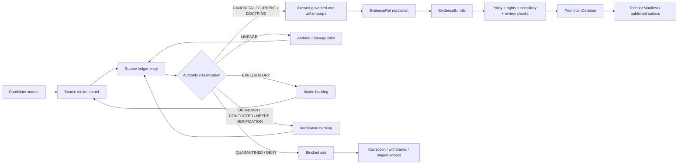

<!-- [KFM_META_BLOCK_V2]
doc_id: kfm://doc/NEEDS-VERIFICATION-adr-0203-source-ledger-authority
title: ADR-0203: Source Ledger Authority
type: standard
version: v1
status: draft
owners: OWNER_TBD_NEEDS_VERIFICATION
created: 2026-04-27
updated: 2026-05-06
policy_label: NEEDS-VERIFICATION
related: [../../README.md, ./README.md, ./ADR-0001-schema-home.md, ../registers/SOURCE_LEDGER.md, ../sources/SOURCE_LEDGER.md, ../../tools/check_source_ledger.py, ../../tests/test_source_ledger.py, ../../scripts/validate_all.sh]
tags: [kfm, adr, source-ledger, source-authority, evidence, governance, provenance, validation]
notes: [Path confirmed in accessible GitHub connector as docs/adr/ADR-0203-source-ledger-authority.md. Title corrected from existing ADR-0303 mismatch to ADR-0203 to match filename and ADR index. Owner, policy label, created-date provenance, acceptance state, CODEOWNERS routing, and enforcement maturity remain NEEDS VERIFICATION.]
[/KFM_META_BLOCK_V2] -->

<a id="top"></a>

# ADR-0203: Source Ledger Authority

Decide how KFM ranks, records, cites, promotes, supersedes, and blocks source material so source authority remains inspectable instead of implied.

<div align="center">


</div>

<div align="center">

[Decision](#decision) ·
[Context](#context) ·
[Evidence boundary](#evidence-boundary) ·
[Authority model](#authority-model) ·
[Ledger contract](#ledger-record-contract) ·
[Lifecycle](#lifecycle-and-promotion) ·
[Repo surfaces](#repo-surfaces-and-placement) ·
[Validation](#validation-gates) ·
[Rollback](#rollback-and-correction) ·
[Open verification](#open-verification)

</div>

> [!IMPORTANT]
> **Decision status:** `PROPOSED / draft`  
> **Target path:** `docs/adr/ADR-0203-source-ledger-authority.md`  
> **Current implementation signal:** source-ledger files, a source-ledger checker, a unit-test wrapper, and aggregate validation script references are visible in the accessible GitHub repository.  
> **Current enforcement state:** `NEEDS VERIFICATION`; this ADR records authority rules, but passing CI/workflow evidence, branch protections, owner routing, release-gate behavior, and runtime enforcement were not verified in this session.  
> **Numbering repair:** the existing file content used `ADR-0303` in title metadata while the path and ADR index point to `ADR-0203`. This revision standardizes the visible title and metadata to `ADR-0203`.

---

## Decision

**PROPOSED:** KFM will treat the source ledger as the governing register for source identity, source status, source authority, claim-support limits, source role, rights posture, sensitivity posture, freshness, lineage, supersession, implementation-proof status, unresolved references, and release eligibility.

The source ledger is **not a bibliography**. It is also **not a replacement for EvidenceBundle resolution**.

Instead, it answers a narrower and earlier question:

> Is this source allowed to support this kind of claim, surface, release, map layer, AI response, proof object, or public artifact?

### Decision rule

Any consequential KFM claim, EvidenceBundle, ReleaseManifest, runtime response, map layer, scene, Story/Focus payload, dashboard, export, or public UI statement must resolve its source references to ledgered source records before it is treated as publishable or authoritative.

When a source reference cannot be resolved, or when source status does not support the requested use, KFM must fail closed.

| Outcome | Use when | Release effect |
|---|---|---|
| `ABSTAIN` | Evidence is insufficient, ambiguous, stale, conflicted, unresolved, or outside source scope. | Do not answer or publish the claim. |
| `DENY` | Policy, rights, sensitivity, safety, steward review, release state, or source status blocks use. | Block release and record the reason. |
| `ERROR` | Required source resolution, validation, policy evaluation, or ledger access failed. | Fail closed until repaired. |
| `NEEDS VERIFICATION` | Human review or a concrete source check is required before use. | Hold in review/backlog; do not promote. |

### What changes when this ADR is adopted

| Area | Before this ADR | After this ADR |
|---|---|---|
| Source authority | Can be implied by tone, detail, repetition, recency, or proximity. | Must be recorded in a ledgered source record. |
| Planning PDFs and prior reports | Can be accidentally treated as implementation proof. | Default to `LINEAGE` or `PROPOSED` unless repo/runtime evidence confirms implementation. |
| New Ideas packets | Can blur into doctrine. | Remain `EXPLORATORY` until intake, review, and promotion. |
| External source facts | Can become stale silently. | Require dated verification for version-sensitive use. |
| AI/map/UI output | Can look authoritative because it is polished. | Must resolve citations, source roles, policy, review, and release state before consequential output. |
| Rollback | Can remove or overwrite history. | Preserves lineage, aliases, supersession, correction notes, and dependent-release impact. |

[Back to top](#top)

---

## Context

KFM is a governed, evidence-first, map-first, time-aware spatial knowledge and publication system. Its durable public unit of value is the **inspectable claim**: a claim whose evidence, source role, spatial and temporal scope, policy posture, review state, release state, and correction lineage can be inspected.

KFM’s source corpus is intentionally broad. It includes doctrine, ADRs, architecture manuals, domain-lane plans, source atlases, source descriptors, technical references, implementation sketches, generated reports, exploratory idea packets, external standards, official source-system pages, runtime artifacts, and public-facing docs.

That breadth is useful only when KFM can tell reviewers and public surfaces what each source is allowed to prove.

| Source material | Risk if not classified |
|---|---|
| Accepted ADRs, canonical docs, contracts, schemas, and policy files | Authority can drift silently across files. |
| Current source files, tests, workflows, logs, manifests, and emitted artifacts | Implementation behavior can be overstated or confused with doctrine. |
| Attached planning PDFs and domain-lane blueprints | Proposed paths can be mistaken for implemented repo state. |
| New Ideas packets | Exploratory sketches can be promoted by tone rather than review. |
| External standards and source-system pages | Version-sensitive facts can become stale but still sound current. |
| Generated summaries, AI answers, maps, tiles, dashboards, and scenes | Derived views can be mistaken for sovereign truth. |

This ADR establishes the source ledger as a required authority-control surface. It does **not** claim that every named register, schema, validator, workflow, dashboard, release manifest, or emitted proof object is complete or enforced.

[Back to top](#top)

---

## Evidence boundary

This ADR is grounded in the accessible GitHub repository evidence, KFM Directory Rules, root README doctrine, adjacent ADR patterns, source-ledger files, source-ledger validation hooks, and attached KFM source-ledger/governed-AI doctrine.

### Current repo evidence used

| Evidence item | Status | Supports | Does not prove |
|---|---:|---|---|
| `docs/adr/ADR-0203-source-ledger-authority.md` | `CONFIRMED` via connector | Target path exists. | Decision is accepted, enforced, or correctly numbered in all metadata. |
| `docs/adr/README.md` | `CONFIRMED` | ADR directory is the human-facing decision ledger and lists `ADR-0203-source-ledger-authority.md`. | Complete ADR coverage or owner routing. |
| `docs/registers/SOURCE_LEDGER.md` | `CONFIRMED` | Richer project source ledger exists under registers. | It is complete, current, or machine-enforced. |
| `docs/sources/SOURCE_LEDGER.md` | `CONFIRMED` | Minimal source-ledger file exists and is the current checker target. | It is sufficient as the canonical authority ledger. |
| `tools/check_source_ledger.py` | `CONFIRMED` | Source-ledger checker exists and looks for verification posture. | Full source-ledger contract validation. |
| `tests/test_source_ledger.py` | `CONFIRMED` | Test wrapper exists for the source-ledger checker. | That the test passed in current CI. |
| `scripts/validate_all.sh` | `CONFIRMED` | Aggregate validation script invokes `tools/check_source_ledger.py`. | That aggregate validation ran or passes. |
| `README.md` | `CONFIRMED` | Root doctrine states KFM trust law and source/evidence posture. | Final policy labels, owners, or release maturity. |
| `ADR-0001-schema-home.md` | `CONFIRMED` | Adjacent ADR style separates decisions from enforcement and uses KFM Meta Block v2. | This ADR’s acceptance state. |

### Truth labels used here

| Label | Meaning |
|---|---|
| `CONFIRMED` | Verified from current connector evidence, local workspace inspection, or supplied KFM doctrine. |
| `PROPOSED` | Recommended decision, implementation rule, path behavior, validator behavior, or process not yet proven as active enforcement. |
| `NEEDS VERIFICATION` | A concrete check must pass before this ADR can be treated as accepted or enforced. |
| `UNKNOWN` | Not verified strongly enough in this session. |
| `CONFLICTED` | Multiple authority signals exist and must not be normalized silently. |
| `LINEAGE` | Prior material preserved for continuity, not treated as current implementation proof. |

[Back to top](#top)

---

## Scope

This ADR governs source authority for:

- KFM doctrine, ADRs, standards, contracts, schemas, and policy documents;
- source descriptors, source-intake records, source ledgers, source registries, and source aliases;
- EvidenceRef → EvidenceBundle resolution;
- source roles, claim-support limits, rights, sensitivity, freshness, and review state;
- receipts, proof packs, manifests, catalog records, release artifacts, and correction records;
- MapLibre/Cesium layer manifests, scene manifests, Evidence Drawer payloads, and Story/Focus payloads;
- governed AI runtime context, citation validation, finite response envelopes, and AI receipts;
- domain-lane source registries and cross-domain references;
- New Ideas intake and promotion;
- external official-source checks when current facts matter.

### Non-goals

This ADR does not:

- settle the canonical schema home beyond respecting accepted schema-home ADRs;
- define the complete EvidenceBundle contract;
- define every SourceDescriptor field;
- activate live source connectors;
- make any attached PDF a current implementation proof;
- approve public release of sensitive, restricted, unpublished, culturally sensitive, ecological, archaeological, living-person, title/ownership, security-relevant, or rights-unclear sources;
- require deletion of lineage material that has been superseded;
- prove that CI, workflow, branch protection, dashboard, release-gate, or runtime enforcement exists.

[Back to top](#top)

---

## Authority model

KFM must distinguish **doctrine authority**, **implementation evidence**, **release/proof evidence**, **external current facts**, and **exploratory design pressure**.

> [!NOTE]
> Authority rank is applied **per claim type**. No source class outranks every other source class for every question. Current implementation evidence controls claims about what the repo or runtime currently does. Accepted doctrine controls claims about what KFM requires. When sources conflict, record the conflict; do not smooth it away.

### Authority ladder

| Rank | Source class | Can support | Cannot support without more evidence | Default posture |
|---:|---|---|---|---|
| 0 | Accepted ADRs, canonical repo docs, contracts, schemas, and policy files | Accepted KFM doctrine, decisions, contract semantics, governance requirements | Runtime behavior unless tests, logs, workflows, or artifacts prove it | `CANONICAL` when verified |
| 1 | Current repo/workspace evidence: source files, tests, workflows, manifests, configs, dashboards, logs | Current implementation existence, file presence, enforcement behavior, workflow behavior | Intended doctrine if it conflicts with accepted docs | `CONFIRMED` for inspected behavior |
| 2 | Current release artifacts, proof packs, signed bundles, ReleaseManifest, CatalogMatrix, published receipts | Release state, integrity state, promotion evidence, rollback targets | Raw source truth beyond recorded evidence | `RELEASED` / `PROOF` when verified |
| 3 | KFM baseline manuals, documentation architecture docs, whole-system doctrine | Project doctrine, terminology, invariants, design intent, control-plane posture | Current repo file presence, routes, tests, workflows, runtime maturity | `DOCTRINE` / `LINEAGE` |
| 4 | Subsystem manuals and domain-lane architecture plans | Domain burden, source-role discipline, proposed implementation shape, risk posture | Current implementation unless repo evidence confirms it | `LINEAGE` / `PROPOSED` |
| 5 | New Ideas packets, sketches, prior scaffold reports, exploratory implementation plans | Candidate backlog, design pressure, source-intake leads | Canon, current behavior, release authority, rights clearance | `EXPLORATORY` |
| 6 | External official sources and standards | Current version-sensitive facts, endpoint metadata, source-system details, public standard language | KFM doctrine unless adopted by KFM | `EXTERNAL-VERIFIED` after dated check |
| 7 | General technical references | Conceptual background, implementation craft, comparative patterns | KFM-specific doctrine, source rights, release state, repo behavior | `REFERENCE` |
| 8 | Memory, unsourced summaries, unreviewed generated language, screenshots without provenance | Nothing authoritative | Any consequential claim | `NOT-AUTHORITY` |

### Doctrine versus implementation rule

| Question being asked | Preferred evidence | Required label when not verified |
|---|---|---|
| “What does KFM require?” | Accepted ADRs, canonical docs, doctrine manuals | `PROPOSED` or `UNKNOWN` if not accepted |
| “What does the repo contain?” | Current checkout or connector file evidence | `UNKNOWN` if not inspected |
| “What does the system do at runtime?” | Tests, logs, manifests, dashboards, run receipts, emitted artifacts | `UNKNOWN` without runtime/proof evidence |
| “What can this source prove?” | Ledger record + source descriptor + claim-support fields | `NEEDS VERIFICATION` until ledgered |
| “Can this be released?” | EvidenceBundle closure + rights/sensitivity/policy/review/release gates | `DENY` or `ABSTAIN` when unresolved |

[Back to top](#top)

---

## Source status taxonomy

These are **source-use statuses**, not task truth labels. A ledger entry must carry one current source-use status and may also carry task truth labels in notes.

| Status | Meaning | Public-claim eligibility |
|---|---|---|
| `CANONICAL` | Current accepted repo-native authority. | Eligible within stated scope. |
| `CURRENT` | Active supporting source, not necessarily canonical. | Eligible if source role, rights, sensitivity, freshness, review, and policy permit. |
| `DOCTRINE` | Governing KFM doctrine or operating law, not necessarily implementation proof. | Eligible for doctrine claims; not implementation proof. |
| `RELEASED` | Published or promoted artifact with release state. | Eligible for release-state claims within manifest scope. |
| `PROOF` | Proof pack, signed bundle, validation report, or receipt family used to support promotion/release evidence. | Eligible for proof/process claims, not raw-source truth beyond its contents. |
| `LINEAGE` | Historical or prior material preserved to explain evolution. | Eligible only for lineage claims unless explicitly promoted. |
| `EXPLORATORY` | Idea packet, sketch, backlog input, unapproved proposal, or research note. | Not eligible for authoritative claims. |
| `REFERENCE` | Background conceptual or technical source. | Eligible for background support only. |
| `EXTERNAL-VERIFIED` | Official external source checked for a dated fact. | Eligible for the dated fact, subject to freshness and KFM adoption. |
| `SUPERSEDED` | Replaced by a newer source but retained for audit. | Not eligible except for historical traceability. |
| `DEPRECATED` | Intentionally retired from normal use. | Not eligible without exception review. |
| `QUARANTINED` | Blocked due to rights, sensitivity, integrity, conflict, policy, or uncertainty. | Not eligible. |
| `UNKNOWN` | Status has not been established. | Not eligible. |
| `CONFLICTED` | Source conflicts with another source and resolution is pending. | Not eligible for unresolved claims. |
| `NEEDS-VERIFICATION` | A concrete check is required before use. | Not eligible until checked. |
| `NOT-AUTHORITY` | Memory, unreviewed AI output, or unsourced assertion. | Never eligible. |

### Status transition rules

| Transition | Allowed only when |
|---|---|
| `EXPLORATORY` → `CURRENT` | Intake record, source role, rights, sensitivity, and claim-support review are complete. |
| `LINEAGE` → `DOCTRINE` | The source is accepted as governing doctrine through documented review. |
| `CURRENT` → `CANONICAL` | The source is accepted as repo-native authority or adopted by an accepted ADR/policy. |
| `CURRENT` → `RELEASED` | Promotion gates pass and release manifest/proof objects are emitted. |
| Any status → `QUARANTINED` | Rights, sensitivity, integrity, source-role, policy, or conflict risk blocks use. |
| Any status → `SUPERSEDED` | A successor source is identified and linked. |
| `CONFLICTED` → any eligible status | Conflict is resolved and correction/supersession notes are recorded. |

[Back to top](#top)

---

## Ledger record contract

A source-ledger record must be stable enough for machine validation and readable enough for human review.

### Required fields

| Field | Purpose |
|---|---|
| `source_id` | Stable identifier used by EvidenceRef, manifests, receipts, docs, and aliases. |
| `title` | Human-readable title or source name. |
| `source_family` | Canonical, doctrine, domain-lane, external, exploratory, reference, generated, proof, release, etc. |
| `source_status` | One value from the source status taxonomy. |
| `authority_rank` | Rank from this ADR or a superseding ADR. |
| `truth_role` | What the source is allowed to prove. |
| `claims_supported` | Claim types this source can support. |
| `claims_not_supported` | Claim types this source must not be used to support. |
| `source_role` | Role in KFM: doctrine, legal authority, observational evidence, model output, context, derived product, etc. |
| `implementation_proof_status` | Whether the source proves implementation behavior; usually `NO` for planning PDFs. |
| `rights_status` | Rights/licensing/reuse posture. |
| `sensitivity_status` | Public, restricted, sensitive, culturally sensitive, location-sensitive, living-person-sensitive, etc. |
| `freshness_status` | Current, stale, version-sensitive, dated verification, unknown, or not applicable. |
| `retrieved_or_observed_at` | Date/time of source observation when applicable. |
| `digest` | Hash or integrity marker when available. |
| `aliases` | Prior IDs, filenames, titles, renamed references, or imported identifiers. |
| `supersedes` | Older sources replaced by this entry. |
| `superseded_by` | Newer source that replaces this entry. |
| `related_objects` | EvidenceBundle, SourceDescriptor, RunReceipt, ProofPack, ReleaseManifest, CatalogMatrix, etc. |
| `owner_or_steward` | Steward role or owner; use `NEEDS-VERIFICATION` if unknown. |
| `verification_notes` | Concrete checks still required. |

### Conditional fields

| Field | Required when | Purpose |
|---|---|---|
| `external_url` | Source is external. | Allows dated official-source checks without using URLs as authority by themselves. |
| `license_or_terms_url` | Rights depend on published terms. | Supports rights review and release gating. |
| `source_cadence` | Source changes over time. | Supports freshness policy. |
| `access_class` | Source has restricted, staged, stewarded, or private access. | Prevents accidental public exposure. |
| `geoprivacy_transform` | Source contains precise sensitive locations. | Records redaction/generalization requirements. |
| `jurisdiction_or_steward_scope` | Source authority is jurisdiction-bound. | Prevents overbroad claims. |
| `record_level_caveats` | Source reliability or rights vary by record. | Prevents aggregate status from hiding record-specific limits. |

### Implementation-proof values

| Value | Meaning |
|---|---|
| `YES` | Direct repo/runtime/test/artifact evidence proves the implementation claim within scope. |
| `NO` | Source does not prove implementation behavior. |
| `BOUNDED` | Source proves only a narrow implementation fact, such as file presence, not runtime behavior. |
| `UNKNOWN` | Implementation-proof value has not been reviewed. |

[Back to top](#top)

---

## Example record shape

This example is illustrative. It is not a claim that this exact schema or record exists.

```yaml
source_id: SRC-KFM-DOC-ARCH
title: KFM Documentation Architecture Master Package
source_family: documentation-architecture
source_status: LINEAGE
authority_rank: 3
truth_role:
  - documentation-control-plane doctrine
  - canon/lineage/exploratory classification support
claims_supported:
  - KFM documentation authority posture
  - source classification vocabulary
  - evidence-bound documentation planning
claims_not_supported:
  - current repo file existence
  - current CI behavior
  - emitted proof-object presence
  - runtime enforcement
source_role: doctrine-lineage
implementation_proof_status: NO
rights_status: NEEDS-VERIFICATION
sensitivity_status: NEEDS-VERIFICATION
freshness_status: dated-corpus-source
retrieved_or_observed_at: 2026-04-27
digest: NEEDS-VERIFICATION
aliases:
  - documentation architecture package
supersedes: []
superseded_by: []
related_objects:
  - SourceDescriptor
  - EvidenceBundle
  - ReleaseManifest
owner_or_steward: NEEDS-VERIFICATION
verification_notes:
  - verify exact repo-native canon home
  - verify whether current source ledger register is complete
  - verify rights and policy label before public publication
```

### PROPOSED schema fragment

This fragment records minimum shape only. It must not be treated as the accepted schema until the schema-home ADR and current repo conventions are verified.

```json
{
  "$schema": "https://json-schema.org/draft/2020-12/schema",
  "$id": "kfm://schema/source-ledger-entry.v1.PROPOSED",
  "title": "SourceLedgerEntry",
  "type": "object",
  "required": [
    "source_id",
    "title",
    "source_family",
    "source_status",
    "authority_rank",
    "truth_role",
    "claims_supported",
    "claims_not_supported",
    "implementation_proof_status",
    "rights_status",
    "sensitivity_status",
    "freshness_status"
  ],
  "properties": {
    "source_id": { "type": "string", "pattern": "^[A-Z0-9][A-Z0-9._:-]*$" },
    "title": { "type": "string", "minLength": 1 },
    "source_status": {
      "type": "string",
      "enum": [
        "CANONICAL",
        "CURRENT",
        "DOCTRINE",
        "RELEASED",
        "PROOF",
        "LINEAGE",
        "EXPLORATORY",
        "REFERENCE",
        "EXTERNAL-VERIFIED",
        "SUPERSEDED",
        "DEPRECATED",
        "QUARANTINED",
        "UNKNOWN",
        "CONFLICTED",
        "NEEDS-VERIFICATION",
        "NOT-AUTHORITY"
      ]
    },
    "authority_rank": { "type": "integer", "minimum": 0, "maximum": 8 },
    "implementation_proof_status": {
      "type": "string",
      "enum": ["YES", "NO", "BOUNDED", "UNKNOWN"]
    }
  },
  "additionalProperties": true
}
```

[Back to top](#top)

---

## Lifecycle and promotion

A source does not become canonical because it is detailed, repeated, technically plausible, recent, useful, visually polished, or generated by an authoritative-sounding model.



### Promotion rule

A source may be promoted for a requested use only when:

- its ledger record is complete enough for that use;
- source role and claim-support limits are explicit;
- rights and sensitivity are resolved for the release class;
- conflicts and supersession are recorded;
- required source descriptors and schemas are present or explicitly deferred;
- downstream claims have EvidenceRef → EvidenceBundle closure;
- policy checks pass;
- reviewer approval is recorded where required;
- rollback target and correction path are known.

### Trust membrane preservation

This ADR reinforces the KFM lifecycle:

```text
RAW -> WORK / QUARANTINE -> PROCESSED -> CATALOG / TRIPLET -> PUBLISHED
```

Public clients and ordinary UI surfaces must consume governed APIs, released artifacts, source-ledger-aware EvidenceBundles, and release manifests. They must not use raw, work, quarantine, unpublished candidates, or canonical/internal stores as the normal public path.

[Back to top](#top)

---

## Interaction with KFM object families

The source ledger is upstream of EvidenceBundle resolution and downstream of source intake.

| Object family | Relationship to source ledger | Required fail-closed behavior |
|---|---|---|
| `SourceIntakeRecord` | Creates or updates candidate ledger entries. | Incomplete intake cannot promote a source. |
| `SourceDescriptor` | Describes source family, endpoint, cadence, role, rights, sensitivity, and operational limits. | Descriptor gaps block source activation. |
| `EvidenceRef` | Must point to a resolvable ledgered source or evidence item. | Unknown refs produce `ABSTAIN` or `ERROR`. |
| `EvidenceBundle` | Must include source IDs, source roles, review/policy state, citation validation, and bundle hash. | Bundle cannot close with blocked or unresolved sources. |
| `DecisionEnvelope` / `RuntimeResponseEnvelope` | Must surface finite outcomes and source-support status. | No answer text may cite blocked or absent sources. |
| `RunReceipt` / `AIReceipt` | Records process memory and model/runtime execution context. | Receipt does not promote source authority by itself. |
| `ProofPack` | Release-grade proof bundle. | Must include source-ledger coverage for release-significant claims. |
| `CatalogMatrix` | Records catalog closure across dataset, evidence, provenance, policy, release, and artifact families. | Cannot close with unresolved source dependencies. |
| `LayerManifest` / `GeoManifest` | Declares source-backed map/scene layer dependencies. | Public layers cannot depend on raw, quarantined, or rights-unclear sources. |
| `ReleaseManifest` | Records promoted release contents and dependencies. | Must not include unledgered, unresolved, quarantined, or rights-unclear source dependencies. |
| `CorrectionNotice` | Records correction, withdrawal, or supersession. | Must identify dependent source IDs and affected releases. |

> [!IMPORTANT]
> AI output, map popups, scene annotations, exports, dashboards, vector indexes, graph projections, and generated summaries cannot bypass source-ledger status. Generated language remains interpretive; ledgered evidence, policy, review state, and release state remain authoritative.

[Back to top](#top)

---

## Source use rules by surface

| Surface | Must do | Must not do |
|---|---|---|
| Documentation | Label source status, limits, unknowns, and supersession. | Present lineage or exploratory material as current implementation proof. |
| Governed API | Resolve source IDs and return finite outcomes. | Return authoritative claims from unresolved or blocked sources. |
| MapLibre / Cesium | Render released artifacts and trust-visible states. | Treat tile, scene, camera state, or visualization as source truth. |
| Evidence Drawer | Show source role, review state, policy state, and release state. | Hide sensitivity, rights, or freshness limits behind polished UI. |
| Focus Mode / AI | Use only admissible, policy-safe context and validated citations. | Cite unledgered context or convert model language into authority. |
| Catalog / release | Require source-ledger coverage and rollback targets. | Publish source dependencies with unresolved rights or sensitivity posture. |
| Validators / CI | Fail closed on missing fields, duplicate IDs, blocked statuses, and unresolved references. | Treat validator absence as permission to publish. |

[Back to top](#top)

---

## Repo surfaces and placement

Directory discipline in KFM treats root folders as responsibility boundaries, not topic buckets. ADRs belong under `docs/adr/` because they are human-facing governance records.

### Source-ledger surface reconciliation

The current accessible repository exposes more than one source-ledger surface. This ADR does not erase that history. It requires a reconciliation path so duplicate surfaces cannot become divergent authority.

| Surface | Current status | ADR treatment |
|---|---:|---|
| `docs/adr/ADR-0203-source-ledger-authority.md` | `CONFIRMED` | This decision record; title and metadata should match ADR-0203. |
| `docs/registers/SOURCE_LEDGER.md` | `CONFIRMED` | Preferred human-readable project source ledger after review because it is register-shaped and richer than the minimal source file. |
| `docs/sources/SOURCE_LEDGER.md` | `CONFIRMED` | Compatibility or source-directory landing surface until validator and docs decide whether to keep, redirect, or retire it. |
| `tools/check_source_ledger.py` | `CONFIRMED` | Existing minimal checker; should be expanded or superseded to validate the adopted ledger contract. |
| `tests/test_source_ledger.py` | `CONFIRMED` | Existing unit-test wrapper; execution status remains `NEEDS VERIFICATION`. |
| `scripts/validate_all.sh` | `CONFIRMED` | Aggregate validation script invokes source-ledger checking; successful run status remains `NEEDS VERIFICATION`. |
| `data/registry/sources/` | `PROPOSED / NEEDS VERIFICATION` | Candidate machine-readable source registry home only if current repo inventory and ADRs confirm it. |

### Placement rules after adoption

| Content | Preferred home | Notes |
|---|---|---|
| Source-ledger authority decision | `docs/adr/ADR-0203-source-ledger-authority.md` | This ADR. |
| Human-readable project source ledger | `docs/registers/SOURCE_LEDGER.md` | Must not drift from machine records. |
| Source-directory landing page or compatibility note | `docs/sources/SOURCE_LEDGER.md` | Keep only if it explains relationship to the register. |
| Machine source records | `data/registry/sources/` or repo-verified equivalent | Do not create until current repo convention is verified. |
| Source-ledger schema | `schemas/contracts/v1/source/` or ADR-accepted equivalent | Must follow schema-home ADR. |
| Source policy | `policy/source/` or repo-verified equivalent | Policy decides admissibility; it does not define shape. |
| Source validators | `tools/` / `scripts/` or repo-native validator lane | Must fail closed on missing or blocked records. |
| Fixtures | `tests/fixtures/` or repo-native fixture lane | Must include valid and invalid cases. |
| Runbook | `docs/runbooks/source-ledger.md` | Create only after parent convention is verified. |

[Back to top](#top)

---

## Validation gates

The first enforcement pass should be small, deterministic, and reversible.

### Existing signal

`tools/check_source_ledger.py` currently performs a minimal posture check against `docs/sources/SOURCE_LEDGER.md`. That is useful as a smoke check, but it is not enough to prove source-ledger authority, source-status taxonomy, alias resolution, rights/sensitivity posture, release eligibility, or source coverage.

### Required checks

| Gate | Required behavior |
|---|---|
| Source ID uniqueness | No duplicate `source_id` values across active records and aliases. |
| Required fields | Every ledger record includes required fields or is blocked. |
| Status validity | Status values must be finite and schema-valid. |
| Authority rank validity | Rank values must match this ADR or a superseding ADR. |
| Alias resolution | Old names, filenames, report titles, and imported identifiers resolve to one stable source ID. |
| Unresolved reference detection | EvidenceBundle, ReleaseManifest, RunReceipt, AIReceipt, LayerManifest, GeoManifest, and CatalogMatrix cannot point to unknown sources. |
| Status-policy check | `EXPLORATORY`, `UNKNOWN`, `CONFLICTED`, `QUARANTINED`, `NEEDS-VERIFICATION`, `SUPERSEDED`, `DEPRECATED`, and `NOT-AUTHORITY` sources cannot support public authoritative claims. |
| Implementation-proof check | Planning docs, prior PDFs, generated reports, and scaffold descriptions cannot prove current repo files, workflows, routes, tests, or runtime behavior. |
| Rights/sensitivity check | Rights-unclear or sensitive sources fail closed unless policy and review allow staged, redacted, generalized, or restricted release. |
| External freshness check | Version-sensitive external facts require a dated official-source check. |
| Supersession check | Superseded sources remain traceable and cannot silently overwrite newer authority. |
| No-public-raw-path check | Public surfaces must not expose raw, work, quarantine, or unpublished source material. |
| Derived-not-truth check | Tiles, scenes, summaries, graph projections, and vector indexes cannot replace source-ledgered evidence. |

### Minimum fixture set

| Fixture group | Purpose |
|---|---|
| `valid/source-ledger/minimal` | Minimal acceptable ledger record. |
| `valid/source-ledger/with-aliases` | Alias and rename coverage. |
| `valid/source-ledger/external-dated-check` | Version-sensitive external source with dated verification. |
| `invalid/source-ledger/missing-status` | Required-field failure. |
| `invalid/source-ledger/duplicate-source-id` | Stable-ID failure. |
| `invalid/evidence/unresolved-source-ref` | EvidenceRef resolution failure. |
| `invalid/release/quarantined-source` | Release-blocking source status. |
| `invalid/ai/exploratory-source-as-canon` | Governed AI citation misuse. |
| `invalid/map/raw-source-public-layer` | No-public-raw-path failure. |
| `invalid/docs/planning-pdf-as-implementation-proof` | Implementation-proof misuse. |

### PROPOSED validation command shape

Use repo-native commands when confirmed. Until then, this command block is illustrative only.

```bash
: "PROPOSED / NEEDS VERIFICATION: adapt to repo-native tooling after inspection."

python tools/check_source_ledger.py

python -m unittest tests.test_source_ledger

# Future expanded shape after source-ledger contract fixtures exist.
python tools/validators/source_ledger/validate_source_ledger.py \
  --human-ledger docs/registers/SOURCE_LEDGER.md \
  --compat-ledger docs/sources/SOURCE_LEDGER.md \
  --schemas schemas/contracts/v1/source \
  --fixtures tests/fixtures/source-ledger
```

[Back to top](#top)

---

## Adoption plan

| Phase | Action | Exit condition |
|---:|---|---|
| 0 | Inspect current checkout, ADR index, CODEOWNERS, docs/registers, docs/sources, schemas/contracts, policy, tests, tools, workflows, release artifacts. | Implementation depth and path homes are no longer `UNKNOWN`. |
| 1 | Reconcile ADR number and title. | Metadata, H1, ADR index, and filename all say `ADR-0203`. |
| 2 | Reconcile `docs/registers/SOURCE_LEDGER.md` and `docs/sources/SOURCE_LEDGER.md`. | One surface is canonical or both have explicit non-divergent roles. |
| 3 | Add or update source-ledger schema and status taxonomy in the repo-native schema home. | Required fields and finite status values validate. |
| 4 | Add valid/invalid no-network fixtures. | Fixture suite covers missing fields, duplicate IDs, blocked statuses, unresolved refs, and planning-PDF misuse. |
| 5 | Expand or supersede the current source-ledger checker. | Validator fails closed on blocked source use and unresolved refs. |
| 6 | Wire EvidenceBundle and ReleaseManifest checks to source-ledger resolution. | Release candidate with unresolved or blocked source dependencies fails. |
| 7 | Add documentation/runbook links and maintenance responsibilities. | Maintainers can update, correct, supersede, and roll back ledger entries. |
| 8 | Attach execution evidence. | Source-ledger tests, aggregate validation, or CI workflow evidence is recorded before acceptance. |

[Back to top](#top)

---

## Consequences

### Positive consequences

| Consequence | Why it matters |
|---|---|
| Source authority becomes visible. | Maintainers can review what a source can and cannot prove. |
| Lineage can be preserved safely. | Prior PDFs, reports, and ideas remain useful without becoming accidental canon. |
| EvidenceBundle closure gets a stronger upstream check. | Evidence cannot cite unknown or blocked sources. |
| AI and UI trust surfaces become easier to audit. | Generated explanations, map popups, and story nodes must carry source-state constraints. |
| Release and rollback become safer. | Dependent source IDs, aliases, and supersession chains remain traceable. |

### Costs and tradeoffs

| Cost | Mitigation |
|---|---|
| More fields per source record. | Keep minimal valid records small and reserve conditional fields for source classes that need them. |
| Existing source-ledger surfaces must be reconciled. | Treat one as canonical or make one a compatibility landing page; do not let both drift. |
| Validators need expansion beyond the current smoke check. | Add no-network fixtures and grow validator coverage incrementally. |
| External source facts require dated checks. | Store `retrieved_or_observed_at`, freshness status, and source cadence. |
| Some attractive public claims will abstain. | KFM’s cite-or-abstain posture protects trust more than fluent but unsupported output. |

[Back to top](#top)

---

## Rollback and correction

Source-ledger rollback must preserve lineage. It must not delete history to make the tree look tidy.

### Rollback rules

When source-ledger authority or source status changes:

1. Preserve the previous ledger entry or record version.
2. Add `superseded_by`, `supersedes`, or correction notes.
3. Preserve aliases even after they are retired.
4. Recompute or invalidate dependent EvidenceBundles, ReleaseManifests, LayerManifests, AI receipts, catalog records, and public artifacts as needed.
5. If public claims were affected, emit or update a CorrectionNotice.
6. Prefer pointer/release rollback over mutating published artifacts in place.
7. Keep unresolved references visible until verified, retired, or quarantined.

### Correction triggers

| Trigger | Required response |
|---|---|
| Source rights were overstated. | Quarantine affected source use; update release and correction state. |
| Planning PDF was used as implementation proof. | Correct ledger status and affected docs; mark implementation claim `UNKNOWN` or `NEEDS VERIFICATION`. |
| Source was superseded. | Link successor, keep predecessor as lineage, re-evaluate dependent claims. |
| Source contained sensitive exact locations. | Deny, restrict, generalize, embargo, or stage access; record transform reason. |
| AI or UI cited a blocked source. | Convert affected response to `ABSTAIN`, `DENY`, or `ERROR`; preserve receipt. |
| Validator missed unresolved refs. | Add regression fixture and correction note. |

[Back to top](#top)

---

## Review checklist

Before this ADR is accepted, reviewers should be able to check every box.

- [ ] ADR filename, metadata title, H1, and ADR index all use `ADR-0203`.
- [ ] Owner or steward review is assigned.
- [ ] Policy label is confirmed.
- [ ] `docs/registers/SOURCE_LEDGER.md` and `docs/sources/SOURCE_LEDGER.md` relationship is resolved.
- [ ] The current source-ledger checker either validates the accepted ledger surface or has a planned successor.
- [ ] Source statuses are finite and documented.
- [ ] Ledger record required fields are represented in schema, fixtures, or validator tests.
- [ ] Planning PDFs and generated reports cannot pass as implementation proof.
- [ ] EvidenceBundle, ReleaseManifest, LayerManifest, and AI/runtime citations fail on unknown or blocked source refs.
- [ ] Rights, sensitivity, source role, freshness, review state, and release state are checked before public use.
- [ ] Rollback and correction behavior preserves lineage.
- [ ] Validation output or CI evidence is recorded before status moves from `draft` to `accepted`.

[Back to top](#top)

---

## Open verification

| Item | Status | Why it matters |
|---|---:|---|
| ADR owner / CODEOWNERS routing | `NEEDS VERIFICATION` | Acceptance needs accountable review. |
| Policy label | `NEEDS VERIFICATION` | Source-ledger contents may include restricted or rights-sensitive material. |
| Created-date provenance | `NEEDS VERIFICATION` | Existing file metadata carried `2026-04-27`; verify before publication. |
| ADR acceptance state | `NEEDS VERIFICATION` | This document is a proposed decision until accepted. |
| Full ADR index consistency | `NEEDS VERIFICATION` | The file previously used `ADR-0303` title text. |
| Relationship between `docs/registers/SOURCE_LEDGER.md` and `docs/sources/SOURCE_LEDGER.md` | `CONFLICTED / NEEDS VERIFICATION` | Two visible source-ledger surfaces can drift. |
| Source-ledger schema home | `NEEDS VERIFICATION` | Must align with accepted schema-home ADR. |
| Source-ledger machine registry home | `NEEDS VERIFICATION` | `data/registry/sources/` is a candidate home, not confirmed by this ADR. |
| Current test execution | `NEEDS VERIFICATION` | Test files exist, but no run status was inspected. |
| CI/workflow enforcement | `UNKNOWN` | Aggregate script exists, but successful workflow behavior was not verified. |
| Branch protections | `UNKNOWN` | Cannot claim merge-blocking enforcement. |
| Release/proof integration | `UNKNOWN` | ReleaseManifest, ProofPack, and CatalogMatrix integration were not verified from runtime artifacts. |
| External source freshness policy | `NEEDS VERIFICATION` | Version-sensitive facts require dated official-source checks. |
| Source rights and sensitivity coverage | `NEEDS VERIFICATION` | Public release must fail closed when rights or sensitivity are unclear. |

[Back to top](#top)

---

## Maintainer note

Source authority is a trust surface. Keep it boring, explicit, and reversible.

A polished claim with an unresolved source is still unresolved. A repeated proposal is still a proposal. A generated summary is still generated. A map layer is still downstream. Let the ledger carry the source truth, let EvidenceBundle carry claim support, and let policy decide whether KFM may speak.
