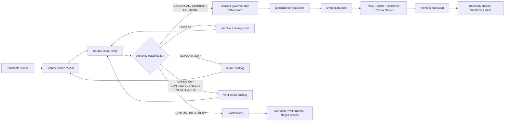

<!-- [KFM_META_BLOCK_V2]
doc_id: kfm://doc/NEEDS-VERIFICATION
title: ADR-0303: Source Ledger Authority
type: standard
version: v1
status: draft
owners: NEEDS-VERIFICATION
created: 2026-04-27
updated: 2026-05-02
policy_label: NEEDS-VERIFICATION
related: [docs/adr/NEEDS-VERIFICATION, docs/registers/NEEDS-VERIFICATION, schemas/contracts/v1/NEEDS-VERIFICATION, data/registry/NEEDS-VERIFICATION]
tags: [kfm, adr, source-ledger, authority, evidence, governance, provenance]
notes: [Revised from attached draft for proposed path docs/adr/ADR-0203-source-ledger-authority.md; repo checkout, ADR index, owners, policy label, related links, schema home, validator home, and implementation depth remain NEEDS VERIFICATION before publication.]
[/KFM_META_BLOCK_V2] -->

<a id="top"></a>

# ADR-0303: Source Ledger Authority

Decide how KFM ranks, records, cites, promotes, supersedes, and blocks source material so source authority remains inspectable instead of implied.


> [!IMPORTANT]
> **Status:** `draft`  
> **Decision state:** `PROPOSED`  
> **Path assumption:** `docs/adr/ADR-0203-source-ledger-authority.md`  
> **Owners:** `NEEDS-VERIFICATION`  
> **Repo implementation depth:** `UNKNOWN` until the current checkout, tests, workflows, manifests, proof objects, and release artifacts are inspected.  
> **Applies to:** documentation, source descriptors, EvidenceRef resolution, EvidenceBundle construction, promotion gates, proof objects, governed AI context, map/scene/UI claims, and public-facing publication surfaces.  
> **Quick jumps:** [Decision](#decision) · [Context](#context) · [Authority model](#authority-model) · [Ledger record contract](#ledger-record-contract) · [Lifecycle](#lifecycle-and-promotion) · [Validation](#validation-gates) · [Repo surfaces](#expected-repo-surfaces) · [Rollback](#rollback-and-correction) · [Open verification](#open-verification)

> [!WARNING]
> **NEEDS VERIFICATION:** the visible KFM corpus also references source-ledger authority under another proposed ADR number. This draft preserves the requested `ADR-0303` path assumption, but publication must first reconcile the ADR index, filename, cross-links, and any predecessor `ADR-0202-source-ledger-authority.md` reference.

---

## Decision

**PROPOSED:** KFM will maintain a source ledger as the governing register for source identity, source status, source authority, claim support, source role, rights posture, sensitivity posture, freshness, lineage, supersession, unresolved references, and promotion eligibility.

The source ledger is **not a bibliography** and **not a substitute for EvidenceBundle resolution**. It is a control surface that determines whether a source may participate in a governed claim, release, map layer, AI response, proof pack, or publication artifact.

### Decision rule

A KFM claim, EvidenceBundle, ReleaseManifest, runtime response, map layer, scene, Story/Focus payload, dashboard, export, or public UI statement must resolve its source references to ledgered source records before it is treated as publishable or authoritative.

When a source reference cannot be resolved, or when source status does not support the requested use, the correct outcome is one of the following finite results:

| Outcome | Use when | Release effect |
|---|---|---|
| `ABSTAIN` | Evidence is insufficient, ambiguous, stale, unresolved, or outside source scope. | Do not answer or publish the claim. |
| `DENY` | Policy, rights, sensitivity, safety, review state, or release state blocks use. | Block release and record the reason. |
| `ERROR` | Required source resolution, validation, or policy evaluation failed. | Fail closed until repaired. |
| `NEEDS VERIFICATION` | Human review or a concrete source check is required. | Hold in review/backlog; do not promote. |

### What changes when this ADR is adopted

| Area | Before this ADR | After this ADR |
|---|---|---|
| Source authority | Can be implied by tone, detail, repetition, or proximity. | Must be recorded in a ledgered source record. |
| Planning PDFs and prior reports | Can be accidentally treated as implementation proof. | Default to `LINEAGE` or `PROPOSED` unless repo evidence confirms implementation. |
| New Ideas packets | Can blur into doctrine. | Remain `EXPLORATORY` until intake, review, and promotion. |
| External source facts | Can become stale silently. | Require freshness status and dated verification for version-sensitive use. |
| AI/map/UI output | Can look authoritative because it is polished. | Must resolve cited sources and policy before consequential claims are emitted. |
| Rollback | Can remove or overwrite history. | Preserves lineage, aliases, supersession, correction notes, and dependent-release impact. |

[Back to top](#top)

---

## Context

KFM is a governed, evidence-first, map-first, time-aware spatial knowledge and publication system. Its durable public unit of value is the **inspectable claim**: a claim whose evidence, source role, spatial and temporal scope, policy posture, review state, release state, and correction lineage can be inspected.

KFM’s source corpus is intentionally broad. It includes doctrine, ADRs, architecture manuals, domain-lane plans, source atlases, source descriptors, technical references, implementation sketches, generated reports, exploratory idea packets, external standards, official source-system pages, and runtime artifacts.

That breadth is useful only when KFM can tell reviewers and public surfaces what each source is allowed to prove.

| Source material | Risk if not classified |
|---|---|
| Accepted ADRs, canonical docs, contracts, schemas, and policy files | Authority can drift silently across files. |
| Current source files, tests, workflows, logs, manifests, and emitted artifacts | Implementation behavior can be overstated or confused with doctrine. |
| Attached planning PDFs and domain-lane blueprints | Proposed paths can be mistaken for implemented repo state. |
| New Ideas packets | Exploratory sketches can be promoted by tone rather than review. |
| External standards and source-system pages | Version-sensitive facts can become stale but still sound current. |
| Generated summaries, AI answers, maps, tiles, dashboards, and scenes | Derived views can be mistaken for sovereign truth. |

This ADR establishes the source ledger as a required authority-control surface. It does **not** claim that the target repo already contains the registers, schemas, validators, fixtures, workflows, dashboards, release manifests, or emitted proof objects named below. Those implementation surfaces remain **UNKNOWN / NEEDS VERIFICATION** until direct repo and runtime evidence confirm them.

[Back to top](#top)

---

## Scope

This ADR governs source authority for:

- KFM doctrine, ADRs, standards, contracts, schemas, and policy documents;
- source descriptors, source-intake records, and source registries;
- EvidenceRef → EvidenceBundle resolution;
- source roles, claim-support limits, rights, sensitivity, freshness, and review state;
- receipts, proof packs, manifests, catalog records, release artifacts, and correction records;
- MapLibre/Cesium layer manifests, scene manifests, Evidence Drawer payloads, and Story/Focus payloads;
- governed AI runtime context, citation validation, and finite response envelopes;
- domain-lane source registries and cross-domain references;
- New Ideas intake and promotion;
- external official-source checks when current facts matter.

### Non-goals

This ADR does not:

- settle the canonical schema home between `contracts/`, `schemas/`, or `schemas/contracts/v1/`;
- define the complete EvidenceBundle contract;
- define all SourceDescriptor fields;
- approve a promotion-gate implementation;
- activate live source connectors;
- make any attached PDF a current implementation proof;
- authorize public release of sensitive, restricted, unpublished, culturally sensitive, ecological, archaeological, living-person, title/ownership, security-relevant, or rights-unclear sources;
- require deletion of lineage material that has been superseded.

Those decisions belong in separate ADRs, contracts, policies, source descriptors, review records, and promotion gates.

[Back to top](#top)

---

## Authority model

KFM must distinguish **doctrine authority**, **implementation evidence**, **release/proof evidence**, **external current facts**, and **exploratory design pressure**.

> [!NOTE]
> Authority rank is applied **per claim type**. No source class outranks every other source class for every question. Current implementation evidence controls claims about what the repo or runtime currently does. Accepted doctrine controls claims about what KFM requires. When sources conflict, record the conflict; do not smooth it away.

### Authority ladder

| Rank | Source class | Can support | Cannot support without more evidence | Default posture |
|---:|---|---|---|---|
| 0 | Accepted ADRs, canonical repo docs, contracts, schemas, and policy files | Accepted KFM doctrine, decisions, contract semantics, governance requirements | Runtime behavior unless tests, logs, workflows, or artifacts prove it | `CANONICAL` when verified |
| 1 | Current repo/workspace evidence: source files, tests, workflows, manifests, configs, dashboards, logs | Current implementation existence, file presence, enforcement behavior, workflow behavior | Intended doctrine if it conflicts with accepted docs | `CONFIRMED` for inspected behavior |
| 2 | Current release artifacts, proof packs, signed bundles, ReleaseManifest, CatalogMatrix, published receipts | Release state, integrity state, promotion evidence, rollback targets | Raw source truth beyond recorded evidence | `RELEASED` / `PROOF` when verified |
| 3 | KFM baseline manuals, documentation architecture docs, whole-system doctrine | Project doctrine, terminology, invariants, design intent, control-plane posture | Current repo file presence, routes, tests, workflows, runtime maturity | `DOCTRINE` / `LINEAGE` |
| 4 | Subsystem manuals and domain-lane architecture plans | Domain burden, source-role discipline, proposed implementation shape, risk posture | Current implementation unless repo evidence confirms it | `LINEAGE` / `PROPOSED` |
| 5 | New Ideas packets, sketches, prior scaffold reports, exploratory implementation plans | Candidate backlog, design pressure, source-intake leads | Canon, current behavior, release authority, rights clearance | `EXPLORATORY` |
| 6 | External official sources and standards | Current version-sensitive facts, endpoint metadata, source-system details, public standard language | KFM doctrine unless adopted by KFM | `EXTERNAL-VERIFIED` after dated check |
| 7 | General technical references | Conceptual background, implementation craft, comparative patterns | KFM-specific doctrine, source rights, release state, repo behavior | `REFERENCE` |
| 8 | Memory, unsourced summaries, unreviewed generated language, screenshots without provenance | Nothing authoritative | Any consequential claim | `NOT-AUTHORITY` |

### Doctrine versus implementation rule

| Question being asked | Preferred evidence | Required label when not verified |
|---|---|---|
| “What does KFM require?” | Accepted ADRs, canonical docs, doctrine manuals | `PROPOSED` or `UNKNOWN` if not accepted |
| “What does the repo contain?” | Current checkout file evidence | `UNKNOWN` if checkout was not inspected |
| “What does the system do at runtime?” | Tests, logs, manifests, dashboards, run receipts, emitted artifacts | `UNKNOWN` without runtime/proof evidence |
| “What can this source prove?” | Ledger record + source descriptor + claim-support fields | `NEEDS VERIFICATION` until ledgered |
| “Can this be released?” | EvidenceBundle closure + rights/sensitivity/policy/review/release gates | `DENY` or `ABSTAIN` when unresolved |

[Back to top](#top)

---

## Source status taxonomy

These are **source-use statuses**, not task truth labels. A ledger entry must carry one current source-use status and may also carry task truth labels in notes.

| Status | Meaning | Public-claim eligibility |
|---|---|---|
| `CANONICAL` | Current accepted repo-native authority. | Eligible within stated scope. |
| `CURRENT` | Active supporting source, not necessarily canonical. | Eligible if source role, rights, sensitivity, freshness, review, and policy permit. |
| `DOCTRINE` | Governing KFM doctrine or operating law, not necessarily implementation proof. | Eligible for doctrine claims; not implementation proof. |
| `RELEASED` | Published or promoted artifact with release state. | Eligible for release-state claims within manifest scope. |
| `PROOF` | Proof pack, signed bundle, validation report, or receipt family used to support promotion/release evidence. | Eligible for proof/process claims, not raw-source truth beyond its contents. |
| `LINEAGE` | Historical or prior material preserved to explain evolution. | Eligible only for lineage claims unless explicitly promoted. |
| `EXPLORATORY` | Idea packet, sketch, backlog input, unapproved proposal, or research note. | Not eligible for authoritative claims. |
| `REFERENCE` | Background conceptual or technical source. | Eligible for background support only. |
| `EXTERNAL-VERIFIED` | Official external source checked for a dated fact. | Eligible for the dated fact, subject to freshness and KFM adoption. |
| `SUPERSEDED` | Replaced by a newer source but retained for audit. | Not eligible except for historical traceability. |
| `DEPRECATED` | Intentionally retired from normal use. | Not eligible without exception review. |
| `QUARANTINED` | Blocked due to rights, sensitivity, integrity, conflict, policy, or uncertainty. | Not eligible. |
| `UNKNOWN` | Status has not been established. | Not eligible. |
| `CONFLICTED` | Source conflicts with another source and resolution is pending. | Not eligible for unresolved claims. |
| `NEEDS-VERIFICATION` | A concrete check is required before use. | Not eligible until checked. |
| `NOT-AUTHORITY` | Memory, unreviewed AI output, or unsourced assertion. | Never eligible. |

### Status transition rules

| Transition | Allowed only when |
|---|---|
| `EXPLORATORY` → `CURRENT` | Intake record, source role, rights, sensitivity, and claim-support review are complete. |
| `LINEAGE` → `DOCTRINE` | The source is accepted as governing doctrine through documented review. |
| `CURRENT` → `CANONICAL` | The source is accepted as repo-native authority or adopted by an accepted ADR/policy. |
| `CURRENT` → `RELEASED` | Promotion gates pass and release manifest/proof objects are emitted. |
| Any status → `QUARANTINED` | Rights, sensitivity, integrity, source-role, policy, or conflict risk blocks use. |
| Any status → `SUPERSEDED` | A successor source is identified and linked. |
| `CONFLICTED` → any eligible status | Conflict is resolved and correction/supersession notes are recorded. |

[Back to top](#top)

---

## Ledger record contract

A source-ledger record must be stable enough for machine validation and readable enough for human review.

### Required fields

| Field | Purpose |
|---|---|
| `source_id` | Stable identifier used by EvidenceRef, manifests, receipts, docs, and aliases. |
| `title` | Human-readable title or source name. |
| `source_family` | Canonical, doctrine, domain-lane, external, exploratory, reference, generated, proof, release, etc. |
| `source_status` | One value from the source status taxonomy. |
| `authority_rank` | Rank from this ADR or a superseding ADR. |
| `truth_role` | What the source is allowed to prove. |
| `claims_supported` | Claim types this source can support. |
| `claims_not_supported` | Claim types this source must not be used to support. |
| `source_role` | Role in KFM: doctrine, legal authority, observational evidence, model output, context, derived product, etc. |
| `implementation_proof_status` | Whether the source proves implementation behavior; usually `NO` for planning PDFs. |
| `rights_status` | Rights/licensing/reuse posture. |
| `sensitivity_status` | Public, restricted, sensitive, culturally sensitive, location-sensitive, living-person-sensitive, etc. |
| `freshness_status` | Current, stale, version-sensitive, dated verification, unknown, or not applicable. |
| `retrieved_or_observed_at` | Date/time of source observation when applicable. |
| `digest` | Hash or integrity marker when available. |
| `aliases` | Prior IDs, filenames, titles, renamed references, or imported identifiers. |
| `supersedes` | Older sources replaced by this entry. |
| `superseded_by` | Newer source that replaces this entry. |
| `related_objects` | EvidenceBundle, SourceDescriptor, RunReceipt, ProofPack, ReleaseManifest, CatalogMatrix, etc. |
| `owner_or_steward` | Steward role or owner; use `NEEDS-VERIFICATION` if unknown. |
| `verification_notes` | Concrete checks still required. |

### Conditional fields

| Field | Required when | Purpose |
|---|---|---|
| `external_url` | Source is external. | Allows dated official-source checks without using URLs as authority by themselves. |
| `license_or_terms_url` | Rights depend on published terms. | Supports rights review and release gating. |
| `source_cadence` | Source changes over time. | Supports freshness policy. |
| `access_class` | Source has restricted, staged, stewarded, or private access. | Prevents accidental public exposure. |
| `geoprivacy_transform` | Source contains precise sensitive locations. | Records redaction/generalization requirements. |
| `jurisdiction_or_steward_scope` | Source authority is jurisdiction-bound. | Prevents overbroad claims. |
| `record_level_caveats` | Source reliability or rights vary by record. | Prevents aggregate status from hiding record-specific limits. |

### Implementation-proof values

| Value | Meaning |
|---|---|
| `YES` | Direct repo/runtime/test/artifact evidence proves the implementation claim within scope. |
| `NO` | Source does not prove implementation behavior. |
| `BOUNDED` | Source proves only a narrow implementation fact, such as file presence, not runtime behavior. |
| `UNKNOWN` | Implementation-proof value has not been reviewed. |

[Back to top](#top)

---

## Example record shape

This example is illustrative. It is not a claim that this exact schema file or source record exists.

```yaml
source_id: SRC-KFM-DOC-ARCH
title: KFM Documentation Architecture Master Package
source_family: documentation-architecture
source_status: LINEAGE
authority_rank: 3
truth_role:
  - documentation-control-plane doctrine
  - canon/lineage/exploratory classification support
claims_supported:
  - KFM documentation authority posture
  - source classification vocabulary
  - evidence-bound documentation planning
claims_not_supported:
  - current repo file existence
  - current CI behavior
  - emitted proof-object presence
  - runtime enforcement
source_role: doctrine-lineage
implementation_proof_status: NO
rights_status: NEEDS-VERIFICATION
sensitivity_status: public-or-restricted-NEEDS-VERIFICATION
freshness_status: dated-corpus-source
retrieved_or_observed_at: 2026-04-27
digest: NEEDS-VERIFICATION
aliases:
  - documentation architecture package
supersedes: []
superseded_by: []
related_objects:
  - SourceDescriptor
  - EvidenceBundle
  - ReleaseManifest
owner_or_steward: NEEDS-VERIFICATION
verification_notes:
  - verify exact repo-native canon home
  - verify whether current source ledger register already exists
  - verify rights and policy label before public publication
```

### PROPOSED schema fragment

This fragment records minimum shape only. It must not be treated as the accepted schema until the schema-home ADR and current repo conventions are verified.

```json
{
  "$schema": "https://json-schema.org/draft/2020-12/schema",
  "$id": "kfm://schema/source-ledger-entry.v1.PROPOSED",
  "title": "SourceLedgerEntry",
  "type": "object",
  "required": [
    "source_id",
    "title",
    "source_family",
    "source_status",
    "authority_rank",
    "truth_role",
    "claims_supported",
    "claims_not_supported",
    "implementation_proof_status",
    "rights_status",
    "sensitivity_status",
    "freshness_status"
  ],
  "properties": {
    "source_id": { "type": "string", "pattern": "^[A-Z0-9][A-Z0-9._:-]*$" },
    "title": { "type": "string", "minLength": 1 },
    "source_status": {
      "type": "string",
      "enum": [
        "CANONICAL",
        "CURRENT",
        "DOCTRINE",
        "RELEASED",
        "PROOF",
        "LINEAGE",
        "EXPLORATORY",
        "REFERENCE",
        "EXTERNAL-VERIFIED",
        "SUPERSEDED",
        "DEPRECATED",
        "QUARANTINED",
        "UNKNOWN",
        "CONFLICTED",
        "NEEDS-VERIFICATION",
        "NOT-AUTHORITY"
      ]
    },
    "authority_rank": { "type": "integer", "minimum": 0, "maximum": 8 },
    "implementation_proof_status": {
      "type": "string",
      "enum": ["YES", "NO", "BOUNDED", "UNKNOWN"]
    }
  },
  "additionalProperties": true
}
```

[Back to top](#top)

---

## Lifecycle and promotion

A source does not become canonical because it is detailed, repeated, technically plausible, recent, useful, visually polished, or generated by an authoritative-sounding model.



### Promotion rule

A source may be promoted for a requested use only when:

- its ledger record is complete enough for that use;
- source role and claim-support limits are explicit;
- rights and sensitivity are resolved for the release class;
- conflicts and supersession are recorded;
- required source descriptors and schemas are present or explicitly deferred;
- downstream claims have EvidenceRef → EvidenceBundle closure;
- policy checks pass;
- reviewer approval is recorded where required;
- rollback target and correction path are known.

### Trust membrane preservation

This ADR reinforces the KFM lifecycle:

```text
RAW -> WORK / QUARANTINE -> PROCESSED -> CATALOG / TRIPLET -> PUBLISHED
```

Public clients and ordinary UI surfaces must consume governed APIs, released artifacts, source-ledger-aware EvidenceBundles, and release manifests. They must not use raw, work, quarantine, or unpublished canonical/internal stores as the normal public path.

[Back to top](#top)

---

## Interaction with KFM object families

The source ledger is upstream of EvidenceBundle resolution and downstream of source intake.

| Object family | Relationship to source ledger | Required fail-closed behavior |
|---|---|---|
| `SourceIntakeRecord` | Creates or updates candidate ledger entries. | Incomplete intake cannot promote a source. |
| `SourceDescriptor` | Describes source family, endpoint, cadence, role, rights, sensitivity, and operational limits. | Descriptor gaps block source activation. |
| `EvidenceRef` | Must point to a resolvable ledgered source or evidence item. | Unknown refs produce `ABSTAIN` or `ERROR`. |
| `EvidenceBundle` | Must include source IDs, source roles, review/policy state, citation validation, and bundle hash. | Bundle cannot close with blocked or unresolved sources. |
| `DecisionEnvelope` / `RuntimeResponseEnvelope` | Must surface finite outcomes and source-support status. | No answer text may cite blocked or absent sources. |
| `RunReceipt` / `AIReceipt` | Records process memory and model/runtime execution context. | Receipt does not promote source authority by itself. |
| `ProofPack` | Release-grade proof bundle. | Must include source-ledger coverage for release-significant claims. |
| `CatalogMatrix` | Records catalog closure across dataset, evidence, provenance, policy, release, and artifact families. | Cannot close with unresolved source dependencies. |
| `LayerManifest` / `GeoManifest` | Declares source-backed map/scene layer dependencies. | Public layers cannot depend on raw, quarantined, or rights-unclear sources. |
| `ReleaseManifest` | Records promoted release contents and dependencies. | Must not include unledgered, unresolved, quarantined, or rights-unclear source dependencies. |
| `CorrectionNotice` | Records correction, withdrawal, or supersession. | Must identify dependent source IDs and affected releases. |

> [!IMPORTANT]
> AI output, map popups, scene annotations, exports, dashboards, vector indexes, graph projections, and generated summaries cannot bypass source-ledger status. Generated language remains interpretive; ledgered evidence, policy, review state, and release state remain authoritative.

[Back to top](#top)

---

## Source use rules by surface

| Surface | Must do | Must not do |
|---|---|---|
| Documentation | Label source status, limits, unknowns, and supersession. | Present lineage or exploratory material as current implementation proof. |
| Governed API | Resolve source IDs and return finite outcomes. | Return authoritative claims from unresolved or blocked sources. |
| MapLibre / Cesium | Render released artifacts and trust-visible states. | Treat tile, scene, camera state, or visualization as source truth. |
| Evidence Drawer | Show source role, review state, policy state, and release state. | Hide sensitivity, rights, or freshness limits behind polished UI. |
| Focus Mode / AI | Use only admissible, policy-safe context and validated citations. | Cite unledgered context or convert model language into authority. |
| Catalog / release | Require source-ledger coverage and rollback targets. | Publish source dependencies with unresolved rights or sensitivity posture. |
| Validators / CI | Fail closed on missing fields, duplicate IDs, blocked statuses, and unresolved references. | Treat validator absence as permission to publish. |

[Back to top](#top)

---

## Validation gates

The first implementation should be small, reversible, and no-network.

### Required checks

| Gate | Required behavior |
|---|---|
| Source ID uniqueness | No duplicate `source_id` values across active records and aliases. |
| Required fields | Every ledger record includes required fields or is blocked. |
| Status validity | Status values must be finite and schema-valid. |
| Authority rank validity | Rank values must match this ADR or a superseding ADR. |
| Alias resolution | Old names, filenames, report titles, and imported identifiers resolve to one stable source ID. |
| Unresolved reference detection | EvidenceBundle, ReleaseManifest, RunReceipt, AIReceipt, LayerManifest, GeoManifest, and CatalogMatrix cannot point to unknown sources. |
| Status-policy check | `EXPLORATORY`, `UNKNOWN`, `CONFLICTED`, `QUARANTINED`, `NEEDS-VERIFICATION`, `SUPERSEDED`, `DEPRECATED`, and `NOT-AUTHORITY` sources cannot support public authoritative claims. |
| Implementation-proof check | Planning docs, prior PDFs, generated reports, and scaffold descriptions cannot prove current repo files, workflows, routes, tests, or runtime behavior. |
| Rights/sensitivity check | Rights-unclear or sensitive sources fail closed unless policy and review allow staged, redacted, generalized, or restricted release. |
| External freshness check | Version-sensitive external facts require a dated official-source check. |
| Supersession check | Superseded sources remain traceable and cannot silently overwrite newer authority. |
| No-public-raw-path check | Public surfaces must not expose raw, work, quarantine, or unpublished source material. |
| Derived-not-truth check | Tiles, scenes, summaries, graph projections, and vector indexes cannot replace source-ledgered evidence. |

### Minimum fixture set

| Fixture group | Purpose |
|---|---|
| `valid/source-ledger/minimal` | Minimal acceptable ledger record. |
| `valid/source-ledger/with-aliases` | Alias and rename coverage. |
| `valid/source-ledger/external-dated-check` | Version-sensitive external source with dated verification. |
| `invalid/source-ledger/missing-status` | Required-field failure. |
| `invalid/source-ledger/duplicate-source-id` | Stable-ID failure. |
| `invalid/evidence/unresolved-source-ref` | EvidenceRef resolution failure. |
| `invalid/release/quarantined-source` | Release-blocking source status. |
| `invalid/ai/exploratory-source-as-canon` | Governed AI citation misuse. |
| `invalid/map/raw-source-public-layer` | No-public-raw-path failure. |
| `invalid/docs/planning-pdf-as-implementation-proof` | Implementation-proof misuse. |

### PROPOSED validation command shape

Use repo-native commands when confirmed. Until then, this command block is illustrative only.

```bash
: "PROPOSED / NEEDS VERIFICATION: adapt to repo-native tooling after inspection."
python tools/validators/sources/validate_source_ledger.py \
  --ledger docs/registers/SOURCE_LEDGER.md \
  --registry data/registry/sources \
  --schemas schemas/contracts/v1/source \
  --fixtures tests/fixtures/source
```

[Back to top](#top)

---

## Expected repo surfaces

These paths are **PROPOSED** until repo conventions are verified. If the mounted repo uses different homes, update this ADR, parent READMEs, and source-ledger records rather than creating parallel authority.

| Surface | Proposed or preferred home | Role | Verification note |
|---|---|---|---|
| This ADR | `docs/adr/ADR-0203-source-ledger-authority.md` | Decision record for source-ledger authority. | ADR number and index require verification. |
| Human-readable source ledger | `docs/registers/SOURCE_LEDGER.md` | Reviewable source authority register. | Verify existing register home first. |
| Authority ladder register | `docs/registers/AUTHORITY_LADDER.md` or this ADR | Ranked source-class rules. | Avoid duplicate authority if this ADR remains governing. |
| Canon / lineage / exploratory register | `docs/registers/CANONICAL_LINEAGE_EXPLORATORY.md` | Document/source-status map. | Verify whether a document registry already carries this role. |
| Verification backlog | `docs/registers/VERIFICATION_BACKLOG.md` | Source references blocked pending proof. | May belong in existing drift or verification register. |
| Machine source records | `data/registry/sources/` | SourceDescriptor and source-instance records. | Verify singular/plural and registry layout. |
| Source schema family | `schemas/contracts/v1/source/` **or repo-native equivalent after schema-home ADR** | Machine validation for source records. | Do not create both `source/` and `sources/` without ADR. |
| Source fixtures | `tests/fixtures/source/` or repo-native contract fixture lane | Valid/invalid examples. | Align with existing fixture convention. |
| Source validators | `tools/validators/source/` or repo-native validator lane | Ledger, alias, source-coverage, and status-policy checks. | Tooling language remains `UNKNOWN`. |
| Source policy | `policy/source/` or repo-native policy home | Source-role, rights, freshness, sensitivity, publication gates. | Policy engine remains `UNKNOWN`. |
| Source runbook | `docs/runbooks/source-ledger.md` | Maintenance, correction, rollback, and release-check procedure. | Create only if runbook convention exists or parent README accepts it. |

[Back to top](#top)

---

## Adoption plan

| Phase | Action | Exit condition |
|---:|---|---|
| 0 | Inspect current repo checkout, ADR index, CODEOWNERS, docs/registers, schemas/contracts, policy, tests, tools, release artifacts. | Implementation depth and path homes are no longer `UNKNOWN`. |
| 1 | Reconcile ADR number and source-ledger register home. | ADR path and parent links are valid. |
| 2 | Add or update source-ledger record schema and status taxonomy in repo-native schema home. | Required fields and finite status values validate. |
| 3 | Add valid/invalid no-network fixtures. | Fixture suite covers missing fields, duplicate IDs, blocked statuses, unresolved refs, and planning-PDF misuse. |
| 4 | Add source-ledger validator and policy check. | Validator fails closed on blocked source use. |
| 5 | Wire EvidenceBundle and ReleaseManifest checks to source-ledger resolution. | Release candidate with unresolved or blocked source dependencies fails. |
| 6 | Add documentation/runbook links and maintenance responsibilities. | Maintainers can update, correct, supersede, and roll back ledger entries. |

[Back to top](#top)

---

## Consequences

### Positive

- Source authority becomes visible instead of implied.
- KFM can preserve lineage without treating lineage as current authority.
- New Ideas can be retained without becoming accidental canon.
- EvidenceBundle resolution gains a clear upstream source-status check.
- Source rights, sensitivity, freshness, and review state become release blockers rather than afterthoughts.
- Public claims become easier to audit, correct, withdraw, and roll back.
- Map, scene, AI, dashboard, and export surfaces remain downstream of governed evidence.

### Tradeoffs

- Maintainers must keep the ledger current.
- Some fast-moving work will be blocked until source status is resolved.
- External current facts require dated verification.
- Validation and policy gates add implementation work before public polish.
- ADR numbering, schema home, source-registry homes, and fixture homes must be reconciled before publication.
- The ledger can create false confidence if validators are absent, optional, or not tied to release gates.

### Failure modes this ADR is intended to prevent

| Failure mode | Required prevention |
|---|---|
| A planning PDF is cited as proof of repo implementation. | Mark `implementation_proof_status` explicitly and fail validation when misused. |
| A New Ideas packet becomes canon without review. | Keep `EXPLORATORY` blocked from authoritative claims. |
| A source is renamed and old references break. | Preserve aliases and stable `source_id`. |
| A public map cites unreviewed raw/work/quarantine data. | Enforce no-public-raw-path and release-state checks. |
| AI answers cite unsupported context. | Require source-ledger resolution and citation validation. |
| A stale external version fact persists. | Require freshness status and dated re-verification. |
| A derived tile, scene, or graph edge replaces canonical truth. | Treat derived products as downstream and rebuildable. |
| Sensitive locations or restricted records become public by default. | Fail closed; require redaction/generalization/staged access and receipts. |

[Back to top](#top)

---

## Security, rights, and sensitivity posture

Source-ledger authority is part of KFM’s publication safety model.

| Risk | Required posture |
|---|---|
| Rights unclear | `DENY` public release until rights are verified or release class is restricted. |
| Sensitive location | Generalize, redact, stage access, or deny; record transform receipts. |
| Archaeological/cultural sensitivity | Fail closed pending steward review and policy decision. |
| Living-person, DNA, land/title, or ownership source | Restrict by default; do not infer public release from availability. |
| Security-relevant infrastructure or local exposure details | Publish only public-safe summaries; preserve auditability without exposing sensitive operational detail. |
| External source terms or API behavior change | Mark `NEEDS-VERIFICATION` and require dated recheck before activation or release. |

[Back to top](#top)

---

## Rollback and correction

Source-ledger rollback must preserve auditability.

| Scenario | Required action |
|---|---|
| Incorrect source promotion | Change status to `QUARANTINED` or `CONFLICTED`, record reason, and identify dependent claims/releases. |
| Wrong authority rank | Correct ledger entry, add correction note, and rerun source-coverage checks. |
| Broken alias | Add alias mapping and rerun unresolved-reference validation. |
| Source superseded | Set `superseded_by`, keep old source available as lineage, and update dependent EvidenceBundles where needed. |
| Rights or sensitivity reversal | Deny publication, withdraw or correct affected outputs, and record policy decision. |
| External freshness failure | Mark affected source facts `NEEDS-VERIFICATION`, block new releases, and re-run source checks. |
| Validator false positive | Quarantine affected validation result, add fixture, fix validator, and rerun release checks. |
| ADR replaced | Mark this ADR superseded, link the replacement, and keep this file for lineage. |

No rollback should delete lineage material merely because it is no longer current authority.

[Back to top](#top)

---

## Acceptance criteria

This ADR is ready for review when:

- [ ] ADR numbering is reconciled against the repo ADR index.
- [ ] Owners are verified.
- [ ] Policy label is verified.
- [ ] Related paths are replaced with verified repo-relative links.
- [ ] Source-ledger home is confirmed or corrected.
- [ ] Schema-home dependency is linked to the accepted schema-home ADR.
- [ ] Source status taxonomy is reviewed by documentation, data, policy, release, UI, and AI stewards.
- [ ] Source role and claim-support fields are reviewed against existing SourceDescriptor conventions.
- [ ] Validation fixture names are aligned to the repo’s test conventions.
- [ ] Parent README files reference this ADR where appropriate.
- [ ] EvidenceBundle and ReleaseManifest validation requirements are linked to this ADR or a successor contract.
- [ ] No statement claims current implementation behavior without direct repo or runtime evidence.

[Back to top](#top)

---

## Open verification

| Item | Status | Why it matters | Required check |
|---|---|---|---|
| ADR number | `NEEDS VERIFICATION` | Visible corpus mentions source-ledger authority under another ADR number. | Inspect `docs/adr/` and ADR index. |
| Owners | `NEEDS VERIFICATION` | Governance docs need accountable stewards. | Inspect CODEOWNERS and repo docs ownership convention. |
| Policy label | `NEEDS VERIFICATION` | Release/publication posture is unknown. | Inspect repo policy labels and doc metadata rules. |
| Source-ledger register home | `NEEDS VERIFICATION` | Prevents duplicate source authority surfaces. | Inspect `docs/registers/`, `data/registry/`, parent READMEs, and current document registry. |
| Machine schema home | `CONFLICTED / NEEDS VERIFICATION` | Prior materials reference `contracts/`, `schemas/`, and `schemas/contracts/v1/`. | Resolve through accepted schema-home ADR and update this ADR. |
| Singular/plural source schema lane | `NEEDS VERIFICATION` | `source/` and `sources/` could create parallel authority. | Inspect existing schema family names and choose one. |
| Existing SourceDescriptor schema | `UNKNOWN` | This ADR should extend, not duplicate, existing contracts. | Inspect schema/contract files and fixtures. |
| Existing validators | `UNKNOWN` | Validation claims require tool evidence. | Inspect `tools/validators/`, tests, and CI workflows. |
| Existing release/proof artifacts | `UNKNOWN` | Proof-object maturity cannot be inferred from doctrine. | Inspect generated artifacts, manifests, receipts, proof packs, and release folders. |
| Existing AI/runtime citation checks | `UNKNOWN` | Governed AI claims require enforcement evidence. | Inspect runtime response envelope contracts, adapters, tests, and logs. |
| External source verification policy | `NEEDS VERIFICATION` | Version-sensitive source facts need current official checks. | Inspect source-descriptor and source-refresh standards. |
| Sensitive-source publication policy | `NEEDS VERIFICATION` | Source-ledger use must fail closed for high-risk domains. | Inspect policy source, release, sensitivity, and redaction rules. |

[Back to top](#top)
