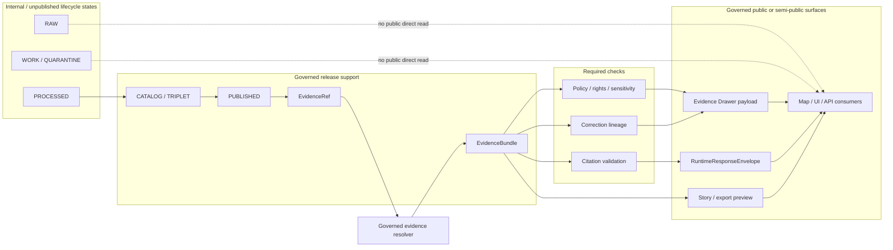

<!-- [KFM_META_BLOCK_V2]
doc_id: TODO(kfm-verify): assign kfm://doc/<uuid>
title: ADR-0305 — EvidenceBundle Contract
type: standard
version: v1
status: draft
owners: TODO(kfm-verify): confirm architecture/data-governance owners
created: 2026-04-27
updated: 2026-05-02
policy_label: TODO(kfm-verify): confirm public|restricted
related: [TODO(kfm-verify): docs/adr/ADR-0001-schema-home.md, TODO(kfm-verify): docs/adr/ADR-0202-source-ledger-authority.md, TODO(kfm-verify): docs/adr/ADR-0303-evidencebundle-contract.md, TODO(kfm-verify): docs/adr/ADR-0305-promotion-gate.md, TODO(kfm-verify): docs/adr/ADR-0308-governed-ai-runtime-envelope.md]
tags: [kfm, adr, evidencebundle, evidenceref, contracts, governance, cite-or-abstain]
notes: [NEEDS VERIFICATION: ADR numbering conflicts with corpus ADR index where EvidenceBundle is listed as ADR-0303 and ADR-0305 is promotion-gate; doc_id owners policy_label related links target path and physical schema home require repo inspection; current mounted repo implementation depth remains UNKNOWN.]
[/KFM_META_BLOCK_V2] -->

<a id="top"></a>

# ADR-0305 — EvidenceBundle Contract

Define the resolved evidence package that every consequential KFM claim, map drill-through, export preview, story node, Evidence Drawer payload, and Focus Mode answer must be able to inspect.

> [!WARNING]
> **NEEDS VERIFICATION — ADR numbering conflict.**  
> The supplied draft targets `docs/adr/ADR-0204-evidencebundle-contract.md`. Current corpus evidence also lists `ADR-0303-evidencebundle-contract` and `ADR-0305-promotion-gate`. Keep this draft at the requested path only for review. Reconcile the ADR index before publication, schema generation, or contract adoption.

---

## Quick navigation

- [Decision](#decision)
- [Evidence boundary](#evidence-boundary)
- [Context](#context)
- [Contract boundary](#contract-boundary)
- [Required contract shape](#required-contract-shape)
- [Resolver and runtime flow](#resolver-and-runtime-flow)
- [Relationship to adjacent objects](#relationship-to-adjacent-objects)
- [Validation gates](#validation-gates)
- [Alternatives considered](#alternatives-considered)
- [Consequences](#consequences)
- [Implementation plan](#implementation-plan)
- [Rollback and correction](#rollback-and-correction)
- [Open verification items](#open-verification-items)
- [Review checklist](#review-checklist)

---

## ADR record

| Field | Value |
| --- | --- |
| Status | **DRAFT / PROPOSED** |
| Requested draft path | `docs/adr/ADR-0204-evidencebundle-contract.md` |
| ADR index conflict | **CONFLICTED / NEEDS VERIFICATION** — corpus ADR index also maps EvidenceBundle to `ADR-0303` |
| Decision owner | `TODO(kfm-verify): confirm architecture/data-governance owners` |
| Reviewers | `TODO(kfm-verify): architecture, data governance, policy, API, UI, release` |
| Decision date | `2026-04-27` |
| Last revision date | `2026-05-02` |
| Current implementation evidence | **UNKNOWN** — no mounted repo, tests, workflows, schemas, dashboards, logs, or emitted artifacts were inspected in this revision pass |
| Doctrine confidence | **CONFIRMED concept / PROPOSED formal contract** |
| Decision type | Logical evidence-resolution contract; physical schema placement deferred |
| Contract family | Evidence, runtime, publication support |
| Must not weaken | `EvidenceRef -> EvidenceBundle`, cite-or-abstain, policy checks, sensitivity handling, correction lineage, proof/receipt separation |

---

## Decision

**PROPOSED.** KFM will treat `EvidenceBundle` as the required resolved evidence package for one bounded claim context.

An `EvidenceBundle` is not a summary, not a model response, not a tile, not a vector-search result, not a graph projection, and not a raw source dump. It is the inspectable evidence-support object that sits between small public-safe references such as `EvidenceRef` and downstream surfaces such as the Evidence Drawer, `RuntimeResponseEnvelope`, story/export previews, review records, and Focus Mode responses.

Once this ADR is accepted:

1. A consequential public or semi-public claim **MUST** resolve from `EvidenceRef` to `EvidenceBundle` before release, rendering, export, or generated answer.
2. A public surface that cannot resolve an adequate bundle **MUST** return or render `ABSTAIN`, `DENY`, or `ERROR` rather than unsupported fluent text.
3. `EvidenceBundle` **MUST** carry enough source, release, rights, freshness, review, policy, citation, sensitivity, and correction context for a reviewer to reconstruct why the claim is currently allowed.
4. `EvidenceBundle` **MUST NOT** become a canonical data store, raw data bypass, proof-pack replacement, release-manifest replacement, receipt replacement, or chain-of-thought container.
5. Physical schema placement **MUST** wait for the schema-home ADR or current repo convention verification. The logical contract is adopted here; the exact machine-readable home remains **NEEDS VERIFICATION**.

> [!IMPORTANT]
> The decision is about the evidence-resolution contract, not the final filename. If ADR numbering changes during reconciliation, preserve this decision text and migrate it through an explicit supersession note.

---

## Evidence boundary

This ADR is written from project doctrine, the supplied draft, and current-session workspace checks. It does **not** prove current repository behavior.

| Source | Status | Supports | Limits |
| --- | --- | --- | --- |
| Supplied Markdown draft | **CONFIRMED** | Baseline ADR structure, target path, proposed EvidenceBundle fields, resolver flow, validation gates, rollback posture | Does not prove repo path, schema home, owners, policy label, tests, routes, or implementation |
| KFM corpus and operating manuals | **CONFIRMED doctrine / LINEAGE for implementation** | Evidence-first posture, cite-or-abstain, governed AI boundary, object-family vocabulary, finite outcomes | Uploaded PDFs are not current mounted repo proof |
| Current-session workspace check | **CONFIRMED** | No mounted Git repo was available in this authoring pass | Does not determine public-repo state or future repo conventions |
| Proposed implementation details in this ADR | **PROPOSED** | Reviewable path for schema, fixtures, resolver, UI/API consumers, and rollback | Must be adapted to actual repo package manager, schema home, policy engine, and CI |

> [!NOTE]
> Replace or update this evidence boundary after a real checkout is mounted and inspected.

---

## Context

KFM is a governed, evidence-first, map-first, time-aware spatial knowledge and publication system. Its public unit of value is the inspectable claim: a statement that can be reconstructed to evidence, spatial and temporal scope, source role, policy posture, review state, release state, and correction lineage.

The recurring KFM trust path is:

```text
RAW -> WORK / QUARANTINE -> PROCESSED -> CATALOG / TRIPLET -> PUBLISHED
```

Public clients and ordinary UI surfaces use governed APIs and released artifacts. They do not read `RAW`, `WORK`, `QUARANTINE`, canonical stores, vector indexes, graph internals, source-native systems, or model runtimes directly.

`EvidenceRef` is intentionally small enough for UI/API transport. `EvidenceBundle` is the resolved proof-support object that makes that reference meaningful.

> [!IMPORTANT]
> If `EvidenceRef` is a doorway, `EvidenceBundle` is the room the reviewer can inspect. A public claim should never ask the user to trust the doorway alone.

---

## Contract boundary

### What belongs in an EvidenceBundle

| Belongs | Why |
| --- | --- |
| Claim context | Binds evidence to a bounded claim, feature, story node, answer, map interaction, or export preview. |
| Evidence references | Lists the evidence objects, catalog entries, or released artifacts supporting the claim. |
| Source basis | Preserves source identity, source role, source descriptor refs, and authority posture. |
| Spatial and temporal support | Makes spatial scope, temporal scope, valid/event/retrieval/resolution time, and uncertainty visible. |
| Dataset / release basis | Connects the claim to promoted dataset versions, release manifests, catalog closure, or proof-pack refs. |
| Rights posture | Shows whether the evidence may be cited, redistributed, previewed, exported, or published. |
| Sensitivity posture | Shows whether the evidence is public-safe, restricted, generalized, redacted, staged, delayed, or blocked. |
| Review and policy state | Carries policy decisions, review records, obligations, and reason codes. |
| Citation validation | Links supported claims to citation validation results where used by answers, exports, or summaries. |
| Correction lineage | Shows supersession, withdrawal, rollback, replacement, or correction relationships. |
| Audit reference | Lets operators reconstruct the resolver path and decision context. |

### What does not belong

| Exclusion | Goes elsewhere |
| --- | --- |
| Raw source payloads | `data/raw/**`, source archives, or source-native stores |
| Work-in-progress candidates | `data/work/**` or `data/quarantine/**` |
| Canonical object definitions | Approved contract/schema home after schema-home ADR |
| Release-significant proof closure | `ProofPack`, `ReleaseManifest`, `CatalogMatrix` |
| Process-memory run details | `RunReceipt`, `TransformReceipt`, `AIReceipt` |
| Free-form model output | `RuntimeResponseEnvelope` after citation and policy validation |
| Hidden chain-of-thought | Not a KFM truth object |
| Tile/style rendering state | `LayerManifest`, style manifests, map context envelopes |
| Policy logic | `PolicyDecision`, policy registries, rules, fixtures, tests |
| Graph/vector/search projections | Rebuildable derivative indexes and projections |
| Emergency, legal, medical, financial, title, or other high-stakes advice | Separate policy-controlled response paths, often `DENY` or `ABSTAIN` |

[Back to top](#top)

---

## Required contract shape

The fields below define the **logical minimum**. Exact JSON Schema names, casing, and physical paths remain **NEEDS VERIFICATION** until the repository schema-home convention is inspected.

| Field group | Requirement | Notes |
| --- | --- | --- |
| `schema_version` | **MUST** | Version of the EvidenceBundle contract. |
| `object_type` | **MUST** | Fixed value such as `evidence_bundle`. |
| `bundle_id` | **MUST** | Stable bundle identifier. |
| `bundle_hash` | **MUST** | Deterministic digest over canonicalized bundle content, excluding explicitly ephemeral fields. |
| `claim_context` | **MUST** | Bounded claim, feature, story, answer, export, or review scope. |
| `evidence_refs` | **MUST** | Non-empty refs to evidence records, released artifacts, catalog entries, or source-backed objects. |
| `source_basis` | **MUST** | Source descriptor refs, source roles, authority posture, and citation basis. |
| `spatial_temporal_scope` | **MUST** | Spatial support, temporal support, uncertainty notes, and scope limits when applicable. |
| `dataset_refs` | **SHOULD** | Dataset/version refs when the bundle supports dataset-derived claims. |
| `release_basis` | **MUST for public use** | Release manifest, catalog matrix, proof-pack, or published artifact refs. |
| `rights` | **MUST** | Rights posture, license/terms summary, redistribution/publication state, and obligations. |
| `sensitivity` | **MUST** | Sensitivity class, redaction/generalization state, and transform receipt refs where applicable. |
| `freshness` | **MUST** | Observed/valid/retrieved/resolved times and stale-after policy where applicable. |
| `review_state` | **MUST** | Review status, reviewer role refs, or explicit no-review-required basis. |
| `policy_state` | **MUST** | Policy decision refs, reason codes, obligations, and allowed/denied surface classes. |
| `citation_validation` | **MUST for runtime answers and exports** | Citation validation ref or explicit `not_applicable` reason. |
| `lineage` | **MUST** | Source-to-release lineage summary, transform refs, and derivation notes. |
| `correction_lineage` | **MUST** | Empty array if none; otherwise correction, replacement, withdrawal, or rollback refs. |
| `audit_ref` | **MUST** | Stable audit handle for resolver and review reconstruction. |
| `resolver` | **SHOULD** | Resolver version, resolved-at timestamp, input refs, and trace ref. |

### Hashing and canonicalization rule

`bundle_hash` is required, but the exact canonicalization profile is **NEEDS VERIFICATION**.

Until a hashing/canonicalization ADR or repo convention is confirmed:

- **MUST:** record which fields are included in the hash.
- **MUST:** exclude ephemeral resolver trace details only when explicitly documented.
- **MUST:** fail validation when a declared hash does not reproduce from declared content.
- **MUST NOT:** treat display order, generated prose, or UI-local state as canonical truth.
- **SHOULD:** align with the project’s shared `spec_hash`, `content_spec_hash`, or canonical JSON profile if one already exists.

### Illustrative JSON fixture

This fixture is intentionally synthetic. It illustrates the contract shape without asserting that any live source, route, schema file, validator, or runtime implementation exists.

```json
{
  "schema_version": "1.0.0",
  "object_type": "evidence_bundle",
  "bundle_id": "evidence_bundle:synthetic-public-safe-hydrology:example-001",
  "bundle_hash": "sha256:<canonical-json-digest>",
  "claim_context": {
    "claim_id": "claim:synthetic-hydrology-example-001",
    "surface_class": "evidence_drawer",
    "claim_text": "Synthetic public-safe hydrology fixture has one published evidence support bundle."
  },
  "spatial_temporal_scope": {
    "spatial_scope": {
      "kind": "synthetic_area",
      "id": "synthetic-area-001",
      "precision_posture": "fixture_not_real_world_geometry"
    },
    "temporal_scope": {
      "valid_time": "2026-04-27",
      "support_time_basis": "illustrative_fixture"
    },
    "uncertainty": {
      "state": "not_applicable_for_synthetic_fixture",
      "notes": []
    }
  },
  "evidence_refs": [
    {
      "evidence_ref": "evidence:synthetic-public-safe-hydrology:001",
      "support_role": "primary",
      "source_descriptor_ref": "source:synthetic-public-safe-hydrology",
      "dataset_version_ref": "dataset_version:synthetic-public-safe-hydrology:<spec_hash>",
      "release_manifest_ref": "release:synthetic-public-safe-hydrology:001",
      "policy_safe_preview": {
        "summary": "Synthetic fixture for contract validation only."
      }
    }
  ],
  "source_basis": {
    "source_ids": ["source:synthetic-public-safe-hydrology"],
    "source_roles": ["fixture"],
    "authority_posture": "synthetic_fixture_not_real_world_authority"
  },
  "dataset_refs": [
    "dataset_version:synthetic-public-safe-hydrology:<spec_hash>"
  ],
  "release_basis": {
    "release_manifest_ref": "release:synthetic-public-safe-hydrology:001",
    "catalog_matrix_ref": "catalog_matrix:synthetic-public-safe-hydrology:001",
    "proof_pack_ref": "proof_pack:synthetic-public-safe-hydrology:001"
  },
  "rights": {
    "status": "public_safe_fixture",
    "obligations": []
  },
  "sensitivity": {
    "classification": "public_safe_fixture",
    "public_geometry_state": "not_applicable",
    "transform_receipt_refs": []
  },
  "freshness": {
    "retrieved_at": null,
    "resolved_at": "2026-04-27T00:00:00Z",
    "stale_after": null,
    "freshness_state": "fixture"
  },
  "review_state": {
    "state": "draft_fixture",
    "review_record_refs": []
  },
  "policy_state": {
    "decision_refs": ["policy_decision:synthetic-public-safe-hydrology:allow-fixture"],
    "allowed_surfaces": ["test", "docs"],
    "denied_surfaces": ["public_authoritative_claim"],
    "reason_codes": ["SYNTHETIC_FIXTURE_ONLY"],
    "obligations": ["DO_NOT_TREAT_AS_SOURCE_AUTHORITY"]
  },
  "citation_validation": {
    "required": false,
    "state": "not_applicable_for_synthetic_fixture",
    "citation_validation_report_ref": null
  },
  "lineage": {
    "summary": "Synthetic fixture generated for EvidenceBundle contract tests.",
    "input_refs": [],
    "transform_refs": []
  },
  "correction_lineage": [],
  "audit_ref": "audit:synthetic-public-safe-hydrology:example-001",
  "resolver": {
    "resolver_version": "TODO(kfm-verify): confirm resolver version convention",
    "resolver_trace_ref": "resolver_trace:synthetic-public-safe-hydrology:example-001"
  }
}
```

---

## Resolver and runtime flow



### Required resolver behavior

| Condition | Required outcome |
| --- | --- |
| `EvidenceRef` does not resolve | `ABSTAIN` if evidence is absent; `ERROR` if resolver infrastructure fails |
| Evidence resolves only to `RAW`, `WORK`, or `QUARANTINE` state | `DENY` for public release |
| Evidence rights are unknown | `ABSTAIN` for runtime; `DENY` for promotion |
| Evidence is restricted or sensitive | `DENY`, or return a policy-safe generalized bundle if an approved transform exists |
| Source role is insufficient for the claim | `ABSTAIN` or claim narrowing |
| Evidence is stale beyond allowed policy | `ABSTAIN`, warning state, or re-resolution requirement depending on surface |
| Citation validation fails for an answer/export | Convert to `ABSTAIN` or block release |
| Correction notice affects the bundle | Surface corrected, withdrawn, superseded, or replacement state |
| Bundle hash mismatches canonicalized content | `ERROR` for runtime; block promotion |
| Policy engine unavailable | Fail closed with `ERROR` or `DENY`, depending on surface and policy registry |

> [!NOTE]
> Route names are intentionally not fixed here. A future implementation may expose a governed resolver endpoint such as `GET /evidence/{evidence_ref}`, but the actual route and framework are **NEEDS VERIFICATION**.

[Back to top](#top)

---

## Relationship to adjacent objects

| Object | Relationship to `EvidenceBundle` |
| --- | --- |
| `SourceDescriptor` | Declares source identity, role, rights, cadence, access, and publication intent used inside the bundle. |
| `EvidenceRef` | Small public-safe reference that resolves into a bundle. |
| `DatasetVersion` | Provides versioned subject/data identity referenced by bundle evidence items. |
| `DecisionEnvelope` / `PolicyDecision` | Carries decisions, reason codes, obligations, and allowed/denied actions connected to the bundle. |
| `ReleaseManifest` | Defines the released artifact set that public EvidenceBundles can cite. |
| `ProofPack` | Contains release-significant validation and integrity proof; bundle references it but does not replace it. |
| `CatalogMatrix` | Proves STAC/DCAT/PROV/triplet closure where required by release. |
| `CitationValidationReport` | Verifies that runtime answer/export citations are supported by bundle evidence. |
| `RuntimeResponseEnvelope` | Consumes bundle refs and returns finite outcomes to UI/API clients. |
| `EvidenceDrawerPayload` | Displays selected bundle content and trust state to users. |
| `RunReceipt` | Records process memory for runs that may have produced evidence; not release proof by itself. |
| `TransformReceipt` | Records transformations, redactions, generalizations, or derivations. |
| `AIReceipt` | Records model-mediated proposal/synthesis context; not evidence by itself. |
| `CorrectionNotice` | Preserves correction, supersession, withdrawal, and rollback lineage affecting bundle claims. |

---

## Validation gates

A candidate `EvidenceBundle` contract and fixture set should not be accepted until the following checks pass in the real repo’s native tooling.

| Gate | Minimum check | Failure posture |
| --- | --- | --- |
| Schema validity | Valid and invalid fixtures exercise required fields, types, enums, nested refs, and hash behavior. | `ERROR` / block PR |
| Evidence ref closure | Every `evidence_ref` resolves to an allowed evidence object or released artifact. | `ABSTAIN` runtime; `DENY` promotion |
| Source closure | Source refs resolve to `SourceDescriptor` entries with roles and rights. | `DENY` promotion |
| Release closure | Public bundles reference release/catalog/proof objects where required. | `DENY` promotion |
| Rights check | Unknown/prohibited rights are not public. | `ABSTAIN` / `DENY` |
| Sensitivity check | Exact restricted or sensitive public exposure is blocked unless approved transform receipt exists. | `DENY` |
| Citation check | Runtime answer/export citations are supported by bundle evidence. | `ABSTAIN` or block release |
| Hash check | `bundle_hash` is reproducible from canonicalized content. | `ERROR` / block promotion |
| Correction check | Affected bundles surface correction/supersession/withdrawal state. | Block release if hidden |
| Trust membrane check | No browser, Focus, map, story, or export path reads raw/canonical/model runtime directly. | Block PR |
| Negative fixture check | Missing evidence, missing rights, sensitive exact geometry, stale evidence, citation mismatch, and resolver failure have expected finite outcomes. | Block PR |
| Documentation sync | ADR, schema docs, object-family registry, and review checklist are updated together. | Block PR unless explicitly waived |

### PROPOSED validation command shape

These commands are placeholders until package manager, validator language, schema home, and repo-native paths are verified.

```bash
# NEEDS VERIFICATION: adapt to the actual repo toolchain.
git status --short
git branch --show-current 2>/dev/null || true

# Schema and fixture validation.
python tools/validators/validate_json_schema.py \
  --schema PATH_TBD_AFTER_REPO_INSPECTION/evidence_bundle.schema.json \
  --fixtures tests/fixtures/evidence_bundle/

# Evidence closure validation.
python tools/validators/evidence_bundle/validate_bundle.py \
  tests/fixtures/evidence_bundle/valid/minimal_public_safe.valid.json

# Trust membrane checks.
python tools/ci/no_public_raw_path_check.py --root .
python tools/ci/no_direct_model_client_check.py --root .
```

> [!CAUTION]
> Do not copy these commands into CI until the repo package manager, schema-home ADR, validator paths, and policy engine are verified.

---

## Alternatives considered

| Alternative | Decision | Why |
| --- | --- | --- |
| Use `EvidenceRef` alone in UI/API responses | Reject | Too small to carry source role, rights, policy, citation, release, sensitivity, and correction context. |
| Let the Evidence Drawer read canonical/internal stores directly | Reject | Breaks the trust membrane and bypasses release/policy gates. |
| Treat citations as free-form strings | Reject | Cannot validate claim support, source identity, or correction lineage. |
| Merge `EvidenceBundle` with `RunReceipt` | Reject | Receipts are process memory; bundles are claim-support evidence surfaces. |
| Merge `EvidenceBundle` with `ProofPack` / `ReleaseManifest` | Reject | Proof/release objects establish release closure; bundles package claim-context support. |
| Generate an AI answer first and attach evidence later | Reject | KFM requires evidence retrieval and policy checks before answer release. |
| Create both `contracts/**` and `schemas/**` copies now | Defer | Schema-home authority is unresolved; duplicate machine definitions risk drift. |
| Let vector search or graph projections supply bundle content directly | Reject | Search and graph projections are derivative aids; they do not replace source, release, policy, and citation closure. |

---

## Consequences

### Positive

- Makes cite-or-abstain testable.
- Gives the Evidence Drawer a concrete trust object.
- Gives Focus Mode a safe evidence boundary.
- Keeps source roles, rights, review, sensitivity, freshness, and corrections visible.
- Separates evidence support from process receipts, release proof, canonical truth, and generated language.
- Enables one positive and one negative resolver trace as early proof objects.
- Gives correction and rollback states a user-visible path instead of hiding them behind regenerated text.

### Costs and tradeoffs

- Adds contract and resolver complexity before UI polish.
- Requires source registry and release/proof closure to be useful in production.
- Requires explicit negative-state UX for `ABSTAIN`, `DENY`, and `ERROR`.
- Requires schema-home and ADR index reconciliation before machine files land.
- Requires maintainers to resist treating bundles as canonical data stores.
- Requires fixtures that are intentionally boring but critical: missing evidence, blocked rights, sensitive exact geometry, stale evidence, citation mismatch, correction supersession, and hash mismatch.

---

## Implementation plan

### Slice 0 — Reconcile documentation control

| Step | Action | Status |
| --- | --- | --- |
| 0.1 | Reconcile ADR numbering for EvidenceBundle vs promotion gate. | **NEEDS VERIFICATION** |
| 0.2 | Confirm owners and policy label for this ADR. | **NEEDS VERIFICATION** |
| 0.3 | Resolve schema-home ADR or verify current repo convention. | **NEEDS VERIFICATION** |
| 0.4 | Add/update source-ledger and object-family index entries. | **PROPOSED** |
| 0.5 | Add supersession note if this draft is renamed to `ADR-0303`. | **PROPOSED** |

### Slice 1 — Contract and fixtures

| Step | Action | Status |
| --- | --- | --- |
| 1.1 | Create machine-readable `EvidenceBundle` schema in the approved contract home. | **PROPOSED** |
| 1.2 | Add valid fixture for one synthetic public-safe bundle. | **PROPOSED** |
| 1.3 | Add invalid fixtures for missing evidence refs, missing rights, hash mismatch, hidden correction state, stale evidence, and restricted-public exposure. | **PROPOSED** |
| 1.4 | Add schema and fixture validation. | **PROPOSED** |
| 1.5 | Document canonicalization and hash exclusions. | **PROPOSED / NEEDS VERIFICATION** |

### Slice 2 — Resolver boundary

| Step | Action | Status |
| --- | --- | --- |
| 2.1 | Implement fixture-only `EvidenceRef -> EvidenceBundle` resolver. | **PROPOSED** |
| 2.2 | Add closure checks for source, release, policy, citation, freshness, sensitivity, and correction refs. | **PROPOSED** |
| 2.3 | Emit finite outcomes for unresolved, blocked, stale, malformed, or conflicted bundles. | **PROPOSED** |
| 2.4 | Emit an `EvidenceResolutionRecord` or equivalent audit object if the repo adopts that loop/control-plane family. | **PROPOSED / NEEDS VERIFICATION** |

### Slice 3 — UI/API consumers

| Step | Action | Status |
| --- | --- | --- |
| 3.1 | Bind Evidence Drawer fixtures to resolved bundle payloads. | **PROPOSED** |
| 3.2 | Bind Focus Mode to released/policy-safe bundle context only. | **PROPOSED** |
| 3.3 | Verify no browser-to-model-runtime and no browser-to-raw-store path. | **PROPOSED** |
| 3.4 | Add visible correction, abstain, deny, and stale-state examples. | **PROPOSED** |

### Slice 4 — Release and correction

| Step | Action | Status |
| --- | --- | --- |
| 4.1 | Connect bundle refs to `ReleaseManifest`, `CatalogMatrix`, and `ProofPack` closure. | **PROPOSED** |
| 4.2 | Add correction/supersession fixture. | **PROPOSED** |
| 4.3 | Run rollback drill showing prior bundle state is not silently deleted. | **PROPOSED** |
| 4.4 | Verify bundle references cannot promote without review and rollback target. | **PROPOSED** |

[Back to top](#top)

---

## Rollback and correction

### Documentation rollback

If this ADR is incorrect or superseded before acceptance:

1. Mark this file `superseded` in the meta block.
2. Add replacement ADR path to `related`.
3. Preserve the conflict note and rationale.
4. Do not silently delete the ADR from the ADR index.
5. Add a successor/supersession note in any object-family registry that referenced this ADR.

### Contract rollback

If an accepted schema version causes implementation failure:

1. Keep the prior schema version and fixtures available.
2. Revert resolver consumers to the prior schema version.
3. Disable new resolver route or feature flag if present.
4. Preserve any emitted `CorrectionNotice` / rollback references.
5. Re-run schema, policy, resolver, citation, hash, and Evidence Drawer tests.

### Public correction

If a published claim used a bad bundle:

1. Freeze affected release scope.
2. Record a `CorrectionNotice`.
3. Withdraw or correct affected Evidence Drawer, Focus, story, export, and map popup surfaces.
4. Restore prior valid release/bundle or publish a reviewed replacement.
5. Preserve bundle, release, and correction lineage for audit.

> [!IMPORTANT]
> A bad bundle should be corrected forward. Silent replacement weakens trust even when the corrected output is factually better.

---

## Open verification items

| Item | Status | Why it matters |
| --- | --- | --- |
| Target repo mounted? | **UNKNOWN** | No current repo files, package manager, tests, workflows, or target ADR file were verified. |
| ADR number | **CONFLICTED / NEEDS VERIFICATION** | Corpus ADR index maps EvidenceBundle to ADR-0303 and promotion gate to ADR-0305. |
| Schema home | **CONFLICTED / NEEDS VERIFICATION** | Corpus references both `contracts/**` and `schemas/contracts/v1/**`; avoid duplicate authority. |
| Owners | **UNKNOWN** | Meta block must be updated before publication. |
| Policy label | **UNKNOWN** | Confirm whether this ADR is public or restricted. |
| Route names | **UNKNOWN** | Governed API route convention not verified. |
| Validator language/tooling | **UNKNOWN** | Commands must adapt to repo-native test/CI stack. |
| Source registry home | **UNKNOWN** | Bundle refs must resolve to actual source descriptor registry. |
| Hashing canonicalization profile | **PROPOSED / NEEDS VERIFICATION** | Required for reproducible `bundle_hash`. |
| Citation validation shape | **PROPOSED / NEEDS VERIFICATION** | Required for Focus/story/export release. |
| Evidence Drawer payload contract | **PROPOSED / NEEDS VERIFICATION** | UI must display trust state without inventing fields. |
| Correction object shape | **PROPOSED / NEEDS VERIFICATION** | Needed for visible correction and rollback lineage. |
| Sensitivity policy mapping | **PROPOSED / NEEDS VERIFICATION** | Required before sensitive exact-location or restricted evidence can be rendered. |

---

## Review checklist

- [ ] ADR numbering reconciled with repo ADR index.
- [ ] Meta block `doc_id`, owners, policy label, and related links updated.
- [ ] Schema-home ADR accepted or repo convention verified.
- [ ] `EvidenceBundle` schema has valid and invalid fixtures.
- [ ] `bundle_hash` canonicalization and exclusions are documented.
- [ ] `EvidenceRef -> EvidenceBundle` resolver has one positive and one negative trace.
- [ ] Public resolver refuses `RAW`, `WORK`, `QUARANTINE`, canonical-store, vector-index, graph-internal, source-native, and direct-model paths.
- [ ] Runtime consumers return only finite outcomes.
- [ ] Evidence Drawer fixture displays source role, rights, sensitivity, freshness, review, policy, correction, and citation state.
- [ ] Focus Mode answers cite released/policy-safe EvidenceBundle refs or abstain/deny.
- [ ] Correction/rollback fixture preserves visible lineage.
- [ ] Documentation, schema, tests, fixtures, and policy changes ship together or the exception is documented.
- [ ] No schema copy is created in a second authority home without ADR-backed compatibility rules.

[Back to top](#top)
