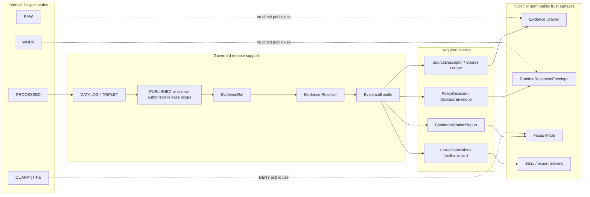

<!-- [KFM_META_BLOCK_V2]
doc_id: TODO(kfm-verify): assign kfm://doc/<uuid>
title: ADR-0204 — EvidenceBundle Contract
type: standard
version: v1
status: draft
owners: TODO(kfm-verify): confirm ADR owner and CODEOWNERS routing
created: 2026-04-27
updated: 2026-05-06
policy_label: TODO(kfm-verify): confirm public|restricted
related: [./README.md, ./ADR-0001-schema-home.md, ./ADR-0203-source-ledger-authority.md, ./ADR-0205-pr-002-evidence-closure.md, ../architecture/contract-schema-policy-split.md, ../../schemas/README.md, ../../schemas/contracts/v1/evidence/evidence_bundle.schema.json, ../../schemas/contracts/v1/shared/evidence_bundle.schema.json, ../../fixtures/evidence/evidence_bundle.valid.json, ../../fixtures/evidence/evidence_ref.valid.json, ../../tools/validators/validate_evidence_closure.py, ../../tests/contracts/README.md]
tags: [kfm, adr, evidencebundle, evidenceref, evidence-closure, contracts, schemas, policy, cite-or-abstain]
notes: [Target path is confirmed in the accessible GitHub repository. Local workspace was not a mounted repo. Current EvidenceBundle schemas are thin and split across evidence and shared homes. Owners, policy label, schema-home acceptance, CI run status, branch protection, runtime routes, and full resolver behavior remain NEEDS VERIFICATION.]
[/KFM_META_BLOCK_V2] -->

<a id="top"></a>

# ADR-0204 — EvidenceBundle Contract

Define the resolved evidence-support object that lets KFM inspect, validate, cite, withhold, correct, and roll back consequential claims.

<p align="left">
  
  
  
  
  
  
</p>

> [!IMPORTANT]
> This ADR aligns the document title with the confirmed file path `docs/adr/ADR-0204-evidencebundle-contract.md`. It does **not** claim that the current schemas, fixtures, validators, workflow runs, API routes, UI components, release artifacts, or runtime behavior are complete.

> [!WARNING]
> Current repository evidence shows **thin EvidenceBundle schemas** and more than one schema home signal. This ADR records the logical contract and convergence plan; it does not silently promote either schema path to final accepted authority.

## Quick jumps

[ADR record](#adr-record) ·
[Decision](#decision) ·
[Evidence basis](#evidence-basis) ·
[Problem](#problem) ·
[Contract boundary](#contract-boundary) ·
[Current schema delta](#current-schema-delta) ·
[Logical contract shape](#logical-contract-shape) ·
[Resolver flow](#resolver-flow) ·
[Validation gates](#validation-gates) ·
[Alternatives](#alternatives-considered) ·
[Consequences](#consequences) ·
[Implementation plan](#implementation-plan) ·
[Rollback](#rollback-and-supersession) ·
[Open verification](#open-verification) ·
[Review checklist](#review-checklist)

---

## ADR record

| Field | Value |
|---|---|
| ADR ID | `ADR-0204` |
| Target path | `docs/adr/ADR-0204-evidencebundle-contract.md` |
| Status | `draft` / `PROPOSED` |
| Decision date | `2026-04-27` |
| Updated | `2026-05-06` |
| Owners | `TODO(kfm-verify): confirm ADR owner and CODEOWNERS routing` |
| Policy label | `TODO(kfm-verify): confirm public|restricted` |
| Decision type | Evidence-resolution contract and public-claim guardrail |
| Scope | repo-wide trust object; consumed by evidence, runtime, release, UI, Focus Mode, and review surfaces |
| Current implementation signal | `CONFIRMED`: target ADR file exists; thin schemas, valid fixtures, and a minimal evidence-closure validator exist in accessible GitHub evidence |
| Current enforcement signal | `NEEDS VERIFICATION`: baseline workflow file exists, but workflow run status and branch protection were not verified |
| Schema posture | `CONFLICTED / NEEDS VERIFICATION`: `schemas/contracts/v1/evidence/` and `schemas/contracts/v1/shared/` both expose EvidenceBundle-shaped schemas |
| Must protect | `EvidenceRef -> EvidenceBundle`, cite-or-abstain, fail-closed policy, rights/sensitivity checks, review state, release state, correction lineage, rollback target |
| Must not become | raw source dump, canonical store, proof pack, release manifest, receipt, model output, chain-of-thought, tile truth, or policy engine |

[Back to top](#top)

---

## Decision

**PROPOSED.** KFM will treat `EvidenceBundle` as the resolved evidence-support object for one bounded claim context.

An `EvidenceBundle` sits between a small public-safe pointer such as `EvidenceRef` and downstream trust surfaces such as:

- Evidence Drawer payloads;
- `RuntimeResponseEnvelope`;
- Focus Mode answers;
- story/export previews;
- review records;
- release candidates;
- correction and rollback records.

### Decision rule

A consequential public or semi-public KFM claim **MUST** resolve:

```text
Claim -> EvidenceRef -> EvidenceBundle
```

before it is displayed, answered, exported, released, summarized, or used as the basis for a generated response.

If the evidence cannot be resolved or cannot be used safely, the surface must return or render the narrowest truthful finite state:

| Outcome | Use when |
|---|---|
| `ABSTAIN` | Evidence is absent, unresolved, insufficient, stale, uncited, or outside source scope. |
| `DENY` | Rights, sensitivity, source role, access role, release state, or policy blocks exposure. |
| `ERROR` | Schema, resolver, hash, runtime, or internal consistency check fails. |

### Boundary rule

`EvidenceBundle` packages admissible support. It does **not** create truth by itself.

It must not replace:

- canonical source records;
- source descriptors;
- receipts;
- proof packs;
- release manifests;
- catalog/triplet closure;
- policy decisions;
- review records;
- correction notices;
- rollback cards;
- citation validation reports;
- or governed runtime envelopes.

[Back to top](#top)

---

## Evidence basis

| Evidence item | Status | What it supports | Limit |
|---|---:|---|---|
| Target ADR file | `CONFIRMED` | `docs/adr/ADR-0204-evidencebundle-contract.md` exists in the accessible GitHub repository. | Existing file title/status/content require revision and cleanup. |
| ADR index | `CONFIRMED` | `docs/adr/README.md` lists ADRs as the human-facing decision ledger and surfaces `ADR-0204-evidencebundle-contract.md`. | ADR inventory and numbering policy remain `NEEDS VERIFICATION`. |
| ADR template | `CONFIRMED` | Local ADR style uses KFM Meta Block V2, badges, evidence basis, decision, impact, validation, rollback, and checklist sections. | Template values do not prove this ADR’s owners or status. |
| Root README | `CONFIRMED` | KFM identity, trust lifecycle, public-client boundary, and `Claim -> EvidenceRef -> EvidenceBundle` posture are present. | Root README itself remains draft/proposed in some fields. |
| `ADR-0001-schema-home.md` | `CONFIRMED / PROPOSED` | Proposes `schemas/contracts/v1/` as canonical machine-schema home and keeps `contracts/` semantic, `policy/` admissibility. | ADR-0001 remains draft/proposed; acceptance and enforcement are not fully verified. |
| `docs/architecture/contract-schema-policy-split.md` | `CONFIRMED doctrine / PROPOSED enforcement` | Confirms operating split: contracts explain meaning, schemas validate shape, policy decides release/public behavior. | Does not enforce the split by itself. |
| `schemas/README.md` | `CONFIRMED` | `schemas/` is an active parent lane; schema-home and fixture-home authority remain unresolved. | Child README references may be stale or absent. |
| `schemas/contracts/v1/evidence/evidence_bundle.schema.json` | `CONFIRMED` | A machine schema exists with required `id` and optional `knowledge_character`. | Too thin to express this ADR’s logical contract by itself. |
| `schemas/contracts/v1/shared/evidence_bundle.schema.json` | `CONFIRMED / CONFLICTED` | A second EvidenceBundle-shaped schema exists under `shared/`, requiring only `id`. | Its relationship to the `evidence/` schema is unresolved. |
| `fixtures/evidence/evidence_ref.valid.json` | `CONFIRMED` | Fixture includes `id`, `bundle_id`, `claim_id`, and `knowledge_character`. | Synthetic fixture only; not live source proof. |
| `fixtures/evidence/evidence_bundle.valid.json` | `CONFIRMED` | Fixture includes `id`, `evidence_refs`, `source_descriptor_id`, `closure_status`, and `knowledge_character`. | Fixture fields exceed current thin schema requirements. |
| `tools/validators/validate_evidence_closure.py` | `CONFIRMED` | Minimal closure validator checks `EvidenceRef.bundle_id == EvidenceBundle.id` and ref membership. | It is not a full source, rights, policy, release, citation, or correction resolver. |
| `.github/workflows/baseline.yml` | `CONFIRMED file presence` | Baseline workflow is wired to run multiple validation and policy checks on push/pull_request. | Passing workflow status and branch-protection enforcement were not verified. |
| Local workspace scan | `CONFIRMED` | `/mnt/data` in this session was not a mounted repo checkout. | GitHub connector evidence, not local checkout, was used for current repo file inspection. |

[Back to top](#top)

---

## Problem

KFM already has strong doctrine for `EvidenceBundle`, and the repository already exposes a minimal evidence-closure slice. The current repo evidence also shows three risks that this ADR must not hide:

1. **The current machine schemas are too thin.**  
   Existing EvidenceBundle schemas validate little more than `id` and, in one path, `knowledge_character`.

2. **EvidenceBundle schema homes are split.**  
   Both `schemas/contracts/v1/evidence/evidence_bundle.schema.json` and `schemas/contracts/v1/shared/evidence_bundle.schema.json` exist or are referenced by adjacent docs.

3. **Fixture semantics exceed schema semantics.**  
   The valid fixture includes `evidence_refs`, `source_descriptor_id`, and `closure_status`, while current schemas do not require those fields.

This ADR therefore records the logical contract, the minimal closure rule, the convergence plan, and the validation gates needed before KFM treats EvidenceBundle as mature enough for public claims, Focus Mode answers, exports, or release-sensitive UI.

> [!NOTE]
> Schema validity is necessary, but not sufficient. A schema-valid EvidenceBundle may still be unusable because evidence is missing, rights are unclear, sensitivity blocks exposure, policy denies use, release state is absent, citations fail, or correction lineage is unresolved.

[Back to top](#top)

---

## Contract boundary

### What belongs in an EvidenceBundle

| Belongs | Why |
|---|---|
| Stable bundle identity | Gives claims, UI payloads, logs, validators, release records, and correction notices a common reference. |
| Knowledge character | Prevents observed, documentary, derived, modeled, generalized, source-dependent, and synthetic-test evidence from collapsing. |
| Claim context | Binds the bundle to a bounded claim, feature, answer, map interaction, story node, export, or review context. |
| Evidence references | Lists the evidence objects that support the claim. |
| Source basis | Preserves source descriptor IDs, source roles, authority posture, rights, sensitivity, and activation posture. |
| Spatial and temporal support | States the spatial/temporal scope and uncertainty limits of the evidence. |
| Dataset and release basis | Connects support to dataset versions, release manifests, proof packs, and catalog/triplet closure when public. |
| Rights and sensitivity posture | Shows whether evidence may be cited, previewed, redistributed, generalized, redacted, staged, or denied. |
| Freshness and stale state | Distinguishes valid time, observed/source time, retrieved time, resolved time, release time, and stale policy where material. |
| Review and policy state | Carries or references review records, policy decisions, reason codes, and obligations. |
| Citation validation | Links factual generated/exported claims to validated citations. |
| Correction lineage | Shows whether the evidence is corrected, superseded, withdrawn, replaced, or rollback-bound. |
| Audit/resolver reference | Lets maintainers reconstruct the resolver path without exposing internal raw data. |

### What does not belong

| Exclusion | Correct home or handling |
|---|---|
| Raw source bytes or source-native dumps | `data/raw/**`, source archives, or governed source storage |
| Work-in-progress candidates | `data/work/**` or `data/quarantine/**` |
| Canonical source meaning | `SourceDescriptor` and source-ledger records |
| Semantic contract meaning | `contracts/` |
| Machine schema definition | `schemas/contracts/v1/**` or accepted schema home |
| Policy allow/deny logic | `policy/` and policy validators |
| Release-significant proof closure | `ProofPack`, `ReleaseManifest`, `CatalogMatrix` |
| Process memory | `RunReceipt`, `TransformReceipt`, `AIReceipt` |
| Free-form model output | `RuntimeResponseEnvelope` after citation and policy validation |
| Hidden chain-of-thought | Not a KFM truth object |
| Tile/style/map rendering state | `LayerManifest`, style manifests, map-context envelopes |
| Graph/vector/search projection output | Rebuildable derivative indexes |
| Emergency, legal, medical, financial, title, or other high-stakes advice | Separate fail-closed policy path, usually `DENY` or `ABSTAIN` |

[Back to top](#top)

---

## Current schema delta

Current repo evidence shows the EvidenceBundle implementation is a useful starting slice, not a completed contract.

| Surface | Current evidence | ADR interpretation |
|---|---|---|
| `schemas/contracts/v1/evidence/evidence_bundle.schema.json` | Requires only `id`; optionally constrains `knowledge_character`. | `CONFIRMED thin schema`; must be expanded or paired with stronger semantic validators before mature use. |
| `schemas/contracts/v1/shared/evidence_bundle.schema.json` | Requires only `id`. | `CONFLICTED / NEEDS VERIFICATION`; decide whether this is legacy, alias, shared core, or duplicate authority. |
| `fixtures/evidence/evidence_bundle.valid.json` | Includes `id`, `evidence_refs`, `source_descriptor_id`, `closure_status`, and `knowledge_character`. | Fixture is stronger than schema; useful as convergence seed. |
| `fixtures/evidence/evidence_ref.valid.json` | Includes `id`, `bundle_id`, `claim_id`, and `knowledge_character`. | Fixture supports minimal resolver check. |
| `tools/validators/validate_evidence_closure.py` | Checks bundle ID match and ref membership. | `CONFIRMED minimal semantic closure`; expand in later slices. |
| `tools/validate_schema_conformance.py` | Requires fixture-level fields beyond JSON Schema minimum. | Useful bridge while schema is thin; must not become hidden schema authority. |
| `tools/validate_fixture_schema_mapping.py` | Maps evidence fixtures to `schemas/contracts/v1/evidence/` schemas. | Current mapping favors `evidence/` path; adjacent ADR-0205 references `shared/`, so alias/migration must be explicit. |

### Required convergence

This ADR should be considered implementation-ready only after one of these is true:

1. `schemas/contracts/v1/evidence/evidence_bundle.schema.json` becomes the accepted canonical schema and `shared/` becomes alias, deprecated, or removed through migration; or
2. `schemas/contracts/v1/shared/evidence_bundle.schema.json` becomes the accepted canonical shared schema and `evidence/` becomes alias, wrapper, or domain-specific specialization; or
3. a successor ADR defines a different schema-home plan and validates all consumers.

Until then, EvidenceBundle schema home remains:

```text
CONFLICTED / NEEDS VERIFICATION
```

[Back to top](#top)

---

## Logical contract shape

The table below defines the logical minimum. Exact field names and schema placement must follow `ADR-0001` or a successor schema-home decision.

| Field group | Requirement | Current status |
|---|---:|---|
| `schema_version` | SHOULD | `PROPOSED`; not present in current fixture. |
| `object_type` | SHOULD | `PROPOSED`; not present in current fixture. |
| `id` | MUST | `CONFIRMED` in current schemas and fixture. |
| `bundle_hash` or `content_spec_hash` | SHOULD for internal; MUST for release-sensitive use | `PROPOSED / NEEDS VERIFICATION`; canonicalization profile unresolved. |
| `knowledge_character` | MUST | `CONFIRMED` in current `evidence/` schema enum and fixture. |
| `claim_context` | MUST for public claims | Current fixture carries `claim_id` via `EvidenceRef`; richer bundle context is `PROPOSED`. |
| `evidence_refs` | MUST | `CONFIRMED` in current fixture and closure validator; not required by current schema. |
| `source_basis` / `source_descriptor_id` | MUST for public/semi-public claims | `CONFIRMED` as `source_descriptor_id` in fixture; richer source basis is `PROPOSED`. |
| `spatial_temporal_scope` | SHOULD; MUST when claim is spatial/temporal | `PROPOSED`; required by KFM doctrine but not current fixture. |
| `dataset_refs` | SHOULD | `PROPOSED`; needed for dataset-derived claims. |
| `release_basis` | MUST for published use | `PROPOSED`; adjacent hydrology evidence-closure ADR requires release/dry-run manifest context. |
| `rights` | MUST for public use | `PROPOSED`; source descriptor/policy may carry source of truth. |
| `sensitivity` | MUST for public use | `PROPOSED`; source descriptor/policy may carry source of truth. |
| `freshness` | SHOULD; MUST for stale-sensitive sources | `PROPOSED`. |
| `review_state` | MUST for review-sensitive/public release | `PROPOSED`. |
| `policy_state` | MUST for runtime/release | `PROPOSED`; may reference `PolicyDecision` / `DecisionEnvelope`. |
| `citation_validation` | MUST for generated answers and exports | `PROPOSED`. |
| `lineage` | SHOULD; MUST for release-sensitive use | `PROPOSED`. |
| `correction_lineage` | MUST; empty array if none | `PROPOSED`. |
| `audit_ref` / `resolver_trace_ref` | SHOULD | `PROPOSED`; avoid exposing raw internals. |

### Hashing and canonicalization

`bundle_hash` or equivalent digest is desirable for release-sensitive EvidenceBundles, but the canonicalization profile is not settled in this ADR.

Until a hashing ADR or repo-native utility is verified:

- record which fields are included in the hash;
- exclude ephemeral resolver traces only when documented;
- fail validation when declared hash does not reproduce;
- keep generated prose, display order, and UI-local state out of canonical truth;
- align with existing `spec_hash` or `content_spec_hash` conventions when confirmed.

### Illustrative target fixture

This example is **illustrative**. It expands the current fixture shape without claiming the current schema already accepts or requires every field.

```json
{
  "schema_version": "1.0.0",
  "object_type": "EvidenceBundle",
  "id": "evb-hydro-synth-001",
  "bundle_hash": "sha256:<canonicalized-evidence-bundle-digest>",
  "knowledge_character": "SYNTHETIC_TEST",
  "claim_context": {
    "claim_id": "claim-hydro-synth-001",
    "surface": "evidence_drawer",
    "summary": "Synthetic hydrology proof-slice claim for no-network validation."
  },
  "evidence_refs": [
    {
      "id": "evr-hydro-synth-001",
      "support_role": "primary",
      "claim_id": "claim-hydro-synth-001"
    }
  ],
  "source_basis": {
    "source_descriptor_ids": ["src-hydro-synth-001"],
    "source_roles": ["synthetic_test_fixture"],
    "authority_posture": "synthetic_no_network_fixture"
  },
  "spatial_temporal_scope": {
    "spatial_scope": {
      "kind": "synthetic_hydrology_area",
      "precision_posture": "not_real_world_geometry"
    },
    "temporal_scope": {
      "support_time_basis": "synthetic_fixture"
    }
  },
  "closure_status": "COMPLETE",
  "rights": {
    "status": "public_safe_fixture",
    "public_release_allowed": false,
    "obligations": ["DO_NOT_TREAT_AS_LIVE_SOURCE_AUTHORITY"]
  },
  "sensitivity": {
    "classification": "PUBLIC_SAFE",
    "transform_receipt_refs": []
  },
  "policy_state": {
    "decision_ref": "policy_decision:synthetic-hydrology:allow-fixture",
    "allowed_surfaces": ["test", "docs"],
    "denied_surfaces": ["public_authoritative_claim"]
  },
  "citation_validation": {
    "required": false,
    "state": "not_applicable_for_synthetic_fixture"
  },
  "release_basis": {
    "release_manifest_ref": "release:synthetic-hydrology:dry-run",
    "release_state": "READY_FOR_REVIEW",
    "publish_decision": "REFUSE"
  },
  "correction_lineage": [],
  "audit_ref": "audit:synthetic-hydrology:evidence-bundle-001"
}
```

[Back to top](#top)

---

## Resolver flow



### Required resolver behavior

| Condition | Required outcome |
|---|---|
| `EvidenceRef` missing | `ABSTAIN` |
| `EvidenceRef` cannot resolve | `ABSTAIN` when evidence is absent; `ERROR` when resolver infrastructure fails |
| `EvidenceRef.bundle_id != EvidenceBundle.id` | `ERROR` |
| `EvidenceRef.id` is not listed in `EvidenceBundle.evidence_refs` | `ERROR` |
| Bundle source descriptor is missing | `ABSTAIN` for runtime; block release |
| Source role does not support the claim type | `ABSTAIN` or narrowed claim |
| Rights are unknown or not public-safe | `DENY` for public use |
| Evidence is sensitive or restricted | `DENY`, or return only an approved generalized/redacted bundle |
| Evidence is stale beyond policy | `ABSTAIN`, stale warning, or re-resolution requirement |
| Policy engine is unavailable | fail closed with `ERROR` or `DENY` |
| Citation validation fails | `ABSTAIN` or block export/release |
| Correction notice supersedes bundle | surface corrected/superseded/withdrawn state |
| Bundle hash mismatch | `ERROR` and block promotion |

[Back to top](#top)

---

## Relationship to adjacent objects

| Object | Relationship to `EvidenceBundle` |
|---|---|
| `SourceDescriptor` | Declares source identity, source role, rights, cadence, sensitivity, activation state, and claim-support limits. |
| `SourceLedgerEntry` | Ranks source authority and status; prevents lineage or exploratory material from being mistaken for current proof. |
| `EvidenceRef` | Small pointer used by claims, UI, exports, and Focus Mode to resolve into a bundle. |
| `DatasetVersion` | Provides stable processed-data identity and lineage for dataset-derived evidence. |
| `PolicyDecision` / `DecisionEnvelope` | Carries allow, deny, abstain, restrict, reason-code, and obligation decisions over bundle use. |
| `RuntimeResponseEnvelope` | Public runtime output that references resolved bundles and uses finite outcomes. |
| `CitationValidationReport` | Proves citations in generated/exported text are supported by bundle evidence. |
| `ReleaseManifest` | Records released artifacts, hashes, scope, proof refs, rollback target, and correction path. |
| `ProofPack` | Supplies release-grade proof closure; bundle references it but does not replace it. |
| `CatalogMatrix` | Proves catalog/provenance/triplet closure where release requires it. |
| `EvidenceDrawerPayload` | UI projection of selected bundle fields and trust state; does not create truth. |
| `RunReceipt` / `TransformReceipt` / `AIReceipt` | Process memory; useful for audit, not canonical evidence by themselves. |
| `CorrectionNotice` | Records correction, withdrawal, supersession, affected bundles, affected releases, and user-facing state. |
| `RollbackCard` | Identifies safe rollback target and procedure. |

[Back to top](#top)

---

## Validation gates

An EvidenceBundle change is not review-ready until the relevant checks are explicit.

| Gate | Minimum behavior | Current status |
|---|---|---|
| Schema presence | EvidenceBundle schema path exists and parses as JSON Schema. | `CONFIRMED` for two thin schemas. |
| Schema-home convergence | One canonical schema path or explicit alias/migration rule exists. | `NEEDS VERIFICATION`. |
| Fixture mapping | EvidenceBundle fixture maps to the intended schema. | `CONFIRMED` for `schemas/contracts/v1/evidence/evidence_bundle.schema.json`. |
| Fixture semantics | Valid fixture includes evidence refs, source descriptor ID, closure status, and knowledge character. | `CONFIRMED`. |
| Minimal closure | `EvidenceRef.bundle_id == EvidenceBundle.id` and ref listed in bundle. | `CONFIRMED` validator exists. |
| Source closure | Bundle source refs resolve to ledgered `SourceDescriptor` records. | `PROPOSED / NEEDS VERIFICATION`. |
| Rights and sensitivity | Unknown or blocked rights/sensitivity fail closed. | `PROPOSED`; policy/source validators need verification. |
| Release closure | Public bundles reference release/proof/catalog/rollback context where required. | `PROPOSED`; adjacent synthetic dry-run surfaces exist but full release behavior needs verification. |
| Citation validation | Generated/exported claims cite supported bundle evidence or abstain. | `PROPOSED / NEEDS VERIFICATION`. |
| Correction propagation | Corrected/superseded/withdrawn bundles surface state to UI/API. | `PROPOSED / NEEDS VERIFICATION`. |
| No-public-internal-path | Public surfaces do not expose RAW, WORK, QUARANTINE, unpublished candidates, or direct model outputs. | Workflow step exists; enforcement result `NEEDS VERIFICATION`. |
| Negative fixtures | Missing evidence, mismatch, rights block, sensitivity block, stale state, and correction conflict are tested. | `PROPOSED`. |
| Documentation sync | ADR, schema docs, contract docs, policy docs, tests, and validators agree. | `NEEDS VERIFICATION`. |

### Repository-grounded validation commands

Run from the actual repository checkout. These commands are based on confirmed file paths, but their success was not verified in this local session.

```bash
git status --short
git branch --show-current || true

python scripts/validate_schemas.py
python tools/validate_fixture_schema_mapping.py
python tools/validate_schema_conformance.py
python tools/validators/validate_evidence_closure.py

python tools/check_no_public_internal_paths.py
python -m unittest discover -s tests
bash scripts/validate_all.sh
```

> [!CAUTION]
> Do not claim these checks pass unless they run successfully on the branch being reviewed.

[Back to top](#top)

---

## Alternatives considered

| Alternative | Decision | Reason |
|---|---|---|
| Use `EvidenceRef` alone in UI/API responses | Rejected | Too small to carry source role, rights, sensitivity, policy, citation, release, review, correction, and rollback context. |
| Treat the current thin schema as complete | Rejected | Current schema shape does not express the logical contract or public-claim burden. |
| Keep both `evidence/` and `shared/` EvidenceBundle schemas as independent authorities | Rejected / deferred | Parallel schema authority creates drift. Use one canonical path or explicit alias/migration. |
| Let Evidence Drawer read raw/canonical/internal stores | Rejected | Breaks the trust membrane and bypasses governed release/policy checks. |
| Generate an AI answer first, attach evidence later | Rejected | KFM requires evidence resolution and policy checks before generated public answer release. |
| Merge `EvidenceBundle` with receipts | Rejected | Receipts are process memory; bundles are admissible claim support. |
| Merge `EvidenceBundle` with `ReleaseManifest` or `ProofPack` | Rejected | Release/proof objects prove publication closure; bundles support bounded claims. |
| Treat tile attributes, graph projections, vector search, or map state as evidence bundles | Rejected | These are downstream derivatives and acceleration layers, not root truth. |
| Move all evidence semantics into policy | Rejected | Policy decides admissibility; it should not be the only place object meaning or evidence closure is visible. |

[Back to top](#top)

---

## Consequences

### Positive consequences

- Makes cite-or-abstain behavior concrete.
- Gives Evidence Drawer and Focus Mode a shared trust object.
- Keeps AI, maps, tiles, graphs, dashboards, exports, and stories downstream of evidence and policy.
- Makes schema drift between `evidence/` and `shared/` visible instead of hidden.
- Preserves synthetic proof-slice value without claiming live-source authority.
- Defines early negative states before public UI polish.
- Gives correction and rollback lineage a place in evidence-facing public behavior.

### Costs and tradeoffs

| Cost | Mitigation |
|---|---|
| More contract detail before UI polish | Keep first implementation slice fixture-only and no-network. |
| Schema convergence may break consumers | Inventory consumers and use explicit aliases or migration notes. |
| Current schema is thin | Expand schema gradually, backed by valid and invalid fixtures. |
| Semantic validators may outpace schemas | Keep validators documented and migrate rules into schemas where appropriate. |
| Public UI must handle negative states | Treat `ABSTAIN`, `DENY`, and `ERROR` as first-class UX states. |
| Release/use gates become stricter | Prefer fail-closed trust over unsupported fluent claims. |

[Back to top](#top)

---

## Implementation plan

### Slice 0 — Documentation control and title repair

| Step | Action | Status |
|---|---|---|
| 0.1 | Align H1 and meta title to `ADR-0204 — EvidenceBundle Contract`. | `PROPOSED` |
| 0.2 | Update ADR index entry if wording changes. | `PROPOSED` |
| 0.3 | Confirm owners, CODEOWNERS routing, and policy label. | `NEEDS VERIFICATION` |
| 0.4 | Record current schema-home conflict between `evidence/` and `shared/`. | `PROPOSED` |
| 0.5 | Link this ADR to ADR-0001, ADR-0203, ADR-0205, schema docs, fixtures, and validators. | `PROPOSED` |

### Slice 1 — Schema convergence

| Step | Action | Status |
|---|---|---|
| 1.1 | Decide canonical EvidenceBundle schema path or alias strategy. | `NEEDS VERIFICATION` |
| 1.2 | Expand canonical schema beyond `id` to cover first-wave required fields. | `PROPOSED` |
| 1.3 | Add valid and invalid EvidenceBundle fixtures. | `PROPOSED` |
| 1.4 | Ensure fixture mapping targets the canonical path. | `PROPOSED` |
| 1.5 | Add schema-home drift test for duplicate EvidenceBundle authorities. | `PROPOSED` |

### Slice 2 — Resolver and closure hardening

| Step | Action | Status |
|---|---|---|
| 2.1 | Keep current minimal closure check. | `CONFIRMED current baseline` |
| 2.2 | Add source-descriptor closure check. | `PROPOSED` |
| 2.3 | Add rights and sensitivity fail-closed fixtures. | `PROPOSED` |
| 2.4 | Add stale/conflicted source-state fixtures. | `PROPOSED` |
| 2.5 | Emit reviewer-readable closure report. | `PROPOSED` |

### Slice 3 — Public-surface consumers

| Step | Action | Status |
|---|---|---|
| 3.1 | Define Evidence Drawer payload fields consumed from EvidenceBundle. | `PROPOSED` |
| 3.2 | Ensure Focus Mode receives only released or review-authorized bundle context. | `PROPOSED` |
| 3.3 | Ensure `RuntimeResponseEnvelope` references bundles and finite outcomes only. | `PROPOSED` |
| 3.4 | Block direct model, raw, work, quarantine, and unpublished candidate paths. | `PROPOSED`; workflow step exists but enforcement `NEEDS VERIFICATION` |

### Slice 4 — Release, correction, and rollback

| Step | Action | Status |
|---|---|---|
| 4.1 | Connect public bundle use to `ReleaseManifest` and proof/catalog closure. | `PROPOSED` |
| 4.2 | Add correction/supersession fixture affecting an EvidenceBundle. | `PROPOSED` |
| 4.3 | Add rollback drill proving prior state remains inspectable. | `PROPOSED` |
| 4.4 | Refuse public publication when rollback or correction path is missing. | `PROPOSED` |

[Back to top](#top)

---

## Rollback and supersession

### Documentation rollback

If this ADR is replaced:

1. mark this file `superseded` in the meta block;
2. add the successor ADR to `related`;
3. preserve the old decision and conflict notes as lineage;
4. update `docs/adr/README.md`;
5. update affected schema, fixture, validator, policy, and release docs;
6. do not delete decision history to make the tree look cleaner.

### Contract rollback

If a schema or validator change breaks consumers:

1. keep the previous schema and fixture path available during rollback;
2. revert or disable the new resolver rule;
3. preserve alias/migration records;
4. re-run schema, fixture mapping, closure, public-path, and unit checks;
5. record whether public surfaces or release candidates were affected.

### Public correction

If a published or semi-public claim used a bad bundle:

1. freeze affected release scope;
2. issue or update `CorrectionNotice`;
3. withdraw, correct, or supersede affected Evidence Drawer, Focus Mode, story, export, map popup, and API responses;
4. restore a prior valid release or publish a reviewed replacement;
5. preserve the bad bundle, corrected bundle, release, correction, and rollback lineage for audit.

> [!IMPORTANT]
> A silent replacement is not a correction. KFM trust depends on visible correction lineage.

[Back to top](#top)

---

## Open verification

| Item | Status | Why it matters |
|---|---:|---|
| ADR owner and CODEOWNERS routing | `NEEDS VERIFICATION` | Review accountability must be explicit before publication. |
| Policy label | `NEEDS VERIFICATION` | Public/restricted classification cannot be inferred from path alone. |
| ADR numbering and index consistency | `NEEDS VERIFICATION` | Prior content showed title/number drift; ADR index must be reconciled. |
| Canonical EvidenceBundle schema home | `CONFLICTED / NEEDS VERIFICATION` | `evidence/` and `shared/` schemas both exist or are referenced. |
| Current schemas are complete enough | `NO / CONFIRMED THIN` | Existing schemas require only `id` and optionally `knowledge_character`. |
| Fixture home authority | `NEEDS VERIFICATION` | Multiple fixture lanes may exist; do not duplicate proof authority. |
| Workflow run status | `NEEDS VERIFICATION` | Workflow YAML exists, but passing status was not inspected. |
| Branch protections | `UNKNOWN` | Required before claiming merge-blocking enforcement. |
| Full source closure | `PROPOSED` | Current validator checks minimal EvidenceRef/EvidenceBundle relation only. |
| Rights/sensitivity closure | `PROPOSED / NEEDS VERIFICATION` | Needed before public release or exact-location exposure. |
| Citation validation shape | `PROPOSED / NEEDS VERIFICATION` | Required for Focus Mode, exports, and generated summaries. |
| Evidence Drawer schema | `PROPOSED / NEEDS VERIFICATION` | UI must display trust state without inventing fields. |
| Runtime route names | `UNKNOWN` | No route name should be claimed without source inspection. |
| Release/proof/correction artifacts | `NEEDS VERIFICATION` | Needed before claiming publishable EvidenceBundle behavior. |
| Hash canonicalization profile | `PROPOSED / NEEDS VERIFICATION` | Required for reproducible `bundle_hash` or equivalent. |

[Back to top](#top)

---

## Review checklist

<details>
<summary><strong>Pre-merge checklist</strong></summary>

- [ ] Meta block `doc_id`, owners, policy label, and related links are updated or deliberately left as reviewable placeholders.
- [ ] H1, meta block title, filename, and ADR index entry agree.
- [ ] ADR-0001 schema-home status is checked before machine-schema claims are upgraded.
- [ ] `evidence/` versus `shared/` EvidenceBundle schema conflict is resolved or explicitly deferred.
- [ ] Current thin schema is not described as a mature public contract.
- [ ] Valid EvidenceBundle fixture remains compatible or has a documented migration path.
- [ ] Invalid fixtures exist for missing evidence refs, mismatched bundle IDs, missing source descriptor, blocked rights, sensitive exposure, stale evidence, and hidden correction state.
- [ ] `validate_evidence_closure.py` or successor checks at least EvidenceRef-to-EvidenceBundle closure.
- [ ] Source closure, rights, sensitivity, citation, release, correction, and rollback closure are either implemented or marked `PROPOSED / NEEDS VERIFICATION`.
- [ ] Public surfaces cannot read RAW, WORK, QUARANTINE, unpublished candidates, source-native systems, or direct model output.
- [ ] Runtime and Focus outputs use finite outcomes only.
- [ ] Evidence Drawer payload displays evidence, source role, policy, release, correction, and rollback state where available.
- [ ] Workflow evidence is checked before claiming merge-blocking enforcement.
- [ ] Rollback and supersession path is clear.
- [ ] No new contract, schema, policy, source, proof, release, or fixture authority is created by accident.

</details>

[Back to top](#top)
