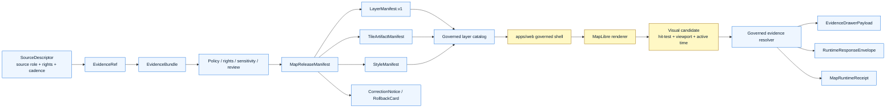

<!-- [KFM_META_BLOCK_V2]
doc_id: kfm://doc/NEEDS-VERIFICATION-ADR-0206-maplibre-layer-manifest
title: ADR-0206: MapLibre Layer Manifest
type: standard
version: v1.1-review
status: review
owners: OWNER_TBD_NEEDS_VERIFICATION
created: NEEDS_VERIFICATION-YYYY-MM-DD
updated: 2026-05-06
policy_label: NEEDS_VERIFICATION
related: [./README.md, ./ADR-TEMPLATE.md, ./ADR-0001-schema-home.md, ./ADR-0002-responsibility-root-monorepo.md, ./ADR-0003-maplibre-renderer-boundary.md, ../architecture/map-shell.md, ../../data/registry/layers/README.md, ../../apps/web/README.md, ../../apps/web/package.json]
tags: [kfm, adr, maplibre, layer-manifest, map-shell, evidence-drawer, focus-mode, governed-api, release, rollback, fail-closed]
notes: [This revision aligns the visible ADR title with the target path ADR-0206; the previous checked-in file used an ADR-0308 title while living at docs/adr/ADR-0206-maplibre-layer-manifest.md. doc_id, owners, created date, policy_label, CODEOWNERS coverage, final acceptance state, schema path, CI enforcement, and runtime behavior remain NEEDS VERIFICATION.]
[/KFM_META_BLOCK_V2] -->

<a id="top"></a>

# ADR-0206: MapLibre Layer Manifest

Adopt `LayerManifest.v1` as the governed layer contract that tells the KFM MapLibre shell what a released layer may render, cite, withhold, badge, time-scope, resolve, correct, and roll back.

<p align="center">
  
  
  
  
  
</p>

<p align="center">
  <a href="#decision-summary">Decision</a> ·
  <a href="#repo-fit-and-evidence-boundary">Repo fit</a> ·
  <a href="#context">Context</a> ·
  <a href="#layermanifest-boundary">Boundary</a> ·
  <a href="#runtime-flow">Runtime flow</a> ·
  <a href="#contract-shape">Contract shape</a> ·
  <a href="#validation-and-acceptance">Validation</a> ·
  <a href="#rollout-plan">Rollout</a> ·
  <a href="#rollback-and-correction">Rollback</a> ·
  <a href="#open-verification-backlog">Open verification</a>
</p>

> [!IMPORTANT]
> **Core rule:** a MapLibre layer is not a KFM truth object. A layer becomes eligible for the public or semi-public map shell only when a governed `LayerManifest.v1` binds the renderer-facing layer to released artifacts, evidence behavior, policy posture, time state, correction lineage, and rollback context.

> [!CAUTION]
> **Decision state:** `PROPOSED / in review`.  
> This ADR records the contract boundary and validation burden. It does **not** prove that schemas, validators, workflows, branch protections, governed API routes, MapLibre components, Evidence Drawer payloads, Focus Mode behavior, runtime receipts, releases, or rollback drills are currently enforced.

---

## Decision summary

KFM will require every public or semi-public MapLibre layer to be admitted through `LayerManifest.v1` or a successor contract accepted by a later ADR.

A `LayerManifest` is the layer-facing governance envelope. It is not the tile artifact, style JSON, source descriptor, EvidenceBundle, proof pack, release manifest, policy decision, or runtime receipt. It points to those objects and makes their UI-relevant consequences explicit.

| Field | Determination |
|---|---|
| Target path | `docs/adr/ADR-0206-maplibre-layer-manifest.md` |
| Document status | `review` |
| ADR decision state | `PROPOSED` |
| Primary decision | Adopt `LayerManifest.v1` as the governed layer contract for MapLibre public and semi-public layers. |
| Companion ADR | [`ADR-0003-maplibre-renderer-boundary.md`](./ADR-0003-maplibre-renderer-boundary.md) |
| Architecture companion | [`../architecture/map-shell.md`](../architecture/map-shell.md) |
| Registry companion | [`../../data/registry/layers/README.md`](../../data/registry/layers/README.md) |
| Proposed schema home | `schemas/contracts/v1/maplibre/layer_manifest.schema.json` or repo-native equivalent |
| Schema-home status | `PROPOSED / NEEDS VERIFICATION` |
| Primary trust rule | Renderer configuration cannot become source, evidence, policy, release, citation, correction, or rollback authority. |
| Failure posture | Missing evidence, unknown rights, sensitive exact geometry, stale support, withdrawn release, or unresolved policy produces `ABSTAIN`, `DENY`, `ERROR`, or blocked publication. |

### One-line decision rule

> KFM MapLibre layers load from governed layer manifests, not from ad hoc style JSON, raw feature properties, client-side filters, direct canonical reads, or UI-local assumptions.

### One-line boundary rule

> `LayerManifest.v1` may authorize rendering of released artifacts; it may not authorize truth, policy, source rights, review, publication, AI synthesis, or sensitive-location exposure by itself.

<p align="right"><a href="#top">Back to top ↑</a></p>

---

## Repo fit and evidence boundary

`docs/adr/` is the correct home because this is a human-facing architecture decision that governs a cross-domain map-shell trust boundary. It does not create a new root-level MapLibre authority, schema authority, policy authority, source registry, proof store, release store, or UI implementation root.

### Current repository evidence snapshot

| Evidence item | Status | Supports | Does not prove |
|---|---:|---|---|
| `docs/adr/ADR-0206-maplibre-layer-manifest.md` | `CONFIRMED repository file` | Target file exists. The current checked-in content already attempts this decision area. | Acceptance, enforcement, schema existence, validator existence, runtime behavior. |
| Existing target file title mismatch | `CONFIRMED repository evidence` | The checked-in file lives at `ADR-0206` but its visible title/meta title says `ADR-0308`. | That `ADR-0308` is the accepted number. This revision corrects the visible title to match the target path. |
| `docs/adr/README.md` | `CONFIRMED repository file` | ADRs are the KFM human-facing decision ledger; `ADR-0206-maplibre-layer-manifest.md` is listed as surfaced / needs verification. | Complete ADR coverage, final status, or enforcement maturity. |
| `docs/adr/ADR-TEMPLATE.md` | `CONFIRMED repository file` | ADRs should separate decision, evidence, implementation proof, validation, rollback, and supersession. | That this ADR is accepted or implemented. |
| `docs/adr/ADR-0001-schema-home.md` | `CONFIRMED repository file / proposed decision` | `schemas/contracts/v1/` is the proposed canonical machine-schema home; `contracts/` and `policy/` stay separate. | Accepted schema-home enforcement or the existence of a MapLibre layer schema. |
| `docs/adr/ADR-0002-responsibility-root-monorepo.md` | `CONFIRMED repository file` | Responsibility-root monorepo discipline is a governing placement signal. | Full root conformance or CI enforcement. |
| `docs/adr/ADR-0003-maplibre-renderer-boundary.md` | `CONFIRMED repository file / companion ADR` | MapLibre is renderer and interaction runtime, not truth authority; it notes the ADR-0206 / ADR-0308 mismatch. | `LayerManifest.v1` schema enforcement. |
| `docs/architecture/map-shell.md` | `CONFIRMED repository file` | The map shell architecture links this ADR and treats MapLibre as downstream of governed evidence and release state. | Runtime component maturity. |
| `data/registry/layers/README.md` | `CONFIRMED repository file` | Layer registry docs already frame layer manifests as release-aware registry records. | Registry entries, schemas, validators, and branch gates. |
| `apps/web/package.json` | `CONFIRMED repository file` | The web package declares a governed web shell package, MapLibre/PMTiles dependencies, and app-level scripts. | Installed dependencies, passing tests, production runtime, or deployment security. |
| Local mounted checkout | `UNKNOWN / not mounted here` | Local workspace inspection did not expose a Git checkout. GitHub connector evidence was used for repo inspection. | Branch dirty state, local test output, workflow run output, branch protections, runtime logs. |

### Directory discipline basis

This ADR preserves the responsibility-root split:

| Responsibility | Root | This ADR’s placement effect |
|---|---|---|
| Human decision record | `docs/adr/` | This file belongs here. |
| Human architecture explanation | `docs/architecture/` | Map-shell architecture should link to this ADR. |
| Semantic object meaning | `contracts/` | Future LayerManifest contract prose may live there. |
| Machine-checkable shape | `schemas/` | Future JSON Schema belongs in the accepted schema home. |
| Admissibility and fail-closed policy | `policy/` | Rights, sensitivity, stale, access, and no-bypass decisions stay there. |
| Proof by examples and negative cases | `tests/` / `fixtures/` | Valid and invalid layer-manifest behavior should be proven there. |
| Registry records | `data/registry/layers/` | Layer registry entries may reference or contain layer manifests after validation. |
| Released objects and rollback | `release/`, `data/published/`, `data/proofs/`, `data/receipts/` | Releases, proofs, receipts, and rollback records stay separate. |
| Browser runtime | `apps/web/` | The web shell consumes manifest-backed layers; it is not the manifest authority. |

<p align="right"><a href="#top">Back to top ↑</a></p>

---

## Context

KFM’s map UI is a trust-visible operating surface. A polished map layer can easily be mistaken for an authoritative claim, so KFM needs a contract that keeps renderer behavior downstream of evidence, policy, review, release, correction, and rollback state.

MapLibre style JSON, TileJSON, PMTiles metadata, vector tile properties, and browser feature state are useful. They are not enough for KFM governance.

| KFM question | Why renderer metadata alone is insufficient |
|---|---|
| Is this layer released? | Style JSON and TileJSON do not prove promotion state. |
| What source role supports it? | Render sources are not source descriptors. |
| Can exact geometry be public? | Sensitivity and geoprivacy are policy decisions, not paint rules. |
| Is the source stale? | Tiles may omit cadence, stale time, release time, and correction time. |
| Can a popup make a claim? | Consequential claims need EvidenceBundle closure. |
| Can Focus Mode answer from this layer? | AI eligibility depends on released evidence, policy, citation validation, and finite outcomes. |
| What was generalized, redacted, or withheld? | Public-safe transforms need receipts, badges, and safe accounting. |
| How is a bad layer release withdrawn? | Rollback requires prior release and correction lineage, not just removing a source from the map. |

### Decision pressure

The current repository has three strong signals that this ADR should be cleaned up and kept:

1. The target ADR file already exists but its visible title uses the wrong ADR number.
2. The renderer-boundary ADR and map-shell architecture both link to the companion LayerManifest decision.
3. The layer registry README already defines a registry boundary for release-aware layer manifests.

The safe revision is therefore not to restart. It is to align the title and metadata, tighten the evidence boundary, keep the contract decision, and make enforcement requirements specific.

<p align="right"><a href="#top">Back to top ↑</a></p>

---

## LayerManifest boundary

`LayerManifest.v1` is responsible for layer admission and layer-facing trust behavior. It should not absorb all related objects.

### What `LayerManifest.v1` must govern

| Responsibility | Required expression |
|---|---|
| Identity | Stable `layer_id`, title, domain, version, audience/scope, and release binding. |
| Render admission | Which released artifacts, styles, tiles, rasters, vectors, or service refs may render. |
| Evidence behavior | Whether interactions require EvidenceBundle resolution; whether popup claims are allowed. |
| Drawer behavior | Which `EvidenceDrawerPayload` contract is expected. |
| Focus behavior | Whether Focus Mode is allowed and which finite outcomes are possible. |
| Geometry behavior | Public precision, generalization, redaction, withheld accounting, and sensitive geometry rules. |
| Time behavior | Active time axes, stale behavior, release time, correction time, and default scope. |
| Source posture | Source descriptor refs, source roles, rights state, citation policy, and verification status. |
| Trust cues | Badges, negative states, stale/correction/withdrawn indicators, and accessibility requirements. |
| Access behavior | Public, restricted, steward, or role-gated display rules. |
| Validation behavior | Schema refs, validator refs, policy refs, proof refs, and required fixtures. |
| Rollback behavior | Previous manifest, rollback target, cache invalidation, correction notice, and withdrawal behavior. |

### What `LayerManifest.v1` must not become

| Not this | Why |
|---|---|
| Source descriptor | Source identity, role, rights, cadence, and terms need their own authority. |
| EvidenceBundle | Evidence support must remain independently resolvable and inspectable. |
| Tile artifact manifest | Artifact bytes, digests, bounds, media type, and build metadata are separate. |
| Style manifest | Visual meaning and asset integrity are separate from layer admission. |
| Release manifest | Publication is a governed state transition, not layer config. |
| Policy decision | Policy outcomes are evaluated and emitted by policy/release machinery. |
| Runtime receipt | Interaction audit records are emitted from runtime behavior. |
| Browser-only config | The manifest is governed input; the browser consumes it but does not define it. |

### Required object relationships

| Object family | Relationship to `LayerManifest.v1` |
|---|---|
| `SourceDescriptor` | Referenced by `source_descriptor_refs`; source role and rights must resolve. |
| `EvidenceRef` | Referenced directly or through Drawer/Bundle resolution. |
| `EvidenceBundle` | Required for consequential layer claims or explicit abstention. |
| `TileArtifactManifest` | Referenced through `artifact_refs` or `tile_artifact_refs`. |
| `StyleManifest` | Referenced through `style_refs`; meaning-changing style revisions must be reviewed. |
| `MapReleaseManifest` | Binds layer, style, artifact, proof, public scope, prior release, and rollback target. |
| `EvidenceDrawerPayload` | Returned after governed feature selection resolution. |
| `MapContextEnvelope` | Carries viewport, time, layer, release, feature candidate, and role context. |
| `RuntimeResponseEnvelope` | Carries Focus Mode finite outcomes: `ANSWER`, `ABSTAIN`, `DENY`, `ERROR`. |
| `MapRuntimeReceipt` | Records runtime interaction and resolution when required. |
| `CorrectionNotice` / `RollbackCard` | Preserve withdrawal, correction, supersession, and restore behavior. |

<p align="right"><a href="#top">Back to top ↑</a></p>

---

## Runtime flow



### Interaction sequence

1. A source-backed, policy-reviewed artifact is prepared.
2. `TileArtifactManifest`, `StyleManifest`, and evidence support are validated.
3. `LayerManifest.v1` binds the layer to renderable artifacts and trust behavior.
4. `MapReleaseManifest` binds layer, artifact, style, proof, prior release, and rollback target.
5. The governed layer catalog exposes only released or authorized fixture layers.
6. `apps/web` consumes the layer manifest and renders through MapLibre.
7. MapLibre produces visual candidate context from a click, hover, extent query, or selection.
8. The governed resolver turns candidate context into a Drawer payload or finite negative state.
9. Focus Mode may receive bounded map context only through governed runtime envelopes.
10. Runtime receipts, correction state, and rollback references remain inspectable where required.

### Runtime outcome grammar

| Outcome | Layer / Drawer / Focus behavior |
|---|---|
| `ANSWER` | Show evidence-bounded response with citations, scope echo, release state, and audit reference. |
| `ABSTAIN` | Explain that evidence is missing, stale, conflicted, too broad, too precise, or not within scope. |
| `DENY` | Show policy-safe denial state without leaking restricted source, geometry, count, or steward-only context. |
| `ERROR` | Preserve map context and display validation/runtime failure category. |

<p align="right"><a href="#top">Back to top ↑</a></p>

---

## Contract shape

The following example is illustrative. It is not a production JSON Schema and must not be treated as implementation proof.

```json
{
  "schema": "kfm.map.layer_manifest.v1",
  "layer_id": "hydrology.huc12.public.v1",
  "domain": "hydrology",
  "title": "Public HUC12 Hydrologic Units",
  "description": "Public-safe hydrologic-unit layer backed by released evidence and governed artifacts.",
  "status": "release_candidate",
  "audience": "public",
  "release": {
    "release_id": "maprelease_huc12_demo_2026_05",
    "map_release_manifest_ref": "maprelease_huc12_demo_2026_05",
    "previous_release_id": null,
    "rollback_target_ref": "ROLLBACK_TARGET_TBD_NEEDS_VERIFICATION"
  },
  "artifacts": [
    {
      "artifact_ref": "tileartifact_huc12_pmtiles_v1",
      "artifact_kind": "pmtiles",
      "media_type": "application/vnd.pmtiles",
      "digest": "sha256:NEEDS_VERIFICATION"
    }
  ],
  "styles": [
    {
      "style_ref": "style_kfm_public_default_v1",
      "meaning_change_review_required": true
    }
  ],
  "source_descriptor_refs": [
    {
      "source_id": "source_usgs_wbd_huc12_public",
      "source_role": "authoritative_context",
      "rights_status": "NEEDS_VERIFICATION",
      "citation_policy": "required"
    }
  ],
  "evidence_policy": {
    "requires_evidence_bundle": true,
    "supports_popup_claims": false,
    "drawer_payload_contract": "kfm.ui.evidence_drawer_payload.v1",
    "focus_mode_allowed": true,
    "focus_requires_citation_validation": true
  },
  "geometry_policy": {
    "public_precision": "policy_reviewed",
    "sensitive_exact_geometry_allowed": false,
    "withheld_accounting_required": true,
    "generalization_receipt_required": false
  },
  "time_model": {
    "active_time_axes": [
      "valid_time",
      "source_publication_time",
      "release_time",
      "stale_time",
      "correction_transaction_time"
    ],
    "default_axis": "valid_time",
    "stale_policy": "visible_badge_and_focus_abstain"
  },
  "access_policy": {
    "access_class": "public",
    "public_release_allowed": true,
    "role_requirements": []
  },
  "trust_badges": [
    "released",
    "citable",
    "public_safe"
  ],
  "negative_states": [
    "MISSING_EVIDENCE",
    "SOURCE_STALE",
    "DENIED_BY_POLICY",
    "GENERALIZED_GEOMETRY",
    "RESTRICTED_ACCESS",
    "CONFLICTED_SUPPORT",
    "CITATION_FAILED",
    "RELEASE_WITHDRAWN",
    "RUNTIME_ERROR"
  ],
  "correction_state": {
    "state": "current",
    "correction_notice_ref": null
  },
  "validator_refs": [
    "maplibre.layer_manifest.schema",
    "maplibre.no_public_raw_path",
    "maplibre.evidence_bundle_closure",
    "maplibre.sensitive_geometry_policy",
    "maplibre.release_rollback_closure"
  ],
  "policy_refs": [
    "policy/maplibre/no_public_raw_path",
    "policy/maplibre/sensitive_geometry_deny",
    "policy/maplibre/stale_source_abstain"
  ]
}
```

### Field discipline

| Field family | Rule |
|---|---|
| IDs | Use stable deterministic IDs where practical; never use display names as identity. |
| Hashes | Artifact and style hashes belong primarily in artifact/style manifests; `LayerManifest` references them. |
| Citations | `LayerManifest` declares citation requirements; citations resolve through `EvidenceBundle` and Drawer payloads. |
| Time | Keep valid, observed, source publication, retrieval, release, stale, correction, and runtime interaction time distinct when material. |
| Policy | Policy refs are auditable inputs; final outcomes remain emitted decisions or release-gate records. |
| Negative states | Missing, stale, denied, restricted, generalized, withdrawn, conflicted, citation-failed, and error states must be visible. |
| Accessibility | Trust cues must not rely on color alone; labels, keyboard flow, and readable text are part of the contract burden. |
| Sensitive geometry | Public exact geometry is denied unless source rights, steward review, policy, release state, and transform receipts support it. |

<p align="right"><a href="#top">Back to top ↑</a></p>

---

## Rejected alternatives

| Alternative | Outcome | Why |
|---|---|---|
| Use MapLibre style JSON as the only layer contract. | Rejected | Style JSON controls rendering; it does not prove evidence, source role, policy, release state, correction, or rollback. |
| Use TileJSON or PMTiles metadata as the only layer contract. | Rejected | Tile metadata describes delivery, not KFM trust state. |
| Keep per-domain ad hoc layer configs. | Rejected | Cross-domain trust cues, negative states, and policy behavior would drift. |
| Put all layer governance only in `MapReleaseManifest`. | Rejected | Release manifests govern publication. The UI still needs layer-level behavior for evidence, geometry, time, Drawer, Focus, and badges. |
| Let browser feature properties decide claims. | Rejected | Feature properties are rendered derivatives and may be incomplete, generalized, stale, or policy-filtered. |
| Treat popups as the primary evidence surface. | Rejected | Popups are too small and too easy to overread; the Evidence Drawer remains the trust object. |
| Hide sensitive data only with client-side filters. | Rejected | Client-side hiding can leak existence, counts, geometry, or steward-only context. |
| Let Focus Mode answer from raw layer properties. | Rejected | AI must remain evidence-bounded, citation-validated, and mediated by governed APIs. |
| Load RAW, WORK, QUARANTINE, canonical, or steward-only stores directly in the browser. | Rejected | Violates KFM lifecycle and public-client boundaries. |

<p align="right"><a href="#top">Back to top ↑</a></p>

---

## Consequences

### Positive consequences

- Map layers become reviewable trust surfaces instead of loose renderer config.
- Evidence Drawer and Focus Mode behavior can be validated before public interaction.
- Source rights, stale state, sensitive geometry, and correction state fail closed.
- Style changes that alter meaning can be tied to manifest and release review.
- Rollback can identify affected layers, artifacts, styles, caches, release manifests, and UI states.
- Cross-domain layer behavior can remain consistent without flattening domain semantics.

### Costs and tradeoffs

| Cost | Mitigation |
|---|---|
| Layer publication requires more files and validation. | Keep the first implementation slice small and no-network. |
| Domain teams cannot publish “just a tile.” | Provide fixture templates and validator feedback. |
| Schema-home ambiguity can slow enforcement. | Keep schema path `PROPOSED` until ADR-0001 acceptance and repo-native inventory are verified. |
| Some public layers may show less precision. | Use explicit generalized/redacted badges and transform receipts. |
| UI work depends on governance objects. | Mock governed API fixtures before live source connectors or broad UI polish. |

### Risks if not adopted

| Risk | Impact |
|---|---|
| Renderer becomes perceived truth authority. | Users may trust polished visual output without evidence support. |
| Sensitive geometry leaks through feature properties or client filters. | Public-safety, cultural, ecological, infrastructure, or privacy harm. |
| Popups become uncited claims. | KFM cite-or-abstain posture weakens at the point of use. |
| Focus Mode receives raw map context. | AI can generate unsupported or policy-unsafe spatial claims. |
| Rollback lacks layer-level binding. | Bad releases become hard to withdraw, explain, or restore. |

<p align="right"><a href="#top">Back to top ↑</a></p>

---

## Validation and acceptance

This ADR should not be marked accepted until the active branch proves the contract boundary with repo-native evidence.

### Required gates

| Gate | Required check | Expected failure behavior |
|---|---|---|
| ADR alignment | File name, meta title, H1, ADR index, and companion ADR links agree on `ADR-0206`. | Hold review. |
| Schema closure | `LayerManifest.v1` schema exists in accepted schema home and valid/invalid fixtures pass. | `ERROR` for malformed manifest; block promotion. |
| Source closure | Every `source_descriptor_ref` resolves with source role, rights, cadence, sensitivity, and citation policy. | `DENY` public promotion. |
| Artifact closure | Every artifact ref resolves to artifact manifest with digest, bounds, media type, and release binding. | `DENY` release. |
| Style closure | Every style ref resolves to a style manifest; meaning-changing style edits require review. | Hold or block release. |
| Evidence closure | Consequential interactions resolve to `EvidenceBundle` or visible negative state. | `ABSTAIN`, `DENY`, or `ERROR`; no claim text. |
| Policy closure | Rights, sensitivity, exact geometry, stale state, and role restrictions are evaluated before publication. | `DENY` or `ABSTAIN`. |
| Release closure | Layer binds to `MapReleaseManifest`, prior release, rollback target, and cache invalidation plan. | `DENY` promotion. |
| UI closure | Shell shows trust badges, negative states, time context, correction state, and Drawer action. | E2E smoke failure. |
| No forbidden path | Browser cannot reach RAW, WORK, QUARANTINE, canonical/internal, steward-only, or direct model-runtime paths. | CI failure or release block. |
| Accessibility closure | Trust cues are not color-only and work with keyboard and screen-reader flows. | Hold or CI failure. |
| Runtime receipt closure | Click, Drawer resolution, Focus outcome, and negative states emit or link audit context where required. | `ERROR` or test failure. |
| Rollback closure | A bad layer release can be withdrawn or restored without deleting correction history. | `DENY` release until rollback target exists. |

### Minimum fixture set

A credible first implementation slice should include:

- [ ] one valid public-safe `LayerManifest`;
- [ ] one stale-source layer fixture;
- [ ] one sensitive-geometry denied fixture;
- [ ] one missing-evidence fixture;
- [ ] one withdrawn-release fixture;
- [ ] one matching `TileArtifactManifest`;
- [ ] one matching `StyleManifest`;
- [ ] one matching `MapReleaseManifest`;
- [ ] one `EvidenceBundle` fixture;
- [ ] one `EvidenceDrawerPayload` fixture;
- [ ] one `MapContextEnvelope` fixture;
- [ ] one Focus response fixture for each finite outcome: `ANSWER`, `ABSTAIN`, `DENY`, `ERROR`;
- [ ] one rollback target fixture;
- [ ] one no-public-raw-path test;
- [ ] one no-direct-model-client test;
- [ ] one accessibility smoke test for trust cues.

### Illustrative static checks

> [!NOTE]
> These commands are illustrative only. Adapt them to repo-native package manager, source layout, test runner, and CI conventions before using them as implementation proof.

```bash
# Browser code should not import or fetch internal lifecycle zones.
rg -n "data/(raw|work|quarantine)|canonical|internal_store|steward_only" apps/web packages ui web \
  && echo "Forbidden browser data path found" && exit 1

# Browser code should not contain direct model-runtime clients.
rg -n "ollama|localhost:11434|/api/generate|/api/chat|chat/completions|openai" apps/web packages ui web \
  && echo "Direct model runtime path found in browser surface" && exit 1

# Map layer loading should be mediated by KFM-owned manifest/catalog code.
rg -n "addSource|addLayer|new maplibregl.Map" apps/web packages ui web 2>/dev/null || true
```

<p align="right"><a href="#top">Back to top ↑</a></p>

---

## Rollout plan

### Phase 0 — Verify repository conventions

Before implementation claims are made, inspect and record:

- current branch, status, and dirty state;
- complete `docs/adr/` inventory and numbering convention;
- ADR index entry for `ADR-0206`;
- schema home and schema consumer paths;
- existing layer registry files;
- MapLibre adapter and app source paths;
- governed API path and route naming;
- existing Evidence Drawer and Focus Mode contracts;
- test framework and fixture conventions;
- policy tooling;
- CI workflow names and recent run evidence;
- release/proof/receipt/correction/rollback homes;
- CODEOWNERS / reviewer routing.

### Phase 1 — Contract and fixture slice

| File family | Proposed home | Status |
|---|---|---:|
| ADR | `docs/adr/ADR-0206-maplibre-layer-manifest.md` | `CONFIRMED target / this file` |
| Schema | `schemas/contracts/v1/maplibre/layer_manifest.schema.json` | `PROPOSED / NEEDS VERIFICATION` |
| Fixtures | `tests/fixtures/maplibre/` or repo-native equivalent | `PROPOSED` |
| Layer registry examples | `data/registry/layers/examples/` or repo-native equivalent | `PROPOSED` |
| Validators | `tools/validators/maplibre/` or repo-native equivalent | `PROPOSED` |
| Policy | `policy/maplibre/` or repo-native equivalent | `PROPOSED` |
| UI smoke tests | `tests/e2e/maplibre/` or repo-native equivalent | `PROPOSED` |
| Release fixture | `release/` / `data/published/` / repo-native equivalent | `PROPOSED` |

### Phase 2 — Governed layer catalog

Add or update the governed layer catalog so the UI receives only manifest-backed, release-aware layer records.

Illustrative API shape:

```yaml
paths:
  /api/map/layers:
    get:
      summary: List released public-safe map layer manifests.
  /api/map/layers/{layer_id}:
    get:
      summary: Resolve one released layer manifest.
  /api/map/layers/{layer_id}/evidence:
    post:
      summary: Resolve a clicked feature candidate to an EvidenceDrawerPayload.
```

> [!CAUTION]
> Route names above are `PROPOSED`. Use repo-native governed API conventions after inspection.

### Phase 3 — UI binding

The MapLibre shell may consume a layer manifest only through a governed layer catalog API, a released manifest bundle, or a no-network fixture used for tests.

The shell should display:

- release badge;
- evidence/citation badge;
- stale-source badge;
- generalized/redacted/withheld badge;
- sensitivity/access badge;
- correction/withdrawal badge;
- Evidence Drawer action;
- Focus Mode eligibility state;
- finite negative outcome state.

### Phase 4 — Release and rollback drill

A layer becomes public only after:

1. schema validation;
2. policy validation;
3. source-rights validation;
4. evidence closure;
5. artifact/style closure;
6. release manifest closure;
7. proof-pack or release-evidence closure;
8. UI smoke validation;
9. rollback target validation;
10. steward/reviewer approval where required.

<p align="right"><a href="#top">Back to top ↑</a></p>

---

## Documentation impact

Update or verify these docs in the same PR wave when behavior changes:

| Path | Required update |
|---|---|
| [`./README.md`](./README.md) | Confirm ADR-0206 title, status, and successor links. |
| [`./ADR-0003-maplibre-renderer-boundary.md`](./ADR-0003-maplibre-renderer-boundary.md) | Confirm companion link and remove mismatch note once this file is aligned. |
| [`../architecture/map-shell.md`](../architecture/map-shell.md) | Keep LayerManifest relationship and runtime flow aligned. |
| [`../../data/registry/layers/README.md`](../../data/registry/layers/README.md) | Align registry field expectations, examples, and negative states. |
| `schemas/contracts/v1/maplibre/README.md` | Create or update only after schema-home verification. |
| `tests/fixtures/maplibre/README.md` | Explain valid/invalid fixture semantics if the fixture home is created. |
| `policy/maplibre/README.md` | Explain fail-closed policies if the policy home is created. |
| `apps/web/README.md` | Link layer loading to `LayerManifest` and no-bypass behavior. |

> [!WARNING]
> Do not create duplicate documentation authority if a repo-native path already exists. If placement conflicts appear, record the conflict in an ADR or drift register before adding new homes.

<p align="right"><a href="#top">Back to top ↑</a></p>

---

## Rollback and correction

Rollback is not deletion. A bad layer release should leave decision history, correction state, and affected manifests inspectable.

| Event | Required response |
|---|---|
| Manifest schema failure before release | Block promotion with `ERROR`; keep validation report. |
| Rights or sensitivity failure before release | `DENY` public release; keep source and policy decision evidence. |
| Stale source discovered after release | Show stale badge; Focus Mode should `ABSTAIN` unless policy allows bounded historical context. |
| Sensitive geometry exposure discovered after release | Withdraw or generalize public layer; emit correction notice and transform receipt. |
| Style meaning-change discovered after release | Revert style or publish corrected release; preserve prior style ref and release lineage. |
| EvidenceBundle mismatch after release | Force Drawer/Focus negative state or withdraw affected layer interaction until repaired. |
| Cache contains withdrawn layer | Invalidate cache target and bind rollback to prior release manifest. |
| ADR numbering conflict reappears | Hold ADR acceptance and update index/supersession notes before merge. |

### Rollback target

`ROLLBACK_TARGET_TBD_AFTER_REPO_INSPECTION`

### Supersession rule

This ADR may be superseded only by a later ADR that preserves or strengthens:

- renderer-not-truth boundary;
- manifest-backed layer admission;
- evidence closure;
- policy closure;
- public-client no-bypass behavior;
- sensitive geometry fail-closed behavior;
- finite Focus outcomes;
- release/correction/rollback lineage.

<p align="right"><a href="#top">Back to top ↑</a></p>

---

## Open verification backlog

| Item | Status | Why it matters |
|---|---:|---|
| Stable `doc_id` | `NEEDS VERIFICATION` | Do not fabricate durable document identity. |
| Owners / CODEOWNERS | `NEEDS VERIFICATION` | UI, API, policy, release, data registry, and docs ownership may differ. |
| Created date | `NEEDS VERIFICATION` | Should be verified from git history or document registry. |
| Policy label | `NEEDS VERIFICATION` | Path does not prove public/restricted classification. |
| ADR acceptance state | `NEEDS VERIFICATION` | Current status is review/proposed, not accepted. |
| ADR index cleanup | `NEEDS VERIFICATION` | Index should reflect `ADR-0206`, not the old visible `ADR-0308` heading. |
| Companion ADR mismatch note | `NEEDS VERIFICATION` | `ADR-0003` can be updated after this title alignment lands. |
| Schema home | `NEEDS VERIFICATION` | Avoid parallel authority between `schemas/`, `contracts/`, and any compatibility roots. |
| `LayerManifest.v1` schema file | `UNKNOWN` | Search/fetch did not verify the proposed schema file. |
| Layer registry entries | `UNKNOWN` | Registry README exists; concrete validated entries remain unverified. |
| Governed API routes | `UNKNOWN` | Do not invent route names or runtime behavior. |
| MapLibre adapter path | `UNKNOWN` | Package dependency exists; adapter implementation remains unverified. |
| Evidence Drawer implementation | `UNKNOWN` | Contracts/components/tests need repo evidence. |
| Focus Mode implementation | `UNKNOWN` | Requires governed API mediation and finite outcomes. |
| No-public-raw-path enforcement | `UNKNOWN` | Needs validator, static check, or CI evidence. |
| No-direct-model-client enforcement | `UNKNOWN` | Needs browser-code and CI evidence. |
| Sensitive geometry policy enforcement | `UNKNOWN` | Must fail closed before public map layers. |
| Release-aware cache invalidation | `UNKNOWN` | Required for correction and withdrawal safety. |
| Accessibility tests for trust cues | `UNKNOWN` | Trust state must not be color-only or pointer-only. |
| Branch protections and workflow status | `UNKNOWN` | Workflow files alone are not enforcement proof. |
| Runtime receipts | `UNKNOWN` | Needed before claiming interaction auditability. |

<p align="right"><a href="#top">Back to top ↑</a></p>

---

## Review checklist

<details>
<summary>Pre-merge checklist</summary>

- [ ] Meta block title, H1, filename, ADR index, and companion links all use `ADR-0206`.
- [ ] `doc_id`, owners, created date, policy label, and related links are verified or deliberately left as reviewable placeholders.
- [ ] The prior visible `ADR-0308` mismatch is called out in PR notes.
- [ ] This ADR is cross-linked from `ADR-0003-maplibre-renderer-boundary.md`.
- [ ] This ADR is cross-linked from `docs/architecture/map-shell.md`.
- [ ] This ADR is cross-linked from `data/registry/layers/README.md` if layer registry behavior changes.
- [ ] No implementation claim exceeds direct repository evidence.
- [ ] Proposed schema path is not treated as confirmed.
- [ ] Public-client boundary excludes RAW, WORK, QUARANTINE, canonical/internal, steward-only, and direct model-runtime access.
- [ ] Popups are not the primary evidence surface.
- [ ] Evidence Drawer remains the trust object for consequential claims.
- [ ] Focus Mode remains governed API mediated and finite.
- [ ] Sensitive geometry and unknown rights fail closed.
- [ ] Stale, corrected, withdrawn, denied, restricted, generalized, and error states are visible.
- [ ] Validation gates include negative-path fixtures.
- [ ] Rollback plan preserves correction and release lineage.
- [ ] Related docs, schemas, contracts, policies, fixtures, validators, registries, receipts, proofs, releases, and app surfaces are updated or explicitly deferred.

</details>

---

## Final decision

KFM will not let MapLibre layers become informal truth surfaces.

`LayerManifest.v1` is the governed layer contract that lets MapLibre render released artifacts while preserving evidence, policy, sensitivity, time, release, correction, and rollback boundaries.

**Decision outcome:** `PROPOSED / review` pending schema-home verification, fixture validation, policy closure, maintainer acceptance, and implementation evidence.

<p align="right"><a href="#top">Back to top ↑</a></p>
