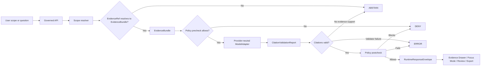

<!-- [KFM_META_BLOCK_V2]
doc_id: kfm://doc/NEEDS-VERIFICATION
title: ADR-0310: Governed AI Runtime Envelope
type: standard
version: v1
status: draft
owners: NEEDS-VERIFICATION
created: 2026-04-27
updated: 2026-05-02
policy_label: NEEDS-VERIFICATION
related: [kfm://doc/NEEDS-VERIFICATION/adr-index, kfm://doc/NEEDS-VERIFICATION/schema-home, kfm://schema/NEEDS-VERIFICATION/runtime-response-envelope]
tags: [kfm, adr, governed-ai, runtime-envelope, evidencebundle, focus-mode, citation-validation, policy]
notes: [Revision of attached Markdown. Current workspace exposes uploaded documents and this Markdown, not a mounted KFM repository. Owners, final ADR number, policy label, schema home, route names, workflow gates, enforcement wiring, and related repo links remain NEEDS VERIFICATION.]
[/KFM_META_BLOCK_V2] -->

<a id="top"></a>

# ADR-0310: Governed AI Runtime Envelope

Define the finite, evidence-bound response envelope for KFM AI-assisted runtime surfaces.

> [!IMPORTANT]
> **Status:** `draft`  
> **Decision posture:** `PROPOSED` until the ADR index, schema home, API routes, policy engine, tests, and workflow gates are verified in the mounted repository.  
> **Proposed target path:** `docs/adr/ADR-0207-governed-ai-runtime-envelope.md`  
> **Owner:** `NEEDS-VERIFICATION`  
> **Policy label:** `NEEDS-VERIFICATION`  
> **Primary contract family:** `RuntimeResponseEnvelope`  
> **Truth posture:** `CONFIRMED doctrine` / `PROPOSED implementation` / `UNKNOWN repo implementation depth`
>
> 
> 
> 
> 
> 

**Quick jump:** [Decision](#decision) · [Context](#context) · [Evidence boundary](#evidence-boundary) · [Runtime law](#runtime-law) · [Envelope contract](#envelope-contract) · [Validation](#validation) · [Consequences](#consequences) · [Rollback](#rollback-and-supersession) · [Verification backlog](#verification-backlog)

---

## Decision

**PROPOSED:** KFM will require every consequential AI-assisted runtime response to be emitted through a common `RuntimeResponseEnvelope`.

The envelope is the governed boundary between:

- user-facing surfaces such as **Focus Mode**, Evidence Drawer assistance, map-derived question answering, story/export previews, review summaries, and diagnostics;
- backend evidence resolution, policy checks, release state, review state, correction lineage, citation validation, and receipt emission;
- provider-neutral model adapters such as `MockAdapter`, `NullAdapter`, `OllamaAdapter`, `OpenAICompatibleAdapter`, or future private model providers.

The envelope has exactly four public runtime outcomes.

| Outcome | Meaning | Runtime obligation |
|---|---|---|
| `ANSWER` | Released, policy-safe evidence is sufficient and citation validation passes. | Return bounded answer content, citations, EvidenceBundle refs, policy state, release/review/correction state, and receipt refs. |
| `ABSTAIN` | Evidence is missing, unresolved, stale, conflicting, insufficient, outside scope, or source-role-inadequate. | Return no unsupported answer; provide safe reason codes, narrowing guidance, and evidence/policy state. |
| `DENY` | Policy, rights, sensitivity, access control, steward-only scope, safety, or release state blocks the response. | Return no restricted content; provide safe reason codes and obligations without leaking protected details. |
| `ERROR` | Resolver, adapter, validator, policy engine, schema validation, or envelope assembly failed. | Return no substitute model prose; include safe error metadata and receipt/audit refs where available. |

This ADR does **not** choose a model provider, make Ollama canonical, define final route names, settle schema-home authority, or claim that implementation already exists.

### Non-goals

This ADR does not authorize:

- direct browser-to-model traffic;
- model access to `RAW`, `WORK`, `QUARANTINE`, or unpublished candidate data as a normal public path;
- generated text as publication approval;
- model-selected citations as citation truth;
- provider-specific payloads as KFM’s stable public contract;
- persistence of private chain-of-thought as a KFM truth object.

[Back to top](#top)

---

## Context

KFM’s durable public value is the **inspectable claim**: a public or semi-public statement whose evidence, source role, spatial and temporal scope, policy posture, review state, release state, and correction lineage can be inspected.

A model-generated paragraph is not an inspectable claim by itself.

Without a governed runtime envelope, KFM risks allowing:

- fluent answers that cannot be reconstructed to EvidenceBundles;
- direct browser-to-model calls that bypass policy;
- vector/search/summary layers being mistaken for truth;
- `ABSTAIN`, `DENY`, and `ERROR` states being hidden as generic UI failures;
- citations that point to unresolved, unreleased, stale, or policy-blocked evidence;
- provider-specific response shapes leaking into KFM’s public contract;
- AI involvement disappearing from receipts, audits, and rollback analysis.

> [!NOTE]
> AI is an interpretive layer. It can help summarize, compare, explain, draft, and narrow. It cannot become the root truth source, publication authority, policy authority, citation authority, or review authority.

---

## Evidence boundary

| Source | Status | Supports | Limits |
|---|---|---|---|
| Attached Markdown: `Pasted markdown.md` | `CONFIRMED` source being revised | Existing ADR structure, core decision, finite outcomes, envelope field family, validation/rollback intent. | Does not prove repo implementation, owner, ADR numbering, schema home, route names, or tests. |
| Current workspace scan | `CONFIRMED` | `/mnt/data` is not a mounted Git repository in this session; uploaded PDFs and the attached Markdown are visible. | Does not prove the public or private KFM repository lacks these files elsewhere. |
| KFM Governed AI source-ledger architecture reports | `LINEAGE / CONFIRMED doctrine / PROPOSED implementation` | Evidence-first AI posture, `MockAdapter` first slice, citation validation, policy pre/postcheck, finite outcomes, receipts. | Prior scaffold or PDF reports do not prove current mounted repo implementation. |
| KFM Pipeline Living Implementation Manual v0.3 | `CONFIRMED doctrine / PROPOSED implementation` | Canonical lifecycle law, finite runtime envelope fields, Evidence Drawer and Focus Mode trust behavior, AI subordination. | Current route names, schema files, and workflow gates remain unverified here. |
| KFM MapLibre Operating Architecture manual | `CONFIRMED doctrine / PROPOSED implementation` | MapLibre as downstream renderer, Evidence Drawer/Focus Mode trust surfaces, no direct raw/model access. | Does not prove UI component paths or runtime code in this session. |
| KFM Implementation Reference | `LINEAGE / NEEDS VERIFICATION` | Reports a public repo with meaningful implementation surfaces and unresolved schema-home questions. | Not direct mounted-repo evidence in this session; must be rechecked before treating as current implementation. |

### Current-state posture

| Area | Status | Treatment in this ADR |
|---|---:|---|
| KFM doctrine | `CONFIRMED` from attached project corpus | Used as governing architecture. |
| Mounted repo tree | `UNKNOWN` in this session | No current implementation, path, route, test, workflow, or schema presence is claimed. |
| Target file path | `INFERRED` from attached Markdown | Proposed path is preserved for continuity until the real ADR index is inspected. |
| ADR number | `NEEDS VERIFICATION` | Preserve `ADR-0310` from the attached Markdown; reconcile against the real ADR index before publish. |
| Owners | `NEEDS VERIFICATION` | Confirm from `CODEOWNERS`, steward records, or repo governance. |
| Policy label | `NEEDS VERIFICATION` | Confirm from documentation policy registry or repo convention. |
| Schema home | `NEEDS VERIFICATION / possibly CONFLICTED` | Do not create parallel authority between `contracts/`, `schemas/`, and `schemas/contracts/v1/`; resolve through an ADR or existing repo convention. |

### Numbering note

**NEEDS VERIFICATION:** The attached Markdown records possible ADR-number ambiguity for the governed-AI runtime-envelope decision. This revision preserves the requested `ADR-0310` title and filename as continuity, but publication must inspect the real `docs/adr/` index before renumbering, overwriting, or cross-linking adjacent ADRs.

[Back to top](#top)

---

## Runtime law

The governed AI runtime envelope is controlled by these rules.

### 1. Evidence resolves before model mediation

A runtime answer must not be generated unless admissible released evidence has already been resolved or the request safely terminates as `ABSTAIN`, `DENY`, or `ERROR` before model invocation.



### 2. Policy gates both sides of generation

The runtime must apply policy before and after model mediation.

| Gate | Must check |
|---|---|
| Precheck | Scope, user role, release state, rights, sensitivity, source role, freshness, evidence admissibility, and whether model mediation is allowed. |
| Postcheck | Unsupported claims, restricted content, stale assertions, policy-denied details, citation failures, and output-shape validity. |

If policy cannot run, the response must fail closed as `DENY` or `ERROR`, depending on the failure classification.

### 3. Citation validation is mandatory for `ANSWER`

`ANSWER` is not valid unless every consequential claim in the response is traceable to resolved evidence references or safely classified as non-claim explanatory text.

| Condition | Required outcome |
|---|---|
| Unsupported claim | Remove/transform only with explicit validation record, or return `ABSTAIN`. |
| Policy-blocked claim | `DENY`. |
| Citation validator failure | `ERROR` when system failure; `ABSTAIN` when evidence support is insufficient. |
| Citation to unresolved or unavailable evidence | `ABSTAIN` or `ERROR`, never `ANSWER`. |

### 4. The browser never calls the model

Public and ordinary UI clients must not call:

- Ollama directly;
- OpenAI-compatible APIs directly;
- local model runtimes directly;
- vector stores directly;
- graph internals directly;
- canonical/internal stores directly;
- `RAW`, `WORK`, or `QUARANTINE` lifecycle stores directly.

The normal public path is:

```text
UI -> governed API -> scope resolver -> evidence resolver -> policy checks -> model adapter -> citation validation -> RuntimeResponseEnvelope
```

### 5. The adapter receives bounded context only

A model adapter may receive only:

- released EvidenceBundle excerpts;
- public-safe summaries;
- scope instructions;
- allowed citation targets;
- policy-safe system instructions;
- runtime formatting requirements.

It must not receive unrestricted canonical data, unpublished candidate data, hidden policy state, secrets, or sensitive exact locations unless a separate steward-approved internal workflow explicitly authorizes that access.

### 6. Receipts are process memory, not proof of truth

`RunReceipt`, `AIReceipt`, or equivalent process memory may record:

- adapter family;
- model identifier or mock adapter identifier;
- prompt template hash;
- input EvidenceBundle refs;
- policy decision refs;
- citation validation report ref;
- output hash;
- outcome;
- request/audit refs;
- timing and version metadata.

Receipts must not be confused with EvidenceBundles, ProofPacks, ReleaseManifests, or publication approval.

### 7. No chain-of-thought persistence

KFM should record **what was decided, what evidence was used, what policy allowed, and what was emitted**, not private reasoning traces.

Do not store chain-of-thought as a KFM truth object, audit object, evidence object, or publication object.

[Back to top](#top)

---

## Envelope contract

### Contract intent

**Proposed schema home:** `schemas/contracts/v1/runtime/runtime_response_envelope.schema.json`  
**Status:** `NEEDS VERIFICATION` until the schema-home ADR and actual repo tree are inspected.

| Field | Required | Purpose |
|---|---:|---|
| `request_id` | yes | Stable request/audit join key. |
| `schema_version` | yes | Envelope schema version. |
| `outcome` | yes | One of `ANSWER`, `ABSTAIN`, `DENY`, `ERROR`. |
| `reason_code` | conditional | Machine-readable reason for `ABSTAIN`, `DENY`, or `ERROR`; optional for `ANSWER`. |
| `scope` | yes | Echoes the bounded question, map/time selection, claim, dossier, export, review, or diagnostic scope. |
| `answer` | conditional | Present only for `ANSWER`; absent or null for `ABSTAIN`, `DENY`, and most `ERROR` outcomes. |
| `claims` | recommended | Claim objects or claim refs when the answer contains claim-bearing text. |
| `evidence_bundle_refs` | yes | Resolved support packages used or attempted. Empty only when safe reason codes explain why none could resolve. |
| `citation_state` | yes | Citation validation result, unresolved refs, unsupported claims, invalid citations, or not-run reason. |
| `policy_state` | yes | Policy outcome summary, reason codes, obligations, and decision refs. |
| `release_state` | yes | Release/publication basis, lifecycle state, supersession, withdrawal, or stale-state signal. |
| `review_state` | yes | Human/steward review status when relevant. |
| `freshness_state` | yes | Valid time, observed time, publication time, and stale/unknown freshness classification. |
| `correction_state` | yes | Correction, rollback, supersession, or withdrawal status. |
| `model_state` | conditional | Adapter family and model metadata when model mediation occurred; `not_called` when outcome was resolved before model call. |
| `receipt_refs` | yes | Audit, runtime, AI, validation, or policy receipt refs where emitted. |
| `errors` | conditional | Safe system or validator failures for `ERROR`. |
| `limitations` | recommended | Human-readable limits that do not weaken policy or evidence requirements. |
| `obligations` | recommended | Required follow-up actions, such as source review, steward approval, narrowed scope, or evidence resolution. |

### TypeScript sketch

Illustrative only. The authoritative shape must be expressed through the repo’s verified schema system.

```ts
export type RuntimeOutcome = "ANSWER" | "ABSTAIN" | "DENY" | "ERROR";

export type CitationValidationStatus = "PASS" | "HOLD" | "DENY" | "ERROR" | "NOT_RUN";
export type PolicyOutcome = "ALLOW" | "ABSTAIN" | "DENY" | "ERROR";

export interface RuntimeResponseEnvelopeV1<TAnswer = unknown> {
  request_id: string;
  schema_version: "1.0.0";
  outcome: RuntimeOutcome;
  reason_code?: string;

  scope: {
    request_kind: "focus" | "drawer" | "claim" | "story" | "export" | "review" | "diagnostic";
    question?: string;
    spatial_scope?: unknown;
    temporal_scope?: unknown;
    release_ref?: string;
    claim_refs?: string[];
    layer_refs?: string[];
  };

  answer?: TAnswer | null;

  claims?: Array<{
    claim_id?: string;
    text: string;
    citation_refs: string[];
    evidence_bundle_refs: string[];
  }>;

  evidence_bundle_refs: string[];

  citation_state: {
    status: CitationValidationStatus;
    citation_validation_ref?: string;
    unresolved_evidence_refs?: string[];
    unsupported_claims?: string[];
    invalid_citations?: string[];
    not_run_reason?: string;
  };

  policy_state: {
    outcome: PolicyOutcome;
    decision_ref?: string;
    reason_codes: string[];
    obligations: string[];
  };

  release_state: {
    release_ref?: string;
    state: "draft" | "work" | "processed" | "promotion_candidate" | "published" | "superseded" | "withdrawn" | "unknown";
    supersedes_release_ref?: string;
  };

  review_state: {
    status: "approved" | "not_required" | "pending" | "rejected" | "unknown";
    review_refs: string[];
  };

  freshness_state: {
    valid_time?: string;
    observed_time?: string;
    published_at?: string;
    freshness: "current" | "stale" | "unknown" | "not_applicable";
  };

  correction_state: {
    status: "none" | "corrected" | "superseded" | "withdrawn" | "unknown";
    correction_refs: string[];
    rollback_refs?: string[];
  };

  model_state: {
    adapter: "MockAdapter" | "NullAdapter" | "OllamaAdapter" | "OpenAICompatibleAdapter" | "Other" | "not_called";
    model_id?: string;
    prompt_template_hash?: string;
    output_hash?: string;
    not_called_reason?: string;
  };

  receipt_refs: {
    audit_ref?: string;
    runtime_receipt_ref?: string;
    ai_receipt_ref?: string;
    policy_decision_ref?: string;
    validation_report_ref?: string;
  };

  errors?: Array<{
    code: string;
    message: string;
    safe_to_display: boolean;
  }>;

  limitations?: string[];
  obligations?: string[];
}
```

### Minimal `ABSTAIN` example

```json
{
  "request_id": "kfm-runtime-req-001",
  "schema_version": "1.0.0",
  "outcome": "ABSTAIN",
  "reason_code": "EVIDENCE_BUNDLE_UNRESOLVED",
  "scope": {
    "request_kind": "focus",
    "question": "What does this layer prove?"
  },
  "answer": null,
  "evidence_bundle_refs": [],
  "citation_state": {
    "status": "NOT_RUN",
    "unresolved_evidence_refs": ["kfm://evidence/ref/example"],
    "not_run_reason": "Evidence did not resolve before model mediation."
  },
  "policy_state": {
    "outcome": "ABSTAIN",
    "reason_codes": ["EVIDENCE_BUNDLE_UNRESOLVED"],
    "obligations": ["RESOLVE_EVIDENCE_BUNDLE_BEFORE_MODEL_CALL"]
  },
  "release_state": {
    "state": "unknown"
  },
  "review_state": {
    "status": "unknown",
    "review_refs": []
  },
  "freshness_state": {
    "freshness": "unknown"
  },
  "correction_state": {
    "status": "unknown",
    "correction_refs": []
  },
  "model_state": {
    "adapter": "not_called",
    "not_called_reason": "EvidenceBundle unresolved."
  },
  "receipt_refs": {
    "audit_ref": "kfm://audit/runtime/example"
  },
  "limitations": [
    "No model call was made because evidence did not resolve."
  ],
  "obligations": [
    "Resolve EvidenceRef to EvidenceBundle."
  ]
}
```

[Back to top](#top)

---

## Inputs and exclusions

### Accepted inputs

A governed AI runtime request may accept only inputs that can be reduced to a bounded scope.

| Input class | Accepted when |
|---|---|
| User question | It is attached to a map, claim, dossier, story, export, review, diagnostic, or other governed scope. |
| Evidence refs | They resolve server-side to EvidenceBundles. |
| Layer or feature context | It comes from released public-safe layer descriptors or governed feature envelopes. |
| Time context | It has explicit valid/observed/publication semantics or is marked unknown. |
| Review context | It is safe for the caller’s role and policy state. |
| Export/story context | It is release-scoped and citation-aware. |

### Exclusions

The runtime envelope must reject or avoid:

- raw model responses as public API payloads;
- direct client model calls;
- unresolved EvidenceRefs used as proof;
- unpublished `RAW`, `WORK`, or `QUARANTINE` data;
- hidden browser-side source ranking or citation generation;
- provider-specific response formats as the stable public contract;
- unrestricted canonical store excerpts;
- chain-of-thought as a persisted truth object;
- policy-denied material rendered through “helpful” model language.

[Back to top](#top)

---

## Provider and adapter posture

### Decision

KFM should define the `ModelAdapter` contract before selecting or optimizing a provider.

| Adapter | Use |
|---|---|
| `MockAdapter` | First implementation target for deterministic tests and golden fixtures. |
| `NullAdapter` | Explicit no-model path for policy denial, maintenance mode, or model-unavailable conditions. |
| `OllamaAdapter` | Local/private runtime option after security, host exposure, auth, model pinning, structured-output validation, and audit posture are verified. |
| `OpenAICompatibleAdapter` | Optional provider-compatible runtime path after contract tests, privacy posture, egress controls, and provider terms are verified. |
| Future adapters | Allowed only if they preserve the same envelope, policy, citation, receipt, and audit requirements. |

### Provider neutrality rule

Provider details may affect `model_state`, receipts, observability, latency, operational runbooks, and adapter-specific health checks.

They must not affect:

- outcome grammar;
- evidence requirements;
- policy requirements;
- citation validation;
- public envelope shape;
- rights/sensitivity behavior;
- rollback/correction semantics.

[Back to top](#top)

---

## Alternatives considered

| Alternative | Decision | Reason |
|---|---:|---|
| Return raw model text from Focus Mode | Rejected | Bypasses inspectability, citation validation, and policy state. |
| Browser calls Ollama or another model directly | Rejected | Breaks the trust membrane and makes audit/policy enforcement unreliable. |
| One envelope per provider | Rejected | Lets vendor behavior leak into KFM’s public contract. |
| `ANSWER` plus free-form error strings only | Rejected | Hides `ABSTAIN`, `DENY`, and `ERROR` as UI accidents instead of trust-visible states. |
| Let the model choose citations | Rejected | Citations must be validated against resolved EvidenceBundles. |
| Let map popups create claims client-side | Rejected | Feature selection is candidate context; claim resolution belongs behind governed APIs. |
| Store chain-of-thought for audit | Rejected | Receipts should record verifiable inputs, outputs, hashes, refs, and decisions, not private reasoning traces. |
| Skip `MockAdapter` and start with live model integration | Rejected for first slice | Deterministic contract tests should come before provider behavior. |

---

## Implementation impact

All paths are **PROPOSED / NEEDS VERIFICATION** until the real repo is mounted and inspected.

| Surface | Proposed file or family | Status |
|---|---|---:|
| ADR | `docs/adr/ADR-0207-governed-ai-runtime-envelope.md` | this file, proposed path |
| ADR index | `docs/adr/README.md` or repo-native ADR index | `NEEDS VERIFICATION` |
| Runtime schema | `schemas/contracts/v1/runtime/runtime_response_envelope.schema.json` | `NEEDS VERIFICATION` |
| Runtime examples | `schemas/contracts/v1/runtime/examples/*.json` | `PROPOSED` |
| Evidence contracts | `schemas/contracts/v1/evidence/evidence_bundle.schema.json` | `NEEDS VERIFICATION` |
| Policy contracts | `schemas/contracts/v1/policy/policy_decision.schema.json` | `PROPOSED` |
| Citation validation | `schemas/contracts/v1/runtime/citation_validation_report.schema.json` | `PROPOSED` |
| API contract | `contracts/api/openapi.v1.yaml` or repo-native equivalent | `NEEDS VERIFICATION` |
| Runtime adapter | `apps/governed_api/runtime/model_adapter.*` or repo-native equivalent | `PROPOSED` |
| Mock adapter | `apps/governed_api/runtime/mock_adapter.*` or repo-native equivalent | `PROPOSED` |
| Null adapter | `apps/governed_api/runtime/null_adapter.*` or repo-native equivalent | `PROPOSED` |
| Focus route | Route home `NEEDS VERIFICATION` | `PROPOSED` |
| Contract tests | `tests/contracts/test_runtime_response_envelope_schema.*` | `PROPOSED` |
| E2E runtime proof | `tests/e2e/runtime_proof/` | `PROPOSED` |
| Policy tests | `tests/policy/` or repo-native equivalent | `PROPOSED` |
| Receipts | `data/receipts/runtime/` | `PROPOSED` |
| Proof linkage | `data/proofs/` / `ProofPack` family | `PROPOSED` |
| UI states | Focus Mode and Evidence Drawer rendering of all finite outcomes | `PROPOSED` |

### Smallest safe implementation sequence

1. Verify repo topology, ADR index, schema home, package manager, and test runner.
2. Land or update this ADR with owner, policy label, related links, and numbering reconciled.
3. Add `RuntimeResponseEnvelope` schema and valid/invalid fixtures.
4. Add `CitationValidationReport`, `PolicyDecision`, `AIReceipt`, and `RunReceipt` fixture shapes if absent.
5. Add `MockAdapter` and `NullAdapter` behind a provider-neutral `ModelAdapter` contract.
6. Add no-network runtime proof tests for `ANSWER`, `ABSTAIN`, `DENY`, and `ERROR`.
7. Add static or integration checks proving no direct browser-to-model runtime calls.
8. Bind Focus Mode and Evidence Drawer only after backend envelope behavior is passing.
9. Keep real Ollama/OpenAI-compatible adapters disabled until contracts, policy, citation validation, and receipts pass in CI.

[Back to top](#top)

---

## Validation

The first acceptable implementation slice must prove the envelope before live provider use.

### Contract tests

Required cases:

- valid `ANSWER` with citations and EvidenceBundle refs;
- valid `ABSTAIN` for missing evidence;
- valid `DENY` for policy block;
- valid `ERROR` for adapter, validator, resolver, or policy-engine failure;
- invalid outcome enum fails;
- `ANSWER` without citation state fails;
- `ANSWER` with unsupported claim fails or is transformed into a recorded `ABSTAIN`;
- response with `RAW`, `WORK`, or `QUARANTINE` refs fails for public/ordinary runtime;
- missing `policy_state` fails;
- missing `release_state` fails;
- unknown schema version fails unless explicitly allowed by compatibility policy.

### Runtime proof tests

| Test | Setup | Expected result |
|---|---|---|
| Missing EvidenceBundle | Request includes unresolved EvidenceRef. | `ABSTAIN`; model adapter not called. |
| Policy deny | Request asks for restricted, sensitive, rights-unclear, or unreleased material. | `DENY`; model adapter not called unless a separate authorized internal path is proven. |
| Citation failure | Model output includes unsupported claim. | `ABSTAIN`, recorded transform, or `ERROR` based on validator classification; never unrecorded fluent answer. |
| Happy path | Released evidence resolves, policy allows, citations validate. | `ANSWER` with EvidenceBundle refs, policy refs, citation report refs, and receipt refs. |
| Adapter failure | Model adapter times out or returns invalid structure. | `ERROR`; no substitute answer. |
| No direct model client | UI/static checks inspect public client imports and calls. | No public UI imports/calls model runtimes or provider clients directly. |
| No raw public path | API tests inspect runtime payloads. | No public/ordinary runtime response exposes raw/work/quarantine references or internal store paths. |

### Documentation checks

Before publication, verify:

- this ADR is listed in the ADR index;
- ADR numbering conflict is resolved or explicitly cross-linked;
- owner and policy label are populated;
- related paths resolve or are marked as proposed in a register;
- schema-home decision is referenced;
- tests and runbooks link back to this ADR;
- rollback behavior is documented in the runtime runbook.

[Back to top](#top)

---

## Consequences

### Positive consequences

- Keeps KFM AI subordinate to evidence, policy, review, release, and correction state.
- Makes `ABSTAIN` and `DENY` visible trust outcomes instead of product failures.
- Allows provider substitution without changing public contracts.
- Makes citation validation, policy decisions, and evidence resolution testable.
- Supports deterministic early implementation through `MockAdapter`.
- Gives UI surfaces a stable contract for Focus Mode, Evidence Drawer assistance, review summaries, and export/story previews.
- Preserves correction and rollback analysis through receipt and audit refs.

### Costs and tradeoffs

- Adds schema, fixture, validator, and policy work before model integration.
- Requires backend mediation for all AI-assisted runtime calls.
- Requires negative-path UX design, not just happy-path answer rendering.
- Makes some user questions produce `ABSTAIN` or `DENY` even when a model could generate plausible prose.
- Requires citation validation and model-output validation machinery before public trust claims are made.

### Risks if skipped

- Public surfaces may present unsupported generated claims.
- Model provider behavior may become de facto product law.
- Sensitive or unreleased material may leak through helpful summaries.
- Correction and rollback may be unable to reconstruct what the model saw.
- KFM may confuse search/vector/summary artifacts with canonical or released truth.

---

## Rollback and supersession

This ADR can be rolled back or superseded without data migration if it remains documentation-only.

If implementation has landed:

1. Disable model adapters through runtime configuration or feature flag.
2. Fall back to `MockAdapter` or `NullAdapter`.
3. Preserve emitted `RuntimeResponseEnvelope` examples as lineage.
4. Revert or supersede schema versions through the schema registry.
5. Preserve receipts and proof refs; do not delete historical runtime audit records.
6. Update the ADR index and affected runbooks.
7. Re-run negative-path tests before re-enabling any replacement runtime contract.

Supersession must state whether the replacement preserves the four finite outcomes. If it does not, the replacement must explain how KFM still preserves cite-or-abstain, deny-by-policy, system-error visibility, evidence resolution, citation validation, and auditability.

[Back to top](#top)

---

## Verification backlog

| Item | Label | Needed proof |
|---|---:|---|
| Confirm ADR number and filename | `NEEDS VERIFICATION` | Mounted `docs/adr/` index and existing ADR list. |
| Confirm owner | `NEEDS VERIFICATION` | `CODEOWNERS`, governance record, or steward assignment. |
| Confirm policy label | `NEEDS VERIFICATION` | Documentation policy registry or repo convention. |
| Confirm schema home | `NEEDS VERIFICATION` | Accepted schema-home ADR and visible schema tree. |
| Confirm runtime route family | `NEEDS VERIFICATION` | Mounted API route inventory and OpenAPI contract. |
| Confirm EvidenceBundle schema | `NEEDS VERIFICATION` | Visible shared schema or accepted object-family ADR. |
| Confirm policy engine | `NEEDS VERIFICATION` | OPA/Rego, Python, or repo-native policy bundle and tests. |
| Confirm citation validator | `NEEDS VERIFICATION` | Contract, tests, and emitted validation reports. |
| Confirm no-direct-model-client rule | `NEEDS VERIFICATION` | Static check, UI test, or dependency boundary test. |
| Confirm local/private runtime exposure controls | `NEEDS VERIFICATION` | Auth, firewall/reverse proxy/VPN, logging, and deployment evidence. |
| Confirm AIReceipt shape | `NEEDS VERIFICATION` | Receipt schema, example, and retention policy. |
| Confirm Focus Mode UI states | `NEEDS VERIFICATION` | Rendered `ANSWER`, `ABSTAIN`, `DENY`, and `ERROR` states. |
| Confirm Implementation Reference claims | `NEEDS VERIFICATION` | Fresh mounted repo or connector inspection; do not rely on prior report alone. |

---

## Review checklist

- [ ] ADR number reconciled with the ADR index.
- [ ] Owner populated from verified project governance.
- [ ] Policy label populated from verified documentation policy.
- [ ] Related paths replaced with verified relative links.
- [ ] Schema-home decision linked.
- [ ] `RuntimeResponseEnvelope` schema exists or is explicitly scheduled.
- [ ] Valid and invalid envelope fixtures exist.
- [ ] `MockAdapter` fixture tests pass.
- [ ] Missing evidence produces `ABSTAIN`.
- [ ] Policy block produces `DENY`.
- [ ] Adapter/validator failure produces `ERROR`.
- [ ] Happy path produces `ANSWER` with citation validation.
- [ ] Browser cannot call model runtime directly.
- [ ] Runtime cannot read `RAW`, `WORK`, or `QUARANTINE` directly.
- [ ] AIReceipt or runtime receipt records hashes and refs without storing chain-of-thought.
- [ ] Documentation and runbooks updated with rollback behavior.

[Back to top](#top)
