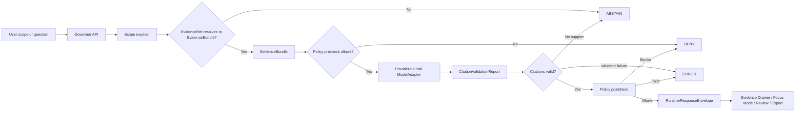

<!-- [KFM_META_BLOCK_V2]
doc_id: kfm://doc/NEEDS-VERIFICATION-ADR-0207
title: ADR-0207: Governed AI Runtime Envelope
type: standard
version: v1
status: draft
owners: OWNER_TBD_NEEDS_VERIFICATION
created: 2026-04-27
updated: 2026-05-06
policy_label: NEEDS-VERIFICATION
related: [./README.md, ./ADR-0001-schema-home.md, ../../contracts/runtime/README.md, ../../schemas/README.md, ../../schemas/contracts/v1/shared/runtime_response_envelope.schema.json, ../../schemas/contracts/v1/runtime/runtime_response_envelope.schema.json, ../../policy/crosswalk/runtime-outcome-map.md, ../../apps/api/routes/README.md, ../../tests/test_shared_finite_outcomes.py]
tags: [kfm, adr, governed-ai, runtime-envelope, runtime-response-envelope, evidencebundle, focus-mode, citation-validation, policy, ai-receipt, trust-membrane]
notes: [Target path verified through accessible GitHub repository. Existing draft metadata previously used ADR-0310 while the repo path and ADR index use ADR-0207; this revision aligns visible title and metadata to ADR-0207. Owners and policy label remain NEEDS VERIFICATION because inspected CODEOWNERS content did not assign ownership. Decision remains draft/proposed until schema drift, route wiring, citation validation, policy enforcement, receipts, and runtime-proof tests are verified.]
[/KFM_META_BLOCK_V2] -->

<a id="top"></a>

# ADR-0207: Governed AI Runtime Envelope

Define the finite, evidence-bound response envelope for KFM AI-assisted runtime surfaces.

<div align="left">


</div>

> [!IMPORTANT]
> **Status:** `draft`  
> **Decision posture:** `PROPOSED` until the active repository proves schema alignment, citation validation, policy gates, route wiring, receipt emission, runtime fixtures, and CI behavior.  
> **Target path:** `docs/adr/ADR-0207-governed-ai-runtime-envelope.md`  
> **Primary contract family:** `RuntimeResponseEnvelope`  
> **Truth posture:** `CONFIRMED repo/docctrine evidence` · `PROPOSED implementation contract` · `NEEDS VERIFICATION enforcement`

**Quick jumps:** [Decision](#decision) · [Why this exists](#why-this-exists) · [Evidence boundary](#evidence-boundary) · [Runtime law](#runtime-law) · [Envelope contract](#envelope-contract) · [Schema drift watch](#schema-drift-watch) · [Implementation impact](#implementation-impact) · [Validation](#validation) · [Consequences](#consequences) · [Rollback](#rollback-and-supersession) · [Open verification](#open-verification)

---

## Decision

**PROPOSED:** KFM will require every consequential AI-assisted runtime response to be emitted through a governed `RuntimeResponseEnvelope`.

The envelope is the trust membrane between:

- **user-facing surfaces** such as Focus Mode, Evidence Drawer assistance, map-derived question answering, export previews, story previews, review summaries, and diagnostics;
- **governed backend seams** such as scope resolution, EvidenceRef → EvidenceBundle resolution, policy precheck/postcheck, release state, review state, freshness, correction lineage, citation validation, and receipt emission;
- **provider-neutral model adapters** such as `MockAdapter`, `NullAdapter`, `OllamaAdapter`, `OpenAICompatibleAdapter`, or future private providers.

The envelope has exactly four public runtime outcomes.

| Outcome | Meaning | Runtime obligation |
|---|---|---|
| `ANSWER` | Released, policy-safe evidence is sufficient and citation validation passes. | Return bounded answer content, citations, EvidenceBundle refs, policy state, release/review/correction state, freshness state, and receipt refs. |
| `ABSTAIN` | Evidence is missing, unresolved, stale, conflicting, insufficient, source-role-inadequate, or outside scope. | Return no unsupported answer; provide safe reason codes, narrowing guidance, and evidence/policy state. |
| `DENY` | Policy, rights, sensitivity, access control, steward-only scope, embargo, or release state blocks the response. | Return no restricted content; provide safe reason codes and obligations without leaking protected detail. |
| `ERROR` | Resolver, adapter, validator, policy engine, schema validation, manifest integrity, or envelope assembly failed. | Return no substitute model prose; include safe error metadata and audit/receipt refs where available. |

This ADR does **not** choose a model provider, make Ollama canonical, define final route names, settle all schema-home ambiguity, or claim that runtime implementation is complete.

### Non-goals

This ADR does not authorize:

- direct browser-to-model traffic;
- model access to `RAW`, `WORK`, `QUARANTINE`, canonical/internal stores, or unpublished candidate data as a normal public path;
- generated text as publication approval;
- model-selected citations as citation truth;
- provider-specific payloads as KFM’s stable public contract;
- persistence of private chain-of-thought as a KFM truth object;
- a hidden fifth runtime outcome such as `HOLD` unless a successor runtime ADR explicitly adds it.

[Back to top](#top)

---

## Why this exists

KFM’s durable public value is the **inspectable claim**: a public or semi-public statement whose evidence, source role, spatial and temporal scope, policy posture, review state, release state, freshness, and correction lineage can be inspected.

A model-generated paragraph is not an inspectable claim by itself.

Without a governed runtime envelope, KFM risks allowing:

- fluent answers that cannot be reconstructed to EvidenceBundles;
- direct browser-to-model calls that bypass policy;
- vector, search, summary, tile, graph, or renderer outputs being mistaken for truth;
- `ABSTAIN`, `DENY`, and `ERROR` states being hidden as generic UI failures;
- citations that point to unresolved, unreleased, stale, or policy-blocked evidence;
- provider-specific response shapes leaking into KFM’s public contract;
- AI participation disappearing from receipts, audits, and rollback analysis.

> [!NOTE]
> AI is an interpretive layer. It may summarize, compare, explain uncertainty, draft, narrow, and route users back to evidence. It must not become the root truth source, publication authority, policy authority, citation authority, review authority, or release authority.

[Back to top](#top)

---

## Evidence boundary

This ADR is grounded in current accessible repository evidence plus KFM governing doctrine. It still leaves implementation enforcement explicitly bounded.

| Evidence item | Status | Supports | Does not prove |
|---|---:|---|---|
| `docs/adr/ADR-0207-governed-ai-runtime-envelope.md` | `CONFIRMED path` | The target file exists in the accessible repository. | That its prior metadata/title were correct or that implementation is complete. |
| `docs/adr/README.md` | `CONFIRMED index` | The ADR index lists `ADR-0207-governed-ai-runtime-envelope.md` as the governed AI runtime envelope ADR. | Complete ADR inventory, owner routing, or acceptance status. |
| `contracts/runtime/README.md` | `CONFIRMED adjacent contract lane` | Runtime contracts are documented as finite, evidence-bound outward responses and receipts. | That all companion files or emitted receipts exist. |
| `schemas/README.md` | `CONFIRMED schema parent lane` | Schema-home authority is visible and unresolved; `schemas/contracts/v1/` is an active machine-schema lane. | Final accepted schema-home law or complete schema maturity. |
| `schemas/contracts/v1/shared/runtime_response_envelope.schema.json` | `CONFIRMED minimal schema` | A shared runtime response schema exists with finite `ANSWER` / `ABSTAIN` / `DENY` / `ERROR` outcome values. | Full ADR-required field coverage. |
| `schemas/contracts/v1/runtime/runtime_response_envelope.schema.json` | `CONFIRMED drift watch` | A second runtime envelope schema path exists. | Alignment with the shared finite-outcome schema. |
| `policy/crosswalk/runtime-outcome-map.md` | `CONFIRMED policy crosswalk` | Runtime outcome semantics are documented as finite and fail-closed. | Executable policy enforcement. |
| `apps/api/routes/README.md` | `CONFIRMED route-facing docs` | Route docs require finite outcomes, governed boundaries, and no direct source/model shortcuts. | Active route registration, framework behavior, or passing E2E tests. |
| `tests/test_shared_finite_outcomes.py` | `CONFIRMED test file` | A test asserts finite outcome values for shared runtime/policy/promotion/validation/rollback fixtures. | Full runtime proof, branch-protection enforcement, or actual passing CI. |
| `.github/CODEOWNERS` | `CONFIRMED but empty` | Owner routing is not proven by CODEOWNERS content. | ADR ownership. |

### Current-state posture

| Area | Status | Treatment in this ADR |
|---|---:|---|
| KFM doctrine | `CONFIRMED` from project corpus and adjacent repo docs | Used as governing architecture. |
| Target ADR number | `CONFIRMED path / corrected metadata` | Use `ADR-0207` to match the repo path and ADR index. |
| Owners | `NEEDS VERIFICATION` | Leave owner placeholder until governance or CODEOWNERS assigns review. |
| Policy label | `NEEDS VERIFICATION` | Do not infer public/restricted classification from path. |
| Runtime schema maturity | `PARTIAL / NEEDS VERIFICATION` | Finite outcome set is present; full envelope contract remains proposed. |
| Runtime implementation | `NEEDS VERIFICATION` | Route docs and tests exist, but no runtime behavior is claimed here without execution evidence. |
| Citation validation | `PROPOSED / NEEDS VERIFICATION` | Required by this ADR; implementation proof not claimed. |
| Model adapters | `PROPOSED / NEEDS VERIFICATION` | Adapter family is part of the decision, not proof of provider wiring. |

### Numbering correction

**CONFIRMED drift:** the previously visible draft at this target path used `ADR-0310` in the title/meta block while the file path and ADR index use `ADR-0207`.

**Revision decision:** this file now uses `ADR-0207: Governed AI Runtime Envelope`. Treat this as metadata repair, not as a new architecture decision.

[Back to top](#top)

---

## Runtime law

The governed AI runtime envelope is controlled by seven rules.

### 1. Evidence resolves before model mediation

A runtime answer must not be generated unless admissible released evidence has already been resolved, or the request safely terminates as `ABSTAIN`, `DENY`, or `ERROR` before model invocation.



### 2. Policy gates both sides of generation

| Gate | Must check |
|---|---|
| Precheck | Scope, user role, release state, rights, sensitivity, source role, freshness, evidence admissibility, and whether model mediation is allowed. |
| Postcheck | Unsupported claims, restricted content, stale assertions, policy-denied details, citation failures, and output-shape validity. |

If policy cannot run, the response must fail closed as `DENY` or `ERROR`, depending on failure classification.

### 3. Citation validation is mandatory for `ANSWER`

| Condition | Required outcome |
|---|---|
| Unsupported claim | Remove/transform only with explicit validation record, or return `ABSTAIN`. |
| Policy-blocked claim | `DENY`. |
| Citation validator failure | `ERROR` when a required system failed; `ABSTAIN` when evidence support is insufficient. |
| Citation to unresolved or unavailable evidence | `ABSTAIN` or `ERROR`, never `ANSWER`. |

### 4. The browser never calls the model

Public and ordinary UI clients must not call:

- Ollama directly;
- OpenAI-compatible APIs directly;
- local model runtimes directly;
- vector stores directly;
- graph internals directly;
- canonical/internal stores directly;
- `RAW`, `WORK`, or `QUARANTINE` lifecycle stores directly.

The normal public path is:

```text
UI -> governed API -> scope resolver -> evidence resolver -> policy checks -> model adapter -> citation validation -> RuntimeResponseEnvelope
```

### 5. The adapter receives bounded context only

A model adapter may receive only:

- released EvidenceBundle excerpts;
- public-safe summaries;
- scope instructions;
- allowed citation targets;
- policy-safe system instructions;
- runtime formatting requirements.

It must not receive unrestricted canonical data, unpublished candidate data, hidden policy state, secrets, or sensitive exact locations unless a separate steward-approved internal workflow explicitly authorizes that access.

### 6. Receipts are process memory, not proof of truth

`RunReceipt`, `AIReceipt`, or equivalent process memory may record:

- adapter family;
- model identifier or mock adapter identifier;
- prompt template hash;
- input EvidenceBundle refs;
- policy decision refs;
- citation validation report ref;
- output hash;
- outcome;
- request/audit refs;
- timing and version metadata.

Receipts must not be confused with EvidenceBundles, ProofPacks, ReleaseManifests, PromotionDecisions, or publication approval.

### 7. No chain-of-thought persistence

KFM should record **what was requested, what evidence was used, what policy allowed or blocked, what validator decided, and what was emitted**.

Do not store private chain-of-thought as a KFM truth object, evidence object, audit object, publication object, or receipt object.

[Back to top](#top)

---

## Envelope contract

### Contract intent

The `RuntimeResponseEnvelope` is the public-edge runtime response object for governed AI-assisted surfaces.

**Current schema situation:** see [Schema drift watch](#schema-drift-watch).  
**Proposed enriched schema home after reconciliation:** `schemas/contracts/v1/shared/runtime_response_envelope.schema.json` or a successor path accepted by ADR-0001/schema-home governance.

| Field family | Required | Purpose |
|---|---:|---|
| `id` or `request_id` | yes | Stable request/audit join key. |
| `schema_version` | recommended | Envelope schema version or profile. |
| `outcome` | yes | One of `ANSWER`, `ABSTAIN`, `DENY`, `ERROR`. |
| `reason` / `reason_code` | conditional | Machine-readable reason for `ABSTAIN`, `DENY`, or `ERROR`; optional explanatory reason for `ANSWER`. |
| `scope` | yes | Bounded question, map/time selection, claim, dossier, export, review, or diagnostic scope. |
| `answer` | conditional | Present only for `ANSWER`; absent or null for `ABSTAIN`, `DENY`, and most `ERROR` outcomes. |
| `claims` | recommended | Claim objects or claim refs when answer content contains claim-bearing text. |
| `evidence_bundle_refs` | required for `ANSWER` | Resolved support packages used. Empty only when a negative outcome explains why none resolved. |
| `citation_state` | required for `ANSWER` | Citation validation result, unresolved refs, unsupported claims, invalid citations, or not-run reason. |
| `policy_state` | yes | Policy outcome summary, reason codes, obligations, and decision refs. |
| `release_state` | yes | Release/publication basis, lifecycle state, supersession, withdrawal, or stale-state signal. |
| `review_state` | recommended | Human/steward review status when relevant. |
| `freshness_state` | recommended | Valid time, observed time, publication time, and stale/unknown freshness classification. |
| `correction_state` | recommended | Correction, rollback, supersession, or withdrawal status. |
| `model_state` | conditional | Adapter family and model metadata when model mediation occurred; `not_called` when outcome was resolved before model call. |
| `receipt_refs` | recommended | Audit, runtime, AI, validation, or policy receipt refs where emitted. |
| `errors` | conditional | Safe system or validator failures for `ERROR`. |
| `limitations` | recommended | Human-readable limits that do not weaken policy or evidence requirements. |
| `obligations` | recommended | Required follow-up actions such as source review, steward approval, narrowed scope, evidence resolution, or display requirements. |

### Illustrative TypeScript shape

This sketch is **illustrative**. The authoritative shape must be expressed through the repo’s verified schema system.

```ts
export type RuntimeOutcome = "ANSWER" | "ABSTAIN" | "DENY" | "ERROR";

export type CitationValidationStatus =
  | "PASS"
  | "HOLD"
  | "DENY"
  | "ERROR"
  | "NOT_RUN";

export type PolicyOutcome =
  | "ALLOW"
  | "ABSTAIN"
  | "DENY"
  | "ERROR";

export interface RuntimeResponseEnvelopeV1<TAnswer = unknown> {
  id: string;
  schema_version?: string;
  outcome: RuntimeOutcome;
  reason?: string;
  reason_code?: string;

  scope: {
    request_kind:
      | "focus"
      | "drawer"
      | "claim"
      | "story"
      | "export"
      | "review"
      | "diagnostic";
    question?: string;
    spatial_scope?: unknown;
    temporal_scope?: unknown;
    release_ref?: string;
    claim_refs?: string[];
    layer_refs?: string[];
  };

  answer?: TAnswer | null;

  claims?: Array<{
    claim_id?: string;
    text: string;
    citation_refs: string[];
    evidence_bundle_refs: string[];
  }>;

  evidence_bundle_refs?: string[];

  citation_state?: {
    status: CitationValidationStatus;
    citation_validation_ref?: string;
    unresolved_evidence_refs?: string[];
    unsupported_claims?: string[];
    invalid_citations?: string[];
    not_run_reason?: string;
  };

  policy_state: {
    outcome: PolicyOutcome;
    decision_ref?: string;
    reason_codes: string[];
    obligations: string[];
  };

  trust_state?: {
    release_state?: string;
    review_state?: string;
    freshness_state?: string;
    correction_state?: string;
  };

  model_state?: {
    adapter:
      | "MockAdapter"
      | "NullAdapter"
      | "OllamaAdapter"
      | "OpenAICompatibleAdapter"
      | "Other"
      | "not_called";
    model_id?: string;
    prompt_template_hash?: string;
    output_hash?: string;
    not_called_reason?: string;
  };

  receipt_refs?: {
    audit_ref?: string;
    runtime_receipt_ref?: string;
    ai_receipt_ref?: string;
    policy_decision_ref?: string;
    validation_report_ref?: string;
  };

  errors?: Array<{
    code: string;
    message: string;
    safe_to_display: boolean;
  }>;

  limitations?: string[];
  obligations?: string[];
}
```

### Minimal `ABSTAIN` example

```json
{
  "id": "kfm-runtime-req-001",
  "schema_version": "1.0.0",
  "outcome": "ABSTAIN",
  "reason": "EVIDENCE_BUNDLE_UNRESOLVED",
  "scope": {
    "request_kind": "focus",
    "question": "What does this layer prove?"
  },
  "answer": null,
  "evidence_bundle_refs": [],
  "citation_state": {
    "status": "NOT_RUN",
    "unresolved_evidence_refs": ["kfm://evidence/ref/example"],
    "not_run_reason": "Evidence did not resolve before model mediation."
  },
  "policy_state": {
    "outcome": "ABSTAIN",
    "reason_codes": ["EVIDENCE_BUNDLE_UNRESOLVED"],
    "obligations": ["RESOLVE_EVIDENCE_BUNDLE_BEFORE_MODEL_CALL"]
  },
  "trust_state": {
    "release_state": "unknown",
    "review_state": "unknown",
    "freshness_state": "unknown",
    "correction_state": "unknown"
  },
  "model_state": {
    "adapter": "not_called",
    "not_called_reason": "EvidenceBundle unresolved."
  },
  "receipt_refs": {
    "audit_ref": "kfm://audit/runtime/example"
  },
  "limitations": [
    "No model call was made because evidence did not resolve."
  ],
  "obligations": [
    "Resolve EvidenceRef to EvidenceBundle before retrying."
  ]
}
```

[Back to top](#top)

---

## Schema drift watch

Two visible schema files currently use the `runtime_response_envelope.schema.json` name.

| Path | Current role | Drift risk |
|---|---|---|
| `schemas/contracts/v1/shared/runtime_response_envelope.schema.json` | Contains a minimal `RuntimeResponseEnvelope` title and finite `outcome` enum. | Good finite-outcome anchor, but too thin for this ADR’s full envelope burden. |
| `schemas/contracts/v1/runtime/runtime_response_envelope.schema.json` | Contains a skeletal object with `id` and `knowledge_character`. | Does not express finite outcome grammar; likely needs migration, aliasing, or retirement. |

**PROPOSED resolution:** use ADR-0001 schema-home governance to reconcile the duplicate paths before treating either as the sole enforcement surface.

Until reconciliation is complete:

- do not add a third `runtime_response_envelope.schema.json`;
- do not claim full runtime-envelope enforcement;
- do not let API/UI code choose a schema path by convenience;
- add explicit fixture mappings for both current paths or retire one through a documented alias/supersession note;
- keep `ANSWER` / `ABSTAIN` / `DENY` / `ERROR` as the non-negotiable outcome grammar.

[Back to top](#top)

---

## Accepted inputs and exclusions

### Accepted inputs

A governed AI runtime request may accept only inputs that can be reduced to a bounded scope.

| Input class | Accepted when |
|---|---|
| User question | It is attached to a map, claim, dossier, story, export, review, diagnostic, or other governed scope. |
| Evidence refs | They resolve server-side to EvidenceBundles or produce a negative outcome. |
| Layer or feature context | It comes from released public-safe layer descriptors or governed feature envelopes. |
| Time context | It has explicit valid/observed/publication semantics or is marked unknown. |
| Review context | It is safe for the caller’s role and policy state. |
| Export/story context | It is release-scoped and citation-aware. |
| Model output | It is adapter-bounded, schema-validated, citation-validated, policy-postchecked, and never public by itself. |

### Exclusions

The runtime envelope must reject or avoid:

- raw model responses as public API payloads;
- direct client model calls;
- unresolved EvidenceRefs used as proof;
- unpublished `RAW`, `WORK`, or `QUARANTINE` data;
- hidden browser-side source ranking or citation generation;
- provider-specific response formats as the stable public contract;
- unrestricted canonical store excerpts;
- chain-of-thought as a persisted truth object;
- policy-denied material rendered through “helpful” model language.

[Back to top](#top)

---

## Provider and adapter posture

### Decision

KFM should define the `ModelAdapter` contract before selecting or optimizing a provider.

| Adapter | Use |
|---|---|
| `MockAdapter` | First implementation target for deterministic tests and golden fixtures. |
| `NullAdapter` | Explicit no-model path for policy denial, maintenance mode, or model-unavailable conditions. |
| `OllamaAdapter` | Local/private runtime option after security, host exposure, auth, model pinning, structured-output validation, and audit posture are verified. |
| `OpenAICompatibleAdapter` | Optional provider-compatible runtime path after contract tests, privacy posture, egress controls, and provider terms are verified. |
| Future adapters | Allowed only if they preserve the same envelope, policy, citation, receipt, and audit requirements. |

### Provider neutrality rule

Provider details may affect:

- `model_state`;
- receipts;
- observability;
- latency budgets;
- operational runbooks;
- adapter-specific health checks.

Provider details must not affect:

- outcome grammar;
- evidence requirements;
- policy requirements;
- citation validation;
- public envelope shape;
- rights/sensitivity behavior;
- rollback/correction semantics.

[Back to top](#top)

---

## Alternatives considered

| Alternative | Decision | Reason |
|---|---:|---|
| Return raw model text from Focus Mode | Rejected | Bypasses inspectability, citation validation, release state, and policy state. |
| Browser calls Ollama or another model directly | Rejected | Breaks the trust membrane and makes audit/policy enforcement unreliable. |
| One envelope per provider | Rejected | Lets vendor behavior leak into KFM’s public contract. |
| `ANSWER` plus free-form error strings only | Rejected | Hides `ABSTAIN`, `DENY`, and `ERROR` as UI accidents instead of trust-visible states. |
| Let the model choose citations | Rejected | Citations must validate against resolved EvidenceBundles. |
| Let map popups create claims client-side | Rejected | Feature selection is candidate context; claim resolution belongs behind governed APIs. |
| Store chain-of-thought for audit | Rejected | Receipts should record verifiable inputs, outputs, hashes, refs, and decisions, not private reasoning traces. |
| Skip `MockAdapter` and start with live model integration | Rejected for first slice | Deterministic contract tests should come before provider behavior. |
| Treat current minimal schema as complete | Rejected | Existing finite-outcome schema is useful but does not yet carry this ADR’s full trust-state burden. |

[Back to top](#top)

---

## Implementation impact

All implementation claims below are separated by verification status.

| Surface | Path or family | Status | Required next proof |
|---|---|---:|---|
| ADR file | `docs/adr/ADR-0207-governed-ai-runtime-envelope.md` | `CONFIRMED path` | Commit this revised text and verify ADR index link. |
| ADR index | `docs/adr/README.md` | `CONFIRMED adjacent doc` | Update inventory/status if needed. |
| Schema-home decision | `docs/adr/ADR-0001-schema-home.md` | `CONFIRMED draft/proposed` | Resolve duplicate runtime schema paths before enforcing. |
| Runtime contract docs | `contracts/runtime/README.md` | `CONFIRMED adjacent doc` | Add/align `runtime_response_envelope.md` if repo convention supports it. |
| Shared runtime schema | `schemas/contracts/v1/shared/runtime_response_envelope.schema.json` | `CONFIRMED minimal schema` | Enrich or version through accepted schema process. |
| Runtime schema duplicate | `schemas/contracts/v1/runtime/runtime_response_envelope.schema.json` | `CONFIRMED drift watch` | Alias, migrate, or retire through schema-home decision. |
| Policy crosswalk | `policy/crosswalk/runtime-outcome-map.md` | `CONFIRMED adjacent doc` | Align reason/obligation codes with schema and tests. |
| Route-facing docs | `apps/api/routes/README.md` | `CONFIRMED adjacent doc` | Verify active route family, app registration, and API contract. |
| Finite outcome test | `tests/test_shared_finite_outcomes.py` | `CONFIRMED test file` | Execute in repo-native runner and add richer runtime proof tests. |
| Runtime fixtures | `fixtures/shared/finite_outcomes.valid.json` and invalid companion | `INFERRED from test / NEEDS VERIFICATION` | Fetch or inspect fixture bodies; verify mapping to schema. |
| Citation validator | `tools/validators/...` or repo-native equivalent | `PROPOSED` | Add fixture-driven validator and failure modes. |
| Model adapters | `packages/` or `apps/` repo-native equivalent | `PROPOSED` | Add `MockAdapter`/`NullAdapter` before live providers. |
| UI states | Focus Mode / Evidence Drawer | `PROPOSED` | Render all four outcomes with trust cues and accessibility checks. |
| CODEOWNERS | `.github/CODEOWNERS` | `CONFIRMED empty content` | Assign owner/reviewer routing through governance. |

### Smallest safe implementation sequence

1. Reconcile ADR numbering by committing this `ADR-0207` title and updating the ADR index if needed.
2. Resolve runtime schema duplicate paths through ADR-0001 or a schema-home follow-up.
3. Enrich the canonical `RuntimeResponseEnvelope` schema or create a successor schema version.
4. Add valid and invalid fixtures for `ANSWER`, `ABSTAIN`, `DENY`, and `ERROR`.
5. Add citation-validation report shape and failure fixtures.
6. Add policy reason/obligation code alignment with the runtime outcome crosswalk.
7. Add `MockAdapter` and `NullAdapter` only after contract tests pass.
8. Add no-direct-model-client and no-public-raw-path checks.
9. Bind Focus Mode and Evidence Drawer only after backend envelope behavior is passing.
10. Defer real Ollama/OpenAI-compatible adapters until contracts, policy, citation validation, receipts, and E2E proof tests are passing.

[Back to top](#top)

---

## Validation

The first acceptable implementation slice must prove the envelope before live provider use.

### Contract tests

Required cases:

- valid `ANSWER` with citations and EvidenceBundle refs;
- valid `ABSTAIN` for missing or unresolved evidence;
- valid `DENY` for policy block;
- valid `ERROR` for adapter, validator, resolver, integrity, or policy-engine failure;
- invalid unknown outcome fails;
- `ANSWER` without citation state fails;
- `ANSWER` without evidence refs fails;
- `ANSWER` with unsupported claim fails or becomes recorded `ABSTAIN`;
- public runtime response with `RAW`, `WORK`, or `QUARANTINE` refs fails;
- missing `policy_state` fails;
- missing release/freshness/correction state fails or is explicitly documented as not in scope for the profile;
- duplicate schema paths cannot both be authoritative.

### Runtime proof tests

| Test | Setup | Expected result |
|---|---|---|
| Missing EvidenceBundle | Request includes unresolved EvidenceRef. | `ABSTAIN`; model adapter not called. |
| Policy deny | Request asks for restricted, sensitive, rights-unclear, or unreleased material. | `DENY`; restricted detail is not leaked. |
| Citation failure | Model output includes unsupported claim. | `ABSTAIN`, recorded transform, or `ERROR` based on validator classification; never unrecorded fluent answer. |
| Happy path | Released evidence resolves, policy allows, citations validate. | `ANSWER` with EvidenceBundle refs, policy refs, citation report refs, and receipt refs. |
| Adapter failure | Model adapter times out or returns invalid structure. | `ERROR`; no substitute answer. |
| No direct model client | Static check inspects public client imports and calls. | No public UI imports/calls model runtimes or provider clients directly. |
| No raw public path | API tests inspect runtime payloads. | No public/ordinary runtime response exposes raw/work/quarantine references or internal store paths. |
| Duplicate schema path | Test loads both runtime schema paths. | Fails or emits schema-home drift warning until alias/supersession is resolved. |

### Documentation checks

Before publication, verify:

- this ADR is listed in `docs/adr/README.md`;
- ADR numbering conflict is resolved;
- owner and policy label are populated or intentionally left as reviewable placeholders;
- schema-home decision is referenced;
- runtime schema path is canonical or explicitly aliased;
- tests and runbooks link back to this ADR;
- rollback behavior is documented in the runtime runbook;
- route-facing docs and API contracts agree with the envelope outcome grammar.

[Back to top](#top)

---

## Consequences

### Positive consequences

- Keeps KFM AI subordinate to evidence, policy, review, release, and correction state.
- Makes `ABSTAIN` and `DENY` visible trust outcomes instead of product failures.
- Allows provider substitution without changing public contracts.
- Makes citation validation, policy decisions, and evidence resolution testable.
- Supports deterministic early implementation through `MockAdapter`.
- Gives UI surfaces a stable contract for Focus Mode, Evidence Drawer assistance, review summaries, and export/story previews.
- Preserves correction and rollback analysis through receipt and audit refs.
- Exposes current schema drift as a reviewable issue instead of hiding it in implementation.

### Costs and tradeoffs

- Adds schema, fixture, validator, and policy work before model integration.
- Requires backend mediation for all AI-assisted runtime calls.
- Requires negative-path UX design, not just happy-path answer rendering.
- Makes some user questions produce `ABSTAIN` or `DENY` even when a model could generate plausible prose.
- Requires citation validation and model-output validation machinery before public trust claims are made.
- Forces duplicate schema paths to be reconciled before enforcement can be claimed.

### Risks if skipped

- Public surfaces may present unsupported generated claims.
- Model provider behavior may become de facto product law.
- Sensitive or unreleased material may leak through helpful summaries.
- Correction and rollback may be unable to reconstruct what the model saw.
- KFM may confuse search/vector/summary artifacts with canonical or released truth.
- Runtime schemas may drift silently between `shared/` and `runtime/` homes.

[Back to top](#top)

---

## Rollback and supersession

This ADR can be rolled back or superseded without data migration if it remains documentation-only.

If implementation has landed:

1. Disable model adapters through runtime configuration or feature flag.
2. Fall back to `MockAdapter` or `NullAdapter`.
3. Preserve emitted `RuntimeResponseEnvelope` examples as lineage.
4. Revert or supersede schema versions through the schema registry.
5. Preserve receipts and proof refs; do not delete historical runtime audit records.
6. Update the ADR index and affected runbooks.
7. Re-run negative-path tests before re-enabling any replacement runtime contract.
8. Preserve schema alias/supersession history for both current runtime-envelope schema paths.

Supersession must state whether the replacement preserves the four finite outcomes. If it does not, the replacement must explain how KFM still preserves cite-or-abstain, deny-by-policy, system-error visibility, evidence resolution, citation validation, auditability, and rollback.

[Back to top](#top)

---

## Open verification

| Item | Label | Needed proof |
|---|---:|---|
| Confirm ADR owner | `NEEDS VERIFICATION` | CODEOWNERS, governance record, or maintainer assignment. |
| Confirm policy label | `NEEDS VERIFICATION` | Documentation policy registry or repo convention. |
| Resolve duplicate runtime-envelope schemas | `NEEDS VERIFICATION` | Schema-home ADR, alias record, or supersession note. |
| Confirm canonical runtime schema fields | `NEEDS VERIFICATION` | Schema body, fixtures, validator, and tests. |
| Confirm `fixtures/shared/finite_outcomes.*.json` bodies | `NEEDS VERIFICATION` | Direct fixture inspection. |
| Confirm route implementation | `NEEDS VERIFICATION` | Active route files, app registration, OpenAPI, tests. |
| Confirm citation validator | `NEEDS VERIFICATION` | Contract, fixtures, validator code, and emitted validation report examples. |
| Confirm policy engine | `NEEDS VERIFICATION` | Policy bundle, tests, failure semantics, reason/obligation registry. |
| Confirm no-direct-model-client rule | `NEEDS VERIFICATION` | Static check, UI test, dependency boundary test, or CI proof. |
| Confirm local/private runtime exposure controls | `NEEDS VERIFICATION` | Auth, firewall/reverse proxy/VPN, logging, and deployment evidence. |
| Confirm AIReceipt shape | `NEEDS VERIFICATION` | Receipt schema, example, and retention policy. |
| Confirm Focus Mode UI states | `NEEDS VERIFICATION` | Rendered `ANSWER`, `ABSTAIN`, `DENY`, and `ERROR` states. |
| Confirm CI status | `NEEDS VERIFICATION` | Workflow run, branch protection, and validator output. |

[Back to top](#top)

---

## Review checklist

Before accepting this ADR, reviewers should verify:

- [ ] H1, filename, meta-block title, and ADR index all use `ADR-0207`.
- [ ] Owner and policy label are assigned or intentionally left as reviewable placeholders.
- [ ] Duplicate runtime-envelope schemas are reconciled or explicitly tracked.
- [ ] `RuntimeResponseEnvelope` schema requires finite outcomes.
- [ ] `ANSWER` cannot pass without evidence and citation support.
- [ ] `ABSTAIN`, `DENY`, and `ERROR` have stable reason-code behavior.
- [ ] Policy precheck and postcheck obligations are documented and tested.
- [ ] Citation validation is mandatory for public `ANSWER`.
- [ ] Public clients cannot bypass the governed API into models, vector stores, canonical stores, or lifecycle internals.
- [ ] Receipts remain process memory and do not replace proof or evidence.
- [ ] Focus Mode and Evidence Drawer render all finite outcomes.
- [ ] Rollback or disable path exists for live adapters.
- [ ] Documentation updates land with schema, policy, route, or runtime behavior changes.

---

## Decision summary

KFM will not expose AI-assisted runtime answers as raw model text.

`RuntimeResponseEnvelope` is the governed response boundary that lets KFM provide helpful synthesis while preserving evidence, policy, citation, release, review, freshness, correction, audit, and rollback state.

**Decision outcome:** `PROPOSED` pending schema reconciliation, fixture validation, policy/citation enforcement, route proof, owner assignment, and maintainer acceptance.

[Back to top](#top)
