<!-- [KFM_META_BLOCK_V2]
doc_id: kfm://doc/TODO-uuid-domain-lane-template
title: ADR-0208 — Domain Lane Template
type: standard
version: v1
status: draft
owners: OWNER_TBD_NEEDS_VERIFICATION
created: 2026-04-27
updated: 2026-05-06
policy_label: POLICY_LABEL_TBD_NEEDS_VERIFICATION
related: [./README.md, ./ADR-TEMPLATE.md, ./ADR-0001-schema-home.md, ./ADR-0002-responsibility-root-monorepo.md, ../architecture/contract-schema-policy-split.md, ../domains/README.md, ../../README.md]
tags: [kfm, adr, domain-lane, documentation-control-plane, evidence, source-registry, validation, publication-governance, rollback]
notes: [Revised to align filename, title, H1, anchors, ADR index role, and KFM responsibility-root doctrine. doc_id, owners, policy_label, CODEOWNERS routing, acceptance state, and enforcement maturity remain NEEDS VERIFICATION before publication.]
[/KFM_META_BLOCK_V2] -->

<a id="top"></a>

# ADR-0208 — Domain Lane Template

Standardizes how KFM domain lanes become evidence-bound, source-ledgered, policy-aware, map-ready, testable, reversible, and safe to promote only through governed release controls.

<p align="center">
  
  
  
  
  
  
</p>

<p align="center">
  <a href="#decision">Decision</a> ·
  <a href="#evidence-boundary">Evidence</a> ·
  <a href="#context">Context</a> ·
  <a href="#domain-lane-contract">Contract</a> ·
  <a href="#minimum-lane-package">Package</a> ·
  <a href="#responsibility-root-placement">Placement</a> ·
  <a href="#lifecycle-and-trust-flow">Flow</a> ·
  <a href="#lane-burden-tiers">Burden tiers</a> ·
  <a href="#validation-gates">Validation</a> ·
  <a href="#adoption-plan">Adoption</a> ·
  <a href="#open-verification-backlog">Open backlog</a>
</p>

> [!IMPORTANT]
> **Decision status:** `PROPOSED`.  
> **Target path:** `docs/adr/ADR-0208-domain-lane-template.md`.  
> **Primary correction in this revision:** align the ADR number and visible title with the file path and ADR index role.  
> **Implementation status:** this ADR defines a lane standard; it does not prove that any lane, schema, validator, workflow, API route, UI component, proof pack, release manifest, or runtime behavior is already enforced.

> [!NOTE]
> A domain lane can be architecture-ready before it is release-ready. KFM must keep decision state, implementation state, validation state, review state, release state, and rollback state separate.

---

## Status

| Field | Value |
|---|---|
| ADR ID | `ADR-0208` |
| Title | Domain Lane Template |
| Target path | `docs/adr/ADR-0208-domain-lane-template.md` |
| ADR state | `proposed` |
| Document state | `draft` |
| Decision type | Documentation, architecture, source registry, contracts, schemas, policy, validation, publication governance, and rollback discipline |
| Applies to | Hydrology, soil, habitat, fauna, flora, agriculture, geology/natural resources, atmosphere/air, roads/rail/trade routes, settlements/infrastructure, archaeology, hazards, people/genealogy/DNA/land ownership, and future KFM domain lanes |
| Does not decide | Live connector activation, schema-home acceptance, owner routing, public publication, route names, CI enforcement, or runtime maturity |
| Primary related ADRs | [`ADR-0001-schema-home.md`](./ADR-0001-schema-home.md), [`ADR-0002-responsibility-root-monorepo.md`](./ADR-0002-responsibility-root-monorepo.md) |
| Related guidance | [`ADR-TEMPLATE.md`](./ADR-TEMPLATE.md), [`README.md`](./README.md), [`../architecture/contract-schema-policy-split.md`](../architecture/contract-schema-policy-split.md), [`../domains/README.md`](../domains/README.md), [`../../README.md`](../../README.md) |
| Rollback | Revert before adoption; after adoption, supersede with a successor ADR and preserve this file as lineage |

### Revision note

The prior draft used a mismatched visible title and metadata naming pattern. This revision uses `ADR-0208` consistently because the repository target path and ADR index identify this file as `ADR-0208-domain-lane-template.md`.

[Back to top](#top)

---

## Evidence boundary

This ADR is grounded in KFM doctrine, checked repository-adjacent documents, and responsibility-root directory law. It is still a standard-setting decision record, not an enforcement artifact.

| Evidence item | Status | Supports | Does not prove |
|---|---:|---|---|
| Target file path | `CONFIRMED` | `docs/adr/ADR-0208-domain-lane-template.md` exists as the lane-template ADR target. | Accepted status, owner routing, or validator enforcement. |
| ADR directory README | `CONFIRMED` | `docs/adr/` is the human-facing decision ledger and lists `ADR-0208` as a domain-lane template decision. | Complete ADR inventory, branch protection, or CI status. |
| ADR template | `CONFIRMED` | KFM ADRs should expose evidence, truth labels, validation, rollback, impact, and supersession. | That every ADR currently follows the template. |
| Schema-home ADR | `CONFIRMED / PROPOSED decision` | KFM separates semantic contracts from machine schemas and treats `schemas/contracts/v1/` as the proposed machine schema home. | Accepted schema-home enforcement or successful workflow runs. |
| Responsibility-root ADR | `CONFIRMED / accepted decision` | Root folders are responsibility boundaries; domain topics should live under responsibility roots. | Complete root conformance or compatibility-root migration. |
| Contract/schema/policy split note | `CONFIRMED doctrine / PROPOSED enforcement` | Contracts explain meaning; schemas validate shape; policy decides release/public behavior. | Active enforcement by validators, tests, or runtime. |
| Root README | `CONFIRMED` | KFM identity, lifecycle law, inspectable-claim posture, responsibility roots, and public-client trust boundary. | Production readiness or proof-slice success. |
| Directory Rules doctrine | `CONFIRMED doctrine` | Domain names should not become root folders; domain work belongs under responsibility roots. | Current branch inventory. |

### Truth labels used here

| Label | Meaning in this ADR |
|---|---|
| `CONFIRMED` | Verified from current repository-accessible files, supplied KFM doctrine, or current inspection evidence. |
| `PROPOSED` | Recommended rule, placement pattern, validation gate, or adoption behavior not proven as active enforcement. |
| `UNKNOWN` | Not verified strongly enough in this session. |
| `NEEDS VERIFICATION` | A concrete check can retire the uncertainty. |
| `CONFLICTED` | Authority signals, path conventions, or source claims materially disagree. |
| `LINEAGE` | Prior or repeated material that preserves continuity without proving current implementation. |
| `DENY`, `ABSTAIN`, `ERROR` | System outcomes used for policy, runtime, validation, or promotion behavior. |

> [!CAUTION]
> Repetition across plans and domain reports is useful lineage, but it is not implementation proof. Implementation claims require repo files, schemas, tests, workflows, receipts, proofs, release artifacts, runtime traces, or other directly inspected evidence.

[Back to top](#top)

---

## Context

KFM domain reports repeatedly converge on the same architecture need: every domain lane needs scope control, source-role discipline, evidence closure, machine validation, fail-closed policy, public-safe delivery, review state, release state, correction lineage, and rollback.

Without a shared lane template, each domain can drift into its own local structure. That creates review friction and weakens KFM’s trust membrane.

The lane template must solve two problems at once:

1. **Standardize the minimum trust spine** so each domain is reviewable and testable.
2. **Preserve lane-specific burden** so sensitive domains are not flattened into a generic map-layer workflow.

A hydrology fixture lane, a rare-species lane, a genealogy/DNA lane, an archaeology lane, a hazard context lane, and a 3D story lane do not carry the same public-risk burden. They should share the same minimum control plane, then add burden-specific gates.

[Back to top](#top)

---

## Decision

Adopt a standard **Domain Lane Template** for all new or materially revised KFM domain lanes.

A **domain lane** is a bounded KFM subject area that turns source evidence into inspectable, policy-aware, time-aware, map-ready claims without collapsing canonical evidence, derived artifacts, UI rendering, AI synthesis, publication state, review state, and correction lineage into one surface.

Every lane MUST preserve these rules:

1. maintain the lifecycle: `RAW -> WORK / QUARANTINE -> PROCESSED -> CATALOG / TRIPLET -> PUBLISHED`;
2. keep public clients and normal UI surfaces behind governed APIs, governed tile services, or released artifacts;
3. resolve consequential claims through `EvidenceRef -> EvidenceBundle`;
4. record source role, rights, sensitivity, spatial scope, temporal scope, review state, release state, and correction lineage where material;
5. fail closed when source terms, precision, rights, sensitivity, owner routing, review state, or release state is unresolved;
6. keep AI interpretive and evidence-subordinate;
7. distinguish canonical records from derived tiles, search indexes, graph projections, summaries, scenes, dashboards, exports, screenshots, and rendered pixels;
8. define validation, fixtures, policy checks, rollback, correction, and supersession before live source activation or public release.

### Operating rule

> A lane is not public-ready because it has data, a map, a model, or a schema. It is public-ready only when evidence, policy, review, release, correction, rollback, and public-safe delivery are closed for the claim being exposed.

### Boundary rule

> A domain lane MUST NOT create a new root-level domain folder, direct public path to internal lifecycle stages, hidden schema/policy authority, or AI-only truth surface without a successor ADR and validation evidence.

[Back to top](#top)

---

## Domain lane contract

Each lane MUST declare the following contract before accepting live source data or public release candidates.

| Contract area | Required answer | Default truth posture |
|---|---|---|
| Scope and exclusions | What belongs in this lane, what does not, and which neighboring lanes may reference it. | `PROPOSED` until steward-reviewed |
| Source roles | Which sources are authoritative, contextual, modeled, observational, regulatory, archival, aggregator, or exploratory. | `NEEDS VERIFICATION` until source descriptor review |
| Canonical object families | The lane’s records, assertions, observations, events, geometries, layers, catalog objects, proof objects, release objects, corrections, and rollback references. | `PROPOSED` until schema/fixture evidence exists |
| Identity and hashing | Deterministic identifiers, version keys, geometry fingerprints, `spec_hash` or equivalent, and ambiguity behavior. | `PROPOSED` |
| Temporal model | Observation time, source time, valid time, transaction/ingest time, review time, release time, and correction time where material. | `PROPOSED` |
| Sensitivity posture | Exact-location, living-person, DNA/genomic, archaeology, rare species, critical infrastructure, private land, cultural/sovereignty, and rights handling. | `DENY` or `HOLD` until reviewed |
| Publication model | What can become public, what must be generalized, what remains restricted, and what proof pack is required. | `PROPOSED` |
| Map/UI model | Layer IDs, Evidence Drawer payloads, trust badges, negative states, time controls, export behavior, stale state, and correction indicators. | `PROPOSED` until UI fixtures exist |
| Governed AI model | What Focus Mode may answer, when it must abstain, and which EvidenceBundle families it may consume. | `PROPOSED`; default deny direct model access |
| Validation model | Valid/invalid fixtures, source descriptor checks, schema validation, policy checks, no-network tests, and promotion dry-runs. | `PROPOSED` until tests pass |
| Rollback and correction model | How to withdraw, correct, regenerate, supersede, or generalize artifacts without erasing lineage. | `PROPOSED` until release fixtures exist |
| Ownership and review model | Steward roles, CODEOWNERS/review path, release approver, and policy reviewer. | `UNKNOWN` until repo evidence exists |

[Back to top](#top)

---

## Minimum lane package

A lane is not ready for live source activation or public release candidates until these package layers exist, or are explicitly deferred with a reason.

| Package layer | Minimum surfaces | Why it exists |
|---|---|---|
| Human control plane | Lane README, architecture note, runbook, verification backlog, ADRs for consequential decisions | Keeps scope, ownership, assumptions, and review burden inspectable |
| Source control plane | Source registry, dataset registry, source-role matrix, rights/sensitivity notes | Prevents connectors and feeds from becoming unreviewed authority |
| Contract plane | Human object cards plus machine schemas or repo-confirmed equivalent | Keeps semantic meaning and executable validation aligned |
| Lifecycle plane | Raw/work/quarantine/processed/catalog/triplet/published families or repo equivalent | Preserves the KFM trust membrane |
| Verification plane | Fixtures, validators, policy tests, no-network checks, promotion dry-runs | Turns doctrine into mergeable gates |
| Release plane | ReleaseManifest, ProofPack, rollback card, correction path, catalog closure | Makes publication a governed state transition |
| Delivery plane | Governed API contract, layer manifest, Evidence Drawer payload, Focus Mode envelope when in scope | Keeps UI, map, export, and AI surfaces downstream of evidence |

> [!IMPORTANT]
> A lane may defer API, UI, graph, 3D, AI, or public-delivery surfaces only by marking them `OUT_OF_SCOPE`, `DEFERRED`, or `NEEDS VERIFICATION` with a reason and review trigger.

[Back to top](#top)

---

## Responsibility-root placement

All path patterns below are **templates**. Use the active repository convention when stronger checked-in evidence exists. Do not create duplicate homes to satisfy this ADR.

### Human control plane

| File family | Proposed path pattern | Purpose |
|---|---|---|
| Lane landing doc | `docs/domains/<domain>/README.md` | Scope, owners, status, repo fit, accepted inputs, exclusions, and evidence boundary |
| Lane architecture | `docs/domains/<domain>/ARCHITECTURE.md` or repo-confirmed architecture home | End-to-end lane structure, object families, trust seams, public surfaces, dependency map |
| Operations runbook | `docs/runbooks/<domain>_operations.md` or repo-confirmed runbook home | Validator, refresh, fixture, and dry-run guidance |
| Rollback runbook | `docs/runbooks/<domain>_rollback.md` or repo-confirmed runbook home | Withdrawal, correction, rollback target, artifact regeneration, and release-state repair |
| Lane ADRs | `docs/adr/ADR-<number>-<domain>-*.md` | Consequential decisions affecting source role, policy, schema, publication, or trust boundaries |
| Verification backlog | `docs/backlog/<domain>_verification_backlog.md` or repo-confirmed backlog home | Concrete `UNKNOWN` / `NEEDS VERIFICATION` items |
| Expansion backlog | `docs/backlog/<domain>_expansion_backlog.md` or repo-confirmed backlog home | Deferred sublanes, connectors, UI features, analysis products, and proof slices |

### Source and registry control plane

| File family | Proposed path pattern | Purpose |
|---|---|---|
| Source registry | `data/registry/<domain>/sources.yaml` or repo-confirmed registry home | SourceDescriptor instances and source-role assignments |
| Dataset registry | `data/registry/<domain>/datasets.yaml` or repo-confirmed registry home | Dataset families, versions, source links, lifecycle mapping, and release status |
| Layer registry | `data/registry/<domain>/layers.yaml` or repo-confirmed registry home | Released layer IDs, display meaning, evidence route, and trust badges |
| Sensitivity registry | `data/registry/<domain>/sensitivity_policies.yaml` or repo-confirmed registry home | Domain-specific sensitivity classes, transforms, public-safe rules, and review obligations |
| Registry backlog | `data/registry/<domain>/verification_backlog.yaml` or repo-confirmed registry home | Machine-friendly registry-level unknowns |

### Contracts and schemas

| File family | Proposed path pattern | Purpose |
|---|---|---|
| Human contracts | `contracts/domains/<domain>/README.md` or object cards | Meaning, invariants, semantic field intent, lifecycle expectations |
| Machine schemas | `schemas/contracts/v1/domains/<domain>/*.schema.json` or repo-confirmed equivalent | Executable shape for lane objects, fixtures, and contracts |
| Shared governance schemas | `schemas/contracts/v1/<family>/*.schema.json` or repo-confirmed equivalent | Shared objects such as `EvidenceBundle`, `DecisionEnvelope`, `RuntimeResponseEnvelope`, `ReleaseManifest`, and `ValidationReport` |

> [!WARNING]
> `contracts/` and `schemas/` must not carry divergent machine definitions for the same object. If both paths appear to define shape, stop and resolve authority through `ADR-0001` or a successor ADR.

### Lifecycle, catalog, proof, and release

| File family | Proposed path pattern | Purpose |
|---|---|---|
| Lifecycle storage | `data/raw/<domain>/`, `data/work/<domain>/`, `data/quarantine/<domain>/`, `data/processed/<domain>/` | Segregated lifecycle zones |
| Catalog closure | `data/catalog/<standard>/<domain>/` or repo-confirmed catalog home | Catalog and provenance artifacts for released or candidate data |
| Triplets / graph | `data/triplets/<domain>/` or repo-confirmed graph projection home | Derived graph/triplet projection when in scope |
| Receipts | `data/receipts/<domain>/` or repo-confirmed receipt home | Process-memory records such as ingest, validation, run, AI, or transform receipts |
| Proofs | `data/proofs/<domain>/` or repo-confirmed proof home | Release-significant proof packs, validation reports, policy decisions, and promotion evidence |
| Published artifacts | `data/published/<domain>/` or repo-confirmed published home | Public-safe released artifacts only |
| Release lane | `release/<domain>/` or repo-confirmed release home | Release manifest, rollback card, correction notice, and publication bundle |

### Policy, validation, tests, and runtime surfaces

| File family | Proposed path pattern | Purpose |
|---|---|---|
| Policy rules | `policy/domains/<domain>/*.rego` or repo-confirmed equivalent | Rights, sensitivity, source-role, publication, AI, and promotion decisions |
| Policy tests | `policy/domains/<domain>/tests/*` or repo-confirmed equivalent | Positive and negative policy cases |
| Validators | `tools/validators/<domain>/*` or repo-confirmed equivalent | Schema, source, lifecycle, catalog, proof, geoprivacy, and promotion validators |
| Fixtures | `tests/fixtures/<domain>/valid/*`, `tests/fixtures/<domain>/invalid/*`, `tests/fixtures/<domain>/policy/*` or repo-confirmed equivalent | Valid, invalid, and policy-focused examples |
| Lane tests | `tests/domains/<domain>/*` or repo-confirmed equivalent | Unit, integration, no-network, regression, and negative-path tests |
| API contract | `apps/<governed-api-home>/openapi/<domain>.openapi.yaml` or repo-confirmed API contract home | Governed API surface definition when runtime/public access is in scope |
| UI layer descriptors | repo-confirmed app/package UI home | Layer descriptors, Evidence Drawer fixtures, trust-visible state notes |

[Back to top](#top)

---

## Lifecycle and trust flow

```mermaid
flowchart LR
  S[Source candidate] --> SD[SourceDescriptor<br/>role + rights + cadence + sensitivity]
  SD --> R[RAW]
  R --> T{Triage}
  T -->|usable for work| W[WORK]
  T -->|rights / shape / sensitivity unresolved| Q[QUARANTINE]
  W --> V[ValidationReport<br/>schema + source + policy + fixture checks]
  V -->|fail / hold| Q
  V -->|pass| P[PROCESSED]
  P --> C[CATALOG / TRIPLET<br/>catalog + provenance + relation projection]
  C --> EB[EvidenceBundle<br/>claim support + provenance]
  EB --> D[DecisionEnvelope<br/>policy + review + release decision]
  D -->|HOLD / DENY| Q
  D -->|PROMOTE| PR[ProofPack + ReleaseManifest<br/>rollback target + correction path]
  PR --> PUB[PUBLISHED<br/>released artifact]
  PUB --> API[Governed API<br/>EvidenceRef resolution]
  API --> UI[Map/UI<br/>Evidence Drawer]
  API --> AI[Focus Mode<br/>ANSWER / ABSTAIN / DENY / ERROR]
  PR --> CR[CorrectionNotice / Withdrawal / Rollback]
```



### Flow rules

- `RAW`, `WORK`, and `QUARANTINE` are never normal public surfaces.
- Public artifacts are released outputs, not canonical truth.
- Tiles, scenes, indexes, summaries, graph projections, dashboards, screenshots, and AI responses are rebuildable derivatives or interpretive surfaces.
- A rendered feature, popup, export, story, or Focus Mode answer is consequential only when it resolves to an admissible `EvidenceBundle` and passes policy/review checks.
- Promotion is a governed state transition, not a file move.
- Rollback and correction paths are part of publication readiness, not afterthoughts.

[Back to top](#top)

---

## Lane burden tiers

The template is constant, but the burden tier changes how much proof is required before publication. Burdens accumulate.

| Tier | Typical examples | Required extra burden |
|---|---|---|
| Baseline evidence lane | Hydrology fixture, public reference layer, synthetic proof slice | SourceDescriptor, no-network fixtures, schema validation, EvidenceBundle, ReleaseManifest |
| Public map lane | Road layer, soil unit layer, public-safe habitat layer | Layer registry, style/layer manifest, Evidence Drawer payload, no-raw-public-path tests |
| Sensitive location lane | Rare species, archaeology, cultural sites, critical infrastructure | Geoprivacy transform receipt, steward review, exact-location denial tests, generalized public geometry |
| Temporal assertion lane | People/land ownership, historical route status, hazard events | Valid-time and transaction/ingest-time handling, assertion status, overlap checks, correction lineage |
| Regulatory/context lane | Flood hazard, official designations, conservation status | Source-role policy proving regulatory source vs observation/model distinction |
| Runtime/AI lane | Focus Mode over released evidence | RuntimeResponseEnvelope, citation validation, `ABSTAIN`/`DENY` tests, no-direct-model-client checks |
| 3D/story lane | Terrain, viewshed, archaeological 3D, story scene | 3D admission checklist, scene manifest, and the same EvidenceBundle/policy/release controls as 2D |
| Release-bearing lane | Any public or semi-public promoted product | ProofPack, ReleaseManifest, rollback card, correction path, catalog closure |

> [!IMPORTANT]
> Burden tiers are not decorative labels. A sensitive runtime lane must satisfy sensitive-location, runtime/AI, and release-bearing gates when all apply.

[Back to top](#top)

---

## Growth and retention rules

### New sources

A new source enters as a source descriptor and review item before it enters as a connector.

Required updates:

1. source registry entry;
2. source rights and sensitivity review;
3. source-role policy matrix;
4. source descriptor fixtures;
5. verification backlog entry for unresolved terms, cadence, quota, schema behavior, attribution, or access;
6. lane README and source registry docs.

### Schema and contract changes

A schema version is additive or explicitly superseding. Silent field-meaning changes are prohibited.

Required updates:

1. object card or human contract;
2. schema file and version metadata;
3. valid and invalid fixtures;
4. validators;
5. API/UI payload contracts if exposed;
6. compatibility and migration notes;
7. ADR when semantics or authority changes materially.

### Backfills and refreshes

Backfills are governed runs, not invisible data repairs.

Required records:

- reason for backfill;
- input source version;
- previous artifact/version affected;
- transform or diff summary;
- run receipt;
- validation report;
- proof or release update when public artifacts change;
- correction notice when public claims are affected.

### Corrections

A correction repairs public truth without erasing lineage.

Required records:

- affected claim/artifact/release IDs;
- corrected evidence bundle or source state;
- reason and reviewer;
- superseded release pointer;
- rollback or replacement target;
- updated Evidence Drawer / API / export behavior;
- visible correction state for downstream users.

### Deprecation and supersession

Deprecated files remain discoverable until a documented retention rule says otherwise.

Each deprecation MUST include:

- replacement pointer;
- compatibility note;
- reason;
- date;
- affected consumers;
- migration or regeneration instructions;
- rollback implications.

[Back to top](#top)

---

## Validation gates

A lane standard is not enforceable until these gates pass or are explicitly marked `NEEDS VERIFICATION`.

| Gate | Acceptance condition |
|---|---|
| ADR identity gate | ADR index confirms this file number/title and related links. |
| Repo convention gate | Actual `docs/`, `contracts/`, `schemas/`, `policy/`, `data/`, `tests/`, `apps/`, and UI paths are inspected before machine files are added. |
| Schema-home gate | `ADR-0001` or successor confirms machine schema authority and consumer expectations. |
| Documentation gate | Lane README/architecture/runbook/backlog files exist or are intentionally deferred with reason. |
| Source registry gate | Sources are descriptor-first; no live connector runs without source review. |
| Fixture gate | Valid, invalid, and policy fixtures exist before broad implementation. |
| No-network gate | Initial tests run without external network dependency. |
| Policy gate | Unknown rights, unresolved sensitivity, exact sensitive location, unsupported source roles, and unreviewed release state fail closed. |
| Public path gate | No UI/API/delivery surface reads `RAW`, `WORK`, `QUARANTINE`, canonical stores, proof-pack stores, or model runtime stores directly. |
| Evidence closure gate | Consequential claims resolve `EvidenceRef -> EvidenceBundle`; otherwise runtime returns `ABSTAIN`, `DENY`, or `ERROR`. |
| Release gate | Published artifacts have ReleaseManifest, catalog closure, proof/receipt separation, rollback target, and correction path. |
| AI gate | Focus Mode consumes governed evidence only and emits finite outcomes. |
| Lineage gate | Superseded, deprecated, or migrated files retain successor/predecessor metadata. |
| Sensitive-burden gate | Sensitive location, living-person, DNA/genomic, cultural, ecological, archaeological, title, or security-relevant claims fail closed unless lane-specific burden is satisfied. |

### Definition of done for adopting this ADR

- [ ] Metadata placeholders are either replaced or left as deliberate `NEEDS VERIFICATION` values.
- [ ] ADR title, meta block title, H1, filename, and ADR index entry agree.
- [ ] Related links resolve from `docs/adr/`.
- [ ] `ADR-0001` and `ADR-0002` implications are reflected.
- [ ] Existing lane docs are not overwritten by this template without migration notes.
- [ ] A pilot lane records deviations and validation evidence.
- [ ] Open verification items remain visible.

[Back to top](#top)

---

## Alternatives considered

| Alternative | Why rejected |
|---|---|
| One bespoke architecture per domain | Preserves nuance but increases drift, makes review uneven, and lets each lane invent its own trust seams. |
| One generic domain README only | Easier to adopt but too weak for KFM’s source, policy, proof, release, and rollback obligations. |
| Machine schemas first, docs later | Creates executable shapes before source authority, object meaning, rights, sensitivity, and review posture are settled. |
| Live source connector first | Makes external source behavior, rights, quota, sensitivity, and attribution failures appear late. |
| UI/map proof first | Risks treating rendered layers as truth before EvidenceBundle, policy, and release controls are proven. |
| AI/runtime proof first | Risks making generated language the first public value surface rather than a downstream interpretation of released evidence. |
| Domain-root layout | Violates responsibility-root directory discipline and mixes docs, data, schemas, policy, tests, release, and runtime concerns under a topic folder. |

[Back to top](#top)

---

## Consequences

### Positive consequences

- Domain lanes become easier to compare, review, test, and migrate.
- Source roles, rights, sensitivity, and review state become visible before implementation.
- Machine contracts and human semantics remain separate but linked.
- Public-facing UI, API, Focus Mode, and export behavior stay downstream of governed evidence.
- Corrections and rollback become designed surfaces rather than emergency repairs.
- Exploratory packet pressure has a promotion path without becoming accidental authority.

### Costs and tradeoffs

| Cost | Mitigation |
|---|---|
| New lanes carry more upfront documentation and fixture burden. | Start with small, no-network proof slices. |
| Fast demos may be delayed. | Keep demo lanes synthetic until evidence, policy, and release gates are clear. |
| Schema-home conflict cannot be ignored. | Use `ADR-0001` and do not create parallel machine schema authority. |
| Existing domain reports may need migration maps. | Preserve prior gains as lineage and update by successor links, not silent replacement. |
| Lane stewards must maintain registries and backlogs. | Treat registries and verification backlogs as living control surfaces. |

### Tradeoff

This ADR deliberately favors slower, more inspectable first slices over broad domain coverage. That is acceptable because KFM’s durable unit of value is the inspectable claim, not the speed with which a layer appears on a map.

[Back to top](#top)

---

## Adoption plan

1. **Verify metadata.** Confirm owners, policy label, CODEOWNERS routing, doc ID, and acceptance state.
2. **Verify repo conventions.** Inspect actual docs, schema, contract, policy, registry, test, API, and UI patterns before adding machine files.
3. **Confirm schema-home linkage.** Keep this ADR aligned with `ADR-0001` and any successor schema-home decision.
4. **Update ADR index.** Ensure `docs/adr/README.md` points to this ADR with the correct number, title, and status.
5. **Pilot on one low-risk lane.** Prefer a no-network public-safe fixture lane.
6. **Run a proof slice.** SourceDescriptor → fixture → validator → EvidenceBundle → ReleaseManifest → Evidence Drawer payload.
7. **Record deviations.** Any lane-specific exception gets an ADR, not an undocumented template fork.
8. **Promote or supersede.** After one proof-bearing lane passes, move this ADR from draft to review/accepted or replace it with a field-tested successor.

[Back to top](#top)

---

## Open verification backlog

| Item | Why it matters | Status |
|---|---|---:|
| Confirm owners and CODEOWNERS routing | Required for review burden. | `NEEDS VERIFICATION` |
| Confirm policy label | Public/restricted status depends on repo policy. | `NEEDS VERIFICATION` |
| Confirm doc ID | Existing doc ID is a placeholder. | `NEEDS VERIFICATION` |
| Confirm ADR acceptance state | This file is proposed until maintainer review accepts it. | `NEEDS VERIFICATION` |
| Confirm ADR index entry | ADR index should use `ADR-0208 — Domain Lane Template`. | `NEEDS VERIFICATION` |
| Confirm schema-home acceptance | `ADR-0001` is adjacent and proposed/draft; enforcement remains unverified. | `NEEDS VERIFICATION` |
| Confirm validator language and CI runner | Tooling should follow repo-native conventions. | `UNKNOWN` |
| Confirm existing lane docs | Avoid overwriting stronger existing docs. | `NEEDS VERIFICATION` |
| Confirm generated artifact retention paths | Receipts, proofs, releases, and catalogs need actual repo homes. | `UNKNOWN` |
| Confirm API and UI path names | Do not invent route/component paths before repo inspection. | `UNKNOWN` |
| Confirm governed API spelling convention | Prior materials use multiple variants; active repo convention should win. | `NEEDS VERIFICATION` |
| Confirm public vs restricted sensitivity behavior per lane | Sensitive lanes need burden-specific policy. | `NEEDS VERIFICATION` |

[Back to top](#top)

---

## Appendix A — Lane README skeleton

<details>
<summary>Copy/paste skeleton for <code>docs/domains/&lt;domain&gt;/README.md</code></summary>

```markdown
<!-- [KFM_META_BLOCK_V2]
doc_id: kfm://doc/TODO-uuid-<domain>-lane
title: <Domain> Lane
type: standard
version: v1
status: draft
owners: OWNER_TBD_NEEDS_VERIFICATION
created: YYYY-MM-DD
updated: YYYY-MM-DD
policy_label: POLICY_LABEL_TBD_NEEDS_VERIFICATION
related: [../README.md, ../../adr/ADR-0208-domain-lane-template.md]
tags: [kfm, domain-lane, <domain>]
notes: [Replace TODO values after repo and steward verification.]
[/KFM_META_BLOCK_V2] -->

<a id="top"></a>

# <Domain> Lane

One-line purpose for this KFM domain lane.


## Scope

What belongs in this lane.

## Repo fit

| Relationship | Path | Status |
|---|---|---|
| This lane doc | `docs/domains/<domain>/README.md` | `draft` |
| Lane ADR template | `docs/adr/ADR-0208-domain-lane-template.md` | `related` |
| Architecture | `docs/domains/<domain>/ARCHITECTURE.md` | `NEEDS VERIFICATION` |
| Source registry | `data/registry/<domain>/sources.yaml` | `NEEDS VERIFICATION` |
| Schemas | `schemas/contracts/v1/domains/<domain>/` | `NEEDS VERIFICATION` |
| Policy | `policy/domains/<domain>/` | `NEEDS VERIFICATION` |
| Tests/fixtures | `tests/fixtures/<domain>/` | `NEEDS VERIFICATION` |

## Accepted inputs

- Source descriptors reviewed for role, rights, cadence, and sensitivity.
- Synthetic fixtures for no-network validation.
- Processed artifacts that preserve lifecycle and evidence lineage.

## Exclusions

- RAW, WORK, QUARANTINE, or unpublished candidate material on public paths.
- Exact sensitive locations unless reviewed and policy-cleared.
- AI-only claims without EvidenceBundle support.
- Source data with unclear rights, terms, or public-release status.

## Lifecycle

```text
RAW -> WORK / QUARANTINE -> PROCESSED -> CATALOG / TRIPLET -> PUBLISHED
```

## Validation gates

- [ ] SourceDescriptor exists.
- [ ] Valid and invalid fixtures exist.
- [ ] Schema validation passes.
- [ ] Policy negative paths fail closed.
- [ ] EvidenceRef resolves to EvidenceBundle for consequential claims.
- [ ] ReleaseManifest includes rollback target and correction path before publication.

## Open verification

| Item | Status | Verification path |
|---|---|---|
| Owners | `NEEDS VERIFICATION` | Check CODEOWNERS or steward registry. |
| Policy label | `NEEDS VERIFICATION` | Check policy docs and lane sensitivity. |
| Source rights | `NEEDS VERIFICATION` | Review source descriptors. |
```

</details>

[Back to top](#top)

---

## Appendix B — Pre-merge checklist

<details>
<summary>ADR-0208 review checklist</summary>

- [ ] Meta block values are grounded or deliberately marked `NEEDS VERIFICATION`.
- [ ] One H1 only.
- [ ] Title, meta block title, and filename agree.
- [ ] Badges and quick jumps render cleanly.
- [ ] Related links resolve from `docs/adr/`.
- [ ] No implementation claim exceeds available evidence.
- [ ] Directory Rules / responsibility-root discipline is preserved.
- [ ] `contracts/`, `schemas/`, and `policy/` are not collapsed.
- [ ] Domain-root folders are not introduced.
- [ ] Lifecycle law is preserved.
- [ ] Public-client and UI trust boundaries are visible.
- [ ] EvidenceRef → EvidenceBundle closure is required for consequential claims.
- [ ] Sensitive burden tiers are explicit.
- [ ] Validation gates include negative paths.
- [ ] Release, correction, rollback, and supersession are first-class.
- [ ] Open verification backlog is current.
- [ ] ADR index and adjacent docs are updated in the same PR or listed as follow-up.

</details>

[Back to top](#top)

---

## Appendix C — Label quick reference

<details>
<summary>Truth and system-outcome labels</summary>

| Label | Use |
|---|---|
| `CONFIRMED` | Verified from direct project documents, current repo evidence, tests, logs, workflows, schemas, manifests, dashboards, generated artifacts, command output, or direct source content. |
| `INFERRED` | Conservative synthesis strongly implied by available evidence, but not direct proof. |
| `PROPOSED` | Design recommendation, path, implementation direction, contract, schema, policy, validator, or process not verified as present behavior. |
| `UNKNOWN` | Not verified strongly enough to state as fact. |
| `NEEDS VERIFICATION` | A concrete check can retire the uncertainty. |
| `CONFLICTED` | Evidence layers, terms, paths, authorities, or source families materially disagree. |
| `LINEAGE` | Historically important prior material that explains current work but is not current implementation proof. |
| `SUPERSEDED` | Earlier material replaced by newer doctrine, repo evidence, or a later ADR. |
| `DENY` | Output, publication, source activation, release, or access path should not proceed under current policy/evidence conditions. |
| `ABSTAIN` | A claim cannot be answered or published because support is insufficient. |
| `ERROR` | A process failed due to tool, input, environment, validation, or execution failure. |

</details>

[Back to top](#top)
