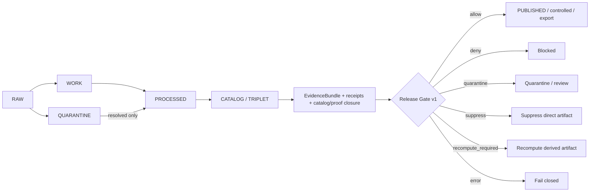
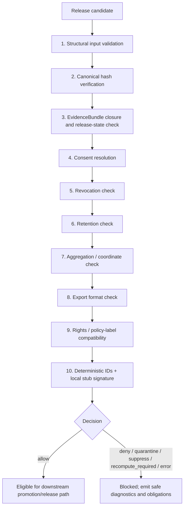

<!-- [KFM_META_BLOCK_V2]
doc_id: kfm://doc/NEEDS-VERIFICATION-ADR-0241
title: ADR-0241: Policy Obligation Engine + Release Gate v1
type: standard
version: v1
status: draft
owners: governance
created: TODO(date): verify original ADR creation date
updated: 2026-05-01
policy_label: NEEDS_VERIFICATION_POLICY_LABEL
related: [docs/adr/ADR-0241-policy-obligation-engine-release-gate-v1.md, policy/gates/release_gate.v1.yaml, policy/consent/*.md, schemas/contracts/v1/policy/decision_envelope.v1.schema.json, schemas/contracts/v1/policy/policy_evaluation_result.v1.schema.json, contracts/DecisionEnvelope.v1, contracts/PolicyEvaluationResult.v1, kfm://doc/NEEDS-VERIFICATION-schema-home]
tags: [kfm, adr, governance, policy, release-gate, consent, retention, publication, evidence-bundle]
notes: [ADR number preserved as ADR-0241; canonical kfm://doc UUID requires verification; target path and schema home remain PROPOSED until repo inspection; implementation depth remains UNKNOWN without mounted repo evidence]
[/KFM_META_BLOCK_V2] -->

# ADR-0241: Policy Obligation Engine + Release Gate v1

Deterministic, offline, fixture-backed governance gate for public, controlled, and export release decisions.

---

## Quick navigation

- [Decision snapshot](#decision-snapshot)
- [Context](#context)
- [Decision](#decision)
- [Lifecycle placement](#lifecycle-placement)
- [Scope](#scope)
- [Inputs](#inputs)
- [Outputs](#outputs)
- [Evaluation order](#evaluation-order)
- [Fail-closed doctrine](#fail-closed-doctrine)
- [Revocation handling](#revocation-handling)
- [Privacy and coordinate posture](#privacy-and-coordinate-posture)
- [No-network posture](#no-network-posture)
- [Proposed contract homes](#proposed-contract-homes)
- [Fixture plan](#fixture-plan)
- [Acceptance criteria](#acceptance-criteria)
- [Consequences](#consequences)
- [Rollback](#rollback)
- [Open verification backlog](#open-verification-backlog)
- [Review checklist](#review-checklist)

---

## Decision snapshot

| Field | Value |
|---|---|
| ADR | `ADR-0241` |
| Status | `draft` |
| Decision posture | `PROPOSED` |
| Implementation depth | `UNKNOWN` until repo files, tests, workflows, validators, release artifacts, or runtime evidence are inspected |
| Owners | `governance` |
| Updated | `2026-05-01` |
| Proposed path | `docs/adr/ADR-0241-policy-obligation-engine-release-gate-v1.md` |
| Primary outputs | `DecisionEnvelope.v1`, `PolicyEvaluationResult.v1` |
| Release rule | No public, controlled, or export release unless the final decision is `allow`. |
| Runtime posture | Offline, deterministic, fixture-backed, no network calls. |
| Default safety posture | Fail closed on missing evidence, unresolved policy, rights uncertainty, retention failure, coordinate exposure, revocation, or hash mismatch. |

> [!IMPORTANT]
> This ADR describes a **governed state transition gate**, not a file move, UI helper, source mutation step, or autopublication mechanism. A release candidate remains blocked unless the gate emits `allow` and all required receipts, evidence, rights, sensitivity, retention, consent, policy, review, and hash checks are satisfied.

> [!NOTE]
> This document states KFM governance doctrine and a proposed ADR design. Current repo implementation depth remains **UNKNOWN** where repo files, tests, workflows, dashboards, logs, route handlers, emitted proof objects, or runtime artifacts were not inspected.

---

## Context

KFM needs an offline release gate that can evaluate whether an artifact may move into a public, controlled, or export channel without relying on a remote policy service, remote signing authority, verifiable credential registry, or online source check.

The gate exists because publication is where internal interpretation becomes external reliance. A release candidate may have valid data, useful evidence, and appealing map output, but it is still unsafe to publish when source identity, evidence closure, consent, rights, retention, coordinate exposure, review state, or artifact integrity cannot be resolved.

This ADR introduces a deterministic local policy obligation engine and release gate for v1. The gate consumes already-prepared release inputs, evaluates them in a fixed order, emits structured decision objects, and fails closed on missing or unsafe conditions.

The ADR intentionally does **not** claim that the repository already contains the gate, schemas, fixtures, CI workflow, policy runner, or release integration. Those remain `PROPOSED` or `NEEDS VERIFICATION` until inspected.

---

## Decision

KFM will introduce a local, deterministic policy release gate that evaluates candidate artifacts before they can move to:

| Channel class | Examples | Gate posture |
|---|---|---|
| `public` | Public maps, public catalog records, public exports, public Evidence Drawer payloads | Strictest; exact coordinates blocked by default. |
| `controlled` | Steward-reviewed access, restricted reviewer surfaces, internal-but-shared packages | Must satisfy channel-specific consent, rights, retention, review, and sensitivity checks. |
| `export` | Download bundles, partner packages, report extracts, machine-readable datasets | Must satisfy export format, rights, retention, evidence, integrity, and policy checks. |

The gate emits two first-class objects:

1. `DecisionEnvelope.v1` — the compact release-facing decision surface, including final decision, release permission, reason codes, required obligations, deterministic IDs, evidence references, and a local stub signature.
2. `PolicyEvaluationResult.v1` — the detailed evaluation trace, including gate inputs, check results, policy profile hash, release channel, safe output subset, and non-sensitive diagnostics.

No artifact may be publicly released, controlled-released, exported, aliased as current, or surfaced through normal public clients unless the final decision is `allow`.

### Non-negotiable release rule

Only this outcome is release-positive:

| Decision | `release_allowed` |
|---|---:|
| `allow` | `true` |

All other outcomes are release-blocking:

| Decision | `release_allowed` |
|---|---:|
| `deny` | `false` |
| `quarantine` | `false` |
| `suppress` | `false` |
| `recompute_required` | `false` |
| `error` | `false` |

---

## Lifecycle placement

The release gate sits between catalog/proof closure and any public, controlled, or export release surface.

The gate does not rewrite source truth. It produces a decision, obligations, and safe diagnostics that downstream promotion, review, export, Evidence Drawer, or public-client workflows must consume.

---

## Terms

| Term | Meaning in this ADR |
|---|---|
| Release candidate | A candidate artifact plus its metadata, evidence support, receipts, policy profile, and requested channel. |
| Release channel | The intended outward path: `public`, `controlled`, or `export`. |
| Policy profile | A local policy/consent obligations input. In v1 it is treated as hashed bytes, not a fully parsed obligation DSL. |
| Gate config | Local release-gate configuration that fixes supported channels, check order, expected hashes, and default fail-closed mappings. |
| Obligation | A required follow-up, restriction, or annotation emitted by the gate. Obligations do not override a blocking decision. |
| Local stub signature | Deterministic local test signature over canonical safe output. It is not a remote attestation. |
| Safe diagnostics | Reviewable explanation that does not leak secrets, revocation tokens, precise blocked coordinates, or restricted source internals. |

---

## Scope

### Included

- Structural validation of release-gate inputs.
- Canonical hash verification for candidate artifact, evidence bundle, run receipt, gate config, and policy/consent profile inputs.
- EvidenceBundle presence and release-state checks.
- Consent and revocation handling.
- Retention checks.
- Coordinate and aggregation checks.
- Export format checks.
- `rights_status` and `policy_label` compatibility checks.
- Deterministic local IDs and local stub signature.
- Offline fixtures and no-network test cases.
- Safe diagnostics for review, release workflow, Evidence Drawer, and export surfaces.

### Excluded from v1

- Remote Sigstore, Cosign, Rekor, transparency log, verifiable credential registry, or remote signing calls.
- Remote policy engine or remote policy server calls.
- Live source fetching or live source rights verification.
- Mutation of source `EvidenceBundle` records.
- Autopublication, auto-approval, or bypass of review/promotion gates.
- Full machine-readable obligations profile parsing beyond hashing source profile bytes.
- Client-side release authority.
- Direct public access to RAW, WORK, QUARANTINE, canonical stores, model runtimes, or source internals.

---

## Inputs

| Input | Required | Purpose | Fail-closed condition |
|---|---:|---|---|
| Artifact metadata | Yes | Identifies candidate artifact, requested channel, policy label, rights status, sensitivity, spatial/temporal scope, export format, and declared hashes. | Missing schema, unknown channel, missing required fields, hash mismatch. |
| `EvidenceBundle` | Yes | Resolves evidence support, source role, provenance, citation support, release state, review state, and sensitivity context. | Missing bundle, unresolved evidence, hash mismatch, insufficient release state. |
| `run_receipt` | Yes | Anchors process provenance, tool identity, input hashes, output hashes, validation state, and run failures. | Missing receipt, stale receipt, hash mismatch, failed run state. |
| Obligations profile | Yes | Provides policy/consent profile bytes currently expected under `policy/consent/*.md`. | Missing profile, hash mismatch, required consent reference missing. |
| Gate config | Yes | Provides release-gate settings from `policy/gates/release_gate.v1.yaml`. | Missing config, unknown version, unsupported channel, hash mismatch. |
| `revoke_delta` | Optional | Supplies revocation updates for the current candidate evaluation. | Revoked consent, malformed delta, attempted persistence of revocation token. |

> [!NOTE]
> In v1, the obligations profile is treated as a hashed input. Machine-readable obligation semantics are intentionally deferred to v2 unless the real repository already contains a stronger convention.

---

## Outputs

### `DecisionEnvelope.v1`

`DecisionEnvelope.v1` is the compact release-facing decision object. It is safe for downstream automation and review surfaces when policy-safe fields only are emitted.

| Field family | Required content |
|---|---|
| Identity | `decision_id`, `candidate_artifact_id`, `release_channel`, `gate_version`, `evaluated_at` |
| Decision | `decision`, `release_allowed`, `reason_codes`, `obligations` |
| Evidence | `evidence_bundle_id`, `evidence_bundle_hash`, `run_receipt_id`, `run_receipt_hash` |
| Policy | `policy_profile_hash`, `gate_config_hash`, `policy_label`, `rights_status` |
| Privacy | Redacted/generalized coordinate posture; no revocation token. |
| Integrity | Candidate artifact hash, canonical input hash, signature type, local stub signature. |
| Review linkage | Review state and promotion candidate reference when available. |
| Rollback linkage | Rollback target reference when evaluation affects a candidate release. |

Recommended decision grammar for v1:

| Decision | Release allowed? | Meaning |
|---|---:|---|
| `allow` | Yes | Candidate passed all required checks for the requested channel. |
| `deny` | No | Candidate failed a known release requirement. |
| `quarantine` | No | Candidate requires isolation because required evidence, policy, rights, schema, hash, review, or sensitivity state is unresolved. |
| `suppress` | No | Direct artifact is affected by revocation and must be suppressed from release surfaces. |
| `recompute_required` | No | Derived artifact is affected by revocation and must be recomputed before further release evaluation. |
| `error` | No | Gate failed to evaluate deterministically; release remains blocked. |

### `PolicyEvaluationResult.v1`

`PolicyEvaluationResult.v1` is the detailed evaluation report. It may contain richer diagnostics than `DecisionEnvelope.v1`, but it still must not persist revocation tokens, secrets, precise blocked coordinates, or unsafe source internals.

| Field family | Required content |
|---|---|
| Evaluation | Ordered check list, pass/fail/error state, reason codes, obligations. |
| Inputs | Hashes and IDs for artifact metadata, `EvidenceBundle`, `run_receipt`, policy profile, gate config, and optional revoke delta. |
| Gate trace | Structural, hash, consent, revocation, retention, aggregation, coordinate, export, rights, and policy-label results. |
| Safe diagnostics | Reviewable explanation of failure without leaking sensitive data. |
| Signature stub | Deterministic local stub signature over canonical safe output. |
| Redaction proof | Confirmation that blocked precision, secrets, and revocation tokens were not emitted. |

---

## Evaluation order

The gate evaluates in a fixed order. Earlier failures may short-circuit when continuing would expose sensitive data, leak restricted precision, or produce misleading output.

### Gate checks

| Step | Check | Required behavior |
|---:|---|---|
| 1 | Structural input validation | Validate schemas, required fields, known release channel, known gate version, and required object references. |
| 2 | Canonical hash verification | Recompute declared hashes and fail closed on mismatch. |
| 3 | EvidenceBundle closure and release-state check | Confirm EvidenceBundle exists, hashes match, evidence refs resolve, and the evidence/release state supports the requested use. |
| 4 | Consent resolution | Confirm required consent references exist when policy requires them. |
| 5 | Revocation check | Apply `revoke_delta` without persisting revocation token. |
| 6 | Retention check | Deny expired or retention-ineligible artifacts. |
| 7 | Aggregation / coordinate check | Block exact public coordinate release; require approved generalization/redaction for public-safe outputs. |
| 8 | Export format check | Deny unknown or disallowed export formats for the requested channel. |
| 9 | Rights / policy-label compatibility | Verify `rights_status`, `policy_label`, release channel, and evidence support are compatible. |
| 10 | Deterministic IDs + signature | Emit deterministic IDs and local stub signature over canonical safe output. |

---

## Fail-closed doctrine

The gate must fail closed on every release-significant uncertainty below.

| Condition | Required outcome | Notes |
|---|---|---|
| Missing schema | `quarantine` | The gate must not evaluate an untyped artifact as releasable. |
| Invalid schema | `deny` | An invalid typed artifact cannot proceed. |
| Missing policy profile | `deny` | No policy profile means no release authority. |
| Missing gate config | `deny` | No gate config means no deterministic gate behavior. |
| Missing `EvidenceBundle` | `quarantine` | Evidence support is unresolved. |
| Unresolved `EvidenceRef` | `quarantine` | Consequential claims cannot be released without evidence closure. |
| Missing consent reference where required | `deny` | Applies when artifact class, source role, channel, or policy label requires consent. |
| Expired retention | `deny` | Artifact cannot be released/exported past retention allowance. |
| Unknown release channel | `deny` | Unknown channel cannot inherit public or controlled defaults. |
| Revoked consent, direct artifact | `suppress` | The directly affected artifact is removed from release eligibility. |
| Revoked consent, derived artifact | `recompute_required` | Derived outputs must be rebuilt without revoked support before reevaluation. |
| Hash mismatch | `deny` | Artifact, evidence, receipt, config, or policy bytes are not trusted. |
| Exact coordinates for public release | `deny` | Public exact coordinate release is blocked unless a future policy explicitly proves a safe exception. |
| Unknown export format | `deny` | Format safety and obligation behavior cannot be inferred. |
| Rights/policy-label incompatibility | `deny` | Public or export release cannot exceed rights and label constraints. |
| Unsafe diagnostics would leak restricted detail | `error` | Gate must fail closed rather than emit unsafe explanation. |

---

## Revocation handling

Revocation is handled as a release-state fact, not as a reason to mutate source evidence.

| Case | Gate outcome | Required follow-up |
|---|---|---|
| Revoked consent affects a direct artifact | `suppress` | Remove or withhold the artifact from release surfaces; record safe suppression reason. |
| Revoked consent affects a derived artifact | `recompute_required` | Rebuild derived artifact without revoked support, emit a new receipt, and rerun the release gate. |
| Revocation token supplied | Never persisted | Token may be used for the current evaluation only. Outputs may include safe reason codes, not the token. |
| Revocation effect cannot be determined | `quarantine` | Hold the candidate until evidence, lineage, or dependency impact is resolved. |

> [!WARNING]
> No source `EvidenceBundle` is mutated during rollback or revocation handling. The gate produces a decision and obligations; it does not rewrite source truth.

---

## Privacy and coordinate posture

Coordinates are blocked for exact public release in v1. Public outputs may proceed only when the candidate uses policy-safe metadata or an approved public-safe transform.

| Output type | v1 posture |
|---|---|
| Exact public coordinates | Blocked. |
| Generalized public geometry | Allowed only after transform evidence, hash verification, and gate approval. |
| Controlled exact geometry | Requires channel-specific policy, consent, rights, review, retention, and access checks. |
| Exported geometry | Requires export-format, rights, policy label, coordinate, review, and retention checks. |
| Evidence Drawer metadata | Must show safe source, rights, sensitivity, review, and policy state without leaking blocked precision. |
| Diagnostics | Must not leak exact blocked coordinates, revocation tokens, secrets, steward-only identifiers, or restricted source internals. |

Coordinate release exceptions are outside v1 unless a future policy explicitly defines exception criteria, evidence burden, reviewer authority, and test fixtures.

---

## No-network posture

v1 runs completely offline.

The gate does **not** call:

- Sigstore, Cosign, Rekor, or any remote signing service.
- Verifiable credential registries.
- Remote policy engines or policy servers.
- Live source APIs.
- External rights, consent, identity, or steward services.
- Model runtimes.

The v1 signature is a **local stub signature** for deterministic fixture and workflow testing. It is not an external attestation and must not be represented as one.

Required signature fields should make the limitation unambiguous:

| Field | Required value or behavior |
|---|---|
| `signature_type` | `local_stub` |
| `signature_scope` | Canonical safe output only |
| `external_attestation` | `false` |
| `remote_transparency_log` | `false` |
| `verification_note` | States that v1 is deterministic local fixture/workflow proof only. |

---

## Proposed contract homes

The real repository schema authority remains unresolved until the mounted repo is inspected. Use the existing repo convention if it is stronger or already canonical. Do not create duplicate authority across `contracts/` and `schemas/contracts/v1/`.

| Artifact | Candidate home | Status |
|---|---|---|
| ADR | `docs/adr/ADR-0241-policy-obligation-engine-release-gate-v1.md` | PROPOSED |
| Gate config | `policy/gates/release_gate.v1.yaml` | Supplied by ADR draft; presence NEEDS VERIFICATION |
| Consent profiles | `policy/consent/*.md` | Supplied by ADR draft; machine-readable v2 NEEDS VERIFICATION |
| `DecisionEnvelope.v1` schema | `schemas/contracts/v1/policy/decision_envelope.v1.schema.json` | PROPOSED; schema home NEEDS VERIFICATION |
| `PolicyEvaluationResult.v1` schema | `schemas/contracts/v1/policy/policy_evaluation_result.v1.schema.json` | PROPOSED; schema home NEEDS VERIFICATION |
| Gate validator | `tools/validators/policy/release_gate_v1.*` | PROPOSED; language/tooling NEEDS VERIFICATION |
| Fixtures | `tests/fixtures/policy/release_gate/v1/{valid,invalid}/` | PROPOSED |
| Policy tests | `tests/policy/release_gate_v1.*` | PROPOSED |
| Release workflow integration | `PATH_TBD_AFTER_REPO_INSPECTION` | UNKNOWN |
| Promotion decision link | `PromotionDecision` or existing repo equivalent | NEEDS VERIFICATION |

> [!CAUTION]
> Do not land parallel machine-contract definitions under both `contracts/` and `schemas/contracts/v1/` without an ADR or repository convention that explicitly resolves authority and compatibility.

---

## Fixture plan

The first implementation slice should be fixture-backed and no-network.

| Fixture | Expected decision | Purpose |
|---|---|---|
| `valid_public_generalized_metadata.json` | `allow` | Proves happy path without exact public coordinates. |
| `invalid_missing_schema.json` | `quarantine` | Proves schema absence fails closed. |
| `invalid_schema_mismatch.json` | `deny` | Proves invalid typed input cannot pass. |
| `invalid_missing_policy_profile.json` | `deny` | Proves profile absence blocks release. |
| `invalid_missing_gate_config.json` | `deny` | Proves config absence blocks deterministic evaluation. |
| `invalid_missing_evidence_bundle.json` | `quarantine` | Proves missing evidence support blocks release. |
| `invalid_unresolved_evidence_ref.json` | `quarantine` | Proves unresolved support blocks consequential release. |
| `invalid_missing_required_consent.json` | `deny` | Proves required consent cannot be skipped. |
| `invalid_expired_retention.json` | `deny` | Proves retention expiry blocks release/export. |
| `invalid_unknown_channel.json` | `deny` | Proves unknown channels cannot inherit defaults. |
| `invalid_hash_mismatch.json` | `deny` | Proves canonical hash mismatch blocks release. |
| `invalid_exact_public_coordinates.json` | `deny` | Proves exact coordinates are blocked for public release. |
| `invalid_unknown_export_format.json` | `deny` | Proves unsafe format inference is blocked. |
| `invalid_rights_policy_label_incompatible.json` | `deny` | Proves rights and policy label compatibility is enforced. |
| `revoked_direct_artifact.json` | `suppress` | Proves direct revocation handling. |
| `revoked_derived_artifact.json` | `recompute_required` | Proves derived revocation handling. |
| `unsafe_diagnostics_redaction_failure.json` | `error` | Proves diagnostics cannot leak restricted detail. |

---

## Acceptance criteria

### Contract and schema acceptance

- [ ] `DecisionEnvelope.v1` and `PolicyEvaluationResult.v1` schemas exist in the verified canonical schema home.
- [ ] Schema-home authority is resolved or the machine-contract files remain unlanded.
- [ ] Decision grammar is finite and documented.
- [ ] `release_allowed` is `true` only when `decision == "allow"`.
- [ ] `signature_type` clearly states `local_stub`.

### Offline gate acceptance

- [ ] The release gate can run offline using only fixtures, local config, local policy profile bytes, local evidence bundles, and local receipts.
- [ ] No fixture or test requires network access.
- [ ] No fixture or test calls model runtimes, remote policy engines, live sources, identity services, or remote attestations.

### Fail-closed acceptance

- [ ] Every fail-closed condition in this ADR has at least one negative fixture.
- [ ] Happy-path fixture emits `allow` only when all required hashes, evidence, rights, consent, retention, coordinate, export, policy, and review checks pass.
- [ ] Revoked direct artifact emits `suppress`.
- [ ] Revoked derived artifact emits `recompute_required`.
- [ ] Revocation token is never persisted in output fixtures, receipts, logs, or safe diagnostics.
- [ ] Exact public coordinates are blocked.
- [ ] Missing schema, missing policy profile, missing gate config, unknown channel, expired retention, unresolved evidence, and hash mismatch cannot pass.

### Release workflow acceptance

- [ ] Public, controlled, and export workflows require a release-positive `DecisionEnvelope.v1`.
- [ ] Normal public clients cannot bypass the gate through raw paths, canonical stores, source APIs, graph internals, or model runtimes.
- [ ] Rollback is code/config/schema/release-integration revert only; no source `EvidenceBundle` mutation occurs.
- [ ] Emitted decisions remain available as audit history unless a retention policy explicitly requires removal.

---

## Alternatives considered

| Alternative | Decision | Reason |
|---|---|---|
| No release gate; rely on convention | Rejected | Release policy would remain decorative and difficult to test. |
| Client-side gate only | Rejected | Public clients must not carry publication authority. |
| Remote policy service in v1 | Deferred | v1 needs deterministic offline fixtures before remote dependencies are introduced. |
| Remote signing / transparency log in v1 | Deferred | Local stub signature is enough for deterministic workflow tests; external attestation requires separate policy and operational verification. |
| Full machine-readable obligations DSL in v1 | Deferred | Hashing policy profile bytes is smaller and reversible while repository conventions are unresolved. |
| Gate mutates `EvidenceBundle` records | Rejected | Source evidence remains upstream truth support; rollback and revocation decisions must not rewrite it. |
| Autopublish after `allow` | Rejected | The release gate authorizes eligibility; it does not collapse review, promotion, and publication into one step. |

---

## Consequences

### Benefits

- Makes release/export safety inspectable before publication.
- Converts release policy from implied convention into a deterministic gate.
- Preserves KFM’s cite-or-abstain and fail-closed posture at the publication boundary.
- Keeps revocation handling explicit without leaking revocation tokens.
- Provides fixture-ready validation before live connectors, UI wiring, or remote attestations.
- Creates a single release-positive decision surface that downstream promotion, review, export, Evidence Drawer, and public clients can consume.

### Costs

- Adds schema, fixture, validator, and policy maintenance burden.
- Requires schema-home authority to be resolved before machine files land.
- Requires v2 work if obligations profiles need machine-readable semantics instead of byte hashing.
- Requires careful field redaction so diagnostics remain useful without leaking sensitive data.
- Requires release workflows to treat `DecisionEnvelope.v1` as a gate dependency, not optional metadata.

### Risks

| Risk | Mitigation |
|---|---|
| Gate becomes decorative while release bypasses it. | Public, controlled, and export workflows must require `allow` from this gate before release. |
| Duplicate schema authority appears under both `contracts/` and `schemas/contracts/v1/`. | Resolve schema-home authority before landing machine files. |
| Revocation token leaks into outputs. | Add fixture and test that fails on token persistence. |
| Local stub signature is mistaken for external attestation. | Label as `local_stub` and keep remote signing out of v1. |
| Exact coordinates leak through diagnostics or Evidence Drawer payloads. | Emit policy-safe diagnostics only; test public coordinate denial and diagnostic redaction. |
| Gate decisions are treated as source truth. | Preserve source evidence separately; gate outputs are release decisions and obligations. |
| `allow` is interpreted as autopublication. | Require downstream promotion/release workflow to consume the decision and record review/release state. |

---

## Rollback

Rollback is code/config/schema/release-integration revert. It must not mutate source `EvidenceBundle` records.

Rollback options:

1. Revert the ADR-driven schema/config/validator changes.
2. Restore prior `release_gate.v1.yaml` config if changed.
3. Disable the release-gate integration point while preserving emitted decision artifacts as audit history.
4. Reevaluate any candidate releases that depended on the reverted gate version.
5. Restore prior release aliases or manifests through the repository’s verified rollback procedure.

Rollback records should identify:

| Required rollback field | Purpose |
|---|---|
| `gate_version` | Identifies decision logic being reverted. |
| `gate_config_hash` | Identifies config in force at evaluation time. |
| `policy_profile_hash` | Identifies policy/consent profile bytes used. |
| `affected_release_candidate_ids` | Shows impact scope. |
| `affected_decision_ids` | Links prior decisions to rollback. |
| `safe_reason_codes` | Explains rollback without leaking restricted details. |
| `rollback_target` | Identifies prior safe state or manifest. |

---

## Open verification backlog

| Item | Status | Why it matters |
|---|---|---|
| Canonical schema home between `contracts/` and `schemas/contracts/v1/` | NEEDS VERIFICATION | Prevents duplicate machine-contract authority. |
| Exact existing ADR path convention | NEEDS VERIFICATION | This draft proposes `docs/adr/`, but the mounted repo must decide. |
| Whether `policy/consent/*.md` should become machine-readable in v2 | NEEDS VERIFICATION | v1 hashes file bytes; v2 may need structured obligation semantics. |
| Existing `DecisionEnvelope` naming and finite grammar | NEEDS VERIFICATION | Avoids conflicting object versions. |
| Existing `PolicyEvaluationResult` or equivalent trace object | NEEDS VERIFICATION | Avoids duplicate evaluation-report families. |
| Existing policy runner/tooling | UNKNOWN | Determines validator and CI command shape. |
| Existing release/promotion workflow | UNKNOWN | Determines where this gate plugs into release. |
| Existing signature/attestation convention | UNKNOWN | v1 uses local stub only. |
| Owners and reviewer roles | NEEDS VERIFICATION | Governance, privacy, consent, rights, release, and test owners must be known before merge. |
| Policy label for this ADR | NEEDS VERIFICATION | Metadata block currently uses a placeholder rather than a fabricated label. |
| Current implementation maturity | UNKNOWN | No claim of active release enforcement is made by this ADR. |

---

## Review checklist

- [ ] Governance owners accept the fail-closed condition list.
- [ ] Schema-home ADR or equivalent decision exists before machine files are added.
- [ ] Privacy reviewer confirms exact public coordinate block and safe diagnostics posture.
- [ ] Consent/rights reviewer confirms v1 hashed-profile approach is acceptable for draft implementation.
- [ ] Release workflow owner confirms no public/controlled/export release can bypass the gate.
- [ ] Test owner confirms every denial/suppression/recompute path has a fixture.
- [ ] Documentation owner confirms metadata placeholders are resolved or remain intentionally searchable.
- [ ] Security reviewer confirms local stub signature is not represented as external attestation.
- [ ] UI/Evidence Drawer owner confirms public payloads cannot leak blocked precision, restricted details, or unsafe diagnostics.
- [ ] Rollback owner confirms prior release state can be restored without mutating source evidence.

---

## Status

`draft` / `PROPOSED`

This ADR is ready for governance review as a design document. It is not implementation proof. Landing machine contracts, validators, fixtures, or release workflow integration requires direct repository inspection, schema-home verification, owner confirmation, and repo-native validation.
