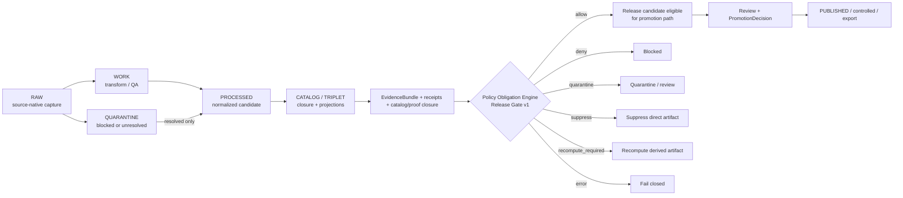
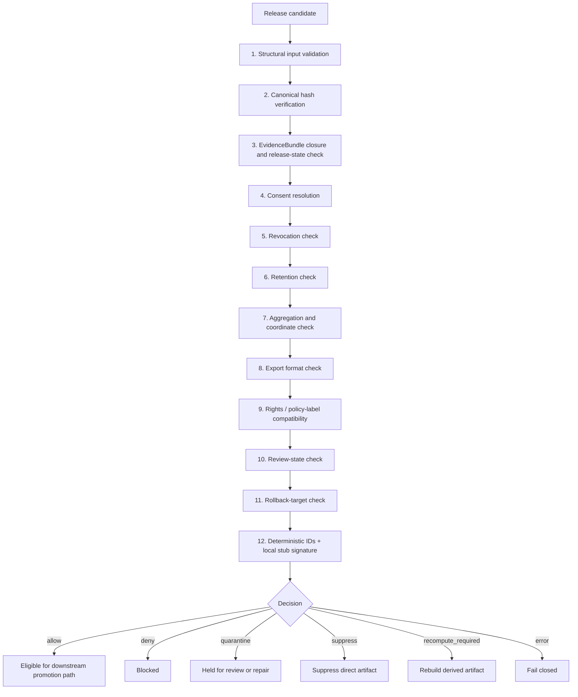

<!-- [KFM_META_BLOCK_V2]
doc_id: kfm://doc/NEEDS-VERIFICATION-ADR-0241
title: ADR-0241: Policy Obligation Engine and Release Gate v1
type: standard
version: v1
status: draft
owners: OWNER_TBD_NEEDS_VERIFICATION(policy-governance, release-steward)
created: DATE_TBD_FROM_GIT_HISTORY
updated: 2026-05-06
policy_label: POLICY_LABEL_TBD_NEEDS_VERIFICATION
related: [./README.md, ./ADR-TEMPLATE.md, ./ADR-0001-schema-home.md, ./ADR-0011-catalog-proof-release-separation.md, ./ADR-0202-policy-home.md, ../../policy/README.md, ../../contracts/README.md, ../../schemas/README.md, ../../release/README.md, ../doctrine/lifecycle-law.md, ../doctrine/truth-posture.md, ../registers/DRIFT_REGISTER.md]
tags: [kfm, adr, governance, policy, obligations, release-gate, evidence-bundle, proof-pack, rollback, fail-closed]
notes: [Revises the existing ADR-0241 draft at docs/adr/ADR-0241-policy-obligation-engine-and-release-gate.md, Keeps implementation enforcement explicitly NEEDS VERIFICATION until schemas fixtures validators policy bundles workflows release artifacts and runtime evidence are inspected, Former related path ADR-0241-policy-obligation-engine-release-gate-v1.md is treated as a possible lineage alias only and not the canonical target path here]
[/KFM_META_BLOCK_V2] -->

<a id="top"></a>

# ADR-0241: Policy Obligation Engine and Release Gate v1

Deterministic, offline, fixture-backed governance gate for public, controlled, and export release decisions.

<div align="left">


</div>

> [!IMPORTANT]
> This ADR records a **governed release-state decision**, not a file move, UI affordance, source mutation, workflow shortcut, or autopublication mechanism. A candidate remains blocked unless the release gate emits `allow` and the downstream promotion path also has the required evidence, receipts, policy decision, review state, release manifest, correction path, and rollback target.

> [!NOTE]
> This document is intentionally evidence-bounded. It may define proposed contracts, fixture homes, validator paths, policy seams, and workflow hooks, but it does **not** claim that those implementation artifacts are already enforced unless current repo evidence proves them.

---

## Quick navigation

| Decision | Mechanics | Review |
|---|---|---|
| [Decision snapshot](#decision-snapshot) | [Inputs](#inputs) | [Acceptance criteria](#acceptance-criteria) |
| [Context](#context) | [Outputs](#outputs) | [Validation plan](#validation-plan) |
| [Decision](#decision) | [Evaluation order](#evaluation-order) | [Rollback and supersession](#rollback-and-supersession) |
| [Lifecycle placement](#lifecycle-placement) | [Fail-closed doctrine](#fail-closed-doctrine) | [Open verification backlog](#open-verification-backlog) |
| [Scope](#scope) | [Repository fit](#repository-fit) | [Review checklist](#review-checklist) |

---

## Decision snapshot

| Field | Value |
|---|---|
| ADR | `ADR-0241` |
| Title | Policy Obligation Engine and Release Gate v1 |
| Status | `draft` |
| Decision posture | `PROPOSED` |
| Implementation enforcement | `NEEDS VERIFICATION` |
| Canonical target path | `docs/adr/ADR-0241-policy-obligation-engine-and-release-gate.md` |
| Possible legacy / lineage alias | `docs/adr/ADR-0241-policy-obligation-engine-release-gate-v1.md` |
| Owners | `OWNER_TBD_NEEDS_VERIFICATION(policy-governance, release-steward)` |
| Primary release-facing object | `DecisionEnvelope.v1` |
| Primary evaluation trace object | `PolicyEvaluationResult.v1` |
| Release-positive state | `decision == "allow"` and `release_allowed == true` |
| Release-blocking states | `deny`, `quarantine`, `suppress`, `recompute_required`, `error` |
| Runtime posture | deterministic, offline, local fixtures first |
| Network posture | no remote policy, no live source fetch, no model runtime, no remote attestation in v1 |
| Default safety posture | fail closed on unresolved evidence, missing policy, unknown rights, sensitivity risk, retention failure, revocation, coordinate exposure, hash mismatch, or unsafe diagnostics |

### Decision in one sentence

KFM will introduce a local **Policy Obligation Engine and Release Gate v1** that evaluates release candidates before public, controlled, or export exposure and emits typed decisions, obligations, and safe diagnostics without mutating source truth or bypassing promotion review.

[Back to top](#top)

---

## Context

KFM is a governed, evidence-first, map-first, time-aware spatial knowledge and publication system. Publication is where internal interpretation becomes external reliance. A release candidate may have valid data, useful evidence, and an appealing map layer, but it remains unsafe to publish when source identity, evidence closure, rights, sensitivity, retention, consent, review state, correction path, or artifact integrity cannot be resolved.

The release gate exists to make that boundary inspectable.

It evaluates already-prepared release inputs in a fixed order, returns finite machine-readable outcomes, emits obligations, and refuses to turn uncertainty into release permission.

### Problem this ADR solves

Without a deterministic release gate, KFM risks:

- treating a syntactically valid artifact as publishable;
- allowing public clients to consume outputs that bypass evidence closure;
- hiding rights, consent, revocation, retention, or sensitivity gaps in prose;
- letting UI, workflow YAML, or model output become de facto release authority;
- publishing derived artifacts without rollback targets or correction lineage;
- creating policy rules that are not backed by fixtures and negative-path tests.

### Current implementation boundary

This ADR may be reviewed and accepted as a decision before all enforcement is complete. Enforcement becomes `CONFIRMED` only when repo-native schemas, fixtures, validators, policy bundles, workflows, release artifacts, receipts, tests, and runtime behavior are inspected and shown to enforce the decision.

[Back to top](#top)

---

## Evidence basis

| Evidence item | What it supports | Current label | Limitation |
|---|---|---:|---|
| KFM lifecycle doctrine | `RAW -> WORK / QUARANTINE -> PROCESSED -> CATALOG / TRIPLET -> PUBLISHED` remains the release boundary. | `CONFIRMED doctrine` | Does not prove this specific gate is implemented. |
| ADR directory doctrine | ADRs record decisions, evidence, validation burden, rollback, and supersession; ADRs are not implementation proof. | `CONFIRMED repo/documentation evidence` | ADR index coverage and owners still need active-branch verification. |
| Policy lane doctrine | Policy decides admissibility after validation; workflows orchestrate and governed APIs expose. | `CONFIRMED repo/documentation evidence` | Policy runner, bundle inventory, and enforcement depth remain `NEEDS VERIFICATION`. |
| Catalog / proof / release separation doctrine | Catalogs, proofs, receipts, release manifests, and rollback records remain separate trust surfaces. | `CONFIRMED doctrine / NEEDS VERIFICATION implementation` | Emitted proof objects and release artifacts must be inspected before enforcement is claimed. |
| Governed AI and runtime envelope doctrine | Runtime answers require evidence, policy, finite outcomes, citations, and receipts. | `CONFIRMED doctrine / PROPOSED realization` | This ADR governs release eligibility; it does not implement AI runtime behavior. |
| Existing ADR-0241 draft | Existing draft already defines an offline release gate, decision grammar, fail-closed table, revocation handling, fixture plan, and rollback posture. | `CONFIRMED repo file presence` | Current enforcement artifacts are not proven by the draft alone. |
| Directory Rules / responsibility-root doctrine | `docs/adr/` is the correct human-facing decision home; machine schemas, policy, tests, release artifacts, and data lifecycle stores belong in their responsibility roots. | `CONFIRMED doctrine` | Exact active repo file layout and compatibility roots still require inspection before implementation. |

> [!CAUTION]
> Repetition across planning documents is continuity evidence, not implementation proof. This ADR must not be used to claim that release enforcement, schemas, validators, workflows, dashboards, or emitted proof packs exist unless they are directly verified.

[Back to top](#top)

---

## Decision

KFM will adopt a local, deterministic **Policy Obligation Engine and Release Gate v1**.

The gate evaluates candidate artifacts before they can move to any of these outward channels:

| Channel class | Examples | Gate posture |
|---|---|---|
| `public` | public maps, public catalog records, public downloads, public Evidence Drawer payloads | strictest; exact coordinates blocked by default |
| `controlled` | steward-reviewed access, restricted review surfaces, internal-but-shared packages | requires channel-specific consent, rights, retention, review, and sensitivity checks |
| `export` | download bundles, partner packages, reports, machine-readable extracts | requires export-format, rights, retention, evidence, integrity, and policy checks |

The gate emits two first-class objects:

1. `DecisionEnvelope.v1` — compact release-facing decision surface.
2. `PolicyEvaluationResult.v1` — detailed, safe, non-secret evaluation trace.

### Non-negotiable release rule

Only this state is release-positive:

| Decision | `release_allowed` |
|---|---:|
| `allow` | `true` |

All other states are release-blocking:

| Decision | `release_allowed` | Meaning |
|---|---:|---|
| `deny` | `false` | Candidate failed a known release requirement. |
| `quarantine` | `false` | Candidate requires isolation because evidence, rights, policy, review, sensitivity, or schema state is unresolved. |
| `suppress` | `false` | Direct artifact is affected by revocation or post-review suppression. |
| `recompute_required` | `false` | Derived artifact must be rebuilt before reevaluation. |
| `error` | `false` | Gate failed to evaluate deterministically or safely. |

### Boundary rules

The release gate:

- **does not** mutate source `EvidenceBundle` records;
- **does not** rewrite canonical truth;
- **does not** publish artifacts by itself;
- **does not** replace review, promotion, rollback, or correction records;
- **does not** allow public clients to access `RAW`, `WORK`, `QUARANTINE`, canonical stores, source internals, direct model runtimes, or unreviewed candidates;
- **does** produce a typed decision, obligations, reason codes, safe diagnostics, and rollback/correction references that downstream promotion and release workflows must consume.

[Back to top](#top)

---

## Lifecycle placement

The release gate sits after catalog/proof closure and before any public, controlled, or export release surface.



> [!IMPORTANT]
> `allow` means “eligible for downstream promotion/release handling.” It does not collapse validation, review, promotion, publication, and rollback into one unreviewed action.

[Back to top](#top)

---

## Terms

| Term | Meaning in this ADR |
|---|---|
| Release candidate | Candidate artifact plus metadata, evidence support, receipts, policy profile, and requested channel. |
| Release channel | Intended outward path: `public`, `controlled`, or `export`. |
| Policy profile | Local policy/consent obligations input. In v1 it may be treated as hashed bytes rather than a full obligation DSL. |
| Gate config | Local release-gate configuration that fixes supported channels, check order, expected hashes, and fail-closed mappings. |
| Obligation | Required follow-up, restriction, transform, annotation, review, audit, or correction emitted by the gate. Obligations do not override a blocking decision. |
| Safe diagnostics | Reviewable explanation that avoids leaking secrets, revocation tokens, exact blocked coordinates, restricted source internals, or steward-only identifiers. |
| Local stub signature | Deterministic local test signature over canonical safe output. It is not a remote attestation. |
| Release-positive decision | `decision == "allow"` and `release_allowed == true`. |
| Release-blocking decision | Any decision other than `allow`. |

[Back to top](#top)

---

## Scope

### Included in v1

- Structural validation of release-gate inputs.
- Canonical hash verification for candidate artifact, evidence bundle, run receipt, gate config, and policy profile inputs.
- EvidenceBundle presence, hash, closure, release-state, review-state, and citation-support checks.
- Consent and revocation handling.
- Retention checks.
- Coordinate exposure and aggregation checks.
- Export format checks.
- `rights_status`, `policy_label`, sensitivity, and release-channel compatibility checks.
- Deterministic local IDs and local stub signature.
- Offline fixtures and no-network tests.
- Safe diagnostics for review, release workflow, Evidence Drawer, and export surfaces.
- Rollback and correction references for release-impacting decisions.

### Excluded from v1

- Remote Sigstore, Cosign, Rekor, transparency log, verifiable credential registry, or remote signing calls.
- Remote policy engine or remote policy server calls.
- Live source fetching or live source-rights verification.
- Mutation of source `EvidenceBundle` records.
- Autopublication, auto-approval, or bypass of review/promotion gates.
- Full machine-readable obligations-profile parsing beyond hashing source profile bytes.
- Client-side release authority.
- Direct public access to `RAW`, `WORK`, `QUARANTINE`, canonical stores, model runtimes, or source internals.
- Emergency or life-safety alerting behavior.

[Back to top](#top)

---

## Inputs

| Input | Required | Purpose | Fail-closed condition |
|---|---:|---|---|
| Artifact metadata | Yes | Identifies candidate artifact, requested channel, policy label, rights status, sensitivity, spatial/temporal scope, export format, and declared hashes. | Missing schema, unknown channel, missing required fields, hash mismatch. |
| `EvidenceBundle` | Yes | Resolves evidence support, source role, provenance, citation support, release state, review state, and sensitivity context. | Missing bundle, unresolved evidence, hash mismatch, insufficient release state. |
| `RunReceipt` | Yes | Anchors process provenance, tool identity, input hashes, output hashes, validation state, and run failures. | Missing receipt, stale receipt, hash mismatch, failed run state. |
| `ValidationReport` | Yes | Confirms schema, semantic, spatial, temporal, and linkage checks. | Missing report, blocking validation errors, validator version mismatch. |
| Policy / obligations profile | Yes | Provides local policy, rights, consent, restriction, or obligation material. | Missing profile, hash mismatch, required consent reference missing. |
| Gate config | Yes | Provides release-gate settings, supported channels, expected check order, and reason-code grammar. | Missing config, unknown version, unsupported channel, hash mismatch. |
| Review record | Channel-dependent | Proves required human/steward/security/source review when risk class requires it. | Missing required review, wrong role, separation-of-duty failure. |
| Rollback target | Yes for release-impacting decisions | Identifies prior safe state or release manifest. | Missing target, target cannot be resolved, target not operationally checkable. |
| `revoke_delta` | Optional | Supplies revocation updates for the current candidate evaluation. | Revoked support, malformed delta, attempted persistence of revocation token. |

> [!NOTE]
> In v1, the obligations profile may remain byte-hashed and locally referenced. A future ADR can introduce a richer machine-readable obligation DSL only after schema-home, policy-runner, and review conventions are verified.

[Back to top](#top)

---

## Outputs

### `DecisionEnvelope.v1`

`DecisionEnvelope.v1` is the compact release-facing decision object. It is safe for downstream automation, reviewers, release workflows, and public-facing trust surfaces when unsafe fields are withheld.

| Field family | Required content |
|---|---|
| Identity | `decision_id`, `candidate_artifact_id`, `release_channel`, `gate_version`, `evaluated_at` |
| Decision | `decision`, `release_allowed`, `reason_codes`, `obligations` |
| Evidence | `evidence_bundle_id`, `evidence_bundle_hash`, `run_receipt_id`, `run_receipt_hash`, `validation_report_id` |
| Policy | `policy_profile_hash`, `gate_config_hash`, `policy_label`, `rights_status`, `sensitivity_class` |
| Review | `review_state`, `required_review_refs`, `missing_review_roles` when blocked |
| Privacy | Redacted/generalized coordinate posture; no revocation token; no exact blocked coordinates in public-safe output |
| Integrity | Candidate artifact hash, canonical input hash, signature type, local stub signature |
| Release linkage | `release_manifest_ref`, `promotion_candidate_ref`, `rollback_target_ref`, `correction_notice_refs` |
| Diagnostics | Safe reason summary and non-sensitive remediation hints |

### `PolicyEvaluationResult.v1`

`PolicyEvaluationResult.v1` is the detailed evaluation report. It may contain richer diagnostics than `DecisionEnvelope.v1`, but it still must not persist secrets, revocation tokens, exact blocked coordinates, private identifiers, or restricted source internals.

| Field family | Required content |
|---|---|
| Evaluation | Ordered check list, pass/fail/error state, reason codes, and obligations |
| Inputs | Hashes and IDs for artifact metadata, `EvidenceBundle`, `RunReceipt`, `ValidationReport`, policy profile, gate config, and optional revoke delta |
| Gate trace | Structural, hash, evidence, consent, revocation, retention, aggregation, coordinate, export, rights, policy-label, review, and rollback results |
| Safe diagnostics | Reviewable explanation of failure without leaking sensitive data |
| Signature stub | Deterministic local stub signature over canonical safe output |
| Redaction proof | Confirmation that blocked precision, secrets, and revocation tokens were not emitted |
| Downstream obligations | Required review, recompute, suppression, correction, rollback, generalization, or citation actions |

### Minimal illustrative envelope

> [!NOTE]
> This example is illustrative. It shows contract intent, not a confirmed checked-in schema or fixture.

```json
{
  "kind": "DecisionEnvelope",
  "version": "v1",
  "decision_id": "kfm://decision/release-gate/example",
  "candidate_artifact_id": "kfm://artifact/example",
  "release_channel": "public",
  "decision": "deny",
  "release_allowed": false,
  "reason_codes": ["exact_public_coordinates", "missing_required_review"],
  "obligations": ["generalize_geometry", "record_steward_review"],
  "evidence_bundle_id": "kfm://evidence-bundle/example",
  "policy_label": "restricted",
  "rights_status": "reviewed",
  "sensitivity_class": "exact_location_sensitive",
  "signature_type": "local_stub",
  "external_attestation": false,
  "rollback_target_ref": "kfm://release/example/v0",
  "safe_diagnostics": "Candidate cannot be public until geometry is generalized and review is recorded."
}
```

[Back to top](#top)

---

## Evaluation order

The gate evaluates in a fixed order. Earlier failures may short-circuit when continuing would expose sensitive data, leak restricted precision, or produce misleading output.



### Gate checks

| Step | Check | Required behavior |
|---:|---|---|
| 1 | Structural input validation | Validate schemas, required fields, known release channel, known gate version, and required object references. |
| 2 | Canonical hash verification | Recompute declared hashes and fail closed on mismatch. |
| 3 | EvidenceBundle closure and release-state check | Confirm `EvidenceBundle` exists, hashes match, evidence refs resolve, and the evidence/release state supports the requested use. |
| 4 | Consent resolution | Confirm required consent references exist when artifact class, source role, channel, or policy requires them. |
| 5 | Revocation check | Apply `revoke_delta` without persisting revocation tokens. |
| 6 | Retention check | Deny expired or retention-ineligible artifacts. |
| 7 | Aggregation and coordinate check | Block exact public coordinate release; require approved generalization/redaction for public-safe outputs. |
| 8 | Export format check | Deny unknown or disallowed export formats for the requested channel. |
| 9 | Rights / policy-label compatibility | Verify `rights_status`, `policy_label`, release channel, and evidence support are compatible. |
| 10 | Review-state check | Verify required steward, policy, security, privacy, source, domain, or release reviews. |
| 11 | Rollback-target check | Verify rollback target exists and is operationally checkable for release-impacting changes. |
| 12 | Deterministic IDs + local stub signature | Emit deterministic IDs and local stub signature over canonical safe output. |

[Back to top](#top)

---

## Obligation model

Obligations are typed follow-up requirements. They are useful only when paired with a finite decision and reason codes.

| Obligation family | Example obligation codes | Typical consumer |
|---|---|---|
| Evidence | `resolve_evidence_bundle`, `attach_citation`, `repair_unresolved_evidence_ref` | validator, reviewer, Evidence Drawer |
| Rights | `verify_source_rights`, `add_rights_review`, `withhold_export` | policy reviewer, release steward |
| Sensitivity | `generalize_geometry`, `redact_diagnostics`, `suppress_exact_location`, `restrict_access` | domain steward, map shell, export tooling |
| Consent / revocation | `suppress_artifact`, `recompute_without_revoked_support`, `emit_correction_notice` | release manager, correction workflow |
| Retention | `block_expired_artifact`, `refresh_retention_review`, `withdraw_after_retention` | release manager, policy reviewer |
| Review | `record_steward_review`, `record_security_review`, `separation_of_duty_review` | review console, release steward |
| Release integrity | `add_release_manifest`, `add_proof_pack`, `add_rollback_target`, `verify_hashes` | release tooling |
| Runtime / UI | `show_stale_badge`, `show_generalization_note`, `show_correction_state`, `abstain_on_missing_citation` | governed API, Evidence Drawer, Focus Mode |

> [!WARNING]
> Obligations are not permissions. A blocking decision remains blocking until a new evaluation produces `allow`.

[Back to top](#top)

---

## Fail-closed doctrine

The gate must fail closed on every release-significant uncertainty below.

| Condition | Required outcome | Notes |
|---|---|---|
| Missing schema | `quarantine` | The gate must not evaluate an untyped artifact as releasable. |
| Invalid schema | `deny` | An invalid typed artifact cannot proceed. |
| Missing policy profile | `deny` | No policy profile means no release authority. |
| Missing gate config | `deny` | No gate config means no deterministic gate behavior. |
| Missing `EvidenceBundle` | `quarantine` | Evidence support is unresolved. |
| Unresolved `EvidenceRef` | `quarantine` | Consequential claims cannot be released without evidence closure. |
| Missing consent reference where required | `deny` | Applies when artifact class, source role, channel, or policy label requires consent. |
| Expired retention | `deny` | Artifact cannot be released or exported past retention allowance. |
| Unknown release channel | `deny` | Unknown channel cannot inherit public or controlled defaults. |
| Revoked consent, direct artifact | `suppress` | The directly affected artifact is removed from release eligibility. |
| Revoked consent, derived artifact | `recompute_required` | Derived outputs must be rebuilt without revoked support before reevaluation. |
| Hash mismatch | `deny` | Artifact, evidence, receipt, config, or policy bytes are not trusted. |
| Exact coordinates for public release | `deny` | Public exact coordinate release is blocked unless a future policy explicitly proves a safe exception. |
| Unknown export format | `deny` | Format safety and obligation behavior cannot be inferred. |
| Rights / policy-label incompatibility | `deny` | Public or export release cannot exceed rights and label constraints. |
| Missing required review | `deny` or `quarantine` | Depends on whether the missing review is a known blocker or unresolved risk. |
| Missing rollback target | `deny` | Release-impacting outputs require a rollback target. |
| Unsafe diagnostics would leak restricted detail | `error` | Gate must fail closed rather than emit unsafe explanation. |
| Policy engine unavailable | `error` | Do not silently allow release when the decision system cannot run. |

[Back to top](#top)

---

## Revocation handling

Revocation is handled as a release-state fact, not as a reason to mutate source evidence.

| Case | Gate outcome | Required follow-up |
|---|---|---|
| Revoked consent affects a direct artifact | `suppress` | Remove or withhold the artifact from release surfaces; record safe suppression reason. |
| Revoked consent affects a derived artifact | `recompute_required` | Rebuild derived artifact without revoked support, emit a new receipt, and rerun the release gate. |
| Revocation token supplied | Never persisted | Token may be used for the current evaluation only. Outputs may include safe reason codes, not the token. |
| Revocation effect cannot be determined | `quarantine` | Hold the candidate until evidence, lineage, or dependency impact is resolved. |
| Public artifact was already exposed | `suppress`, `recompute_required`, or correction path | Emit `CorrectionNotice` or equivalent release/correction record without deleting historical lineage. |

> [!CAUTION]
> No source `EvidenceBundle` is mutated during rollback or revocation handling. The gate produces release decisions and obligations; it does not rewrite source truth.

[Back to top](#top)

---

## Privacy and coordinate posture

Coordinates are blocked for exact public release in v1. Public outputs may proceed only when the candidate uses policy-safe metadata or an approved public-safe transform.

| Output type | v1 posture |
|---|---|
| Exact public coordinates | Blocked. |
| Generalized public geometry | Allowed only after transform evidence, hash verification, and gate approval. |
| Controlled exact geometry | Requires channel-specific policy, consent, rights, review, retention, and access checks. |
| Exported geometry | Requires export-format, rights, policy label, coordinate, review, and retention checks. |
| Evidence Drawer metadata | Must show safe source, rights, sensitivity, review, and policy state without leaking blocked precision. |
| Diagnostics | Must not leak exact blocked coordinates, revocation tokens, secrets, steward-only identifiers, or restricted source internals. |

Coordinate release exceptions are outside v1 unless a future policy explicitly defines exception criteria, evidence burden, reviewer authority, and test fixtures.

[Back to top](#top)

---

## No-network posture

v1 runs completely offline.

The gate does **not** call:

- Sigstore, Cosign, Rekor, or any remote signing service;
- verifiable credential registries;
- remote policy engines or policy servers;
- live source APIs;
- external rights, consent, identity, or steward services;
- model runtimes.

The v1 signature is a **local stub signature** for deterministic fixture and workflow testing. It is not an external attestation and must not be represented as one.

| Signature field | Required value or behavior |
|---|---|
| `signature_type` | `local_stub` |
| `signature_scope` | canonical safe output only |
| `external_attestation` | `false` |
| `remote_transparency_log` | `false` |
| `verification_note` | states that v1 is deterministic local fixture/workflow proof only |

[Back to top](#top)

---

## Repository fit

Directory discipline places this ADR under `docs/adr/` because it is a human-facing governance decision. Machine schemas, policy bundles, validators, fixtures, release manifests, receipts, proofs, and runtime code belong in their responsibility roots.

### Canonical path and lineage note

| Path | Status | Role |
|---|---:|---|
| `docs/adr/ADR-0241-policy-obligation-engine-and-release-gate.md` | `CONFIRMED target path / draft ADR` | Canonical path for this revision. |
| `docs/adr/ADR-0241-policy-obligation-engine-release-gate-v1.md` | `LINEAGE_ALIAS_TBD_NEEDS_VERIFICATION` | Mentioned by an older related path; do not create as a duplicate authority without redirect, supersession, or ADR-index note. |

### Affected surfaces

| Surface | Proposed path or home | Status | Update trigger |
|---|---|---:|---|
| ADR record | `docs/adr/ADR-0241-policy-obligation-engine-and-release-gate.md` | `CONFIRMED target path` | ADR revision, acceptance, supersession, rollback, or implementation evidence change. |
| ADR index | `docs/adr/README.md` | `NEEDS VERIFICATION / update likely` | Status changes, successor links, enforcement proof, or alias cleanup. |
| Schema-home decision | `docs/adr/ADR-0001-schema-home.md` | `NEEDS VERIFICATION` | Before landing machine schemas or duplicate contract/schema definitions. |
| Policy home decision | `docs/adr/ADR-0202-policy-home.md` | `NEEDS VERIFICATION` | Before landing policy bundles if policy-home authority is unclear. |
| Catalog/proof/release separation | `docs/adr/ADR-0011-catalog-proof-release-separation.md` | `NEEDS VERIFICATION` | When release gate references ProofPack, CatalogMatrix, ReleaseManifest, or receipt/proof separation. |
| Policy lane | `policy/README.md` | `CONFIRMED parent path / enforcement NEEDS VERIFICATION` | When release-gate bundles, fixtures, or policy-runner guidance land. |
| Release policy bundle | `policy/bundles/release/` or repo-verified equivalent | `NEEDS VERIFICATION` | First policy-as-code implementation. |
| Gate config | `policy/gates/release_gate.v1.yaml` | `PROPOSED` | First gate config implementation. |
| Consent / obligation profile | `policy/consent/*.md` or structured v2 equivalent | `PROPOSED / NEEDS VERIFICATION` | Consent, rights, or obligation-profile implementation. |
| Decision schema | `schemas/contracts/v1/policy/decision_envelope.v1.schema.json` or repo-verified equivalent | `PROPOSED` | Schema-home verification and first schema wave. |
| Evaluation schema | `schemas/contracts/v1/policy/policy_evaluation_result.v1.schema.json` or repo-verified equivalent | `PROPOSED` | Schema-home verification and first schema wave. |
| Human contract card | `contracts/policy/decision_envelope.v1.md` or repo-verified equivalent | `PROPOSED` | Contract/schema split confirmation. |
| Validator | `tools/validators/policy/release_gate_v1.*` | `PROPOSED` | First offline gate implementation. |
| Fixtures | `tests/fixtures/policy/release_gate/v1/{valid,invalid}/` | `PROPOSED` | First positive/negative test pack. |
| Policy tests | `tests/policy/release_gate_v1.*` | `PROPOSED` | First policy behavior tests. |
| Release workflow integration | `PATH_TBD_AFTER_REPO_INSPECTION` | `UNKNOWN` | After CI/workflow conventions are inspected. |
| Release manifests | `release/` or repo-verified release-manifest home | `NEEDS VERIFICATION` | When release gate is wired into promotion. |
| Evidence Drawer / governed API | repo-verified API/UI homes | `UNKNOWN` | When public payloads consume `DecisionEnvelope.v1`. |

> [!WARNING]
> Do not land parallel machine-contract definitions under both `contracts/` and `schemas/contracts/v1/` without an accepted schema-home / contract-home decision and parent README updates.

[Back to top](#top)

---

## Fixture plan

The first implementation slice should be fixture-backed and no-network.

| Fixture | Expected decision | Purpose |
|---|---|---|
| `valid_public_generalized_metadata.json` | `allow` | Proves happy path without exact public coordinates. |
| `invalid_missing_schema.json` | `quarantine` | Proves schema absence fails closed. |
| `invalid_schema_mismatch.json` | `deny` | Proves invalid typed input cannot pass. |
| `invalid_missing_policy_profile.json` | `deny` | Proves profile absence blocks release. |
| `invalid_missing_gate_config.json` | `deny` | Proves config absence blocks deterministic evaluation. |
| `invalid_missing_evidence_bundle.json` | `quarantine` | Proves missing evidence support blocks release. |
| `invalid_unresolved_evidence_ref.json` | `quarantine` | Proves unresolved support blocks consequential release. |
| `invalid_missing_required_consent.json` | `deny` | Proves required consent cannot be skipped. |
| `invalid_expired_retention.json` | `deny` | Proves retention expiry blocks release/export. |
| `invalid_unknown_channel.json` | `deny` | Proves unknown channels cannot inherit defaults. |
| `invalid_hash_mismatch.json` | `deny` | Proves canonical hash mismatch blocks release. |
| `invalid_exact_public_coordinates.json` | `deny` | Proves exact coordinates are blocked for public release. |
| `invalid_unknown_export_format.json` | `deny` | Proves unsafe format inference is blocked. |
| `invalid_rights_policy_label_incompatible.json` | `deny` | Proves rights and policy label compatibility is enforced. |
| `invalid_missing_review_record.json` | `deny` or `quarantine` | Proves required review cannot be bypassed. |
| `invalid_missing_rollback_target.json` | `deny` | Proves release-impacting decisions need rollback target. |
| `revoked_direct_artifact.json` | `suppress` | Proves direct revocation handling. |
| `revoked_derived_artifact.json` | `recompute_required` | Proves derived revocation handling. |
| `unsafe_diagnostics_redaction_failure.json` | `error` | Proves diagnostics cannot leak restricted detail. |

[Back to top](#top)

---

## Acceptance criteria

### Contract and schema acceptance

- [ ] `DecisionEnvelope.v1` and `PolicyEvaluationResult.v1` schemas exist in the verified canonical schema home.
- [ ] Contract cards explain semantics if the repo keeps human-readable contracts separate from machine schemas.
- [ ] Schema-home authority is resolved, or machine-contract files remain unlanded.
- [ ] Decision grammar is finite and documented.
- [ ] `release_allowed` is `true` only when `decision == "allow"`.
- [ ] `signature_type` clearly states `local_stub`.
- [ ] Safe diagnostics explicitly exclude secrets, exact blocked coordinates, revocation tokens, and restricted internals.

### Offline gate acceptance

- [ ] The release gate can run offline using only fixtures, local config, local policy profile bytes, local evidence bundles, local validation reports, and local receipts.
- [ ] No fixture or test requires network access.
- [ ] No fixture or test calls model runtimes, remote policy engines, live sources, identity services, or remote attestations.
- [ ] Gate output is deterministic for the same canonical inputs.

### Fail-closed acceptance

- [ ] Every fail-closed condition in this ADR has at least one negative fixture.
- [ ] Happy-path fixture emits `allow` only when all required hashes, evidence, rights, consent, retention, coordinate, export, policy, review, and rollback checks pass.
- [ ] Revoked direct artifact emits `suppress`.
- [ ] Revoked derived artifact emits `recompute_required`.
- [ ] Revocation token is never persisted in output fixtures, receipts, logs, or safe diagnostics.
- [ ] Exact public coordinates are blocked.
- [ ] Missing schema, missing policy profile, missing gate config, unknown channel, expired retention, unresolved evidence, missing required review, missing rollback target, and hash mismatch cannot pass.

### Release workflow acceptance

- [ ] Public, controlled, and export workflows require a release-positive `DecisionEnvelope.v1`.
- [ ] Normal public clients cannot bypass the gate through raw paths, canonical stores, source APIs, graph internals, workflow artifacts, or model runtimes.
- [ ] Rollback is code/config/schema/release-integration revert only; no source `EvidenceBundle` mutation occurs.
- [ ] Emitted decisions remain available as audit history unless a retention policy explicitly requires removal.
- [ ] If a release is corrected, withdrawn, or rolled back, correction lineage stays inspectable.

[Back to top](#top)

---

## Alternatives considered

| Alternative | Decision | Reason |
|---|---|---|
| No release gate; rely on convention | Rejected | Release policy would remain decorative and difficult to test. |
| Client-side gate only | Rejected | Public clients must not carry publication authority. |
| Remote policy service in v1 | Deferred | v1 needs deterministic offline fixtures before remote dependencies are introduced. |
| Remote signing / transparency log in v1 | Deferred | Local stub signature is enough for deterministic workflow tests; external attestation requires separate policy and operational verification. |
| Full machine-readable obligations DSL in v1 | Deferred | Hashing policy profile bytes is smaller and reversible while repository conventions are unresolved. |
| Gate mutates `EvidenceBundle` records | Rejected | Source evidence remains upstream truth support; rollback and revocation decisions must not rewrite it. |
| Autopublish after `allow` | Rejected | The release gate authorizes eligibility; it does not collapse review, promotion, and publication into one step. |
| Treat valid STAC/DCAT/PROV catalog output as sufficient for release | Rejected | Catalog validity is necessary but not sufficient for KFM release safety. |
| Hide denied artifacts without correction state | Rejected | Suppression, withdrawal, and rollback must preserve visible lineage where public surfaces were affected. |

[Back to top](#top)

---

## Consequences

### Benefits

- Makes release/export safety inspectable before publication.
- Converts release policy from implied convention into a deterministic gate.
- Preserves KFM’s cite-or-abstain and fail-closed posture at the publication boundary.
- Keeps revocation handling explicit without leaking revocation tokens.
- Provides fixture-ready validation before live connectors, UI wiring, or remote attestations.
- Creates a single release-positive decision surface that downstream promotion, review, export, Evidence Drawer, and public clients can consume.
- Keeps release decisions separate from source truth, receipts, proofs, catalogs, and runtime rendering.

### Costs

- Adds schema, fixture, validator, policy, and review maintenance burden.
- Requires schema-home authority to be resolved before machine files land.
- Requires v2 work if obligations profiles need machine-readable semantics instead of byte hashing.
- Requires careful field redaction so diagnostics remain useful without leaking sensitive data.
- Requires release workflows to treat `DecisionEnvelope.v1` as a gate dependency, not optional metadata.
- Requires rollback and correction drills to prove release reversibility.

### Risks and mitigations

| Risk | Mitigation |
|---|---|
| Gate becomes decorative while release bypasses it. | Public, controlled, and export workflows must require `allow` before release. |
| Duplicate schema authority appears under both `contracts/` and `schemas/contracts/v1/`. | Resolve schema-home authority before landing machine files. |
| Revocation token leaks into outputs. | Add fixture and test that fails on token persistence. |
| Local stub signature is mistaken for external attestation. | Label as `local_stub` and keep remote signing out of v1. |
| Exact coordinates leak through diagnostics or Evidence Drawer payloads. | Emit policy-safe diagnostics only; test public coordinate denial and diagnostic redaction. |
| Gate decisions are treated as source truth. | Preserve source evidence separately; gate outputs are release decisions and obligations. |
| `allow` is interpreted as autopublication. | Require downstream promotion/release workflow to consume the decision and record review/release state. |
| Review burden is unclear. | Keep owners and reviewer roles as `NEEDS VERIFICATION` until governance evidence confirms them. |

[Back to top](#top)

---

## Validation plan

> [!WARNING]
> Commands below are **PROPOSED** and must be adapted to repo-native tooling after active-checkout inspection. Do not claim these commands passed unless they are run and recorded in the target branch.

### Proposed local checks

```bash
# Confirm repository context.
git rev-parse --show-toplevel
git status --short
git branch --show-current

# Confirm ADR and related links.
test -f docs/adr/ADR-0241-policy-obligation-engine-and-release-gate.md
test -f docs/adr/README.md
test -f docs/adr/ADR-TEMPLATE.md

# Inspect related policy/schema/release surfaces.
find policy contracts schemas release tools tests .github/workflows \
  -maxdepth 4 \( -type f -o -type d \) 2>/dev/null | sort | sed -n '1,400p'
```

### Proposed schema and fixture checks

```bash
# PROPOSED: adapt to repo-native schema validator.
python -m tools.validators.validate_schema \
  --schema schemas/contracts/v1/policy/decision_envelope.v1.schema.json \
  --fixtures tests/fixtures/policy/release_gate/v1/valid/*.json

python -m tools.validators.validate_schema \
  --schema schemas/contracts/v1/policy/policy_evaluation_result.v1.schema.json \
  --fixtures tests/fixtures/policy/release_gate/v1/invalid/*.json \
  --expect-fail
```

### Proposed policy checks

```bash
# PROPOSED: use OPA/Conftest only if the repo pins and supports them.
opa check --strict policy || true
conftest test tests/fixtures/policy/release_gate/v1 --policy policy || true
```

### Proposed gate checks

```bash
# PROPOSED: validator name and interface require repo verification.
python -m tools.validators.policy.release_gate_v1 \
  --candidate tests/fixtures/policy/release_gate/v1/valid/valid_public_generalized_metadata.json \
  --expect allow

python -m tools.validators.policy.release_gate_v1 \
  --candidate tests/fixtures/policy/release_gate/v1/invalid/invalid_exact_public_coordinates.json \
  --expect deny

python -m tools.validators.policy.release_gate_v1 \
  --candidate tests/fixtures/policy/release_gate/v1/invalid/revoked_derived_artifact.json \
  --expect recompute_required
```

### Required proof before enforcement can be claimed

| Claim | Required evidence |
|---|---|
| Schemas exist | Active repo files in verified schema home plus valid/invalid fixture results. |
| Policy bundle exists | Active repo policy files plus policy tests and reason-code outputs. |
| Gate runs offline | Validator output showing no network, no model runtime, and deterministic fixture results. |
| Release workflow enforces gate | Workflow or release-tool evidence showing `allow` is required for public/controlled/export release. |
| Public clients cannot bypass gate | API/UI tests or code inspection proving no RAW/WORK/QUARANTINE/canonical/direct-model path. |
| Rollback is operational | Dry-run rollback record proving release aliases, catalog, Evidence Drawer, and correction state can restore prior state. |

[Back to top](#top)

---

## Rollback and supersession

Rollback is code/config/schema/release-integration revert. It must not mutate source `EvidenceBundle` records.

### Rollback options

1. Revert ADR-driven schema/config/validator changes.
2. Restore prior `release_gate.v1.yaml` config if changed.
3. Disable the release-gate integration point while preserving emitted decision artifacts as audit history.
4. Reevaluate candidate releases that depended on the reverted gate version.
5. Restore prior release aliases or manifests through the repository’s verified rollback procedure.
6. Emit or update `CorrectionNotice` when public output was affected.
7. Preserve old decisions as lineage unless a retention policy explicitly requires removal.

### Required rollback fields

| Required rollback field | Purpose |
|---|---|
| `gate_version` | Identifies decision logic being reverted. |
| `gate_config_hash` | Identifies config in force at evaluation time. |
| `policy_profile_hash` | Identifies policy/consent profile bytes used. |
| `affected_release_candidate_ids` | Shows impact scope. |
| `affected_decision_ids` | Links prior decisions to rollback. |
| `safe_reason_codes` | Explains rollback without leaking restricted details. |
| `rollback_target` | Identifies prior safe state or manifest. |
| `correction_notice_refs` | Keeps public correction lineage visible where needed. |

### Supersession rule

A successor ADR is required when this decision materially changes:

- decision grammar;
- release-positive state;
- network posture;
- schema-home authority;
- obligations profile semantics;
- exact coordinate policy;
- revocation behavior;
- public-client enforcement boundary;
- rollback or correction model.

A successor must update this ADR, `docs/adr/README.md`, affected parent READMEs, and any schema/policy/test/release documentation touched by the change.

[Back to top](#top)

---

## Open verification backlog

| Item | Status | Why it matters |
|---|---:|---|
| Canonical schema home between `contracts/` and `schemas/contracts/v1/` | `NEEDS VERIFICATION` | Prevents duplicate machine-contract authority. |
| Exact active ADR path convention | `NEEDS VERIFICATION` | This file uses the current target path, but ADR naming and alias treatment must be checked. |
| Whether legacy path `ADR-0241-policy-obligation-engine-release-gate-v1.md` exists | `NEEDS VERIFICATION` | Avoid duplicate ADR authority or broken links. |
| Whether `policy/consent/*.md` should become machine-readable in v2 | `NEEDS VERIFICATION` | v1 hashes file bytes; v2 may need structured obligation semantics. |
| Existing `DecisionEnvelope` naming and finite grammar | `NEEDS VERIFICATION` | Avoids conflicting object versions. |
| Existing `PolicyEvaluationResult` or equivalent trace object | `NEEDS VERIFICATION` | Avoids duplicate evaluation-report families. |
| Existing policy runner/tooling | `UNKNOWN` | Determines validator and CI command shape. |
| Existing release/promotion workflow | `UNKNOWN` | Determines where this gate plugs into release. |
| Existing signature/attestation convention | `UNKNOWN` | v1 uses local stub only. |
| Owners and reviewer roles | `NEEDS VERIFICATION` | Governance, privacy, consent, rights, release, and test owners must be known before merge. |
| Policy label for this ADR | `NEEDS VERIFICATION` | Metadata block currently uses a placeholder rather than a fabricated label. |
| Current implementation maturity | `UNKNOWN` | No claim of active release enforcement is made by this ADR. |
| Emitted proof packs / release artifacts | `NEEDS VERIFICATION` | Proof-object docs risk becoming speculative without emitted examples or CI artifacts. |
| Branch protection and required checks | `UNKNOWN` | Workflow presence alone does not prove enforcement. |

[Back to top](#top)

---

## Review checklist

<details>
<summary><strong>Pre-merge review checklist</strong></summary>

- [ ] Metadata placeholders are resolved or deliberately left searchable.
- [ ] ADR title, filename, meta block title, ADR index, and related links are synchronized.
- [ ] `docs/adr/README.md` is updated if this ADR status, alias, or supersession changes.
- [ ] Schema-home authority is resolved before machine schemas are landed.
- [ ] Policy-home authority is checked before policy bundles are landed.
- [ ] `DecisionEnvelope.v1` and `PolicyEvaluationResult.v1` do not conflict with existing object families.
- [ ] Every release-blocking state has a negative fixture.
- [ ] `allow` is the only release-positive state.
- [ ] Obligations do not override blocking decisions.
- [ ] Revocation tokens are not persisted.
- [ ] Exact public coordinates are denied in v1.
- [ ] Safe diagnostics do not leak restricted detail.
- [ ] No network, live source, remote policy, remote attestation, or model runtime is required for v1 fixtures.
- [ ] Public/controlled/export workflows cannot bypass the gate.
- [ ] Public clients cannot read `RAW`, `WORK`, `QUARANTINE`, canonical stores, source internals, or direct model runtimes.
- [ ] Rollback target is required for release-impacting decisions.
- [ ] `CorrectionNotice` or equivalent is required when public exposure is corrected, suppressed, withdrawn, or rolled back.
- [ ] Release gate output is clearly separated from source truth, receipts, proof packs, catalogs, and runtime renderers.
- [ ] Review, policy, privacy, consent/rights, release, and security owners are identified before enforcement is marked stable.
- [ ] Validation evidence exists before any implementation claim is upgraded from `PROPOSED` or `NEEDS VERIFICATION`.

</details>

[Back to top](#top)

---

## Status

`draft` / `PROPOSED`

This ADR is ready for governance review as a design document. It is not implementation proof. Landing machine contracts, validators, fixtures, policy bundles, or release workflow integration requires active repository inspection, schema-home verification, owner confirmation, and repo-native validation.
