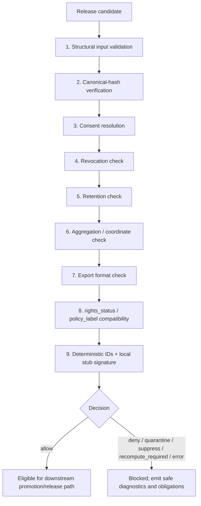

<!-- [KFM_META_BLOCK_V2]
doc_id: ADR-0241
title: Policy Obligation Engine + Release Gate v1
type: standard
version: v1
status: draft
owners: governance
created: <TODO-VERIFY-CREATED-DATE>
updated: 2026-05-01
policy_label: PROPOSED
related: [policy/gates/release_gate.v1.yaml, policy/consent/*.md, contracts/DecisionEnvelope.v1, contracts/PolicyEvaluationResult.v1, <TODO-VERIFY-schema-home>]
tags: [kfm, adr, governance, policy, release-gate, consent, retention, publication]
notes: [Converted from user-supplied ADR draft; kfm://doc UUID and canonical schema home require verification; all implementation claims remain PROPOSED until repo evidence is inspected]
[/KFM_META_BLOCK_V2] -->

# ADR-0241: Policy Obligation Engine + Release Gate v1

Deterministic, offline, fixture-backed governance gate for blocking unsafe release, controlled access, and export transitions.

---

## Decision snapshot

| Field | Value |
|---|---|
| ADR | `ADR-0241` |
| Status | `draft` |
| Owners | `governance` |
| Updated | `2026-05-01` |
| Policy label | `PROPOSED` |
| Proposed path | `docs/adr/ADR-0241-policy-obligation-engine-release-gate-v1.md` |
| Primary outputs | `DecisionEnvelope.v1`, `PolicyEvaluationResult.v1` |
| Release rule | No public, controlled, or export release unless the final decision is `allow`. |
| Runtime posture | Offline, deterministic, fixture-backed, no network calls. |

> [!IMPORTANT]
> This ADR describes a **governed state transition gate**, not a file move, UI helper, or source mutation step. A release candidate remains blocked unless the gate emits `allow` and all required receipts, evidence, rights, sensitivity, retention, consent, and hash checks are satisfied.

---

## Context

KFM needs an offline release gate that can evaluate whether an artifact may move into a public, controlled, or export channel without relying on a remote policy service, remote signing authority, VC registry, or online source check.

The gate exists because publication is where internal interpretation becomes external reliance. A release candidate may have valid data, useful evidence, and appealing map output, but it is still unsafe to publish when source identity, consent, rights, retention, coordinate exposure, or artifact integrity cannot be resolved.

This ADR introduces a deterministic local policy obligation engine and release gate for v1. The gate consumes already-prepared release inputs, evaluates them in a fixed order, emits structured decision objects, and fails closed on missing or unsafe conditions.

---

## Decision

KFM will introduce a local, deterministic policy release gate that evaluates candidate artifacts before they can move to:

| Channel class | Examples | Gate posture |
|---|---|---|
| `public` | Public maps, public catalog records, public exports, public Evidence Drawer payloads | Strictest; exact coordinates blocked by default. |
| `controlled` | Steward-reviewed access, restricted reviewer surfaces, internal-but-shared packages | Must satisfy channel-specific consent, rights, retention, and sensitivity checks. |
| `export` | Download bundles, partner packages, report extracts, machine-readable datasets | Must satisfy export format, rights, retention, evidence, and hash checks. |

The gate emits two first-class objects:

1. `DecisionEnvelope.v1` — the compact decision surface, including final decision, release permission, reason codes, required obligations, deterministic IDs, and a local stub signature.
2. `PolicyEvaluationResult.v1` — the detailed evaluation trace, including gate inputs, check results, policy profile hash, release channel, safe output subset, and non-sensitive diagnostics.

No artifact may be publicly released, controlled-released, exported, aliased as current, or surfaced through normal public clients unless the final decision is `allow`.

---

## Scope

### Included

- Structural validation of release-gate inputs.
- Canonical hash verification for candidate artifact, evidence bundle, run receipt, gate config, and policy/consent profile inputs.
- Consent and revocation handling.
- Retention checks.
- Coordinate and aggregation checks.
- Export format checks.
- `rights_status` and `policy_label` compatibility checks.
- Deterministic local IDs and local stub signature.
- Offline fixtures and no-network test cases.

### Excluded from v1

- Remote Sigstore, VC registry, transparency log, or remote policy server calls.
- Live source fetching or live source rights verification.
- Mutation of source `EvidenceBundle` records.
- Autopublication, auto-approval, or bypass of review/promotion gates.
- Full machine-readable obligations profile parsing beyond hashing source profile bytes.

---

## Inputs

| Input | Required | Purpose | Fail-closed condition |
|---|---:|---|---|
| Artifact metadata | Yes | Identifies candidate artifact, channel, policy label, rights status, sensitivity, spatial/temporal scope, export format, and declared hashes. | Missing schema, unknown channel, missing required fields, hash mismatch. |
| `EvidenceBundle` | Yes | Resolves evidence support, source role, provenance, citation support, and sensitivity context. | Missing bundle, unresolved evidence, hash mismatch, insufficient release state. |
| `run_receipt` | Yes | Anchors process provenance, tool identity, input hashes, output hashes, and run failures. | Missing receipt, stale receipt, hash mismatch, failed run state. |
| Obligations profile | Yes | Provides policy/consent profile bytes currently stored under `policy/consent/*.md`. | Missing profile, hash mismatch, required consent reference missing. |
| Gate config | Yes | Provides release-gate settings from `policy/gates/release_gate.v1.yaml`. | Missing config, unknown version, hash mismatch. |
| `revoke_delta` | Optional | Supplies revocation updates for the candidate evaluation. | Revoked consent, malformed delta, attempted persistence of revocation token. |

> [!NOTE]
> In v1, the obligations profile is treated as a hashed input. Machine-readable obligation semantics are intentionally deferred to v2 unless the real repository already contains a stronger convention.

---

## Outputs

### `DecisionEnvelope.v1`

`DecisionEnvelope.v1` is the release-facing decision object. It is safe for downstream automation and review surfaces when policy-safe fields only are emitted.

| Field family | Required content |
|---|---|
| Identity | `decision_id`, `candidate_artifact_id`, `release_channel`, `gate_version`, `evaluated_at` |
| Decision | `decision`, `release_allowed`, `reason_codes`, `obligations` |
| Evidence | `evidence_bundle_id`, `evidence_bundle_hash`, `run_receipt_id`, `run_receipt_hash` |
| Policy | `policy_profile_hash`, `gate_config_hash`, `policy_label`, `rights_status` |
| Privacy | Redacted/generalized coordinate posture; no revocation token. |
| Integrity | Candidate artifact hash, canonical input hash, local stub signature. |

Recommended decision grammar for v1:

| Decision | Release allowed? | Meaning |
|---|---:|---|
| `allow` | Yes | Candidate passed all required checks for the requested channel. |
| `deny` | No | Candidate failed a release requirement. |
| `quarantine` | No | Candidate requires isolation because required evidence, policy, rights, schema, hash, or sensitivity state is unresolved. |
| `suppress` | No | Direct artifact is affected by revocation and must be suppressed from release surfaces. |
| `recompute_required` | No | Derived artifact is affected by revocation and must be recomputed before further release evaluation. |
| `error` | No | Gate failed to evaluate deterministically; release remains blocked. |

### `PolicyEvaluationResult.v1`

`PolicyEvaluationResult.v1` is the detailed evaluation report. It may contain richer diagnostics than `DecisionEnvelope.v1`, but it still must not persist revocation tokens, secrets, precise blocked coordinates, or unsafe source internals.

| Field family | Required content |
|---|---|
| Evaluation | Ordered check list, pass/fail/error state, reason codes, obligations. |
| Inputs | Hashes and IDs for artifact metadata, `EvidenceBundle`, `run_receipt`, policy profile, gate config, and optional revoke delta. |
| Gate trace | Structural, hash, consent, revocation, retention, aggregation, export, rights, and policy-label results. |
| Safe diagnostics | Reviewable explanation of failure without leaking sensitive data. |
| Signature stub | Deterministic local stub signature over canonical safe output. |

---

## Evaluation order

The gate evaluates in a fixed order. Earlier failures may short-circuit when continuing would expose sensitive data or produce misleading output.

### Gate checks

| Step | Check | Required behavior |
|---:|---|---|
| 1 | Structural input validation | Validate schemas, required fields, known release channel, known gate version, and required object references. |
| 2 | Canonical-hash verification | Recompute declared hashes and fail closed on mismatch. |
| 3 | Consent resolution | Confirm required consent references exist when policy requires them. |
| 4 | Revocation check | Apply `revoke_delta` without persisting revocation token. |
| 5 | Retention check | Deny expired or retention-ineligible artifacts. |
| 6 | Aggregation / coordinate check | Block exact public coordinate release; require approved generalization/redaction for public-safe outputs. |
| 7 | Export format check | Deny unknown or disallowed export formats for the requested channel. |
| 8 | Rights / policy-label compatibility | Verify `rights_status`, `policy_label`, release channel, and evidence support are compatible. |
| 9 | Deterministic IDs + signature | Emit deterministic IDs and local stub signature over canonical safe output. |

---

## Fail-closed doctrine

The gate must fail closed on every release-significant uncertainty below.

| Condition | Required outcome | Notes |
|---|---|---|
| Missing schema | `deny` or `quarantine` | The gate must not evaluate an untyped artifact as releasable. |
| Missing policy profile | `deny` | No policy profile means no release authority. |
| Missing consent reference where required | `deny` | Applies when artifact class, source role, channel, or policy label requires consent. |
| Expired retention | `deny` | Artifact cannot be released/exported past retention allowance. |
| Unknown release channel | `deny` | Unknown channel cannot inherit public or controlled defaults. |
| Revoked consent, direct artifact | `suppress` | The directly affected artifact is removed from release eligibility. |
| Revoked consent, derived artifact | `recompute_required` | Derived outputs must be rebuilt without revoked support before reevaluation. |
| Hash mismatch | `deny` | Artifact, evidence, receipt, config, or policy bytes are not trusted. |
| Exact coordinates for public release | `deny` | Public exact coordinate release is blocked unless a future policy explicitly proves a safe exception. |
| Unknown export format | `deny` | Format safety and obligation behavior cannot be inferred. |
| Rights/policy-label incompatibility | `deny` | Public or export release cannot exceed rights and label constraints. |

---

## Revocation handling

Revocation is handled as a release-state fact, not as a reason to mutate source evidence.

| Case | Gate outcome | Required follow-up |
|---|---|---|
| Revoked consent affects a direct artifact | `suppress` | Remove or withhold the artifact from release surfaces; record safe suppression reason. |
| Revoked consent affects a derived artifact | `recompute_required` | Rebuild derived artifact without revoked support, emit new receipt, and rerun the release gate. |
| Revocation token supplied | Never persisted | The token may be used for the current evaluation only. Outputs may include safe reason codes, not the token. |

> [!WARNING]
> No source `EvidenceBundle` is mutated during rollback or revocation handling. The gate produces a decision and obligations; it does not rewrite source truth.

---

## Privacy and coordinate posture

Coordinates are blocked for exact public release in v1. Public outputs may proceed only when the candidate uses policy-safe metadata or an approved public-safe transform.

| Output type | v1 posture |
|---|---|
| Exact public coordinates | Blocked. |
| Generalized public geometry | Allowed only after transform evidence, hash verification, and gate approval. |
| Controlled exact geometry | Requires channel-specific policy, consent, rights, review, and retention checks. |
| Exported geometry | Requires export-format, rights, policy label, coordinate, and retention checks. |
| Evidence Drawer metadata | Must show safe source, rights, sensitivity, review, and policy state without leaking blocked precision. |

---

## No-network posture

v1 runs completely offline.

The gate does **not** call:

- Sigstore, Cosign, Rekor, or any remote signing service.
- Verifiable credential registries.
- Remote policy engines or policy servers.
- Live source APIs.
- External rights, consent, or identity services.

The v1 signature is a **local stub signature** for deterministic fixture and workflow testing. It is not an external attestation and must not be represented as one.

---

## Proposed contract homes

The real repository schema authority remains unresolved until the mounted repo is inspected. Use the existing repo convention if it is stronger or already canonical. Do not create duplicate authority across `contracts/` and `schemas/contracts/v1/`.

| Artifact | Candidate home | Status |
|---|---|---|
| ADR | `docs/adr/ADR-0241-policy-obligation-engine-release-gate-v1.md` | PROPOSED |
| Gate config | `policy/gates/release_gate.v1.yaml` | Supplied by ADR draft; presence NEEDS VERIFICATION |
| Consent profiles | `policy/consent/*.md` | Supplied by ADR draft; machine-readable v2 NEEDS VERIFICATION |
| `DecisionEnvelope.v1` schema | `schemas/contracts/v1/policy/decision_envelope.v1.schema.json` | PROPOSED; schema home NEEDS VERIFICATION |
| `PolicyEvaluationResult.v1` schema | `schemas/contracts/v1/policy/policy_evaluation_result.v1.schema.json` | PROPOSED; schema home NEEDS VERIFICATION |
| Gate validator | `tools/validators/policy/release_gate_v1.*` | PROPOSED |
| Fixtures | `tests/fixtures/policy/release_gate/v1/{valid,invalid}/` | PROPOSED |
| Policy tests | `tests/policy/release_gate_v1.*` | PROPOSED |

---

## Fixture plan

The first implementation slice should be fixture-backed and no-network.

| Fixture | Expected decision | Purpose |
|---|---|---|
| `valid_public_generalized_metadata.json` | `allow` | Proves happy path without exact public coordinates. |
| `invalid_missing_schema.json` | `deny` or `quarantine` | Proves schema absence fails closed. |
| `invalid_missing_policy_profile.json` | `deny` | Proves profile absence blocks release. |
| `invalid_missing_required_consent.json` | `deny` | Proves required consent cannot be skipped. |
| `invalid_expired_retention.json` | `deny` | Proves retention expiry blocks release/export. |
| `invalid_unknown_channel.json` | `deny` | Proves unknown channels cannot inherit defaults. |
| `invalid_hash_mismatch.json` | `deny` | Proves canonical hash mismatch blocks release. |
| `invalid_exact_public_coordinates.json` | `deny` | Proves exact coordinates are blocked for public release. |
| `revoked_direct_artifact.json` | `suppress` | Proves direct revocation handling. |
| `revoked_derived_artifact.json` | `recompute_required` | Proves derived revocation handling. |

---

## Acceptance criteria

- [ ] `DecisionEnvelope.v1` and `PolicyEvaluationResult.v1` schemas exist in the verified canonical schema home.
- [ ] The release gate can run offline using only fixtures, local config, and local policy profile bytes.
- [ ] Every fail-closed condition in this ADR has at least one negative fixture.
- [ ] Happy-path fixture emits `allow` only when all required hashes, evidence, rights, consent, retention, coordinate, and export checks pass.
- [ ] Revoked direct artifact emits `suppress`.
- [ ] Revoked derived artifact emits `recompute_required`.
- [ ] Revocation token is never persisted in output fixtures, receipts, logs, or safe diagnostics.
- [ ] Exact public coordinates are blocked.
- [ ] Missing schema, missing policy profile, unknown channel, expired retention, and hash mismatch cannot pass.
- [ ] Local stub signature covers canonical safe output and is deterministic across repeated offline runs.
- [ ] Rollback is code/config/schema revert only; no source `EvidenceBundle` mutation occurs.

---

## Consequences

### Benefits

- Makes release/export safety inspectable before publication.
- Converts release policy from implied convention into a deterministic gate.
- Preserves KFM’s cite-or-abstain and fail-closed posture at the publication boundary.
- Keeps revocation handling explicit without leaking revocation tokens.
- Provides fixture-ready validation before live connectors, UI wiring, or remote attestations.

### Costs

- Adds schema, fixture, validator, and policy maintenance burden.
- Requires schema-home authority to be resolved before machine files land.
- Requires v2 work if obligations profiles need machine-readable semantics instead of byte hashing.
- Requires careful field redaction so diagnostics remain useful without leaking sensitive data.

### Risks

| Risk | Mitigation |
|---|---|
| Gate becomes decorative while release bypasses it. | Public, controlled, and export workflows must require `allow` from this gate before release. |
| Duplicate schema authority appears under both `contracts/` and `schemas/contracts/v1/`. | Resolve schema-home authority before landing machine files. |
| Revocation token leaks into outputs. | Add fixture and test that fails on token persistence. |
| Local stub signature is mistaken for external attestation. | Label as `local_stub` and keep remote signing out of v1. |
| Exact coordinates leak through diagnostics or Evidence Drawer payloads. | Emit policy-safe diagnostics only; test public coordinate denial and diagnostic redaction. |

---

## Rollback

Rollback is code/config/schema revert. It must not mutate source `EvidenceBundle` records.

Rollback options:

1. Revert the ADR-driven schema/config/validator changes.
2. Restore prior `release_gate.v1.yaml` config if changed.
3. Disable the release-gate integration point while preserving emitted decision artifacts as audit history.
4. Reevaluate any candidate releases that depended on the reverted gate version.

Rollback records should identify the gate version, config hash, affected release candidates, and safe reason codes.

---

## Open verification items

| Item | Status | Why it matters |
|---|---|---|
| Canonical schema home between `contracts/` and `schemas/contracts/v1/` | NEEDS VERIFICATION | Prevents duplicate machine-contract authority. |
| Exact existing ADR path convention | NEEDS VERIFICATION | This draft proposes `docs/adr/`, but the mounted repo must decide. |
| Whether `policy/consent/*.md` should become machine-readable in v2 | NEEDS VERIFICATION | v1 hashes file bytes; v2 may need structured obligation semantics. |
| Existing `DecisionEnvelope` naming and finite grammar | NEEDS VERIFICATION | Avoids conflicting object versions. |
| Existing policy runner/tooling | UNKNOWN | Determines validator and CI command shape. |
| Existing release/promotion workflow | UNKNOWN | Determines where this gate plugs into release. |
| Existing signature/attestation convention | UNKNOWN | v1 uses local stub only. |

---

## Review checklist

- [ ] Governance owners accept the fail-closed condition list.
- [ ] Schema-home ADR or equivalent decision exists before machine files are added.
- [ ] Privacy reviewer confirms exact public coordinate block and safe diagnostics posture.
- [ ] Consent/rights reviewer confirms v1 hashed-profile approach is acceptable for draft implementation.
- [ ] Release workflow owner confirms no public/controlled/export release can bypass the gate.
- [ ] Test owner confirms every denial/suppression/recompute path has a fixture.

---

## Status

`draft` / `PROPOSED`

This ADR is ready for review as a governance design document. It is not implementation proof. Landing machine contracts, validators, fixtures, or release workflow integration requires direct repository inspection and schema-home verification.
