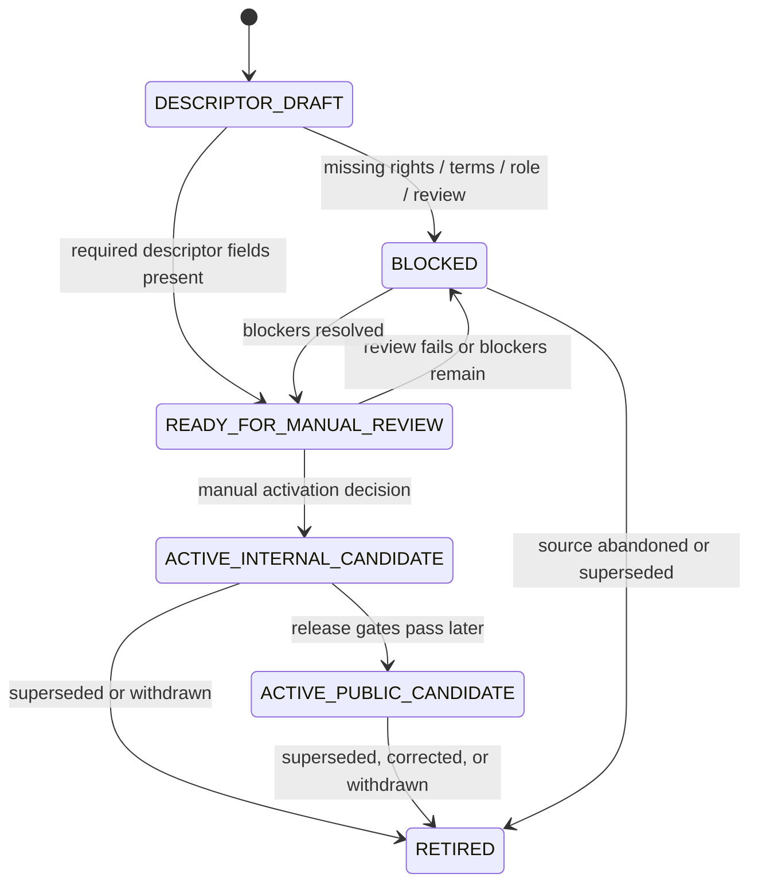
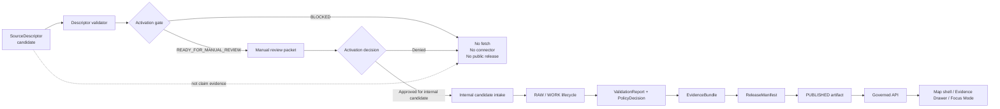
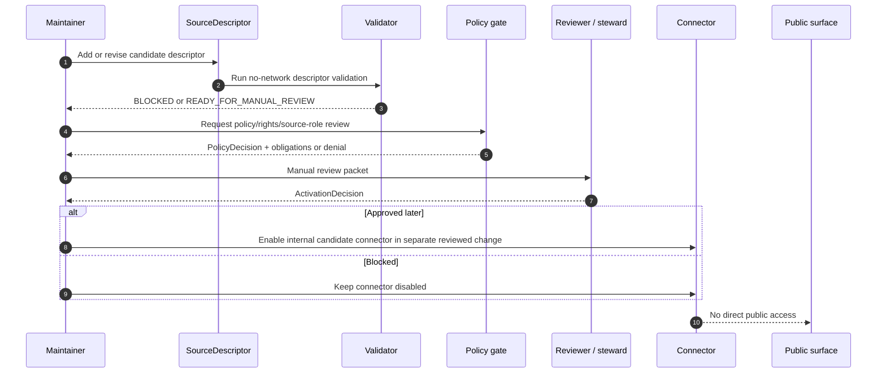

<!-- [KFM_META_BLOCK_V2]
doc_id: kfm://adr/ADR-0303-hydrology-source-descriptor-activation-gates
title: ADR-0303: Hydrology Source Descriptor Activation Gates
type: architecture-decision-record
version: v1.0
status: accepted-with-activation-blocked
owners: @bartytime4life; hydrology-domain-steward NEEDS_VERIFICATION; policy-steward NEEDS_VERIFICATION
created: NEEDS_VERIFICATION__YYYY-MM-DD
updated: 2026-05-06
policy_label: public
related: [./README.md, ./ADR-0001-schema-home.md, ./ADR-0201-policy-home.md, ../runbooks/hydrology-source-activation-gates.md, ../domains/hydrology/README.md, ../../contracts/objects/source-descriptor/README.md, ../../data/registry/sources/hydrology/, ../../tools/validators/validate_hydrology_source_descriptors.py, ../../tests/domains/hydrology/test_hydrology_source_descriptors.py, ../../tests/domains/hydrology/test_hydrology_source_role_policy.py]
tags: [kfm, adr, hydrology, source-descriptor, source-activation, source-rights, fail-closed, descriptor-first, no-network, governance]
notes: [
  Replaces the thin ADR-0303 note with a full decision record while preserving the original decision: candidate official hydrology sources are descriptor-only, blocked, and non-fetching.
  Current repository evidence includes hydrology source descriptor JSON files, a validator, tests, and a source activation runbook; test execution and CI enforcement still need verification in this revision context.
  This ADR governs activation gates only; it does not approve live connectors, public release, data fetch, claim evidence, or publication.
]
[/KFM_META_BLOCK_V2] -->

<a id="top"></a>

# ADR-0303: Hydrology Source Descriptor Activation Gates

<p align="center">
  <strong>Candidate hydrology sources may be registered before they are activated, but they must remain descriptor-only, non-fetching, non-public, and blocked until manual verification gates pass.</strong>
</p>

<p align="center">
  
  
  
  
  
</p>

<p align="center">
  <a href="#decision">Decision</a> ·
  <a href="#why-this-adr-exists">Why</a> ·
  <a href="#source-families-covered">Sources</a> ·
  <a href="#activation-state-machine">State machine</a> ·
  <a href="#gate-requirements">Gates</a> ·
  <a href="#enforcement-and-tests">Enforcement</a> ·
  <a href="#rollback-or-supersession">Rollback</a>
</p>

> [!IMPORTANT]
> **Accepted decision:** Hydrology source descriptors may exist before source activation, but candidate official sources must stay blocked until explicit manual review and gate transition.
>
> **Non-negotiable defaults:** `connector_enabled=false`, `data_fetch_allowed=false`, `public_release_allowed=false`, and no public claims from descriptors alone.

> [!CAUTION]
> A `SourceDescriptor` is **not** claim evidence, **not** a publication decision, **not** a connector approval, and **not** permission to fetch live data. It is a governed admission record that makes source identity, source role, rights, sensitivity, review state, and activation blockers inspectable.

---

## Decision

KFM accepts the descriptor-first activation model for official hydrology source families.

The original ADR-0303 decision is preserved and expanded:

| Original decision element | Expanded ADR-0303 rule |
|---|---|
| Register candidate official hydrology sources as descriptor-only. | Source descriptors may be committed under the repository’s hydrology source registry before activation. |
| Keep them blocked. | Candidate descriptors must remain in a blocked or manual-review state until all activation gates pass. |
| Keep them non-fetching. | No live connector, scheduled watcher, API probe, data fetch, or public release may run from a candidate descriptor. |
| Require manual review before activation. | Activation requires descriptor review, rights/terms review, source-role review, policy review, verification receipt, and an explicit activation decision. |
| Roll back by reverting descriptor/register/gate files and keeping connectors disabled. | Rollback disables or reverts descriptors while preserving lineage and keeping connectors, fetch, and public release blocked. |

### Normative rules

1. **Descriptor first:** candidate hydrology sources enter KFM as `SourceDescriptor` records before connector activation.
2. **Blocked by default:** every candidate descriptor starts with blocked activation posture.
3. **No live fetch by descriptor:** a descriptor alone must not enable data fetch, connector execution, watcher scheduling, public aliases, map publication, or AI/Focus Mode claim support.
4. **No public release by candidate descriptor:** public release is denied until rights, source role, policy, validation, evidence closure, catalog/proof closure, review, and promotion gates pass.
5. **Manual review is required:** automated validation can prove shape and blocked posture; it cannot replace steward/manual review for activation.
6. **Finite gate states are required:** activation state must be explicit and machine-readable.
7. **Source roles stay narrow:** regulatory, observation, boundary, network, terrain, and derived context sources must not be collapsed into one generic “hydrology source” authority.
8. **Descriptors are not evidence:** EvidenceBundle-backed claims must cite resolved evidence artifacts, not a source descriptor alone.
9. **Rollback preserves lineage:** rollback disables activation or reverts descriptor changes without deleting historical review, receipt, or decision context.

<p align="right"><a href="#top">Back to top ↑</a></p>

---

## Why this ADR exists

Hydrology is KFM’s first proof lane because it exercises the whole trust spine: source identity, spatial scope, temporal support, source-role separation, proof objects, policy gates, map rendering, Evidence Drawer explanation, Focus Mode abstention, release, correction, and rollback.

That proof lane becomes unsafe if source registration is confused with source activation.

### Failure modes prevented

| Failure mode | What would go wrong | ADR-0303 response |
|---|---|---|
| Descriptor becomes connector approval | A JSON record silently enables live fetch. | Descriptors must keep `connector_enabled=false` until an activation decision changes state. |
| Unknown rights leak into public output | Source terms or redistribution rights are unresolved. | Unknown rights block public release and activation. |
| Regulatory context becomes observed event evidence | FEMA NFHL or similar context is mislabeled as observed flooding. | Source-role gates preserve `regulatory_flood_hazard_context`. |
| Network/boundary/reference data is overclaimed | WBD, NHDPlus HR, 3DEP, or Water Data sources support claims outside their role. | Allowed/disallowed claim types are explicit. |
| Public UI bypasses release gates | A map layer, drawer, API, or Focus Mode answer reads candidate data. | Public surfaces remain downstream of governed release and EvidenceBundle closure. |
| Activation cannot be audited | Review state, terms check, and receipt references are missing. | Activation requires review receipts and explicit gate transition. |
| Rollback deletes evidence of what happened | Bad descriptors are removed without lineage. | Rollback disables or supersedes; history remains inspectable. |

<p align="right"><a href="#top">Back to top ↑</a></p>

---

## Scope and non-goals

### In scope

- Hydrology source descriptor activation policy.
- Candidate descriptor states for official external hydrology source families.
- Minimum fields required before descriptor registration.
- Manual gate requirements before live fetch, connector activation, public release, or claim use.
- Validator expectations for blocked, non-fetching, non-public posture.
- Source-role separation for the first hydrology proof lane.
- Rollback and supersession behavior for source descriptor activation changes.

### Out of scope

- Approving any live connector.
- Approving public release of source data or derived artifacts.
- Defining every `SourceDescriptor` schema field.
- Deciding canonical schema home. See `ADR-0001-schema-home.md`.
- Deciding canonical policy home. See `ADR-0201-policy-home.md`.
- Replacing the hydrology domain README, source activation runbook, source descriptor contract object, or validator implementation.
- Proving CI enforcement, workflow execution, production runtime behavior, or deployment posture without current execution evidence.

<p align="right"><a href="#top">Back to top ↑</a></p>

---

## Evidence basis

| Evidence | Status | What it supports | Limits |
|---|---|---|---|
| Existing ADR-0303 file | CONFIRMED repository file | Minimal decision, consequence, and rollback statement for descriptor-only blocked hydrology source registration. | Existing file was thin and did not define gates, state machine, or enforcement detail. |
| `docs/runbooks/hydrology-source-activation-gates.md` | CONFIRMED repository file | Activation requires descriptor, verification receipt, policy, and gate decision; PR-003 allowed results are `BLOCKED` or `READY_FOR_MANUAL_REVIEW`; promotion remains governed state transition. | Does not prove CI/runtime enforcement by itself. |
| `contracts/objects/source-descriptor/README.md` | CONFIRMED repository file | SourceDescriptor is the source-admission object; it is not ingestion, publication, or claim proof. | The README labels several schema/owner/runtime items as needing verification. |
| Hydrology source descriptor JSON files | CONFIRMED repository files | Candidate hydrology source descriptors exist with blocked, non-fetching, non-public posture. | Documentation URL checks, rights, terms, attribution, steward, and review are still unresolved in the descriptors. |
| `tools/validators/validate_hydrology_source_descriptors.py` | CONFIRMED repository file | Validator checks required fields, allowed blocked/manual statuses, and requires connector/fetch/public release booleans to remain false. | File presence does not prove every workflow or branch protection runs it. |
| `tests/domains/hydrology/test_hydrology_source_descriptors.py` | CONFIRMED repository file | Test invokes the hydrology source descriptor validator. | Test existence does not prove latest execution result in this revision context. |
| `tests/domains/hydrology/test_hydrology_source_role_policy.py` | CONFIRMED repository file | Test asserts source-role knowledge character separation for FEMA NFHL, WBD, and 3DEP. | Does not cover every source family or all downstream claim policies. |
| Hydrology domain README | CONFIRMED repository file | Hydrology lane treats source descriptors as inactive until reviewed and keeps NFHL as regulatory context, not observed flood extent. | README is draft/experimental and still names owners and adjacent paths as needing verification. |

### Truth posture used here

| Label | Meaning |
|---|---|
| CONFIRMED | Verified in current repository evidence or attached KFM doctrine visible to this revision. |
| ACCEPTED | Adopted as an architecture decision in this ADR. |
| NEEDS VERIFICATION | Checkable item not yet proven by review, execution output, CI evidence, steward signoff, or runtime trace. |
| UNKNOWN | Not verified strongly enough to claim. |
| PROPOSED | Recommended future implementation or cleanup not yet proven as implemented. |
| DENY / ABSTAIN / ERROR / BLOCKED | System outcomes or gate states, not rhetorical labels. |

<p align="right"><a href="#top">Back to top ↑</a></p>

---

## Source families covered

ADR-0303 applies to hydrology source families registered as candidate official external descriptors.

| Descriptor | Source role | Allowed claim character | Public release | Connector / fetch |
|---|---|---|---:|---:|
| `usgs-wbd` | `hydrologic_unit_boundary_reference` | `hydrologic_unit_boundary` | denied by default | disabled |
| `usgs-water-data` | `observed_hydrology_source` | `observed_streamflow_time_series` | denied by default | disabled |
| `usgs-nhdplus-hr` | `hydrography_network_reference` | `hydrography_network_reference` | denied by default | disabled |
| `usgs-3dep` | `elevation_terrain_context` | `elevation_terrain_context` | denied by default | disabled |
| `fema-nfhl` | `regulatory_flood_hazard_context` | `regulatory_flood_hazard_context` | denied by default | disabled |

> [!WARNING]
> `fema-nfhl` must not support `observed_flood_event` claims. It may support regulatory flood hazard context only, unless a later reviewed source-role decision says otherwise.

### Role separation rules

| Source-role class | May support | Must not be used as |
|---|---|---|
| Hydrologic boundary reference | watershed or hydrologic-unit framing | observed discharge, flood event, or water level evidence |
| Observed hydrology source | observed time-series evidence under explicit parameter/unit/time support | legal floodplain determination or watershed boundary truth |
| Hydrography network reference | network/reference context and identity bridging | observed flow, flood extent, or legal boundary by itself |
| Elevation/terrain context | terrain-derived context after derivative validation | direct hydrologic observation |
| Regulatory flood hazard context | regulatory hazard context | observed flood event or emergency condition evidence |

<p align="right"><a href="#top">Back to top ↑</a></p>

---

## Activation state machine

ADR-0303 defines descriptor activation as a governed state transition. File presence is not activation.



### Allowed PR-003 states

For the PR-003 descriptor-registration stage, allowed outcomes are intentionally narrow:

| State | Meaning | Connector | Fetch | Public release |
|---|---|---:|---:|---:|
| `blocked_needs_verification` | Descriptor exists, but rights/terms/manual review are unresolved. | false | false | false |
| `blocked_rights_unknown` | Rights posture blocks activation. | false | false | false |
| `blocked_policy` | Policy review blocks activation. | false | false | false |
| `descriptor_only` | Descriptor is registered only as source inventory. | false | false | false |
| `ready_for_manual_review` | Required descriptor fields are present and the source may be manually reviewed. | false | false | false |

Any state that enables fetch, connector execution, public release, public aliasing, or claim use is out of scope for this ADR unless a later activation decision supersedes this gate.

<p align="right"><a href="#top">Back to top ↑</a></p>

---

## Gate requirements

### Registration gates

A hydrology source descriptor may be registered only when these fields or equivalent schema-approved fields are present:

| Gate | Required descriptor concern | Failure outcome |
|---|---|---|
| Identity | `source_id`, `source_name`, `source_family`, source type, official/source URL where applicable. | `ERROR` or `BLOCKED` |
| Source role | `source_role`, `knowledge_character`, authority level, allowed/disallowed claim types. | `BLOCKED` |
| Rights | `rights_status`, rights basis, terms review status, attribution requirements. | `BLOCKED` / public `DENY` |
| Publication | `public_release_allowed=false` at candidate stage. | `ERROR` / reject descriptor |
| Fetch posture | `connector_enabled=false` and `data_fetch_allowed=false`. | `ERROR` / reject descriptor |
| Manual review | `documentation_check_receipt_id`, review status, activation blockers. | `READY_FOR_MANUAL_REVIEW` or `BLOCKED` |
| No-network validation | `no_network_validation_required=true` or equivalent. | `BLOCKED` |
| Evidence limitation | descriptor states it is not claim evidence. | `BLOCKED` |

### Activation gates

A descriptor may not move beyond blocked/manual-review posture until all required activation evidence is recorded.

| Gate | Required evidence before activation | Why it matters |
|---|---|---|
| Descriptor completeness | Descriptor validates against the approved source descriptor shape. | Prevents unlabeled or ambiguous source admission. |
| Documentation review | Official documentation URL/terms source reviewed and receipt recorded. | Prevents stale or unverified source assumptions. |
| Rights and terms | License, terms, redistribution, attribution, and derivative limits reviewed. | Unknown rights block public release. |
| Source-role review | Allowed/disallowed claim types confirmed by domain steward. | Prevents source authority inflation. |
| Policy decision | Policy gate records allow/deny/obligations. | Keeps activation policy-visible. |
| Sensitivity review | Public exposure class and geometry precision risks reviewed. | Prevents unsafe release. |
| No-network fixture proof | Offline fixtures validate success and failure states. | Keeps first proof lane deterministic. |
| Manual activation decision | Human/steward decision records activation target and scope. | Activation remains governed, not accidental. |
| Rollback reference | Rollback/disable procedure is documented. | Bad activation remains reversible. |

<p align="right"><a href="#top">Back to top ↑</a></p>

---

## Descriptor-to-public-surface boundary



A candidate descriptor can inform source review and registry visibility. It cannot feed a public map layer, Evidence Drawer payload, Focus Mode answer, report, export, release alias, or claim until downstream evidence and release gates pass.

<p align="right"><a href="#top">Back to top ↑</a></p>

---

## Enforcement and tests

### Repository enforcement surfaces

| Surface | Confirmed role | ADR-0303 expectation |
|---|---|---|
| `tools/validators/validate_hydrology_source_descriptors.py` | Checks required descriptor keys, allowed activation states, and false connector/fetch/public flags. | Continue to fail closed for missing fields or any candidate descriptor that enables fetch, connector, or public release. |
| `tests/domains/hydrology/test_hydrology_source_descriptors.py` | Invokes the descriptor validator. | Should remain a fast no-network regression check. |
| `tests/domains/hydrology/test_hydrology_source_role_policy.py` | Asserts role/knowledge-character separation for selected sources. | Should expand when additional source families or claim types are admitted. |
| `docs/runbooks/hydrology-source-activation-gates.md` | Defines activation requires descriptor, receipt, policy, and gate decision. | Should link back to this ADR and list manual review packet requirements. |
| `data/registry/sources/hydrology/*.source_descriptor.json` | Holds candidate descriptor records. | Must remain blocked/non-fetching/non-public until explicit gate transition. |

### Expected no-network check

```bash
python tools/validators/validate_hydrology_source_descriptors.py
```

Expected candidate-stage result:

```text
PASS hydrology source descriptors blocked
```

> [!NOTE]
> The command above is repository-grounded because the validator path exists. Its latest execution result, CI coverage, and branch-protection status still require current run/workflow evidence before being claimed as enforced.

### Negative cases that must fail

| Case | Expected failure |
|---|---|
| Candidate descriptor has `connector_enabled=true`. | Reject descriptor. |
| Candidate descriptor has `data_fetch_allowed=true`. | Reject descriptor. |
| Candidate descriptor has `public_release_allowed=true`. | Reject descriptor. |
| Candidate descriptor omits `rights_status`. | Reject descriptor. |
| Candidate descriptor omits `source_role`. | Reject descriptor. |
| Candidate descriptor uses activation state outside the allowed PR-003 set. | Reject descriptor. |
| FEMA NFHL descriptor allows `observed_flood_event`. | Reject source-role policy. |
| Source descriptor is used as EvidenceBundle claim evidence. | DENY or ABSTAIN claim path. |

<p align="right"><a href="#top">Back to top ↑</a></p>

---

## Activation workflow



### Manual review packet minimum

A manual review packet should include:

- descriptor path and digest;
- source family and source role;
- allowed/disallowed claim types;
- official documentation and terms references;
- rights/terms assessment;
- sensitivity and public exposure assessment;
- no-network fixture result;
- policy decision and obligations;
- reviewer/steward identity or placeholder;
- activation target state;
- rollback/disable reference.

<p align="right"><a href="#top">Back to top ↑</a></p>

---

## Public claim policy

ADR-0303 blocks all public claims that rely only on a candidate source descriptor.

| Public-surface action | Candidate descriptor result |
|---|---|
| Display descriptor as source inventory | Allowed only if public-safe and clearly marked candidate/blocked. |
| Show raw source data | DENY. |
| Enable source-backed map layer | DENY until release gates pass. |
| Use source in Evidence Drawer claim support | DENY unless EvidenceBundle resolves to admitted evidence artifacts. |
| Use source in Focus Mode answer | ABSTAIN or DENY unless EvidenceBundle and citation validation pass. |
| Promote source-derived public artifact | DENY until rights, policy, proof, release, and rollback gates pass. |
| Use descriptor to justify emergency, life-safety, or operational instruction | DENY. |

<p align="right"><a href="#top">Back to top ↑</a></p>

---

## Consequences

### Positive consequences

- Hydrology sources can be inventoried without silently activating connectors.
- Reviewers can inspect rights, role, sensitivity, and blockers before data movement.
- Source-role separation becomes testable.
- Public release remains downstream of evidence, catalog, proof, policy, and release gates.
- Live connector work can be staged safely after descriptor review.
- Rollback is simple while candidates remain descriptor-only.
- Focus Mode and Evidence Drawer cannot treat source registration as proof.

### Costs and follow-up burden

- Source activation takes more review work than “add endpoint and fetch.”
- Manual review packets and receipts need maintenance.
- Validators must be kept aligned with descriptor schema changes.
- New source roles require tests and policy updates.
- Public-facing UI must distinguish candidate inventory from released evidence.
- CI/workflow enforcement still needs explicit proof before this ADR can claim automation maturity.

<p align="right"><a href="#top">Back to top ↑</a></p>

---

## Documentation updates required

| File | Required update |
|---|---|
| `docs/adr/README.md` | Add ADR-0303 to the ADR index and clarify status. |
| `docs/runbooks/hydrology-source-activation-gates.md` | Link this ADR and expand manual review packet fields. |
| `docs/domains/hydrology/README.md` | Link this ADR where source descriptors and inactive-by-default posture are described. |
| `contracts/objects/source-descriptor/README.md` | Link this ADR as a hydrology-domain activation example. |
| `data/registry/sources/hydrology/README.md` if added | State candidate descriptors must remain blocked until gate transition. |
| `tests/domains/hydrology/README.md` if added | Document no-network descriptor checks and source-role policy tests. |
| `docs/registers/VERIFICATION_BACKLOG.md` | Track unresolved rights, terms, steward, CI, and source review items. |

<p align="right"><a href="#top">Back to top ↑</a></p>

---

## Acceptance and verification criteria

ADR-0303 is accepted for decision posture. The following items determine whether implementation maturity can be upgraded.

- [x] ADR file exists in `docs/adr/`.
- [x] Hydrology source activation runbook exists.
- [x] Hydrology source descriptor JSON files exist for candidate source families.
- [x] Validator file exists for blocked candidate descriptor posture.
- [x] Test file exists that invokes the validator.
- [x] Source-role policy test exists for selected hydrology source-role distinctions.
- [ ] ADR index includes ADR-0303.
- [ ] Latest validator execution output is attached or linked.
- [ ] Latest CI/workflow status proves the validator/test is enforced.
- [ ] Rights and terms review receipts exist for each candidate source.
- [ ] Source-role steward review exists for each candidate source.
- [ ] PolicyDecision or equivalent activation gate output exists for each candidate source.
- [ ] Manual review packet exists for any source moving beyond blocked/manual-review state.
- [ ] Rollback reference is linked from the review packet or descriptor registry.
- [ ] Public UI/API/Focus Mode checks prove candidate descriptors cannot be used as claim evidence.

<p align="right"><a href="#top">Back to top ↑</a></p>

---

## Rollback or supersession

Rollback for ADR-0303-compatible source registration is intentionally low-risk because candidate descriptors do not fetch, publish, or enable connectors.

### Rollback rules

1. Keep connectors disabled.
2. Keep `data_fetch_allowed=false`.
3. Keep `public_release_allowed=false`.
4. Revert or disable the affected descriptor.
5. Preserve descriptor history, receipt references, and review notes.
6. Re-run descriptor validator.
7. Re-run source-role policy checks when role fields changed.
8. Record rollback in the repo-standard rollback card or verification backlog.
9. Do not delete release/proof/correction history if a later activated source produced downstream artifacts.

### Supersession rules

A descriptor may be superseded when:

- the source changes official documentation or endpoint family;
- rights/terms posture changes;
- source role changes;
- steward review identifies overbroad claim support;
- activation decision changes;
- a newer descriptor schema version is adopted.

Supersession must preserve the old descriptor’s identity, review state, and downstream dependency references.

<p align="right"><a href="#top">Back to top ↑</a></p>

---

## Alternatives considered

| Alternative | Decision | Reason |
|---|---|---|
| Enable connectors as soon as descriptors exist. | Rejected | Collapses source inventory into source activation. |
| Allow public release with `rights_status=UNKNOWN`. | Rejected | Violates fail-closed rights posture. |
| Treat all official federal sources as automatically public-safe. | Rejected | Official status does not settle terms, attribution, cadence, source role, or public claim scope. |
| Use one generic hydrology source role. | Rejected | Boundary, observation, regulatory, terrain, and network sources support different claims. |
| Let the browser or Focus Mode interpret candidate descriptors directly. | Rejected | Public clients and AI must stay downstream of governed evidence and release. |
| Delete blocked descriptors instead of tracking candidates. | Rejected | Loses source-intake lineage and review backlog. |
| Accept this ADR as proof of CI enforcement. | Rejected | File evidence exists, but current run/workflow proof still needs verification. |

<p align="right"><a href="#top">Back to top ↑</a></p>

---

## Open verification items

| Item | Why it matters | Current posture |
|---|---|---|
| ADR index update | Maintainers need discoverable decision status. | NEEDS VERIFICATION |
| Latest validator execution | File presence is not execution proof. | NEEDS VERIFICATION |
| CI/workflow enforcement | The ADR should not claim branch protection without workflow evidence. | UNKNOWN |
| Source rights and terms receipts | Unknown rights block activation and public release. | NEEDS VERIFICATION |
| Source steward ownership | Activation requires accountable review. | NEEDS VERIFICATION |
| PolicyDecision object format | Activation gate output should be machine-readable and reviewable. | NEEDS VERIFICATION |
| Manual review packet location | Activation review needs a stable home. | NEEDS VERIFICATION |
| Descriptor schema canonical home | Related to ADR-0001 schema-home authority. | NEEDS VERIFICATION |
| Source-authority register alignment | Candidate descriptors and control-plane register should not drift. | NEEDS VERIFICATION |
| Public UI/API negative proof | Candidate descriptors must not become public claim evidence. | NEEDS VERIFICATION |

<p align="right"><a href="#top">Back to top ↑</a></p>

---

<details>
<summary><strong>Appendix A — Maintainer checklist for source activation PRs</strong></summary>

Use this checklist before any hydrology source moves beyond descriptor-only registration.

- [ ] Descriptor is present and validates.
- [ ] Descriptor path and digest are recorded.
- [ ] `connector_enabled=false` remains true for descriptor-only PRs.
- [ ] `data_fetch_allowed=false` remains true for descriptor-only PRs.
- [ ] `public_release_allowed=false` remains true for descriptor-only PRs.
- [ ] Rights status is resolved or explicitly blocks activation.
- [ ] Terms review is resolved or explicitly blocks activation.
- [ ] Source role and knowledge character are reviewed.
- [ ] Allowed and disallowed claim types are explicit.
- [ ] Sensitivity/public exposure is reviewed.
- [ ] Documentation check receipt exists.
- [ ] Policy gate result exists.
- [ ] Manual review packet exists before any activation.
- [ ] Rollback reference exists.
- [ ] No public API, map layer, Evidence Drawer payload, Focus Mode answer, or export reads from candidate descriptors as evidence.
- [ ] CI/workflow evidence is attached when claiming enforcement.

</details>

<details>
<summary><strong>Appendix B — Glossary</strong></summary>

| Term | Working meaning |
|---|---|
| `SourceDescriptor` | Governed source-admission record declaring source identity, source role, rights, sensitivity, support, cadence, review state, validation plan, and publication intent. |
| `descriptor-only` | Source is registered for review/inventory only; it does not fetch, publish, or support public claims. |
| `activation_status` | Machine-readable gate state for a descriptor. |
| `connector_enabled` | Boolean that determines whether a source connector may run. Candidate descriptors must keep it `false`. |
| `data_fetch_allowed` | Boolean that determines whether KFM may fetch or ingest from the source. Candidate descriptors must keep it `false`. |
| `public_release_allowed` | Boolean that determines whether source-derived material may reach public release. Candidate descriptors must keep it `false`. |
| `knowledge_character` | Source evidence character, such as hydrologic-unit boundary, observed streamflow time series, regulatory context, hydrography network reference, or elevation terrain context. |
| `manual review packet` | Activation review bundle containing descriptor, rights/terms review, source-role review, validation result, policy decision, activation target, and rollback reference. |
| `BLOCKED` | Source cannot activate until blockers are resolved. |
| `READY_FOR_MANUAL_REVIEW` | Descriptor may proceed to manual review, but connector/fetch/public release remain disabled. |

</details>

<p align="right"><a href="#top">Back to top ↑</a></p>
