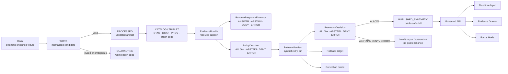

<!-- [KFM_META_BLOCK_V2]
doc_id: kfm://doc/NEEDS-VERIFICATION-adr-0304-hydrology-first-proof-lane
title: ADR-0304: Hydrology-First Proof Lane
type: standard
version: v1.1-review
status: review
owners: OWNER_TBD_NEEDS_VERIFICATION: architecture steward; hydrology domain steward; release steward; documentation steward
created: NEEDS_VERIFICATION-YYYY-MM-DD
updated: 2026-05-06
policy_label: internal-draft
related: [
  ./README.md,
  ./ADR-0001-schema-home.md,
  ./ADR-0005-promotion-gate.md,
  ../runbooks/foundation-strategy.md,
  ../domains/hydrology/README.md,
  ../domains/hydrology/architecture/ARCHITECTURE.md,
  ../../fixtures/domains/hydrology/release_manifests/hydrology_synthetic_streamflow.release_manifest.json
]
tags: [
  kfm,
  adr,
  hydrology,
  proof-lane,
  synthetic-fixture,
  no-network,
  evidence-first,
  map-first,
  time-aware,
  promotion,
  release,
  rollback
]
notes: [
  Decision status is accepted for sequencing; document status remains review until owner, created-date, policy-label, ADR-index, and enforcement evidence are verified.
  This revision normalizes the visible ADR number to the target path ADR-0304 and preserves prior hydrology-first decision lineage.
  Hydrology is selected as the first proof-bearing lane because it can exercise KFM trust behavior with public-safe spatial-temporal fixture evidence before higher-sensitivity domains.
  This ADR does not authorize live connectors, emergency alerting, direct public internal-stage access, public raw model output, or real-source publication without source, rights, policy, catalog, proof, review, correction, and rollback closure.
]
[/KFM_META_BLOCK_V2] -->

<a id="top"></a>

# ADR-0304: Hydrology-First Proof Lane

Hydrology is KFM’s first proof-bearing domain lane for exercising the governed path from source-aware fixture evidence to published, inspectable, rollback-capable public surfaces.

<p align="center">
  
  
  
  
  
</p>

<p align="center">
  <a href="#decision">Decision</a> ·
  <a href="#context">Context</a> ·
  <a href="#repo-fit">Repo fit</a> ·
  <a href="#evidence-basis">Evidence basis</a> ·
  <a href="#why-hydrology-first">Why hydrology first</a> ·
  <a href="#scope">Scope</a> ·
  <a href="#proof-lane-contract">Proof-lane contract</a> ·
  <a href="#minimum-first-slice">First slice</a> ·
  <a href="#implementation-sequence">Implementation</a> ·
  <a href="#validation-and-acceptance">Validation</a> ·
  <a href="#rollback">Rollback</a>
</p>

> [!IMPORTANT]
> **Decision status:** `accepted` for KFM build sequencing.  
> **Document status:** `review` because ownership, created date, ADR index coverage, policy label, CI enforcement, branch protections, and runtime behavior still need verification.  
> **Target path:** `docs/adr/ADR-0304-hydrology-first-proof-lane.md`.  
> **Primary rule:** hydrology proves the trust path first; it does not bypass the trust path.

> [!WARNING]
> This ADR authorizes a **synthetic, no-network, public-safe proof lane first**. It does **not** authorize live source fetching, emergency alerting, direct public access to internal lifecycle stores, direct model-runtime access, or public promotion of real-world hydrology data without source, rights, policy, review, catalog, proof, correction, and rollback closure.

---

## Decision

KFM will use **hydrology** as the first proof-bearing domain lane.

The first hydrology slice must prove the KFM trust path with synthetic or pinned no-network fixtures before live connectors, broad UI expansion, model-runtime integration, or high-sensitivity domain releases.

```text
documentation control plane
  -> schema/source/release authority
  -> hydrology no-network fixtures
  -> validators and fail-closed policy checks
  -> EvidenceRef -> EvidenceBundle closure
  -> finite runtime and promotion outcomes
  -> ReleaseManifest dry run
  -> governed API / MapLibre / Evidence Drawer / Focus Mode payloads
  -> synthetic public-safe published drill
  -> live-source activation only after gates pass
```

### Accepted rule

Hydrology is first because it can exercise the whole KFM publication spine while staying comparatively public-safe and technically legible:

```text
RAW -> WORK / QUARANTINE -> PROCESSED -> CATALOG / TRIPLET -> PUBLISHED
```

Promotion remains a governed state transition, not a file move.

### Outcome vocabulary

| Surface | Machine outcomes | Use in this ADR |
|---|---|---|
| Runtime answer / Focus Mode | `ANSWER`, `ABSTAIN`, `DENY`, `ERROR` | Governs request-time responses over released fixture evidence. |
| Policy decision | `ALLOW`, `ABSTAIN`, `DENY`, `ERROR` | Governs admissibility and release constraints. |
| Promotion decision | `ALLOW`, `ABSTAIN`, `DENY`, `ERROR` | Governs whether a release candidate can become published. |
| Validation gate | `PASS`, `FAIL`, `ABSTAIN`, `ERROR` | Governs per-check validator results. |

`PROMOTE` may be used as a human verb. The machine decision that permits promotion is `ALLOW` unless a later accepted ADR changes the enum.

<p align="right"><a href="#top">Back to top ↑</a></p>

---

## Context

KFM is a Kansas-first, map-first, time-aware, evidence-first, governed spatial knowledge and publication system. The durable unit of value is the inspectable claim, not the map tile, graph edge, generated answer, dashboard, or fixture alone.

The foundation strategy directs the project to build from the governance and proof spine outward. The hydrology domain docs identify hydrology as the first governed proof lane, and the hydrology architecture defines the lane around source intake, normalization, validation, proof assembly, and governed delivery.

The repository also contains a synthetic hydrology release manifest fixture with a synthetic public-safe scope, `no_network: true`, `not_official_source_data: true`, explicit prohibited source paths, evidence boundary notes, correction path, rollback target, and synthetic published status. That fixture is implementation evidence of a synthetic drill shape. It is not proof that live hydrology publication is complete.

### Numbering and lineage note

This file’s stable target path is:

```text
docs/adr/ADR-0304-hydrology-first-proof-lane.md
```

A prior revision at this path carried an `ADR-0305` visible title/metadata mismatch. This revision normalizes the visible title and document identity to `ADR-0304` while preserving the hydrology-first decision lineage. If the ADR registry later adopts a different canonical numbering scheme, add a supersession note rather than deleting this file.

<p align="right"><a href="#top">Back to top ↑</a></p>

---

## Repo fit

| Relationship | Path | Status | Role |
|---|---|---:|---|
| This ADR | `docs/adr/ADR-0304-hydrology-first-proof-lane.md` | `CONFIRMED target path / revised here` | Governs hydrology-first sequencing and proof-lane acceptance burden. |
| ADR index | [`./README.md`](./README.md) | `CONFIRMED / coverage NEEDS VERIFICATION` | ADR directory navigation, naming, evidence labels, review, rollback, and supersession discipline. |
| Schema-home ADR | [`./ADR-0001-schema-home.md`](./ADR-0001-schema-home.md) | `CONFIRMED / proposed decision` | Controls `schemas/contracts/v1/` versus `contracts/` authority before schema-bearing hydrology files multiply. |
| Promotion Gate ADR | [`./ADR-0005-promotion-gate.md`](./ADR-0005-promotion-gate.md) | `CONFIRMED / draft decision` | Defines promotion as governed release-state transition using finite outcomes. |
| Foundation strategy | [`../runbooks/foundation-strategy.md`](../runbooks/foundation-strategy.md) | `CONFIRMED / draft runbook` | Requires governance and proof spine before live-source activation, UI expansion, or runtime work. |
| Hydrology domain landing page | [`../domains/hydrology/README.md`](../domains/hydrology/README.md) | `CONFIRMED / draft` | Defines hydrology as first governed proof lane. |
| Hydrology architecture | [`../domains/hydrology/architecture/ARCHITECTURE.md`](../domains/hydrology/architecture/ARCHITECTURE.md) | `CONFIRMED / draft` | Names hydrology source intake, normalization, validation, proof assembly, and governed delivery components. |
| Synthetic release manifest fixture | [`../../fixtures/domains/hydrology/release_manifests/hydrology_synthetic_streamflow.release_manifest.json`](../../fixtures/domains/hydrology/release_manifests/hydrology_synthetic_streamflow.release_manifest.json) | `CONFIRMED fixture` | Proves synthetic no-network release-drill shape, not live-source maturity. |

### Directory Rules basis

`docs/adr/` is the right responsibility-root home because this is a human-facing architecture decision. Hydrology-specific schemas, fixtures, policies, validators, source descriptors, receipts, proofs, and published artifacts remain under their responsibility roots, not as new root-level hydrology folders.

<p align="right"><a href="#top">Back to top ↑</a></p>

---

## Evidence basis

| Evidence | Label | Supports | Limits |
|---|---:|---|---|
| Current target ADR path | `CONFIRMED` | Existing file path and hydrology-first decision surface. | Prior visible numbering/metadata needed correction. |
| Directory Rules | `CONFIRMED doctrine` | ADR belongs under `docs/adr/`; domains live under responsibility roots. | Does not prove runtime behavior. |
| ADR index | `CONFIRMED repo evidence` | ADRs are KFM’s decision ledger; ADRs record decisions and review burden separate from enforcement. | Complete ADR inventory and owner coverage remain `NEEDS VERIFICATION`. |
| Hydrology README | `CONFIRMED repo evidence` | Hydrology is KFM’s first governed proof lane and should prove the RAW → PUBLISHED trust path. | Some owner/path/policy maturity remains draft or placeholder. |
| Hydrology architecture | `CONFIRMED repo evidence` | Source intake, normalization, validation, proof assembly, and governed delivery are lane components. | Documentation evidence, not runtime proof. |
| Synthetic release manifest fixture | `CONFIRMED repo evidence` | Synthetic public-safe release drill shape, no-network posture, prohibited source paths, correction path, rollback target. | Explicitly synthetic and not official source data. |
| Foundation strategy runbook | `CONFIRMED repo evidence` | Governance/proof spine first; no-network hydrology proof before live activation. | Draft runbook, not platform enforcement proof. |
| Schema-home ADR | `CONFIRMED repo evidence / proposed decision` | Machine schemas should converge under the accepted schema-home rule before hydrology schema expansion. | Acceptance and enforcement remain `NEEDS VERIFICATION`. |
| Promotion Gate ADR | `CONFIRMED repo evidence / draft decision` | Promotion is release-state governance with finite outcomes and rollback posture. | Full evaluator, fixtures, CI enforcement, and branch protections remain `NEEDS VERIFICATION`. |

### Truth labels used here

| Label | Meaning |
|---|---|
| `CONFIRMED` | Verified from current repo evidence, supplied doctrine, or current-session inspection. |
| `PROPOSED` | A recommended implementation, path, gate, fixture, or workflow not yet proven complete. |
| `NEEDS VERIFICATION` | Checkable before acceptance, activation, or public release. |
| `UNKNOWN` | Not verified from repo files, tests, workflows, logs, dashboards, branch settings, deployment settings, or emitted proof objects. |
| `DENY` / `ABSTAIN` / `ERROR` | System outcomes, not rhetorical labels. |

<p align="right"><a href="#top">Back to top ↑</a></p>

---

## Why hydrology first

Hydrology is selected first because it is the strongest public-safe proof lane for KFM’s core operating laws.

| Reason | Why it matters for KFM |
|---|---|
| Spatially legible | Watersheds, sites, stream networks, and flood context are naturally map-first. |
| Time-aware | Observed time, source retrieval time, valid time, release time, and freshness can all be exercised. |
| Evidence-rich | Source descriptors, observations, catalog records, EvidenceBundles, and release manifests are meaningful in a small slice. |
| Public-safe when synthetic or pinned | A no-network fixture can prove the trust path without exposing sensitive locations or private data. |
| Failure states are obvious | Ambiguous identity, missing source role, unresolved EvidenceRef, NFHL mislabeling, and missing rollback can produce clear `ABSTAIN`, `DENY`, or `ERROR`. |
| Cross-domain leverage | Hydrology later connects to soils, hazards, agriculture, habitat, settlements, infrastructure, and climate without requiring those lanes to be first. |
| Governance burden is useful but bounded | Hydrology exercises rights, policy, catalog, release, proof, rollback, and map/UI trust without starting in archaeology, DNA, rare species, or critical infrastructure. |

Hydrology is not selected because it is the only important domain. It is selected because it is the safest lane to prove that KFM can publish correctly before it publishes broadly.

<p align="right"><a href="#top">Back to top ↑</a></p>

---

## Scope

### In scope

This ADR applies to the first proof-bearing hydrology lane and its synthetic release drill.

| In scope | Required posture |
|---|---|
| Synthetic or pinned hydrology fixtures | Small, reviewable, public-safe, no-network. |
| HUC / watershed fixture logic | Source-aware, geometry/content fingerprinted, catalogable. |
| Hydrologic identity and crosswalk tests | Ambiguity must be visible and may produce `ABSTAIN`. |
| USGS-style observation fixture shape | Parameter, unit, timestamp, qualifier/provisional state, no-data handling. |
| FEMA NFHL role separation fixture | Regulatory flood context only; never observed inundation. |
| Evidence closure | Consequential claims resolve `EvidenceRef -> EvidenceBundle`. |
| Runtime response behavior | Public request-time surfaces use `ANSWER`, `ABSTAIN`, `DENY`, or `ERROR`. |
| Promotion decision behavior | Release-state decisions use `ALLOW`, `ABSTAIN`, `DENY`, or `ERROR`. |
| ReleaseManifest dry run | Release identity, artifacts, catalogs, proof refs, policy decisions, correction path, rollback target. |
| MapLibre / Evidence Drawer / Focus Mode payload contracts | Downstream of governed release state and evidence closure. |
| Rollback drill | Alias movement and correction lineage without deleting immutable artifacts. |

### Out of scope

| Out of scope | Reason |
|---|---|
| Live hydrology source fetching in the first proof slice | Source rights, cadence, schema, availability, and policy review must come first. |
| Emergency alerting or life-safety guidance | KFM is not an emergency alerting system. |
| Hydrologic simulation products | Require model cards, uncertainty, calibration, source roles, and review gates. |
| Broad “water layer” collapse | Water quality, groundwater, wetlands, dams, structures, soil moisture, and allocation context require separate source roles and schemas. |
| Direct public access to RAW, WORK, QUARANTINE, processed internals, proof-only stores, review-only stores, or model runtimes | Public clients use governed APIs and released artifacts. |
| Public promotion of real source-derived hydrology data | Requires source descriptors, rights review, policy, validation, review, catalog closure, proof, release, correction, and rollback. |

<p align="right"><a href="#top">Back to top ↑</a></p>

---

## Proof-lane contract

The hydrology proof lane must prove **trust behavior**, not just map rendering.



### Required invariant

A hydrology feature, claim, or layer must not become public merely because it exists as a file, can be drawn on a map, validates against a schema, or appears in a fixture. It becomes externally reliable only after the promotion path produces release state, evidence closure, policy posture, review state, correction path, and rollback target.

### Finite runtime outcomes

| Outcome | Hydrology proof-lane use |
|---|---|
| `ANSWER` | EvidenceBundle resolves, policy allows, release state supports the public-safe claim, and citation/proof references are available. |
| `ABSTAIN` | Identity, evidence, source role, freshness, or support is insufficient, but no hard violation is proven. |
| `DENY` | A required rule fails: missing EvidenceBundle, source-role violation, rights/sensitivity problem, NFHL mislabeling, direct public internal-stage access, or unsafe geometry exposure. |
| `ERROR` | Evaluator, schema, resolver, catalog, policy, proof verifier, or runtime step fails before a trustworthy outcome can be produced. |

### Promotion outcomes

| Outcome | Hydrology proof-lane use |
|---|---|
| `ALLOW` | Candidate may become the named synthetic published release target because required gates and obligations are satisfied. |
| `ABSTAIN` | Candidate remains unpublished because support, review, evidence, source role, or release readiness is unresolved. |
| `DENY` | Candidate remains unpublished because a required rule is confirmed to fail. |
| `ERROR` | Candidate remains unpublished because the evaluator, resolver, validator, policy engine, or release tooling failed. |

<p align="right"><a href="#top">Back to top ↑</a></p>

---

## Minimum first slice

The first hydrology proof slice should remain narrow.

| Slice item | Minimum requirement | Negative-path requirement |
|---|---|---|
| SourceDescriptor fixture | Source role, rights posture, cadence, steward placeholder, activation state. | Missing rights/source role must fail closed. |
| HUC / watershed fixture | Stable identity, geometry/content fingerprint, bbox, CRS, source metadata. | Geometry/fingerprint mismatch must fail. |
| Hydrologic identity fixture | Exact, split, merge, retired, no legacy, and ambiguous cases where applicable. | Ambiguous relationship must produce `ABSTAIN`, not silent identity. |
| Observation fixture | Site, parameter, unit, value, timestamp, qualifier/provisional state, no-data reason. | Missing unit, time, qualifier, or no-data reason must fail or abstain by policy. |
| NFHL context fixture | Regulatory flood context labeling. | Any “observed inundation” label from NFHL must `DENY`. |
| EvidenceBundle fixture | Resolved EvidenceRefs, limitations, catalog/provenance refs, and integrity refs. | Unresolved EvidenceRef must `DENY`. |
| RuntimeResponseEnvelope fixture | Finite runtime outcome with reason codes and citations where required. | Unknown outcome or missing reason code must fail. |
| PromotionDecision fixture | Finite promotion outcome with gate results and release obligations. | Unknown outcome or missing gate reason must fail. |
| ReleaseManifest fixture | Synthetic release ID, content/release hash, artifact IDs, public surface IDs, correction path, rollback target. | Missing rollback/correction path must block promotion. |
| Layer / Evidence Drawer payload | Released layer ID, source role, freshness, proof refs, correction state. | Raw/work/quarantine/proof-only/internal refs must be blocked from public payloads. |
| Focus Mode payload | Evidence-bounded answer or abstention. | Uncited claim must `ABSTAIN`, `DENY`, or `ERROR`. |

<p align="right"><a href="#top">Back to top ↑</a></p>

---

## Required artifact families

This ADR does not require every artifact to be created in this file’s PR. It requires the proof lane to converge on these families before live-source promotion.

| Family | Responsibility root | Status in this ADR |
|---|---|---|
| Domain orientation docs | `docs/domains/hydrology/` | `CONFIRMED present / still maturing` |
| ADRs and runbooks | `docs/adr/`, `docs/runbooks/` | `CONFIRMED present for core decisions / completeness varies` |
| Machine schemas | `schemas/contracts/v1/` or accepted schema home | `PROPOSED / depends on schema-home ADR` |
| Narrative contracts | `contracts/` | `PROPOSED companion role where needed` |
| Source registry | `data/registry/` or accepted registry home | `PROPOSED / must not be bypassed` |
| Fixtures | `fixtures/` and/or repo-accepted fixture root | `CONFIRMED hydrology release-manifest fixture exists` |
| Validators | `tools/validators/` or repo-native validator root | `PROPOSED / NEEDS VERIFICATION` |
| Policy | `policy/` or repo-native policy root | `PROPOSED / NEEDS VERIFICATION` |
| Receipts | `data/receipts/` | `PROPOSED / required before real promotion` |
| Proofs | `data/proofs/` | `PROPOSED / required before real promotion` |
| Catalog/provenance | `data/catalog/`, `data/prov/`, or accepted homes | `PROPOSED / required before real promotion` |
| Published artifacts | `data/published/` or accepted release root | `PROPOSED for real data / synthetic fixture already declares synthetic published state` |
| Runtime/API/UI surfaces | `apps/`, `packages/`, or accepted app roots | `PROPOSED / downstream only` |

<p align="right"><a href="#top">Back to top ↑</a></p>

---

## Decision rules

### Rule 1 — Hydrology is first, not special forever

Hydrology gets first proof-lane priority. It does not get exemption from KFM governance.

Hydrology outputs must still satisfy source, evidence, policy, sensitivity, catalog, proof, release, correction, and rollback gates.

### Rule 2 — Synthetic first

The first hydrology release path must be synthetic or no-network/pinned.

Live data activation requires a later source descriptor and rights review gate.

### Rule 3 — Public-safe does not mean ungoverned

Synthetic public-safe data still needs lifecycle state, release state, evidence boundary, correction path, rollback target, and prohibited-source-path checks.

### Rule 4 — NFHL is regulatory context

FEMA NFHL-style flood data must not be labeled as observed flood extent or historical inundation evidence unless a separate evidence-backed source role proves that claim.

### Rule 5 — Ambiguity is a valid result

Ambiguous hydrologic identity, crosswalk uncertainty, unresolved source authority, or insufficient support must produce `ABSTAIN` or another explicit finite negative outcome. It must not be silently resolved.

### Rule 6 — Renderer is downstream

MapLibre may render a released hydrology layer. It may not decide truth, publication, source authority, policy, citation support, or release state.

### Rule 7 — AI is downstream

Focus Mode may summarize released, resolved hydrology evidence. It may not read RAW/WORK/QUARANTINE directly, publish uncited claims, or use generated text as proof.

### Rule 8 — Promotion owns publication

A ReleaseManifest or layer file is not public authority by itself. Promotion and release state govern public reliance.

<p align="right"><a href="#top">Back to top ↑</a></p>

---

## Implementation sequence

### Phase 0 — Inventory and guardrails

- [ ] Confirm ADR numbering and update `docs/adr/README.md`.
- [ ] Inventory hydrology docs, schemas, contracts, fixtures, validators, policies, release fixtures, and tests.
- [ ] Record any duplicate or legacy hydrology architecture paths.
- [ ] Confirm whether `schemas/contracts/v1/` is canonical or whether a migration/ADR is still pending.
- [ ] Confirm fixture roots: `fixtures/`, `tests/fixtures/`, and/or `data/fixtures/`.

### Phase 1 — No-network proof fixtures

- [ ] Add or confirm small hydrology fixtures for watershed identity, source descriptor, observation, NFHL role separation, EvidenceBundle, RuntimeResponseEnvelope, PromotionDecision, ReleaseManifest, and rollback target.
- [ ] Mark all source-derived claims as synthetic or fixture-backed.
- [ ] Keep live connector activation off.

### Phase 2 — Validators and policy

- [ ] Validate fixture schema shape.
- [ ] Validate evidence closure.
- [ ] Validate source-role separation.
- [ ] Validate public path restrictions.
- [ ] Validate finite outcomes.
- [ ] Validate correction and rollback references.

### Phase 3 — Catalog and release dry run

- [ ] Produce catalog/provenance closure or fixture equivalents.
- [ ] Produce ReleaseManifest dry-run output.
- [ ] Produce PromotionDecision output.
- [ ] Produce rollback drill output.
- [ ] Do not promote real-world source data.

### Phase 4 — Governed UI/API payloads

- [ ] Serve only governed release payloads.
- [ ] Render MapLibre layer from released/synthetic-safe layer manifest.
- [ ] Show Evidence Drawer support, limitations, freshness, correction state, and proof refs.
- [ ] Make Focus Mode cite, abstain, deny, or error.

### Phase 5 — Live source activation candidate

Live source activation may be proposed only after:

- [ ] SourceDescriptor is reviewed.
- [ ] Rights and terms are confirmed.
- [ ] Update cadence and source schema are documented.
- [ ] Network behavior is tested outside public release.
- [ ] Policy gates fail closed.
- [ ] Promotion and rollback tests pass.
- [ ] Public UI/API cannot bypass the governed path.

<p align="right"><a href="#top">Back to top ↑</a></p>

---

## Validation and acceptance

### Validation matrix

| Validation | Must prove | Expected failure behavior |
|---|---|---|
| Schema validation | Required object shapes are machine-checkable. | `ERROR` on malformed validator/schema; `DENY` invalid candidate. |
| Source descriptor validation | Source role, rights, cadence, steward, activation state. | `ABSTAIN` or `DENY` until complete. |
| Evidence closure | EvidenceRefs resolve to EvidenceBundle. | `DENY` unresolved evidence. |
| Source-role separation | Regulatory context is not treated as observation. | `DENY` mislabeled NFHL/observed flood claim. |
| Hydrologic identity | Exact and ambiguous crosswalks are distinguishable. | `ABSTAIN` ambiguous identity. |
| Temporal validation | Observation/retrieval/release/freshness time fields stay distinct. | `ABSTAIN`, `DENY`, or `ERROR` by field severity. |
| Public path validation | Public payloads avoid RAW, WORK, QUARANTINE, internal stores, proof-only stores, model outputs. | `DENY` direct public bypass. |
| Catalog closure | Catalog/provenance refs align with release artifacts. | `ABSTAIN` or `DENY` incomplete closure. |
| Runtime envelope | Public request-time answers use finite runtime outcomes. | `ERROR` unknown outcome. |
| Promotion decision | Release state uses finite promotion outcome. | `ERROR` unknown outcome. |
| Rollback drill | Prior release/alias/correction path is reversible and auditable. | Block promotion until rollback target exists. |

### Acceptance checklist

This ADR is accepted as a sequencing decision. The hydrology proof lane is implementation-ready only when the checks below pass.

- [ ] Hydrology proof-lane docs and ADR links are indexed.
- [ ] No-network hydrology fixtures exist for success and failure cases.
- [ ] Fixture data is synthetic, public-safe, or rights-reviewed pinned data.
- [ ] Live connectors are disabled until source activation gates pass.
- [ ] EvidenceBundle validation has positive and negative tests.
- [ ] RuntimeResponseEnvelope uses finite request-time outcomes.
- [ ] PromotionDecision uses finite release-state outcomes.
- [ ] ReleaseManifest dry run has correction path and rollback target.
- [ ] Promotion Gate blocks publication when evidence, rights, policy, catalog, proof, review, or rollback is incomplete.
- [ ] MapLibre layer manifests consume only governed release payloads.
- [ ] Evidence Drawer payloads expose source role, limitations, freshness, policy state, correction state, and proof refs.
- [ ] Focus Mode cannot emit uncited or unsupported hydrology claims.
- [ ] Public clients cannot read RAW, WORK, QUARANTINE, internal canonical stores, review-only stores, proof-only stores, or model runtime outputs directly.
- [ ] Validation output is captured in a PR note, receipt, or repo-native artifact.
- [ ] Rollback is tested without deleting immutable release history.

<p align="right"><a href="#top">Back to top ↑</a></p>

---

## Consequences

### Positive consequences

- Gives KFM a concrete proof lane without starting in the most sensitive domains.
- Exercises evidence, policy, release, UI, and rollback together.
- Makes hydrology the first reusable pattern for later domains.
- Prevents “map draws, therefore published” drift.
- Creates early negative-path discipline around ambiguity, source-role errors, rights uncertainty, and unresolved EvidenceRefs.
- Provides a public-safe path for MapLibre, Evidence Drawer, and Focus Mode integration.

### Costs

- Slows broad domain expansion until the hydrology proof spine works.
- Requires validators, fixtures, policy gates, and release objects before live connector value is visible.
- Requires strict separation between synthetic proof, pinned fixture, preview, release candidate, and published real-world data.
- Requires maintaining correction and rollback artifacts even for early synthetic drills.

### Tradeoff accepted

KFM accepts slower initial feature delivery in exchange for a proof-bearing architecture that can scale safely into harder domains.

<p align="right"><a href="#top">Back to top ↑</a></p>

---

## Risks and mitigations

| Risk | Impact | Mitigation |
|---|---|---|
| Synthetic fixture is mistaken for real hydrology data. | Public trust confusion. | Keep `synthetic`, `no_network`, and `not_official_source_data` flags visible in release fixtures and UI payloads. |
| Hydrology-first becomes hydrology-only. | Later domains stall. | Treat hydrology as reusable proof pattern; document handoff criteria for soil, habitat/fauna, hazards, agriculture, and settlements. |
| Map layer bypasses evidence. | Map becomes false truth authority. | Require EvidenceBundle and release payloads for public layer interaction. |
| NFHL is mislabeled. | Regulatory context becomes false observed flood claim. | Enforce source-role separation and negative fixtures. |
| Live connector lands too early. | Rights, schema, cadence, availability, or policy failure can leak into public surfaces. | Keep connectors inactive until source descriptor and policy gates pass. |
| Ambiguous identity is silently resolved. | False hydrologic relationships enter catalog/UI/AI. | Require `ABSTAIN` and reason codes for ambiguity. |
| Rollback is not ready. | Published error cannot be corrected cleanly. | Block promotion until rollback target and correction path exist. |
| ADR numbering conflict obscures authority. | Maintainers may cite the wrong decision record. | Use full path as identity and update ADR index. |

<p align="right"><a href="#top">Back to top ↑</a></p>

---

## Rollback

This ADR can be superseded, but the decision history must remain visible.

### If hydrology-first sequencing proves wrong

1. Create a superseding ADR.
2. Preserve this file as lineage.
3. Record why a different first proof lane is safer or more buildable.
4. Map hydrology fixtures, validators, schemas, and release objects to the new proof lane if reusable.
5. Keep negative-path lessons: source role, EvidenceBundle closure, finite outcomes, public path denial, correction, and rollback.

### If a hydrology proof release must be rolled back

1. Select a prior immutable release target or remove the public alias.
2. Verify the prior ReleaseManifest, EvidenceBundle, catalog/provenance refs, and proof refs.
3. Emit rollback receipt and correction notice.
4. Preserve old release artifacts, receipts, proofs, catalogs, and decisions.
5. Update governed API/UI payloads to show correction state.
6. Do not delete evidence history to hide the problem.

### Revert path for this file

If this ADR expansion is rejected, revert this file only. Do not remove existing hydrology README, architecture docs, release fixture, or foundation strategy references without a separate preservation and migration decision.

<p align="right"><a href="#top">Back to top ↑</a></p>

---

## Open verification backlog

| Item | Status | Closure path |
|---|---:|---|
| ADR owner/steward list | `NEEDS VERIFICATION` | Check CODEOWNERS, docs registry, or maintainer assignment. |
| Created date for original ADR stub | `UNKNOWN` | Use git history if needed. |
| ADR index completeness | `NEEDS VERIFICATION` | Update `docs/adr/README.md` to include this ADR and status. |
| ADR numbering reuse | `NEEDS VERIFICATION` | Inventory ADR filenames and decide whether lane-specific numbering needs an index rule. |
| Hydrology architecture duplicate/legacy path handling | `NEEDS VERIFICATION` | Reconcile `docs/domains/hydrology/ARCHITECTURE.md` and `docs/domains/hydrology/architecture/ARCHITECTURE.md` if both exist. |
| Canonical schema home | `NEEDS VERIFICATION` | Apply or update `ADR-0001-schema-home.md`. |
| Validator command names | `UNKNOWN` | Inspect package manager and existing validator tooling. |
| Policy engine and deny reason vocabulary | `UNKNOWN` | Inspect `policy/`, tests, and CI. |
| Promotion Gate implementation | `NEEDS VERIFICATION` | Confirm `ADR-0005` acceptance, schemas, fixtures, and workflow enforcement. |
| Live hydrology connector readiness | `UNKNOWN / DENY by default` | Require source descriptor, rights review, policy, fixtures, validators, and dry run. |
| Public runtime behavior | `UNKNOWN` | Verify API/UI tests, deployed routes, logs, and dashboards before claiming. |
| Branch protection / CI enforcement | `UNKNOWN` | Verify GitHub settings and workflow runs. |

<p align="right"><a href="#top">Back to top ↑</a></p>

---

## Alternatives considered

| Alternative | Decision | Reason |
|---|---:|---|
| Start with UI polish or map shell first | Rejected | A polished map can hide weak evidence, policy, and release semantics. |
| Start with governed AI first | Rejected | AI must be downstream of EvidenceBundle, policy, release state, and citation validation. |
| Start with archaeology, DNA, rare species, or critical infrastructure | Rejected | These domains have high sensitivity and access-control burden before the proof spine is proven. |
| Start with broad multi-domain ingest | Rejected | Too much source-role, rights, schema, and review complexity at once. |
| Start with live hydrology connectors | Deferred | Hydrology is first, but live source activation follows descriptor, rights, policy, and validation gates. |
| Treat synthetic release manifest as full implementation proof | Rejected | Synthetic fixture proves a drill shape, not live publication maturity. |
| Treat file move to `published/` as promotion | Rejected | Promotion is a governed decision with proof, review, correction, and rollback. |

<p align="right"><a href="#top">Back to top ↑</a></p>

---

## Supersession and change rules

This ADR may be updated when:

- hydrology proof-lane acceptance criteria change;
- ADR numbering/index policy is normalized;
- schema-home or source-registry authority changes;
- Promotion Gate outcome grammar changes;
- live hydrology activation gates are accepted;
- MapLibre/Evidence Drawer/Focus Mode payload contracts change;
- correction/rollback behavior changes;
- a later proof lane supersedes hydrology-first sequencing.

Every material update must preserve:

- source/evidence boundary;
- lifecycle law;
- public-client governed-interface rule;
- EvidenceBundle priority;
- fail-closed policy posture;
- finite outcomes;
- correction and rollback visibility.

<p align="right"><a href="#top">Back to top ↑</a></p>
