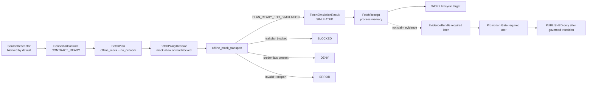
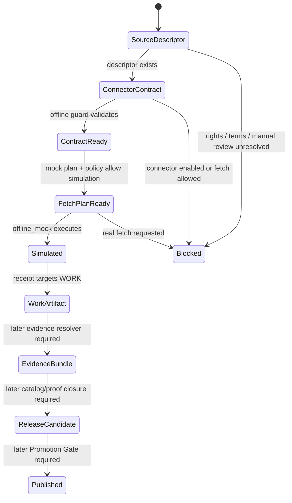

<!-- [KFM_META_BLOCK_V2]
doc_id: kfm://doc/NEEDS-VERIFICATION-ADR-0306-hydrology-connector-contract-and-offline-simulation
title: ADR-0306: Hydrology Connector Contract and Offline Simulation
type: adr
version: v1.1
status: accepted-with-live-fetch-blocked
owners: @bartytime4life NEEDS_VERIFICATION; hydrology-domain-steward NEEDS_VERIFICATION; connector-steward NEEDS_VERIFICATION; policy-steward NEEDS_VERIFICATION; release-steward NEEDS_VERIFICATION
created: NEEDS_VERIFICATION
updated: 2026-05-06
policy_label: NEEDS-VERIFICATION
related: [./README.md, ./ADR-0303-hydrology-source-descriptor-activation-gates.md, ./ADR-0304-hydrology-first-proof-lane.md, ./ADR-0005-promotion-gate.md, ./ADR-0307-hydrology-wbd-metadata-probe.md, ../domains/hydrology/README.md, ../runbooks/hydrology-offline-fetch-simulation.md, ../../tools/connectors/offline_mock_transport.py, ../../tools/validators/validate_hydrology_connector_contracts.py, ../../tools/validators/validate_hydrology_fetch_simulation.py, ../../tests/domains/hydrology/test_hydrology_offline_mock_transport.py, ../../fixtures/domains/hydrology/connector_contracts/, ../../fixtures/domains/hydrology/fetch_plans/, ../../fixtures/domains/hydrology/fetch_receipts/, ../../data/registry/sources/hydrology/]
tags: [kfm, adr, hydrology, connector-contract, offline-simulation, no-network, source-descriptor, fixture, fail-closed, evidence-boundary, promotion-blocked]
notes: [
  ADR for hydrology connector contracts and offline simulation.
  Decision is accepted for the no-network connector boundary; live connector activation remains blocked.
  Connector contracts, fetch plans, mock responses, and fetch receipts are not EvidenceBundles, not public claim evidence, and not public-release authority.
  Owners, created date, policy label, CI enforcement, branch protection, latest validator execution, and live-source activation posture remain NEEDS VERIFICATION.
]
[/KFM_META_BLOCK_V2] -->

<a id="top"></a>

# ADR-0306: Hydrology Connector Contract and Offline Simulation

Hydrology connector contracts may exist as guarded interface records only when live fetch, credentials, public release, and claim evidence use remain blocked.

<p align="center">
  
  
  
  
  
</p>

<p align="center">
  <a href="#decision">Decision</a> ·
  <a href="#repo-fit">Repo fit</a> ·
  <a href="#scope">Scope</a> ·
  <a href="#evidence-basis">Evidence</a> ·
  <a href="#contract-boundary">Contract boundary</a> ·
  <a href="#offline-simulation-flow">Offline flow</a> ·
  <a href="#enforcement-and-tests">Enforcement</a> ·
  <a href="#promotion-boundary">Promotion boundary</a> ·
  <a href="#rollback-and-supersession">Rollback</a> ·
  <a href="#acceptance-checklist">Acceptance</a>
</p>

> [!IMPORTANT]
> **Accepted boundary:** hydrology connector contracts are allowed as **stubbed, disabled, fixture-backed interface records**.
>
> **Live-source posture:** `DENY` by default.
>
> **Evidence posture:** connector output, mock output, and `FetchReceipt` records are **not** `EvidenceBundle` support.
>
> **Release posture:** nothing in this ADR can move an artifact to `PUBLISHED`.

> [!WARNING]
> This ADR does **not** approve live HTTP, OGC API, ArcGIS REST, WMS, WFS, FTP, public S3 fetches, browser fetches, scheduled source watchers, credentialed access, source-data downloads, public aliases, public map layers, Evidence Drawer claim support, Focus Mode claim support, or publication of hydrology source-derived artifacts.

---

## Decision

KFM accepts a **hydrology connector contract boundary** and a **no-network offline simulation path** for the hydrology proof lane.

The decision is narrow:

| Decision area | Accepted rule |
|---|---|
| Connector contract | May describe an interface, supported operations, required gates, prohibited transports, receipt expectations, and rollback target. |
| Connector runtime | Must remain disabled under this ADR. |
| Fetch behavior | Must use `offline_mock` only. |
| Credentials | Must not be required, present, loaded, mocked as secrets, or checked into fixtures. |
| Output | May emit `FetchSimulationResult` and `FetchReceipt` process artifacts only. |
| Lifecycle target | May target `WORK` or another non-public intermediate target approved elsewhere. |
| Evidence boundary | Must explicitly state the output is not `EvidenceBundle` support. |
| Publication boundary | Public release remains blocked until a separate Promotion Gate decision allows it. |

### Normative rules

1. Connector contracts are interface boundaries, not activation approvals.
2. Every hydrology connector contract starts and remains blocked unless a later ADR and gate decision supersede this ADR.
3. The only allowed transport under this ADR is `offline_mock`.
4. Offline simulation must require `no_network=true`.
5. Offline simulation must require no credentials.
6. Connector output must not be treated as official source data.
7. Connector output must not be treated as public claim evidence.
8. `FetchReceipt` records are process memory, not proof of truth.
9. Simulation output must not become public API, MapLibre, Evidence Drawer, Focus Mode, export, or story input without later evidence, policy, catalog, proof, review, release, correction, and rollback closure.
10. Live-source activation remains governed by source descriptor activation gates.
11. Publication remains governed by the Promotion Gate.
12. Fail closed: when in doubt, return `BLOCKED`, `DENY`, `ABSTAIN`, or `ERROR` rather than fetching, publishing, or implying evidence support.

<p align="right"><a href="#top">Back to top ↑</a></p>

---

## Repo fit

| Field | Value |
|---|---|
| Target path | `docs/adr/ADR-0306-hydrology-connector-contract-and-offline-simulation.md` |
| Owning root | `docs/` |
| ADR family | Hydrology proof-lane decisions |
| Upstream decisions | `ADR-0303` source descriptor activation gates; `ADR-0304` hydrology-first proof lane; `ADR-0005` Promotion Gate |
| Downstream surfaces | hydrology source descriptors, connector fixtures, fetch plans, fetch receipts, validators, offline mock transport, no-network tests, runbooks, release dry runs |
| Current decision state | `accepted-with-live-fetch-blocked` |
| Current enforcement state | `partial / NEEDS VERIFICATION` |
| Current release state | no public-release authority from this ADR |

### Directory Rules basis

`docs/adr/` is the correct home because this file is a human-facing architecture decision record. It governs a source/connector trust boundary and does not itself store schemas, fixtures, policies, source descriptors, receipts, proofs, release manifests, runtime code, or generated artifacts.

Hydrology-specific implementation files stay under the appropriate responsibility roots: `fixtures/`, `tools/`, `tests/`, `data/registry/`, `data/receipts/`, `policy/`, `schemas/`, `contracts/`, `release/`, or the repo-accepted equivalent. Do not create a root-level hydrology folder for this decision.

### Numbering and identity note

Use the full path as the stable identity for this decision:

```text
docs/adr/ADR-0306-hydrology-connector-contract-and-offline-simulation.md
```

Adjacent hydrology ADR files show filename/title numbering drift. Do not rename this file only to normalize numbering. If numbering is later reconciled, preserve this file as lineage and add a supersession note.

<p align="right"><a href="#top">Back to top ↑</a></p>

---

## Scope

### In scope

| In scope | Required posture |
|---|---|
| Hydrology connector contract fixtures | Stub-only, disabled, non-fetching, non-public. |
| Offline mock transport | Local fixture execution only. |
| Fetch plan fixtures | `transport=offline_mock`, `no_network=true`, no credentials. |
| Fetch receipt fixtures | Process memory only; not `EvidenceBundle`, not release proof. |
| Negative-path fixtures | Real-source fetch plans must remain blocked. |
| Connector readiness reports | May summarize readiness and blockers, but must not imply activation. |
| Validator expectations | Must fail closed on enabled connector, data-fetch allowance, public-release allowance, credentials, or live transport. |
| Rollback target | Return to descriptor-only / disabled connector posture. |

### Out of scope

| Out of scope | Reason |
|---|---|
| Live source fetch | Source activation has not been approved here. |
| Credentialed source access | Offline simulation is secret-free by design. |
| Scheduled watchers | Watchers cross from simulation into source operations. |
| Public hydrology claims from connector output | Claims require `EvidenceRef -> EvidenceBundle` closure. |
| Public map layers from connector output | Map rendering is downstream of governed release. |
| Evidence Drawer or Focus Mode support from connector output alone | UI and AI must remain evidence-bounded and release-aware. |
| Hydrologic modeling or simulation | This ADR governs fetch simulation, not hydrologic modeling. |
| Emergency or life-safety outputs | KFM is not an emergency alerting system. |
| Promotion to `PUBLISHED` | Promotion is governed separately. |

<p align="right"><a href="#top">Back to top ↑</a></p>

---

## Evidence basis

| Evidence | Status | What it supports | Limit |
|---|---|---|---|
| Existing target ADR | `CONFIRMED` | The file exists and already states connector contracts/offline simulation are allowed while real connectors remain disabled. | This revision strengthens structure and wording; latest acceptance review still needs verification. |
| ADR index | `CONFIRMED` | ADRs are treated as governance records with truth-label discipline, rollback, supersession, and inventory expectations. | The index itself marks several coverage and owner items `NEEDS VERIFICATION`. |
| Hydrology domain README | `CONFIRMED` | Hydrology is the first governed proof lane; it begins fixture-first/no-network and must preserve source-role separation and fail-closed outcomes. | Several owners and adjacent paths remain placeholders. |
| ADR-0303 | `CONFIRMED` | Hydrology source descriptors are descriptor-only, blocked, non-fetching, and non-public until activation gates pass. | It governs activation gates, not connector simulation details. |
| ADR-0304 | `CONFIRMED` | Hydrology-first proof-lane sequencing is accepted for synthetic/no-network proof before live connector activation. | It does not authorize live connectors. |
| ADR-0005 | `CONFIRMED` | Publication requires a Promotion Gate and final machine decision vocabulary of `ALLOW`, `ABSTAIN`, `DENY`, `ERROR`. | It is draft and enforcement remains `NEEDS VERIFICATION`. |
| Offline simulation runbook | `CONFIRMED` | Local fixtures only; `transport=offline_mock`; `no_network=true`; no credentials; no source API calls; no dataset downloads; simulated outputs are not claim evidence. | Short runbook; linked validation proof still needed. |
| Connector contract fixtures | `CONFIRMED` | Current fixture shape includes disabled connector, fetch/public release blocked, offline-only transport, no network, no credentials, and rollback target. | Fixture existence is not CI enforcement proof. |
| Fetch plan fixtures | `CONFIRMED` | One mock-allowed plan is simulation-ready; one real-source plan is intentionally blocked. | Fixtures are narrow and synthetic/context-only. |
| Fetch receipt fixture | `CONFIRMED` | Receipt marks simulation, no network, no credentials, no source data fetched, `WORK` target, and not `EvidenceBundle`. | Receipt is process memory only. |
| Offline mock transport | `CONFIRMED` | Local executor returns finite states: `SIMULATED`, `BLOCKED`, `DENY`, or `ERROR`. | Does not prove production runtime behavior. |
| Validators | `CONFIRMED` | Validators check disabled connector posture, blocked fetch/public release, offline-only transport, and no credential use. | Latest execution and branch protection remain `NEEDS VERIFICATION`. |
| Unit test | `CONFIRMED` | Test asserts the mock-allowed plan simulates and the real-source plan blocks. | Latest test execution remains `NEEDS VERIFICATION`. |
| KFM hydrology planning corpus | `CONFIRMED doctrine / PROPOSED plan` | Hydrology source descriptors, registries, fixtures, receipts, proofs, publication objects, and rollback paths belong to the governed lifecycle. | Earlier PDF plans are not current implementation proof without repo evidence. |

### Truth labels used here

| Label | Meaning |
|---|---|
| `CONFIRMED` | Verified from accessible repository evidence, current-session workspace evidence, or supplied KFM doctrine. |
| `ACCEPTED` | Adopted by this ADR as a governing decision for connector contracts and offline simulation. |
| `PROPOSED` | Recommended implementation detail not yet proven by tests, CI, workflow, runtime, or release evidence. |
| `NEEDS VERIFICATION` | Checkable item not yet proven by owner review, command output, CI logs, policy result, or release artifact. |
| `UNKNOWN` | Not verified strongly enough to claim. |
| `BLOCKED`, `SIMULATED`, `DENY`, `ABSTAIN`, `ERROR` | System outcomes or states, not rhetorical labels. |

<p align="right"><a href="#top">Back to top ↑</a></p>

---

## Contract boundary

A hydrology connector contract is a **guarded interface record**. It may describe future connector behavior, but it must not activate that behavior.

### Required connector contract posture

| Concern | Required value / posture | Why |
|---|---|---|
| `connector_kind` | `stub` or explicitly reviewed non-live equivalent | Prevents accidental runtime activation. |
| `connector_runtime_state` | `BLOCKED` | Makes disabled state visible. |
| `connector_enabled` | `false` | Blocks connector execution. |
| `data_fetch_allowed` | `false` | Blocks source data movement. |
| `public_release_allowed` | `false` | Blocks public release from connector output. |
| `supported_operations` | May include description, fetch-plan construction, policy evaluation, simulation, receipt emission, readiness reporting | Keeps contract useful without enabling live fetch. |
| `prohibited_operations` | Must include `live_fetch` | Makes forbidden behavior explicit. |
| `allowed_transports` | Exactly `["offline_mock"]` | Preserves deterministic no-network proof. |
| `disallowed_transports` | Includes live HTTP/API/service transports | Prevents network drift. |
| `no_network_required` | `true` | Preserves offline proof. |
| `no_credentials_required` | `true` | Prevents secret dependency and leakage. |
| `required_inputs` | Includes `SourceDescriptor` | Keeps connector planning downstream of source admission. |
| `required_gate_refs` | Includes activation gate decision reference(s) | Prevents bypass of source activation review. |
| `required_receipt_types` | Includes `FetchReceipt` | Ensures process memory exists. |
| `output_object_types` | `FetchSimulationResult` or equivalent | Keeps output class narrow. |
| `evidence_boundary` | Must state connector output is not public claim evidence without `EvidenceBundle` closure | Prevents evidence laundering. |
| `rollback_target` | `descriptor_only` or equivalent disabled posture | Makes rollback cheap and explicit. |

> [!CAUTION]
> A connector contract may be valid and `CONTRACT_READY` while the connector remains `BLOCKED`. Contract readiness is not source activation.

<p align="right"><a href="#top">Back to top ↑</a></p>

---

## Offline simulation flow

Offline fetch simulation tests connector-shaped behavior without calling source systems.



### State semantics

| State | Meaning | Public claim eligibility |
|---|---|---:|
| `CONTRACT_READY` | Connector contract is structurally ready as a blocked fixture contract. | No |
| `PLAN_READY_FOR_SIMULATION` | Fetch plan may run through local offline mock transport. | No |
| `SIMULATED` | Offline mock execution succeeded and emitted synthetic output. | No |
| `BLOCKED` | Plan or connector is intentionally not allowed to run. | No |
| `DENY` | Required safety rule failed, such as credential presence. | No |
| `ABSTAIN` | Support, review, rights, source role, or release authority is insufficient. | No |
| `ERROR` | Transport, schema, evaluator, or runtime posture is invalid. | No |

### Fetch receipt boundary

A `FetchReceipt` records what happened during a simulation. It may support audit and replay. It is not evidence support for a public hydrology claim.

| Receipt concern | Required posture |
|---|---|
| `simulation` | `true` |
| `no_network` | `true` |
| `no_credentials_used` | `true` |
| `no_data_fetched_from_source` | `true` |
| `mock_response_fixture` | Present when a mock response fixture is used |
| `output_lifecycle_target` | `WORK` or another non-public intermediate stage approved by lifecycle rules |
| `evidence_boundary` | Must say `not EvidenceBundle` or equivalent |
| `finite_state` | `SIMULATED`, `BLOCKED`, `DENY`, or `ERROR` |
| public release | denied |
| claim evidence | denied |

<p align="right"><a href="#top">Back to top ↑</a></p>

---

## Source descriptor dependency

Connector contracts depend on source descriptors, but source descriptors do not become connector activation.



### Source roles stay narrow

| Source family | Connector posture under this ADR | Source-role caution |
|---|---|---|
| `usgs-water-data` | Offline mock only; real fetch blocked. | Observed hydrology source only after source/evidence gates; descriptor and mock output are not streamflow evidence. |
| `usgs-wbd` | Offline mock only; real fetch blocked. | Hydrologic-unit boundary context, not observed hydrology. |
| `usgs-nhdplus-hr` | Offline mock only; real fetch blocked. | Network/reference identity context, not observed flow. |
| `usgs-3dep` | Offline mock only; real fetch blocked. | Terrain context and derivative input, not direct hydrologic observation. |
| `fema-nfhl` | Offline mock only; real fetch blocked. | Regulatory flood hazard context, not observed flood extent. |

<p align="right"><a href="#top">Back to top ↑</a></p>

---

## Enforcement and tests

### Repository enforcement surfaces

| Surface | Role | Required behavior |
|---|---|---|
| `fixtures/domains/hydrology/connector_contracts/*.json` | Contract fixture set | Remains disabled, non-fetching, non-public, and offline-only. |
| `fixtures/domains/hydrology/fetch_plans/*.json` | Simulation plan fixtures | Keeps mock plans offline and real-source plans blocked. |
| `fixtures/domains/hydrology/fetch_receipts/*.json` | Simulation receipts | Marks no network, no credentials, no source data fetched, `WORK` target, and not `EvidenceBundle`. |
| `tools/connectors/offline_mock_transport.py` | Offline executor | Produces finite states without network access. |
| `tools/validators/validate_hydrology_connector_contracts.py` | Connector contract validator | Rejects enabled connectors, data fetch allowance, public release allowance, or non-`offline_mock` allowed transport. |
| `tools/validators/validate_hydrology_fetch_simulation.py` | Fetch plan validator | Rejects non-offline transport and credential use in fetch-plan fixtures. |
| `tests/domains/hydrology/test_hydrology_offline_mock_transport.py` | Unit test | Checks one simulated plan and one blocked real-source plan. |
| `docs/runbooks/hydrology-offline-fetch-simulation.md` | Operator boundary | Documents local fixtures only, no credentials, no source API calls, no downloads, and no claim evidence. |

### Expected local checks

Run these in a real checkout before claiming enforcement:

```bash
python tools/validators/validate_hydrology_connector_contracts.py
python tools/validators/validate_hydrology_fetch_simulation.py
python -m unittest tests/domains/hydrology/test_hydrology_offline_mock_transport.py
```

Expected successful validator messages include:

```text
PASS connector contracts guarded
PASS fetch simulation fixtures guarded
```

> [!NOTE]
> The referenced paths exist in the accessible repository. Latest command output, CI execution, workflow wiring, branch protection, and release-gate enforcement still require verification before claiming automation maturity.

### Negative cases that must fail or block

| Case | Required outcome |
|---|---|
| `connector_enabled=true` in a connector contract | Fail contract validation. |
| `data_fetch_allowed=true` in a connector contract | Fail contract validation. |
| `public_release_allowed=true` in a connector contract | Fail contract validation. |
| `allowed_transports` includes anything other than `offline_mock` | Fail contract validation. |
| Fetch plan uses a live transport | Fail validation or return `BLOCKED`. |
| Fetch plan requires credentials | Fail validation or return `DENY`. |
| Fetch plan has credentials present | Fail validation or return `DENY`. |
| Fetch plan finite state is not simulation-ready | Return `BLOCKED` or fail validation. |
| Simulation output is used as `EvidenceBundle` support | `DENY` or `ABSTAIN` in claim path. |
| Mock receipt is treated as public release proof | `DENY` in promotion path. |
| Real source data is fetched during offline simulation | `ERROR`, incident review, quarantine/correction, and rollback review. |

<p align="right"><a href="#top">Back to top ↑</a></p>

---

## Promotion boundary

Connector contracts and offline simulations are upstream of evidence closure and far upstream of publication.

```text
ConnectorContract
  -> FetchPlan
  -> offline_mock simulation
  -> FetchReceipt
  -> WORK
  -> later validation / normalization
  -> later EvidenceBundle
  -> later Catalog / PROV / proof closure
  -> later PromotionDecision
  -> PUBLISHED only if promoted
```

### What connector output can do

| Output | Allowed use |
|---|---|
| `FetchSimulationResult` | Validate connector-shaped flow and finite states. |
| `FetchReceipt` | Record process memory for audit/replay. |
| Mock response fixture | Exercise validators and downstream dry-run logic. |
| Readiness report | Tell maintainers what gates remain blocked. |

### What connector output cannot do

| Output cannot… | Reason |
|---|---|
| Support a public hydrology claim by itself | `EvidenceRef` must resolve to `EvidenceBundle`. |
| Create a public map layer | Map layers are downstream of governed release. |
| Approve live source fetching | Source activation is separate and blocked by default. |
| Approve publication | Promotion Gate owns the `PUBLISHED` transition. |
| Replace source descriptor review | Descriptors and source rights remain unresolved until reviewed. |
| Replace catalog/provenance closure | CatalogMatrix / STAC / DCAT / PROV closure is later. |
| Replace rollback readiness | Release rollback is separate from connector rollback. |
| Feed Focus Mode as evidence | AI is interpretive and evidence-subordinate. |

### Promotion decision posture

A successful offline simulation may help a maintainer prepare a later release candidate. It does not authorize `ALLOW`.

| Candidate condition | Promotion bias |
|---|---|
| simulation-only output | `DENY` for public release |
| unresolved EvidenceRef | `DENY` |
| missing EvidenceBundle | `DENY` |
| rights or source terms unresolved | `ABSTAIN` or `DENY` |
| no catalog/proof closure | `ABSTAIN` or `DENY` |
| no rollback target | `DENY` |
| tool/evaluator failure | `ERROR` |
| all downstream release gates pass | later Promotion Gate may return `ALLOW` |

<p align="right"><a href="#top">Back to top ↑</a></p>

---

## Implementation rules

### Adding a hydrology connector contract

1. Add or verify the corresponding `SourceDescriptor`.
2. Keep source descriptor activation blocked unless a separate gate approves it.
3. Add a connector contract fixture under the accepted fixture home.
4. Set `connector_enabled=false`.
5. Set `data_fetch_allowed=false`.
6. Set `public_release_allowed=false`.
7. Set `allowed_transports=["offline_mock"]`.
8. Add disallowed live transports explicitly.
9. Add `no_network_required=true`.
10. Add `no_credentials_required=true`.
11. Add a rollback target such as `descriptor_only`.
12. Add a negative fixture proving live fetch remains blocked.
13. Run connector contract and fetch simulation validators.
14. Update this ADR or the runbook only if the decision boundary changes.

### Adding an offline fetch plan

1. Use `transport="offline_mock"`.
2. Use `no_network=true`.
3. Set `credentials_required=false`.
4. Set `credentials_present=false`.
5. Reference source descriptor, verification, terms, source-role, policy, and activation gate IDs where available.
6. Declare `expected_lifecycle_target="WORK"` or another non-public lifecycle target approved elsewhere.
7. Set `evidence_boundary` to a value that clearly indicates the output is not an `EvidenceBundle`.
8. Use `PLAN_READY_FOR_SIMULATION` only for mock-allowed plans.
9. Use `BLOCKED` for real-source plans under this ADR.
10. Add corresponding policy decision and receipt fixtures when needed.

### Adding a fetch receipt

1. Mark `simulation=true`.
2. Mark `no_network=true`.
3. Mark `no_credentials_used=true`.
4. Mark `no_data_fetched_from_source=true`.
5. Reference the fetch plan and connector.
6. Reference the mock response fixture when used.
7. Target a non-public lifecycle state.
8. Include `evidence_boundary`.
9. Use finite state `SIMULATED`, `BLOCKED`, `DENY`, or `ERROR`.
10. Do not reference the receipt as public proof without later evidence closure.

<p align="right"><a href="#top">Back to top ↑</a></p>

---

## Rollback and supersession

Rollback for this ADR should be low risk because live fetch and public release are not approved.

### Rollback rules

1. Keep `connector_enabled=false`.
2. Keep `data_fetch_allowed=false`.
3. Keep `public_release_allowed=false`.
4. Keep allowed transport restricted to `offline_mock`.
5. Revert or disable the affected connector contract.
6. Revert or disable affected fetch plans.
7. Preserve fetch receipts and review history when they already exist.
8. Re-run connector contract and fetch simulation validators.
9. Record rollback in the repo-standard rollback card, verification backlog, or hydrology runbook.
10. If simulation output accidentally reached public surfaces, invoke Promotion Gate rollback/correction procedures and preserve incident lineage.

### Supersession rules

A future ADR may supersede this one only if it preserves or replaces the following controls:

- source descriptor activation gate;
- rights and terms review;
- source-role review;
- policy decision;
- no direct public internal-stage access;
- EvidenceBundle closure;
- catalog/proof/release closure;
- correction path;
- rollback target;
- finite outcomes.

### Revert path for this file

If this revision is rejected, revert this file only. Do not delete connector contract fixtures, source descriptors, validators, tests, receipts, or fetch plans without a separate preservation and migration decision.

<p align="right"><a href="#top">Back to top ↑</a></p>

---

## Consequences

### Positive consequences

- Lets KFM test connector-shaped hydrology flows without live source access.
- Makes source activation, connector execution, fetch planning, receipt emission, and publication separate decisions.
- Preserves the hydrology-first proof lane’s no-network posture.
- Creates explicit negative states for live fetch, credentials, invalid transport, and public-release attempts.
- Prevents mock data and receipts from becoming public claim evidence.
- Gives maintainers a safe pattern for future connector boundaries in other domains.

### Costs and follow-up burden

- Real connector value is delayed until source activation, rights, policy, evidence, catalog, promotion, and rollback gates are ready.
- Contract validators and fixtures must be maintained as source families expand.
- Developers must distinguish source descriptors, connector contracts, fetch plans, receipts, evidence bundles, release manifests, and promotion decisions.
- CI/workflow enforcement still needs explicit proof before the repository can claim automation maturity.

### Rejected alternatives

| Alternative | Decision | Reason |
|---|---|---|
| Activate live connectors once contracts validate. | Rejected | Contract validity is not source activation. |
| Allow live HTTP metadata probes through this ADR. | Rejected | Metadata probing is governed separately and must not imply release. |
| Treat simulated fetch output as official source data. | Rejected | Offline simulation is fixture behavior only. |
| Treat fetch receipt as evidence support. | Rejected | Receipts are process memory, not `EvidenceBundle` closure. |
| Allow public release from a successful simulation. | Rejected | Promotion and release gates are separate. |
| Permit credentials in offline tests. | Rejected | Offline simulation must remain secret-free and deterministic. |
| Let UI or Focus Mode call connector output directly. | Rejected | Public clients and AI must stay downstream of governed evidence/release payloads. |

<p align="right"><a href="#top">Back to top ↑</a></p>

---

## Acceptance checklist

This ADR is accepted as a connector-boundary decision. Implementation maturity can be upgraded only when the following are verified.

- [x] Target ADR path exists.
- [x] Connector contract fixtures exist.
- [x] Offline mock transport exists.
- [x] Connector contract validator exists.
- [x] Fetch simulation validator exists.
- [x] Offline transport unit test exists.
- [x] Mock-allowed fetch plan exists.
- [x] Real-source blocked fetch plan exists.
- [x] Simulation receipt fixture exists.
- [x] Offline simulation runbook exists.
- [ ] ADR index status is updated and checked on the target branch.
- [ ] Adjacent hydrology ADR filename/title numbering drift is reconciled or documented.
- [ ] Latest connector contract validator output is attached or linked.
- [ ] Latest fetch simulation validator output is attached or linked.
- [ ] Latest unit test output is attached or linked.
- [ ] CI/workflow enforcement is verified.
- [ ] CODEOWNERS or stewardship ownership is verified.
- [ ] Source rights and terms are reviewed before any live activation.
- [ ] Public API/UI/Focus negative tests prove connector output cannot become claim evidence.
- [ ] Promotion Gate negative tests prove simulation output cannot become `PUBLISHED` without release closure.
- [ ] Rollback or disable procedure is linked from the hydrology offline simulation runbook.

<p align="right"><a href="#top">Back to top ↑</a></p>

---

## Open verification items

| Item | Why it matters | Current posture |
|---|---|---|
| ADR created date | Needed for metadata accuracy. | `NEEDS VERIFICATION` |
| Owners/stewards | Needed for acceptance and future changes. | `NEEDS VERIFICATION` |
| Policy label | Needed for publication classification. | `NEEDS VERIFICATION` |
| ADR index update | Needed for discoverability and status accuracy. | `NEEDS VERIFICATION` |
| Adjacent hydrology ADR numbering drift | Filename/title mismatches can confuse citations and supersession. | `NEEDS VERIFICATION` |
| Latest validator/test execution | File presence does not prove latest passing behavior. | `NEEDS VERIFICATION` |
| CI/workflow enforcement | Needed before claiming automated governance. | `UNKNOWN` |
| Live connector activation gates | Required before any real source fetch. | `DENY by default` |
| Source rights/terms receipts | Required before any public source-derived output. | `NEEDS VERIFICATION` |
| Public UI/API/Focus negative proof | Required before claiming connector output cannot leak into claims. | `NEEDS VERIFICATION` |
| Promotion Gate integration | Required before simulation-derived artifacts can be promoted. | `NEEDS VERIFICATION` |
| Receipt/proof/catalog storage conventions | Needed for long-term audit and rollback. | `NEEDS VERIFICATION` |

<p align="right"><a href="#top">Back to top ↑</a></p>

---

<details>
<summary><strong>Appendix A — Maintainer checklist for connector contract PRs</strong></summary>

Use this checklist before adding or changing hydrology connector contract fixtures.

- [ ] SourceDescriptor exists or is added as descriptor-only.
- [ ] SourceDescriptor remains non-fetching and non-public.
- [ ] Connector contract has `connector_enabled=false`.
- [ ] Connector contract has `data_fetch_allowed=false`.
- [ ] Connector contract has `public_release_allowed=false`.
- [ ] Connector contract allows only `offline_mock`.
- [ ] Connector contract disallows live transports explicitly.
- [ ] Connector contract requires no network.
- [ ] Connector contract requires no credentials.
- [ ] Fetch plan uses `offline_mock`.
- [ ] Fetch plan has `no_network=true`.
- [ ] Fetch plan has no credentials required or present.
- [ ] Real-source fetch plan is blocked.
- [ ] Fetch receipt states no source data was fetched.
- [ ] Fetch receipt states it is not `EvidenceBundle`.
- [ ] Connector output is not used as public claim evidence.
- [ ] Validators run locally.
- [ ] Unit tests run locally.
- [ ] CI enforcement is attached if claimed.
- [ ] Rollback target is `descriptor_only` or equivalent disabled posture.

</details>

<details>
<summary><strong>Appendix B — Glossary</strong></summary>

| Term | Meaning in this ADR |
|---|---|
| `ConnectorContract` | Guarded interface record for a hydrology source connector, kept disabled and offline under this ADR. |
| `SourceDescriptor` | Governed source-admission record; prerequisite context, not claim evidence or connector activation. |
| `FetchPlan` | Fixture or plan describing a requested fetch-like operation. Under this ADR it must use offline mock transport only. |
| `FetchReceipt` | Process-memory record from a fetch simulation. It is not `EvidenceBundle` or release proof. |
| `offline_mock` | Local fixture transport that simulates connector behavior without network or credentials. |
| `SIMULATED` | Finite state indicating local offline mock execution succeeded. |
| `BLOCKED` | Finite state indicating the plan or connector is intentionally not allowed to run. |
| `ABSTAIN` | Finite outcome indicating support is insufficient or unresolved. |
| `DENY` | Finite outcome indicating a safety, policy, rights, release, or trust rule failed. |
| `ERROR` | Finite outcome indicating invalid transport, malformed input, evaluator failure, or tool failure. |
| `EvidenceBundle` | Resolved support bundle required before consequential claims. It outranks generated language and mock output. |
| `PromotionDecision` | Final gate decision controlling whether a release candidate may become published. |
| `PUBLISHED` | Governed release state after promotion, not merely a directory name. |

</details>

<p align="right"><a href="#top">Back to top ↑</a></p>
