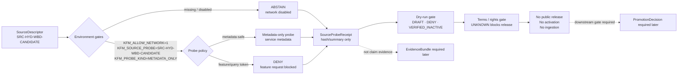

<!-- [KFM_META_BLOCK_V2]
doc_id: kfm://doc/NEEDS-VERIFICATION-ADR-0307-hydrology-wbd-metadata-probe
title: ADR-0307: Hydrology WBD Metadata Probe Gate
type: adr
version: v1.1
status: accepted-with-public-release-blocked
owners: @bartytime4life NEEDS_VERIFICATION; hydrology-domain-steward NEEDS_VERIFICATION; source-steward NEEDS_VERIFICATION; policy-steward NEEDS_VERIFICATION; release-steward NEEDS_VERIFICATION
created: NEEDS_VERIFICATION
updated: 2026-05-06
policy_label: NEEDS_VERIFICATION
related: [
  ./README.md,
  ./ADR-0303-hydrology-source-descriptor-activation-gates.md,
  ./ADR-0306-hydrology-connector-contract-and-offline-simulation.md,
  ./ADR-0310-hydrology-wbd-terms-rights-review.md,
  ../domains/hydrology/README.md,
  ../runbooks/hydrology-wbd-metadata-probe.md,
  ../reports/hydrology-wbd-metadata-probe-inspection.md,
  ../../tools/probe_wbd_metadata.py,
  ../../policy/domains/hydrology/wbd_metadata_probe_policy.yaml,
  ../../data/registry/sources/hydrology/source_descriptors/SRC-HYD-WBD-CANDIDATE.json,
  ../../fixtures/source/hydrology/source_probe_receipt.wbd.no_network.valid.json,
  ../../fixtures/invalid/source_verification/source_probe_receipt_wbd_query_endpoint.json,
  ../../data/receipts/source_verification/hydrology/probe_receipts/SPR-WBD-NONET-001.json,
  ../../release/dry_runs/hydrology_wbd_metadata_probe_gate.json,
  ../../release/dry_runs/hydrology_wbd_terms_rights_gate.json,
  ../../scripts/validate_all.sh,
  ../../.github/workflows/baseline.yml
]
tags: [kfm, adr, hydrology, wbd, huc12, source-probe, metadata-only, no-network, abstain, deny, fail-closed, source-verification, no-ingestion, public-release-blocked]
notes: [
  Revises the existing path docs/adr/ADR-0307-hydrology-wbd-metadata-probe.md and corrects prior title/doc_id drift that labeled this decision as ADR-0308 while the repository path and ADR index identify it as ADR-0307.
  Decision accepts a metadata-only WBD source-verification gate, not live source activation, data ingestion, EvidenceBundle support, public map publication, or public release.
  Default runtime behavior is ABSTAIN with network disabled; optional real metadata probing requires explicit environment gates and remains non-ingesting.
  SourceProbeReceipt objects are source-verification/process memory only; they are not claim evidence, not proof packs, not release manifests, and not publication authority.
  Owners, created date, policy label, latest workflow status, branch protection, and steward signoff remain NEEDS VERIFICATION.
]
[/KFM_META_BLOCK_V2] -->

<a id="top"></a>
<a id="adr-0308-alias"></a>

# ADR-0307: Hydrology WBD Metadata Probe Gate

WBD metadata probes may verify source readiness only; they must not fetch features, store geometry, ingest data, activate connectors, or make public release eligible by themselves.

<p align="center">
  
  
  
  
  
</p>

<p align="center">
  <a href="#decision">Decision</a> ·
  <a href="#repo-fit">Repo fit</a> ·
  <a href="#evidence-basis">Evidence</a> ·
  <a href="#scope">Scope</a> ·
  <a href="#metadata-only-boundary">Boundary</a> ·
  <a href="#gate-model">Gate model</a> ·
  <a href="#receipt-and-release-boundary">Receipts</a> ·
  <a href="#enforcement-and-tests">Enforcement</a> ·
  <a href="#rollback-and-supersession">Rollback</a> ·
  <a href="#open-verification-items">Open verification</a>
</p>

> [!IMPORTANT]
> **Accepted decision:** KFM may keep a WBD metadata probe gate for source verification and readiness inspection.  
> **Default runtime posture:** `ABSTAIN` with network disabled.  
> **Public-release posture:** `DENY` / `NOT_ELIGIBLE` until separate rights, source activation, evidence, catalog, proof, review, promotion, correction, and rollback gates pass.

> [!CAUTION]
> A WBD metadata probe is **not** a live connector, **not** source-data ingest, **not** an `EvidenceBundle`, **not** public claim support, and **not** permission to publish WBD-derived geometry, feature attributes, map layers, API payloads, exports, or AI/Focus Mode answers.

---

## Decision

KFM accepts a **metadata-only WBD source-verification gate** for the hydrology proof lane.

This ADR preserves the existing decision posture and tightens the numbering, release, and evidence boundaries.

| Decision element | ADR-0307 rule |
|---|---|
| Stable file identity | `docs/adr/ADR-0307-hydrology-wbd-metadata-probe.md` is the governing path for this decision. |
| Numbering repair | Prior self-reference to `ADR-0308` is treated as numbering drift in this path; use `ADR-0307` going forward unless a later supersession ADR says otherwise. |
| Probe type | WBD probing is restricted to service or layer metadata checks. |
| Default outcome | The probe must return `ABSTAIN` unless explicit environment gates allow a metadata-only probe. |
| Source state | `SRC-HYD-WBD-CANDIDATE` remains a candidate/inactive source context. |
| Release state | Probe success cannot enable ingestion, connector activation, public release, public map layers, Evidence Drawer support, Focus Mode answers, or any published artifact. |
| Receipt role | Probe receipts are process/source-verification memory only. |
| Evidence role | Probe receipts cannot substitute for `EvidenceBundle` support. |
| Failure posture | Unknown rights, terms, attribution, source role, endpoint shape, response body retention, CI state, or steward signoff must fail closed. |

### Normative rules

1. **Metadata only.** WBD probe operations may request service or layer metadata only.
2. **ABSTAIN by default.** Without explicit environment gates, the probe must return `ABSTAIN`.
3. **No feature requests.** Probe paths and query parameters that request features, geometry, object IDs, arbitrary `where` clauses, tiles, exports, or identify results are prohibited.
4. **No geometry.** Probe results must not store WBD geometry.
5. **No feature attributes.** Probe results must not store WBD feature attributes.
6. **No lifecycle ingest.** Probe execution must not move WBD source data into `RAW`, `WORK`, `PROCESSED`, `CATALOG`, `TRIPLET`, or `PUBLISHED`.
7. **Quarantine on drift.** Any accidental feature response, geometry, feature attribute, or response body capture must be treated as an incident and routed through quarantine/correction rather than silently deleted.
8. **Hash/summary only.** If a real metadata response is later permitted, the receipt may store digest, bounded summary, status, content type, size cap, and verification notes; full response body storage remains denied unless a later ADR changes the policy.
9. **No release eligibility from probe.** Probe output cannot make a source, layer, artifact, claim, or release public-safe.
10. **No `EvidenceBundle` substitution.** A `SourceProbeReceipt` cannot stand in for evidence support.
11. **No connector activation.** WBD connector activation remains governed by source descriptor activation and connector-contract ADRs.
12. **Fail closed.** Missing rights, unknown terms, invalid URL, denied query token, unexpected response shape, or insufficient review yields `ABSTAIN`, `DENY`, or `ERROR`, not publication.

<p align="right"><a href="#top">Back to top ↑</a></p>

---

## Repo fit

| Field | Value |
|---|---|
| Target path | `docs/adr/ADR-0307-hydrology-wbd-metadata-probe.md` |
| Owning root | `docs/` |
| Owning sub-root | `docs/adr/` |
| Responsibility | Human-facing architecture decision record for a hydrology source-verification gate. |
| Upstream doctrine | KFM lifecycle law, Directory Rules, ADR index, hydrology-first proof-lane doctrine, source descriptor activation gates, connector simulation gates, WBD terms/rights review. |
| Downstream consumers | Hydrology source registry, probe tool, probe policy, source-probe receipts, release dry-run gates, validation scripts, baseline workflow, hydrology runbooks, review/rollback records. |
| Compatibility note | `docs/adr/` is the correct responsibility root for this human-facing decision. Machine schemas, policy rules, receipts, proofs, release objects, and runtime code stay in their own responsibility roots. |
| Current maturity | Decision accepted; enforcement and branch-protection maturity remain `NEEDS VERIFICATION` until current run/workflow evidence is attached. |

### Why this belongs in `docs/adr/`

`docs/adr/` is the human-facing decision ledger. This ADR decides a trust boundary; it does not implement the probe, define the machine schema, own policy, store receipts, publish source data, or replace release gates.

### Accepted inputs

This ADR may reference or discuss:

- WBD metadata-readiness decisions;
- source-verification receipts;
- no-network probe fixtures;
- probe deny-token policy;
- release dry-run denial gates;
- terms/rights review blockers;
- rollback and correction obligations;
- successor/supersession notes.

### Exclusions

| Excluded item | Correct home |
|---|---|
| Probe tool implementation | `tools/` |
| Probe policy | `policy/` |
| Source descriptor | `data/registry/` |
| Source-probe receipts | `data/receipts/` and `fixtures/` |
| Release dry-run objects | `release/` |
| Machine schemas | `schemas/` |
| Semantic object contracts | `contracts/` |
| Public hydrology artifacts | `data/published/` only after governed release |
| Public UI behavior | governed API/UI docs and released payload contracts |
| External source-rights decision | successor rights/source activation ADR or review artifact |

<p align="right"><a href="#top">Back to top ↑</a></p>

---

## Evidence basis

This ADR separates **decision evidence** from **implementation enforcement**.

| Evidence surface | Label | Supports | Does not prove |
|---|---:|---|---|
| Existing `docs/adr/ADR-0307-hydrology-wbd-metadata-probe.md` | CONFIRMED | This ADR path already exists and contains the WBD metadata probe decision surface. | The old self-title was correctly numbered; it was not. |
| `docs/adr/README.md` | CONFIRMED | ADR index recognizes `ADR-0307-hydrology-wbd-metadata-probe.md` as the WBD metadata probe ADR. | Complete ADR inventory or branch-protection enforcement. |
| `tools/probe_wbd_metadata.py` | CONFIRMED | Probe tool includes environment gates, denied tokens, and dry-run `ABSTAIN` behavior. | That the latest probe run passed in CI or that real metadata network probing is approved. |
| `policy/domains/hydrology/wbd_metadata_probe_policy.yaml` | CONFIRMED | Policy fixture restricts source ID, probe kind, and allowed query params to metadata-safe values. | Complete policy-as-code enforcement for every public surface. |
| `data/registry/sources/hydrology/source_descriptors/SRC-HYD-WBD-CANDIDATE.json` | CONFIRMED | WBD candidate source descriptor exists with `BOUNDARY_CONTEXT`, `public_release_allowed=false`, and `NEEDS_VERIFICATION`. | Source activation, rights closure, or public-release eligibility. |
| `fixtures/source/hydrology/source_probe_receipt.wbd.no_network.valid.json` | CONFIRMED | No-network receipt fixture asserts metadata-only, network disabled, no body storage, no geometry, no ingestion, and `ABSTAIN`. | Public claim evidence or release proof. |
| `data/receipts/source_verification/hydrology/probe_receipts/SPR-WBD-NONET-001.json` | CONFIRMED | Registry receipt preserves the no-network `ABSTAIN` probe result as source-verification memory. | That WBD can be ingested or published. |
| `fixtures/invalid/source_verification/source_probe_receipt_wbd_query_endpoint.json` | CONFIRMED | Negative fixture shows a `/query` endpoint shape that should be invalid or denied. | Complete denied-token enforcement in all tools. |
| `release/dry_runs/hydrology_wbd_metadata_probe_gate.json` | CONFIRMED | Dry-run release gate keeps `DRAFT`, `DENY`, `VERIFIED_INACTIVE`, no ingestion, no geometry, and no public release. | A real promotion gate passed or public release is permitted. |
| `release/dry_runs/hydrology_wbd_terms_rights_gate.json` | CONFIRMED | Terms/rights gate keeps `rights_status=UNKNOWN`, `NOT_ELIGIBLE`, `DENY`, `VERIFIED_INACTIVE`, no geometry, no feature attributes, and no public release. | Final legal, rights, attribution, or public release approval. |
| `docs/runbooks/hydrology-wbd-metadata-probe.md` | CONFIRMED | Operator runbook states default `ABSTAIN` and names required environment gates. | Safe execution of a real metadata probe. |
| `docs/reports/hydrology-wbd-metadata-probe-inspection.md` | CONFIRMED | Inspection report states network disabled, real probe not run, no ingestion, and metadata-only gate adaptation. | Source PDFs, external source terms, or current CI status. |
| `.github/workflows/baseline.yml` | CONFIRMED file | Baseline workflow includes a WBD metadata dry-run and related source checks. | Latest workflow run success or required status checks. |
| `scripts/validate_all.sh` | CONFIRMED file | Aggregate validation script includes WBD dry-run and source/rights/publication checks. | Latest local execution success. |

### Evidence rule

A file can be present, valid-looking, and linked while enforcement still remains `NEEDS VERIFICATION`. This ADR may say a file exists when inspected, but it must not claim current CI success, branch protection, release readiness, source activation, or runtime behavior without run/workflow evidence.

<p align="right"><a href="#top">Back to top ↑</a></p>

---

## Context

Hydrology is KFM’s first proof-bearing lane. WBD/HUC metadata is useful because it can help verify source identity, source shape, and readiness before any live source activation.

That usefulness creates a governance risk: maintainers could accidentally treat “metadata probe succeeded” as permission to fetch features, store geometries, build public layers, or claim WBD-derived artifacts are release-ready.

This ADR prevents that drift.

### Numbering and lineage note

The current repository path is:

```text
docs/adr/ADR-0307-hydrology-wbd-metadata-probe.md
```

A previous version of this file identified itself as `ADR-0308` in the meta block and H1. This revision normalizes the visible decision identity to `ADR-0307` while keeping the alias anchor `<a id="adr-0308-alias"></a>` for review discoverability.

> [!WARNING]
> Adjacent documents that still say `ADR-0308 WBD metadata probe` should be updated to `ADR-0307` or explicitly recorded as an alias/supersession note. Do not delete history to hide the numbering drift.

<p align="right"><a href="#top">Back to top ↑</a></p>

---

## Scope

### In scope

| In scope | Required posture |
|---|---|
| WBD metadata readiness probe | Metadata-only; no feature requests, no geometry, no ingestion. |
| WBD source verification receipt | Process/source-verification memory only. |
| No-network dry-run behavior | Default `ABSTAIN`; deterministic fixture output. |
| Environment-gated optional probe | Requires explicit operator intent and remains non-ingesting. |
| Probe policy | Allows only metadata-safe query forms unless superseded by later ADR. |
| Probe receipt validation | Must prove no geometry, no ingestion, no response-body storage by default. |
| Release dry-run gate | Keeps public release denied and activation inactive. |
| Terms/rights follow-up | Keeps WBD public release blocked while rights and attribution remain unresolved. |
| Negative fixtures | Query/feature endpoint examples must fail, deny, or remain invalid. |
| Rollback | Disable probe path, preserve receipts, and keep candidate source inactive. |

### Out of scope

| Out of scope | Reason |
|---|---|
| Live WBD feature fetch | Would cross from metadata verification into source data movement. |
| WBD geometry storage | Requires source activation, rights, schema, evidence, catalog, proof, review, and promotion gates. |
| WBD feature attribute storage | Same as geometry: not allowed by a metadata probe. |
| HUC12 release artifact publication | Promotion must be governed separately. |
| MapLibre layer publication | Renderer is downstream of release state. |
| Evidence Drawer claim support | Requires `EvidenceBundle` closure, not a probe receipt alone. |
| Focus Mode hydrology answers | AI must remain evidence-subordinate and cite/abstain. |
| Terms/rights approval | Governed by separate terms/rights review artifacts. |
| Connector activation | Governed by source descriptor activation and connector-contract ADRs. |
| Emergency or operational water guidance | KFM is not an emergency alerting system. |

<p align="right"><a href="#top">Back to top ↑</a></p>

---

## Metadata-only boundary

A WBD metadata probe may inspect source metadata. It may not request source features.

### Allowed probe shape

| Concern | Allowed value |
|---|---|
| `source_id` | `SRC-HYD-WBD-CANDIDATE` |
| `probe_kind` | `METADATA_ONLY` |
| `endpoint_type` | `SERVICE_METADATA` or a later schema-approved metadata equivalent |
| Query style | `f=json` or `f=pjson` only |
| Network default | disabled |
| Default outcome | `ABSTAIN` |
| Response body storage | false |
| Response storage posture | hash/summary only |
| Ingestion | false |
| Geometry | false |
| Feature attributes | false |
| Public release | false |

### Prohibited request patterns

These request patterns are prohibited inside this ADR boundary and should be rejected, denied, or treated as invalid:

```text
/query
/export
/identify
/tile
/FeatureServer/query
f=geojson
returnGeometry=true
outFields=*
objectIds
geometry=
where=
```

### Boundary summary

| Action | ADR-0307 result |
|---|---:|
| Check source descriptor identity | Allowed |
| Dry-run metadata probe with network disabled | Allowed, returns `ABSTAIN` |
| Store receipt showing no ingestion | Allowed |
| Store metadata response digest | Allowed only if a later real metadata probe is approved |
| Store full metadata body | Denied by default |
| Store WBD geometry | Denied |
| Store WBD feature attributes | Denied |
| Query WBD features | Denied |
| Promote source-derived artifact | Denied |
| Build public map layer from probe | Denied |
| Use probe receipt as claim evidence | Denied |
| Activate WBD connector | Denied by this ADR |

<p align="right"><a href="#top">Back to top ↑</a></p>

---

## Gate model

WBD metadata probing is a source-verification gate, not a publication path.



### Environment gate

A non-dry-run metadata probe must require all of the following:

```bash
KFM_ALLOW_NETWORK=1
KFM_SOURCE_PROBE=SRC-HYD-WBD-CANDIDATE
KFM_PROBE_KIND=METADATA_ONLY
```

If any value is missing or different, the probe must return `ABSTAIN`.

### Dry-run gate

Dry-run mode must return `ABSTAIN` even when source identity is provided:

```bash
python tools/probe_wbd_metadata.py --dry-run --source-id SRC-HYD-WBD-CANDIDATE
```

Expected posture:

```text
ABSTAIN dry-run mode
```

> [!NOTE]
> The command is repository-grounded because `tools/probe_wbd_metadata.py` exists. Latest local execution, CI run success, and branch-protection enforcement still require verification before being claimed as enforced.

<p align="right"><a href="#top">Back to top ↑</a></p>

---

## Receipt and release boundary

A `SourceProbeReceipt` records verification activity. It is not source data, not claim evidence, and not a release artifact.

### SourceProbeReceipt expectations

| Field or concern | Required posture |
|---|---|
| `source_id` | `SRC-HYD-WBD-CANDIDATE` |
| `probe_kind` | `METADATA_ONLY` |
| `network_mode` | `DISABLED` unless a later approved run permits metadata-only network access |
| `validation_result` | `ABSTAIN`, `DENY`, `ERROR`, or later approved finite result |
| `response_body_stored` | false by default |
| `response_body_storage_policy` | `HASH_ONLY` or stricter |
| `no_feature_request_assertion` | true |
| `no_geometry_assertion` | true |
| `no_ingestion_assertion` | true |
| `verification_status` | `NEEDS_VERIFICATION` until reviewed |
| `open_verification_items` | must list unresolved probe/terms/review items |
| `created_by_tool` | expected for generated receipts |
| `tool_version` | expected for generated receipts |

### Release dry-run boundary

A WBD metadata probe dry-run gate must keep public release blocked.

| Gate field | Required posture |
|---|---|
| `release_state` | `DRAFT` |
| `no_live_source_ingestion` | true |
| `no_wbd_geometry_stored` | true |
| `no_wbd_feature_attributes_stored` | true when terms/rights gate is involved |
| `no_public_release` | true |
| `terms_review_status` | unresolved status blocks release |
| `rights_status` | `UNKNOWN` blocks publication eligibility |
| `publication_eligibility_decision` | `NOT_ELIGIBLE` when rights/terms are unresolved |
| `policy_decision` | `DENY` until gates pass |
| `activation_decision` | `VERIFIED_INACTIVE` |
| `rollback_target` | required |
| `correction_route` | required |
| `no_public_internal_path_assertion` | true |
| `no_direct_model_client_assertion` | true |

> [!WARNING]
> A release dry-run JSON file is not public release. It is a gate artifact that should make denial, abstention, inactive activation, correction route, and rollback target inspectable.

<p align="right"><a href="#top">Back to top ↑</a></p>

---

## Relationship to other ADRs

| ADR | Relationship |
|---|---|
| [`ADR-0303-hydrology-source-descriptor-activation-gates.md`](./ADR-0303-hydrology-source-descriptor-activation-gates.md) | WBD remains a candidate source descriptor until activation gates pass. ADR-0307 cannot override source activation. |
| [`ADR-0306-hydrology-connector-contract-and-offline-simulation.md`](./ADR-0306-hydrology-connector-contract-and-offline-simulation.md) | Connector contracts and offline simulation remain blocked/non-live. ADR-0307 does not approve live connector execution. |
| [`ADR-0310-hydrology-wbd-terms-rights-review.md`](./ADR-0310-hydrology-wbd-terms-rights-review.md) | Terms and rights review keeps WBD verified-inactive and not public-release eligible until KFM release burden is met. |
| [`ADR-0005-promotion-gate.md`](./ADR-0005-promotion-gate.md) | Publication requires governed promotion. ADR-0307 cannot make a release public by probe success. |
| [`ADR-0304-hydrology-first-proof-lane.md`](./ADR-0304-hydrology-first-proof-lane.md) | Hydrology-first proof lane starts no-network/public-safe. ADR-0307 provides a narrow WBD metadata verification gate within that posture. |

<p align="right"><a href="#top">Back to top ↑</a></p>

---

## Enforcement and tests

### Repository enforcement surfaces

| Surface | Current role | ADR-0307 expectation |
|---|---|---|
| `tools/probe_wbd_metadata.py` | Emits `ABSTAIN` unless environment gates are set; dry run always abstains. | Keep default fail-closed. Expand deny-token enforcement before any real metadata network run is accepted. |
| `policy/domains/hydrology/wbd_metadata_probe_policy.yaml` | Declares metadata-only WBD source ID, probe kind, and allowed query params. | Keep allowed query params narrow and review any expansion. |
| `fixtures/source/hydrology/source_probe_receipt.wbd.no_network.valid.json` | Valid no-network receipt fixture. | Keep assertions for no feature request, no geometry, no ingestion, no body storage, and open verification items. |
| `fixtures/invalid/source_verification/source_probe_receipt_wbd_query_endpoint.json` | Invalid query endpoint example. | Continue to reject feature/query endpoint patterns. |
| `data/receipts/source_verification/hydrology/probe_receipts/SPR-WBD-NONET-001.json` | Registry copy of WBD no-network probe receipt. | Preserve receipt lineage and do not treat it as claim evidence. |
| `release/dry_runs/hydrology_wbd_metadata_probe_gate.json` | Dry-run release gate. | Keep release `DRAFT`, policy `DENY`, activation `VERIFIED_INACTIVE`, no ingestion, and no public release. |
| `release/dry_runs/hydrology_wbd_terms_rights_gate.json` | Terms/rights dry-run gate. | Keep rights/terms unknown or abstain as blockers until reviewed. |
| `.github/workflows/baseline.yml` | Baseline workflow includes WBD metadata probe dry run and related source checks. | Workflow file presence supports intended CI wiring; latest run status and branch protection still need verification. |
| `scripts/validate_all.sh` | Aggregate validation script includes WBD metadata probe dry run and source/rights/publication checks. | Script presence supports intended local validation; latest execution still needs verification. |

### Expected local checks

Run in a real checkout before claiming enforcement:

```bash
python tools/probe_wbd_metadata.py --dry-run --source-id SRC-HYD-WBD-CANDIDATE
python tools/check_source_probe_receipts.py
python tools/check_source_probes.py
bash scripts/validate_all.sh
```

### Negative cases that must fail, deny, or abstain

| Case | Required outcome |
|---|---|
| Missing environment gates | `ABSTAIN` |
| `KFM_SOURCE_PROBE` not `SRC-HYD-WBD-CANDIDATE` | `ABSTAIN` |
| `KFM_PROBE_KIND` not `METADATA_ONLY` | `ABSTAIN` |
| URL includes `/query` | `DENY` or invalid fixture |
| URL includes `returnGeometry=true` | `DENY` |
| URL includes `outFields=*` | `DENY` |
| URL includes `where=` | `DENY` |
| Probe stores response body | `DENY` unless a later ADR explicitly approves bounded storage |
| Probe stores geometry | `DENY` |
| Probe stores feature attributes | `DENY` |
| Probe output enters lifecycle ingest | `DENY` / incident |
| Probe receipt used as `EvidenceBundle` support | `DENY` |
| Probe success marks source active | `DENY` |
| Probe success marks release public eligible | `DENY` |
| Public API/UI/AI reads probe receipt as claim evidence | `DENY` or `ABSTAIN` |

<p align="right"><a href="#top">Back to top ↑</a></p>

---

## Implementation rules

### Adding or changing a WBD metadata probe

1. Confirm `SRC-HYD-WBD-CANDIDATE` remains a candidate source descriptor.
2. Keep `public_release_allowed=false`.
3. Keep geometry and feature attribute storage denied.
4. Keep default network mode disabled.
5. Require explicit environment gates for any non-dry-run metadata probe.
6. Restrict query params to metadata-safe values.
7. Reject feature/query/tile/export/identify endpoints.
8. Emit a `SourceProbeReceipt`.
9. Keep response body storage false by default.
10. Record hash/summary/status only when a later approved real metadata probe occurs.
11. Preserve open verification items.
12. Keep activation `VERIFIED_INACTIVE` unless a separate activation ADR/gate changes it.
13. Keep release `DRAFT` and public release denied.
14. Link correction route and rollback target.
15. Re-run probe, receipt, source, rights, and publication eligibility checks.

### Before any real metadata network probe

A maintainer must verify:

- [ ] source descriptor is reviewed;
- [ ] WBD endpoint is metadata-only;
- [ ] terms/rights review is sufficient for metadata verification;
- [ ] probe URL contains no denied feature/query token;
- [ ] response body storage policy is reviewed;
- [ ] no credentials are required;
- [ ] no geometry is requested;
- [ ] no feature attributes are requested;
- [ ] receipt location and schema are accepted;
- [ ] policy decision permits metadata verification only;
- [ ] rollback target exists;
- [ ] public release remains denied.

<p align="right"><a href="#top">Back to top ↑</a></p>

---

## Consequences

### Positive consequences

- WBD source readiness can be inspected without activating a live connector.
- Hydrology proof-lane source verification remains no-network and deterministic by default.
- Probe outputs are auditable without becoming claim evidence.
- Query/feature/geometry drift is explicitly blocked.
- Public release remains downstream of rights, evidence, catalog, proof, review, promotion, correction, and rollback gates.
- Evidence Drawer and Focus Mode cannot treat metadata probe activity as proof of hydrologic claims.
- ADR numbering drift is repaired while keeping lineage inspectable.

### Costs and follow-up burden

- Real WBD source work is delayed until terms, rights, attribution, source activation, metadata policy, and release controls are resolved.
- Probe receipt schemas and validation scripts must stay aligned.
- Any future body-storage allowance requires a separate reviewed decision.
- Maintainers must distinguish source descriptor, metadata probe, probe receipt, connector contract, `EvidenceBundle`, `ReleaseManifest`, and `PromotionDecision`.
- CI file presence does not remove the need to check actual workflow run status and branch-protection settings.
- Adjacent references to `ADR-0308` need cleanup or explicit alias handling.

### Tradeoff accepted

KFM accepts slower source activation in exchange for a safer hydrology proof lane that does not confuse “source metadata was reachable” with “source data is publishable.”

<p align="right"><a href="#top">Back to top ↑</a></p>

---

## Rollback and supersession

Rollback for ADR-0307 should be straightforward because WBD metadata probing must not ingest or publish data.

### Rollback rules

1. Disable or remove the probe run path.
2. Leave `KFM_ALLOW_NETWORK` unset or set to a non-allowing value.
3. Keep `public_release_allowed=false` on the source descriptor.
4. Keep activation `VERIFIED_INACTIVE` or blocked.
5. Preserve existing probe receipts and dry-run gates as audit history.
6. Revert or supersede changed policy files.
7. Re-run source probe receipt and publication eligibility checks.
8. Record rollback in the repo-standard rollback card, verification backlog, or source verification register.
9. If any WBD response body, geometry, feature attribute, or source-derived artifact was stored by mistake, treat it as an incident and move through correction/quarantine rather than deleting audit history.

### Revert path for this file

If this ADR revision is rejected, revert only this file. Do not delete WBD source descriptors, probe tools, receipts, dry-run gates, source verification registers, policy files, or reports without a separate preservation and migration decision.

### Supersession rule

A later ADR may supersede this decision only if it preserves:

- current path lineage;
- decision status transition;
- source descriptor state;
- rights/terms review state;
- receipt/proof/release separation;
- correction route;
- rollback target;
- public-surface denial until release gates pass.

<p align="right"><a href="#top">Back to top ↑</a></p>

---

## Acceptance checklist

ADR-0307 is accepted as a metadata-probe boundary decision. Implementation maturity can be upgraded only when the following are verified.

- [x] Target ADR path exists.
- [x] ADR visible title and meta block now align with `ADR-0307`.
- [x] WBD candidate source descriptor exists.
- [x] Metadata probe tool exists.
- [x] Probe policy file exists.
- [x] No-network WBD probe receipt fixture exists.
- [x] Registry WBD probe receipt exists.
- [x] Invalid `/query` fixture exists.
- [x] WBD metadata probe dry-run gate exists.
- [x] WBD terms/rights dry-run gate exists.
- [x] Baseline workflow includes WBD metadata probe dry run.
- [x] Aggregate validation script includes WBD metadata probe dry run.
- [ ] ADR index references this file with path-specific identity and current status.
- [ ] Adjacent `ADR-0308` references are corrected or documented as aliases.
- [ ] Latest local probe dry-run output is attached or linked.
- [ ] Latest `check_source_probe_receipts.py` output is attached or linked.
- [ ] Latest `check_source_probes.py` output is attached or linked.
- [ ] Latest publication eligibility check output is attached or linked.
- [ ] Latest CI workflow run proves the checks pass.
- [ ] Branch protection or required status checks are verified.
- [ ] Source terms and rights are reviewed beyond `UNKNOWN` / `ABSTAIN`.
- [ ] Attribution posture is verified.
- [ ] Any future real metadata probe stores only approved receipt fields.
- [ ] Public API/UI/Focus negative tests prove probe receipts cannot become claim evidence.
- [ ] Promotion Gate negative tests prove probe success cannot become public release eligibility.

<p align="right"><a href="#top">Back to top ↑</a></p>

---

## Open verification items

| Item | Why it matters | Current posture |
|---|---|---|
| ADR created date | Required for complete metadata. | NEEDS VERIFICATION |
| ADR owner/steward list | Needed for accountability and approval. | NEEDS VERIFICATION |
| Policy label | Required before publication classification. | NEEDS VERIFICATION |
| ADR index update | Maintainers need discoverable decision status. | NEEDS VERIFICATION |
| Adjacent `ADR-0308` references | Numbering drift should not fragment decision identity. | NEEDS VERIFICATION |
| Latest probe dry-run result | File presence is not execution proof. | NEEDS VERIFICATION |
| Latest CI run status | Workflow file is not proof of passing enforcement. | NEEDS VERIFICATION |
| Branch protection | Required before claiming checks are mandatory. | UNKNOWN |
| WBD terms and rights | Rights `UNKNOWN` blocks publication eligibility. | NEEDS VERIFICATION |
| Attribution requirements | Attribution status remains unresolved. | NEEDS VERIFICATION |
| Real metadata endpoint review | Required before any network metadata probe. | NEEDS VERIFICATION |
| Response body retention policy | Default is no body storage; any change requires review. | DENY by default |
| URL deny-token enforcement | Tool lists denied tokens; live enforcement needs verification before network use. | NEEDS VERIFICATION |
| Public surface negative tests | Needed to prove probe receipts cannot leak into claims/UI/AI. | NEEDS VERIFICATION |

<p align="right"><a href="#top">Back to top ↑</a></p>

---

## Alternatives considered

| Alternative | Decision | Reason |
|---|---|---|
| Treat WBD metadata probe success as source activation. | Rejected | Source activation requires descriptor, rights, policy, review, and activation decision. |
| Keep this path self-titled as `ADR-0308`. | Rejected | Repository path and ADR index identify the decision as `ADR-0307`; leaving the mismatch would weaken traceability. |
| Allow WBD `/query` requests under metadata probe. | Rejected | Query requests can cross into feature/attribute/geometry retrieval. |
| Store full metadata response body by default. | Rejected | Body retention needs explicit storage policy, size cap, review, and rights posture. |
| Permit WBD geometry fetch in the metadata probe. | Rejected | Geometry fetch is source data movement, not metadata verification. |
| Use probe receipt as `EvidenceBundle` support. | Rejected | Receipts are process/source-verification memory, not claim evidence. |
| Allow public map layer publication after metadata probe. | Rejected | Map publication requires release artifacts and governed promotion. |
| Let Focus Mode explain WBD claims from probe data. | Rejected | Focus Mode must be EvidenceBundle-bound and citation-validated. |
| Delete failed probe receipts. | Rejected | Receipts preserve audit and correction lineage. |
| Block all probe work forever. | Rejected | Metadata-only verification is useful when bounded, auditable, and non-ingesting. |

<p align="right"><a href="#top">Back to top ↑</a></p>

---

<details>
<summary><strong>Appendix A — Maintainer checklist for WBD metadata probe changes</strong></summary>

Use this checklist before changing WBD metadata probe behavior.

- [ ] Confirm the change affects metadata verification only.
- [ ] Confirm source ID is `SRC-HYD-WBD-CANDIDATE`.
- [ ] Confirm `probe_kind` is `METADATA_ONLY`.
- [ ] Confirm no feature/query/tile/export/identify endpoint is used.
- [ ] Confirm no `returnGeometry=true`.
- [ ] Confirm no `outFields=*`.
- [ ] Confirm no `where=`.
- [ ] Confirm no geometry storage.
- [ ] Confirm no feature attribute storage.
- [ ] Confirm response body storage remains false or has a separate reviewed decision.
- [ ] Confirm receipt captures no-ingestion assertion.
- [ ] Confirm source descriptor remains `public_release_allowed=false`.
- [ ] Confirm release dry-run keeps `no_public_release=true`.
- [ ] Confirm terms/rights status does not silently upgrade publication eligibility.
- [ ] Confirm activation remains inactive unless a separate activation decision exists.
- [ ] Run the dry-run probe.
- [ ] Run source probe receipt checks.
- [ ] Run publication eligibility checks.
- [ ] Link validation output in the PR.
- [ ] Update this ADR only if the decision boundary changes.

</details>

<details>
<summary><strong>Appendix B — Glossary</strong></summary>

| Term | Meaning in this ADR |
|---|---|
| `WBD` | Watershed Boundary Dataset source family used here as hydrologic-unit boundary context. |
| `HUC12` | Twelve-digit hydrologic-unit code context within the WBD/HUC source family. |
| `SRC-HYD-WBD-CANDIDATE` | Candidate WBD source descriptor ID for hydrology source verification. |
| `metadata-only probe` | Probe restricted to service/layer metadata, not feature data or geometry. |
| `SourceProbeReceipt` | Receipt recording source verification activity; process memory, not claim evidence. |
| `ABSTAIN` | Finite outcome used when network/env gates are disabled or support is insufficient. |
| `DENY` | Finite outcome used when policy or safety rules block a requested action. |
| `VERIFIED_INACTIVE` | Activation decision posture showing the source remains inactive after verification gate handling. |
| `BOUNDARY_CONTEXT` | Source role indicating WBD supports hydrologic boundary context, not observed hydrologic measurements. |
| `EvidenceBundle` | Required evidence-support object for public claims; cannot be replaced by source descriptors or probe receipts. |
| `ReleaseManifest` | Release-state object required before public publication. |
| `PromotionDecision` | Governed transition decision required before material becomes published. |

</details>

<p align="right"><a href="#top">Back to top ↑</a></p>
