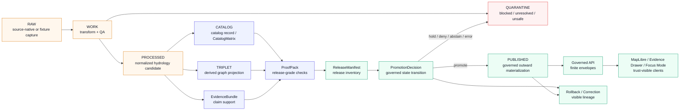

<!-- [KFM_META_BLOCK_V2]
doc_id: kfm://doc/NEEDS-VERIFICATION-ADR-0309-HYDROLOGY-PROCESSED-CATALOG-CLOSURE
title: ADR-0309: Hydrology Processed/Catalog Closure Boundary
type: standard
version: v1
status: draft
owners: OWNER_TBD_NEEDS_VERIFICATION
created: DATE_TBD_FROM_GIT_OR_DOC_REGISTRY
updated: 2026-05-06
policy_label: POLICY_LABEL_TBD_NEEDS_VERIFICATION
related: [
  ./README.md,
  ./ADR-TEMPLATE.md,
  ./ADR-0001-schema-home.md,
  ./ADR-0011-catalog-proof-release-separation.md,
  ./ADR-0206-maplibre-layer-manifest.md,
  ./ADR-0304-hydrology-first-proof-lane.md,
  ./ADR-0308-hydrology-synthetic-ingest-lifecycle-boundary.md,
  ./ADR-0310-hydrology-wbd-terms-rights-review.md,
  ../domains/hydrology/ARCHITECTURE.md,
  ../../data/registry/layers/README.md,
  ../../data/catalog/README.md,
  ../../data/proofs/README.md,
  ../../data/published/README.md,
  ../../release/README.md
]
tags: [kfm, adr, hydrology, lifecycle, processed, catalog, triplet, evidence-bundle, promotion, release, rollback]
notes: [
  Revises the existing target file so the metadata, H1, anchors, and decision identity align with ADR-0309 and the target path.
  This ADR records a boundary decision; it is not implementation proof.
  Distinct ADR-0310 WBD terms/rights review remains a separate hydrology source-activation and rights decision.
  Owners, created date, policy label, ADR index entry, schema-home acceptance, validator paths, CI execution, release artifacts, and runtime behavior remain NEEDS VERIFICATION.
]
[/KFM_META_BLOCK_V2] -->

<a id="top"></a>

# ADR-0309: Hydrology Processed/Catalog Closure Boundary

Define the boundary that prevents hydrology `PROCESSED`, `CATALOG`, and `TRIPLET` artifacts from becoming standalone public truth.

<p align="center">
  
  
  
  
  
</p>

<p align="center">
  <a href="#status">Status</a> ·
  <a href="#decision">Decision</a> ·
  <a href="#context">Context</a> ·
  <a href="#boundary-model">Boundary model</a> ·
  <a href="#authority-map">Authority map</a> ·
  <a href="#hydrology-rules">Hydrology rules</a> ·
  <a href="#validation-plan">Validation</a> ·
  <a href="#rollback-and-correction">Rollback</a> ·
  <a href="#open-verification">Open verification</a> ·
  <a href="#review-checklist">Checklist</a>
</p>

> [!IMPORTANT]
> This ADR is a **boundary decision**, not proof that hydrology schemas, validators, source connectors, catalog records, graph projections, proof packs, release manifests, workflow gates, dashboards, or runtime surfaces are already complete.
>
> Treat enforcement maturity as `NEEDS VERIFICATION` until current repository files, executed tests, workflow logs, emitted artifacts, release records, or runtime evidence prove it.

> [!WARNING]
> A rendered map layer, clean `data/processed/` object, catalog entry, graph triple, or fluent Focus Mode answer can look authoritative before it is actually releasable. This ADR blocks that shortcut.

---

## Status

| Field | Value |
|---|---|
| ADR ID | `ADR-0309` |
| Target path | `docs/adr/ADR-0309-hydrology-processed-catalog-closure-boundary.md` |
| Status | `draft` |
| Decision state | `PROPOSED` until review accepts this boundary |
| Enforcement state | `NEEDS VERIFICATION` |
| Domain | Hydrology |
| Protected lifecycle seam | `PROCESSED -> CATALOG / TRIPLET -> PUBLISHED` |
| Primary invariant | Publication is a governed state transition, not a file move or artifact placement. |
| Public default | `DENY` public use from closure artifacts alone |
| Related source-activation ADR | [`ADR-0310-hydrology-wbd-terms-rights-review.md`](./ADR-0310-hydrology-wbd-terms-rights-review.md) |
| Related ingest-boundary ADR | [`ADR-0308-hydrology-synthetic-ingest-lifecycle-boundary.md`](./ADR-0308-hydrology-synthetic-ingest-lifecycle-boundary.md) |

### Revision note

This file is intentionally identified as **ADR-0309**. A distinct ADR-0310 exists for WBD terms and rights review, so this document should not carry an ADR-0310 title, metadata title, or back-to-top anchor.

### Current maturity split

| Claim | Label | Review note |
|---|---:|---|
| KFM lifecycle law requires `RAW -> WORK / QUARANTINE -> PROCESSED -> CATALOG / TRIPLET -> PUBLISHED`. | `CONFIRMED doctrine` | This ADR applies that law to hydrology closure artifacts. |
| The target file exists in the accessible repository at `docs/adr/ADR-0309-hydrology-processed-catalog-closure-boundary.md`. | `CONFIRMED repo evidence` | This revision is a replacement-ready body for that path. |
| The current body needed title/path synchronization. | `CONFIRMED repo evidence` | Existing body identified itself as ADR-0310 despite the ADR-0309 path. |
| Hydrology domain documentation currently signals a synthetic first slice. | `CONFIRMED repo evidence / thin implementation signal` | The visible hydrology architecture doc is short; this ADR adds boundary specificity without claiming runtime maturity. |
| Validators, CI, proof packs, release manifests, and public API behavior enforce this ADR. | `UNKNOWN / NEEDS VERIFICATION` | Must be proven in the active checkout. |

<p align="right"><a href="#top">Back to top ↑</a></p>

---

## Decision

Hydrology `PROCESSED`, `CATALOG`, and `TRIPLET` outputs are **derived closure artifacts**. They may support publication, review, discovery, graph navigation, and release assembly, but they do **not** by themselves authorize public claims, map layers, exports, Evidence Drawer payloads, Focus Mode answers, Story Nodes, or governed API responses.

A hydrology object becomes public or semi-public only when the release path can resolve the full trust chain:

```text
Claim or layer
  -> EvidenceRef
  -> EvidenceBundle
  -> policy decision
  -> catalog / triplet closure where applicable
  -> proof pack or release-grade validation evidence
  -> release manifest
  -> promotion decision
  -> rollback and correction path
```

### One-line rule

> Closure can support release; closure is not release.

### Boundary rule

> Public clients, ordinary UI surfaces, map popups, Evidence Drawer, Focus Mode, exports, story surfaces, and governed API payloads must consume released artifacts and governed response envelopes. They must not read `RAW`, `WORK`, `QUARANTINE`, unpublished `PROCESSED` candidates, catalog-only draft records, internal triples, proof-only stores, receipt-only stores, direct source connectors, canonical/internal stores, or direct model outputs as public truth.

### Decision rules

1. **`PROCESSED` is candidate state.**  
   A processed hydrology artifact may be normalized, validated, hashed, and lineage-bearing. It is still upstream of publication.

2. **`CATALOG` is discovery and closure.**  
   Catalog records, STAC/DCAT/PROV mappings, catalog matrices, and release-catalog indexes make objects discoverable and inspectable. They do not prove review, policy, release, or promotion.

3. **`TRIPLET` is derived graph projection.**  
   Hydrology triples may help search, navigation, joins, relationship exploration, and reasoning. They are not canonical hydrology truth and must not carry unsupported claim authority.

4. **`EvidenceBundle` is required for consequential claims.**  
   Any hydrology claim that matters to public interpretation must resolve from `EvidenceRef` to `EvidenceBundle` before display, answer, export, release, or story use.

5. **`PromotionDecision` changes public state.**  
   Publication requires a governed state transition tied to proof, catalog closure, release manifest, policy, review, correction, and rollback evidence.

6. **Negative outcomes are first-class.**  
   Missing evidence, open catalog closure, unknown rights, stale source posture, unsupported triples, unresolved release state, or missing rollback target must produce `ABSTAIN`, `DENY`, `ERROR`, `hold`, or `quarantine` behavior rather than public-looking output.

7. **No live connector activation is authorized by this ADR.**  
   Hydrology proof work governed by this decision should remain fixture-first or no-network unless a separate source-activation decision, rights review, validation record, and release path explicitly allow live-source use.

<p align="right"><a href="#top">Back to top ↑</a></p>

---

## Context

KFM is a governed, Kansas-first, map-first, time-aware, evidence-first spatial knowledge and publication system. Its durable public unit is the **inspectable claim**: a statement whose evidence, source role, spatial scope, temporal scope, policy posture, review state, release state, correction lineage, and rollback path can be inspected.

Hydrology is a strong proof lane because it is place-rich, time-aware, public-relevant, and well suited to testing:

- source descriptors and source-role separation;
- hydrologic identity and watershed boundaries;
- observation, fixture, and crosswalk normalization;
- processed candidate validation;
- catalog closure;
- graph/triplet projections;
- layer manifests and map rendering;
- Evidence Drawer drill-through;
- finite runtime outcomes;
- promotion denial and release dry runs;
- correction and rollback.

That same strength creates a risk: hydrology pipelines can quickly produce clean outputs that look publishable before KFM’s trust membrane is complete. This ADR establishes the closure boundary between **well-formed internal artifacts** and **publicly admissible released knowledge**.

### Architecture pressure

| Looks like public truth | Actual KFM role |
|---|---|
| A clean file under `data/processed/hydrology/` | Normalized candidate, not publication |
| A STAC/DCAT/PROV catalog entry | Discovery/provenance surface, not release approval |
| A hydrology triple or graph edge | Derived relation projection, not canonical proof |
| A rendered map layer | Visual derivative, not release state |
| A Focus Mode answer | Runtime interpretation, not evidence authority |
| A path under `data/published/` | Materialized outward surface only if promotion records support it |
| A receipt showing a successful process | Process memory, not release proof |
| A source descriptor with high trust | Source role signal, not public claim evidence |

### Related decisions

| ADR | Relationship |
|---|---|
| [`ADR-0011-catalog-proof-release-separation.md`](./ADR-0011-catalog-proof-release-separation.md) | Establishes that catalog, proof, receipts, release manifests, and promotion decisions have separate authority. |
| [`ADR-0308-hydrology-synthetic-ingest-lifecycle-boundary.md`](./ADR-0308-hydrology-synthetic-ingest-lifecycle-boundary.md) | Governs synthetic ingest before the processed/catalog/triplet seam. |
| [`ADR-0310-hydrology-wbd-terms-rights-review.md`](./ADR-0310-hydrology-wbd-terms-rights-review.md) | Governs WBD/HUC12 terms, rights, and source-activation posture. |
| [`ADR-0001-schema-home.md`](./ADR-0001-schema-home.md) | Proposes `schemas/contracts/v1/` for machine schemas while `contracts/` defines meaning. |
| [`ADR-0206-maplibre-layer-manifest.md`](./ADR-0206-maplibre-layer-manifest.md) | Related downstream layer-manifest boundary for MapLibre surfaces. |

<p align="right"><a href="#top">Back to top ↑</a></p>

---

## Boundary model



### Safe reading

`PROCESSED`, `CATALOG`, and `TRIPLET` are useful only when downstream gates preserve the evidence chain. They are not themselves public truth states.

<p align="right"><a href="#top">Back to top ↑</a></p>

---

## Authority map

| Object family | Hydrology role | May support public use when... | Must not become |
|---|---|---|---|
| `SourceDescriptor` | Defines source identity, role, rights, cadence, access, caveats, and citation posture. | Source role, rights, and activation state support the intended use. | EvidenceBundle, release approval, or live connector authorization by itself. |
| `RunReceipt` / `TransformReceipt` | Records process execution, fixture run, transform, validation, or dry-run behavior. | Used as audit/process memory inside proof assembly. | Proof by itself or public claim support. |
| `DatasetVersion` / processed candidate | Stores normalized candidate hydrology data. | Bound to evidence, catalog, policy, proof, release, promotion, and rollback. | Public truth merely because it is normalized. |
| `EvidenceRef` | Points from claim, layer, record, or edge to support evidence. | It resolves to an EvidenceBundle. | A dangling citation string. |
| `EvidenceBundle` | Resolves claim support, limitations, source refs, rights, and review/release posture. | Required for consequential hydrology claims. | Promotion decision or release inventory. |
| `CatalogRecord` / `CatalogMatrix` | Supports discovery, provenance, catalog closure, and STAC/DCAT/PROV mapping. | Closed over release IDs, artifact refs, evidence refs, and digests. | Policy decision, proof pack, or publication approval. |
| `Triplet` / graph edge | Supports navigation, relation browsing, crosswalk reasoning, and query acceleration. | Marked derived and backed by evidence refs where it supports a claim. | Canonical hydrology truth. |
| `LayerManifest` | Controls map-layer identity, release binding, evidence policy, time, stale state, sensitivity, and correction behavior. | Bound to released artifacts and governed API resolution. | Tile bytes, policy engine, or proof pack. |
| `ProofPack` | Assembles release-grade validation, policy, evidence, sensitivity, catalog, integrity, review, and rollback checks. | Complete and linked to release manifest and promotion decision. | Catalog-only metadata or storage location. |
| `ReleaseManifest` | Inventories released artifacts, digests, public aliases, correction refs, and rollback refs. | Linked to proof, policy, review, catalog closure, and promotion decision. | Canonical truth or proof by itself. |
| `PromotionDecision` | Changes admissible public release state. | Finite decision over candidate, evidence, proof, policy, release, and rollback. | File movement or path rename. |
| `CorrectionNotice` / `RollbackReference` | Preserves public lineage after correction, supersession, withdrawal, narrowing, redaction, or rollback. | Linked to affected releases and visible to the proper audience. | Silent replacement. |

<p align="right"><a href="#top">Back to top ↑</a></p>

---

## Hydrology rules

### Required behavior

| Condition | Required outcome |
|---|---|
| Processed hydrology candidate has no `EvidenceRef` | `ABSTAIN` for public claim; hold release candidate |
| `EvidenceRef` does not resolve to `EvidenceBundle` | `ABSTAIN` or `ERROR`, depending on failure mode |
| Catalog record exists but closure is open | Hold release; do not promote |
| Triplet relation lacks evidence support and would be used as a claim | Reject, quarantine, or mark non-claiming derived context |
| Source rights, source role, or activation state is unknown | `DENY`, `ABSTAIN`, or `QUARANTINE` public use |
| Release manifest lacks rollback target | Hold release |
| Public UI attempts direct read of `RAW`, `WORK`, `QUARANTINE`, unpublished `PROCESSED`, catalog-only draft records, or internal triples | `DENY` and open a validation item |
| Focus Mode receives unresolved or unreleased hydrology context | `ABSTAIN`, `DENY`, or `ERROR`; never unsupported answer |
| Hydrology source becomes stale | Mark stale and abstain on freshness-sensitive claims until refreshed/reviewed |
| Published hydrology meaning changes | Emit correction, supersession, withdrawal, narrowing, generalization, or rollback lineage |

### Accepted inputs for this boundary

The following belong in the processed/catalog/triplet closure discussion when they are properly labeled, validated, and reviewable:

- processed candidate records;
- source refs and source-role summaries;
- EvidenceRefs and EvidenceBundles;
- catalog records and catalog matrices;
- graph/triplet relation projections;
- layer manifest references;
- validation reports and proof-pack inputs;
- release-candidate manifests;
- promotion decisions;
- rollback references and correction notices;
- negative-path fixtures proving fail-closed behavior.

### Exclusions

This ADR does **not** authorize:

| Exclusion | Reason |
|---|---|
| Live hydrology connector activation | Requires separate source activation, source terms, rights, cadence, receipt, and policy review. |
| Public release from `RAW`, `WORK`, or `QUARANTINE` | Governed by earlier lifecycle boundary; those stages remain internal. |
| Public release from `PROCESSED` alone | Normalization is not publication. |
| Public release from catalog metadata alone | Catalog is discovery/provenance, not approval. |
| Public release from graph triples alone | Triples are derived projections, not canonical truth. |
| Receipts as public evidence | Receipts are process memory. |
| AI output as evidence or release proof | AI is interpretive and evidence-subordinate. |
| Emergency or life-safety guidance | KFM is not an emergency alerting system. |
| Silent overwrite of public hydrology outputs | Corrections and rollback must remain visible. |

<p align="right"><a href="#top">Back to top ↑</a></p>

---

## Options considered

| Option | Description | Benefit | Risk | Outcome |
|---|---|---|---|---|
| Treat `PROCESSED` as public-ready | Normalized hydrology candidates become public after validation. | Fastest visible maps and exports. | Collapses lifecycle and skips release state. | Rejected |
| Treat catalog closure as publication | Catalog record or STAC/DCAT/PROV entry authorizes public use. | Makes metadata central. | Confuses discovery with policy/review/release. | Rejected |
| Treat triples as graph truth | Hydrology graph projection becomes claim source. | Useful for query speed. | Turns derived graph into canonical truth. | Rejected |
| Require promotion over evidence, policy, catalog, proof, release, and rollback | Closure supports publication but does not replace it. | Preserves trust membrane and reversibility. | Requires more fixtures, validators, and review. | **Chosen** |

### Rejected shortcuts

| Shortcut | Why rejected | What could reopen discussion |
|---|---|---|
| Public map layer from `data/processed/hydrology/` | Rendering is not release. | A governed adapter that consumes released artifact manifests, not internal paths. |
| Public claim from catalog snippets | Catalog prose is not EvidenceBundle support. | EvidenceBundle closure and citation validation. |
| Focus Mode answer from catalog-only context | AI cannot turn metadata into proof. | Resolved EvidenceBundle plus runtime envelope and policy checks. |
| Graph answer from internal triples alone | Triples are derived. | Evidence-linked graph profile with explicit release state. |

<p align="right"><a href="#top">Back to top ↑</a></p>

---

## Impact map

### Documentation and file impact

| Area | Required update | Status |
|---|---|---|
| `docs/adr/ADR-0309-hydrology-processed-catalog-closure-boundary.md` | Synchronize meta title, H1, badges, anchors, decision identity, and body with ADR-0309. | `PROPOSED revision` |
| `docs/adr/README.md` | Add or verify ADR-0309 inventory entry and clarify relationship to ADR-0308 and ADR-0310. | `NEEDS VERIFICATION` |
| `docs/domains/hydrology/ARCHITECTURE.md` | Link this ADR from hydrology lifecycle/closure boundary notes. | `PROPOSED` |
| `data/registry/layers/README.md` | Keep layer entries release-aware and EvidenceBundle-bound. | `PROPOSED / NEEDS VERIFICATION` |
| `data/catalog/README.md` | Keep catalog closure distinct from release approval. | `PROPOSED / NEEDS VERIFICATION` |
| `data/triplets/` or repo-native graph projection home | Require hydrology triples to stay derived and evidence-linked when claim-bearing. | `PROPOSED / NEEDS VERIFICATION` |
| `data/proofs/` | Store or reference proof packs and EvidenceBundles if repo conventions confirm this home. | `PROPOSED / NEEDS VERIFICATION` |
| `release/` | Bind ReleaseManifest, PromotionDecision, rollback, and correction objects. | `PROPOSED / NEEDS VERIFICATION` |
| `schemas/contracts/v1/` | Add or verify closure-bearing schemas without duplicating schema authority. | `PROPOSED / NEEDS VERIFICATION` |
| `policy/` | Deny public use from open closure, unknown rights, missing evidence, direct internal reads, and missing rollback. | `PROPOSED / NEEDS VERIFICATION` |
| `tests/` / `fixtures/` | Add no-network positive and negative hydrology closure fixtures. | `PROPOSED / NEEDS VERIFICATION` |
| `.github/workflows/` | Add or update CI only after repo-native workflow conventions and successful execution are verified. | `PROPOSED / NEEDS VERIFICATION` |

### Trust-surface impact

| Surface | Effect | Required check |
|---|---|---|
| Governed API | Serve only release-backed hydrology payloads or finite negative outcomes. | Contract and negative-path fixtures |
| MapLibre shell | Render only release-backed or clearly internal/dry-run layers. | LayerManifest and release binding |
| Evidence Drawer | Show source role, evidence, time, policy, release, stale, correction, and rollback state. | Drawer payload fixture |
| Focus Mode | Answer only from resolved EvidenceBundle and finite runtime envelope. | Citation validation and policy pre/postcheck |
| Catalog / search | Stay discovery/provenance surfaces. | CatalogMatrix validation |
| Graph / triplets | Stay derived and evidence-linked when claim-bearing. | Triplet evidence validator |
| Public exports / stories | Reference ReleaseManifest and correction state. | Release and rollback fixture |

<p align="right"><a href="#top">Back to top ↑</a></p>

---

## Policy, rights, and sensitivity

Hydrology is usually a safer proof lane than archaeology, rare species, living-person data, DNA, or critical infrastructure. It is still not risk-free.

| Question | Decision posture | Status |
|---|---|---|
| Does this ADR affect public release eligibility? | Yes. It blocks release from `PROCESSED`, `CATALOG`, or `TRIPLET` state alone. | `CONFIRMED doctrine / PROPOSED enforcement` |
| Does it affect exact location exposure? | Indirectly. Hydrology joined with infrastructure, hazard, private, or stewardship context may require restriction or generalization. | `NEEDS VERIFICATION` |
| Does it affect emergency or life-safety behavior? | Yes. Hydrology surfaces must not become emergency alerting or life-safety instruction. | `CONFIRMED doctrine` |
| Does it affect governed AI? | Yes. Focus Mode must not answer from unresolved closure artifacts. | `PROPOSED enforcement` |
| Does it require steward or policy review? | Yes, before acceptance and before public release behavior relies on it. | `NEEDS VERIFICATION` |
| Does it change correction or rollback behavior? | It requires rollback and correction paths before promotion. | `PROPOSED enforcement` |

> [!CAUTION]
> When rights, source role, freshness, identity, evidence closure, catalog closure, release state, or rollback target is unclear, hydrology public surfaces should fail closed through `ABSTAIN`, `DENY`, `ERROR`, `hold`, or `quarantine`.

<p align="right"><a href="#top">Back to top ↑</a></p>

---

## Validation plan

The commands below are **candidate review targets**, not confirmed current repo commands. Replace them with repo-native commands after the active checkout is inspected.

### Required checks

| Check | Candidate command / artifact | Expected result | Status |
|---|---|---|---|
| ADR inventory | `find docs/adr -maxdepth 1 -type f -name 'ADR-*.md' \| sort` | ADR-0309 appears and does not collide with ADR-0310. | `NEEDS VERIFICATION` |
| ADR link sync | `grep -RIn "ADR-0309-hydrology-processed-catalog" docs data release policy tests tools 2>/dev/null` | Related docs link to this ADR where relevant. | `PROPOSED` |
| Evidence closure | `python tools/validators/evidence/resolve_bundle.py --fixture tests/fixtures/hydrology/evidence_ref.json` | `EvidenceRef` resolves to `EvidenceBundle`; unresolved refs fail. | `PROPOSED` |
| Catalog closure | `python tools/validators/catalog/validate_catalog_matrix.py --domain hydrology` | CatalogMatrix closes over artifacts, manifests, evidence, and digests. | `PROPOSED` |
| Triplet support | `python tools/validators/triplets/validate_edges.py --domain hydrology` | Claim-bearing edges without evidence refs fail. | `PROPOSED` |
| Promotion gate | `python tools/validators/promotion_gate/run.py tests/fixtures/hydrology/release_candidate.json` | Promotion passes only when evidence, policy, catalog, proof, manifest, review, and rollback close. | `PROPOSED` |
| Direct public internal-read check | `grep -RInE "data/(raw|work|quarantine|processed/hydrology)" apps packages data/registry docs 2>/dev/null` | Public/runtime surfaces do not bypass governed API and release state. | `PROPOSED` |
| Focus Mode negative fixture | Repo-native runtime fixture | Missing EvidenceBundle produces `ABSTAIN`, `DENY`, or `ERROR`, not an answer. | `PROPOSED` |
| Release rollback check | Release fixture without rollback target | Fails release or promotion gate. | `PROPOSED` |

### Negative-path fixture matrix

| Failure condition | Expected outcome | Fixture requirement |
|---|---|---|
| `PROCESSED` candidate has no EvidenceRef | `ABSTAIN` public claim; hold release | Required |
| EvidenceRef is dangling | `ABSTAIN` or `ERROR` | Required |
| Catalog record exists but CatalogMatrix is open | Hold release | Required |
| Triplet relation lacks evidence support | Reject, quarantine, or mark non-claiming | Required |
| Unknown source rights or source role | `DENY` or `QUARANTINE` | Required |
| Public client attempts direct internal read | `DENY` and validation failure | Required |
| ReleaseManifest lacks rollback target | Hold release | Required |
| AI answer is based only on catalog/triplet text | `ABSTAIN` or `DENY` | Required |

<p align="right"><a href="#top">Back to top ↑</a></p>

---

## Rollback and correction

If this ADR conflicts with stronger repository evidence or a later accepted decision, preserve the file as lineage and supersede it explicitly.

### Rollback plan

1. Mark this ADR `CONFLICTED`, `superseded`, `withdrawn`, or `deprecated`.
2. Add a successor ADR or correction note.
3. Preserve the original rationale and target path for lineage.
4. Update ADR index, hydrology docs, layer registry references, validators, schemas, policies, fixtures, release docs, and runbooks.
5. Disable public hydrology outputs that relied on invalid closure logic.
6. Preserve receipts, proof packs, release manifests, catalog records, correction notices, and rollback records unless safety, privacy, rights, or security review requires removal.

### Rollback triggers

| Trigger | Required action |
|---|---|
| ADR number/title conflict reappears | Correct title/meta/index or supersede with verified naming. |
| Existing accepted ADR already governs this exact boundary | Link to it and withdraw this draft. |
| Schema-home decision contradicts path references | Update impact map; do not duplicate schema authority. |
| Policy-home decision contradicts path references | Update policy references; do not maintain parallel rules. |
| Live hydrology connector is enabled without source activation review | Disable connector, quarantine outputs, and issue correction if public surface was affected. |
| Public hydrology output bypasses EvidenceBundle or PromotionDecision | Withdraw output, issue correction notice, add negative test. |
| Catalog or triplet projection becomes public proof | Reclassify as derived context, repair evidence links, and add denial fixture. |

### Supersession rule

A successor ADR may narrow, expand, or replace this decision only if it preserves the core invariant:

> Derived hydrology closure artifacts remain downstream of evidence and upstream of governed publication; they do not become public truth by themselves.

<p align="right"><a href="#top">Back to top ↑</a></p>

---

## Consequences

### Positive consequences

- Prevents normalized hydrology candidates from being mistaken for release-approved truth.
- Keeps catalog metadata useful without turning metadata into policy or release authority.
- Keeps graph/triplet projections evidence-linked and visibly derived.
- Protects Evidence Drawer and Focus Mode from unsupported hydrology claims.
- Keeps ADR-0310 focused on WBD rights/source activation rather than closure authority.
- Gives hydrology proof work a clear no-shortcut boundary after synthetic ingest.
- Makes rollback and correction part of the release burden before public exposure.

### Tradeoffs

| Tradeoff | Mitigation |
|---|---|
| More gates slow early visible demos. | Use tiny no-network fixtures and release dry-runs. |
| More object families increase review burden. | Keep authority table explicit and add negative-path fixtures. |
| Contributors may still confuse catalog and proof. | Link this ADR from catalog, hydrology, layer registry, and release docs. |
| Exact validator paths are not confirmed. | Mark candidate commands as `PROPOSED` and adapt to repo-native tooling. |
| Existing content may have ADR-0310 references. | Synchronize metadata, H1, anchors, ADR index, and related links. |

<p align="right"><a href="#top">Back to top ↑</a></p>

---

## Open verification

| Item | Why it matters | Verification path | Owner |
|---|---|---|---|
| ADR-0309 appears in ADR index | The target file exists, but the index must list it for navigation and governance. | Inspect and update `docs/adr/README.md`. | `OWNER_TBD_NEEDS_VERIFICATION` |
| Created date | Avoid fabricated metadata. | Inspect git history or document registry. | `OWNER_TBD_NEEDS_VERIFICATION` |
| Owners and policy label | Review and release burden must be explicit. | Verify CODEOWNERS, document registry, or maintainer assignment. | `OWNER_TBD_NEEDS_VERIFICATION` |
| Schema-home acceptance | Prevents duplicate contract/schema authority. | Confirm ADR-0001 status and active schema tree. | `OWNER_TBD_NEEDS_VERIFICATION` |
| Hydrology proof-slice status | Distinguishes doctrine from implementation. | Inspect fixtures, validators, workflows, release dry-runs, and test output. | `OWNER_TBD_NEEDS_VERIFICATION` |
| PR-007 or legacy PR reference | Existing draft language referenced PR-007; existence and scope were not verified in this revision pass. | Inspect PR metadata or branch history. | `OWNER_TBD_NEEDS_VERIFICATION` |
| Live connector defaults | This ADR assumes no live connector activation by itself. | Inspect connectors, configs, CI, and runtime logs. | `OWNER_TBD_NEEDS_VERIFICATION` |
| Catalog closure implementation | Converts catalog boundary from doctrine to enforcement. | Inspect catalog schemas, fixtures, validators, and workflow results. | `OWNER_TBD_NEEDS_VERIFICATION` |
| Triplet evidence enforcement | Prevents graph projections from becoming truth. | Inspect triplet schemas, graph loaders, validators, and tests. | `OWNER_TBD_NEEDS_VERIFICATION` |
| Focus Mode negative behavior | Prevents unsupported fluent answers. | Inspect runtime envelope fixtures and citation validation tests. | `OWNER_TBD_NEEDS_VERIFICATION` |
| Public internal-read denial | Protects trust membrane. | Inspect public API/UI/static-path tests. | `OWNER_TBD_NEEDS_VERIFICATION` |
| Release and rollback artifacts | Required before publication. | Inspect `release/`, `data/proofs/`, `data/catalog/`, `data/published/`, and emitted artifacts. | `OWNER_TBD_NEEDS_VERIFICATION` |

<p align="right"><a href="#top">Back to top ↑</a></p>

---

## Review checklist

<details>
<summary>Pre-merge checklist</summary>

- [ ] KFM meta block title, H1, target path, badges, and back-to-top anchor all identify ADR-0309.
- [ ] ADR-0309 appears in `docs/adr/README.md`.
- [ ] ADR-0310 remains the distinct WBD terms/rights review decision.
- [ ] ADR-0308 remains the distinct synthetic ingest lifecycle decision.
- [ ] Truth labels distinguish doctrine, repo evidence, proposals, unknowns, and verification items.
- [ ] No implementation enforcement is claimed without current evidence.
- [ ] `PROCESSED`, `CATALOG`, and `TRIPLET` are described as closure artifacts, not public truth.
- [ ] EvidenceRef-to-EvidenceBundle closure is required for consequential hydrology claims.
- [ ] Catalog closure is not treated as release approval.
- [ ] Triplet projections are marked derived and evidence-linked when claim-bearing.
- [ ] Unknown rights, stale state, unresolved evidence, missing rollback, or open catalog closure fail closed.
- [ ] Public clients are denied direct access to internal lifecycle stores and unpublished candidates.
- [ ] Focus Mode cannot answer from unresolved hydrology closure artifacts.
- [ ] Release manifests and promotion decisions are required before public use.
- [ ] Rollback and correction behavior is visible and testable.
- [ ] Schema, policy, validator, fixture, and workflow paths are marked `PROPOSED` or `NEEDS VERIFICATION` unless directly verified.
- [ ] Related docs, layer registry, catalog docs, proof docs, release docs, and hydrology architecture are updated or listed as follow-up.

</details>

<p align="right"><a href="#top">Back to top ↑</a></p>

---

## Appendix A — Minimal glossary

| Term | Meaning in this ADR |
|---|---|
| `PROCESSED` | Normalized hydrology candidate state downstream of work/quarantine and upstream of catalog/release. |
| `CATALOG` | Discovery, provenance, distribution, and closure metadata such as STAC/DCAT/PROV mappings and CatalogMatrix records. |
| `TRIPLET` | Derived graph relation projection for navigation, joining, query, and reasoning. |
| `EvidenceRef` | Reference from a claim, layer, record, or edge to support evidence. |
| `EvidenceBundle` | Resolved, inspectable support package for a claim or public-facing statement. |
| `ProofPack` | Release-grade validation, evidence, policy, sensitivity, catalog, integrity, review, and rollback proof surface. |
| `ReleaseManifest` | Inventory and digest binding for one release or release candidate. |
| `PromotionDecision` | Governed state transition that changes admissible public meaning. |
| `CorrectionNotice` | Visible record of correction, supersession, withdrawal, narrowing, generalization, or redaction. |
| `RollbackReference` | Link to prior safe release state or reversible target. |

---

## Appendix B — Placeholder standard used here

These placeholders are intentional and should remain searchable until direct evidence replaces them:

- `OWNER_TBD_NEEDS_VERIFICATION`
- `DATE_TBD_FROM_GIT_OR_DOC_REGISTRY`
- `POLICY_LABEL_TBD_NEEDS_VERIFICATION`
- `kfm://doc/NEEDS-VERIFICATION-*`
- `NEEDS VERIFICATION`
- `UNKNOWN`
- `PROPOSED`

Do not replace placeholders with inferred owners, dates, doc IDs, policy labels, test commands, or release paths.

<p align="right"><a href="#top">Back to top ↑</a></p>
