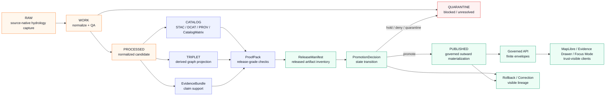

<!-- [KFM_META_BLOCK_V2]
doc_id: kfm://doc/NEEDS-VERIFICATION
title: ADR-0310 Hydrology Processed/Catalog Closure Boundary
type: standard
version: v1
status: draft
owners: OWNER_TBD_NEEDS_VERIFICATION
created: DATE_TBD_FROM_GIT_OR_DOC_REGISTRY
updated: 2026-05-06
policy_label: POLICY_LABEL_TBD_NEEDS_VERIFICATION
related: [
  docs/adr/README.md,
  docs/adr/ADR-TEMPLATE.md,
  docs/adr/ADR-0005-promotion-gate.md,
  docs/adr/ADR-0206-maplibre-layer-manifest.md,
  docs/adr/ADR-0011-catalog-proof-release-separation.md,
  docs/domains/hydrology/ARCHITECTURE.md,
  data/registry/layers/README.md
]
tags: [kfm, adr, hydrology, lifecycle, catalog, triplet, publication, evidence-bundle]
notes: [
  Draft revision for the user-requested target path.
  ADR number needs verification because public-main ADR inventory also contains ADR-0207-governed-ai-runtime-envelope.md.
  This ADR records a boundary decision; it is not implementation proof.
]
[/KFM_META_BLOCK_V2] -->

# ADR-0310: Hydrology Processed/Catalog Closure Boundary

Define the boundary that prevents hydrology `PROCESSED`, `CATALOG`, and `TRIPLET` objects from becoming standalone public truth.


> [!IMPORTANT]
> This ADR is a **boundary decision**, not proof that hydrology schemas, validators, policy gates, workflows, receipts, proof packs, catalog matrices, release manifests, or published artifacts already exist.
>
> Treat implementation maturity as `UNKNOWN` unless the active checkout, tests, emitted artifacts, workflow logs, release records, or runtime evidence prove otherwise.

> [!WARNING]
> **ADR numbering needs verification before merge.**
>
> The requested target path is `docs/adr/ADR-0309-hydrology-processed-catalog-closure-boundary.md`, while the public ADR directory snapshot also lists `ADR-0207-governed-ai-runtime-envelope.md`. Do not rely on ADR number alone until the ADR index is reconciled.

**Quick jumps:** [Status](#status) · [Decision](#decision) · [Context](#context) · [Boundary model](#boundary-model) · [Hydrology closure rules](#hydrology-closure-rules) · [Options considered](#options-considered) · [Impact map](#impact-map) · [Validation](#validation-plan) · [Rollback](#rollback-and-correction) · [Open verification](#open-verification)

---

## Status

**PROPOSED / draft.** This ADR is suitable for review as a hydrology boundary decision.

It should not be treated as accepted implementation law until ADR numbering, owner, policy label, related links, schema-home references, validation commands, and hydrology proof-slice evidence are verified in the active repository.

| Field | Value |
|---|---|
| Target path | `docs/adr/ADR-0309-hydrology-processed-catalog-closure-boundary.md` |
| Decision family | Hydrology lifecycle closure, catalog closure, triplet projection, public release boundary |
| Current decision status | `proposed` |
| Doctrine confidence | `CONFIRMED` from KFM lifecycle and publication doctrine |
| Current implementation depth | `UNKNOWN` without active checkout/runtime proof |
| Merge posture | Hold as `draft` until open verification items are closed |
| Public release posture | `DENY` unless a valid promotion path binds evidence, policy, catalog, proof, release, review, correction, and rollback state |
| Numbering posture | `NEEDS VERIFICATION` because another public ADR uses `ADR-0310` |

### Evidence boundary

| Evidence surface | Status | Supports | Does not prove |
|---|---:|---|---|
| Current target one-line draft | `CONFIRMED` draft lineage | Existing intent: `PROCESSED` / `CATALOG` / `TRIPLET` are derived internal closure artifacts; `EvidenceRef -> EvidenceBundle` and policy/release gates remain required; PR-007 keeps live connectors disabled | Acceptance, merge status, runtime enforcement, tests, or PR state |
| KFM lifecycle doctrine | `CONFIRMED doctrine` | `RAW -> WORK / QUARANTINE -> PROCESSED -> CATALOG / TRIPLET -> PUBLISHED` and promotion as governed state transition | Current file contents, branch state, or generated artifacts |
| Hydrology architecture docs | `CONFIRMED public-main doc snapshot` / `NEEDS REVIEW` for active branch | Hydrology proof lane, source intake, normalization, validation, proof assembly, governed delivery, no emergency alerting | Full implementation maturity |
| Catalog/proof/release ADR family | `CONFIRMED public-main doc snapshot` / `NEEDS REVIEW` for active branch | Catalog, proof, release, receipt, and promotion must remain separate trust surfaces | That all object schemas and gates are implemented |
| Active repository tests, logs, release artifacts | `UNKNOWN` in this authoring pass | Nothing until inspected | Enforcement maturity |

---

## Decision

KFM will treat hydrology `PROCESSED`, `CATALOG`, and `TRIPLET` outputs as **derived internal closure artifacts** unless and until they are bound into a governed publication transition.

A hydrology claim, layer, graph edge, API payload, Evidence Drawer panel, Focus Mode answer, Story Node, export, or map popup is public only when it can resolve:

```text
EvidenceRef
  -> EvidenceBundle
  -> policy decision
  -> catalog / triplet closure where applicable
  -> proof and release manifest
  -> promotion decision
  -> rollback / correction path
```

Moving hydrology bytes into `data/processed/`, emitting catalog metadata, or materializing graph triples is not publication.

### Decision rules

1. **`PROCESSED` is a normalized candidate state.**  
   It may contain validated, versioned, and lineage-bearing hydrology candidates. It is not public truth by itself.

2. **`CATALOG` is closure and discovery, not approval.**  
   Catalog records, STAC/DCAT/PROV mappings, catalog matrices, and hydrology catalog indexes may make assets discoverable and crosswalkable. They do not prove policy, review, release, or promotion.

3. **`TRIPLET` is a derived graph projection.**  
   Hydrology triples may support navigation, relationship reasoning, and query acceleration. They must not become canonical hydrology truth or claim support without evidence links.

4. **`EvidenceBundle` outranks derived surfaces.**  
   Consequential hydrology claims must resolve `EvidenceRef -> EvidenceBundle` before public display, answer, export, or publication.

5. **Promotion changes public release state.**  
   A `PromotionDecision`, tied to a release manifest, proof pack, catalog closure, review state, policy decision, and rollback target, is required before a candidate is treated as `PUBLISHED`.

6. **PR-007 or equivalent hydrology proof work remains no-live-connector unless separately approved.**  
   Any hydrology proof slice governed by this ADR should remain fixture-first and no-network by default. Live connectors require source descriptors, rights checks, activation review, and separate validation evidence.

7. **Negative outcomes are first-class.**  
   Missing evidence, open catalog closure, unresolved source role, unknown rights, stale source posture, or missing release binding must produce `ABSTAIN`, `DENY`, `ERROR`, `hold`, or `quarantine` behavior rather than public-looking output.

### Decision rule

> Hydrology `PROCESSED`, `CATALOG`, and `TRIPLET` artifacts may support publication, but they cannot by themselves authorize public claims, map layers, AI answers, exports, or story surfaces.

### Boundary rule

> Public clients, normal UI surfaces, map popups, Evidence Drawer, Focus Mode, exports, and Story Nodes must consume released artifacts and governed API payloads. They must not read `RAW`, `WORK`, `QUARANTINE`, unpublished `PROCESSED` candidates, catalog-only draft records, internal triples, or canonical/internal stores directly.

---

## Context

KFM is a governed, Kansas-first, map-first, time-aware, evidence-first, trust-visible spatial knowledge and publication system. Its public unit of value is the **inspectable claim**: a statement whose source role, evidence, spatial scope, temporal scope, policy posture, review state, release state, correction lineage, and rollback path can be inspected.

Hydrology is a strong first proof lane because it is public-safe, place-and-time rich, and naturally suited to proving:

- source descriptors and source-role separation,
- HUC / hydrologic identity handling,
- observation and crosswalk normalization,
- catalog closure,
- layer manifests,
- Evidence Drawer drill-through,
- finite runtime outcomes,
- release dry-runs,
- correction and rollback.

That strength also creates a risk. Hydrology pipelines can quickly produce normalized records, catalog metadata, triples, tiles, and maps that look publishable before the trust membrane is complete. This ADR blocks that shortcut.

### Architecture pressure

Without an explicit closure boundary, future contributors may confuse:

| Looks like truth | Actual KFM role |
|---|---|
| A clean `data/processed/hydrology/...` output | Normalized candidate, not publication |
| A STAC/DCAT/PROV catalog entry | Discovery and provenance surface, not release approval |
| A hydrology graph triple | Derived relation projection, not canonical proof |
| A map layer that renders correctly | Visual derivative, not release state |
| A Focus Mode answer with fluent text | Runtime interpretation, not evidence authority |
| A `data/published/...` path | Materialized outward scope only if promotion records support it |

---

## Boundary model



The safe reading is simple: **closure can support release; closure is not release.**

---

## Hydrology closure rules

### Object-family boundary map

| Object family | Hydrology role | Public-use condition | Must not become |
|---|---|---|---|
| `SourceDescriptor` | Defines hydrology source identity, role, rights, cadence, access, and citation posture | Source role and rights must allow intended use | A live connector authorization by itself |
| `IntakeReceipt` / `RunReceipt` | Records fetch, fixture run, transform, validation, or dry-run context | May support audit and replay after redaction/review | Release approval |
| `DatasetVersion` / processed candidate | Stable normalized hydrology candidate | Must pass validation, evidence, policy, catalog, proof, and promotion gates | Public truth merely because it is normalized |
| `EvidenceRef` | Pointer from claim/layer/record to evidence support | Must resolve to `EvidenceBundle` before consequential public claim | A dangling citation string |
| `EvidenceBundle` | Resolved claim support, caveats, rights, source role, review, and release posture | Required for public hydrology claims and answer support | Release approval by itself |
| `CatalogRecord` / `CatalogMatrix` | Discovery, STAC/DCAT/PROV/internal closure | Must close over artifact ids, evidence refs, manifests, and digests before promotion | Policy or proof substitute |
| `Triplet` / graph edge | Derived relation projection for navigation and reasoning | Must cite evidence and remain marked as derived | Canonical hydrology store |
| `LayerManifest` | Layer-facing control object for map rendering | Must reference release, artifact, evidence, time, geometry, sensitivity, stale, and correction state | Tile bytes or policy engine |
| `ProofPack` | Release-grade evidence, policy, validation, sensitivity, catalog, digest, review, and rollback closure | Required before release | Catalog-only metadata |
| `ReleaseManifest` | Public/steward release inventory and digest binding | Must bind proof, catalog, rollback, correction, and release state | Canonical truth |
| `PromotionDecision` | Governed state transition | Required before `PUBLISHED` meaning changes | File movement |
| `CorrectionNotice` / `RollbackReference` | Visible release lineage and recovery path | Required when meaning changes after release | Silent overwrite |

### Required hydrology behavior

| Condition | Required outcome |
|---|---|
| Processed hydrology candidate has no `EvidenceRef` | `ABSTAIN` for public claim; hold candidate |
| `EvidenceRef` does not resolve to `EvidenceBundle` | `ABSTAIN` or `ERROR`, depending on failure mode |
| Catalog entry exists but catalog closure is open | Hold release; do not promote |
| Triplet exists without evidence-backed relation | Reject or quarantine triplet projection |
| Source rights or source role is unknown | `DENY` or `QUARANTINE` public use |
| Release manifest lacks rollback target | Hold release |
| Public UI attempts to read `RAW`, `WORK`, `QUARANTINE`, or unpublished `PROCESSED` data directly | `DENY` and create follow-up validation item |
| Focus Mode receives unresolved or unreleased hydrology context | `ABSTAIN`, `DENY`, or `ERROR`; never fluent unsupported answer |
| Hydrology source becomes stale | Mark stale, abstain on freshness-sensitive claims, or require refresh/review |
| Published hydrology meaning changes | Emit correction, supersession, withdrawal, or rollback lineage |

---

## Options considered

| Option | Description | Benefits | Risks / costs | Evidence posture | Outcome |
|---|---|---|---|---|---|
| A. Treat `PROCESSED` as public-ready | Normalized hydrology candidates become public after validation | Fastest path to visible maps and exports | Collapses lifecycle, skips evidence/release, creates false authority | Conflicts with KFM lifecycle doctrine | Rejected |
| B. Treat catalog closure as publication | Catalog record or STAC/DCAT/PROV entry authorizes public use | Makes metadata central and easy to inspect | Confuses discovery/provenance with policy/review/release | Conflicts with catalog/proof/release separation | Rejected |
| C. Treat triples as graph truth | Hydrology graph projection becomes a claim source | Useful for query speed and relation browsing | Turns derived graph into canonical truth; risks evidence-free edges | Conflicts with derivative-not-truth doctrine | Rejected |
| D. Require promotion over evidence, policy, catalog, proof, release, and rollback | Closure supports publication but does not replace it | Preserves trust membrane and reversible publication | More fields, fixtures, and validators required | Best aligned with KFM doctrine | **Chosen** |

### Rejected shortcuts

| Shortcut | Why rejected | What could reopen discussion |
|---|---|---|
| Public map layer from `data/processed/hydrology/` | Rendering is not release | A successor ADR proving a governed released artifact adapter, not a direct path |
| Public claim from catalog metadata alone | Catalog is discovery/closure, not evidence support or policy approval | Stronger release profile that still requires `PromotionDecision` |
| Focus Mode answer from catalog snippets only | AI is interpretive and evidence-subordinate | Citation validator plus resolved `EvidenceBundle` and finite envelope |
| Graph query answer from internal triples alone | Triples are derived projections | Evidence-linked graph profile with explicit support and release state |

---

## Impact map

### File and documentation impact

| Area | Required update | Status |
|---|---|---|
| `docs/adr/` | Add or revise this ADR; reconcile numbering conflict with existing `ADR-0207-governed-ai-runtime-envelope.md` | `NEEDS VERIFICATION` |
| `docs/adr/README.md` | Add this ADR to inventory or choose successor filename/number | `NEEDS VERIFICATION` |
| `docs/domains/hydrology/ARCHITECTURE.md` | Link this ADR from hydrology boundaries / lifecycle closure | `PROPOSED` |
| `docs/runbooks/hydrology/` | Add processed/catalog/triplet closure checks to promotion and rollback runbooks if those runbooks exist | `PROPOSED / NEEDS VERIFICATION` |
| `data/registry/layers/` | Ensure hydrology layer entries reference release state and EvidenceBundle requirements | `PROPOSED / NEEDS VERIFICATION` |
| `data/processed/hydrology/` | Keep as candidate/derived state, not public authority | `PROPOSED / NEEDS VERIFICATION` |
| `data/catalog/` | Keep catalog closure distinct from proof and release approval | `PROPOSED / NEEDS VERIFICATION` |
| `data/triplets/hydrology/` | Require evidence-backed relation refs and derived status | `PROPOSED / NEEDS VERIFICATION` |
| `data/proofs/` | Store or reference EvidenceBundles / proof packs if repo conventions confirm this home | `PROPOSED / NEEDS VERIFICATION` |
| `release/` | Bind release manifests, promotion decisions, rollback targets, and correction notices | `PROPOSED / NEEDS VERIFICATION` |
| `schemas/contracts/v1/` | Add/verify schemas for closure-bearing objects without duplicating schema authority | `PROPOSED / NEEDS VERIFICATION` |
| `policy/` | Add/verify policy rules that deny public use of open closure, unknown rights, direct internal reads, and missing evidence | `PROPOSED / NEEDS VERIFICATION` |
| `tests/` / `fixtures/` | Add no-network valid/invalid hydrology closure fixtures | `PROPOSED / NEEDS VERIFICATION` |
| `.github/workflows/` | Add or update thin CI jobs only after repo-native workflow conventions are verified | `PROPOSED / NEEDS VERIFICATION` |

### Lifecycle impact

| Lifecycle stage | Decision effect | Guardrail |
|---|---|---|
| Source edge | No live hydrology connector activation by this ADR | Require source descriptor and activation review |
| RAW | Captures source-native input only | No public or Focus Mode access |
| WORK | Supports transform and QA | Fail to `QUARANTINE` on unresolved state |
| QUARANTINE | Holds blocked or unsafe material | Public outputs denied |
| PROCESSED | Holds normalized candidates | Not public truth |
| CATALOG | Holds discovery/provenance/closure | Not release approval |
| TRIPLET | Holds derived relation projection | Evidence-backed and derived only |
| PUBLISHED | Only after promotion | Release manifest, proof, review, rollback, correction path |

### Trust-surface impact

| Surface | Effect | Required check |
|---|---|---|
| Governed API | Must serve finite outcomes over released hydrology evidence only | Contract and negative-path fixture |
| MapLibre shell | May render only release-backed or clearly internal/dry-run layers | Layer manifest and release binding |
| Evidence Drawer | Must show evidence, source role, time, policy, release, stale, correction, and rollback context | Drawer payload fixture |
| Focus Mode / governed AI | Must use resolved EvidenceBundle and finite runtime envelope | Citation validation and policy pre/postcheck |
| Public exports / Story Nodes | Must reference release manifest and correction state | Release and catalog closure |
| Catalog / search / graph projections | Must be marked as discovery or derived surfaces | CatalogMatrix / triplet validation |

---

## Policy, rights, and sensitivity

| Question | Answer | Status |
|---|---|---|
| Does this decision affect public release eligibility? | Yes. It blocks public release from processed/catalog/triplet state alone. | `CONFIRMED doctrine / PROPOSED enforcement` |
| Does it affect exact location exposure? | Indirectly. Hydrology is usually public-safe, but infrastructure, private, hazard, or sensitive join contexts may require restriction. | `NEEDS VERIFICATION` |
| Does it affect emergency or life-safety behavior? | Yes. Hydrology products must not become emergency alerting or life-safety instruction surfaces. | `CONFIRMED doctrine` |
| Does it affect governed AI? | Yes. Focus Mode must not answer from unresolved hydrology closure artifacts. | `PROPOSED enforcement` |
| Does it require steward or policy review? | Yes, before acceptance and before live source activation or public release. | `NEEDS VERIFICATION` |
| Does it change correction, withdrawal, or rollback behavior? | It requires visible correction/rollback lineage before promotion. | `PROPOSED enforcement` |

> [!CAUTION]
> When rights, source role, freshness, identity, evidence closure, release state, or rollback target is unclear, hydrology public surfaces should fail closed through `ABSTAIN`, `DENY`, `ERROR`, `hold`, or `quarantine`.

---

## Validation plan

The commands below are **review targets**, not confirmed current repo commands. Replace with repo-native tooling after the active checkout is inspected.

### Required checks

| Check | Candidate command / artifact | Expected result | Status |
|---|---|---|---|
| ADR inventory check | `find docs/adr -maxdepth 1 -type f -name 'ADR-*.md' \| sort` | Numbering conflict is resolved or documented | `NEEDS VERIFICATION` |
| Hydrology closure fixture validation | `python tools/validators/hydrology/validate_closure.py --fixtures tests/fixtures/hydrology/closure` | Valid fixtures pass; open closure fails | `PROPOSED` |
| Direct public internal-read check | `grep -RInE "data/(raw|work|quarantine|processed/hydrology)" apps packages docs data/registry 2>/dev/null` | Public/runtime paths do not bypass governed API and release state | `PROPOSED` |
| Catalog closure negative test | `python tools/validators/promotion_gate/run.py tests/fixtures/hydrology/fail/catalog_open.json` | Outcome is `DENY`, `hold`, or `ERROR` with reason | `PROPOSED` |
| Evidence closure test | `python tools/validators/evidence/resolve_bundle.py --fixture tests/fixtures/hydrology/evidence_ref.json` | `EvidenceRef` resolves to `EvidenceBundle`; unresolved refs fail | `PROPOSED` |
| Triplet evidence test | `python tools/validators/triplets/validate_edges.py --domain hydrology` | Edges without evidence refs fail | `PROPOSED` |
| Release dry run | `python tools/validators/promotion_gate/run.py tests/fixtures/hydrology/pass/release_candidate.json` | Promotion passes only when evidence, policy, catalog, proof, manifest, review, and rollback close | `PROPOSED` |
| Focus Mode negative test | Repo-native runtime fixture | Missing EvidenceBundle produces `ABSTAIN` or `DENY`, not an answer | `PROPOSED` |

### Negative-path behavior

| Failure condition | Expected outcome | Test posture |
|---|---|---|
| `PROCESSED` candidate has no evidence refs | `ABSTAIN` public claim; hold release | Required negative fixture |
| Catalog record exists but release manifest missing | Hold release | Required negative fixture |
| Triplet relation lacks evidence support | Reject or quarantine projection | Required negative fixture |
| Source rights unknown | `DENY` or `QUARANTINE` | Required policy fixture |
| Public UI bypasses governed API | `DENY` and open defect | Required static check |
| Rollback target missing | Hold release | Required release fixture |

---

## Rollback and correction

### Rollback plan

If this decision causes implementation friction or conflicts with stronger repo evidence:

1. Mark this ADR `CONFLICTED` or `superseded`.
2. Add a successor ADR or correction note.
3. Preserve the original rationale and target path for lineage.
4. Update ADR index, hydrology architecture links, runbooks, validators, schemas, and layer registry references.
5. Do not delete emitted receipts, proof packs, release manifests, catalog records, or correction notices unless safety, privacy, rights, or security review requires removal.

### Rollback triggers

| Trigger | Required action |
|---|---|
| ADR number conflict blocks merge | Rename or supersede using verified ADR numbering policy |
| Existing accepted ADR already governs this exact boundary | Link to it and withdraw this draft |
| Schema-home decision contradicts path references | Update impact map; do not duplicate schema authority |
| Policy-home decision contradicts path references | Update policy references; do not maintain parallel rules |
| Live hydrology connector is enabled without source activation review | Disable connector, quarantine outputs, issue correction/rollback if public surface was affected |
| Public hydrology output bypasses EvidenceBundle or promotion | Withdraw output, issue correction notice, add negative test |

### Supersession rule

A successor ADR may narrow, expand, or replace this decision only if it preserves the core invariant:

> Derived hydrology closure artifacts remain downstream of evidence and upstream of governed publication; they do not become public truth by themselves.

---

## Consequences

### Positive consequences

- Prevents normalized hydrology candidates from being mistaken for release-approved truth.
- Keeps catalog metadata useful without turning metadata into policy or release authority.
- Keeps graph/triplet projections evidence-backed and visibly derived.
- Protects Evidence Drawer and Focus Mode from unsupported hydrology claims.
- Gives PR-007 or equivalent hydrology proof work a clear no-live-connector, no-publication shortcut boundary.
- Makes rollback and correction part of the release burden before public exposure.

### Tradeoffs and risks

| Risk | Mitigation | Residual status |
|---|---|---|
| More gates slow early visible demos | Use tiny no-network hydrology fixtures and dry-run release candidates | Acceptable |
| Contributors may still conflate catalog and proof | Link this ADR from hydrology docs, catalog docs, and promotion runbooks | `NEEDS VERIFICATION` |
| ADR numbering conflict creates confusion | Reconcile ADR index before acceptance | `NEEDS VERIFICATION` |
| Exact validator paths are unknown | Mark commands as candidate checks and adapt to repo-native tooling | `UNKNOWN` |
| Hydrology closure terms may drift from shared object-family vocabulary | Keep object families aligned with contracts/schemas ADRs | `NEEDS VERIFICATION` |

---

## Open verification

| Question | Why it matters | Verification path | Owner |
|---|---|---|---|
| Should this ADR remain `ADR-0310` or be renumbered? | Public ADR inventory also lists another `ADR-0310` | Inspect active `docs/adr/` index and branch history | `OWNER_TBD_NEEDS_VERIFICATION` |
| Is the current one-line target draft already committed in the active branch? | Determines whether this is a revision or new file | Inspect active checkout and git history | `OWNER_TBD_NEEDS_VERIFICATION` |
| Which schema home is accepted for hydrology closure objects? | Prevents duplicate `contracts/` vs `schemas/` authority | Read accepted schema-home ADR and active schema tree | `OWNER_TBD_NEEDS_VERIFICATION` |
| Where do hydrology proof packs, EvidenceBundles, and release manifests live in the active repo? | Prevents wrong impact map | Inspect `data/proofs/`, `release/`, `schemas/`, `contracts/`, and tests | `OWNER_TBD_NEEDS_VERIFICATION` |
| Does PR-007 exist, and what exactly does it change? | Target draft references PR-007 | Inspect PR metadata or local branch commit history | `OWNER_TBD_NEEDS_VERIFICATION` |
| Are live hydrology connectors disabled in the proof slice? | This ADR assumes fixture-first/no-network behavior | Inspect connectors, config defaults, CI, and runtime logs | `OWNER_TBD_NEEDS_VERIFICATION` |
| Which tests enforce processed/catalog/triplet non-public behavior? | Converts ADR from doctrine to enforceable behavior | Inspect tests and CI results | `OWNER_TBD_NEEDS_VERIFICATION` |
| Are there existing hydrology layer manifests that need migration? | Avoids silent breakage | Inspect `data/registry/layers/` and hydrology layer fixtures | `OWNER_TBD_NEEDS_VERIFICATION` |

---

## Review checklist

- [ ] ADR number and filename are reconciled with the active ADR index.
- [ ] Meta block placeholders are replaced or deliberately left as searchable `NEEDS VERIFICATION` values.
- [ ] Hydrology architecture links to this ADR or explains why not.
- [ ] Catalog/proof/release separation ADR remains consistent with this boundary.
- [ ] Schema-home and policy-home references do not create parallel authority.
- [ ] `PROCESSED`, `CATALOG`, and `TRIPLET` are documented as derived/internal closure surfaces unless promoted.
- [ ] Public clients are blocked from `RAW`, `WORK`, `QUARANTINE`, unpublished `PROCESSED`, catalog-only draft records, and internal triples.
- [ ] EvidenceRef-to-EvidenceBundle closure is tested for hydrology public claims.
- [ ] Open catalog closure blocks promotion.
- [ ] Triplet edges without evidence are rejected, quarantined, or marked non-claiming.
- [ ] Unknown rights/source roles fail closed.
- [ ] Release dry run includes proof, manifest, promotion, rollback, and correction references.
- [ ] Focus Mode fixture cannot answer from unresolved hydrology closure artifacts.
- [ ] No live hydrology connector is enabled by this ADR.
- [ ] Rollback and correction behavior is visible and testable.

---

## Appendix A — Minimal glossary

| Term | Meaning in this ADR |
|---|---|
| `PROCESSED` | Normalized, candidate hydrology state downstream of work/quarantine and upstream of catalog/release |
| `CATALOG` | Discovery/provenance/closure metadata, including STAC/DCAT/PROV-like records and `CatalogMatrix` |
| `TRIPLET` | Derived graph relation projection for navigation and reasoning |
| `EvidenceRef` | Reference from a claim, layer, record, or edge to support evidence |
| `EvidenceBundle` | Resolved, inspectable support package that outranks generated language |
| `ProofPack` | Release-grade validation, evidence, policy, sensitivity, catalog, integrity, review, and rollback proof surface |
| `ReleaseManifest` | Inventory and digest binding for one release |
| `PromotionDecision` | Governed state transition that changes admissible public meaning |
| `CorrectionNotice` | Visible record of correction, supersession, withdrawal, narrowing, or generalization |
| `RollbackReference` | Link to a safe prior release or reversible target |

## Appendix B — Placeholder standard used here

- `OWNER_TBD_NEEDS_VERIFICATION`
- `DATE_TBD_FROM_GIT_OR_DOC_REGISTRY`
- `POLICY_LABEL_TBD_NEEDS_VERIFICATION`
- `kfm://doc/NEEDS-VERIFICATION`
- `NEEDS VERIFICATION`
- `UNKNOWN`
- `PROPOSED`

These placeholders are intentional. They should be replaced only after active repository, owner, policy, and document-registry evidence is inspected.

---

[Back to top](#adr-0007-hydrology-processedcatalog-closure-boundary)
