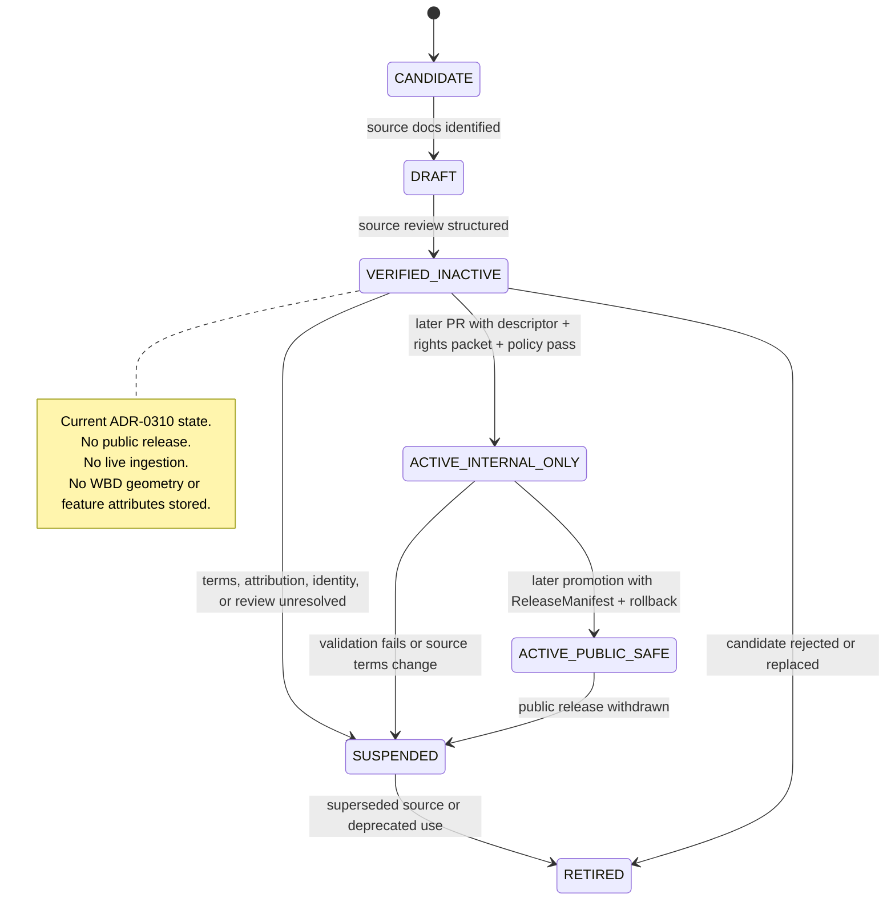

<!-- [KFM_META_BLOCK_V2]
doc_id: kfm://doc/NEEDS-VERIFICATION-ADR-0310-HYDROLOGY-WBD-TERMS-RIGHTS
title: ADR-0310: Hydrology WBD Terms and Rights Review
type: standard
version: v1
status: review
owners: TODO: hydrology domain steward; documentation steward; policy steward; rights reviewer
created: NEEDS-VERIFICATION
updated: 2026-05-06
policy_label: restricted-draft
related: [./README.md, ./ADR-0303-hydrology-source-descriptor-activation-gates.md, ./ADR-0305-hydrology-source-documentation-verification.md, ./ADR-0307-hydrology-wbd-metadata-probe.md, ./ADR-0311-hydrology-synthetic-release-governance.md, ../domains/hydrology/README.md, ../reports/hydrology-wbd-terms-rights-inspection.md, ../../data/registry/crosswalk/sources.yaml, ../../data/registry/sources/hydrology/source_descriptors/SRC-HYD-WBD-CANDIDATE.json, ../../schemas/contracts/v1/source/source_activation_decision.schema.json, ../../fixtures/source/hydrology/source_activation_decision.wbd.verified_inactive.valid.json, ../../release/dry_runs/hydrology_wbd_terms_rights_gate.json, ../../data/receipts/source_verification/hydrology/activation_decisions/SAD-WBD-ABSTAIN-001.json]
tags: [kfm, adr, hydrology, wbd, huc12, rights, terms, source-activation, verified-inactive, public-release, fail-closed]
notes: [
  Preserves the existing ADR-0310 decision: WBD/HUC12 remains VERIFIED_INACTIVE and non-public after terms and rights review.
  Distinguishes external public-domain/public-access source posture from KFM publication eligibility.
  Official USGS source pages were checked during this revision; repo-native dry-run artifacts still keep KFM rights, attribution, activation, and public release blocked.
  Owners, created date, final legal/risk reviewer, policy steward approval, branch protection, CI enforcement, and full promotion workflow remain NEEDS VERIFICATION.
]
[/KFM_META_BLOCK_V2] -->

<a id="top"></a>

# ADR-0310: Hydrology WBD Terms and Rights Review

Public-domain source material is not the same thing as KFM public-release eligibility.

<p align="center">
  
  
  
  
  
</p>

<p align="center">
  <a href="#decision-summary">Decision</a> ·
  <a href="#repo-fit-and-placement">Repo fit</a> ·
  <a href="#evidence-boundary">Evidence</a> ·
  <a href="#terms-and-rights-determination">Terms & rights</a> ·
  <a href="#state-model">State model</a> ·
  <a href="#release-controls">Release controls</a> ·
  <a href="#acceptance-criteria">Acceptance</a> ·
  <a href="#rollback-and-supersession">Rollback</a>
</p>

> [!IMPORTANT]
> **Decision preserved:** WBD/HUC12 remains `VERIFIED_INACTIVE`.
>
> This ADR does not activate live WBD ingestion, does not store WBD geometry, does not store WBD feature attributes, does not publish a public map layer, and does not allow public API, Evidence Drawer, or Focus Mode use of WBD-derived KFM outputs.

> [!NOTE]
> This ADR does **not** say WBD is legally private. Official USGS source material supports a public-domain/public-access external posture. The KFM decision is narrower: public release through KFM remains blocked until KFM-specific source descriptor, rights, attribution, validation, policy, release, correction, and rollback gates are accepted.

---

## Decision summary

| Field | Determination |
|---|---|
| ADR path | `docs/adr/ADR-0310-hydrology-wbd-terms-rights-review.md` |
| Owning root | `docs/` |
| Local responsibility | `docs/adr/` human-facing decision ledger |
| Decision | Keep WBD/HUC12 source candidate `VERIFIED_INACTIVE` and not eligible for public release. |
| Source family | USGS Watershed Boundary Dataset / HUC12 |
| KFM source candidate | `SRC-HYD-WBD-CANDIDATE` |
| Source role | `HYDROLOGIC_BOUNDARY` / hydrologic-unit boundary context |
| Runtime decision | `ABSTAIN` for activation until review closes |
| Policy decision | `DENY` for public publication until KFM release gates pass |
| Release posture | `DRAFT`; no public release, no public alias, no live source ingestion |
| Data handling posture | No WBD geometry or WBD feature attributes stored by this ADR |
| External rights posture | Official source checks support public-domain/public-access source status |
| KFM rights posture | `NEEDS VERIFICATION` for attribution, source descriptor, snapshot identity, release, and publication |
| Rollback target | `release/dry_runs/hydrology_wbd_metadata_probe_gate.json` |
| Correction route | `contracts/correction/correction_notice.md` |
| Public-surface rule | Governed API, MapLibre, Evidence Drawer, and Focus Mode must not expose WBD-derived KFM outputs until a later accepted release decision permits it. |

**Final decision:** WBD may remain a high-trust hydrologic boundary source candidate, but WBD-derived KFM outputs remain non-public review material until a later promotion decision proves the full KFM chain.

<p align="right"><a href="#top">Back to top ↑</a></p>

---

## Repo fit and placement

`docs/adr/ADR-0310-hydrology-wbd-terms-rights-review.md` belongs under `docs/adr/` because it records a governance-significant architecture decision.

| Placement question | Answer |
|---|---|
| Why under `docs/`? | ADRs are human-facing governance records and part of the documentation control plane. |
| Why under `docs/adr/`? | This decision affects source activation, rights posture, public release eligibility, rollback, and downstream UI/API/AI trust boundaries. |
| Why not under `docs/domains/hydrology/` only? | The source is hydrology-specific, but the decision affects cross-cutting KFM publication governance. |
| Why not under `schemas/`, `policy/`, `release/`, or `data/`? | This file decides and explains. Machine schemas, executable policy, release dry-runs, and receipts remain in their responsibility roots. |
| Directory Rules basis | Root folders are authority boundaries. Domain work belongs under the appropriate responsibility root, not as new root-level domain folders. |

### Upstream and downstream links

| Relationship | Path | Role |
|---|---|---|
| ADR index | [`./README.md`](./README.md) | Navigation, ADR status, naming, review, rollback, and supersession discipline. |
| Source activation gates | [`./ADR-0303-hydrology-source-descriptor-activation-gates.md`](./ADR-0303-hydrology-source-descriptor-activation-gates.md) | Source admission and activation state discipline. |
| Source documentation verification | [`./ADR-0305-hydrology-source-documentation-verification.md`](./ADR-0305-hydrology-source-documentation-verification.md) | Source docs are prerequisite support only, not claim evidence. |
| WBD metadata probe | [`./ADR-0307-hydrology-wbd-metadata-probe.md`](./ADR-0307-hydrology-wbd-metadata-probe.md) | Metadata-only probe gate; never public release by probe alone. |
| Hydrology domain landing page | [`../domains/hydrology/README.md`](../domains/hydrology/README.md) | Hydrology proof-lane doctrine and source-role boundaries. |
| WBD source descriptor | [`../../data/registry/sources/hydrology/source_descriptors/SRC-HYD-WBD-CANDIDATE.json`](../../data/registry/sources/hydrology/source_descriptors/SRC-HYD-WBD-CANDIDATE.json) | Candidate source descriptor; public release blocked. |
| Crosswalk source registry | [`../../data/registry/crosswalk/sources.yaml`](../../data/registry/crosswalk/sources.yaml) | Draft source-family registry; `rights_default: public` is not release eligibility. |
| Source activation schema | [`../../schemas/contracts/v1/source/source_activation_decision.schema.json`](../../schemas/contracts/v1/source/source_activation_decision.schema.json) | Machine shape for finite activation decisions. |
| Verified-inactive fixture | [`../../fixtures/source/hydrology/source_activation_decision.wbd.verified_inactive.valid.json`](../../fixtures/source/hydrology/source_activation_decision.wbd.verified_inactive.valid.json) | Valid `ABSTAIN` + `VERIFIED_INACTIVE` fixture. |
| Activation receipt | [`../../data/receipts/source_verification/hydrology/activation_decisions/SAD-WBD-ABSTAIN-001.json`](../../data/receipts/source_verification/hydrology/activation_decisions/SAD-WBD-ABSTAIN-001.json) | Process memory for current activation abstention. |
| Terms/rights dry-run | [`../../release/dry_runs/hydrology_wbd_terms_rights_gate.json`](../../release/dry_runs/hydrology_wbd_terms_rights_gate.json) | Release dry-run artifact preserving `DENY`, `UNKNOWN` rights, and `VERIFIED_INACTIVE`. |
| Terms/rights inspection report | [`../reports/hydrology-wbd-terms-rights-inspection.md`](../reports/hydrology-wbd-terms-rights-inspection.md) | Records prior no-network inspection posture and open verification. |

> [!CAUTION]
> `rights_default: public` in a registry is a useful source-review hint. It does **not** override a release dry-run that says `rights_status: UNKNOWN`, `policy_decision: DENY`, and `publication_eligibility_decision: NOT_ELIGIBLE`.

<p align="right"><a href="#top">Back to top ↑</a></p>

---

## What this ADR decides

This ADR decides that WBD/HUC12 remains admissible for **source review** but not for **KFM public publication**.

| Decision | Status |
|---|---|
| Keep WBD source candidate in KFM tracking | `ALLOW` as candidate/review material |
| Keep source activation state | `VERIFIED_INACTIVE` |
| Keep activation decision | `ABSTAIN` |
| Keep public release blocked | `DENY` |
| Keep terms and attribution review open | `NEEDS VERIFICATION` |
| Treat official source checks as source-review evidence only | `ALLOW` |
| Use source documentation as hydrologic claim evidence | `DENY` |
| Store WBD geometry in this ADR | `DENY` |
| Store WBD feature attributes in this ADR | `DENY` |
| Publish map/API/UI/AI outputs from WBD through this ADR | `DENY` |

### What this ADR does not decide

| Not decided here | Required later |
|---|---|
| Whether to fetch WBD data | Source activation decision, retrieval receipt, storage policy, and validation plan. |
| Whether to store WBD geometry | Geometry storage policy, lifecycle destination, schema, validation, receipt, and rollback plan. |
| Which WBD attributes are allowed | Attribute minimization policy and schema review. |
| Whether any WBD-derived layer can become public | ReleaseManifest, catalog/proof closure, rights/attribution review, policy pass, review state, correction path, and rollback target. |
| Whether Focus Mode may answer WBD questions | EvidenceBundle resolution, citation validation, finite runtime envelope, and public-release permission. |

<p align="right"><a href="#top">Back to top ↑</a></p>

---

## Why this ADR exists

WBD/HUC12 is attractive for the hydrology proof lane because it provides hydrologic-unit boundaries and a clear HUC hierarchy. That also makes it easy to over-promote.

KFM must keep three ideas separate:

| Thing | What it means | What it does **not** mean |
|---|---|---|
| External source accessibility | USGS WBD can be found through official source pages, data catalog entries, downloads, or services. | KFM can publish derived geometry immediately. |
| External rights posture | Official USGS pages support a public-domain/public-access source posture and credit expectations. | KFM attribution, source descriptor, release, policy, correction, and rollback gates are complete. |
| KFM source activation | KFM has admitted a source candidate into a governed lifecycle state. | Public map/API/AI surfaces may expose it without release proof. |

This ADR prevents “public domain” from becoming a shortcut around KFM’s trust membrane.

### Protected boundary

```text
official WBD source documentation
→ KFM source documentation review
→ inactive SourceDescriptor candidate
→ no-network fixture and metadata probe
→ terms, rights, and attribution review
→ validation and policy
→ EvidenceBundle / ReleaseManifest
→ governed public surface
```

Any shortcut from official source documentation directly to public KFM surface is a `DENY`, `ABSTAIN`, or `ERROR`.

<p align="right"><a href="#top">Back to top ↑</a></p>

---

## Evidence boundary

This ADR is grounded in repository evidence, attached KFM doctrine, and official USGS source checks. It does not claim branch protection, CI enforcement, legal approval, or public-release readiness.

| Evidence | Status | Supports | Does not prove |
|---|---|---|---|
| Existing ADR-0310 file | `CONFIRMED` | Existing decision and structure were preserved. | Final owner approval or enforcement. |
| ADR index | `CONFIRMED repo doc / NEEDS VERIFICATION coverage` | ADRs belong under `docs/adr/`; decisions require evidence labels, validation, rollback, and supersession. | Complete ADR inventory or current CI enforcement. |
| Hydrology domain README | `CONFIRMED repo doc / draft` | Hydrology is first proof lane; WBD/HUC is hydrologic-unit framing; fixture-first/no-network posture. | That all adjacent proposed hydrology paths are implemented. |
| WBD source descriptor | `CONFIRMED repo data` | `SRC-HYD-WBD-CANDIDATE` exists, has `source_role: BOUNDARY_CONTEXT`, `public_release_allowed: false`, and `verification_status: NEEDS_VERIFICATION`. | Public release eligibility. |
| Source activation decision schema | `CONFIRMED repo schema` | Finite activation decisions are `ALLOW`, `ABSTAIN`, `DENY`, `ERROR`; valid states include `VERIFIED_INACTIVE`. | That every consumer enforces the schema. |
| WBD verified-inactive fixture | `CONFIRMED repo fixture` | WBD source activation fixture uses `ABSTAIN` + `VERIFIED_INACTIVE`. | Public release eligibility. |
| Activation receipt | `CONFIRMED repo receipt` | Preserves `SAD-WBD-ABSTAIN-001` process memory. | Final activation approval. |
| Terms/rights dry-run | `CONFIRMED repo artifact` | Records `no_public_release: true`, `rights_status: UNKNOWN`, `policy_decision: DENY`, and `activation_decision: VERIFIED_INACTIVE`. | That CI enforces the dry-run. |
| Source registry crosswalk | `CONFIRMED repo registry` | Lists `usgs_wbd_huc12` as high-trust, periodic, public-default hydrologic boundary source. | Release readiness or final rights review. |
| Hydrology WBD terms/rights inspection report | `CONFIRMED repo report` | Prior inspection kept network disabled, no ingestion, no geometry/attributes stored, and terms pages `ABSTAIN`. | Current external terms closure or release approval. |
| Official USGS WBD and policy pages | `EXTERNALLY CHECKED` | WBD meaning, public-domain/public-access signals, and credit expectations. | KFM-specific source activation, publication, or legal signoff. |
| Attached KFM doctrine | `CONFIRMED doctrine / PROPOSED implementation where applicable` | Lifecycle, source-role, fail-closed, EvidenceBundle, ReleaseManifest, and rollback posture. | Current branch behavior unless repo evidence proves it. |

### Naming drift watch

`docs/adr/ADR-0307-hydrology-wbd-metadata-probe.md` is the path referenced by this ADR. The fetched file title currently says `ADR-0308: Hydrology WBD Metadata Probe Gate`. Treat this as `NEEDS VERIFICATION` naming drift and preserve path identity until the ADR index is reconciled.

### Truth labels used here

| Label | Meaning |
|---|---|
| `CONFIRMED` | Verified from repository evidence, current source checks, or attached KFM doctrine during this revision. |
| `EXTERNALLY CHECKED` | Checked against official source pages; version-sensitive over time. |
| `PROPOSED` | Rule, gate, path, checklist, or implementation step not proven as enforced. |
| `NEEDS VERIFICATION` | Checkable item requiring maintainer, rights, policy, CI, source, or release evidence. |
| `UNKNOWN` | Not verified strongly enough in this revision. |
| `DENY` | Safe negative outcome when policy blocks publication or activation. |
| `ABSTAIN` | Safe negative outcome when source support or release eligibility is incomplete. |
| `ERROR` | Required artifact or validation state is missing or malformed. |

<p align="right"><a href="#top">Back to top ↑</a></p>

---

## Terms and rights determination

Official source checks support a strong **external** starting posture:

- USGS describes WBD as a seamless national hydrologic-unit dataset.
- WBD hydrologic units organize, collect, manage, and report hydrologic information through a nested HUC hierarchy.
- WBD is complete nationally to the 12-digit hydrologic unit.
- USGS WBD media/source notes identify WBD material as public domain.
- The USGS Science Data Catalog lists WBD access as public and its license as the USA.gov public-domain label.
- USGS asks users to provide proper credit when using USGS information.

KFM still keeps WBD `VERIFIED_INACTIVE` because KFM publication requires more than external public-domain status.

### KFM release burden still open

| Required closure item | Current ADR posture | Required before publication |
|---|---|---|
| Official source citation | `NEEDS VERIFICATION` | Exact citation text and source page(s) recorded in SourceDescriptor or release notes. |
| Attribution text | `NEEDS VERIFICATION` | Display/metadata attribution pattern accepted by documentation and policy stewards. |
| Terms snapshot | `NEEDS VERIFICATION` | Review timestamp, source URLs, and rights summary preserved. |
| SourceDescriptor | `CONFIRMED candidate / NEEDS VERIFICATION for release` | Descriptor must carry source role, rights, terms, cadence, caveats, scope, and steward review. |
| Data snapshot identity | `NEEDS VERIFICATION` | Download/service endpoint, snapshot date/version, digest, and retrieval receipt. |
| Geometry storage decision | `DENY for this ADR` | Later PR must decide whether and where WBD geometry may be captured. |
| Feature attribute storage decision | `DENY for this ADR` | Later PR must decide allowed attributes, minimization, and release class. |
| Public layer eligibility | `DENY` | Requires ReleaseManifest, policy pass, catalog/provenance closure, and rollback target. |
| API/UI eligibility | `DENY` | Requires governed API payloads downstream of released artifacts only. |
| AI/Focus Mode eligibility | `DENY` | Requires EvidenceBundle resolution and citation validation; no direct model-client path. |

### Rights decision table

| Question | Answer for ADR-0310 |
|---|---|
| Can WBD remain in the source registry as a candidate hydrologic boundary source? | Yes. |
| Can WBD be described as public-domain/public-access source material in KFM docs? | Yes, when the statement is tied to official source links and a review date. |
| Can KFM treat WBD as public-release-ready because it is public domain? | No. |
| Can this ADR store WBD geometry? | No. |
| Can this ADR store WBD feature attributes? | No. |
| Can this ADR create a public map layer or public alias? | No. |
| Can this ADR activate live WBD ingestion? | No. |
| Can this ADR support public claims through EvidenceBundle? | No; a later release decision must do that. |

> [!CAUTION]
> A source can be legally reusable and still be blocked from KFM publication if KFM has not recorded source role, attribution, snapshot identity, validation, policy, release, correction, and rollback state.

<p align="right"><a href="#top">Back to top ↑</a></p>

---

## Decision details

### 1. Preserve `VERIFIED_INACTIVE`

The WBD source candidate remains:

```json
{
  "source_id": "SRC-HYD-WBD-CANDIDATE",
  "decision": "ABSTAIN",
  "source_activation_state": "VERIFIED_INACTIVE"
}
```

This state means the source candidate is tracked and reviewable, but not active for public use.

### 2. Keep publication blocked

For this ADR:

```json
{
  "no_live_source_ingestion": true,
  "no_wbd_geometry_stored": true,
  "no_wbd_feature_attributes_stored": true,
  "no_public_release": true,
  "publication_eligibility_decision": "NOT_ELIGIBLE",
  "policy_decision": "DENY"
}
```

### 3. Treat `rights_default: public` as a source-review hint

The source registry may identify `usgs_wbd_huc12` as high-trust and public-default. That does not supersede the stricter release dry-run. For public-facing KFM use, the stricter release artifact wins until a later accepted decision says otherwise.

### 4. Keep source documentation out of claim evidence

Source pages and terms checks may support source documentation review and SourceDescriptor drafting. They do not support public hydrologic claims by themselves.

### 5. Require explicit attribution handling

Before public release, KFM must decide where USGS credit appears:

| Surface | Required attribution behavior |
|---|---|
| SourceDescriptor | Human-readable source and rights/credit summary. |
| Catalog metadata | Source citation, publisher, access, license, and retrieval/snapshot fields. |
| LayerManifest | Attribution string or reference to a shared attribution entry. |
| Map UI | Trust-visible source chip or attribution panel if the layer is published. |
| Evidence Drawer | Source role, source citation, limitations, and release state. |
| Export/download | Attribution and license/public-domain notice when public export is allowed. |
| ReleaseManifest | Rights/attribution review status and reviewer trace. |

<p align="right"><a href="#top">Back to top ↑</a></p>

---

## State model



### Allowed transitions from `VERIFIED_INACTIVE`

| Transition | Allowed by this ADR? | Required evidence |
|---|---:|---|
| `VERIFIED_INACTIVE` → `ACTIVE_INTERNAL_ONLY` | No; later PR only | SourceDescriptor, no-network fixture, source terms packet, attribution plan, validation report, policy decision, rollback target. |
| `VERIFIED_INACTIVE` → `ACTIVE_PUBLIC_SAFE` | No | Must pass internal activation and release gates first. |
| `VERIFIED_INACTIVE` → `SUSPENDED` | Yes | Source terms changed, source identity unclear, attribution cannot be resolved, or reviewer blocks use. |
| `VERIFIED_INACTIVE` → `RETIRED` | Yes | Candidate rejected, source superseded, or hydrology source strategy changes. |

<p align="right"><a href="#top">Back to top ↑</a></p>

---

## Release controls

### Blocking controls

| Control | Required behavior | Failure outcome |
|---|---|---|
| Live ingestion guard | No live WBD fetch or scheduled connector from this ADR. | `DENY` |
| Geometry guard | No WBD geometry stored by this ADR. | `DENY` |
| Attribute guard | No WBD feature attributes stored by this ADR. | `DENY` |
| Publication guard | No public alias, published artifact, API payload, tile, or map layer. | `DENY` |
| Attribution guard | No publication without exact attribution/citation plan. | `DENY` |
| Source-descriptor guard | No activation without SourceDescriptor and review state. | `DENY` or `ERROR` |
| Evidence guard | Source docs cannot be used as hydrologic claim evidence. | `DENY` |
| AI guard | No direct model-client use and no uncited Focus Mode answer. | `DENY` |
| Rollback guard | No release without rollback target and correction route. | `ERROR` |
| Stale terms guard | Terms/rights source checks must be refreshed before activation. | `ABSTAIN` |

### Public-surface denial matrix

| Surface | Current state | Reason |
|---|---|---|
| Public MapLibre WBD layer | Blocked | No ReleaseManifest or public attribution plan. |
| Public governed API WBD endpoint | Blocked | No public-safe release decision. |
| Evidence Drawer WBD feature payload | Blocked | No EvidenceBundle closure for public use. |
| Focus Mode WBD answer | Blocked | No public EvidenceBundle + citation validation path. |
| Download/export bundle | Blocked | No release, attribution, or distribution manifest. |
| Internal review packet | Allowed | Must remain non-public/restricted-draft unless policy steward changes label. |
| Source registry candidate | Allowed | Must not imply activation. |
| Dry-run release gate | Allowed | Must remain `DRAFT` and non-public. |

<p align="right"><a href="#top">Back to top ↑</a></p>

---

## Required fields for the next SourceDescriptor review

A later PR may advance the WBD candidate only by adding or updating a source descriptor with the fields below.

| Field | Requirement |
|---|---|
| `source_id` | `SRC-HYD-WBD-CANDIDATE` or accepted successor ID. |
| `publisher` | U.S. Geological Survey / National Geospatial Technical Operations Center, as verified. |
| `source_family` | `WBD_HUC12` or accepted hydrology source-family enum. |
| `source_role` | Hydrologic unit boundary; not observation, flood event, or regulatory hazard claim. |
| `external_rights_status` | Public-domain/public-access support, with official source URLs and retrieval date. |
| `kfm_rights_review_status` | `NEEDS_VERIFICATION`, `ABSTAIN`, or accepted equivalent until reviewer closes. |
| `attribution_text` | Exact proposed USGS credit text. |
| `license_or_terms_refs` | Official source rights/credit links. |
| `access_method` | Download/service path and whether it is a snapshot, service, or metadata-only probe. |
| `snapshot_or_version` | Snapshot identifier, publication date, metadata date, or service version if used. |
| `retrieval_receipt` | Required before any actual data capture. |
| `geometry_policy` | Whether geometry capture is allowed, restricted, generalized, or blocked. |
| `attribute_policy` | Which attributes may be captured, minimized, or blocked. |
| `public_release_class` | Must remain `not_eligible` until ReleaseManifest exists. |
| `activation_state` | Must remain `VERIFIED_INACTIVE` unless a later accepted decision changes it. |
| `reviewers` | Hydrology, documentation, policy, and rights reviewers or explicit placeholders. |
| `rollback_target` | Existing dry-run gate or successor rollback artifact. |

<p align="right"><a href="#top">Back to top ↑</a></p>

---

## Accepted inputs and exclusions

### Accepted by this ADR

- Terms and rights review notes.
- Official source-documentation references.
- Attribution draft text.
- Source activation decision fixtures.
- Dry-run release gate records.
- Review checklists.
- Rollback and supersession notes.
- Non-public source-descriptor drafts.

### Excluded by this ADR

| Excluded material | Where it goes instead |
|---|---|
| WBD geometry | Later governed source-ingest PR after terms, receipt, and storage policy approval. |
| WBD feature attributes | Later governed source-ingest PR with attribute minimization and schema review. |
| Public WBD PMTiles or vector tiles | Later release candidate with LayerManifest and ReleaseManifest. |
| Public API route | Later governed API PR after release eligibility. |
| MapLibre source/layer registration | Later UI/map PR after release eligibility. |
| Evidence Drawer public payload | Later release/UI PR after EvidenceBundle closure. |
| Focus Mode public answer | Later governed AI/API PR after EvidenceBundle and citation validation. |
| Live connector | Later activation ADR or source activation decision. |
| Emergency or life-safety guidance | Out of scope; KFM is not an emergency alert system. |

<p align="right"><a href="#top">Back to top ↑</a></p>

---

## Acceptance criteria

ADR-0310 may move beyond `review` only when the following are true.

- [ ] ADR index lists ADR-0310 with status and decision summary.
- [ ] Owners/stewards for hydrology, documentation, policy, and rights review are named or explicitly placeholdered.
- [ ] Source activation decision schema is referenced by this ADR and any fixtures validate against it.
- [ ] WBD verified-inactive fixture remains valid and uses `ABSTAIN` + `VERIFIED_INACTIVE`.
- [ ] Activation receipt preserves `SAD-WBD-ABSTAIN-001` or accepted successor process memory.
- [ ] WBD terms/rights dry-run artifact remains `DRAFT`, non-public, and policy-denied unless superseded by a later accepted release decision.
- [ ] Source registry language distinguishes `rights_default: public` from KFM public-release eligibility.
- [ ] Official source rights/credit pages are recorded with retrieval date.
- [ ] Exact USGS attribution text is proposed and reviewed.
- [ ] No WBD geometry is added by this ADR.
- [ ] No WBD feature attributes are added by this ADR.
- [ ] No public aliases, tiles, API payloads, Evidence Drawer payloads, or Focus Mode answers are added by this ADR.
- [ ] Future activation path requires SourceDescriptor, retrieval receipt, no-network fixture, validation report, policy decision, ReleaseManifest, correction route, and rollback target.
- [ ] Documentation says source documentation and source rights review are not claim evidence.
- [ ] Any change to `VERIFIED_INACTIVE` state is handled in a later ADR, source activation decision, or release PR with validation evidence.

### Definition of done for this documentation revision

- [x] Existing decision is preserved and expanded rather than replaced by generic rights language.
- [x] External WBD public-domain/public-access status is acknowledged without weakening KFM release gates.
- [x] Current repo artifacts are linked with relative paths where verified or already referenced.
- [x] Remaining verification items are explicit.
- [x] Rollback path is visible.
- [x] No implementation enforcement is claimed without current repository evidence.

<p align="right"><a href="#top">Back to top ↑</a></p>

---

## Change protocol

Any PR that changes WBD activation or publication status must include:

1. Updated ADR-0310 or successor decision.
2. Updated source activation decision record.
3. Updated SourceDescriptor or source registry entry.
4. Rights/terms review packet with source URLs and retrieval date.
5. Attribution text and display plan.
6. Retrieval receipt if data is fetched.
7. Geometry/attribute storage policy.
8. Validator and fixture updates.
9. Policy decision.
10. ReleaseManifest if anything becomes public.
11. Correction route and rollback target.
12. Notes explaining what remains non-public.

### State-change guard

```text
IF source_activation_state changes from VERIFIED_INACTIVE
THEN require explicit activation decision + policy pass + rollback target.

IF public_release changes from false to true
THEN require ReleaseManifest + attribution + EvidenceBundle closure + correction route.

IF WBD geometry or attributes are introduced
THEN require retrieval receipt + storage path + schema + minimization review + no-public-bypass assertion.
```

<p align="right"><a href="#top">Back to top ↑</a></p>

---

## Rollback and supersession

If this ADR is rolled back or superseded:

1. Preserve this file as lineage.
2. Keep `SRC-HYD-WBD-CANDIDATE` `VERIFIED_INACTIVE` unless the successor decision explicitly changes it.
3. Keep public release denied unless a successor ReleaseManifest is accepted.
4. Preserve dry-run artifacts and activation-decision receipts.
5. Mark superseded rights or attribution reviews with a replacement reference.
6. Revoke public aliases if any were accidentally created.
7. Issue a CorrectionNotice if any public material escaped before release acceptance.
8. Update the ADR index and hydrology tracking docs.
9. Preserve old receipts/proofs/releases; do not delete audit history.

Rollback must protect the evidence chain and must not convert a terms review into a public release.

<p align="right"><a href="#top">Back to top ↑</a></p>

---

## Open verification backlog

| Item | Status | Why it matters |
|---|---|---|
| Created date | `NEEDS VERIFICATION` | Existing file did not include a verified creation date. |
| Owners/stewards | `NEEDS VERIFICATION` | Rights, hydrology, policy, and documentation review burden must be explicit. |
| ADR index status | `NEEDS VERIFICATION` | `docs/adr/README.md` should list ADR-0310 with current status. |
| ADR-0307 / ADR-0308 title drift | `NEEDS VERIFICATION` | Preserve path identity until the ADR registry resolves naming drift. |
| Legal/risk reviewer | `NEEDS VERIFICATION` | This ADR is not legal advice; a reviewer must own final rights posture. |
| Exact attribution text | `NEEDS VERIFICATION` | Required before publication. |
| Exact source snapshot/version/digest | `NEEDS VERIFICATION` | Required before geometry/attribute capture. |
| Geometry storage policy | `NEEDS VERIFICATION` | Required before any WBD geometry enters lifecycle data. |
| Attribute minimization policy | `NEEDS VERIFICATION` | Required before any WBD feature attributes enter lifecycle data. |
| CI enforcement | `NEEDS VERIFICATION` | Workflow file presence is not proof of enforced checks. |
| Branch protection | `UNKNOWN` | Required before claiming checks are mandatory. |
| Policy implementation | `NEEDS VERIFICATION` | Dry-run JSON records policy posture; policy-as-code enforcement must be verified separately. |
| ReleaseManifest successor | `UNKNOWN` | Needed before public map/API/UI/AI use. |
| Current source terms at activation time | `NEEDS VERIFICATION` | Terms and source pages are version-sensitive. |

<p align="right"><a href="#top">Back to top ↑</a></p>

---

## Official references checked

These references support source-rights review only. They do not activate WBD in KFM.

| Reference | Use in this ADR |
|---|---|
| [USGS Watershed Boundary Dataset][usgs-wbd] | WBD description, HUC hierarchy, public-domain source note, and authoritative snapshot note. |
| [USGS WBD Science Data Catalog entry][usgs-wbd-sdc] | Public access and public-domain license signal. |
| [USGS Copyrights and Credits][usgs-copyrights] | USGS public-domain and credit expectations. |
| [Acknowledging or Crediting USGS][usgs-crediting] | Example credit language and attribution patterns. |

[usgs-wbd]: https://www.usgs.gov/national-hydrography/watershed-boundary-dataset
[usgs-wbd-sdc]: https://data.usgs.gov/datacatalog/data/USGS%3A0101bc32-916e-481d-8654-db7f8509fd0c
[usgs-copyrights]: https://www.usgs.gov/information-policies-and-instructions/copyrights-and-credits
[usgs-crediting]: https://www.usgs.gov/information-policies-and-instructions/acknowledging-or-crediting-usgs

---

## Final decision

KFM keeps WBD/HUC12 in `VERIFIED_INACTIVE` state.

WBD may remain a high-trust hydrologic boundary source candidate, and official USGS source facts may support a future rights review. This ADR does not publish WBD-derived material, does not store WBD geometry or attributes, does not activate a live connector, and does not allow public map/API/UI/AI exposure.

The safe current outcome is:

```text
decision: ABSTAIN
source_activation_state: VERIFIED_INACTIVE
policy_decision: DENY
publication_eligibility_decision: NOT_ELIGIBLE
public_release: false
```

A later promotion must prove the full KFM chain before any public use.

<p align="right"><a href="#top">Back to top ↑</a></p>
