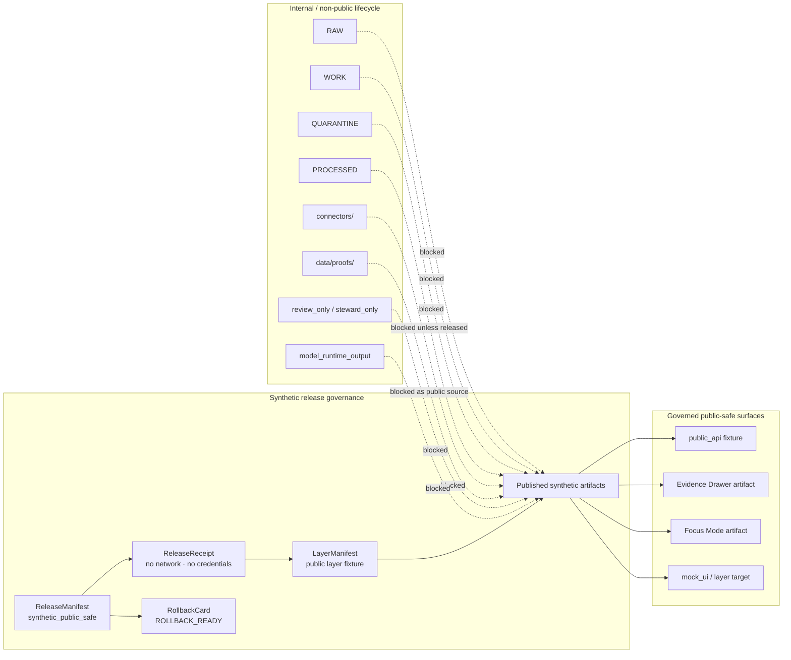

<!-- [KFM_META_BLOCK_V2]
doc_id: kfm://doc/NEEDS-VERIFICATION-adr-0311-hydrology-synthetic-release-governance
title: ADR-0311: Hydrology Synthetic Release Governance
type: standard
version: v1.1-review
status: review
owners: OWNER_TBD_NEEDS_VERIFICATION: architecture steward; hydrology domain steward; release steward; policy steward; documentation steward
created: NEEDS_VERIFICATION-YYYY-MM-DD
updated: 2026-05-06
policy_label: internal-draft
related: [
  docs/adr/README.md,
  docs/adr/ADR-0005-promotion-gate.md,
  docs/adr/ADR-0304-hydrology-first-proof-lane.md,
  docs/adr/ADR-0306-hydrology-connector-contract-and-offline-simulation.md,
  docs/adr/ADR-0308-hydrology-synthetic-ingest-lifecycle-boundary.md,
  docs/adr/ADR-0309-hydrology-processed-catalog-closure-boundary.md,
  docs/domains/hydrology/README.md,
  fixtures/domains/hydrology/release_manifests/hydrology_synthetic_streamflow.release_manifest.json,
  fixtures/domains/hydrology/release_receipts/hydrology_synthetic_streamflow.release_receipt.json,
  fixtures/domains/hydrology/layer_manifests/hydrology_synthetic_streamflow.public_layer_manifest.json,
  fixtures/domains/hydrology/published_artifacts/hydrology_synthetic_streamflow.public_claim_artifact.json,
  fixtures/domains/hydrology/published_artifacts/hydrology_synthetic_streamflow.public_layer_artifact.json,
  fixtures/domains/hydrology/published_artifacts/hydrology_synthetic_streamflow.public_evidence_drawer_artifact.json,
  fixtures/domains/hydrology/published_artifacts/hydrology_synthetic_streamflow.public_focus_artifact.json,
  fixtures/domains/hydrology/public_api/hydrology_synthetic_streamflow.answer.released.json,
  fixtures/domains/hydrology/rollback_card.pr008_synthetic_public_release.json,
  schemas/contracts/v1/release/release_manifest.schema.json,
  tools/validate_fixture_schema_mapping.py
]
tags: [
  kfm,
  adr,
  hydrology,
  synthetic-release,
  release-governance,
  no-network,
  public-safe,
  evidence-bounded,
  review,
  policy,
  validation,
  evidence-drawer,
  focus-mode,
  rollback
]
notes: [
  Decision status is accepted for the synthetic hydrology release drill only; document status remains review until owner, created-date, policy-label, ADR-index, schema, validator, CI, and runtime verification items close.,
  Existing target file had a mismatched doc_id; this revision uses a NEEDS_VERIFICATION placeholder rather than inventing a registry UUID.,
  This ADR does not authorize live source activation, official hydrology publication, emergency alerting, production API claims, or public reliance on real hydrology data.,
  Current fixture evidence includes synthetic hydrology ReleaseManifest, ReleaseReceipt, LayerManifest, public artifact fixtures, a public API answer fixture, and rollback card fixture.,
  The generic release manifest schema and fixture-schema mapping require follow-up before PR-008 synthetic release governance can be claimed as fully schema-enforced.
]
[/KFM_META_BLOCK_V2] -->

<a id="top"></a>

# ADR-0311: Hydrology Synthetic Release Governance

Govern the synthetic hydrology release drill so KFM can rehearse public-safe publication without live source activation, credentials, real hydrology data, or public reliance on official-source claims.

<p align="center">
  
  
  
  
  
</p>

<p align="center">
  <a href="#decision">Decision</a> ·
  <a href="#context">Context</a> ·
  <a href="#repo-fit">Repo fit</a> ·
  <a href="#release-boundary">Release boundary</a> ·
  <a href="#synthetic-release-contract">Contract</a> ·
  <a href="#fixture-family">Fixtures</a> ·
  <a href="#validation">Validation</a> ·
  <a href="#rollback">Rollback</a> ·
  <a href="#open-verification">Open verification</a>
</p>

> [!IMPORTANT]
> **Decision status:** `accepted` for the synthetic hydrology release governance drill.  
> **Document status:** `review` until ownership, index coverage, schema coverage, validator coverage, CI enforcement, branch protection, and runtime behavior are verified.  
> **Target path:** `docs/adr/ADR-0311-hydrology-synthetic-release-governance.md`.

> [!WARNING]
> This ADR authorizes **synthetic, no-network, public-safe release governance only**. It does **not** authorize live source harvesting, credential use, official hydrology data publication, emergency alerting, hydrologic simulation, direct public model output, or direct public access to internal lifecycle stores.

---

## Decision

KFM accepts a **hydrology synthetic release governance drill** as the controlled way to test review, policy, validation, evidence boundary, release, public-surface, correction, and rollback behavior before any real-source hydrology publication.

The drill may move a synthetic release candidate through a recorded synthetic transition:

```text
RELEASE_READY_SYNTHETIC -> PUBLISHED_SYNTHETIC
```

The drill is allowed only when the release candidate is explicitly:

| Required field or posture | Required value or behavior |
|---|---|
| `domain` | `hydrology` |
| `synthetic` | `true` |
| `no_network` | `true` |
| `not_official_source_data` | `true` |
| `release_scope` | `synthetic_public_safe` |
| `release_class` | `synthetic_public_safe` |
| `release_status` / `finite_state` | Synthetic-specific published state, currently `PUBLISHED_SYNTHETIC` in the PR-008 fixture family |
| Source behavior | no real source data fetched |
| Connector behavior | no live connector used |
| Credential behavior | no credentials used |
| Public surfaces | governed fixture surfaces only: `public_api`, `mock_ui`, `evidence_drawer`, `focus` |
| Correction path | required |
| Rollback target | required |

### Accepted rule

A synthetic hydrology release may become **published as a synthetic drill** without becoming official hydrology data.

This ADR does **not** prove or claim:

- live USGS, FEMA, WBD, NHDPlus HR, or other source activation;
- real-source rights or endpoint verification;
- production API deployment;
- production MapLibre behavior;
- production Focus Mode behavior;
- branch protection or merge-blocking CI;
- release signing or attestation;
- complete schema coverage;
- complete runtime enforcement.

<p align="right"><a href="#top">Back to top ↑</a></p>

---

## Context

Hydrology is KFM’s first proof-bearing lane because it can exercise source role, spatial scope, time, evidence resolution, public-safe map display, finite runtime outcomes, release state, correction, and rollback before heavier-sensitivity domains.

ADR-0311 is narrower than the hydrology-first sequencing decision. It decides how the **synthetic hydrology release drill** behaves after fixture-backed release objects exist.

The current fixture family centers on the PR-008 synthetic streamflow drill:

```text
fixtures/domains/hydrology/
├── release_manifests/
│   └── hydrology_synthetic_streamflow.release_manifest.json
├── release_receipts/
│   └── hydrology_synthetic_streamflow.release_receipt.json
├── layer_manifests/
│   └── hydrology_synthetic_streamflow.public_layer_manifest.json
├── public_api/
│   └── hydrology_synthetic_streamflow.answer.released.json
├── published_artifacts/
│   ├── hydrology_synthetic_streamflow.public_claim_artifact.json
│   ├── hydrology_synthetic_streamflow.public_layer_artifact.json
│   ├── hydrology_synthetic_streamflow.public_evidence_drawer_artifact.json
│   └── hydrology_synthetic_streamflow.public_focus_artifact.json
└── rollback_card.pr008_synthetic_public_release.json
```

### What the synthetic release proves

| Concept | Synthetic drill meaning |
|---|---|
| `ReleaseManifest` | Declares the synthetic release bundle, included IDs, public surfaces, prohibited paths, correction path, rollback target, and synthetic/no-network/not-official-source flags. |
| `ReleaseReceipt` | Records the synthetic transition and confirms no real source data, live connector, or credentials were used. |
| `LayerManifest` | Declares a public-safe synthetic layer target and downstream Evidence Drawer payload references. |
| Published artifacts | Represent public claim, layer, Evidence Drawer, and Focus Mode artifacts derived from evidence closure. |
| Public API fixture | Exercises a released `ANSWER` envelope over the synthetic fixture family. |
| Rollback card | Keeps rollback target and affected public surfaces visible even for synthetic release drills. |

### What it does not prove

| Not proven by this ADR | Required proof before claim |
|---|---|
| Real hydrology publication | source activation, rights, validation, policy, review, catalog/proof closure, release, correction, rollback |
| Production API behavior | route implementation, deployed runtime, tests, logs, and contract verification |
| Production MapLibre behavior | app code, layer registry, runtime rendering tests, and trust-state UI evidence |
| Production Focus Mode behavior | governed AI runtime tests, citation validation, and finite outcome evidence |
| CI enforcement | workflow YAML, executed checks, branch protections, and failure evidence |
| Signed releases | signing toolchain, bundle evidence, verification receipt, and release manifest linkage |

<p align="right"><a href="#top">Back to top ↑</a></p>

---

## Repo fit

| Relationship | Path | Status | Role |
|---|---|---:|---|
| This ADR | `docs/adr/ADR-0311-hydrology-synthetic-release-governance.md` | `CONFIRMED existing target / revised here` | Decision record for the PR-008 synthetic release governance drill. |
| ADR index | [`./README.md`](./README.md) | `CONFIRMED / coverage NEEDS VERIFICATION` | ADR navigation, naming, evidence labels, rollback, and supersession discipline. |
| Hydrology-first ADR | [`./ADR-0304-hydrology-first-proof-lane.md`](./ADR-0304-hydrology-first-proof-lane.md) | `CONFIRMED / related` | Selects hydrology as the first proof-bearing lane. |
| Promotion gate ADR | [`./ADR-0005-promotion-gate.md`](./ADR-0005-promotion-gate.md) | `CONFIRMED_BY_SEARCH / needs content review` | Related release-state governance decision. |
| Synthetic ingest boundary | [`./ADR-0308-hydrology-synthetic-ingest-lifecycle-boundary.md`](./ADR-0308-hydrology-synthetic-ingest-lifecycle-boundary.md) | `CONFIRMED_BY_SEARCH / needs content review` | Related synthetic lifecycle boundary. |
| Processed/catalog closure boundary | [`./ADR-0309-hydrology-processed-catalog-closure-boundary.md`](./ADR-0309-hydrology-processed-catalog-closure-boundary.md) | `CONFIRMED_BY_SEARCH / needs content review` | Related processed-to-catalog boundary. |
| Hydrology domain README | [`../domains/hydrology/README.md`](../domains/hydrology/README.md) | `CONFIRMED / draft` | Domain landing page and hydrology proof-lane context. |
| Synthetic release manifest | [`../../fixtures/domains/hydrology/release_manifests/hydrology_synthetic_streamflow.release_manifest.json`](../../fixtures/domains/hydrology/release_manifests/hydrology_synthetic_streamflow.release_manifest.json) | `CONFIRMED fixture` | Synthetic release declaration. |
| Synthetic release receipt | [`../../fixtures/domains/hydrology/release_receipts/hydrology_synthetic_streamflow.release_receipt.json`](../../fixtures/domains/hydrology/release_receipts/hydrology_synthetic_streamflow.release_receipt.json) | `CONFIRMED fixture` | Synthetic transition receipt. |
| Public layer manifest | [`../../fixtures/domains/hydrology/layer_manifests/hydrology_synthetic_streamflow.public_layer_manifest.json`](../../fixtures/domains/hydrology/layer_manifests/hydrology_synthetic_streamflow.public_layer_manifest.json) | `CONFIRMED fixture` | Synthetic public layer declaration. |
| Public API answer fixture | [`../../fixtures/domains/hydrology/public_api/hydrology_synthetic_streamflow.answer.released.json`](../../fixtures/domains/hydrology/public_api/hydrology_synthetic_streamflow.answer.released.json) | `CONFIRMED fixture` | Synthetic released answer envelope. |
| Rollback card fixture | [`../../fixtures/domains/hydrology/rollback_card.pr008_synthetic_public_release.json`](../../fixtures/domains/hydrology/rollback_card.pr008_synthetic_public_release.json) | `CONFIRMED fixture` | Rollback rehearsal target. |
| Generic release manifest schema | [`../../schemas/contracts/v1/release/release_manifest.schema.json`](../../schemas/contracts/v1/release/release_manifest.schema.json) | `CONFIRMED / insufficient coverage likely` | Generic schema surface that needs synthetic-field alignment review. |
| Fixture-schema mapping validator | [`../../tools/validate_fixture_schema_mapping.py`](../../tools/validate_fixture_schema_mapping.py) | `CONFIRMED / narrow coverage` | Existing mapping checker; PR-008 synthetic release fixtures need companion coverage. |

### Directory Rules basis

`docs/adr/` is the correct responsibility-root home because this file is a human-facing architecture decision record. Hydrology-specific schemas, fixtures, policies, validators, receipts, proofs, release objects, and published artifacts remain under their own responsibility roots. This ADR must not create a root-level `hydrology/` folder or treat domain topic names as root authority boundaries.

<p align="right"><a href="#top">Back to top ↑</a></p>

---

## Evidence basis

| Evidence | Label | Supports | Limit |
|---|---:|---|---|
| Current target ADR file | `CONFIRMED` | The file exists on `main` and already carries synthetic release governance material. | Existing metadata needed cleanup, especially document ID and status split. |
| ADR index | `CONFIRMED repo evidence` | ADRs are the decision ledger and should separate accepted decision from enforcement proof. | Complete ADR inventory and owner coverage remain `NEEDS VERIFICATION`. |
| Hydrology README | `CONFIRMED repo evidence / draft` | Hydrology is KFM’s first governed proof lane and should prove the RAW → PUBLISHED path with no-network fixtures first. | Some adjacent paths and owners remain draft or placeholder. |
| PR-008 ReleaseManifest fixture | `CONFIRMED repo evidence` | Synthetic public-safe release scope, included IDs, public surfaces, prohibited paths, correction path, rollback target, synthetic/no-network/not-official-source flags. | `lifecycle_stage` and synthetic release-state semantics need schema-aligned validation. |
| PR-008 ReleaseReceipt fixture | `CONFIRMED repo evidence` | Records `RELEASE_READY_SYNTHETIC -> PUBLISHED_SYNTHETIC`; confirms no real source data, live connector, or credentials. | Receipt is process memory, not proof or evidence. |
| PR-008 LayerManifest fixture | `CONFIRMED repo evidence` | Public-safe synthetic layer target with evidence, policy, review, correction, rollback, and prohibited path fields. | LayerManifest is not EvidenceBundle. |
| Public artifacts | `CONFIRMED repo evidence` | Claim, layer, Evidence Drawer, and Focus artifacts are synthetic, public-safe, derived from EvidenceBundle closure, and block internal public source paths. | Content completeness and schema coverage still need explicit validation. |
| Public API answer fixture | `CONFIRMED repo evidence` | Shows a released synthetic `ANSWER` envelope with evidence, release, policy, review, correction, rollback, citations, and caveats. | Runtime API deployment is not proven. |
| Rollback card fixture | `CONFIRMED repo evidence` | Declares affected release/artifact/public-surface IDs, rollback actions, and `ROLLBACK_READY`. | Does not prove rollback automation executed. |
| Generic release manifest schema | `CONFIRMED repo evidence / NEEDS VERIFICATION` | Current schema surface exists. | Current schema appears too narrow for PR-008 synthetic fixture fields. |
| Fixture-schema mapping validator | `CONFIRMED repo evidence / NEEDS EXTENSION` | Existing core proof-slice mapping exists. | It does not list the PR-008 synthetic release fixture family. |

> [!NOTE]
> The decision can be accepted before full enforcement exists, but enforcement must remain `NEEDS VERIFICATION` until schema, validator, policy, workflow, and runtime evidence close the gaps.

<p align="right"><a href="#top">Back to top ↑</a></p>

---

## Release boundary

The synthetic release governance drill must preserve KFM’s trust membrane.



### Boundary statements

| Boundary | Rule |
|---|---|
| ReleaseManifest is not EvidenceBundle | A release manifest may point to evidence; it is not evidence support. |
| LayerManifest is not EvidenceBundle | A layer manifest may route to evidence; it does not replace evidence. |
| Public artifact is derived | Public artifacts may be derived from EvidenceBundle closure; they do not become canonical truth. |
| CatalogRecordAsEvidence is prohibited | Catalog records support discovery and closure; they must not become evidence by themselves. |
| SourceDescriptor is not public artifact | Source descriptors control source admission and authority; they must not be released as public claim payloads. |
| Receipt is not proof | Receipts record process memory; proof objects support release-grade trust. |
| Model output is not proof | Focus Mode may interpret released evidence; model runtime output must not become public source material. |

<p align="right"><a href="#top">Back to top ↑</a></p>

---

## Accepted inputs

ADR-0311 governs only a narrow input class.

| Accepted input | Required posture | Accepted use |
|---|---|---|
| Synthetic release manifest fixture | `synthetic: true`, `no_network: true`, `not_official_source_data: true` | Release-governance rehearsal. |
| Synthetic release receipt fixture | no real source data, no live connector, no credentials | Process-memory confirmation. |
| Synthetic layer manifest fixture | public-safe, evidence-bound, released, mock-renderer-ready | Map/UI release rehearsal. |
| Synthetic public artifacts | public-safe, derived, evidence-bound, correction/rollback linked | Public payload rehearsal. |
| Public API answer/error fixtures | finite state and evidence/policy/review/release references | API envelope rehearsal. |
| Rollback card fixture | affected artifacts, affected surfaces, required actions, rollback target | Rollback rehearsal. |
| Negative fixtures | deliberate invalid or bypass attempts | Validator and policy failure proof. |

<p align="right"><a href="#top">Back to top ↑</a></p>

---

## Exclusions

The synthetic release drill must reject or remain silent on anything outside its scope.

| Excluded item | Required outcome |
|---|---|
| Live USGS, FEMA, WBD, NHDPlus HR, 3DEP, Mesonet, or other source fetch | `DENY` for synthetic release path |
| Credentials, tokens, API keys, cookies, or private service configuration | `DENY` |
| Real source-derived public hydrology values | `DENY` until separate live-source activation and promotion decision exists |
| Emergency alerting or life-safety guidance | `DENY`; point users to official systems outside KFM release drill scope |
| Hydrologic simulation products | `DENY` unless a separate model-card, uncertainty, review, and release ADR exists |
| RAW / WORK / QUARANTINE public source paths | `DENY` |
| Proof-only, review-only, steward-only, or model-runtime paths as public source | `DENY` |
| Catalog-only record treated as evidence | `DENY` |
| Uncited Focus Mode claim | `ABSTAIN`, `DENY`, or `ERROR` according to validator/policy context |
| Unknown release state or unknown runtime outcome | `ERROR` |

<p align="right"><a href="#top">Back to top ↑</a></p>

---

## Synthetic release contract

The contract below is the release-governance burden for the PR-008 synthetic hydrology fixture family.

### Required release posture

| Requirement | Required value or behavior |
|---|---|
| Domain | `hydrology` |
| Release scope | `synthetic_public_safe` |
| Release class | `synthetic_public_safe` |
| Lifecycle transition | `RELEASE_READY_SYNTHETIC -> PUBLISHED_SYNTHETIC`, recorded by receipt |
| Network posture | `no_network: true` |
| Source posture | `not_official_source_data: true` |
| Credential posture | `no_credentials_used: true` |
| Connector posture | `no_live_connector_used: true` |
| Real-data posture | `no_real_source_data_fetched: true` |
| Rights status | `SYNTHETIC_PUBLIC_SAFE` |
| Sensitivity status | `SYNTHETIC_PUBLIC_SAFE` |
| Correction path | required |
| Rollback target | required |
| Public surfaces | only declared public-safe fixture surfaces |
| Public display | allowed only when artifact declares `public_safe` and `public_display_allowed` |

### Required references

A synthetic release manifest must identify or link the fixture equivalents of:

- release candidate;
- public artifacts;
- claims;
- EvidenceBundles;
- catalog records;
- triplet deltas, when in scope;
- layer manifests;
- policy decisions;
- review records;
- validation reports;
- release receipts;
- correction notices;
- rollback cards;
- public surface IDs.

### Prohibited public source paths

```text
blocked://raw/
blocked://work/
blocked://quarantine/
blocked://processed/
connectors/
data/proofs/
review_only/
steward_only/
model_runtime_output/
```

### Prohibited public object types

At minimum, release and public artifacts must block these object classes from becoming public claim support:

```text
RawCaptureReceipt
WorkNormalizationReceipt
FetchReceipt
SourceDescriptor
CatalogRecordAsEvidence
```

> [!IMPORTANT]
> These prohibitions are stricter than “no real source data.” They also prevent governance objects, internal receipts, catalog-only records, proof-only material, and model output from being mistaken for public evidence.

<p align="right"><a href="#top">Back to top ↑</a></p>

---

## Fixture family

| Fixture | Status | Governance role | Acceptance requirement |
|---|---:|---|---|
| [`release_manifests/hydrology_synthetic_streamflow.release_manifest.json`](../../fixtures/domains/hydrology/release_manifests/hydrology_synthetic_streamflow.release_manifest.json) | `CONFIRMED` | Declares synthetic release bundle, public artifacts, public surfaces, prohibited paths, correction path, rollback target, and synthetic/no-network/not-official-source flags. | Must validate against an accepted synthetic release manifest schema or extension validator. |
| [`release_receipts/hydrology_synthetic_streamflow.release_receipt.json`](../../fixtures/domains/hydrology/release_receipts/hydrology_synthetic_streamflow.release_receipt.json) | `CONFIRMED` | Records synthetic transition and no-real-source/no-live-connector/no-credential posture. | Must remain process memory and not replace proof or evidence. |
| [`layer_manifests/hydrology_synthetic_streamflow.public_layer_manifest.json`](../../fixtures/domains/hydrology/layer_manifests/hydrology_synthetic_streamflow.public_layer_manifest.json) | `CONFIRMED` | Declares synthetic public layer, release linkage, evidence/policy/review/correction/rollback references, renderer target, stale state, and public-safe state. | Must not be treated as EvidenceBundle. |
| [`published_artifacts/hydrology_synthetic_streamflow.public_claim_artifact.json`](../../fixtures/domains/hydrology/published_artifacts/hydrology_synthetic_streamflow.public_claim_artifact.json) | `CONFIRMED` | Represents the synthetic public claim artifact. | Must remain public-safe, evidence-bound, and correction/rollback linked. |
| [`published_artifacts/hydrology_synthetic_streamflow.public_layer_artifact.json`](../../fixtures/domains/hydrology/published_artifacts/hydrology_synthetic_streamflow.public_layer_artifact.json) | `CONFIRMED` | Represents the synthetic public layer artifact. | Must remain downstream of release and layer manifests. |
| [`published_artifacts/hydrology_synthetic_streamflow.public_evidence_drawer_artifact.json`](../../fixtures/domains/hydrology/published_artifacts/hydrology_synthetic_streamflow.public_evidence_drawer_artifact.json) | `CONFIRMED` | Represents the public Evidence Drawer artifact derived from EvidenceBundle closure. | Must block raw/work/quarantine/processed paths and `CatalogRecordAsEvidence` misuse. |
| [`published_artifacts/hydrology_synthetic_streamflow.public_focus_artifact.json`](../../fixtures/domains/hydrology/published_artifacts/hydrology_synthetic_streamflow.public_focus_artifact.json) | `CONFIRMED` | Represents the public Focus Mode artifact derived from EvidenceBundle closure. | Must block uncited or model-runtime-derived public claims. |
| [`public_api/hydrology_synthetic_streamflow.answer.released.json`](../../fixtures/domains/hydrology/public_api/hydrology_synthetic_streamflow.answer.released.json) | `CONFIRMED` | Represents a released public API `ANSWER` fixture over the synthetic claim. | Must keep synthetic caveats, evidence, release, policy, review, correction, and rollback references. |
| [`rollback_card.pr008_synthetic_public_release.json`](../../fixtures/domains/hydrology/rollback_card.pr008_synthetic_public_release.json) | `CONFIRMED` | Records affected artifacts, public surfaces, rollback target, actions, and `ROLLBACK_READY` state. | Must remain auditable and not delete release history. |
| [`schemas/contracts/v1/release/release_manifest.schema.json`](../../schemas/contracts/v1/release/release_manifest.schema.json) | `CONFIRMED / GAP` | Current generic release-manifest schema surface. | Needs synthetic PR-008 coverage review; current generic fields appear too narrow. |
| [`tools/validate_fixture_schema_mapping.py`](../../tools/validate_fixture_schema_mapping.py) | `CONFIRMED / GAP` | Existing fixture-to-schema mapping validator. | Needs companion mapping or validator for the PR-008 release, receipt, layer, public artifact, API, and rollback fixtures. |

### Fixture identity rules

A synthetic release drill should carry at least two identity anchors:

| Hash family | Meaning |
|---|---|
| `content_spec_hash` | Stable identity for normalized release content/specification under review. |
| `release_hash` | Stable identity for the release packaging or release-state bundle. |

Do not collapse these roles unless a later accepted ADR changes KFM release identity semantics.

<p align="right"><a href="#top">Back to top ↑</a></p>

---

## Governance rules

### Rule 1 — Synthetic release is a drill, not official source data

A synthetic hydrology release may be public-safe only because it is synthetic, no-network, and not official source data.

Any release using official source data must go through source activation, rights review, policy review, validation, evidence closure, catalog/proof closure, review, promotion, correction, and rollback gates.

### Rule 2 — No live connectors

The synthetic drill must not fetch from live hydrology sources, use credentials, or call connector code paths.

### Rule 3 — Publication state is explicit

The drill may use `PUBLISHED_SYNTHETIC` as a finite synthetic release state. That state is not equivalent to ordinary production publication for real source data.

### Rule 4 — Public payloads are downstream

Public claim, layer, Evidence Drawer, Focus Mode, and public API artifacts are downstream of release governance. They must not pull directly from RAW, WORK, QUARANTINE, processed-internal artifacts, connectors, review-only stores, steward-only stores, proof-only stores, or model runtimes.

### Rule 5 — Evidence boundaries stay visible

Release manifest, layer manifest, catalog records, public artifacts, receipts, proofs, and evidence bundles must not collapse into one another.

Every public-facing synthetic claim must remain traceable to the declared EvidenceBundle ID or fixture equivalent.

### Rule 6 — Correction and rollback are mandatory

Synthetic releases still need correction and rollback references because KFM is testing governance behavior, not only happy-path rendering.

### Rule 7 — Focus Mode is evidence-bounded

Synthetic Focus Mode artifacts may test public-safe explanation only when they remain derived from evidence closure and carry release, policy, review, correction, and rollback references.

### Rule 8 — Review and policy references are required

A synthetic release drill must include policy and review references. Missing policy or review references block the drill from being treated as completed release-governance evidence.

### Rule 9 — Validation must include negative paths

The synthetic drill must validate both allowed public-safe fixture behavior and prohibited bypass behavior.

### Rule 10 — Synthetic status must not launder real data

Any artifact that includes real source data, live connector output, credential-backed fetch output, or official-source values must not be labeled `synthetic_public_safe`.

<p align="right"><a href="#top">Back to top ↑</a></p>

---

## Validation

Validation for this ADR must prove that the synthetic release is both allowed and constrained.

### Positive validation

A passing synthetic release drill must show:

- all required synthetic, no-network, and not-official-source flags are true;
- no live connector, credential, or network fetch is used;
- release manifest references public artifacts, evidence bundle IDs, catalog record IDs, layer manifest IDs, policy decision IDs, review record IDs, validation report IDs, release receipts, correction notices, and rollback cards;
- public artifacts are marked public-safe and public-display-allowed where applicable;
- public artifacts preserve release manifest IDs, release receipt IDs, policy decision IDs, review record IDs, correction notice IDs, and rollback card IDs;
- finite state fields are known and synthetic-specific;
- prohibited public source paths are present and enforced;
- evidence boundary statements remain explicit;
- rollback card declares affected artifacts, affected public surfaces, required actions, and `ROLLBACK_READY`.

### Negative validation

| Invalid condition | Expected outcome |
|---|---|
| `synthetic` is false or missing | `DENY` or validation failure |
| `no_network` is false or missing | `DENY` or validation failure |
| `not_official_source_data` is false or missing | `DENY` or validation failure |
| `no_real_source_data_fetched` is false | `DENY` |
| `no_live_connector_used` is false | `DENY` |
| `no_credentials_used` is false | `DENY` |
| Live connector path appears in public artifact payload | `DENY` |
| RAW / WORK / QUARANTINE path appears as public source | `DENY` |
| `data/proofs/` is treated as public artifact source | `DENY` |
| `model_runtime_output/` appears as public source | `DENY` |
| `CatalogRecordAsEvidence` appears as evidence object type | `DENY` |
| Correction path missing | `DENY` |
| Rollback target missing | `DENY` |
| Policy decision references missing | `ABSTAIN` or `DENY` by policy |
| Review record references missing | `ABSTAIN` or `DENY` by policy |
| Schema validator cannot parse the fixture | `ERROR` |
| Unknown finite state appears | `ERROR` |

### Schema coverage gap

Current repo evidence shows a generic `release_manifest.schema.json`, but the PR-008 synthetic release manifest uses fields such as `release_manifest_id`, `release_scope`, `release_class`, `content_spec_hash`, `release_hash`, `prohibited_source_paths`, `correction_path`, `rollback_target`, `synthetic`, `no_network`, and `not_official_source_data`.

The current generic schema must not be treated as complete PR-008 enforcement until one of these is added or verified:

1. a synthetic release manifest schema;
2. a release-manifest extension schema;
3. a fixture-specific validation rule;
4. a documented migration from current fixture fields to the generic schema field names.

### Proposed command shape

> [!CAUTION]
> These commands are illustrative. Use repo-native commands after validator coverage and package conventions are verified.

```bash
# Existing narrow mapping check.
python tools/validate_fixture_schema_mapping.py

# PROPOSED: add or adapt this validator for PR-008 synthetic release governance.
python tools/validators/hydrology/validate_synthetic_release_governance.py \
  --manifest fixtures/domains/hydrology/release_manifests/hydrology_synthetic_streamflow.release_manifest.json \
  --receipt fixtures/domains/hydrology/release_receipts/hydrology_synthetic_streamflow.release_receipt.json \
  --layer-manifest fixtures/domains/hydrology/layer_manifests/hydrology_synthetic_streamflow.public_layer_manifest.json \
  --public-api fixtures/domains/hydrology/public_api/hydrology_synthetic_streamflow.answer.released.json \
  --published-artifacts fixtures/domains/hydrology/published_artifacts \
  --rollback-card fixtures/domains/hydrology/rollback_card.pr008_synthetic_public_release.json
```

### Acceptance checklist

- [ ] ADR index lists ADR-0311 and its synthetic-drill scope.
- [ ] Owners, creation date, and policy label are confirmed.
- [ ] Synthetic release manifest validates against an accepted schema or extension validator.
- [ ] Synthetic release receipt validates against an accepted schema or extension validator.
- [ ] Layer manifest validates against an accepted schema or extension validator.
- [ ] Public claim, layer, Evidence Drawer, Focus, and public API fixtures validate against accepted public artifact or envelope contracts.
- [ ] Rollback card validates against an accepted rollback contract.
- [ ] Negative fixtures prove that real-source, connector, credential, raw/work/quarantine, proof-only, review-only, steward-only, and model-runtime bypasses are blocked.
- [ ] ReleaseManifest is not treated as EvidenceBundle.
- [ ] LayerManifest is not treated as EvidenceBundle.
- [ ] CatalogRecordAsEvidence is blocked.
- [ ] SourceDescriptor is not emitted as a public artifact.
- [ ] Correction path and rollback target are required.
- [ ] Release receipt records no real source data, no live connector, and no credentials.
- [ ] Public surfaces remain synthetic/mock unless a separate live-source promotion decision exists.
- [ ] CI or a recorded validation receipt proves the checks, or enforcement remains `NEEDS VERIFICATION`.

<p align="right"><a href="#top">Back to top ↑</a></p>

---

## Consequences

### Positive consequences

- Gives KFM a safe publication drill that exercises release state without live data risk.
- Tests public claim, layer, Evidence Drawer, Focus Mode, and public API payloads against governed release metadata.
- Makes correction and rollback mandatory before real public releases are attempted.
- Prevents synthetic fixtures from being confused with official hydrology source data.
- Preserves separation among manifests, receipts, proofs, evidence, catalog records, public artifacts, and model output.
- Gives later live-source activation a concrete gate to compare against.

### Costs

- Requires schema or validator work for synthetic release-specific fields.
- Requires maintaining both positive and negative fixtures.
- Requires ADR index and fixture-schema mapping updates.
- Requires clear UI language so synthetic public-safe artifacts are not mistaken for real-world hydrology data.
- Requires discipline not to widen the synthetic drill into a live-source release.

### Tradeoff accepted

KFM accepts a small synthetic release layer as a necessary rehearsal for public publication governance.

The benefit is not the synthetic streamflow content itself. The benefit is proving that KFM can expose public-safe artifacts while keeping evidence, policy, review, correction, rollback, and prohibited-source boundaries visible.

<p align="right"><a href="#top">Back to top ↑</a></p>

---

## Risks and mitigations

| Risk | Impact | Mitigation |
|---|---|---|
| Synthetic fixture is mistaken for official hydrology data. | Public trust damage. | Keep `synthetic`, `no_network`, `not_official_source_data`, and `PUBLISHED_SYNTHETIC` visible in manifests, receipts, layer metadata, public API fixtures, and UI payloads. |
| Public artifacts bypass evidence. | Map/UI/Focus become false truth surfaces. | Require EvidenceBundle references and enforce evidence boundary statements. |
| ReleaseManifest is treated as evidence. | Release packaging replaces source support. | Enforce `ReleaseManifest is not EvidenceBundle`. |
| Catalog record is treated as evidence. | Discovery metadata becomes claim support. | Block `CatalogRecordAsEvidence`. |
| Live connector sneaks into synthetic path. | Synthetic drill becomes real-source release without gates. | Validate `no_live_connector_used`, `no_credentials_used`, `no_real_source_data_fetched`, and prohibited connector paths. |
| Model runtime output is published. | Generated language becomes public truth. | Block `model_runtime_output/` and require Focus artifacts to be derived from evidence closure. |
| Rollback target is placeholder-only. | Drill cannot test release reversibility. | Require rollback card ID and verify target fixture or explicit drill placeholder. |
| Generic release schema is too thin for PR-008 fields. | Validation gives false confidence. | Add a synthetic release governance schema or extension validator. |
| ADR number collision hides the decision. | Maintainers cite the wrong ADR. | Use full path as identity and update ADR index. |

<p align="right"><a href="#top">Back to top ↑</a></p>

---

## Rollback

### Rolling back the synthetic release fixture

A synthetic release rollback must:

1. preserve the release manifest, release receipt, public artifact fixtures, layer manifest, public API fixtures, correction notice reference, and rollback card;
2. move or mark only the active synthetic alias/state;
3. emit or update a rollback receipt when the tooling exists;
4. preserve prior `content_spec_hash` and `release_hash`;
5. keep correction and rollback IDs visible to public-facing test payloads;
6. avoid deleting old fixture history to hide a failed drill.

### Rolling back this ADR

If ADR-0311 is superseded:

1. create a successor ADR;
2. keep this file as lineage;
3. state whether synthetic release drills remain allowed, are narrowed, or are retired;
4. map affected fixture paths to the successor rule;
5. preserve validation failures and correction lessons;
6. update `docs/adr/README.md` with supersession status.

### Revert path

If this ADR expansion is rejected, revert only this file content to a shorter accepted record or successor-scoped replacement.

Do not remove the synthetic hydrology fixtures without a separate fixture preservation and migration decision.

<p align="right"><a href="#top">Back to top ↑</a></p>

---

## Open verification

| Item | Status | Closure path |
|---|---:|---|
| Original creation date | `UNKNOWN` | Inspect git history for this ADR. |
| Owners / CODEOWNERS | `NEEDS VERIFICATION` | Check `CODEOWNERS`, document registry, or maintainer assignment. |
| Policy label | `NEEDS VERIFICATION` | Confirm document classification policy. |
| ADR index coverage | `NEEDS VERIFICATION` | Update `docs/adr/README.md` to include ADR-0311 and synthetic-drill scope. |
| Complete PR-008 fixture schema coverage | `NEEDS VERIFICATION` | Add or verify schema mappings for release manifest, release receipt, layer manifest, public artifacts, public API fixture, and rollback card. |
| Generic release manifest schema sufficiency | `NEEDS VERIFICATION` | Review whether `schemas/contracts/v1/release/release_manifest.schema.json` covers synthetic drill fields or needs extension. |
| Validator command names | `UNKNOWN` | Confirm repo-native validation tooling and package manager conventions. |
| Correction notice fixture content | `NEEDS VERIFICATION` | The correction notice ID is referenced; confirm whether a dedicated correction fixture exists and validate it. |
| CI enforcement | `UNKNOWN` | Verify workflow YAML and branch rules before claiming enforcement. |
| Production public API behavior | `UNKNOWN` | Verify deployed API/runtime evidence before claiming public service behavior. |
| MapLibre runtime behavior | `UNKNOWN` | Verify app code/tests before claiming rendered synthetic layer behavior. |
| Focus Mode runtime behavior | `UNKNOWN` | Verify governed AI/runtime tests before claiming answer behavior. |
| Release signing / attestations | `UNKNOWN` | Verify proof/signing toolchain before claiming signed release behavior. |
| Public artifact content completeness | `NEEDS VERIFICATION` | Validate all public artifact fixture files, not only their path presence. |
| Live hydrology activation | `DENY by default` | Requires separate accepted source activation and promotion decision. |

<p align="right"><a href="#top">Back to top ↑</a></p>

---

## Alternatives considered

| Alternative | Decision | Reason |
|---|---:|---|
| Skip synthetic release drill and activate live hydrology sources. | Rejected | Violates foundation strategy; source rights, cadence, credentials, endpoint behavior, and policy must be reviewed first. |
| Treat synthetic fixture as production publication proof. | Rejected | Synthetic fixture proves governance shape, not production readiness. |
| Publish mock UI artifacts directly from fixture files without release manifest. | Rejected | Bypasses release governance and evidence boundary. |
| Allow Focus Mode output from model runtime fixture. | Rejected | AI is interpretive and downstream; model output is prohibited as public source material. |
| Treat ReleaseManifest as evidence. | Rejected | Release packaging is not evidence support. |
| Omit rollback/correction for synthetic data. | Rejected | The drill’s purpose is governance rehearsal, including correction and rollback. |
| Keep ADR-0311 as a one-line stub. | Rejected | The fixture family needs a reviewable decision record with scope, rules, validation, and rollback. |

<p align="right"><a href="#top">Back to top ↑</a></p>

---

## Supersession and change rules

Update this ADR when:

- the synthetic fixture contract changes;
- schema coverage for PR-008 fixtures becomes explicit;
- live hydrology source activation is proposed;
- release state labels change;
- public artifact contracts change;
- Evidence Drawer, public API, or Focus Mode fixture contracts change;
- correction or rollback fixture semantics change;
- promotion gate outcome grammar changes;
- ADR numbering or index conventions are normalized.

Every update must preserve:

- synthetic versus official-source distinction;
- no-network and no-credential posture for synthetic drills;
- evidence boundary statements;
- prohibited public source paths;
- prohibited public object types;
- correction path;
- rollback target;
- release receipt;
- public-client governed-interface rule.

<p align="right"><a href="#top">Back to top ↑</a></p>
