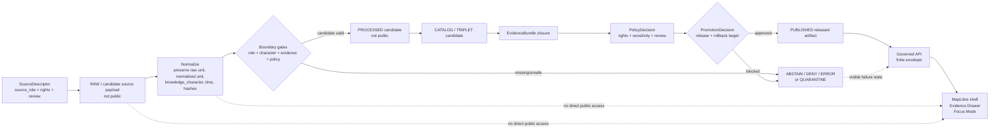
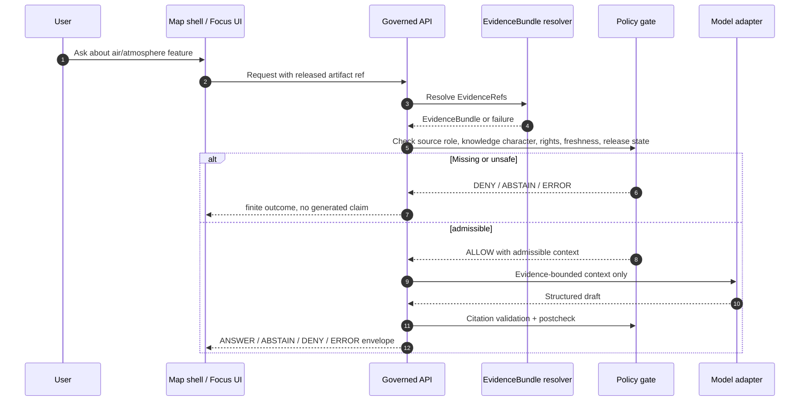

<!-- [KFM_META_BLOCK_V2]
doc_id: kfm://adr/ADR-0312-atmosphere-air-source-role-boundaries
title: ADR-0312: Atmosphere/Air Source-Role and Knowledge-Character Boundaries
type: architecture-decision-record
version: v1.0-draft
status: draft
owners: @bartytime4life; atmosphere-air-domain-steward NEEDS_VERIFICATION; policy-steward NEEDS_VERIFICATION
created: NEEDS_VERIFICATION-YYYY-MM-DD
updated: 2026-05-06
policy_label: public-draft-NEEDS_VERIFICATION
related: [./README.md, ../domains/atmosphere_air/README.md, ../domains/atmosphere_air/ADR-0003-atmosphere-source-role-boundaries.md, ../architecture/contract-schema-policy-split.md, ../../policy/crosswalk/domain-lane-policy-map.md, ../../connectors/pipelines/air/README.md, ../../connectors/pipelines/air/air_ingest.py, ../../pipelines/normalize/domains/atmosphere/README.md, ../../data/processed/air/qa_summary.example.json, ../../data/receipts/air/run_receipt.example.json]
tags: [kfm, adr, atmosphere-air, source-role, knowledge-character, air-quality, evidence, policy, no-network, fail-closed]
notes: [
  New proposed ADR filename selected after checking docs/adr inventory and exact-path absence for docs/adr/ADR-0312-atmosphere-air-source-role-boundaries.md.
  Supersedes and expands the thin domain-local ADR-0003 decision without deleting that file's lineage.
  Actual repo evidence confirms the earlier thin ADR currently exists under docs/domains/atmosphere_air/, while the requested docs/domains/ADR/ path needs reconciliation.
  Owners, creation date, final policy label, acceptance state, executable validators, schema coverage, policy wiring, CI enforcement, and release behavior remain NEEDS VERIFICATION.
]
[/KFM_META_BLOCK_V2] -->

<a id="top"></a>

# ADR-0312: Atmosphere/Air Source-Role and Knowledge-Character Boundaries

Atmosphere and air-quality claims must preserve what kind of source they came from, what kind of knowledge they represent, and what public burden they carry before they can be normalized, mapped, summarized, released, or answered by Focus Mode.

<p align="center">
  
  
  
  
  
  
</p>

<p align="center">
  <a href="#decision">Decision</a> ·
  <a href="#why-this-adr-exists">Why</a> ·
  <a href="#evidence-boundary">Evidence boundary</a> ·
  <a href="#boundary-taxonomy">Taxonomy</a> ·
  <a href="#anti-collapse-rules">Anti-collapse rules</a> ·
  <a href="#enforcement-model">Enforcement</a> ·
  <a href="#acceptance-criteria">Acceptance</a> ·
  <a href="#rollback-or-supersession">Rollback</a>
</p>

> [!IMPORTANT]
> **Target path:** `docs/adr/ADR-0312-atmosphere-air-source-role-boundaries.md`  
> **Status:** `draft` / `proposed`  
> **Lineage:** expands the existing domain-local `docs/domains/atmosphere_air/ADR-0003-atmosphere-source-role-boundaries.md` decision without deleting it.
>
> This ADR does **not** authorize live source fetching, public release, public map layers, Evidence Drawer claims, Focus Mode answers, or publication. It defines the source-role and knowledge-character boundary that those later systems must preserve.

> [!CAUTION]
> AQI, PM2.5 concentration, AOD, smoke masks, model fields, climate anomalies, fusion products, advisories, site metadata, and no-network fixtures are not interchangeable. If KFM cannot prove the distinction, the system should `ABSTAIN`, `DENY`, `ERROR`, or hold promotion rather than flatten uncertainty into a polished map.

---

## Decision

KFM will treat **source role** and **knowledge character** as mandatory trust-bearing fields for atmosphere/air source admission, normalization, validation, policy, catalog/proof closure, public layer descriptors, Evidence Drawer payloads, and Focus Mode envelopes.

The domain-local ADR-0003 decision is preserved and expanded here as repo-wide ADR-0312:

| Prior decision element | Expanded ADR-0312 rule |
|---|---|
| Enforce strict source-role separation. | Every consequential atmosphere/air object must carry a source role or reference a `SourceDescriptor` that does. |
| Preserve observed vs report vs model vs mask vs fusion boundaries. | Every consequential object must carry a `knowledge_character` from the accepted lane taxonomy or fail closed. |
| Apply across API, layer, and evidence surfaces. | Apply from source admission through normalized candidates, policy decisions, release manifests, governed API envelopes, MapLibre layers, Evidence Drawer payloads, and Focus Mode responses. |
| Reduce semantic drift and false certainty. | Reject anti-collapse cases such as AQI-as-concentration, AOD-as-PM2.5, smoke-mask-as-exposure, model-as-observation, and fusion-as-canonical-source. |
| Add validator burden. | Add explicit positive and negative fixtures, reason-coded denials, and compatibility tests before accepting this ADR as implemented. |

### Normative rules after acceptance

1. **Source role is required.** A record that supports a claim must identify the source’s role or resolve to a source descriptor that does.
2. **Knowledge character is required.** A record must state whether it is an observation, public report, regulatory archive, low-cost sensor record, model field, remote-sensing mask, anomaly context, fusion product, advisory context, site context, or temporal support object.
3. **Descriptors are not claim evidence by themselves.** A `SourceDescriptor` admits and constrains a source; public claims still require EvidenceBundle closure and release state.
4. **Run receipts are not release proof.** A completed connector or normalization run can be process memory, but it does not authorize publication.
5. **No direct public path.** Public UI, public API, map layers, Focus Mode, and exports must not read RAW, WORK, QUARANTINE, connector-private, normalize-stage, or unpublished candidate artifacts directly.
6. **Derived products stay derived.** Fusion, interpolation, NowCast-like candidates, masks, and layer products must expose input evidence, method, uncertainty, transform identity, and release state.
7. **Unknown rights block public release.** Unknown source rights, source terms, cadence, or public-release permission result in `DENY` for public release.
8. **Freshness must be explicit.** Current-state or live-context claims require retrieval time, valid time, observation/model time basis, and freshness posture.
9. **Focus Mode remains evidence-subordinate.** Focus Mode may synthesize only over admissible, policy-safe, EvidenceBundle-backed context and must return `ANSWER`, `ABSTAIN`, `DENY`, or `ERROR`.
10. **Ambiguity fails closed.** If a validator, API, UI, or reviewer cannot determine the source role or knowledge character, the claim does not move toward publication.

### Decision summary

| Field | Determination |
|---|---|
| ADR status | `draft` / `proposed` |
| Target file | `docs/adr/ADR-0312-atmosphere-air-source-role-boundaries.md` |
| Domain lane | Atmosphere / Air |
| Primary boundary | Source role + knowledge character separation |
| Public release effect | No public release authorized by this ADR |
| Current confirmed implementation surface | No-network air connector example and candidate artifacts exist; full enforcement is not confirmed |
| Primary risk addressed | False certainty caused by collapsing observations, reports, models, masks, fusion products, advisories, and metadata |
| Default failure posture | `DENY` for unsafe exposure; `ABSTAIN` for insufficient evidence; `ERROR` for technical/shape failure |
| Acceptance blockers | Owners, schema home, validators, fixtures, policy wiring, CI execution, EvidenceBundle closure, release tests, rollback evidence |

<p align="right"><a href="#top">Back to top ↑</a></p>

---

## Why this ADR exists

Atmosphere and air-quality information is easy to overstate because many products look similar once they become a map layer, chart, popup, or summary.

A point, polygon, raster, or time-series value may represent:

- an observed sensor concentration;
- an AQI or public report index;
- a regulatory archive;
- a low-cost sensor network candidate;
- a forecast, reanalysis, transport, smoke, or chemistry model field;
- a remote-sensing mask or aerosol context;
- a climate anomaly or baseline context;
- a derived fusion/interpolation product;
- a station/site metadata record;
- an advisory or public-health message.

Those objects do not carry the same authority, temporal meaning, uncertainty, rights posture, or public-release burden.

### Failure modes prevented

| Failure mode | What would go wrong | ADR-0312 response |
|---|---|---|
| AQI becomes concentration | Public index/report semantics are treated as raw PM2.5 or ozone measurements. | Require `PUBLIC_AQI_REPORT`; deny AQI-as-concentration claims. |
| AOD becomes PM2.5 | Optical/aerosol context is treated as surface breathing concentration without model assumptions. | Require `VISIBILITY_AND_AEROSOL_CONTEXT` or modeled/fusion support; deny unsupported conversion. |
| Smoke mask becomes exposure | Plume or mask classification is treated as measured surface exposure. | Require `REMOTE_SENSING_MASK`; deny exposure claims without governed model/fusion evidence. |
| Model becomes observation | Forecast, reanalysis, or transport output is labeled as observed measurement. | Require `ATMOSPHERIC_MODEL_FIELD`; deny model-as-observed use. |
| Fusion hides inputs | Interpolation or consensus product is presented as canonical source truth. | Require `DERIVED_FUSION`, input EvidenceRefs, method, uncertainty, and transform hash. |
| Fixture becomes truth | No-network stub output is accidentally promoted or mapped as real-world public evidence. | Keep candidate decision posture and block release without proof closure. |
| Receipt becomes proof | `run_receipt` is treated as EvidenceBundle or release manifest. | Keep receipts as process memory only. |
| UI bypasses gates | Map or Focus Mode reads connector/normalize candidate artifacts directly. | Require governed API and released artifacts only. |
| Stale operational context looks current | Retrieval or valid time is missing or expired. | Require freshness posture or return `ABSTAIN`/stale context. |
| Advisory becomes official emergency instruction | KFM appears to provide life-safety instructions. | Keep advisory context labeled and route life-safety action to official systems. |

<p align="right"><a href="#top">Back to top ↑</a></p>

---

## Evidence boundary

This ADR separates repo-visible evidence from proposed enforcement.

| Evidence | Status | Supports | Limits |
|---|---|---|---|
| Existing domain-local `ADR-0003-atmosphere-source-role-boundaries.md` | CONFIRMED repository file | A thin ADR already exists and declares source-role separation as the decision. | It does not define taxonomy, gates, fixtures, validators, policy rules, or acceptance criteria. |
| `docs/adr/README.md` | CONFIRMED repository file | Confirms `docs/adr/` is the repo’s human-facing ADR directory and includes ADR naming, evidence, review, rollback, and supersession guidance. | Inventory is explicitly not guaranteed exhaustive and still marks coverage as NEEDS VERIFICATION. |
| Exact target path `docs/adr/ADR-0312-atmosphere-air-source-role-boundaries.md` | CONFIRMED checked absent in this session | The selected filename did not exist at the target path when checked through the GitHub connector. | Absence was checked against `main`; another branch could differ. |
| `docs/domains/atmosphere_air/README.md` | CONFIRMED repository file | Defines atmosphere/air lane scope, knowledge-character taxonomy, accepted inputs, exclusions, denial codes, and governed flow. | Many owner, policy label, schema home, tooling, and implementation items remain placeholders or NEEDS VERIFICATION. |
| `connectors/pipelines/air/README.md` | CONFIRMED repository file | Describes current no-network connector lane, confirms `air_ingest.py`, QA summary candidate, and run receipt as repo-visible. | Does not claim live source activation, public release, CI enforcement, or full proof closure. |
| `connectors/pipelines/air/air_ingest.py` | CONFIRMED repository file | Emits deterministic no-network PM2.5 QA-summary candidate and run receipt with `network_access: disabled`. | It is a candidate writer, not a publication or evidence-closure system. |
| `pipelines/normalize/domains/atmosphere/README.md` | CONFIRMED repository file | Describes normalization as candidate-preserving and not public release. | Does not prove a normalizer script, policy engine, schema gate, or CI workflow. |
| `data/processed/air/qa_summary.example.json` | CONFIRMED repository file | Shows current no-network candidate shape with `decision: candidate`, PM2.5 aggregation metadata, and refs to receipt/evidence bundle path. | Does not prove the referenced EvidenceBundle exists or is release-ready. |
| `data/receipts/air/run_receipt.example.json` | CONFIRMED repository file | Shows run receipt shape with `network_access: disabled`, output path, run ID, and completed status. | Receipt is process memory, not proof or release authority. |
| `docs/architecture/contract-schema-policy-split.md` | CONFIRMED repository file | States KFM split: contracts explain meaning, schemas validate shape, policy decides release/public behavior. | Enforcement maturity still needs verification. |
| `policy/crosswalk/domain-lane-policy-map.md` | CONFIRMED repository file | Maps atmosphere/air/climate/EO lane to contextual release posture and model/observation/freshness separation. | It is a policy crosswalk, not executable policy. |

### Truth posture used here

| Label | Meaning |
|---|---|
| CONFIRMED | Verified from current repository evidence or supplied KFM doctrine visible to this revision. |
| PROPOSED | Recommended future implementation or enforcement not yet proven by tests, workflows, logs, or generated proof objects. |
| NEEDS VERIFICATION | Specific checkable item required before this ADR can be accepted or implementation maturity can be upgraded. |
| UNKNOWN | Not verified strongly enough from available evidence. |
| DENY / ABSTAIN / ERROR | System outcomes or gate results, not rhetorical labels. |

<p align="right"><a href="#top">Back to top ↑</a></p>

---

## Repo fit and path decision

### Current path evidence

The current repo-visible thin source ADR is:

```text
docs/domains/atmosphere_air/ADR-0003-atmosphere-source-role-boundaries.md
```

The requested path from the prior task was:

```text
docs/domains/ADR/ADR-0003-atmosphere-source-role-boundaries.md
```

The renamed target path for this ADR is:

```text
docs/adr/ADR-0312-atmosphere-air-source-role-boundaries.md
```

### Placement determination

| Path | Status | Decision |
|---|---:|---|
| `docs/adr/ADR-0312-atmosphere-air-source-role-boundaries.md` | PROPOSED / exact path checked absent on `main` | Use this as the new unique ADR-directory filename. |
| `docs/domains/atmosphere_air/ADR-0003-atmosphere-source-role-boundaries.md` | CONFIRMED existing repo file | Treat as lineage/source ADR until maintainers decide whether to supersede, link, or retain as domain-local note. |
| `docs/domains/ADR/ADR-0003-atmosphere-source-role-boundaries.md` | NEEDS VERIFICATION / not selected | Do not create a parallel `docs/domains/ADR/` home without path reconciliation. |

### Directory-rule rationale

KFM responsibility roots should avoid domain-name root sprawl. Domain documentation belongs under the relevant domain lane, while repo-wide architecture decisions belong under `docs/adr/`. Because the user requested a name that does not already exist in the ADR directory, this revision moves the expanded decision into the root ADR ledger and gives it a new number.

> [!WARNING]
> Do not keep duplicate governing ADR copies under `docs/domains/ADR/`, `docs/domains/atmosphere_air/`, and `docs/adr/`. If maintainers keep the domain-local ADR, link it as lineage and make ADR-0312 the governing successor only after review.

<p align="right"><a href="#top">Back to top ↑</a></p>

---

## Scope and non-goals

### In scope

This ADR governs source-role and knowledge-character separation for:

- source descriptors and source registries;
- atmosphere/air connector candidates;
- normalization candidates;
- no-network fixtures;
- valid/invalid fixtures;
- schema expectations;
- policy decisions and reason codes;
- EvidenceBundle closure;
- catalog/proof/release handoff;
- public layer descriptors;
- MapLibre popups and Evidence Drawer payloads;
- Focus Mode request/response envelopes;
- correction and rollback records.

### Out of scope

This ADR does **not**:

- authorize live AirNow, AQS, OpenAQ, PurpleAir, model, smoke, satellite, or advisory connectors;
- define final source descriptors;
- define final JSON Schemas;
- define final Rego/OPA policy;
- approve public release of any air-quality artifact;
- claim that CI enforces the rules;
- prove the referenced EvidenceBundle file exists;
- define emergency or life-safety alerting behavior;
- replace the atmosphere/air README, connector README, normalization README, policy crosswalk, or contract/schema/policy split document.

<p align="right"><a href="#top">Back to top ↑</a></p>

---

## Boundary taxonomy

Every consequential atmosphere/air object must carry a `knowledge_character` or resolve to a source descriptor that supplies it.

| Knowledge character | Boundary | Must never masquerade as |
|---|---|---|
| `OBSERVED_SENSOR` | Measured station or ground observation with site/instrument context. | AQI report, model field, interpolation, or remote mask. |
| `PUBLIC_AQI_REPORT` | AQI, NowCast, public index, or agency report. | Raw concentration measurement. |
| `REGULATORY_ARCHIVE` | Quality-assured or regulatory archive evidence. | Live operational state by default. |
| `LOW_COST_SENSOR` | Contributor or consumer sensor network requiring correction/caveat handling. | Regulatory truth or unrestricted public observation. |
| `ATMOSPHERIC_MODEL_FIELD` | Forecast, reanalysis, hindcast, transport, chemistry, aerosol, or smoke model field. | Observed measurement. |
| `REMOTE_SENSING_MASK` | Smoke, AOD, fire, aerosol, haze, cloud, or plume classification/support product. | Surface exposure measurement. |
| `CLIMATE_ANOMALY_CONTEXT` | Normals, anomalies, hindcasts, downscaling, or baseline context. | Emergency alert or live hazard state. |
| `DERIVED_FUSION` | Interpolation, consensus, bias correction, ensemble, or fused product. | Canonical source observation. |
| `METEOROLOGICAL_CONTEXT` | Wind, temperature, humidity, pressure, boundary-layer, and transport support. | Air-quality concentration unless measured as such. |
| `VISIBILITY_AND_AEROSOL_CONTEXT` | Visibility, haze, AOD, opacity, aerosol optical burden. | PM concentration without model assumptions. |
| `FIRE_AND_EMISSIONS_CONTEXT` | Fire hotspots, source indicators, inventories, smoke-source context. | Exposure measurement. |
| `ALERT_AND_ADVISORY_CONTEXT` | Agency notices, public health messages, or recommendations. | Observation, model, or KFM life-safety instruction. |
| `NETWORK_AND_SITE_CONTEXT` | Station metadata, provider IDs, cadence, active/inactive state, siting caveats, instrument health. | Measurement value. |
| `BASELINE_AND_TEMPORAL_SUPPORT` | Climatology, rolling baseline, persistence window, hysteresis, freshness support. | Standalone claim without scoped target. |

### Required companion fields

A consequential atmosphere/air object should include or resolve:

| Field | Purpose |
|---|---|
| `source_id` or source descriptor ref | Links the object to source identity, role, rights, and review state. |
| `source_role` | States what the source is competent to support. |
| `knowledge_character` | States what kind of knowledge the object represents. |
| `raw_value` / `raw_unit` | Preserves source-native measurement or report value where applicable. |
| `normalized_value` / `normalized_unit` | Enables comparison without losing raw value. |
| `observed_time`, `valid_time`, `retrieved_at`, or equivalent | Keeps temporal support explicit. |
| `freshness_status` | Prevents stale material from appearing current. |
| `source_payload_hash` | Preserves source traceability. |
| `transform_hash` or `spec_hash` | Preserves transform identity for derivatives. |
| `evidence_refs` | Enables EvidenceBundle closure. |
| `public_release_allowed` | Blocks public exposure until rights/review allow it. |
| `decision` | Keeps finite posture: candidate, `ANSWER`, `ABSTAIN`, `DENY`, `ERROR`, or release-specific equivalent. |

<p align="right"><a href="#top">Back to top ↑</a></p>

---

## Anti-collapse rules

These rules are the heart of the ADR.

| Rule ID | Anti-collapse rule | Required failure behavior |
|---|---|---|
| `ATMOS-R001` | AQI or NowCast-style public report must not be treated as raw concentration. | `DENY` with `ATMOS_AQI_AS_CONCENTRATION`. |
| `ATMOS-R002` | AOD must not be treated as PM2.5 without a governed model, assumptions, and evidence. | `DENY` with `ATMOS_AOD_AS_PM25`. |
| `ATMOS-R003` | Smoke/plume/fire mask must not be treated as exposure measurement. | `DENY` or `ABSTAIN` unless model/fusion evidence supports the claim. |
| `ATMOS-R004` | Forecast, reanalysis, transport, smoke, or chemistry model field must not be labeled as observed measurement. | `DENY` with `ATMOS_MODEL_AS_OBSERVED`. |
| `ATMOS-R005` | Regulatory archive must not imply live current state unless the temporal scope supports it. | `ABSTAIN` or stale-context response. |
| `ATMOS-R006` | Low-cost sensor data must not be promoted without correction method, caveats, rights, and confidence support. | `DENY` with low-cost/correction reason code. |
| `ATMOS-R007` | Fusion product must not hide input evidence, method, uncertainty, or transform identity. | `DENY` with missing evidence/transform reason code. |
| `ATMOS-R008` | Advisory context must not become KFM emergency instruction. | `DENY` life-safety framing; route users to official sources. |
| `ATMOS-R009` | Site metadata must not be presented as measurement value. | `DENY` or `ERROR` depending on request shape. |
| `ATMOS-R010` | No-network fixture or stub output must not become public truth. | `DENY` public release until proof/release closure exists. |
| `ATMOS-R011` | Run receipt must not become EvidenceBundle or ReleaseManifest. | `DENY` proof substitution. |
| `ATMOS-R012` | Public clients must not read connector or normalize candidate artifacts directly. | `DENY` public internal access. |

<p align="right"><a href="#top">Back to top ↑</a></p>

---

## Current repo evidence and decision pressure

The current air connector and example artifacts create useful pressure for this ADR without proving full enforcement.

### Confirmed no-network candidate shape

The current connector emits a deterministic candidate with:

| Field family | Current value or behavior |
|---|---|
| Parameter | `pm25` |
| Units | `ug_m3` |
| Averaging window | `nowcast_hourly` |
| Source provider | `kfm_air_pipeline` |
| Source dataset | `no_network_stub` |
| Decision | `candidate` |
| Evidence bundle ref | `data/processed/air/evidence_bundle.example.json` |
| Run receipt ref | `data/receipts/air/run_receipt.example.json` |
| Time window | `2026-05-01T00:00:00Z` to `2026-05-01T01:00:00Z` |

### Confirmed run receipt shape

The current receipt records:

| Receipt field | Current value or behavior |
|---|---|
| Pipeline | `connectors/pipelines/air/air_ingest.py` |
| Network access | `disabled` |
| Output | `data/processed/air/qa_summary.example.json` |
| Status | `completed` |
| Run ID | `air-ingest-no-network-2026-05-01T01:00:00Z` |

### Decision pressure

| Current artifact | This ADR requires |
|---|---|
| `decision: candidate` | Keep candidate posture until downstream gates pass. |
| `source.dataset: no_network_stub` | Do not treat as real-world public evidence. |
| `network_access: disabled` | Preserve no-network fixture discipline for first proof slices. |
| `evidence_bundle_ref` path | Verify the referenced bundle exists and is valid before any claim relies on it. |
| PM2.5 + NowCast-like metadata | Preserve PM2.5 concentration vs AQI/report distinctions. |
| Run receipt | Keep receipt separate from proof, release, and publication state. |

<p align="right"><a href="#top">Back to top ↑</a></p>

---

## Governing flow



### Flow rules

1. A source descriptor can admit and constrain source identity, but it cannot support a public claim by itself.
2. Normalization must make source role, knowledge character, unit, time, and traceability clearer; it must not publish.
3. EvidenceBundle closure is required before consequential public claims.
4. Policy decides release/public behavior; schema validity alone is not enough.
5. The public map shell consumes governed API envelopes and released artifacts only.

<p align="right"><a href="#top">Back to top ↑</a></p>

---

## Enforcement model

### Required validation gates

| Gate | Required behavior | Failure outcome |
|---|---|---|
| Source role gate | Every consequential object has `source_role` or source descriptor ref. | `DENY` / `ATMOS_MISSING_SOURCE_ROLE` |
| Knowledge-character gate | Every consequential object has an accepted `knowledge_character`. | `DENY` / `ATMOS_MISSING_KNOWLEDGE_CHARACTER` |
| Rights gate | Unknown rights or terms block public release. | `DENY` / `ATMOS_UNKNOWN_RIGHTS_PUBLIC` |
| Traceability gate | Source payload hash and transform hash are present where applicable. | `DENY` / missing hash reason |
| Evidence gate | Public claims resolve EvidenceRefs to EvidenceBundle. | `ABSTAIN` or `DENY` |
| Temporal gate | Observation/model/report/retrieval/freshness times are present where material. | `ABSTAIN`, `DENY`, or stale context |
| Anti-collapse gate | AQI, concentration, AOD, smoke mask, model, fusion, and advisory roles stay distinct. | `DENY` with rule-specific reason |
| Public boundary gate | No public client reads RAW/WORK/QUARANTINE/connector/normalize candidates directly. | `DENY` / `ATMOS_PUBLIC_INTERNAL_ACCESS` |
| Receipt/proof split gate | Run receipts are not accepted as proof or release manifests. | `DENY` |
| Focus Mode gate | AI responses cite admissible EvidenceBundle-backed support or abstain. | `ABSTAIN`, `DENY`, or `ERROR` |

### Suggested denial codes

| Code | Condition |
|---|---|
| `ATMOS_MISSING_KNOWLEDGE_CHARACTER` | Object lacks `knowledge_character`. |
| `ATMOS_MISSING_SOURCE_ROLE` | Object lacks source role or source descriptor ref. |
| `ATMOS_MISSING_RIGHTS` | Source rights or terms are missing. |
| `ATMOS_UNKNOWN_RIGHTS_PUBLIC` | Public output requested while rights are unknown. |
| `ATMOS_MISSING_EVIDENCE_REFS` | Consequential claim lacks EvidenceRefs. |
| `ATMOS_MISSING_SOURCE_PAYLOAD_HASH` | Normalized record cannot be traced to source payload. |
| `ATMOS_MISSING_TRANSFORM_HASH` | Derived record lacks transform identity. |
| `ATMOS_PUBLIC_RELEASE_FALSE` | Source descriptor or release gate blocks public release. |
| `ATMOS_LOW_COST_NO_CORRECTION` | Low-cost sensor lacks correction/caveat support. |
| `ATMOS_MODEL_AS_OBSERVED` | Model output is labeled as observed measurement. |
| `ATMOS_AQI_AS_CONCENTRATION` | AQI/report index is treated as raw concentration. |
| `ATMOS_AOD_AS_PM25` | AOD is treated as PM2.5 without governed model support. |
| `ATMOS_MASK_AS_EXPOSURE` | Remote-sensing/smoke mask is treated as exposure measurement. |
| `ATMOS_FUSION_INPUTS_HIDDEN` | Fusion product omits input EvidenceRefs or method. |
| `ATMOS_ANOMALY_AS_ALERT` | Climate anomaly is promoted as emergency alert. |
| `ATMOS_PUBLIC_INTERNAL_ACCESS` | Public surface attempts internal lifecycle or candidate access. |
| `ATMOS_RECEIPT_AS_PROOF` | Run receipt is used as EvidenceBundle or ReleaseManifest. |
| `ATMOS_STALE_CONTEXT_UNLABELED` | Stale/expired operational context lacks visible stale posture. |

### Illustrative validator sketch

```python
# Illustrative only — adapt to the repo's actual validator framework before implementation.
# Purpose: enforce atmosphere/air source-role and knowledge-character anti-collapse rules.

ALLOWED_KNOWLEDGE_CHARACTERS = {
    "OBSERVED_SENSOR",
    "PUBLIC_AQI_REPORT",
    "REGULATORY_ARCHIVE",
    "LOW_COST_SENSOR",
    "ATMOSPHERIC_MODEL_FIELD",
    "REMOTE_SENSING_MASK",
    "CLIMATE_ANOMALY_CONTEXT",
    "DERIVED_FUSION",
    "METEOROLOGICAL_CONTEXT",
    "VISIBILITY_AND_AEROSOL_CONTEXT",
    "FIRE_AND_EMISSIONS_CONTEXT",
    "ALERT_AND_ADVISORY_CONTEXT",
    "NETWORK_AND_SITE_CONTEXT",
    "BASELINE_AND_TEMPORAL_SUPPORT",
}

def validate_atmosphere_boundary(record: dict) -> list[str]:
    failures: list[str] = []

    source_role = record.get("source_role") or record.get("source_descriptor_ref")
    knowledge_character = record.get("knowledge_character")

    if not source_role:
        failures.append("ATMOS_MISSING_SOURCE_ROLE")

    if knowledge_character not in ALLOWED_KNOWLEDGE_CHARACTERS:
        failures.append("ATMOS_MISSING_KNOWLEDGE_CHARACTER")

    if knowledge_character == "PUBLIC_AQI_REPORT" and record.get("claims_raw_concentration"):
        failures.append("ATMOS_AQI_AS_CONCENTRATION")

    if knowledge_character == "VISIBILITY_AND_AEROSOL_CONTEXT" and record.get("claims_pm25") and not record.get("model_assumptions_ref"):
        failures.append("ATMOS_AOD_AS_PM25")

    if knowledge_character == "REMOTE_SENSING_MASK" and record.get("claims_exposure_measurement"):
        failures.append("ATMOS_MASK_AS_EXPOSURE")

    if knowledge_character == "ATMOSPHERIC_MODEL_FIELD" and record.get("observation_type") == "observed":
        failures.append("ATMOS_MODEL_AS_OBSERVED")

    if knowledge_character == "DERIVED_FUSION" and not record.get("input_evidence_refs"):
        failures.append("ATMOS_FUSION_INPUTS_HIDDEN")

    if record.get("public_release_requested") and record.get("rights_status") in {None, "UNKNOWN", "NOASSERTION"}:
        failures.append("ATMOS_UNKNOWN_RIGHTS_PUBLIC")

    if record.get("public_surface") and record.get("lifecycle_state") in {"RAW", "WORK", "QUARANTINE", "CONNECTOR_CANDIDATE", "NORMALIZE_CANDIDATE"}:
        failures.append("ATMOS_PUBLIC_INTERNAL_ACCESS")

    return failures
```

> [!NOTE]
> The snippet is a design sketch. It is not a repo implementation claim and should not be copied into production without aligning to the actual schema, policy, fixture, and test conventions.

<p align="right"><a href="#top">Back to top ↑</a></p>

---

## Fixture and test matrix

Acceptance requires positive and negative tests. File paths below are proposed until maintainers verify the repo’s fixture and test conventions.

| Fixture | Expected outcome | Why |
|---|---|---|
| Observed PM2.5 sensor with raw/normalized units, site, time, source role, EvidenceRefs | Pass as candidate | Valid observed-sensor shape. |
| AQI report with issuer, index method, time window, source role | Pass as report candidate | AQI kept as report/index. |
| AQI report claiming raw concentration | Fail | Prevents AQI-as-concentration drift. |
| AOD record claiming PM2.5 without model assumptions | Fail | Prevents unsupported aerosol-to-PM conversion. |
| Smoke mask claiming exposure | Fail or abstain | Prevents mask-as-exposure drift. |
| Model field labeled observed | Fail | Preserves model/observation boundary. |
| Fusion product with input EvidenceRefs, method, uncertainty, transform hash | Pass as derived candidate | Valid fusion disclosure. |
| Fusion product without inputs | Fail | Prevents hidden evidence. |
| Low-cost sensor without correction/caveat/rights | Fail for public release | Prevents unreviewed public exposure. |
| No-network stub with `decision: candidate` | Pass as candidate only | Supports deterministic proof lane. |
| No-network stub marked public truth | Fail | Prevents fixture laundering. |
| Run receipt used as EvidenceBundle | Fail | Preserves receipt/proof split. |
| Candidate object served to public surface | Fail | Preserves trust membrane. |
| Stale advisory without expiry/freshness | Fail or abstain | Preserves temporal support. |

### Proposed test homes

| Test family | Candidate path | Status |
|---|---|---|
| Boundary validator tests | `tests/domains/atmosphere/test_source_role_boundaries.py` | PROPOSED |
| Knowledge-character fixtures | `tests/fixtures/atmosphere/source_role_boundaries/` | PROPOSED |
| Public boundary tests | `tests/domains/atmosphere/test_public_boundary.py` | PROPOSED |
| Focus Mode envelope tests | `tests/domains/atmosphere/test_focus_mode_boundary.py` | PROPOSED |
| Connector no-network regression | `tests/domains/atmosphere/test_air_connector_no_network.py` | PROPOSED |
| Release denial fixtures | `tests/fixtures/atmosphere/release_denials/` | PROPOSED |

<p align="right"><a href="#top">Back to top ↑</a></p>

---

## API, UI, and Focus Mode requirements

### Governed API envelope

Every public or semi-public atmosphere/air response should expose:

| Field family | Required posture |
|---|---|
| Outcome | `ANSWER`, `ABSTAIN`, `DENY`, or `ERROR`, or release-specific equivalent. |
| Source role | Required for claim-bearing records. |
| Knowledge character | Required for claim-bearing records. |
| Evidence | EvidenceRefs and resolved EvidenceBundle refs where applicable. |
| Time basis | Observed/retrieval/valid/freshness time where material. |
| Rights/release | Public-release state and restrictions. |
| Review state | Steward/policy review posture where applicable. |
| Transform state | Generalization, fusion, model, interpolation, or mask method. |
| Correction state | Correction, supersession, withdrawal, or rollback reference where applicable. |

### Evidence Drawer chips

| Chip | Required meaning |
|---|---|
| `source_role` | What the source is competent to support. |
| `knowledge_character` | What kind of knowledge the artifact represents. |
| `evidence_status` | Whether EvidenceBundle support resolves. |
| `rights_status` | Whether public release is allowed, denied, or unknown. |
| `freshness_status` | Whether the claim is current, stale, expired, archival, or contextual. |
| `model_or_observed` | Whether the value is observed, modeled, derived, reported, masked, or advisory. |
| `release_state` | Whether the artifact is candidate, reviewed, published, corrected, withdrawn, or superseded. |
| `rollback_ref` | How a published artifact can be rolled back. |

### Focus Mode requirements

Focus Mode must not answer from connector/normalize candidates directly.



<p align="right"><a href="#top">Back to top ↑</a></p>

---

## Consequences

### Positive consequences

- Reduces false certainty in public maps and summaries.
- Makes source authority visible at the point of use.
- Keeps observations, reports, models, masks, fusion, advisories, and metadata distinct.
- Supports deterministic no-network slices without laundering fixtures into truth.
- Gives validators and policy rules explicit denial reasons.
- Improves Evidence Drawer and Focus Mode explainability.
- Makes release and rollback safer because derived artifacts retain method and input support.
- Supports future live source activation with stronger preconditions.

### Costs and implementation burden

- More fields are required before candidate records can support claims.
- Validators must include negative tests for each anti-collapse rule.
- Source descriptors and parameter registries must be maintained.
- Public UI payloads must show source role and knowledge character rather than only values.
- Existing thin artifacts may need migration or compatibility notes.
- Live connector work is delayed until rights, source terms, cadence, and policy gates are verified.
- Reviewer workload increases for model/fusion/advisory products.

### Tradeoff accepted

This ADR favors **truthful interpretability** over quick air-layer publication. KFM can tolerate slower atmosphere/air release work better than it can tolerate a public-facing air map that hides whether a value is observed, reported, modeled, masked, fused, stale, advisory, or unsupported.

<p align="right"><a href="#top">Back to top ↑</a></p>

---

## Documentation updates required

When this ADR is implemented, update or verify:

| File or surface | Required update |
|---|---|
| `docs/adr/README.md` | Add ADR-0312 to the root ADR index and clarify relationship to domain-local ADR-0003. |
| `docs/domains/atmosphere_air/ADR-0003-atmosphere-source-role-boundaries.md` | Add successor note pointing to ADR-0312 if maintainers accept the root ADR as governing. |
| `docs/domains/atmosphere_air/README.md` | Link ADR-0312 and summarize accepted decision status. |
| `connectors/pipelines/air/README.md` | Link ADR-0312 where candidate and no-network behavior are described. |
| `pipelines/normalize/domains/atmosphere/README.md` | Link ADR-0312 as normalization boundary law. |
| `policy/crosswalk/domain-lane-policy-map.md` | Link ADR-0312 under atmosphere/air lane burden. |
| `docs/architecture/contract-schema-policy-split.md` | Reference this ADR as a domain-specific example. |
| Source registry docs | Require source-role and knowledge-character fields. |
| Parameter registry docs | Preserve AQI/concentration/AOD/smoke/model/fusion distinctions. |
| Evidence Drawer / Focus docs | Require chips for source role, knowledge character, freshness, rights, evidence, release, and correction state. |
| Test README or validation runbook | Document negative fixtures and denial codes. |

<p align="right"><a href="#top">Back to top ↑</a></p>

---

## Acceptance criteria

ADR-0312 may move from `draft/proposed` to `accepted` only when these criteria are satisfied.

### Decision and documentation

- [ ] Final file home is verified and duplicate candidate paths are reconciled.
- [ ] Owners and policy label are confirmed.
- [ ] ADR index links this record.
- [ ] Domain-local ADR-0003 has a successor or lineage note.
- [ ] `docs/domains/atmosphere_air/README.md` links this ADR.
- [ ] Connector and normalization READMEs link this ADR.
- [ ] Source registry and parameter registry docs reference source-role and knowledge-character requirements.
- [ ] Open placeholders in the meta block are resolved or intentionally preserved with review notes.

### Schemas and fixtures

- [ ] Source-role and knowledge-character fields are represented in the canonical schema home or accepted compatibility path.
- [ ] Positive fixtures exist for observed sensor, AQI report, model field, remote mask, fusion product, advisory context, site context, and no-network candidate.
- [ ] Negative fixtures exist for AQI-as-concentration, AOD-as-PM2.5, model-as-observed, mask-as-exposure, fusion-without-inputs, unknown-rights-public, receipt-as-proof, and public candidate access.
- [ ] The current no-network QA summary and run receipt are covered by regression tests.

### Validators and policy

- [ ] A validator or policy test enforces required source role.
- [ ] A validator or policy test enforces required knowledge character.
- [ ] Anti-collapse denial reason codes are stable and tested.
- [ ] Unknown rights block public release.
- [ ] Public surfaces reject RAW, WORK, QUARANTINE, connector, and normalize candidate paths.
- [ ] Run receipts cannot satisfy EvidenceBundle or ReleaseManifest requirements.
- [ ] Stale/freshness behavior is tested.

### Runtime and release

- [ ] Governed API envelopes include source role and knowledge character where relevant.
- [ ] Evidence Drawer payloads expose source role, knowledge character, rights, freshness, release, and correction state.
- [ ] Focus Mode test fixtures return finite outcomes and refuse uncited/unsupported claims.
- [ ] Release candidates require EvidenceBundle closure and rollback target before publication.
- [ ] Latest test or CI execution is attached, linked, or recorded in a repo-native validation artifact.

<p align="right"><a href="#top">Back to top ↑</a></p>

---

## Rollback or supersession

Rollback for this ADR should preserve lineage rather than erasing history.

### Rollback rules

1. Preserve this ADR file as historical context.
2. Mark the ADR `superseded` only through a successor ADR or explicit migration note.
3. Disable validators or policy rules only with a rollback reason and affected-surface list.
4. Keep current no-network connector outputs as candidate artifacts unless they are separately removed through a repo change.
5. Prevent public release aliases from pointing to artifacts whose source-role or knowledge-character status is unresolved.
6. Preserve run receipts, validation reports, source descriptors, and correction records.
7. Re-run negative fixtures after any rollback or supersession.
8. Update ADR index, domain README, connector README, normalization README, policy crosswalk, and verification backlog in the same change set.

### Supersession triggers

A successor ADR is required if maintainers decide to:

- move atmosphere/air ADRs from domain-local docs to root `docs/adr/` under a different filename;
- rename `atmosphere_air`, `atmosphere`, or `air` lane paths;
- change the accepted knowledge-character taxonomy;
- change denial codes or public-release policy semantics;
- merge atmosphere/air with hazards, climate, Earth observation, or another domain lane;
- admit live connectors as public-release candidates;
- change Evidence Drawer or Focus Mode envelope obligations;
- make fusion products or model fields support stronger claim types.

<p align="right"><a href="#top">Back to top ↑</a></p>

---

## Alternatives considered

| Alternative | Decision | Reason |
|---|---|---|
| Keep the thin domain-local ADR only. | Rejected for this revision | Too little detail for validators, policy, UI, release, and rollback. |
| Use `docs/domains/ADR/ADR-0003-atmosphere-source-role-boundaries.md`. | Rejected | Creates a parallel ADR-like home under `docs/domains/` and conflicts with root ADR-directory governance. |
| Use `docs/adr/ADR-0003-atmosphere-source-role-boundaries.md`. | Rejected | The ADR index already surfaces `ADR-0003-maplibre-renderer-boundary.md`, so `ADR-0003` would create numbering confusion in the ADR directory. |
| Use `docs/adr/ADR-0312-atmosphere-air-source-role-boundaries.md`. | Selected | Unique target filename checked absent in the ADR directory path on `main`; number avoids known surfaced collisions. |
| Treat all atmosphere/air products as one “air layer.” | Rejected | Collapses observations, reports, models, masks, fusion, advisories, and metadata. |
| Allow public release from no-network connector output. | Rejected | Fixtures and stubs are candidate artifacts, not evidence-closed public truth. |
| Require only `source_role`, not `knowledge_character`. | Rejected | Source role describes source authority; knowledge character describes the artifact’s epistemic kind. Both matter. |
| Let schema validity imply public release. | Rejected | Shape validation does not prove rights, evidence, policy, review, release, or rollback. |
| Defer all boundary rules until live source activation. | Rejected | Live-source activation should come after source-role and knowledge-character gates are already testable. |

<p align="right"><a href="#top">Back to top ↑</a></p>

---

## Open verification backlog

| Item | Status | Why it matters |
|---|---:|---|
| Final path reconciliation | NEEDS VERIFICATION | New root ADR path must be reviewed against the existing domain-local ADR. |
| Owners | NEEDS VERIFICATION | Required for acceptance and policy/source activation. |
| Created date | NEEDS VERIFICATION | Existing file lineage date was not verified from repo evidence. |
| Policy label | NEEDS VERIFICATION | Public/restricted posture must match policy docs. |
| ADR index update | NEEDS VERIFICATION | Decision must be discoverable. |
| Domain-local ADR-0003 successor note | NEEDS VERIFICATION | Prevents split authority between two ADR files. |
| Schema home for atmosphere objects | NEEDS VERIFICATION | Avoid split authority between `contracts/`, `schemas/`, and docs. |
| Source registry path and fields | NEEDS VERIFICATION | Source role and rights must be centrally inspectable. |
| Parameter registry path and fields | NEEDS VERIFICATION | Unit and AQI/concentration distinctions need a stable home. |
| Validator implementation | UNKNOWN | No atmosphere boundary validator was verified. |
| Policy-as-code implementation | UNKNOWN | Denial codes are proposed until policy/tests enforce them. |
| Test execution and CI | UNKNOWN | File presence does not prove enforcement. |
| EvidenceBundle referenced by current QA summary | NEEDS VERIFICATION | Current candidate references `data/processed/air/evidence_bundle.example.json`; closure is not proven here. |
| Public API/UI/Focus binding | UNKNOWN | Runtime behavior requires direct code/test evidence. |
| Release/proof/rollback artifacts | UNKNOWN | Publication remains blocked until proof/release evidence exists. |

<p align="right"><a href="#top">Back to top ↑</a></p>

---

<details>
<summary><strong>Appendix A — Maintainer checklist</strong></summary>

Use this checklist before merging an implementation PR that claims to satisfy ADR-0312.

- [ ] Confirm final ADR file path.
- [ ] Confirm owners and policy label.
- [ ] Link ADR from root ADR index, domain README, connector README, normalization README, and policy crosswalk.
- [ ] Add successor or lineage note to the domain-local ADR-0003 file.
- [ ] Add or verify source-role field in source descriptors and claim-bearing records.
- [ ] Add or verify knowledge-character field in claim-bearing records.
- [ ] Add positive fixtures for all accepted knowledge-character families.
- [ ] Add negative fixtures for anti-collapse rules.
- [ ] Add validator or policy tests for denial codes.
- [ ] Confirm current air no-network candidate remains candidate-only.
- [ ] Confirm current air run receipt remains process memory only.
- [ ] Confirm public API and UI cannot read connector/normalize candidates directly.
- [ ] Confirm Focus Mode returns finite outcomes and cites admissible evidence only.
- [ ] Attach test/CI evidence before claiming enforcement.
- [ ] Record rollback path and affected surfaces.

</details>

<details>
<summary><strong>Appendix B — Glossary</strong></summary>

| Term | Meaning in this ADR |
|---|---|
| Source role | The authority role a source is allowed to play, such as observed sensor, regulatory archive, model provider, advisory issuer, or site metadata source. |
| Knowledge character | The epistemic kind of the artifact: observed, reported/indexed, modeled, masked, anomalous, fused, advisory, metadata, or temporal support. |
| Anti-collapse | A rule preventing one knowledge type from silently becoming another. |
| Candidate | A non-public, pre-release object that may be validated, reviewed, corrected, quarantined, or promoted later. |
| EvidenceRef | Reference to evidence that must resolve before a consequential claim can be made. |
| EvidenceBundle | Resolved evidence support for a claim or runtime response. |
| Run receipt | Process-memory record showing what ran, with what inputs/outputs/status. It is not release proof. |
| Release manifest | Governed release object declaring published artifacts, scope, hashes, correction links, and rollback target. |
| Focus Mode | Evidence-bounded AI/runtime surface that must return finite outcomes and cannot act as truth source. |
| Fail closed | Block, deny, abstain, quarantine, or error instead of guessing. |

</details>

<p align="right"><a href="#top">Back to top ↑</a></p>
