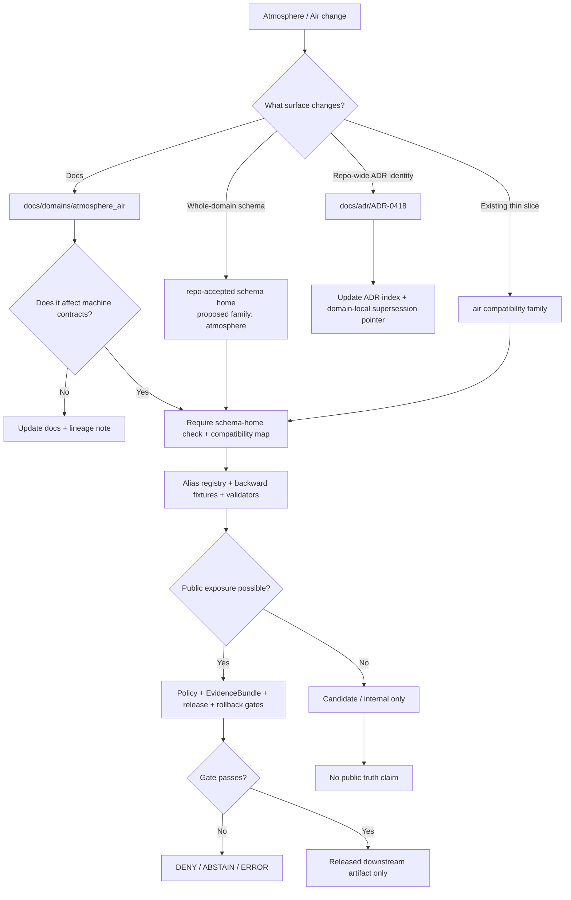

<!-- [KFM_META_BLOCK_V2]
doc_id: kfm://doc/TODO-ASSIGN-UUID-adr-0418-atmosphere-air-schema-slug-compatibility
title: ADR-0418: Atmosphere-Air Schema Slug Compatibility
type: standard
version: v1
status: draft
owners: TODO-VERIFY: atmosphere-air domain steward, schema steward, policy steward
created: TODO-VERIFY-YYYY-MM-DD
updated: 2026-05-06
policy_label: TODO-VERIFY-public-or-restricted
related: [./ADR-0001-schema-home.md, ./ADR-0002-responsibility-root-monorepo.md, ./README.md, ../domains/atmosphere_air/ADR-0001-atmosphere-air-lane.md, ../domains/atmosphere_air/ADR-0002-atmosphere-schema-compatibility.md, ../domains/atmosphere_air/README.md, ../domains/atmosphere_air/governance/SOURCE_REGISTRY.md, ../../pipelines/normalize/domains/atmosphere/README.md, ../../connectors/pipelines/air/README.md, ../../tools/validators/air/validate_air_qa.py, ../../tools/publishers/air/build_air_release_candidate.py, ../../tools/publishers/air/publish_air_release.py, ../../data/processed/air/qa_summary.example.json, ../../data/receipts/air/run_receipt.example.json]
tags: [kfm, adr, atmosphere-air, schema-compatibility, schema-slug, source-role, knowledge-character, evidence, release, rollback]
notes: [Unique renamed path proposed for the ADR directory: docs/adr/ADR-0418-atmosphere-air-schema-slug-compatibility.md., Exact candidate path was checked through the GitHub connector and returned Not Found on main., This supersedes the requested ADR-0002 filename because docs/adr/ADR-0002-responsibility-root-monorepo.md already exists., Existing domain-local docs/domains/atmosphere_air/ADR-0002-atmosphere-schema-compatibility.md should become lineage or a pointer after this ADR is accepted., Owners, created date, policy label, complete schema inventory, CI enforcement, and schema file existence remain NEEDS VERIFICATION.]
[/KFM_META_BLOCK_V2] -->

<a id="top"></a>

# ADR-0418: Atmosphere-Air Schema Slug Compatibility

Rename and govern the Atmosphere / Air schema-compatibility decision without colliding with the existing ADR directory.

<div align="center">


</div>

> [!IMPORTANT]
> **Renamed target path:** `docs/adr/ADR-0418-atmosphere-air-schema-slug-compatibility.md`  
> **Unique name:** `ADR-0418: Atmosphere-Air Schema Slug Compatibility`  
> **Prior requested path:** `docs/domains/ADR/ADR-0002-atmosphere-schema-compatibility.md` — `NEEDS VERIFICATION`; no current repo-visible evidence confirms this as an accepted ADR home.  
> **Existing lineage file:** `docs/domains/atmosphere_air/ADR-0002-atmosphere-schema-compatibility.md` — `CONFIRMED`; keep as lineage or replace with a pointer after this ADR is accepted.  
> **Decision posture:** `PROPOSED`; this ADR does not claim full schema, policy, test, CI, or release enforcement.

**Quick jumps:** [Decision summary](#decision-summary) · [Evidence boundary](#evidence-boundary) · [Repo fit](#repo-fit) · [Decision](#decision) · [Compatibility map](#compatibility-map) · [Object-family bridge](#object-family-bridge) · [Enforcement](#enforcement-model) · [Validation](#validation-matrix) · [Acceptance](#acceptance-criteria) · [Rollback](#rollback-and-supersession) · [Open verification](#open-verification)

---

## Decision summary

| Field | Determination |
|---|---|
| ADR status | `PROPOSED` |
| Renamed file | `docs/adr/ADR-0418-atmosphere-air-schema-slug-compatibility.md` |
| Unique decision name | **Atmosphere-Air Schema Slug Compatibility** |
| Current domain documentation lane | `docs/domains/atmosphere_air/` |
| Current thin-slice implementation slug | `air` |
| Proposed whole-domain schema slug | `atmosphere` |
| Global schema-home dependency | Governed by `docs/adr/ADR-0001-schema-home.md` or successor |
| Root-layout dependency | Governed by `docs/adr/ADR-0002-responsibility-root-monorepo.md` or successor |
| Primary risk addressed | Silent drift between `atmosphere_air`, `atmosphere`, and `air` surfaces |
| Fail-safe rule | Ambiguous schema or slug resolution must `DENY`, `ABSTAIN`, or `ERROR`; it must not guess |
| Publication effect | None. This ADR authorizes no public release, no live connector, and no public layer by itself |

**Proposed decision:** Use `ADR-0418-atmosphere-air-schema-slug-compatibility.md` as the non-colliding ADR-directory filename for the Atmosphere / Air schema-slug compatibility decision.

This ADR preserves the current `docs/domains/atmosphere_air/` documentation lane, treats current `air` implementation files as a compatibility thin slice, and requires explicit alias/migration fixtures before any rename, schema-family consolidation, route binding, publication, or public UI exposure.

<p align="right"><a href="#top">Back to top ↑</a></p>

---

## Evidence boundary

This ADR separates repo-visible evidence from proposed governance.

| Evidence class | Status | What it supports | What it does not prove |
|---|---:|---|---|
| Candidate renamed ADR path | `CONFIRMED ABSENT BY EXACT FETCH` | `docs/adr/ADR-0418-atmosphere-air-schema-slug-compatibility.md` returned Not Found on `main` in the GitHub connector. | A complete future inventory after branch changes. |
| Repo-wide ADR directory | `CONFIRMED` | `docs/adr/` is the repo-visible ADR home and already contains repo-wide ADRs. | That every domain decision must live only there. |
| Existing `ADR-0002` in repo-wide ADR directory | `CONFIRMED` | `docs/adr/ADR-0002-responsibility-root-monorepo.md` already uses `ADR-0002`; do not collide. | That all numbering collisions are resolved. |
| Current repo-visible domain ADR | `CONFIRMED` | `docs/domains/atmosphere_air/ADR-0002-atmosphere-schema-compatibility.md` exists and records a thin proposed compatibility decision. | It does not prove alias registry, schema files, tests, CI, owners, or release enforcement. |
| Atmosphere / Air domain README | `CONFIRMED` | Domain documentation uses `docs/domains/atmosphere_air/`; it distinguishes observations, AQI reports, model fields, remote-sensing masks, fusion products, advisories, and network/site context. | It does not prove all proposed companion files or schemas exist. |
| Atmosphere-Air lane ADR-0001 | `CONFIRMED` | The lane decision uses `docs/domains/atmosphere_air/` for documentation and retains `atmosphere` schema slug compatibility until superseded. | It does not decide all schema names or implementation paths. |
| Source registry doc | `CONFIRMED` | Source descriptors must carry `source_id`, `source_role`, `knowledge_character`, publisher, rights, verification, public-release flag, and verification date. | It does not activate live sources. |
| Air connector and artifacts | `CONFIRMED` | A no-network `air` slice writes a QA-summary candidate and run receipt. | Candidate artifacts are not public truth, proof closure, or release authorization. |
| Air validator and publisher tools | `CONFIRMED` | Air tooling references `schemas/contracts/v1/air/*` schema paths and enforces some fail-closed public-boundary rules. | It does not prove every referenced schema exists or that CI currently runs the tools. |
| Requested path `docs/domains/ADR/...` | `NEEDS VERIFICATION` | It was requested as the original target. | No current repo-visible evidence confirms it as an existing or accepted home. |

### Truth labels used here

| Label | Meaning in this ADR |
|---|---|
| `CONFIRMED` | Verified from current repo connector evidence or supplied KFM doctrine. |
| `PROPOSED` | Decision, file path, alias, validator, migration, or enforcement rule not yet proven as accepted/enforced implementation. |
| `UNKNOWN` | Not verified strongly enough from visible repo evidence. |
| `NEEDS VERIFICATION` | A concrete check must be run before treating the claim as current fact. |
| `DENY`, `ABSTAIN`, `ERROR` | System outcomes for fail-closed behavior, not rhetorical emphasis. |

<p align="right"><a href="#top">Back to top ↑</a></p>

---

## Repo fit

| Relationship | Path | Status | Role |
|---|---|---:|---|
| This renamed ADR | `docs/adr/ADR-0418-atmosphere-air-schema-slug-compatibility.md` | `PROPOSED / EXACT PATH NOT FOUND ON MAIN` | Non-colliding repo-wide ADR for schema-slug compatibility. |
| ADR index | `docs/adr/README.md` | `CONFIRMED` | Repo-wide ADR navigation and governance rules. |
| Schema-home ADR | `docs/adr/ADR-0001-schema-home.md` | `CONFIRMED` | Controls canonical machine-schema placement. |
| Responsibility-root ADR | `docs/adr/ADR-0002-responsibility-root-monorepo.md` | `CONFIRMED` | Controls root and responsibility-boundary placement. |
| Domain lane ADR | `docs/domains/atmosphere_air/ADR-0001-atmosphere-air-lane.md` | `CONFIRMED` | Establishes `atmosphere_air` as docs lane and retains schema slug compatibility. |
| Existing domain-local compatibility ADR | `docs/domains/atmosphere_air/ADR-0002-atmosphere-schema-compatibility.md` | `CONFIRMED / LINEAGE AFTER RENAME` | Thin predecessor decision; keep or replace with pointer. |
| Domain README | `docs/domains/atmosphere_air/README.md` | `CONFIRMED` | Lane scope, knowledge-character, validation, public-safety, and source-role doctrine. |
| Source registry posture | `docs/domains/atmosphere_air/governance/SOURCE_REGISTRY.md` | `CONFIRMED` | Required source fields and activation posture. |
| Connector thin slice | `connectors/pipelines/air/` | `CONFIRMED` | No-network candidate producer. |
| Normalization docs | `pipelines/normalize/domains/atmosphere/README.md` | `CONFIRMED` | Execution-near normalization guidance. |
| Air validator/publisher tooling | `tools/validators/air/`, `tools/publishers/air/` | `CONFIRMED` | Current implementation pressure for `air` schema references. |

### Why the ADR was renamed

`ADR-0002` is already used in the repo-wide ADR directory for responsibility-root monorepo layout. Reusing `ADR-0002` for Atmosphere / Air schema compatibility would create ambiguous decision identity. The new name, `ADR-0418-atmosphere-air-schema-slug-compatibility.md`, avoids that collision and clearly states the decision’s scope.

### Placement rule

This ADR is repo-wide enough to live under `docs/adr/` because it affects schema-home compatibility, domain-lane naming, validator references, release tooling, and potential migration behavior across responsibility roots.

> [!NOTE]
> The existing domain-local ADR can remain as historical lineage. The same PR that adds this renamed ADR should either update `docs/domains/atmosphere_air/ADR-0002-atmosphere-schema-compatibility.md` into a short pointer or mark it superseded by this file.

<p align="right"><a href="#top">Back to top ↑</a></p>

---

## Why this ADR exists

The Atmosphere / Air lane is especially prone to overclaim because many products can look similar once rendered on a map:

- PM2.5 concentration;
- AQI or NowCast report;
- regulatory archive;
- low-cost sensor reading;
- model field;
- smoke plume mask;
- AOD or visibility context;
- climate anomaly surface;
- advisory text;
- derived fusion product.

KFM must keep those knowledge characters distinct. A schema rename or path cleanup must not collapse them into one “air layer.”

This ADR protects four boundaries:

| Boundary | Protected rule |
|---|---|
| Documentation boundary | Domain documentation can use `atmosphere_air` without forcing immediate schema or implementation churn. |
| Schema boundary | Machine-checkable schemas must remain under the repo-accepted schema home and cannot be duplicated through prose. |
| Implementation boundary | Existing `air` no-network candidate, receipt, validator, and publisher tooling remain valid compatibility surfaces until intentionally migrated. |
| Publication boundary | No slug, schema, or path compatibility decision authorizes public release, direct UI access, or emergency/life-safety behavior. |

<p align="right"><a href="#top">Back to top ↑</a></p>

---

## Scope

### In scope

- Compatibility rules between `atmosphere_air`, `atmosphere`, and `air`.
- Rules for documenting and testing alias paths.
- Guardrails for schema-family migration.
- Public-boundary implications of schema compatibility.
- Acceptance criteria before this ADR can move from `PROPOSED` to `ACCEPTED`.
- Rollback and supersession behavior for rename or schema-family migration.
- Supersession relationship to the thin domain-local `ADR-0002-atmosphere-schema-compatibility.md`.

### Out of scope

- Accepting a new global schema-home decision.
- Creating or moving schema files by this document alone.
- Publishing air or atmosphere artifacts.
- Activating live AirNow, AQS, OpenAQ, PurpleAir, Kansas Mesonet, NOAA, NASA, or model-field connectors.
- Deciding all API route names, UI component names, CI workflow names, or release commands.
- Treating run receipts as release proof.
- Treating QA summary examples as public truth.

> [!WARNING]
> This ADR is a bridge. Bridges must carry traffic safely; they must not become a second destination. The final authority remains the accepted schema-home ADR, source registry, validators, policy gates, proof objects, release manifests, and rollback records.

<p align="right"><a href="#top">Back to top ↑</a></p>

---

## Decision

### Proposed decision statement

KFM should preserve the existing Atmosphere / Air naming surfaces as follows:

1. **Human-facing lane docs:** use `docs/domains/atmosphere_air/` as the current domain documentation lane.
2. **Repo-wide ADR identity:** use `docs/adr/ADR-0418-atmosphere-air-schema-slug-compatibility.md` for this compatibility decision.
3. **Existing domain-local ADR:** preserve `docs/domains/atmosphere_air/ADR-0002-atmosphere-schema-compatibility.md` as lineage or replace it with a supersession pointer.
4. **Whole-domain schemas:** use the repo-accepted schema home for atmosphere-wide object families. The proposed whole-domain family is `atmosphere`, but it remains subject to the schema-home ADR and repo inventory.
5. **Early implementation slice:** preserve the existing `air` implementation family as a compatibility slice for current PM2.5/AQI candidate, receipt, validator, and release-boundary tooling.
6. **No silent renames:** any migration from `air` to `atmosphere`, or from `atmosphere` to `air`, requires an alias registry, backward fixtures, validator coverage, documentation update, migration note, and rollback path.
7. **Fail closed:** if a schema consumer cannot resolve the intended canonical schema, alias, and knowledge character, it must fail with `DENY`, `ABSTAIN`, or `ERROR`.
8. **Public clients stay downstream:** no public client, MapLibre surface, Evidence Drawer, Focus Mode response, tile, export, or publication tool may read RAW, WORK, QUARANTINE, internal canonical stores, or connector-private outputs directly.

### Decision diagram



<p align="right"><a href="#top">Back to top ↑</a></p>

---

## Compatibility map

| Surface | Path / slug | Status | Authority role | Compatibility rule |
|---|---|---:|---|---|
| Renamed repo-wide ADR | `docs/adr/ADR-0418-atmosphere-air-schema-slug-compatibility.md` | `PROPOSED / EXACT PATH NOT FOUND ON MAIN` | Governing compatibility decision after acceptance | Add to ADR index and point old domain-local ADR here. |
| Domain docs lane | `docs/domains/atmosphere_air/` | `CONFIRMED` | Human-facing lane docs and domain governance | Keep as current doc lane unless superseded by ADR. |
| Existing domain-local ADR | `docs/domains/atmosphere_air/ADR-0002-atmosphere-schema-compatibility.md` | `CONFIRMED / LINEAGE` | Predecessor compatibility decision | Preserve as history or replace body with supersession pointer. |
| Requested path | `docs/domains/ADR/ADR-0002-atmosphere-schema-compatibility.md` | `NEEDS VERIFICATION` | User-requested target | Do not create as a parallel ADR home without path review. |
| Repo-wide ADR home | `docs/adr/` | `CONFIRMED` | Repo-wide decision ledger | Use non-colliding `ADR-0418`. |
| Global schema home | `schemas/contracts/v1/` | `CONFIRMED as ADR-0001 proposal / NEEDS VERIFICATION for enforcement` | Machine-checkable schema root | Use accepted schema-home ADR; do not duplicate in `contracts/`. |
| Whole-domain schema family | `schemas/contracts/v1/atmosphere/` | `PROPOSED / NEEDS VERIFICATION` | Full atmosphere-domain contracts | Preferred conceptual family for station observations, AQI reports, models, masks, fusion, advisory, and site context if accepted. |
| Current air tool schema references | `schemas/contracts/v1/air/` | `REFERENCED BY REPO TOOLING / NEEDS VERIFICATION FOR FILE EXISTENCE` | Current thin-slice schema family expected by tools | Treat as compatibility implementation family until inventoried and reconciled. |
| Current connector slice | `connectors/pipelines/air/` | `CONFIRMED` | No-network candidate writer | Preserve until migration fixtures prove safe. |
| Current normalization lane | `pipelines/normalize/domains/atmosphere/` | `CONFIRMED` | Execution-near normalization documentation | Use as transform-stage documentation; not source authority or schema authority. |
| Current processed candidate path | `data/processed/air/` | `CONFIRMED` | Candidate processed examples | Not public truth; not release proof. |
| Current receipt path | `data/receipts/air/` | `CONFIRMED` | Run receipt process memory | Not proof pack; not publication authorization. |
| Current air validators/publishers | `tools/validators/air/`, `tools/publishers/air/` | `CONFIRMED` | Tooling that expects `air` slice inputs | Preserve until path migration is tested. |

> [!NOTE]
> `CONFIRMED` here means the surface was visible in inspected repository evidence. It does not mean the surface is mature, complete, CI-enforced, public-safe, or release-authorized.

<p align="right"><a href="#top">Back to top ↑</a></p>

---

## Object-family bridge

The compatibility bridge should be expressed at the object-family level, not only as folder names.

| Object family | Current `air` slice signal | Whole-lane `atmosphere` expectation | Migration rule |
|---|---|---|---|
| QA summary | `qa_summary.example.json`; expected schema path `schemas/contracts/v1/air/qa_summary.schema.json` | Could become `atmosphere_aqi_report`, `atmosphere_observation_summary`, or a dedicated QA summary object if accepted | Do not rename until fixtures prove equivalent meaning. |
| Run receipt | `data/receipts/air/run_receipt.example.json` | `atmosphere_run_receipt` or shared `run_receipt` object | Receipt remains process memory, not proof. |
| Evidence bundle | Referenced by QA summary and release-candidate tooling | `atmosphere_evidence_bundle` or shared `EvidenceBundle` | Must resolve before consequential public claims. |
| Promotion decision | `promotion_decision.json` emitted by release-candidate builder | `PromotionDecision` / `DecisionEnvelope` family | Must remain separate from ReleaseManifest. |
| Release manifest | `release_manifest.json` emitted by release-candidate builder | `ReleaseManifest` family | Candidate release is not publication. |
| Publication manifest | emitted by publication tooling when gates pass or block | publication / release surface | Must deny fixture-backed truth and internal-stage references. |
| AQS reconciliation | publication tooling checks optional reconciliation | regulatory archive / reconciliation support | Must not imply live state by default. |
| Attestation | publication tooling can require attestation | proof/release integrity support | Fixture attestation cannot authorize real publication. |
| Layer / UI payload | not decided by this ADR | LayerManifest / Evidence Drawer payload | Must consume released evidence via governed API only. |

### Compatibility alias record

If maintainers keep both `air` and `atmosphere` schema families during migration, each alias must be explicit.

```yaml
# PROPOSED registry shape — adapt to the repo's accepted control-plane or schema-alias convention.
schema_compatibility_aliases:
  - alias_id: atmos-air-qa-summary-v1
    status: proposed
    alias_path: schemas/contracts/v1/air/qa_summary.schema.json
    canonical_target: TODO-VERIFY: schemas/contracts/v1/atmosphere/<accepted-object>.schema.json
    governing_adr: docs/adr/ADR-0418-atmosphere-air-schema-slug-compatibility.md
    domain_docs: docs/domains/atmosphere_air/
    object_family: qa_summary
    compatibility_reason: Preserve current no-network air QA thin slice while whole-lane atmosphere schemas are reconciled.
    allowed_for:
      - fixture_validation
      - backward_compatibility_tests
      - release_candidate_replay
    denied_for:
      - silent_publication
      - schema_generation_without_review
      - direct_public_ui_binding
    owner: TODO-VERIFY
    created: TODO-VERIFY-YYYY-MM-DD
    review_by: TODO-VERIFY-YYYY-MM-DD
    required_tests:
      - TODO-VERIFY: backward fixture for current qa_summary.example.json
      - TODO-VERIFY: invalid fixture for AQI-as-concentration
      - TODO-VERIFY: invalid fixture for AOD-as-PM2.5
      - TODO-VERIFY: invalid fixture for model-as-observation
      - TODO-VERIFY: invalid fixture for public internal-stage reference
    rollback_note: Remove alias only after all consumers resolve canonical schema and release replay passes.
```

<p align="right"><a href="#top">Back to top ↑</a></p>

---

## Compatibility invariants

These invariants apply to every schema, validator, policy, public-operation, publication, and UI change touching this lane.

| Invariant | Required behavior |
|---|---|
| Source role preserved | Every consequential record must retain source role or source descriptor reference. |
| Knowledge character preserved | Observation, AQI/report, regulatory archive, model field, mask, fusion, advisory, and site context must not collapse. |
| Raw and normalized units preserved | Concentration, AQI/index, AOD, visibility, and model units must remain distinct. |
| Candidate remains candidate | No-network examples and processed candidates must not become public truth by path or naming. |
| Receipt/proof separation | Run receipts do not replace EvidenceBundle, proof pack, ReleaseManifest, or rollback card. |
| Public path governed | Public clients use governed API, released artifacts, and EvidenceBundle resolution only. |
| Alias explicit | Any compatibility alias must be dated, owned, tested, and reviewable. |
| Rename reversible | Every rename or relocation must preserve migration history, fixture compatibility, and rollback. |
| AI subordinate | Focus Mode may summarize admissible evidence; it cannot turn model language into release truth. |
| Emergency boundary preserved | Atmosphere/Air and hazards-adjacent contexts must not become emergency alerting or life-safety instruction. |

<p align="right"><a href="#top">Back to top ↑</a></p>

---

## Enforcement model

### Required fail-closed checks

| Gate | Required check | Failure outcome |
|---|---|---|
| ADR identity | New decision does not collide with existing ADR filename or number. | `ERROR` |
| Path resolution | Consumer resolves either a canonical schema or approved compatibility alias. | `ERROR` |
| Source role | Candidate carries source role or source descriptor reference before consequential use. | `DENY` |
| Knowledge character | Candidate states observed/report/model/mask/fusion/advisory/site context. | `DENY` |
| AQI/concentration split | AQI/report index is not treated as raw concentration. | `DENY` |
| AOD/PM2.5 split | AOD or optical context is not treated as PM2.5 without governed model assumptions. | `DENY` |
| Model/observation split | Model fields are not labeled as observations. | `DENY` |
| EvidenceRefs | Consequential public candidate has EvidenceRefs that resolve to EvidenceBundle. | `ABSTAIN` or `DENY` |
| Receipt/proof split | Run receipt is not promoted as proof by itself. | `DENY` |
| Public internal-stage access | Public path does not reference RAW, WORK, QUARANTINE, internal canonical stores, or unpromoted processed candidates. | `DENY` |
| Unknown rights | Unknown rights or unresolved source terms block public release. | `DENY` |
| Fixture truth | Fixture-backed artifacts cannot be published as real-world truth. | `DENY` |

### Illustrative compatibility check

```python
# Illustrative only — adapt to repo-native validator conventions.
# Purpose: fail closed when air/atmosphere schema slugs are unresolved.

from __future__ import annotations

from dataclasses import dataclass
from pathlib import Path


@dataclass(frozen=True)
class SchemaAlias:
    alias_path: str
    canonical_path: str
    status: str
    object_family: str
    governing_adr: str


APPROVED_STATUSES = {"active", "deprecated_with_tests"}
GOVERNING_ADR = "docs/adr/ADR-0418-atmosphere-air-schema-slug-compatibility.md"


def resolve_schema_path(path: str, aliases: list[SchemaAlias]) -> tuple[bool, str]:
    normalized = path.replace("\\", "/")

    if normalized.startswith("schemas/contracts/v1/atmosphere/"):
        return True, normalized

    for alias in aliases:
        if normalized == alias.alias_path and alias.status in APPROVED_STATUSES:
            if alias.governing_adr != GOVERNING_ADR:
                return False, "alias_missing_governing_adr_0418"
            if not alias.canonical_path:
                return False, "alias_missing_canonical_target"
            return True, alias.canonical_path

    if normalized.startswith("schemas/contracts/v1/air/"):
        return False, "air_schema_path_requires_approved_alias"

    return False, "unknown_schema_home"


def validate_consumer_schema_refs(paths: list[str], aliases: list[SchemaAlias]) -> list[str]:
    failures: list[str] = []

    for path in paths:
        ok, resolved = resolve_schema_path(path, aliases)
        if not ok:
            failures.append(f"{path}: {resolved}")

    return failures
```

> [!NOTE]
> This code is a design sketch. The real validator must use the repository’s accepted package manager, fixture layout, schema registry, and CI conventions.

<p align="right"><a href="#top">Back to top ↑</a></p>

---

## Validation matrix

| Test | Minimum fixture | Expected result |
|---|---|---|
| ADR filename uniqueness | `docs/adr/ADR-0418-atmosphere-air-schema-slug-compatibility.md` | Pass when exact path does not already exist and ADR index updates. |
| Existing domain-local ADR remains lineage | `docs/domains/atmosphere_air/ADR-0002-atmosphere-schema-compatibility.md` | Pass when it links to or is superseded by ADR-0418. |
| Existing no-network QA summary remains valid candidate | `data/processed/air/qa_summary.example.json` | Pass as candidate; fail if treated as public truth. |
| Existing run receipt remains process memory | `data/receipts/air/run_receipt.example.json` | Pass as receipt; fail if treated as proof or release. |
| `air` schema consumer without alias | tool references `schemas/contracts/v1/air/*.schema.json` | `NEEDS VERIFICATION` or fail until alias is registered. |
| `atmosphere` schema consumer with canonical path | tool references accepted `schemas/contracts/v1/atmosphere/*.schema.json` | Pass after schema inventory confirms file exists. |
| AQI-as-concentration | AQI/report object with concentration semantics | Deny. |
| Model-as-observation | model field labeled `OBSERVED_SENSOR` | Deny. |
| AOD-as-PM2.5 | AOD context converted without model assumptions | Deny. |
| Missing EvidenceRefs | consequential candidate lacks EvidenceRefs | Abstain or deny. |
| Unknown rights public | source rights unresolved but public release requested | Deny. |
| Internal-stage public reference | public manifest references RAW, WORK, QUARANTINE, or unpromoted processed data | Deny. |
| Fixture-backed publication | fixture source tries to become published truth | Deny. |
| Rename with missing rollback | path migration lacks alias, fixture, migration note, or rollback target | Error. |
| Stale operational evidence | stale PM2.5/AQI context supports live-state claim | Abstain. |

### Suggested command checklist

```bash
# Read-only inventory before accepting this ADR.
git status --short
git branch --show-current

# Confirm renamed ADR path remains unique before adding it.
test ! -e docs/adr/ADR-0418-atmosphere-air-schema-slug-compatibility.md

find docs/adr -maxdepth 1 -type f -name 'ADR-*.md' | sort
find docs/domains/atmosphere_air -maxdepth 3 -type f | sort
find schemas/contracts/v1 -maxdepth 3 -type f 2>/dev/null | sort | grep -E '/(air|atmosphere)/' || true
find tools/validators/air tools/publishers/air connectors/pipelines/air pipelines/normalize/domains/atmosphere -maxdepth 3 -type f 2>/dev/null | sort

python -m json.tool data/processed/air/qa_summary.example.json > /dev/null
python -m json.tool data/receipts/air/run_receipt.example.json > /dev/null

# Repo-native test command goes here after package/test conventions are verified.
# Example only:
python tools/validators/air/validate_air_qa.py data/processed/air/qa_summary.example.json
```

<p align="right"><a href="#top">Back to top ↑</a></p>

---

## Required documentation updates

Any PR that adds this renamed ADR must update or verify these surfaces.

| Surface | Update trigger | Required action |
|---|---|---|
| `docs/adr/README.md` | new repo-wide ADR | Add `ADR-0418-atmosphere-air-schema-slug-compatibility.md` to the ADR inventory. |
| `docs/domains/atmosphere_air/ADR-0002-atmosphere-schema-compatibility.md` | this ADR added | Mark superseded by ADR-0418 or replace with a pointer. |
| `docs/domains/atmosphere_air/README.md` | scope, slug, source-role, knowledge-character, or public-boundary change | Keep lane docs aligned with this ADR. |
| `docs/domains/atmosphere_air/ADR-0001-atmosphere-air-lane.md` | lane slug or docs path changes | Update successor/compatibility note. |
| `docs/adr/ADR-0001-schema-home.md` | canonical schema-home changes | Reconcile machine-schema authority. |
| `docs/adr/ADR-0002-responsibility-root-monorepo.md` | path relocation or new root/domain ADR home | Preserve responsibility-root discipline. |
| `docs/domains/atmosphere_air/governance/SOURCE_REGISTRY.md` | source role or knowledge-character changes | Update source registry field expectations. |
| `pipelines/normalize/domains/atmosphere/README.md` | normalization contract changes | Keep candidate/normalization semantics aligned. |
| `connectors/pipelines/air/README.md` | connector output or fixture posture changes | Keep no-network candidate posture visible. |
| validator docs or runbooks | new alias, rename, denial code, schema path, or fixture | Add command and expected failure behavior. |
| release / rollback docs | release candidate or publication behavior changes | Add rollback target and tombstone/correction behavior. |

<p align="right"><a href="#top">Back to top ↑</a></p>

---

## Acceptance criteria

This ADR may move from `PROPOSED` to `ACCEPTED` only after all applicable checks pass.

- [ ] Maintainers confirm final landing path: `docs/adr/ADR-0418-atmosphere-air-schema-slug-compatibility.md`.
- [ ] Maintainers confirm `ADR-0418` does not collide with the active ADR directory or registry.
- [ ] `docs/domains/ADR/` is either rejected as a parallel home or accepted through a documented path decision.
- [ ] `docs/domains/atmosphere_air/ADR-0002-atmosphere-schema-compatibility.md` is preserved as lineage or updated as a supersession pointer.
- [ ] Owners are assigned for atmosphere-air docs, schema compatibility, policy, and release tooling.
- [ ] Policy label is set.
- [ ] Complete inventory exists for `schemas/contracts/v1/air/` and `schemas/contracts/v1/atmosphere/`.
- [ ] Current schema consumers are listed: validators, publishers, tests, workflows, docs, generated artifacts, UI/API contracts.
- [ ] Alias registry or compatibility map is added if both `air` and `atmosphere` schema paths remain in use.
- [ ] Backward fixtures cover current `qa_summary.example.json` and `run_receipt.example.json`.
- [ ] Negative fixtures cover AQI-as-concentration, AOD-as-PM2.5, model-as-observed, unknown-rights-public, missing EvidenceRefs, and public internal-stage reference.
- [ ] Validator or CI fails when a consumer references an unresolved `air`/`atmosphere` schema path.
- [ ] Release-candidate tooling cannot publish fixture-backed truth.
- [ ] Documentation updates land with the behavior change.
- [ ] Rollback or supersession path is documented.
- [ ] Validation evidence is attached to the PR, receipt, or review notes.

<p align="right"><a href="#top">Back to top ↑</a></p>

---

## Rollback and supersession

If this bridge proves wrong or incomplete:

1. Preserve this ADR as lineage.
2. Create a successor ADR with a unique name and non-colliding number.
3. Record a compatibility map from old paths to new paths.
4. Keep existing `air` fixture and release-candidate replay tests until all consumers migrate.
5. Do not delete receipts, QA summaries, promotion decisions, publication manifests, tombstones, or proof candidates.
6. Retire aliases only after validation proves no active consumer uses them.
7. Update source registry, schema registry, docs, validators, tests, release tooling, and runbooks together.
8. Rehearse rollback before any public artifact depends on the renamed family.

### Supersession note template

```markdown
> [!IMPORTANT]
> Superseded by: `docs/adr/ADR-0418-atmosphere-air-schema-slug-compatibility.md`
>
> Reason:
> - `ADR-0002` is already used in the repo-wide ADR directory.
> - Atmosphere / Air schema-slug compatibility affects schema consumers and release tooling.
>
> Preserved compatibility:
> - `air` fixtures replayed through `<test path>`
> - `atmosphere_air` docs linked to `<new docs path>`
> - `<old schema>` mapped to `<new schema>`
>
> Rollback:
> - `<rollback card or runbook path>`
```

<p align="right"><a href="#top">Back to top ↑</a></p>

---

## Open verification

| Item | Status | Why it matters |
|---|---:|---|
| Renamed candidate path | `CONFIRMED ABSENT BY EXACT FETCH` | `docs/adr/ADR-0418-atmosphere-air-schema-slug-compatibility.md` was not present on `main` when checked. |
| Full ADR inventory after branch changes | `NEEDS VERIFICATION` | Exact-path absence is strong for this candidate, but the active branch should still be inventoried before commit. |
| Requested path `docs/domains/ADR/...` | `NEEDS VERIFICATION` | No current repo-visible evidence confirms it as an accepted home. |
| Existing domain-local compatibility ADR | `CONFIRMED` | Should be retained as lineage or converted into a pointer. |
| Owners | `NEEDS VERIFICATION` | Required before acceptance and enforcement. |
| Policy label | `NEEDS VERIFICATION` | Required before public or restricted classification is asserted. |
| Full schema inventory | `NEEDS VERIFICATION` | Tooling references `schemas/contracts/v1/air/*`; proposed docs mention `schemas/contracts/v1/atmosphere/*`. Exact files must be inventoried. |
| CI enforcement | `UNKNOWN` | No workflow execution evidence is included in this ADR. |
| Schema alias registry home | `NEEDS VERIFICATION` | Could live in `control_plane/`, `schemas/`, docs, or another accepted registry home. |
| Compatibility fixtures | `NEEDS VERIFICATION` | Required before safe rename or consolidation. |
| Public API/UI consumers | `UNKNOWN` | Any public binding must consume governed release artifacts only. |
| Live source rights | `UNKNOWN` | Public release fails closed until rights and terms are verified. |
| AQS reconciliation behavior | `NEEDS VERIFICATION` | Publication tooling references reconciliation; production policy must be reviewed. |
| Attestation behavior | `NEEDS VERIFICATION` | Fixture attestations must not authorize real publication. |

<p align="right"><a href="#top">Back to top ↑</a></p>

---

## Final decision

`PROPOSED`: Rename the Atmosphere / Air schema-compatibility decision to:

```text
docs/adr/ADR-0418-atmosphere-air-schema-slug-compatibility.md
```

Use **ADR-0418: Atmosphere-Air Schema Slug Compatibility** as the governing compatibility record for the current Atmosphere / Air naming split.

- Keep `docs/domains/atmosphere_air/` as the current human-facing lane.
- Preserve current `air` implementation artifacts and tools as compatibility thin-slice surfaces.
- Treat `atmosphere` as the proposed whole-domain schema family only after schema-home inventory and acceptance.
- Preserve or pointer-update the existing domain-local `ADR-0002-atmosphere-schema-compatibility.md`.
- Require explicit aliases, backward fixtures, validators, release-boundary checks, and rollback notes before any rename.
- Fail closed on unresolved schema paths, unknown rights, missing evidence, or public internal-stage access.

The bridge is successful when maintainers can rename, consolidate, or keep the lane split without losing evidence, source role, knowledge character, release posture, or rollback lineage.
