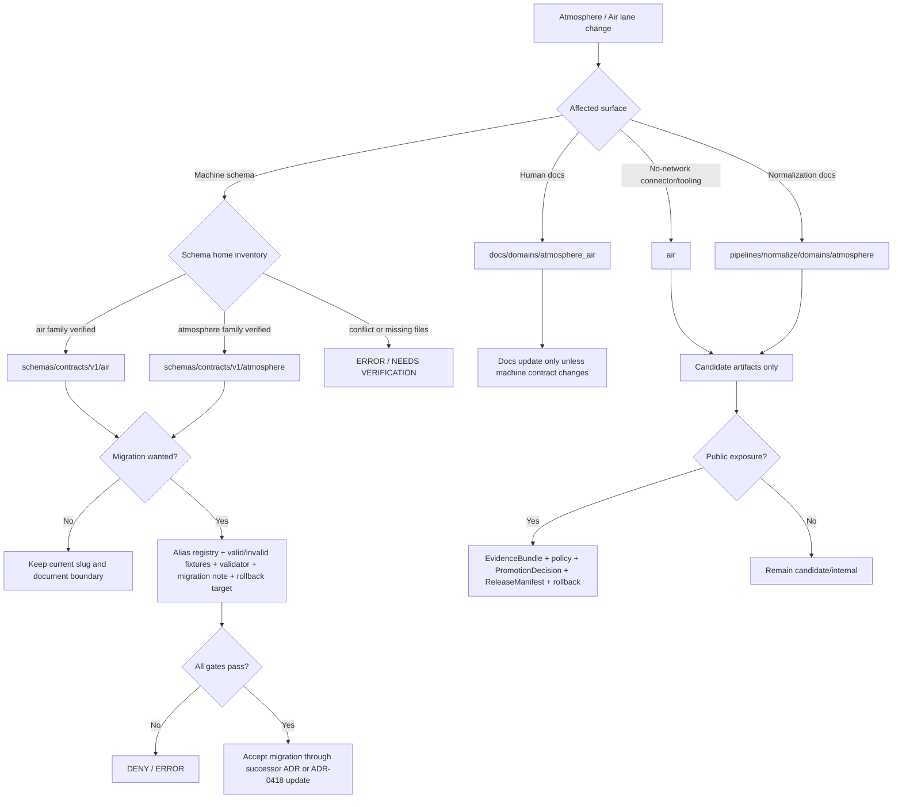

<!-- [KFM_META_BLOCK_V2]
doc_id: kfm://doc/TODO-VERIFY-adr-0418-atmosphere-air-schema-slug-compatibility
title: ADR-0418: Atmosphere-Air Schema Slug Compatibility
type: standard
version: v1
status: draft
owners: TODO-VERIFY: atmosphere-air domain steward, schema steward, policy steward
created: TODO-VERIFY-YYYY-MM-DD
updated: 2026-05-06
policy_label: TODO-VERIFY-public-or-restricted
related: [./README.md, ./ADR-0001-schema-home.md, ./ADR-0002-responsibility-root-monorepo.md, ../domains/atmosphere_air/README.md, ../domains/atmosphere_air/ADR-0001-atmosphere-air-lane.md, ../domains/atmosphere_air/ADR-0002-atmosphere-schema-compatibility.md, ../domains/atmosphere_air/governance/SOURCE_REGISTRY.md, ../runbooks/domains/atmosphere_air/slices/AIR_QA_PROMOTION_SLICE.md, ../../connectors/pipelines/air/README.md, ../../pipelines/normalize/domains/atmosphere/README.md, ../../tools/validators/air/validate_air_qa.py, ../../tools/publishers/air/build_air_release_candidate.py, ../../tools/publishers/air/publish_air_release.py, ../../data/processed/air/qa_summary.example.json, ../../data/receipts/air/run_receipt.example.json]
tags: [kfm, adr, atmosphere-air, air, atmosphere, schema-slug, schema-compatibility, evidence, policy, release, rollback]
notes: [This revision keeps the repo-wide ADR-0418 path and corrects stale not-found language from earlier draft text. Owners, created date, policy label, schema inventory, CI run status, branch protection, CODEOWNERS routing, and accepted canonical schema family remain NEEDS VERIFICATION.]
[/KFM_META_BLOCK_V2] -->

<a id="top"></a>

# ADR-0418: Atmosphere-Air Schema Slug Compatibility

Govern the compatibility boundary between the `atmosphere_air` documentation lane, the `air` implementation slice, and any future `atmosphere` whole-domain schema family.

<p align="center">
  
  
  
  
  
  
</p>

<p align="center">
  <a href="#decision-summary">Decision</a> ·
  <a href="#evidence-boundary">Evidence</a> ·
  <a href="#repo-fit">Repo fit</a> ·
  <a href="#compatibility-map">Compatibility map</a> ·
  <a href="#invariants">Invariants</a> ·
  <a href="#validation-matrix">Validation</a> ·
  <a href="#acceptance-criteria">Acceptance</a> ·
  <a href="#rollback-and-supersession">Rollback</a> ·
  <a href="#open-verification">Open verification</a>
</p>

> [!IMPORTANT]
> **ADR status:** `PROPOSED`.
>
> **This file does not authorize publication, live source activation, schema migration, UI/API binding, or release.**
>
> This ADR records a compatibility decision and the review burden around it. Enforcement still requires schema inventory, validators, fixtures, policy checks, CI/run evidence, release checks, and rollback evidence.

---

## Decision summary

| Field | Determination |
|---|---|
| ADR | `docs/adr/ADR-0418-atmosphere-air-schema-slug-compatibility.md` |
| Decision status | `PROPOSED` |
| Current documentation lane | `docs/domains/atmosphere_air/` |
| Current connector/tooling slice | `air` |
| Whole-domain concept | `atmosphere` |
| Current implementation pressure | `tools/validators/air/`, `tools/publishers/air/`, `connectors/pipelines/air/`, `data/processed/air/`, `data/receipts/air/` |
| Known naming friction | `atmosphere_air` docs, `air` tooling/artifacts, `atmosphere` normalization/docs plan |
| Schema-home dependency | `ADR-0001: Canonical Schema Home for Machine Contracts` |
| Root-layout dependency | `ADR-0002: Responsibility-Root Monorepo Layout` |
| Primary risk | Silent drift between documentation, schema family, tooling, tests, receipts, release candidates, and public-surface names |
| Required failure posture | unresolved or ambiguous schema/slug resolution must `DENY`, `ABSTAIN`, or `ERROR`; it must not guess |

### Proposed decision

KFM should keep all three names visible, bounded, and testable:

1. Use `docs/domains/atmosphere_air/` for the current human-facing Atmosphere / Air documentation lane.
2. Treat `air` as the current no-network implementation and test slice for PM2.5/AQI-style QA, receipts, release-candidate tooling, and publication-boundary checks.
3. Treat `atmosphere` as the whole-domain conceptual family for future schemas and normalization only after schema-home inventory and ADR-backed migration prove the target convention.
4. Do not silently rename, collapse, alias, or publish across these surfaces.
5. Require an explicit compatibility alias record, fixture coverage, validator coverage, migration note, and rollback target before any consumer moves from `air` to `atmosphere` or from `atmosphere` to `air`.

### Final authority sentence

> `atmosphere_air` is the current docs lane, `air` is the current implementation slice, and `atmosphere` is a proposed whole-domain schema concept until the schema-home ADR, inventory, fixtures, validators, and release checks prove otherwise.

[Back to top](#top)

---

## Evidence boundary

This ADR is grounded in repo-visible GitHub evidence plus KFM doctrine. A mounted local checkout was not available in this ChatGPT workspace, so local test execution, branch protections, workflow status, and runtime behavior remain unverified.

| Evidence item | Status | Supports | Does not prove |
|---|---:|---|---|
| This ADR path | `CONFIRMED` | `docs/adr/ADR-0418-atmosphere-air-schema-slug-compatibility.md` is repo-visible on `main`. | That the ADR is accepted or enforced. |
| ADR index | `CONFIRMED` | `docs/adr/README.md` is the ADR directory guide and treats ADRs as a decision ledger, not implementation proof. | Complete ADR coverage or CI enforcement. |
| Schema-home ADR | `CONFIRMED / PROPOSED decision` | `ADR-0001` proposes `schemas/contracts/v1/` as machine-schema home while `contracts/` remains semantic. | Final accepted schema-family target for Atmosphere / Air. |
| Responsibility-root ADR | `CONFIRMED / ACCEPTED decision` | `ADR-0002` accepts responsibility-root layout and rejects root-level domain topic folders by default. | Every subpath convention or root README coverage. |
| Domain README | `CONFIRMED` | `docs/domains/atmosphere_air/README.md` defines Atmosphere / Air scope, knowledge characters, lifecycle caution, and public-boundary expectations. | Schema or policy enforcement. |
| Domain lane ADR | `CONFIRMED / PROPOSED` | `docs/domains/atmosphere_air/ADR-0001-atmosphere-air-lane.md` keeps `docs/domains/atmosphere_air/` while retaining schema slug compatibility. | Final schema path decision. |
| Domain-local compatibility ADR | `CONFIRMED / PROPOSED / LINEAGE` | `docs/domains/atmosphere_air/ADR-0002-atmosphere-schema-compatibility.md` records a thin compatibility decision. | Repo-wide compatibility resolution. |
| Source registry posture | `CONFIRMED` | `SOURCE_REGISTRY.md` requires `source_id`, `source_role`, `knowledge_character`, publisher, rights, verification status, public-release flag, and last verification. | Source activation or public release. |
| Air connector README | `CONFIRMED` | `connectors/pipelines/air/README.md` describes a no-network connector that emits candidates and receipts without publication. | Live source activation. |
| Air validator | `CONFIRMED` | `tools/validators/air/validate_air_qa.py` defaults to `schemas/contracts/v1/air/qa_summary.schema.json` and policy checks under `policy/air/air_qa.rego`. | That referenced schema files exist or tests pass. |
| Air release tooling | `CONFIRMED` | publisher tools reference `schemas/contracts/v1/air/*`, `domain: atmosphere.air`, candidate release objects, publication denials, fixture limits, and no raw/work/quarantine public references. | Successful publication or production deployment. |
| Air no-network artifacts | `CONFIRMED` | `data/processed/air/qa_summary.example.json` and `data/receipts/air/run_receipt.example.json` exist as example candidate/process-memory artifacts. | Public truth, release proof, or EvidenceBundle closure. |
| Air runbook slice | `CONFIRMED` | `AIR_QA_PROMOTION_SLICE.md` records no-network PM2.5/NowCast/AQS/Mesonet gate posture and states live connectors are `PROPOSED / NEEDS_VERIFICATION`. | Enforcement beyond documented slice. |
| Air tests | `CONFIRMED` | Tests exist that expect `schemas/contracts/v1/air/` schema files for reentry release/deployment readiness slices. | Passing test status or all schema files existing. |
| Direct schema file fetch for `schemas/contracts/v1/air/qa_summary.schema.json` | `NEEDS VERIFICATION` | Connector fetch did not confirm this specific schema file in this session. | Absence from the repository as a whole or another branch. |

### Truth labels used here

| Label | Meaning |
|---|---|
| `CONFIRMED` | Verified from current repo-visible evidence or supplied KFM doctrine. |
| `PROPOSED` | Recommended decision, path behavior, validator, alias, migration, or enforcement rule not proven as accepted/enforced implementation. |
| `NEEDS VERIFICATION` | A specific check can retire uncertainty. |
| `UNKNOWN` | Not verified strongly enough in this session. |
| `LINEAGE` | Existing or prior material that should be preserved as history but not treated as current governing enforcement. |
| `DENY`, `ABSTAIN`, `ERROR` | System outcomes used to fail closed, not rhetorical labels. |

[Back to top](#top)

---

## Repo fit

`docs/adr/` is the correct responsibility root for this decision because the decision crosses domain docs, schema-home rules, validator references, publication tooling, release boundaries, and compatibility behavior.

| Relationship | Path | Status | Role |
|---|---|---:|---|
| This ADR | `docs/adr/ADR-0418-atmosphere-air-schema-slug-compatibility.md` | `CONFIRMED / PROPOSED decision` | Repo-wide compatibility decision. |
| ADR index | `docs/adr/README.md` | `CONFIRMED` | ADR navigation and review discipline. |
| Schema-home dependency | `docs/adr/ADR-0001-schema-home.md` | `CONFIRMED / PROPOSED decision` | Defines proposed machine-schema home split. |
| Responsibility-root dependency | `docs/adr/ADR-0002-responsibility-root-monorepo.md` | `CONFIRMED / ACCEPTED decision` | Governs root and domain placement. |
| Domain docs lane | `docs/domains/atmosphere_air/README.md` | `CONFIRMED` | Domain scope, knowledge characters, and public-safety posture. |
| Domain lane ADR | `docs/domains/atmosphere_air/ADR-0001-atmosphere-air-lane.md` | `CONFIRMED / PROPOSED` | Local lane boundary. |
| Domain-local compatibility ADR | `docs/domains/atmosphere_air/ADR-0002-atmosphere-schema-compatibility.md` | `CONFIRMED / LINEAGE` | Thin predecessor compatibility record. |
| Source registry posture | `docs/domains/atmosphere_air/governance/SOURCE_REGISTRY.md` | `CONFIRMED` | Source role and knowledge-character requirements. |
| No-network air connector | `connectors/pipelines/air/README.md` | `CONFIRMED` | Source-facing candidate/receipt producer. |
| Atmosphere normalize lane | `pipelines/normalize/domains/atmosphere/README.md` | `CONFIRMED` | Execution-near normalization documentation. |
| Air validator | `tools/validators/air/validate_air_qa.py` | `CONFIRMED` | Current validator path and schema-reference pressure. |
| Air release candidate builder | `tools/publishers/air/build_air_release_candidate.py` | `CONFIRMED` | Candidate catalog/proof/release-object pressure. |
| Air publisher | `tools/publishers/air/publish_air_release.py` | `CONFIRMED` | Publication-denial and public-boundary checks. |
| QA candidate example | `data/processed/air/qa_summary.example.json` | `CONFIRMED / candidate only` | Processed example; not public truth. |
| Run receipt example | `data/receipts/air/run_receipt.example.json` | `CONFIRMED / process memory only` | Receipt; not proof or release. |

### Placement rule

Keep the repo-wide compatibility decision here:

```text
docs/adr/ADR-0418-atmosphere-air-schema-slug-compatibility.md
```

Keep the domain-local ADR only as local lineage or a short pointer:

```text
docs/domains/atmosphere_air/ADR-0002-atmosphere-schema-compatibility.md
```

> [!NOTE]
> Do not create a parallel `docs/domains/ADR/` decision home. Domain decisions that affect shared schema, source, release, policy, UI, or lifecycle behavior should be visible from `docs/adr/`.

[Back to top](#top)

---

## Why this ADR exists

Atmosphere / Air is vulnerable to overclaim because many artifacts look similar once they become a map layer, tile, chart, or summary. KFM must keep the following knowledge objects distinct:

| Surface | Must not be collapsed into |
|---|---|
| PM2.5 / PM10 concentration | AQI, AOD, smoke mask, model field, advisory |
| AQI / NowCast report | raw concentration |
| AQS-like archive | live state |
| Kansas Mesonet or meteorological context | air-quality concentration unless source-backed |
| model field | observed sensor reading |
| smoke plume / AOD / remote-sensing mask | surface PM2.5 exposure measurement |
| fusion or consensus product | canonical source observation |
| advisory or alert text | sensor observation, model field, or emergency alerting authority |
| run receipt | EvidenceBundle, proof pack, ReleaseManifest, or publication decision |
| processed candidate | public truth |

The slug decision matters because path names can mislead maintainers. `air` feels narrow but is implementation-real. `atmosphere` feels whole-domain but is not yet proven as the canonical schema family. `atmosphere_air` matches current documentation but is not a machine-schema slug. This ADR prevents the names from silently changing epistemic meaning.

[Back to top](#top)

---

## Compatibility map

| Surface | Current name | Status | Compatibility rule |
|---|---|---:|---|
| Human-facing docs lane | `atmosphere_air` | `CONFIRMED` | Keep unless a successor ADR migrates docs. |
| Current no-network implementation slice | `air` | `CONFIRMED` | Preserve as candidate/tooling slice until migration tests prove otherwise. |
| Current domain string in air tools | `atmosphere.air` | `CONFIRMED` | Keep as explicit bridge label while slug inventory is reconciled. |
| Whole-domain schema concept | `atmosphere` | `PROPOSED / NEEDS VERIFICATION` | Do not treat as canonical machine family until schema-home inventory proves it. |
| Current validator schema reference | `schemas/contracts/v1/air/qa_summary.schema.json` | `CONFIRMED reference / NEEDS VERIFICATION file existence` | Treat as unresolved schema-reference pressure; do not claim schema exists without inventory. |
| Current release tooling references | `schemas/contracts/v1/air/*` | `CONFIRMED reference / NEEDS VERIFICATION file existence` | Must be reconciled before accepting schema migration. |
| Domain-local compatibility ADR | `ADR-0002-atmosphere-schema-compatibility.md` | `LINEAGE` | Preserve or replace with pointer to this ADR. |
| Future alias registry | TODO-VERIFY path | `PROPOSED` | Required before any old/new schema path resolves automatically. |

### Naming state diagram



[Back to top](#top)

---

## Invariants

These invariants apply to every future schema, validator, policy, migration, public operation, release candidate, UI payload, and Focus Mode answer touching this lane.

| Invariant | Required behavior |
|---|---|
| Documentation is not schema authority | `docs/domains/atmosphere_air/` explains domain posture but does not define machine shape. |
| Schema validity is not policy permission | A valid schema instance can still be denied by source role, rights, sensitivity, review, release, or stale-state policy. |
| Candidate is not publication | `data/processed/air/*` and no-network outputs stay candidate/internal until promoted. |
| Receipt is not proof | `RunReceipt` preserves process memory; it does not replace EvidenceBundle, catalog closure, proof pack, or ReleaseManifest. |
| Source role survives migration | Any alias or rename must preserve `source_role`. |
| Knowledge character survives migration | Observation, AQI report, regulatory archive, model field, remote-sensing mask, fusion product, advisory, and site context must remain distinct. |
| Unit semantics survive migration | AQI/index, concentration, AOD, visibility, and model units must not be silently converted. |
| Public surfaces stay downstream | Public API, MapLibre, Evidence Drawer, Focus Mode, exports, and tiles consume governed released artifacts only. |
| Unknown rights deny public release | Unknown or unresolved rights, terms, quota, or source role blocks publication. |
| Fixture truth is denied | Fixture-backed artifacts may support tests and candidates; they cannot authorize real public truth. |
| Alias is temporary and owned | Any compatibility alias must have an owner, status, target, tests, review date, and rollback note. |
| Rename is reversible | Every slug migration needs lineage, compatibility, migration notes, and rollback. |

[Back to top](#top)

---

## Decision rules

### Keep

Keep these as current, evidence-supported surfaces:

- `docs/adr/ADR-0418-atmosphere-air-schema-slug-compatibility.md`;
- `docs/domains/atmosphere_air/`;
- `connectors/pipelines/air/`;
- `tools/validators/air/`;
- `tools/publishers/air/`;
- `data/processed/air/`;
- `data/receipts/air/`;
- `pipelines/normalize/domains/atmosphere/` as normalization documentation, not schema authority.

### Do not claim yet

Do not claim these without further verification:

- `schemas/contracts/v1/air/qa_summary.schema.json` exists;
- `schemas/contracts/v1/atmosphere/` is canonical;
- tests pass;
- CI enforces the slug split;
- public release is authorized;
- live AirNow, AQS, OpenAQ, PurpleAir, Kansas Mesonet, NOAA, NASA, or model connectors are active;
- Evidence Drawer, Focus Mode, MapLibre, or public API consumes this lane in production.

### Require ADR update or successor ADR

Require a revision to this ADR or a successor ADR for:

- moving current `air` tooling to `atmosphere`;
- making `air` the canonical schema family;
- making `atmosphere` the canonical schema family;
- retiring `atmosphere_air` docs lane;
- introducing an alias registry;
- allowing generated schema mirrors;
- binding public UI/API surfaces to Atmosphere / Air release outputs;
- publishing real-world Atmosphere / Air artifacts.

[Back to top](#top)

---

## Compatibility alias record

If both `air` and `atmosphere` schema paths are temporarily supported, the alias must be explicit and test-covered.

```yaml
# PROPOSED registry shape — final path and schema need verification.
schema_slug_alias:
  alias_id: atmos-air-schema-slug-bridge-v1
  governing_adr: docs/adr/ADR-0418-atmosphere-air-schema-slug-compatibility.md
  status: proposed
  owner: TODO-VERIFY
  created: TODO-VERIFY-YYYY-MM-DD
  review_by: TODO-VERIFY-YYYY-MM-DD

  from:
    slug: air
    path_prefix: schemas/contracts/v1/air/
    current_role: no-network implementation and release-candidate slice
    evidence_status: referenced_by_repo_tooling_and_tests

  to:
    slug: TODO-VERIFY: atmosphere-or-air
    path_prefix: TODO-VERIFY
    intended_role: canonical machine schema family after schema-home inventory
    evidence_status: NEEDS_VERIFICATION

  allowed_for:
    - fixture_validation
    - backward_compatibility_tests
    - release_candidate_replay
    - migration_dry_run

  denied_for:
    - silent_publication
    - direct_public_ui_binding
    - source_activation
    - schema_generation_without_review
    - raw_work_quarantine_public_access

  required_tests:
    - valid_current_air_qa_candidate
    - invalid_aqi_as_concentration
    - invalid_aod_as_pm25
    - invalid_model_as_observation
    - invalid_fixture_backed_publication
    - invalid_internal_lifecycle_public_reference
    - alias_missing_target_fails_closed

  rollback_note: Preserve alias record after retirement; do not delete lineage.
```

> [!WARNING]
> Aliases are migration tools, not a second schema authority.

[Back to top](#top)

---

## Enforcement model

### Required fail-closed checks

| Gate | Required check | Failure outcome |
|---|---|---|
| ADR identity | `ADR-0418` remains uniquely linked in ADR index. | `ERROR` |
| Schema path resolution | Consumer resolves to verified canonical schema or approved alias. | `ERROR` |
| Schema file existence | Referenced schema files exist on the active branch. | `ERROR` |
| Source role | Candidate has source role or source descriptor reference before consequential use. | `DENY` |
| Knowledge character | Candidate identifies observation/report/model/mask/fusion/advisory/site context. | `DENY` |
| Unit discipline | AQI/index, concentration, AOD, visibility, and model units stay distinct. | `DENY` |
| Evidence closure | Consequential public claim resolves EvidenceRef to EvidenceBundle. | `ABSTAIN` or `DENY` |
| Receipt/proof split | Run receipt is not promoted as proof by itself. | `DENY` |
| Candidate/public split | Fixture or no-network candidate is not published as real-world truth. | `DENY` |
| Internal lifecycle boundary | Public manifest or UI/API path does not reference RAW, WORK, QUARANTINE, or unpromoted processed data. | `DENY` |
| Unknown rights | Unknown rights, terms, or verification status blocks public release. | `DENY` |
| Stale live-state support | Stale or unsupported live-state claims do not proceed. | `ABSTAIN` |

### Illustrative schema-slug resolver

```python
# Illustrative only — adapt to repo-native validator conventions.
# Purpose: fail closed when Atmosphere / Air schema slug resolution is ambiguous.

from __future__ import annotations

from dataclasses import dataclass
from pathlib import Path


GOVERNING_ADR = "docs/adr/ADR-0418-atmosphere-air-schema-slug-compatibility.md"
ALLOWED_ALIAS_STATUSES = {"active", "deprecated_with_tests"}


@dataclass(frozen=True)
class SchemaSlugAlias:
    alias_prefix: str
    canonical_prefix: str
    status: str
    governing_adr: str
    owner: str


def resolve_schema_path(path: str, aliases: list[SchemaSlugAlias]) -> tuple[bool, str]:
    normalized = path.replace("\\", "/")

    # Whole-domain path is only accepted when a real file inventory proves the file exists.
    if normalized.startswith("schemas/contracts/v1/atmosphere/"):
        return True, normalized

    for alias in aliases:
        if not normalized.startswith(alias.alias_prefix):
            continue

        if alias.status not in ALLOWED_ALIAS_STATUSES:
            return False, "alias_not_active_or_tested"

        if alias.governing_adr != GOVERNING_ADR:
            return False, "alias_missing_adr_0418"

        if not alias.owner or alias.owner.startswith("TODO"):
            return False, "alias_owner_unverified"

        return True, normalized.replace(alias.alias_prefix, alias.canonical_prefix, 1)

    if normalized.startswith("schemas/contracts/v1/air/"):
        return False, "air_schema_path_requires_verified_file_or_approved_alias"

    return False, "unknown_atmosphere_air_schema_path"


def validate_schema_refs(paths: list[str], aliases: list[SchemaSlugAlias]) -> list[str]:
    failures: list[str] = []

    for path in paths:
        ok, resolved = resolve_schema_path(path, aliases)
        if not ok:
            failures.append(f"{path}: {resolved}")
            continue

        # In a real validator, resolve from repo root and check existence.
        if not Path(resolved).exists():
            failures.append(f"{path}: resolved target missing: {resolved}")

    return failures
```

[Back to top](#top)

---

## Validation matrix

| Test | Minimum fixture or evidence | Expected result |
|---|---|---|
| ADR path present | `docs/adr/ADR-0418-atmosphere-air-schema-slug-compatibility.md` | Pass. |
| ADR index link | `docs/adr/README.md` includes this ADR | Pass after update. |
| Domain-local ADR lineage | `docs/domains/atmosphere_air/ADR-0002-atmosphere-schema-compatibility.md` | Pass when it points to this ADR or is marked superseded/lineage. |
| Domain docs lane preserved | `docs/domains/atmosphere_air/README.md` | Pass; no docs migration required by this ADR alone. |
| Air connector candidate remains candidate | `data/processed/air/qa_summary.example.json` | Pass as candidate; fail if treated as public truth. |
| Run receipt remains process memory | `data/receipts/air/run_receipt.example.json` | Pass as receipt; fail if treated as proof. |
| `air` schema reference without verified file or alias | tool references `schemas/contracts/v1/air/*.schema.json` | Fail closed or `NEEDS VERIFICATION`. |
| `atmosphere` schema reference without verified file | consumer references `schemas/contracts/v1/atmosphere/*.schema.json` | Fail closed or `NEEDS VERIFICATION`. |
| AQI-as-concentration | report/index object used as raw concentration | Deny. |
| AOD-as-PM2.5 | AOD/optical context used as PM2.5 without model assumptions | Deny. |
| Model-as-observation | model field labeled observed | Deny. |
| Fixture-backed publication | fixture or no-network source requests `published` status | Deny. |
| Public internal-stage reference | public manifest references RAW, WORK, QUARANTINE, or unpromoted processed candidate | Deny. |
| Missing EvidenceRefs | consequential candidate lacks EvidenceRefs | Abstain or deny. |
| Unknown rights public release | source rights or terms unresolved | Deny. |
| Missing rollback | migration has no rollback note or alias retirement plan | Error. |

### Suggested read-only checks before accepting this ADR

```bash
git status --short
git branch --show-current

# ADR and documentation inventory.
find docs/adr -maxdepth 1 -type f -name 'ADR-*.md' | sort
find docs/domains/atmosphere_air -maxdepth 3 -type f | sort

# Schema family inventory.
find schemas/contracts/v1 -maxdepth 3 -type f 2>/dev/null \
  | sort \
  | grep -E '/(air|atmosphere)/' || true

# Current implementation-slice inventory.
find connectors/pipelines/air tools/validators/air tools/publishers/air pipelines/normalize/domains/atmosphere \
  -maxdepth 3 -type f 2>/dev/null | sort

# Candidate examples parse.
python -m json.tool data/processed/air/qa_summary.example.json > /dev/null
python -m json.tool data/receipts/air/run_receipt.example.json > /dev/null
```

> [!NOTE]
> Do not convert these checks into acceptance claims until they have been run on the active branch and their output is captured in PR notes, a validation report, or a repo-native receipt.

[Back to top](#top)

---

## Migration plan

A migration from the current mixed naming state should proceed in small, reversible steps.

| Phase | Action | Output | Do not do |
|---|---|---|---|
| 0 | Inventory current consumers of `air`, `atmosphere`, and `atmosphere_air`. | Consumer inventory and conflict list. | Do not rename files. |
| 1 | Update this ADR and ADR index. | Repo-wide decision visible. | Do not mark accepted until validation evidence exists. |
| 2 | Add or update domain-local ADR pointer. | `ADR-0002-atmosphere-schema-compatibility.md` becomes lineage/pointer. | Do not delete history. |
| 3 | Confirm schema files and schema-home decision. | Schema family inventory. | Do not assume `air` or `atmosphere` is canonical from docs alone. |
| 4 | Add alias registry only if needed. | Explicit alias records. | Do not allow implicit aliases. |
| 5 | Add valid/invalid fixtures. | Fixture coverage for candidate, denial, alias, and migration cases. | Do not rely on positive fixtures only. |
| 6 | Wire validators. | Fail-closed slug/schema resolver. | Do not make public release depend on path existence alone. |
| 7 | Re-run air tools and tests. | Captured validation/test output. | Do not claim CI enforcement without workflow evidence. |
| 8 | Decide acceptance or successor ADR. | Accepted ADR or narrowed successor decision. | Do not merge broad schema migrations without rollback. |

[Back to top](#top)

---

## Required documentation updates

Any PR that changes this ADR should update or verify these surfaces.

| Surface | Required action |
|---|---|
| `docs/adr/README.md` | Link this ADR and record current status. |
| `docs/domains/atmosphere_air/ADR-0002-atmosphere-schema-compatibility.md` | Mark as lineage/superseded by ADR-0418 or convert to pointer. |
| `docs/domains/atmosphere_air/README.md` | Keep `atmosphere_air`, `air`, and `atmosphere` naming split visible. |
| `docs/domains/atmosphere_air/governance/SOURCE_REGISTRY.md` | Preserve source-role and knowledge-character requirements. |
| `docs/runbooks/domains/atmosphere_air/slices/AIR_QA_PROMOTION_SLICE.md` | Keep no-network/live-source boundaries aligned. |
| `connectors/pipelines/air/README.md` | Keep candidate/receipt-only status aligned. |
| `pipelines/normalize/domains/atmosphere/README.md` | Keep normalization-not-publication boundary aligned. |
| `tools/validators/air/` docs or comments | Update schema-path/alias expectations when validators change. |
| `tools/publishers/air/` docs or comments | Update release candidate and publication-denial expectations when schema paths change. |
| Schema/fixture/test docs | Add compatibility alias and slug-denial cases if aliases are introduced. |

[Back to top](#top)

---

## Acceptance criteria

This ADR can move from `draft/proposed` to `accepted` only when these checks pass.

- [ ] Owners and reviewer routing are verified.
- [ ] `docs/adr/README.md` links this ADR.
- [ ] Domain-local `ADR-0002-atmosphere-schema-compatibility.md` is marked lineage, superseded, or pointer-only.
- [ ] Active-branch inventory lists every `air`, `atmosphere`, and `atmosphere_air` consumer relevant to schemas, tools, tests, docs, data examples, release candidates, public operations, and UI/API surfaces.
- [ ] Schema-home relationship to `ADR-0001` is explicit.
- [ ] Referenced `schemas/contracts/v1/air/*` files are either confirmed present or mapped through approved aliases.
- [ ] Referenced `schemas/contracts/v1/atmosphere/*` files are either confirmed present or mapped through approved aliases.
- [ ] Valid/invalid fixtures cover candidate status, AQI/concentration split, AOD/PM2.5 denial, model-as-observation denial, unknown-rights denial, fixture-publication denial, and internal-stage public-reference denial.
- [ ] Validators fail closed on unresolved schema slugs.
- [ ] Air publisher and release-candidate tools are updated or explicitly documented as current `air` compatibility consumers.
- [ ] Run receipts remain process memory and do not replace EvidenceBundle/proof/release objects.
- [ ] Public release remains blocked unless EvidenceBundle, policy, PromotionDecision, ReleaseManifest, and rollback target are all present.
- [ ] CI or repo-native test output is captured, or enforcement remains manual/`NEEDS VERIFICATION`.
- [ ] Rollback plan is recorded before any path migration.

[Back to top](#top)

---

## Risks and mitigations

| Risk | Impact | Mitigation |
|---|---|---|
| `air` tooling references missing schemas. | Validators/publishers may fail or drift. | Inventory schema files and add approved aliases or missing schemas through a dedicated PR. |
| `atmosphere` docs imply schema authority too early. | Maintainers may write untested whole-domain schemas. | Keep `atmosphere` as proposed until schema-home and tests verify. |
| Domain-local ADR and repo-wide ADR disagree. | Duplicate authority. | Mark domain-local ADR as lineage/pointer. |
| AQI, PM2.5, AOD, smoke, model, and fusion semantics collapse. | Public claims become misleading. | Enforce knowledge-character and unit-denial tests. |
| Fixture outputs look publishable. | No-network slice becomes false public truth. | Keep fixture-publication denial in publisher/tests. |
| Run receipt is mistaken for proof. | Process memory replaces evidence closure. | Require EvidenceBundle/proof/release separation. |
| Alias lives forever. | Dual authority returns. | Add owner, review date, status, retirement plan, and tests. |
| CI presence is overstated. | Documentation claims enforcement without run evidence. | Mark workflow/test status `NEEDS VERIFICATION` until run output is captured. |

[Back to top](#top)

---

## Rollback and supersession

If this ADR or a slug migration is wrong, rollback must preserve lineage.

1. Preserve this ADR as history.
2. Create a successor ADR or update this ADR with explicit supersession notes.
3. Restore previous consumer paths or aliases through a migration record.
4. Keep valid/invalid fixtures for both old and new slugs until retirement is proven.
5. Re-run validators, publishers, and relevant tests.
6. Block public release during ambiguity.
7. Record any affected release candidate, publication manifest, correction notice, or rollback reference.
8. Do not delete the domain-local ADR without a pointer or documented replacement.
9. Do not remove alias records simply because the tree looks cleaner.

> [!WARNING]
> A rollback that hides prior authority weakens KFM. Slug cleanup must preserve compatibility evidence.

[Back to top](#top)

---

## Open verification

| Item | Status | Why it matters |
|---|---:|---|
| Owners | `NEEDS VERIFICATION` | Acceptance requires accountable review. |
| Created date | `NEEDS VERIFICATION` | Existing file date was not independently verified. |
| Policy label | `NEEDS VERIFICATION` | Public/restricted status must be deliberate. |
| CODEOWNERS routing | `NEEDS VERIFICATION` | Schema, policy, and atmosphere-air changes need steward review. |
| Active schema inventory | `NEEDS VERIFICATION` | Tooling references `schemas/contracts/v1/air/*`, but file existence must be confirmed. |
| Canonical schema target | `NEEDS VERIFICATION` | `air` vs `atmosphere` cannot be resolved by prose alone. |
| CI/test run status | `UNKNOWN` | Test files exist, but passing status was not inspected. |
| Branch protections | `UNKNOWN` | Cannot claim enforcement without repo settings or run evidence. |
| Alias registry home | `NEEDS VERIFICATION` | Do not invent a parallel registry home without ADR/register alignment. |
| Public API / UI binding | `UNKNOWN` | No claim of public Atmosphere / Air route or MapLibre binding is made here. |
| Live source activation | `UNKNOWN / blocked` | Live source rights, terms, quotas, schemas, and source descriptors must be verified first. |
| Release/proof implementation maturity | `NEEDS VERIFICATION` | Candidate objects exist in tooling, but release authorization is not proven. |

[Back to top](#top)

---

## Maintainer note

This ADR should make future cleanup less exciting.

The goal is not to pick the prettiest slug. The goal is to keep evidence, source role, knowledge character, unit semantics, policy posture, release state, and rollback visible while the Atmosphere / Air lane grows from a narrow `air` slice into a governed whole-domain capability.
