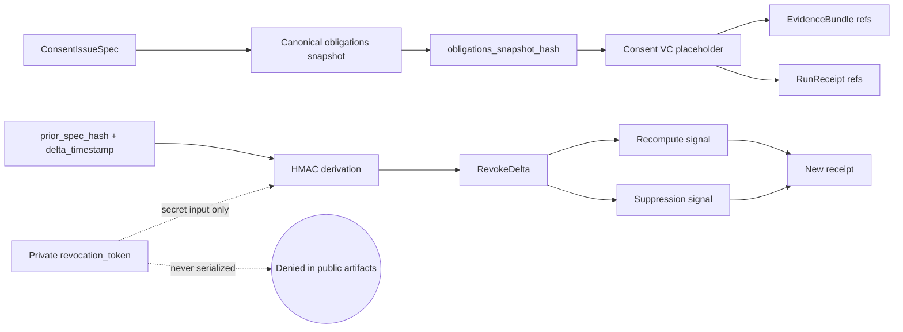

<!-- [KFM_META_BLOCK_V2]
doc_id: kfm://doc/TODO-NEEDS-UUID
title: ADR-0427: Consent VC + Revocation Delta v1
type: standard
version: v1
status: draft
owners: governance/policy/runtime
created: 2026-05-01
updated: 2026-05-01
policy_label: TODO-NEEDS-POLICY-LABEL
related: [docs/adr/README.md, schemas/governance/consent_vc.v1.json, schemas/governance/revoke_delta.v1.json, schemas/evidence/EvidenceBundle.v1.json, schemas/receipts/run_receipt.v1.json]
tags: [kfm, adr, governance, policy, consent, revocation, receipts, evidence]
notes: [Target path and related schema homes are PROPOSED pending mounted-repo verification. Generic EvidenceBundle and run_receipt schema authority remains NEEDS VERIFICATION.]
[/KFM_META_BLOCK_V2] -->

# ADR-0427: Consent VC + Revocation Delta v1

Local-only consent issuance placeholder, deterministic revocation delta derivation, and downstream suppression/recompute signaling for KFM governance flows.


> [!IMPORTANT]
> **Status:** draft  
> **Verification:** PROPOSED  
> **Owners:** `governance/policy/runtime`  
> **Target path:** `docs/adr/ADR-0427-consent-vc-revocation-delta-v1.md` *(PROPOSED; verify against mounted repo conventions)*  
> **Scope:** consent issuance placeholder, obligations snapshot hashing, deterministic revocation delta IDs, downstream suppression/recompute signaling

**Quick jumps:** [Decision](#decision) · [Operating law](#operating-law) · [Artifact boundaries](#artifact-boundaries) · [Deterministic derivation](#deterministic-derivation) · [Validation gates](#validation-gates) · [Privacy](#privacy-and-secret-handling) · [Rollback](#rollback-and-correction) · [NEEDS VERIFICATION](#needs-verification)

---

## Decision

KFM will use a **local-only Consent VC + Revocation Delta v1 posture** for deterministic testing and governed downstream suppression/recompute behavior.

This ADR defines three stable object families:

| Object | Required identifier | Purpose | Truth label |
|---|---:|---|---|
| Consent VC placeholder | `consent_vc_<hex>` | Represents locally issued consent and its obligations snapshot without contacting any external VC, DID, OIDC, Sigstore, or status-list service. | PROPOSED |
| Obligations snapshot | `sha256(canonical_json(obligations_snapshot))` | Carries the exact obligations burden into evidence, receipts, and downstream checks. | PROPOSED |
| Revocation Delta | `rvk_<hmac_hex>` | Deterministically represents a revocation event derived from a private token and revocation inputs. | PROPOSED |

**Core decision:** consent and revocation objects are local, deterministic, auditable, and fail-closed. They support KFM governance and testability without pretending that a live verifiable credential network or external trust service is present.

---

## Context

KFM needs a governance slice that can issue consent as a **verifiable-credential placeholder**, carry consent obligations into evidence and receipts, and deterministically derive revocation deltas without live network dependencies.

This matters because consent and revocation are not just metadata. They can change what downstream users are allowed to see, cite, recompute, publish, suppress, generalize, or withdraw.

### Problem pressure

| Pressure | KFM risk if ignored | ADR response |
|---|---|---|
| Consent must be inspectable | Public outputs could cite or publish claims without visible obligations. | Persist `consent_vc_id` and `obligations_snapshot_hash` in governed artifacts. |
| Revocation must be deterministic | Tests and replay would become fragile or dependent on external services. | Use local HMAC derivation for `revoke_delta_id`. |
| Secrets must not leak | `revocation_token` exposure would weaken consent governance. | Treat token as secret input only; deny serialization in public artifacts. |
| External identity networks are not admitted | DID/OIDC/Sigstore/status-list behavior could be implied without implementation proof. | Explicit no-network posture. |
| Suppression and recompute need receipts | Revocation could look like deletion rather than governed state transition. | Emit receipt-backed suppression/recompute signals. |

---

## Operating law

### What this ADR admits

This ADR admits a **local deterministic stub** for consent issuance and revocation delta derivation.

It may be used for:

- no-network fixtures;
- local runtime tests;
- schema and validator development;
- proof-of-flow demonstrations;
- deterministic replay;
- downstream suppression/recompute signaling.

### What this ADR does not admit

This ADR does **not** admit:

- live DID resolution;
- live OIDC identity exchange;
- live Sigstore, Cosign, or transparency-log calls;
- live VC status-list calls;
- public serialization of `revocation_token`;
- automatic publication of revoked or recomputed artifacts;
- treating generated language as consent authority;
- treating a consent placeholder as externally verifiable proof.

> [!WARNING]
> `Consent VC` in this ADR means **KFM local placeholder**, not externally verified W3C VC compliance. Any future standards-grade VC integration requires a separate ADR, source review, policy gate, and network/security threat model.

---

## Architecture sketch



The renderer, UI, AI layer, catalog, graph projection, and published surfaces remain downstream of this governance flow. They may display or consume the resulting public-safe identifiers and hashes, but they must not receive the private revocation token.

---

## Artifact boundaries

### Consent VC placeholder v1

A `ConsentVC` artifact records the issued placeholder and its obligation burden.

| Field | Required | Notes |
|---|---:|---|
| `schema_version` | yes | Fixed to `consent_vc.v1` for this ADR. |
| `consent_vc_id` | yes | Stable identifier in the form `consent_vc_<hex>`. Exact minting inputs remain NEEDS VERIFICATION unless the schema defines them. |
| `issued_at` | yes | ISO-8601 timestamp; canonical precision must be defined by schema. |
| `issuer_ref` | yes | Policy-safe issuer reference. |
| `subject_ref` | yes | Policy-safe subject reference; no unnecessary PII. |
| `consent_scope` | yes | What the consent covers. |
| `obligations_snapshot` | yes | Canonical obligation payload. |
| `obligations_snapshot_hash` | yes | `sha256(canonical_json(obligations_snapshot))`. |
| `evidence_refs` | yes | Evidence references supporting issuance authority, where applicable. |
| `local_signature_stub` | yes | Deterministic local-only signing stub; not an external signature. |
| `status` | yes | Suggested finite values: `active`, `superseded`, `revoked`. |

> [!NOTE]
> `consent_vc_id` generation is intentionally bounded here. The ADR fixes the identifier **shape and role**. The schema or implementation helper must ratify the canonical input set before KFM treats the ID derivation as authoritative.

### RevokeDelta v1

A `RevokeDelta` artifact records a deterministic revocation event without exposing the secret token.

| Field | Required | Notes |
|---|---:|---|
| `schema_version` | yes | Fixed to `revoke_delta.v1`. |
| `revoke_delta_id` | yes | Deterministic `rvk_<hmac_hex>` derived below. |
| `consent_vc_id` | yes | Consent placeholder affected by the delta. |
| `prior_spec_hash` | yes | Prior consent/evidence/release spec hash to revoke or suppress. |
| `delta_timestamp` | yes | Timestamp used in the HMAC message. |
| `obligations_snapshot_hash` | yes | Links revocation to the obligation burden known at issuance or latest ratified update. |
| `reason_code` | yes | Policy reason for revocation. Suggested examples: `consent_withdrawn`, `obligation_changed`, `sensitivity_reclassified`, `rights_uncertain`. |
| `suppression_actions` | yes | Public-safe actions requested downstream. |
| `recompute_targets` | yes | Derived artifacts that need rebuild, recheck, or withdrawal review. |
| `local_signature_stub` | yes | Deterministic local-only stub. |

### EvidenceBundle and run receipt references

This ADR requires downstream artifacts to carry consent obligation references, but it does not claim that canonical generic schemas already exist in the mounted repo.

| Artifact | Required consent fields | Placement status |
|---|---|---|
| `EvidenceBundle.v1` | `consent_vc_id`, `obligations_snapshot_hash`, optional `revoke_delta_id` when applicable | PROPOSED under `schemas/evidence/EvidenceBundle.v1.json` pending schema-home ratification. |
| `run_receipt.v1` | `consent_vc_id`, `obligations_snapshot_hash`, `revoke_delta_id`, `suppression_or_recompute_action` | PROPOSED under `schemas/receipts/run_receipt.v1.json` pending schema-home ratification. |
| `RevokeManifest.v1` | one or more `revoke_delta_id` entries plus affected artifact refs | PROPOSED; exact home NEEDS VERIFICATION. |

---

## Deterministic derivation

### Obligations snapshot hash

`obligations_snapshot_hash` is the SHA-256 hash of the canonical JSON obligations snapshot.

```text
obligations_snapshot_hash = sha256(canonical_json(obligations_snapshot)).hex()
```

**Canonicalization rule:** use the repo-approved canonical JSON helper if present. If no helper exists, this ADR proposes a strict canonical JSON profile for v1 and marks that profile **NEEDS VERIFICATION** before broad adoption.

### Revocation delta ID

Revocation ID derivation is fixed by this ADR. The following is pseudocode, not a repo implementation claim.

```text
prk = HMAC("kfm:revoke:v1", revocation_token)
k   = HMAC(prk, "kfm:revoke:v1:id")
message = prior_spec_hash + "|" + delta_timestamp
revoke_delta_id = "rvk_" + HMAC(k, message).hex()
```

Implementation notes:

- HMAC output is lower-case hexadecimal.
- String inputs must be UTF-8 encoded before HMAC.
- `revocation_token` is a secret byte/string input and must not be serialized.
- `delta_timestamp` must be canonical and stable for deterministic replay.
- The delimiter is the literal ASCII pipe character: `|`.

```python
import hmac
from hashlib import sha256


def hmac_sha256(key: bytes, message: bytes) -> bytes:
    return hmac.new(key, message, sha256).digest()


def derive_revoke_delta_id(
    revocation_token: str,
    prior_spec_hash: str,
    delta_timestamp: str,
) -> str:
    prk = hmac_sha256(b"kfm:revoke:v1", revocation_token.encode("utf-8"))
    key = hmac_sha256(prk, b"kfm:revoke:v1:id")
    message = f"{prior_spec_hash}|{delta_timestamp}".encode("utf-8")
    return "rvk_" + hmac_sha256(key, message).hex()
```

---

## No-network posture

The v1 implementation posture is local-only.

| Surface | Allowed | Denied |
|---|---|---|
| Issuance | Deterministic local signing stub. | DID, OIDC, remote VC issuer, Sigstore, transparency log. |
| Revocation | Deterministic local HMAC delta. | VC status-list lookup, remote revocation registry, live network callback. |
| Tests | Local fixtures only. | External service dependency or internet-required CI. |
| Public output | IDs, hashes, reason codes, receipts, review states. | `revocation_token`, private signing key material, raw secret-bearing fixtures. |

A network attempt during issuance or revocation validation is a test failure unless a later ADR explicitly admits that integration.

---

## Validation gates

Validators must fail closed.

| Gate | PASS condition | FAIL condition |
|---|---|---|
| `consent.id.shape` | `consent_vc_id` matches `^consent_vc_[0-9a-f]+$`. | Missing ID, wrong prefix, non-hex suffix. |
| `obligations.hash.match` | Hash equals SHA-256 of canonical obligations snapshot. | Hash mismatch or non-canonical input. |
| `revoke.id.deterministic` | Same token + `prior_spec_hash` + `delta_timestamp` yields same `revoke_delta_id`. | Non-deterministic output. |
| `revoke.id.separation` | Changed token/spec/timestamp changes derived ID. | Collision in controlled fixture tests. |
| `secret.no_serialize` | `revocation_token` absent from ConsentVC, EvidenceBundle, run receipt, RevokeDelta, RevokeManifest, logs, and public fixtures. | Token appears anywhere outside secret input channel. |
| `network.local_only` | No network calls are made. | DNS, HTTP, OIDC, DID, Sigstore, status-list, or transparency-log call. |
| `receipt.references.delta` | Suppression/recompute receipt references applicable `revoke_delta_id`. | Revocation action lacks receipt linkage. |
| `publication.fail_closed` | Revoked or uncertain artifacts cannot publish without review decision. | Public release proceeds without policy/review state. |

Suggested finite downstream actions:

```yaml
proposal_note: illustrative enum proposal; schema ratification required
suppression_or_recompute_action:
  - suppress_public_output
  - recompute_derivative
  - withdraw_release_candidate
  - require_review
  - no_public_action_required
```

---

## Privacy and secret handling

`revocation_token` is a secret and is never a KFM public artifact.

It must be excluded from:

- `EvidenceBundle`;
- `run_receipt`;
- `AIReceipt`;
- `RevokeDelta`;
- `RevokeManifest`;
- catalog records;
- graph/triplet projections;
- MapLibre layer manifests;
- Evidence Drawer payloads;
- Focus Mode context;
- exported story or report artifacts;
- logs intended for public or semi-public review.

Test fixtures may use a fake token only when clearly labeled as fixture-only and never reused for production.

> [!CAUTION]
> A redacted token is still risky if it enables correlation or replay. Public outputs should carry `revoke_delta_id`, not token-derived intermediate values unless the schema and policy team explicitly ratify them.

---

## Suppression and recompute signaling

Revocation is a governed state transition, not a file move and not silent deletion.

When a `RevokeDelta` is accepted:

1. identify affected EvidenceBundle, catalog, layer, graph, tile, summary, Focus Mode, and release artifacts;
2. emit suppression and/or recompute candidates;
3. block public publication until policy and review state are known;
4. emit a run receipt that references `revoke_delta_id`;
5. record recompute targets and derivative invalidation reasons;
6. keep correction and rollback lineage inspectable.

### Minimum affected surfaces

| Surface | Required behavior after revocation |
|---|---|
| EvidenceBundle | Mark applicable consent/revocation state and obligation hash. |
| Catalog / release candidate | Block or mark stale until review and recompute complete. |
| Derived tiles / layers | Suppress or invalidate public-safe derivatives as required. |
| Graph/triplet projection | Rebuild derived projection if revoked claim participates in public graph. |
| Evidence Drawer | Show revoked/suppressed/recompute state, not stale confidence. |
| Focus Mode | ABSTAIN or DENY when consent state invalidates the evidence context. |
| Receipts | Preserve the revocation action and downstream decision trail. |

---

## Rollback and correction

Rollback is performed by replaying prior non-revoked specs and emitting a new receipt.

A rollback receipt must reference:

- the applicable `revoke_delta_id`;
- the prior non-revoked `spec_hash`;
- the recompute or suppression action;
- the review decision that authorizes rollback;
- any artifacts rebuilt, suppressed, or withdrawn;
- the resulting publication state.

Rollback must not erase the revoked state. It records a new governed transition over prior evidence.

---

## Proposed implementation slice

This is the smallest useful implementation slice for this ADR.

| Step | File or surface | Status |
|---:|---|---|
| 1 | `docs/adr/ADR-0427-consent-vc-revocation-delta-v1.md` | PROPOSED |
| 2 | `schemas/governance/consent_vc.v1.json` | PROPOSED; schema home NEEDS VERIFICATION |
| 3 | `schemas/governance/revoke_delta.v1.json` | PROPOSED; schema home NEEDS VERIFICATION |
| 4 | `schemas/evidence/EvidenceBundle.v1.json` | PROPOSED by this ADR; cross-lane ratification required |
| 5 | `schemas/receipts/run_receipt.v1.json` | PROPOSED by this ADR; cross-lane ratification required |
| 6 | `tests/fixtures/governance/consent_vc/` | PROPOSED; no-network fixtures only |
| 7 | `tools/validators/governance/validate_consent_revocation.py` or repo-native equivalent | PROPOSED |
| 8 | Policy rule: deny token serialization and network dependency | PROPOSED |
| 9 | Receipt fixture proving suppress/recompute path | PROPOSED |

### Definition of done for v1 fixtures

- [ ] Deterministic `obligations_snapshot_hash` fixture passes.
- [ ] Deterministic `revoke_delta_id` fixture passes.
- [ ] Negative fixture proves token cannot appear in public artifacts.
- [ ] Network attempt fixture fails closed.
- [ ] Revoked evidence fixture causes downstream ABSTAIN, DENY, suppress, or recompute state.
- [ ] Receipt fixture references `revoke_delta_id` and action.
- [ ] Schema-home ADR or ratification note records why the chosen paths are canonical.

---

## Consequences

### Positive

- Preserves proof, receipt, evidence, and revoke-manifest separation.
- Enables deterministic local tests and replay.
- Keeps revocation tokens private.
- Allows downstream suppression and recompute behavior to be validated before live identity integrations.
- Makes consent obligations inspectable without making model output or map layers sovereign.

### Tradeoffs

- A local placeholder is not an externally verifiable credential.
- Schema-home ambiguity must be resolved before broad reuse.
- Deterministic stubs are suitable for tests and controlled local flows, not proof of external trust.
- A future live VC/status-list integration will require a separate threat model, policy review, network boundary, and migration plan.

---

## NEEDS VERIFICATION

| Item | Why it matters | Proposed resolver |
|---|---|---|
| Canonical schema authority for `EvidenceBundle.v1.json` | This ADR proposes generic evidence schema files, but repo authority appears absent or ambiguous from current evidence. | Cross-lane schema-home ADR and mounted repo inspection. |
| Canonical schema authority for `run_receipt.v1.json` | Receipts recur across KFM doctrine, but exact canonical home is not confirmed here. | Cross-lane schema-home ADR and receipt object map. |
| Exact canonical JSON profile | Hash determinism depends on canonicalization. | Ratify repo helper or schema profile. |
| `consent_vc_id` derivation inputs | ADR defines ID shape, not final canonical minting input set. | `consent_vc.v1` schema and validator fixture. |
| Policy label for this ADR | Consent governance may be public-safe as doctrine or restricted as policy detail. | Governance/policy owner decision. |
| Secret input storage | Token handling must not leak through logs or fixtures. | Runtime/security review. |
| Test runner and validator language | No mounted repo evidence confirms stack. | Adapt to repo-native test framework after inspection. |
| Future live VC integration | Local placeholder must not become accidental standards claim. | Separate ADR before any live DID/OIDC/status-list/Sigstore dependency. |

---

## Review checklist

- [ ] Owners confirm this ADR remains `draft` until schema-home and validator decisions are ratified.
- [ ] Governance confirms `revocation_token` never appears in public outputs.
- [ ] Policy confirms fail-closed behavior for revoked or uncertain consent state.
- [ ] Runtime confirms no-network issuance/revocation tests.
- [ ] Evidence/receipts owners confirm field names and schema homes.
- [ ] UI/AI surfaces confirm revoked consent produces visible ABSTAIN, DENY, suppress, stale, or recompute state.

---

## Summary

ADR-0427 gives KFM a deterministic, local-only consent and revocation control slice that can be tested before external identity infrastructure exists. It preserves KFM’s evidence-first posture by carrying obligations into evidence and receipts, deriving revocation deltas without network calls, suppressing or recomputing downstream derivatives through receipts, and treating revocation tokens as private secret inputs rather than public artifacts.
