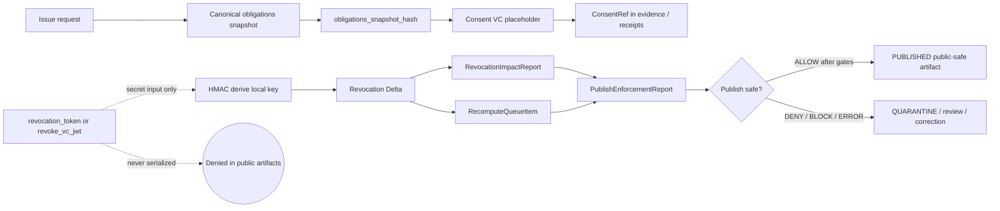
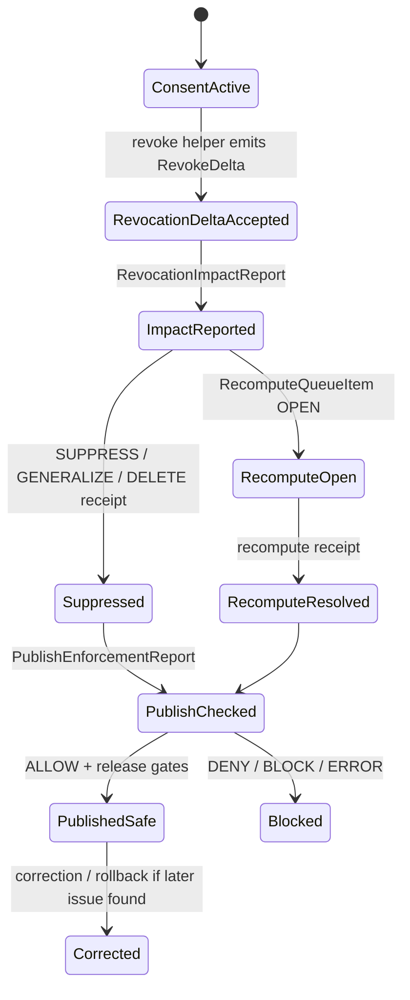

<!-- [KFM_META_BLOCK_V2]
doc_id: kfm://doc/TODO-NEEDS-UUID
title: ADR-0427: Consent VC + Revocation Delta v1
type: standard
version: v1
status: draft
owners: governance/policy/runtime
created: 2026-05-01
updated: 2026-05-06
policy_label: TODO-NEEDS-POLICY-LABEL
related: [docs/adr/README.md, docs/control-plane/CONSENT_AND_REVOCATION.md, docs/control-plane/obligation-execution.md, docs/adr/ADR-0001-schema-home.md, apps/api/openapi/consent.yaml, tools/consent/issue_consent.py, tools/consent/revoke_consent.py, tools/consent/canonical_json.py, tools/consent/signing_stub.py, policy/governance/obligation_execution.rego, policy/governance/obligation_execution_test.rego, tools/validators/governance/validate_obligation_execution.py]
tags: [kfm, adr, governance, policy, consent, revocation, vc-placeholder, receipts, evidence]
notes: [doc_id and policy_label remain unresolved. Owners are carried forward from the existing ADR draft but still need CODEOWNERS or governance-register verification. This revision is grounded in accessible GitHub repository evidence on main plus supplied KFM doctrine. It preserves local-only/no-network v1 posture, clarifies confirmed adjacent surfaces, removes the stale proposed target-path mismatch, and separates external VC standards from KFM local placeholder behavior.]
[/KFM_META_BLOCK_V2] -->

<a id="top"></a>

# ADR-0427: Consent VC + Revocation Delta v1

Local-only consent placeholder issuance, deterministic revocation delta derivation, and receipt-backed suppression/recompute signaling for KFM governed publication flows.


> [!IMPORTANT]
> **ADR status:** `draft`  
> **Decision posture:** `PROPOSED` until owners, policy label, schema-home authority, validator fixtures, and CI enforcement are verified.  
> **Target path:** `docs/adr/ADR-0427-consent-vc-and-revocation-delta.md`  
> **Core rule:** KFM v1 uses a **local-only Consent VC placeholder**, not a standards-grade external VC network integration. Revocation must be deterministic, auditable, receipt-backed, and fail-closed.

**Quick jumps:** [Decision](#decision) · [Repo fit](#repo-fit) · [Context](#context) · [Operating law](#operating-law) · [Artifact model](#artifact-model) · [Deterministic derivation](#deterministic-derivation) · [Policy gates](#policy-gates) · [Suppression and recompute](#suppression-and-recompute) · [Validation](#validation-and-fixtures) · [Rollback](#rollback-and-correction) · [Future ADRs](#future-adrs)

---

## Decision

KFM will retain a **local-only Consent VC + Revocation Delta v1** posture for the first consent/revocation slice.

The selected design is intentionally narrow:

| Decision area | ADR-0427 v1 decision | Status |
|---|---|---:|
| Consent representation | Use a KFM-local `consent_vc_id` and obligation snapshot hash as a **Consent VC placeholder**. | `PROPOSED / implementation-adjacent surfaces CONFIRMED` |
| Revocation representation | Use a deterministic `rvk_<hmac_hex>` Revocation Delta derived from secret input and stable revocation inputs. | `PROPOSED / helper CONFIRMED` |
| Network posture | No live DID, OIDC, Sigstore, transparency-log, or VC status-list dependency in v1. | `PROPOSED / DENY for v1` |
| Secret handling | `revocation_token` is a secret input only and must never appear in public artifacts. | `REQUIRED` |
| Downstream behavior | Revocation emits suppression/recompute obligations and blocks unsafe publication until receipts, queue state, policy, and review close. | `PROPOSED / policy-adjacent surfaces CONFIRMED` |
| Public UI / AI behavior | Evidence Drawer and Focus Mode may show public-safe state; they must not receive token or secret-bearing context. | `PROPOSED` |

This ADR does **not** make a claim of W3C Verifiable Credentials conformance. A future standards-grade integration must be handled by a separate ADR with source review, threat model, migration plan, network boundary, and negative-path tests.

[Back to top](#top)

---

## Repo fit

`docs/adr/` is the correct responsibility root for this file because ADRs are human-facing governance records. The decision affects consent governance, policy, evidence references, receipts, runtime boundaries, public-client safety, and rollback/correction behavior.

| Relationship | Path | Status | Role |
|---|---|---:|---|
| This ADR | `docs/adr/ADR-0427-consent-vc-and-revocation-delta.md` | `CONFIRMED` | Decision record for local Consent VC placeholder and deterministic Revocation Delta v1. |
| ADR index | [`./README.md`](./README.md) | `CONFIRMED` | ADR directory governance, naming, truth labels, review, rollback, and supersession guidance. |
| Schema-home ADR | [`./ADR-0001-schema-home.md`](./ADR-0001-schema-home.md) | `CONFIRMED / PROPOSED decision` | Proposed canonical split: `contracts/` explains meaning, `schemas/contracts/v1/` validates shape, `policy/` decides admissibility. |
| Control-plane standard | [`../control-plane/CONSENT_AND_REVOCATION.md`](../control-plane/CONSENT_AND_REVOCATION.md) | `CONFIRMED` | Cross-domain standard that operationalizes this ADR. |
| Obligation execution | [`../control-plane/obligation-execution.md`](../control-plane/obligation-execution.md) | `CONFIRMED` | Recompute queue, publish enforcement, receipts, and fail-closed publication behavior. |
| Consent OpenAPI stub | [`../../apps/api/openapi/consent.yaml`](../../apps/api/openapi/consent.yaml) | `CONFIRMED` | Stub issue/revoke API contract. |
| Consent issue helper | [`../../tools/consent/issue_consent.py`](../../tools/consent/issue_consent.py) | `CONFIRMED` | Local consent placeholder helper. |
| Revocation helper | [`../../tools/consent/revoke_consent.py`](../../tools/consent/revoke_consent.py) | `CONFIRMED` | Deterministic revoke delta helper. |
| Canonical JSON helper | [`../../tools/consent/canonical_json.py`](../../tools/consent/canonical_json.py) | `CONFIRMED` | Local canonical JSON helper used for hashing in consent helpers. |
| Signing stub | [`../../tools/consent/signing_stub.py`](../../tools/consent/signing_stub.py) | `CONFIRMED` | Local HMAC signing stub; not external proof. |
| Obligation policy | [`../../policy/governance/obligation_execution.rego`](../../policy/governance/obligation_execution.rego) | `CONFIRMED` | Rego deny/allow policy for obligations, consent revocation, recompute queue, public fields, and run receipt state. |
| Obligation policy tests | [`../../policy/governance/obligation_execution_test.rego`](../../policy/governance/obligation_execution_test.rego) | `CONFIRMED` | Rego test surface; CI/runtime enforcement still needs verification. |
| Obligation validator | [`../../tools/validators/governance/validate_obligation_execution.py`](../../tools/validators/governance/validate_obligation_execution.py) | `CONFIRMED` | Validator for obligation/recompute/publish/revocation impact bundles. |

> [!WARNING]
> This ADR must not create a parallel contract, schema, policy, source, proof, or release authority. If future JSON Schemas for `ConsentVC` or `RevokeDelta` are added, their location must follow the accepted schema-home decision or an explicit successor ADR.

[Back to top](#top)

---

## Evidence boundary

This ADR can state current repository **file presence** for the paths inspected through the GitHub connector. It cannot claim deployed route behavior, CI enforcement, branch protections, workflow success, runtime logs, production key handling, or public release readiness.

| Claim area | Truth posture | Boundary |
|---|---:|---|
| ADR path exists on accessible `main` branch | `CONFIRMED` | The file was fetched from `docs/adr/ADR-0427-consent-vc-and-revocation-delta.md`. |
| Adjacent control-plane consent doc exists | `CONFIRMED` | The control-plane standard links back to this ADR and lists confirmed adjacent surfaces. |
| API issue/revoke contract exists | `CONFIRMED` | OpenAPI stub exists; deployed API route behavior is `UNKNOWN`. |
| Local consent/revoke helpers exist | `CONFIRMED` | Helper files exist; production use, packaging, CLI exposure, or test execution remain `NEEDS VERIFICATION`. |
| Rego policy and test surfaces exist | `CONFIRMED` | Policy files exist; OPA/Conftest/CI enforcement remains `NEEDS VERIFICATION`. |
| Governance schemas for obligation/recompute/publish/revocation impact exist | `CONFIRMED` for inspected files | Consent VC and Revoke Delta standalone JSON Schema files were not confirmed in this inspection. |
| W3C VC external status behavior is active | `DENY for v1` | Future live VC, DID, OIDC, status-list, or transparency-log integration requires separate ADR. |
| This ADR is accepted and enforced | `NEEDS VERIFICATION` | Status remains `draft`; owner, policy label, schema-home, fixture, and CI evidence are incomplete. |

[Back to top](#top)

---

## Context

Consent and revocation are governance controls that can change what KFM may expose, cite, render, aggregate, export, or answer.

KFM needs a deterministic first slice because consent-related material may affect high-risk domains: living-person data, genealogy, DNA/genomics, land ownership, private residence exposure, culturally sensitive places, exact archaeological locations, rare species, and other public-safety-sensitive evidence. The first implementation must therefore prove fail-closed behavior before any external identity network or public credential-verification surface is introduced.

### Problem pressure

| Pressure | Failure mode if ignored | ADR response |
|---|---|---|
| Consent must be inspectable | Evidence-dependent outputs may lose the obligation burden that made use permissible. | Carry `consent_vc_id` and `obligations_snapshot_hash` into consent-dependent evidence and receipts. |
| Revocation must be replayable | Revocation behavior becomes fragile, time-dependent, or tied to external services during tests. | Use deterministic HMAC-derived `revoke_delta_id`. |
| Secrets must not leak | Public artifacts may expose `revocation_token` or token-derived intermediates. | Token is secret input only; public outputs carry IDs, hashes, state, and receipt refs. |
| Derived artifacts can stale out | Tiles, graph projections, Focus Mode context, story nodes, and exports can continue to use revoked evidence. | Trigger suppression/recompute queue and block publication until closed. |
| VC terminology can overclaim | A local KFM placeholder could be mistaken for externally verifiable VC compliance. | Explicitly define `Consent VC` as a local placeholder for v1. |
| Policy enforcement can be partial | A Rego file or validator can exist without active CI or release enforcement. | Keep enforcement `NEEDS VERIFICATION` until workflow/run evidence exists. |

[Back to top](#top)

---

## Operating law

### Admitted by this ADR

ADR-0427 admits only a local deterministic v1 slice:

- local consent placeholder issuance;
- local HMAC signing stub;
- canonical JSON hashing using the current helper or accepted successor;
- deterministic revocation delta derivation;
- no-network fixtures;
- no-network helper tests;
- receipt-backed suppression/recompute signaling;
- policy gates for revoked consent and unresolved recompute;
- public-safe Evidence Drawer and Focus Mode state.

### Denied by this ADR

ADR-0427 does **not** admit:

- live DID resolution;
- live OIDC identity exchange;
- live Sigstore, Cosign, or transparency-log calls;
- live W3C Bitstring Status List lookup;
- public serialization of `revocation_token`;
- public serialization of signing secrets;
- direct public client access to secret-bearing consent material;
- direct model access to token or raw consent context;
- treating a local signing stub as external proof;
- treating a generated answer as consent authority;
- silent deletion of revoked material.



[Back to top](#top)

---

## Artifact model

### Consent issue response

The current local helper and OpenAPI stub align around a compact issue response.

```json
{
  "consent_vc_id": "consent_vc_<24 lowercase hex chars from current helper>",
  "obligations_snapshot_hash": "<64 lowercase hex chars>",
  "issued_at": "YYYY-MM-DDThh:mm:ssZ",
  "obligations_url": "policy/consent/ecology.v1.md",
  "signature": "stubsig_<64 lowercase hex chars>"
}
```

| Field | Source posture | Notes |
|---|---:|---|
| `consent_vc_id` | `CONFIRMED helper field` | Current helper derives it from `subject_id`, `obligations_snapshot_hash`, and `issued_at`, then truncates SHA-256 to 24 hex chars. |
| `obligations_snapshot_hash` | `CONFIRMED helper field` | Current helper uses canonical JSON hashing over `obligations`. |
| `issued_at` | `CONFIRMED helper field` | Defaults to current UTC timestamp with second precision in helper. |
| `obligations_url` | `CONFIRMED helper field` | Defaults to `policy/consent/ecology.v1.md` if absent. |
| `signature` | `CONFIRMED helper field` | Local `stubsig_` HMAC signature; not external proof. |

### ConsentRef

Downstream artifacts should carry public-safe consent references rather than embedding secret-bearing material.

```json
{
  "consent_ref": {
    "consent_vc_id": "consent_vc_<hex>",
    "obligations_snapshot_hash": "<64 lowercase hex chars>",
    "obligations_url": "policy/consent/ecology.v1.md",
    "status": "active"
  }
}
```

| Field | Required for consent-dependent evidence? | Public-safe? | Status |
|---|---:|---:|---:|
| `consent_vc_id` | yes | yes | `CONFIRMED in OpenAPI ConsentRef` |
| `obligations_snapshot_hash` | yes | yes | `CONFIRMED in OpenAPI ConsentRef` |
| `obligations_url` | optional | conditional | `CONFIRMED in OpenAPI ConsentRef` |
| `status` | recommended | yes | `PROPOSED` |
| `revocation_token` | never | no | `DENY` |

### RevokeRequest

The current OpenAPI stub allows either `revocation_token` or `revoke_vc_jwt` as secret-like input.

```json
{
  "consent_vc_id": "consent_vc_<hex>",
  "revocation_token": "<secret input only>",
  "prior_spec_hash": "<64 lowercase hex chars>",
  "delta_timestamp": "YYYY-MM-DDThh:mm:ssZ"
}
```

```json
{
  "consent_vc_id": "consent_vc_<hex>",
  "revoke_vc_jwt": "<local input only for v1>",
  "prior_spec_hash": "<64 lowercase hex chars>",
  "delta_timestamp": "YYYY-MM-DDThh:mm:ssZ"
}
```

> [!CAUTION]
> `revoke_vc_jwt` is accepted by the current stub as an input alternative. ADR-0427 v1 still denies live external VC verification. Treat the JWT value as secret-bearing local input unless a successor ADR says otherwise.

### RevokeDelta

The current helper and OpenAPI stub align around this object shape.

```json
{
  "object_type": "RevokeDelta",
  "schema_version": "v1",
  "revoke_delta_id": "rvk_<64 lowercase hex chars>",
  "consent_vc_id": "consent_vc_<hex>",
  "prior_spec_hash": "<64 lowercase hex chars>",
  "delta_timestamp": "YYYY-MM-DDThh:mm:ssZ",
  "obligations_action": "suppress_or_recompute",
  "signature": "stubsig_<64 lowercase hex chars>"
}
```

### Governance impact objects

The current governance layer already has machine-readable schemas for adjacent publication-safety objects.

| Object | Confirmed schema | Role |
|---|---|---|
| `ObligationExecutionReceipt.v1` | [`../../schemas/governance/obligation_execution_receipt.schema.json`](../../schemas/governance/obligation_execution_receipt.schema.json) | Receipt for obligation action execution. |
| `RecomputeQueueItem.v1` | [`../../schemas/governance/recompute_queue_item.schema.json`](../../schemas/governance/recompute_queue_item.schema.json) | Tracks recompute/suppression/re-evaluation backlog. |
| `RevocationImpactReport.v1` | [`../../schemas/governance/revocation_impact_report.schema.json`](../../schemas/governance/revocation_impact_report.schema.json) | Summarizes revocation impact and affected recompute items. |
| `PublishEnforcementReport.v1` | [`../../schemas/governance/publish_enforcement_report.schema.json`](../../schemas/governance/publish_enforcement_report.schema.json) | Final allow/deny/block report before promotion. |

[Back to top](#top)

---

## Deterministic derivation

### Canonical obligations hash

The current helper canonicalizes JSON with sorted keys and compact separators, then SHA-256 hashes the UTF-8 bytes.

```text
obligations_snapshot_hash =
  sha256(json.dumps(obligations, sort_keys=True, separators=(",", ":"), ensure_ascii=False).encode("utf-8")).hexdigest()
```

> [!NOTE]
> This is the current helper behavior. If KFM later adopts RFC 8785 JSON Canonicalization Scheme or another canonical profile repo-wide, this ADR needs a successor note or migration plan.

### Consent ID derivation

The current helper derives the consent placeholder ID from subject, obligations hash, and issue timestamp.

```text
consent_vc_id =
  "consent_vc_" + sha256(subject_id + "|" + obligations_snapshot_hash + "|" + issued_at).hexdigest()[0:24]
```

This is useful for deterministic fixture replay only when `issued_at` is fixed. Tests that omit `issued_at` should not expect a stable ID across runs.

### Revocation Delta ID derivation

The current revocation helper derives the revocation ID as follows.

```text
prk = HMAC(key="kfm:revoke:v1", message=revocation_token_or_revoke_vc_jwt)
k = HMAC(key=prk, message="kfm:revoke:v1:id")
message = prior_spec_hash + "|" + delta_timestamp
revoke_delta_id = "rvk_" + HMAC(key=k, message=message).hex()
```

Illustrative Python, matching current helper behavior:

```python
import hashlib
import hmac


def derive_revoke_delta_id(
    secret_input: str,
    prior_spec_hash: str,
    delta_timestamp: str,
) -> str:
    prk = hmac.new(
        b"kfm:revoke:v1",
        secret_input.encode("utf-8"),
        hashlib.sha256,
    ).digest()

    key = hmac.new(
        prk,
        b"kfm:revoke:v1:id",
        hashlib.sha256,
    ).digest()

    message = f"{prior_spec_hash}|{delta_timestamp}".encode("utf-8")
    return "rvk_" + hmac.new(key, message, hashlib.sha256).hexdigest()
```

### Determinism requirements

| Test | Expected result |
|---|---|
| Same fixed obligations payload produces same `obligations_snapshot_hash`. | `PASS` |
| Same fixed `subject_id`, obligations hash, and `issued_at` produces same `consent_vc_id`. | `PASS` |
| Same secret input, prior spec hash, and delta timestamp produces same `revoke_delta_id`. | `PASS` |
| Changed secret input changes `revoke_delta_id`. | `PASS` |
| Changed prior spec hash changes `revoke_delta_id`. | `PASS` |
| Changed delta timestamp changes `revoke_delta_id`. | `PASS` |
| Token or JWT input appears in output, receipt, public artifact, log, or fixture. | `ERROR / DENY` |

[Back to top](#top)

---

## Policy gates

The current Rego policy already denies several unsafe publication states.

| Condition | Required outcome | Current evidence posture |
|---|---|---:|
| Missing obligations | `DENY` | `CONFIRMED policy rule` |
| Missing obligation execution receipt | `DENY` | `CONFIRMED policy rule` |
| Retention expired with publish `ALLOW` | `DENY` | `CONFIRMED policy rule` |
| Revoked consent with publish `ALLOW` | `DENY` | `CONFIRMED policy rule` |
| Forbidden public field present | `DENY` | `CONFIRMED policy rule` |
| Recompute queue unresolved with publish `ALLOW` | `DENY` | `CONFIRMED policy rule` |
| Run receipt unsigned or unverified | `DENY` | `CONFIRMED policy rule` |
| `revocation_token` serialized | `ERROR / DENY` | `PROPOSED explicit rule; token-like fields partially covered by validator` |
| Live VC/status-list network dependency attempted in v1 | `ERROR / DENY` | `PROPOSED explicit rule` |

### Current policy gap to close

The Rego policy checks generic revoked-subject state and forbidden fields. The validator also treats `token` as forbidden. A dedicated consent/revocation follow-up should add explicit negative tests for:

- `revocation_token`;
- `revoke_vc_jwt`;
- local signing stub key material;
- token-derived intermediate values;
- Focus Mode context containing token material;
- Evidence Drawer payload containing token material;
- public fixture containing token material;
- live network call attempted during v1 validation.

[Back to top](#top)

---

## Suppression and recompute

Revocation is a governed state transition. It is not a deletion shortcut.

When a revocation delta is accepted, KFM should:

1. determine affected consent-dependent evidence, receipts, catalog records, graph projections, layers, tiles, exports, stories, and runtime contexts;
2. emit or update a `RevocationImpactReport.v1`;
3. open `RecomputeQueueItem.v1` records when affected derivatives must be rebuilt or re-evaluated;
4. emit `ObligationExecutionReceipt.v1` records for suppression, generalization, deletion, or recompute-required actions;
5. emit `PublishEnforcementReport.v1`;
6. block promotion if queue state, receipts, public-field scans, or run receipt state are unsafe;
7. update Evidence Drawer and Focus Mode payloads to show public-safe revoked/stale/suppressed/recompute state;
8. preserve correction and rollback lineage.



### Minimum downstream responses

| Surface | Required response |
|---|---|
| EvidenceBundle | Carry consent/revocation refs where consent-dependent. |
| RunReceipt | Reference consent/revocation action without secrets. |
| Catalog / release candidate | Block or mark stale until suppression/recompute/review closes. |
| LayerManifest / tiles | Suppress, invalidate, or rebuild public-safe derivatives. |
| Graph/triplet projection | Rebuild if revoked evidence participates in public graph. |
| Evidence Drawer | Show public-safe consent state, revoked/stale/suppressed state, and receipt refs. |
| Focus Mode | Return `ABSTAIN`, `DENY`, `ERROR`, or safe stale/recompute state when consent invalidates context. |
| Public export | Prevent stale revoked output unless reviewed correction notice allows safe explanation. |

[Back to top](#top)

---

## Contract and schema impact

This ADR consumes existing repo surfaces and identifies unresolved machine-schema work.

| Surface | Current state | ADR-0427 impact |
|---|---:|---|
| `apps/api/openapi/consent.yaml` | `CONFIRMED` | Keep issue/revoke contract aligned with this ADR and control-plane standard. |
| `tools/consent/*.py` | `CONFIRMED` | Keep helper behavior deterministic and no-network. |
| `schemas/governance/*obligation*/*recompute*/*publish*/*revocation_impact*` | `CONFIRMED` | Use as adjacent governance object family; do not overload them as Consent VC schemas. |
| `schemas/governance/consent_vc.v1.json` | `NOT CONFIRMED` | Add only after schema-home acceptance or explicit placement decision. |
| `schemas/governance/revoke_delta.v1.json` | `NOT CONFIRMED` | Add only after schema-home acceptance or explicit placement decision. |
| `schemas/evidence/EvidenceBundle.v1.json` consent refs | `NEEDS VERIFICATION` | Update only through shared EvidenceBundle owner/schema path. |
| `schemas/receipts/run_receipt.v1.json` revocation refs | `NEEDS VERIFICATION` | Update only through shared receipt owner/schema path. |
| `policy/governance/obligation_execution.rego` | `CONFIRMED` | Add explicit token/JWT and local-only v1 negative cases if not covered elsewhere. |
| `tools/validators/governance/validate_obligation_execution.py` | `CONFIRMED` | Keep revocation impact/public-field checks aligned with ADR-0427. |

[Back to top](#top)

---

## Validation and fixtures

### Required fixture classes

| Fixture class | Expected result | Status |
|---|---|---:|
| Valid consent issue request with fixed `issued_at` | deterministic ID/hash/signature | `PROPOSED` |
| Consent issue request missing obligations | fail closed | `PROPOSED` |
| Revoke request with `revocation_token` | deterministic `RevokeDelta` | `PROPOSED` |
| Revoke request with `revoke_vc_jwt` | deterministic `RevokeDelta` without live VC lookup | `PROPOSED` |
| Revoke request without token or JWT | fail closed | `CONFIRMED helper behavior / fixture PROPOSED` |
| Public artifact containing `revocation_token` | `ERROR / DENY` | `PROPOSED explicit negative fixture` |
| Revoked consent with publish `ALLOW` | `DENY` | `CONFIRMED policy intent / fixture coverage NEEDS VERIFICATION` |
| Unresolved recompute queue with publish `ALLOW` | `DENY` | `CONFIRMED policy intent / fixture coverage NEEDS VERIFICATION` |
| Evidence Drawer payload containing token | `DENY` | `PROPOSED` |
| Focus Mode context containing token | `DENY / ABSTAIN` | `PROPOSED` |
| Network call attempted during v1 validation | `ERROR / DENY` | `PROPOSED` |

### Review commands

Run from the repository root after checking the active branch.

```bash
# Inspect confirmed ADR/control-plane/policy/helper surfaces.
find docs/adr docs/control-plane apps/api/openapi tools/consent policy/governance schemas/governance tools/validators/governance \
  -maxdepth 2 \
  -type f \
  | sort \
  | grep -E 'ADR-0427|CONSENT_AND_REVOCATION|obligation-execution|consent|obligation_execution|recompute_queue|revocation_impact|publish_enforcement'
```

```bash
# Run Rego tests only when OPA is installed and the branch is ready.
opa test \
  policy/governance/obligation_execution.rego \
  policy/governance/obligation_execution_test.rego
```

```bash
# Proposed future no-network helper tests.
python3 -m pytest -q tests/governance/test_consent_revocation.py
```

```bash
# Proposed future validator pass over consent/revocation fixtures.
python3 tools/validators/governance/validate_consent_revocation.py \
  --fixture tests/fixtures/governance/consent_revocation/valid/revoke_delta.json
```

> [!WARNING]
> Do not claim these commands pass until they have been executed in the active checkout. This ADR currently records required validation, not test results.

[Back to top](#top)

---

## Security and privacy posture

| Risk | Default | Required mitigation |
|---|---|---|
| `revocation_token` leak | `ERROR / DENY` | Secret input channel only; public-field scans and negative tests. |
| `revoke_vc_jwt` leak | `ERROR / DENY` | Treat as secret-bearing input in v1. |
| Stub signature mistaken for proof | `DENY external proof claim` | Label as local stub; future external proof requires ADR. |
| Token-derived intermediate exposure | `DENY` | Publish only stable public-safe `revoke_delta_id` when appropriate. |
| Revoked evidence remains visible | `DENY / BLOCK` | Suppression/recompute queue and Evidence Drawer stale state. |
| Focus Mode answers from revoked evidence | `ABSTAIN / DENY` | Runtime envelope must reflect consent/revocation state. |
| Exact living-person, DNA, archaeology, rare-species, or infrastructure exposure | `DENY by default` | Domain policy, evidence closure, rights/sensitivity review, redaction/generalization receipts. |
| Live external status integration in v1 | `DENY` | Separate ADR with network/security model. |

[Back to top](#top)

---

## Rollback and correction

Rollback must preserve history. It must not delete the revocation event just to restore prior output.

### Rollback triggers

| Trigger | Required action |
|---|---|
| Token or JWT appears in a public artifact | Quarantine artifact, block release, security review, correction notice if exposed. |
| Revoked consent still yields publish `ALLOW` | Block promotion, fix policy/validator, recompute affected artifacts. |
| Recompute queue unresolved but release proceeds | Withdraw or correct release candidate; emit rollback card and corrected enforcement report. |
| Evidence Drawer or Focus Mode leaks token material | Disable affected public surface, correct payload contract, add negative fixture. |
| Consent helper ID/hash changes without migration note | Freeze release, add migration/supersession note, update fixtures. |
| Future live VC integration sneaks into v1 | Revert integration or supersede this ADR through formal review. |

### Rollback path

1. Stop promotion for affected artifacts.
2. Identify affected `consent_vc_id`, `revoke_delta_id`, `prior_spec_hash`, and release candidate.
3. Re-run no-network helper and policy fixtures.
4. Emit corrected `RevocationImpactReport.v1`, `RecomputeQueueItem.v1`, and `PublishEnforcementReport.v1` as applicable.
5. Recompute or suppress affected derivatives.
6. Update Evidence Drawer, Focus Mode, catalog, layer, graph, and release references.
7. Preserve original revocation and faulty decision as lineage.
8. Link correction/rollback records from the release or candidate that was affected.

Rollback target remains `ROLLBACK_TARGET_TBD_AFTER_RELEASE_OBJECT_REVIEW`.

[Back to top](#top)

---

## Consequences

### Positive

- Keeps v1 deterministic and testable without external identity infrastructure.
- Makes consent obligations inspectable through hashes and references.
- Keeps revocation tokens out of public artifacts.
- Connects revocation to suppression/recompute, not silent deletion.
- Aligns consent and revocation with KFM’s evidence, policy, receipt, release, correction, and rollback posture.
- Prevents local placeholder language from becoming an accidental W3C VC compliance claim.

### Tradeoffs

| Tradeoff | Why accepted |
|---|---|
| Local placeholder is not externally verifiable. | KFM needs deterministic no-network proof first. |
| Stub signature is not production trust. | It provides local fixture stability while external proof remains deferred. |
| Consent JSON Schemas are not yet confirmed. | Schema-home authority must be resolved before adding parallel definitions. |
| CI enforcement is not claimed. | Existing files do not prove required checks, branch protections, or workflow runs. |
| Future standards integration needs a new ADR. | External VC/status infrastructure changes trust, network, privacy, and migration burden. |

[Back to top](#top)

---

## Definition of done

ADR-0427 can move from `draft` to `review` only when:

- [ ] `doc_id`, owners, CODEOWNERS or governance owner, and policy label are verified.
- [ ] The ADR index accurately reflects this ADR’s status.
- [ ] `docs/control-plane/CONSENT_AND_REVOCATION.md` and this ADR remain synchronized.
- [ ] Schema-home decision for any Consent VC / RevokeDelta JSON Schemas is resolved or explicitly deferred.
- [ ] Fixed-input consent issue fixture proves deterministic hash/ID/signature.
- [ ] Fixed-input revoke fixture proves deterministic `revoke_delta_id`.
- [ ] Negative fixture proves missing token/JWT fails closed.
- [ ] Negative fixture proves `revocation_token` and `revoke_vc_jwt` cannot appear in public artifacts.
- [ ] Policy denies revoked consent with publish `ALLOW`.
- [ ] Policy denies unresolved recompute queue with publish `ALLOW`.
- [ ] Run receipt / enforcement report fixtures reference consent and revocation state without secrets.
- [ ] Evidence Drawer payload fixture exposes only public-safe consent/revocation state.
- [ ] Focus Mode/runtime envelope fixture returns `ABSTAIN`, `DENY`, `ERROR`, or safe stale/recompute state when consent invalidates evidence.
- [ ] No-network behavior is covered by tests.
- [ ] Rollback/correction target object family is verified.
- [ ] CI enforcement claims are backed by workflow and run evidence, or remain `NEEDS VERIFICATION`.

[Back to top](#top)

---

## Open verification backlog

| Item | Status | Why it matters |
|---|---:|---|
| ADR owner / CODEOWNERS | `NEEDS VERIFICATION` | Governance, policy, runtime, security, and evidence owners must be accountable. |
| Policy label | `NEEDS VERIFICATION` | Consent/revocation details may be public as doctrine but restricted as operational security. |
| Consent VC JSON Schema home | `NEEDS VERIFICATION` | Avoid parallel schema authority. |
| RevokeDelta JSON Schema home | `NEEDS VERIFICATION` | OpenAPI component exists; standalone machine schema was not confirmed. |
| EvidenceBundle consent fields | `NEEDS VERIFICATION` | Consent-dependent evidence needs shared contract placement. |
| RunReceipt consent/revocation fields | `NEEDS VERIFICATION` | Suppression/recompute must be receipt-backed. |
| CI enforcement | `NEEDS VERIFICATION` | Policy/test files exist, but merge-blocking behavior is not proven. |
| OPA / Conftest availability | `NEEDS VERIFICATION` | Do not claim policy tests pass without tool/run evidence. |
| No-network test harness | `NEEDS VERIFICATION` | Required before external VC/status calls can be safely denied in automation. |
| Token leak scan | `NEEDS VERIFICATION` | Must include `revocation_token`, `revoke_vc_jwt`, generic `token`, signing stub key material, and payload contexts. |
| External VC standards migration | `FUTURE ADR` | W3C VC and Bitstring Status List integration is out of v1 scope. |
| Rollback object home | `NEEDS VERIFICATION` | Actual release/correction/rollback storage must be inspected before claiming rollback execution. |

[Back to top](#top)

---

## Future ADRs

A successor ADR is required before any of the following are admitted:

- standards-grade W3C Verifiable Credentials conformance claim;
- DID resolution;
- OIDC identity exchange;
- Sigstore/Cosign/transparency-log-backed issuance;
- W3C Bitstring Status List or other remote status-list dependency;
- production key management;
- public credential verification UX;
- cross-organization trust federation;
- migration from local placeholder IDs to externally verifiable credentials;
- external revocation registry or webhook;
- public audit transparency service.

Until then, ADR-0427 v1 remains local-only, deterministic, no-network, evidence-bound, receipt-backed, and fail-closed.

---

## Summary

ADR-0427 gives KFM a small, reversible consent and revocation governance slice. Consent-dependent evidence carries public-safe consent references and obligation hashes. Revocation is represented by deterministic deltas, not silent deletion. Downstream artifacts suppress, recompute, abstain, deny, or block publication until receipts, policy, review, and release state close. The local Consent VC placeholder is useful for KFM governance tests, but it is not an external VC compliance claim.

[Back to top](#top)
