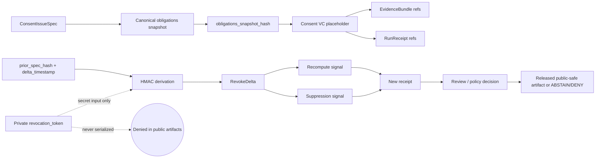

<!-- [KFM_META_BLOCK_V2]
doc_id: kfm://doc/TODO-NEEDS-UUID
title: ADR-0427: Consent VC + Revocation Delta v1
type: standard
version: v1
status: draft
owners: governance/policy/runtime
created: 2026-05-01
updated: 2026-05-02
policy_label: TODO-NEEDS-POLICY-LABEL
related: [docs/adr/README.md, schemas/governance/consent_vc.v1.json, schemas/governance/revoke_delta.v1.json, schemas/evidence/EvidenceBundle.v1.json, schemas/receipts/run_receipt.v1.json]
tags: [kfm, adr, governance, policy, consent, revocation, receipts, evidence]
notes: [Target path and related schema homes are PROPOSED pending mounted-repo verification. Generic EvidenceBundle and run_receipt schema authority remains NEEDS VERIFICATION. This revision preserves the local-only/no-network posture and adds ADR structure, alternatives, validation, rollback, and implementation-gate clarity.]
[/KFM_META_BLOCK_V2] -->

# ADR-0427: Consent VC + Revocation Delta v1

Local-only consent issuance placeholder, deterministic revocation delta derivation, and downstream suppression/recompute signaling for KFM governance flows.


> [!IMPORTANT]
> **ADR status:** `draft`  
> **Decision posture:** `PROPOSED` until schema homes, validator fixtures, and policy gates are ratified.  
> **Target path:** `docs/adr/ADR-0427-consent-vc-revocation-delta-v1.md` *(PROPOSED; verify against mounted repo conventions)*  
> **Core rule:** Consent and revocation objects are local, deterministic, auditable, no-network, and fail-closed. A KFM `Consent VC` in this ADR is a **local placeholder**, not an externally verified credential.

**Quick jumps:** [Decision](#decision) · [Context](#context) · [Operating law](#operating-law) · [Artifact boundaries](#artifact-boundaries) · [Deterministic derivation](#deterministic-derivation) · [Validation gates](#validation-gates) · [Suppression and recompute](#suppression-and-recompute-signaling) · [Rollback](#rollback-and-correction) · [Implementation slice](#proposed-implementation-slice) · [NEEDS VERIFICATION](#needs-verification)

---

## Evidence boundary

This ADR states KFM doctrine and a proposed implementation contract. It does **not** claim that the target repository already contains the named schemas, validators, policy files, receipt objects, or runtime behavior.

| Claim area | Truth posture | Boundary |
|---|---|---|
| KFM trust posture | CONFIRMED doctrine | KFM preserves evidence-first, map-first, time-aware, governed publication behavior. |
| This ADR file path | PROPOSED | Verify actual ADR naming and numbering in the mounted repo before landing. |
| Schema homes | NEEDS VERIFICATION | Do not create parallel authority between `contracts/`, `schemas/`, or `schemas/contracts/v1/` without an ADR. |
| Runtime behavior | UNKNOWN | No route names, DTOs, policy engine, test runner, CI workflow, or deployed behavior is claimed here. |
| External VC behavior | DENY for v1 | No live DID, OIDC, Sigstore, transparency log, or VC status-list dependency is admitted by this ADR. |

---

## Decision

KFM will adopt a **local-only Consent VC + Revocation Delta v1 posture** for deterministic testing and governed downstream suppression/recompute behavior.

This ADR defines three stable object families:

| Object family | Required identifier | Purpose | Status |
|---|---|---|---|
| Consent VC placeholder | `consent_vc_<hex>` | Represents locally issued consent and its obligations snapshot without contacting any external VC, DID, OIDC, Sigstore, transparency-log, or status-list service. | PROPOSED |
| Obligations snapshot | `sha256(canonical_json(obligations_snapshot))` | Carries the exact obligations burden into evidence, receipts, policy checks, and downstream review. | PROPOSED |
| Revocation Delta | `rvk_<hmac_hex>` | Deterministically represents a revocation event derived from a private token and revocation inputs. | PROPOSED |

**Core decision:** consent and revocation objects are local, deterministic, auditable, and fail-closed. They support KFM governance and testability without pretending that a live verifiable credential network or external trust service is present.

**Decision outcome:** `PROPOSED / draft`

This ADR becomes stronger only after:

- schema-home authority is ratified;
- no-network fixtures pass;
- token non-serialization tests pass;
- policy gates deny unsafe publication;
- downstream receipts show suppress/recompute behavior;
- evidence, receipt, runtime, UI, and governed-AI owners confirm field placement.

---

## Context

KFM needs a governance slice that can issue consent as a **verifiable-credential-style local placeholder**, carry consent obligations into evidence and receipts, and deterministically derive revocation deltas without live network dependencies.

Consent and revocation are not decorative metadata. They can change what downstream users are allowed to see, cite, recompute, publish, suppress, generalize, withdraw, or explain.

### Problem pressure

| Pressure | KFM risk if ignored | ADR response |
|---|---|---|
| Consent must be inspectable | Public outputs could cite or publish claims without visible obligations. | Persist `consent_vc_id` and `obligations_snapshot_hash` in governed artifacts. |
| Revocation must be deterministic | Tests and replay become fragile or dependent on external services. | Use local HMAC derivation for `revoke_delta_id`. |
| Secrets must not leak | `revocation_token` exposure weakens consent governance and can create replay/correlation risk. | Treat token as secret input only; deny serialization in public artifacts. |
| External identity networks are not admitted | DID/OIDC/Sigstore/status-list behavior could be implied without implementation proof. | Explicit local-only/no-network posture. |
| Suppression and recompute need receipts | Revocation could look like deletion instead of a governed state transition. | Emit receipt-backed suppression/recompute signals. |
| AI and map surfaces may stale out | Focus Mode, Evidence Drawer, map popups, and derived tiles could keep showing revoked evidence. | Downstream consumers must ABSTAIN, DENY, suppress, mark stale, or recompute as policy requires. |

---

## Operating law

### What this ADR admits

This ADR admits a **local deterministic stub** for consent issuance and revocation delta derivation.

It may be used for:

- no-network fixtures;
- local runtime tests;
- schema and validator development;
- proof-of-flow demonstrations;
- deterministic replay;
- downstream suppression/recompute signaling;
- policy gate development for revoked, uncertain, or obligation-changed evidence.

### What this ADR does not admit

This ADR does **not** admit:

- live DID resolution;
- live OIDC identity exchange;
- live Sigstore, Cosign, or transparency-log calls;
- live VC status-list calls;
- public serialization of `revocation_token`;
- public serialization of private signing material;
- automatic publication of revoked or recomputed artifacts;
- treating generated language as consent authority;
- treating a consent placeholder as externally verifiable proof;
- direct client access to secret-bearing, RAW, WORK, QUARANTINE, or unpublished revocation material.

> [!WARNING]
> `Consent VC` in this ADR means **KFM local placeholder**, not externally verified W3C VC compliance. Any future standards-grade VC integration requires a separate ADR, source review, policy gate, migration plan, network/security threat model, and testable failure behavior.

---

## Decision record

| Field | Value |
|---|---|
| ADR number | `ADR-0427` |
| Title | `Consent VC + Revocation Delta v1` |
| Status | `draft` |
| Selected option | Local-only deterministic consent placeholder with HMAC-derived revocation delta. |
| Rejected default | Live external VC/status-list integration in v1. |
| Primary risk controlled | Secret leakage, unverifiable external trust claims, stale downstream public artifacts. |
| Required follow-up | Schema-home ADR or ratification note; policy label decision; validator fixtures; receipt field placement review. |

### Alternatives considered

| Option | Disposition | Reason |
|---|---|---|
| Plain boolean consent flag | REJECTED | Too weak. It does not preserve obligations, provenance, revocation lineage, or recompute/suppression burden. |
| Silent deletion on revocation | REJECTED | Violates KFM auditability and correction lineage. Revocation is a governed state transition, not erasure. |
| Live VC/DID/OIDC/status-list integration now | DEFERRED | Requires external trust, network dependency, credentials, policy review, threat model, and implementation evidence not admitted by this ADR. |
| Non-deterministic revocation IDs | REJECTED | Weakens replay, fixture stability, receipt matching, and rollback inspection. |
| Local deterministic placeholder | SELECTED / PROPOSED | Supports deterministic tests, fail-closed policy development, local-only runtime, and downstream recompute/suppression proof. |

---

## Architecture sketch



The renderer, UI, AI layer, catalog, graph projection, tile output, story export, and published surfaces remain downstream of this governance flow. They may display or consume public-safe identifiers, hashes, reason codes, and review states. They must not receive the private `revocation_token`.

---

## Artifact boundaries

### Consent VC placeholder v1

A `ConsentVC` artifact records the issued placeholder and its obligation burden.

| Field | Required | Notes |
|---|---:|---|
| `schema_version` | yes | Fixed to `consent_vc.v1` for this ADR. |
| `consent_vc_id` | yes | Stable identifier in the form `consent_vc_<hex>`. Exact minting inputs remain NEEDS VERIFICATION unless the schema defines them. |
| `issued_at` | yes | ISO-8601 timestamp; canonical precision must be defined by schema. |
| `issuer_ref` | yes | Policy-safe issuer reference. |
| `subject_ref` | yes | Policy-safe subject reference; no unnecessary PII. |
| `consent_scope` | yes | What the consent covers. |
| `obligations_snapshot` | yes | Canonical obligation payload. |
| `obligations_snapshot_hash` | yes | `sha256(canonical_json(obligations_snapshot))`. |
| `evidence_refs` | yes | Evidence references supporting issuance authority, where applicable. |
| `local_signature_stub` | yes | Deterministic local-only signing stub; not an external signature. |
| `status` | yes | Suggested finite values: `active`, `superseded`, `revoked`. |

> [!NOTE]
> `consent_vc_id` generation is intentionally bounded here. The ADR fixes the identifier **shape and role**. The schema or implementation helper must ratify the canonical input set before KFM treats the ID derivation as authoritative.

### RevokeDelta v1

A `RevokeDelta` artifact records a deterministic revocation event without exposing the secret token.

| Field | Required | Notes |
|---|---:|---|
| `schema_version` | yes | Fixed to `revoke_delta.v1`. |
| `revoke_delta_id` | yes | Deterministic `rvk_<hmac_hex>` derived below. |
| `consent_vc_id` | yes | Consent placeholder affected by the delta. |
| `prior_spec_hash` | yes | Prior consent/evidence/release spec hash to revoke or suppress. |
| `delta_timestamp` | yes | Timestamp used in the HMAC message. |
| `obligations_snapshot_hash` | yes | Links revocation to the obligation burden known at issuance or latest ratified update. |
| `reason_code` | yes | Policy reason for revocation. Suggested examples: `consent_withdrawn`, `obligation_changed`, `sensitivity_reclassified`, `rights_uncertain`. |
| `suppression_actions` | yes | Public-safe actions requested downstream. |
| `recompute_targets` | yes | Derived artifacts that need rebuild, recheck, or withdrawal review. |
| `local_signature_stub` | yes | Deterministic local-only stub. |

### RevokeManifest v1

A `RevokeManifest` groups one or more revocation deltas for downstream action. Its exact schema home remains **NEEDS VERIFICATION**.

| Field | Required | Notes |
|---|---:|---|
| `schema_version` | yes | Suggested `revoke_manifest.v1`; final name NEEDS VERIFICATION. |
| `manifest_id` | yes | Deterministic or receipt-linked identifier; derivation not set by this ADR. |
| `revoke_delta_ids` | yes | One or more `rvk_<hmac_hex>` identifiers. |
| `affected_artifacts` | yes | Evidence, catalog, graph, tile, layer, story, AI, or release candidate refs. |
| `required_actions` | yes | Suppress, recompute, withdraw, require review, or no public action. |
| `receipt_refs` | yes | Receipts proving action, denial, or abstention. |
| `review_state` | yes | Review status for downstream publication or withdrawal. |

### EvidenceBundle and run receipt references

This ADR requires downstream artifacts to carry consent obligation references, but it does not claim that canonical generic schemas already exist in the mounted repo.

| Artifact | Required consent fields | Placement status |
|---|---|---|
| `EvidenceBundle.v1` | `consent_vc_id`, `obligations_snapshot_hash`, optional `revoke_delta_id` when applicable | PROPOSED under `schemas/evidence/EvidenceBundle.v1.json` pending schema-home ratification. |
| `run_receipt.v1` | `consent_vc_id`, `obligations_snapshot_hash`, `revoke_delta_id`, `suppression_or_recompute_action` | PROPOSED under `schemas/receipts/run_receipt.v1.json` pending schema-home ratification. |
| `AIReceipt.v1` | no token; may record consent/revocation state that constrained output | PROPOSED; exact home NEEDS VERIFICATION. |
| `LayerManifest.v1` | public-safe revocation, stale, suppress, or recompute state only | PROPOSED; exact home NEEDS VERIFICATION. |
| `RuntimeResponseEnvelope.v1` | finite outcome such as `ANSWER`, `ABSTAIN`, `DENY`, or `ERROR` when consent state affects response | PROPOSED; exact home NEEDS VERIFICATION. |

---

## Deterministic derivation

### Obligations snapshot hash

`obligations_snapshot_hash` is the SHA-256 hash of the canonical JSON obligations snapshot.

```text
obligations_snapshot_hash = sha256(canonical_json(obligations_snapshot)).hex()
```

**Canonicalization rule:** use the repo-approved canonical JSON helper if present. If no helper exists, this ADR proposes a strict canonical JSON profile for v1 and marks that profile **NEEDS VERIFICATION** before broad adoption.

### Revocation delta ID

Revocation ID derivation is fixed by this ADR. The following is pseudocode, not a repo implementation claim.

```text
prk = HMAC(key="kfm:revoke:v1", message=revocation_token)
k = HMAC(key=prk, message="kfm:revoke:v1:id")
message = prior_spec_hash + "|" + delta_timestamp
revoke_delta_id = "rvk_" + HMAC(key=k, message=message).hex()
```

Implementation notes:

- HMAC output is lower-case hexadecimal.
- String inputs must be UTF-8 encoded before HMAC.
- `revocation_token` is a secret byte/string input and must not be serialized.
- `delta_timestamp` must be canonical and stable for deterministic replay.
- The delimiter is the literal ASCII pipe character: `|`.
- Fixture tests should prove deterministic sameness for identical inputs and expected divergence for changed token/spec/timestamp inputs.

```python
import hmac
from hashlib import sha256


def hmac_sha256(key: bytes, message: bytes) -> bytes:
    return hmac.new(key, message, sha256).digest()


def derive_revoke_delta_id(
    revocation_token: str,
    prior_spec_hash: str,
    delta_timestamp: str,
) -> str:
    """Illustrative helper only. Adapt to the repo-approved crypto/canonicalization helper."""
    prk = hmac_sha256(b"kfm:revoke:v1", revocation_token.encode("utf-8"))
    key = hmac_sha256(prk, b"kfm:revoke:v1:id")
    message = f"{prior_spec_hash}|{delta_timestamp}".encode("utf-8")
    return "rvk_" + hmac_sha256(key, message).hex()
```

---

## No-network posture

The v1 implementation posture is local-only.

| Surface | Allowed | Denied |
|---|---|---|
| Issuance | Deterministic local signing stub. | DID, OIDC, remote VC issuer, Sigstore, transparency log. |
| Revocation | Deterministic local HMAC delta. | VC status-list lookup, remote revocation registry, live network callback. |
| Tests | Local fixtures only. | External service dependency or internet-required CI. |
| Public output | IDs, hashes, reason codes, receipts, review states. | `revocation_token`, private signing key material, raw secret-bearing fixtures. |
| UI / map / Focus Mode | Public-safe revocation state, stale/suppressed/recompute state, and finite outcomes. | Direct token, secret-bearing consent material, or unreviewed revocation internals. |

A network attempt during issuance or revocation validation is a test failure unless a later ADR explicitly admits that integration.

---

## Privacy and secret handling

`revocation_token` is a secret and is never a KFM public artifact.

It must be excluded from:

- `ConsentVC`;
- `EvidenceBundle`;
- `run_receipt`;
- `AIReceipt`;
- `RevokeDelta`;
- `RevokeManifest`;
- catalog records;
- graph/triplet projections;
- MapLibre layer manifests;
- Evidence Drawer payloads;
- Focus Mode context;
- exported story or report artifacts;
- public fixtures;
- public or semi-public logs.

Test fixtures may use a fake token only when clearly labeled as fixture-only and never reused for production.

> [!CAUTION]
> A redacted token is still risky if it enables correlation or replay. Public outputs should carry `revoke_delta_id`, not token-derived intermediate values, unless the schema and policy team explicitly ratify them.

---

## Suppression and recompute signaling

Revocation is a governed state transition, not a file move and not silent deletion.

When a `RevokeDelta` is accepted:

1. identify affected EvidenceBundle, catalog, layer, graph, tile, summary, Focus Mode, and release artifacts;
2. emit suppression and/or recompute candidates;
3. block public publication until policy and review state are known;
4. emit a run receipt that references `revoke_delta_id`;
5. record recompute targets and derivative invalidation reasons;
6. keep correction and rollback lineage inspectable.

### Minimum affected surfaces

| Surface | Required behavior after revocation |
|---|---|
| EvidenceBundle | Mark applicable consent/revocation state and obligation hash. |
| Catalog / release candidate | Block or mark stale until review and recompute complete. |
| Derived tiles / layers | Suppress or invalidate public-safe derivatives as required. |
| Graph/triplet projection | Rebuild derived projection if revoked claim participates in public graph. |
| Evidence Drawer | Show revoked/suppressed/recompute state, not stale confidence. |
| Focus Mode | ABSTAIN or DENY when consent state invalidates the evidence context. |
| Receipts | Preserve the revocation action and downstream decision trail. |
| Public exports | Prevent stale or revoked outputs unless review explicitly allows a public-safe correction notice. |

### Suggested finite downstream actions

```yaml
proposal_note: illustrative enum proposal; schema ratification required
suppression_or_recompute_action:
  - suppress_public_output
  - recompute_derivative
  - withdraw_release_candidate
  - require_review
  - mark_stale_pending_review
  - no_public_action_required
```

---

## Validation gates

Validators must fail closed.

| Gate | PASS condition | FAIL condition |
|---|---|---|
| `consent.id.shape` | `consent_vc_id` matches `^consent_vc_[0-9a-f]+$`. | Missing ID, wrong prefix, non-hex suffix. |
| `obligations.hash.match` | Hash equals SHA-256 of canonical obligations snapshot. | Hash mismatch or non-canonical input. |
| `revoke.id.shape` | `revoke_delta_id` matches `^rvk_[0-9a-f]{64}$`. | Missing ID, wrong prefix, non-hex suffix, wrong length. |
| `revoke.id.deterministic` | Same token + `prior_spec_hash` + `delta_timestamp` yields same `revoke_delta_id`. | Non-deterministic output. |
| `revoke.id.separation` | Changed token/spec/timestamp changes derived ID in controlled fixtures. | Unexpected equality for varied fixture inputs. |
| `secret.no_serialize` | `revocation_token` absent from public artifacts, receipts, manifests, logs, and fixtures. | Token appears anywhere outside secret input channel. |
| `network.local_only` | No network calls are made. | DNS, HTTP, OIDC, DID, Sigstore, status-list, or transparency-log call. |
| `receipt.references.delta` | Suppression/recompute receipt references applicable `revoke_delta_id`. | Revocation action lacks receipt linkage. |
| `publication.fail_closed` | Revoked or uncertain artifacts cannot publish without review decision. | Public release proceeds without policy/review state. |
| `ai.context.safe` | Focus Mode receives public-safe revocation state only. | Focus Mode receives token or secret-bearing context. |
| `layer.state.safe` | Layer manifests show public-safe stale/suppressed/recompute state only. | Map layer continues to present revoked evidence as current. |

---

## Policy expectations

Policy must treat revoked, uncertain, missing, or mismatched consent as public-release blocking unless a reviewed exception exists.

| Condition | Default outcome |
|---|---|
| Missing `consent_vc_id` where consent is required | DENY publication or ABSTAIN from consequential answer. |
| Missing `obligations_snapshot_hash` | DENY publication or require review. |
| Hash mismatch | DENY and quarantine affected candidate. |
| `revocation_token` found in public artifact | ERROR, quarantine artifact, require security review. |
| Accepted `RevokeDelta` affects released artifact | Suppress, mark stale, withdraw candidate, or recompute according to policy. |
| Future live VC integration requested | DENY in this ADR; require separate ADR. |

---

## Rollback and correction

Rollback is performed by replaying prior non-revoked specs and emitting a new receipt.

A rollback receipt must reference:

- the applicable `revoke_delta_id`;
- the prior non-revoked `spec_hash`;
- the recompute or suppression action;
- the review decision that authorizes rollback;
- any artifacts rebuilt, suppressed, or withdrawn;
- the resulting publication state.

Rollback must not erase the revoked state. It records a new governed transition over prior evidence.

### Rollback triggers

Rollback or withdrawal review is required when:

- token material appears in a public artifact;
- revoked evidence remains visible as current;
- a recompute target was missed;
- a consent obligation hash mismatch reaches a release candidate;
- a schema-home conflict creates parallel definitions;
- a validator permits network dependency in v1;
- Focus Mode answers from revoked evidence instead of ABSTAIN/DENY.

Rollback target: `ROLLBACK_TARGET_TBD_AFTER_REPO_INSPECTION`

---

## Contracts and schema impact

> [!IMPORTANT]
> This ADR must not create parallel schema authority. If the mounted repo already has canonical `contracts/`, `schemas/`, `jsonschema/`, or `schemas/contracts/v1/` conventions, follow the existing authority or record a schema-home ADR before landing machine files.

| Contract or schema | Change type | Status |
|---|---|---|
| `schemas/governance/consent_vc.v1.json` | Add | PROPOSED |
| `schemas/governance/revoke_delta.v1.json` | Add | PROPOSED |
| `schemas/evidence/EvidenceBundle.v1.json` | Add/update consent fields | PROPOSED / NEEDS VERIFICATION |
| `schemas/receipts/run_receipt.v1.json` | Add/update revocation action fields | PROPOSED / NEEDS VERIFICATION |
| `schemas/governance/revoke_manifest.v1.json` | Add if grouped revocation actions are required | PROPOSED / exact home NEEDS VERIFICATION |
| policy rule for token serialization | Add | PROPOSED |
| policy rule for no-network v1 | Add | PROPOSED |
| policy rule for revoked evidence publication | Add | PROPOSED |
| UI/Evidence Drawer payload fields | Add public-safe state only | PROPOSED |
| Runtime/Focus response envelope | Add consent/revocation constraint state | PROPOSED |

---

## Proposed implementation slice

This is the smallest useful implementation slice for this ADR.

| Step | File or surface | Status |
|---:|---|---|
| 1 | `docs/adr/ADR-0427-consent-vc-revocation-delta-v1.md` | PROPOSED |
| 2 | `schemas/governance/consent_vc.v1.json` | PROPOSED; schema home NEEDS VERIFICATION |
| 3 | `schemas/governance/revoke_delta.v1.json` | PROPOSED; schema home NEEDS VERIFICATION |
| 4 | `schemas/evidence/EvidenceBundle.v1.json` consent/revocation fields | PROPOSED; cross-lane ratification required |
| 5 | `schemas/receipts/run_receipt.v1.json` revocation action fields | PROPOSED; cross-lane ratification required |
| 6 | `tests/fixtures/governance/consent_vc/` | PROPOSED; no-network fixtures only |
| 7 | `tools/validators/governance/validate_consent_revocation.py` or repo-native equivalent | PROPOSED |
| 8 | Policy rule: deny token serialization | PROPOSED |
| 9 | Policy rule: deny network dependency for v1 | PROPOSED |
| 10 | Receipt fixture proving suppress/recompute path | PROPOSED |
| 11 | Runtime fixture proving revoked evidence returns `ABSTAIN`, `DENY`, suppress, stale, or recompute state | PROPOSED |

### Definition of done for v1 fixtures

- [ ] Deterministic `obligations_snapshot_hash` fixture passes.
- [ ] Deterministic `revoke_delta_id` fixture passes.
- [ ] Negative fixture proves token cannot appear in public artifacts.
- [ ] Network attempt fixture fails closed.
- [ ] Revoked evidence fixture causes downstream ABSTAIN, DENY, suppress, stale, or recompute state.
- [ ] Receipt fixture references `revoke_delta_id` and action.
- [ ] EvidenceBundle fixture includes consent obligation references without token material.
- [ ] Layer/UI fixture shows public-safe revoked/stale/suppressed state.
- [ ] Schema-home ADR or ratification note records why the chosen paths are canonical.

---

## Consequences

### Positive

- Preserves proof, receipt, evidence, and revoke-manifest separation.
- Enables deterministic local tests and replay.
- Keeps revocation tokens private.
- Allows downstream suppression and recompute behavior to be validated before live identity integrations.
- Makes consent obligations inspectable without making model output, map layers, graph edges, or summaries sovereign.
- Gives UI and governed-AI surfaces clear finite behavior when consent state changes.

### Tradeoffs

- A local placeholder is not an externally verifiable credential.
- Schema-home ambiguity must be resolved before broad reuse.
- Deterministic stubs are suitable for tests and controlled local flows, not proof of external trust.
- A future live VC/status-list integration will require a separate threat model, policy review, network boundary, and migration plan.
- Revocation receipts preserve history; they do not erase prior states.

---

## NEEDS VERIFICATION

| Item | Why it matters | Proposed resolver |
|---|---|---|
| Canonical schema authority for `EvidenceBundle.v1.json` | This ADR proposes generic evidence schema files, but repo authority is not confirmed here. | Cross-lane schema-home ADR and mounted repo inspection. |
| Canonical schema authority for `run_receipt.v1.json` | Receipts recur across KFM doctrine, but exact canonical home is not confirmed here. | Cross-lane schema-home ADR and receipt object map. |
| Exact canonical JSON profile | Hash determinism depends on canonicalization. | Ratify repo helper or schema profile. |
| `consent_vc_id` derivation inputs | ADR defines ID shape, not final canonical minting input set. | `consent_vc.v1` schema and validator fixture. |
| Policy label for this ADR | Consent governance may be public-safe as doctrine or restricted as policy detail. | Governance/policy owner decision. |
| Secret input storage | Token handling must not leak through logs or fixtures. | Runtime/security review. |
| Test runner and validator language | No mounted repo evidence confirms stack. | Adapt to repo-native test framework after inspection. |
| Future live VC integration | Local placeholder must not become accidental standards claim. | Separate ADR before any live DID/OIDC/status-list/Sigstore dependency. |
| Review ownership | Current owners come from the draft source and are not independently repo-confirmed here. | Confirm maintainers/CODEOWNERS after repo inspection. |
| Rollback target | Actual rollback target depends on repo release/proof conventions. | Confirm release/correction object family in repo. |

---

## Review checklist

- [ ] Owners confirm this ADR remains `draft` until schema-home and validator decisions are ratified.
- [ ] Governance confirms `revocation_token` never appears in public outputs.
- [ ] Policy confirms fail-closed behavior for revoked or uncertain consent state.
- [ ] Runtime confirms no-network issuance/revocation tests.
- [ ] Evidence/receipts owners confirm field names and schema homes.
- [ ] UI/AI surfaces confirm revoked consent produces visible ABSTAIN, DENY, suppress, stale, or recompute state.
- [ ] Security confirms token handling, fixture labeling, and log exclusion.
- [ ] Documentation owner confirms related ADR index and successor links.
- [ ] Release owner confirms rollback target and correction notice behavior.

---

## Supersession and future ADRs

This ADR is intentionally narrow.

A future ADR is required for:

- externally verifiable W3C VC behavior;
- DID resolution;
- OIDC identity exchange;
- Sigstore/Cosign/transparency-log-backed issuance;
- remote VC status lists;
- production key management;
- public verification UX;
- cross-organization trust federation;
- migration from local placeholder IDs to externally verifiable credentials.

Until such an ADR is accepted, this ADR admits only the local-only placeholder and deterministic revocation delta behavior described here.

---

## Summary

ADR-0427 gives KFM a deterministic, local-only consent and revocation control slice that can be tested before external identity infrastructure exists. It preserves KFM’s evidence-first posture by carrying obligations into evidence and receipts, deriving revocation deltas without network calls, suppressing or recomputing downstream derivatives through receipts, and treating revocation tokens as private secret inputs rather than public artifacts.
