<!-- [KFM_META_BLOCK_V2]
doc_id: kfm://doc/TODO-ASSIGN-UUID
title: ADR-0431 — Atmosphere / Air Knowledge-Character Boundary
type: standard
version: v1
status: draft
owners: TODO-VERIFY: atmosphere-air domain steward, documentation steward, schema/contract steward, policy steward
created: TODO-VERIFY-YYYY-MM-DD
updated: 2026-05-06
policy_label: TODO-VERIFY-public-or-restricted
related: [./README.md, ./ADR-0001-schema-home.md, ./ADR-0208-domain-lane-template.md, ../domains/atmosphere_air/README.md, ../domains/atmosphere_air/ADR-0001-atmosphere-air-lane.md, NEEDS_VERIFICATION: ../../schemas/contracts/v1/atmosphere/, NEEDS_VERIFICATION: ../../data/registry/atmosphere/]
tags: [kfm, adr, atmosphere-air, atmosphere, air-quality, knowledge-character, source-role, evidence, governed-domain]
notes: [Unique ADR filename checked against docs/adr on main before drafting. doc_id, owners, created date, policy_label, ADR register allocation, and machine-path enforcement remain NEEDS VERIFICATION before merge.]
[/KFM_META_BLOCK_V2] -->

<a id="top"></a>

# ADR-0431 — Atmosphere / Air Knowledge-Character Boundary

Defines the governed boundary between atmosphere/air documentation, machine-contract slugs, source roles, knowledge characters, and public-safe release behavior.

| Field | Value |
|---|---|
| **Proposed target path** | `docs/adr/ADR-0431-atmosphere-air-knowledge-character-boundary.md` |
| **Filename uniqueness check** | `CONFIRMED` no file at this exact path was found on `main` during this session; ADR register allocation still `NEEDS VERIFICATION` |
| **Related prior lane ADR** | `docs/domains/atmosphere_air/ADR-0001-atmosphere-air-lane.md` |
| **Recommended prior-file action** | Keep prior lane ADR as lineage or convert it to a successor pointer after this ADR is accepted |
| **Requested path note** | The user-supplied `docs/ADR/` casing is not the inspected repo convention; use lowercase `docs/adr/` unless a later ADR changes it |
| **ADR status** | `PROPOSED` |
| **Decision type** | Domain documentation boundary, machine-schema compatibility, source-role discipline, knowledge-character policy, public-surface governance |
| **Applies to** | Atmosphere / Air docs, source descriptors, parameter registries, schemas, validators, layer descriptors, Evidence Drawer payloads, Focus Mode envelopes, release candidates |
| **Does not do** | Does not activate live sources, publish artifacts, assert CI enforcement, create runtime routes, or prove MapLibre / Focus Mode implementation |
| **Rollback** | Revert this file before adoption, or supersede it later; preserve the decision history and successor links |

<p align="center">
  
  
  
  
</p>

<p align="center">
  <a href="#status">Status</a> ·
  <a href="#context">Context</a> ·
  <a href="#decision">Decision</a> ·
  <a href="#knowledge-character-rules">Knowledge characters</a> ·
  <a href="#path-and-slug-rules">Path and slug rules</a> ·
  <a href="#validation-and-acceptance">Validation</a> ·
  <a href="#rollback-and-supersession">Rollback</a>
</p>

> [!IMPORTANT]
> This ADR is a **decision record**, not implementation proof. Treat schemas, validators, policies, routes, CI checks, source registries, Evidence Drawer payloads, Focus Mode behavior, and public artifacts as `PROPOSED` or `NEEDS VERIFICATION` until confirmed in the active checkout and validation evidence.

---

## Status

| Status item | Value |
|---|---|
| **Decision state** | `PROPOSED` |
| **Merge posture** | Ready for steward review after ADR register update and prior-file successor handling |
| **Truth posture** | `CONFIRMED` repo/doc evidence where inspected; `PROPOSED` decision; `UNKNOWN` runtime and enforcement depth |
| **Primary protection** | Prevents atmosphere/air evidence from collapsing observations, public AQI reports, regulatory archives, model fields, remote-sensing masks, advisories, and derived fusion products into one undifferentiated “air layer” |
| **Primary risk** | A public map, Focus answer, or summary could overstate modeled, indexed, remote-sensed, stale, or rights-unclear information as observed public truth |
| **Review burden** | Domain steward, documentation steward, schema/contract steward, policy/release reviewer |

---

## Evidence boundary

This ADR is grounded in three evidence layers:

| Evidence layer | Status | Use in this ADR | Limit |
|---|---|---|---|
| Current repository connector evidence | `CONFIRMED` for inspected files | Existing short atmosphere-air lane ADR, adjacent domain README, repo-wide ADR index, schema-home ADR, domain-lane template, lowercase `docs/adr/` convention | Does not prove uninspected files, tests, workflows, runtime routes, or deployment behavior |
| Attached KFM doctrine and domain reports | `CONFIRMED doctrine / LINEAGE` | Directory discipline, atmosphere/air knowledge-character rules, KFM lifecycle, artifactization, MapLibre/Focus boundaries | Prior PDF plans are not current implementation proof |
| Current visible workspace scan | `CONFIRMED` | `/mnt/data` contains PDFs, not a mounted KFM checkout | Does not mean the GitHub repository is absent; it means it was not locally mounted |

**Verification rule:** if this ADR conflicts with a stronger accepted ADR, current repo convention, schema-home decision, or verified implementation evidence, update or supersede this ADR rather than creating a parallel authority path.

---

## Context

The existing atmosphere-air lane ADR is intentionally small. It states that `docs/domains/atmosphere_air/` is the documentation lane and that machine schema slug compatibility should remain under `atmosphere` until superseded. That decision is directionally sound, but too thin for the risk carried by this lane.

Atmosphere/air is not one knowledge type. It can include:

- observed station or sensor measurements;
- public AQI and NowCast-style reports;
- regulatory or archive records;
- low-cost sensor networks;
- meteorological context;
- smoke, aerosol, fire, visibility, and remote-sensing masks;
- forecast, reanalysis, hindcast, chemistry, transport, or smoke model fields;
- baseline, anomaly, and temporal support objects;
- advisories, alerts, public notices, and public health messaging;
- derived or fused products.

Those families are useful together, but they are not interchangeable. KFM’s public value is the inspectable claim, not the map tile, graph edge, model field, smoke mask, AQI number, generated summary, or rendered popup.

This ADR expands the prior decision into a repo-wide decision record because it affects multiple responsibility roots:

1. `docs/domains/atmosphere_air/` for human domain documentation;
2. `schemas/contracts/v1/atmosphere/` or repo-equivalent for machine validation;
3. `data/registry/atmosphere/` or repo-equivalent for source and parameter registries;
4. `policy/atmosphere/`, validators, tests, and public delivery gates;
5. governed API, MapLibre, Evidence Drawer, Focus Mode, release, and rollback surfaces when they become implemented.

<p align="right"><a href="#top">Back to top ↑</a></p>

---

## Decision

Adopt **Atmosphere / Air Knowledge-Character Boundary** as the governing ADR for atmosphere-air lane interpretation and machine-slug compatibility.

### 1. Human documentation lane

The human-facing domain lane remains:

```text
docs/domains/atmosphere_air/
```

This is the appropriate home for the Atmosphere / Air README, architecture notes, source-role explanations, knowledge-character rules, runbooks, validation status, migration notes, and lane-specific support docs.

### 2. Repo-wide ADR filename

Use this unique ADR filename:

```text
docs/adr/ADR-0431-atmosphere-air-knowledge-character-boundary.md
```

Do not keep multiple active ADRs that make competing decisions for the same atmosphere/air boundary. If the prior domain-lane ADR remains, mark it as lineage or a successor pointer.

### 3. Machine slug compatibility

Until a stronger accepted ADR supersedes this decision, machine-oriented homes should continue to use the `atmosphere` slug:

```text
schemas/contracts/v1/atmosphere/
data/registry/atmosphere/
data/fixtures/atmosphere/
tools/validators/atmosphere/
policy/atmosphere/
tests/atmosphere/
```

This avoids creating a second machine namespace such as `atmosphere_air` without migration evidence.

### 4. Required knowledge-character declaration

Every consequential atmosphere/air artifact must declare:

- `source_role`;
- `knowledge_character`;
- `evidence_refs` where the artifact supports a public or semi-public claim;
- source payload hash or equivalent provenance link where applicable;
- transform/spec hash where transformed;
- rights/public-release posture;
- review state;
- release state;
- freshness or temporal scope where relevant.

### 5. Public-surface rule

Map layers, popups, Evidence Drawer payloads, exports, Focus Mode answers, and public API responses must consume governed envelopes or released artifacts only. They must not read directly from RAW, WORK, QUARANTINE, internal canonical stores, proof-candidate internals, direct model runtimes, or unpublished candidate data.

### 6. Source disagreement rule

Do not force atmospheric disagreement into a single truth. If sources disagree, preserve the conflict and expose source role, knowledge character, freshness, rights posture, review state, and EvidenceRefs. A fusion product may summarize disagreement only as `DERIVED_FUSION`.

<p align="right"><a href="#top">Back to top ↑</a></p>

---

## Knowledge-character rules

Every atmosphere/air object must say what kind of knowledge it is before it can be promoted or exposed.

| Knowledge character | Boundary | Must never masquerade as |
|---|---|---|
| `OBSERVED_SENSOR` | Ground or station observation with site, method, instrument, time, and source context | AQI report, model field, remote mask, or fusion product |
| `PUBLIC_AQI_REPORT` | AQI, NowCast, public index, or agency report | Raw concentration measurement |
| `REGULATORY_ARCHIVE` | Quality-assured or archival evidence | Live state unless temporal scope supports it |
| `LOW_COST_SENSOR` | Contributor or consumer sensor network with correction and caveat burden | Regulatory truth or unrestricted public observation |
| `ATMOSPHERIC_MODEL_FIELD` | Forecast, reanalysis, hindcast, transport, aerosol, smoke, or chemistry model field | Observed measurement |
| `REMOTE_SENSING_MASK` | Smoke, AOD, fire, aerosol, haze, cloud, or classification mask | Surface exposure or PM concentration |
| `CLIMATE_ANOMALY_CONTEXT` | Normals, anomalies, baseline, hindcast, reconstruction, or downscaling context | Emergency alert or live hazard state |
| `DERIVED_FUSION` | Interpolation, consensus, bias correction, ensemble, or fused product | Canonical source observation |
| `METEOROLOGICAL_CONTEXT` | Wind, temperature, humidity, pressure, stability, boundary layer, or transport support | Air-quality concentration unless independently measured |
| `VISIBILITY_AND_AEROSOL_CONTEXT` | Visibility, haze, AOD, opacity, aerosol burden, optical context | PM concentration without explicit model and assumptions |
| `FIRE_AND_EMISSIONS_CONTEXT` | Fire hotspots, smoke-source indicators, emissions inventory, or attribution hint | Exposure measurement |
| `ALERT_AND_ADVISORY_CONTEXT` | Agency notice, health message, public recommendation, alert, or advisory | Sensor observation or model field |
| `NETWORK_AND_SITE_CONTEXT` | Station ID, cadence, provider topology, siting caveat, instrument metadata, or station health | Measurement value |
| `BASELINE_AND_TEMPORAL_SUPPORT` | Climatology, rolling baseline, freshness window, persistence, or hysteresis rule | Claim by itself without scoped target evidence |

> [!WARNING]
> The lane must deny or abstain when an artifact’s knowledge character is missing, contradictory, or overclaimed.

---

## Path and slug rules

| Area | Decision | Status |
|---|---|---|
| Repo-wide ADR file | `docs/adr/ADR-0431-atmosphere-air-knowledge-character-boundary.md` | `PROPOSED / exact path not found on main during this session` |
| Domain README and docs | `docs/domains/atmosphere_air/` | `CONFIRMED inspected repo convention for adjacent README and prior lane ADR` |
| Prior lane ADR | `docs/domains/atmosphere_air/ADR-0001-atmosphere-air-lane.md` | `CONFIRMED existing lineage file` |
| Repo-wide ADR directory | `docs/adr/` | `CONFIRMED inspected repo convention` |
| Requested `docs/ADR/` spelling | Do not introduce as a new path | `REJECTED unless repo convention changes through ADR` |
| Machine schema slug | `atmosphere` | `PROPOSED / compatibility-preserving` |
| Source and parameter registry slug | `atmosphere` | `PROPOSED / compatibility-preserving` |
| Tests, validators, policy slug | `atmosphere` | `PROPOSED / compatibility-preserving` |
| Future slug change | Requires ADR, compatibility map, fixtures, migration notes, and rollback plan | `REQUIRED` |

### Relative links from this ADR

| Target | Relative link | Status |
|---|---|---|
| ADR index | [`./README.md`](./README.md) | `CONFIRMED inspected file` |
| Schema-home ADR | [`./ADR-0001-schema-home.md`](./ADR-0001-schema-home.md) | `CONFIRMED inspected file` |
| Domain-lane template | [`./ADR-0208-domain-lane-template.md`](./ADR-0208-domain-lane-template.md) | `CONFIRMED inspected file` |
| Atmosphere / Air domain README | [`../domains/atmosphere_air/README.md`](../domains/atmosphere_air/README.md) | `CONFIRMED inspected file` |
| Prior atmosphere lane ADR | [`../domains/atmosphere_air/ADR-0001-atmosphere-air-lane.md`](../domains/atmosphere_air/ADR-0001-atmosphere-air-lane.md) | `CONFIRMED inspected file` |
| Machine schemas | `../../schemas/contracts/v1/atmosphere/` | `NEEDS VERIFICATION` |
| Source registry | `../../data/registry/atmosphere/` | `NEEDS VERIFICATION` |

<p align="right"><a href="#top">Back to top ↑</a></p>

---

## Governed lifecycle

```mermaid
flowchart LR
  source["SourceDescriptor<br/>source_role + knowledge_character<br/>rights + verification"] --> raw["RAW<br/>source payload<br/>not public"]
  raw --> work["WORK<br/>normalization + QC<br/>unit discipline"]
  work --> processed["PROCESSED<br/>validated candidate"]
  work --> quarantine["QUARANTINE<br/>rights / schema / evidence / policy failure"]
  processed --> catalog["CATALOG / TRIPLET<br/>catalog closure + relation projection"]
  catalog --> proof["PROOF CANDIDATE<br/>EvidenceBundle + DecisionEnvelope"]
  proof --> review["REVIEW<br/>policy + steward + release checks"]
  review --> published["PUBLISHED<br/>released artifact + rollback target"]
  published --> api["Governed API<br/>finite envelope"]
  api --> ui["Map shell<br/>Evidence Drawer<br/>Focus Mode"]

  ui -. "no direct access" .-> raw
  ui -. "no direct access" .-> work
  ui -. "no direct access" .-> quarantine
```



### Lifecycle obligations

| Stage | Atmosphere / Air obligation |
|---|---|
| `SOURCE EDGE` | Admit a source only through descriptor-first review; record role, rights, cadence, terms, and public-release posture. |
| `RAW` | Preserve source-native payloads and retrieval context; never expose directly to public clients. |
| `WORK` | Normalize units, retain raw values, compute transform hashes, run QC, and keep station/model/site context. |
| `QUARANTINE` | Hold records with missing rights, missing source role, missing knowledge character, schema failures, unresolved sensitivity, or unsupported public use. |
| `PROCESSED` | Keep normalized candidate records, never silently discard root records, and retain raw-to-normalized traceability. |
| `CATALOG / TRIPLET` | Build catalog/provenance candidates and relation projections without replacing source evidence. |
| `PROOF CANDIDATE` | Resolve EvidenceRefs, source roles, freshness, review state, policy decisions, and catalog closure. |
| `PUBLISHED` | Release only public-safe artifacts with release manifest, rollback target, correction path, and governed access. |

---

## Deny and abstain conditions

| Reason code | Condition | Outcome |
|---|---|---|
| `ATMOS_MISSING_KNOWLEDGE_CHARACTER` | Artifact lacks `knowledge_character` | `DENY` |
| `ATMOS_MISSING_SOURCE_ROLE` | Source descriptor or artifact lacks `source_role` | `DENY` |
| `ATMOS_MISSING_RIGHTS` | Rights absent, unresolved, or incompatible with requested release | `DENY` |
| `ATMOS_UNKNOWN_RIGHTS_PUBLIC` | Public output requested while rights are `UNKNOWN` | `DENY` |
| `ATMOS_MISSING_EVIDENCE_REFS` | Consequential record lacks resolvable EvidenceRefs | `ABSTAIN` or `DENY` |
| `ATMOS_MISSING_SOURCE_PAYLOAD_HASH` | Normalized record cannot trace to source payload | `DENY` |
| `ATMOS_MISSING_TRANSFORM_HASH` | Transform identity missing for derived object | `DENY` |
| `ATMOS_PUBLIC_RELEASE_FALSE` | Source descriptor blocks public release | `DENY` |
| `ATMOS_MODEL_AS_OBSERVED` | Model field labeled as observed | `DENY` |
| `ATMOS_AQI_AS_CONCENTRATION` | AQI treated as raw concentration | `DENY` |
| `ATMOS_AOD_AS_PM25` | AOD treated as PM2.5 without model, assumptions, and evidence | `DENY` |
| `ATMOS_SMOKE_AS_EXPOSURE` | Smoke mask treated as exposure measurement | `DENY` |
| `ATMOS_ANOMALY_AS_ALERT` | Climate anomaly promoted as emergency alert without governed model-card support | `DENY` |
| `ATMOS_PUBLIC_INTERNAL_ACCESS` | Public client attempts RAW, WORK, QUARANTINE, or internal-store access | `DENY` |
| `ATMOS_STALE_LIVE_CLAIM` | Live/current claim requested without freshness support | `ABSTAIN` or stale-scoped response |
| `ATMOS_UNRESOLVED_CONFLICT` | Sources disagree and no reviewed fusion/explanation exists | `ABSTAIN` or conflict-scoped response |

---

## Alternatives considered

| Alternative | Decision | Rationale |
|---|---|---|
| Keep the prior short ADR unchanged | Rejected | It preserves a path choice but does not protect the lane from knowledge-character collapse or public overclaiming. |
| Keep the new ADR under `docs/domains/atmosphere_air/` | Rejected for this request | The user asked for a name that does not exist in the ADR directory, and this decision affects cross-root machine slug, registry, policy, validation, and public-surface behavior. |
| Use `docs/ADR/` with uppercase spelling | Rejected | Inspected repo convention uses lowercase `docs/adr/`. |
| Reuse `ADR-0001-*` | Rejected | `docs/adr/ADR-0001-schema-home.md` already exists, and the atmosphere lane already has a domain-local `ADR-0001-*` file. |
| Rename all machine paths to `atmosphere_air` | Rejected for now | Would create schema and registry churn without verified migration need. Preserve `atmosphere` as the machine slug until an ADR changes it. |
| Collapse all atmosphere/air products into one layer | Rejected | Violates KFM evidence posture and makes source role, freshness, model/observation distinction, and policy state invisible. |
| Publish first, reconcile later | Rejected | KFM requires promotion, evidence, rights, policy, review, correction, and rollback before public release. |

---

## Consequences

### Positive

- Gives the lane a unique ADR filename that is not already present in the inspected repo-wide ADR directory.
- Keeps the decision in the repo-wide ADR ledger because it affects documentation, schemas, registries, validators, policy, and public delivery.
- Preserves the verified human domain path at `docs/domains/atmosphere_air/`.
- Avoids machine-schema path churn by keeping the `atmosphere` slug.
- Makes `source_role` and `knowledge_character` non-optional trust fields.
- Protects public users from AQI/concentration, AOD/PM2.5, model/observation, mask/exposure, and fusion/source confusion.
- Gives Evidence Drawer and Focus Mode clear obligations before they explain atmosphere/air claims.
- Provides denial codes that can become policy and validator fixtures.

### Costs

- The ADR index needs a new entry for `ADR-0431`.
- Existing references to the old atmosphere lane ADR need successor links or review notes.
- Validators and fixtures must be added before the decision can be treated as enforced.
- Some attractive map or Focus Mode features must wait until source roles, EvidenceRefs, rights, freshness, and release state are proven.
- Maintainers must keep human documentation and machine-path compatibility explicit.

### Tradeoff accepted

This ADR favors slower, clearer trust boundaries over faster atmospheric layer expansion. That tradeoff is consistent with KFM’s cite-or-abstain posture and public-safe release discipline.

<p align="right"><a href="#top">Back to top ↑</a></p>

---

## Validation and acceptance

This ADR remains `PROPOSED` until the following are true.

### Documentation acceptance

- [ ] Maintainers confirm final filename and ADR number allocation.
- [ ] `docs/adr/README.md` lists `ADR-0431` with the correct status.
- [ ] Prior domain-lane ADR is updated with a successor link, retained as lineage, or superseded through a reviewed rename.
- [ ] `doc_id`, owners, created date, and policy label are filled or intentionally retained as reviewable placeholders.
- [ ] `docs/domains/atmosphere_air/README.md` links to this ADR.
- [ ] `docs/domains/README.md` or the active domain index references the atmosphere/air lane consistently.
- [ ] No new uppercase `docs/ADR/` path is introduced.

### Schema and registry acceptance

- [ ] Schema-home ADR status is checked before adding or moving machine schemas.
- [ ] Machine schemas use `schemas/contracts/v1/atmosphere/` or the accepted repo-equivalent path.
- [ ] Source and parameter registry paths use `data/registry/atmosphere/` or the accepted repo-equivalent path.
- [ ] Any `atmosphere_air` machine slug is documented as alias, migration, or rejection.

### Policy and validator acceptance

- [ ] Validators reject missing `source_role`.
- [ ] Validators reject missing `knowledge_character`.
- [ ] Validators reject AQI-as-concentration.
- [ ] Validators reject model-as-observation.
- [ ] Validators reject AOD-as-PM2.5 without model and assumptions.
- [ ] Validators reject smoke-mask-as-exposure.
- [ ] Validators reject public output with unknown rights.
- [ ] Validators reject public direct access to RAW, WORK, QUARANTINE, and internal stores.
- [ ] Tests are offline and fixture-based before any live connector is enabled.

### Release acceptance

- [ ] EvidenceRefs resolve to EvidenceBundle before public claims.
- [ ] Catalog/proof/release objects remain separate.
- [ ] ReleaseManifest and rollback target exist before publication.
- [ ] Evidence Drawer payload exposes source role, knowledge character, freshness, rights, review state, release state, caveats, and conflicts.
- [ ] Focus Mode emits only finite outcomes: `ANSWER`, `ABSTAIN`, `DENY`, or `ERROR`.

---

## Rollback and supersession

If this ADR is rejected before adoption:

1. do not add `ADR-0431` to the ADR index;
2. keep the prior `docs/domains/atmosphere_air/ADR-0001-atmosphere-air-lane.md` as the active lane decision;
3. preserve review notes if the ADR was discussed in a PR.

If this ADR is adopted and later superseded:

1. mark this ADR as `superseded` in the meta block or status table;
2. link the successor ADR;
3. preserve this file as lineage;
4. update `docs/adr/README.md`, `docs/domains/atmosphere_air/README.md`, and any affected registry or schema docs;
5. preserve compatibility notes for `atmosphere_air` documentation and `atmosphere` machine slug;
6. keep old receipts, proof references, and release manifests queryable where applicable;
7. add migration and rollback notes for any renamed paths.

> [!CAUTION]
> Do not silently delete the old lane ADR or this ADR after references exist. Decision history is part of KFM’s governance surface.

<p align="right"><a href="#top">Back to top ↑</a></p>

---

## Open verification backlog

| Item | Status | Required check |
|---|---:|---|
| Final ADR number allocation | `NEEDS VERIFICATION` | Maintainer confirms `ADR-0431` is acceptable in the ADR register. |
| Exact filename | `CONFIRMED absent / PROPOSED target` | Exact target path was not present on `main`; maintainers still need to commit it. |
| Prior ADR successor handling | `NEEDS VERIFICATION` | Decide rename, replacement, or successor-pointer strategy for the domain-local ADR. |
| Owners | `TODO` | Assign domain, docs, schema/contract, and policy stewards. |
| Policy label | `TODO` | Determine public/restricted status. |
| Schema-home status | `NEEDS VERIFICATION` | Confirm whether schema-home ADR is accepted, draft, or superseded. |
| Machine `atmosphere` slug enforcement | `NEEDS VERIFICATION` | Confirm schemas, registry, policy, tools, and tests use the intended slug. |
| Source registry | `NEEDS VERIFICATION` | Confirm `data/registry/atmosphere/` exists or create through accepted path. |
| Validators | `UNKNOWN` | Confirm validator language, path, and CI integration. |
| OPA/Conftest or policy equivalent | `UNKNOWN` | Confirm repo policy engine before writing enforceable policy claims. |
| Evidence Drawer implementation | `UNKNOWN` | Confirm UI payload shape and route path before claiming behavior. |
| Focus Mode implementation | `UNKNOWN` | Confirm governed runtime envelope and citation validation before claiming behavior. |
| Release/proof implementation | `UNKNOWN` | Confirm ReleaseManifest, proof pack, rollback card, and catalog closure before public promotion. |

---

## Maintainer note

The atmosphere/air lane can be powerful precisely because it combines observations, models, remote sensing, advisories, baselines, and derived products. It becomes unsafe when those distinctions disappear.

This ADR’s job is to keep the distinctions visible.
