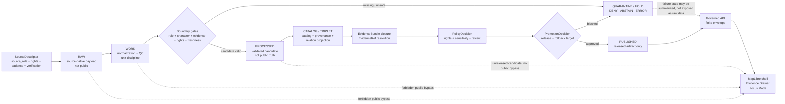

<!-- [KFM_META_BLOCK_V2]
doc_id: kfm://doc/TODO-ASSIGN-UUID
title: ADR-0431 — Atmosphere / Air Knowledge-Character Boundary
type: standard
version: v1
status: draft
owners: TODO-VERIFY: atmosphere-air domain steward, documentation steward, schema/contract steward, policy steward
created: NEEDS_VERIFICATION-YYYY-MM-DD
updated: 2026-05-06
policy_label: TODO-VERIFY-public-or-restricted
related: [./README.md, ./ADR-0001-schema-home.md, ./ADR-0312-atmosphere-air-source-role-boundaries.md, ./ADR-0418-atmosphere-air-schema-slug-compatibility.md, ../architecture/contract-schema-policy-split.md, ../domains/atmosphere_air/README.md, ../domains/atmosphere_air/ADR-0001-atmosphere-air-lane.md, ../domains/atmosphere_air/ADR-0002-atmosphere-schema-compatibility.md, ../domains/atmosphere_air/ADR-0003-atmosphere-source-role-boundaries.md, NEEDS_VERIFICATION: ../../schemas/contracts/v1/atmosphere/, NEEDS_VERIFICATION: ../../schemas/contracts/v1/air/, NEEDS_VERIFICATION: ../../data/registry/atmosphere/]
tags: [kfm, adr, atmosphere-air, atmosphere, air-quality, knowledge-character, source-role, evidence, governed-domain, release-boundary]
notes: [Revises existing docs/adr/ADR-0431-atmosphere-air-knowledge-character-boundary.md on main. doc_id, owners, created date, policy_label, final ADR acceptance state, CI enforcement, source registry status, and release implementation remain NEEDS VERIFICATION.]
[/KFM_META_BLOCK_V2] -->

# ADR-0431 — Atmosphere / Air Knowledge-Character Boundary

Defines how KFM keeps atmosphere and air-quality observations, reports, models, masks, advisories, and derived products distinct before they become claims, map layers, Evidence Drawer payloads, Focus Mode answers, or release candidates.

  
  
  
  
  
  

  <a href="#status">Status</a> ·
  <a href="#decision">Decision</a> ·
  <a href="#evidence-boundary">Evidence</a> ·
  <a href="#knowledge-character-taxonomy">Taxonomy</a> ·
  <a href="#anti-collapse-rules">Anti-collapse rules</a> ·
  <a href="#governed-flow">Flow</a> ·
  <a href="#validation-and-acceptance">Validation</a> ·
  <a href="#rollback-and-supersession">Rollback</a>

> [!IMPORTANT]
> This ADR is a **governance decision record**, not proof of implementation. It does not authorize live source fetching, public release, public map layers, direct API exposure, or Focus Mode answers. Enforcement still requires repository evidence: schemas, fixtures, validators, policy checks, receipts, proof objects, release manifests, rollback targets, CI results, and steward review.

---

## Status

| Status item | Value |
|---|---|
| **Decision state** | `draft / PROPOSED` |
| **Target file** | `docs/adr/ADR-0431-atmosphere-air-knowledge-character-boundary.md` |
| **Primary decision** | Atmosphere / Air objects must preserve `source_role` and `knowledge_character` before they support consequential claims or public surfaces. |
| **Relationship to ADR-0312** | `ADR-0312` specializes source-role and knowledge-character boundaries; this ADR applies that boundary to release, UI, Evidence Drawer, Focus Mode, and lifecycle behavior. |
| **Relationship to ADR-0418** | `ADR-0418` governs `atmosphere_air`, `atmosphere`, and `air` slug compatibility; this ADR must not silently rename schema or implementation paths. |
| **Relationship to domain-local ADRs** | Domain-local ADRs under `docs/domains/atmosphere_air/` remain lineage unless maintainers explicitly supersede them. |
| **Public-release posture** | `DENY` until evidence, source role, knowledge character, rights, review, release, correction, and rollback gates pass. |
| **Runtime posture** | Governed API and Focus Mode must emit finite outcomes: `ANSWER`, `ABSTAIN`, `DENY`, or `ERROR`. |
| **Enforcement maturity** | `NEEDS VERIFICATION` for validators, policy wiring, schema coverage, CI status, branch protections, release objects, and runtime behavior. |

> [!CAUTION]
> Atmosphere / Air is not one “air layer.” A PM2.5 observation, AQI report, regulatory archive, low-cost sensor candidate, smoke mask, AOD product, forecast model field, anomaly surface, advisory, and fusion layer carry different authority, uncertainty, time, rights, and public-use burdens.

---

## Decision

Adopt **Atmosphere / Air Knowledge-Character Boundary** as the governing decision for how KFM interprets, validates, releases, and explains atmosphere and air-quality information.

### Normative decision after acceptance

1. **Every consequential atmosphere/air object must declare or resolve `source_role`.**
2. **Every consequential atmosphere/air object must declare or resolve `knowledge_character`.**
3. **No public or semi-public atmosphere/air claim may rely on an object whose source role, knowledge character, evidence, rights, review state, release state, or freshness posture is unresolved.**
4. **Public map layers, popups, exports, Evidence Drawer payloads, Focus Mode answers, and governed API responses must consume released artifacts or governed envelopes only.**
5. **RAW, WORK, QUARANTINE, connector-private output, normalization candidates, unpublished processed candidates, direct model outputs, and internal canonical stores are not public client surfaces.**
6. **AQI, concentration, model fields, remote masks, smoke context, climate anomalies, advisories, and fusion products must remain distinct at the point of use.**
7. **Fusion products may summarize disagreement only when they preserve input EvidenceRefs, method, uncertainty, transform identity, and source roles.**
8. **Unknown rights, unresolved public-release permission, missing source descriptors, missing EvidenceRefs, or ambiguous schema/slug resolution fail closed.**
9. **Focus Mode may explain admissible released evidence; it cannot turn generated language into evidence, policy approval, review state, or release authority.**
10. **Rollback and correction must be planned before publication.**

### What this ADR does not decide

This ADR does not decide final source descriptors, live connector activation, final JSON Schemas, final policy-as-code, API route names, UI component names, branch protections, package manager, CI enforcement, release signing, or dashboard behavior.

<a href="#top">Back to top ↑</a>

---

## Evidence boundary

This ADR uses current repository evidence and KFM doctrine, but keeps implementation maturity bounded.

| Evidence class | Status | Supports | Does not prove |
|---|---:|---|---|
| Existing target ADR file | `CONFIRMED` | The target path already exists on `main` and this document revises it. | That the decision is accepted or enforced. |
| ADR index | `CONFIRMED` | `docs/adr/` is the human-facing decision ledger and requires evidence, truth labels, validation, rollback, and supersession discipline. | Complete ADR inventory, owner coverage, or CI enforcement. |
| Schema-home ADR | `CONFIRMED / draft` | `schemas/contracts/v1/` is the proposed machine-schema home; `contracts/` explains meaning and `policy/` decides admissibility. | Accepted schema-home authority or branch-protected enforcement. |
| Contract/schema/policy split note | `CONFIRMED / draft` | KFM separates semantic meaning, machine shape, and admissibility decisions. | Runtime or release-gate enforcement. |
| Atmosphere / Air domain README | `CONFIRMED` | The lane already names knowledge-character distinctions and public-safety posture. | All proposed companion files, validators, schemas, and source registries exist. |
| Domain-local ADR-0001 | `CONFIRMED / proposed` | Documentation lane is `docs/domains/atmosphere_air/`; machine slug compatibility must be explicit. | Full schema compatibility or migration behavior. |
| Domain-local ADR-0002 | `CONFIRMED / proposed` | Existing/expected `schemas/contracts/v1/atmosphere/*` families remain linked to atmosphere-air semantics. | Actual schema inventory or alias enforcement. |
| Domain-local ADR-0003 | `CONFIRMED / proposed` | Source-role separation is already a lane decision. | Complete taxonomy, fixtures, or policy gates. |
| ADR-0312 | `CONFIRMED / draft` | Expanded source-role and knowledge-character boundaries exist in the repo-wide ADR directory. | Accepted implementation or full CI enforcement. |
| ADR-0418 | `CONFIRMED / draft` | Schema slug compatibility across `atmosphere_air`, `atmosphere`, and `air` is tracked separately. | That all aliases, schemas, and migration fixtures exist. |
| Local workspace scan | `CONFIRMED` | The local `/mnt/data` workspace had PDFs and no mounted Git checkout. | Absence of the GitHub repository; the repository was inspected through connector evidence. |

### Evidence rule

If this ADR conflicts with an accepted successor ADR, stronger repository evidence, current schema-home law, or verified implementation behavior, update or supersede this ADR. Do not create a parallel authority path.

<a href="#top">Back to top ↑</a>

---

## Context

Atmosphere and air-quality evidence is useful because it combines measurements, reports, model context, remote sensing, advisories, baselines, and derived interpretation. It is risky for the same reason.

KFM must prevent these collapses:

- a public AQI report becoming a raw concentration;
- an AOD product becoming PM2.5 without a governed model;
- a smoke plume mask becoming exposure measurement;
- a model field becoming an observed value;
- a regulatory archive becoming live/current state;
- a low-cost sensor candidate becoming regulatory evidence;
- a fusion product hiding its inputs;
- a run receipt becoming proof;
- a map layer becoming sovereign truth;
- Focus Mode turning plausible language into evidence.

This ADR establishes the release and public-surface boundary for those distinctions.

---

## Repo fit and path rules

| Surface | Path or slug | Status | Rule |
|---|---|---:|---|
| Repo-wide ADR | `docs/adr/ADR-0431-atmosphere-air-knowledge-character-boundary.md` | `CONFIRMED existing target` | This file is the repo-wide decision record for knowledge-character release boundary. |
| ADR index | [`./README.md`](./README.md) | `CONFIRMED` | Must list this ADR when maintainers accept or revise the ADR index. |
| Schema-home ADR | [`./ADR-0001-schema-home.md`](./ADR-0001-schema-home.md) | `CONFIRMED / draft` | Machine-schema placement follows this or a successor ADR. |
| Source-role ADR | [`./ADR-0312-atmosphere-air-source-role-boundaries.md`](./ADR-0312-atmosphere-air-source-role-boundaries.md) | `CONFIRMED / draft` | Boundary taxonomy should stay synchronized with this ADR. |
| Schema-slug ADR | [`./ADR-0418-atmosphere-air-schema-slug-compatibility.md`](./ADR-0418-atmosphere-air-schema-slug-compatibility.md) | `CONFIRMED / draft` | Slug compatibility and alias behavior belong there. |
| Domain docs lane | [`../domains/atmosphere_air/`](../domains/atmosphere_air/) | `CONFIRMED` | Human-facing atmosphere/air lane documentation. |
| Domain-local lane ADR | [`../domains/atmosphere_air/ADR-0001-atmosphere-air-lane.md`](../domains/atmosphere_air/ADR-0001-atmosphere-air-lane.md) | `CONFIRMED / lineage` | Keep as lineage or successor-pointer after repo-wide ADRs are accepted. |
| Domain-local schema ADR | [`../domains/atmosphere_air/ADR-0002-atmosphere-schema-compatibility.md`](../domains/atmosphere_air/ADR-0002-atmosphere-schema-compatibility.md) | `CONFIRMED / lineage` | Keep aligned with ADR-0418. |
| Domain-local source ADR | [`../domains/atmosphere_air/ADR-0003-atmosphere-source-role-boundaries.md`](../domains/atmosphere_air/ADR-0003-atmosphere-source-role-boundaries.md) | `CONFIRMED / lineage` | Keep aligned with ADR-0312 and this ADR. |
| Human docs slug | `atmosphere_air` | `CONFIRMED` | Do not rename by this ADR. |
| Whole-domain machine slug | `atmosphere` | `PROPOSED / governed by ADR-0418 and ADR-0001` | Do not create divergent machine definitions. |
| Existing thin-slice slug | `air` | `CONFIRMED as compatibility pressure / governed by ADR-0418` | Preserve until alias and migration fixtures prove a safe rename. |
| New `docs/ADR/` path | none | `REJECTED` | Do not introduce uppercase ADR directory paths. |

> [!WARNING]
> Path cleanup must not become semantic cleanup. A rename from `air` to `atmosphere`, or from `atmosphere` to `air`, requires ADR-backed alias records, fixture compatibility checks, migration notes, and rollback.

---

## Knowledge-character taxonomy

Every consequential object must declare one accepted `knowledge_character` or resolve to a source descriptor that does.

| Knowledge character | Boundary | Must never masquerade as |
|---|---|---|
| `OBSERVED_SENSOR` | Ground, station, or instrument observation with method/site/time context. | AQI report, model field, remote mask, or fusion product. |
| `PUBLIC_AQI_REPORT` | AQI, NowCast-style index, public report, or agency index object. | Raw concentration measurement. |
| `REGULATORY_ARCHIVE` | Quality-assured or regulatory archive evidence. | Live state unless valid/retrieval/freshness scope supports it. |
| `LOW_COST_SENSOR` | Contributor or consumer sensor network candidate requiring correction and caveats. | Regulatory truth or unrestricted public observation. |
| `ATMOSPHERIC_MODEL_FIELD` | Forecast, reanalysis, hindcast, transport, aerosol, smoke, or chemistry model output. | Observed measurement. |
| `REMOTE_SENSING_MASK` | Smoke, AOD, fire, aerosol, haze, cloud, plume, or classification support product. | Surface exposure or PM concentration. |
| `CLIMATE_ANOMALY_CONTEXT` | Normals, anomaly surfaces, baselines, downscaling, hindcasts, or climate support context. | Emergency alert or live hazard state. |
| `DERIVED_FUSION` | Interpolation, bias correction, consensus, ensemble, or fused product. | Canonical source observation. |
| `METEOROLOGICAL_CONTEXT` | Wind, temperature, humidity, pressure, boundary-layer, stability, or transport support. | Air-quality concentration unless independently measured. |
| `VISIBILITY_AND_AEROSOL_CONTEXT` | Visibility, haze, AOD, opacity, optical aerosol burden, or aerosol context. | PM concentration without model assumptions. |
| `FIRE_AND_EMISSIONS_CONTEXT` | Fire hotspots, source indicators, emissions inventory, smoke-source context. | Exposure measurement. |
| `ALERT_AND_ADVISORY_CONTEXT` | Agency notice, public-health message, recommendation, or advisory. | Sensor observation, model field, or KFM life-safety instruction. |
| `NETWORK_AND_SITE_CONTEXT` | Station metadata, provider IDs, cadence, instrument state, siting caveats, station health. | Measurement value. |
| `BASELINE_AND_TEMPORAL_SUPPORT` | Climatology, rolling baseline, persistence, hysteresis, or freshness support. | Standalone public claim without scoped evidence. |

### Required companion fields

A consequential object should include or resolve the following before release review.

| Field | Purpose |
|---|---|
| `source_id` or `source_descriptor_ref` | Links to source identity, rights, cadence, and authority. |
| `source_role` | States what the source is competent to support. |
| `knowledge_character` | States what kind of knowledge the object represents. |
| `raw_value` / `raw_unit` | Preserves source-native value where applicable. |
| `normalized_value` / `normalized_unit` | Enables comparison without losing raw value. |
| `observed_time`, `valid_time`, `model_time`, `retrieved_at`, or equivalent | Keeps temporal meaning explicit. |
| `freshness_status` | Prevents stale context from appearing current. |
| `source_payload_hash` | Preserves source traceability. |
| `transform_hash` or `spec_hash` | Preserves transformation identity. |
| `evidence_refs` | Enables `EvidenceRef -> EvidenceBundle` closure. |
| `rights_status` and `public_release_allowed` | Blocks public exposure when rights are unknown or restricted. |
| `review_state` and `release_state` | Separates candidate, reviewed, released, corrected, withdrawn, and superseded states. |
| `rollback_ref` or equivalent release rollback target | Ensures publication can be reversed. |

<a href="#top">Back to top ↑</a>

---

## Source-role boundaries

`source_role` and `knowledge_character` work together. A source role describes source authority; a knowledge character describes object meaning.

| Source role family | Can support | Cannot support by itself |
|---|---|---|
| `OBSERVATION_PROVIDER` | Observed measurements with site/instrument/time support. | AQI report semantics, regulatory approval, fusion certainty, or public release. |
| `PUBLIC_REPORTING_PROVIDER` | Public AQI/report/advisory semantics. | Raw concentration unless independently evidenced. |
| `REGULATORY_ARCHIVE_PROVIDER` | Historical or quality-assured archive context. | Live/current claims without temporal support. |
| `LOW_COST_SENSOR_PROVIDER` | Candidate observations with caveats and corrections. | Regulatory truth or high-confidence public exposure. |
| `MODEL_PROVIDER` | Model fields, forecast/reanalysis/hindcast/transport context. | Observed measurement. |
| `REMOTE_SENSING_PROVIDER` | AOD, plume, fire, aerosol, cloud, haze, or mask context. | Surface exposure or PM concentration without governed modeling. |
| `ADVISORY_ISSUER` | Advisory message context and issuer claim. | Measurement, model, or emergency/life-safety authority for KFM. |
| `DERIVED_PRODUCT_GENERATOR` | Fusion, interpolation, ensemble, or bias-corrected products. | Canonical root evidence without input EvidenceRefs. |

> [!NOTE]
> A source descriptor admits and constrains a source. It does not, by itself, make a public claim true, reviewed, rights-cleared, or released.

---

## Anti-collapse rules

These rules are the core safety boundary.

| Rule ID | Anti-collapse rule | Required failure behavior |
|---|---|---|
| `ATMOS-R001` | AQI or public report index must not be treated as raw concentration. | `DENY` with `ATMOS_AQI_AS_CONCENTRATION`. |
| `ATMOS-R002` | AOD must not be treated as PM2.5 without governed model assumptions and evidence. | `DENY` with `ATMOS_AOD_AS_PM25`. |
| `ATMOS-R003` | Smoke, plume, fire, or aerosol mask must not be treated as exposure measurement. | `DENY` or `ABSTAIN` unless model/fusion evidence supports it. |
| `ATMOS-R004` | Forecast, reanalysis, smoke, transport, or chemistry model field must not be labeled observed. | `DENY` with `ATMOS_MODEL_AS_OBSERVED`. |
| `ATMOS-R005` | Regulatory archive must not imply live/current state by default. | `ABSTAIN` or stale-scoped response. |
| `ATMOS-R006` | Low-cost sensor data must not be promoted without correction method, caveats, confidence, and rights. | `DENY` with `ATMOS_LOW_COST_NO_CORRECTION`. |
| `ATMOS-R007` | Fusion product must not hide input EvidenceRefs, method, uncertainty, or transform identity. | `DENY` with `ATMOS_FUSION_INPUTS_HIDDEN` or missing-evidence reason. |
| `ATMOS-R008` | Advisory context must not become KFM emergency or life-safety instruction. | `DENY` life-safety framing and point to official systems outside KFM. |
| `ATMOS-R009` | Site metadata must not be presented as measurement value. | `DENY` or `ERROR` depending on request shape. |
| `ATMOS-R010` | No-network fixture or stub output must not become real-world public truth. | `DENY` public release until evidence/proof/release closure exists. |
| `ATMOS-R011` | Run receipt must not become EvidenceBundle, ProofPack, or ReleaseManifest. | `DENY` with `ATMOS_RECEIPT_AS_PROOF`. |
| `ATMOS-R012` | Public UI/API/Focus/export must not read connector or normalize candidate artifacts directly. | `DENY` with `ATMOS_PUBLIC_INTERNAL_ACCESS`. |
| `ATMOS-R013` | Stale operational context must not appear current. | `ABSTAIN` or stale-labeled response. |
| `ATMOS-R014` | Unknown rights, terms, or public-release permission must not be smoothed over. | `DENY` with `ATMOS_UNKNOWN_RIGHTS_PUBLIC`. |

---

## Governed flow

### Flow obligations

| Stage | Atmosphere / Air obligation |
|---|---|
| `SOURCE EDGE` | Source enters through descriptor-first review, with source role, knowledge character, rights, cadence, and public-release posture. |
| `RAW` | Preserve source-native payload, retrieval time, and payload hash. Do not expose to public clients. |
| `WORK` | Normalize units, preserve raw values, run QC, and retain source/site/model context. |
| `QUARANTINE / HOLD` | Hold missing rights, missing role, missing character, unresolved sensitivity, stale live claims, schema failure, or policy failure. |
| `PROCESSED` | Store validated candidates. Do not treat them as released truth. |
| `CATALOG / TRIPLET` | Build discovery/provenance/relation projections without replacing source evidence. |
| `EVIDENCE CLOSURE` | Resolve EvidenceRefs to EvidenceBundle before consequential claims. |
| `POLICY / REVIEW` | Decide rights, sensitivity, review, release, correction, and public posture. |
| `PUBLISHED` | Release only public-safe artifacts with release manifest, rollback target, and correction path. |
| `API / UI / FOCUS` | Consume released artifacts or governed envelopes; show source role, knowledge character, freshness, caveats, and conflicts. |

<a href="#top">Back to top ↑</a>

---

## Public-surface contract

Public or semi-public outputs must preserve the boundary at the point of use.

| Surface | Required behavior | Forbidden behavior |
|---|---|---|
| Map layer | Shows layer type, source role, knowledge character, freshness, release state, and caveat badge where material. | Rendering RAW/WORK/QUARANTINE/unreleased candidate data directly. |
| Popup | Summarizes what the value is and what it is not. | Presenting model/mask/report/fusion as observed measurement. |
| Evidence Drawer | Resolves EvidenceRefs and exposes source, role, character, rights, review, release, hashes, transform, freshness, and conflicts. | Hiding method, uncertainty, or disagreement behind polished prose. |
| Focus Mode | Answers only over admissible EvidenceBundle-backed context; otherwise `ABSTAIN`, `DENY`, or `ERROR`. | Direct model chat, uncited claims, or policy bypass. |
| Export | Includes release manifest reference, evidence link, caveats, and correction path. | Exporting internal candidates as public truth. |
| API response | Uses finite envelope and reason codes. | Returning ambiguous success or unstated confidence. |
| Advisory display | Labels issuer and scope; points to official sources for life-safety action. | KFM issuing emergency instructions. |

---

## Reason codes

| Code | Condition | Outcome |
|---|---|---|
| `ATMOS_MISSING_SOURCE_ROLE` | Object lacks `source_role` or source descriptor ref. | `DENY` |
| `ATMOS_MISSING_KNOWLEDGE_CHARACTER` | Object lacks accepted `knowledge_character`. | `DENY` |
| `ATMOS_MISSING_RIGHTS` | Source rights or terms are absent. | `DENY` |
| `ATMOS_UNKNOWN_RIGHTS_PUBLIC` | Public output requested while rights are unknown or `NOASSERTION`. | `DENY` |
| `ATMOS_MISSING_EVIDENCE_REFS` | Consequential claim lacks EvidenceRefs. | `ABSTAIN` or `DENY` |
| `ATMOS_EVIDENCE_REF_UNRESOLVED` | EvidenceRefs do not resolve to EvidenceBundle. | `ABSTAIN` or `ERROR` |
| `ATMOS_MISSING_SOURCE_PAYLOAD_HASH` | Normalized record cannot be traced to source payload. | `DENY` |
| `ATMOS_MISSING_TRANSFORM_HASH` | Derived record lacks transform identity. | `DENY` |
| `ATMOS_PUBLIC_RELEASE_FALSE` | Source descriptor or policy blocks public release. | `DENY` |
| `ATMOS_LOW_COST_NO_CORRECTION` | Low-cost sensor lacks correction/caveat support. | `DENY` |
| `ATMOS_MODEL_AS_OBSERVED` | Model output is labeled as observed measurement. | `DENY` |
| `ATMOS_AQI_AS_CONCENTRATION` | AQI/report index is treated as raw concentration. | `DENY` |
| `ATMOS_AOD_AS_PM25` | AOD is treated as PM2.5 without governed model support. | `DENY` |
| `ATMOS_MASK_AS_EXPOSURE` | Smoke/plume/remote mask is treated as exposure measurement. | `DENY` |
| `ATMOS_FUSION_INPUTS_HIDDEN` | Fusion product omits input EvidenceRefs, method, uncertainty, or transform identity. | `DENY` |
| `ATMOS_ANOMALY_AS_ALERT` | Climate anomaly is promoted as emergency alert. | `DENY` |
| `ATMOS_RECEIPT_AS_PROOF` | Run receipt is used as EvidenceBundle, ProofPack, or ReleaseManifest. | `DENY` |
| `ATMOS_STALE_CONTEXT_UNLABELED` | Stale or expired context lacks visible stale posture. | `ABSTAIN` or stale-labeled response |
| `ATMOS_PUBLIC_INTERNAL_ACCESS` | Public surface attempts RAW, WORK, QUARANTINE, connector-private, normalize-stage, or unpublished candidate access. | `DENY` |
| `ATMOS_ROLLBACK_TARGET_MISSING` | Publication candidate lacks rollback target. | `DENY` |
| `ATMOS_CORRECTION_PATH_MISSING` | Publication candidate lacks correction or withdrawal path. | `DENY` |

---

## Validation and acceptance

This ADR remains `draft / PROPOSED` until maintainers can verify the gates below.

### Documentation gates

- [ ] `docs/adr/README.md` lists ADR-0431 with final status.
- [ ] ADR-0312 and ADR-0418 relationship is cross-linked from this ADR.
- [ ] Domain-local ADRs under `docs/domains/atmosphere_air/` either point to repo-wide successors or are explicitly retained as lineage.
- [ ] Owners, created date, policy label, and final `doc_id` are filled or intentionally retained as reviewable placeholders.
- [ ] `docs/domains/atmosphere_air/README.md` links to this ADR.
- [ ] No uppercase `docs/ADR/` or duplicate domain ADR home is introduced.

### Schema and registry gates

- [ ] Active schema-home ADR status is checked before adding or moving machine schemas.
- [ ] `air`, `atmosphere`, and `atmosphere_air` slugs are reconciled through ADR-0418 or successor.
- [ ] Any compatibility alias has canonical target, owner, status, review date, tests, migration note, and rollback note.
- [ ] Source descriptors require `source_role`, `knowledge_character`, rights, verification status, public-release posture, and last verification date.
- [ ] Parameter registry preserves raw units, normalized units, conversion rules, caveats, and knowledge character.

### Validator and policy gates

- [ ] Missing `source_role` fails.
- [ ] Missing `knowledge_character` fails.
- [ ] AQI-as-concentration fails.
- [ ] AOD-as-PM2.5 without governed model support fails.
- [ ] Smoke-mask-as-exposure fails.
- [ ] Model-as-observed fails.
- [ ] Fusion-with-hidden-inputs fails.
- [ ] Unknown-rights public output fails.
- [ ] Run-receipt-as-proof fails.
- [ ] Public RAW/WORK/QUARANTINE/candidate access fails.
- [ ] Stale live-state claims abstain or carry stale context.
- [ ] Public release candidate without rollback target fails.
- [ ] Public release candidate without correction path fails.

### Release and runtime gates

- [ ] EvidenceRefs resolve to EvidenceBundle before consequential public claims.
- [ ] Catalog, receipt, proof, release, and correction objects remain separate.
- [ ] ReleaseManifest records artifact scope, source support, hashes, review state, rollback target, and correction path.
- [ ] Evidence Drawer payload exposes source role, knowledge character, source, rights, review, release, freshness, caveats, and conflicts.
- [ ] Focus Mode emits only `ANSWER`, `ABSTAIN`, `DENY`, or `ERROR`.
- [ ] Runtime behavior is proven by repo-native tests or validation receipts before claiming enforcement.

<a href="#top">Back to top ↑</a>

---

## Alternatives considered

| Alternative | Decision | Rationale |
|---|---|---|
| Keep the existing ADR unchanged | Rejected for this revision | It was strong but overclaimed filename absence and did not fully reconcile ADR-0312/ADR-0418. |
| Make ADR-0431 supersede ADR-0312 and ADR-0418 | Rejected | Source-role specialization and slug compatibility are distinct decisions that should remain inspectable. |
| Keep all atmosphere decisions only under `docs/domains/atmosphere_air/` | Rejected for this ADR | This boundary affects repo-wide schemas, registries, policies, validators, runtime envelopes, release, and UI trust surfaces. |
| Collapse `air`, `atmosphere`, and `atmosphere_air` immediately | Rejected | Existing compatibility pressure must be migrated with aliases, fixtures, and rollback. |
| Publish first and add proof later | Rejected | KFM requires evidence, policy, review, release, correction, and rollback before public release. |
| Treat all products as one “air quality” map layer | Rejected | Violates source-role, knowledge-character, and public-safety boundaries. |
| Let Focus Mode resolve ambiguity conversationally | Rejected | Generated language is interpretive; evidence and policy decide. |

---

## Consequences

### Positive consequences

- Keeps atmosphere and air-quality claims evidence-bounded and explainable.
- Prevents false certainty in public map, API, Evidence Drawer, Focus Mode, export, and release surfaces.
- Coordinates ADR-0431 with ADR-0312 and ADR-0418 instead of duplicating or silently superseding them.
- Preserves current documentation lane and slug compatibility while requiring explicit migration evidence.
- Turns known risk patterns into validator and policy denial codes.
- Makes rollback and correction part of release readiness.

### Costs

- More upfront fixture and validator burden before public-facing features.
- Some attractive map or AI demos remain blocked until evidence, rights, and release state are proven.
- Maintainers must keep domain-local ADR lineage, repo-wide ADRs, schema-home decisions, and registry docs synchronized.
- Existing `air` thin-slice surfaces may need aliases or migration notes before whole-domain `atmosphere` schemas stabilize.

### Accepted tradeoff

KFM favors slower, inspectable atmosphere/air release over fast, polished, semantically ambiguous layers. This is acceptable because the project’s durable value is the inspectable claim, not the rendered tile or generated summary.

---

## Rollback and supersession

If this ADR is rejected before acceptance:

1. keep it as a draft or remove it from the ADR index if it was not yet referenced;
2. preserve review notes if discussed in a PR;
3. leave domain-local ADRs as the active lineage decisions.

If this ADR is accepted and later superseded:

1. mark this ADR as `superseded` in the meta block and status table;
2. link the successor ADR;
3. preserve this file as lineage;
4. update `docs/adr/README.md`, ADR-0312, ADR-0418, and `docs/domains/atmosphere_air/README.md`;
5. update source registry, schema registry, validator docs, policy docs, release docs, and runtime contract notes where affected;
6. preserve aliases, receipts, proof references, release manifests, correction notices, and rollback records where public or semi-public artifacts were affected;
7. do not delete decision history to simplify the tree.

> [!WARNING]
> Rollback must protect auditability. A clean tree that erases decision history is not a KFM-compliant rollback.

<a href="#top">Back to top ↑</a>

---

## Open verification backlog

| Item | Status | Required check |
|---|---:|---|
| ADR acceptance state | `NEEDS VERIFICATION` | Maintainers decide whether ADR-0431 remains draft, moves to review, or is accepted. |
| ADR index entry | `NEEDS VERIFICATION` | Add or update ADR-0431 in `docs/adr/README.md`. |
| Owners | `TODO` | Assign domain, documentation, schema/contract, and policy stewards. |
| Created date | `TODO` | Confirm original file creation date or intentionally keep placeholder. |
| Policy label | `TODO` | Determine public/restricted status. |
| Schema-home enforcement | `NEEDS VERIFICATION` | Confirm `ADR-0001` status and actual schema validation behavior. |
| Slug compatibility | `NEEDS VERIFICATION` | Confirm ADR-0418 acceptance and alias/migration fixtures for `air`, `atmosphere`, and `atmosphere_air`. |
| Source-role enforcement | `NEEDS VERIFICATION` | Confirm ADR-0312 acceptance, validators, and fixtures. |
| Source registry | `NEEDS VERIFICATION` | Confirm source descriptors and required fields exist or create through accepted registry path. |
| Validator language and runner | `UNKNOWN` | Confirm repo-native toolchain before claiming enforcement. |
| Policy-as-code engine | `UNKNOWN` | Confirm OPA/Conftest or equivalent before writing tool-specific claims. |
| EvidenceBundle implementation | `UNKNOWN` | Confirm resolver, schema, fixtures, and runtime contract before public claims. |
| Evidence Drawer implementation | `UNKNOWN` | Confirm UI payload shape and route path before claiming behavior. |
| Focus Mode implementation | `UNKNOWN` | Confirm governed envelope and citation validation before claiming behavior. |
| Release/proof implementation | `UNKNOWN` | Confirm ReleaseManifest, ProofPack, rollback card, catalog closure, and correction path. |
| CI and branch protection | `UNKNOWN` | Confirm workflow runs and branch protections before claiming merge-blocking gates. |

---

## Maintainer note

Atmosphere / Air becomes useful when KFM can show what kind of evidence a user is looking at.

It becomes dangerous when the system hides that distinction.

This ADR keeps the distinction visible.
