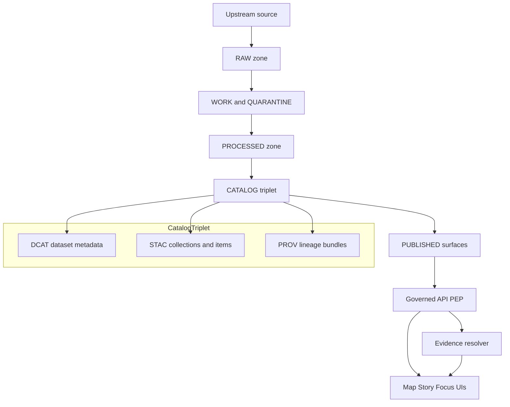

<!-- [KFM_META_BLOCK_V2]
doc_id: kfm://doc/30c88118-0f0b-4867-a991-257340f9ca0c
title: ADR — Governance: Trust Membrane, Promotion Contract, and Evidence Resolution
type: adr
version: v1
status: draft
owners: TBD
created: 2026-03-01
updated: 2026-03-01
policy_label: public
related:
  - Tooling the KFM pipeline.pdf
  - KFM_Source_Snapshots_Bundle_from_vNext1_tables_fixed.pdf
tags: [kfm, governance, policy, promotion-contract, trust-membrane, evidence]
notes:
  - This ADR codifies the governance model that turns KFM intent into enforceable behavior across CI and runtime.
[/KFM_META_BLOCK_V2] -->

# ADR-GOVERNANCE — Governance as Code, Promotion Contract, and Trust Membrane

**Decision date:** 2026-03-01  
**Owners:** TBD  
**Scope:** KFM truth path (Upstream → RAW → WORK/QUARANTINE → PROCESSED → CATALOG/TRIPLET → PUBLISHED), policy enforcement points (CI + runtime), evidence/citation model, run receipts & audit ledger.  

> **One-line decision:** KFM governance is enforced **as code** via a **trust membrane** + **Promotion Contract gates** + an **EvidenceRef → EvidenceBundle resolver**; policy evaluation is **default deny** and returns **obligations** (e.g., generalize geometry, suppress export) in addition to allow/deny.

---

## Quick navigation

- [Context](#context)
- [Decision](#decision)
- [Governance model](#governance-model)
- [Enforcement points](#enforcement-points)
- [Promotion Contract gates](#promotion-contract-gates)
- [Evidence resolution contract](#evidence-resolution-contract)
- [Sensitivity and rights](#sensitivity-and-rights)
- [Consequences](#consequences)
- [Alternatives considered](#alternatives-considered)
- [Rollback plan](#rollback-plan)
- [Implementation plan](#implementation-plan)
- [Verification and Definition of Done](#verification-and-definition-of-done)
- [Open questions](#open-questions)
- [References](#references)

---

## Context

KFM is an evidence-first, map-first platform where every user-facing claim must be traceable to governed artifacts (data, catalogs, provenance, and documents). The architecture briefing defines a strict **truth path** with lifecycle zones and a **trust membrane** that prevents clients from bypassing policy enforcement by accessing storage directly. Governance is not “process paperwork”; it is enforced through **CI gates** and **runtime policy checks**.

### Problem statement

Without a unified governance approach:

- Data can be **published** without adequate identity, rights, sensitivity classification, QA, provenance, or auditability.
- UI or downstream consumers can **bypass policy** (direct DB/object store access).
- Citations can become “paste-a-URL” and fail to resolve, breaking reproducibility.
- Sensitive locations and restricted materials can leak through derived products, error messages, or AI summaries.

### Decision drivers

- **Trust membrane:** clients never access storage directly; all access is policy-evaluated at the governed API (PEP).  
- **Promotion Contract:** promotion to PUBLISHED is blocked unless required artifacts exist and validate.
- **Policy-as-code:** CI and runtime must share policy semantics (or CI guarantees are meaningless).
- **Evidence-first UX:** citations must be resolvable evidence references, not unverified text links.
- **Auditability:** every run (pipelines + Focus Mode) emits receipts; audit ledger is append-only.

---

## Decision

### We will

1. **Adopt governance-as-code** using:
   - **Policy Decision Point (PDP):** OPA/Rego (or equivalent) as the authoritative evaluator.
   - **Policy Enforcement Points (PEPs):**
     - **CI:** policy tests + schema/contract validators block merges.
     - **Runtime API:** policy checks before serving any governed data.
     - **Evidence resolver:** policy checks before resolving evidence bundles.
     - **UI:** displays policy badges/notices but never makes policy decisions.

2. **Enforce the truth path** as a set of storage zones with promotion gates:
   - Upstream → RAW (immutable) → WORK/QUARANTINE → PROCESSED → CATALOG/TRIPLET → PUBLISHED (governed)
   - Promotion is the only way data reaches runtime surfaces.

3. **Treat catalogs and provenance as contract surfaces**:
   - CATALOG/TRIPLET is **DCAT + STAC + PROV**, cross-linked so that EvidenceRefs resolve deterministically.
   - Broken links, missing IDs, or invalid profiles block promotion.

4. **Standardize citations as EvidenceRefs** (not URLs) and require resolution:
   - A “citation” is an **EvidenceRef** (e.g., `dcat://...`, `stac://...`, `prov://...`, `doc://...`, `graph://...`) that resolves into an **EvidenceBundle** via `/api/v1/evidence/resolve`.
   - **Hard gate:** Story publishing and Focus Mode responses MUST abstain or narrow scope if citations cannot be verified and policy-allowed.

5. **Make policy_label and obligations first-class**:
   - `policy_label` is the primary sensitivity/access classification input for datasets, artifacts, stories, and responses.
   - Policy evaluation returns:
     - allow/deny
     - obligations (redaction/generalization/notice/suppress export)
     - reason codes (audit + UX)

6. **Require run receipts and an append-only audit ledger**:
   - Pipeline runs and Focus Mode runs emit receipts capturing inputs/outputs (by digest), environment (container image digest), validation results, and policy decisions.
   - The audit ledger is itself governed (redactions applied where required).

---

## Governance model

### Concept model (what gets governed)

### Definitions (normative)

- **DatasetVersion** is immutable once promoted; it points to a specific set of artifacts.  
- **Artifacts** are addressed by digest and referenced by catalogs.
- **EvidenceRef** is a stable typed reference (`dcat://`, `stac://`, `prov://`, `doc://`, `graph://`) that must resolve in bounded calls.
- **EvidenceBundle** is the resolver output; it includes human-readable and machine-readable fields plus the policy decision.
- **Run receipt** captures what happened, with digests and policy decisions; it is required for reproducibility.

---

## Enforcement points

### CI enforcement (prevent unsafe promotion-by-merge)

CI MUST block merges that would allow policy bypass, non-resolvable evidence, or invalid promotion artifacts. Minimum CI checks:

- ✅ Policy tests (default deny; fixtures for roles, resources, actions)  
- ✅ Schema validation for dataset registry/specs and other governed inputs  
- ✅ Catalog validators (DCAT/STAC/PROV profiles)  
- ✅ Link checker (EvidenceRefs must resolve without guessing)  
- ✅ Controlled vocabulary validation (e.g., `policy_label` values)  
- ✅ Receipt schema validation (run receipts are well-formed and complete)

### Runtime enforcement (prevent unsafe access-by-request)

At runtime, all client access must flow through the governed API (PEP). PEP responsibilities:

- Extract user and request context.
- Evaluate policy for the requested resource(s).
- Apply obligations (e.g., return generalized data, suppress fields, require notices).
- Ensure responses include dataset_version_id and digests when applicable.
- Ensure evidence resolution is policy-filtered and auditable.

> **Invariant:** UI never directly reads from object storage or databases; it only calls governed APIs.

---

## Promotion Contract gates

Promotion MUST be blocked unless minimum gates are met. These gates are defined so they can be automated in CI and reviewed for steward sign-off.

| Gate | Name | What must be present | Typical enforcement |
|---|---|---|---|
| A | Identity and versioning | `dataset_id`, `dataset_version_id`, deterministic `spec_hash`, artifact digests | schema + golden hash tests |
| B | Licensing and rights metadata | license/rights fields + upstream terms snapshot | fail if missing/unknown |
| C | Sensitivity and redaction plan | `policy_label` + obligations when needed | OPA tests + redaction validation |
| D | Catalog triplet validation | DCAT/STAC/PROV validate and cross-link; EvidenceRefs resolve | validators + linkcheck |
| E | QA and thresholds | dataset-specific checks + thresholds documented | QA reports + threshold checks |
| F | Run receipt and audit record | run receipt captures inputs, tools, hashes, policy decisions; append-only audit record | receipt schema validation |
| G | Release manifest | promotion recorded as a release manifest referencing digests | manifest consistency checks |

---

## Evidence resolution contract

In KFM, citations are not strings; they are resolvable references.

### Contract

- **Input:** EvidenceRef(s) (e.g., `dcat://dataset@version`, `prov://run/...`, `doc://...`).
- **Resolver:** `/api/v1/evidence/resolve`
- **Output:** EvidenceBundle(s) including:
  - metadata
  - artifact digests
  - provenance links
  - policy decision + obligations
- **Hard gate:** If evidence cannot be resolved or is policy-denied, the system MUST abstain or narrow scope.

### Why this matters

- Prevents “hallucinated citations” by forcing bounded, resolvable references.
- Makes stories and Focus Mode outputs reproducible because dataset versions and artifacts are explicit.

---

## Sensitivity and rights

### Sensitivity defaults

Default governance posture:

- Default deny for sensitive-location and restricted datasets.
- If any public representation is allowed, produce a separate `public_generalized` dataset version.
- Never leak restricted metadata in error responses.
- Do not embed precise coordinates in Story Nodes or Focus Mode outputs unless policy explicitly allows.
- Treat redaction/generalization transforms as first-class transforms recorded in PROV.

### Licensing and rights enforcement

Operational rules:

- Promotion gate requires license + rights holder for every distribution.
- “Metadata-only reference” mode is allowed when mirroring is not permitted.
- Export functions must include attribution and license text automatically.
- Story publishing gate blocks if rights are unclear for included media.

---

## Consequences

### Positive

- Governance intent becomes enforceable behavior (CI + runtime).
- User-facing trust improves: versions, licenses, evidence are inspectable.
- Strong anti-hallucination control loop for Focus Mode (verify-or-abstain).
- Security posture improves: policy bypass is structurally prevented and testable.
- Disaster recovery improves: indexes are rebuildable from promoted artifacts and catalogs.

### Negative / costs

- More up-front work: policy bundles, fixtures, validators, linkcheckers, receipt schemas.
- Operational overhead: steward review flows, audit retention, access controls.
- Requires discipline: “no bypass” must be enforced in code review and infra.

---

## Alternatives considered

1. **Manual governance review only**  
   - Rejected: does not scale; errors slip through; not testable.

2. **UI-based access control**  
   - Rejected: UI is not a trusted boundary; it is too easy to bypass.

3. **Allow promotion with partial catalogs**  
   - Rejected: breaks EvidenceRef resolution; results become unverifiable.

4. **URL-only citations**  
   - Rejected: URLs rot; cannot encode policy; cannot guarantee reproducibility.

5. **Single “public” default for everything**  
   - Rejected: violates sensitivity and rights obligations; increases harm risk.

---

## Rollback plan

Rollback must be cheap and safe:

- **Policy rollback:** policy bundles are versioned; deploy previous policy bundle version if a regression is detected (CI tests + runtime canary).
- **Dataset rollback:** promotion is append-only; “rollback” means reverting the **active release manifest** pointer to a previous promoted DatasetVersion.
- **Story rollback:** Story Node versions are immutable; revert publication to a previous reviewed version.
- **Audit retention:** do not delete receipts; record rollback as a new audited event.

---

## Implementation plan

Deliver as thin slices, keeping governance enforceable at each increment:

1. **WP-01** Spec hashing + controlled vocabulary validation  
2. **WP-02** Catalog validators + link checker  
3. **WP-03** Policy pack + fixture tests (default deny)  
4. **WP-04** Evidence resolver service + integration tests  
5. **WP-05+** Governed dataset discovery endpoints and Map Explorer evidence drawer  
6. **WP-07** Story Node publish gate (review state + resolvable citations)  
7. **WP-08** Focus Mode governed run + evaluation harness (golden queries; abstain on unverifiable)

---

## Verification and Definition of Done

This ADR is “done” when:

- [ ] CI blocks merges if:
  - policy tests fail
  - catalogs fail validation
  - EvidenceRefs cannot resolve
  - required Promotion Contract artifacts are missing
- [ ] Runtime API denies or obligates correctly for:
  - public user reading public datasets
  - public user denied restricted datasets
  - steward user allowed restricted datasets
- [ ] Evidence resolver returns policy-filtered EvidenceBundles.
- [ ] Story publishing fails unless:
  - review state is captured
  - all citations resolve via evidence resolver
- [ ] Focus Mode returns only:
  - responses with verifiable citations, or
  - abstentions with scope-narrowing guidance
- [ ] A single MVP dataset can be promoted through all gates, producing:
  - processed artifacts
  - DCAT/STAC/PROV triplet
  - run receipt
  - release manifest

---

## Open questions

- What is the authoritative controlled vocabulary for `policy_label` values beyond `public`, `restricted`, and `public_generalized`?
- What is the steward review workflow implementation (queues, roles, CODEOWNERS)?
- What infra guardrails enforce “no direct storage access” (network policies, service accounts, static analysis)?
- What is the retention policy for the audit ledger and receipts, especially for restricted runs?
- How are obligations represented in API responses and displayed in UI (notices, export suppression)?

---

## References

- Tooling the KFM pipeline (Architecture, Governance, and Delivery Plan)
- KFM vNext governance & blueprint snapshots (Definitive Design & Governance Guide excerpts)

---

[Back to top](#adr-governance--governance-as-code-promotion-contract-and-trust-membrane)
