<!-- [KFM_META_BLOCK_V2]
doc_id: kfm://doc/adr-scaffold-connectors-domain-segment
title: "ADR-NNNN — Connector Lanes Are Source- and Product-Scoped, Not Domain-Segmented"
type: adr-scaffold
adr_id: ADR-NNNN
version: v1.0
status: not-assigned
effective_decision_status: not-assigned
owners:
  - "NEEDS VERIFICATION — architecture decision owner"
  - "NEEDS VERIFICATION — connector and source-admission steward"
  - "NEEDS VERIFICATION — source registry steward"
  - "NEEDS VERIFICATION — affected domain stewards"
owner_status: "CODEOWNERS review routing is repository evidence, not accepted stewardship, decision quorum, or approval"
reviewers_required:
  - Architecture steward
  - Docs steward
  - Connector and source-admission steward
  - Source registry steward
  - Contracts and schemas stewards
  - Validation and migration reviewer
  - At least one affected domain steward
created: 2026-07-22
updated: 2026-07-24
policy_label: public
truth_posture: cite-or-abstain
responsibility_root: docs/
current_path: docs/adr/ADR-NNNN-connectors-domain-segment.md
supersedes: []
superseded_by: null
evidence_snapshot:
  repository: bartytime4life/Kansas-Frontier-Matrix
  base_ref: main
  base_commit: d4ec260e0203cd9d771411cd461dc35a2a00f044
  target_prior_blob: a8fdcaadf873f0a1effec286ce19dd73268d2a36
  adr_index_blob: cf08fae322ac53426f7394d97897fdb942253049
  adr_readme_blob: f1b5d34a53b6c717832d587de54989ce8192bcaa
  directory_rules_blob: 2affb080e6f0043867c64c7f06c1ca52030fbd55
  connectors_readme_blob: 8db6ee9cbefdd1ce099789d827f759df9ebd9f59
  fauna_canonical_paths_blob: abfc6ddb2e958ea636ebc2e9e3705b59ec42c2ca
  connector_output_adr_blob: c7b1027dc9d25ff6bf886a7a2e2162f8fb2516be
  source_admission_adr_blob: 58693830fcdf9746c5494fdd85298529fa5594a9
  noaa_storm_events_readme_blob: a47e3eaf0e67c67b2126fd0c6a35249c11b4f1e9
related:
  - docs/adr/README.md
  - docs/adr/INDEX.md
  - docs/adr/ADR-0012-connector-outputs-to-data-raw-or-data-quarantine-only.md
  - docs/adr/ADR-0017-source-descriptor-admission-process.md
  - docs/doctrine/directory-rules.md
  - connectors/README.md
  - docs/domains/fauna/CANONICAL_PATHS.md
  - docs/sources/ADMISSION_PROCESS.md
  - data/registry/sources/README.md
  - pipelines/README.md
  - docs/registers/DRIFT_REGISTER.md
  - docs/registers/VERIFICATION_BACKLOG.md
tags: [kfm, adr-scaffold, connectors, source-family, source-product, domain-segment, source-admission, topology, migration, non-publisher]
notes:
  - "This same-path update replaces a 13-line inventory scaffold with repository-grounded proposed decision content."
  - "The filename remains ADR-NNNN and the canonical ADR index continues to classify it as an unassigned scaffold; this file reserves no number and has no accepted decision authority."
  - "The proposal chooses source-family/product/distribution identity as the connector topology principle while preserving mixed current paths as migration evidence rather than silently renaming them."
  - "Domain names remain metadata, consumer scope, and lifecycle routing context; domain transformation and canonical domain semantics remain outside connector ownership."
  - "This documentation-only change activates no connector, migrates no path, changes no package, and publishes nothing."
[/KFM_META_BLOCK_V2] -->

<a id="top"></a>

# ADR-NNNN — Connector Lanes Are Source- and Product-Scoped, Not Domain-Segmented

> **Unassigned proposed decision.** Canonical connector lanes identify an external source family, product, distribution, endpoint class, archive, package, feed, or upload boundary. They do **not** use a KFM domain name as their primary ownership segment. Domains remain explicit in source metadata, permitted claim scope, policy context, downstream lifecycle routing, and consuming pipelines.

[](#status)
[](#proposed-decision)
[](#current-repository-evidence)
[](#canonical-connector-path-model)
[](#domain-routing-and-lifecycle-boundary)
[](#authority-and-publication-boundary)

> [!IMPORTANT]
> **This is still an unassigned scaffold.** [`docs/adr/INDEX.md`](./INDEX.md) lists this exact file under **Unassigned scaffolds** with decision status `not-assigned`. The `NNNN` token reserves no repository-wide ADR number. Editing, committing, merging, linking, or validating this file does not assign a number or accept the proposed decision.

> [!CAUTION]
> **Current connector topology is mixed.** Repository-grounded connector documentation identifies source-family lanes, product/distribution lanes, compound source names, implementation/package lanes, compatibility aliases, and conflicted multi-variant paths. This proposal defines the target responsibility rule; it does not silently rename existing paths or declare one observed spelling universally canonical.

> [!WARNING]
> **A connector path never grants source, domain, evidence, release, or publication authority.** A source-specific connector may produce governed RAW or QUARANTINE candidates and receipt-ready process metadata. It does not define canonical domain objects, normalize cross-source truth, approve source activation, create EvidenceBundles, promote lifecycle state, release artifacts, or serve public clients.

**Quick navigation:** [Status](#status) · [Evidence](#evidence-boundary) · [Repository evidence](#current-repository-evidence) · [Context](#context) · [Scope](#scope-and-non-decisions) · [Forces](#forces) · [Decision](#proposed-decision) · [Path model](#canonical-connector-path-model) · [Domain routing](#domain-routing-and-lifecycle-boundary) · [Trust path](#connector-to-domain-trust-path) · [Conflicts](#current-conflicts-and-maturity-limits) · [Consequences](#consequences) · [Alternatives](#alternatives-considered) · [Migration](#migration-and-convergence-plan) · [Acceptance](#acceptance-gates) · [Validation](#validation) · [Risks](#risk-ledger) · [Rollback](#rollback) · [Open work](#open-questions) · [References](#references)

---

<a id="status"></a>

## Status

| Field | Current value |
|---|---|
| **Tracked identity** | `ADR-NNNN` placeholder |
| **Tracked path** | `docs/adr/ADR-NNNN-connectors-domain-segment.md` |
| **Canonical index classification** | Explicit placeholder under **Unassigned scaffolds** |
| **Decision status** | `not-assigned`; proposed content only |
| **Number reservation** | None |
| **Decision class** | Cross-source connector topology, responsibility boundary, and migration posture |
| **Current topology posture** | Mixed, partially documented, and conflict-bearing |
| **Implementation effect of this revision** | Documentation only |
| **Publication effect** | None |
| **Supersedes / superseded by** | None / none |

### Scaffold modernization versus ADR assignment

This update closes a documentation gap without performing the separate ADR-authoring transition.

1. **Scaffold modernization** replaces the thin placeholder with repository-grounded context, a proposed decision, consequences, migration rules, validation, and rollback.
2. **ADR assignment** would require checking the next available number, open pull requests, and active branches; renaming the file and H1; updating [`INDEX.md`](./INDEX.md); and completing the reviewed authoring workflow in [`README.md`](./README.md).

The first action is authorized by this same-path update. The second action is not performed here.

[Back to top](#top)

---

<a id="evidence-boundary"></a>

## Evidence Boundary

This revision is grounded in pinned repository bytes at `main@d4ec260e0203cd9d771411cd461dc35a2a00f044`. Current repository evidence establishes what is tracked and how the connector root describes its responsibility. Directory Rules and proposed numbered ADRs provide governance context; they do not make this unassigned decision accepted.

### Truth labels

| Label | Meaning in this record |
|---|---|
| **CONFIRMED** | Verified from current repository files, exact path reads, indexed inventory, or governing doctrine |
| **PROPOSED** | The topology decision, migration rule, path disposition, or implementation target under review |
| **CONFLICTED** | Tracked paths, identities, aliases, or authority surfaces disagree |
| **NEEDS VERIFICATION** | A concrete inspection or review remains before reliance |
| **UNKNOWN** | Current evidence cannot establish the claim |
| **HOLD** | A capability or transition must not be represented as complete |

### Inspected evidence

| Surface | Repository-grounded finding |
|---|---|
| Canonical ADR index | This file is an explicit unassigned scaffold and reserves no number |
| ADR operating contract | New numbered records require unique numbering, template adoption, index update, validation, and review |
| Directory Rules | `connectors/` owns source-specific fetch/admission; domain segments are enumerated under other responsibility roots, not under `connectors/` |
| Connector root README | Canonical connector responsibility is source-specific; observed child topology includes family, product, package, alias, and conflict classes |
| Fauna canonical-path register | Explicitly rejects `connectors/fauna/` as the default lane and routes fauna source connectors by source identity |
| ADR-0012 | Proposed connector payload boundary is RAW or QUARANTINE, with receipt candidates separate |
| ADR-0017 | Proposed source-descriptor admission remains distinct from connector implementation and source activation |
| NOAA Storm Events connector README | Demonstrates real hyphen/underscore/family-nesting conflict and explicitly defers canonical path choice to an ADR or migration decision |

### What this evidence does not prove

This record does not prove:

- the proposed decision is accepted;
- the connector tree is exhaustively inventoried;
- every domain-only connector directory is invalid or unused;
- one universal flat naming convention is already established;
- source-family nesting is always preferable to a compound product slug;
- any alias, package, source identifier, or registry entry is canonical;
- any source is admitted, active, current, reachable, rights-cleared, or public-safe;
- connector code, tests, fixtures, receipts, or runtime behavior are complete;
- a migration, deprecation, release, deployment, or publication occurred.

[Back to top](#top)

---

<a id="current-repository-evidence"></a>

## Current Repository Evidence

### ADR and placement controls

- [`docs/adr/INDEX.md`](./INDEX.md) tracks this exact filename as an explicit placeholder with status `not-assigned`.
- [`docs/adr/README.md`](./README.md) states that `ADR-NNNN-*` filenames are placeholders, not reserved decisions, and that assigning one requires a unique number, index update, validation, and review.
- [`docs/doctrine/directory-rules.md`](../doctrine/directory-rules.md) assigns source-specific fetch/admission to `connectors/`.
- The Directory Rules domain-segment list includes `docs/domains/<domain>/`, `contracts/domains/<domain>/`, `schemas/contracts/v1/domains/<domain>/`, `policy/domains/<domain>/`, `tests/domains/<domain>/`, `fixtures/domains/<domain>/`, `packages/domains/<domain>/`, `pipelines/domains/<domain>/`, lifecycle data, catalogs, registries, and release candidates. It does not define `connectors/<domain>/` as a canonical domain lane.

### Connector root topology

[`connectors/README.md`](../../connectors/README.md) describes a mixed repository rather than a single normalized layout:

| Lane class | Current documented example or pattern | Safe conclusion |
|---|---|---|
| Source-family coordination | `connectors/usgs/` | A family lane may coordinate multiple products without collapsing their roles or activation decisions |
| Product/distribution | Nested or flat product paths, WZDx, VIIRS-related lanes | Product-specific implementation is admissible after identity, rights, role, and path review |
| Implementation/package | `connectors/openstreetmap/` | Package/source/test organization may live inside one connector boundary |
| Compound source name | Paths such as `usgs_mrds` or `usgs_ngmdb` | Existing pattern; universal canonicality is not inferred |
| Compatibility alias | Paths such as `connectors/osm/` or `connectors/people/` | Must not duplicate implementation or source identity |
| Multi-variant conflict | Kansas Mesonet variants | Freeze new parallel implementation until migration is governed |
| Sensitive-source boundary | People/DNA/Land and similar lanes | Deny or quarantine when rights, consent, identity, sensitivity, or precision is unresolved |

The root README already places **source-family coordination lanes** and **product/distribution lanes** inside the connector responsibility. It does not grant canonical connector ownership to downstream KFM domains.

### Source-derived domain use

[`docs/domains/fauna/CANONICAL_PATHS.md`](../domains/fauna/CANONICAL_PATHS.md) records the motivating conflict:

- Fauna is a domain segment under its responsibility roots.
- Connector implementation is organized by source identity rather than `connectors/fauna/`.
- A fauna source connector may route candidates to `data/raw/fauna/` or `data/quarantine/fauna/`.
- Downstream fauna semantics, policy, validation, normalization, proof, and release remain in their owning roots.

This source is useful lineage and repository documentation, but it does not independently accept this ADR proposal.

### Concrete placement conflict

[`connectors/noaa-storm-events/README.md`](../../connectors/noaa-storm-events/README.md) exposes the practical reason a decision is needed:

- a hyphenated product lane exists;
- an underscored sibling exists;
- a NOAA family lane also exists;
- the README declines to declare any one of those paths canonical;
- dotted versus underscored source identity and duplicate registry homes remain conflicted;
- a future migration needs explicit compatibility, validation, and rollback.

This record uses that conflict as evidence for a topology rule, not as permission to rename those paths in a documentation-only change.

[Back to top](#top)

---

<a id="authority-and-publication-boundary"></a>

## Authority and Publication Boundary

This proposal may govern **where source-specific implementation belongs**. It does not own the neighboring authority surfaces.

| Responsibility | Owning surface | Connector relationship |
|---|---|---|
| Source-family and product doctrine | `docs/sources/catalog/` and reviewed source docs | Consume and link |
| Source identity and activation | `data/registry/sources/`, control-plane registers, reviewed decisions | Resolve; do not self-mint |
| Object meaning | `contracts/` | Consume; do not redefine |
| Machine shape | `schemas/contracts/v1/` | Validate; do not create parallel authority |
| Rights, sensitivity, consent, access | `policy/` and reviewed records | Enforce returned obligations; do not self-clear |
| Source-specific transport and capture | `connectors/<source-or-product>/` | Primary connector responsibility |
| Shared source-agnostic primitives | `packages/` after demonstrated reuse | Consume reviewed shared helpers |
| Cross-source and domain transformation | `pipelines/` and downstream packages | Outside connector ownership |
| Domain canonical records | `data/processed/<domain>/` and accepted contracts | Outside connector ownership |
| Evidence and proof | `data/proofs/` and governed producers | Outside connector ownership |
| Catalog and graph projections | `data/catalog/` and `data/triplets/` | Outside connector ownership |
| Release, correction, rollback | `release/` | Connectors never approve |
| Public APIs, maps, UI, exports, AI | Governed applications over released artifacts | Never normal direct connector consumers |

A connector lane name is not source authority. A domain routing label is not canonical domain truth. A successful fetch is not admission. A receipt is not evidence closure. A merged ADR is not publication.

[Back to top](#top)

---

<a id="context"></a>

## Context

KFM separates **where data comes from** from **what the data means inside a domain**.

A single external source family may provide material relevant to multiple KFM domains. For example, one agency or platform may expose hydrology, hazards, geology, ecology, infrastructure, or administrative products. If connectors are grouped first by KFM domain:

- the same provider client, authentication behavior, retry logic, source-head handling, and package format may be duplicated;
- one source identity may fragment into multiple connector identities;
- rights, attribution, cadence, rate limits, and source corrections may drift across domain copies;
- cross-domain source products may be forced into one artificial owner;
- successful transport can be confused with domain normalization;
- a domain folder under `connectors/` can harden into a second package, source registry, schema, or policy authority.

If connectors are grouped only by one universal flat source ID, different products and distributions can also collapse incorrectly. A source family may expose distinct products with different roles, endpoints, rights, formats, cadence, and activation decisions.

The architectural question is therefore not “flat or nested?” in isolation. It is:

> **Which path segment expresses the connector’s primary responsibility without collapsing source family, product identity, domain semantics, or authority?**

[Back to top](#top)

---

## Scope and Non-Decisions

This proposal decides one responsibility rule:

> **Canonical connector lanes are named for source-family, product, distribution, endpoint class, archive, feed, package, or upload identity—not for the downstream KFM domain that consumes the material.**

It does **not** decide:

- assignment of the next repository-wide ADR number;
- acceptance of this proposal;
- one universal flat versus nested connector layout;
- the canonical leaf slug for every existing connector;
- migration of NOAA Storm Events, OSM/OpenStreetMap, People aliases, Kansas Mesonet variants, or any other current conflict;
- source-ID, package-name, import-namespace, or registry-filename grammar;
- source activation, endpoint selection, authentication, terms, cadence, or rate limits;
- contract, schema, policy, reason-code, receipt, or runtime outcome enums;
- ownership of shared connector primitives;
- domain normalization or identity-resolution algorithms;
- release, deployment, public serving, or publication.

[Back to top](#top)

---

## Forces

- **Responsibility-root law.** `connectors/` owns source-specific fetch and admission, while domains live under responsibility roots that own domain semantics.
- **Source identity integrity.** One external source or product must not mint multiple connector identities merely because several domains consume it.
- **Product-role separation.** A source family may coordinate several products, but each product retains distinct role, rights, cadence, endpoint, format, and activation evidence.
- **Cross-domain reuse.** Source-native capture should be reusable without duplicating provider-specific transport in every domain.
- **Bounded coupling.** Connector code should preserve source-native identity and stop before cross-source/domain normalization.
- **Fail-closed admission.** Missing source, activation, rights, sensitivity, or routing evidence produces hold, denial, quarantine, abstention, or error—not implicit domain ownership.
- **Non-publisher invariant.** Connectors end at RAW, QUARANTINE, or receipt-ready process metadata.
- **Migration safety.** Existing mixed paths and aliases must be inventoried and converged without last-writer-wins renames.
- **Determinism.** Path, source, product, version, source-head, output routing, and receipt identity must be inspectable.
- **Reviewability.** The path should tell reviewers which external source boundary is changing and which domains may be affected.

[Back to top](#top)

---

<a id="proposed-decision"></a>

## Proposed Decision

If assigned and accepted, KFM will apply the following rules.

### 1. Connector identity is source- or product-scoped

The first canonical child segment under `connectors/` identifies one of:

- source family;
- specific source product or distribution;
- source-specific endpoint class;
- archive or package family;
- feed or event stream;
- upload/import boundary;
- reviewed compatibility alias during migration.

A domain name may appear only when it is also the verified external source/product identity. A KFM domain name used merely as a convenience bucket is not a canonical connector boundary.

### 2. Source families may coordinate products without collapsing them

A source-family lane such as `connectors/<source-family>/` may contain product-specific sublanes when:

- the family relationship is real and reviewable;
- each product has a stable identity;
- product-specific roles, rights, cadence, formats, endpoints, source heads, and activation decisions remain distinct;
- the family layer does not become a source registry or policy authority;
- products can be tested, corrected, disabled, or migrated independently.

### 3. Flat product lanes remain admissible when evidence supports them

A flat lane such as `connectors/<source-product>/` may be preferable when:

- the product is operationally independent;
- no stable shared family implementation exists;
- nesting would add indirection without a real coordination responsibility;
- current consumers and package/import boundaries are already source-product scoped;
- migration cost and compatibility are lower;
- the choice is recorded and validated.

This proposal chooses a **responsibility principle**, not one universal path depth.

### 4. Domain scope is explicit metadata and routing context

Every connector invocation or receipt candidate should identify affected KFM domain scope without making the domain the connector owner.

Domain scope belongs in reviewed surfaces such as:

- `SourceDescriptor` claim/domain scope;
- activation and policy context;
- connector input profile;
- output routing;
- receipt metadata;
- downstream pipeline selection;
- review requirements.

### 5. Domain transformation begins after connector handoff

Source-native parsing necessary to preserve and safely capture the source may live in the connector. Cross-source or domain-semantic work does not.

The following remain downstream:

- canonical domain object construction;
- cross-source normalization;
- domain identity resolution;
- joins and crosswalks;
- derived geometry and indicators;
- evidence closure;
- catalog and graph projection;
- release and public serving.

### 6. A connector may serve multiple domains

One connector implementation may route distinct, explicitly scoped candidate outputs to more than one domain when the source legitimately supports them. It must not duplicate source retrieval merely to satisfy domain folder structure.

Each routed output must preserve:

- source family and product identity;
- source role;
- source-native record identity;
- domain scope and intended lifecycle route;
- rights and sensitivity obligations;
- source-head and integrity facts;
- connector/run identity;
- deterministic receipt references.

### 7. Compatibility aliases must not evolve independently

An alternate slug, abbreviation, historical path, domain-only alias, or package alias may remain temporarily only when it declares:

- canonical target;
- compatibility class;
- migration reason;
- supported consumers;
- deprecation condition;
- non-evolution rule;
- validation;
- rollback target.

An alias must not create a second source ID, package, implementation, fixture family, descriptor family, receipt stream, or release path.

### 8. New domain-only connector buckets are held

Until this proposal is assigned and reviewed, new `connectors/<domain>/` convenience groupings should be treated as **HOLD / NEEDS VERIFICATION** unless the path demonstrably represents an external source family or product with the same name.

Existing domain-like paths are not deleted or condemned by documentation alone. They require inventory and migration review.

### 9. Source-specific code and shared primitives remain separate

- Source-specific transport, parsing, pagination, manifest handling, and source-native preservation stay in the chosen connector lane.
- Source-agnostic retry, hashing, bounded I/O, receipt construction, or transport abstractions move to `packages/` only after reuse, API, tests, and ownership are established.
- A shared helper must not erase source-specific rights, role, cadence, completeness, or correction behavior.

### 10. Connector effects remain bounded by the lifecycle

The proposed topology does not alter ADR-0012’s boundary:

- payload candidates may route to `data/raw/<domain>/...` or `data/quarantine/<domain>/...`;
- connector/ingest receipt candidates use the governed receipt surface;
- connectors must not write directly to WORK, PROCESSED, CATALOG, TRIPLET, PROOFS, PUBLISHED, `release/`, or public application surfaces.

### Conformance language

- A canonical connector lane **MUST** identify a source-specific fetch/admission responsibility.
- A connector path **MUST NOT** become a domain semantic, schema, policy, registry, evidence, release, or publication authority.
- A source family containing several products **MUST** keep product roles, rights, cadence, endpoints, source heads, and activation decisions distinct.
- The same source/product **MUST NOT** be independently implemented under multiple domain buckets.
- Domain scope **MUST** remain explicit in governed metadata, routing, receipts, and downstream consumers.
- Cross-source and canonical domain transformation **MUST NOT** occur inside connector ownership.
- Compatibility paths **MUST NOT** evolve independently.
- Connector payload outputs **MUST** remain bounded to RAW or QUARANTINE; receipt candidates remain separate process memory.
- A path migration **MUST** update references, packages/imports, descriptors, fixtures, tests, workflows, receipts, docs, and rollback evidence as applicable.
- A gate that did not run **MUST NOT** be reported as passed.
- Documentation, successful fetches, receipts, commits, pull requests, merges, and badges **MUST NOT** publish.

[Back to top](#top)

---

<a id="canonical-connector-path-model"></a>

## Canonical Connector Path Model

The table below describes admissible path classes. Specific paths remain subject to repository evidence and migration review.

| Path class | Illustrative form | Use | Authority limit |
|---|---|---|---|
| Source-family coordinator | `connectors/<source-family>/` | Shared family-local transport, discovery, package boundaries, and product routing | Not one source role or activation |
| Nested product lane | `connectors/<source-family>/<product>/` | Product-specific endpoint, parser, format, cadence, and tests | Product remains independently governed |
| Flat source-product lane | `connectors/<source-product>/` | Operationally independent product/distribution | Not proof that flat is universal |
| Package/import sublane | `connectors/<source-or-product>/src/` or repo-native package layout | Local implementation boundary | Not shared package authority |
| Test sublane | `connectors/<source-or-product>/tests/` | Source-specific no-network behavior tests | Not root-wide validation proof |
| Temporary compatibility alias | `connectors/<legacy-or-short-name>/` | Migration bridge with explicit canonical target | No independent implementation |
| Domain lifecycle route | `data/raw/<domain>/<source_id>/<run_id>/` or `data/quarantine/<domain>/...` | Governed candidate output routing | Not connector ownership of the domain |

### Invalid or held patterns

| Pattern | Why it is held |
|---|---|
| `connectors/<domain>/` containing unrelated providers merely because one domain consumes them | Encodes downstream topic instead of source-specific responsibility |
| The same source connector copied under several domains | Fragments source identity, rights, cadence, corrections, tests, and receipts |
| Alias paths with duplicate code or descriptors | Creates parallel authority and migration ambiguity |
| Connector-local canonical domain models | Collapses source capture and domain semantics |
| Connector writes to `data/processed/`, `data/catalog/`, `data/published/`, or `release/` | Bypasses lifecycle and promotion authority |
| Public API or UI importing connector internals | Bypasses the governed trust membrane |

[Back to top](#top)

---

<a id="domain-routing-and-lifecycle-boundary"></a>

## Domain Routing and Lifecycle Boundary

A source-scoped connector can support one or more domain routes without becoming domain-owned.

| Step | Owning responsibility | Required output |
|---|---|---|
| Resolve source/product and connector identity | Source registry, activation context, connector invocation | Stable source/product and connector refs |
| Fetch or inspect source-native material | Connector lane | Bounded source-native observation |
| Preserve source identity, source head, integrity, completeness, and limits | Connector lane | Candidate capture and receipt metadata |
| Decide RAW versus QUARANTINE candidate route | Governed admission orchestration | Domain-scoped intended route plus finite result |
| Normalize into domain objects | Pipelines and domain packages | WORK/PROCESSED candidates |
| Resolve evidence and policy | Evidence, policy, validation, review surfaces | EvidenceBundle and decisions |
| Catalog, release, correct, roll back | Catalog and release responsibility roots | Governed release objects |
| Serve public clients | Governed API and released artifacts | Public-safe, evidence-resolvable output |

The connector’s domain routing context is a handoff obligation. It is not proof that the source record already satisfies the domain contract.

[Back to top](#top)

---

<a id="connector-to-domain-trust-path"></a>

## Connector-to-Domain Trust Path

```mermaid
flowchart LR
    EXT["External source family / product"] --> INV["Explicit connector invocation"]
    INV --> SRC["Resolve SourceDescriptor + activation + source/product identity"]
    SRC --> CONN["Source-scoped connector lane"]
    CONN --> GATE{"Identity · role · rights · sensitivity · limits · source head clear?"}
    GATE -->|admit candidate| RAW["RAW/<domain>/<source>/<run>"]
    GATE -->|hold or unsafe| QUAR["QUARANTINE/<domain>/<reason>/<run>"]
    GATE -->|deny · no-op · rate limit · error| STOP["Finite result + receipt candidate"]
    RAW --> PIPE["Domain pipelines / packages"]
    QUAR --> REVIEW["Steward review"]
    PIPE --> PROC["PROCESSED domain records"]
    PROC --> EVID["Evidence + catalog + policy closure"]
    EVID --> REL["Promotion + release + rollback"]
    REL --> PUB["Governed public surface"]

    ALIAS["Legacy / domain-only alias"] -. "compatibility only; no independent evolution" .-> CONN
```



The connector boundary ends at the candidate handoff and receipt-ready result. The later arrows are governed transitions owned by other responsibility roots. The diagram does not claim that one universal runtime currently implements this flow.

[Back to top](#top)

---

<a id="current-conflicts-and-maturity-limits"></a>

## Current Conflicts and Maturity Limits

| ID | Conflict or gap | Current evidence | Required disposition |
|---|---|---|---|
| **CDS-001** | This decision has no assigned ADR number | Canonical index classifies the file as an explicit placeholder | Assign only through the normal numbered ADR workflow |
| **CDS-002** | Connector topology is mixed | Root README documents family, product, package, compound, alias, and conflicted variants | Generate inventory; classify every path before migration |
| **CDS-003** | Flat versus nested product placement is unsettled | Existing repository uses both patterns | Decide per source/product responsibility and migration evidence |
| **CDS-004** | Domain-like aliases may coexist with source/product lanes | Root README and inspected examples show alias drift | Freeze independent evolution; record canonical target or disposition |
| **CDS-005** | Source ID, path slug, package name, and registry filename can diverge | Storm Events and other documented examples | Define crosswalk and validation before renaming |
| **CDS-006** | SourceDescriptor authority remains conflicted | Singular/plural schema and registry documentation disagree | Resolve separately; this topology proposal does not choose schema authority |
| **CDS-007** | Source authority register is empty | Connector root evidence snapshot | Do not infer activation from path presence or documentation |
| **CDS-008** | Connector gate is partial | Current workflow enforces a bounded static subset | Expand deterministic checks before enforcement claims |
| **CDS-009** | Ingest receipt enforcement is held | Connector workflow records an explicit hold | Accept receipt identity, shape, validator, fixtures, persistence, and replay |
| **CDS-010** | Domain routing vocabulary is not standardized | Domain paths and source docs use varied terms | Reconcile through contracts, schemas, and policy rather than this ADR alone |
| **CDS-011** | Current external-source fitness is volatile and lane-specific | Root docs cannot establish all endpoints, rights, cadence, or service terms | Reverify per activation cycle |
| **CDS-012** | Existing references may assume domain-segment connectors | Fauna and source docs preserve historical assumptions and corrections | Search inbound references and migrate atomically |

[Back to top](#top)

---

## Consequences

### Positive

- Preserves one source/product identity across all consuming domains.
- Reduces duplicated provider clients, authentication behavior, retry logic, source-head handling, and source-native parsing.
- Keeps source-family coordination possible without collapsing distinct products.
- Makes cross-domain sources natural rather than forcing artificial domain ownership.
- Clarifies that domains own semantics and transformation, while connectors own source-specific admission behavior.
- Improves rights, cadence, correction, and source-drift consistency.
- Gives reviewers a path that points to the external boundary being changed.
- Supports deterministic receipts and replay without multiplying source identities.
- Keeps RAW and QUARANTINE routing domain-visible.
- Provides a governed disposition for compatibility aliases and current mixed topology.

### Negative and trade-offs

- Source-scoped paths may be less immediately obvious to maintainers thinking from a domain-first perspective.
- A source family with many products needs careful internal boundaries and cannot become a monolith.
- Existing domain-like connector paths may require expensive reference, package, fixture, workflow, and history migration.
- Flat versus nested placement remains a per-source decision rather than a single simple naming rule.
- Cross-domain routing requires explicit metadata and pipeline selection.
- Shared source-native code must avoid leaking domain assumptions.
- Source/product identity and package namespace convergence may require separate ADRs or migration manifests.

### Neutral

- This proposal does not change the lifecycle.
- It does not accept ADR-0012 or ADR-0017.
- It does not decide source activation.
- It does not choose a connector programming language or package manager.
- It does not make connectors public services.
- It does not assign this scaffold an ADR number.

[Back to top](#top)

---

## Alternatives Considered

### A — Organize every connector by KFM domain

**Rejected as the canonical rule.** It duplicates external-source behavior across domains, fragments source identity and corrections, and makes cross-domain sources awkward. Domains remain explicit in metadata and output routing instead.

### B — Require one universal flat `connectors/<source_id>/` layout

**Rejected as too rigid.** Some source families legitimately coordinate multiple products; current repository evidence includes nested family/product patterns. The decision should preserve responsibility and product boundaries rather than mandate one depth.

### C — Require every connector under `connectors/<source-family>/<product>/`

**Rejected as too rigid.** Operationally independent products may not have a mature shared family layer, and forced nesting may add an empty coordination shell. Flat source-product lanes remain admissible.

### D — Let each domain decide connector placement locally

**Rejected.** Connector identity, source rights, cadence, corrections, package imports, and receipts are cross-domain concerns. Local decisions would recreate parallel authority.

### E — Preserve every existing path as co-canonical

**Rejected.** Alias and multi-variant paths cannot safely evolve as independent implementations. Compatibility must be explicit, bounded, and reversible.

### F — Put cross-domain source clients in `packages/` only

**Rejected as the default.** `connectors/` is the canonical source-specific fetch/admission responsibility root. Reusable source-agnostic primitives may graduate to `packages/`; source-specific clients remain under `connectors/`.

### G — Leave the scaffold empty until a number is assigned

**Rejected for documentation quality.** The repository already cites this decision need. A grounded unassigned proposal is more useful and reviewable than a thin placeholder, provided it does not claim a number or acceptance.

[Back to top](#top)

---

<a id="migration-and-convergence-plan"></a>

## Migration and Convergence Plan

This documentation change performs no connector path migration. After assignment and acceptance, each affected connector family should use a bounded migration packet.

1. **Pin and inventory**
   - Pin the accepted base commit.
   - Generate a complete connector path inventory.
   - Record source family, product, path, package/import namespace, source IDs, registry entries, fixtures, tests, workflows, and consumers.
   - Identify domain-only, alias, duplicate, nested, flat, and orphan paths.

2. **Classify responsibility**
   - Determine whether each path is a source family, product/distribution, package boundary, compatibility alias, or unsupported convenience bucket.
   - Identify all consuming domains without making them connector owners.
   - Record rights, sensitivity, consent, and precision implications.

3. **Select canonical identities**
   - Choose one connector identity and canonical implementation path for each source/product.
   - Crosswalk source ID, descriptor ID, package/import name, path slug, fixture family, and receipt identity.
   - Preserve product distinctions inside source families.

4. **Design compatibility**
   - Keep a temporary alias only when consumers require it.
   - Declare canonical target, non-evolution rule, deprecation condition, and removal gate.
   - Prevent duplicate code, descriptors, fixtures, and receipts.

5. **Update consumers atomically**
   - Update imports, pipeline specs, registry references, docs, tests, fixtures, workflows, receipts, and build configuration in one coherent review boundary.
   - Preserve domain routing and downstream semantics.

6. **Validate**
   - Run no-network connector tests, path/reference checks, descriptor validation, non-publisher guards, package/import checks, and domain routing tests.
   - Confirm old paths cannot evolve independently.
   - Confirm source identity and output digests remain stable or have reviewed migration mappings.

7. **Record and roll back**
   - Record the migration commit, compatibility state, removed paths, validation results, and rollback target.
   - Keep correction and deprecation history visible.
   - Revert transparently if consumers, source identity, rights, or output parity break.

A migration that crosses multiple source families or responsibility roots should be split into source-family packets unless an atomic cross-family transition is required and justified.

[Back to top](#top)

---

<a id="acceptance-gates"></a>

## Acceptance Gates

### Governance acceptance gates

Before this scaffold can be assigned and the proposal accepted:

- [ ] The next repository-wide ADR number is checked against [`INDEX.md`](./INDEX.md), open pull requests, and active branches.
- [ ] The file is renamed to `ADR-NNNN-<reviewed-slug>.md` with a real number and matching H1.
- [ ] [`INDEX.md`](./INDEX.md) is updated in the same change, removing the scaffold row and adding the numbered record.
- [ ] Decision owners and required reviewers are verified.
- [ ] The source/product topology principle and domain non-ownership boundary are explicitly reviewed.
- [ ] Current connector topology is inventoried beyond representative examples.
- [ ] Flat versus nested path decision criteria are approved.
- [ ] Compatibility and alias non-evolution rules are approved.
- [ ] The relationship to ADR-0012 and ADR-0017 is reviewed without treating those proposed ADRs as accepted.
- [ ] Consequences, alternatives, migration, validation, and rollback are complete.
- [ ] No connector migration or source activation is implied by the ADR assignment.
- [ ] ADR index validation and documentation checks pass.

### Implementation graduation gates

Before the repository may claim connector topology convergence:

- [ ] Every connector path is classified as family, product, implementation/package, compatibility, legacy, or unresolved.
- [ ] Each active source/product has one canonical connector identity and one implementation authority.
- [ ] Source IDs, descriptor IDs, path slugs, package names, fixtures, and receipt streams are crosswalked.
- [ ] Alternate slugs and aliases are compatibility-only and cannot evolve independently.
- [ ] Domain scope is explicit in descriptors, routing, receipts, and downstream consumers.
- [ ] Cross-domain sources are not duplicated by domain.
- [ ] Source-family lanes preserve independent product roles, rights, cadence, endpoints, source heads, and activation decisions.
- [ ] No connector owns canonical domain semantics or cross-source normalization.
- [ ] No connector writes to later lifecycle, proof, release, or public surfaces.
- [ ] Deterministic no-network tests cover routing, alias resolution, duplicate detection, source-head handling, denial, hold, quarantine, and error behavior.
- [ ] Ingest receipt identity and persistence are validated.
- [ ] Path migrations have compatibility, reference updates, validation evidence, and rollback targets.
- [ ] Current source terms, rights, consent, sensitivity, and access controls are verified per active lane.
- [ ] Documentation, registers, and migration records match the resulting repository state.

[Back to top](#top)

---

## Validation

### Documentation validation

- One H1; the H1 retains `ADR-NNNN` and matches the placeholder filename.
- The canonical index continues to list the file exactly once under unassigned scaffolds.
- No numbered ADR row or status transition is introduced.
- `status: not-assigned` and the no-number-reserved boundary are repeated in visible text.
- The original source attribution to `docs/domains/fauna/CANONICAL_PATHS.md` is preserved and expanded.
- Repository-relative links resolve from `docs/adr/`.
- Badge claims are backed by visible text and repository evidence.
- The Mermaid diagram is a grounded authority flow, not implementation proof.
- No owner, activation, endpoint, rights, runtime, release, or publication claim is invented.
- Code fences are balanced; tables have headers; final newline is present.
- No unrelated file or formatting churn is introduced.

### Repository-native validation

Run from repository root:

```bash
python tools/validators/validate_adr_index.py
python -m pytest tests/validators/test_validate_adr_index.py -q --strict-config --strict-markers
```

Observe the read-only documentation and connector workflows. A green result proves only the checks that actually ran. It does not assign this ADR, accept the decision, normalize connector topology, activate a source, validate live access, or authorize publication.

### Future topology validation

A topology migration should add or extend deterministic checks for:

- duplicate canonical connector identities;
- source/product path-to-registry crosswalks;
- aliases containing independent implementation;
- duplicate source descriptors or fixture families;
- domain-only convenience paths lacking source identity;
- connector writes outside RAW, QUARANTINE, or receipt boundaries;
- unresolved import/package references after migration;
- missing compatibility declarations and rollback targets;
- source-family products losing independent role, rights, cadence, or activation metadata.

[Back to top](#top)

---

<a id="risk-ledger"></a>

## Risk Ledger

| Risk | Current control | Remaining action |
|---|---|---|
| Unassigned scaffold is mistaken for an ADR | Index and visible alerts state `not-assigned` | Assign only through reviewed numbering workflow |
| Domain-first paths duplicate one source | Proposed non-duplication rule | Inventory and migrate per source family |
| Source-family lane becomes a monolith | Product independence requirements | Enforce product-level descriptors, tests, activation, and receipts |
| Flat versus nested debate causes churn | Responsibility-based criteria | Decide per source/product with migration evidence |
| Alias path evolves independently | Compatibility non-evolution rule | Add validators and remove after consumers migrate |
| Path slug and source ID diverge silently | Crosswalk requirement | Machine-check path/descriptor/package/receipt identity |
| Domain routing is treated as domain truth | Authority boundary and lifecycle table | Validate downstream contracts and EvidenceBundle closure |
| Connector performs normalization | Explicit exclusion | Static and runtime boundary tests |
| Connector writes later lifecycle state | ADR-0012 alignment and root doctrine | Expand guards beyond current partial static test |
| Detailed docs imply active sources | Truth labels and activation separation | Populate authority only through reviewed source admission |
| Rights or consent differ by product | Product-level independence | Current review at every activation cycle |
| Migration breaks imports or receipts | Atomic consumer update and rollback | Pin pre-migration state and test replay |
| Cross-domain source gets one dominant domain owner | Source-scoped connector responsibility | Require multi-domain review and explicit routing |
| Documentation is treated as publication | Repeated no-publication boundary | Keep release and public clients separately governed |

[Back to top](#top)

---

## Rollback

### Documentation rollback

Before merge, close or leave the draft pull request and abandon the branch. After merge, revert the implementation commit through a transparent revert pull request. Do not rewrite shared history.

The byte-level rollback target for this update is the prior blob recorded in the meta block.

### Future topology rollback

| Failure condition | Rollback action | Evidence to retain |
|---|---|---|
| Assigned ADR number collides | Renumber before merge; restore scaffold/index coherence | PR history; index validation |
| Canonical path selection breaks consumers | Restore prior path and compatibility mapping | Consumer inventory; failing tests; migration report |
| Alias and canonical path both evolve | Freeze both; restore one pre-migration implementation | Blob/commit hashes; duplicate-identity report |
| Source identity changes unexpectedly | Quarantine new outputs; restore prior descriptor/path crosswalk | SourceDescriptor revisions; receipts; output digests |
| Family nesting collapses product roles | Revert family refactor; restore product boundaries | Product descriptors; role/rights/cadence evidence |
| Domain routing changes semantic output | Restore prior pipeline routing; mark affected candidates stale | Routing config; fixtures; validation reports |
| Connector writes later lifecycle state | Disable the writer; quarantine outputs; restore governed handoff | Logs where permitted; receipts; incident record |
| Rights, consent, or sensitivity become unsafe | Stop source activity; quarantine captures; withdraw affected downstream claims through release governance | PolicyDecision; CorrectionNotice; release lineage |
| Migration loses history or correction refs | Restore pinned pre-migration paths; keep conflict open | Git history; source heads; correction crosswalk |

Rollback of a connector topology migration does not delete source history, receipts, corrections, or review records. It restores a known reviewed path and marks later outputs or references stale where required.

[Back to top](#top)

---

<a id="open-questions"></a>

## Open Questions

- **NEEDS VERIFICATION:** Which repository-wide number should this proposal receive when it is ready for assignment?
- **NEEDS VERIFICATION:** Does the accepted connector path grammar prefer source-family nesting, compound source-product slugs, or both under explicit criteria?
- **NEEDS VERIFICATION:** What machine crosswalk binds connector path, source ID, descriptor ID, package/import name, fixture family, and receipt stream?
- **NEEDS VERIFICATION:** Which current domain-like connector paths are genuine external source identities, compatibility aliases, or unsupported convenience buckets?
- **NEEDS VERIFICATION:** Which existing aliases have runtime consumers and therefore require a staged compatibility period?
- **NEEDS VERIFICATION:** What is the complete current connector inventory at the assignment base commit?
- **NEEDS VERIFICATION:** Which validators should enforce duplicate identity, alias non-evolution, and domain-routing boundaries?
- **NEEDS VERIFICATION:** How should source-family coordinators declare product independence and activation state?
- **NEEDS VERIFICATION:** Which exact contract carries multi-domain routing scope and obligations?
- **NEEDS VERIFICATION:** How should domain stewards review one connector used by several domains without granting any one domain source authority?
- **UNKNOWN:** Which independent reviewers can satisfy architecture, source, migration, and affected-domain separation of duties?
- **UNKNOWN:** Whether any connector topology migration is already in progress outside the inspected open PR and branch search.

[Back to top](#top)

---

<a id="references"></a>

## References

| Reference | Role |
|---|---|
| [`docs/adr/INDEX.md`](./INDEX.md) | Confirms this exact file is an unassigned explicit placeholder |
| [`docs/adr/README.md`](./README.md) | ADR numbering, lifecycle, authoring, review, and validation contract |
| [`ADR-0012`](./ADR-0012-connector-outputs-to-data-raw-or-data-quarantine-only.md) | Proposed connector output and non-publisher boundary |
| [`ADR-0017`](./ADR-0017-source-descriptor-admission-process.md) | Proposed source descriptor and admission separation |
| [`Directory Rules`](../doctrine/directory-rules.md) | Responsibility-root and domain-segment placement doctrine |
| [`connectors/README.md`](../../connectors/README.md) | Repository-grounded connector root responsibility and mixed topology evidence |
| [`Fauna Canonical Paths`](../domains/fauna/CANONICAL_PATHS.md) | Original source for the connector-versus-domain-segment question |
| [`NOAA Storm Events connector boundary`](../../connectors/noaa-storm-events/README.md) | Concrete current path, alias, source-ID, and migration conflict |
| [`Source Admission Process`](../sources/ADMISSION_PROCESS.md) | Human-facing source-admission doctrine |
| [`Source registry`](../../data/registry/sources/README.md) | Source identity, role, rights, cadence, and registry responsibility |
| [`Pipelines`](../../pipelines/README.md) | Downstream transformation responsibility |
| [`Drift Register`](../registers/DRIFT_REGISTER.md) | Placement and authority conflict register |
| [`Verification Backlog`](../registers/VERIFICATION_BACKLOG.md) | Concrete unresolved checks |

External source endpoints, package behavior, terms, authentication, cadence, and service limits are outside this documentation-only decision and remain **NEEDS VERIFICATION** per source/product activation.

---

<sub>↥ <a href="#top">Back to top</a></sub>
