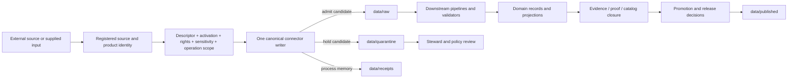

<!-- [KFM_META_BLOCK_V2]
doc_id: kfm://doc/adr-scaffold-connectors-domain-segment
title: "ADR-NNNN — Connector Lanes Are Source- and Product-Scoped, Not Domain-Segmented"
type: adr-scaffold
adr_id: ADR-NNNN
version: v1.1
status: not-assigned
effective_decision_status: not-assigned
owners:
  - "NEEDS VERIFICATION — architecture decision owner"
  - "NEEDS VERIFICATION — connector and source-admission steward"
  - "NEEDS VERIFICATION — source registry steward"
  - "NEEDS VERIFICATION — migration and compatibility steward"
  - "NEEDS VERIFICATION — affected domain stewards"
owner_status: "CODEOWNERS routes review to @bartytime4life; accepted stewardship, decision quorum, source authority, and independent release review remain unverified"
reviewers_required:
  - Architecture steward
  - Docs steward
  - Connector and source-admission steward
  - Source registry steward
  - Contracts and schemas stewards
  - Directory-governance and migration reviewer
  - At least one affected domain steward
created: 2026-07-22
updated: 2026-08-14
policy_label: public
truth_posture: cite-or-abstain
owning_root: docs/
responsibility_root: docs/
responsibility: "Preserve an unassigned decision scaffold for connector topology and migration while distinguishing the accepted source-first placement doctrine from unresolved implementation, alias, domain-grouping, and convergence choices."
current_path: docs/adr/ADR-NNNN-connectors-domain-segment.md
supersedes: []
superseded_by: []
evidence_snapshot:
  repository: bartytime4life/Kansas-Frontier-Matrix
  base_ref: main
  base_commit: b7352aba93f7298bdd5a6ee6fd8de475b05c9e42
  target_prior_blob: 78e9ae4cb5afe10d1a48abde7f5647556b8e07a5
  adr_index_blob: 938c5894c36b99e14810918e2c550ab0e92d53b1
  adr_readme_blob: 793015c38f4066c2c23753d4e3dd26bcc890279d
  directory_rules_blob: fd49a0b83e55cef52c1124281f093e263526898d
  adr_0029_blob: a4de0d7a96b78da59cfc499d1025e1508afd8dd9
  root_registry_blob: 024f668b5f0a9239bafa4f8b09e2afd86300ff8c
  connectors_readme_blob: a28336f6c15e0234241a7844e5683a52c2fd5024
  connectors_domains_readme_blob: a8a384c6c19a22b393f02188123147a205e276ea
  connectors_fauna_readme_blob: 535e59d1de733c6fc717a8e5d3c2cd32d9cdfc46
  connectors_geology_readme_blob: 9575bec2c30a5f7a7a227ed4a48d548a00be83d1
  fauna_canonical_paths_blob: abfc6ddb2e958ea636ebc2e9e3705b59ec42c2ca
  connector_output_adr_blob: a3534bff3331ca2052bc6c5d179f354f021a52e3
  source_admission_adr_blob: b5c0ac83be6f00897ee626c46df2bf64f15d82f5
  source_authority_register_blob: 82c23722520922f5ca0dad7f37ed794d1c2edf81
  connector_gate_workflow_blob: dd3fd47b44ed5151aaa4ce72032a069f4b848190
  connector_gate_latest_run: 31824691955
  connector_gate_latest_head: b7352aba93f7298bdd5a6ee6fd8de475b05c9e42
  connector_gate_latest_result: "success; bounded no-network and static checks passed while connector-run receipt presence remained an explicit workflow hold"
inspection_boundary: >
  Current-session GitHub reads covered the exact target, ADR inventory and authoring
  contract, accepted ADR-0029 and adopted Directory Rules bytes, Root Registry,
  connector-root and domain-grouping READMEs, representative fauna, geology, and
  NOAA Storm Events topology records, source-admission and connector-output ADRs,
  the empty source-authority register, connector-gate workflow source, and its latest
  exact-main hosted jobs. No live connector, source endpoint, credential, source
  activation, registry service, lifecycle store, production receipt, release packet,
  deployment, public route, correction cascade, or rollback execution was exercised.
related:
  - docs/adr/README.md
  - docs/adr/INDEX.md
  - docs/adr/ADR-0012-connector-outputs-to-data-raw-or-data-quarantine-only.md
  - docs/adr/ADR-0017-source-descriptor-admission-process.md
  - docs/adr/ADR-0029-adopt-directory-governance-standard-v2.md
  - docs/doctrine/directory-rules.md
  - control_plane/root_registry.yaml
  - control_plane/source_authority_register.yaml
  - connectors/README.md
  - connectors/domains/README.md
  - connectors/fauna/README.md
  - connectors/geology/README.md
  - connectors/noaa-storm-events/README.md
  - docs/domains/fauna/CANONICAL_PATHS.md
  - data/registry/sources/README.md
  - packages/connectors-core/README.md
  - tools/validators/connector_gate/README.md
  - .github/workflows/connector-gate.yml
tags: [kfm, adr-scaffold, connectors, source-first, source-family, source-product, domain-segment, topology, alias, migration, source-admission, non-publisher]
notes:
  - "v1.1 is a same-path current-main evidence refresh. It preserves ADR-NNNN and not-assigned status, reserves no number, and changes no connector implementation or source state."
  - "Accepted ADR-0029 already adopts the source-first identity and connector-root placement rules. This scaffold is therefore narrowed to unresolved topology-profile, compatibility, and migration decisions."
  - "The repository remains mixed: source/product/provider lanes, direct domain-labeled compatibility paths, connectors/domains/, aliases, compound names, and nested implementation layouts coexist."
  - "connectors/fauna/ and connectors/geology/ explicitly classify themselves as source-first compatibility indexes, while connectors/domains/ still describes domain-scoped implementation grouping. That conflict is recorded rather than silently resolved."
  - "The latest connector-gate run passed its bounded checks at the evidence head; its explicit connector-run receipt-presence hold remains a non-effect, not a release defect."
  - "This update activates no source, migrates no path, assigns no source ID, writes no lifecycle data, and authorizes no release or publication."
[/KFM_META_BLOCK_V2] -->

<a id="top"></a>

# ADR-NNNN — Connector Lanes Are Source- and Product-Scoped, Not Domain-Segmented

> **Unassigned, narrowed decision scaffold.** Accepted Directory Rules already establish that source capture identity is source-first, connector code belongs under `connectors/`, and domain assignments live in descriptors and downstream projections. This scaffold does not re-decide that doctrine. It preserves the unresolved decision surface: how mixed connector paths, provider/product nesting, domain-labelled compatibility directories, `connectors/domains/`, aliases, source IDs, packages, tests, receipts, and consumers converge without duplicate authority or lost lineage.

[](#status)
[](#accepted-baseline)
[](#current-repository-evidence)
[](#domain-labelled-paths)
[](#hosted-workflow-evidence)
[](#current-implementation-maturity)
[](#authority-and-publication-boundary)

> [!IMPORTANT]
> **This remains an unassigned scaffold.** [`INDEX.md`](./INDEX.md) lists this exact path under **Unassigned scaffolds** with status `not-assigned`. `NNNN` reserves no number. A later assignment requires a separate numbering, rename, H1, index, validation, and review packet under the [`docs/adr/` operating contract](./README.md).

> [!NOTE]
> **The architectural baseline is no longer merely proposed.** Accepted [ADR-0029](./ADR-0029-adopt-directory-governance-standard-v2.md) adopts the exact Directory Rules bytes. Those rules state that source capture identity is source-first, one canonical `source_id` is registered once, connector implementation uses that identity or an explicit provider grouping, and domain assignments live in descriptors and downstream projections.

> [!CAUTION]
> **The repository has not converged to one topology.** Current paths include source families, products, distributions, provider groupings, compound names, direct domain-labelled compatibility indexes, `connectors/domains/`, nested source layouts, aliases, and README-only boundaries. Presence proves only presence; it does not prove canonicality, activation, or a safe bulk migration.

> [!WARNING]
> **Connector topology never grants source or publication authority.** A path, source ID, package, green workflow, exact digest, or successful transport does not admit a source, establish rights, create evidence closure, promote lifecycle state, release an artifact, or authorize a public route.

**Quick navigation:** [Status](#status) · [Decision posture](#decision-posture) · [Evidence](#evidence-boundary) · [Accepted baseline](#accepted-baseline) · [Repository state](#current-repository-evidence) · [Context](#context) · [Scope](#scope-and-non-decisions) · [Forces](#forces) · [Proposed convergence](#proposed-convergence-profile) · [Path model](#connector-path-model) · [Domain paths](#domain-labelled-paths) · [Lifecycle](#domain-routing-and-lifecycle-boundary) · [Workflow](#hosted-workflow-evidence) · [Maturity](#current-implementation-maturity) · [Consequences](#consequences) · [Alternatives](#alternatives-considered) · [Migration](#migration-and-convergence-plan) · [Acceptance](#acceptance-gates) · [Validation](#validation) · [Risks](#risk-ledger) · [Rollback](#rollback-and-supersession) · [Open work](#open-questions) · [References](#references) · [History](#revision-history)

---

<a id="status"></a>

## Status

| Field | Current value |
|---|---|
| **Tracked identity** | `ADR-NNNN` placeholder |
| **Tracked path** | `docs/adr/ADR-NNNN-connectors-domain-segment.md` |
| **Canonical index classification** | Explicit placeholder under **Unassigned scaffolds** |
| **Source / effective status** | `not-assigned` / `not-assigned` |
| **Number reservation** | None |
| **Accepted governing baseline** | ADR-0029 + exact Directory Rules v2 bytes |
| **Remaining decision class** | Connector topology profile, domain-path disposition, alias/identity convergence, and migration |
| **Current implementation posture** | Mixed topology; bounded source-edge implementation; partial enforcement; operational authority held |
| **Effect of this revision** | Documentation and evidence reconciliation only |
| **Release/publication effect** | None |
| **Supersedes / superseded by** | None / none |

<a id="decision-posture"></a>

### Decision posture: narrowed, not promoted

The original scaffold combined two questions that current evidence now separates:

1. **Where does connector authority come from?**
   **CONFIRMED / ACCEPTED:** `connectors/` owns source-specific fetch, capture, and admission implementation. Source identity is source-first. Domains are downstream assignments and consumers.

2. **How should the current mixed tree converge?**
   **NOT ASSIGNED / CONFLICTED:** exact provider/product nesting, direct domain-path disposition, `connectors/domains/`, aliases, source-ID grammar, package ownership, migration order, and compatibility exit criteria remain unresolved.

This file now records only the second question plus the non-effects needed to prevent the scaffold from being mistaken for an accepted migration decision.

[Back to top](#top)

---

<a id="evidence-boundary"></a>

## Evidence boundary

This edition is grounded at `main@b7352aba93f7298bdd5a6ee6fd8de475b05c9e42`. It uses current repository bytes and one exact-head hosted connector-gate run. It does not infer live source or runtime behavior from documentation.

### Truth labels

| Label | Use here |
|---|---|
| **CONFIRMED** | Verified from current repository bytes, accepted decision evidence, or exact-head workflow evidence |
| **ACCEPTED** | An effective reviewed decision, specifically ADR-0029 within its scope |
| **PROPOSED** | A future topology, migration rule, or compatibility disposition |
| **CONFLICTED** | Two or more current surfaces claim incompatible placement or responsibility |
| **NEEDS VERIFICATION** | A concrete inventory, consumer, authority, or runtime check remains |
| **UNKNOWN** | Available evidence cannot establish the claim |
| **HOLD** | Do not represent the capability or transition as graduated |

### Inspected surfaces

| Surface | Current evidence |
|---|---|
| ADR inventory | This path remains an explicit unassigned scaffold |
| ADR authoring contract | Numbering and assignment require a separate reviewed transition |
| Accepted Directory Rules | Source-first identity, connector-root ownership, domain-as-downstream-assignment, dependency and write limits |
| Root Registry | `root.connectors` is canonical for `source_connector`; validation profile `source_admission_only` |
| Connector root README | Mixed direct-child topology, bounded connectors-core, SourceArtifact, connector-gate, and open convergence work |
| `connectors/domains/` | Draft contract still allows domain-scoped implementation grouping |
| `connectors/fauna/` and `connectors/geology/` | Explicit documentation-only compatibility indexes; source-first implementation required |
| NOAA Storm Events | Concrete hyphen/underscore/provider-nesting and source-ID conflict; runtime and activation unproved |
| ADR-0012 | Connector payload effects remain RAW or QUARANTINE; receipts are separate process memory |
| ADR-0017 | Descriptor and fixture-first activation shapes exist; authority, active registry, policy, and runtime remain held |
| Source authority register | `PROPOSED` and empty: `entries: []` |
| Connector gate | Exact-main bounded tests passed; connector-run receipt presence remains an explicit hold |

[Back to top](#top)

---

<a id="accepted-baseline"></a>

## Accepted baseline

Accepted ADR-0029 makes the exact Directory Rules bytes authoritative for placement. The following rules therefore control this scaffold even though the scaffold itself is unassigned:

| Rule family | Accepted consequence |
|---|---|
| `DIR-SOURCE-001` | Source capture identity is source-first; one capture may support several domains without duplicate RAW bytes |
| `DIR-SOURCE-002` | A canonical `source_id` is registered once; connector implementation uses it or a declared provider grouping; domain assignments live in descriptors and downstream projections |
| `DIR-SOURCE-003` | Source identities/descriptors live under `data/registry/sources/`; human source guidance under `docs/sources/`; connector code under `connectors/` |
| `DIR-SCOPELANE-001` | Domains never become repository roots |
| Root Registry `root.connectors` | `connectors/` owns source-specific fetch, capture, and admission implementation |
| Dependency rule | Connectors may use packages, source contracts, schemas, and admission policy; they must not depend on processed/catalog writers, publishers, or UI |
| Write boundary | Connector effects end at governed RAW, QUARANTINE, or receipt handoff; later lifecycle and release authority are separate |

### What this baseline does not decide

It does not automatically determine:

- whether a provider gets one family directory or several product directories;
- whether a historical compound path becomes canonical, alias, compatibility path, or retired path;
- whether `connectors/domains/` may survive as a non-writable navigation view;
- which current domain-labelled paths contain executable code versus documentation only;
- which path aliases are still consumed;
- the canonical source-ID, path-slug, package-name, and registry-name crosswalk;
- whether broad convergence needs one numbered ADR or a series of source-family migrations;
- source rights, activation, sensitivity, evidence, release, or publication.

[Back to top](#top)

---

<a id="current-repository-evidence"></a>

## Current repository evidence

### Root and implementation evidence

| Surface | CONFIRMED current state | Safe conclusion |
|---|---|---|
| `connectors/` | Canonical root in the Root Registry | Correct owning root; no source activation implied |
| Connector direct children | Mixed family/product/domain/alias/compound/nested names | Topology requires classification before migration |
| `packages/connectors-core` | Internal `0.0.1`, no-network primitives, injected transport, SourceAdapter and SourceArtifact handoff tests | Useful bounded shared implementation; source-specific adoption and stable API unproved |
| SourceArtifact profile | Proposed contract/schema/validator/fixtures/workflow with exact synthetic byte binding | Candidate captured-byte integrity; not source admission or lifecycle authority |
| IngestReceipt validation | Validator/tests/fixture polarity execute in connector-gate | Receipt shape prerequisite; not connector-emitted persistence |
| SourceDescriptor | Rich singular shape plus plural compatibility alias and executable validation | Shape convergence; acceptance and active registry authority remain separate |
| SourceActivationDecision | Fixture-first contract/schema/validator/test slice | Candidate decision consistency only; actor/policy/review authority held |
| Source authority register | Present, `PROPOSED`, empty | Path presence or README detail cannot be called active source coverage |
| Connector gate | Exact-main run passed bounded jobs | Static/no-network evidence only; no live source, persistence, release, or publication |

### Topology profiles visible in the tree

| Profile | Representative shape | Current posture |
|---|---|---|
| Source family | `connectors/noaa/`, `connectors/usgs/`, `connectors/kansas/` | Potential provider coordination; product authority varies |
| Source product/distribution | `connectors/airnow/`, `connectors/ebird/`, `connectors/inaturalist/` | Source-first candidate homes; maturity must be inspected per lane |
| Compound source/product | `connectors/noaa-storm-events/`, `connectors/kgs_kdhe_wwc5/` | May encode useful identity but can collide with aliases/nesting |
| Language package layout | `connectors/<source>/src/<package>/` | Implementation layout inside a lane, not independent source authority |
| Direct domain-labelled path | `connectors/fauna/`, `connectors/geology/`, `connectors/hazards/` | Mixed; representative fauna/geology paths classify themselves as compatibility indexes |
| Domain grouping | `connectors/domains/` | Draft contract allows domain-scoped implementation; conflict remains |
| Alias/duplicate spelling | hyphen, underscore, acronym, provider/product variants | Requires one registered identity and migration crosswalk |
| Supplied/manual input | `connectors/local_upload/`, `connectors/manual_curation/` | Source-edge classes, not domains; separate rights and provenance burden |

No row above establishes that every path of that shape has the same maturity or disposition.

[Back to top](#top)

---

<a id="context"></a>

## Context

A source may support many KFM domains. NOAA products can support Atmosphere, Hazards, Hydrology, Agriculture, Habitat, and public-context views. KGS materials can support Geology, Hydrology, Hazards, Infrastructure, and Soil. Biodiversity portals can support Fauna, Flora, Habitat, Agriculture, and Archaeology-sensitive review.

Organizing acquisition by consuming domain creates predictable failure modes:

- duplicate retrieval and RAW captures;
- inconsistent source heads, checksums, rights records, and correction timing;
- multiple credentials and rate-limit implementations for one provider;
- divergent source IDs and receipts;
- competing fixtures and tests;
- selective correction or deactivation across only some domains;
- hidden source-role collapse;
- ambiguous package and owner boundaries.

Source-first identity avoids those failures only if provider/product distinctions remain real. A single oversized provider folder can become equally ambiguous when products have different endpoints, identities, cadence, terms, geometry, source roles, corrections, or consumers.

The target is therefore not “always flat” or “always nested.” It is **one source authority, explicit product boundaries, and no independent domain writer**.

[Back to top](#top)

---

<a id="scope-and-non-decisions"></a>

## Scope and non-decisions

### In scope

- connector path identity and authority;
- source-family, provider, product, distribution, endpoint-class, archive, feed, package, supplied-input, and alias profiles;
- direct domain-labelled paths and `connectors/domains/`;
- source-ID/path/package/registry crosswalks;
- one-capture/multi-domain routing;
- compatibility, deprecation, migration, consumer repair, and rollback expectations;
- connector non-publisher boundary;
- evidence needed before any migration.

### Out of scope

- assigning this scaffold an ADR number;
- accepting a new decision through this Markdown edit;
- moving, renaming, deleting, or freezing connector paths;
- choosing source rights, roles, terms, endpoints, credentials, cadence, or activation;
- defining SourceDescriptor, SourceActivationDecision, SourceArtifact, or IngestReceipt field shapes;
- implementing live transport, persistence, policy evaluation, evidence closure, release, deployment, or publication;
- declaring every current domain-labelled path equivalent;
- bulk-normalizing names without import, descriptor, source-ID, receipt, registry, data-lineage, and consumer evidence.

[Back to top](#top)

---

<a id="forces"></a>

## Forces

| Force | Required response |
|---|---|
| One upstream source serves many domains | Capture once; route downstream through descriptor and receipt references |
| One provider publishes materially distinct products | Allow explicit product boundaries without duplicating provider identity |
| Existing paths have consumers and history | Inventory before migration; preserve aliases and lineage where needed |
| Domain stewards need discoverability | Provide generated/navigation views, not a second implementation authority |
| Rights and sensitivity differ by product or operation | Keep product/operation-specific admission and review explicit |
| Connectors must remain non-publishers | Restrict direct effects and validate negative paths |
| Repository naming already drifts | Register source IDs, path slugs, package names, and aliases separately |
| Shared logic should not be copied | Use reviewed reusable packages; keep source-specific behavior in the source lane |
| Current implementation maturity is uneven | Classify each lane from bytes/tests/runs, not directory name |
| Correction and deactivation must propagate | Preserve one source identity and consumer graph across domains |

[Back to top](#top)

---

<a id="proposed-convergence-profile"></a>

## Proposed convergence profile

If this scaffold is assigned and accepted as a migration decision, it should adopt the following bounded profile.

1. **One registered source authority.** Each source family/product has one canonical `source_id`, with distinct path slug, package identifier, and historical aliases recorded explicitly.
2. **One writable connector implementation.** A source/product has one canonical writer. Compatibility paths delegate or redirect one way and emit no independent captures or receipts.
3. **Provider/product boundaries are evidence-driven.** Nesting is allowed only when the provider coordinator owns shared transport or discovery and product lanes retain distinct role, rights, cadence, source-head, fixtures, tests, correction, and receipt identity.
4. **Domain is routing metadata.** Domain assignments belong in descriptors, activation scope, candidate routing, receipts, pipelines, policies, tests, and lifecycle projections.
5. **Domain-labelled connector paths are non-authoritative by default.** They may remain as documentation/navigation or generated views; executable implementation requires an explicit accepted exception profile.
6. **`connectors/domains/` is held for new implementation.** Its current draft contract conflicts with the accepted source-first baseline. Until resolved, it must not gain a second implementation, descriptor, source ID, fixture, test, or receipt authority.
7. **Capture once, project many.** A single admitted source capture can reference multiple downstream domain consumers without duplicate RAW bytes.
8. **No topology-based activation.** Canonical path selection does not activate a source or approve rights, sensitivity, evidence, release, or public use.
9. **No silent migration.** Every move preserves identity, history, consumer compatibility, receipt lineage, correction state, and rollback.
10. **Finite disposition.** Each existing lane receives one of: `KEEP`, `SPLIT`, `MIGRATE`, `MIRROR`, `FREEZE`, `RETIRE`, `HOLD`, or `DENY`.

These are proposed migration semantics. The accepted Directory Rules placement outcomes remain the higher-authority vocabulary where they overlap.

[Back to top](#top)

---

<a id="connector-path-model"></a>

## Connector path model

### Admissible target shapes

```text
connectors/<source-id>/
connectors/<provider-id>/<product-id>/
connectors/<source-product-id>/          # when a registered compound identity is deliberate
connectors/<source-id>/src/<package>/    # language packaging inside the lane
```

### Path decision table

| Candidate path | Default disposition | Conditions |
|---|---|---|
| `connectors/<registered-source-id>/` | `KEEP` candidate | Unique writer; source identity, package, descriptor, fixtures, tests, receipts, and consumers agree |
| `connectors/<provider>/<product>/` | `KEEP` or `SPLIT` candidate | Provider coordination is real; product authority and correction remain explicit |
| `connectors/<source-product>/` | `KEEP`, `MIGRATE`, or `MIRROR` | Compound slug is registered and does not compete with provider nesting |
| `connectors/<domain>/` | `MIRROR`, `FREEZE`, `MIGRATE`, or `HOLD` | Documentation/navigation only unless an accepted exception grants implementation |
| `connectors/domains/<domain>/` | `HOLD` for new implementation | Current draft grouping conflicts with accepted source-first identity |
| Two spellings for one source/product | `MIGRATE` or `MIRROR` | Choose one writer; repair imports, descriptors, data lineage, receipts, tests, links, and consumers |
| One path mixing unrelated source products | `SPLIT` | Products have independent authority, rights, role, cadence, or correction |
| Empty symmetry scaffold | `DENY` or `RETIRE` | No owned artifact, consumer, validation need, or compatibility obligation |

### Identity crosswalk

A migration-ready source entry should record:

```yaml
source_id: <stable governed identity>
provider_id: <provider identity or null>
product_id: <product/distribution identity or null>
canonical_connector_path: <one writable path>
package_ids: []
historical_paths: []
path_aliases: []
descriptor_refs: []
activation_refs: []
fixture_roots: []
test_roots: []
receipt_profiles: []
raw_capture_refs: []
consumer_domains: []
consumer_pipelines: []
correction_refs: []
deprecation_state: <active|compatibility|deprecated|retired|held>
```

This is an illustrative decision record, not a new schema.

[Back to top](#top)

---

<a id="domain-labelled-paths"></a>

## Domain-labelled paths

### Current conflict

Two current documentation postures are incompatible:

| Surface | Current statement | Classification |
|---|---|---|
| `connectors/fauna/` | Documentation-only compatibility index; source-first implementation; local implementation forbidden | **ALIGNED with accepted baseline** |
| `connectors/geology/` | Documentation-only compatibility index; source-first implementation; local implementation forbidden | **ALIGNED with accepted baseline** |
| `docs/domains/fauna/CANONICAL_PATHS.md` | Connector implementations belong under `connectors/<source_id>/`, not `connectors/fauna/` | **ALIGNED with accepted baseline** |
| `connectors/domains/README.md` | Domain-scoped connector implementation may be grouped beneath `connectors/domains/` | **CONFLICTED** |
| Other direct domain-labelled children | Presence and README maturity vary | **NEEDS CLASSIFICATION** |

The conflict cannot be repaired by this scaffold's prose alone.

### Safe interim rule

Until a numbered decision or bounded migration packet resolves the conflict:

- do not add executable connector code beneath `connectors/domains/`;
- do not create new domain-labelled connector implementation trees;
- do not delete existing domain paths;
- allow documentation-only compatibility indexes that identify one-way canonical destinations;
- inspect every existing domain-labelled lane for code, descriptors, packages, fixtures, tests, imports, outputs, receipts, consumers, and history;
- quarantine new placement decisions as `HOLD` when source identity or ownership is unclear.

### Domain discoverability without duplicate authority

Domain stewards may receive discoverability through:

- descriptor fields and generated source-by-domain views;
- registry indexes;
- docs indexes;
- pipeline consumer maps;
- source-to-domain crosswalks;
- search and catalog projections;
- documentation-only compatibility pages with one-way links.

Those surfaces must not become a second connector writer, activation register, or receipt stream.

[Back to top](#top)

---

<a id="domain-routing-and-lifecycle-boundary"></a>

## Domain routing and lifecycle boundary



### Connector-owned concerns

- bounded transport or supplied-input capture;
- source-native identity, bytes, records, fields, geometry, time, flags, and source head;
- request, retry, redirect, timeout, byte, record, page, and cancellation limits;
- exact capture integrity;
- safe finite outcome and receipt-ready process metadata;
- intended RAW or QUARANTINE route;
- no-op, stale, rate-limit, conflict, malformed, deny, hold, abstain, and error behavior.

### Downstream-owned concerns

- cross-source normalization and joins;
- canonical domain semantics;
- EvidenceRef/EvidenceBundle closure;
- policy and review decisions;
- catalog and graph projections;
- public-safe transformation;
- promotion and release;
- public API, map, export, story, or AI response;
- correction, withdrawal, cache invalidation, and rollback execution.

No directory migration may collapse these responsibilities.

[Back to top](#top)

---

<a id="authority-and-publication-boundary"></a>

## Authority and publication boundary

A connector path can establish only an implementation location under adopted directory law. It cannot establish:

- source authority or source role;
- current terms, redistribution rights, consent, or attribution;
- sensitivity clearance or safe coordinate precision;
- activation permission;
- evidence sufficiency;
- policy allow;
- accountable review;
- lifecycle promotion;
- release or publication;
- public client access.

Public clients must continue to use governed APIs and release-approved carriers. They must not read connector directories, source registry internals, RAW, QUARANTINE, receipts, or candidate outputs as normal public surfaces.

[Back to top](#top)

---

<a id="hosted-workflow-evidence"></a>

## Hosted workflow evidence

The latest inspected connector-gate run is `31824691955` at exact head `b7352aba93f7298bdd5a6ee6fd8de475b05c9e42`.

| Job or step family | Result |
|---|---:|
| connectors-core compile/import | PASS |
| connectors-core deterministic no-network tests | PASS |
| bounded connector-output and legacy publication-target static checks | PASS |
| focused IngestReceipt validator tests | PASS |
| deterministic IngestReceipt fixture polarity | PASS |
| `connector-output-gate` job | PASS |
| `ingest-receipt-presence` job | PASS with explicit `CONNECTOR_RECEIPT_PRESENCE_HELD` outcome |

The second job's green result means the prerequisite checks passed and the hold was recorded correctly. It does **not** mean an actual connector run emitted, persisted, replayed, corrected, signed, or released an authoritative receipt.

No topology migration test, source-ID crosswalk validator, alias parity test, or domain-path disposition workflow is established by that run.

[Back to top](#top)

---

<a id="current-implementation-maturity"></a>

## Current implementation maturity

| Capability | Current state |
|---|---|
| ADR scaffold identity and index classification | **CONFIRMED / not assigned** |
| Source-first placement doctrine | **ACCEPTED through ADR-0029** |
| Canonical connector root | **CONFIRMED** |
| Root Registry projection | **CONFIRMED / projection only** |
| Recursive connector inventory and semantic classification | **NEEDS VERIFICATION** |
| One accepted source-ID/path/package/alias grammar | **NOT ESTABLISHED** |
| Direct domain-path disposition | **MIXED / PARTIAL** |
| `connectors/domains/` disposition | **CONFLICTED / HOLD** |
| SourceDescriptor executable shape | **CONFIRMED implementation / authority still proposed** |
| Fixture-first SourceActivationDecision | **CONFIRMED implementation / operational authority held** |
| Shared connectors-core | **PARTIAL / bounded internal implementation** |
| Static non-publisher enforcement | **PARTIAL / exact-main pass** |
| Runtime sink confinement | **UNKNOWN** |
| Connector-emitted receipt persistence | **HOLD** |
| Populated source authority register | **NOT MET — entries empty** |
| Active source coverage | **UNKNOWN** |
| Evidence-to-release connector proof slice | **NOT ESTABLISHED** |
| Production migration | **NONE performed by this scaffold** |
| Release or publication | **NONE proved** |

**Overall maturity:** accepted placement principle, mixed implementation topology, partial source-edge enforcement, unresolved migration authority.

[Back to top](#top)

---

<a id="consequences"></a>

## Consequences

### Positive

- One capture can support multiple domains without duplicate RAW bytes.
- Source rights, activation, correction, and deactivation can propagate through one identity.
- Provider-shared transport can be reused without flattening product roles.
- Domain code remains in domain packages and pipelines rather than source clients.
- Compatibility paths can preserve links without independent writers.
- Audits can distinguish source identity, path identity, package identity, and domain consumption.
- Migration becomes testable through explicit source/path/consumer crosswalks.

### Costs

- The current mixed tree needs a recursive inventory before any broad rename.
- Some source families need a coordinator plus distinct product lanes.
- Domain stewards need generated indexes instead of convenient implementation buckets.
- Imports, READMEs, descriptors, registries, fixtures, tests, workflows, receipts, RAW references, and consumers may need synchronized migration.
- Historical aliases may require a long compatibility window.
- Exact source rights and source-ID ownership require steward review, not path heuristics.
- The unassigned scaffold may prove redundant if bounded migration packets can implement accepted Directory Rules without a new architecture ADR.

[Back to top](#top)

---

<a id="alternatives-considered"></a>

## Alternatives considered

| Alternative | Disposition |
|---|---|
| Organize every connector by KFM domain | Rejected by accepted source-first identity; duplicates multi-domain sources and authority |
| Require every connector to be a flat direct child | Rejected; provider coordination and product-specific boundaries may justify nesting |
| Require every provider to be one monolithic directory | Rejected; materially distinct products may need independent role, rights, cadence, tests, and correction |
| Treat all existing paths as equally canonical | Rejected; presence is not authority and aliases must not remain independent writers |
| Delete domain-labelled paths immediately | Rejected; consumer, history, implementation, and compatibility evidence is incomplete |
| Keep `connectors/domains/` writable while also using source-first lanes | Rejected as an interim posture; creates parallel implementation authority |
| Use symbolic links as the migration model | Rejected as the default; portability, tooling, Windows, and ambiguous-write risks |
| Duplicate implementations and compare them indefinitely | Rejected; duplicate captures and receipts undermine deterministic identity |
| Encode domain in source ID | Rejected unless the upstream source itself is genuinely domain-specific; consuming domain is not source identity |
| Retire this scaffold immediately | Plausible later; first determine whether a numbered migration decision is still needed |

[Back to top](#top)

---

<a id="migration-and-convergence-plan"></a>

## Migration and convergence plan

No migration occurs in this update. A future implementation should use small, dependency-closed packets.

### Wave 0 — authority and inventory

- assign or retire this scaffold through the ADR process;
- freeze the evidence base and accepted Directory Rules;
- recursively classify connector paths as implementation, provider coordinator, product, supplied input, package, compatibility, alias, placeholder, deprecated, or held;
- record source IDs, package IDs, descriptors, fixtures, tests, workflows, receipts, RAW references, imports, and consumers;
- identify live or credentialed behavior without executing unapproved network calls.

### Wave 1 — identity and profile decisions

- accept one source-ID/path/package/alias crosswalk contract;
- decide provider/product nesting criteria;
- decide `connectors/domains/` disposition;
- select canonical writer and compatibility target per conflicted source family;
- specify finite migration outcomes, deprecation state, retention, and rollback.

### Wave 2 — representative no-network migration

- choose one conflict-bearing, fixture-safe family;
- move or delegate one implementation without changing source identity;
- repair imports, descriptors, fixtures, tests, workflows, docs, and consumers;
- prove no duplicate capture, receipt, or source-head identity;
- preserve historical paths through a one-way compatibility surface only where required.

### Wave 3 — source-family batches

- migrate independently reviewable families;
- retain source/product roles and terms separately;
- validate RAW identity and downstream domain routing;
- emit migration receipts and update the alias register;
- keep source activation and release state unchanged unless separately reviewed.

### Wave 4 — domain-view convergence

- convert remaining direct domain paths to documentation/generated views or retire them after zero-consumer proof;
- resolve or retire `connectors/domains/`;
- add a machine topology validator only after the profile is accepted;
- reduce migration holds monotonically.

### Wave 5 — operational proof

- prove connector-run receipt persistence, replay, correction, deactivation, and rollback;
- prove forbidden later-lifecycle and public writes statically and at runtime;
- exercise one source-to-EvidenceRef-to-release thin slice without making connectors publishers.

[Back to top](#top)

---

<a id="acceptance-gates"></a>

## Acceptance gates

### Assigning this scaffold

- [ ] Select a unique ADR number without collision.
- [ ] Rename file and H1 in one reviewed packet.
- [ ] Update [`INDEX.md`](./INDEX.md) and any required register.
- [ ] Preserve source attribution and current evidence snapshot.
- [ ] Decide whether the record is an architecture decision, migration decision, or redundant scaffold.
- [ ] Obtain architecture, connector, source-registry, directory-governance, migration, and affected-domain review.

### Accepting a convergence profile

- [ ] Source-first accepted baseline is preserved.
- [ ] Provider/product nesting criteria are explicit.
- [ ] `connectors/domains/` disposition is explicit.
- [ ] Domain-labelled implementation and compatibility rules are explicit.
- [ ] One source-ID/path/package/alias identity model is chosen.
- [ ] One-writer and one-receipt-stream rules are testable.
- [ ] Source activation, rights, sensitivity, evidence, and release remain separate.
- [ ] Migration, correction, deprecation, retention, and rollback are specified.
- [ ] No accepted decision is inferred from this scaffold or a green workflow.

### Graduating implementation

- [ ] Recursive inventory and consumer graph are current.
- [ ] Representative migration passes exact positive and negative fixtures.
- [ ] Imports, descriptors, registry refs, tests, workflows, receipts, RAW references, and docs agree.
- [ ] Compatibility paths are one-way and non-writable.
- [ ] Duplicate captures and receipts are impossible for migrated identities.
- [ ] Connector runtime remains restricted to RAW, QUARANTINE, and governed receipt effects.
- [ ] Correction/deactivation and rollback drills pass.
- [ ] Public clients cannot reach connector or pre-release surfaces.

[Back to top](#top)

---

<a id="validation"></a>

## Validation

### Documentation and ADR checks

```bash
python tools/validators/validate_adr_index.py
python -m pytest tests/validators/test_validate_adr_index.py -q --strict-config --strict-markers
python tools/validators/docs/meta-block/check_meta_blocks.py \
  --repo-root . \
  --profile present \
  --registry control_plane/document_registry.yaml \
  --format markdown \
  README.md docs tools/validators/docs
```

Use repository-native documentation graph, stale-scan, link, and accessibility checks when triggered by the pull request. Command names remain subordinate to current workflow source.

### Current connector checks

```bash
python tools/ci/install_python_ci.py project-test
python tools/ci/install_python_ci.py connectors-core

python -m pytest \
  tests/packages/connectors_core \
  tests/policy/test_pipeline_connector_non_publisher.py \
  tests/validators/test_validate_ingest_receipt.py \
  -q --strict-config --strict-markers

python tools/validators/validate_ingest_receipt.py --fixtures
```

Those checks validate current bounded behavior, not the proposed topology migration.

### Future topology-specific checks

- exact source-ID/path/package/alias crosswalk polarity;
- one canonical writer per source/product;
- no duplicate package/import implementation;
- no duplicate SourceDescriptor or activation authority;
- no duplicate capture or receipt identity;
- compatibility paths contain no executable writers;
- domain views are generated or documentation-only;
- consumer and backlink closure;
- case, hyphen, underscore, acronym, and nested-path conflict fixtures;
- migration replay and rollback;
- no connector writes to WORK, PROCESSED, CATALOG, TRIPLETS, PROOFS, PUBLISHED, `release/`, API, UI, map, export, or AI sinks.

A green documentation check does not assign this ADR. A green connector check does not activate a source or approve release.

[Back to top](#top)

---

<a id="risk-ledger"></a>

## Risk ledger

| Risk | Current status | Control |
|---|---|---|
| Scaffold mistaken for accepted ADR | **OPEN** | Keep `ADR-NNNN`, `not-assigned`, and index classification visible |
| Accepted doctrine restated as merely proposed | **CORRECTED in v1.1** | Separate accepted baseline from unresolved migration |
| `connectors/domains/` gains parallel implementation | **CONFLICTED / HOLD** | Freeze new implementation pending decision |
| Domain compatibility paths gain code | **OPEN** | README contract, topology validator after acceptance, review |
| Bulk rename breaks imports or consumers | **OPEN** | Recursive inventory, staged migration, aliases, rollback |
| Two paths emit duplicate captures/receipts | **OPEN** | One-writer rule and deterministic identity tests |
| Source/product distinctions collapse | **OPEN** | Product-specific roles, rights, cadence, source heads, tests |
| Source ID changes with path | **OPEN** | Separate stable object identity from path and package |
| Empty register mistaken for inactive-everything proof | **OPEN** | Treat as absence of registered authority, not exhaustive operational fact |
| Green connector-gate mistaken for runtime confinement | **OPEN** | Preserve bounded claims and receipt-presence hold |
| Compatibility path never retires | **OPEN** | Named consumers, exit criteria, retention, sunset review |
| Sensitive source duplicated across domains | **HIGH** | Capture once; pre-render policy transforms; deny-by-default |
| Migration changes release/public state | **DENY** | Separate source, lifecycle, release, and public transitions |
| Decision becomes unnecessary | **OPEN** | Permit transparent scaffold retirement rather than assign by inertia |

[Back to top](#top)

---

<a id="rollback-and-supersession"></a>

## Rollback and supersession

### Documentation rollback

Before merge, close the draft pull request and abandon its branch. After an authorized merge, restore prior blob:

```text
78e9ae4cb5afe10d1a48abde7f5647556b8e07a5
```

or revert the documentation commit through a reviewed pull request. Reverting this file does not change accepted Directory Rules, connector code, source state, registry entries, lifecycle data, workflows, receipts, or releases.

### Future topology rollback

A migration rollback must:

1. stop writes through the migrated identity;
2. preserve source IDs, captures, receipts, source heads, corrections, and lineage;
3. restore the prior canonical writer or forward-fix to one writer;
4. restore imports, package exports, configuration, tests, and workflows;
5. maintain one-way compatibility without dual execution;
6. verify no duplicate capture or receipt was emitted;
7. update alias and migration records;
8. re-run affected connector, policy, lifecycle, and consumer tests;
9. propagate correction or deactivation when downstream artifacts relied on the faulty migration.

### Supersession or retirement of this scaffold

If a numbered ADR replaces this file, retain reciprocal lineage and update the index in the same reviewed change. If accepted Directory Rules and bounded migration records make a separate ADR unnecessary, retire this scaffold through the documented scaffold-cleanup process rather than inventing a decision number.

[Back to top](#top)

---

<a id="open-questions"></a>

## Open questions

1. Does broad connector-tree convergence require one numbered ADR, or can accepted Directory Rules plus source-family migration records govern it?
2. Should `connectors/domains/` become a read-only generated/navigation view, a compatibility lane with an expiry, or be retired after consumer closure?
3. Which direct domain-labelled paths are documentation-only today, and which contain executable or consumer-significant material?
4. What is the canonical source-ID/path/package/alias crosswalk object and owning authority?
5. What criteria choose provider nesting versus direct source-product lanes?
6. Which current paths are aliases, and which represent genuinely distinct products or authorities?
7. Which source-specific lanes consume `connectors-core`, and which need migration before a stable package API is declared?
8. Which connector checks are required by repository rules, and what runtime-confinement evidence is still missing?
9. What accepted IngestReceipt persistence, signing, replay, correction, and retention profile closes the current workflow hold?
10. Which source family provides the safest representative migration and proof-bearing connector slice?
11. Which external consumers or generated documents still depend on domain-labelled paths?
12. Who owns final source topology, migration approval, and independent release review?

[Back to top](#top)

---

<a id="references"></a>

## References

### Decision and directory authority

- [ADR operating contract](./README.md)
- [Canonical ADR index](./INDEX.md)
- [ADR-0029 — Adopt Directory Governance Standard v2](./ADR-0029-adopt-directory-governance-standard-v2.md)
- [Directory Rules](../doctrine/directory-rules.md)
- [Root Registry](../../control_plane/root_registry.yaml)

### Source-edge and admission boundaries

- [ADR-0012 — Connector outputs to RAW or QUARANTINE](./ADR-0012-connector-outputs-to-data-raw-or-data-quarantine-only.md)
- [ADR-0017 — Source Descriptor Admission Process](./ADR-0017-source-descriptor-admission-process.md)
- [Connector root README](../../connectors/README.md)
- [`connectors/domains/` README](../../connectors/domains/README.md)
- [Source authority register](../../control_plane/source_authority_register.yaml)
- [Source registry README](../../data/registry/sources/README.md)
- [connectors-core README](../../packages/connectors-core/README.md)
- [Connector gate workflow](../../.github/workflows/connector-gate.yml)

### Representative topology evidence

- [Fauna compatibility index](../../connectors/fauna/README.md)
- [Geology compatibility index](../../connectors/geology/README.md)
- [Fauna canonical paths register](../domains/fauna/CANONICAL_PATHS.md)
- [NOAA Storm Events boundary](../../connectors/noaa-storm-events/README.md)
- [Connector-gate validator README](../../tools/validators/connector_gate/README.md)

Planning sources support the source-first and one-capture/multi-domain rationale. Current repository bytes and accepted Directory Rules control claims about present authority and implementation maturity.

[Back to top](#top)

---

<a id="revision-history"></a>

## Revision history

| Version | Date | Summary |
|---|---|---|
| `v1.0` | 2026-07-24 | Replaced a thin inventory scaffold with a repository-grounded unassigned topology proposal; preserved `ADR-NNNN` and no-number-reservation boundary. |
| `v1.1` | 2026-08-14 | Separated the accepted source-first Directory Rules baseline from the still-unassigned migration decision; reconciled current Root Registry, connector-root, domain-grouping, fauna/geology compatibility, SourceDescriptor/activation, connectors-core, connector-gate exact-main success, empty authority-register, receipt hold, migration, risk, validation, rollback, and scaffold-retirement evidence. |

---

**Last updated:** 2026-08-14 · **Identity:** `ADR-NNNN` / `not-assigned` · **Accepted baseline:** source-first Directory Rules v2 · **Unresolved decision:** topology and migration convergence · **Implementation:** mixed / partial · **Publication:** none · [Back to top](#top)
